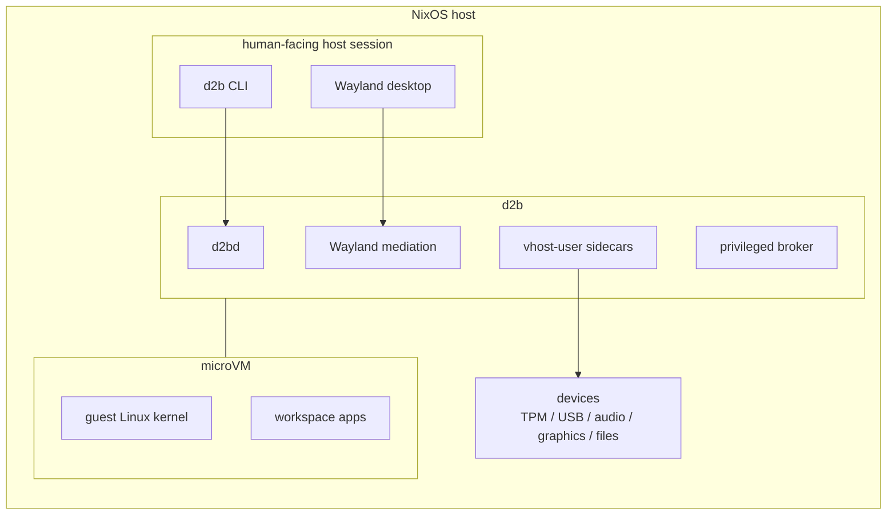

# d2b: Double Dutch Bus

**Multiple worlds, one desktop.**

d2b, short for Double Dutch Bus, is a Wayland-first desktop for people
who live and work across multiple trust boundaries: work, personal
life, autonomous agents, experimental development, risky browsing, and
other separate realms. Instead of mixing everything together or
carrying separate devices, you get on the bus.

Each realm runs inside a reasonably isolated microVM with its own
identity, network policy, files, devices, and risk profile. The
experience remains seamless: applications from those microVMs appear
and behave like ordinary applications on one integrated Wayland
desktop.

If Qubes OS is about reasonable security through compartments, d2b's
narrower promise is **reasonable isolation for a single-user NixOS
Wayland desktop**. It is not a new OS and not a Qubes replacement: it
composes into your existing NixOS host. Workloads run as Linux microVMs
with their own kernels, accelerated through `/dev/kvm` by
[Cloud Hypervisor] today. [crosvm] backs GPU/device sidecars today, and
the runner contract is shaped so additional VMM backends can fit later.

d2b gives you boundaries without device juggling:

- **Isolated networking:** per-env bridges, firewalling, and an
  auto-declared NAT/DHCP "net VM".
- **Isolated store views:** each guest sees a per-VM `/nix/store`
  hardlink farm containing only its own closure.
- **Mediated I/O:** software TPM, USB passthrough, audio, graphics,
  CTAPHID security-key proxying, and virtiofs file sharing are
  broker-supervised per-VM sidecars instead of ad-hoc host services.
- **One Wayland desktop:** graphical realms integrate with the host
  compositor without asking you to live in a separate desktop.
- **Shared UI colors:** d2b can emit a compositor-agnostic JSON and
  GTK-compatible CSS color contract so niri, Waybar, and desktop control
  tools use the same host/env/VM identity colors.
- **One operator surface:** the Rust `d2b` CLI talks to `d2bd`
  and the privileged broker for lifecycle, keys, USB, and host prep.
- **Persistent guest shells:** `d2b shell <vm>` can reconnect to
  named interactive guest shells when `guest.shell` is enabled.

Get on the bus: separate sides, shared experience.

At a high level:



**Quick start** (full walkthroughs under
[Quick start (Rust CLI / examples)](#quick-start-rust-cli--examples) and
[Quick start (template path)](#quick-start-template-path) below):

```bash
# after switching the host config from examples/personal-dev
sudo d2b vm start personal-dev --apply
```

Other entry points: see [Where to start](#where-to-start) below for a
table of the doc-friendly example aliases (`personal-dev`,
`graphics-workstation`, `multi-env`) plus the manual integration path.
For reconnectable interactive shells, see
[Use persistent guest shells](./docs/how-to/use-persistent-shells.md).
For browser WebAuthn with a host-attached YubiKey/security key, see
[Use the USB security-key proxy](./docs/how-to/use-usb-security-key.md).

## Who this is for

D2b targets the **single-user NixOS desktop** where the host is
trusted, but some workloads are not. It is for people who want to run
things on their computer that they do not completely trust — AI agents,
large dependency trees, risky browsing/dev environments, or work-required
software such as Intune — while keeping those workloads away from the
host OS and from each other.

Concretely:

- You want VM-grade workload boundaries without turning your daily
  desktop into a collection of separate VM consoles.
- You want to use untrusted or employer-required software on the same
  Wayland desktop while keeping the host OS as the trusted place where
  your real credentials, SSH keys, browser profile, and personal files
  live.
- You want the boring parts owned together: network topology,
  firewalling, per-VM store views, SSH keys, sidecar users, and the
  lifecycle CLI.
- You like the idea of Qubes-style compartmentalization, but you want a
  NixOS module that composes into your existing host instead of a new OS
  and Xen stack.
- You could build the pieces with raw microVMs, but you would rather
  declare "work" and "personal" environments and let the framework keep
  the host/guest boundary consistent.
- One human, one host. Multi-tenant trust boundaries are out of scope.
- Wayland-native. There is no X11 fallback for graphics VMs.
- Headless workloads also work — the same `d2b.envs.<env>`
  + `d2b.vms.<vm>` shape covers CI runners or
  background-service VMs without graphics + audio bits.

## What d2b is NOT

- **Not magic security for an insecure host.** D2b is only as secure
  as the host OS it composes into. If the host kernel, compositor, user
  session, or `d2b` launcher account is compromised, the VM boundary
  is no longer the main thing protecting you.
- **Not a multi-tenant trust boundary.** D2b assumes one human on one
  trusted host. It is not designed to isolate mutually suspicious local
  users from each other.
- **Not a Qubes replacement.** The "reasonably isolated" framing is a
  nod to Qubes, not an equivalence claim. Qubes is a security-oriented OS
  with Xen-based virtualization and a much larger security model; d2b
  is a NixOS module for trusted-host desktop compartmentalization.
- **Not a general VM, container, or app-sandbox manager.** Use
  [microvm.nix], [virt-manager], [GNOME Boxes], [Distrobox], [Flatpak],
  or NixOS containers when you want those shapes. D2b is the
  opinionated path for desktop workspaces with per-env networking,
  per-VM stores, mediated I/O, and one CLI.
- **Not officially supported.** Best-effort hobby project, one
  maintainer, no SLA. Pin to tagged releases.

## Project status

- **Maintainer:** one person
- **Tested on:** NixOS unstable. Runtime tested on `x86_64-linux`
  desktop; eval-tested for headless `aarch64-linux` (the cloud-
  hypervisor + crosvm runtime path is still x86_64-linux-only, but
  the headless eval graph is multi-arch clean).
- **CI:** flake-eval only; full E2E tests run on a private runtime
  host (the original development environment).

See [CHANGELOG.md](./CHANGELOG.md).

## Where to start

Pick the entry point that matches your situation. The checked flakes
and the doc-friendly alias READMEs all live in this repo; the manual
integration path below ("Manual integration") is for plugging
d2b into an existing host config.

| Path | Audience | Notes |
| --- | --- | --- |
| [`templates/default`](./templates/default) | New host, fastest setup | `nix flake init -t github:vicondoa/d2b` — sentinel TODOs + assertion gates |
| [`examples/personal-dev`](./examples/personal-dev) | Read-and-copy headless starter | Alias of the checked [`examples/minimal`](./examples/minimal) flake; VM name `personal-dev`. |
| [`examples/graphics-workstation`](./examples/graphics-workstation) | Desktop VM with Wayland + audio + USBIP | Requires a compositor on the host; `waylandUser` must be non-null. |
| [`examples/multi-env`](./examples/multi-env) | Two isolated envs (work + personal) | Demonstrates per-env isolation and route preflight. |
| [`examples/with-observability`](./examples/with-observability) | Single-host telemetry sink + monitored workload VM | Auto-declares the `sys-obs` VM (native SigNoz + ClickHouse) and wires host/guest OTel collectors over virtio-vsock. |

## Quick start (Rust CLI / examples)

The Rust CLI is now the primary documented operator surface. If you
want the exact names used throughout the migration docs, start from
one of these checked example layouts and use the native `vm start`
path:

```bash
# headless personal workspace (examples/personal-dev → examples/minimal)
sudo d2b vm start personal-dev --apply
```

The alias directory exists so the README, examples index, and migration
notes can use a stable VM name while CI keeps the checked flake in
`examples/minimal`.

## Quick start (template path)

The fastest way to a working d2b host:

```bash
mkdir my-d2b-host && cd my-d2b-host
nix flake init -t github:vicondoa/d2b
# Edit configuration.nix — fill in the 7 numbered TODOs.
# TODOs 2-3 are eval-enforced via assertions (hostname, user,
# SSH key). TODOs 1, 5-7 (hardware, network CIDRs) ship with
# plausible defaults you must still review before activation —
# see templates/default/README.md for the full table.
sudo nixos-rebuild build  --flake .#desktop
sudo nixos-rebuild switch --flake .#desktop
d2b list                          # corp-vm + sys-work-net
# NAME               ENV       GRAPHICS  TPM   USBIP   STATIC_IP       STATUS
# corp-vm            work      false     false false   10.20.0.10      stopped
# sys-work-net       work      false     false false   192.0.2.2       running (net-vm)
d2b status                        # same table + bridge-health footer
d2b vm start corp-vm --apply
```

The scaffold is ~150 lines and is documented inline. See
[`templates/default/README.md`](./templates/default/README.md) for
the full TODO walk-through.

## Manual integration (without the template)

If you're plugging d2b into an existing NixOS host config
rather than starting fresh, this is the minimum surface area.

**1. Add the flake input.** In your `flake.nix`:

```nix
{
  inputs = {
    nixpkgs.url = "github:NixOS/nixpkgs/nixos-unstable";
    d2b.url = "github:vicondoa/d2b";
    d2b.inputs.nixpkgs.follows = "nixpkgs";
  };

  outputs = { self, nixpkgs, d2b, ... }: {
    nixosConfigurations.desktop = nixpkgs.lib.nixosSystem {
      system = "x86_64-linux";
      modules = [
        d2b.nixosModules.default
        ./configuration.nix
      ];
    };
  };
}
```

**2. Drop in a `configuration.nix` block.** This is the minimum
d2b needs from you — pick a Wayland user (alice here) plus
one env + one VM. Everything else (sidecar users, SSH-key
generation, dnsmasq, NAT, firewall, the auto-declared
net VM) is materialised by the framework.

```nix
# configuration.nix
{ pkgs, ... }: {
  # Alice is your Plasma / Sway / Hyprland user.
  users.users.alice = {
    isNormalUser = true;
    uid = 1000;
    extraGroups = [ "wheel" "video" "audio" ];
  };

  # Tell d2b about Alice + add her to the d2b
  # system group. The broker uses SO_PEERCRED at accept time to
  # classify peers; nothing else (no polkit, no setuid).
  # 'd2b vm start <vm> --apply' works without sudo for
  # users in the d2b group.
  d2b.site = {
    waylandUser = "alice";
    launcherUsers = [ "alice" ];
    # Set true if you have a Yubikey and want USBIP passthrough.
    yubikey.enable = false;
  };

  # One env. Two CIDRs: a /30 for the host↔net-VM uplink,
  # a /24 for workload VMs on the LAN. RFC 5737 documentation
  # ranges are safe defaults for the uplink; pick whatever
  # 10.x or 192.168.x LAN you want for the workloads.
  d2b.envs.work = {
    lanSubnet    = "10.20.0.0/24";
    uplinkSubnet = "192.0.2.0/30";
  };

  # One workload VM in the env. ssh.keyPath is left null, so the
  # framework-managed key under d2b.site.keysDir is used.
  d2b.vms.corp-vm = {
    enable = true;
    env = "work";
    index = 10;                    # workload IP = 10.20.0.10
    ssh.user = "alice";
    config = { ... }: {
      networking.hostName = "corp-vm";
      users.users.alice = {
        isNormalUser = true;
        uid = 1000;
        # Inside the VM, give Alice a normal shell. The framework
        # injects the authorized SSH key automatically.
      };
    };
  };

  # Optional: declare your host's primary LAN so d2b's CIDR-
  # overlap assertion catches collisions at eval time.
  d2b.hostLanCidrs = [ "192.168.1.0/24" ];

  system.stateVersion = "25.11";
}
```

**3. Build it.**

```bash
sudo nixos-rebuild build --flake .#desktop
sudo nixos-rebuild switch --flake .#desktop
```

The activation creates `/var/lib/d2b/keys/corp-vm_ed25519`
(the framework-managed SSH key), spawns the `sys-work-net` net
VM, materialises `br-work-up` + `br-work-lan` bridges, and
installs the `d2b` CLI on your `$PATH`.

Guest configuration is still built on the host, but guest activation
stays inside the guest. The host build produces the VM's NixOS
`system.build.toplevel`; d2b's broker/store-view path publishes
that closure into the per-VM live store pool; virtiofs serves that pool
as the guest's `/nix/store`; and guestd activates the prepared toplevel
inside the running VM for `switch`, `test`, and live `rollback`.
Stopped VMs do not run live activation from the host: use `d2b boot
<vm> --apply` to stage the declared toplevel for the next start.

**4. Verify and use.**

```bash
d2b list                          # expect 'corp-vm' + 'sys-work-net'
# NAME               ENV       GRAPHICS  TPM   USBIP   STATIC_IP       STATUS
# corp-vm            work      false     false false   10.20.0.10      stopped
# sys-work-net       work      false     false false   192.0.2.2       running (net-vm)
d2b status                        # same table + "=== Bridge health ===" footer
d2b vm start corp-vm --apply      # preferred Rust CLI path
ssh -i /var/lib/d2b/keys/corp-vm_ed25519 alice@10.20.0.10 hostname
d2b vm stop corp-vm --apply       # clean shutdown
```

That's it. Add a second env or a second VM by repeating the
`d2b.envs.<env>` / `d2b.vms.<name>` blocks; the framework
deals with bridges, broker-spawned sidecars, SSH-key generation,
and dnsmasq in lockstep.

## Common gotchas

A handful of things consistently bite first-time users.

- **Same filesystem.** `/var/lib/d2b` must live on the same
  filesystem as `/nix/store`. The per-VM `/nix/store` hardlink
  farm refuses to start otherwise and there is no graceful
  fallback.
- **Wayland-only.** A graphics VM with `d2b.site.waylandUser
  = null` is an eval error. There is no X11 path; the GPU
  sidecar binds the host compositor's `/run/user/<uid>/wayland-0`
  socket directly.
- **`ssh.keyPath` default.** Leave it null and the framework-
  managed key under `${cfg.site.keysDir}/<vm>_ed25519` is used.
  Override only if you supply your own per-VM key. The CLI's
  `d2b keys rotate <vm>` only rotates the framework-managed
  key; consumer-supplied keys are untouched.
- **CIDR overlap is detected.** Two envs whose `lanSubnet` or
  `uplinkSubnet` overlap (including containment like
  `10.0.0.0/16` ⊃ `10.0.1.0/24`) is a hard eval error. Same
  for env-vs-host overlap. Pick non-overlapping ranges.
- **No autostart for graphics VMs.** `autostart = true` on a
  graphics VM is rejected — there is no Wayland session
  available at multi-user.target. Use `autostart = false` (the
  default) and `d2b vm start <vm> --apply` from a Plasma
  terminal.
- **D2b state is secret material.** `/var/lib/d2b/`
  contains per-VM SSH private keys and (for TPM-enabled VMs)
  swtpm state. Treat d2b state directories as secret
  material; back them up only to encrypted, access-controlled
  media.

## CLI overview

The Rust `d2b` CLI is the only operator surface. Run
`d2b --help` for the full command list and `d2b <COMMAND>
--help` for per-verb usage. Highlights:

- **Lifecycle**: `vm start`, `vm stop`, `vm restart`, `vm list`,
  plus the `up` / `down` / `restart` aliases.
- **Read-only**: `list`, `status`, `audit`, `auth status`,
  `host check`, `host doctor`, `keys list`, `keys show`.
- **Mutating** (require `--apply`): `switch`, `boot`, `test`,
  `rollback`, `gc`, `migrate`, `keys rotate`, `trust`,
  `rotate-known-host`, `host install`, `host prepare`,
  `host destroy`, `host reconcile`, `usb attach`, `usb detach`.
  `switch`, `test`, and live `rollback` require a running VM with the
  guest activation capability; `boot` is the offline staging verb.
- **Not yet implemented**: `console`, `audio status|mic|speaker|off`
  return a typed exit-78 envelope until the daemon-native surface
  ships. Argument parsing and shell completions still work.
- **Guest control** (admin-only): `vm exec` runs a command inside a
  VM over the authenticated guest-control vsock — no SSH —
  (`d2b vm exec <vm> -- <cmd…>`, or `d2b vm exec -it <vm> --
  bash -l` for an interactive PTY). It is restricted
  to callers in `d2b.site.adminUsers`, the role gate enforced via
  `SO_PEERCRED` at the daemon socket.

To enable guest exec on a VM: set `d2b.vms.<vm>.guest.control.enable
= true` and `guest.exec.enable = true` (the VM must have a workload user
via `ssh.user`); add your operator account to `d2b.site.adminUsers`;
rebuild and let the notify-ready daemon restart into the new generation
(or run `sudo systemctl restart d2bd` explicitly);
then start the VM on the guest-control generation and run the verbs.
Every exec runs the requested command as the VM's workload user
(`ssh.user`) — **never root** — inside a real PAM login session, so
graphical and login-shell workflows see the same environment an SSH
login would (`XDG_RUNTIME_DIR`, `WAYLAND_DISPLAY`, the login-shell
profile). Operators elevate with `sudo` inside the session.

Run-state ships in `/var/lib/d2b/`; per-host config emitted by
the NixOS module ships in `/etc/d2b/` (bundle + privileges +
processes JSON files consumed by `d2bd` / `d2b-priv-broker`).

For typed exit codes and JSON envelopes, see
[`docs/reference/cli-contract.md`](docs/reference/cli-contract.md).

## Documentation

Organised as a [Diataxis] tree under [`docs/`](docs/):

- **Tutorials / Examples** — [`examples/`](examples/) and
  [`templates/default/`](templates/default/).
- **How-to** — [`docs/how-to/`](docs/how-to/):
  [`install-nixos-tier1.md`](docs/how-to/install-nixos-tier1.md),
  [`host-prepare.md`](docs/how-to/host-prepare.md),
  [`migrating-from-microvm.md`](docs/how-to/migrating-from-microvm.md),
  [`enable-observability.md`](docs/how-to/enable-observability.md).
- **Reference** — [`docs/reference/`](docs/reference/): manifest
  schema, CLI contract, security runbook, error-envelope guidance,
  and per-component docs (graphics, tpm, usbip, audio,
  home-manager, observability).
- **Explanation** — [`docs/explanation/design.md`](docs/explanation/design.md):
  threat model + design rationale + *Why not X* FAQ.

For security disclosure, see [`SECURITY.md`](SECURITY.md).

### Which doc do I need?

| Goal                                  | Read                                                            |
|---------------------------------------|-----------------------------------------------------------------|
| New user, fastest start               | [`templates/default/`](templates/default/) → [`examples/personal-dev/`](examples/personal-dev/) |
| Migrating from `microvm.nix`          | [`docs/how-to/migrating-from-microvm.md`](docs/how-to/migrating-from-microvm.md) |
| Is this secure?                       | [`docs/explanation/design.md`](docs/explanation/design.md) → [`SECURITY.md`](SECURITY.md) |
| Security incident / USBIP emergency   | [`docs/reference/security-runbook.md`](docs/reference/security-runbook.md) |
| How does `<component>` work?          | [`docs/reference/components-<name>.md`](docs/reference/)        |
| Adding observability to an existing host | [`docs/how-to/enable-observability.md`](docs/how-to/enable-observability.md) → [`docs/reference/components-observability.md`](docs/reference/components-observability.md) |
| Manifest contract                     | [`docs/reference/manifest-schema.md`](docs/reference/manifest-schema.md) + [`manifest-schema.json`](docs/reference/manifest-schema.json) |
| CLI behaviour (exit codes, JSON)      | [`docs/reference/cli-contract.md`](docs/reference/cli-contract.md) |

[Diataxis]: https://diataxis.fr

## Acknowledgements

D2b's desktop-compartmentalization framing owes a debt to
[Spectrum OS], and to its lead Alyssa Ross, @alyssais.

## License

[Apache-2.0](./LICENSE).

## Further reading

- [CHANGELOG.md](./CHANGELOG.md) — release notes and known gaps.
- [SECURITY.md](./SECURITY.md) — threat model summary and reporting
  channel.

If you are an AI agent or human contributor working on this repo,
the operational manual lives in [`AGENTS.md`](./AGENTS.md) at the
repo root.

[microvm.nix]: https://github.com/microvm-nix/microvm.nix
[Cloud Hypervisor]: https://github.com/cloud-hypervisor/cloud-hypervisor
[crosvm]: https://github.com/google/crosvm
[Distrobox]: https://distrobox.it/
[Flatpak]: https://flatpak.org/
[virt-manager]: https://virt-manager.org/
[GNOME Boxes]: https://apps.gnome.org/Boxes/
[Spectrum OS]: https://spectrum-os.org/
[docs/explanation/design.md]: ./docs/explanation/design.md
