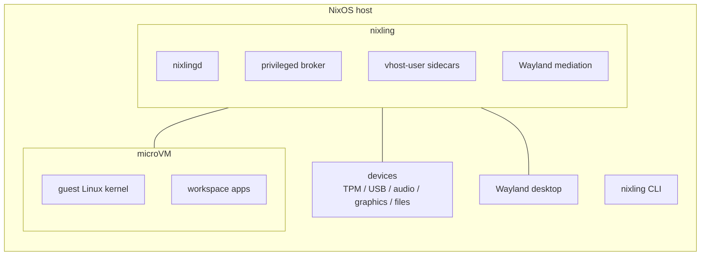

# nixling

**A reasonably isolated NixOS desktop microVM framework: isolated
networking and stores, mediated TPM/USB/audio/graphics, all on one
Wayland desktop.**

Nixling is for people who want one machine to hold separate workspaces
— work, personal, risky dev, corporate login — without turning every
boundary into a hand-built VM project. You declare envs and VMs in
NixOS; nixling builds the networks, keys, per-VM store views, sidecars,
and daily CLI around them.

If Qubes OS is about reasonable security through compartments, nixling's
narrower promise is **reasonable isolation for a single-user NixOS
Wayland desktop**. It is not a new OS and not a Qubes replacement: it
composes into your existing NixOS host. Workloads run as Linux microVMs
with their own kernels, accelerated through `/dev/kvm` by
[Cloud Hypervisor] today. [crosvm] backs GPU/device sidecars today, and
the runner contract is shaped so additional VMM backends can fit later.

Nixling gives you:

- **Isolated networking:** per-env bridges, firewalling, and an
  auto-declared NAT/DHCP "net VM".
- **Isolated store views:** each guest sees a per-VM `/nix/store`
  hardlink farm containing only its own closure.
- **Mediated I/O:** software TPM, USB passthrough, audio, graphics,
  and virtiofs file sharing are broker-supervised per-VM sidecars
  instead of ad-hoc host services.
- **One Wayland desktop:** graphical VMs integrate with the host
  compositor without asking you to live in a separate desktop.
- **One operator surface:** the Rust `nixling` CLI talks to `nixlingd`
  and the privileged broker for lifecycle, keys, USB, and host prep.

At a high level:



**Quick start** (full walkthroughs under
[Quick start (Rust CLI / examples)](#quick-start-rust-cli--examples) and
[Quick start (template path)](#quick-start-template-path) below):

```bash
# after switching the host config from examples/personal-dev
sudo nixling vm start personal-dev --apply

# after switching the host config from examples/work-entra
sudo nixling vm start work-entra --apply
```

Other entry points: see [Where to start](#where-to-start) below for a
table of the doc-friendly example aliases (`personal-dev`,
`graphics-workstation`, `multi-env`, `work-entra`) plus the manual
integration path.

## Why nixling?

Traditional desktop VMs tend to make you choose between isolation and
daily usability: either everything is separate and clunky, or everything
shares the same host session and trust boundary. Nixling tries to make
the useful middle boring: separate trust zones for workloads, one
Wayland desktop for the human.

- Put work, personal, and risky-dev environments on the same laptop
  without sharing their guest OS state or workload LANs.
- Give each workspace its own Linux kernel while still using the host
  CPU through KVM-backed VMMs.
- Keep host interaction intentional: graphics, audio, USB, TPM, and
  filesystem access are mediated by sandboxed host-side virtualization
  processes and brokered host operations.
- Stay Nix-native: VM config, network shape, keys, store closure, and
  control-plane manifests are derived from the same host flake.
- Use a daily CLI instead of a pile of per-VM scripts and one-off
  service templates.

## Who this is for

Nixling targets the **single-user NixOS desktop** who wants
isolated workspaces — work / personal / risky-dev — on the
same machine, each in its own microVM, with the host compositor
forwarding into the guest natively over Wayland. Concretely:

- One human, one host. Multi-tenant trust boundaries are
  out of scope (see *What nixling is NOT* below).
- Wayland-native. There is no X11 fallback for graphics VMs.
- Headless workloads also work — the same `nixling.envs.<env>`
  + `nixling.vms.<vm>` shape covers CI runners or
  background-service VMs without graphics + audio bits.
- Microsoft Entra ID workspaces are supported via the sibling
  [`vicondoa/entrablau.nix`][entrablau] flake (composed
  per-VM, not auto-imported).

If you're after a multi-tenant or production-grade VM platform,
look at raw [microvm.nix], NixOS containers, or
[Qubes OS](https://www.qubes-os.org/).

## What nixling is NOT

- **Not a multi-tenant trust boundary** against a malicious local
  launcher user. SSH keys are readable by anyone in the
  `nixling` system group (the broker uses `SO_PEERCRED`
  at accept time to classify peers as `launcher`/`admin`/`deny`) —
  see [docs/explanation/design.md] for the full threat model.
- **Not a server-VM platform.** Use NixOps or raw microvm.nix.
- **Not a Qubes replacement.** The "reasonably isolated" framing is a
  nod to Qubes, not an equivalence claim. Nixling shares the host
  kernel; Qubes uses Xen hypervisor isolation.
- **Not OCI / container isolation.** Nixling targets full-VM
  boundaries (cloud-hypervisor / crosvm) for kernel-level
  separation between workloads; containers share the host kernel
  surface.
- **Not Spectrum OS or a full OS distribution.** Nixling is a
  framework you compose into an existing NixOS host config; it
  does not replace the host's installer, init, or filesystem
  layout.
- **Not officially supported.** Best-effort hobby project, one
  maintainer, no SLA. Pin to tagged releases.

## Project status

- **Maintainer:** one person
- **Tested on:** NixOS unstable. Runtime tested on `x86_64-linux`
  desktop; eval-tested for headless `aarch64-linux` (the cloud-
  hypervisor + crosvm runtime path is still x86_64-linux-only, but
  the headless eval graph is multi-arch clean).
- **CI:** flake-eval only; full E2E tests run on a private runtime
  host (the original development environment).

See [CHANGELOG.md](./CHANGELOG.md).

## Where to start

Pick the entry point that matches your situation. The checked flakes
and the doc-friendly alias READMEs all live in this repo; the manual
integration path below ("Manual integration") is for plugging
nixling into an existing host config.

| Path | Audience | Notes |
| --- | --- | --- |
| [`templates/default`](./templates/default) | New host, fastest setup | `nix flake init -t github:vicondoa/nixling` — sentinel TODOs + assertion gates |
| [`examples/personal-dev`](./examples/personal-dev) | Read-and-copy headless starter | Alias of the checked [`examples/minimal`](./examples/minimal) flake; VM name `personal-dev`. |
| [`examples/graphics-workstation`](./examples/graphics-workstation) | Desktop VM with Wayland + audio + USBIP | Requires a compositor on the host; `waylandUser` must be non-null. |
| [`examples/multi-env`](./examples/multi-env) | Two isolated envs (work + personal) | Demonstrates per-env isolation and route preflight. |
| [`examples/work-entra`](./examples/work-entra) | Entra-ID-joined work VM via the sibling flake | Alias of the checked [`examples/with-entra-id`](./examples/with-entra-id) flake; VM name `work-entra`. |
| [`examples/with-observability`](./examples/with-observability) | Single-host telemetry sink + monitored workload VM | Auto-declares the `sys-obs-stack` VM (Grafana/Prometheus/Loki/Tempo) and wires per-VM Alloy agents over virtio-vsock. |

## Quick start (Rust CLI / examples)

The Rust CLI is now the primary documented operator surface. If you
want the exact names used throughout the migration docs, start from
one of these checked example layouts and use the native `vm start`
path:

```bash
# headless personal workspace (examples/personal-dev → examples/minimal)
sudo nixling vm start personal-dev --apply

# Entra workspace (examples/work-entra → examples/with-entra-id)
sudo nixling vm start work-entra --apply
```

Those alias directories exist so the README, examples index, and
migration notes can use stable VM names while CI keeps the checked
flakes in `examples/minimal` and `examples/with-entra-id`.

## Quick start (template path)

The fastest way to a working nixling host:

```bash
mkdir my-nixling-host && cd my-nixling-host
nix flake init -t github:vicondoa/nixling
# Edit configuration.nix — fill in the 7 numbered TODOs.
# TODOs 2-3 are eval-enforced via assertions (hostname, user,
# SSH key). TODOs 1, 5-7 (hardware, network CIDRs) ship with
# plausible defaults you must still review before activation —
# see templates/default/README.md for the full table.
sudo nixos-rebuild build  --flake .#desktop
sudo nixos-rebuild switch --flake .#desktop
nixling list                          # corp-vm + sys-work-net
# NAME               ENV       GRAPHICS  TPM   USBIP   STATIC_IP       STATUS
# corp-vm            work      false     false false   10.20.0.10      stopped
# sys-work-net       work      false     false false   192.0.2.2       systemd (net-vm)
nixling status                        # same table + bridge-health footer
sudo nixling vm start corp-vm --apply
```

The scaffold is ~150 lines and is documented inline. See
[`templates/default/README.md`](./templates/default/README.md) for
the full TODO walk-through.

## Manual integration (without the template)

If you're plugging nixling into an existing NixOS host config
rather than starting fresh, this is the minimum surface area.

**1. Add the flake input.** In your `flake.nix`:

```nix
{
  inputs = {
    nixpkgs.url = "github:NixOS/nixpkgs/nixos-unstable";
    nixling.url = "github:vicondoa/nixling";
    nixling.inputs.nixpkgs.follows = "nixpkgs";
  };

  outputs = { self, nixpkgs, nixling, ... }: {
    nixosConfigurations.desktop = nixpkgs.lib.nixosSystem {
      system = "x86_64-linux";
      modules = [
        nixling.nixosModules.default
        ./configuration.nix
      ];
    };
  };
}
```

**2. Drop in a `configuration.nix` block.** This is the minimum
nixling needs from you — pick a Wayland user (alice here) plus
one env + one VM. Everything else (sidecar users, SSH-key
generation, dnsmasq, NAT, firewall, the auto-declared
net VM) is materialised by the framework.

```nix
# configuration.nix
{ pkgs, ... }: {
  # Alice is your Plasma / Sway / Hyprland user.
  users.users.alice = {
    isNormalUser = true;
    uid = 1000;
    extraGroups = [ "wheel" "video" "audio" ];
  };

  # Tell nixling about Alice + add her to the nixling
  # system group. The broker uses SO_PEERCRED at accept time to
  # classify peers; nothing else (no polkit, no setuid).
  # 'nixling vm start <vm> --apply' works without sudo for
  # users in the nixling group.
  nixling.site = {
    waylandUser = "alice";
    launcherUsers = [ "alice" ];
    # Set true if you have a Yubikey and want USBIP passthrough.
    yubikey.enable = false;
  };

  # One env. Two CIDRs: a /30 for the host↔net-VM uplink,
  # a /24 for workload VMs on the LAN. RFC 5737 documentation
  # ranges are safe defaults for the uplink; pick whatever
  # 10.x or 192.168.x LAN you want for the workloads.
  nixling.envs.work = {
    lanSubnet    = "10.20.0.0/24";
    uplinkSubnet = "192.0.2.0/30";
  };

  # One workload VM in the env. ssh.keyPath is left null, so the
  # framework-managed key under nixling.site.keysDir is used.
  nixling.vms.corp-vm = {
    enable = true;
    env = "work";
    index = 10;                    # workload IP = 10.20.0.10
    ssh.user = "alice";
    config = { ... }: {
      networking.hostName = "corp-vm";
      users.users.alice = {
        isNormalUser = true;
        uid = 1000;
        # Inside the VM, give Alice a normal shell. The framework
        # injects the authorized SSH key automatically.
      };
    };
  };

  # Optional: declare your host's primary LAN so nixling's CIDR-
  # overlap assertion catches collisions at eval time.
  nixling.hostLanCidrs = [ "192.168.1.0/24" ];

  system.stateVersion = "25.11";
}
```

**3. Build it.**

```bash
sudo nixos-rebuild build --flake .#desktop
sudo nixos-rebuild switch --flake .#desktop
```

The activation creates `/var/lib/nixling/keys/corp-vm_ed25519`
(the framework-managed SSH key), spawns the `sys-work-net` net
VM, materialises `br-work-up` + `br-work-lan` bridges, and
installs the `nixling` CLI on your `$PATH`.

**4. Verify and use.**

```bash
nixling list                          # expect 'corp-vm' + 'sys-work-net'
# NAME               ENV       GRAPHICS  TPM   USBIP   STATIC_IP       STATUS
# corp-vm            work      false     false false   10.20.0.10      stopped
# sys-work-net       work      false     false false   192.0.2.2       systemd (net-vm)
nixling status                        # same table + "=== Bridge health ===" footer
nixling vm start corp-vm --apply      # preferred Rust CLI path
ssh -i /var/lib/nixling/keys/corp-vm_ed25519 alice@10.20.0.10 hostname
nixling vm stop corp-vm --apply       # clean shutdown
```

That's it. Add a second env or a second VM by repeating the
`nixling.envs.<env>` / `nixling.vms.<name>` blocks; the framework
deals with bridges, broker-spawned sidecars, SSH-key generation,
and dnsmasq in lockstep.

## Common gotchas

A handful of things consistently bite first-time users.

- **Same filesystem.** `/var/lib/nixling` must live on the same
  filesystem as `/nix/store`. The per-VM `/nix/store` hardlink
  farm refuses to start otherwise and there is no graceful
  fallback.
- **Wayland-only.** A graphics VM with `nixling.site.waylandUser
  = null` is an eval error. There is no X11 path; the GPU
  sidecar binds the host compositor's `/run/user/<uid>/wayland-0`
  socket directly.
- **`ssh.keyPath` default.** Leave it null and the framework-
  managed key under `${cfg.site.keysDir}/<vm>_ed25519` is used.
  Override only if you supply your own per-VM key. The CLI's
  `nixling keys rotate <vm>` only rotates the framework-managed
  key; consumer-supplied keys are untouched.
- **CIDR overlap is detected.** Two envs whose `lanSubnet` or
  `uplinkSubnet` overlap (including containment like
  `10.0.0.0/16` ⊃ `10.0.1.0/24`) is a hard eval error. Same
  for env-vs-host overlap. Pick non-overlapping ranges.
- **No autostart for graphics VMs.** `autostart = true` on a
  graphics VM is rejected — there is no Wayland session
  available at multi-user.target. Use `autostart = false` (the
  default) and `nixling vm start <vm> --apply` from a Plasma
  terminal.
- **Nixling state is secret material.** `/var/lib/nixling/`
  contains per-VM SSH private keys and (for TPM-enabled VMs)
  swtpm state. Treat nixling state directories as secret
  material; back them up only to encrypted, access-controlled
  media.

## CLI overview

The Rust `nixling` CLI is the only operator surface. Run
`nixling --help` for the full command list and `nixling <COMMAND>
--help` for per-verb usage. Highlights:

- **Lifecycle**: `vm start`, `vm stop`, `vm restart`, `vm list`,
  plus the `up` / `down` / `restart` aliases.
- **Read-only**: `list`, `status`, `audit`, `auth status`,
  `host check`, `host doctor`, `keys list`, `keys show`.
- **Mutating** (require `--apply`): `switch`, `boot`, `test`,
  `rollback`, `gc`, `migrate`, `keys rotate`, `trust`,
  `rotate-known-host`, `host install`, `host prepare`,
  `host destroy`, `host reconcile`, `usb attach`, `usb detach`.
- **Not yet implemented**: `console`, `audio status|mic|speaker|off`
  return a typed exit-78 envelope until the daemon-native surface
  ships. Argument parsing and shell completions still work.

Run-state ships in `/var/lib/nixling/`; per-host config emitted by
the NixOS module ships in `/etc/nixling/` (bundle + privileges +
processes JSON files consumed by `nixlingd` / `nixling-priv-broker`).

For typed exit codes and JSON envelopes, see
[`docs/reference/cli-contract.md`](docs/reference/cli-contract.md).


## Companion flakes

- [`vicondoa/entrablau.nix`][entrablau] — unofficial, framework-
  agnostic NixOS module bundle for Microsoft Entra ID auth (via
  Himmelblau) with Intune compliance shimming. Optional. Compose it
  by importing its `nixosModules.default` inside a nixling workload
  VM's `nixling.vms.<name>.config.imports`. The two flakes know
  nothing about each other — composition happens in your consumer
  flake.

## Documentation

Organised as a [Diataxis] tree under [`docs/`](docs/):

- **Tutorials / Examples** — [`examples/`](examples/) and
  [`templates/default/`](templates/default/).
- **How-to** — [`docs/how-to/`](docs/how-to/):
  [`install-nixos-tier1.md`](docs/how-to/install-nixos-tier1.md),
  [`host-prepare.md`](docs/how-to/host-prepare.md),
  [`migrating-from-microvm.md`](docs/how-to/migrating-from-microvm.md),
  [`enable-observability.md`](docs/how-to/enable-observability.md).
- **Reference** — [`docs/reference/`](docs/reference/): manifest
  schema, CLI contract, security runbook, error-envelope guidance,
  and per-component docs (graphics, tpm, usbip, audio,
  home-manager, observability).
- **Explanation** — [`docs/explanation/design.md`](docs/explanation/design.md):
  threat model + design rationale + *Why not X* FAQ.

For security disclosure, see [`SECURITY.md`](SECURITY.md).

### Which doc do I need?

| Goal                                  | Read                                                            |
|---------------------------------------|-----------------------------------------------------------------|
| New user, fastest start               | [`templates/default/`](templates/default/) → [`examples/personal-dev/`](examples/personal-dev/) |
| Migrating from `microvm.nix`          | [`docs/how-to/migrating-from-microvm.md`](docs/how-to/migrating-from-microvm.md) |
| Is this secure?                       | [`docs/explanation/design.md`](docs/explanation/design.md) → [`SECURITY.md`](SECURITY.md) |
| Security incident / USBIP emergency   | [`docs/reference/security-runbook.md`](docs/reference/security-runbook.md) |
| How does `<component>` work?          | [`docs/reference/components-<name>.md`](docs/reference/)        |
| Adding observability to an existing host | [`docs/how-to/enable-observability.md`](docs/how-to/enable-observability.md) → [`docs/reference/components-observability.md`](docs/reference/components-observability.md) |
| Manifest contract                     | [`docs/reference/manifest-schema.md`](docs/reference/manifest-schema.md) + [`manifest-schema.json`](docs/reference/manifest-schema.json) |
| CLI behaviour (exit codes, JSON)      | [`docs/reference/cli-contract.md`](docs/reference/cli-contract.md) |

[Diataxis]: https://diataxis.fr

## License

[Apache-2.0](./LICENSE).

## Further reading

- [CHANGELOG.md](./CHANGELOG.md) — release notes and known gaps.
- [SECURITY.md](./SECURITY.md) — threat model summary and reporting
  channel.

If you are an AI agent or human contributor working on this repo,
the operational manual lives in [`AGENTS.md`](./AGENTS.md) at the
repo root.

[microvm.nix]: https://github.com/microvm-nix/microvm.nix
[Cloud Hypervisor]: https://github.com/cloud-hypervisor/cloud-hypervisor
[crosvm]: https://github.com/google/crosvm
[entrablau]: https://github.com/vicondoa/entrablau.nix
[docs/explanation/design.md]: ./docs/explanation/design.md
