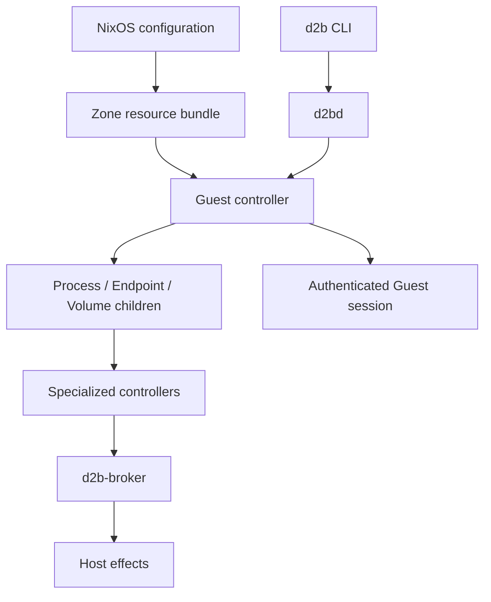

# d2b: Double Dutch Bus

**Multiple worlds, one desktop.**

d2b is an opinionated NixOS framework for one trusted Wayland host and
untrusted, isolated workloads. **Zone** and **Zone-owned resources** are the
only active product and control-plane hierarchy. A Zone owns its Guests,
Processes, Providers, Networks, Devices, Volumes, identities, policy, state,
and audit boundary.

The daemon-only control plane is `d2bd` plus `d2b-broker`. Nix declares
semantic resources and immutable artifacts; the Guest controller derives its
owned child Resources; specialized controllers perform effects through the
broker. No public API carries raw host paths, credentials, executable
arguments, or private runtime identifiers.

## Why d2b

d2b gives a single-user NixOS Wayland desktop VM-grade workload boundaries
without separate desktop sessions:

- **Zone-owned resources** define trust, routing, identity, files, devices, and
  process placement.
- **Controller-owned Guest lifecycle** creates and reconciles the complete
  child Resource graph through the authenticated Resource API.
- **Isolated Guest stores** expose only each Guest's declared closure.
- **Mediated I/O** keeps TPM, USB, audio, graphics, security-key, and virtiofs
  effects behind typed Providers and broker operations.
- **One operator surface** is the Rust `d2b` CLI over the daemon public socket.

Generic words such as work or personal can describe workload context, but they
are not another d2b hierarchy.

## Current architecture


```mermaid
flowchart TB
    nix["NixOS configuration"] --> zone["Zone resource bundle"]
    zone --> controller["Guest controller"]
    controller --> children["Process / Endpoint / Volume children"]
    children --> effects["Specialized controllers"]
    effects --> broker["d2b-broker"]
    cli["d2b CLI"] --> daemon["d2bd"]
    daemon --> controller
    broker --> host["Host effects"]
    controller --> guest["Authenticated Guest session"]
```

The Guest controller observes child status and owns lifecycle state. It does
not spawn processes, mount storage, bind sockets, provision devices, or call
the broker directly. A Guest becomes Ready only when its current-generation
dependencies and authenticated Guest session are ready.

## Quick start

Start with [`examples/minimal`](./examples/minimal), or copy
[`templates/default`](./templates/default) into a host flake:

```bash
nix flake init -t github:vicondoa/d2b
# edit configuration.nix, then:
sudo nixos-rebuild switch --flake .#desktop
d2b guest list --zone local-root
d2b guest start personal-dev --zone local-root --apply
```

The smallest current resource declaration looks like this:

```nix
{ inputs, ... }:
let
  guestSystem = inputs.guestSystem;
  cloudHypervisorProvider = inputs.cloudHypervisorProvider;
in {
  d2b.artifacts = {
    guest-system = {
      package = guestSystem;
      type = "nixos-system";
    };
    cloud-hypervisor-provider = {
      package = cloudHypervisorProvider;
      type = "provider";
    };
  };

  d2b.zones.local-root.resources = {
    host = {
      type = "Host";
      spec.providerRef = "Provider/system-core";
    };
    runtime-cloud-hypervisor = {
      type = "Provider";
      spec = {
        artifactId = "cloud-hypervisor-provider";
        config.controllerExecutionRef = "Host/host";
      };
    };
    personal-dev = {
      type = "Guest";
      spec = {
        providerRef = "Provider/runtime-cloud-hypervisor";
        systemArtifactId = "guest-system";
      };
    };
  };

  # The evaluator is consumer-owned; the child graph is controller-owned.
  d2b.guestSystems.local-root.personal-dev = {
    config.system.build.toplevel = guestSystem;
  };
}
```

`system-core` and `system-minijail` are bootstrap Providers projected by d2b;
consumers do not hand-author them. A Guest's direct children are not duplicated
in Nix configuration.

## CLI

The Rust CLI is the only supported operator interface:

```bash
d2b zone list
d2b guest list --zone work
d2b guest status gateway --zone work
d2b guest start gateway --zone work --apply
d2b process list --zone work
d2b exec run Guest/gateway -- /bin/sh
d2b host doctor --read-only
d2b audit --json
```

Lifecycle operations require an explicit `--dry-run` or `--apply`. The daemon
checks Zone admission, Resource identity, Provider generation, revision, and
capability before mutation. Retries are idempotent and restart-safe.

## Security boundaries

The host is trusted; workloads are not. d2b is not a multi-tenant operating
system and does not make a compromised host safe. Gateway-backed isolation
keeps Gateway Guest credentials, remote registries, Provider configuration,
and Zone audit inside the relevant Guest execution context. Separate Zones do
not share a Gateway Guest or L2 bridge.

Host-mutable paths remain owned by their named single repair owner. Foreign
nftables, NetworkManager, systemd-networkd, cgroup, lock, and TPM state fails
closed rather than being overwritten.

## Repository map

- [`STRATEGY.md`](./STRATEGY.md) - product direction.
- [`docs/explanation/design.md`](./docs/explanation/design.md) - threat model
  and architecture.
- [`docs/reference/zone-control-nix.md`](./docs/reference/zone-control-nix.md)
  - current Nix resource authoring.
- [`docs/reference/daemon-api.md`](./docs/reference/daemon-api.md) - daemon
  protocol and lifecycle contracts.
- [`docs/reference/manifest-schema.md`](./docs/reference/manifest-schema.md)
  - versioned artifact manifest.
- [`docs/reference/cli-contract.md`](./docs/reference/cli-contract.md) - CLI
  JSON, errors, and lifecycle semantics.
- [`tests/AGENTS.md`](./tests/AGENTS.md) - test placement and gates.
- [`examples/`](./examples/) and [`templates/default`](./templates/default) -
  current consumer layouts.

The repository retains ADRs and migration notes for historical context. They
are not current product instructions; current code and the Zone references
above are authoritative.

## License

[Apache-2.0](./LICENSE).
