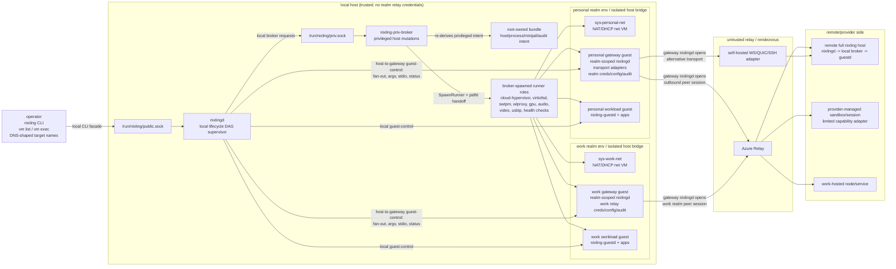

# 0032. nixling v2 constellation control plane

- Status: Accepted
- Date: 2026-06-14
- Related: ADR 0002 (non-root daemon and privileged broker), ADR 0010
  (wire protocol and typed errors), ADR 0015 (daemon-only clean break),
  ADR 0023 (runner-role lifecycle matrix), ADR 0025 (host-jailed
  Wayland filter proxy role), ADR 0026 (native SigNoz observability
  backend), ADR 0028 (guest control plane over virtio-vsock), ADR 0029
  (framework SSH operations to typed guest-control RPCs)

## Context

Nixling v1 is an optimized single-host desktop microVM framework. The
operator's local `nixling` CLI talks to `nixlingd` over the local public
Unix socket. `nixlingd` owns per-VM lifecycle DAGs and delegates
privileged host mutations to `nixling-priv-broker`. Guests run
`nixling-guestd`; framework guest control uses authenticated ttRPC over
virtio-vsock. Graphics VMs use local virtual I/O sidecars and, for the
Wayland path, a host-jailed Wayland proxy role.

That shape should remain the fast local path. The v2 goal is additive:
evolve nixling into a constellation of managed execution environments
without turning the local substrate into a remote overlay.

After design review, the constellation model is sharpened: the durable
control-plane process is still `nixlingd`. A constellation is **nixlingd
instances working together**. The old working label `nixlingk` is retired
as a separate component name; the new work is the `nixlingd`
constellation/peer protocol, provider abstraction set, and
transport/session machinery that let one `nixlingd` route work to another
`nixlingd` or provider adapter.

The new layer must respect the current security shape:

- the local daemon/broker API is local-only by construction
  (`SOCK_SEQPACKET`, strict framed JSON, typed errors, version
  negotiation);
- the guest-control protocol is local-to-host/guest and should not be
  stretched over the WAN;
- privileged host mutation remains broker-mediated and audited;
- display, audio, USB/HID, clipboard, file copy, logs, ports, and PTY
  streams are capabilities, not universal assumptions;
- work, personal, and provider-managed environments must not collapse
  into one routable network.

## Decision

Nixling v2 will evolve `nixlingd` into a transport-neutral constellation
daemon. The daemon's public API becomes the stable business-logic surface
for the CLI, a future web UI, local hosts, gateway guests, remote full
hosts, cloud control-plane nodes, and provider adapters. Daemon peers
carry explicit operations and named streams between authenticated
principals and capability-bearing nodes. They do not tunnel raw guest
ttRPC or local daemon/broker wire messages across WAN links.

The first production remote transport target is Azure Relay, used only as
an outbound relay/rendezvous transport. Azure Relay is not the
orchestration model and is not trusted to see plaintext operations. The
`nixlingd` peer-session layer must provide end-to-end authentication,
encryption, version negotiation, capability negotiation, scoped
authorization, and auditable identity context above any relay.

The v2 implementation will be staged. The first deliverables are
internal models, interfaces, tests, and local adapters that preserve
today's behavior. Remote transports, providers, display forwarding, and
realms arrive only after the operation/stream/authz model is in place.

## Entrypoint and component topology

The host entrypoint remains the `nixling` CLI for local VM lifecycle.
Realms have an **entrypoint mode**:

| Entrypoint mode | Where it runs | Use |
| --- | --- | --- |
| `host-resident` | Host `nixlingd` local fast path | Local-only or trusted-host realms whose workloads live on this host and do not require relay/provider credentials. |
| `gateway-guest` | Dedicated local nixling guest VM | Realms with remote nodes, provider integrations, work-managed credentials, or any trust boundary that should stay inside a microVM. |

The default for cross-host, work, and provider realms is a dedicated local
nixling guest VM: the **realm gateway**. The host daemon manages that
gateway VM like any other local workload, but it does not hold realm relay
credentials, remote node registries, provider configuration, or
constellation policy.

Inside the gateway guest lives a realm-scoped `nixlingd` instance plus
the constellation peer protocol/provider/transport libraries it uses: relay
transport code, node registry, provider configuration, credentials,
policy, and realm audit log. This keeps each realm's outward control
plane inside a microVM trust domain instead of placing it in the host
daemon.

`nixlingd` does not become a generic WAN relay daemon. Local hosts keep
the current Unix-socket fast path by default. In v2, however, `nixlingd`
may expose an explicit **daemon-access endpoint** for remote/cloud
administration: a transport-neutral CLI-facing control surface that can be
bound to the local Unix socket, direct mTLS/QUIC/WebSocket, SSH bootstrap,
or a relay-backed session. Daemon-access relay credentials are node
management credentials, not realm/provider workload credentials. Realm
relay transport code still belongs inside the gateway guest or inside
remote nodes.

One remote/work/provider realm maps to one gateway guest by default. A
shared gateway for multiple trust-boundary realms is a work/personal
collapse risk and is not part of this design. Host-resident realms are
allowed only when their policy explicitly says the host is the realm
entrypoint and no relay/provider credential is stored on the host.

Each gateway-backed realm maps to an isolated nixling environment/network
segment. A work gateway and a personal gateway must not share the same
host L2 bridge or broadcast domain. The existing per-env bridge model is
the natural boundary: one realm's gateway and realm-managed local
workloads live in a distinct env, with no cross-realm bridge membership,
L3 forwarding, or transitive route unless an explicit named operation or
stream is authorized. Host-resident realms that share the host fast path
must still preserve the existing env/network isolation between local VMs.

### Local-only command flow

Local inventory, lifecycle, config, guest-control, and display/device
operations stay on the existing fast path:

```text
nixling CLI
  -> local nixlingd over /run/nixling/public.sock
    -> nixling-priv-broker over /run/nixling/priv.sock
    -> local nixling-guestd over authenticated ttRPC/vsock
    -> local process roles for Wayland/audio/video/virtiofs/USBIP/etc.
```

No relay, peer session, or remote identity lookup is on this path.
Local operations must continue to work when constellation is disabled, a relay
is down, or a cloud provider is unreachable.

### Daemon-access command flow

The CLI command API is separate from its transport. The current
CLI-to-daemon transport is `/run/nixling/public.sock`; v2 treats that as
one `DaemonAccessTransport` binding rather than the only possible shape.

```text
nixling CLI or web UI
  -> Nixling API frontend transport
    -> local Unix socket          (current/default)
    -> direct mTLS/QUIC/WebSocket (future direct remote/cloud)
    -> relay-backed session       (future outbound-only remote/cloud)
    -> explicit SSH bootstrap     (setup/recovery only)
      -> nixlingd ApiService
        -> authn/authz context
        -> target resolver
        -> operation router
          -> local executor       (broker / guestd / runner paths)
          -> gateway peer         (realm-scoped nixlingd in gateway guest)
          -> remote daemon peer   (remote/cloud nixlingd)
          -> provider adapter     (managed sandbox/session)
```

This lets a future cloud-hosted `nixlingd` be controlled by the same
`nixling` CLI without pretending the local Unix socket exists. The remote
transport carries daemon API requests to that daemon; it does not expose
the broker socket and does not tunnel raw guest ttRPC. Once the request
arrives, that `nixlingd` still re-originates privileged work through its
own local broker and guest-control paths.

The daemon-access layer is distinct from realm gateways:

- **Daemon access** answers "how does the CLI reach a particular
  `nixlingd`?"
- **Realm/gateway routing** answers "which realm entrypoint owns this
  workload/provider operation?"

A local host can use only Unix-socket daemon access. A cloud host can
enable relay-backed daemon access so the operator CLI can reach its
`nixlingd` without inbound firewall holes. A work/provider realm can still
require a gateway guest for realm credentials and policy, even if the
remote host's daemon itself is relay-accessible.

Remote daemon access has the same "relay is untrusted" posture as
constellation peer sessions. Any non-local `DaemonAccessTransport`
binding, including relay-backed daemon access, MUST provide end-to-end
mutual authentication and encryption above the transport or relay. Relay
TLS or Azure Relay SAS is transport reachability only; it is not daemon
administrator authentication.

Remote daemon-access principals are authorized by an explicit daemon
access policy:

```text
remote daemon-access principal
  -> authenticated by daemon-access trust anchor
  -> mapped by daemon policy to admin / launcher / read-only / scoped role
  -> checked by ApiService before OperationRouter dispatch
```

There is no implicit "remote caller is Admin" rule. The local
`SO_PEERCRED` admin/launcher gate remains the local Unix binding's authn
source; remote bindings use certificate/token identity plus channel
binding, then map to equivalent daemon roles through policy.

For a browser web UI, the frontend still talks to `ApiService`, but the
browser session adds browser-specific controls: secure same-site session
cookies or equivalent channel-bound bearer tokens, anti-CSRF tokens plus
CSRF protection for state-changing requests, strict Origin/Host checks
(including WebSocket upgrade requests), short-lived session rotation, and
explicit revocation. Those web sessions map to the same daemon access
roles as CLI principals. Deployments should choose one web auth mode
(cookie or bearer) rather than mixing modes for the same origin.

### nixlingd internal architecture

To support CLI, web, local, gateway, and cloud uses without duplicating
business logic, `nixlingd` grows three internal layers:

```text
frontend transports
  local Unix / mTLS / WebSocket / QUIC / relay / SSH bootstrap
      |
      v
semantic API service
  typed requests: vm list, vm exec, vm start, host doctor,
  realm inspect, op inspect, provider operations
      |
      v
operation router
  target address -> dispatch target
      |
      +--> LocalExecutor
      |      local broker + local guest-control + local runners
      |
      +--> PeerDaemonExecutor
      |      constellation peer session to another nixlingd
      |
      +--> GatewayExecutor
      |      local guest-control into gateway's realm-scoped nixlingd
      |
      +--> ProviderExecutor
             provider-managed workload/session adapter
```

Code-level responsibilities:

| Layer | Responsibility | Current seam |
| --- | --- | --- |
| `ApiFrontend` | Accept connections, frame/decode requests, authenticate transport principal, produce `AuthenticatedRequest`. | Today this is `public.sock` parsing in `packages/nixlingd/src/wire.rs`. |
| `ApiService` | Own typed command semantics independent of transport. | Today logic is spread across `packages/nixlingd/src/lib.rs` command dispatch helpers. |
| `TargetResolver` | Parse target names, consult realm entrypoint table, return a `DispatchTarget`. | New v2 module; no provider or transport code. |
| `OperationRouter` | Route a semantic operation to local, gateway, peer daemon, or provider executor. | New v2 module. |
| `LocalExecutor` | Call local broker, local guest-control, local lifecycle DAG. | Existing daemon/broker/guest-control paths. |
| `PeerDaemonExecutor` | Open/reuse constellation peer sessions to another `nixlingd`, forward semantic operations, return typed results. | New v2 module using transport/session/codecs. |
| `GatewayExecutor` | Enter a local gateway VM and invoke its realm-scoped `nixlingd` API. | Existing local guest-control exec/PTY path plus v2 API binding. |
| `ProviderExecutor` | Call limited/full provider adapters when no full host daemon exists. | New v2 provider modules. |

`nixlingd` modes are configuration profiles over the same binary:

| Mode | Runs where | Enabled responsibilities |
| --- | --- | --- |
| `host` | Physical/local or remote full host | Local broker, local lifecycle, local guest-control, optional daemon-access listeners. |
| `gateway` | Realm gateway guest | Realm policy, provider credentials, relay sessions, peer daemon routing, optional realm OTel sink; no host broker for the physical host. |
| `cloud-control` | Cloud control-plane VM/service | API frontend, peer daemon routing, provider adapters, observability aggregation; local broker only if the substrate supports full-host capabilities. |
| `provider-agent` | Provider-managed sandbox/session | Minimal API/provider adapter surface; advertises limited capabilities only. |

The same `ApiService` and operation DTOs back CLI and web. A web UI
should not reimplement orchestration; it connects to a `nixlingd`
frontend transport and receives the same typed results as the CLI.

### Constellation command flow

Constellation commands first resolve the realm entrypoint. Host-resident
realms dispatch locally; gateway-backed realms execute from inside a realm
gateway:

```text
host nixling CLI
  -> local nixlingd resolves target name
    -> host-resident realm:
         local nixlingd applies realm policy and dispatches local workload
    -> gateway-backed realm:
         local nixlingd starts/enters gateway VM
           -> gateway guest runs realm-scoped nixlingd
             -> gateway transport provider opens outbound relay/direct session
               -> remote/cloud nixlingd or provider adapter on the target node
                 -> node-local adapter
                   -> local nixlingd/broker/guestd when the node is a full host
                   -> provider API/agent when the node is provider-managed
```

For host-resident realms, the host is the realm entrypoint and can enforce
local realm policy over local workloads without a remote constellation peer session.
For gateway-backed realms, the host's role is to make the gateway VM
available. The gateway's `nixlingd` owns the realm session and sends
constellation operations or named stream opens to peer `nixlingd` instances or
provider adapters. It never sends raw local daemon frames, broker
requests, or guest ttRPC frames over the transport. A target `nixlingd`
verifies identity, authorizes the operation for its realm/capabilities,
then re-originates the local effect inside the target environment.

Operator UX should be deeply integrated into the existing `nixling` CLI.
`constellation` is the daemon-to-daemon protocol/library stack. Most operators
should not need to invoke it directly. Host-side `nixling` remains the
primary command surface and can act as a realm-aware facade that either
dispatches host-resident realms locally or fans out through local gateway
guests.

The trust boundary does not require a separate daily-use CLI. It requires
that the host CLI route remote operations through the selected gateway
guest instead of loading realm credentials or opening relay sessions
itself.

```text
# local-only shorthand still works
nixling vm list
nixling vm exec personal-dev -- hostname

# constellation addresses use DNS-shaped target names
nixling vm list --all
nixling vm exec build-vm.remote-dev.work.nixling -- hostname
nixling vm stop gpu-dev.homelab.personal.nixling

# interactive escape hatch; commands run inside the gateway guest
nixling realm enter work
work-gw$ nixling vm list --all
work-gw$ nixling vm exec build-vm.remote-dev.work.nixling -- hostname

# explicit low-level one-shot; equivalent to what the integrated facade
# does internally for a work-realm target
nixling realm run work -- nixling vm list --all
nixling realm run work -- nixling vm exec build-vm.remote-dev.work.nixling -- hostname
```

### Target address and name scheme

Nixling v2 uses a **target address**, not a network address. It names an
object in the constellation for CLI routing, authz, audit, and display.
It does not imply IP reachability, DNS, SSH, a socket path, or a routable
overlay.

Canonical persisted form:

```text
nl://<workload>.<node>.<realm-path>.nixling
```

Human CLI forms:

```text
<workload>                         local workload on this host; v1-compatible
<workload>.nixling                 local workload on this host; current-node form
<workload>.<node>.nixling          local-realm workload on a named local node
<workload>.<node>.<realm>.nixling  workload in a named realm
<workload>.<node>.<child>.<parent>.nixling workload in a nested realm
nl://<workload>.<node>.<realm-path>.nixling canonical machine form
```

The DNS-shaped form reads like a host name: the thing you want first, then
the node that owns it, then the realm that contains it, then the reserved
`.nixling` application suffix.

Realm paths are intentionally allowed to be more than one label. They are
written DNS-style from most-specific realm to least-specific realm, so a
future child realm `payments` inside parent realm `work` can address a
workload as `api.build.payments.work.nixling`. Internally, policy can
store that realm path as `work/payments`; the target name remains
DNS-shaped.

The local realm is special: because `local` is the common case for
host-local work, CLI input may omit it and use `workload.node.nixling`.
The canonical machine form still expands the local realm explicitly:

```text
nl://build-vm.remote-dev.work.nixling  ==  build-vm.remote-dev.work.nixling
nl://api.build.payments.work.nixling   ==  api.build.payments.work.nixling
nl://personal-dev.laptop.local.nixling ==  personal-dev.laptop.nixling
nl://personal-dev.laptop.local.nixling ==  personal-dev.nixling
```

`.nixling` is an internal nixling target-name suffix by default. It is
accepted by the CLI/parser even when no DNS resolver exists. A future
realm gateway may publish these names through split DNS, a hosts view, or
a tunnel resolver, but that resolution is only a reachability
optimization. It must not bypass realm authz, capability checks, or the
gateway routing model.

Label rules:

- `realm`, `node`, and `workload` labels use the existing nixling-style
  lowercase label shape: `^[a-z][a-z0-9-]*$`.
- `.` separates labels and is not allowed inside a label.
- `local` is a real reserved realm for host-local substrates.
- `this` is a CLI alias for the current host's local node. Persisted
  machine output should prefer the configured local `NodeId`, not `this`,
  unless the operator explicitly chose `this` as the node label.
- `nixling` is the reserved target-name suffix.
- `all` and `*` are list-only selectors, not valid persisted labels.
- A two-label name such as `build-vm.work.nixling` is always parsed as
  workload `build-vm` on local node `work`; it is **not** shorthand for
  realm `work`. Use `build-vm.<node>.work.nixling` or list flags.
- One label before `.nixling` means `<workload>.this.local.nixling`.
- Two labels before `.nixling` means `<workload>.<node>.local.nixling`.
- Three or more labels before `.nixling` mean
  `<workload>.<node>.<realm-path>.nixling`. The first two labels are
  always workload and node; every remaining label is part of the realm
  path.
- Gateway guests are addressed as local workloads and also have a
  `GatewayId` in the realm descriptor; operators do not need to type the
  gateway VM name for normal remote operations.

Realm-path resolution uses longest-suffix matching against a local
**realm entrypoint table**. The host only needs enough local state to
select an entrypoint. If the entrypoint is host-resident, the host may
resolve local workloads for the current node. If the entrypoint is a
gateway guest, the host does not resolve nodes or workloads inside that
realm.

Local realm entrypoint table example:

```text
REALM PATH      MODE            ENTRYPOINT
local           host-resident   this host's nixlingd
personal        host-resident   this host's nixlingd
work            gateway-guest   work-gateway.laptop.local.nixling
ops             gateway-guest   ops-gateway.laptop.local.nixling
```

Host-resident realms use exactly the same target-name grammar as
gateway-backed realms. The address does not encode the entrypoint mode;
the entrypoint table does. For example:

```text
dev-vm.laptop.personal.nixling
```

parses as:

```text
workload: dev-vm
node: laptop
realm path: personal
entrypoint lookup: personal -> host-resident
dispatch: local nixlingd applies personal realm policy, then local fast path
```

If the same `personal` realm later moves behind a gateway, the target name
does not change. Only the entrypoint table changes:

```text
personal        gateway-guest   personal-gateway.laptop.local.nixling
```

Then `dev-vm.laptop.personal.nixling` is forwarded to that gateway rather
than dispatched directly by host `nixlingd`. This keeps target names stable
while allowing realm placement to evolve.

Resolution algorithm:

1. Strip the reserved `.nixling` suffix and optional `nl://` prefix.
2. Split labels left-to-right.
3. If there is one label, expand to
   `<workload>.this.local.nixling`.
4. If there are two labels, expand to
   `<workload>.<node>.local.nixling`.
5. If there are three or more labels, treat label 1 as workload, label 2
   as node, and labels 3..N as the realm path written
   most-specific-to-least-specific.
6. Convert the realm path to policy order by reversing it. For
   `api.build.payments.work.nixling`, the target labels are:
   - workload: `api`;
   - node: `build`;
   - target-name realm labels: `payments.work`;
   - policy-order realm path: `work/payments`.
7. Select the nearest configured realm entrypoint by longest suffix in
   target-name order, equivalent to longest prefix in policy-order path:
   - if `payments.work` has an entrypoint, use that;
   - else if `work` has an entrypoint, use that;
   - else fail with a typed `realm-entrypoint-not-configured` error.
8. If the entrypoint is host-resident:
   - require that the target node is this host or an explicitly configured
     local-node alias;
   - apply host-resident realm policy in `nixlingd`;
   - dispatch local workloads through the local fast path.
9. If the entrypoint is a gateway guest, forward the full canonical name to
   the selected gateway. The gateway resolves nested realm policy, node,
   and workload.

Resolution rules:

| Input | Host behavior | Remote/realm behavior |
| --- | --- | --- |
| `personal-dev` | Treat as local shorthand; dispatch directly to local `nixlingd` fast path. | None. |
| `personal-dev.nixling` | Treat as current-host shorthand for routing. Machine output expands to the configured local node, e.g. `nl://personal-dev.laptop.local.nixling`. | None. |
| `personal-dev.laptop.nixling` | Treat as local-realm node-qualified shorthand for `nl://personal-dev.laptop.local.nixling`. If `laptop` is this host, dispatch locally through the host-resident `local` realm. Otherwise require a configured entrypoint for that local-realm node. | Local realm resolver handles non-current nodes. |
| `dev-vm.laptop.personal.nixling` | If `personal` is configured as host-resident and `laptop` is this host, apply personal realm policy locally and dispatch through local `nixlingd`. | None unless the target node is not this host. |
| `build-vm.remote-dev.work.nixling` | Parse only the `work` realm label, select the local work gateway, and forward `build-vm.remote-dev.work.nixling` to it over guest-control. | The work gateway resolves `remote-dev` and `build-vm` in its realm registry and policy. |
| `api.build.payments.work.nixling` | Parse the realm path `payments.work`, select the gateway for the nearest configured realm boundary, and forward the full name. | The gateway applies parent/child realm policy and resolves `build`/`api` inside that nested realm path. |
| `nl://build-vm.remote-dev.work.nixling` | Same as `build-vm.remote-dev.work.nixling`; canonical form for config, audit, and machine output. | Same. |
| `--realm work`, `--realm payments.work`, or `--all` | List-only fan-out selectors. Host fans out to matching reachable entrypoints but does not persist their registries. | Each gateway applies its own realm policy and returns redacted inventory. |

Inventory output should always include the canonical address so scripts do
not depend on presentation context:

```text
ADDRESS                                      NAME                              KIND      STATE
nl://personal-dev.laptop.local.nixling        personal-dev.laptop.nixling       microvm   running
nl://work-gateway.laptop.local.nixling        work-gateway.laptop.nixling       gateway   running
nl://build-vm.remote-dev.work.nixling         build-vm.remote-dev.work.nixling  microvm   running
nl://api.build.payments.work.nixling          api.build.payments.work.nixling   microvm   running
nl://session-42.aca.work.nixling              session-42.aca.work.nixling       sandbox   running
```

The host may cache a short-lived display result for a single command
invocation, but it must not persist remote node/workload registries.
Remote address resolution belongs to the selected gateway.

For a `build-vm.remote-dev.work.nixling` target, host `nixling` parses the
address, selects the `work` gateway guest, asks local `nixlingd` to open
an authenticated guest-control exec session to that gateway, runs the
corresponding `constellation` operation inside the gateway, forwards
stdin/stdout/stderr, and exits with the in-gateway command's status. For a
nested target such as `api.build.payments.work.nixling`, the host selects
only the configured gateway boundary; nested realm policy and resolution
happen inside the gateway. The host CLI does not load relay credentials,
interpret the remote node registry, or open transport sessions.

`nixling vm list --all` follows the same boundary. The host enumerates
local VMs and local gateway VMs, then fans out to each reachable gateway
through local guest-control. Each gateway returns its realm-scoped
inventory according to its policy. The host may display the combined
result, but it does not persist a global remote registry or cross-realm
inventory cache. Unreachable gateways appear as typed degraded entries
rather than blocking local inventory.

`nixling realm run` remains the explicit low-level primitive for scripts
that want to run an exact command inside a gateway. `nixling realm enter`
remains the debugging escape hatch that gives the operator an interactive
shell inside the realm trust domain.

### Full-host node flow

For a remote machine that can run nixling as a full host:

```text
gateway guest nixlingd session
  -> remote nixlingd peer
    -> remote nixling-priv-broker for host mutation
    -> remote nixling-guestd over host-local ttRPC/vsock
```

The trust boundary is crossed at the constellation peer session into the node
agent. After that point, privileged mutation is still local to the
remote host and still broker-mediated. Guest control is still local to
the remote host and still authenticated via the guest-control protocol.

### Provider-managed node flow

For a provider-managed session or sandbox:

```text
gateway guest nixlingd session
  -> provider adapter inside provider environment
    -> provider API or local sandbox agent
```

This node advertises only what it can actually do. If the provider does
not expose KVM, vsock, host networking, broker authority, Wayland, USB,
or audio, those capabilities are absent and requests for them fail with
typed capability refusals.

### This host as a managed node

```text
gateway guest
  -> default: egress-only, no host workload control
  -> optional explicit host-node-control channel
    -> default-deny named operations only
```

By default a gateway guest cannot drive host workloads. If a realm later
opts in to managing workloads on the same physical host, that is a
separate host-node-control channel with capability-scoped named
operations. It is not the broker socket, not generic host exec, and not
local `Admin` authority.

### Work realm flow

A work realm is not special in topology; it has its own gateway guest:

```text
host local lifecycle
  -> work gateway VM
    -> work realm credentials/config/audit
      -> work relay or work-managed nodes
```

The gateway is not a VPN concentrator. It exposes only named
operations/streams approved by the work realm. No default IP route, flat
overlay, or transitive bridge is created between personal and work
networks.

### Whole-host service map



The important split is vertical: host services own local lifecycle and
privileged host mutation; host-resident realms stay on that local fast
path, while gateway-backed realms put their remote control plane inside a
gateway guest. The host can start and enter a gateway, but it does not
hold the gateway's relay credentials, remote registry, provider config, or
realm audit log. The important split is also horizontal: personal and work
gateways sit in separate env/bridge segments, so a compromised gateway
does not get a shared L2/L3 path to sibling realms.

### ASCII fallback

```text
1. Host-local control plane

   operator
     |
     | nixling CLI over /run/nixling/public.sock
     v
   nixlingd
     |  \
     |   \ local guest-control for VM health/exec/enter/run
     |    `-----------------------> gateway/workload guests
     |
     | /run/nixling/priv.sock
     v
   nixling-priv-broker
     |
     | re-derives privileged intent from the root-owned bundle
     v
   broker-spawned runner roles
     |
     | SpawnRunner + pidfd handoff
     v
   cloud-hypervisor / virtiofsd / swtpm / wlproxy / gpu /
   audio / video / usbip / health-check roles

   Host invariant:
   - no realm relay clients
   - daemon-access relay only if explicitly enabled
   - no realm relay credentials
   - no remote node registry
   - no realm audit log

2. Per-realm layout on the host

   personal realm env (own bridge/L2 segment)
     - sys-personal-net           NAT/DHCP net VM
     - personal gateway guest     realm-scoped nixlingd
                                  transport adapters
                                  personal creds/config/audit
     - personal workload guest    nixling-guestd + apps

   work realm env (own bridge/L2 segment)
     - sys-work-net               NAT/DHCP net VM
     - work gateway guest         realm-scoped nixlingd
                                  transport adapters
                                  work creds/config/audit
     - work workload guest        nixling-guestd + apps

   Realm invariant:
   - one entrypoint per realm path on a host
   - host-resident realms stay local-only/trusted-host
   - gateway-backed realms use one gateway guest per trust boundary
   - no shared work/personal bridge
   - no default L2/L3 route between realms

3. How the host CLI reaches the constellation

   nixling vm list --all
   nixling vm exec build-vm.remote-dev.work.nixling -- hostname
     |
     | host-local CLI request using a DNS-shaped target name
     v
   /run/nixling/public.sock
     |
     v
   nixlingd
     |
     | host-to-gateway guest-control into the selected realm gateway
     | - for list: fan out inventory request
     | - for exec/start/stop: call the gateway nixlingd API
     | - forward argv/stdin/stdout/stderr/status when needed
     | - does not load relay credentials
     | - does not open a relay session
     v
   work gateway guest
     |
     | realm-scoped nixlingd opens a constellation peer session
     | to a remote/cloud nixlingd or provider adapter
     v
   untrusted relay / rendezvous
     |
     v
   remote/provider node

4. Gateway-to-remote path

   personal gateway guest
     |
     | gateway nixlingd opens outbound peer session
     v
   untrusted relay / rendezvous
     - Azure Relay
     - self-hosted WebSocket / QUIC / SSH adapter
     |
     v
   remote/provider side
     - remote full nixling host:
         nixlingd -> local broker -> guestd
     - provider-managed sandbox/session:
         limited capability adapter
     - work-hosted node/service
```

## Protocol surfaces and wire formats

Nixling v2 adds one new realm/constellation protocol and one new
daemon-access abstraction. It does not replace the existing local
protocols.

| Hop | Protocol after this ADR | Changes in v2 |
| --- | --- | --- |
| `nixling` CLI -> `nixlingd` daemon access | Semantic daemon API carried by a `DaemonAccessTransport`. Local binding remains existing Unix `SOCK_SEQPACKET` public socket, 4-byte little-endian length prefix, strict JSON DTOs, typed errors. Future bindings may use mTLS/QUIC/WebSocket/relay/SSH bootstrap. | The local binding is unchanged. The daemon API becomes transport-neutral so a future cloud/remote `nixlingd` can be reached without assuming `/run/nixling/public.sock`. |
| Host `nixlingd` -> `nixling-priv-broker` | Existing local Unix private socket with typed broker DTOs and broker-side `SO_PEERCRED`/bundle re-derivation. | Unchanged. The broker is never a WAN endpoint and never receives relay credentials. |
| Host `nixlingd` -> local workload `nixling-guestd` | Existing authenticated ttRPC/protobuf over virtio-vsock. | Unchanged. Local VM health, exec, config reads, and workload control stay here. |
| Host `nixlingd` local realm dispatch | Existing local daemon/broker/guest-control paths. | Used when the selected realm entrypoint is host-resident. No constellation or gateway guest is required. |
| Host `nixlingd` -> realm gateway guest | Existing guest-control exec/PTY path over authenticated ttRPC/protobuf. | Used when the selected realm entrypoint is gateway-backed, including integrated `vm <op> <workload>.<node>.<realm-path>.nixling` routing and `nixling realm enter/run` fan-out. This is local host-to-guest control, not constellation. |
| `nixlingd` -> relay/direct transport -> peer `nixlingd` or provider adapter | **New constellation peer protocol.** | Added in v2. Runs between nixlingd instances and provider adapters; gateway guests are one place a realm-scoped nixlingd can run. |

Daemon-access transports and constellation transports may share concrete
transport implementations (for example QUIC or Azure Relay), but they are
different semantic protocols. Daemon access carries frontend requests to a
specific `nixlingd`; constellation carries peer operations between `nixlingd`
instances or provider adapters.

The new constellation peer protocol is **protobuf-defined but not ttRPC, not gRPC,
and not the local daemon JSON protocol**.

The planned wire shape is:

```text
transport byte stream
  -> end-to-end constellation peer session (TLS 1.3 mutual auth via rustls,
     or an equivalent panel-approved E2E session)
    -> repeated constellation frames

constellation frame:
  u32 little-endian frame_len
  prost-encoded ConstellationFrame {
    protocol_version
    frame_id
    stream_id?
    sequence
    trace_context?
    oneof payload {
      Hello
      HelloOk
      HelloRejected
      OperationRequest
      OperationResponse
      StreamOpen
      StreamData
      StreamClose
      AdmissionAudit
      Error
      Ping
      Pong
    }
  }
```

Control-plane messages, operation envelopes, capability sets, audit
records, and stream metadata are generated from `.proto` schemas using
`prost`. Bulk stream bytes ride in bounded `StreamData` frames rather
than opening an arbitrary TCP tunnel. The mux and capability layer decide
which stream kinds exist (`pty`, `stdio`, `logs`, `file-copy`,
`port-forward`, `display`, `clipboard`, `audio`, `device`).

Protobuf changes the compatibility rule from the local JSON sockets:
protobuf unknown fields are ignored by decoders, so constellation must not rely
on "unknown field rejection" for security. Instead, the protocol is
fail-closed through:

- a fixed frame cap before protobuf decode;
- a required `protocol_version`;
- closed `oneof` payload variants and closed enum semantic validation;
- explicit feature/capability negotiation before use;
- typed refusal for unknown operation kinds, stream kinds, enum values,
  or missing capabilities;
- reserved protobuf tags for removed fields;
- idempotency keys for retryable mutating operations.

This keeps the local ADR 0010 JSON strictness unchanged while using
protobuf where v2 needs compact, versioned, stream-friendly remote
messages.

## Current seams to preserve and use

### Daemon and broker

- `packages/nixlingd/src/lib.rs` is the local daemon entry point and
  already separates public socket handling, broker socket use, state
  locking, per-VM lifecycle, guest-control bridges, and typed errors.
- `packages/nixling-ipc/src/lib.rs` defines public/private IPC
  constants, frame caps, feature flags, protocol versioning, and broker
  capability negotiation.
- `packages/nixling-ipc/src/public_wire.rs` and
  `packages/nixling-ipc/src/broker_wire.rs` are the DTO seams for local
  requests. They should not become WAN protocols.
- `packages/nixling-core/src/bundle.rs`,
  `packages/nixling-core/src/manifest_v04.rs`,
  `packages/nixling-core/src/processes.rs`, and the generated schema
  docs are the right place to learn from current bundle/process/capability
  modeling, but v2 remote identity should be explicit rather than hidden
  inside local bundle paths.

### Guest control

- `packages/nixling-ipc/src/guest_wire.rs` defines the guest-control
  schema version, ttRPC frame cap, guest-control vsock port, chunk caps,
  and bounded `ReadGuestFile` rules.
- `packages/nixlingd/src/guest_control_vsock.rs` and
  `packages/nixlingd/src/guest_control_bridge.rs` are local transport and
  auth/probe plumbing. This is the bridge point: a remote constellation
  operation targets a remote `nixlingd`, and that daemon re-originates the
  local guest-control call near the guest.
- `packages/nixlingd/src/exec_session*.rs`,
  `packages/nixling-guestd/src/service.rs`, and
  `packages/nixling-guestd/src/exec*.rs` are the practical precedent for
  executions, PTY streams, logs, cancellation, and detach/attach
  semantics.

### Virtual I/O and display

- `nixos-modules/processes-json.nix` and
  `packages/nixling-core/src/processes.rs` model process roles,
  readiness predicates, and runner descriptors.
- `docs/adr/0023-runner-role-lifecycle-matrix.md` requires every new
  runner role to document fork/reap ownership, caps, seccomp, fd
  lifetime, cgroup placement, and related lifecycle properties.
- `docs/adr/0025-wayland-proxy-host-jailed-role.md` establishes that the
  local host compositor path is sensitive enough to isolate in a
  dedicated `wayland-proxy` role.
- Graphics, video, audio, virtiofs, TPM, and USBIP components already
  demonstrate that a workload should advertise specific capabilities
  rather than imply all device/display paths exist.

## Core v2 model

### Identifiers

`constellation` should introduce typed identifiers with stable string
encodings and strict validation:

| Concept | Purpose |
| --- | --- |
| `RealmId` | Trust/policy namespace such as `personal`, `work`, or a provider-specific realm. Initially `default` or `personal` is enough. |
| `GatewayId` | The local gateway guest VM that is the entrypoint for a gateway-backed realm on this host. Absent for host-resident realms. |
| `NodeId` | A registered nixling host, remote agent, gateway, or limited provider-managed environment. |
| `WorkloadId` | A managed execution environment on a node: local microVM, remote microVM, provider sandbox/session, or similar. |
| `ProviderId` | Infrastructure/runtime/provider adapter identity. |
| `ExecutionId` | Durable command/session identity for start, attach, logs, cancel, wait, and reconnect. |
| `StreamId` | Named stream instance for PTY, logs, file copy, port forward, display, clipboard, audio, or device forwarding. |
| `PrincipalId` | Authenticated actor. Never collapse this to local `SO_PEERCRED` admin. |

### Capability model

Capabilities are advertised by nodes and workloads and are denied by
default when absent:

- lifecycle: create, start, stop, restart, inspect, destroy;
- guest control: health, capabilities, exec, read guest file;
- execution: attached exec, detached exec, PTY, logs, cancel, reconnect;
- data streams: file copy, port forwarding, stdout/stderr, stdin;
- display and user I/O: local Wayland, remote window forwarding, remote
  display streaming, clipboard, audio playback, audio capture, HID, USB;
- device and runtime: virtiofs, vsock, TPM, GPU acceleration, video
  decode, snapshots, hotplug;
- provider properties: full hypervisor host, limited provider-managed
  sandbox, ephemeral lifecycle, work gateway.

An unadvertised capability is a typed refusal, not a generic tunnel
fallback.

### Realms

The initial implementation should carry realm fields even if only one
realm is active. Realm data must be present in authz and audit envelopes
from day one so later work/personal/provider separation is additive.

Minimum realm descriptor fields:

- `realm_id`;
- gateway workload identity and expected gateway node identity;
- trust anchor and credential source;
- allowed transports;
- allowed providers/node classes;
- capability allowlist/denylist;
- audit retention/classification;
- explicit cross-realm stream policy.

The first policy can be simple and default-deny. The important invariant
is that cross-realm interaction is an authorized operation or named
stream, never an implicit route.

## Communication model

### Operation layer

`constellation` operations are protobuf messages inside `OperationRequest`
frames. They are explicit requests against a realm, node, and workload:

```text
operation {
  operation_id,
  idempotency_key?,
  realm_id,
  node_id,
  workload_id?,
  principal_id,
  authz_context,
  capability_required,
  payload
}
```

`operation_id` is the audit/correlation identifier. Mutating operations
that can be retried after a lost reply also carry a caller-generated
`idempotency_key` and a request fingerprint. The target node stores a
bounded deduplication record keyed by `(realm_id, principal_id, node_id,
operation_kind, idempotency_key)`.

Idempotency rules:

- same key + same request fingerprint + completed operation: return the
  original accepted result;
- same key + same request fingerprint + in-progress operation: return a
  typed `operation-in-progress` result with the original `operation_id`;
- same key + different request fingerprint: fail with
  `idempotency-key-conflict`;
- retry after the dedup retention window: fail closed with
  `idempotency-key-expired` unless the operation is otherwise discoverable
  by durable `ExecutionId`/`WorkloadId`.

Each operation kind declares a dedup retention window long enough for the
transport retry policy that can carry it. This gives `ExecStart`,
`WorkloadStart`, file-copy initiation, and stream-open recovery a concrete
at-least-once delivery story without double-starting workloads or
executions inside the documented retry window.

Examples:

- `NodeRegister`;
- `NodeHeartbeat`;
- `NodeCapabilities`;
- `WorkloadList`;
- `WorkloadStart`;
- `WorkloadStop`;
- `GuestHealth`;
- `ExecStart`;
- `ExecAttach`;
- `ExecLogs`;
- `ExecCancel`;
- `FileCopyStart`;
- `PortForwardOpen`;
- `DisplaySessionOpen`.

Remote guest operations are re-originated by the remote `nixlingd`. The
requesting daemon does not send ttRPC frames to the guest over the relay.

### Stream layer

Streams are named, typed, bounded, and authorized:

| Stream kind | Direction | Notes |
| --- | --- | --- |
| `control` | bidirectional | Request/response operations and events. |
| `pty` | bidirectional | Terminal bytes, resize, close, and exit metadata. |
| `stdio` | bidirectional | Separate stdout/stderr in non-TTY mode. |
| `logs` | target daemon -> requesting daemon | Durable execution logs, with resume cursors. |
| `file-copy` | bidirectional | Bounded chunks, hashes, explicit destination policy. |
| `port-forward` | bidirectional | One stream per connection; never a generic network bridge. |
| `display` | bidirectional or target -> requester | Late-stage capability; may use transport-specific low-latency mode. |
| `clipboard` | bidirectional | Explicit opt-in and realm-gated. |
| `audio` | bidirectional | Separate playback/capture capabilities. |
| `device` | bidirectional | USB/HID-like operations only through named policy. |

The mux must inherit the discipline from the local wire/guest-control
work: frame caps before protobuf decode, flow control, backpressure,
bounded queues, cancellation, timeout handling, fairness between streams,
closed enum validation, and fail-closed version/capability skew.

## Authentication and trust boundaries

### v1 trust model that v2 must preserve

`constellation` is layered above the existing local trust model. It must not
weaken these mechanics:

- Local callers authenticate to `nixlingd` over the public Unix socket via
  `SO_PEERCRED`. The daemon resolves the peer UID, rejects its own daemon
  UID, gates callers through the configured launcher/admin allowlists, and
  applies verb-level authorization.
- `nixlingd` talks to `nixling-priv-broker` over a local private Unix
  socket. The broker independently authenticates the local peer and
  re-derives privileged intent from the trusted root-owned bundle rather
  than trusting caller-supplied privileged parameters.
- Guest control is authenticated locally between host and guest. The
  host-side guest-control bridge/probe path obtains broker-minted
  authentication material, binds the exchange to the guest-control
  transport, and speaks ttRPC over the local vsock path to
  `nixling-guestd`.

Load-bearing invariant: remote control may request a local effect, but
privileged effect is still granted only after node-local authorization,
local daemon/broker authentication, broker bundle re-derivation, and
guest-control authentication where applicable. A remote request is never a
privileged parameter source.

The realm-gateway refinement adds another invariant: the host does not
participate in relay authentication or remote node discovery. Realm
credentials, constellation config, remote registries, and relay sessions
live inside the gateway guest. The host can manage the gateway VM's local
lifecycle, but it is not the realm's outward identity.

### Protection direction

The gateway guest contains outward-facing constellation compromise. A
relay, remote node, or provider compromise should reach only the gateway
guest for that realm, not host root, the privileged broker, sibling
realms, or unrelated local workloads.

This does not claim secrecy from a fully compromised host. Nixling's
existing threat model treats the host as trusted; the gateway is a
blast-radius container for WAN/realm code, not a vault against the host.

### Identity model

`constellation` uses distinct identity types. They are intentionally not
aliases:

| Identity | Verified by | Lifetime | Must not be confused with |
| --- | --- | --- | --- |
| Local principal | Local kernel `SO_PEERCRED` plus nixling allowlists | Per local socket connection | Remote principal |
| Daemon-access principal | Daemon-access trust anchor, channel-bound certificate/token, or web session derived from it | Per session/token lifetime | Local kernel credential |
| Gateway identity (`GatewayId`) | Host-local workload identity plus in-guest realm enrollment for gateway-backed realms | Per gateway VM generation, rotatable | Host identity |
| Remote principal (`PrincipalId`) | Realm trust anchor and constellation peer session handshake | Per session/token lifetime | Local `Admin`/`Launcher` |
| Node identity (`NodeId`) | Realm-enrolled node key/certificate or equivalent | Long-lived, rotatable | Relay identity |
| Workload identity (`WorkloadId`) | Node-local inventory/provider adapter | Per workload | Node identity |
| Realm identity (`RealmId`) | Realm configuration/trust anchor | Policy namespace lifetime | Transport credential |
| Transport identity (`TransportId`) | Relay/provider transport configuration | Transport-session lifetime | Principal or node identity |

Rules:

- A remote principal is authorized by realm policy and capabilities. It is
  never translated into the local `Admin` role.
- A daemon-access principal is authorized by daemon access policy before
  it can invoke `ApiService` operations. It may be mapped to admin,
  launcher, read-only, or scoped roles, but that mapping is explicit and
  audited.
- The gateway's realm identity is created, enrolled, or unsealed inside
  the gateway guest. Plaintext relay credentials are not injected through
  host-readable storage.
- A node identity proves which node is connected. It does not prove that a
  specific operation is authorized.
- Relay/provider credentials grant transport reachability. They do not
  identify the constellation principal and do not authorize nixling operations.
- A full-host node may use a dedicated local node-agent service principal
  to call its own local `nixlingd`, but remote principal identity remains
  in the constellation authz/audit envelope rather than replacing the local
  peer identity.

### Bootstrap lifecycle

Bootstrap is deliberately layered so a host can be useful locally before
any constellation state exists.

1. **Install the local host substrate.**
   The operator installs nixling on the host OS. NixOS remains Tier 0, but
   the v2 plan assumes many full hosts will be generic Linux machines
   (Ubuntu 24.04 first, then Fedora/Arch-style Tier 1-later/Tier 2 hosts).
   The generic host-install path lays down the local `nixling` CLI,
   `nixlingd`, `nixling-priv-broker`, systemd units, daemon config, trusted
   bundle root, NetworkManager/nftables/cgroup prerequisites, local
   networks, and local VM lifecycle. At this point the host can run local
   VMs with no gateway, no realm enrollment, no relay, and no constellation.

   NixOS module integration is one host-substrate adapter. Ubuntu/generic
   Linux host-install is the other first-class adapter, not an afterthought.
   Every full-host node capability must say which substrate adapter
   provides it.

2. **Choose a local node name.**
   The host gets a local `NodeId`/label for target names, for example
   `laptop` or `desktop`. Local workloads then have canonical names such
   as `nl://personal-dev.laptop.local.nixling`, while the CLI may still
   accept `personal-dev`.

3. **Choose the realm entrypoint mode.**
   For a host-resident realm, the host records local realm policy and can
   immediately route local workloads such as
   `dev-vm.laptop.personal.nixling` through local `nixlingd`. For a
   gateway-backed realm, host `nixlingd` creates a gateway guest as a local
   workload in that realm's isolated env/bridge. Example: the work realm
   may create `work-gateway.laptop.local.nixling` as a local gateway VM.
   This is still local lifecycle only.

4. **Enroll the gateway inside the guest when the realm is gateway-backed.**
   The gateway guest performs realm enrollment from inside the VM using a
   device code, one-time enrollment secret, provider attestation, or
   sealed credential blob. The host may pass an opaque bootstrap blob to
   the guest, but the steady-state realm identity, relay credentials,
   remote registry, provider config, and realm audit live inside the
   gateway guest. Host-resident realms do not get relay/provider
   credentials unless they are converted to a gateway-backed realm.

5. **Connect the gateway to its realm when remote reachability is needed.**
   Once enrolled, in-guest `constellation` opens outbound relay/direct sessions
   for that realm. The host still does not talk to relays. `nixling vm
   list --all` or `nixling vm exec build-vm.remote-dev.work.nixling -- ...`
   reaches this realm by asking local `nixlingd` to execute the matching
   in-guest operation inside the gateway.

6. **Register or provision remote nodes.**
   Remote hosts can be onboarded in two ways:
   - **Register existing infrastructure:** install nixling/nixlingd on
     that remote host, enroll it with the realm, and let it advertise
     capabilities.
   - **Provision new infrastructure:** an in-gateway provider adapter asks
     Azure/AWS/GCP/bare-metal/Kubernetes/etc. to create infrastructure,
     bootstraps nixling components, then enrolls the resulting node.

Provisioning infrastructure, bootstrapping nixling components,
registering nodes, relay connection, capability advertisement, and
workload control remain separate steps. A failure in one layer should
surface as a typed, actionable state rather than being hidden behind a
generic "remote unavailable" error.

### Authentication flows

#### Gateway provisioning and first registration

```text
operator creates realm-scoped enrollment
  -> host creates/starts gateway VM as a local workload (gateway-backed realms)
    -> gateway guest proves enrollment secret/device code/provider attestation
      -> gateway generates or receives realm key material
      -> realm records NodeId, allowed transports, node class,
         initial capability allowlist, and audit policy
```

Enrollment proves that a gateway/node may join a realm. It does not
grant unbounded authority. The steady-state gateway/node identity is
separate, rotatable, and bound to the realm. The host may transport an
opaque enrollment blob, but it must not receive usable plaintext relay or
realm credentials.

#### Steady-state daemon-to-daemon session

```text
operator enters realm gateway guest (gateway-backed realms)
  -> in-guest realm-scoped nixlingd
    -> in-guest transport provider opens relay/direct channel
    -> local and remote nixlingd peers perform constellation mutual authentication
      -> both negotiate protocol version, capabilities, stream limits,
         anti-replay nonces, and channel binding
```

The transport can be Azure Relay, a self-hosted relay, QUIC, SSH, a
VPN/private-link path, or a mock transport. In all cases the constellation
session layer above transport owns mutual authentication, encryption,
replay protection, version negotiation, and typed failure.

#### Controller operation to full-host node

```text
authenticated constellation operation
  -> node checks realm, principal, capability, and stream/op policy
    -> node re-originates through local nixlingd/node adapter
      -> local daemon/broker/guest-control path performs existing checks
        -> node returns typed result and emits correlated audit
```

The remote principal never appears as local `Admin`. The node is the
policy enforcement and re-origination point. The broker still re-derives
privileged parameters from its trusted bundle.

#### Host to gateway management plane

```text
host nixling CLI
  -> host nixlingd
    -> broker starts/stops/inspects gateway VM
    -> optional host-to-gateway guest-control for local enter/health
```

This path is local-only. It manages the gateway as a workload. It does
not carry realm relay credentials, remote node registry state, or remote
operation payloads into the host daemon.

#### Node to guest local re-origination

```text
authorized remote guest operation
  -> node-local daemon/guest-control adapter
    -> broker-minted guest-control auth material
      -> local ttRPC/vsock call to nixling-guestd
```

No guest ttRPC frame or guest-control HMAC transcript is carried over the
WAN. The guest sees the same class of authenticated host-local
guest-control call it sees today.

### Authorization decision points

Every decision point fails closed:

1. Gateway lifecycle: host-local admin starts/stops/switches the gateway
   VM. Gateway lifecycle is not a remotely invokable constellation
   operation.
2. Session admission: realm, requesting principal, node identity, protocol
   version, and session limits must all match policy.
3. Operation authorization: the remote principal must be allowed to invoke
   the requested operation in the target realm.
4. Capability authorization: the target node and workload must advertise
   the required capability.
5. Stream authorization: stream kind, direction, byte limits, reconnect
   policy, and destination must be allowed before the stream opens.
6. Local re-origination: the node's local daemon/broker path must still
   authenticate the local peer and re-derive privileged intent.

This extends the v1 local admin/launcher gate with a realm/capability
gate above it. It does not replace the v1 local gate.

### Audit envelope

Every mutating operation and every named stream open carries a
cross-boundary audit envelope:

| Field | Purpose |
| --- | --- |
| `audit_id` | Stable event identifier. |
| `operation_id` | Correlates requesting daemon, target daemon, broker, and guest events. |
| `realm_id` | Policy/trust namespace. |
| `remote_principal_id` | Authenticated remote actor. |
| `node_id` | Node that accepted and re-originated the operation. |
| `gateway_id` | Gateway guest that originated the realm session when applicable. |
| `local_principal` | Local service identity/role used on the node. |
| `workload_id` | Target workload when applicable. |
| `execution_id` / `stream_id` | Durable exec/stream linkage when applicable. |
| `capability_required` | Capability checked before execution. |
| `authz_decision` | Allow/deny and reason code. |
| `transport_id` / `session_id` | Transport/session correlation, not authority. |
| `broker_outcome` | Broker re-derivation/refusal result when a broker hop occurs. |
| `protocol_version` | Version/skew diagnosis. |

The envelope follows current redaction discipline: no secrets, no raw
argv/env payloads, no command output, no provider tokens, and no
incidental host paths beyond existing typed/redacted surfaces.

Pre-authentication and session-admission failures use a separate
redacted admission audit record because no authenticated
`remote_principal_id` may exist yet. Admission records include
`audit_id`, `realm_id` when known, `gateway_id`, `transport_id`,
`session_id`, `protocol_version`, `admission_decision`, `reason_code`,
and redacted peer metadata. They cover `HelloRejected`, version skew,
replay/nonce failure, malformed handshake, enrollment denial, and relay
auth failures. They never record presented tokens, certificates, raw
headers, or untrusted provider error strings.

Daemon-access authentication failures use the same redaction discipline
with a daemon-access-specific admission record. It records
`audit_id`, `daemon_id`, `transport_id`, `session_id` when present,
`admission_decision`, `reason_code`, and redacted peer metadata for
invalid certificates/tokens, unmapped principals, CSRF rejection,
Origin/Host mismatch, failed web login, and expired/revoked web sessions.
It never records presented credentials, cookies, bearer tokens, raw
headers, or user-supplied command payloads.

Gateway-resident and remote-node audit logs must be append-only and
tamper-evident before real relays ship. At minimum, gateway and remote
node audit records are hash-chained by `audit_id` and periodically
anchored outside the node to a realm-selected sink. If the sink is
unavailable, the node reports degraded audit health and bounds local
retention rather than silently dropping events. The default minimum local
retention floor is 14 days or a configured size cap, whichever is hit
first; exhausting that floor is a degraded/fail-loud condition for new
mutating remote operations unless realm policy explicitly allows
best-effort audit. This requirement exists because gateways and remote
nodes are the blast-radius containers for relay/remote compromise;
forensics must not depend only on mutable in-node state.

### Relay trust

Relays are untrusted rendezvous/data transports. Azure Relay is the first
target, but the rule applies to every transport provider. Relay transport
code and credentials run inside the gateway guest for that realm, not on
the host:

| Relay may see | Relay must not see |
| --- | --- |
| connection metadata, routing path, timing, byte counts | plaintext operations or stream payloads |
| relay credential scope such as `Listen`/`Send` | constellation private keys or session keys |
| ciphertext frames | realm policy, capability grants, authz decisions |

Relay/provider credentials authenticate access to the relay/provider.
They do not authenticate a constellation principal, authorize a workload
operation, or replace end-to-end session security. A compromised relay can
deny, delay, or observe traffic shape, but must not be able to read,
forge, or replay constellation operations.

Realm relay egress from the host should be denied by policy. Only the
gateway VM's network path should be allowed to reach the configured realm
relay endpoints. Separately, an operator may explicitly enable
daemon-access relay egress for reaching this `nixlingd`; that uses
node-management credentials and must be audited as daemon access, not as
realm workload transport.

### Trust-boundary diagram

```text
host local admin
  -> local nixlingd/broker starts gateway VM
    -> gateway guest holds realm creds/config/audit
      -> constellation E2E peer session over untrusted relay/direct transport
        -> remote node identity and realm policy
          -> remote local node service principal
            -> remote local nixlingd SO_PEERCRED gate
              -> remote local broker bundle re-derivation
                -> remote local guest-control auth over ttRPC/vsock
                  -> guestd
```

Review-blocking invariants:

1. Local operations never depend on relay, remote identity, or cloud
   availability.
2. Host processes hold no realm relay credentials and open no realm relay
   sessions. Daemon-access relay sessions are opt-in node-management
   sessions and do not grant realm/provider authority.
3. Each realm path has one entrypoint on a host. Gateway-backed
   trust-boundary realms use one gateway guest per realm; shared
   multi-realm gateways are forbidden.
4. Remote principals are never mapped to local `Admin`.
5. Privileged host mutation remains broker-mediated and bundle-derived.
6. Guest-control authentication material is minted locally; raw ttRPC does
   not cross the WAN.
7. Cross-realm interaction is an explicit operation or named stream, never
   a default network route.
8. Gateway-to-host workload control is absent by default and, if added,
   uses a separate capability-scoped named-operation channel, never the
   broker socket or generic host exec.
9. Every mutating op and stream open has a correlated audit envelope.
10. Remote daemon access and web UI access require end-to-end
    authentication/encryption above untrusted relays and explicit
    daemon-role mapping before any operation is routed.

## Observability and inspection

The constellation needs three observability views:

1. **Host-local observability** for local lifecycle, broker operations,
   runner state, and gateway VM health.
2. **Realm observability** for constellation peer sessions, remote node operations,
   provider adapters, and realm-scoped audit/traces.
3. **Constellation aggregation** for operators who are authorized to query
   several realms at once.

Those views may share trace IDs, but they do not share ownership of
telemetry stores by default.

### Existing local OTel path remains host-local

The existing SigNoz/OTel design remains the local host and local workload
observability path. Host and workload telemetry flows through Unix sockets
and vsock into the local observability VM; it does not traverse workload
env LAN routing. The host can observe:

- local `nixlingd` spans, metrics, and typed errors;
- broker operation spans/audit links;
- local runner/sidecar lifecycle;
- gateway VM lifecycle and local guest-control enter/run operations;
- local workload VM telemetry when observability is enabled for those VMs.

This local path does **not** give the host the realm's remote operation
payloads, relay credentials, remote node registry, or full realm audit log.

### Realm OTel path lives in the gateway

Each gateway-backed realm gateway guest runs the realm-side
OTel/inspection components for that realm. Host-resident realms use the
host-local OTel path:

```text
host local telemetry
  nixlingd / broker / local runners
    -> local sys-obs or host-selected local sink

realm telemetry
  gateway nixlingd
    -> gateway collector / realm audit log
    -> realm-selected OTel sink or gateway-local store

remote full-host telemetry
  remote nixlingd
    -> remote host local collector and/or realm gateway sink

provider-managed telemetry
  provider adapter
    -> provider-native logs/metrics/traces
    -> normalized realm gateway events when available
```

The gateway is the realm observability boundary. It may export telemetry
to a realm-owned SigNoz/OTel collector, a work-managed collector, or a
gateway-local store. The host may display a summarized status returned by
the gateway, but it does not become the cross-realm telemetry backend.

### Aggregation model

There are two aggregation paths, and both are explicit:

1. **Live control-plane fan-out.** Host `nixling` can ask each local
   gateway for status, inventory, and operation details, then merge the
   responses for display. This is how `nixling vm list --all`,
   `nixling op inspect <operation-id>`, and similar commands get a
   constellation-wide view without the host storing remote registries or
   realm credentials.
2. **Telemetry sink aggregation.** Each gateway's OTel collector may
   export sanitized telemetry to a configured SigNoz/OTel sink. If an
   operator wants one SigNoz UI for the whole constellation, they create a
   realm-owned aggregation sink and grant selected gateways permission to
   export to it.

The recommended whole-constellation shape is an explicit **observer
realm** or **ops realm**:

```text
personal gateway -> personal SigNoz or observer SigNoz
work gateway     -> work SigNoz, or observer SigNoz if work policy allows
cloud gateway    -> cloud/provider telemetry -> observer SigNoz

observer realm
  sys-obs / SigNoz / ClickHouse
  receives sanitized OTLP from authorized gateways
  answers whole-constellation queries for authorized operators
```

This gives operators a single place to inspect the constellation while
keeping the authorization boundary explicit. A work realm can refuse to
export telemetry to the observer realm, export only metrics but not logs,
or redact resource attributes before export. The host's local `sys-obs`
can be used as an observer sink only if the operator explicitly configures
that role; it is not the default cross-realm backend.

### SigNoz resource model

Gateway and node collectors normalize telemetry before export. Resource
attributes are bounded and policy-controlled:

| Resource attribute | Meaning | Cardinality rule |
| --- | --- | --- |
| `nixling.realm` | Realm or nested realm path, e.g. `work` or `work/payments`. | Configured realm count. |
| `nixling.gateway` | Gateway guest that exported the event. | Configured gateway count. |
| `nixling.node` | Registered node label inside a realm. | Registered node count. |
| `nixling.workload` | Registered workload label inside a node. | Registered workload count. |
| `nixling.kind` | `microvm`, `gateway`, `sandbox`, `provider-session`, etc. | Closed enum. |
| `nixling.operation` | Closed constellation operation kind. | Closed enum. |
| `nixling.stream_kind` | Closed stream kind. | Closed enum. |
| `nixling.transport` | `azure-relay`, `websocket`, `quic`, `ssh`, `mock`, etc. | Closed enum. |
| `nixling.outcome` / `error_kind` | Typed outcome/error. | Closed enum. |

Full target names such as `build-vm.remote-dev.work.nixling` are useful
for human output and audit records, but they are not required as metric
labels. If a sink needs target-level trace search, the full target name
may be stored as a redacted span/log field with cardinality controls, not
as a high-cardinality metric label.

### Aggregated query flow

```text
nixling vm list --all
  -> host nixlingd
    -> fan out to local gateway guests over guest-control
      -> each gateway queries its registry and recent health
      -> host merges redacted summaries for display

nixling op inspect <operation-id> --all
  -> host checks local audit/OTel links
  -> host asks gateways whether they own the operation_id
  -> owning gateway returns realm-authorized audit/trace summary

SigNoz constellation dashboard
  -> query observer SigNoz
    -> data exported by authorized gateway collectors
    -> grouped by realm / gateway / node / workload / operation
```

The CLI aggregation path is for current state and point inspection. The
SigNoz aggregation path is for historical traces, metrics, logs, and
dashboards. They should agree through shared `operation_id` and trace IDs,
but either path can be unavailable independently.

### Trace and audit correlation

Every operator operation gets an `operation_id` and an OTel trace context.
The trace context can cross boundaries; secrets and payloads cannot.

```text
nixling CLI span
  -> nixlingd local routing span
    -> host-to-gateway guest-control span
      -> gateway constellation operation span
        -> relay transport span
          -> remote node dispatch span
            -> remote local nixlingd/broker/guestd spans
```

The constellation protobuf frame carries a bounded `TraceContext`:

- `trace_id`;
- `parent_span_id`;
- `span_id`;
- sampled/debug flags;
- `operation_id`.

The host-to-gateway guest-control hop carries the same bounded context.
`nixling realm run`, `nixling realm enter`, and integrated
gateway-backed `vm <op>` routing attach `operation_id` plus
W3C-compatible `traceparent`/`tracestate` metadata to the local
guest-control exec/control request. The gateway extracts that context
before starting its realm-scoped `nixlingd` span. If the trace context is
absent or malformed, the gateway starts a new trace but preserves
`operation_id` for audit correlation.

`traceparent`/`tracestate` compatible values are allowed, but
implementation must apply the existing tracing contract: no secrets, no
argv, no command output, no provider tokens, no raw target payloads, and
no unbounded labels. Full target names such as
`build-vm.remote-dev.work.nixling` belong in typed audit records and human
output, not high-cardinality metric labels.

Suggested bounded OTel resource/span attributes:

| Attribute | Bound |
| --- | --- |
| `realm` | configured realm count |
| `node` | registered node count in that realm |
| `workload` | registered workload count in that realm |
| `gateway` | configured gateway count |
| `operation` | closed constellation operation enum |
| `stream_kind` | closed stream-kind enum |
| `transport` | closed transport-provider enum |
| `outcome` / `error_kind` | closed typed result enums |

### Operator inspection surface

The host CLI remains the unified facade, but inspection obeys ownership
boundaries:

```text
# local host substrate and local VM health
nixling host doctor
nixling vm status personal-dev.nixling

# remote target status, routed through the selected gateway
nixling vm status build-vm.remote-dev.work.nixling --trace

# inspect a specific operation by correlation ID
nixling op inspect <operation-id>

# low-level realm-owned inspection inside the gateway
nixling realm run work -- constellation op inspect <operation-id>
```

For local-only operations, `nixling op inspect` reads local daemon/broker
audit and local OTel links. For realm operations, host `nixling` fans out
to the gateway that owns the `operation_id`. If the gateway is down, the
host can still show local routing spans and the last known gateway VM
state, but the realm-owned details are unavailable until the gateway
recovers.

### Inspection invariants

- Local observability must work without any gateway, relay, or constellation.
- Realm observability must work without making the host a cross-realm
  telemetry sink.
- Every constellation operation, admission denial, stream open, and transport
  reconnect emits a trace/audit correlation point.
- Audit/trace correlation IDs may cross boundaries; credentials, argv,
  command output, provider tokens, relay SAS, and registry payloads may
  not.
- Unreachable gateways produce typed degraded inspection results rather
  than blocking local host inspection.

## Scenario analysis

### 1. Local microVM on the user's host

This remains the optimized path:

- local CLI -> local `nixlingd` over `public.sock`;
- local `nixlingd` -> `nixling-priv-broker` for host mutation;
- local `nixlingd` -> guest `nixling-guestd` over authenticated
  ttRPC/vsock;
- local Wayland/audio/USB/virtiofs/device sidecars remain direct;
- no relay is required, and local operations must not block on remote
  identity, relay availability, or cloud control-plane liveness.

Implementation implication: first extract interfaces around the current
local path, but keep local dispatch as a direct implementation of those
interfaces rather than routing it through a remote transport.

If the user enters a realm, the host starts or connects to that realm's
gateway guest as a local workload. The constellation path begins only
inside that guest.

### 2. Remote VM or machine that runs microVMs

A remote machine may be a full nixling host if it has KVM, root/broker
authority, cgroup v2, bridge/TAP/network control, compatible kernel
features, and storage layout for the per-VM store model.

Shape:

- local realm gateway guest connects to a remote `nixlingd` peer;
- the remote agent talks to its local `nixlingd` or embeds the node-side
  control surface;
- remote `nixlingd` launches and manages remote microVMs;
- guest control happens on the remote host over local vsock;
- relays are outbound-only where possible;
- UI/display is optional and negotiated separately.

The remote node should advertise capabilities such as lifecycle, exec,
logs, file copy, port forward, local-vsock guest control, remote display,
and device limitations. A headless cloud host may support exec/logs/file
copy but not Wayland, audio capture, USB/HID, or GPU acceleration.

### 3. Provider-managed microVM/session/sandbox service

Some providers already supply the isolation boundary. Nixling may run
inside the provider environment but not control the host, hypervisor,
vsock, cgroup tree, bridge networking, or virtual devices.

Shape:

- the local realm gateway guest owns the provider credentials/config for
  that realm;
- model the environment as a limited-capability node or workload
  provider;
- do not pretend it is a full nixling hypervisor host;
- delegate isolation claims to the provider realm's threat model;
- support only capabilities the environment can actually provide, such
  as exec, logs, file copy, lifecycle within provider API limits, or
  ephemeral session attachment.

Implementation implication: provider-managed nodes should use a distinct
adapter type from full-host nodes. Missing broker/KVM/vsock/Wayland
capabilities are first-class facts, not errors to paper over with SSH or
generic tunnels.

### 4. Work-managed local microVM as gateway

A work-managed local microVM may have Intune/Entra/work resource access
that personal realms must not inherit.

Shape:

- treat the VM as that work realm's gateway and realm connector;
- store work relay credentials/config/audit inside the work gateway
  guest, not on the host;
- connect the gateway to a work relay or work-hosted node/service;
- expose only named operations and named streams authorized by the work
  realm;
- do not create an L3 bridge, VPN concentrator, or transitive route from
  personal nodes to work networks.

Implementation implication: the first work gateway milestone should be a
policy and audit model, not a packet-routing feature.

## Providers and adapters

### Extensibility architecture

Wave 0 reorganizes code around **provider traits plus typed capability
descriptors**, not around today's concrete binaries. The key rule is:
public command semantics and constellation operation DTOs stay stable while
providers plug in below them.

Provider families:

| Family | Owns | First implementations |
| --- | --- | --- |
| `DaemonAccessTransport` | How the `nixling` CLI reaches a specific `nixlingd`. | Local Unix socket first; direct mTLS/QUIC/WebSocket, Azure Relay-backed access, and explicit SSH bootstrap later. |
| `HostSubstrateProvider` | Installing/checking/preparing nixling on the host OS. | NixOS module host; Ubuntu/generic Linux host-install. |
| `RuntimeProvider` | Running a local workload on a full nixling host. | Current Cloud Hypervisor path; crosvm full-VMM/sidecar path as the first alternate. |
| `MicroVmProvider` / `WorkloadProvider` | Workload lifecycle when the isolation boundary is not the local host runtime. | Local runtime-backed microVMs; Azure Container Apps dynamic/custom-container sessions as limited sandbox workloads. |
| `DisplayProvider` | Window/display forwarding for workloads that can present UI. | Current crosvm+Cloud Hypervisor `wl-cross-domain` over local vsock; Waypipe-like Wayland proxy for Azure Container Apps/custom sandbox sessions over relay-compatible streams. |
| `InfrastructureProvider` | Creating host infrastructure and bootstrapping nixling components. | Existing SSH-accessible hosts first; Azure VMs later. |
| `RelayProvider` | Rendezvous/listener/sender mechanics. | Azure Relay Hybrid Connections first. |
| `TransportProvider` | Byte transport below the constellation peer session/mux. | Mock/loopback, Azure Relay WebSocket, self-hosted WebSocket, QUIC, explicit SSH transport. |
| `ProtocolCodec` | Encoding constellation operation/stream frames. | `prost` protobuf first; alternate codecs must implement the same API shape and pass the same conformance tests. |

### Provider interface catalog

| Interface | Plan implementations | Possible future implementations |
| --- | --- | --- |
| `DaemonAccessTransport` | Local Unix `SOCK_SEQPACKET` public socket; direct mTLS/WebSocket/QUIC; Azure Relay-backed daemon access; explicit SSH bootstrap/recovery. | Browser HTTPS frontend through a reverse proxy; Tailscale/WireGuard-private endpoint; cloud provider private-link endpoint; dev-only loopback HTTP. |
| `HostSubstrateProvider` | NixOS module host; Ubuntu 24.04/generic Linux host-install; Fedora/Arch community tiers. | Debian stable, RHEL/Alma/Rocky, SUSE, cloud-init image bootstrap, immutable OS images that meet cgroup/KVM/userns requirements. |
| `RuntimeProvider` | Current Cloud Hypervisor runner; current crosvm sidecar path; future crosvm full-VMM adapter; QEMU/KVM fallback adapter. | Firecracker for specialized non-desktop workloads, kvmtool/stratovirt if they can advertise the required capabilities, hardware-specific GPU runtimes. |
| `WorkloadProvider` | Local microVM workload provider backed by `RuntimeProvider`; Azure Container Apps dynamic/custom-container session provider. | Kubernetes job/pod provider for limited-agent workloads, AWS/GCP sandbox/session APIs, provider code-interpreter sessions, SSH-only limited workload runner, homelab node pools. |
| `DisplayProvider` | Local crosvm+Cloud Hypervisor `wl-cross-domain` provider; Waypipe-style Wayland provider for ACA/custom sandboxes; explicit headless provider. | RDP/VNC/SPICE bridge, browser/WebRTC display stream, PipeWire remote desktop portal integration, provider-native web preview, protocol-specific app streaming. |
| `RelayProvider` | Azure Relay Hybrid Connections; self-hosted rendezvous service. | Cloudflare Tunnel-like service, Tailscale Funnel/private relay, enterprise relay appliance, provider-specific relay/control channel. |
| `TransportProvider` | Mock/loopback; Azure Relay WebSocket; self-hosted WebSocket; QUIC; explicit SSH transport/bootstrap. | HTTP/2 CONNECT, WebTransport, mTLS TCP, WireGuard/private-link transport, brokered message bus where stream semantics are sufficient. |
| `ProtocolCodec` | `prost` protobuf codec for `ConstellationFrame`. | JSON for debugging, CBOR/Postcard for compact embedded paths, Cap'n Proto/FlatBuffers-like codec if zero-copy is justified; all must preserve the same semantic frame API. |
| `InfrastructureProvider` | Existing SSH-accessible hosts; Azure VMs after host-substrate bootstrap is solid. | AWS EC2, GCP Compute Engine, bare metal APIs, Kubernetes node pools, homelab inventory, Terraform/OpenTofu-backed provisioners. |
| `CredentialProvider` | In-gateway device-code/enrollment secret/sealed blob; Azure Relay SAS loaded inside gateway. | OIDC workload identity, Azure Managed Identity, TPM-bound node identity, SCEP/cert-manager, Vault/Key Vault/1Password secret references. |
| `ObservabilitySinkProvider` | Local `sys-obs` SigNoz; gateway-local store; observer/ops realm SigNoz. | Work-managed OTel collector, cloud-hosted SigNoz/OTel backend, Azure Monitor/OpenTelemetry exporter, Splunk/Datadog exporters with redaction policy. |

Every implementation must advertise capabilities and refusal modes through
the shared model. The CLI and web UI route by required capability; they do
not special-case provider names. A provider that cannot support a feature
returns a typed capability denial rather than falling back to SSH,
generic TCP tunnels, or undocumented behavior.

The provider split deliberately separates four things that are often
collapsed in orchestration systems:

1. **Provisioning:** create or discover infrastructure.
2. **Bootstrap/registration:** install nixling components and enroll node
   identity.
3. **Daemon access:** reach the correct `nixlingd` over the appropriate
   local or remote transport.
4. **Operation dispatch:** execute lifecycle/exec/stream operations
   through an already-registered node or provider workload.

This prevents an Azure VM provider, an Azure Container Apps session
provider, and a local Cloud Hypervisor provider from all needing to look
like "a hypervisor."

Research anchors for the first provider set:

- Cloud Hypervisor supports command-line configuration for local VMs,
  vhost-user/virtiofs sidecars, virtio-vsock, and a Unix-socket REST API.
  That maps to `RuntimeProvider` plus sidecar/device capabilities.
- crosvm already appears in nixling as a sidecar/device tool and is the
  first alternate local runtime to keep in the adapter shape.
- Azure Relay Hybrid Connections is a relay/rendezvous transport over
  WebSocket with SAS-scoped `Listen`/`Send` rights. That maps to
  `RelayProvider`/`TransportProvider` for realm traffic and to
  `DaemonAccessTransport` for optional remote/cloud daemon access, not to
  workload orchestration.
- Azure Container Apps dynamic sessions/custom container sessions provide
  provider-managed, Hyper-V isolated, ephemeral execution environments
  controlled by provider APIs. That maps to `WorkloadProvider`, not
  `RuntimeProvider`, because nixling does not own KVM, vsock, broker
  authority, or device processes there.
- Waypipe-style Wayland forwarding is the first remote display reference
  for provider-managed sandboxes: it proxies Wayland protocol and buffers
  over an arbitrary byte transport. That maps to `DisplayProvider` over
  named, authorized `display` streams, not to a network overlay or generic
  port forward.

### Host substrate providers

Full nixling hosts are not assumed to be NixOS. The host substrate is its
own adapter layer below runtime/provider logic:

| Host substrate | Role |
| --- | --- |
| NixOS module host | Tier-0 compatibility path where the NixOS module owns host integration and daemon units. |
| Ubuntu/generic Linux host-install | Primary v2 remote-host path: install Nix, install `nixling`, lay down systemd units/config, reconcile NetworkManager/nftables/cgroups/devices through daemon/broker host-prepare. |
| Fedora/Arch/community Linux | Same generic host-install model with tier-specific prerequisite checks and best-effort support. |

The substrate adapter is responsible for:

- installing or locating `nixling`, `nixlingd`, and `nixling-priv-broker`;
- creating systemd units and socket paths on non-NixOS hosts;
- validating kernel, cgroup v2, `/dev/kvm`, `/dev/net/tun`,
  `/dev/vhost-net`, `/dev/fuse`, nftables, NetworkManager/systemd
  networking prerequisites, unprivileged user namespace availability for
  broker-pre-established user namespaces, runtime AppArmor/LSM access to
  device nodes and runtime sockets, guest-control channel viability, and
  nested-virt/vhost acceleration status where applicable;
- placing trusted bundle artifacts where the daemon/broker expect them;
- reporting host capabilities and typed remediation when prerequisites are
  missing.

This keeps VM/runtime/provider design independent from the host's distro.
A remote full-host node can be "Ubuntu host running Cloud Hypervisor" or
"NixOS host running Cloud Hypervisor" with the same higher-level
`RuntimeProvider` and constellation daemon model.

Ubuntu/generic Linux needs explicit user-namespace and LSM handling. A
node must not advertise full-host microVM capability until the substrate
provider proves broker-pre-NS roles can create the required user
namespaces and the runtime can access `/dev/kvm`, TAP/vhost fds, FUSE, and
the Cloud Hypervisor vsock Unix sockets under the active AppArmor/LSM
profile. On Ubuntu this includes checking
`kernel.apparmor_restrict_unprivileged_userns` in addition to legacy
`kernel.unprivileged_userns_clone`, and either installing a narrowly
scoped AppArmor profile that grants `userns,` to the broker/runner path or
returning a typed remediation. Globally weakening the host should not be
the default remediation.

### Runtime/hypervisor providers

Cloud Hypervisor remains the default local runtime. It fits nixling's
current process model: vsock, virtiofs sidecars, TAP networking,
vhost-user graphics/audio/video sidecars, REST management, and NixOS
microVM use.

Runtime provider abstraction should be narrow and data-driven:

```rust
#[async_trait]
trait RuntimeProvider {
    fn provider_id(&self) -> ProviderId;
    fn capabilities(&self) -> RuntimeCapabilitySet;
    async fn plan_workload(&self, spec: WorkloadSpec) -> Result<RuntimePlan>;
    async fn start(&self, plan: RuntimePlan) -> Result<RuntimeHandle>;
    async fn stop(&self, handle: RuntimeHandle) -> Result<()>;
    async fn inspect(&self, handle: RuntimeHandle) -> Result<RuntimeStatus>;
}
```

Provider capabilities are structured data, not comments. Every provider
advertises whether it supports lifecycle, exec, PTY, logs, file copy,
port-forwarding, vsock, virtiofs, local Wayland, remote display, audio,
USB/HID, GPU acceleration, snapshots, hotplug, ephemeral sessions, and
provider-managed isolation. Callers route by required capability and fail
closed when absent.

Provider notes:

- Cloud Hypervisor: primary full desktop/runtime provider.
- crosvm: best future second local provider because nixling already uses
  crosvm-sidecar patterns; full-VMM mode needs explicit capability gaps.
- QEMU/KVM: broad fallback for specialized/aarch64/UEFI cases, with
  larger attack surface and QMP complexity.
- Firecracker: not a full desktop nixling provider today because it
  lacks virtiofs, display, audio, and USB/HID parity. It may matter later
  for specialized ephemeral compute with a different store/application
  model.

### Workload providers

Not every workload is a VM launched by the local runtime provider. A
`WorkloadProvider` covers provider-managed sessions/sandboxes and local
runtime-backed microVMs behind one operation API:

```rust
#[async_trait]
trait WorkloadProvider {
    fn provider_id(&self) -> ProviderId;
    fn node_id(&self) -> NodeId;
    fn capabilities(&self) -> WorkloadCapabilitySet;
    async fn list(&self, selector: WorkloadSelector) -> Result<Vec<WorkloadSummary>>;
    async fn create(&self, spec: WorkloadSpec) -> Result<WorkloadId>;
    async fn start(&self, id: WorkloadId) -> Result<WorkloadStatus>;
    async fn stop(&self, id: WorkloadId) -> Result<WorkloadStatus>;
    async fn exec(&self, req: ExecStartRequest) -> Result<ExecutionId>;
    async fn open_stream(&self, req: StreamOpenRequest) -> Result<StreamHandle>;
}
```

Initial workload providers:

- `LocalMicroVmProvider`: wraps the current `RuntimeProvider` +
  daemon/broker/guestd path for full nixling hosts.
- `AzureContainerAppsSessionProvider`: models Azure Container Apps
  dynamic sessions/custom container sessions as provider-managed,
  ephemeral, limited-capability workloads. It may support exec/logs/file
  exchange through provider APIs, but it does not advertise KVM, broker,
  vsock, virtiofs, local Wayland, raw USB/HID, or host-device control.

### Display providers

Display/window forwarding is a provider family, not a property of
Cloud Hypervisor or Wayland alone:

```rust
#[async_trait]
trait DisplayProvider {
    fn provider_id(&self) -> ProviderId;
    fn capabilities(&self) -> DisplayCapabilitySet;
    async fn open_display_session(
        &self,
        req: DisplaySessionRequest,
    ) -> Result<DisplaySessionHandle>;
    async fn close_display_session(&self, id: DisplaySessionId) -> Result<()>;
}
```

Initial display providers:

- `LocalCrossDomainWaylandProvider`: current local graphics path. A
  crosvm GPU sidecar plus Cloud Hypervisor presents virtio-gpu, the guest
  `wl-cross-domain-proxy` carries Wayland over the virtio-gpu
  cross-domain/vsock-shaped path, and the host-jailed Wayland filter owns
  the real host compositor socket.
- `WaypipeDisplayProvider`: remote/provider-managed path. A
  Waypipe-like proxy runs one side near the user's compositor and one side
  in or adjacent to the sandbox/workload. It carries Wayland protocol over
  authorized constellation `display` streams so it can work through Azure
  Relay or another relay-compatible transport. It is a window/app
  forwarding provider, not a general network tunnel.
- `HeadlessDisplayProvider`: explicit absence/provider for workloads that
  cannot present windows; requests fail with typed capability denials.

Display providers advertise capabilities independently: Wayland protocol
proxying, SHM buffer forwarding, dmabuf availability, clipboard, audio,
input/HID, latency class, and whether the transport supports reconnect.
Provider-managed sandboxes such as Azure Container Apps sessions are not
assumed to have a host compositor, GPU, virtio-gpu, vsock, or device
sidecars; Waypipe-style forwarding is the P0 display route for that case.

### Transport providers

```rust
#[async_trait]
trait TransportProvider {
    fn transport_id(&self) -> TransportId;
    async fn connect(&self, target: TransportTarget) -> Result<TransportSession>;
    async fn listen(&self, registration: NodeRegistration) -> Result<TransportListener>;
}

#[async_trait]
trait StreamMux {
    async fn open_stream(&self, kind: StreamKind, authz: StreamAuthz) -> Result<StreamHandle>;
    async fn accept_stream(&self) -> Result<IncomingStream>;
}
```

Initial transport order:

1. loopback/mock transport for tests and local model validation;
2. Azure Relay Hybrid Connections as the first outbound-only remote
   transport;
3. self-hosted WebSocket relay using the same session/mux layer;
4. QUIC (`quinn`) where inbound UDP or rendezvous is available;
5. SSH-based bootstrap/transport (`russh`) only as an explicit adapter,
   not as an implicit fallback;
6. VPN/private-link channels only when the realm policy explicitly
   allows them.

Realm transport implementations are packaged for the gateway guest and
remote nodes. Daemon-access transport bindings may also be linked into
the CLI and `nixlingd` when an operator explicitly enables remote/cloud
daemon access. A local-only host should not run relay clients by default
and should never hold realm relay credentials; gateway-backed realms keep
those credentials inside gateway guests.

### Protocol codec providers

The constellation peer protocol API is operation/stream oriented and should not be
tied forever to one encoding. The first codec is protobuf via `prost`,
but the API boundary is:

```rust
trait ProtocolCodec {
    fn codec_id(&self) -> ProtocolCodecId;
    fn encode_frame(&self, frame: ConstellationFrame) -> Result<Bytes>;
    fn decode_frame(&self, bytes: Bytes) -> Result<ConstellationFrame>;
    fn schema_fingerprint(&self) -> SchemaFingerprint;
}
```

All codecs must expose the same semantic frame API:

- handshake frames;
- operation request/response frames;
- stream open/data/close frames;
- typed error frames;
- admission audit frames;
- bounded `TraceContext`.

The transport layer moves bytes. The codec layer maps bytes to the
semantic constellation frame API. The operation layer never depends directly on
protobuf. A future JSON/CBOR/Cap'n Proto-like codec can exist only if it
passes the same conformance suite, preserves typed-error/redaction
semantics, and negotiates a distinct `codec_id` during handshake.

### Infrastructure/provider adapters

Provisioning is separate from node control:

```rust
#[async_trait]
trait InfrastructureProvider {
    async fn plan_infrastructure(&self, spec: InfraSpec) -> Result<InfraPlan>;
    async fn apply_infrastructure(&self, plan: InfraPlan) -> Result<InfraHandle>;
    async fn bootstrap_node(
        &self,
        handle: InfraHandle,
        bootstrap: BootstrapSpec,
    ) -> Result<NodeBootstrapResult>;
}
```

Classify providers by what nixling can own:

- full-host providers: bare metal, homelab machines, SSH-accessible
  Linux hosts with KVM, Azure/GCP nested-virt VMs where prerequisites are
  met, cloud bare metal, dedicated Kubernetes nodes managed as hosts;
- limited-agent providers: ordinary EC2 instances without KVM, general
  Kubernetes pods, provider-managed sessions/sandboxes, and any
  environment lacking broker/KVM/network/device control.

Do not mix provisioning, bootstrap, registration, relay connection,
capability advertisement, workload lifecycle, and stream forwarding into
one adapter.

## Azure Relay first, without hardcoding Azure

Azure Relay Hybrid Connections is a good first real remote transport
because it supports outbound-only listener connections and rendezvous
without opening inbound ports on home/work nodes.

Implementation sketch:

- `nixling-constellation-transport-azure-relay` owns Hybrid Connection listener/sender
  mechanics inside the gateway guest or remote node;
- use `tokio-tungstenite` for WebSocket connections;
- generate/renew SAS tokens with scoped `Listen`/`Send` rights using
  `hmac`/`sha2`/base64-compatible crates in the gateway guest;
- maintain ping/renew/reconnect loops with bounded backoff;
- carry only the constellation encrypted peer session bytes over the relay;
- open separate logical streams through the common mux layer, not through
  Azure-specific operation types.

Azure Relay limitations to design around:

- no native application stream model;
- relay/service availability and token policy are external dependencies;
- relay credentials authenticate relay access, not constellation principals;
- listener limits and token expiry must be explicit operational states.

## Display and virtual I/O plan

Local display remains the local fast path: current graphics and Wayland
proxy roles connect to the host compositor through local sockets and
local ACL/minijail policy. In today's crosvm+Cloud Hypervisor path,
guest Wayland is carried by `wl-cross-domain-proxy` over the
virtio-gpu/crosvm cross-domain transport, with the host-jailed
`nixling-wayland-filter` mediating the real compositor socket.

Display/window forwarding is a P0 provider-abstraction surface, not a late
add-on. The first two display providers are:

1. **Local cross-domain Wayland:** current crosvm+Cloud Hypervisor
   graphics path, optimized for local microVM desktop use.
2. **Remote Waypipe-style Wayland:** a Wayland protocol proxy for
   provider-managed or remote workloads, including Azure Container Apps
   custom container sessions/sandboxes, carried over authorized
   constellation `display` streams that are compatible with relay
   transports such as Azure Relay.

Display remains an explicit capability:

- `window-forwarding`: semantic window/protocol bridge when a compatible
  Wayland path exists;
- `display-streaming`: encoded frame/video stream for remote desktops or
  provider environments without host Wayland;
- `clipboard`: separate from display and independently authorized;
- `audio-playback` and `audio-capture`: separate capabilities;
- `hid` and `usb`: named device operations, never generic raw device
  tunneling by default;
- `gpu-accel`: local/runtime capability, not automatically exportable
  over a relay.

The proving rule is: if display needs a bypass around operation/stream
authz, the capability model is insufficient.

## Suggested Rust module layout

The exact crate split should be decided during implementation, but the
first skeleton should keep DTOs and local adapters independent from
transport implementations:

| Component | Initial shape | Responsibility |
| --- | --- | --- |
| `nixling` | Existing CLI plus realm routing and gateway lifecycle/enter helpers | Human entrypoint for local host operations; dispatches host-resident realms locally and starts/enters gateway-backed realms without holding realm relay credentials. |
| `nixlingd` | Existing daemon plus gateway workload support | Local lifecycle, local broker mediation, local guest-control bridge, local gateway VM management. |
| `nixling-priv-broker` | Existing privileged broker | Local host mutation only; never a WAN endpoint. |
| `nixling-guestd` | Existing guest daemon | Guest-local health, file read, exec, PTY/log semantics over local guest-control. |
| `nixling-constellation-core` | New pure library | IDs, realms, nodes, workloads, capabilities, executions, streams, audit, typed errors, semantic `ConstellationFrame`, and bounded `TraceContext`. |
| `nixlingd` peer modules | New modules inside the existing daemon | API frontend, operation router, peer sessions, provider dispatch, realm policy, and local re-origination. |
| `nixling-daemon-access` | New library | Transport-neutral CLI-to-`nixlingd` semantic API and transport bindings. |
| `nixling-constellation-provider` | New pure library | Provider traits, capability descriptors, operation result normalization, and conformance fixtures. |
| `nixling-constellation-transport-*` | New transport libraries packaged into gateway/remote nodes | Move encrypted constellation peer session bytes over Azure Relay, mock, WebSocket, QUIC, SSH, or future transports. |
| `nixling-constellation-codec-*` | New protocol codec libraries | Encode/decode semantic constellation frames behind a stable API; protobuf is first and owns the single authoritative `.proto` source. |
| Display provider adapters | New libraries/modules | Local cross-domain Wayland and remote Waypipe-style Wayland forwarding over authorized display streams. |
| Host substrate adapters | New libraries/modules | Install/check/prepare nixling on NixOS and generic Linux hosts, with Ubuntu as the primary v2 remote-host path. |
| Provider adapters | New libraries/modules | Provision infrastructure, bootstrap nodes, or expose limited provider-managed capabilities. |
| Credential providers | New libraries/modules | Realm/node enrollment, relay/provider credentials, and future OIDC/TPM/secret-store integrations. |
| Observability sink providers | New libraries/modules | Local, gateway, observer, and external OTel/SigNoz export targets. |

```text
packages/
  nixling-constellation-core/
    src/ids.rs
    src/realm.rs
    src/capability.rs
    src/node.rs
    src/workload.rs
    src/execution.rs
    src/stream.rs
    src/audit.rs
    src/frame.rs
    src/trace_context.rs
    src/error.rs
  nixlingd/
    src/api_frontend.rs
    src/api_service.rs
    src/target_resolver.rs
    src/operation_router.rs
    src/peer_daemon.rs
    src/provider_executor.rs
    src/local_executor.rs
  nixling-daemon-access/
    src/api.rs
    src/client.rs
    src/transport.rs
    src/local_unix.rs
    src/relay.rs
    src/direct_tls.rs
  nixling-constellation-provider/
    src/host_substrate.rs
    src/runtime.rs
    src/workload.rs
    src/display.rs
    src/infrastructure.rs
    src/credential.rs
    src/observability.rs
    src/capabilities.rs
    src/conformance.rs
  nixling-constellation-transport/
    src/lib.rs
    src/mock.rs
  nixling-constellation-transport-azure-relay/
    src/lib.rs
  nixling-constellation-codec-protobuf/
    src/lib.rs
    src/generated.rs
    src/wire.rs
    proto/constellation.proto
  nixling-constellation-host-substrate/
    src/nixos.rs
    src/generic_linux.rs
    src/ubuntu.rs
    src/prereq.rs
```

Key traits:

Provider/transport traits are async. The implementation should use
`async_trait` or boxed futures until stable Rust offers a dyn-compatible
native async trait pattern that fits the workspace. This is part of the
trait contract, not an implementation detail: Azure Relay, QUIC, SSH,
provider APIs, remote daemon sessions, and stream muxing must never block
the daemon reactor.

```rust
#[async_trait]
trait NodeProvider {
    fn node_id(&self) -> NodeId;
    fn capabilities(&self) -> NodeCapabilitySet;
    async fn list_workloads(&self) -> Result<Vec<WorkloadSummary>>;
    async fn dispatch(&self, op: NodeOperation) -> Result<NodeOperationResult>;
}

#[async_trait]
trait GuestControlAdapter {
    async fn health(&self, workload: WorkloadId) -> Result<GuestHealth>;
    async fn capabilities(&self, workload: WorkloadId) -> Result<GuestCapabilitySet>;
    async fn exec_start(&self, request: ExecStartRequest) -> Result<ExecutionId>;
    async fn exec_attach(&self, execution: ExecutionId) -> Result<StreamHandle>;
    async fn exec_logs(&self, execution: ExecutionId, cursor: LogCursor) -> Result<LogBatch>;
    async fn exec_cancel(&self, execution: ExecutionId, signal: Signal) -> Result<()>;
}

#[async_trait]
trait RealmPolicy {
    async fn authorize_operation(&self, ctx: AuthzContext, op: OperationDescriptor) -> Result<()>;
    async fn authorize_stream(&self, ctx: AuthzContext, stream: StreamDescriptor) -> Result<()>;
}

#[async_trait]
trait DaemonAccessTransport {
    fn transport_id(&self) -> TransportId;
    async fn connect(&self, endpoint: DaemonEndpoint) -> Result<DaemonConnection>;
}

#[async_trait]
trait DaemonAccessApi {
    async fn host_doctor(&self, request: HostDoctorRequest) -> Result<HostDoctorResponse>;
    async fn vm_list(&self, request: VmListRequest) -> Result<VmListResponse>;
    async fn vm_exec(&self, request: VmExecRequest) -> Result<ExecutionId>;
    async fn vm_lifecycle(&self, request: VmLifecycleRequest) -> Result<VmLifecycleResponse>;
}
```

The local v1 daemon implementation can satisfy these traits with
adapters over existing `nixlingd` and guest-control code. Remote
implementations can use the same trait surface while re-originating
local guest-control near the node.

## Detailed implementation waves

Each wave below must land as a reviewable unit with its own focused tests
before the next dependent wave begins. Wave names are planning labels for
this ADR; they are not user-facing CLI or schema names.

Every wave has a mandatory panel gate before the next wave starts:

1. **Wave design review:** update the wave's detailed design/tasks if new
   facts appear, provide validation planned for the wave, and obtain
   unanimous panel signoff before implementation begins.
2. **Wave implementation review:** after implementation and focused
   validation, provide the diff plus validation evidence to the panel.
   Reviewers inspect the design/diff/evidence and do not rerun tests
   unless explicitly asked.
3. **Fix rounds:** any finding blocks the next wave. Fix, revalidate, and
   rerun the panel until signoff is unanimous.
4. **Advance:** only after unanimous signoff may the next wave begin.

For this ADR, "panel" means the default panel plus the v2 specialists:
software, test, nixos, networking, security, rust, product, docs,
observability, kernel, nixling architect, service architect,
authentication, and compliance.

### Pre-wave gate — ADR, threat model, and review freeze

| Field | Detail |
| --- | --- |
| Goal | Freeze the v2 realm-gateway architecture before implementation. |
| Design decisions | Realms have host-resident or gateway-backed entrypoints; host-resident realms stay local-only/trusted-host; gateway-backed realms use a per-realm gateway guest; host `nixlingd` manages gateway VMs locally only; no host-held relay credentials, remote registries, provider config, or realm audit; local fast path remains unchanged. |
| Tasks | Finalize ADR 0032; mirror the threat model in `docs/explanation/design.md`; update references in `docs/reference/privileges.md`, `docs/reference/daemon-api.md`, and audit docs to clarify that relay identity is not local daemon/broker auth; list review-blocking anti-patterns. |
| Dependencies | Existing ADR 0002/0010/0015/0023/0028/0029 and current `SECURITY.md` daemon/broker boundary. |
| Validation | ADR index coverage, docs link checks, panel signoff, and explicit review of the "host holds no realm credentials" invariant. |
| Exit criteria | ADR is `Accepted`; all panel reviewers sign off; no open design ambiguity about the entrypoint, auth flow, or trust boundary. |
| Non-goals | No code, no transport, no schema change, no gateway packaging. |

### Wave 0 — Provider abstraction and code organization

| Field | Detail |
| --- | --- |
| Status | **Completed.** The provider/code-organization foundation has landed: constellation core/provider/router/transport/codec crates, target parsing, realm-entrypoint resolution, provider DTOs/capability descriptors, stream/mux/session primitives, and dependency-direction gates. |
| Goal | Reorganize the codebase so v2 can add runtimes, workload providers, host substrates, relays, transports, and protocol codecs without rewrites. |
| Design decisions | Existing concrete paths become adapters behind traits. Public CLI semantics and constellation operation DTOs stay provider-neutral. Provider capability descriptors are data, not comments. The semantic `ConstellationFrame` type lives in codec-neutral core; protocol codecs are swappable below that API. Protobuf is the first codec, not the only possible codec. |
| Tasks | Create pure/provider crates or modules (`nixling-constellation-core`, `nixling-constellation-provider`, `nixling-daemon-access`, `nixling-constellation-codec-protobuf`, provider conformance fixtures) without changing runtime behavior; extract current Cloud Hypervisor+crosvm sidecar generation into `RuntimeProvider`/`LocalMicroVmProvider` adapter boundaries; define codec-neutral `ConstellationFrame`, `DaemonAccessTransport`, `DaemonAccessApi`, `WorkloadProvider`, `DisplayProvider`, `HostSubstrateProvider`, `InfrastructureProvider`, `RelayProvider`, `TransportProvider`, `ProtocolCodec`, `CredentialProvider`, and `ObservabilitySinkProvider` traits; define capability descriptors and typed provider errors; add no-op/mock providers for conformance tests; document P0 implementation targets: current Cloud Hypervisor+crosvm stack, current local `wl-cross-domain` Wayland path, Azure Relay Hybrid Connections for daemon access and realm transport, Azure Container Apps dynamic/custom-container sessions, Waypipe-style display forwarding for ACA/custom sandboxes, Ubuntu/generic Linux host substrate. |
| Dependencies | Pre-wave gate; existing `nixling-host::*_argv` generators, `runner_argv_regenerator.rs`, `processes.rs`, `vm-options.nix`, ADR 0010/0028/0029, and support matrix. |
| Validation | Compile-only async trait skeleton tests; provider conformance tests using mock providers; daemon-access local Unix binding tests proving current CLI behavior is unchanged; golden tests proving current Cloud Hypervisor/crosvm behavior is unchanged; capability-missing typed-denial tests; dependency-direction checks ensuring transport/provider crates do not depend on host-only broker internals; build-graph checks proving `nixling-constellation-core` and operation-routing crates do not depend on `prost`, protobuf generated types, or `nixling-constellation-codec-protobuf`; protocol-codec round-trip tests through the semantic frame API and checks that alternate codecs do not depend on protobuf generated types. |
| Exit criteria | Current local CLI-to-daemon Unix behavior is represented as one daemon-access transport with no behavior change; current local Cloud Hypervisor+crosvm behavior and wl-cross-domain Wayland behavior are represented as provider adapters with no behavior change; Azure Relay, Azure Container Apps session, and Waypipe-style display providers have concrete trait slots and capability descriptors; protobuf codec is behind a codec interface; later waves can implement providers/transports without changing CLI command semantics. |
| Non-goals | No real Azure Relay connection, no Azure Container Apps API integration, no alternate hypervisor implementation beyond current behavior wrapped as adapters, no user-facing CLI changes. |

### Wave P0 — Azure Container Apps sandbox with Wayland app forwarding

| Field | Detail |
| --- | --- |
| Status | **Completed for the P0 foundation, reviewed live POC, gateway-mode REST lifecycle bridge, and real host-daemon live proof.** The merged branch ships the ACA/Relay/Waypipe reference path, gateway display orchestrator/runtime seams, target routing, gateway VM declaration surface, credential/audit hardening, a reviewed live ACA Wayland demo using a gateway-minted short-lived Relay Send bearer, and the follow-up REST data-plane lifecycle bridge that makes gateway-mode `nixling vm start <aca target>` create/resume the ACA sandbox instead of returning a ready-shaped stub. The real switched host proof rendered a Wayland proof window through `nixling vm start/exec <aca target>` against the system `nixlingd`; sanitized PR/session evidence carries the concrete run details without publishing live identifiers here. |
| Goal | Make the first remote/provider implementation prove the hard vertical: create/reach an ACA custom-container sandbox, run a Wayland-native app in it, and display that app locally through the constellation display provider. |
| Design decisions | This wave implements a deliberately thin vertical slice instead of waiting for every generalized realm/provider feature. ACA dynamic/custom-container sessions are `WorkloadProvider` implementations; Waypipe-style forwarding is a `DisplayProvider`; Azure Relay or another relay-compatible transport carries named `control`, `stdio/logs`, and `display` streams. The host CLI still uses `nixling vm start/exec <target>` even though the target is a provider-managed sandbox, because `vm` is the operator's workload verb. Gateway-backed targets are routed by explicit realm entrypoints and fail closed when the realm gateway is not declared. |
| Tasks | Build the minimum provider stack needed for one target such as `demo.aca.work.nixling`: ACA data-plane exec support, minimal constellation peer handshake, minimal stream mux for stdio/logs/display, Azure Relay transport or equivalent relay-compatible transport, Waypipe-style local/remote display endpoints, gateway-local audit/credential handling, local host CLI routing through the work gateway, and a compatibility matrix comparing local wl-cross-domain capabilities to Waypipe-style display capabilities. |
| Dependencies | Pre-wave gate and Wave 0 provider/code organization. This wave may implement minimal versions of protocol, stream, transport, capability, provider, and display abstractions before the later waves generalize and harden them. |
| Validation | Against the current P0 gateway-mode daemon, `nixling vm start demo.aca.work.nixling` routes to `gatewayDisplay` start and, when gateway runtime ACA coordinates are configured, drives the ACA preview REST data plane (`PUT /diskimages`, `PUT /sandboxes`, label-based `GET /sandboxes`, `POST /resume`) through `nixling-provider-aca`; `nixling vm stop/restart <target>` routes to gateway lifecycle instead of local VM lifecycle; `nixling vm exec demo.aca.work.nixling -- <cmd>` routes to `gatewayDisplay` open and the persistent `GatewayOrchestrator` but does not implicitly create a missing sandbox; a Wayland-native smoke app launched in the ACA sandbox was proven visible locally through the Waypipe-style display provider over Azure Relay; stream authz/backpressure/redaction are exercised by unit gates; local wl-cross-domain remains independent. The live proof intentionally used a host-resident gateway-mode daemon with local validation credentials; the production no-host-realm-credential invariant is deferred explicitly to Waves 8, 10, 12, and 17 before full realm rollout. |
| Exit criteria | A reviewed P0 demo proves ACA sandbox exec + full Wayland app forwarding through the reference provider stack; the gateway-mode CLI lifecycle path is backed by the ACA REST data plane rather than the preview `aca` CLI or a daemon stub; validation evidence is attached; expanded panel signoff is unanimous; local fast path remains green. Full realm rollout may not proceed until both this vertical is green **and** the later wave-owned no-host-realm-credential / gateway-guest placement work closes. |
| Non-goals | Full realm policy, nested realms, whole-constellation observability, full desktop remoting, GPU acceleration in ACA, generic TCP tunneling, or bypassing capability checks for display. |

**P0 placement note (gateway/guestd/systemd services).** The completed P0
vertical is a **host-resident gateway-mode reference implementation**, not the
final trust-boundary placement. It proves the hard ACA + Relay + Waypipe path
against the real system daemon, but it still lets the host hold gateway runtime
configuration and the relay Send/Listen material used to mint short-lived Send
bearers for ACA agents. That is acceptable only as the P0 proof boundary.

The production target remains: relay termination, provider credentials,
realm-scoped policy, and the gateway authority move **inside the realm gateway
guest VM**. The host becomes a credential-free facade that starts/enters the
gateway VM and hosts only operator-session display receivers near
`WAYLAND_DISPLAY`. The work to make that invariant true is not hidden in P0:
it is assigned below to Wave 8 (gateway enrollment/sealing), Wave 10 (Azure
Relay inside the gateway guest), Wave 12 (host no-realm-relay/egress
enforcement), and Wave 17 (display desired-state and host receiver
reconciliation). Full realm rollout must not treat the P0 host-resident
credential path as production architecture.

Inside the ACA sandbox there is **no systemd and no guestd**: ACA
dynamic/custom-container sessions run a container init (PID 1 is the
container entrypoint, `/sys/fs/cgroup` is read-only), so the in-sandbox
Waypipe server + relay sender are supervised by the sandbox agent under that
init, and `nixling vm exec <…>.aca.<realm>` runs commands through the **ACA
provider exec/log subset** (Wave 15), never through a guestd inside the
sandbox. Reaching a `guestd` over the relay is **not** a P0 capability and is
not the ADR's model for provider-managed sandboxes (see Wave 10 and Wave 15).

`nixling vm exec` **never implicitly starts** a stopped workload or a
not-yet-started display bridge: if the workload is not running or its display
channel is unavailable, exec fails with a typed, actionable diagnostic
(`vm not running; run nixling vm start <target>` / `display unavailable`),
never a silent implicit start or an opaque GUI failure.

**Live proof evidence (merged P0).** The real switched host validation used the
source-built merged nixling daemon, an ACA disk image containing the gated
relay/Waypipe agent, and the host `work` gateway declaration. Lifecycle start
and exec requests against a gateway ACA target created or resumed the provider
sandbox, entered it through the daemon's gateway-mode route, and rendered a
Wayland proof window on the host compositor while the in-sandbox relay, Waypipe,
and application processes were live. Sanitized PR/session evidence records the
concrete sandbox, disk-image, compositor-window, and command-output details; the
ADR intentionally keeps only the proof summary and architectural lessons. That
proof also identified the remaining productionization owners below: gateway
credential relocation (Waves 8/10/12), provider REST/identity hardening (Wave
15), and display receiver lifecycle/ACL reconciliation (Wave 17).

**P0 implementation learnings carried forward.**

- `gatewayDisplay` is a daemon API surface, not a CLI-only special case. It must
  be admin-gated, routed off the serial accept loop, and backed by a
  daemon-lifetime `GatewayOrchestrator`/ledger so `Open`, `List`, `Close`, and
  idempotent replays share the same handles.
- Gateway sessions need bounded lifetime even when a foreground CLI process
  exits before sending `Close`; P0 uses daemon-side TTL garbage collection and
  later waves should replace this with richer reconcile/lease ownership.
- Generated schemas must be regenerated by the current `xtask`; stale local
  development binaries can mask drift that a clean CI runner catches.
- Relay reachability never equals authorization. Azure Relay SAS/MI, AF_VSOCK
  reachability, and Waypipe socket existence are all below the peer/session and
  display-token authorization layers.
- ACA sandbox lifecycle is a real data-plane contract, not an operator shell-out:
  P0 uses the observed preview REST shapes (`PUT /diskimages`,
  `PUT /sandboxes`, label-filtered `GET /sandboxes`, `POST /stop`,
  `POST /resume`) and keeps Azure provider UUIDs out of `WorkloadId` by mapping
  them behind the stable nixling workload alias label.
- The verified Relay listener must outlive the synchronous daemon request that
  opened it. A listener spawned on a temporary request runtime is dropped as
  soon as `gatewayDisplay Open` returns, which makes Waypipe fail with "no
  compositor" / broken-pipe symptoms even though the handshake completed.
- ACA Relay Entra bearer authentication connected but closed Waypipe substreams
  during the live proof. P0 therefore uses a gateway-minted short-lived Relay
  Send bearer delivered to the agent, never the long-lived rule key. Wave 10
  owns deciding whether Entra Relay sender auth can be made reliable enough to
  re-enable for display streams.
- ACA managed identity token requests for user-assigned identities require the
  UAI `client_id`; without it the injected endpoint can return HTTP 500 with an
  empty body. Future ACA provider work must model this as non-secret config,
  not as an operator shell workaround.
- ACA does not run the image entrypoint for display sessions; the gateway must
  drive `executeShellCommand` explicitly, and long-running relay/Waypipe agents
  must detach from the synchronous exec call.
- Live validation against unreleased daemon code must opt out of release
  prebuilts (`nixling.site.usePrebuiltHostTools = false`) or the host switch can
  silently keep running older `nixling`/`nixlingd` binaries.
- The operator-side Waypipe receiver is user-session state. A root/system
  daemon cannot assume it can connect to `/run/user/<uid>/...`; Wave 17 must
  replace manual ACL setup with a first-class receiver owner/lease/ACL model.

### Wave 1 — Realm entrypoint and gateway workload profile

| Field | Detail |
| --- | --- |
| Goal | Make realm entrypoint selection explicit and make gateway-backed realms first-class local nixling workloads. |
| Design decisions | Each realm path has one entrypoint mode on a host: host-resident or gateway-backed. Gateway-backed realms are packaged as workload profiles; host helpers are local lifecycle/enter only; gateway lifecycle is host-local admin only and never a remote constellation operation; each gateway lives on a realm-isolated env/bridge, never a shared work/personal L2 segment. |
| Tasks | Add realm entrypoint table plumbing under `nixos-modules/`; add gateway workload/profile plumbing for gateway-backed realms; add host-local `create/start/stop/inspect/enter/health` helpers in `packages/nixling`/`packages/nixlingd`; define `nixling realm enter <realm>` and `nixling realm run <realm> -- <argv...>` as local host-to-gateway conveniences; add parsers for `<workload>`, `<workload>.nixling`, `<workload>.<node>.nixling`, `<workload>.<node>.<realm-path>.nixling`, and `nl://<workload>.<node>.<realm-path>.nixling`; add local realm-entrypoint longest-suffix resolution; then route integrated `nixling vm list/exec/start/stop` requests either to the local fast path or to the selected gateway; wire runtime/state ownership in `host-activation.nix`, `vm-options.nix`, and `vm-evaluator.nix`; document gateway lifecycle, target-name grammar, and command UX in `cli-contract.md`, `daemon-api.md`, and `per-vm-state-ownership.md`. |
| Dependencies | Wave 0; existing local VM lifecycle, `SpawnRunner`, pidfd, and guest-control bridge. |
| Validation | Eval test that gateway workloads are declared exactly when a realm is gateway-backed and absent for host-resident realms; local lifecycle and `realm enter`/`realm run` tests; target parser tests for `<workload>`, `<workload>.nixling`, `<workload>.<node>.nixling`, `<workload>.<node>.<realm>.nixling`, nested `<workload>.<node>.<child>.<parent>.nixling`, and `nl://<workload>.<node>.<realm-path>.nixling`; realm-entrypoint longest-suffix tests for host-resident, gateway-backed, parent/child, and missing-entrypoint errors; local fast-path tests with gateway disabled/down; no relay crate/config appears in host daemon state; no two realms' gateways share a bridge/L2 segment. |
| Exit criteria | Host can dispatch host-resident realm workloads locally, and create/start/stop/inspect/enter gateway-backed realm VMs; gateway state is per realm; host stores no relay credentials. |
| Non-goals | No relay, no remote node discovery, no provider adapters, no shared multi-realm gateway. |

### Wave 2 — Core model, IDs, schemas, and audit envelope

| Field | Detail |
| --- | --- |
| Goal | Define the typed model used by every later wave. |
| Design decisions | Add strict `RealmId`, `GatewayId`, `NodeId`, `WorkloadId`, `ProviderId`, `ExecutionId`, `StreamId`, and `PrincipalId`; realm fields exist even when only one realm is active; capabilities are positive assertions; absent capability means typed refusal. |
| Tasks | Add core DTOs in `nixling-core` or a new `nixling-constellation-core`; add schema/codegen for IDs, idempotency keys, capabilities, node/workload summaries, operation envelopes, admission audit records, and audit envelope; update `docs/reference/schemas/v2/`, `naming-conventions.md`, and error/audit references; add serialization, validation, redaction, and bounded dedup helpers. |
| Dependencies | Wave 0; current bundle/process/manifest DTO patterns in `packages/nixling-core`; ADR 0010 strict wire discipline. |
| Validation | Round-trip tests for all IDs; malformed-ID negative tests; schema drift tests; audit-envelope tests proving realm/principal/capability fields are mandatory and redacted; admission-audit tests where principal is absent; idempotency-key parse/dedup tests. |
| Exit criteria | Core model compiles, schemas are generated, and every mutating/stream operation has a required audit context shape. |
| Non-goals | No live transport, no node registration, no policy engine beyond basic allow/deny model. |

### Wave 3 — Auth, audit foundations, and local fast-path preservation

| Field | Detail |
| --- | --- |
| Goal | Prove v2 additions do not weaken v1 local auth/audit boundaries. |
| Design decisions | Local auth remains `SO_PEERCRED` plus allowlists; broker remains the only privileged host mutation path; guest control remains local ttRPC/vsock; gateway relay/session identity does not enter broker auth. |
| Tasks | Thread realm/audit context through new v2-only DTO paths; define daemon-access principal mapping for local Unix, remote mTLS/token, relay-backed daemon access, and browser web sessions; add tests that gateway lifecycle/enter preserves local auth gates; add audit redaction tests; implement tamper-evident gateway and remote-node audit hash chaining, external anchoring, retention-floor handling, and degraded-health reporting for unavailable audit sinks; ensure `nixlingd`, broker, and host bundle never contain realm relay credentials or remote registries. |
| Dependencies | Waves 1-2; current daemon audit and guest-control bridge. |
| Validation | Existing local startup/exec/broker audit tests remain green; new tests prove local ops succeed when gateway/relay is absent; remote daemon-access auth tests prove unauthenticated and authenticated-but-unmapped callers never map to admin/launcher; browser UI auth tests cover secure session cookies/tokens, session expiry/rotation/revocation, Origin/Host checks, and CSRF for mutating requests; daemon-access auth-failure audit records are emitted without credential leakage; secret canaries do not appear in logs/errors/audit; admission-denial audit records are emitted without principals; gateway and remote-node audit-chain tamper tests fail closed. |
| Exit criteria | Local path remains independent; audit has realm context where applicable; no host relay credential path exists. |
| Non-goals | No remote transport, no provider enrollment, no cross-realm policy engine. |

### Wave 4 — constellation peer protocol skeleton

| Field | Detail |
| --- | --- |
| Goal | Define the gateway-guest control-plane protocol skeleton. |
| Design decisions | constellation uses length-delimited `prost`/protobuf frames inside an end-to-end mutually-authenticated session; explicit `Hello`/`HelloOk`/`HelloRejected`; closed-range version negotiation; additive feature flags; typed redacted errors; no raw local daemon, broker, or guest ttRPC frames. Protobuf unknown fields are not an authz mechanism; closed variants/enums, version, and capabilities are. |
| Tasks | Add semantic `ConstellationFrame` and operation DTOs in `nixling-constellation-core`; add the single authoritative `.proto` schema and generated DTOs in `nixling-constellation-codec-protobuf`; define protocol version, frame caps, operation envelopes with caller-generated idempotency keys for mutating operations, handshake outcomes, denial enums, typed errors, reserved tags, and schema fingerprints; document the protocol reference; add mock nixlingd-peer handshake harness. |
| Dependencies | Waves 2-3; ADR 0010 typed errors and frame caps. |
| Validation | Frame-cap-before-decode tests, version mismatch rejection, closed enum/oneof validation tests, unknown operation/stream-kind typed denials, feature negotiation tests, typed denial mapping, protobuf reserved-tag drift checks, and lost-reply retry tests proving idempotency dedup before side effects. |
| Exit criteria | Two nixlingd peer endpoints can deterministically accept/reject a session without real transport. |
| Non-goals | No relay integration, no streams, no execution lifecycle. |

### Wave 5 — Named stream mux

| Field | Detail |
| --- | --- |
| Goal | Add explicit named streams with bounded flow control. |
| Design decisions | Streams are capability-scoped and typed; PTY, stdio/logs, file copy, port forward, display, clipboard, audio, and device streams are separate; no generic raw tunnel. |
| Tasks | Define stream envelopes, IDs, cursors, credit/backpressure fields, close reasons, and caps; implement mux/router in gateway/node libraries; add per-stream cancellation and reconnect cursors; document stream contract and limits. |
| Dependencies | Wave 4; current guest-control stream/exec precedents in `guest_wire.rs`, `exec_session*.rs`, and guest-control exec docs. |
| Validation | Mux routing tests, stream-kind denial tests, backpressure/fairness tests, frame-cap rejection, reconnect cursor tests, cancellation idempotency tests. |
| Exit criteria | Named streams open/drain/cancel/reattach with bounded memory and deterministic offsets. |
| Non-goals | No raw ttRPC stream, no relay credential handling, no display implementation beyond stream shape. |

### Wave 6 — Durable execution model

| Field | Detail |
| --- | --- |
| Goal | Expose durable remote execution semantics over constellation. |
| Design decisions | Map `start/attach/logs/cancel/reconnect` to existing guest-control exec semantics; detached/log-retained execs are durable; attached sessions are connection-owned where appropriate; reconnect uses IDs/cursors and generation/boot checks. |
| Tasks | Add durable exec DTOs; add gateway/node adapters over existing `exec_session` and guest-control exec paths; implement start/attach/logs/cancel/reconnect operations; document cursor/log retention and terminal states. |
| Dependencies | Waves 4-5; ADR 0028/0029 guest-control exec and config-sync semantics. |
| Validation | Start/attach/logs/cancel/reconnect tests, lost-reply recovery, stale generation/boot rejection, bounded log replay, no raw ttRPC over constellation. |
| Exit criteria | Durable exec survives disconnect/reconnect with typed outcomes and bounded retained state. |
| Non-goals | No SSH fallback, no shell-string API, no remote host credentials in protocol. |

### Wave 7 — Capability negotiation and typed denial behavior

| Field | Detail |
| --- | --- |
| Goal | Make capabilities the authoritative gate for operations and streams. |
| Design decisions | Capabilities are positive assertions; absent means unsupported; checks happen before side effects; denials are typed/actionable/redacted; capability sets are versioned/hashable for audit. |
| Tasks | Add capability enums/sets and negotiated response shapes; gate every operation and stream open; add unsupported-capability/mode/stale-session errors; update docs and audit. |
| Dependencies | Waves 2, 4, 5, 6. |
| Validation | Missing-capability tests for each operation/stream; denial redaction tests; backward/skew tests; no "best effort" fallback. |
| Exit criteria | Capability negotiation is the only way to enable a v2 operation/stream. |
| Non-goals | No silent downgrade, no generic fallback stream, no transport credential work. |

### Wave 8 — Gateway enrollment and credential sealing

| Field | Detail |
| --- | --- |
| Goal | Give the gateway guest a defined, in-guest source for realm identity and relay credentials before real transports ship. |
| Design decisions | Enrollment happens inside the gateway guest using a realm-scoped device code, enrollment secret, provider attestation, or sealed credential blob; the host may transport only opaque bootstrap material it cannot use; plaintext relay/provider credentials never enter host-readable storage. |
| Tasks | Define the gateway enrollment protocol and credential store; add in-guest enrollment CLI/service; add sealed credential/unseal path and rotation hooks; persist gateway identity and realm membership inside the gateway; document break-glass recovery and re-enrollment; add audit records for enrollment success/denial; explicitly model long-lived Relay Listen/Send rule keys, derived short-lived Send bearers, and provider-management credentials as separate credential classes; move P0's host-readable `credentialPath` into gateway-guest runtime state before production realm rollout. |
| Dependencies | Waves 1-4. |
| Validation | Host artifact scan proves no plaintext enrollment/relay credentials; in-guest enrollment happy path; expired/replayed enrollment denial; rotation test; admission-audit record for denied enrollment; gateway refuses real transport startup until enrollment is complete; tests prove the host cannot mint Relay Send bearers once the gateway credential store owns the rule key, and logs/debug output redact both long-lived keys and derived bearers. |
| Exit criteria | Gateway has a realm identity and credential store usable by transports, with host unable to use the credentials. |
| Non-goals | No Azure Relay connection yet, no provider provisioning, no shared realm credential store. |

### Wave 9 — Mock/loopback transport conformance

| Field | Detail |
| --- | --- |
| Goal | Prove the transport abstraction without external network dependencies. |
| Design decisions | Mock transport runs between nixlingd peer endpoints; conformance suite is shared by every real transport; session capacity, close/error, backpressure, reconnect, auth failure, and shutdown are tested before Azure. |
| Tasks | Add `TransportProvider`/`StreamMux` conformance harness; implement mock/loopback adapter; add session capacity limits, close reasons, fault injection, and byte-exact multi-session tests; document transport conformance matrix. |
| Dependencies | Waves 4-7. |
| Validation | Conformance tests for accept/data/close/error/capacity/backpressure/reconnect/concurrency/auth failure/shutdown; `git diff --check`; relevant Rust unit tests. |
| Exit criteria | Mock adapter passes the full transport conformance matrix; every future transport must reuse it. |
| Non-goals | No Azure Relay, no host egress rules, no external service dependency. |

### Wave 10 — Azure Relay inside the gateway guest

| Field | Detail |
| --- | --- |
| Goal | Implement the first real outbound-only transport inside the gateway guest. |
| Design decisions | Azure Relay is one `TransportProvider`; Hybrid Connections are rendezvous/data paths; SAS/token renewal/ping/reconnect run in the guest; constellation E2E peer session security sits above Relay; host never sees relay credentials. The P0 live proof found that ACA Entra bearer authentication can connect but close Waypipe substreams; short-lived Send SAS bearers were reliable. Wave 10 must decide this with transport conformance evidence rather than assumption. |
| Tasks | Add `nixling-constellation-transport-azure-relay`; use async WebSocket support such as `tokio-tungstenite`; implement SAS generation with HMAC-SHA256 helpers, pre-minted bearer support, token renewal, ping, reconnect/backoff, listener-limit handling, typed relay errors, and credential loading inside the guest; add an Entra-vs-SAS transport-auth matrix for Hybrid Connection senders/listeners, including the ACA custom-container egress-proxy CA case and hybrid-connection-scoped RBAC roles. |
| Dependencies | Waves 1, 4-9; gateway enrollment and credential sealing from Wave 8. |
| Validation | Transport conformance suite against Azure test namespace or mocked protocol fixture; token-expiry/reconnect tests; log redaction canaries; host-state scan proving no relay creds in host bundle/env/store; local fast-path tests with relay down; live or replayed Waypipe-sized bidirectional stream tests for each supported Relay auth mode, with Entra sender auth either passing the same stream test or being explicitly marked unsupported for display streams with a typed denial. |
| Exit criteria | Gateway guest connects outbound through Azure Relay and supports authenticated exec/log operations to a test node; host stores no realm relay credentials and opens no realm relay sessions. |
| Non-goals | No Azure-specific orchestration model, no provider provisioning, no display forwarding, no host-side realm relay client. |

**Home for the gateway-guest `guestd` + relay services.** This wave is where the
realm gateway **guest VM** — a real nixling microVM with full systemd — runs
`nixling-guestd` and the Azure Relay `TransportProvider` as gateway services.
It does **not** host a static compositor-facing Waypipe service. The operator
host reaches the gateway guest's `nixlingd`/`guestd` over **local**
guest-control (vsock/ttRPC, the `GatewayExecutor` path), and the gateway guest
then drives the relay outward to providers/peers. Guest-control is **never**
exposed raw over the relay (it stays local-to-host/guest per the Context
section); the relay carries constellation peer/provider operations and
named `control`/`stdio`/`logs`/`display` streams above the E2E session
security, not a guestd RPC socket. Provider-managed sandboxes (e.g. ACA) are
**not** given a guestd by this wave — they remain provider-adapter targets
(Wave 15).

### Wave 11 — Self-hosted relay, QUIC, and explicit SSH transport adapters

| Field | Detail |
| --- | --- |
| Goal | Prove the transport abstraction supports more than Azure. |
| Design decisions | WebSocket/self-hosted relay and QUIC are peer transports; SSH is an explicit bootstrap/transport adapter only, never an implicit fallback; VPN/private-link is realm-policy-controlled reachability, not the constellation model. |
| Tasks | Add self-hosted WebSocket relay adapter, QUIC adapter (for direct/rendezvous cases), and SSH adapter for bootstrap/explicit transport; keep common session/mux/auth layers above them; document support matrix and selection policy. |
| Dependencies | Waves 9-10; shared transport conformance suite. |
| Validation | Each adapter passes conformance; network-failure/reconnect tests; no fallback-to-SSH tests; feature-denial tests when adapter lacks required stream semantics. |
| Exit criteria | At least one non-Azure adapter passes conformance, proving Relay is not hardcoded. |
| Non-goals | No flat VPN overlay, no transport-specific authz bypass, no generic port tunnel as default API. |

### Wave 12 — Host no-realm-relay and egress enforcement

| Field | Detail |
| --- | --- |
| Goal | Turn "host does not talk to realm relays" into a tested invariant while allowing separately opted-in daemon-access relay. |
| Design decisions | Realm relay egress is permitted only from the gateway VM/network path; host daemon/broker cannot hold realm relay credentials or open realm relay sessions; daemon-access relay is a separate node-management transport with an endpoint allowlist and separate audit. |
| Tasks | Add eval/runtime checks for no realm relay credentials in host artifacts; add nftables/host-prep rules limiting realm relay egress to gateway TAP where feasible; add daemon-access relay endpoint allowlist and separate audit classification; add process/network tests that distinguish forbidden host realm-relay sockets from explicitly configured daemon-access relay sockets; add docs for operator inspection; remove or fail-closed any P0-style host-readable realm `credentialPath`/Send-bearer minting path once the gateway guest owns credentials. |
| Dependencies | Waves 1, 3, 8, 10. |
| Validation | Host artifact grep/canary tests for realm relay credentials; egress policy eval tests; `nixlingd` no-realm-relay-socket test; daemon-access relay allowlist/canary test when opt-in daemon access is enabled; gateway TAP egress positive test; no-shared-L2/no-cross-realm-L2 test; local ops unaffected; regression proving a host-mode daemon cannot mint realm Relay Send bearers or open a realm Hybrid Connection after production gateway placement lands. |
| Exit criteria | CI/focused gates fail if host artifacts contain realm relay creds or host daemon code opens realm relay sessions. Daemon-access relay sessions require a separate opt-in configuration and separate audit. |
| Non-goals | No generic host firewall manager, no provider egress policy beyond gateway relay destinations. |

### Wave 13 — Host substrate adapters for NixOS and generic Linux

| Field | Detail |
| --- | --- |
| Goal | Make Ubuntu/generic Linux a first-class full-host substrate instead of assuming NixOS. |
| Design decisions | Host substrate is separate from runtime/hypervisor and cloud/provider logic; Ubuntu 24.04/generic Linux host-install is the primary v2 remote-host path; NixOS module support remains Tier 0; substrate adapters report capabilities and remediation. |
| Tasks | Add `HostSubstrateProvider` traits/modules for NixOS and generic Linux; implement Ubuntu prerequisite detection and host-install/prepare flows; model systemd unit/socket/config placement, NetworkManager/nftables/cgroup/device reconciliation, trusted bundle root, unprivileged user-namespace availability, AppArmor/LSM runtime access, guest-control channel readiness, nested-virt/vhost acceleration, and typed remediation; update install/host-prepare docs and support matrix; ensure remote node registration records the host substrate. |
| Dependencies | Waves 1-3 and current Tier 0/1 support matrix. |
| Validation | Ubuntu 24.04 host-install/check/prepare dry-run tests; generic Linux prerequisite negative tests for blocked unprivileged user namespaces and AppArmor/LSM device denial; guest-control channel readiness probe; nested-virt and vhost acceleration capability reports; NixOS module path regression tests; capability advertisement includes substrate type/version and userns/LSM/vhost status; no NixOS-only paths in remote full-host node adapter. |
| Exit criteria | A remote Ubuntu full host can install nixling components, advertise substrate capabilities, and be eligible for node registration without using the NixOS module. |
| Non-goals | No support for unsupported distros beyond Tier policy, no containers-as-full-hosts, no rootless host mode. |

### Wave 14 — Remote full-host node adapter

| Field | Detail |
| --- | --- |
| Goal | Let a gateway guest manage a remote full nixling host through that host's local re-origination point. |
| Design decisions | Remote `nixlingd` enforces realm/capability policy and then invokes its local broker/guestd; privileged mutation stays local; raw broker/ttRPC frames do not cross WAN; full-host support is substrate-independent once the host advertises required capabilities. |
| Tasks | Add remote node registration/heartbeat/capability reporting including host substrate; add local-node adapter over `nixlingd`; support workload list/inspect/start/stop and exec/log/file/port streams; add node audit correlation. |
| Dependencies | Waves 4-13. |
| Validation | Mock and real transport tests for node register/list/exec/logs; wrong-realm/unauthorized denial; broker re-derivation still local; no raw frame tunneling. |
| Exit criteria | Gateway can operate a remote full-host node for lifecycle and exec/logs through local re-origination. |
| Non-goals | No provider provisioning, no remote display by default, no gateway-to-this-host control unless separately opted in. |

### Wave 15 — Provider-managed sandbox/session adapters

| Field | Detail |
| --- | --- |
| Goal | Support limited-capability environments without pretending they are full nixling hosts. |
| Design decisions | Provider-managed nodes have a distinct adapter class; missing KVM/vsock/broker/Wayland/USB/audio are advertised absences; unsupported operations fail with typed capability refusals. |
| Tasks | Add provider adapter interfaces; add capability matrices and refusal mapping; support provider-supported exec/log/file/lifecycle subsets; implement the Azure Container Apps dynamic/custom-container session adapter as the first provider-managed sandbox target; document provider trust delegation and limitations; codify the ACA preview REST shapes proven in P0 (`PUT /diskimages`, `PUT /sandboxes`, label-filtered lookup, `POST /resume`, `POST /stop`, `POST /executeShellCommand`), registry credential behavior for private ACR pulls, user-assigned managed-identity `client_id` handling, label-scoped sandbox reuse, and the fact that ACA does not run the image entrypoint for command launches. |
| Dependencies | Waves 7, 11, 14. |
| Validation | Provider capability matrix tests; refusal tests for absent full-host features; happy-path tests for ACA session create/exec/log/file operations; no SSH/generic tunnel fallback; live/fixture tests that a UAI token request includes `client_id`, that a missing/broken MI token surfaces as a typed provider error rather than an empty success, that long-running agents detach from synchronous `executeShellCommand`, and that stale sandbox selection cannot cross realm/workload labels. |
| Exit criteria | Provider-managed sandbox can register and perform only its advertised subset, with ACA dynamic/custom-container sessions represented as the first concrete provider. |
| Non-goals | No full-host emulation, no hidden device/display parity shim, no provider-agnostic security claims beyond delegated provider boundary. |

**No guestd / no systemd inside provider-managed sandboxes.** A provider node
(e.g. an ACA dynamic/custom-container session) advertises `nixling-guestd`,
vsock, the broker, and systemd-as-init as **absences**, not parity gaps to be
shimmed. `nixling vm exec`/log/file against such a node map to the provider's
own exec/log/file API surface, surfaced as constellation `stdio`/`logs`
streams — there is no guestd in the sandbox and no guest-control RPC over the
relay. This is also a hard platform fact for ACA: the sandbox runs a container
init (PID 1 is the entrypoint, `/sys/fs/cgroup` is read-only), so systemd
cannot run as PID 1 and in-sandbox helpers (the Waypipe server, the relay
sender) are agent-supervised under that init. Workloads that genuinely need a
full host with guestd/systemd belong behind a realm **gateway guest VM**
(Waves 1/10) or a remote full-host node (Wave 14), not inside a
provider-managed sandbox.

### Wave 16 — Runtime/hypervisor provider abstraction

| Field | Detail |
| --- | --- |
| Goal | Make local runtime selection explicit without weakening Cloud Hypervisor defaults. |
| Design decisions | `RuntimeProvider` remains narrow (`plan_workload`, `start`, `stop`, `inspect`); Cloud Hypervisor is default; crosvm and QEMU are later opt-in providers; Firecracker is not a full desktop provider because of virtiofs/display/audio/USB gaps. |
| Tasks | Add runtime provider traits/capability sets; encode provider gaps; add provider-selection tests; document Cloud Hypervisor default and caveats for crosvm/QEMU/Firecracker. |
| Dependencies | Existing runner/process model; Waves 2 and 7. |
| Validation | Default provider resolves to Cloud Hypervisor; alternate providers are capability-gated; Firecracker refuses desktop/store-dependent workloads cleanly. |
| Exit criteria | Runtime provider choice is data-driven and explicit in capabilities. |
| Non-goals | No parity mandate across VMMs, no replacement of local fast path. |

### Wave 17 — Display and virtual I/O capabilities

| Field | Detail |
| --- | --- |
| Goal | Model display/window forwarding and device surfaces as explicit realm-gated capabilities, with ACA sandbox Wayland as a P0 target. |
| Design decisions | Local Wayland remains local fast path through crosvm+Cloud Hypervisor wl-cross-domain; remote/provider display uses a display provider such as Waypipe-style Wayland over authorized display streams; clipboard/audio/USB/HID/GPU acceleration are distinct capabilities; display cannot bypass stream authz/backpressure. |
| Tasks | Add capability declarations for local Wayland, remote display, Waypipe-style Wayland proxying, clipboard, audio playback/capture, USB/HID, GPU/video; add stream authz for display/clipboard/audio/device; preserve ADR 0025 Wayland proxy isolation; implement a local cross-domain display provider and a Waypipe-style display provider for ACA/custom-container sessions; document local vs remote display models; replace P0's manual operator Waypipe receiver/socket ACL setup with a first-class host user-session receiver owner, lease, ACL, and cleanup model; route display `List`/`Close`/force-cleanup through the CLI so failed opens do not require daemon restart to clear `gateway-busy`. |
| Dependencies | Waves 5, 7, 14; current graphics/audio/video/USBIP components. |
| Validation | Local wl-cross-domain Wayland/audio/USB tests remain independent of constellation; capability denial tests for each I/O surface; stream backpressure tests for display/audio; ACA custom-container Wayland app forwarded through Waypipe-style provider over an authorized display stream; audit coverage; tests proving the verified Relay listener survives beyond the synchronous daemon request runtime; tests for missing/denied operator Waypipe socket ACLs, compositor/user-manager restart, stale socket cleanup, failed-open cleanup, and CLI-visible display session list/close semantics. |
| Exit criteria | Every display/I/O surface is explicit, capability-scoped, bounded, and auditable; the P0 provider demo can display a Wayland app from an ACA sandbox without a flat network tunnel. |
| Non-goals | Full desktop remoting, implicit device access, GPU acceleration in ACA, or "all I/O everywhere" assumptions. |

**Display bridges are managed lifecycle state, not static gateway services.**
The Waypipe-style display provider's endpoints are supervised by the lifecycle
owner for the workload/display session, never by an ad-hoc background process
and never as always-on gateway-guest system services. The compositor-facing
Waypipe client belongs on the operator host/user session where it can access
`WAYLAND_DISPLAY`; the provider-side Waypipe server belongs inside the
workload/container that will present the app. Inside a provider-managed sandbox
with no systemd (e.g. ACA, see Wave 15) the in-sandbox Waypipe server is
supervised by the sandbox agent under the container init. The display bridge is
brought up at workload start so that `vm exec` only launches applications into
an already-running Wayland setup.

**Display-bridge desired-state owner + reconciliation.** Wave 17 names a
**single desired-state owner** — the workload's lifecycle controller in
`nixlingd` — for the whole display bridge across its segments (the operator
dynamic host/operator Waypipe client and the in-sandbox agent-supervised
helpers). That owner runs one reconcile loop that
converges actual to desired across daemon restart, operator user-manager /
compositor restart, gateway-guest restart, provider-sandbox restart, and crash
recovery, including stale-unit / stale-socket cleanup and a generation marker
so a survivor from a prior owner generation cannot re-attach (mirroring the
gateway session-credential generation check). Each segment exposes a
queryable health/state so the owner can mark the bridge degraded and drive
re-establishment rather than leaving orphaned services or half-open streams.

### Wave 18 — Realm rollout and work gateway policy

| Field | Detail |
| --- | --- |
| Goal | Promote realms from carried metadata to operator-visible policy while preserving explicit entrypoint modes. |
| Design decisions | Host-resident realms are local-only/trusted-host; work/provider/cross-host realms use separate gateway guests; cross-realm interaction is named-operation/stream only; no flat routing, VPN concentrator, shared gateway, or trust transitivity. |
| Tasks | Promote realm enrollment from Wave 8 to operator-facing policy; add host-resident vs gateway-backed realm policy tables; add work realm gateway docs; add named-operation-only cross-realm APIs; add audit filters/export configuration from gateway to realm. |
| Dependencies | Waves 1-17. |
| Validation | Realm isolation tests; no-flat-route/no-transitive-bridge tests; no-shared-L2 tests for gateway envs; work cannot inherit personal connectivity; host never stores realm relay creds; cross-realm denied by default. |
| Exit criteria | Work/provider realms are isolated by topology and policy with per-realm gateway guests; host-resident realms remain local-only and cannot silently gain relay/provider credentials. |
| Non-goals | No shared trust-boundary gateway, no default routed overlay, no host-side relay identity management. |

### Wave 19 — Constellation observability aggregation

| Field | Detail |
| --- | --- |
| Goal | Give authorized operators a whole-constellation inspection path without making the host the global telemetry owner. |
| Design decisions | Local `sys-obs` remains local by default; each gateway owns realm telemetry; optional observer/ops realm receives sanitized OTLP exports from authorized gateways; live CLI aggregation and historical SigNoz aggregation are separate but correlated by `operation_id`/trace IDs. |
| Tasks | Add gateway OTel collector/export configuration; define observer realm/sink enrollment; add `TraceContext` propagation in constellation frames and host-to-gateway guest-control requests; add SigNoz dashboards grouped by realm/gateway/node/workload/operation; add `nixling op inspect` fan-out and observer-sink query integration; document retention/export policy and redaction. |
| Dependencies | Waves 2-8, 10, 14, and 18; existing SigNoz/OTel observability component and tracing contract. |
| Validation | Trace-context propagation tests across CLI -> host nixlingd -> gateway guest-control -> gateway nixlingd -> remote peer; absent/malformed trace-context tests proving the gateway starts a new trace while preserving `operation_id`; resource-attribute cardinality lint; no secret/argv/output/provider-token telemetry canaries; gateway-to-observer export tests; observer denial tests for unauthorized realms; degraded inspection tests when a gateway or observer sink is down. |
| Exit criteria | An authorized observer can query current state through CLI fan-out and historical traces/metrics/logs through SigNoz, with realm policy enforced and host-local observability still independent. |
| Non-goals | No mandatory central telemetry backend, no host-owned global ClickHouse, no cross-realm telemetry export without explicit realm policy. |

## Validation strategy

Each implementation milestone needs focused gates before broad static
gates:

- DTO/schema changes: codegen and schema drift tests.
- Local adapter extraction: existing guest-control, exec/session, and CLI
  contract tests.
- Stream mux: hermetic backpressure/fairness/cancellation/reconnect
  tests.
- Transport providers: mock transport conformance suite reused by Azure
  Relay, WebSocket, QUIC, SSH, and future providers.
- Runtime providers: runner shape and process-role/minijail validators.
- Display/device capabilities: existing wl-cross-domain Wayland/audio/video/USBIP
  component validators, Waypipe-style display stream tests, ACA sandbox
  Wayland smoke, and new capability-denial tests.
- Realms/authz: default-deny unit tests, audit redaction tests, and
  cross-realm no-routing tests.
- Observability: trace-context propagation tests, SigNoz resource
  cardinality gates, redaction canaries, and gateway/observer degraded
  inspection tests.

Long static gates remain release/PR gates, but each milestone should have
fast, focused proof that the specific boundary still fails closed.

## Risks and things to avoid

- Do not turn nixling into an arbitrary network bridge.
- Do not collapse work and personal networks or identities.
- Do not hardcode Azure Relay, Cloud Hypervisor, vsock, or Wayland as
  universal assumptions.
- Do not make provider-managed sandboxes pretend to be full hypervisor
  hosts.
- Do not stretch raw ttRPC or local daemon/broker messages across WAN
  links.
- Do not map a relay-authenticated principal to local `Admin`.
- Do not let a host process hold realm relay credentials, realm session
  keys, provider credentials, or remote node registries.
- Do not open Azure Relay/WebSocket/QUIC constellation sessions directly
  from the host daemon.
- Do not inject plaintext realm credentials into a gateway through
  host-readable storage and call it separation.
- Do not multiplex work and personal realms through one shared gateway
  guest.
- Do not make gateway VM lifecycle remotely invokable over the same realm
  whose gateway is being managed.
- Do not give the gateway guest a broker channel or generic host-control
  channel.
- Do not add a generic raw stream/port-forward escape hatch that becomes
  the real API.
- Do not route local microVM lifecycle through remote control-plane
  infrastructure for "uniformity".
- Do not add full realm/policy complexity before the ID, audit, authz,
  and capability slots exist.
- Do not rewrite the v1 substrate when adapters over the current seams are
  sufficient.

## Panel signoff summary

Accepted after unanimous final panel signoff by the default reviewer set:
software, test, nixos, networking, security, rust, product, docs,
observability, and kernel. Round 1 returned findings on operator
entrypoint UX, gateway credential enrollment, idempotency, admission
audit, audit integrity, and per-realm L2 isolation; the final round signed
off after those fixes. Raw panel outputs stay in the session workspace
rather than being committed to the repository.

## Consequences

Positive:

- Preserves the current local microVM desktop path and its security
  invariants.
- Keeps relay credentials, realm config, remote node registries, and
  constellation code inside a per-realm gateway guest instead of on the
  host.
- Gives remote/provider work a model that is explicit about trust,
  capabilities, streams, and provider limits.
- Keeps Azure Relay useful without making Azure the architecture.
- Makes display and device forwarding reviewable as capabilities instead
  of ambient assumptions.
- Prepares realm fields early without forcing a complete policy engine in
  the first implementation milestone.

Negative/trade-offs:

- Requires a new end-to-end identity/session layer before useful remote
  transport work can be trusted.
- Requires a new gateway-guest workload profile and credential-enrollment
  story before any real relay transport can ship.
- Adds schema and negotiation work before user-visible remote features.
- Makes provider adapters more verbose because full-host and
  limited-agent environments are intentionally distinct.
- Delays remote display forwarding until stream/authz/backpressure
  primitives are proven.

## References

- [ADR 0002: Non-root nixlingd plus minimal privileged broker](0002-non-root-daemon-and-privileged-broker.md)
- [ADR 0010: Wire protocol and typed errors](0010-wire-protocol-and-typed-errors.md)
- [ADR 0015: Daemon-only clean break](0015-daemon-only-clean-break.md)
- [ADR 0023: Runner-role lifecycle matrix](0023-runner-role-lifecycle-matrix.md)
- [ADR 0025: Host-jailed Wayland filter proxy role](0025-wayland-proxy-host-jailed-role.md)
- [ADR 0026: Native SigNoz observability backend](0026-native-signoz-observability.md)
- [ADR 0028: Guest control plane over virtio-vsock](0028-guest-control-plane-over-vsock.md)
- [ADR 0029: Migrate framework SSH operations to typed guest-control RPCs](0029-framework-ssh-to-typed-guest-rpc.md)
- [Design overview](../explanation/design.md)
- [Daemon API reference](../reference/daemon-api.md)
- [Tracing contract](../reference/tracing-contract.md)
- [Observability component reference](../reference/components-observability.md)
- [Guest-control exec I/O reference](../reference/guest-control-exec-io-chunked-stdio.md)
- [Graphics component reference](../reference/components-graphics.md)
- [Audio component reference](../reference/components-audio.md)
- [USBIP component reference](../reference/components-usbip.md)
- [Azure Relay Hybrid Connections protocol](https://learn.microsoft.com/en-us/azure/azure-relay/relay-hybrid-connections-protocol)
- [Azure Container Apps dynamic sessions](https://learn.microsoft.com/en-us/azure/container-apps/sessions)
- [Azure Container Apps custom container sessions](https://learn.microsoft.com/en-us/azure/container-apps/sessions-custom-container)
- [Cloud Hypervisor command documentation](https://www.cloudhypervisor.org/docs/prologue/commands/)
- [Cloud Hypervisor vsock documentation](https://github.com/cloud-hypervisor/cloud-hypervisor/blob/main/docs/vsock.md)
- [Cloud Hypervisor API documentation](https://github.com/cloud-hypervisor/cloud-hypervisor/blob/main/docs/api.md)
- [crosvm project README](https://github.com/crosvm/crosvm#readme)
- [Waypipe project README](https://github.com/mstoeckl/waypipe#readme)
