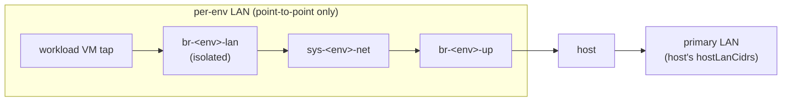
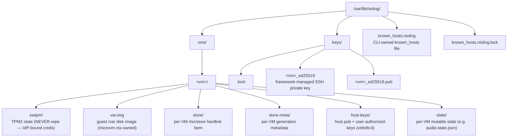

# Design overview

Threat model and design rationale for [`vicondoa/nixling`][nixling].
This document sits in the *explanation* quadrant of the [Diataxis]
structure: it answers "why is nixling shaped this way?" rather than
"how do I configure it?". Companion documents — the manifest schema
([`../reference/manifest-schema.md`](../reference/manifest-schema.md)),
the CLI contract ([`../reference/cli-contract.md`](../reference/cli-contract.md)),
and the [`CHANGELOG.md`](../../CHANGELOG.md) — describe the *what*.

The doc tracks the implementation as it exists today (pre-v0.1.0).
Where a defense is incomplete, or where a design tradeoff has known
holes, that is called out explicitly. Concrete file paths under
`nixos-modules/` are cited so the reader can verify a claim against
the code.

[nixling]: https://github.com/vicondoa/nixling
[Diataxis]: https://diataxis.fr/

## Contents

- [1. The problem nixling solves](#1-the-problem-nixling-solves)
- [2. Threat model](#2-threat-model)
- [3. Architecture](#3-architecture)
- [4. Defenses in depth](#4-defenses-in-depth)
- [5. Limitations and known gaps](#5-limitations-and-known-gaps)
- [6. Why not X — design rationale FAQ](#6-why-not-x--design-rationale-faq)
- [6.5 Portability roadmap](#65-portability-roadmap)
- [Observability](#observability)
- [7. References](#7-references)

## 1. The problem nixling solves

A single-user NixOS desktop wants more than one workspace on the
same physical machine — typically "work", "personal", and "risky
dev / browsing" — each with its own credentials, network identity,
USB device attachments, and disk state, and none of which should
be able to observe or interfere with another. The Wayland session
on the host is the one trusted surface the human actually
interacts with; everything else should be containable.

[microvm.nix] is the obvious building block: KVM-based isolation,
declarative per-VM NixOS config, no Xen-grade complexity. But
microvm.nix is deliberately a primitive. It does not opine on
networks (the consumer wires bridges by hand), it does not manage
SSH keys for the operator, it does not provide a single CLI that
behaves like a unit-of-work boundary, and its sidecar processes
(crosvm GPU forward, swtpm, vhost-device-sound, virtiofsd) run as
whatever the consumer's NixOS config sets — typically a shared
user with broader permissions than necessary.

Nixling is an **opinionated workspace framework that owns its
microVM substrate end-to-end**: declare an env, declare some
workloads in it, get a fully isolated network + key management +
hardened sidecars + a `nixling` CLI for daily ops. v1.1 dropped
the historical [microvm.nix] flake input (per ADR 0018); the
nixling-owned per-VM evaluator at
[`nixos-modules/vm-evaluator.nix`](../../nixos-modules/vm-evaluator.nix)
+ [`nixos-modules/vm-options.nix`](../../nixos-modules/vm-options.nix)
replaces the upstream module evaluation. The broker SpawnRunner
pipeline (`nixling-priv-broker` + `nixling-host::*_argv`) spawns
every per-VM runner directly; no Nix-side runner derivation is
needed.

### History

Pre-v1.1, nixling composed on top of [microvm.nix] by translating
`nixling.vms.<vm>` into `microvm.vms.<vm>` in `host.nix`'s
mapAttrs pass. v1.1 retired this translation in favour of the
nixling-owned per-VM evaluator + nixling-owned option set; the
upstream microvm.nix flake input is no longer in `inputs`.

[microvm.nix]: https://github.com/microvm-nix/microvm.nix

## 2. Threat model

### Trust boundaries

```mermaid
flowchart TD
    subgraph host["HOST"]
        direction TD
        wayland["Wayland user (trusted UI principal)<br/>compositor + nixling CLI invocations"]
        sidecars["nixling per-VM runners (semi-trusted)<br/>broker-spawned via nixling.slice/&lt;vm&gt;/&lt;role&gt; in v1.0:<br/>wlproxy (per-VM uid, Wayland filter; holds real compositor socket)<br/>gpu (per-VM uid; connects to wlproxy filter socket, not compositor)<br/>video (shares gpu uid)<br/>snd (per-VM uid)<br/>swtpm (per-VM uid)<br/>microvm-virtiofsd@&lt;vm&gt; (per-VM uid)<br/>per-env usbipd backend+proxy (nixling.slice/sys-&lt;env&gt;/usbipd-*)<br/>legacy systemd templates retired per ADR 0015"]
    end
    subgraph kvm["KVM boundary"]
        direction TD
        boundary[""]
    end
    subgraph guest["GUEST (untrusted)"]
        direction TD
        guest_desc["workload userspace, in-VM kernel, browser…"]
    end

    wayland -->|SO_PEERCRED at public.sock<br/>nixling group<br/>+ ssh via keysDir| sidecars
    sidecars -->|vsock / virtio-* / ACL'd sockets<br/>(wlproxy→compositor; gpu→wlproxy filter; pipewire-0)| boundary
    boundary --> guest_desc
```

<details>
<summary>ASCII version (for terminal viewers)</summary>

```
          ┌──────────────────────────────────────────────────────┐
          │                       HOST                           │
          │                                                      │
          │   ┌──── Wayland user (trusted UI principal) ─────┐   │
          │   │  compositor + nixling CLI invocations         │   │
          │   └──────────────────┬────────────────────────────┘   │
          │                      │ SO_PEERCRED at public.sock     │
          │                      │ (nixling group)      │
          │                      │ + ssh via keysDir              │
          │                      ▼                                │
          │   ┌──── nixling per-VM runners (semi-trusted, ──┐    │
          │   │      broker-spawned in v1.0 per ADR 0015)   │    │
          │   │   nixling.slice/<vm>/wlproxy (per-VM uid,   │    │
          │   │       Wayland filter; holds real compositor  │    │
          │   │       socket for graphics VMs with filter)   │    │
          │   │   nixling.slice/<vm>/gpu    (per-VM uid;     │    │
          │   │       connects to wlproxy, not compositor)   │    │
          │   │   nixling.slice/<vm>/video  (shares gpu uid) │    │
          │   │   nixling.slice/<vm>/snd    (per-VM uid)    │    │
          │   │   nixling.slice/<vm>/swtpm  (per-VM uid)    │    │
          │   │   microvm-virtiofsd@<vm>    (per-VM uid)    │    │
          │   │   nixling.slice/sys-<env>/usbipd-{backend,proxy} │
          │   │   (per-env USBIP, v1.0 broker-spawned;      │    │
          │   │    legacy systemd templates retired)        │    │
          │   └──────────────────┬───────────────────────────┘   │
          │                      │ vsock / virtio-* / ACL'd       │
          │                      │ sockets (wlproxy→compositor;   │
          │                      │  gpu→wlproxy filter; pipewire) │
          ╞══════════════════════╪═══════════════════════════════ ╡
          │                      │ KVM boundary                   │
          │   ┌──────────────────▼────────────────────────────┐   │
          │   │             GUEST (untrusted)                  │   │
          │   │  workload userspace, in-VM kernel, browser…    │   │
          │   └────────────────────────────────────────────────┘   │
          │                                                      │
          └──────────────────────────────────────────────────────┘
```
</details>



<details>
<summary>ASCII version (for terminal viewers)</summary>

```
                    ─── per-env LAN ───────  (point-to-point only)
   workload VM tap ─┤
                    └── br-<env>-lan ── sys-<env>-net ── br-<env>-up ── host
                       (isolated)                                       │
                                                                        │
                                                                  primary LAN
                                                                  (host's
                                                                  hostLanCidrs)
```
</details>

Five distinct boundaries:

1. **Host kernel ↔ guest userspace + guest kernel.** Enforced by
   KVM and the cloud-hypervisor / QEMU runtime supplied by
   microvm.nix. This is the strongest boundary nixling has and
   the one a workload-level compromise has to defeat first.
2. **Host kernel ↔ sidecar processes.** Sidecars run as
   dedicated, per-VM system users (no `DynamicUser`, no shared
   service account), with systemd-level hardening on top. See
   [§4](#4-defenses-in-depth) for the exact unit options.
3. **Sidecar ↔ guest userspace.** A sidecar talks to its guest
   only through its own purpose-built transport (a wayland
   socket, a pipewire socket, a TPM control socket, a vsock,
   the virtio-fs share). The guest cannot reach back through
   any other path; bind-mounts in the sidecar's mount namespace
   are exactly the file paths it needs.
4. **VM ↔ VM (intra-host).** By default, two workload VMs in the
   same env cannot exchange frames directly. The LAN bridge sets
   `Isolated = true` on every workload tap unless the operator opts
   into `nixling.envs.<env>.lan.allowEastWest = true`
   ([`nixos-modules/network.nix`](../../nixos-modules/network.nix));
   the only un-isolated port is `<env>-l1`, which belongs to the
   env's net VM. Across envs there is no shared bridge at all.
5. **Net VM ↔ outside world.** Each env's net VM is the sole
   egress point for the workloads in that env. The net VM runs
   nftables with a default-deny forward chain, a documented
   carve-out for USBIP to the host's uplink IP, and a
   `hostBlocklist` DROP rule
   ([`nixos-modules/net.nix:140-156`](../../nixos-modules/net.nix))
   that includes the host's primary LAN CIDRs.

### Threats addressed

**Compromised guest userspace.** A browser RCE, a malicious
container, an exploited package manager — anything that gets
code execution inside the guest — is bounded by the KVM
boundary. Within its env, the workload cannot reach peer
workloads by default (bridge isolation), cannot reach the
host's primary LAN (hostBlocklist), and cannot reach a
different env at all (distinct bridges + distinct net VMs). If
`nixling.envs.<env>.lan.allowEastWest = true`, that peer-
isolation guarantee is intentionally relaxed and a compromised
workload can scan or attack its same-env peers. It *can* reach
the public internet, NAT'd through its env's net VM; that is
intentional — a workspace VM without internet is rarely useful.

**Compromised sidecar.** The GPU sidecar in particular runs
cloud-hypervisor and crosvm-device-gpu, both of which are
non-trivial native code with prior CVE history. Each sidecar
runs under a dedicated per-VM user (`nixling-<vm>-gpu`,
`nixling-<vm>-snd`, `nixling-<vm>-swtpm`; declared in
[`nixos-modules/host-users.nix`](../../nixos-modules/host-users.nix))
with `NoNewPrivileges`, `ProtectSystem=strict`, narrow
`ReadWritePaths`, `RestrictAddressFamilies` cut to the minimum
each backend requires, `DevicePolicy=closed`, and an explicit
`DeviceAllow` list. A compromise of `nixling-<vm>-gpu` can
touch `/dev/kvm`, `/dev/dri/renderD128`, the per-VM state dir
under `/var/lib/nixling/vms/<vm>/`, and the bind-mounted
wayland socket — and nothing else.

**Guest kernel exploit.** A privilege escalation from guest
userspace to the in-VM kernel does not cross the KVM boundary;
the host kernel is unaffected, and the guest's `/nix/store`
view is still restricted to the VM's own closure (see *Per-VM
nix store* below).

**Cross-VM lateral movement.** A workload in env A cannot reach
a workload in env B. There is no shared bridge — `br-A-lan` and
`br-B-lan` are distinct interfaces, each net VM is a separate
sandbox, and CIDR overlap is rejected at eval time
([`nixos-modules/network.nix:220-275`](../../nixos-modules/network.nix)
uses pure-Nix prefix arithmetic to detect e.g. `10.0.0.0/16 ⊃
10.0.1.0/24`). The per-VM `/nix/store` farm means even if a
workload chains a hypothetical microvm.nix host-side bug, it
cannot enumerate store paths it never had a closure entry for.

**Network sniffing on the shared LAN.** The host's primary LAN
(the wire the host's `eno*` interface sits on) is declared via
`nixling.hostLanCidrs`. Every env's net VM merges that list
into its `hostBlocklist`, so a workload cannot reach the host's
neighbours (NAS, printer, other workstations) even if the env's
default-deny chain were bypassed.

**DHCP preemption on net VMs.** A net VM has two NICs
matched by MAC. The guest baseline in
[`nixos-modules/base.nix:47-54`](../../nixos-modules/base.nix)
defines a catch-all `10-eth-dhcp` systemd-networkd network for
*workload* VMs; on a net VM that catch-all would sort
lex-first against the per-MAC `10-uplink` / `10-lan`
definitions, DHCP both NICs, and preempt the static config.
[`nixos-modules/net.nix:55-57`](../../nixos-modules/net.nix)
neutralises this by `lib.mkForce`-ing the catch-all's match to
a sentinel MAC (`00:00:00:00:00:00`) that no interface will
ever expose. Workload VMs continue to inherit the base.nix
catch-all unchanged.

**Untrusted disk state across reboot.** Per-VM TPM state lives
under `/var/lib/nixling/vms/<vm>/swtpm/` and is owned by
`nixling-<vm>-swtpm:nixling-<vm>-swtpm` mode 0700. No other VM's
swtpm process, no other VM's GPU sidecar, and no `kvm`-group
process can read it. The broker provisions this directory on first
start (no manual step); the per-VM state root is `3770`
(setgid + **sticky**) so a non-owner per-VM role UID cannot
rename or replace the principal-owned `swtpm` directory, and an
identity-bound, root-owned marker (outside the role-writable tree)
makes a *missing-after-provisioned* state directory fail the VM
start closed (`previously-provisioned-swtpm-state-missing`) rather
than silently re-creating an empty TPM. The control socket is mode 0600 with an
ACL granting `nixling-<vm>-gpu` rw at `ExecStartPost` time
([`nixos-modules/host-sidecars.nix:79-83`](../../nixos-modules/host-sidecars.nix)).

### Threats *not* addressed

Nixling is deliberately not a defense against any of the following.
Pretending otherwise would be dishonest.

- **Physical attacker with host access.** Disk encryption, TPM
  unlock, secure boot, evil-maid attacks — all out of scope.
  Treat nixling's threat model as "host is up, host is trusted,
  attacker is on the wire or inside a guest."
- **Compromised host kernel.** Nixling is a host-trusted
  framework. If the host kernel falls, every VM falls with it.
- **Side channels (cache timing, branch predictor, Rowhammer,
  PCIe DMA peers).** Out of scope. KVM mitigations apply to
  whatever extent the upstream kernel + cloud-hypervisor +
  microcode provide; nixling adds nothing.
- **Supply chain attacks against nixpkgs, microvm.nix, or any
  upstream input.** Deferred to the consumer's own pin / audit
  discipline. The flake lock is the operator's responsibility.
- **TPM hardware backdoor or firmware attack.** Out of scope —
  the swtpm emulator we ship for VMs is software, but the host
  TPM (if used at all) is not nixling's concern.
- **Multi-user trust separation on the host.** Nixling assumes a
  single-human, single-Wayland-session host. The
  `nixling` group exists to make `nixling vm start <vm>`
  password-free for the human's account, not to model trust
  between two operators. SSH private keys at
  `/var/lib/nixling/keys/<vm>_ed25519` are readable by every
  member of `nixling`. A second untrusted human on the
  same machine breaks the threat model.
- **A malicious local launcher user.** A member of the
  `nixling` group who is also listed in `nixling.site.launcherUsers`
  can connect to `/run/nixling/public.sock` and run the daemon's
  read-only verbs (`vm list`, `vm status`, `host check`,
  `auth status`, `keys list`/`keys show`), and — because the per-VM
  SSH keys are group-readable — read every per-VM SSH private key.
  The v1.0 authorisation surface ([§4](#4-defenses-in-depth)) is
  `SO_PEERCRED` at `/run/nixling/public.sock` accept time: the
  `nixling` group plus `launcherUsers` is the *connection* gate, and
  the daemon's per-verb authorisation table is the *role* gate. The
  legacy polkit per-VM allowlist that previously narrowed which unit
  names launchers could start was retired in v1.0 (per ADR 0015).
  Every mutating verb — lifecycle (`vm start`/`vm stop`/`vm restart`/
  `switch`), host-prepare, key rotation, USBIP bind, store verify,
  config sync (`readGuestConfig`), and the destructive
  guest-control exec verb (`vm exec`, which runs commands as the VM's
  workload user in a PAM login session — never as root) — is gated to
  the admin role
  (`nixling.site.adminUsers`, checked via `SO_PEERCRED` at accept
  time), so a launcher-only member cannot reach them. The daemon does
  not narrow *which* admin user can drive *which* VM. By design.

**DHCP reservations are convenience, not security.** The per-env
net VM assigns predictable IPs to workload VMs via dnsmasq
DHCP-host reservations keyed on MAC address. This provides stable
addressing for operator convenience but does NOT prevent a
compromised guest from changing its MAC and claiming a peer's
reservation. The actual peer-isolation mechanism is bridge port
isolation (`Isolated = true` on workload taps in the LAN bridge),
which prevents direct layer-2 communication between workload VMs
regardless of IP or MAC.

### Secure Boot and Lanzaboote

**Boot chain.** No nixling component runs as part of the host's
UEFI or bootloader chain. Nixling is a NixOS module activated
after the host has already booted. Lanzaboote signs the host
kernel and initrd; nixling's per-VM kernels run later inside KVM
guests and are not part of the host Secure Boot chain.

**TPM state ownership.** Lanzaboote uses the host TPM for measured
boot. Nixling's per-VM `swtpm` emulators are software TPMs with
state under `/var/lib/nixling/vms/<vm>/swtpm/`. They are
independent of the host's hardware TPM, so Lanzaboote enrollment
on the host does not affect per-VM `swtpm` state.

**Key rotation and re-enrollment.** Rotating `sbctl` keys or
re-enrolling Lanzaboote after host PCR values change affects only
the host boot chain. Per-VM `swtpm` state is still unaffected:
`/var/lib/nixling/vms/<vm>/swtpm/` does not depend on the host's
Secure Boot keys and is not sealed to host PCRs.

**Recovery boundary.** If host Secure Boot breaks, nixling VMs are
unchanged once the host boots again. If the host cannot boot at
all, that is a Lanzaboote / `sbctl` recovery procedure rather
than a nixling one.

### Constellation realm gateway (v2, ADR 0032)

[ADR 0032](../adr/0032-nixling-v2-constellation-control-plane.md)
adds a v2 constellation layer on top of the existing v1 substrate.
The local fast path — the host daemon, the broker, and local VM
lifecycle — is unchanged when constellation is disabled or when a
relay or provider is unreachable. The following threat-model
properties govern the constellation extension.

**Entrypoint modes.** Each realm has one of two entrypoint modes:

- *Host-resident*: the host `nixlingd` is the realm entrypoint,
  for local-only or trusted-host realms whose workloads all live
  on this host and require no relay or provider credentials.
- *Gateway-backed*: a dedicated local nixling guest VM (the
  *realm gateway*) is the realm entrypoint. This is the default
  for cross-host, work, and provider realms. The gateway guest
  holds relay transport code, node registry, provider
  configuration, credentials, policy, and the realm audit log.
  The host daemon manages the gateway like any other local
  workload; it does not hold the realm's credentials or policy.

**Host holds no realm credentials.** The host daemon and broker
hold no realm relay credentials, realm session keys, provider
credentials, remote node registries, or realm audit log. All of
those belong inside the per-realm gateway guest VM. They must not
be loaded into any host process, host-readable storage, or
host-side activation artifact. This invariant must hold
regardless of which realm or provider is in use.

**Relay is untrusted.** A relay (such as Azure Relay) is a
ciphertext-only rendezvous transport. Relay credentials
authenticate access to the relay endpoint; they do not
authenticate a constellation principal, authorise a workload
operation, or substitute for end-to-end session security. A
compromised relay can deny, delay, or observe traffic shape, but
cannot read, forge, or replay constellation operations. A
relay-authenticated peer is never mapped to the local `Admin` role.

**Local auth model is unchanged.** `SO_PEERCRED` at
`/run/nixling/public.sock` combined with membership in the
`nixling` group remains the only local lifecycle authorisation
surface, exactly as in v1. The broker remains the only
privileged host-mutation path, with every op audited to
`/var/lib/nixling/audit/broker-<date>.jsonl`. The gateway guest
receives no broker channel and no generic host-control channel.

**Per-realm L2 isolation.** A work gateway and a personal
gateway must not share a host L2 bridge or broadcast domain.
The existing per-env bridge model is the natural boundary: each
realm's gateway and its local workloads occupy a distinct env,
with no cross-realm bridge membership, L3 forwarding, or
transitive route unless an explicit named operation or named
stream is authorised.

### Constellation design constraints

The following constraints follow from the reasoning in
[ADR 0032](../adr/0032-nixling-v2-constellation-control-plane.md).
They are stated here because violating any one of them would
undermine the threat-model properties above.

- **Do not turn nixling into an arbitrary network bridge.** The
  port-forward stream carries one connection per operation, not
  a generic L2 or L3 tunnel.
- **Do not collapse work and personal networks or identities.**
  Work and personal realms must remain in distinct environments
  with separate gateway guests and separate L2 bridges.
- **Do not map a relay-authenticated principal to local Admin.**
  Relay identity is a transport credential, not a constellation
  or host authorisation credential.
- **Do not let a host process hold realm relay credentials.**
  Relay credentials, realm session keys, and provider credentials
  belong inside the gateway guest, not in the host daemon, any
  host-side activation artifact, or host-readable storage.
- **Do not open realm relay sessions directly from the host
  daemon.** Realm relay transport code runs inside the gateway guest or
  inside remote nodes. Daemon-access relay (an opt-in path for
  remote node management) is a separate transport with its own
  audit path and must not carry realm or provider workload
  authority.
- **Do not give the gateway a broker or generic host-control
  channel.** The gateway guest manages its own realm; it does
  not reach back through the broker to mutate the physical host.
- **Do not add a generic raw stream or port-forward escape
  hatch.** A raw bidirectional stream that carries arbitrary
  traffic becomes the real API and dissolves every other
  constraint listed here.
- **Do not make provider sandboxes pretend to be full hypervisor
  hosts.** A provider-managed container session and a local KVM
  guest are explicitly distinct node types with explicit
  capability differences; presenting them as equivalent conceals
  those limits.
- **Do not route local microVM lifecycle through remote
  control-plane infrastructure.** Local VM start, stop, and
  switch stay on the host-local Unix-socket fast path regardless
  of whether constellation is configured.

## 3. Architecture

Nixling is a set of NixOS modules under `nixos-modules/`, aggregated
through `nixos-modules/default.nix`. The consumer imports
`nixos-modules/default.nix` from a top-level flake and populates
`nixling.site.*`, `nixling.envs.<env>.*`, and `nixling.vms.<vm>.*`.
Everything else is derived.

### `nixling@<vm>.service` — the legacy per-VM wrapper (retired in v1.0)

> **v1.0 status (per [ADR 0015](../adr/0015-daemon-only-clean-break.md)):**
> The per-VM `nixling@<vm>.service` template and the wrapper module
> `nixos-modules/host-wrapper.nix` were deleted in v1.0. The section
> below documents the legacy architecture for historical context;
> in v1.0 the per-VM lifecycle is fully owned by `nixlingd`'s
> supervisor DAG dispatched through `nixling-priv-broker`'s
> `SpawnRunner` / `SignalRunner` ops, and runner lifecycle-of-record
> is the broker-registered pidfd table. See
> [§ Launcher authorisation](#launcher-authorisation-v10-so_peercred--nixling-group)
> for the v1.0 control surface.

(historical, pre-v1.0) microvm.nix declares one template,
`microvm@.service`. Before v1.0, nixling wrapped that with its own
template, `nixling@.service`, declared in
`nixos-modules/host-wrapper.nix`. The wrapper:

- `BindsTo + After microvm@%i`: if microvm.nix stops the
  underlying VM, the wrapper follows.
- Explicit `ExecStart`/`ExecStop` that calls
  `systemctl start|stop microvm@%i.service` — so
  `systemctl start nixling@<vm>` and `systemctl stop nixling@<vm>`
  symmetrically drive the underlying unit. `BindsTo` alone only
  propagates the bound→wrapper direction.
- `PropagatesStopTo` (systemd ≥249) belts-and-braces the stop
  direction.
- `Restart=` is intentionally omitted; microvm.nix owns restart
  policy on the underlying template.

Nixling pins `microvm.autostart = [ ]` so the upstream template
never carries its own `WantedBy=multi-user.target`. The wrapper is
the single source of truth for boot-time autostart, set per-VM via
`nixling.vms.<vm>.autostart`. This eliminates a class of double-
start bugs that would otherwise appear when both templates have
`wantedBy` attached.

### microvm.nix integration

Nixling does not fork microvm.nix. `nixos-modules/host.nix:153-221`
walks `config.nixling.vms`, validates the platform gate
(graphics/audio components are `x86_64-linux`-only via
`meta.platforms`), derives per-VM network metadata from the env
(MAC, IP, tap name, vsock CID), and emits a matching
`microvm.vms.<vm>` entry layered with `./base.nix` plus the
appropriate component modules. Net VMs are auto-declared the same
way ([`nixos-modules/network.nix:659-678`](../../nixos-modules/network.nix)),
just from `nixling.envs.<env>` metadata instead of an operator-
supplied module.

The `microvm.stateDir` override at
[`nixos-modules/host.nix:137`](../../nixos-modules/host.nix) puts
every nixling-managed file under `/var/lib/nixling/` instead of the
upstream default `/var/lib/microvms/`. This keeps one tree the
audit and backup scripts can reason about.

### Per-VM sidecars

> **v1.0 status (ADR 0015):** in v1.0 daemon-only, the per-VM sidecars
> listed below are spawned by `nixling-priv-broker` via the supervisor
> DAG (`SpawnRunner` requests) and registered in the pidfd table for
> lifecycle ownership. Historically, they were emitted as
> independent systemd units under `nixos-modules/host-sidecars.nix`; in
> v1.0 only the per-VM long-lived roles that ADR 0015 retains as
> systemd are still emitted (microvm-virtiofsd@<vm>, vfsd-watchdog,
> store-sync, otel-relay@). All other "nixling-<vm>-{gpu,snd,video,
> swtpm,usbip}" responsibilities now live in the broker-spawned
> per-VM DAG; the systemd templates were removed in v1.0.

For each declared VM, a subset of daemon-supervised DAG nodes exists,
gated by the per-VM component toggles. `nixlingd` starts each long-lived
runner through the broker's typed `SpawnRunner` operation and tracks it
by pidfd:

- `virtiofsd` — mediates the per-VM `/nix/store` share and any
  virtiofs shares the consumer adds.
- `store-virtiofs-preflight` — verifies the per-VM hardlink-farm marker
  before virtiofsd starts; the daemon owns the sync path.
- `wayland-proxy` — present when
  `nixling.vms.<vm>.graphics.enable = true`,
  `graphics.crossDomainTrusted = true`, and
  `graphics.waylandFilter.enable = true`. Runs the
  `nixling-wayland-filter` binary as `nixling-<vm>-wlproxy` (per-VM
  uid). This is the **only** per-VM role that holds the real host
  compositor socket; it listens on
  `/run/nixling-wlproxy/<vm>/wayland-0` for the GPU sidecar and
  enforces the filter policy before forwarding to the compositor.
- `gpu` / `gpu-render-node` — present when
  `nixling.vms.<vm>.graphics.enable = true`. Runs the patched crosvm
  GPU sidecar and gates Cloud Hypervisor startup on the GPU socket.
  When the Wayland filter is active the GPU sidecar connects to
  `/run/nixling-wlproxy/<vm>/wayland-0` (the filter socket), not to
  the real host compositor socket directly.
- `video` — present only when
  `nixling.vms.<vm>.graphics.videoSidecar = true`. Runs the patched
  crosvm `device video-decoder --backend vaapi` sidecar as
  `RunnerRole::Video`, exposes `/run/nixling-video/<vm>/video.sock`,
  and is consumed by the patched Cloud Hypervisor
  `--vhost-user-media` device.
- `audio` — present when `nixling.vms.<vm>.audio.enable = true`.
  Runs vhost-device-sound and exposes `/run/nixling/vms/<vm>/snd.sock`.
- `swtpm` — present when `nixling.vms.<vm>.tpm.enable = true`.
  Per-VM software TPM emulator, state under
  `/var/lib/nixling/vms/<vm>/swtpm/`. The `nixlingVmStatePerms`
  activation script
  ([`nixos-modules/host-activation.nix`](../../nixos-modules/host-activation.nix))
  grants `nixling-<vm>-swtpm` a traversal-only ACL (`--x`) on
  the parent state dir so the swtpm process — which runs in its
  own `StateDirectory=` subdir under `microvm:kvm 2770` — can
  reach `tpm2-00.permall`. Required because TPM-bound creds
  (Entra device join, Intune compliance) must survive any
  framework upgrade or user rename without re-enrollment.

#### Why all per-VM sidecars carry `restartIfChanged = false`

Every per-VM lifecycle service — `nixling@<vm>`, `microvm@<vm>`,
`microvm-virtiofsd@<vm>`, `nixling-<vm>-{gpu,video,snd,swtpm}` — sets
`restartIfChanged = false` (the same opt-out upstream microvm.nix
applies to `microvm@.service`). A `nixos-rebuild switch` that
touches any of these units updates the file in
`/etc/systemd/system/` but does NOT cycle the running unit.

The motivating constraint is graphics VMs: the GPU sidecar IS the
cloud-hypervisor process. Restarting it kills CH, evaporating
every in-RAM piece of session state — Wayland clients,
interactive logins, Entra device-bound tokens, virtiofsd socket
handshakes. For headless VMs the damage is smaller (no Wayland
session to lose) but still material (network connections drop,
filesystem caches discard).

The trade-off is that consumers must explicitly opt into picking
up sidecar config changes. The framework provides two paths:

- `nixling vm restart <vm> --apply` — clean `down` + `up` of the existing
  closure. Use this when `nixling list` flags a VM as
  `[pending restart]` after a `nixos-rebuild switch`.
- `nixling switch <vm> --apply` — full per-VM closure rebuild + live
  activation through the daemon (no VM reboot). Use this when you edited
  the VM's own NixOS module.

#### Pending-restart detection via `booted` vs `current`

Two per-VM symlinks track the closure the VM is *running* vs the
closure the host *declares*:

- `/var/lib/nixling/vms/<vm>/current` — points at the latest
  declared closure (`microvm-cloud-hypervisor-<vm>` for graphics,
  `microvm-qemu-<vm>` for headless). Updated at every
  `nixos-rebuild switch`.
- `/var/lib/nixling/vms/<vm>/booted` — points at the closure the
  running VM actually exec'd. Updated either by upstream
  microvm.nix's `microvm-set-booted@<vm>.service` (headless +
  net VMs) or — new in v0.1.5 — by the `nixling-<vm>-gpu.service`
  `ExecStartPre` (graphics VMs).

When `booted != current` AND the VM is running, the pending-
restart predicate fires: `nixling list` adds `[pending restart]`
to the STATUS column, and `nixling status <vm>` prints both
store paths plus the remediation command. A first-boot VM has
no `booted` yet — that's not "pending" — and a stopped VM has
nothing to apply.

Per-env sidecars (one set per declared env, not per VM):

- (legacy only) `nixling-sys-<env>-usbipd-backend.service` and
  `nixling-sys-<env>-usbipd-proxy.{socket,service}` — per-env USBIP
  sidecars. Retired as host singletons; in v1.0 (per
  [ADR 0015](../adr/0015-daemon-only-clean-break.md)) the daemon
  spawns the same `usbipd` backend + socket-proxy via the broker's
  `SpawnRunner` path (cgroup leaf
  `nixling.slice/sys-<env>/usbipd-{backend,proxy}`), so the prior
  systemd unit names are now broker-supervised runner identities
  on the per-env DAG. See
  [`docs/reference/privileges.md`](../reference/privileges.md) for
  the broker enum + audit shape.
- (legacy only) `nixling-net-route-preflight.service` — the singleton
  was retired in v1.0 (per
  [ADR 0015](../adr/0015-daemon-only-clean-break.md)) the equivalent
  fail-closed self-check lives inside `nixlingd`'s startup path and
  surfaces as the typed `net-route-preflight-degraded` envelope
  (exit 66). See [§4](#4-defenses-in-depth) for the v1.0 daemon-side
  flow.

### Per-env net VMs

Each `nixling.envs.<env>` causes
[`nixos-modules/network.nix`](../../nixos-modules/network.nix) to
materialise:

- Two host-side bridges (`br-<env>-up` /30 point-to-point host↔net,
  `br-<env>-lan` /24 net↔workloads — host has NO IP on the LAN
  bridge by design).
- A headless net VM `sys-<env>-net`, declared as a regular
  `nixling.vms.<netName>` and therefore subject to the same
  wrapper / store / sidecar machinery as any other VM. The VM's
  guest config comes from [`nixos-modules/net.nix`](../../nixos-modules/net.nix):
  nftables firewall, MASQUERADE on eth0, dnsmasq with DHCP
  host-reservations for every workload in the env, dropped IPv6.
- Per-tap networkd rules that route taps named `<env>-u*` to the
  uplink bridge (priority 30), `<env>-l1` to the LAN bridge un-
  isolated (priority 25), and `<env>-l*` for workloads to the
  LAN bridge with `Isolated = true` by default (priority 30).
  Setting `nixling.envs.<env>.lan.allowEastWest = true` clears
  that bridge isolation and adds a matching LAN→LAN forward rule
  in the env's net VM.

The net VM's lifecycle is no more privileged than a workload's —
it is a regular nixling VM that happens to autostart, sit on both
bridges, and run NAT.

### Per-VM `/nix/store` hardlink farm

By default microvm.nix shares the host's entire `/nix/store` ro
into each guest, which leaks every package on the host (and every
other VM's closure) into each VM. Nixling replaces this with a
per-VM farm at `/var/lib/nixling/vms/<vm>/store/` containing only
the paths in that VM's `system.build.toplevel` closure. The farm
is built out of hardlinks into the host's real `/nix/store`, so
the disk overhead is directory entries only.

The hardlink trick is non-trivial: on NixOS `/nix/store` is bind-
mounted on top of itself, and Linux's `do_linkat` rejects cross-
mount hardlinks unconditionally even when the underlying device is
the same. The sync helper sidesteps this by running inside a
private mount namespace where `/nix/store` is lazily unmounted,
turning it into a plain directory under the root mount and
making the hardlink succeed
([`nixos-modules/store.nix`](../../nixos-modules/store.nix)).

The farm exposes itself to the guest via two virtio-fs shares:
the read-only closure as `/nix/.ro-store`, and a per-generation
metadata directory (`current → generations/N`, plus
`store-paths` and `db.dump`) as
`/run/nixling-store-meta`. The guest's
`nixling-load-store-db.service` (in
[`nixos-modules/base.nix:91-125`](../../nixos-modules/base.nix))
loads `db.dump` on every boot and on every `nixling switch`,
making `nix-store --query --valid` and `nix-shell` work without
seeing host paths.

### CLI

The `nixling` command (the Rust crate at
[`packages/nixling`](../../packages/nixling), see also the
behavioural contract at
[`../reference/cli-contract.md`](../reference/cli-contract.md))
is the daily-driver interface. Verbs include `list`, `status`,
`vm start` / `vm stop` / `vm restart` / `vm switch`, `console`,
`vm exec`, `build`, `generations`, `config`
(`sync` / `diff` / `approve` / `reject` / `status`), `audio`, `usb`,
`keys`, `host`, and `audit`. The CLI is the Rust binary, full stop:
the pre-v1.0 bash CLI (and the generated `nixos-modules/cli.nix`
shell script) was retired in v1.0, and every lifecycle verb dispatches
through `nixlingd` → `nixling-priv-broker` (see
[ADR 0015](../adr/0015-daemon-only-clean-break.md) and
[ADR 0017](../adr/0017-no-bash-fallbacks-invariant.md)). The
[manifest schema](../reference/manifest-schema.md) and the versioned
bundle contract ground that daemon-native dispatch.

### Nixling-managed SSH keys

Pre-Phase-2b, the consumer was expected to declare per-VM SSH
keys themselves. Today
[`nixos-modules/host-keys.nix`](../../nixos-modules/host-keys.nix)
owns the whole lifecycle:

- At host activation, a single shell block (under `flock` on
  `<keysDir>/.lock`) walks every enabled VM, generates an
  Ed25519 keypair at `<keysDir>/<vm>_ed25519{,.pub}` if missing,
  repairs modes (0640 priv, 0644 pub) and ACL-grants the
  `nixling` group `r` on the private key.
- The same activation script stages the per-VM pubkey + the
  resolved `userAuthorizedKeys` content into
  `/var/lib/nixling/vms/<vm>/host-keys/`, which `host.nix`
  mounts into the guest via virtio-fs as
  `/run/nixling-host-keys/`. The guest baseline runs
  `nixling-load-host-keys.service` at boot, reads that share,
  dedupes, and writes the merged content into the SSH user's
  `~/.ssh/authorized_keys` ([`nixos-modules/base.nix:138-188`](../../nixos-modules/base.nix)).

The private key is never baked into the flake closure. It is
generated on the host the first time the consumer rebuilds, and
sticks around across rebuilds.

### State directory layout

Everything nixling owns lives under `/var/lib/nixling/`:



<details>
<summary>ASCII version (for terminal viewers)</summary>

```
/var/lib/nixling/
├── vms/
│   └── <vm>/
│       ├── swtpm/              TPM2 state (NEVER wipe — IdP-bound creds)
│       ├── var.img             guest /var disk image (microvm.nix-owned)
│       ├── store/              per-VM /nix/store hardlink farm
│       ├── store-meta/         per-VM generation metadata
│       ├── host-keys/          host.pub + user-authorized-keys (virtiofs'd)
│       └── state/              per-VM mutable state (e.g. audio-state.json)
├── keys/
│   ├── .lock
│   ├── <vm>_ed25519            framework-managed SSH private key
│   └── <vm>_ed25519.pub
├── tmp/
│   └── <vm>/                   boot-ephemeral state safe to lose
├── known_hosts.nixling         CLI-owned known_hosts file
└── known_hosts.nixling.lock
```
</details>

`/var/lib/nixling/tmp/` is the framework's per-boot transient state
root. Components SHOULD place reboot-safe scratch data under
`/var/lib/nixling/tmp/<vm>/` (temporary sockets, swtpm proxy paths,
build artifacts, similar scratch). The host creates it with a tmpfiles
`D` rule, so the directory itself is preserved while its contents are
purged on every boot.

Net VMs land at `/var/lib/nixling/vms/sys-<env>-net/` for now;
splitting them off into a sibling `sys/<env>-net/` tree would
require either patching microvm.nix to expose a per-VM stateDir
override or filesystem-level bind-mounts. Tracked but not blocking.

### Naming conventions

Pulled out for ease of reference; the regexes and reserved names
are enforced by [`nixos-modules/assertions.nix`](../../nixos-modules/assertions.nix).
For the canonical glossary of service, bridge, tap, and reserved-name
patterns, see [the naming conventions reference](../reference/naming-conventions.md).

| Identifier                                | Constraint                              | Owner                       |
|-------------------------------------------|-----------------------------------------|-----------------------------|
| VM name (`nixling.vms.<vm>`)              | `^[a-z][a-z0-9-]*$`, ≤ ... no `sys-` prefix, not `launcher` | assertions.nix |
| Env name (`nixling.envs.<env>`)           | `^[a-z][a-z0-9-]*$`, length ≤ 8 (IFNAMSIZ-1=15 minus `br--lan` = 7) | network.nix |
| `nixlingd.service`                        | non-root daemon (v1.0; per ADR 0015 the only persistent user-facing nixling unit besides the broker) | host-daemon.nix |
| `nixling-priv-broker.{socket,service}`    | socket-activated privileged broker (v1.0) | host-broker.nix              |
| `microvm@<vm>.service`                    | upstream microvm.nix unit (still emitted for direct-debug bypass; not the lifecycle-of-record in v1.0) | microvm.nix |
| `nixling.slice/<vm>/<role>`               | per-VM broker-spawned runner leaves (v1.0 replaces legacy `nixling-<vm>-{gpu,video,snd,swtpm,store-sync,usbip}.service`) | broker SpawnRunner |
| `nixling.slice/sys-<env>/usbipd-{backend,proxy}` | per-env USBIP runner leaves (v1.0 replaces legacy `nixling-sys-<env>-usbipd-{backend,proxy}.service`) | broker SpawnRunner |
| `nixling-sys-<env>-net`                   | reserved auto-system VM name            | network.nix                 |
| `nixling` group                 | SO_PEERCRED authorisation surface at `nixlingd`'s public.sock (mode 0660, group `nixling`) | host-users.nix |
| `nixling-<vm>-{gpu,snd,swtpm,usbip}` users | dedicated per-VM runner uids (broker-spawned in v1.0) | host-users.nix |

### Composition with framework-agnostic flakes (`entrablau`)

Nixling deliberately does **not** ship per-domain modules (Entra ID
device-join, corporate VPN clients, vendor identity glue). Those live
in sibling flakes that are framework-agnostic — they can in principle
be imported into any NixOS configuration, microVM or bare metal.
[`vicondoa/entrablau.nix`](https://github.com/vicondoa/entrablau.nix)
is the canonical example.

The split:

- **Nixling owns:** VM / env / sidecar lifecycle, network isolation
  (per-env bridges + net VM + NAT), per-VM `/nix/store` hardlink
  farm, the `nixling` CLI, lifecycle group authorization, and key
  management. Anything that only makes sense on a microVM host.
- **Domain flakes own:** identity (Himmelblau / Entra), corporate
  trust roots, vendor-specific guest kernel modules, anything that
  is a property of the *guest workload* rather than the *host
  framework*.
- **The seam** is one line in the consumer's flake:

  ```nix
  nixling.vms.work-vm.config.imports = [
    inputs.entrablau.nixosModules.default
  ];
  ```

  Nixling does not depend on `entrablau`, and `entrablau`
  does not depend on nixling — they meet only in the consumer
  flake's `config.imports`.

Why: nixling stays minimal and framework-agnostic. Domain flakes
stay reusable outside the microVM context. Neither tree has to
track the other's release cadence or test matrix.

See [`examples/with-entra-id/`](../../examples/with-entra-id/) for
the full composition pattern (one work VM with `tpm.enable = true`
+ the Entra module imported into its guest config).

## 4. Defenses in depth

For each defense below, the threat it addresses is named explicitly.
The list is not exhaustive — it covers the load-bearing controls.

### Per-VM dedicated system users

**Threat:** a compromised sidecar reads or modifies another VM's
state (TPM blob, GPU buffers, audio state file).

**Control:** [`nixos-modules/host-users.nix`](../../nixos-modules/host-users.nix)
declares one user per sidecar per VM (`nixling-<vm>-gpu`,
`nixling-<vm>-snd`, `nixling-<vm>-swtpm`), all `isSystemUser =
true`, no `DynamicUser`. Each unit's `User=` /`Group=` pin to the
matching pair. Cross-VM file access fails on Unix DAC alone
(0700 on the per-VM state dir, 0600 on the swtpm control socket)
before any further sandboxing is needed.

### systemd hardening

**Threat:** a sidecar compromise escapes into the host filesystem
or kernel.

**Control:** unit options layered on each sidecar:

| Sidecar         | NNP | ProtectSystem | RAFmilies                                | MDWE  | Notes                                |
|-----------------|-----|---------------|-------------------------------------------|-------|--------------------------------------|
| `-swtpm`        | yes | strict        | `AF_UNIX`                                  | yes   | TPM is purely local-Unix sockets     |
| `-gpu`          | yes | strict        | `AF_UNIX AF_NETLINK AF_VSOCK`              | **no** | crosvm JITs GPU command buffers      |
| `-video`        | yes | strict        | `AF_UNIX`                                  | not set | shares the `-gpu` uid, but keeps its own NVIDIA/render-node allowlist, empty capability sets, `DevicePolicy=closed`, and a system-service syscall filter |
| `-snd`          | yes | strict        | as needed for PipeWire                     | yes   | see `components/audio/host.nix`      |
| usbipd backend  | yes | (relaxed)     | `AF_INET AF_INET6 AF_UNIX AF_NETLINK`      | n/a   | needs `/sys/bus/usb` enumeration     |
| usbipd proxy    | yes | strict        | none-via-CapBoundingSet=""                 | yes   | generic L4 `socat` TCP forwarder; no busid parsing |

`MemoryDenyWriteExecute` is intentionally omitted on the GPU
sidecar at
[`nixos-modules/host-sidecars.nix:152-153`](../../nixos-modules/host-sidecars.nix):
crosvm's `device gpu` JITs GPU command-buffer code and breaks
under `MDWE`. That gap is an honest cost of running the patched
crosvm GPU forwarder; the surrounding `ProtectSystem=strict`,
`DevicePolicy=closed + DeviceAllow=[…]`, narrow `ReadWritePaths`,
and dedicated UID are the compensating controls.

### Launcher authorisation (v1.0: SO_PEERCRED + nixling group)

**Threat:** an over-broad permission grant lets a launcher user
touch units or operations the framework doesn't own (the
consumer's other microvm.nix VMs, system-wide services, the
init system itself).

**Control (v1.0 daemon-only, per
[ADR 0015](../adr/0015-daemon-only-clean-break.md)):** every
lifecycle dispatch goes through `nixlingd`'s public socket at
`/run/nixling/public.sock` (mode `0660`, owner `nixlingd`, group
`nixling`). Authorisation is enforced via
`SO_PEERCRED` at `accept(2)` time: the daemon reads the peer's
uid/gid, refuses requests from peers outside the `nixling` group /
`nixling.site.launcherUsers` (the *connection* gate), and gates
mutating verbs to the admin role (`nixling.site.adminUsers`, the
*role* gate). Per-verb authorisation lives in the daemon's
`dispatch_request` table. Most host-mutating verbs route through
`nixling-priv-broker`, where each host mutation is recorded as an
audited `OpAuditRecord` in `broker-<utc-date>.jsonl`. The
guest-control verbs are the exception: `readGuestConfig`
(config sync) reads the guest's config over the typed guest-control
channel rather than mutating the host, and `vm exec`
proxies a guest-control exec session — running as the VM's workload
user (`ssh.user`, never root) in a PAM login session — whose
establishment and termination are
recorded as *leak-safe daemon-side* lifecycle events in
`daemon-events-<utc-date>.jsonl` (VM name, admin peer uid, and tty
shape only — never argv, env, cwd, or stdio bytes), not as broker
`OpAuditRecord`s. Unknown / out-of-scope verbs surface a typed
`not-yet-implemented` (exit 78) or `daemon-down` (exit 1)
envelope. There is no per-VM allowlist at this layer; the
daemon is the per-verb gate.

**Retired legacy surfaces (per ADR 0015 § "What gets removed"):**
the polkit allowlist in `nixos-modules/host-polkit.nix`
that gated `nixling@<vm>.service`, `nixling-<vm>-store-sync.service`,
the `-gpu`/`-snd`/`-swtpm` triplets, and the per-env usbipd
units was deleted in v1.0 along with the per-VM wrapper
units it gated. The second per-VM "`nixling-<vm>-gpu` can
start/stop the matching `-snd`" rule was also retired in v1.0; in
v1.0 the broker `SpawnRunner` owns both runner lifecycles
directly through the supervisor DAG.

### CIDR overlap validation (eval-time, fail-closed)

**Threat:** two envs with overlapping LAN subnets, an env LAN that
collides with the host's primary LAN, or a misconfigured
`uplinkSubnet` produce silent routing-table conflicts that
re-route traffic the operator believed isolated.

**Control:** [`nixos-modules/network.nix:213-275`](../../nixos-modules/network.nix)
runs pure-Nix IPv4 prefix arithmetic (via `lib.nix`'s
`cidrOverlaps`) over every pair of `{env, kind, cidr}` tuples,
including the host's `nixling.hostLanCidrs`. Any overlap aborts
evaluation with a message naming both sides. Exact-string-equality
was the previous check and missed real overlaps like `10.0.0.0/16
⊃ 10.0.1.0/24`.

### Route preflight, fail-closed

**Threat:** a stale or operator-added static route on the host
sends an env's LAN traffic via the wrong interface — typically
because an env's CIDR was changed and the old route was never
withdrawn — and the workload's traffic ends up egressing the
host's primary LAN instead of the env's net VM.

**Control (v1.0 daemon-only per [ADR 0015](../adr/0015-daemon-only-clean-break.md)):**
On every startup, `nixlingd` probes each env's LAN bridge under
`/sys/class/net/<bridge>/operstate` (existence + `operstate != down`)
as its built-in net-route preflight self-check. Failures surface as
the typed `net-route-preflight-degraded` envelope (exit 66) and
flip per-env autostart to a degraded outcome; recovery is via
`nixling host reconcile --network --apply` after operator remediation. The
legacy `nixling-net-route-preflight.service` host singleton and the
per-VM `nixling@<vm>.service Requires=` wiring were retired in v1.0
when the daemon took ownership of every host-mutation path — see
the "Net-route preflight & operator-only mode" section of
[`host-prepare.md`](../how-to/host-prepare.md) for the v1.0 operator
flow.

#### `ConfigureWithoutCarrier` on the per-env uplink bridge

A subtler bootstrap deadlock surfaces if the per-env uplink bridge
(`br-<env>-up`) is configured WITHOUT
`ConfigureWithoutCarrier = true`. The chain:

1. systemd-networkd refuses to apply Address + static Route to a
   bridge that has no carrier (default policy).
2. The env's uplink bridge gets carrier only when the net VM
   attaches its uplink tap (`<env>-u2`).
3. The net VM start (`nixling@sys-<env>-net.service`) is
   `Requires=` the route preflight.
4. The route preflight checks the static route is installed.

Without `ConfigureWithoutCarrier = true`, no carrier → no route →
preflight fails → net VM can't start → no carrier. v0.1.2 sets
this flag on `br-<env>-up`
([`nixos-modules/network.nix:330-352`](../../nixos-modules/network.nix));
the LAN bridge `br-<env>-lan` already had it. The route is
installed without waiting for carrier; once the net VM attaches,
traffic flows.

### Per-env USBIP, no host-wide singleton

**Threat:** a single host-wide `nixling-sys-usbipd.service`
binding to `127.0.0.1:3241` would be one misconfigured firewall
rule away from leaking USB device export to *every* env.

**Control:** [`nixos-modules/network.nix:484-587`](../../nixos-modules/network.nix)
declares one backend + one proxy per env, on distinct loopback
ports (`3241 + alphabetical-index-of-env`). The proxy socket
binds the env's `hostUplinkIp:3240` only. Three iptables rules
per env enforce this at the firewall layer too: an ACCEPT for
the env's own uplinkSubnet → 3240, a DROP for any other source
→ 3240 on the same bridge, and a DROP for non-loopback traffic
to the backend port. Rules are inserted at `nixos-fw 1` so they
fire before any NixOS-generated accept. The CLI's
`do_usb` / `do_up` paths add a fourth layer of defense by
stopping every non-target env's backend + socket before binding
a device into the kernel's usbip-host namespace (single-bind
invariant; documented in cli.nix's exclusive-export block).

### MAC sentinel for net-VM DHCP catch-all

**Threat:** the base.nix catch-all `10-eth-dhcp` network
(`matchConfig.Type = "ether"`) DHCPs both NICs on a net VM,
preempting the static `10-uplink` / `10-lan` definitions, and the
env's whole addressing plan dies silently.

**Control:** [`nixos-modules/net.nix:55-57`](../../nixos-modules/net.nix)
uses `lib.mkForce` to replace the catch-all's `matchConfig`
with a sentinel MAC (`00:00:00:00:00:00`) that no interface ever
exposes. systemd-networkd writes a harmless `.network` file that
matches nothing, the static configs win on priority, and workload
VMs (which still want the catch-all) are unaffected. See
[§6](#why-mac-sentinel-instead-of-mkforce-removal) for why this
shape was preferred over the obvious alternatives.

### SSH key generation by the framework, not the flake

**Threat:** baking per-VM SSH private keys into the flake closure
puts them in the world-readable `/nix/store` and ties their
rotation to a rebuild.

**Control:** keys are generated on the host at activation time by
[`nixos-modules/host-keys.nix`](../../nixos-modules/host-keys.nix),
written to `/var/lib/nixling/keys/<vm>_ed25519` (mode 0640, root-
owned, ACL'd `r` for `nixling`), and never enter the
store. The CLI consumes them through `keysDir`; the guest gets
only the corresponding pubkey via a virtio-fs share. Rotation is
a single `nixling keys rotate <vm>` invocation; no rebuild
required for that path.

The trade is honest: the private key is readable by every member
of `nixling`. That is intentional within the single-user
threat model — the launcher group is the human and the human's
own service principals. It is not a defense against a second
human on the same machine.

## 5. Limitations and known gaps

Tracked openly in `CHANGELOG.md`. Summarised here so the threat
model is honest about its incomplete edges:

- **USBIP live isolation still needs a host-backed `nixosTest`.**
  Layer-1 eval gates now prove the per-env backend/proxy units,
  sockets, and firewall rules only materialise for envs that
  actually have an enabled `usbip.yubikey` VM, but a live test still
  needs to exercise socket activation, iptables enforcement, and a
  cross-env attach attempt against a running guest.
- **VM-to-VM east-west traffic within the same env is not
  supported.** Workload taps on the per-env LAN bridge are
  declared with `Isolated = true`, so two workload VMs sharing an
  env can each reach the net VM (and via NAT, the upstream LAN)
  but cannot directly reach each other. A future opt-out
  (`nixling.envs.<env>.intraLanIsolation = false`) is on the
  v0.2.0 wishlist; until then, treat each workload VM as a
  point-to-point endpoint of its env's gateway.
- **The `mkOption { default = …; readOnly = true; }` + matching
  `config.<…>` assignment trio only has heuristic static
  coverage.** `tests/static.sh` now runs a grep+awk lint that
  catches same-file inline and multiline `mkOption` blocks plus
  one-line `mkOption { default = …; readOnly = true; }` forms.
  It still does **not** detect nested `config = { nixling = {
  … }; };` assignments, and comments / strings can still fool the
  heuristic; a Nix-eval-based check would be more precise if the
  pattern recurs. Note that `store.nix` legitimately carries
- **(legacy only) USBIP per-env systemd units materialised even when no VM in the env opted in.**
  Before v1.0, each declared env emitted `nixling-sys-<env>-usbipd-{backend,proxy}.service`
  regardless of `usbip.yubikey` opt-in; the units sat idle until something bound.
  In v1.0 (per [ADR 0015](../adr/0015-daemon-only-clean-break.md)) the per-env
  USBIP runners are broker-spawned on demand via `nixling.slice/sys-<env>/usbipd-*`
  through the broker DAG, so there is no idle systemd footprint when nothing binds.
- **VM-to-VM east-west traffic within the same env is not
  supported.** Workload taps on the per-env LAN bridge are
  declared with `Isolated = true`, so two workload VMs sharing an
  env can each reach the net VM (and via NAT, the upstream LAN)
  but cannot directly reach each other. A future opt-out
  (`nixling.envs.<env>.intraLanIsolation = false`) is on the
  v0.2.0 wishlist; until then, treat each workload VM as a
  point-to-point endpoint of its env's gateway.
- **No static lint for the `mkOption { default = …; readOnly =
  true; }` + matching `config.<…>` assignment trio.** A
  reviewer-found bug (the `nixling.manifest` "set multiple
  times" defect when graphics VMs were synthesised) was caught
  by humans, not tooling. A future grep-level lint should cover
  this. Note that `store.nix` legitimately carries
- **(legacy only) USBIP per-env systemd units materialised even when no VM in the env opted in.**
  Before v1.0, each declared env emitted `nixling-sys-<env>-usbipd-{backend,proxy}.service`
  regardless of `usbip.yubikey` opt-in; the units sat idle until something bound.
  In v1.0 (per [ADR 0015](../adr/0015-daemon-only-clean-break.md)) the per-env
  USBIP runners are broker-spawned on demand via `nixling.slice/sys-<env>/usbipd-*`
  through the broker DAG, so there is no idle systemd footprint when nothing binds.
- **Same-env east-west traffic is opt-in and weakens isolation.**
  By default workload taps on the per-env LAN bridge are declared
  with `Isolated = true`, so two workload VMs sharing an env can
  each reach the net VM (and via NAT, the upstream LAN) but
  cannot directly reach each other. Setting
  `nixling.envs.<env>.lan.allowEastWest = true` clears that
  isolation and allows peer traffic — which also means a
  compromised workload VM can scan or attack other VMs in the
  same env.
- **No static lint for the `mkOption { default = …; readOnly =
  true; }` + matching `config.<…>` assignment trio.** A
  reviewer-found bug (the `nixling.manifest` "set multiple
  times" defect when graphics VMs were synthesised) was caught
  by humans, not tooling. A future grep-level lint should cover
  this. Note that `store.nix` legitimately carries
  `readOnly + default` on options that have NO matching
  `config.<…>` assignment, so a two-of-three match is fine —
  only the full three is a bug.
- **`pkgs/spectrum-ch/default.nix` deliberately omits
  `meta.platforms`.** The other patched packages
  (`crosvm-patched`, `crosvm-seccomp`, `vhost-device-sound`) pin
  to `x86_64-linux`, but spectrum-ch intentionally does not.
  See the in-file comment. The platform gate is enforced at the
  `microvm.vms` translation point in `host.nix` instead.
- **`nixling.site.stateDir` / `nixling.store.stateDir` stay fixed at
  their defaults for now.** Several modules still hardcode
  `/var/lib/nixling` and `/var/lib/nixling/vms`, so eval rejects
  overrides until full threading lands. `keysDir` is still advisory:
  some paths are parameterised, but a few host-side helpers still
  assume `/var/lib/nixling/keys`.
- **Audio mic/speaker enforcement is via PipeWire stream rules, not
  the kernel.** The framework injects per-direction PipeWire
  `client.conf` `stream.rules` keyed on the sidecar-advertised
  `nixling.mic` / `nixling.speaker` flags (see
  [`nixos-modules/components/audio/host.nix:432-469`](../../nixos-modules/components/audio/host.nix)),
  so a guest cannot reach the host's microphone or speakers when its
  side is set to `off`. The remaining caveat is that this enforcement
  lives in the host user's PipeWire session, not in the kernel — a
  privileged adversary on the host's session bus could in principle
  inspect stream presence (not content) via PipeWire introspection.
  Considered acceptable: the host's session bus is already in the
  trusted boundary, and `nixling audio` is the explicit toggle.

None of these gaps undermine the load-bearing isolation
boundaries; they are sharp edges around configurability and
audit ergonomics.

### In-VM guest config editing (guest → host config flow)

`nixling.vms.<vm>.guestConfigFile` lets an operator edit a VM's
in-guest OS layer from inside the VM and sync it back to the host
(`nixling config sync` / `diff` / `approve`). This deliberately moves
*untrusted, guest-authored bytes* toward the host's trusted
evaluation, so it is contained on three independent axes (see
[ADR 0024](../adr/0024-in-vm-guest-config-sync.md)):

- **Host-eval namespace policy lint (fail-closed).** The guest file is
  rejected at host-rebuild eval if it defines any host-owned
  `microvm.*` / `nixling.*` option. Detection evaluates the guest file
  over the real nixpkgs NixOS module set with those namespaces
  redeclared as detector options, and reports a violation by
  *definition-existence* (`options.<ns>.isDefined`) rather than by
  trusting the module system's reported source file — so `imports`,
  `builtins.toFile`-generated modules, and `_file` spoofing are all
  caught. A guest can change its own OS, never the host's
  substrate/framework control of it. This is a *best-effort* namespace
  lint, not an eval-time sandbox: it does not constrain an *approved*
  guest file's eval-time filesystem access (e.g. `builtins.readFile`),
  and because it evaluates over the base module set (not the full per-VM
  stack) it can miss a forbidden definition gated on `lib.mkIf` of a
  value the real eval sets but the lint context does not. Both gaps are
  governed by the operator-review-and-approve gate below (a sound
  structural boundary is deferred future work in ADR 0024).
- **Host-operator review before evaluation.** A synced file lands in a
  user-local staging copy and is never evaluated until an operator
  reviews (`config diff`) and approves it onto an operator-named
  target. The host never auto-locates or writes the operator's config
  tree. An approved file is trusted, operator-reviewed host Nix — no
  more privileged than config the operator writes by hand.
- **No new attack surface.** The transport is a host-initiated read
  over the authenticated guest-control vsock (the daemon's
  `ReadGuestConfig` → guestd `ReadGuestFile` path) — no virtiofs share,
  no new socket, no writable host-backed mount; the guest never
  initiates a connection into the host control plane, and there is no
  SSH fallback (an old-generation guest that does not advertise
  `ReadGuestFile` fails closed). The pull is bounded (1 MiB + 120 s) so
  a hostile guest cannot OOM/hang the host.

The residual sharp edge is the same one that governs all host-owned
config: an operator who approves a config that errors at eval will see
their `nixling switch` fail (not their host rebuild — the per-VM eval
is the failure boundary). Guest-built `/nix/store` paths are never
trusted into the host; an in-guest `nixos-rebuild` (guest-build mode)
remains a separate future spike.

## 6. Why not X — design rationale FAQ

These are the questions that came up most often during the
refactor that brought nixling out of a personal NixOS host into
a standalone flake. The short answers are here; longer rationale
lives in the cited code.

### Why not just use microvm.nix directly?

Because microvm.nix is a primitive, and most of the bugs and
attacks that matter at the desktop-workspace layer are above
its level. microvm.nix gives you a VM; nixling gives you the
env model, the per-VM isolation glue, the lifecycle-and-keys story,
the audit conventions, and a single CLI that operates on those
abstractions. A `nixling.vms.<vm>` declaration is ~10 lines.
Doing the same thing by hand with microvm.nix is ~150 lines of
bridge plumbing, networkd rules, swtpm setup, sidecar
hardening, and key-management activation scripts — and every
one of those is an opportunity for a config drift across VMs.

### Why not multi-user / multi-tenant?

The trust-boundary work to make `nixling` a real
multi-principal grant — narrowing *which* user can drive
*which* VM, splitting `keysDir` access per principal, modelling
cross-user audit — multiplies the option surface and breaks
several of the simplifying assumptions the CLI makes today
(global flock files, shared `known_hosts`, single Wayland
user). Nixling targets the single-user desktop. Multi-tenant
desktop VM hosts are a different product, and Qubes is a much
better answer to that question than nixling could ever be.

### Why Wayland-only?

X11 has no display-server-level isolation. Two X clients on the
same display see each other's keystrokes by default, can read
each other's window contents trivially, and have no per-app
socket boundary. Wayland's per-app socket model maps cleanly to
per-VM forwarding: one wayland-0 per guest, mediated by a
patched crosvm GPU sidecar, ACL'd to the per-VM sidecar user.
The framework also does not want to maintain an X11 fallback
in parallel — the threat-modelling on it would be
substantially weaker than the Wayland path, and shipping a
weaker default just to support X is a bad trade.

### Why not OCI / containers?

Insufficient kernel-level isolation for the "risky-dev"
workspace use case. A browser sandbox escape inside a container
is still on the host kernel; a comparable escape in a VM is
bounded by KVM. For workloads where that boundary is the whole
point, container-grade isolation is the wrong tool. Lighter
workloads (CI runners that don't touch the desktop, daemons
that fit in a NixOS container) are fine in containers and not
in scope for nixling.

### Why per-VM `/nix/store` instead of the shared default?

Three reasons:

1. **Closure separation.** A workload VM literally cannot see
   store paths that aren't in its closure. This is audit-by-
   construction: you don't have to ask "could this VM read that
   package?", because the answer is no, the path is not in its
   farm.
2. **Smaller attack surface inside the guest.** Each VM's
   `nix-store --query --valid` and `nix-shell` only know about
   what the framework loaded into its DB at boot. There is no
   shared host store for a compromised guest to enumerate.
3. **Auditable bytes, no extra disk.** Hardlinks share inodes
   with the host's real `/nix/store`. The farm is a directory
   of names, not a copy of files; host garbage collection only
   trims what isn't pinned by any VM's generation.

The cross-mount hardlink trick (described in §3) is the cost
of admission. It is bounded — a single sync helper runs in a
private mount namespace — and the payoff is that the
isolation property is structural rather than policy-based.

### Why not Spectrum or Qubes?

Different design points. [Spectrum] is the project we lift
the patched cloud-hypervisor from (`pkgs/spectrum-ch`), and we
owe them the cross-domain Wayland forwarding work. But Spectrum
is its own OS, with its own assumptions; nixling is a flake
that drops into a NixOS configuration the consumer already
runs. [Qubes OS][qubes] is Fedora-based, uses Xen rather than
KVM, and has a strict GUI domain / network domain / template
domain trust model that does not map onto a single-user
NixOS host without rewriting the userland from scratch. The
two ecosystems target different platforms and different
threat models. Nixling's pitch is "you already run NixOS,
here's the workspace framework that fits there"; Qubes is
"start over on a different OS designed for this from the
ground up".

[Spectrum]: https://spectrum-os.org/
[qubes]: https://www.qubes-os.org/

### Why MAC sentinel instead of `mkForce`-removal?

Two cleaner-looking alternatives both have real problems.

The first is `networkConfig.DHCP = lib.mkForce "no"` on the
catch-all. That works, but the network is then still
materialised — systemd-networkd writes a `.network` file, the
name still sorts lex-first, and a future workload-VM
extension that wants the catch-all back has to undo a
`mkForce` instead of just setting it. Per-attribute overrides
are also more fragile to read at review time than a single
"this whole entry is neutralised" overlay.

The second is removing the catch-all entirely via
`systemd.network.networks."10-eth-dhcp" = lib.mkForce { }` or
`lib.mkOverride 30 null`. Removing a whole attribute is fiddly
in the nixpkgs module system and tends to lose attribute
provenance — future readers see a hole where there used to be
a config and don't know it came from base.nix.

The MAC sentinel — `lib.mkForce { matchConfig.MACAddress =
"00:00:00:00:00:00"; }` — keeps the entry materialised (so
future overlays compose), leaves the original intent visible
(the file is still called `10-eth-dhcp`, still imported by the
same base), and produces an unambiguous "this matches nothing"
signal at the systemd-networkd level. It is the minimum
mechanical change that fixes the lex-sort preemption
([`nixos-modules/net.nix:47-57`](../../nixos-modules/net.nix)).

### Why doesn't `nixos-rebuild switch` restart VMs?

Every per-VM lifecycle service in the framework carries
`restartIfChanged = false`. The motivating constraint is
graphics VMs: the GPU sidecar IS the cloud-hypervisor process.
Restarting it on every `nixos-rebuild switch` would terminate
CH, evaporating in-RAM session state — interactive Wayland
clients, in-flight Entra device-bound tokens, virtiofsd socket
handshakes. For a single-user desktop workspace where the VM
is sometimes the user's primary working environment for hours
at a time, that loss is unacceptable to take silently on
every framework-internal config change (NixOS adds many of
these automatically — environment vars, X-Restart-Triggers,
home-manager regeneration ripple-throughs).

The trade is that consumers must opt into picking up sidecar
config changes. The framework provides two paths and a clear
signal:

- `nixling list` flags any VM whose declared closure
  (`current` symlink) has drifted from the running one
  (`booted` symlink) with `[pending restart]`.
- `nixling vm restart <vm> --apply` does a clean `down` + `up` of the
  existing closure. Use this when you ran `nixos-rebuild
  switch` and a sidecar config changed.
- `nixling switch <vm> --apply` does a per-VM closure rebuild + live
  activation through the daemon (no VM reboot). Use this when you edited
  the VM's own NixOS module.

The alternative — letting NixOS bounce VMs on every rebuild —
was the v0.1.0 behavior; v0.1.5 changed it after migration
testing showed silent VM restarts caused unacceptable
session-state loss. The pending-restart indicator means
consumers no longer have to *guess* whether their rebuild
affected a VM: the CLI tells them. See
[`docs/reference/cli-contract.md` — Pending-restart signal](../reference/cli-contract.md#pending-restart-signal-v015)
for the exact predicate.

## Observability

### The problem.

Before observability, the operator who asks "did `nixling vm start
work-aad` actually succeed?" has to reconstruct the answer from five
surfaces that were never designed to read as one story:
`nixling status`, `journalctl`, host process lists, Cloud Hypervisor
API sockets, SSH probes, and the per-VM state directories under
`/var/lib/nixling/`. Each tool answers only a slice of the question.
None of them gives a first-class timeline from "the CLI asked for a
VM" to "the workload booted, its sidecars came up, and it is now
healthy", so even routine troubleshooting becomes archaeological work.

### The shape of the solution.

The design answers that by making observability a framework subsystem,
not a consumer afterthought. Every workload VM that opts in gets an
in-guest OpenTelemetry Collector, the host gets its own OTel collector
plus a broker-spawned host bridge, and the framework auto-declares a
dedicated `sys-obs` VM on its own `obs` env to run native SigNoz,
ClickHouse, ClickHouse Keeper, schema migrations, and the SigNoz OTel
Collector.
The important design move is that the observability stack is materialised
the same way nixling already materialises other cross-cutting
infrastructure: as a declared VM with explicit boundaries, stable naming,
and host-owned sidecars.

That split keeps each signal close to the place where it originates.
Workload metrics and logs are collected inside the guest, host-only facts
are collected on the host, and the central SigNoz collector owns durable
ingestion and ClickHouse writes. The result is not "one big agent
everywhere"; it is a composed system where edge collectors normalize and
batch telemetry while the `sys-obs` backend owns storage, query, and UI.
The concrete option surface, unit inventory, ports, and retention knobs
live in the
[observability component reference](../reference/components-observability.md),
while the operator workflow for turning this design on and verifying it
lives in the
[enable-observability how-to](../how-to/enable-observability.md).

### Why vsock instead of guest-initiated OTLP or reverse-SSH.

The consequential choice is the transport. **Option A** was to let each
workload VM push OTLP to the observability VM over IP. That sounds
conventional, but it breaks nixling's per-env deny-by-default network
shape: every workload environment would need a route into the
observability environment. The obvious mitigation — multi-homing the
obs VM into `work`, `personal`, and every future env — was also the
framing in the upstream issue, and it was rejected for the same reason:
it turns the observability VM into a network bridge between trust
domains that are supposed to stay separate.

**Option B** was to let the obs VM initiate reverse-SSH tunnels into
each workload VM and forward remote OTLP ports back to itself. That
would avoid new IP routes between guest environments, but at the price
of putting credentials for every monitored VM inside the obs VM.
Restricted `authorized_keys` entries with `permitlisten`, a no-shell
user, and `command="/bin/false"` narrow the blast radius, but they do
not remove the core problem: compromise of the obs VM would still hand
an attacker authenticated reach into every monitored workload VM.

**Option C**, the design that lands, is vsock. Each monitored VM gets a
virtio-vsock device backed by a host Unix socket. Inside the workload,
`nixling-otel-vsock-out.service` forwards the guest collector's Unix
socket to host vsock port `14317`; the host-side broker-spawned relay
then connects that stream to a source-specific `sys-obs` vsock port.
The host's own collector uses `/run/nixling/otel/host-egress.sock` and
the broker-spawned `OtelHostBridge` runner to reach the host source
port. Telemetry never needs an IP hop, never asks the obs VM to hold SSH
credentials for other guests, and never asks `network.nix` to make a
policy exception for cross-env traffic. The host is a constrained byte
broker, which is already the trust posture nixling accepts for
virtiofsd, swtpm, audio, and the other sidecars that mediate devices
into guests.

That does not make vsock "free"; it concentrates more importance in the
host's virtio boundary. But the attack surface here is the kernel's
virtio-vsock driver and Cloud Hypervisor's existing device mediation,
which is not qualitatively worse than the virtio devices nixling
already relies on. The design goal was not zero trust in the host —
that is impossible in this architecture — but to avoid inventing a new
cross-VM trust path on top of the host-mediated one we already have.

### Why relays still exist.

The OpenTelemetry Collector speaks OTLP over TCP and Unix sockets; it
does not give nixling a native guest-to-guest vsock transport. A small
guest relay bridges the collector's Unix socket to the VM's vsock device,
and a broker-spawned host relay bridges the workload backend socket to
the `sys-obs` backend socket. `sys-obs` runs one source-specific
`nixling-otel-vsock-in-*` listener per host/workload source, each
forwarding to a distinct loopback receiver in the SigNoz collector.

That extra relay layer is also where the trust boundary is made
observable. The central collector stamps `vm.name`, `vm.env`, and
`vm.role` based on the source-specific listener, not on client-supplied
attributes. A workload can add misleading resource attributes to its own
OTLP payload, but the `sys-obs` receiver path overwrites the trusted
identity before storage.

### Alternatives considered (and rejected).

- **virtiofs file-tailing**: have the guest write OTLP-encoded output to
  a shared file and let the host tail it. This removes the vsock device
  and removes `socat`, but it is less standard transport-wise and gives
  up the backpressure and acknowledgement semantics OTLP already has.
  Rejected for v0.2.0; worth revisiting later for high-cardinality,
  low-rate signals where file semantics may be good enough.
- **Custom Rust relay instead of `socat`**: same topology, smaller
  closure, and easier to instrument in its own right. Deferred until a
  dedicated relay interface exists. The current transport keeps
  `cfg.transport.relayPackage` on a `bin/socat`-compatible contract;
  when a native relay lands, nixling should ship the new interface first
  and keep `bin/socat` compatibility for at least one minor release with
  migration notes before removal.
- **systemd socket activation**: not wrong, just empty ceremony here.
  `socat` with `UNIX-LISTEN:...,fork` already recreates its listener on
  restart, so a paired `.socket` unit would add more nouns without
  buying resilience.
- **Native vsock support in OpenTelemetry Collector upstream**: the
  correct long-term answer, because it could delete the in-guest bridge.
  It remains an external dependency and a future aspiration rather than
  a prerequisite for the bundled stack.

### CLI lifecycle metadata — labels, not strings.

The lifecycle-metadata design is intentionally austere about attributes.
Optional spans and structured events carry labels such as `vm.name`,
`vm.env`, `vm.role`, `nixling.subcommand`, `systemd.unit`, `tap`,
`bridge`, `static_ip`, and `generation` because those values are stable,
indexable, and useful for correlation. They do **not** carry SSH key
paths, command output, Nix derivation paths, or user data from Entra,
TPM, or audio flows. That hygiene is not cosmetic. SigNoz stores data in
ClickHouse; if nixling emits high-cardinality strings or sensitive paths,
disk usage and privacy risk both grow silently.

The host and guest OTel collectors stamp bounded resource attributes at
the edge, and `sys-obs` overwrites trusted source identity at the
per-source receiver. Lifecycle tracing remains useful only when the
attributes answer routing questions and nothing more: which VM, which
env, which unit, which generation, which lifecycle step.

The moment a trace turns into a dumping ground for raw strings, it stops
being a durable operations signal and starts being an unbounded
data-retention liability.

### Trust concentration: the obs VM is privileged infrastructure.

Vsock removes cross-VM credentials, but it does not make the
observability VM low privilege. The obs VM has read access to every
monitored VM's telemetry stream by design. If it is compromised, the
attacker does not automatically get shell access to those VMs, but they
do learn what every monitored guest is doing in near real time: service
states, logs, metrics, and lifecycle traces. That is privileged
infrastructure knowledge even when it is not an interactive login.

The mitigation is architectural containment, not wishful thinking. The
obs VM lives only in its own `obs` env, has no reason for outbound
network access beyond that env, and is deliberately a single-host,
single-VM component rather than a shared cross-host service. In the
threat model it deserves the same care as the per-env net VMs: minimal
exposure, conservative hardening, and the assumption that compromise of
this infrastructure tier is operationally serious.

### What this design is NOT.

This design is not multi-host, not distributed, and not highly
available. It is one host, one auto-declared observability VM, and one
operator-facing SigNoz surface for that host. That narrow scope is not
an oversight; it is what keeps the transport and trust model simple
enough to reason about.

If nixling ever grows into a multi-host framework, the scaling shape is
not "stretch this obs VM across the fleet". It is "run one obs VM per
host and forward into an external aggregator with explicit instance
labelling". That design space is real, but it is explicitly out of
scope for this release.

## 6.5 Portability roadmap

This section documents the daemon portability trust-boundary model
(see `docs/adr/0001-0008`) so consumers and reviewers have a single
anchor for the design.

### New trust boundaries

The current model assumes the privilege boundary is the
`nixling` group plus the daemon's per-verb role table. The
portability work splits that into three layers:

1. **The public CLI socket** at `/run/nixling/public.sock` —
   ACL'd `0660 nixlingd:nixling` so the `nixling` group is the
   *connection* gate (daily read-only lifecycle), authenticated by
   `SO_PEERCRED` at `accept(2)` time. The daemon then resolves the
   peer uid against `nixling.site.launcherUsers` (connection) and
   `nixling.site.adminUsers` (the *role* gate for destructive /
   host-prepare / key-rotation / guest-control verbs). There is no
   separate `nixling-admin` socket or group — admin is a
   `SO_PEERCRED`-derived role on the single public socket, not a
   second endpoint. See ADR 0002.
2. **The private broker socket** at `/run/nixling/priv.sock` —
   reachable only by the `nixlingd` service uid; the broker takes
   no daemon-supplied paths, uids, or capabilities and re-derives
   everything from a root-owned bundle. See ADR 0002 and ADR 0006.
3. **Per-role minijail profiles** — every VM runner, virtiofsd
   instance, swtpm, GPU/video/audio sidecar, USBIP helper, store-sync
   helper, and observability relay runs as a dedicated non-root role
   user inside a minijail with declared uid/gid, capabilities, bind
   mounts, namespaces, seccomp policy, and cgroup placement.
   `requiresStartRoot` is permitted only for audited carve-outs.
   See ADR 0003.

### Replaced surfaces

- Per-VM `microvm@<vm>.service` and `nixling@<vm>.service` units
  (legacy wrappers; retired in v1.0 per ADR 0015) went away for
  daemon-owned VMs; `nixlingd` supervises children directly.
  Single-writer is enforced by `/run/nixling/locks/<vm>` (ADR 0001).
- `polkit` runtime gating is replaced by `SO_PEERCRED` + groups on the
  daemon socket. NixOS may still use polkit to gate who can `systemctl
  start nixlingd`, but per-VM lifecycle no longer touches polkit.
- The Cloud Hypervisor command line is generated by `nixlingd` from
  evaluated `microvm.nix`/`nixling` configuration; `declaredRunner`
  remains as a parity oracle. See ADR 0004.

### Preserved invariants

- Per-VM `/nix/store` hardlink farm (`nixos-modules/store.nix`)
  remains the store-isolation primitive.
- swtpm state under `/var/lib/nixling/vms/<vm>/swtpm/` is still
  treated as TPM identity and is never wiped casually; the v0.4.0
  pre-start flush stays in `processes.json` for the daemon
  supervisor.
- The VM no-surprise-restart invariant is preserved: `nixlingd` may restart
  on host switch/update, but running VM children are not restarted by that
  daemon restart. Per-VM drift surfaces as `[pending restart]` in
  `nixling list`/`status`.
- v0.4.0 `vms.json` `manifestVersion = 2` is preserved unchanged;
  new bundle artifacts are layered beside it without mutating the
  existing schema (ADR 0006).
- Telemetry posture stays "none". `nixlingd` makes no outbound
  network connections by default; any future opt-in lands behind an
  explicit `--enable-diagnostics` flag and a SECURITY.md update
  (ADR 0008).

### Out of scope for the first milestone (ADR 0008)

macOS/vfkit, WSL, containers as hosts, Alpine/musl, non-systemd
autostart, rootless Nix, Firecracker feature parity, crosvm-as-full-VMM
parity, and aarch64 runtime graphics/audio. Adding any of these
requires a new ADR + panel sign-off.

## 6.6 Headless daemon alpha threat-model delta

The headless daemon alpha ships the wire + pure layer: per-VM DAG
executor, `(pid, start_time_ticks)` reconciliation, daemon-level
`[pending restart]`, and the broker `SpawnRunner` opaque-ID variant.
Broker-side execution of `SpawnRunner` lands in a follow-up release.
This section documents the trust-boundary additions and the specific
authority-bearing primitives this work introduces.

### New surfaces

1. **Broker `SpawnRunner` request.** The daemon never names argv,
   env, uid/gid, caps, seccomp profile,
   kernel/initrd/cmdline strings, virtiofs sockets, TAP fds, vsock
   CIDs, or the CH/virtiofsd/swtpm binary path across the wire.
   `SpawnRunner` carries only `vm_id + role_id + role +
   bundle_runner_intent_ref + runtime_allocations` (closed-set:
   `vsock-cid` / `tap-fd-slot` / `api-socket-path`). The broker
   resolves the bundle row server-side and applies the rendered
   argv against the role's bundle-derived uid/gid + caps + seccomp
   + cgroup. Wire-test fixtures
   ([`spawn_runner_rejects_each_legacy_authority_field`](../../packages/nixling-contracts/src/broker_wire.rs))
   pin the rejection contract for each of the 12 legacy authority
   fields (argv, env, uid, gid, caps, seccompProfile, kernelPath,
   initrdPath, cmdline, apiSocketMode, chBinaryPath, vsockCid) AND
   the closed-kind `runtime_allocations` set so a future
   regression that re-introduces any of them fails-closed with
   `wire-unknown-field`.

2. **Broker `SpawnRunner` response: SCM_RIGHTS pidfd handoff.**
   The pidfd is delivered OOB on the same broker socket frame; the
   JSON body carries only `(pid, start_time_ticks, pidfd_index)`.
   Per the pidfd contract, raw-pid kill/wait is forbidden outside
   the reconciliation path; the daemon validates the pidfd
   against `(pid, start_time_ticks)` before it ever uses raw-pid
   semantics for the re-adoption window, and switches back to
   `pidfd_send_signal` for signal delivery the moment the pidfd is
   re-opened. (The v1.1 reaper for SpawnRunner children is the
   broker per [ADR 0018](../adr/0018-microvm-nix-removal.md)
   § "broker-as-parent reaping model"; the daemon does NOT
   `waitid(P_PIDFD)` SpawnRunner children in v1.1+ because
   `waitid(P_PIDFD)` only works for the calling process's own
   children and the broker is the parent. The daemon uses
   `pidfd_send_signal` for sending signals to SpawnRunner
   children via its received pidfd; the broker reaps via
   `waitid(P_PIDFD)` on its own pidfd-table entry.)

3. **Daemon state on disk:** the supervisor persists a per-(vm,
   role_id) snapshot under
   `/var/lib/nixling/daemon-state/<vm>/runtime.<role_id>.json`
   (root-owned `0640 root:nixlingd`). The snapshot carries enough
   `(pid, start_time_ticks, role)` to validate live `/proc/<pid>/stat`
   on daemon restart. A drifted `(pid, start_time_ticks)` quarantines
   the slot with audit event `quarantine-pid-drift`; the supervisor
   does NOT control the process further. This explicit fail-closed
   prevents a pid-reuse attacker from being mistaken for a re-adoption
   target.

4. **Daemon version file:** the daemon writes `/run/nixling/version`
   at startup, recording its own
   canonicalized binary path + protocol version + start time. The
   CLI computes `[pending restart]` from the file vs. the on-disk
   install path. Surfaces a `daemon-down` envelope rather than a
   spurious pending-restart when the version file is missing
   (daemon is not running) or unparseable (future incompatible
   version).

### Preserved invariants

- The broker opaque-ID contract — every mutating broker variant
  carries only bundle-derived references; the daemon never names
  raw authority. The contract extends to spawn requests.
- The pidfd contract — raw-pid control is forbidden outside
  reconciliation; reconciliation validates `(pid, start_time)`
  before re-adoption.
- The audit-pipeline contract — every broker variant including
  `SpawnRunner` writes an `OpAuditRecord` to the daily file with
  its bundle-resolved subject/scope/decision. Broker-side execution
  must preserve this.
- The "no auto-restart" invariant — `nixlingd` never auto-restarts
  a running child on config change; drift surfaces as
  `[pending restart]` in `nixling list` / `status`; this extends to
  the daemon binary itself.

## 7. References

Inside this repo:

- [`docs/reference/manifest-schema.md`](../reference/manifest-schema.md) —
  prose walkthrough of the per-VM JSON manifest at
  `/run/current-system/sw/share/nixling/vms.json`, plus the
  `manifestVersion = 2` compatibility policy.
- [`docs/reference/manifest-schema.json`](../reference/manifest-schema.json) —
  the canonical JSON Schema Draft 2020-12 for the manifest.
- [`docs/reference/components-observability.md`](../reference/components-observability.md) —
  option surface, ports/CIDs/UDS, unit inventory, security boundaries,
  and retention defaults for the observability subsystem.
- [`docs/how-to/enable-observability.md`](../how-to/enable-observability.md) —
  step-by-step enablement, verification, tuning, and troubleshooting
  for observability on an existing nixling deployment.
- [`docs/reference/cli-contract.md`](../reference/cli-contract.md) —
  the behavioural contract for any `nixling` CLI implementation
  (subcommand inventory, lifecycle FSM, exit codes, signal
  semantics, JSON vs human output).
- [`CHANGELOG.md`](../../CHANGELOG.md) — version history,
  breaking changes, and the *Known gaps* section that feeds
  [§5](#5-limitations-and-known-gaps).
- [`examples/`](../../examples/) — runnable starters that
  demonstrate the design in practice (`minimal`,
  `graphics-workstation`, `multi-env`, `with-entra-id`).
- [`templates/default/`](../../templates/default/) —
  `nix flake init` scaffold with sentinel TODOs.

Upstream:

- [microvm.nix][microvm.nix] — the KVM-based microVM framework
  nixling composes on top of.
- [Spectrum OS][Spectrum] — origin of the patched cloud-
  hypervisor with virtio-gpu cross-domain support
  (`pkgs/spectrum-ch`).
- [systemd hardening reference][systemd-hardening] — the canon
  for the unit options used throughout
  `nixos-modules/host-sidecars.nix` and
  `nixos-modules/components/*.nix`.
- [Qubes OS][qubes] — different design point, referenced for
  contrast in [§6](#why-not-spectrum-or-qubes).

[systemd-hardening]: https://www.freedesktop.org/software/systemd/man/latest/systemd.exec.html
