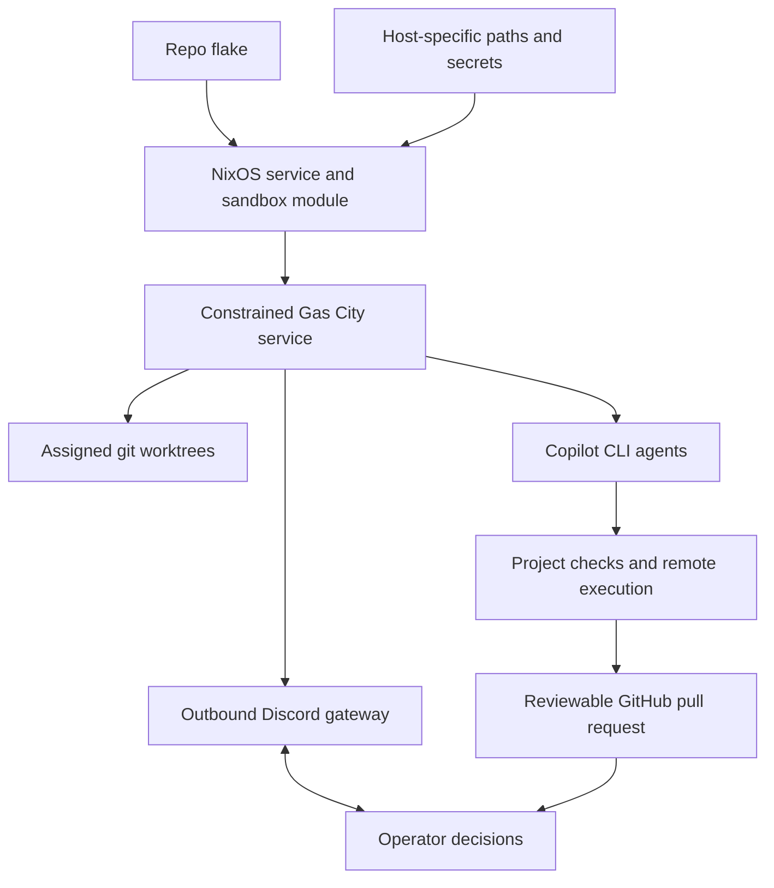
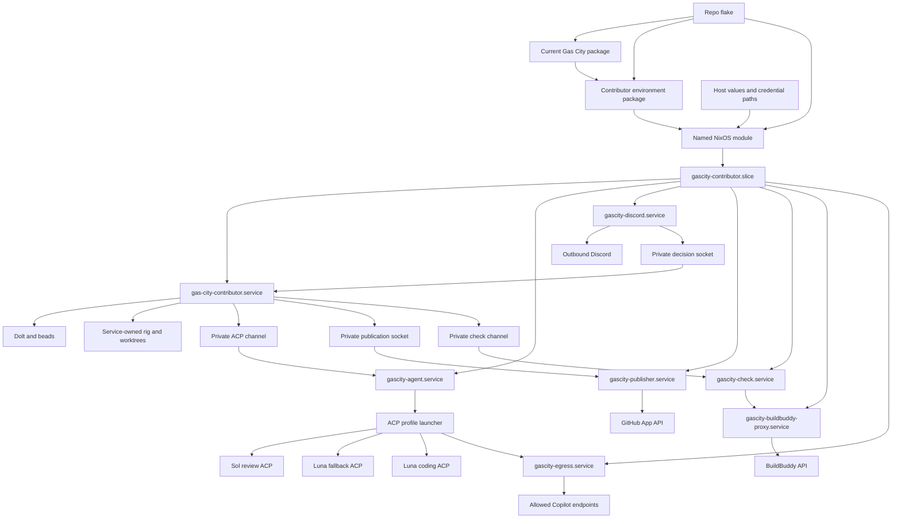
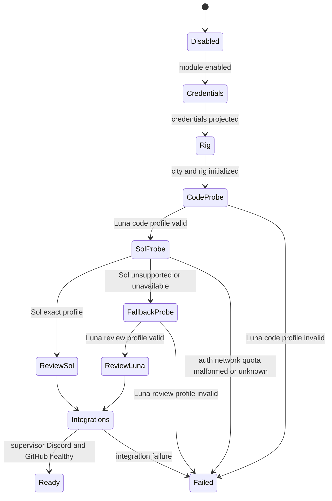
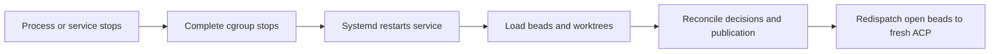
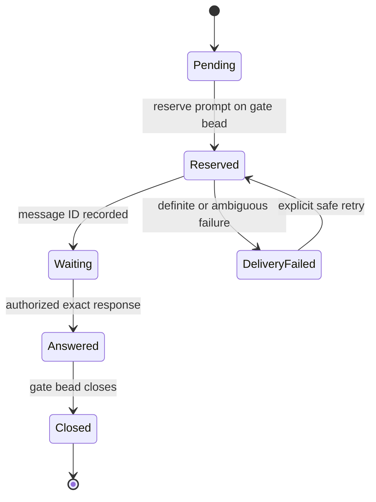
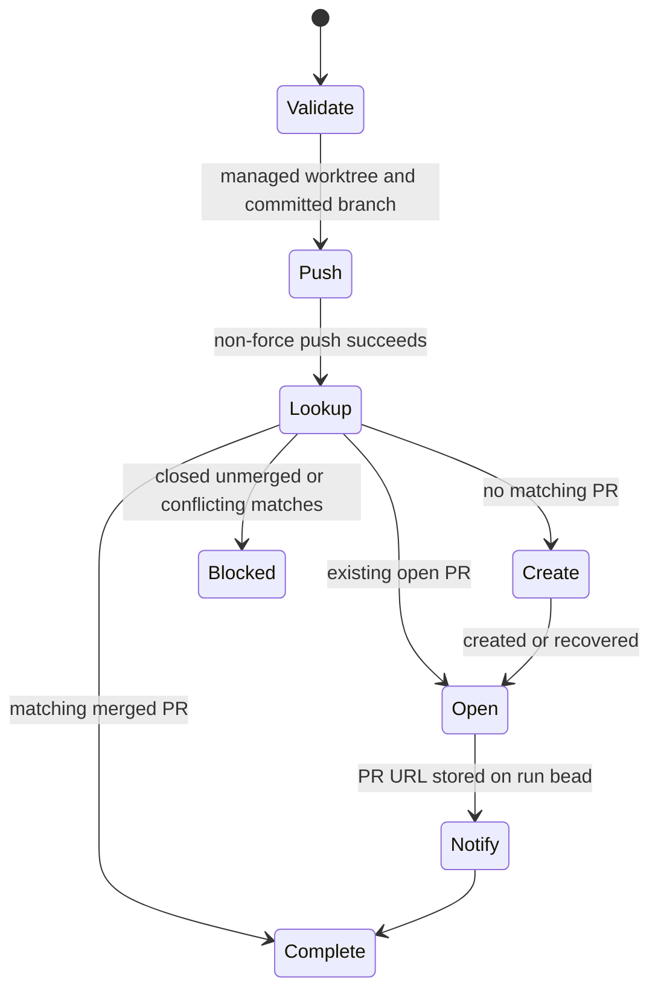
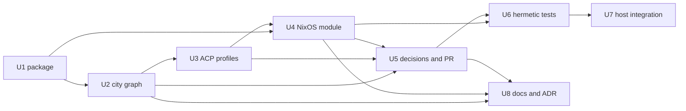

# Gas City Contributor Environment - Plan

## Goal Capsule

- **Objective:** Establish a complete, repo-defined Gas City contributor environment that can deliver software changes to reviewable pull requests with minimal operator intervention.
- **Product authority:** This plan owns the contributor environment only. The Bazel and BuildBuddy conversion is a separate proving workload, and d2b product behavior is not active scope.
- **Open blockers:** None. Implementation must determine generated Nix hashes and may document narrowly scoped upstream test exclusions when the Nix sandbox cannot run a check.

---

## Product Contract

### Summary

The repository will provide a host-native Gas City environment with the Compound Engineering and Discord packs and Copilot CLI as the agent harness.
The environment will run within a constrained NixOS slice with one Gas City lifecycle service and narrow credential sidecars, deliver reviewable pull requests autonomously, and involve the operator only for critical product decisions and merge approval.

### Problem Frame

The current Copilot workflow consumes substantial host resources through its interactive TUI even when the underlying model work is less demanding.
The prior repository-local process is inflexible, relies heavily on repository files for orchestration state, takes a long time to complete, and often requires manual intervention when work drifts.

The operator needs durable orchestration that can continue across sessions, control resource use, and complete a software project without routine babysitting.
The first representative workload will ask Gas City to migrate as much of `make check` as practical to Bazel and BuildBuddy while preserving local and integration-only lanes and using the BuildBuddy free tier efficiently.

### Key Decisions

- **Use Gas City as the canonical orchestrator.** The environment will not inherit the prior repository-local workflow contract. Factual upstream constraints recorded in `docs/adr/0053-gascity-contributor-infrastructure.md` remain research inputs. Governs R10 and R14.
- **Use one host-native constrained slice.** One Gas City lifecycle service and narrow credential sidecars preserve host worktrees, Nix, and caching while ACP removes the TUI and tmux execution path. Governs R5-R9.
- **Keep reusable host policy in the repo flake.** The flake will export the NixOS module that defines identity, service, sandbox, and resource policy; `/etc/nixos` will only import it and supply host-specific values. Governs R1-R3.
- **Deliver the complete path in the first accepted version.** Sandboxing, scoped credentials, Discord decisions, resource controls, durable state, model routing, and unattended pull-request delivery all gate acceptance. Governs R5-R20.
- **Keep merge and critical product judgment human-owned.** Gas City may ask targeted questions and open a pull request, but it must not merge. Governs R12 and R13.
- **Bind models by workflow role with one approved fallback.** Planning and review prefer the high-context profile, while Luna at `max` is the only permitted degradation target. Governs R18-R20.
- **Exclude repository-specific delivery hardening.** Gas City will use its native workflow state and ordinary dependency locks. Governs R21.

<!-- ce-section: work-relationships -->
### How This Work Fits Together

This plan owns the Gas City contributor environment.
The surrounding breakdown is current context, not a committed roadmap.

- **Depends on:** The host NixOS configuration imports the repo's exported module and supplies host-specific secrets, paths, and enablement.
- **Enables:** A separate Bazel and BuildBuddy conversion can use the environment as its proving workload.
- **Can proceed independently of:** d2b runtime, daemon, broker, microVM, and consumer-facing feature work.
- **Shares:** The proving workload and the environment share the requirement that remote execution and caching remain efficient enough for the BuildBuddy free tier.

### Actors

- A1. **Operator:** Starts work, answers critical product questions, reviews pull requests, and decides when to merge.
- A2. **Gas City service:** Owns durable workflow state, pack orchestration, session lifecycle, concurrency, and recovery.
- A3. **Copilot CLI agents:** Perform planning, review, implementation, verification, and bounded fix work inside assigned worktrees under the required role-specific model policy.
- A4. **External services:** GitHub receives branches and pull requests, Discord carries notifications and decisions, and BuildBuddy supplies remote execution and caching for workloads that request it.

### Requirements

**Environment ownership**

- R1. The repo flake must expose a reproducible contributor environment containing Gas City, the Compound Engineering and Discord packs, Copilot CLI integration, and every runtime dependency those capabilities require.
- R2. The repo flake must expose a reusable NixOS module defining the dedicated service identity, persistent Gas City service, sandbox policy, resource policy, and managed state and cache locations.
- R3. The host NixOS configuration must only import the module and provide host-specific enablement, paths, and secrets rather than duplicating reusable policy.
- R4. The setup must remain contributor infrastructure and must not alter d2b consumer or runtime behavior.

**Isolation and host safety**

- R5. Gas City and its child processes must run under a dedicated identity within one host-native confinement and resource boundary.
- R6. Writable access must be limited to assigned worktrees, Gas City state, and explicit caches; selected host configuration may be exposed through a read-only allowlist that excludes secret-bearing paths.
- R7. GitHub, Discord, and BuildBuddy must use dedicated scoped credentials, while only the Copilot CLI authentication material required by the service may be projected as a managed secret.
- R8. The service must enforce a city-wide CPU, memory, and process budget together with a configurable agent concurrency cap.
- R9. The service must retain the loopback and outbound network access required by Gas City and its packs while exposing no public listening endpoint.

**Orchestration and delivery**

- R10. The city must compose the Compound Engineering and Discord packs as peer capabilities while preserving their native formulas and agent bindings.
- R11. A run must accept a software project request, execute implementation and verification with Copilot CLI agents, push a branch, and open a reviewable pull request.
- R12. Discord must provide outbound notifications and targeted product-decision prompts that resume the same durable run after the operator responds.
- R13. Gas City must never merge a pull request; merge remains an explicit operator action.
- R14. Durable workflow state must survive terminal closure, agent-session loss, and service restart without depending on repository-local planning files as the orchestration state machine.
- R15. Routine recovery and bounded fix work must proceed without operator intervention, while decisions that would change product behavior or scope must pause and request input.

**Acceptance workload**

- R16. The environment must support the Bazel and BuildBuddy conversion as a proving workload without making that conversion part of this plan's implementation scope.
- R17. The proving workload must be able to use remote execution and cache reuse without avoidable repeated computation or transfer that would waste the BuildBuddy free tier.

**Agent model policy**

- R18. Every planning and review stage must target `gpt-5.6-sol` with `xhigh` reasoning and the `long_context` tier.
- R19. Every coding, implementation, and code-fix stage must use `gpt-5.6-luna` with `max` reasoning.
- R20. If the R18 profile is unavailable, planning and review may fall back only to `gpt-5.6-luna` with `max`; any unavailable R19 profile or other substitution must block the stage with an actionable error.

**Workflow simplicity**

- R21. Gas City runs must rely on native workflow state and ordinary dependency locks rather than repository-specific delivery machinery.



### Key Flows

- F1. **Activate the environment**
  - **Trigger:** A1 enables the exported module in the host configuration.
  - **Actors:** A1, A2, A4
  - **Steps:** NixOS evaluates the repo-defined module, provisions the dedicated service boundary and managed credentials, starts Gas City, and verifies its outbound integrations.
  - **Outcome:** The city is ready to accept work without exposing a public endpoint.
  - **Covers:** R1-R10

- F2. **Deliver a software project**
  - **Trigger:** A1 submits a project outcome and its requirements.
  - **Actors:** A1, A2, A3, A4
  - **Steps:** Gas City creates or assigns worktrees, orchestrates Copilot CLI agents, runs the project's required checks, performs bounded fixes, pushes the branch, and opens a pull request.
  - **Outcome:** A1 receives a reviewable pull request and a Discord notification.
  - **Covers:** R10-R20

- F3. **Resolve a critical product decision**
  - **Trigger:** Continuing would require choosing or changing product behavior or scope.
  - **Actors:** A1, A2, A3, A4
  - **Steps:** The run preserves its state, sends a targeted Discord prompt, records the response, and resumes from the blocked decision.
  - **Outcome:** Product judgment remains human-owned without requiring continuous monitoring.
  - **Covers:** R12, R14, R15

- F4. **Contain and recover from failure**
  - **Trigger:** An agent exceeds a resource budget, attempts disallowed host access, loses its session, or fails a bounded work step.
  - **Actors:** A1, A2, A3
  - **Steps:** The service enforces its boundary, records the failure, retries or repairs within configured limits, and requests operator input only when automated recovery would cross R15.
  - **Outcome:** The host remains available and the run is either recovered or left in a diagnosable blocked state.
  - **Covers:** R5-R9, R14, R15

### Acceptance Examples

- AE1. **Autonomous delivery**
  - **Covers R11-R15.**
  - **Given:** A project request has complete requirements and valid service credentials.
  - **When:** Gas City runs the project without a critical product fork.
  - **Then:** It opens a reviewable pull request and notifies A1 without routine intervention or automatic merge.

- AE2. **Filesystem containment**
  - **Covers R5-R7.**
  - **Given:** An agent attempts to write outside its assigned worktree, managed state, or explicit cache.
  - **When:** The write reaches the service boundary.
  - **Then:** The write is denied, unrelated host data remains unchanged, and the run records an actionable failure.

- AE3. **Resource containment**
  - **Covers R8 and R15.**
  - **Given:** Copilot sessions collectively exceed the configured city budget or concurrency cap.
  - **When:** The service enforces its resource policy.
  - **Then:** Work is throttled or stopped within the city boundary while the rest of the host remains usable.

- AE4. **Discord decision**
  - **Covers R9, R12, and R15.**
  - **Given:** A run reaches a product decision that cannot be defaulted safely.
  - **When:** Gas City sends an outbound Discord prompt and A1 responds.
  - **Then:** The same run resumes with the recorded decision and no public host endpoint is required.

- AE5. **Bazel and BuildBuddy proving workload**
  - **Covers R16 and R17.**
  - **Given:** The separate workload asks Gas City to move eligible `make check` work to Bazel and BuildBuddy.
  - **When:** Gas City delivers the workload through its normal workflow.
  - **Then:** The pull request preserves local and integration-only lanes, demonstrates faster check execution, and shows cache and remote-execution behavior suitable for the BuildBuddy free tier.

- AE6. **Restart recovery**
  - **Covers R14 and R15.**
  - **Given:** The terminal, an agent session, or the Gas City service stops during an active run.
  - **When:** The service and run restart.
  - **Then:** Durable state identifies the last completed work and the run resumes or reports a precise blocked condition without reconstructing progress from repository-local planning files.

- AE7. **Role-specific model routing**
  - **Covers R18-R20.**
  - **Given:** A run enters a planning, review, coding, implementation, or code-fix stage.
  - **When:** Gas City dispatches the Copilot CLI agent.
  - **Then:** Runtime status and diagnostic logs identify the required role profile or the single approved Luna fallback, and every other mismatch blocks the stage visibly.

- AE8. **No inherited delivery hardening**
  - **Covers R21.**
  - **Given:** Gas City starts or completes a software delivery run.
  - **When:** The run advances from planning through pull-request creation.
  - **Then:** It uses native workflow state without repository-specific delivery artifacts or evidence-pinning beyond normal dependency locking.

### Success Criteria

- Three representative software projects independently reach reviewable pull requests.
- Human review finds that each delivered change meets all stated requirements and uses clean, simple code.
- Operator intervention is limited to critical product decisions, exceptional recovery, and pull-request merging.
- Every stage satisfies R18-R20 with no unapproved model substitution.
- No run spends time on the delivery hardening excluded by R21.
- No acceptance run mutates host paths outside the allowlist, exposes unrelated operator secrets, makes the host unusable through resource exhaustion, or opens a public service endpoint.
- The Bazel and BuildBuddy proving workload demonstrates a faster `make check` path and cache behavior that avoids unnecessary BuildBuddy free-tier consumption.

### Scope Boundaries

- The Bazel and BuildBuddy conversion itself is not implemented by this plan.
- Prior repository-local workflow machinery does not govern Gas City runs created by this environment.
- Ordinary flake and dependency locks remain in scope for reproducibility.
- Automatic pull-request merging is excluded.
- Public Discord interaction endpoints are excluded; the first version uses the outbound gateway path.
- Rootless containers and per-worker sandbox identities are excluded from the first version.
- Changes to d2b product behavior, runtime architecture, or consumer-facing configuration are excluded.

### Dependencies and Assumptions

- The host runs NixOS and can import a NixOS module exported by this repo's flake.
- Compatible Gas City and pack revisions remain available and can be pinned reproducibly.
- Gas City's supervisor, ACP sessions, worktrees, loopback control plane, and pack runtimes can operate inside the selected service boundary.
- Copilot CLI is assumed to expose the controls required by R18-R20, and its authentication can be projected narrowly without exposing the operator's ambient home directory.
- Dedicated GitHub, Discord, and BuildBuddy credentials can be provisioned with the scopes required by their integrations.
- The separate Bazel and BuildBuddy workload will provide its own detailed requirements and performance baseline.

### Sources and Research

- `docs/adr/0053-gascity-contributor-infrastructure.md` documents prior upstream measurements, pack composition, tmux and worktree behavior, loopback control-plane needs, supervisor behavior, and pack runtime dependencies.
- `flake.nix` currently exposes the d2b NixOS module and development shells but no complete Gas City environment or Gas City service module.
- [Gas City](https://github.com/gastownhall/gascity)
- [Gas City Compound Engineering pack](https://github.com/gastownhall/gascity-packs/tree/main/compound-engineering)
- [Gas City Discord pack](https://github.com/gastownhall/gascity-packs/tree/main/discord)

---

## Planning Contract

### Product Contract Preservation

The Product Contract remains authoritative.
Planning preserves every R, A, F, and AE identifier.
The user added R21 and AE8 and narrowed R12 and AE7 to exclude repository-specific delivery hardening.
No other product scope changed.

### Key Technical Decisions

- KTD1. **Pin current executable inputs only.** Add non-flake inputs for Gas City at `6e0399fb970190a35c3e3d5d272a02becec55ffe` and gascity-packs at `f3826035bb7de7c34621c2fdcd8620ab5a18bb08`. Use `llm-agents.nix` at `387989ee56d550d86d46d9458ad68a55b9e0ca3b` for Copilot CLI 1.0.79. Use a package-only nixpkgs input at `f13ff45afd1bb73e640eaa08a7066dbed07e3238` for Go 1.26.5 and Bazel 9.1.1 without changing the repo's main nixpkgs input. Package Dolt 2.1.7 and source-build beads at `bf97b73749ac3ef2fca2365b54537ac041ad4293`.
- KTD2. **Export a separate flake surface.** (session-settled: user-directed - chosen over reusable policy authored in `/etc/nixos`: the repo flake must own the module and sandbox policy) Export `nixosModules.gasCityContributor`, `packages.<system>.gascity`, `packages.<system>.gas-city-contributor`, and `devShells.<system>.gas-city`. Do not alter `nixosModules.default` or add an overlay.
- KTD3. **Build current Gas City from source.** Use `buildGoModule`, exact revision metadata, and upstream checks. Document only check exclusions that cannot run hermetically in the Nix sandbox.
- KTD4. **Keep immutable configuration separate from mutable state.** Build the city definition, sanitized upstream packs, local pack, provider profiles, scripts, and managed instructions into the Nix store. Keep `.gc`, Dolt, beads, rigs, branches, worktrees, caches, and runtime status in service-owned directories.
- KTD5. **Use one lifecycle owner and one resource slice.** (session-settled: user-approved - chosen over a rootless container or per-worker sandbox: host-native integration keeps Gas City, Nix, and worktrees simple) `gas-city-contributor.service` is the sole Gas City lifecycle owner. Worker and sidecar units use `PartOf`, `BindsTo`, and stop propagation from the main service inside `gascity-contributor.slice`. The agent launcher uses `KillMode=control-group` so main-service stop, failure, or cancellation drains every ACP process.
- KTD6. **Use ACP with role-specific tool policy and exact child ownership.** The city default session runtime is `subprocess` for non-model control agents. Each custom ACP provider opens one authenticated launcher connection for one run and bead. The launcher owns one process group, pidfd, concurrency lease, and stdio stream per connection. EOF or cancel interrupts that exact child, waits a bounded grace period, kills its process group if needed, and releases the lease atomically.
- KTD7. **Use three dedicated Copilot profiles.** Empirical ACP probes showed that command-line `--model` was ignored. Dedicated `COPILOT_HOME` settings selected the effective model and context. Use Sol with `long_context` for planning and review, Luna with `long_context` for review fallback, and Luna with default context for coding. ACP startup supplies `xhigh` or `max` effort.
- KTD8. **Select the review profile before work.** (session-settled: user-directed - chosen over Sol-only failure or unrestricted fallback: Luna at `max` is the only approved planning and review fallback) Activation probes Luna coding and Sol review. It probes Luna review fallback only after Sol is classified unsupported or unavailable. Authentication, network, quota, malformed, or unknown failures block readiness.
- KTD9. **Generate executable role bindings.** Preserve native Compound planning, review, synthesis, and bounded fixes. Generate sanitized agent definitions from `agent-role-matrix.toml`, then compare the resolved catalog with the matrix at readiness. Split any mixed review and edit role into review, edit, and re-verification stages.
- KTD10. **Make beads the continuation and retry authority.** Gas City does not resume an ACP conversation. A fresh ACP process receives the open bead, durable summaries, current branch and commit, worktree status, prior review state, retry counters, and next action. Systemd owns only process restart.
- KTD11. **Use a deterministic Discord sidecar.** (session-settled: user-approved - chosen over a public HTTPS interactions endpoint: outbound Discord is sufficient for notifications and targeted decisions) A separate `gascity-discord` identity owns the bot token and outbound gateway. It establishes one credential-free, close-on-exec channel to the main service before ACP workers start. The gate bead performs an atomic first-answer transition. No public interaction service, approval ledger, signature, receipt, or evidence record is created.
- KTD12. **Use a credential-isolated publisher and stop at the PR.** (session-settled: user-approved - chosen over local-only completion or automatic merge: Gas City must open a reviewable pull request and leave merge to the operator) A separate `gascity-publisher` identity owns the GitHub App key and establishes one close-on-exec channel before ACP workers start. The main service sends an unlinked Git bundle FD and bounded metadata. The publisher imports into its own bare clone with isolated Git configuration and hooks disabled, pushes to the fixed HTTPS repository without force, finds a PR by exact head and base, creates only when absent, notifies, and stops.
- KTD13. **Project only scoped credentials.** (session-settled: user-approved - chosen over exposing the operator home or ambient credentials: only dedicated service credentials and the required Copilot token enter the sandbox) Only `gascity-agent` receives the dedicated Copilot token. Discord and GitHub credentials remain in their sidecars. A `gascity-buildbuddy-proxy` identity generates an in-memory Envoy configuration that injects `x-buildbuddy-api-key` and establishes HTTP/2 TLS to `remote.buildbuddy.io:443` with the system CA, fixed SNI, and SAN verification. The proxy and uncredentialed `gascity-check` runner share a private network namespace whose loopback listener is inaccessible to other units.
- KTD14. **Separate PR creation, merge, and rollout gates.** Repo checks and NixOS host integration gate implementation PR readiness. One real-credential Copilot, Discord, GitHub, and BuildBuddy smoke gates human merge. Three representative projects and full BuildBuddy efficiency measurements are post-merge rollout acceptance.
- KTD15. **Supersede obsolete Gas City delivery decisions.** Add ADR 0056. Mark ADR 0053's repository-specific delivery-hardening decisions superseded while retaining its contributor-infrastructure classification and measured upstream facts.
- KTD16. **Keep native Compound.** Gas City-owned configuration and state use native workflow state and do not depend on retired repository-specific delivery machinery.
- KTD17. **Reuse existing Gas City control through fixed wrappers.** A root-owned `gascity-operators` group may execute only package-provided `submit`, `status`, and `cancel` wrappers as `gascity` through narrow sudo rules. Wrappers validate size, identifiers, cancellation state, and redacted output. No second control protocol is introduced.
- KTD18. **Keep all project checks inside the contributor boundary.** The uncredentialed check runner uses `local?root=/var/lib/gascity-check/nix-root` with no daemon, no ambient substituters, configured trusted keys, bounded jobs and cores, and a store root inside its quota. The check namespace has no external interface. HTTP and HTTPS, Nix substituter traffic, and fixed-output fetches use an inherited relay to the allowlisting egress proxy. BuildBuddy gRPC uses the private Envoy listener. Direct network bypass is impossible.
- KTD19. **Bound external retries and durable growth.** Discord and GitHub use at most three attempts, honor provider retry hints, and reconcile ambiguous mutations before retry. Systemd project quotas cap each persistent service directory, and assertions keep their sum within one total city quota. Activation fails when the backing filesystem lacks project-quota support. Submission and active heavy stages stop before the host reserve is consumed.
- KTD20. **Hide control surfaces from ACP workers.** Each Copilot ACP process runs under `gascity-agent` inside a bubblewrap user, mount, PID, and network namespace with no external interface. A local FD relay exposes one loopback proxy port backed by a close-on-exec channel to the allowlisting egress sidecar. Namespace nftables permit only that local proxy. The sidecar permits required Copilot endpoints and rejects arbitrary public, private, link-local, multicast, metadata, and DNS-rebinding destinations. The process receives only the assigned worktree, required runtime closure, approved wrappers, and a scrubbed environment.
- KTD21. **Bind active runs to a compatible generation.** Each root bead records the city generation and state schema version. Active runs create lifecycle-managed Nix GC roots for their immutable package, city, packs, profiles, and instructions. Terminal run cleanup removes those roots. A restart continues with the original compatible generation or blocks with an actionable migration error; it never reinterprets old state with incompatible formulas.

### Fixed Upstream Inputs

| Input | Revision | Purpose |
| --- | --- | --- |
| `gastownhall/gascity` | `6e0399fb970190a35c3e3d5d272a02becec55ffe` | Supervisor delegation, ACP providers, configuration, and workflow engine |
| `gastownhall/gascity-packs` | `f3826035bb7de7c34621c2fdcd8620ab5a18bb08` | Compound Engineering, Discord, GitHub, and base Gas City packs |
| `numtide/llm-agents.nix` | `387989ee56d550d86d46d9458ad68a55b9e0ca3b` | Copilot CLI 1.0.79 package |
| `NixOS/nixpkgs` package input | `f13ff45afd1bb73e640eaa08a7066dbed07e3238` | Go 1.26.5 and Bazel 9.1.1 only |
| Dolt | `2.1.7` | Gas City storage requirement |
| beads | `bf97b73749ac3ef2fca2365b54537ac041ad4293` | Conditional workflow-state updates required by Gas City |

### Implementation Assumptions

- One service UID provides service-to-host isolation, not secrecy between agents.
- The service owns its clone and worktrees. It does not operate in the maintainer's checkout.
- Generated Nix hashes and the Go vendor hash are implementation-time values derived from KTD1.
- A Gas City or pack check that requires unavailable external services may be excluded from the package build only when the exclusion is narrow, documented, and covered by another plan test.
- ACP is in public preview. The pinned-binary smoke test and provider fixtures are the compatibility boundary.

---

## High-Level Technical Design

### Component Topology



### Flake and Package Surface

`flake.nix` adds the three KTD1 inputs and exports:

- `nixosModules.gasCityContributor`
- `packages.<system>.gascity`
- `packages.<system>.gas-city-contributor`
- `devShells.<system>.gas-city`
- `checks.x86_64-linux.gas-city-package-smoke`

`nixosModules.default`, consumer examples, templates, overlays, and applications remain unchanged.

`pkgs/gascity/default.nix` builds the pinned Go source with real revision metadata and upstream checks.
`nix/gas-city-contributor/default.nix` assembles Gas City, Copilot CLI, bubblewrap, nftables, tinyproxy, Envoy, Python, Git, certificates, OpenSSL, jq, procps, lsof, flock, Dolt, beads, the managed city, sanitized packs, and operator commands.

### Named Module Contract

The option namespace is `services.gasCityContributor`.

| Option | Type and default | Contract |
| --- | --- | --- |
| `enable` | boolean, `false` | Disabled state is inert |
| `repository.githubSlug` | `owner/repo` string | Clone, push, and GitHub API authority |
| `repository.baseBranch` | branch string | Pull-request base and clone branch |
| `repository.rigName` | identifier, `"d2b"` | Gas City rig name |
| `operators.users` | non-empty list of user names | Members of `gascity-operators` |
| `credentials.copilotTokenFile` | absolute string | Dedicated Copilot token source |
| `credentials.githubPrivateKeyFile` | absolute string | GitHub App private key |
| `credentials.discordBotTokenFile` | absolute string | Discord bot token |
| `credentials.buildBuddyApiKeyFile` | nullable absolute string | Optional BuildBuddy API key |
| `github.appId` | numeric string | GitHub App ID |
| `github.installationId` | numeric string | Repository installation |
| `discord.applicationId` | numeric string | Discord application |
| `discord.guildId` | numeric string | Allowed guild |
| `discord.channelId` | numeric string | Allowed channel |
| `discord.operatorUserIds` | non-empty list | Authorized decision makers |
| `hostReadOnlyPaths` | list of absolute strings, `[]` | Explicit host configuration projections |
| `network.allowedDomains` | list of domain patterns, official Copilot endpoint set | Copilot egress proxy allowlist |
| `resources.cpuQuotaPercent` | positive integer, `100` | Contributor slice CPU quota |
| `resources.memoryHighPercent` | integer, `25` | Contributor slice pressure threshold |
| `resources.memoryMaxPercent` | integer, `30` | Contributor slice hard memory ceiling |
| `resources.memorySwapMaxBytes` | non-negative integer, `0` | Swap ceiling |
| `resources.tasksMax` | positive integer, `512` | Complete cgroup task limit |
| `resources.maxConcurrentAgents` | positive integer, `2` | ACP concurrency limit |
| `resources.maxActiveRuns` | positive integer, `1` | Concurrent workflow limit |
| `resources.maxHeavyChecks` | positive integer, `1` | Concurrent Nix or BuildBuddy check limit |
| `resources.nixMaxJobs` | positive integer, `1` | Local Nix store build concurrency |
| `resources.nixBuildCores` | positive integer, `2` | Cores requested per Nix build |
| `storage.totalQuotaBytes` | byte count, 250 GiB | Aggregate persistent city budget |
| `storage.stateQuotaBytes` | byte count, 100 GiB | Main state and worktree quota |
| `storage.cacheQuotaBytes` | byte count, 25 GiB | Main service cache quota |
| `storage.publisherQuotaBytes` | byte count, 5 GiB | Publisher bare-clone quota |
| `storage.checkQuotaBytes` | byte count, 100 GiB | Check-runner Nix store, output, and cache quota |
| `storage.minFreeBytes` | byte count, 20 GiB | Host free-space reserve |
| `ports.supervisor` | unprivileged port, `8372` | Loopback supervisor port |
| `ports.dolt` | unprivileged port, `3307` | Loopback Dolt port |

Assertions reject:

- Relative credential paths.
- Credential paths under `/nix/store`.
- Missing enabled-service values.
- Empty local operator lists.
- Empty Discord operator lists.
- Invalid IDs, repository slugs, branches, or ports.
- Conflicting service ports.
- Memory high greater than or equal to memory max.
- Persistent service quotas whose sum exceeds `storage.totalQuotaBytes`.
- Host projections of `/`, complete home trees, broad service state, credential trees, or all of `/etc/nixos`.
- A host projection equal to a credential source.
- Empty, IP-literal, or private-address egress allowlist entries.
- Credential sources that are symlinks, non-regular files, service-owned, group-writable, or below unsafe writable ancestors.
- Host projections that resolve to sockets, devices, FIFOs, pseudo-filesystems, or writable ancestors.

### Service and Filesystem Boundary

The NixOS module creates `gascity`, `gascity-agent`, `gascity-discord`, `gascity-publisher`, `gascity-egress`, and optional check and BuildBuddy-proxy identities inside `gascity-contributor.slice`.
The main service is the only Gas City lifecycle owner.
Sidecars own external integration credentials and establish narrow close-on-exec channels before ACP workers start.

The main service uses:

- `StateDirectory=gascity-contributor`.
- `CacheDirectory=gascity-contributor`.
- `RuntimeDirectory=gascity-contributor`.
- `StateDirectoryQuota` and `CacheDirectoryQuota` from the module options.
- Explicit `HOME`, `XDG_CONFIG_HOME`, `XDG_STATE_HOME`, `XDG_CACHE_HOME`, and `XDG_RUNTIME_DIR` under managed service paths.
- `ProtectSystem=strict`.
- `ProtectHome=true`.
- Private temporary storage and devices.
- Empty capability bounding and ambient sets.
- `NoNewPrivileges=true`.
- Kernel, cgroup, hostname, clock, realtime, and SUID protections.
- Unix, IPv4, and IPv6 address families only.
- IP socket binding denied except for the configured loopback supervisor and Dolt ports; declared private Unix sockets remain allowed.
- Explicit loopback bind addresses for the supervisor and Dolt.
- ACP worker namespaces have no direct network interface. Their only network path is the inherited local relay to the allowlisting egress sidecar.
- A dedicated nftables table permits the supervisor and Dolt loopback ports only to the declared service identities and preserves unrelated firewall state.
- Writable access only to state, cache, runtime, rigs, and worktrees.
- A minimized read namespace that hides unrelated host configuration, runtime sockets, and process details.
- Selected host paths rebound read-only below the private projection root.
- `UMask=0077`.
- CPU, memory, swap, task, and concurrency limits.
- `KillMode=control-group`.
- `Restart=on-failure` with bounded start limits.

Gas City receives its fixed `GC_HOME`, `GC_SUPERVISOR_SYSTEMD_UNIT`, and `GC_SUPERVISOR_SYSTEMD_SCOPE=system`.
The service starts the supervisor directly and disables Gas City's binary-drift restart ownership.
No child survives outside the service cgroup.
Every worker and sidecar unit is bound to the main service lifecycle and shares the contributor slice.
Review providers expose read and search tools only.
Coding providers expose editing and approved project-check tools only.
Tool subprocesses receive no Discord or GitHub credential.
Only the BuildBuddy proxy may read the optional API-key file.
The uncredentialed check runner receives only the proxy endpoint.

The module creates `gascity-operators` and narrow sudo rules for package-provided `submit`, `status`, and `cancel` wrappers.
Wrappers validate structured, size-bounded inputs and redact status output.

The check runner initializes and uses an unprivileged local Nix store under its service state.
Approved wrappers serialize heavy work and pass the configured jobs and cores.
The check namespace has loopback only.
A local FD relay connects HTTP and HTTPS proxy variables to the allowlisting egress sidecar.
Nix substituters and fixed-output fetches inherit those proxy variables and cannot connect directly.
BuildBuddy uses the private Envoy listener in the same namespace.
The host Nix daemon and host store are not mutation surfaces for Gas City.

### Activation and ACP Profile Selection



Each ACP profile probe:

1. Creates a temporary dedicated `COPILOT_HOME`.
2. Installs the managed profile `settings.json`.
3. Projects `COPILOT_GITHUB_TOKEN`.
4. Starts ACP with `--no-custom-instructions`, `--disable-builtin-mcps`, `--no-remote-export`, and the profile effort.
5. Completes ACP initialization and a bounded diagnostic prompt.
6. Confirms the reported model and context tier.
7. Classifies failures through a closed error map.

The service writes only generation identity, readiness, selected review profile, coding profile, and an actionable error code to runtime status.
It records no prompt, response, receipt, or raw evidence object.
`submit` rejects work unless the current generation is ready.

### Agent Role Routing

`agent-role-matrix.toml` lists every model-backed Gas City agent exactly once and generates the provider and session fields in sanitized agent definitions.

- The city default session runtime is `subprocess`.
- The control dispatcher and every non-model helper resolve to `subprocess`.
- Requirements, planning, decomposition, and synthesis use the planning provider.
- Review selection, reviewers, and verification use the read-only review provider.
- Implementation and every code edit use the coding provider.
- Native Compound formulas remain authoritative.
- A mixed resolver is replaced by a review judgment, a coding edit through native `ce-work`, and review re-verification.
- Every provider uses `session = "acp"`.
- Readiness compares the resolved Gas City catalog with the matrix.
- The policy test fails on a missing, duplicate, unknown, or `auto` mapping.

### Durable Continuation

ACP process loss ends the live conversation.
Gas City keeps the open bead, summaries, branch, commits, worktree, review state, retry counters, and next action.
A fresh ACP process receives that durable context and continues.
Bead counters own session, network, task-exhaustion, decision, and publication retries.
Systemd owns only service process restart.

The service restart sequence is:



### Discord Decision State



The Discord sidecar validates guild, channel, operator, reply target, run ID, decision ID, declared choice, and gateway event ID before forwarding over the pre-established channel.
The main service performs an atomic compare-and-set on the gate bead.
The first valid answer wins.
Identical duplicates are no-ops.
Conflicting, stale, malformed, unauthorized, or unknown answers do not mutate state.
A message edit or reply to an orphaned prompt does not mutate state.
A restart closes any answered gate that remained open.
An ambiguous send is reconciled before retry.

### GitHub Publication State



Publication derives the worktree and branch from the run bead.
The main service sends the publisher a bounded request containing the fixed repository slug, managed branch namespace, base, head, and worktree identity.
The publisher validates its peer identity and fixed GitHub installation before acting.
It blocks on dirty or ambiguous Git state, base-as-head, remote rewriting, cross-repository identity, branch divergence, a closed unmerged PR, or multiple matches.
Repeated publication returns the same PR URL.
No merge operation is implemented or invoked.

### Failure Policy

| Failure | Behavior |
| --- | --- |
| Filesystem denial | Block the stage without retry |
| CPU excess | Kernel throttles the service |
| ACP concurrency full | Queue until a city slot opens |
| Task exhaustion | One infrastructure retry, then block |
| OOM | Stop the service cgroup and allow one bounded restart |
| ACP process loss | Start a fresh ACP process with durable reconstruction |
| Luna profile failure | Block readiness |
| Sol unsupported or unavailable | Select Luna review fallback |
| Sol auth, network, quota, malformed, or unknown failure | Block readiness |
| Discord definite send failure | At most three attempts with provider retry hints |
| Discord ambiguous send | Reconcile or block |
| GitHub branch divergence | Block without force |
| GitHub transient failure | At most three attempts with provider retry hints |
| GitHub permanent 4xx | Block without retry |
| GitHub ambiguous PR creation | Repeat exact head and base lookup before mutation |

---

## System-Wide Impact and Risks

### Impact

- The flake gains one named NixOS module, two packages, one dev shell, and one realized smoke check.
- The host gains one contributor slice, one Gas City lifecycle service, worker and integration sidecars, and one operator group with narrow sudo wrappers.
- The contributor environment owns a service clone and worktrees. It does not use the maintainer checkout.
- Gas City and ACP workers share one UID and can read city-owned worktrees and orchestration state. The threat model protects the host and external integration credentials. It does not promise adversarial isolation between agents.
- Planning providers can write planning artifacts in managed worktrees. Review providers are read-only. Coding providers edit only managed worktrees and use approved wrappers for project checks, Nix, and BuildBuddy. Decisions and publication remain unavailable to model-backed roles.

### Risks and Mitigations

| Risk | Mitigation and verification |
| --- | --- |
| ACP preview changes | Pin Copilot CLI 1.0.79 and Gas City, run provider fixtures, and fail readiness on protocol drift |
| Source patches drift | Keep patches narrow, build upstream checks, and validate the sanitized pack graph |
| Shared UID can alter sibling city state | Limit active runs to one by default, separate worktrees by run, retain bead-backed recovery, and document that hostile same-UID isolation is out of scope |
| Copilot token can be used by ACP workers | Use a dedicated token with only Copilot Requests and minimum repository scope; redact it from tools and logs |
| Discord or GitHub keys reach agents | Keep keys in separate identities and use pre-established close-on-exec channels that ACP workers never inherit |
| Host files remain readable despite write protection | Hide broad host trees and runtime sockets, project only approved regular files or directories, and test canary reads |
| Nix builds affect the host outside the city budget | Use the check sidecar's unprivileged local store, cgroup, quota, job limits, and allowlisted egress; never use the host Nix daemon |
| Resource defaults do not fit the host | Record idle, one-agent, and two-agent CPU, memory peak, tasks, I/O, and wall time; require at least 25 percent headroom before raising concurrency above one active run |
| Compound review fanout consumes excessive credits or time | Limit active runs and heavy checks, queue lanes through the ACP cap, retain native bounded iterations, and report lane, retry, queue, wall-time, and AI-credit totals |
| State and cache growth exhaust disk | Enforce state and cache quotas, refuse submission and stop heavy stages before `storage.minFreeBytes` is consumed, and provide explicit cleanup for eligible closed runs |
| Discord or GitHub retries amplify traffic | Use at most three attempts, honor retry headers, reject permanent failures, and reconcile ambiguous writes before retry |
| BuildBuddy proof is satisfied by local cache | Clear local output state between seeded and warm runs, hold cgroup limits constant, and inspect remote execution and CAS summaries |

### Capacity and Cache Measurements

Before enabling two concurrent ACP workers, host integration records:

- Idle service resource use.
- One-agent and two-agent `memory.peak`, peak tasks, CPU throttling, I/O, wall time, and ACP credit use.
- Cold and warm package activation with no pack refetch or rebuild on the warm path.
- Service state, cache, and worktree growth before and after the documented manual cleanup.
- Aggregate host resource use during one real Nix derivation.

The BuildBuddy rollout workload uses one seeded run and at least one warm run from the same clean commit with fresh local output state.
The warm run must execute zero unchanged cacheable actions remotely, keep unchanged CAS upload below a documented bound that excludes normal BES metadata, and show a measurable wall-time improvement.
The rollout records projected monthly execution, storage, ingress, and egress against the current free-tier limits with headroom.

---

## Output Structure

```text
flake.nix
flake.lock
pkgs/gascity/default.nix
pkgs/dolt/default.nix
pkgs/beads/default.nix
nix/gas-city-contributor/
├── default.nix
├── patches/
│   └── discord-outbound-only.patch
├── city/
│   ├── city.toml
│   ├── packs.lock
│   └── agent-role-matrix.toml
├── copilot/
│   ├── instructions.md
│   ├── review-sol/settings.json
│   ├── review-luna/settings.json
│   └── code-luna/settings.json
├── buildbuddy/
│   └── envoy.yaml.tmpl
└── pack/
    ├── pack.toml
    ├── agents/
    │   ├── d2b-pr-comment-judge/
    │   └── d2b-pr-comment-verifier/
    ├── formulas/
    │   ├── d2b-contributor-build.formula.toml
    │   ├── d2b-compound-resolution.formula.toml
    │   └── d2b-decision.formula.toml
    ├── assets/workflows/
    └── scripts/
        ├── service-activation.py
        ├── agent-launcher.py
        ├── copilot-profile.py
        ├── agent-sandbox.py
        ├── fdproxy.py
        ├── gc-agent.py
        ├── discord-decision.py
        ├── publish-pr.py
        ├── check-runner.py
        ├── buildbuddy-proxy.py
        ├── operator.py
nixos-modules/gas-city-contributor/
├── default.nix
├── integrations.nix
├── network.nix
├── options.nix
└── service.nix
tests/fixtures/gas-city/
├── acp/
├── buildbuddy/
├── discord/
└── github/
tests/unit/nix/cases/gas-city-contributor.nix
tests/unit/smoke/gas-city-package-smoke.nix
tests/host-integration/gas-city-contributor.nix
packages/d2b-contract-tests/tests/policy_gas_city.rs
docs/adr/0056-gas-city-contributor-environment.md
docs/contributing/gas-city.md
changelog.d/gas-city-contributor-environment.md
```

---

## Implementation Units



### U1. Package Current Gas City and the Contributor Closure

**Goal:** Build the pinned executable inputs and expose the contributor package and dev shell.

**Requirements:** R1-R4, R10, R21.

**Dependencies:** None.

**Files:**

- `flake.nix`
- `flake.lock`
- `pkgs/gascity/default.nix`
- `pkgs/dolt/default.nix`
- `pkgs/beads/default.nix`
- `nix/gas-city-contributor/default.nix`
- `nix/gas-city-contributor/patches/discord-outbound-only.patch`
- `tests/unit/smoke/gas-city-package-smoke.nix`
- `tests/tools/flake-check-classes.sh`
- `tests/golden/flake-check-matrix/x86_64-linux.txt`

**Approach:**

1. Add and lock the KTD1 inputs.
2. Build Gas City with Go 1.26.5, exact metadata, and upstream checks.
3. Import Copilot CLI 1.0.79 from `llm-agents.nix`.
4. Package Dolt 2.1.7 and source-build beads at the KTD1 commit.
5. Include Bazel 9.1.1 for the pre-merge REAPI fixture.
6. Assemble a fixed runtime closure without ambient host PATH dependencies.
7. Derive the Discord gateway-only pack and include the local publisher dependencies.
8. Export the package, dev shell, and realized smoke check.

**Execution note:** This unit is packaging work. Prefer build and runtime smoke proof over new application-level unit tests.

**Patterns to follow:** `pkgs/vhost-device-sound/default.nix`, `pkgs/signoz/default.nix`, and existing flake package/check generation.

**Test scenarios:**

- `gc version` reports the pinned revision.
- Go reports 1.26.5 and builds the pinned Gas City source.
- Bazel reports 9.1.1.
- Copilot reports 1.0.79.
- Dolt reports 2.1.7 and beads reports the conditional-write-capable source revision.
- Beads exposes the conditional assignment and status update flags used by decision compare-and-set.
- Python pack scripts compile.
- Gas City validates the managed pack and city configuration without credentials.
- Discord has no public interaction or administration publication.
- No GitHub webhook or administration service is installed.
- The closure contains every required executable.
- Bubblewrap can create the required user, mount, PID, and network namespaces on the target host.
- The ACP namespace has no direct egress; only the inherited FD relay can reach the allowlisting proxy.
- Tinyproxy denies arbitrary public destinations and rejects allowed names that resolve to private or metadata addresses.

**Verification:** Both packages realize, the smoke check is a realized flake check, and the existing flake matrix includes it.

### U2. Define the City, Native Compound Graph, and Instruction Boundary

**Goal:** Compose the sibling packs, preserve native Compound workflow behavior, and isolate Gas City instructions from repository delivery automation.

**Requirements:** R10-R15, R18-R21, F2, AE7, AE8.

**Dependencies:** U1.

**Files:**

- `nix/gas-city-contributor/city/city.toml`
- `nix/gas-city-contributor/city/packs.lock`
- `nix/gas-city-contributor/city/agent-role-matrix.toml`
- `nix/gas-city-contributor/copilot/instructions.md`
- `nix/gas-city-contributor/pack/pack.toml`
- `nix/gas-city-contributor/pack/formulas/d2b-contributor-build.formula.toml`
- `nix/gas-city-contributor/pack/formulas/d2b-compound-resolution.formula.toml`
- `nix/gas-city-contributor/pack/agents/d2b-pr-comment-judge/agent.toml`
- `nix/gas-city-contributor/pack/agents/d2b-pr-comment-judge/prompt.template.md`
- `nix/gas-city-contributor/pack/agents/d2b-pr-comment-verifier/agent.toml`
- `nix/gas-city-contributor/pack/agents/d2b-pr-comment-verifier/prompt.template.md`
- `nix/gas-city-contributor/pack/assets/workflows/`
- `packages/d2b-contract-tests/tests/policy_gas_city.rs`

**Approach:**

1. Import base Gas City, Compound Engineering, Discord, and the local pack as city-level siblings.
2. Set the city default session runtime to `subprocess`.
3. Preserve canonical bindings and prefixed local formula names.
4. Keep native Compound planning, plan review, code review, synthesis, and bounded fixes.
5. Replace only mixed comment resolution and publication seams.
6. Generate sanitized provider and session assignments from the role matrix.
7. Apply the managed instruction fragment through Gas City prompts.
8. Disable repository custom instructions, custom agents, skills, built-in MCPs, remote export, and direct integration commands for Copilot launches.
9. Apply planning-artifact tools to planning roles, read-only tools to review roles, and worktree-scoped edit/check tools to coding roles.

**Patterns to follow:** Gas City's sibling-import contract, native Compound formulas, and `packages/d2b-contract-tests/tests/` source-policy tests.

**Test scenarios:**

- All imports are city-level siblings with canonical bindings.
- Native Compound review and fix-loop targets remain.
- No local formula shadows an upstream generic name.
- Every model-backed role is listed once.
- The control dispatcher and non-model helpers resolve to `subprocess`, not tmux.
- Planning, review, edit, and re-verification use the required provider and tool policy.
- The resolved catalog matches the generated role bindings.
- The instruction fragment appears once.
- Malicious repository instructions cannot enable denied tools or integration commands.
- The managed graph contains no retired repository workflow reference.
- A planted forbidden import fails the policy test.

**Verification:** The resolved formula catalog and role matrix are complete, native Compound review remains, and R21 is enforced without scanning the unrelated worktree contents.

### U3. Implement ACP Profiles, Preflight, and Concurrency

**Goal:** Enforce the required Sol and Luna profiles before work and run all model-backed agents headlessly over ACP.

**Requirements:** R8, R14, R18-R20, F4, AE3, AE6, AE7.

**Dependencies:** U1, U2.

**Files:**

- `nix/gas-city-contributor/copilot/review-sol/settings.json`
- `nix/gas-city-contributor/copilot/review-luna/settings.json`
- `nix/gas-city-contributor/copilot/code-luna/settings.json`
- `nix/gas-city-contributor/pack/scripts/copilot-profile.py`
- `nix/gas-city-contributor/pack/scripts/agent-launcher.py`
- `nix/gas-city-contributor/pack/scripts/agent-sandbox.py`
- `nix/gas-city-contributor/pack/scripts/fdproxy.py`
- `nix/gas-city-contributor/pack/scripts/gc-agent.py`
- `nix/gas-city-contributor/pack/scripts/service-activation.py`
- `nix/gas-city-contributor/city/agent-role-matrix.toml`
- `nix/gas-city-contributor/city/city.toml`
- `tests/fixtures/gas-city/acp/`
- `tests/unit/smoke/gas-city-package-smoke.nix`
- `tests/host-integration/gas-city-contributor.nix`

**Approach:**

1. Set model and context in dedicated settings files.
2. Establish the close-on-exec ACP channel between the main service and `gascity-agent` launcher.
3. Build per-process Copilot homes from immutable settings and empty runtime directories.
4. Project authentication only to the agent launcher through `COPILOT_GITHUB_TOKEN`.
5. Launch ACP with the required effort and isolation flags.
6. Probe Luna coding and Sol review during normal activation.
7. Probe Luna review fallback only after classified Sol unavailability.
8. Apply the closed Sol fallback classification.
9. Store a generation-bound effective profile in runtime status.
10. Enforce the city-wide agent and active-run caps with service-owned lifetime locks.
11. Bind each launcher connection to one run ID, bead ID, process group, pidfd, and concurrency lease.
12. Reconstruct ACP prompts from bead-owned durable context and bead-owned retry counters.
13. Scrub all non-Copilot credentials from ACP and tool subprocess environments.
14. Launch each ACP process in the KTD20 namespace with only the assigned worktree and approved wrappers visible.
15. Expose only current-run, non-decision progress operations through `gc-agent.py`.
16. Bind each run to its city generation and state schema.
17. Create active-run Nix GC roots for every immutable generation path and remove them only after terminal run cleanup.

**Execution note:** Preserve the working ACP probe behavior before generalizing the launcher. The probe is characterization evidence for the pinned CLI.

**Test scenarios:**

- Sol review succeeds with `xhigh` and long context.
- Luna review fallback succeeds with `max` and long context.
- Luna coding succeeds with `max` and default context.
- Sol unsupported or unavailable selects Luna review.
- Sol authentication, network, quota, malformed, and unknown failures block.
- Any Luna profile failure blocks.
- Command-line `--model` cannot override profile settings.
- No work prompt is sent before selection.
- Stale generation status is rejected.
- Concurrency admits only the configured number of ACP processes.
- Cancelling one run interrupts and kills only its ACP process group and releases exactly one lease.
- Launcher-channel EOF terminates the owned child without affecting concurrent sessions.
- Whole-service stop drains every remaining ACP process through unit lifecycle propagation.
- Restart reconstructs the next prompt from durable state without ACP session resume.
- Tool subprocesses cannot read Discord or GitHub credentials.
- Only the BuildBuddy proxy can read the API-key file; the check runner sees only the proxy endpoint.
- ACP workers cannot see sidecar channels, operator control, Gas City state, or sibling worktrees.
- ACP workers cannot reach supervisor or Dolt loopback ports or close decision beads directly.
- Same-UID `/proc` reads cannot expose the Copilot token.
- A restart under a compatible generation continues.
- An incompatible generation change blocks rather than reinterpreting old state.
- Upgrade, garbage collection, and restart preserve the active run's immutable generation.
- Terminal cleanup removes only the completed run's GC roots.

**Verification:** Runtime status exposes the exact effective profiles and no unapproved fallback or TUI path exists.

### U4. Implement the Named NixOS Module and Service Boundary

**Goal:** Export the reusable host module and enforce the complete service identity, filesystem, network, credential, resource, and restart contract.

**Requirements:** R2-R9, R14, R16, R17, F1, F4, AE2, AE3, AE6.

**Dependencies:** U1, U3.

**Files:**

- `flake.nix`
- `nixos-modules/gas-city-contributor/default.nix`
- `nixos-modules/gas-city-contributor/integrations.nix`
- `nixos-modules/gas-city-contributor/network.nix`
- `nixos-modules/gas-city-contributor/options.nix`
- `nixos-modules/gas-city-contributor/service.nix`
- `nix/gas-city-contributor/pack/scripts/service-activation.py`
- `nix/gas-city-contributor/pack/scripts/operator.py`
- `nix/gas-city-contributor/pack/scripts/check-runner.py`
- `nix/gas-city-contributor/pack/scripts/buildbuddy-proxy.py`
- `nix/gas-city-contributor/buildbuddy/envoy.yaml.tmpl`
- `tests/fixtures/gas-city/buildbuddy/`
- `tests/unit/nix/cases/gas-city-contributor.nix`
- `tests/host-integration/gas-city-contributor.nix`

**Approach:**

1. Export the separate named module.
2. Define the option and assertion contract.
3. Declare the contributor slice, required static service identities, managed directories, HOME, and XDG roots.
4. Project credentials only to their owning service with `LoadCredential`.
5. Materialize managed city links without replacing durable state.
6. Configure systemd delegation, hardening, resource controls, restart policy, fixed loopback ports, and integration sidecars.
7. Configure the optional Envoy BuildBuddy proxy and uncredentialed `gascity-check` runner.
8. Generate the proxy's runtime-only HTTP/2 configuration from the credential, inject the API-key header, and verify the fixed upstream with the system CA, SNI, and SAN.
9. Hand the runner a read-only worktree snapshot or FD, a writable output root, the local proxy endpoint, and approved workload entrypoints.
10. Place the proxy and runner in one private network namespace with loopback-only listeners.
11. Initialize `local?root=/var/lib/gascity-check/nix-root` with fixed substituters, trusted keys, jobs, cores, and no daemon.
12. Route Nix HTTP, HTTPS, substituter, and fixed-output traffic through the inherited egress relay and deny direct network.
13. Hide broad host configuration, runtime sockets, and process details; bind selected safe paths below the private projection root.
14. Validate credential and projection ownership, modes, ancestors, canonical paths, and file types at activation.
15. Install the `gascity-operators` group, narrow sudo rules, and `submit`, `status`, and `cancel` wrappers.
16. Verify project-quota support before readiness.
17. Run a bounded free-space monitor that refuses submission and cancels approved heavy stages before the reserve is consumed.
18. Apply hard per-service quotas whose sum stays within the total city quota.
19. Preserve the worktree and branch when a run is cancelled.

**Patterns to follow:** `nixos-modules/components/observability/host.nix`, `nixos-modules/options-vms.nix`, and existing named-module wiring.

**Test scenarios:**

- Disabled evaluation creates no service surface.
- Enabled evaluation renders every identity, path, credential, hardening, resource, and restart property.
- Invalid credential and projection paths fail evaluation.
- Unsafe credential ownership, symlinks, special files, writable ancestors, and projected sockets fail activation.
- Memory and port invariants fail evaluation.
- `nixosModules.default` is unchanged.
- Submission is rejected before readiness.
- Unauthorized local users cannot execute the operator wrappers as `gascity`.
- Oversized or malformed local requests are rejected.
- Host canary reads, undeclared Unix sockets, and non-loopback binds are denied.
- Unauthorized local users cannot connect to the supervisor or Dolt loopback ports.
- ACP workers cannot read Discord or GitHub credentials.
- A real Nix derivation, builder, and fixed-output fetch stay within the check sidecar cgroup, quota, concurrency, and egress policy.
- Nix substituters and fixed-output derivations fail when they bypass the proxy or target an unapproved domain.
- The local store cannot contact the host Nix daemon or mutate the host store.
- The BuildBuddy API key is visible only to the proxy.
- The uncredentialed runner can read the snapshot, write only its output root, and reach BuildBuddy only through the proxy.
- The proxy injects the required gRPC header, uses HTTP/2 and upstream TLS, rejects other upstreams, and never writes the key to persistent state.
- Wrong CA, SNI, SAN, upstream host, or local client identity fails closed.
- Only `gascity-check` can reach the proxy's private loopback listener.
- The Bazel 9.1.1 fixture completes authenticated cache and remote-execution operations without exposing the key to the runner.
- The host Nix daemon and host store remain unchanged.
- Submission and heavy stages stop before the reserve is consumed; the documented manual cleanup excludes active and open-PR runs.
- A running workload that crosses the reserve is cancelled before the host filesystem is exhausted.
- An unwrapped rapid writer is stopped by the state or cache quota.
- Missing or ineffective project-quota support blocks readiness.
- Main, publisher, and check-runner quotas cannot exceed the aggregate city budget.
- Cancellation preserves the assigned worktree.

**Verification:** The module evaluates independently and all reusable host policy lives in the repo flake.

### U5. Implement Durable Decisions and Idempotent Publication

**Goal:** Add the missing Discord decision correlation and restart-safe pull-request publication.

**Requirements:** R11-R15, F2, F3, AE1, AE4, AE6.

**Dependencies:** U2, U3, U4.

**Files:**

- `nix/gas-city-contributor/pack/formulas/d2b-decision.formula.toml`
- `nix/gas-city-contributor/pack/assets/workflows/d2b-decision/request.md`
- `nix/gas-city-contributor/pack/assets/workflows/d2b-decision/wait.md`
- `nix/gas-city-contributor/pack/scripts/discord-decision.py`
- `nix/gas-city-contributor/pack/scripts/publish-pr.py`
- `nix/gas-city-contributor/pack/scripts/operator.py`
- `nix/gas-city-contributor/pack/formulas/d2b-contributor-build.formula.toml`
- `tests/fixtures/gas-city/discord/`
- `tests/fixtures/gas-city/github/`
- `tests/unit/smoke/gas-city-package-smoke.nix`
- `tests/host-integration/gas-city-contributor.nix`

**Approach:**

1. Connect the outbound Discord gateway to the decision sidecar and private main-service socket.
2. Implement the gate-bead decision state with atomic first-answer transition.
3. Validate gateway event, operator, channel, prompt reply, run ID, decision ID, and declared choice.
4. Reconcile answered but open gates after restart.
5. Establish the close-on-exec publisher channel before ACP workers start.
6. Store publication progress on the root bead.
7. Create an unlinked Git bundle for the exact committed branch and pass its FD to the publisher.
8. Import the bundle into a publisher-owned bare clone with isolated Git configuration and hooks disabled.
9. Validate the fixed repository, installation, managed branch namespace, base, and head.
10. Push without force.
11. Recover a pull request by exact head and base.
12. Notify Discord after the PR URL is durable.
13. Apply KTD19 retry and ambiguity rules.
14. Stop without merge.

**Test scenarios:**

- A valid answer closes once and resumes the same run.
- Duplicate answers are no-ops.
- Conflicting, unauthorized, malformed, stale, or unknown answers do not mutate state.
- Concurrent conflicting replies accept one choice atomically.
- A rejected beads precondition writes nothing and returns the expected conflict status.
- Replayed events, message edits, old prompts, and delayed gateway events do not mutate state.
- Restart between answer recording and gate close converges.
- Definite prompt failure retries within bounds.
- Ambiguous prompt delivery reconciles before retry.
- Discord and GitHub 429 responses honor retry hints and never exceed three attempts.
- Permanent 4xx responses do not retry.
- Repeated publication returns one PR.
- Restart after push or PR creation converges.
- Remote divergence blocks without force.
- Base-branch injection, remote rewriting, cross-repository installation, and head-equals-base requests block.
- Worktree-controlled hooks, credential helpers, proxy settings, and remote helpers are ignored.
- The publisher can import the bundle without traversing the private worktree.
- ACP workers do not inherit or discover the publisher channel.
- A cancel and publish race ends cancelled.
- Open and merged PRs are adopted.
- Closed unmerged or multiple matching PRs block.
- ACP workers cannot access sidecar credential files or invoke the sidecar protocol directly.
- No merge API request is emitted.

**Verification:** Decision and publication state machines converge after repetition and restart.

### U6. Wire PR-Gated Hermetic Verification

**Goal:** Enforce all non-kernel and non-secret behavior in the existing Layer-1 graph.

**Requirements:** R1-R21 and AE1-AE8.

**Dependencies:** U1-U5.

**Files:**

- `flake.nix`
- `tests/unit/nix/cases/gas-city-contributor.nix`
- `tests/unit/smoke/gas-city-package-smoke.nix`
- `tests/fixtures/gas-city/acp/`
- `tests/fixtures/gas-city/buildbuddy/`
- `tests/fixtures/gas-city/discord/`
- `tests/fixtures/gas-city/github/`
- `packages/d2b-contract-tests/tests/policy_gas_city.rs`
- `tests/lib.sh`
- `tests/tools/flake-check-classes.sh`
- `tests/golden/flake-check-matrix/x86_64-linux.txt`

**Approach:**

1. Add the Nix-unit case to the existing shard.
2. Add the realized package and state-machine smoke check.
3. Register one fixture-independent policy binary in the existing policy lane.
4. Add positive and planted-negative policy fixtures.
5. Regenerate existing Nix-unit and flake-check inventories.
6. Add no top-level shell gate, meta gate, drift gate, container test, or receipt resolver.

**Patterns to follow:** `tests/AGENTS.md`, existing Nix-unit cases, flake smoke checks, and fixture-independent policy wiring.

**Test scenarios:**

- Module options, assertions, and service rendering.
- Package revision metadata and runtime closure.
- ACP profile and fallback fixtures.
- Sibling imports and native Compound review.
- Outbound-only Discord and local credential-isolated GitHub publication.
- Human-owned merge.
- Complete role routing.
- Role-specific tool policy and managed instruction isolation.
- Dedicated token projection with no copied operator config.
- Sidecar credential isolation and close-on-exec channels.
- Retry ceilings, atomic decision transitions, and idempotent publication.
- Storage reserve, manual-cleanup eligibility, and local Nix store rendering.
- Retired repository workflow surfaces.
- Ordinary locks only.
- Every matcher fails against a planted invalid fixture.

**Verification:** The existing Layer-1 targets cover all hermetic behavior and inventory pins are regenerated through their owning commands.

### U7. Add Real Systemd and Restart Integration Coverage

**Goal:** Prove the evaluated module under a real NixOS systemd, cgroup, mount, process, and restart environment.

**Requirements:** R5-R15, R18-R21, F1-F4, AE2-AE8.

**Dependencies:** U6.

**Files:**

- `tests/host-integration/gas-city-contributor.nix`
- `flake.nix`

**Approach:** Build one `runNixOSTest` scenario with fake ACP, Discord, GitHub, and credential endpoints.

**Test scenarios:**

- The service and every fake ACP child share one cgroup.
- No tmux process exists.
- Managed writes succeed and unrelated host writes fail.
- Host canary reads, undeclared host Unix sockets, and link-local or metadata connections fail.
- `/nix/store` remains readable and executable.
- Only loopback TCP and private Unix listeners exist.
- Main, Discord, and publisher services run under their declared identities in one slice.
- ACP workers cannot read Discord or GitHub credentials.
- Unauthorized local users cannot invoke operator wrappers as `gascity`.
- Systemd reports every configured resource and restart property.
- Concurrency is enforced.
- One active run and one heavy check are enforced.
- Task exhaustion retries once.
- OOM restarts once and durable work recovers.
- A real Nix derivation observes the local store, wrapper jobs and cores, contributor cgroup, quota, and egress policy.
- Restart at bead, worktree, commit, decision, push, and PR states converges.
- Restart across a compatible generation continues, while an incompatible schema blocks safely.
- ACP loss creates a fresh process and retains worktree progress.
- Copilot homes contain settings and runtime state but no copied operator config or token.
- Gas City runtime state contains no retired repository workflow surface.
- Free-space refusal works and the manual cleanup procedure preserves active runs and open pull requests.
- Cancellation preserves the branch and worktree.

**Verification:** `make test-host-integration` proves the real boundary before the implementation PR is ready.

### U8. Record Architecture, Operations, and Release Notes

**Goal:** Make the new contributor environment and ADR supersession clear to maintainers without changing consumer guidance.

**Requirements:** R3, R4, R13, R16, R17, R21.

**Dependencies:** U2, U4, U5.

**Files:**

- `docs/adr/0056-gas-city-contributor-environment.md`
- `docs/adr/0053-gascity-contributor-infrastructure.md`
- `docs/adr/README.md`
- `docs/contributing/gas-city.md`
- `docs/contributing/README.md`
- `AGENTS.md`
- `.gitignore`
- `changelog.d/gas-city-contributor-environment.md`
- `packages/d2b-contract-tests/tests/policy_gas_city.rs`

**Approach:**

1. Add ADR 0056 with the KTDs in this plan.
2. Mark ADR 0053's repository-specific delivery-hardening decisions superseded.
3. Retain ADR 0053's contributor classification and measured upstream facts.
4. Remove obsolete workflow-parity promises from contributor docs.
5. Document module import, credential sidecars, local operator authorization, lifecycle, readiness, commands, decisions, diagnostics, restart recovery, publication, the local Nix store, manual cleanup, and post-merge acceptance.
6. Document the city-wide same-UID threat boundary and the absence of adversarial isolation between agents.
7. Add the guide to contributor indexes.
8. Ignore `.gc/`.
9. Add a changelog fragment.
10. Leave consumer README and consumer option references unchanged.

**Test scenarios:**

- Contributor docs contain no obsolete workflow-parity requirement.
- Policy tests accept native Compound review and reject retired workflow integration.
- Changelog checks accept the fragment.

**Verification:** Architecture and operator guidance match the implemented environment and excluded scope.

---

## Verification Contract

### PR-Gated Hermetic Verification

Regenerate required inventory metadata:

- `make nix-unit-pin`
- `make flake-matrix-pin`

Then pass:

- `make check-inventory`
- `make test-nix-unit`
- `make test-policy`
- `make test-flake`
- `make test-changelog`
- `make check`

Inventory generation is not evidence pinning and is not validation evidence.

### Pre-PR Host Integration

Run on a supported local x86_64 NixOS host:

- `make test-host-integration`

This is required before the implementation PR is ready.
It uses fake services and no real external credential.

### Pre-Merge Live Smoke

After the implementation PR opens and before a human merges it, deploy the PR revision with temporary scoped credentials against a disposable acceptance repository.
Run one bounded request through real Copilot ACP, one Discord decision, service restart, non-force push, and pull-request creation.
Repeat publication and confirm the same pull request returns.
Run the pinned Bazel 9.1.1 fixture through one authenticated BuildBuddy cache and remote-execution round trip using the credential proxy and uncredentialed runner.
This smoke does not block ce-work from opening the implementation PR.
Provisioning the scoped smoke credentials and passing the smoke are mandatory before human merge.

### Post-Merge Manual Rollout Acceptance

The operator performs this checklist with real scoped credentials after merge:

1. Deploy the named module.
2. Confirm readiness.
3. Confirm Sol review, Luna review fallback, and Luna coding profiles.
4. Submit a bounded representative change.
5. Exercise one Discord product decision.
6. Restart the service during active work and confirm durable reconstruction.
7. Confirm one non-force push and one reviewable PR.
8. Repeat publication and confirm the same PR.
9. Confirm no merge occurs.
10. Complete three representative projects.
11. Seed the separate BuildBuddy workload, clear local output state, and run the same clean commit again under the same resource limits.
12. Confirm zero unchanged cacheable remote executions, bounded unchanged CAS upload excluding BES metadata, measurable wall-time improvement, and free-tier headroom at the expected monthly cadence.

No live secret, prompt, response, log, review output, or proof is committed.

### Scenario Matrix

| Scenario | Tier | Expected result |
| --- | --- | --- |
| Disabled module | Nix unit | No service surface |
| Valid enabled module | Nix unit | Exact option and unit rendering |
| Invalid credential or host path | Nix unit | Evaluation failure |
| Package metadata | Flake smoke | Exact revisions and versions |
| Native Compound graph | Policy and smoke | Native review remains |
| Forbidden d2b surfaces | Policy and host integration | No executable or state reference |
| Sol review profile | Smoke and host integration | Sol, xhigh, long context |
| Luna review fallback | Smoke and host integration | Luna, max, long context |
| Luna coding profile | Smoke and host integration | Luna, max, default context |
| Sol generic failure | Smoke and host integration | Readiness blocked |
| Luna profile failure | Smoke and host integration | Readiness blocked |
| Instruction isolation | Policy and host integration | Managed fragment only |
| Direct ACP child | Host integration | Child in service cgroup |
| Integration credentials | Host integration | Visible only to owning sidecar |
| Local operator control | Host integration | Authorized peers only |
| Filesystem boundary | Host integration | Allowed writes succeed and others fail |
| Resource controls | Host integration | Limits and bounded recovery work |
| Local Nix store | Host integration | Builders and fetches stay inside the contributor boundary |
| Storage reserve and cleanup | Host integration and guide | Submission refusal and safe manual cleanup |
| ACP loss | Host integration | Fresh process and durable continuation |
| Service restart | Host integration | Decisions and publication reconcile |
| Discord valid and invalid paths | Smoke and host integration | One authorized state change |
| GitHub repetition and divergence | Smoke and host integration | One PR or a blocked state |
| Public listener scan | Host integration | No non-loopback listener |
| Three representative projects | Post-merge rollout | Three reviewable PRs |
| BuildBuddy reuse | Post-merge workload | No unchanged remote execution and bounded CAS upload |

### Requirement Traceability

| Unit | Product trace |
| --- | --- |
| U1 | R1-R4, R10, R21 |
| U2 | R10-R15, R18-R21, F2, AE7, AE8 |
| U3 | R8, R14, R18-R20, F4, AE3, AE6, AE7 |
| U4 | R2-R9, R14, R16, R17, F1, F4, AE2, AE3, AE6 |
| U5 | R11-R15, F2, F3, AE1, AE4, AE6 |
| U6 | R1-R21, AE1-AE8 |
| U7 | R5-R15, R18-R21, F1-F4, AE2-AE8 |
| U8 | R3, R4, R13, R16, R17, R21 |

---

## Definition of Done

### Implementation Pull Request

**Code and configuration**

- All source, flake, and pack locks are committed.
- No evidence lock or evidence pin exists.
- Gas City reports the selected revision and runs its packaged checks.
- Copilot CLI is exactly version 1.0.79.
- The contributor closure contains every required runtime.
- `nixosModules.gasCityContributor` exists and `nixosModules.default` is unchanged.
- Disabled module evaluation is inert.
- Enabled module evaluation renders the complete service contract.
- Credential and host-projection assertions fail closed.
- The main service and credential sidecars use separate static identities in one contributor slice.
- Public Discord and GitHub services are absent.
- Native Compound review remains.
- Every mixed review and edit role is split.
- Every model-backed role has one provider mapping.
- ACP is used without Copilot `--agent`, TUI, or tmux.
- Model and context come from dedicated profile settings.
- Effort comes from the ACP server setting.
- Copilot authentication uses `COPILOT_GITHUB_TOKEN` only.
- Discord and GitHub credentials are visible only to their owning sidecars.
- Local control requires membership in `gascity-operators` and the package-provided sudo rules.
- Only the permitted Sol-to-Luna fallback exists.
- ACP loss reconstructs from durable Gas City state.
- Active runs remain bound to a compatible city generation and state schema.
- Active-run GC roots survive Nix garbage collection and are removed at terminal cleanup.
- Discord decisions and GitHub publication converge after retry and restart.
- BuildBuddy authentication is injected only by the Envoy proxy over HTTP/2 with upstream TLS.
- No merge operation or retired repository workflow surface is implemented or invoked.
- Agent Nix work uses the approved wrapper and unprivileged local store.
- Submission and heavy stages preserve the configured free-space reserve.
- Experimental and abandoned implementation paths are removed from the diff.

**Tests**

- Inventory generation commands complete.
- `make check-inventory` passes.
- `make test-nix-unit` passes.
- `make test-policy` passes.
- `make test-flake` passes.
- `make test-changelog` passes.
- `make check` passes.
- `make test-host-integration` passes.
- Every negative matcher fails against a planted invalid fixture.

**Documentation**

- ADR 0056 is added and indexed.
- ADR 0053 explicitly records the superseded repository-specific delivery-hardening decisions.
- Obsolete workflow-parity language is removed.
- The contributor guide documents deployment and operation.
- The guide contains the post-merge live checklist.
- Root contributor guidance links to the guide.
- `.gc/` is ignored.
- A valid changelog fragment is present.
- Consumer README and consumer option references are unchanged.

Real credentials are not prerequisites for creating the implementation PR.
The bounded live smoke and its scoped credentials gate human merge.
Three representative projects and the BuildBuddy workload remain post-merge rollout criteria.

### Post-Merge Rollout Exit

- Live Sol and Luna profiles match the required model, effort, and context.
- A real Discord decision resumes the same run.
- GitHub creates or recovers one PR and never merges.
- Service restart preserves beads, branch, commits, and worktree while replacing the ACP process.
- Three representative projects reach reviewable PRs.
- The BuildBuddy seeded and fresh-local-state reuse criterion passes with measured free-tier headroom.

---

## Sources and Research

- `docs/adr/0053-gascity-contributor-infrastructure.md`
- `tests/AGENTS.md`
- `flake.nix`
- `nixos-modules/default.nix`
- `nixos-modules/components/observability/host.nix`
- `nixos-modules/options-vms.nix`
- `nixos-modules/guest-control-host.nix`
- `packages/d2b-contract-tests/tests/`
- [Gas City](https://github.com/gastownhall/gascity)
- [Gas City packs](https://github.com/gastownhall/gascity-packs)
- [Copilot CLI ACP server](https://docs.github.com/en/copilot/reference/copilot-cli-reference/acp-server)
- [Copilot CLI configuration](https://docs.github.com/en/copilot/reference/copilot-cli-reference/cli-config-dir-reference)
