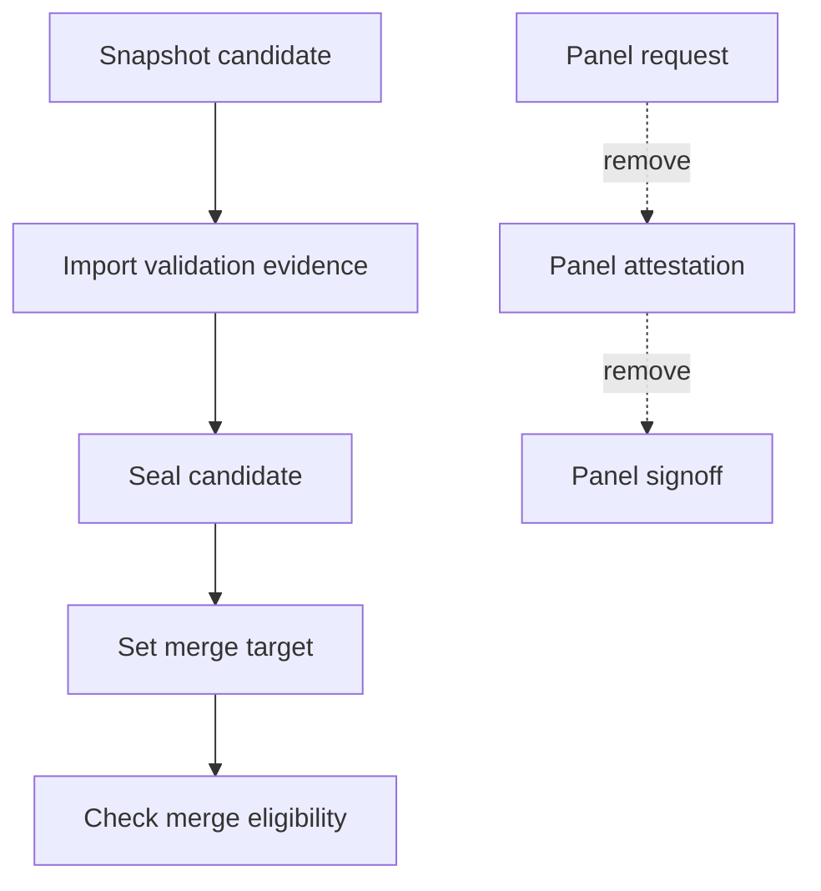

# Remove d2b Panel Workflow - Plan

## Goal Capsule

- **Objective:** Remove the d2b panel, attestation, and signoff workflow from contributor guidance, agent surfaces, delivery code, build entry points, tests, fixtures, and generated registries.
- **Authority:** The requested clean removal governs scope. Committed behavior governs the exact dependencies that must be rewired.
- **Execution profile:** Cross-cutting repository cleanup with a deliberate break in the contributor-only delivery contract.
- **Stop conditions:** Stop if removal would weaken a non-panel validation, authorization, or runtime safety boundary, or if evidence shows an external contract that the repository cannot break in this PR.
- **Tail ownership:** Land the complete change from an isolated feature worktree through one PR to protected `v3`.

---

## Product Contract

### Summary

The repository will no longer define or execute a d2b panel lifecycle.
Delivery will proceed from snapshot and validation evidence to sealing and merge eligibility without panel request, attestation, or signoff state.

### Problem Frame

The panel workflow is spread across Rust delivery commands, state artifacts, agent prompts, skills, tests, Make entry points, contributor instructions, and design records.
Deleting only the visible agents or documentation would leave command dispatch, seal prerequisites, prompt registries, or validation gates referring to artifacts that can no longer be produced.
The removal must therefore cut the workflow as one connected contract while preserving unrelated validation and review mechanisms.

### Actors

- A1. Contributors who use repository instructions, skills, and Make targets.
- A2. Delivery tooling that snapshots, validates, seals, and checks merge eligibility.
- A3. CI and local gates that validate prompt bindings, fixtures, source policy, and drift.

### Requirements

**Contributor and agent surfaces**

- R1. Delete every d2b panel agent, skill, prompt, roster, dispatch policy, and operational instruction.
- R2. Remove panel workflow documentation, ADR/spec material, indexes, cross-links, and obsolete changelog fragments while adding one current release note for the removal.

**Delivery contract**

- R3. Remove `panel-request`, `panel-attest`, panel record parsing, panel format compatibility, attestation import, and signoff validation from the `xtask` delivery interface and implementation.
- R4. Remove panel-derived prerequisites and diagnostics from sealing, work-item state, merge-target, and merge-eligibility behavior without weakening remaining snapshot or validation-evidence checks.
- R5. Remove panel artifact path constants, DTO fields, fixtures, testdata, and legacy/current schema branches so no dormant compatibility surface remains.

**Build and verification**

- R6. Remove panel-specific Make targets, aggregate prerequisites, test invocations, scripts, golden files, fixtures, and generated prompt-corpus entries.
- R7. Keep the closed Layer-1 inventory and generated CI or drift artifacts consistent after the retirements.
- R8. Classify every remaining use of `attestation` or `signoff` semantically and preserve only uses that are unrelated to the removed d2b panel workflow.

### Key Flows

- F1. Delivery after removal
  - **Trigger:** A contributor drives a validated wave toward sealing.
  - **Actors:** A1, A2
  - **Steps:** Create the snapshot, import validation evidence, seal the candidate, set the merge target, and evaluate merge eligibility.
  - **Outcome:** No panel request, record directory, attestation import, or unanimous signoff is required.
  - **Covered by:** R3, R4, R5
- F2. Repository validation after removal
  - **Trigger:** A contributor or CI runs the repository gates.
  - **Actors:** A1, A3
  - **Steps:** Prompt bindings, source policy, fixture contracts, Rust tests, drift checks, and Layer-1 orchestration run without panel inputs.
  - **Outcome:** The gates pass without loading deleted agents, skills, scripts, fixtures, or state schemas.
  - **Covered by:** R1, R2, R6, R7, R8

### Acceptance Examples

- AE1. Given the updated `xtask`, when a user requests help or dispatches a delivery command, then `panel-request` and `panel-attest` are absent and rejected as unknown commands.
- AE2. Given a candidate with valid snapshot and validation evidence, when sealing and merge eligibility run, then no missing-panel diagnostic or panel artifact read occurs.
- AE3. Given the prompt corpus and agent registry, when binding checks run, then no panel seat, `d2b-panel-round` skill, selection table, or panel dispatch policy is required.
- AE4. Given the contributor documentation and Make surface, when links and target references are checked, then no operative panel, attestation, or signoff workflow remains.
- AE5. Given unrelated uses of attestation or signoff, when the semantic audit runs, then those uses remain unchanged unless they consume or produce a removed panel artifact.

### Scope Boundaries

**In scope**

- Current and legacy panel workflow behavior, including compatibility readers and fixture coverage.
- Historical and active repository documents whose purpose is to define or operate the panel workflow.
- Generated or checked-in registries that enumerate panel files or lifecycle stages.

**Outside scope**

- Adding a replacement panel, reviewer roster, attestation format, or signoff gate.
- Removing generic review, validation evidence, release checks, or security attestations that do not depend on the d2b panel.
- Changing VM runtime, NixOS module, broker, or daemon behavior unless a repository check proves a direct panel dependency.

---

## Planning Contract

### Key Technical Decisions

- KTD1. **Use a clean deletion.** Remove commands, parsers, aliases, compatibility branches, and files instead of leaving deprecated stubs because R1-R6 require no remaining operative surface.
- KTD2. **Collapse the delivery lifecycle around validation evidence.** Connect the existing validated candidate state directly to sealing and merge eligibility while retaining every non-panel prerequisite required by R4.
- KTD3. **Delete sources before rebaselining generated consumers.** Remove agents, skills, commands, scripts, and fixtures first, then regenerate or prune manifests, inventories, and drift expectations so generated outputs cannot preserve dead entries.
- KTD4. **Use semantic ownership for broad terms.** Exact panel identifiers are removal failures, while generic `attestation` and `signoff` matches require classification against R8 before editing.
- KTD5. **Ship one coherent PR.** Keep code, tests, instructions, documentation, release notes, and generated artifacts together because any partial landing would leave the delivery or prompt contract inconsistent.
- KTD6. **Keep retained state closed-set and fail-closed.** A retained work item that still contains a `panel/` entry is invalid state and must receive the existing typed entry-set mismatch instead of a tolerant reader or migration path.

### High-Level Technical Design

The post-removal path uses existing snapshot, validation, seal, target, and eligibility contracts.
The removed branch does not gain a compatibility adapter or replacement state.

### Assumptions

- The panel lifecycle is a repository contributor workflow and has no external compatibility commitment that requires a transition period.
- Checked-in ADR/spec records dedicated to the panel can be deleted because the request includes all panel documentation.
- Existing delivery validation evidence is sufficient input for sealing once panel-derived predicates are removed.
- Old external state may contain panel files, but the current closed entry-set invariant will reject that state and no compatibility reader or migration will be added.
- The removal plan and current changelog fragment may name the deleted workflow without becoming operative panel documentation.

### System-Wide Impact

- **Delivery CLI:** Subcommand parsing, help, dispatch, persisted state, sealing, and eligibility lose one lifecycle branch.
- **Agent tooling:** Panel seats, roster selection, prompt construction, record assembly, and prompt-corpus binding disappear.
- **Build graph:** Aggregate targets and Layer-1 scripts stop invoking panel-only checks while retaining all unrelated enforcing jobs.
- **Documentation:** Contributor guidance, architecture records, indexes, and workflow references must be internally consistent after deletion.
- **Existing work artifacts:** Old panel request and record files receive no compatibility support and must not affect new delivery runs.

### Risks and Mitigations

- **Hidden producer or consumer:** A hard-coded identifier may survive outside the obvious module. Mitigate with exact-identifier and generic-term audits after all units are integrated.
- **Accidental gate weakening:** Removing a panel predicate may also remove a validation-evidence check. Mitigate with negative tests that still reject unvalidated or unsealed candidates.
- **Generated drift:** Prompt manifests, fixture ledgers, or CI files may continue to enumerate deleted paths. Mitigate by using repository generators and drift checks rather than hand-editing generated output when an owner exists.
- **Historical over-deletion:** Generic attestation or signoff language may describe unrelated supply-chain or security behavior. Mitigate with KTD4 and file-by-file classification.
- **Stale external state:** Existing panel artifacts may remain on disk. Mitigate by preserving the closed entry-set check so retained state with `panel/` fails with the typed mismatch error, while removing every parser, producer, and migration path.

### Sources and Research

- `packages/xtask/src/delivery/panel.rs` owns the current and legacy panel request, record, attestation, and signoff contract.
- `packages/xtask/src/delivery/command.rs`, `packages/xtask/src/main.rs`, `packages/xtask/src/delivery/seal.rs`, and `packages/xtask/src/delivery/work_item_state.rs` expose and consume that contract.
- `.github/skills/d2b-panel-round/`, `.github/agents/panel-*.agent.md`, and `scripts/copilot/prompt-corpus-manifest.json` define the agent and prompt surface.
- `tests/test-lint.sh` and panel-specific scripts under `scripts/copilot/` wire the workflow into local and CI validation.
- No `docs/solutions/` institutional learning corpus exists in this checkout.

---

## Implementation Units

### U1. Remove the delivery command and data contract

- **Goal:** Delete the panel request, attestation, record, signoff, and compatibility implementation from `xtask`.
- **Requirements:** R3, R5; covers F1 and AE1.
- **Dependencies:** None.
- **Files:**
  - `packages/xtask/src/main.rs`
  - `packages/xtask/src/delivery/command.rs`
  - `packages/xtask/src/delivery/mod.rs`
  - `packages/xtask/src/delivery/model.rs`
  - `packages/xtask/src/delivery/storage.rs`
  - `packages/xtask/src/delivery/panel.rs`
  - `packages/xtask/src/delivery/testdata/panel-*.json`
  - Panel-specific Rust tests under `packages/xtask/src/delivery/` and `packages/xtask/tests/`
- **Approach:**
  1. Remove command names, help text, option parsing, dispatch branches, module exports, path constants, DTO fields, and error variants owned only by the panel lifecycle.
  2. Delete the panel module, current and legacy format readers, record validators, roster checks, and all panel testdata.
  3. Retain shared delivery types only when another live command consumes them.
- **Patterns to follow:** Mirror complete retirement of an `xtask delivery wave` subcommand in the same command dispatcher and keep typed errors for remaining commands.
- **Test scenarios:**
  1. Covers AE1. Delivery help contains no panel subcommand or option.
  2. Dispatching either removed subcommand returns the standard unknown-command failure.
  3. Remaining delivery subcommands parse and dispatch with their existing arguments.
  4. No current or legacy panel JSON fixture is accepted by a live code path.
- **Verification:** Rust compilation and delivery command tests prove there is no exported panel command or data type.

### U2. Rewire sealing and merge eligibility

- **Goal:** Remove panel-derived state transitions while preserving all remaining delivery safety checks.
- **Requirements:** R4, R5; covers F1 and AE2.
- **Dependencies:** U1.
- **Files:**
  - `packages/xtask/src/delivery/seal.rs`
  - `packages/xtask/src/delivery/work_item_state.rs`
  - `packages/xtask/src/delivery/command.rs`
  - Merge-target and merge-eligibility consumers under `packages/xtask/src/delivery/`
  - Related Rust test modules and delivery fixtures
- **Approach:**
  1. Remove reads and predicates for panel requests, imported records, unanimous signoff, and panel completion state.
  2. Define readiness from the existing snapshot, validation evidence, seal, and merge-target contracts.
  3. Remove panel-specific diagnostics without broadening any unrelated transition.
- **Execution note:** Start with characterization of the non-panel negative paths so deletion cannot turn missing validation into success.
- **Patterns to follow:** Preserve the existing fail-closed style and typed transition errors for every surviving prerequisite.
- **Test scenarios:**
  1. Covers AE2. A candidate with the required snapshot and validation evidence seals without panel files.
  2. A candidate missing required validation evidence still fails with the existing typed validation error.
  3. Merge eligibility still rejects an unsealed candidate and a candidate without its required merge target.
  4. Retained state with a stale `panel/` entry fails with the existing typed entry-set mismatch and is not parsed or migrated.
- **Verification:** Delivery lifecycle tests prove the shortened path and every surviving negative transition.

### U3. Remove panel agents, skills, and prompt tooling

- **Goal:** Delete the agent-facing panel capability and every prompt-corpus source or registry entry that exposes it.
- **Requirements:** R1, R6; covers F2 and AE3.
- **Dependencies:** None.
- **Files:**
  - `.github/agents/panel-*.agent.md`
  - `.github/skills/d2b-panel-round/`
  - `scripts/copilot/check-bindings.mjs`
  - `scripts/copilot/test-check-bindings.mjs`
  - `scripts/copilot/test-panel-lifecycle.mjs`
  - `scripts/copilot/test-make-records.mjs`
  - `scripts/copilot/test-stage-diffs.mjs`
  - `scripts/copilot/prompt-corpus-manifest.json`
  - `scripts/copilot/prompt-corpus.mjs`
  - `.github/skills/d2b-panel-round/selection-table.json`
  - `.github/skills/d2b-panel-round/dispatch-policy.json`
  - Panel-specific prompt fixtures and golden files under `tests/`
- **Approach:**
  1. Delete panel seats, the round skill, roster and dispatch configuration, lifecycle scripts, and record assembly helpers.
  2. Prune binding checks and prompt-corpus manifests to the remaining agents and skills.
  3. Preserve Caveman corpus integrity and all non-panel prompt checks.
- **Patterns to follow:** Use the checked-in prompt manifest as the source list and keep binding validation fail-closed for every remaining entry.
- **Test scenarios:**
  1. Covers AE3. Prompt binding checks pass with no panel seat or round skill.
  2. The prompt corpus manifest contains no deleted path or panel role.
  3. `test-check-bindings.mjs` proves remaining agent and skill bindings still reject a missing declared source.
  4. Caveman provenance and protected prompt-corpus checks remain unchanged.
- **Verification:** Prompt-policy and lint gates prove no deleted prompt source remains registered.

### U4. Retire build targets, gate wiring, and fixtures

- **Goal:** Remove panel-only build and test entry points while keeping repository enforcement inventories valid.
- **Requirements:** R6, R7; covers F2 and AE4.
- **Dependencies:** U1, U2, U3.
- **Files:**
  - `Makefile`
  - `tests/test-lint.sh`
  - `tests/static.sh`
  - `tests/layer1-jobs.json`
  - `tests/tools/layer1-jobs.py`
  - `tests/ci/layer1-workflow.template.yml`
  - `.github/workflows/pr-l1-static-fast.yml`
  - `tests/fixtures/`
  - `tests/golden/`
  - `tests/migration-ledger.toml`
  - `tests/tools/gen-migration-ledger.sh`
  - Other generated inventory files named by `tests/AGENTS.md`
- **Approach:**
  1. Remove recipes whose sole purpose is panel request, record, lifecycle, attestation, or signoff validation.
  2. Remove their invocations from aggregate targets without deleting the aggregate lint, Rust, drift, or Layer-1 jobs.
  3. Delete retired fixtures and use the migration-ledger and Layer-1 generator owners to update every checked-in inventory or workflow artifact.
- **Patterns to follow:** Follow `tests/AGENTS.md` for retirement ledgers and generators, and use `tests/layer1-jobs.json` as the authoritative Layer-1 job set.
- **Test scenarios:**
  1. Covers AE4. No Make recipe or prerequisite invokes a deleted panel script.
  2. `test-lint` runs all remaining checks and does not skip a non-panel check.
  3. Layer-1 orchestration and generated CI agree on the remaining job inventory.
  4. Fixture and migration ledgers contain no retired panel artifact.
- **Verification:** Target discovery, lint, fixture-contract, drift, and Layer-1 checks pass with no dangling executable path.

### U5. Remove instructions and documentation, then audit the repository

- **Goal:** Delete the documented panel process, repair every link and index, add the release note, and prove the removal is complete.
- **Requirements:** R2, R8; covers F2, AE4, and AE5.
- **Dependencies:** U1, U2, U3, U4.
- **Files:**
  - `AGENTS.md`
  - `docs/contributing/panel-review.md`
  - `docs/contributing/copilot-agents.md`
  - `docs/contributing/workflow.md`
  - `docs/contributing/gates-and-lints.md`
  - `docs/contributing/README.md`
  - `docs/adr/README.md`
  - `docs/adr/specs/0053-panel-prompt-sources.md`
  - Panel-specific `docs/adr/0055-*.md` files
  - `specs/004-adr0055-panel-review/`
  - `changelog.d/adr055-panel-review.md`
  - `changelog.d/copilot-panel-gpt56-sol.md`
  - Documentation indexes and cross-references found by the semantic audit
  - A new removal fragment under `changelog.d/`
- **Approach:**
  1. Remove binding panel rules, role tables, workflow instructions, ADR/spec material, historical fragments dedicated to the workflow, and links to deleted files.
  2. Rewrite contributor guidance only where a sentence must describe the shortened delivery flow or remaining general review expectations.
  3. Add one current changelog fragment that states the operator-visible contributor-tooling removal without process markers.
  4. Run exact-identifier and broad-term audits, then classify each surviving `attestation` or `signoff` use against KTD4.
- **Patterns to follow:** Keep contributor indexes link-complete, changelog prose user-facing, and all shipped text ASCII-only.
- **Test scenarios:**
  1. Covers AE4. Every link and index resolves without the deleted panel documents.
  2. Exact panel command, format, skill, role-file, and lifecycle identifiers occur only in this removal plan and the current release note when context requires them.
  3. Covers AE5. Every surviving generic attestation or signoff reference has a live non-panel owner.
  4. Contributor instructions no longer require panel selection, request, attestation, unanimous signoff, or panel records.
- **Verification:** Documentation policy, tier-0, link, source-policy, and repository semantic audits prove no operative panel workflow remains.

---

## Verification Contract

Commit the complete source and artifact changes before validation so Git-backed Nix evaluation sees every deletion and generated file.

| Gate | Applies to | Required outcome |
|---|---|---|
| Targeted Rust delivery tests | U1, U2 | Removed commands and formats are absent; shortened lifecycle and surviving failure paths pass. |
| `make test-lint` | U3, U4, U5 | Prompt binding tests, source policy, and documentation lint run without panel-only scripts or bindings. |
| `make test-rust` | U1, U2 | The Rust workspace, explicit doctests, and non-nextest companions remain green. |
| `make test-fixture-contracts` | U1, U3, U4 | Enforcing fixture-backed policy has no stale panel source or artifact. |
| `make test-drift` and `make layer1-workflow-check` | U3, U4, U5 | Generated manifests, the Layer-1 workflow, inventories, and docs do not drift from their owners. |
| `tests/tools/gen-migration-ledger.sh --check` | U4 | Test retirement metadata is current when required by `tests/AGENTS.md`. |
| `make check-tier0` | U5 | ASCII, process-marker, and tracked/untracked source policy passes. |
| Exact identifier and semantic term audit | U1-U5 | No operative panel identifier remains; every generic attestation or signoff match has a non-panel owner. |
| `make check` | U1-U5 | The full PR-equivalent Layer-1 gate passes. |
| `make test-integration` | U1-U5 | Container integration remains green before PR. |
| `make test-host-integration` | U1-U5 | NixOS/KVM host integration remains green before PR on the supported host. |

---

## Definition of Done

- U1 is complete when no live `xtask` command, parser, DTO, state path, error, fixture, or test supports the panel lifecycle.
- U2 is complete when sealing and merge eligibility use only surviving delivery prerequisites and retain their negative-path coverage.
- U3 is complete when no panel agent, skill, roster, dispatch policy, prompt source, or prompt manifest entry exists.
- U4 is complete when no Make target, gate invocation, fixture, golden file, workflow, or inventory depends on a removed panel artifact.
- U5 is complete when contributor instructions and repository docs contain no operative panel workflow, unrelated attestation/signoff contracts are preserved, and the current release note records the break.
- All Verification Contract gates that apply to the host pass after the committed change.
- The isolated branch contains no abandoned compatibility shim, dead panel code, temporary probe, or unrelated cleanup.
- The PR targets `v3` and describes the clean removal, validation evidence, and any deliberate generic-term exceptions.
