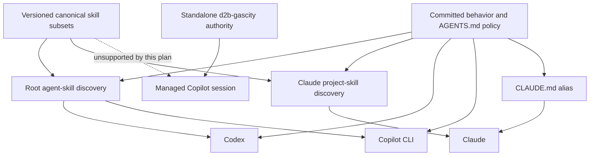
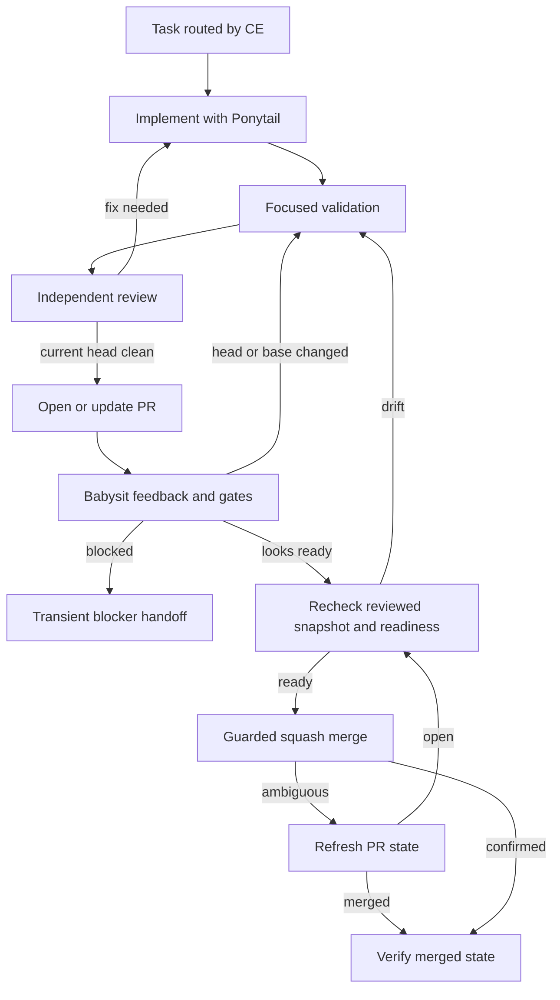

# Unified Contributor Agent Workflow - Plan

## Goal Capsule

- **Objective:** Ship concise repo-owned agent instructions and pinned skill assets that give ordinary Claude, Codex, and Copilot CLI sessions one efficient path from task intake through reviewed and merged code.
- **Product authority:** The Product Contract owns workflow behavior and scope. The Planning Contract owns vendoring, discovery adapters, lint classification, instruction structure, and merge safeguards. Committed passing code and repository policy remain authoritative when implementation reveals drift.
- **Execution profile:** Work in a new isolated worktree. Prefer GPT-5.6 Sol with xhigh reasoning and long context for advanced planning, orchestration, and review. Prefer GPT-5.6 Luna with xhigh reasoning for implementation.
- **Stop conditions:** Stop for a product-scope change, an unavailable independent review path, an unresolved actionable finding, a required gate that cannot pass, an unsupported repo adapter, or merge readiness that cannot be proven for the reviewed head.
- **Tail ownership:** The implementing agent owns review fixes, fresh review after head changes, PR creation, gate babysitting, and guarded squash merge.
- **Open blockers:** None.

---

## Product Contract

**Product Contract preservation:** Changed R2, A3, AE1, dependencies, and scope boundaries after user-confirmed research findings. The changes clarify ordinary-checkout scope, keep the standalone [contributor Gas City repository](https://github.com/vicondoa/d2b-gascity) outside the workflow, and separate GitHub status enforcement from Compound Engineering review. All other requirements and stable IDs retain their meaning.

### Summary

The repository will expose Ponytail, Caveman, and Compound Engineering to ordinary Claude, Codex, and Copilot CLI sessions through one centrally governed contributor workflow.
The workflow will favor minimal code, token-efficient communication, parallel execution where useful, mandatory review, PR-gate babysitting, and agent-triggered merge after all required review and gates pass.

### Problem Frame

The prior contributor process took too long and was removed.
The current `v3` tree leaves Compound Engineering packaging to the standalone
[contributor Gas City repository](https://github.com/vicondoa/d2b-gascity) and
does not provide repo-native skills to ordinary Claude, Codex, or Copilot CLI
sessions.
Operational guidance is also too broad to serve as a concise entry point.

Contributors need reasonable repository defaults that preserve rigor without forcing heavyweight orchestration onto every task.
The workflow must reduce instruction duplication, keep model use predictable, and carry work through the full pull-request lifecycle.

### Key Decisions

- **Make `AGENTS.md` the operational authority.** (session-settled: user-approved - chosen over a dedicated workflow document or combining policy with strategy: operational rules should not be scattered.) Governs R5-R7, R10-R12.
- **Require a tiered workflow for every code change.** (session-settled: user-approved - chosen over a full heavyweight run for every change or optional routing: small work must stay efficient without bypassing review.) Governs R7-R9.
- **Prefer role-specific models but allow transparent substitution.** (session-settled: user-directed - chosen over failing closed or allowing only one fixed fallback: work should continue on the best available model.) Governs R10-R12.
- **Keep one canonical copy of each skill.** (session-settled: user-approved - chosen over repeating complete skill and policy text for each CLI: one source avoids drift and wasted context.) Governs R1-R4.
- **Limit the dash-lint exemption to agent assets.** (session-settled: user-approved - chosen over a broad lint relaxation: imported skills and agent instructions need upstream punctuation without weakening the repository-wide rule.) Governs R13-R14.
- **Merge automatically only after the repository's required review and gates pass.** (session-settled: user-directed - chosen over human-only merge or a second explicit merge instruction: the workflow should finish accepted work.) Governs R8-R9.
- **Leave the standalone contributor Gas City repository unchanged and outside this workflow.** (session-settled: user-directed - chosen over adding project-skill masking or direct-CLI support: this plan makes no skill-visibility guarantee for managed sessions.) Governs R2, R9.

### Actors

- A1. **Contributor:** Starts bug fixes or feature work and supplies product decisions when the workflow cannot safely infer them.
- A2. **Coding agent:** Uses the repo instructions and skills to plan, implement, review, deliver, babysit, and merge the change.
- A3. **GitHub:** Enforces branch protection and required status checks. Compound Engineering supplies the independent implementation review.

### Requirements

**Skill availability**

- R1. The repository must carry pinned, attributable Ponytail, Caveman, and Compound Engineering skill assets.
- R2. Ordinary Claude, Codex, and Copilot CLI sessions must each discover and use all three skill sets from the repository.
- R3. Each skill must have one canonical body, with only the minimal tool-specific discovery material needed by each CLI.
- R4. The workflow must use Compound Engineering for task routing and delivery, Ponytail for minimal safe implementation, and Caveman for token-efficient transient communication.

**Repository guidance**

- R5. `STRATEGY.md` must concisely state d2b's product direction without owning operational agent policy.
- R6. `AGENTS.md` must become the concise operational authority for contributor agents, model defaults, required skill use, review, PR delivery, gate babysitting, and merge behavior.
- R7. Detailed subsystem and test rules must remain in their existing focused documents and be linked rather than repeated in `AGENTS.md`.

**Delivery workflow**

- R8. Every code change must enter through Compound Engineering, with the amount of planning and orchestration scaled to the task while preserving implementation review.
- R9. Pull-request work must remain active through feedback and required gates, then merge automatically only after all required review and gates pass.

**Model policy**

- R10. Advanced planning, orchestration, and review must prefer GPT-5.6 Sol with xhigh reasoning and long context.
- R11. Implementation must prefer GPT-5.6 Luna with xhigh reasoning.
- R12. When a preferred profile is unavailable, the workflow must use the best available model and record the substitution in the run's visible handoff.

**Lint policy**

- R13. Skill payloads and agent-instruction files must be exempt from the non-ASCII dash scan through a narrow path-based policy.
- R14. The non-ASCII dash rule must remain enforced for every file outside the explicit agent-asset exemption.

### Key Flows

- F1. Lightweight change
  - **Trigger:** A contributor requests a small code change in an ordinary checkout.
  - **Actors:** A1, A2, A3
  - **Steps:** Compound Engineering selects the smallest suitable workflow, Ponytail constrains the implementation, the agent reviews the change, and the PR remains supervised through merge.
  - **Covered by:** R4, R8-R11
- F2. Larger feature
  - **Trigger:** A change needs advanced planning or parallel execution in an ordinary checkout.
  - **Actors:** A1, A2, A3
  - **Steps:** Sol plans and orchestrates, Luna implements in parallel where useful, Caveman keeps transient coordination concise, Sol reviews, and the agent babysits the PR through guarded merge.
  - **Covered by:** R4, R8-R12

### Acceptance Examples

- AE1. **Covers R1-R4.** Given an ordinary checkout opened in any supported CLI, when the agent discovers repository guidance, then it can use the approved repo skill bodies without duplicated policy bodies.
- AE2. **Covers R8-R9.** Given a lightweight fix, when the agent routes the task, then it uses the smallest sufficient Compound Engineering path while still reviewing, opening a PR, supervising required gates, and merging only after they pass.
- AE3. **Covers R8-R12.** Given a larger feature, when planning and implementation begin, then Sol handles advanced reasoning, Luna handles implementation, useful work proceeds in parallel, and any model substitution is visible only in transient handoff.
- AE4. **Covers R13-R14.** Given a U+2014 character in an allowlisted skill or agent-instruction file, the dash scan permits it; given the same character outside the allowlisted paths, the scan rejects it.

### Scope Boundaries

- No new orchestration framework, agent runtime, or repository state machine.
- No authenticated end-to-end smoke suite for Claude, Codex, or Copilot CLI.
- No full policy copies in each tool-specific adapter.
- No Ponytail lifecycle hooks, Caveman engine, or Compound Engineering plugin runtime.
- No dash-lint exemption for ordinary source, product documentation, plans, changelog entries, or configuration.
- No GitHub repository-setting or branch-protection change.
- No change to the standalone
  [contributor Gas City repository](https://github.com/vicondoa/d2b-gascity),
  its instructions, publishing, or merge authority.
- No change to d2b runtime, daemon, broker, VM, networking, or consumer behavior.

### Dependencies and Assumptions

- Implementation will run in a new isolated worktree and land through a pull request.
- The pinned upstream licenses permit the selected skill subsets to be vendored with attribution.
- Claude's documented project skill location can reference the canonical repo skill bodies through the selected adapter variant.
- Personal or globally installed plugins may expose additional same-named skills; this plan governs only the repo-owned inventory.
- The agent has ordinary squash-merge permission when the current reviewed head satisfies repository rules.
- Manual clean-checkout inspection plus the repository's existing applicable gates is sufficient acceptance; no new cross-CLI test system is required.

### Sources and Research

- `AGENTS.md` - current repository operating rules, instruction budget, and non-ASCII dash policy.
- [Standalone contributor Gas City repository](https://github.com/vicondoa/d2b-gascity)
  - separate Compound Engineering packaging and managed instructions.
- `tests/tools/tier0-first-pass.sh` - current fail-closed dash scanner.
- `packages/d2b-contract-tests/tests/policy_dash_gate.rs` - existing dash policy coverage.
- `packages/d2b-contract-tests/tests/policy_docs.rs` - existing `AGENTS.md` content and size contracts.
- `docs/contributing/workflow.md` - protected-branch and pull-request landing policy.
- [Ponytail v4.9.0](https://github.com/DietrichGebert/ponytail/releases/tag/v4.9.0) - upstream minimal-code skill set.
- [Caveman v2.0.0](https://github.com/JuliusBrussee/caveman/releases/tag/v2.0.0) - upstream skill and mixed-license repository.
- [Compound Engineering v3.21.4](https://github.com/EveryInc/compound-engineering-plugin/releases/tag/compound-engineering-v3.21.4) - upstream workflow skill set.
- [Claude Code skills](https://code.claude.com/docs/en/skills) and [memory](https://code.claude.com/docs/en/memory) - project skill and instruction discovery.
- [Codex skills](https://learn.chatgpt.com/docs/build-skills) and [AGENTS.md](https://learn.chatgpt.com/docs/agent-configuration/agents-md) - project skill and instruction discovery.
- [Copilot CLI skills](https://docs.github.com/en/copilot/how-tos/copilot-cli/customize-copilot/add-skills) and [custom instructions](https://docs.github.com/en/copilot/how-tos/copilot-cli/customize-copilot/add-custom-instructions) - project skill and instruction discovery.

---

## Planning Contract

### Key Technical Decisions

- KTD1. **Vendor versioned skill subsets once.** (session-settled: user-approved - chosen over full per-CLI copies: one source avoids drift and repeated context.) Use a versioned `third_party/agent-skills/` tree with upstream license and provenance metadata, then point every discovery adapter at those canonical directories. Governs R1-R4.
- KTD2. **Use native project discovery with relative symlinks.** Codex and Copilot consume the root agent-skill directory, Claude consumes its native project skill directory, and `CLAUDE.md` aliases `AGENTS.md`. The primary topology uses one directory symlink per skill; the static Claude fallback uses real skill directories whose components are relative symlinks to the same canonical source. No adapter repeats a skill body or policy text. Governs R2-R3.
- KTD3. **Vendor skill-only surfaces.** Pin Ponytail `v4.9.0` at `0a4dd63ad4541f4f655c4108a295916f3c1d8fda`, Caveman `v2.0.0` at `2c67abb9833689b48c7abba88afaa77c39a18657`, and Compound Engineering `compound-engineering-v3.21.4` at `0a2957852e2034d04eb01120fd7da6ed5307dc56`. Exclude Ponytail hooks, Caveman BSL components and `caveman-compress`, and Compound Engineering plugin runtime. Governs R1, R4.
- KTD4. **Make repository policy override generic CE shipping defaults.** (session-settled: user-approved - chosen over importing upstream shipping defaults unchanged: every code diff must receive independent review and current-head re-review before merge.) Keep upstream skill files unchanged. The d2b profile uses `ce-work mode:return-to-caller`, report-only `ce-code-review mode:agent`, `ce-commit-push-pr branding:off babysit:off`, and `ce-babysit-pr posture:target`. The repository-owned caller fixes findings, reruns review, and owns merge. A conflict blocks execution. The standalone [contributor Gas City repository](https://github.com/vicondoa/d2b-gascity) keeps its separate authority. Governs R6-R9.
- KTD5. **Keep model routing as portable instruction policy.** (session-settled: user-directed - chosen over fail-closed model binding: unavailable preferred profiles use the strongest native role-equivalent model.) Exact Sol and Luna preferences are normative shipped policy where the host supports them. Run-specific served-model attribution and substitutions remain transient. Review independence requires a separate clean review context, not a different model family; unavailable independent review blocks delivery. Governs R6, R10-R12.
- KTD6. **Use a reviewed-head merge transaction with best-effort base refresh.** (session-settled: user-directed - chosen over human-only merge, strict branch-setting changes, native auto-merge, or a second merge prompt: the agent accepts the narrow base race under current non-strict protection.) Review evidence binds repository, PR, observed base ref and OID, head OID, and verdict. Observed head or base drift returns to synchronization, validation, and review. Unavailable review evidence is drift and requires fresh independent review. Immediately before normal squash merge, the agent refreshes required checks, feedback, mergeability, and base observation and guards the merge with the reviewed head. An ambiguous result is reconciled from current PR state before any retry. Governs R8-R9.
- KTD7. **Prefilter an exact dash allowlist.** (session-settled: user-approved - chosen over broad directory exclusions: only recognized instruction files and approved canonical skill payloads may carry non-ASCII dashes.) Filter allowlisted paths after fail-closed enumeration and before `grep`. Admit only the four current instruction files, the three exact versioned approved-skill roots, validated symlink entries for the approved inventory, and exact component links in the static Claude fallback. Preserve all current enumerator, unreadable-file, and grep-error behavior. Governs R13-R14.
- KTD8. **Ratchet `AGENTS.md` to 20,000 bytes.** (session-settled: user-approved - chosen over retaining the 40,000-byte ceiling: the always-loaded authority must recover context budget.) Keep a tested authority-anchor manifest for binding safety rules and indexes, move product direction to `STRATEGY.md`, and link detailed procedures from existing contributor documents. Validate every repository-relative Markdown link before lowering the budget. Governs R5-R7.

### Approved Skill Inventory

| Source | Version and commit | Included skill directories | License boundary |
| --- | --- | --- | --- |
| Ponytail | `v4.9.0` / `0a4dd63ad4541f4f655c4108a295916f3c1d8fda` | `ponytail`, `ponytail-audit`, `ponytail-debt`, `ponytail-gain`, `ponytail-help`, `ponytail-review` | MIT skill directories only; no hooks or plugin runtime |
| Caveman | `v2.0.0` / `2c67abb9833689b48c7abba88afaa77c39a18657` | `caveman` | MIT skill directory only; no BSL engine or `caveman-compress` |
| Compound Engineering | `compound-engineering-v3.21.4` / `0a2957852e2034d04eb01120fd7da6ed5307dc56` | `ce-babysit-pr`, `ce-brainstorm`, `ce-code-review`, `ce-commit-push-pr`, `ce-debug`, `ce-doc-review`, `ce-plan`, `ce-resolve-pr-feedback`, `ce-simplify-code`, `ce-work`, `ce-worktree` | MIT complete skill directories, including each directory's local references and scripts |

### High-Level Technical Design

The repository holds one real copy of each approved skill.
Host-native discovery paths are adapter views over that copy.
Repository policy constrains every ordinary-checkout invocation, while the
standalone [contributor Gas City repository](https://github.com/vicondoa/d2b-gascity)
keeps its separate managed authority.



The delivery tail binds review evidence to the current head and records the observed base.
A changed head, observed base drift, or missing review evidence returns to validation and review.



### Implementation Constraints

- Preserve current `scan_dashes` fail-closed enumeration before filtering exempt paths.
- Exempt only `AGENTS.md`, `tests/AGENTS.md`, `labs/venus-vulkan-video/AGENTS.md`, `CLAUDE.md`, approved skill directories below the three pinned version roots, validated symlink entries for the approved inventory, and exact component links in the static Claude fallback.
- Adjust only the Claude adapter shape under KTD2; never copy canonical bodies. Repo-owned inventory checks do not govern personal or global plugins.
- Record repository, release tag, commit, imported subset, license, and file hashes in each upstream metadata file.
- Keep every imported skill directory complete so its relative `references/` and `scripts/` remain valid.
- Keep run-specific served-model attribution and substitutions in transient session or handoff output. Normative model preferences belong in `AGENTS.md`; commits, PR bodies, and changelog entries carry no tool or model metadata.
- Do not use native GitHub auto-merge, admin bypass, merge-queue bypass, or upstream CE branding.
- Do not modify the standalone
  [contributor Gas City repository](https://github.com/vicondoa/d2b-gascity) or
  make claims about its managed sessions.

### Sequencing

1. Add and prove the narrow dash path classifier before importing upstream files that contain non-ASCII punctuation.
2. Import pinned skill subsets and create portable discovery symlinks.
3. Rewrite central guidance against the final skill inventory and adapter behavior.
4. Validate the whole change, run independent review, resolve findings, re-review the final head, and exercise the documented PR tail.

### Risks and Mitigations

| Risk | Consequence | Mitigation |
| --- | --- | --- |
| Claude does not follow a directory-symlink skill adapter | R2 fails for Claude | Block acceptance and replace only the Claude adapter with real directories containing relative component symlinks |
| Copilot lists the same skill through both supported roots | Duplicate invocation and context | Require one inventory entry per skill and adjust adapter visibility before acceptance |
| Upstream skill update crosses a license boundary | Unlicensed or unnecessary runtime enters the repo | Pin commits, vendor only approved subsets, preserve license files, and record hashes |
| Imported CE shipping defaults conflict with d2b policy | Review skips, unresolved findings, or attribution could ship | Make the concise repository override explicit and verify it in manual workflow scenarios |
| PR head changes or review evidence is lost | Unreviewed code could merge | Bind review to SHA and use an expected-head merge guard; any drift or missing evidence restarts validation and review |
| Base advances after the final refresh | Squash merge may include an unreviewed base revision | Accept this narrow race under current non-strict protection; record the observed base and do not claim atomic base binding |
| Instruction compression removes a safety invariant | Agents lose a load-bearing repository rule | Preserve indexed rules, links, policy-test phrases, and lower the existing size ratchet only after the rewrite |
| Exact model profile is unavailable outside Copilot | Role policy cannot be applied literally | Select the strongest native role-equivalent model and record the substitution transiently |

---

## Output Structure

```text
CLAUDE.md -> AGENTS.md
.agents/skills/
  <one relative symlink per approved skill>
.claude/skills/
  <one relative directory symlink per approved skill>
  <fallback: real skill directories with relative component symlinks>
third_party/agent-skills/
  ponytail/v4.9.0/
    LICENSE
    UPSTREAM.json
    skills/<approved Ponytail skills>/
  caveman/v2.0.0/
    LICENSE
    UPSTREAM.json
    skills/caveman/
  compound-engineering/compound-engineering-v3.21.4/
    LICENSE
    UPSTREAM.json
    skills/<approved Compound Engineering skills>/
STRATEGY.md
changelog.d/unified-contributor-agent-workflow.md
```

---

## Implementation Units

### U1. Add the narrow dash exemption

**Goal:** Permit upstream skill payloads and recognized agent instructions to retain non-ASCII dashes without weakening the repository-wide gate.

**Requirements:** R13-R14, AE4

**Dependencies:** None

**Files:**

- Modify `tests/tools/tier0-first-pass.sh`.
- Modify `packages/d2b-contract-tests/tests/policy_dash_gate.rs`.
- Modify `docs/contributing/gates-and-lints.md`.

**Approach:**

1. Reuse the gate's existing path-classification style to separate exempt paths from scanned files.
2. Admit the four instruction paths, KTD3's exact approved skill directories below each pinned root, symlink entries under KTD2's approved adapter names, and exact component links in the static Claude fallback.
3. Keep original enumeration cardinality and error status authoritative.
4. Skip `grep` cleanly when an isolated fixture contains only exempt files.
5. Replace the retired blanket-vendor-bypass assertion with exact allowlist and lookalike-denial coverage.
6. Document the exemption as a closed path set owned by the existing dash gate.

**Patterns to follow:**

- `tests/tools/tier0-first-pass.sh` `scan_process_markers` path classification.
- `packages/d2b-contract-tests/tests/policy_dash_gate.rs` fixture-driven fail-closed tests.
- `tests/AGENTS.md` policy-lint rule: extend the existing Rust policy surface and add no gate.

**Test scenarios:**

- Covers AE4. A fixture with U+2014 in each recognized instruction path passes.
- Covers AE4. A fixture with U+2014 in canonical vendored and adapter skill paths passes.
- A lookalike instruction filename, unapproved skill name, unapproved source version, or regular file placed in an adapter tree still fails.
- An ordinary source, product doc, plan, changelog fragment, or configuration file with U+2014 still fails.
- An unreadable non-exempt file, failed enumerator, or non-exempt `grep` error still fails closed.
- A fixture containing only exempt files proves `grep` is not invoked and completes without reporting an empty repository.

**Verification:** The existing dash policy test covers positive, negative, lookalike, and fail-closed behavior. `check-tier0` still scans every non-exempt tracked and non-ignored untracked file.

### U2. Vendor and expose the approved skills

**Goal:** Add the approved Ponytail, Caveman, and Compound Engineering subsets once and expose them to all three ordinary CLI hosts.

**Requirements:** R1-R3, AE1

**Dependencies:** U1

**Files:**

- Create `third_party/agent-skills/ponytail/v4.9.0/**`.
- Create `third_party/agent-skills/caveman/v2.0.0/**`.
- Create `third_party/agent-skills/compound-engineering/compound-engineering-v3.21.4/**`.
- Create `.agents/skills/*` relative symlinks for the approved inventory.
- Create `.claude/skills/*` relative symlinks for the approved inventory.
- Create the `CLAUDE.md` relative symlink to `AGENTS.md`.

**Approach:**

1. Import only KTD3's approved directories from the pinned commits.
2. Preserve each upstream license and write one provenance file per source.
3. Build both host discovery trees from relative directory symlinks to the canonical vendor directories.
4. Validate repo-owned link containment, file hashes, excluded surfaces, and skill-local relative assets through static inspection.
5. If the Claude directory-symlink shape is unsuitable, use the static fallback and apply its component-link containment and dash rules.

**Execution note:** This is static checkout configuration. Do not add an automated cross-CLI harness or require live Claude or Codex inspection.

**Patterns to follow:**

- The version, commit, subset, license, and hash attribution shape recorded by prior Caveman vendoring.
- Official project-skill locations for Claude, Codex, and Copilot CLI.
- Repository-relative symlinks so worktrees and clones resolve identically.

**Test scenarios:**

- Covers AE1. The approved repo inventory exposes 18 canonical skills through each documented project discovery path.
- Covers AE1. Primary adapters resolve to canonical skill realpaths; Claude fallback components resolve inside the same canonical skill directory.
- Claude loads the same authority content through `CLAUDE.md` that Codex and Copilot load through `AGENTS.md`.
- Every imported skill file matches its provenance hash, and every relative reference or script remains reachable from its `SKILL.md`.
- Ponytail hooks, `caveman-compress`, Caveman BSL directories, and unapproved CE skills are absent.
- A missing, absolute, escaped-repository, or duplicate symlink blocks acceptance.

**Verification:** Static inspection proves provenance fields and hashes, project discovery paths, canonical targets, relative non-broken in-repository links, instruction alias identity, excluded surfaces, and skill-local asset resolution. Copilot may be inspected opportunistically, but no live Claude or Codex check gates acceptance.

### U3. Centralize the contributor workflow and strategy

**Goal:** Make `AGENTS.md` a concise executable index, add product strategy, and define the complete reviewed-head PR lifecycle without changing the standalone [contributor Gas City repository](https://github.com/vicondoa/d2b-gascity).

**Requirements:** R4-R12, F1-F2, AE2-AE3

**Dependencies:** U1, U2

**Files:**

- Create `STRATEGY.md`.
- Modify `AGENTS.md`.
- Modify `docs/contributing/README.md`.
- Modify `docs/contributing/workflow.md`.
- Modify `packages/d2b-contract-tests/tests/policy_docs.rs`.
- Exercise existing `packages/d2b-contract-tests/tests/storage_sync_contracts.rs` coverage.
- Exercise existing `packages/d2b-contract-tests/tests/policy_gas_city.rs` coverage.
- Create `changelog.d/unified-contributor-agent-workflow.md`.

**Approach:**

1. Distill `STRATEGY.md` from committed product behavior, `README.md`, accepted ADRs, and current `v3` direction without adding new roadmap promises.
2. Reduce `AGENTS.md` below KTD8's ratchet while preserving a tested manifest of its binding index, security rules, daemon-only contract, test routing, workflow safety, critical-subsystem links, and required policy phrases.
3. Add a compact workflow router for lightweight fixes, open-ended debugging, and larger planned work.
4. Assign CE, Ponytail, and Caveman their R4 roles and name the required review-fix-re-review loop.
5. State exact model preferences and the transient fallback record without adding host-specific model configuration.
6. Put detailed reviewed-head, review-evidence recovery, babysit, merge, and blocker behavior in the existing workflow guide.
7. Keep the
   [contributor Gas City repository](https://github.com/vicondoa/d2b-gascity) as
   an external linked exception under its standalone managed policy.
8. Broaden existing policy coverage to validate all repository-relative links and the new skill-role, model-fallback, current-snapshot review, and merge anchors.
9. Add a changelog fragment that describes the contributor-facing workflow and lint policy change without internal process labels or run-specific model attribution.

**Patterns to follow:**

- `docs/contributing/README.md` authority split: rules in `AGENTS.md`, detail in focused contributor docs.
- Existing `policy_docs.rs` link, content, daemon-only, and instruction-budget coverage.
- Existing protected-branch and squash-merge workflow in `docs/contributing/workflow.md`.
- Existing changelog fragment structure in `changelog.d/README.md`.

**Test scenarios:**

- `AGENTS.md` is no more than 20,000 bytes and all repo-relative links resolve.
- Required daemon-only, broker, critical-subsystem, single-repair-owner, and non-ASCII-dash policy anchors remain discoverable.
- Covers F1 / AE2. A clear bounded fix routes directly to the smallest CE path, receives Ponytail implementation discipline and Caveman transient communication when useful, independent review, and the full PR tail.
- Covers F2 / AE3. A larger change routes through planning, uses disjoint parallel work only when useful, applies Ponytail implementation discipline and Caveman transient communication, and assigns role-appropriate models.
- Covers AE3. An unavailable preferred profile selects a native equivalent and records the substitution only in transient handoff.
- A review fix, CI fix, observed base update, external push, or missing review evidence invalidates readiness and requires synchronization, validation, and fresh review.
- A PR merges only when repository, PR, reviewed head, verdict, required checks, feedback, and mergeability match current review evidence; the observed base is refreshed but not atomically guarded.
- The standalone
  [contributor Gas City repository](https://github.com/vicondoa/d2b-gascity)
  remains outside this plan; it makes no project-skill visibility claim for
  managed sessions.
- Commits, PR guidance, and changelog entries contain no run-specific tool or model attribution.

**Verification:** Existing policy tests pass with the lower instruction budget and expanded authority anchors, every relative link resolves, each strategy claim traces to current code or accepted docs, and manual walkthroughs cover both Product Contract flows and the guarded merge tail.

---

## System-Wide Impact

- **Agent context:** Every ordinary supported CLI receives the same authority and skill bodies with less always-loaded instruction text.
- **Contributor workflow:** Bug fixing, feature planning, implementation, review, and PR landing share one tiered route.
- **Policy enforcement:** The dash gate gains a closed exemption but retains fail-closed behavior for every other file.
- **Supply chain:** Three external skill sources enter the repository with pinned commits, licenses, subsets, and hashes.
- **GitHub lifecycle:** Agents may complete a ready PR through guarded normal squash merge without changing branch protection or native auto-merge settings.
- **Unchanged surfaces:** The standalone [contributor Gas City repository](https://github.com/vicondoa/d2b-gascity), d2b runtime, NixOS modules, packages, APIs, manifests, VMs, and consumer configuration do not change.

---

## Verification Contract

| Verification | Units | Required outcome |
| --- | --- | --- |
| `make check-tier0` | U1-U3 | Dash and process-marker gates pass with the new closed exemption |
| `cd packages && cargo test -p d2b-contract-tests --test policy_dash_gate` | U1-U2 | Allowed paths pass, lookalikes and ordinary paths fail, and scanner errors remain fail-closed |
| `make test-policy` | U1-U3 | Dash, instruction, daemon-only, and link policy coverage passes |
| `cd packages && cargo test -p d2b-contract-tests --test storage_sync_contracts` | U3 | The compact authority retains the single-repair-owner contract |
| `make test-lint` | U1-U3 | Existing Rust, Nix, and shell lint remains clean |
| `make test-changelog` | U3 | The fragment uses valid Keep a Changelog structure and vocabulary |
| `git ls-files -s CLAUDE.md .agents/skills .claude/skills third_party/agent-skills` plus static target inspection | U2 | The selected KTD2 topology is tracked, links stay in-repo, hashes match, and documented project paths expose the approved repo inventory |
| `copilot skill list --json` when available | U2 | Repo-owned skills are discoverable; personal or plugin duplicates do not fail repo acceptance |
| Compare the final reviewed head with its target-branch merge base | U3 | The standalone contributor Gas City repository remains outside the complete branch diff |
| Independent `ce-code-review` of the final head | U1-U3 | No actionable finding remains; any applied fix is validated and reviewed again |
| PR babysit and guarded squash merge | U1-U3 | Recorded repository, PR, observed base OID, head OID, and review verdict are available at the immediate pre-merge refresh; missing evidence restarts review; required checks and feedback settle; expected-head squash merge succeeds without bypass; merged state is verified before any retry |

No container, VM, host-integration, live-host, hardware, or authenticated cross-CLI automation lane applies.

---

## Definition of Done

### Global

- The Product Contract remains traceable through all implementation units and verification outcomes.
- The approved repo skill inventory is pinned, attributed, complete, and exposed through each ordinary supported CLI's documented project path.
- `AGENTS.md` is the single operational authority and is no more than 20,000 bytes.
- `STRATEGY.md` states product direction without duplicating contributor procedure.
- Every code-bearing change has independent review tied to the current head.
- Required gates, feedback, mergeability, reviewed head identity, observed base identity, and review verdict are refreshed before squash merge.
- The standalone
  [contributor Gas City repository](https://github.com/vicondoa/d2b-gascity)
  remains outside the branch.
- All Verification Contract entries pass or have an explicit non-applicability already authorized by this plan.
- Dead-end adapters, duplicate skill copies, temporary vendor downloads, and abandoned attempts are absent from the final diff.
- The branch lands through a reviewed pull request and the PR reaches verified merged state.

### Per Unit

- **U1:** Exact agent paths permit banned dash codepoints while lookalikes, ordinary files, and scanner failures remain denied.
- **U2:** Canonical assets, provenance, licenses, symlinks, relative references, and three host inventories satisfy KTD1-KTD3.
- **U3:** Strategy, concise authority, role routing, review loop, transient fallback record, guarded merge, policy coverage, and changelog satisfy KTD4-KTD8.
