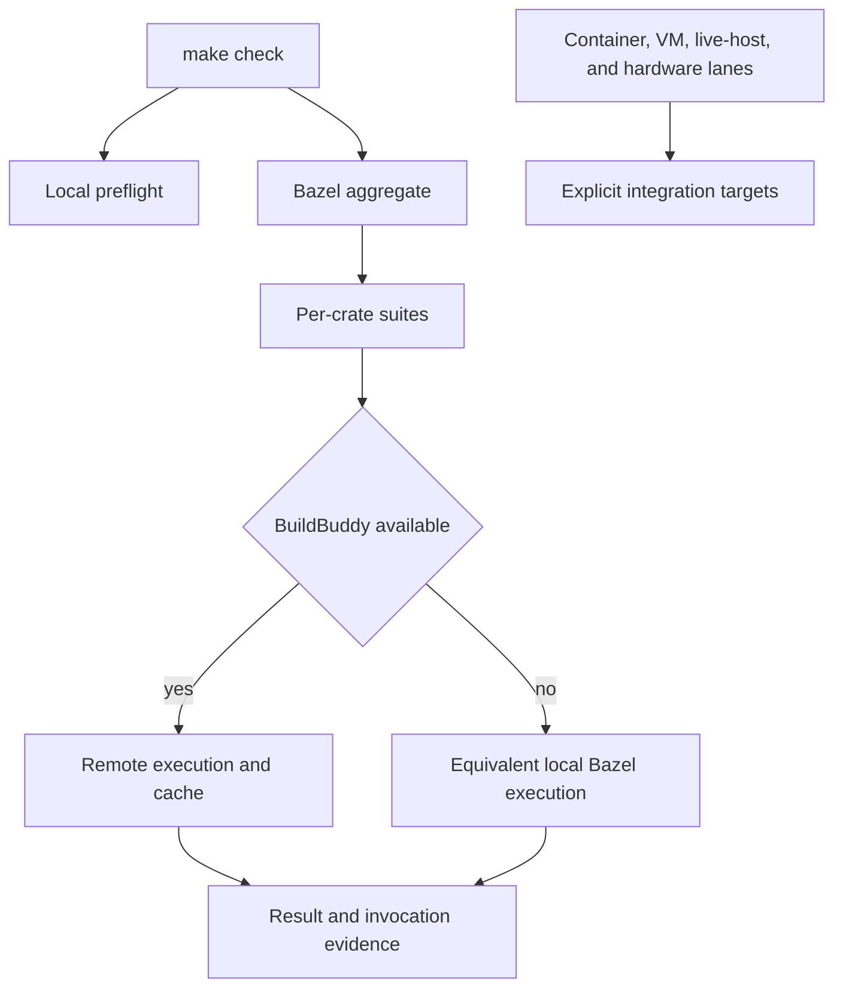
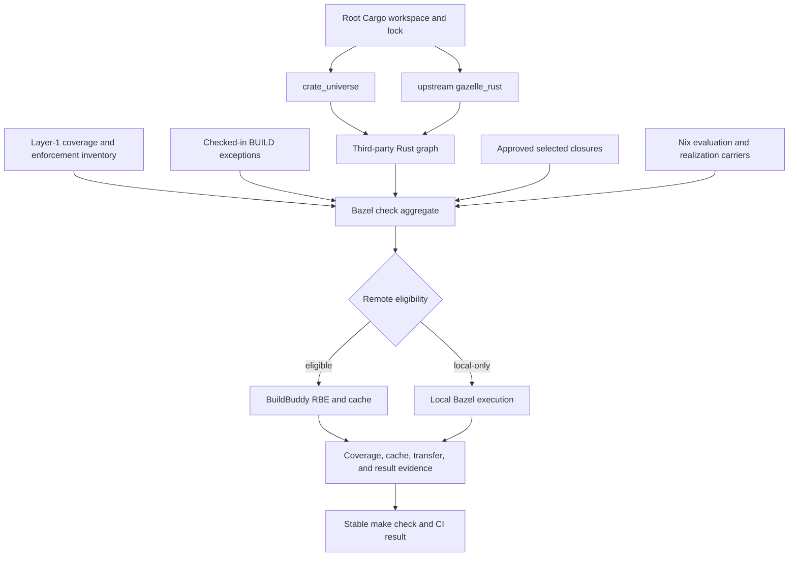
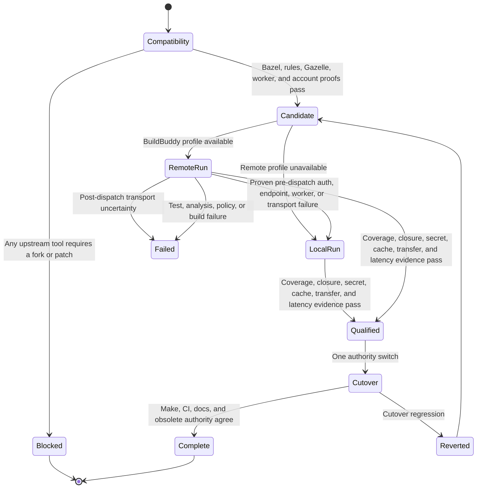
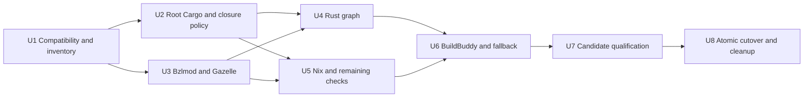

# Bazel and BuildBuddy Check Migration - Plan

## Goal Capsule

- **Objective:** Replace the eligible `make check` scheduler with one Bazel 9.2.0 graph that uses BuildBuddy remote execution and caching when configured, completes a fresh-checkout populated-cache run in under three minutes, and preserves complete coverage and standalone Cargo workflows.
- **Product authority:** This plan owns the build and test migration, the repository-wide test-placement contract, and deletion of obsolete Bazel ADR and spec authority. General product behavior and unrelated governance or documentation cleanup are outside its scope.
- **Open blockers:** None. Tool compatibility, BuildBuddy entitlement and evidence, selected-closure parity, credential redaction, complete coverage, transfer, and latency are implementation stop conditions.

---

## Product Contract

### Summary

`make check` will become one Bazel 9.2.0 graph for all hermetic work, with BuildBuddy remote execution and caching as the fast path and equivalent local Bazel execution as the fallback.
Lightweight local preflight remains part of `make check`, while coverage requiring containers, KVM, a live host, or physical devices remains in explicit integration lanes.

### Product Contract Preservation

Changed: R17-R19, F3, AE5, Success Criteria, and related scope text - the user replaced custom test-category directories and a custom generator with Cargo/Gazelle-standard locations, upstream Gazelle, `crate_universe`, and explicit checked-in exceptional BUILD targets.

### Problem Frame

The current full check takes more than 30 minutes, and maintainers wait for it rather than using a faster complete path.
The existing Bazel design covers only Rust, centers Bazel 8.6.0 and custom sandbox changes, uses a shadow promotion lifecycle, and explicitly excludes remote caching and execution.
That design does not address the main opportunity: one remotely reusable graph with stable action keys, per-crate attribution, and bounded transfer under BuildBuddy's monthly allowance.

### Key Decisions

- **Cut over the full eligible check graph in one migration.** (session-settled: user-directed - chosen over a Rust-first ratchet and a permanent local/remote hybrid: broad exposure will reveal cache-transfer and failure problems early.) Governs R1-R6, R23, and R24.
- **Use upstream Bazel 9.2.0 without project patches or a custom sandbox.** (session-settled: user-directed - chosen over the prior patched design: its isolation strategy was unnecessary and did not start from BuildBuddy.) Governs R7-R9.
- **Make BuildBuddy the fast path with a complete local fallback.** (session-settled: user-directed - chosen over failing closed or running only preflight when BuildBuddy is unavailable: contributors still need the same complete graph.) Governs R3-R6.
- **Use BuildBuddy's standard direct API-key authentication.** (session-settled: user-directed - chosen over requiring the existing credential proxy: standard BuildBuddy integration is preferred for this workload.) Governs R10.
- **Use Cargo/Gazelle-standard test placement.** (session-settled: user-directed - chosen over custom category directories and a repository-owned generator: d2b will adapt to maintained upstream tools.) Governs R17-R22 and R32.
- **Pin Bazel 9.2.0 and update it manually.** (session-settled: user-directed - chosen over floating or automated 9.x updates: each toolchain change should be deliberate.) Governs R7.
- **Use one repository-root product Cargo workspace.** (session-settled: user-directed - chosen over nested broker and guest workspaces: common Cargo, Gazelle, and `crate_universe` authority reduces duplicated resolution while selected closures preserve isolation.) Governs R30 and R31.
- **Use `crate_universe` and Gazelle at separate boundaries.** (session-settled: user-approved - chosen over treating either tool as a complete Cargo-to-Bazel generator: `crate_universe` owns third-party resolution and unmodified `gazelle_rust` owns ordinary first-party targets.) Governs R19 and R32.
- **Use CE delivery with Luna max throughout.** Planning, review, implementation, and fixes use `gpt-5.6-luna` at `max` reasoning in a dedicated worktree based on `v3`. Governs R27-R29.

<!-- ce-section: work-relationships -->
### How This Work Fits Together

This plan owns the Bazel and BuildBuddy check migration.
The surrounding breakdown is current context, not a committed roadmap.

- **Depends on:** BuildBuddy remote execution and cache availability, direct secret-backed authentication, and upstream Bazel and rules that can represent each admitted action without a project-maintained Bazel patch.
- **Shares:** The Gas City contributor environment already provides Bazel 9.x and BuildBuddy connectivity, but this migration does not depend on Gas City orchestration.
- **Can proceed independently of:** d2b runtime, daemon, broker, microVM, release-artifact, and consumer-facing feature work.
- **Includes:** Deleting Bazel-specific ADRs and specs so obsolete build authority does not coexist with this contract.
- **Excludes:** Broad cleanup of ADRs, specs, or contributor policy that is not about the Bazel build and test design.

### Actors

- A1. **Maintainer:** Runs focused or complete checks locally, adds tests without hand-editing BUILD metadata, and receives attributable failures.
- A2. **Continuous integration:** Seeds and consumes the shared cache, runs the complete hermetic graph, and reports one stable required result.
- A3. **BuildBuddy:** Executes admitted actions, serves action and content-addressed cache entries, and exposes invocation timing and transfer evidence.
- A4. **Integration host:** Runs coverage that requires containers, KVM, a deployed host, or physical devices outside the remote graph.

### Requirements

**Graph and execution**

- R1. Every hermetic check currently covered by `make check` must be represented in one Bazel graph without losing assertions, doctests, harness-free targets, policy checks, or fixture-backed coverage.
- R2. Unit and integration suites must be separately addressable per crate, with independently attributable status and cache behavior.
- R3. `make check` must remain the stable complete entry point and run the Bazel aggregate plus bounded local preflight.
- R4. An authenticated run must use BuildBuddy remote execution and caching for every action admitted by the remote-eligibility policy.
- R5. Missing credentials, BuildBuddy unavailability, or a typed infrastructure failure proven to occur before action dispatch must fall back explicitly to local execution of the same Bazel graph rather than returning a reduced success; post-dispatch uncertainty must fail directly.
- R6. Actions excluded from remote execution must have a machine-readable reason and must run in local preflight or an explicit integration lane without disappearing from the complete coverage inventory.
- R7. The repository must pin upstream Bazel 9.2.0 exactly and must not float or automatically update the pin.
- R8. The migration must not patch Bazel or add a project-specific sandbox, action runner, or isolation mechanism where upstream Bazel and BuildBuddy behavior is sufficient.
- R9. The accepted graph must use standard Bazel platform, toolchain, sandbox, and remote-execution contracts so local and remote action identity remains reproducible.

**Cache efficiency and evidence**

- R10. BuildBuddy credentials must come from an untracked developer auth configuration or a CI secret and must never enter committed configuration, action inputs, logs, or build events.
- R11. Toolchains, declared inputs, environments, and action arguments must be deterministic across CI and fresh worktrees so equivalent actions share cache keys.
- R12. A fresh checkout of a cache-populated commit must complete `make check` in under three minutes on the documented reference environment.
- R13. A cache-populated unchanged commit must execute no cacheable Bazel action again unless the invocation evidence identifies an approved uncacheable action and its reason.
- R14. Remote output handling must avoid downloading outputs that no local action or requested final result needs.
- R15. Every qualification run must report wall time, action-cache and CAS behavior, remote executions, provider-accounted uploaded and downloaded bytes, repository traffic, BES traffic, retry traffic, and local Nix time.
- R16. Qualification must publish the number of equivalent monthly runs supported by an 80 GB working transfer budget using a conservative provider-accounted transfer percentile, leaving 20 GB of the stated 100 GB allowance as operating headroom without adding an automatic quota stop.

**Test placement and standalone tools**

- R17. Ordinary tests must remain in Cargo-standard source modules, `tests/`, `benches/`, examples, and doctests so Cargo and upstream Gazelle share one conventional layout.
- R18. Preflight must be an execution classification rather than a mandatory directory, while unit, integration, policy, fixture, and system-dependent coverage remain distinguishable in the graph.
- R19. `crate_universe` must supply third-party dependencies, unmodified upstream `gazelle_rust` must generate ordinary first-party targets, and explicit checked-in BUILD rules must own documented exceptions.
- R20. `cargo test`, cargo-nextest, and `cargo fmt` must continue to work standalone and cover the same applicable Rust sources after the workspace and BUILD reorganization.
- R21. The placement change must preserve the current distinction between hermetic Layer-1 coverage and container, VM, live-host, and hardware integration coverage.
- R22. Contributor documentation, test inventories, and migration ledgers must move with the new layout so no old path remains a competing authority.

**Cutover and cleanup**

- R23. The accepted change must cut over the complete eligible graph as one product migration rather than shipping a long-lived shadow scheduler or staged Rust-only authority.
- R24. Qualification may compare old and new results on the feature branch, but only the Bazel graph may remain authoritative after cutover.
- R25. Planning must discover and delete every ADR and spec artifact whose primary authority concerns Bazel build or test migration, together with dependent indexes, cross-references, and policy pins.
- R26. The deletion must not remove non-Bazel architectural authority merely because it mentions remote execution, Cargo, tests, or BuildBuddy incidentally.
- R27. Planning, review, implementation, and fix subagents must use `gpt-5.6-luna` with `max` reasoning; an unavailable profile blocks that stage rather than allowing silent substitution.
- R28. All planning and delivery changes must remain in the dedicated feature worktree and branch created from current `v3` until they land through a pull request.
- R29. CE review must provide the substantive plan and code review path; removed panel and attestation automation must not be reintroduced for this migration.
- R30. The authoritative product Cargo workspace, lock, configuration, toolchain, and target directory must live at repository root and include the privileged broker and guest shell runner.
- R31. Broker and guest production contexts must use fail-closed approved selected-closure inventories; shared-lock membership alone must never grant reachability or approval.
- R32. When d2b conventions conflict with maintained Bazel, BuildBuddy, Cargo, `rules_rust`, `crate_universe`, or Gazelle contracts, d2b must change rather than patching, forking, or replacing the tool.
- R33. Only a typed remote authentication, endpoint, worker, or transport failure proven to occur before action dispatch may trigger one local retry of the identical target set; post-dispatch uncertainty and test, analysis, policy, or genuine build failure must fail directly.
- R34. Nix realization must remain local unless an unprivileged remote-worker proof establishes equivalent identity, store, closure, output, and privilege behavior.
- R35. Cutover must remain blocked until the configured BuildBuddy account proves usable transfer evidence, secret redaction, trusted seeding, cache behavior, and required execution entitlement.

### Execution Shape



### Key Flows

- F1. Remote fast path
  - **Trigger:** A1 or A2 runs `make check` with valid BuildBuddy authentication.
  - **Actors:** A1 or A2, A3.
  - **Steps:** Local preflight runs, Bazel analyzes the complete graph, per-crate suites use remote execution and cache, required local outputs are downloaded, and invocation evidence is reported.
  - **Covered by:** R1-R4, R10-R16.
- F2. Local fallback
  - **Trigger:** BuildBuddy authentication or service connectivity is unavailable before action dispatch.
  - **Actors:** A1.
  - **Steps:** The entry point proves no action was dispatched, reports the fallback, runs the same Bazel graph locally, and preserves the complete test inventory and result semantics; post-dispatch uncertainty fails directly.
  - **Covered by:** R3, R5, R6, R9.
- F3. Add a test
  - **Trigger:** A maintainer adds coverage to one crate category.
  - **Actors:** A1.
  - **Steps:** The test is placed in a Cargo-standard location, upstream Gazelle discovers the ordinary target, an exceptional target uses its checked-in BUILD rule, and Cargo and Bazel both include the source.
  - **Covered by:** R2, R17-R22.
- F4. Run system-dependent coverage
  - **Trigger:** A change requires a container, KVM, deployed-host, or physical-device assertion.
  - **Actors:** A1, A4.
  - **Steps:** The check remains outside remote execution and runs through the lowest applicable explicit integration target.
  - **Covered by:** R6 and R21.
- F5. Retire obsolete Bazel authority
  - **Trigger:** Planning completes the Bazel ADR and spec inventory.
  - **Actors:** A1.
  - **Steps:** Bazel-specific records and their index, policy, and cross-reference projections are deleted in the cutover while incidental non-Bazel authority remains.
  - **Covered by:** R25 and R26.

### Acceptance Examples

- AE1. **Populated-cache performance**
  - **Covers R11-R16.**
  - **Given:** CI has populated BuildBuddy for the exact commit and toolchain.
  - **When:** A fresh checkout runs `make check` on the reference environment.
  - **Then:** The complete run passes in under three minutes and reports cache and transfer evidence.
- AE2. **No unnecessary unchanged execution**
  - **Covers R13-R15.**
  - **Given:** A successful invocation has populated every cacheable action for an unchanged commit.
  - **When:** The same graph runs from a fresh worktree.
  - **Then:** No cacheable action executes again and only locally required outputs are downloaded.
- AE3. **BuildBuddy unavailable**
  - **Covers R3-R6.**
  - **Given:** Credentials are absent or the remote service cannot be reached.
  - **When:** A maintainer runs `make check`.
  - **Then:** The command visibly falls back to local Bazel and returns the same complete pass or failure contract without claiming the remote performance target.
- AE4. **Per-crate attribution**
  - **Covers R1 and R2.**
  - **Given:** Two crates have independent test failures.
  - **When:** The aggregate graph runs.
  - **Then:** Each crate suite reports its own failure and can be rerun without selecting unrelated crate tests.
- AE5. **Routine test addition**
  - **Covers R17-R22.**
  - **Given:** A maintainer adds an ordinary unit or integration test in a Cargo-standard location.
  - **When:** Upstream Gazelle and standalone tools run.
  - **Then:** Bazel, Cargo test, nextest, and fmt discover the applicable file without a custom generator or hand-written ordinary BUILD rule.
- AE6. **Device-dependent test**
  - **Covers R6 and R21.**
  - **Given:** A test needs KVM or a physical device.
  - **When:** The coverage inventory classifies it.
  - **Then:** It remains in the matching explicit integration lane and does not consume BuildBuddy execution or cache transfer.
- AE7. **Monthly transfer projection**
  - **Covers R15 and R16.**
  - **Given:** Qualification has measured a statistically defined provider-accounted transfer sample.
  - **When:** The report applies the 80 GB working budget.
  - **Then:** It publishes the supported monthly run count from P99 upload plus download and the remaining 20 GB headroom without blocking invocations automatically.
- AE8. **Obsolete Bazel record removal**
  - **Covers R25 and R26.**
  - **Given:** Planning identifies a Bazel-specific ADR or spec and a separate architecture record that only mentions remote execution incidentally.
  - **When:** The cleanup lands.
  - **Then:** The Bazel-specific artifact and dependent references are deleted while the unrelated architecture record remains.

### Success Criteria

- A fresh-checkout, populated-cache `make check` completes in under three minutes on the documented reference environment.
- Every current `make check` assertion has one authoritative successor in the Bazel graph, local preflight, or an explicit integration lane.
- Every crate exposes separate preflight, unit-test, and integration-test suites, and failures remain attributable per crate.
- An unchanged populated-cache run has no unexplained cacheable action execution and downloads no unneeded outputs.
- Qualification reports transfer evidence and the safe monthly run count under the 80 GB working budget.
- Cargo test, nextest, and fmt remain independently usable.
- Ordinary crate and test targets are generated by unmodified upstream Gazelle, while every exceptional BUILD rule is explicit and inventoried.
- Broker and guest selected production closures reject every unapproved package, source, checksum, feature, target condition, or edge-kind change.
- The repository contains no patched Bazel or custom Bazel sandbox for this migration.
- No Bazel-specific ADR or spec remains as active or historical in-tree authority after the deletion sweep.

### Scope Boundaries

**In scope**

- The complete hermetic and local-preflight surface behind `make check`.
- Per-crate Bazel suite attribution, `crate_universe` dependency generation, upstream Gazelle generation, and explicit BUILD exceptions.
- Cargo-standard test placement and its contributor contract.
- BuildBuddy remote execution, remote caching, direct authentication, observability, and transfer qualification.
- Deletion of every Bazel-specific ADR and spec artifact and its dependent references.

**Out of scope**

- Moving container, KVM, live-host, or hardware tests into BuildBuddy.
- Building release artifacts, NixOS systems, VM images, or consumer packages with Bazel unless an existing `make check` assertion requires the action.
- Hosting or modifying BuildBuddy itself.
- Automatic enforcement of the monthly BuildBuddy allowance.
- BuildBuddy cache deletion, eviction, or retention automation.
- Automatic Bazel version updates after the 9.2.0 pin.
- A d2b BUILD generator, Gazelle overlay, postprocessor, fork, or Bazel/rules patch.
- Mandatory custom test-category directories or placeholder files.
- General ADR, spec, product, runtime, or contributor-governance cleanup unrelated to Bazel.

### Dependencies and Assumptions

- The BuildBuddy account provides a stated 100 GB monthly transfer allowance but no client-side hard control; this plan uses 80 GB as the reporting budget.
- BuildBuddy invocation evidence available to the configured account is sufficient to report the metrics in R15, or planning must define a reproducible client-side evidence source.
- Upstream Bazel 9.2.0 and selected rules can express the admitted graph without a Bazel source patch.
- Unmodified `gazelle_rust` can generate ordinary first-party targets with Bazel 9.2.0 and the pinned `rules_rust`; compatibility failure permits explicit BUILD files, not a fork.
- The under-three-minute target applies only to a fresh checkout of an exactly cache-populated commit; cache-cold and local fallback runs have correctness requirements but no equivalent latency promise.
- Existing code and passing coverage remain the authority when obsolete Bazel prose disagrees with the repository.

### Sources and Research

- `Makefile`
- `tests/layer1-jobs.json`
- `tests/AGENTS.md`
- `docs/adr/0052-bazel-rust-build-and-test.md`
- `docs/adr/0054-single-product-cargo-workspace.md`
- `specs/003-adr052-bazel-rust/`
- `docs/plans/2026-08-10-001-feat-gas-city-contributor-environment-plan.md`
- [Bazel release model](https://bazel.build/release)
- [Bazel remote caching](https://bazel.build/remote/caching)
- [Bazel remote cache hit debugging](https://bazel.build/remote/cache-remote)
- [BuildBuddy authentication guide](https://www.buildbuddy.io/docs/guide-auth/)
- [BuildBuddy remote cache](https://www.buildbuddy.io/remote-cache/)
- [BuildBuddy RBE setup](https://www.buildbuddy.io/docs/rbe-setup/)
- [BuildBuddy Cloud metrics](https://www.buildbuddy.io/docs/prometheus-metrics-for-cloud/)
- [rules_rust crate_universe](https://bazelbuild.github.io/rules_rust/crate_universe_bzlmod.html)
- [gazelle_rust](https://github.com/Calsign/gazelle_rust)

---

## Planning Contract

### Key Technical Decisions

- KTD1. **Move product Cargo authority to repository root.** (session-settled: user-directed - chosen over retaining `packages/` as the workspace root: the common root-workspace shape simplifies Cargo, Gazelle, `crate_universe`, Nix, and cache identity.) Root Cargo configuration and output move with the manifest and lock. Governs R20, R22, and R30.
- KTD2. **Approve selected production closures independently of lock membership.** (session-settled: user-directed - chosen over trusting the shared product lock: broker and guest dependencies must fail until their exact selected contexts are reviewed.) Cargo metadata calculates reachability, checked-in policy inputs approve it, and Bazel and Nix must agree. Governs R31.
- KTD3. **Use Bazel 9.2.0 with Bzlmod only.** The repository pins Bazel, `rules_rust`, module extensions, module lock, toolchains, and execution platforms without a `WORKSPACE` compatibility path. Governs R7-R9 and R32.
- KTD4. **Split third-party and first-party generation.** (session-settled: user-approved - chosen after comparing `crate_universe` with Gazelle: `crate_universe` owns Cargo dependencies and unmodified `gazelle_rust` owns ordinary first-party BUILD targets.) Governs R19 and R32.
- KTD5. **Keep exceptional BUILD targets explicit.** Doctests, harness-free targets, feature contexts, benches, Cargo environment adapters, runfiles, and non-Rust carriers use checked-in rules protected by documented Gazelle preservation markers and a closed exception inventory. Governs R1, R2, R19, R20, R22, and R32.
- KTD6. **Derive one closed coverage and eligibility map.** The current Layer-1 manifest and source inventories map to Bazel labels, execution class, enforcement class, architecture, and one local-only reason. The map is coverage metadata, not a second scheduler. Governs R1-R6 and R21.
- KTD7. **Use direct BuildBuddy profiles with pre-dispatch typed fallback.** A private user or trusted CI Bazel configuration supplies the remote header, while committed configuration owns allowlisted endpoints, imports, platform identity, minimal downloads, retry limits, and one local retry only before any action dispatch. Governs R4-R16, R33, and R35.
- KTD8. **Partition cache identity by compatibility and trust, not branch.** Trusted seed, qualification, developer, and untrusted profiles use separate credentials and enforced namespaces when their read or write authority differs. Untrusted jobs receive no shared-cache credential. Compatible branches and commits share an instance when action keys and trust agree. Governs R11-R16 and R35.
- KTD9. **Keep Nix realization local until proven remote-safe.** Pure locked evaluation may become remote after hermetic proof. Realization requires an unprivileged worker-image experiment that proves store, closure, output, and privilege equivalence. Governs R6 and R34.
- KTD10. **Switch authority once.** Candidate qualification may compare current and Bazel paths on the feature branch, but the merged cutover changes Make, CI, documentation, and obsolete authority together. Rollback is a revert, not a retained shadow scheduler. Governs R23-R26.
- KTD11. **Keep Make and CI as thin stable facades.** Public Make targets and the generated workflow continue to provide stable entry points and result contexts while Bazel owns scheduling. Governs R2, R3, and R20-R24.
- KTD12. **Delete only Bazel-specific authority.** ADR 0052 and Spec 003 are deleted. ADR 0054 keeps its non-Bazel Cargo and selected-closure decisions while losing obsolete Bazel sections and references. Governs R25 and R26.

### High-Level Technical Design

#### Component and evidence flow



Cargo owns dependency declarations.
`crate_universe` and Gazelle project that authority into Bazel.
The coverage map proves that every existing check has one carrier.
The eligibility map controls execution placement without changing coverage.

#### Qualification, fallback, and cutover states



Fallback never masks a product or test failure.
Qualification is bounded evidence gathering on the feature branch.
No long-lived shadow workflow survives cutover.

### Output Structure

```text
.
├── Cargo.toml
├── Cargo.lock
├── rust-toolchain.toml
├── .cargo/
│   ├── config.toml
│   └── rustc-wrapper.sh
├── .bazelversion
├── .bazelrc
├── MODULE.bazel
├── MODULE.bazel.lock
├── BUILD.bazel
├── bazel/
│   ├── checks/
│   ├── exceptions/
│   ├── platforms/
│   ├── remote/
│   └── toolchains/
├── packages/
│   ├── policy-inputs/
│   └── <crate>/BUILD.bazel
├── tests/
│   ├── fixtures/bazel/
│   ├── golden/bazel/
│   └── tools/
└── docs/reference/bazel-buildbuddy.md
```

The product workspace uses root Cargo authority.
`packages/Cargo.guest.lock` and intentionally independent tool, fuzz, spike, proof, and UI workspaces remain separate.
Ordinary BUILD files are generated by upstream Gazelle and committed.
Exceptional BUILD rules remain explicit and inventoried.

### System-Wide Impact

- **Developer workflow:** Cargo commands run from repository root and member directories, while Make remains the stable check interface.
- **Dependency policy:** Broker and guest approval changes from separate lock membership to selected context inventories with cross-tool parity.
- **Build graph:** Bzlmod, `crate_universe`, Gazelle, explicit exception rules, Nix carriers, and coverage metadata become declared Bazel inputs.
- **CI:** The generated workflow retains stable result contexts but delegates scheduling to Bazel and uses protected BuildBuddy credentials only in trusted contexts.
- **Nix:** Product derivations consume root Cargo authority. Reduced guestd stays on its dedicated lock. Realization stays local unless the worker proof passes.
- **Security:** Credentials remain at the Bazel client boundary. Selected-closure checks run before cache seeding or artifact realization.
- **Operations:** Cache transfer, eviction, fallback, platform identity, and latency become measured acceptance evidence.
- **Runtime:** Daemon, broker operations, VM behavior, networking, and consumer APIs do not change.

### Alternatives Considered

- **`crate_universe` without Gazelle:** Rejected because it resolves third-party Cargo dependencies but does not generate ordinary first-party crate and test targets.
- **Gazelle without `crate_universe`:** Rejected because first-party target discovery does not replace Cargo dependency resolution.
- **A d2b BUILD generator or Gazelle fork:** Rejected by R32. Explicit BUILD rules are the fallback when unmodified Gazelle cannot infer a target.
- **Nested broker and guest product workspaces:** Rejected after comparison. One root workspace gives standard Cargo and Bazel authority, while selected closures preserve production isolation.
- **Remote-only checks:** Rejected by R5 and R33. BuildBuddy outages must not remove complete local validation.
- **A long-lived Cargo/Bazel shadow:** Rejected by R23, R24, and R30. Qualification is bounded and cutover changes authority once.
- **Remote Nix realization by assumption:** Rejected by R34. The worker must prove the required boundary first.

### Risks and Dependencies

| Risk | Mitigation |
| --- | --- |
| Bazel 9.2.0, `rules_rust`, or `gazelle_rust` incompatibility | Run U1 compatibility fixtures first; use explicit BUILD rules only when upstream rules remain viable; stop rather than fork |
| Root Cargo relocation breaks Nix, release, or cache paths | Move manifest, lock, config, toolchain, target paths, and every consumer together in U2 |
| Shared lock weakens broker or guest review | Make selected closure approval and Cargo/Bazel/Nix parity a pre-graph gate |
| Gazelle omits an ordinary target | Compare Cargo metadata, source census, Gazelle diff, Bazel query, and the closed exception inventory |
| Cargo compile-time paths fail under Bazel | Replace workspace-walking assumptions with declared runfiles/data while preserving Cargo behavior |
| BuildBuddy credentials leak | Use encoded and split sentinel variants and inspect argv, canonical options, BEP, logs, actions, CAS-visible output, invocation views, and evidence before real credentials |
| PR-controlled Bazel configuration receives a trusted key | Inject credentials only after verifying the protected `v3` ref and an allowlisted security-file digest; untrusted jobs receive no shared credential |
| Trusted cache is poisoned or disclosed across trust levels | Partition credentials and instances by trust, reject endpoint or namespace redirection, and disable local-result uploads outside trusted seed contexts |
| Read-only keys cannot execute cache misses | Qualify the actual account; use a scoped execution key only in trusted contexts or fall back locally |
| Cache eviction or platform drift exhausts transfer | Use stable compatibility instances, immutable images, aged-cache tests, and provider-accounted P99 transfer |
| Remote retry hides a real failure | Limit fallback to typed infrastructure classes and preserve both diagnostics |
| Selected-closure generator self-approves a privileged dependency | Require independent recomputation, explicit approval metadata, and protected review for closure authority changes |
| Filtered audit input omits a reachable dependency | Prove a lossless projection from locked Cargo metadata and reject every missing, extra, changed-source, changed-feature, target, cfg, or edge entry |
| Worker identity is only client-claimed | Require provider-observed image digest, platform, uid, capabilities, network, system, and target evidence before trusted writes |
| Provider metrics are replayed or forged | Bind provider-authenticated invocation evidence to commit, target-set digest, config digest, closure digest, namespace, and worker image |
| Nix realization requires unavailable privilege or store state | Keep it local and fail the three-minute acceptance if the complete graph cannot meet the target |
| Obsolete Bazel authority survives | Delete primary records and run bidirectional reference and policy scans in U8 |

### Delivery Sequence



### Documentation and Operational Notes

- Document root Cargo commands, generated versus explicit BUILD ownership, remote eligibility, local fallback, and per-crate labels.
- Document direct BuildBuddy authentication without embedding a secret value or credential path.
- Document trusted seeding, stable instance identity, minimal downloads, provider-accounted transfer, and eviction qualification.
- Preserve all existing Layer-2 and heavy-lane operating instructions.
- Ship a changelog fragment for code changes and delete or rewrite obsolete Bazel fragments with their owning authority.

---

## Implementation Units

### U1. Proving compatibility and inventory completeness

- **Goal:** Prove that unmodified upstream tools, the configured BuildBuddy account, and the complete current check inventory can support the migration before repository-wide movement begins.
- **Requirements:** R1-R9, R15, R19, R32, R35.
- **Dependencies:** None.
- **Files:**
  - `.bazelversion`
  - `MODULE.bazel`
  - `tests/fixtures/bazel/compat/BUILD.bazel`
  - `tests/fixtures/bazel/compat/MODULE.bazel`
  - `tests/golden/bazel/check-coverage.json`
  - `tests/golden/bazel/eligibility.json`
  - `packages/xtask/tests/bazel_compatibility.rs`
  - `packages/xtask/tests/bazel_inventory.rs`
- **Approach:**
  1. Pin Bazel 9.2.0, candidate `rules_rust`, `crate_universe`, Gazelle, and unmodified `gazelle_rust`.
  2. Prove Bzlmod analysis, ordinary first-party generation, third-party resolution, explicit exception preservation, and local execution.
  3. Census every current Layer-1 job, Rust feature context, doctest, harness-free target, fixture, policy, generated artifact, and architecture.
  4. Assign each surface one future Bazel label, enforcement class, execution class, and local-only reason.
  5. Probe the configured BuildBuddy account for execution entitlement, transfer evidence, read-only behavior, and worker architectures without using production credentials in fixtures.
- **Patterns to follow:** Reuse current inventory, migration-ledger, generated-workflow, and drift-test patterns. Add assertions to existing Rust policy surfaces rather than creating a new top-level gate.
- **Test scenarios:**
  1. Exact Bazel 9.2.0 plus candidate rules analyzes and runs the compatibility fixture.
  2. Upstream Gazelle preserves a checked-in exceptional target on a second run.
  3. A missing, duplicate, empty, or multiply mapped current check fails the coverage census.
  4. An unknown eligibility reason fails closed.
  5. A doctest, harness-free target, broker feature context, or fixture surface omitted from the inventory fails.
  6. Missing BuildBuddy byte evidence or execution entitlement remains non-qualifying.
  7. Any required fork, patch, overlay, postprocessor, or custom generator triggers the stop condition.
- **Verification:** The compatibility fixture and inventory tests pass with unmodified upstream tools, and no unresolved surface or account capability is represented as supported.

### U2. Moving Cargo authority and approving production closures

- **Goal:** Create the repository-root product workspace and establish fail-closed dependency approval before Bazel consumes the graph.
- **Requirements:** R20, R30-R32.
- **Dependencies:** U1.
- **Files:**
  - `Cargo.toml`
  - `Cargo.lock`
  - `.cargo/config.toml`
  - `.cargo/rustc-wrapper.sh`
  - `rust-toolchain.toml`
  - `packages/Cargo.toml`
  - `packages/Cargo.lock`
  - `packages/Cargo.guest.lock`
  - `packages/d2b-priv-broker/Cargo.toml`
  - `packages/d2b-priv-broker/Cargo.lock`
  - `packages/d2b-guest-shell-runner/Cargo.toml`
  - `packages/d2b-guest-shell-runner/Cargo.lock`
  - `Makefile`
  - `packages/xtask/src/production_closure.rs`
  - `packages/xtask/src/main.rs`
  - `packages/xtask/tests/production_closure.rs`
  - `packages/d2b-contract-tests/tests/policy_production_closure.rs`
  - `packages/policy-inputs/`
  - `packages/policy-inputs/advisory-policy.json`
  - `flake.nix`
  - `nixos-modules/host-broker.nix`
  - `nixos-modules/host-daemon.nix`
  - `nixos-modules/host-activation.nix`
  - `nixos-modules/processes-json.nix`
  - `nixos-modules/resource-compiler.nix`
  - `nixos-modules/store.nix`
  - `nixos-modules/unsafe-local-helper.nix`
  - `tests/lib.sh`
  - `tests/static.sh`
  - `tests/test-rust.sh`
  - `tests/test-policy.sh`
  - `tests/tools/heavy-gate-reexec.sh`
  - `tests/tools/layer1-jobs.py`
  - `.github/workflows/release-host-binaries.yml`
- **Approach:**
  1. Move the product manifest, lock, Cargo config, rustc wrapper, toolchain, and target authority to repository root.
  2. Join broker and guest shell runner while preserving exact package, feature, target, and serial broker contexts.
  3. Keep reduced guestd, walker, fuzz, spike, proof, and UI authorities separate.
  4. Generate approved production closures and filtered audit locks from locked Cargo metadata without performing new dependency resolution.
  5. Split production normal/build/proc-macro edges from dev-inclusive policy inputs.
  6. Make context-scoped advisory policy the sole ignore authority.
  7. Require an explicit reviewed inventory diff and independent trusted recomputation before an approved broker or guest closure changes.
  8. Verify Cargo and Nix selectors immediately; complete Bazel configured-closure parity after U3-U5 create the corresponding targets.
  9. Add `make test-cargo-compat` as the non-Bazel compatibility aggregate for generic nextest, serial broker contexts, guest features, doctests, harness-free targets, benches, and fixture exclusions.
- **Patterns to follow:** Use xtask update/check commands, generated ownership headers, existing supply-chain lanes, selected package Nix derivations, and static ELF checks.
- **Test scenarios:**
  1. Root Cargo metadata includes all intended product crates and no independent workspace.
  2. Nested broker and guest workspace tables, locks, profiles, and product-local config are absent.
  3. Generic product lanes exclude broker, guest shell runner, and contract fixtures.
  4. An unrelated package added only to the shared lock does not enter any approved production closure.
  5. A newly connected normal, build, proc-macro, feature, target-specific, or cfg-specific edge fails until approval.
  6. A dev-only dependency does not enter production approval.
  7. Missing, duplicate, stale, empty, wrong-source, wrong-checksum, wrong-target, or wrong-edge entries fail.
  8. Broker and reduced guestd reject advisory ignores owned by another context.
  9. Cargo, Bazel `cquery`, and Nix selectors disagreeing on one package or feature fail parity.
  10. Cargo test, nextest, fmt, clippy, doctest, and harness-free commands remain usable from root and member directories.
- **Execution note:** Establish Cargo and Nix closure authority before generating Bazel dependency targets so the first remote cache seed cannot approve an unreviewed closure.
- **Verification:** Root Cargo, Nix builds, filtered audit inputs, cargo-deny inputs, static checks, and all negative closure canaries pass without a whole-lock approval shortcut.

### U3. Establishing Bzlmod, `crate_universe`, Gazelle, and exception ownership

- **Goal:** Create the standard Bazel workspace and deterministic BUILD ownership without repository-specific generation machinery.
- **Requirements:** R7-R9, R17-R20, R22, R30, R32.
- **Dependencies:** U1, U2.
- **Files:**
  - `.bazelversion`
  - `.bazelrc`
  - `MODULE.bazel`
  - `MODULE.bazel.lock`
  - `BUILD.bazel`
  - `bazel/platforms/BUILD.bazel`
  - `bazel/toolchains/BUILD.bazel`
  - `bazel/exceptions/BUILD.bazel`
  - `bazel/exceptions/manifest.json`
  - `packages/*/BUILD.bazel`
  - `tests/fixtures/bazel/gazelle/`
  - `packages/d2b-contract-tests/tests/policy_bazel_layout.rs`
- **Approach:**
  1. Register pinned Rust toolchains and explicit x86_64 and aarch64 platforms through Bzlmod.
  2. Configure one product `crate_universe` from root Cargo authority and a separate walker universe only where required.
  3. Configure unmodified upstream `gazelle_rust` in Cargo-generation mode for ordinary libraries, binaries, and tests.
  4. Check in Gazelle output and enforce diff/idempotence without generating during remote analysis.
  5. Preserve explicit exception rules with documented Gazelle markers and a closed manifest.
  6. Use explicit BUILD files for all first-party targets if unmodified Gazelle proves incompatible; stop if upstream rules cannot represent the graph.
- **Patterns to follow:** Use Bzlmod lock error mode, repository-standard drift gates, Cargo-standard test paths, and upstream Gazelle preservation contracts.
- **Test scenarios:**
  1. `MODULE.bazel.lock` drift fails without mutating the lock.
  2. `crate_universe` resolves exactly the root lock and does not absorb reduced guest authority.
  3. A second Gazelle run produces no diff.
  4. Adding an ordinary `src` or `tests` target changes only expected generated BUILD output.
  5. Doctest, harness-free, bench, feature, runfiles, or Cargo-environment exceptions survive Gazelle unchanged.
  6. An unlisted hand-written BUILD exception fails policy.
  7. A generated BUILD file changed by hand fails drift.
  8. No `WORKSPACE`, d2b BUILD generator, overlay, postprocessor, fork, or patch exists.
- **Verification:** Bzlmod analysis, Gazelle diff, Bazel query, Cargo metadata, and the exception inventory agree on one stable target graph.

### U4. Migrating Rust coverage and Cargo path semantics

- **Goal:** Represent every Rust surface as a per-crate Bazel target while preserving standalone Cargo behavior and process topology.
- **Requirements:** R1, R2, R8, R9, R17-R22, R30-R32.
- **Dependencies:** U2, U3.
- **Files:**
  - `bazel/checks/rust/BUILD.bazel`
  - `bazel/checks/rust/defs.bzl`
  - `packages/*/BUILD.bazel`
  - `packages/*/src/`
  - `packages/*/tests/`
  - `packages/*/benches/`
  - `packages/d2b-bus/tests/ui/`
  - `packages/d2b-controller-toolkit/tests/ui/`
  - `packages/d2b-resource-api/tests/ui/`
  - `tests/tools/no-bash-ast-walker/BUILD.bazel`
  - `tests/golden/bazel/rust-coverage.json`
  - `packages/xtask/tests/bazel_rust_parity.rs`
- **Approach:**
  1. Generate ordinary crate and test targets and hand-author exceptional contexts.
  2. Preserve broker default, `layer1-bootstrap`, and `fake-backends` targets with exclusive process topology.
  3. Preserve guest `real-libshpool`, doctest, harness-free, bench, compile-fail, schema, inventory, no-bash, and supply-chain surfaces.
  4. Replace workspace-root walks and compile-time binary path assumptions with declared Bazel runfiles/data while retaining Cargo branches.
  5. Compare Cargo metadata, nextest inventory, doctest inventory, bench inventory, Bazel query, and the coverage map bidirectionally.
- **Patterns to follow:** Preserve existing test taxonomy, feature selectors, target directories where behavior requires them, compile-fail capability seals, and fixture exclusions.
- **Test scenarios:**
  1. Every current Rust surface has one nonempty Bazel carrier.
  2. Two crate failures remain independently attributable and rerunnable.
  3. Broker contexts never overlap and reject missing exclusivity.
  4. `CARGO_BIN_EXE_*` and `CARGO_MANIFEST_DIR` adaptation works under Cargo, local Bazel, and remote Bazel.
  5. Doctests and harness-free targets execute assertions rather than only compile.
  6. A source, test, bench, UI fixture, or feature context missing from one inventory fails parity.
  7. Fixture-dependent contract tests remain complete and are not silently counted by the wrong Rust aggregate.
- **Verification:** Cargo and Bazel inventories, results, failure attribution, runfiles, features, and process topology match for every admitted Rust context.

### U5. Migrating Nix and the remaining Layer-1 graph

- **Goal:** Represent every remaining eligible Layer-1 check in Bazel and classify actions that must execute locally.
- **Requirements:** R1-R6, R12, R21, R31, R33, R34.
- **Dependencies:** U2, U3, U4.
- **Files:**
  - `bazel/checks/nix/BUILD.bazel`
  - `bazel/checks/policy/BUILD.bazel`
  - `bazel/checks/meta/BUILD.bazel`
  - `bazel/checks/fixtures/BUILD.bazel`
  - `tests/unit/nix/BUILD.bazel`
  - `tests/unit/gates/BUILD.bazel`
  - `tests/unit/meta/BUILD.bazel`
  - `tests/fixtures/BUILD.bazel`
  - `tests/golden/bazel/eligibility.json`
  - `tests/golden/bazel/check-coverage.json`
  - `tests/unit/smoke/guest-static-elf.nix`
  - `packages/xtask/tests/bazel_non_rust_parity.rs`
- **Approach:**
  1. Create declared carriers for Nix unit, flake, lint, policy, drift, proofs, fixture contracts, changelog, runtime ledger, and workflow checks.
  2. Admit pure locked Nix evaluation remotely only after its hermetic fixture passes.
  3. Keep Nix realization and fixture production local by default.
  4. Add an unprivileged immutable worker-image experiment for realization without making it baseline.
  5. Keep container, KVM, live-host, hardware, and host-state checks in explicit integration lanes.
  6. Require one closed local-only reason for every non-remote action.
- **Patterns to follow:** Preserve current Nix eval versus realization distinction, generated pins, fixture gating, advisory enforcement classification, and heavy-lane ownership.
- **Test scenarios:**
  1. Every enforcing Layer-1 job has one Bazel carrier and the advisory performance job remains advisory.
  2. Pure Nix evaluation with undeclared input or lock mutation fails remote eligibility.
  3. Nix realization without a proof remains local.
  4. A worker proof with wrong uid, privilege, store, closure, output, image, system, or target fails.
  5. Fixture contracts fail when fixture materialization is absent or stale.
  6. Container, KVM, live-host, and hardware tests never enter the remote aggregate.
  7. Missing, duplicate, or unknown local-only reasons fail.
- **Execution note:** Characterize pure evaluation, derivation realization, and fixture production separately before assigning any remote eligibility.
- **Verification:** The complete check inventory has one carrier or explicit integration successor, with no proxy claim that Nix realization is remote-safe before proof.

### U6. Integrating BuildBuddy, advanced cache policy, and typed fallback

- **Goal:** Add direct BuildBuddy execution and cache reuse with bounded transfer, credential isolation, stable cache identity, and complete local fallback.
- **Requirements:** R4-R16, R33, R35.
- **Dependencies:** U4, U5.
- **Files:**
  - `.bazelrc`
  - `.bazelrc.user.example`
  - `.gitignore`
  - `bazel/platforms/BUILD.bazel`
  - `bazel/remote/BUILD.bazel`
  - `nix/bazel-worker-image.nix`
  - `flake.nix`
  - `tests/tools/bazel-check`
  - `packages/xtask/src/bazel_evidence.rs`
  - `packages/xtask/tests/bazel_evidence.rs`
  - `packages/xtask/tests/buildbuddy_config.rs`
  - `tests/golden/bazel/cache-policy.json`
  - `docs/reference/bazel-buildbuddy.md`
- **Approach:**
  1. Define common, local, remote, trusted-seed, and qualification profiles over the same target set.
  2. Give untrusted pull-request jobs no BuildBuddy credential; inject a trusted key only after CI verifies the protected `v3` ref and an allowlisted digest of Bazel security configuration.
  3. Keep the API key only in private user configuration or trusted CI setup and pass it as a remote header without exporting it to repository rules, actions, tests, or platform properties.
  4. Use one stable remote instance per compatible architecture, trust, toolchain, platform, and immutable image contract.
  5. Use `--remote_download_outputs=minimal` and targeted output selection; qualify stable compression against provider-accounted transfer.
  6. Keep experimental output service, chunking, repository-content cache, and eviction features out of baseline.
  7. Seed only from trusted CI, disable asynchronous seed uploads or verify their drain, and disable writes and shared-cache reads in untrusted contexts.
  8. Require provider-observed worker image, platform, uid, capabilities, network, system, and target identity before trusted cache writes.
  9. Collect separate AC, CAS, output, stdout/stderr, BES, repository, retry, and provider-billed transfer evidence.
  10. Retry once locally only when evidence proves the typed infrastructure failure occurred before action dispatch; post-dispatch uncertainty fails closed.
- **Patterns to follow:** Follow official Bazel remote flags and BuildBuddy auth, RBE, cache, metrics, and troubleshooting guidance. Keep the Gas City proxy separate.
- **Test scenarios:**
  1. Plain, encoded, and split sentinel keys are absent from argv, canonical options, BEP, logs, actions, tests, CAS-visible output, invocation views, and evidence.
  2. A pull request that changes an endpoint, instance, import, module source, repository rule, action environment, or security file cannot receive a trusted key.
  3. Missing credentials select the identical local target set.
  4. Auth, endpoint, worker, or transport failure before dispatch retries once locally.
  5. Post-dispatch transport uncertainty, test, analysis, policy, and genuine build failure never trigger fallback.
  6. An unchanged populated-cache run has no unexplained cacheable execution and downloads only required outputs.
  7. Architecture, trust, toolchain, image, feature, lock, or platform change creates the intended cache partition.
  8. Untrusted profiles cannot read or write trusted namespaces.
  9. Branch and commit changes alone do not create a new instance namespace.
  10. Read-only-key cache hits and cache-miss behavior are measured on the configured account.
  11. Compression, eviction, and aged-cache runs report provider-accounted upload and download separately from BES and repository traffic.
  12. Missing or paid-only metrics block qualification rather than becoming zero.
  13. A secret-dependent target remains local and non-cacheable unless per-target secret injection and cache/log redaction are proven.
- **Verification:** The remote and local profiles produce equivalent complete results, credentials remain isolated, and provider evidence supports the 80 GB working-budget calculation.

### U7. Building candidate qualification and cutover evidence

- **Goal:** Produce immutable evidence that the full graph can replace the current scheduler without coverage, policy, cache, fallback, or performance regression.
- **Requirements:** R1-R16, R23-R35.
- **Dependencies:** U4, U5, U6.
- **Files:**
  - `packages/xtask/src/bazel_qualification.rs`
  - `packages/xtask/src/main.rs`
  - `packages/xtask/Cargo.toml`
  - `packages/xtask/tests/bazel_qualification.rs`
  - `tests/golden/bazel/qualification-schema.json`
  - `tests/tools/buildbuddy-qualification`
  - `docs/reference/bazel-buildbuddy.md`
  - `docs/reference/test-execution-manifest.md`
- **Approach:**
  1. Bind current and Bazel coverage to one candidate commit, target-set digest, configuration digest, selected-closure digest, namespace, toolchain, and provider-observed worker identity.
  2. Seed failures across Rust, Nix, policy, fixture, drift, workflow, and local-only carrier classes.
  3. Use independent fresh worktrees, output user roots, output bases, Bazel servers, and disabled local disk caches; control repository and Nix store state explicitly.
  4. Split startup, loading, analysis, repository fetch, remote queue, remote execution, output download, local Nix, BES finalization, and fallback time.
  5. Verify trusted seed completeness with `--remote_cache_async=false` or prove all expected asynchronous uploads drained before warm samples.
  6. Measure empty, exact-warm, unchanged, source invalidation, toolchain/image/feature/lock/platform invalidation, cross-machine, architecture, compression, retry, aged-cache, eviction, and fallback cases.
  7. Record AC lookups and results separately from CAS input/output blobs, stdout/stderr, test logs, requested outputs, BES, repository traffic, and retries.
  8. Use provider-accounted P99 upload plus download for `floor(80 GB / P99 transfer)` and report sample count, P50, P95, P99, and maximum.
  9. Reject missing, stale, duplicate, replayed, forged, path-bearing, secret-bearing, client-supplied, or cross-commit evidence.
- **Patterns to follow:** Use current execution-manifest lifecycle and immutable evidence patterns without adding a second scheduler or persisted progress state.
- **Test scenarios:**
  1. Current and Bazel evidence from different commits fails.
  2. A seeded failure not observed by Bazel blocks qualification.
  3. Missing cache hit, execution, upload, download, fallback, Nix mode, or wall-time field fails.
  4. An incomplete asynchronous seed or unexpected warm miss invalidates the sample.
  5. An unchanged cacheable action execution without an approved reason fails.
  6. AC, CAS, BES, repository, retry, and local Nix traffic are attributable and not double-counted.
  7. Provider-accounted P99 transfer above the working budget produces a non-qualifying result without deleting cache.
  8. Replayed invocation IDs, forged provider counters, wrong worker images, and post-hash evidence mutation fail.
  9. Absolute paths, credentials, host identifiers, PIDs, socket paths, or raw API responses fail redaction.
  10. The configured independent sample set has P95 wall time under three minutes for a fresh checkout of the exact populated commit.
- **Verification:** One candidate has complete, reproducible, sanitized evidence for coverage, closure, cache, transfer, fallback, and latency.

### U8. Cutting over Make and CI and deleting obsolete authority

- **Goal:** Switch the repository to one Bazel scheduler and remove obsolete Bazel-specific authority after U7 qualifies the candidate.
- **Requirements:** R3, R20-R35.
- **Dependencies:** U7.
- **Files:**
  - `Makefile`
  - `tests/layer1-jobs.json`
  - `tests/tools/layer1-jobs.py`
  - `tests/ci/layer1-workflow.template.yml`
  - `.github/workflows/pr-l1-static-fast.yml`
  - `packages/xtask/tests/policy_ci.rs`
  - `tests/unit/meta/ci-coverage.sh`
  - `tests/migration-ledger.toml`
  - `tests/migration-state.d/`
  - `AGENTS.md`
  - `CONTRIBUTING.md`
  - `tests/AGENTS.md`
  - `tests/README.md`
  - `docs/contributing/gates-and-lints.md`
  - `docs/contributing/workflow.md`
  - `docs/reference/bazel-buildbuddy.md`
  - `docs/adr/README.md`
  - `docs/adr/0052-bazel-rust-build-and-test.md`
  - `docs/adr/0054-single-product-cargo-workspace.md`
  - `specs/003-adr052-bazel-rust/`
  - `changelog.d/bazel-buildbuddy-check.md`
  - `changelog.d/adr052-bazel-rust-testing.md`
  - `changelog.d/adr0054-broker-hub.md`
  - `changelog.d/spec003-adr0054-amend.md`
- **Approach:**
  1. Regenerate the workflow from the updated manifest and keep approved Make entry points.
  2. Route `make check` and focused targets to Bazel labels while preserving stable result contexts and explicit integration lanes.
  3. Remove old scheduler paths only after qualification and standalone Cargo parity pass.
  4. Delete ADR 0052 and Spec 003 plus dependent indexes, pins, validators, and Bazel-only fragments.
  5. Rewrite ADR 0054 to retain only non-Bazel Cargo and selected-closure authority.
  6. Update test placement, BuildBuddy, fallback, cache, and contributor documentation.
  7. Keep the cutover in one logical change and verify a clean revert restores prior scheduler behavior.
- **Patterns to follow:** Use manifest-driven workflow generation, migration ledger retirement, code-canon correction notes, changelog fragments, and CE review without removed panel automation.
- **Test scenarios:**
  1. `make check` invokes the complete Bazel graph and local preflight.
  2. Focused Make targets select only their documented Bazel slices.
  3. Manifest and generated workflow have identical jobs, dependencies, enforcement classes, and rollups.
  4. No direct unapproved Bazel command appears in CI.
  5. ADR 0052, Spec 003, and all dependent active references are absent.
  6. ADR 0054 retains non-Bazel workspace and selected-closure content.
  7. No new ADR, panel, wave, seal, or attestation automation appears.
  8. Integration and hardware targets remain separate and gated.
  9. A revert restores the former scheduler without relying on deleted docs as runtime inputs.
- **Verification:** The merged candidate has one Bazel scheduling authority, complete generated CI, current contributor documentation, and no obsolete Bazel contract.

---

## Verification Contract

| Gate | Command | Applicability | Required outcome |
| --- | --- | --- | --- |
| Compatibility | `cargo test --manifest-path packages/Cargo.toml -p xtask --test bazel_compatibility --test bazel_inventory` | U1 before root Cargo migration | Exact upstream versions pass; complete inventory and account capabilities are explicit |
| Compatibility after root migration | `cargo test -p xtask --test bazel_compatibility --test bazel_inventory` | U2 onward | The same compatibility and inventory contract runs from repository root |
| Root Cargo | `cargo metadata --locked --format-version 1` | U2 onward | Root workspace includes intended product crates and excludes independent authorities |
| Cargo format | `cargo fmt --all --check` | U2 onward | Root workspace formats without package-root assumptions |
| Cargo compatibility aggregate | `make test-cargo-compat` | U2 onward, new target | Generic nextest exclusions, serial broker feature passes, guest features, doctests, harness-free targets, benches, and fixture exclusions match the pre-cutover Cargo contract |
| Production closure | `cargo xtask gen-package-policy-inputs --check` | U2 checks Cargo and Nix; U5 adds full Bazel parity | Checked-in closures, filtered locks, advisory policy, Cargo, Bazel, and Nix selectors agree at the applicable stage |
| Supply chain | `make test-rust-supply-chain` | U2 onward | Selected deny and filtered audit contexts pass with no cross-context ignore |
| Bazel module | `bazel mod graph` | U3 onward | Bzlmod resolves only pinned upstream modules and expected universes |
| Gazelle drift | `bazel run //:gazelle -- -mode=diff` | U3 onward, new target | Ordinary BUILD output is idempotent and explicit exceptions remain preserved |
| Bazel query | `bazel query //...` | U3 onward | All generated and explicit labels analyze without missing dependencies |
| Rust parity | `cargo test -p xtask --test bazel_rust_parity` and `cargo test -p d2b-contract-tests --test policy_bazel_layout` | U4 onward, new tests | Cargo sources, Gazelle output, exception rules, features, runfiles, and Bazel labels agree |
| Nix unit | `make test-nix-unit` | U5 onward | Existing Nix-unit inventory and pins remain complete |
| Flake checks | `make test-flake` | U5 onward | Eval-only checks, output checks, and architecture partitions remain complete |
| Guest static realization | `nix build .#checks.x86_64-linux.guest-static-elf` | U5 onward | Guest static artifact has no interpreter or dynamic `NEEDED` entry and uses the selected approved closure |
| Fixture contracts | `D2B_ENABLE_FIXTURE_BUILD=1 make test-fixture-contracts` | U5 onward | Fixture-dependent assertions remain enforcing |
| Policy and drift | `make test-policy test-drift` | U2 onward | Closure, generated artifacts, docs, workflow, and authority remain synchronized |
| Local Bazel | `bazel test //... --config=local` | U5 onward | Complete eligible graph passes locally with required local-only carriers |
| Remote Bazel | `bazel test //... --config=remote` | U6 onward | Eligible graph passes with BuildBuddy and equivalent result semantics |
| Secret sentinel | `cargo test -p xtask --test buildbuddy_config --test bazel_evidence` | U6 onward, new tests | No sentinel appears in command line, BEP, logs, action environment, invocation view, or evidence |
| Typed fallback | `cargo test -p xtask --test bazel_qualification typed_fallback` | U7 onward, new test | Only proven pre-dispatch remote infrastructure classes retry once; post-dispatch uncertainty and real failures fail directly |
| Cache and eviction | `cargo xtask bazel-qualification cache` | U7, new command | Warm, unchanged, invalidation, aged-cache, eviction, compression, and architecture cases are measured |
| Transfer and latency | `cargo xtask bazel-qualification acceptance` | U7, new command | Provider P99 transfer supports the 80 GB budget and fresh-worktree P95 wall time is under three minutes |
| Workflow generation | `make layer1-workflow-check` | U8 | Manifest, template, generated workflow, and stable contexts agree |
| Fast policy | `make check-tier0` | U8 | ASCII, source, docs, process-marker, shell, and authority scans pass |
| Conditional integration | `make test-integration` and `make test-host-integration` | When worker image, Nix realization, or host lanes change | Container and host behavior remain in their explicit lanes |

Validation uses the smallest applicable gate during each unit.
The cutover requires every enforcing gate above plus the U7 acceptance evidence.
The advisory performance-budget job is not acceptance evidence.

---

## Definition of Done

### Global completion

- Product Contract preservation accurately records the confirmed Gazelle scope change.
- Bazel 9.2.0 and all upstream modules are exact and unmodified.
- Root Cargo authority, selected production closures, filtered audit locks, Bazel configured closures, and Nix selectors agree.
- Every current eligible `make check` assertion has one Bazel carrier, and every excluded action has one explicit successor and reason.
- Cargo test, nextest, fmt, clippy, doctests, harness-free tests, benches, deny, audit, Nix, fixture, and integration workflows remain usable where required.
- BuildBuddy authentication is absent from committed files, action inputs, environments, logs, BEP, invocation views, and evidence.
- Untrusted pull requests receive no shared BuildBuddy credential, and trusted injection verifies the protected ref plus the allowlisted Bazel security configuration.
- Provider-authenticated invocation evidence binds commit, target set, configuration, selected closure, namespace, and worker image and rejects replay or client-supplied counters.
- Local and remote profiles run the same target set and return equivalent results.
- An unchanged populated-cache run executes no unexplained cacheable action and downloads no unneeded output.
- Provider-accounted P99 transfer supports the 80 GB working budget with 20 GB headroom.
- Independent fresh-worktree samples have P95 wall time under three minutes for the exact populated commit.
- Nix realization remains local unless its unprivileged remote proof passes every identity, privilege, store, closure, and output check.
- ADR 0052 and Spec 003 are deleted; ADR 0054 contains only retained non-Bazel authority; no replacement ADR or removed panel automation exists.
- The feature worktree contains no abandoned experiment, unused BUILD rule, stale generated output, temporary evidence, secret, or dead-end compatibility code.
- CE review has no unresolved high-priority finding, CI is green, and the branch is ready for a pull request to `v3`.

### Unit completion

| Unit | Done signal |
| --- | --- |
| U1 | Exact upstream compatibility, account capabilities, complete coverage census, and closed eligibility inventory are proven |
| U2 | Root Cargo and policy-input authorities pass every positive and planted negative closure test |
| U3 | Bzlmod, `crate_universe`, Gazelle, generated BUILD files, and explicit exceptions are deterministic and fork-free |
| U4 | Every Rust surface has Cargo/Bazel parity for source, features, process topology, runfiles, and result attribution |
| U5 | Every remaining Layer-1 surface has a carrier or explicit integration successor, with Nix placement proven |
| U6 | BuildBuddy remote execution, cache, secret handling, cache identity, eviction, metrics, and typed fallback pass |
| U7 | Candidate qualification proves coverage, closure, transfer, fallback, redaction, and latency on one commit |
| U8 | One atomic cutover leaves Bazel authoritative, generated CI current, obsolete authority deleted, and rollback verified |
