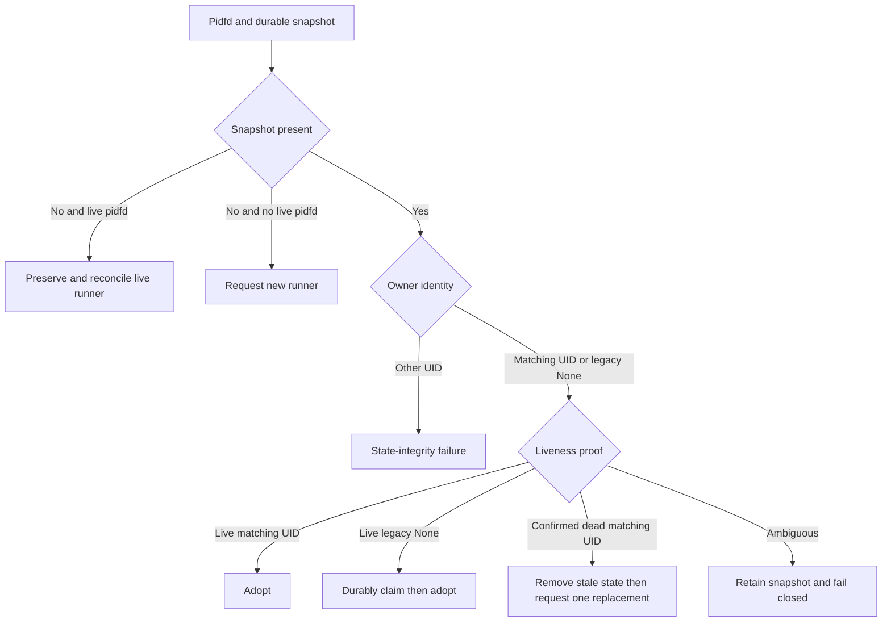

# Device Provider Recovery - Plan

## Goal Capsule

Finish the Device Provider stream on `feat/spec001-device-providers` and land it through a pull request to protected `v3`.
Repair durable swtpm recovery without permitting duplicate workers.
Keep device authority checks exact, typed broker effects observable, and public diagnostics bounded.
Do not add operator-facing TPM reconciliation beyond the existing Admin wire contract.

---

## Product Contract

### Summary

Device-backed TPM and security-key resources must recover safely after daemon interruption and reject cross-zone or foreign-owner effects before host mutation.
The daemon and broker must preserve the existing authority, privacy, and fail-closed contracts.

### Problem Frame

The swtpm effect port currently returns a transient error indefinitely for a matching-owner durable snapshot whose worker is confirmed dead.
It also rejects a live legacy snapshot that has no recorded resource owner.
Those outcomes prevent safe recovery or compatibility adoption.
The TPM directory hardening path may lose its typed audit shape when it uses the generic state-directory broker operation.
The new security-key effect port requires source and test review before it becomes part of the shipped surface.

### Requirements

**Swtpm durable recovery**

- R1. A matching-owner swtpm snapshot with confirmed worker death must remove or replace only the stale durable process state and allow one safe replacement worker.
- R2. An ambiguous pidfd observation or reopen result must retain the snapshot and stop reconciliation without cleanup or respawn.
- R3. A proven-live legacy swtpm snapshot with no owner resource UID and matching VM and role binding must be claimed durably for the requesting device UID before it is treated as adopted.
- R4. A snapshot owned by another resource UID must remain a state-integrity failure.

**Typed effects and authority**

- R5. TPM state-directory hardening failures must reach daemon audit or status handling with the typed swtpm directory outcome when the dedicated broker operation is applicable.
- R6. Security-key effects must compare the admitted zone value with the request or runtime zone before any inventory or HID effect.
- R7. Security-key authority must remain capability-bound and single-use, rather than treating deterministic identifiers as authenticated integrity evidence.
- R8. Host-global broker authority must be acquired only through the established typed effect boundary and must not widen device-scoped authority.
**Contracts and operations**

- R9. Child process specifications and readiness outcomes must remain represented by the existing controller and supervisor contracts, with no discarded TPM lifecycle state.
- R10. TPM pre-start flush behavior must conform to the existing scheduler lifecycle; if the scheduler does not establish a listening endpoint before flush, use its supported readiness dependency rather than a speculative socket connection.
- R11. Device TPM reconcile remains available only through the existing Admin wire operation until U9 defines an operator-facing trigger.
- R12. Public status, audit records, generated wire schema, and reference documentation must contain only bounded identifiers and stable error information.
- R13. Security-key admission must be reconstructed from the authoritative resource store and must bind the stored device UID, resource reference, provider, owner, and zone to the requested runtime before any host effect.
- R14. A physical security-key selector or resolved device identity must have one active holder across VMs. A conflicting request must fail before opening or relaying the device.
- R15. A verified live swtpm pidfd with a missing durable snapshot must not be deregistered or replaced until the state is reconciled without creating a duplicate worker.
- R16. Security-key Device reconcile remains available only through the existing Admin wire operation.

### Acceptance Examples

- AE1. Covers R1. Given a durable snapshot for device `tpm-a` whose owner is confirmed dead, when reconciliation starts, then stale process state is cleared through the owning path and a replacement swtpm request is issued.
- AE2. Covers R2. Given a durable snapshot whose pidfd cannot be reopened or identified conclusively, when reconciliation starts, then it returns the quarantine or transient failure and neither removes the snapshot nor issues a spawn.
- AE3. Covers R3 and R4. Given a live ownerless legacy snapshot, reconciliation binds it to `tpm-a`; given an owner UID for `tpm-b`, reconciliation fails without changing the record.
- AE4. Covers R5. Given swtpm directory hardening failure, when the broker replies, then daemon handling retains its typed swtpm operation and bounded audit result.
- AE5. Covers R6. Given a security-key request for a resource admitted to a different zone, when dispatch runs, then it rejects the request before an effect request is sent.
- AE6. Covers R13 and R14. Given caller-provided security-key fields that disagree with the stored Device resource, or a selector already held by another VM, when dispatch runs, then it rejects the request before opening a hidraw descriptor.
- AE7. Covers R15. Given a verified live swtpm pidfd but no durable snapshot, when reconciliation starts, then it preserves the live runner and does not request a replacement.
- AE8. Covers R16. Given a non-Admin peer requesting security-key Device reconcile, when dispatch runs, then it rejects the request before admission or host effects.

### Scope Boundaries

#### In scope

- Crash recovery, legacy ownership adoption, typed TPM directory reporting, and device effect authority checks in the tracked Device Provider stream.
- Regeneration and review of directly affected daemon API and wire-protocol references.
- Focused Rust, broker, policy, drift, fixture, packaging, and hermetic validation that covers the tracked changes.

#### Deferred to Follow-Up Work

- The broader roadmap's U9 owns a new operator-facing Device TPM reconcile trigger.
- Aggregate `make check`, KVM, live-host, and hardware acceptance remain deferred to U9.
- Broader scheduler redesign, migration of unrelated provider effects, and a public TPM lifecycle UI remain outside this change.

### Assumptions

- The current startup adoption classification in `packages/d2bd/src/lib.rs` is authoritative: confirmed missing or dead state permits stale snapshot removal, while `AdoptRaced` preserves it.
- The current generic state-directory caller is the sole TPM hardening caller. A dedicated operation is justified only if it preserves state-directory behavior while restoring the typed swtpm audit contract.
- Existing controller scheduler semantics are authoritative for flush ordering unless a focused test demonstrates that no readiness dependency is established.

---

## Planning Contract

### Key Technical Decisions

- KTD1. **Classify durable swtpm observations before mutation.** Use three outcomes: adopt or claim a proven-live record, remove only a proven-dead matching-owner record, and retain all ambiguous records. This preserves R1-R4 and follows the startup adoption distinction in `packages/d2bd/src/lib.rs`.
- KTD2. **Claim a live ownerless legacy record through the durable snapshot owner field.** Require the existing VM and role binding before the claim. Do not broaden the foreign-owner rule or infer ownership from a PID. This implements R3 while preserving R4.
- KTD3. **Use the dedicated swtpm directory broker contract when it is the operation being performed.** Propagate its typed result to the daemon's bounded audit or status mapping. Keep generic `PrepareStateDir` for generic callers. This implements R5 without introducing a parallel hardening implementation.
- KTD4. **Reconstruct security-key admission from authoritative resource state.** Compare stored device, provider, owner, and full zone identity before effects. Treat deterministic binding hashes as correlation only. Preserve single-use admission after store-backed verification. This implements R6-R8 and R13.
- KTD5. **Do not add a retry loop that probes an unready swtpm socket.** Retain the scheduler-owned flush sequence when its process dependency makes the endpoint available. If it does not, model readiness through the existing process contract. This implements R10.
- KTD6. **Reconcile a live pidfd even if its separate durable snapshot is absent.** Do not deregister or replace a verified live runner solely because the snapshot write is missing. This implements R15.
- KTD7. **Represent a physical security-key hold by resolved device identity, not VM identity.** Reject a second VM before descriptor opening and release the identity on the existing session lifecycle. This implements R14.

### High-Level Technical Design

The liveness classification happens before cleanup, claim, or spawn.
The broker remains the only host mutation authority.
The controller receives typed results and records bounded public status.

### System-Wide Impact

The change crosses daemon startup adoption, the privileged broker protocol, generated daemon API references, device provider controllers, and security-key device admission.
Security-key dispatch must read authoritative resource state before creating a provider authority object.
The active session table or equivalent owner must serialize physical device claims across VMs.
It must preserve the non-root daemon and broker boundary described by `docs/adr/0002-non-root-daemon-and-privileged-broker.md` and the restart adoption contract in `docs/adr/0034-storage-lifecycle-restart-and-synchronization.md`.

### Risks and Dependencies

- A false-positive death decision could produce two swtpm workers over one NVRAM directory. Tests must distinguish confirmed death from every ambiguous observation.
- Separate pidfd-table and durable-snapshot writes can leave a verified live runner without a snapshot. Tests must prove that this state cannot deregister or replace the runner.
- Caller-shaped security-key references and a deterministic binding digest do not authenticate admission. Tests must exercise a mismatched stored resource and a conflicting physical selector.
- A raw zone or filesystem path in a new error response would violate bounded diagnostics. Serialization and audit tests must assert stable identifiers only.
- The generated schema and daemon API files must be regenerated by their existing producer and verified by existing drift checks.
- The previously untracked `packages/d2bd/src/security_key_effect_port.rs` must be staged before hermetic or Nix validation.

### Sources and Research

- `packages/d2bd/src/tpm_effect_port.rs` contains the current durable adoption gate and focused effect-port tests.
- `packages/d2bd/src/lib.rs` contains startup adoption classification and Device TPM reconcile dispatch.
- `packages/d2b-provider-device-tpm/src/resource_controller.rs` and `packages/d2b-provider-device-tpm/tests/resource_controller.rs` define controller sequencing and flush-failure behavior.
- `packages/d2b-provider-device-security-key/tests/exact_authority.rs` demonstrates exact device and single-use admission checks.
- `docs/adr/0034-storage-lifecycle-restart-and-synchronization.md` requires durable logical adoption metadata, cgroup or pidfd-backed proof, and quarantine on ambiguity.
- Linux `pidfd_open(2)` and `waitid(2)` distinguish pidfd exit observation from numeric PID reuse. Their use does not replace the repository's more specific startup adoption contract.

---

## Implementation Units

### U1. Repair durable swtpm adoption

- **Goal:** Classify matching-owner, legacy-ownerless, confirmed-dead, foreign-owner, and ambiguous durable snapshots before effect mutation.
- **Requirements:** R1, R2, R3, R4, R15.
- **Dependencies:** None.
- **Files:** `packages/d2bd/src/tpm_effect_port.rs`, `packages/d2bd/src/lib.rs`, focused tests in those modules.
- **Approach:**
  1. Extend the durable adoption gate to return distinct outcomes for live adoption or claim, proven-dead stale-state replacement, foreign ownership, and ambiguous failure.
  2. Reuse the startup adoption proof classification from `lib.rs` instead of translating an ambiguous reopen result into death.
  3. Durably write the current device UID only for a proven-live legacy ownerless snapshot with the current VM and swtpm role binding.
  4. Preserve the current narrow cleanup owner and replacement sequencing.
- **Execution note:** Add characterization coverage for every existing branch before changing recovery behavior.
- **Patterns to follow:** `AdoptOutcome::Missing` and `AdoptRaced` handling in `packages/d2bd/src/lib.rs`.
- **Test scenarios:**
  - Covers AE1. A matching-owner confirmed-dead snapshot is removed or replaced before one spawn request.
  - Covers AE2. A failed or raced pidfd reopen retains the snapshot and produces no spawn request.
  - Covers AE3. A live `None` owner is claimed with the current device UID and adopted.
  - Covers AE3. A live snapshot owned by a different UID returns state integrity and remains unchanged.
  - A matching-owner live snapshot is adopted without duplicate spawn.
  - Covers AE7. A verified live pidfd with no snapshot is preserved without deregistration or replacement request.
- **Verification:** The focused daemon tests prove each durable state transition and the full daemon workspace compiles.

### U2. Preserve typed swtpm directory hardening outcomes

- **Goal:** Route TPM directory hardening through the typed broker operation when the existing contracts show that generic preparation loses the swtpm audit result.
- **Requirements:** R5, R12.
- **Dependencies:** U1.
- **Files:** `packages/d2bd/src/tpm_effect_port.rs`, `packages/d2b-priv-broker/src/ops/swtpm_dir.rs`, `packages/d2b-priv-broker/src/ops/audit_op.rs`, `packages/d2b-priv-broker/tests/security_key_broker.rs` or the focused broker test module, `packages/d2b-contracts/src/broker_wire.rs`.
- **Approach:**
  1. Trace the current `PrepareStateDir` reply through daemon error and audit mapping.
  2. If that path loses typed swtpm details, select the existing `PrepareSwtpmDir` request and preserve the generic operation for non-TPM use.
  3. Map typed failure fields into the existing bounded daemon audit and status shapes.
- **Patterns to follow:** Typed operation and audit variants in the broker's `swtpm_dir` and `audit_op` modules.
- **Test scenarios:**
  - Covers AE4. A directory hardening failure retains the typed swtpm operation identity in daemon-facing audit or status data.
  - A success reply preserves current state-directory preparation behavior.
  - Serialized error and audit output omit raw paths, credentials, and unbounded system values.
- **Verification:** Daemon and standalone broker tests pass, and the generated wire contract remains synchronized.

### U3. Complete security-key effect-port authority checks

- **Goal:** Track, inspect, and verify the security-key effect port as production code, including exact zone enforcement before a host effect.
- **Requirements:** R6, R7, R8, R12, R13, R14, R16.
- **Dependencies:** None.
- **Files:** `packages/d2bd/src/security_key_effect_port.rs`, `packages/d2bd/src/lib.rs`, `packages/d2b-priv-broker/src/ops/security_key.rs`, `packages/d2b-priv-broker/tests/security_key_broker.rs`, `packages/d2b-contracts/src/broker_wire.rs`.
- **Approach:**
  1. Load the Device resource through the existing authoritative resource-runtime path before constructing admission.
  2. Compare the stored UID, reference, provider, owner, and complete zone reference with the requested runtime.
  3. Reject mismatch before inventory, HID, or broker requests.
  4. Preserve deterministic device identifiers only as correlation values and retain authenticated admission evidence as the authority source.
  5. Serialize the resolved physical device identity across VM sessions and release it through the current session lifecycle.
  6. Confirm broker authority acquisition remains in the typed effect path and preserves redacted diagnostics.
- **Patterns to follow:** Exact authority tests in `packages/d2b-provider-device-security-key/tests/exact_authority.rs`.
- **Test scenarios:**
  - Covers AE5. A same-type but different zone reference is rejected before a broker effect request.
  - A matching zone and admitted device reaches the existing effect request path.
  - Reused or mismatched admission evidence is rejected without a host effect.
  - Covers AE6. Caller-provided fields that disagree with the stored Device resource are rejected before the broker request.
  - Covers AE6. A selector held by another VM returns the physical-backing conflict before descriptor opening.
  - Covers AE8. A non-Admin peer cannot invoke security-key Device reconcile, while Admin routing remains accepted.
  - Debug, audit, and wire error output omit physical paths, descriptors, and credentials.
- **Verification:** Focused daemon, security-key provider, broker, and contract tests pass with the file staged.

### U4. Verify TPM lifecycle contract and public reconcile boundary

- **Goal:** Prove that the current controller owns child specs, flush sequencing, readiness, finalization, and Admin-only reconcile routing, then change only a demonstrated contract violation.
- **Requirements:** R9, R10, R11.
- **Dependencies:** U1, U2.
- **Files:** `packages/d2b-provider-device-tpm/src/resource_controller.rs`, `packages/d2b-provider-device-tpm/src/resource_effect.rs`, `packages/d2b-provider-device-tpm/src/resources.rs`, `packages/d2b-provider-device-tpm/tests/resource_controller.rs`, `packages/d2bd/src/lib.rs`.
- **Approach:**
  1. Trace the controller's emitted flush and long-lived child specifications through the effect port and supervisor storage.
  2. Confirm the scheduler's dependency semantics establish required endpoint readiness before `swtpm_ioctl` runs.
  3. Add a readiness dependency only if a focused reproduction shows a pre-listen socket action.
  4. Add wire-level authorization coverage only if the existing Admin-only dispatcher lacks it.
- **Patterns to follow:** Existing event-trace sequencing tests in `packages/d2b-provider-device-tpm/tests/resource_controller.rs`.
- **Test scenarios:**
  - A flush failure prevents long-lived swtpm request and retains persistent TPM state.
  - A successful flush and readiness path produces one long-lived process specification that survives the established finalization contract.
  - A non-Admin peer cannot invoke Device TPM reconcile, while Admin routing remains accepted.
- **Verification:** Provider controller tests and focused daemon wire tests demonstrate no unready socket probe or unauthorized reconcile path.

### U5. Regenerate contracts, document the stream, and validate the tracked tree

- **Goal:** Include every intended Device stream file, synchronize generated daemon references, add release notes, and validate from a tracked state.
- **Requirements:** R12.
- **Dependencies:** U1, U2, U3, U4.
- **Files:** `docs/reference/daemon-api.md`, `docs/reference/schemas/v2/wire-protocol.json`, `packages/d2b-contracts/src/broker_wire.rs`, `packages/Cargo.lock`, `changelog.d/feat-spec001-device-providers.md`.
- **Approach:**
  1. Regenerate the existing daemon API and wire-protocol artifacts from their established source after contracts settle.
  2. Add a consumer-facing changelog fragment because other feature branches are in flight.
  3. Stage every intended file, including the security-key effect port, before packaging and Nix checks.
  4. Inspect migration paths for backup proof and audit identifiers for bounded diagnostics; retain current behavior when evidence shows the existing contract already enforces it.
- **Patterns to follow:** `docs/contributing/changelog-and-commits.md` and existing drift producers.
- **Test scenarios:**
  - Generated documentation has no drift against the source contracts.
  - Each migration path either proves its existing backup requirement or is rejected before mutation.
  - Audit identifiers remain stable and bounded across representative error paths.
- **Verification:** Formatting, changed-package Clippy, focused tests, policy, fixture, drift, packaging, and hermetic Nix checks pass from a state containing all intended tracked files.

---

## Verification Contract

| Scope | Verification | Done signal |
| --- | --- | --- |
| Formatting and lint | Run formatter only on each changed Rust file, then changed-package Clippy. | No formatting or lint diagnostics. |
| Daemon recovery | Run focused `d2bd` tests for `tpm_effect_port`, startup adoption, security-key effect dispatch, and wire authorization. | All recovery and wrong-zone cases pass. |
| Provider behavior | Run `d2b-provider-device-tpm` and `d2b-provider-device-security-key` tests. | Lifecycle, authority, and privacy cases pass. |
| Broker boundary | Run standalone `d2b-priv-broker` tests. | Typed swtpm and security-key operations preserve audit contracts. |
| Contract artifacts | Run the repository tracing, fixture, policy, and drift gates that cover generated wire and daemon API documents. | No generated artifact or policy drift. |
| Hermetic packaging | Commit the intended tree before running applicable `git+file` Nix and packaging checks. | Nix sees the staged security-key port and completes without clean-checkout discrepancies. |

Do not claim aggregate `make check`, KVM, live-host, or hardware acceptance for this work.

---

## Definition of Done

- U1-U5 meet their stated verification outcomes.
- The final tracked diff contains `packages/d2bd/src/security_key_effect_port.rs` and no required Device stream file remains untracked.
- Confirmed-dead snapshots recover, while ambiguous observations remain fail-closed.
- Legacy ownerless live snapshots claim the current device UID, and foreign owners still fail.
- Typed swtpm directory failures and all public diagnostics preserve bounded, redacted contract shapes.
- Generated daemon API and wire-protocol documentation are synchronized.
- The branch contains a release-note fragment and commits with the required trailer.
- A pull request targets `v3`, passes required CI, and is merged without direct changes to protected branches.
- Remove experimental code or scratch artifacts that are not part of the delivered behavior.

---

<!-- ce-section: work-relationships -->
## Work Relationships

This Device stream is one prerequisite for later device and runtime tracks.
After both the System and Device streams merge, U16 device-gpu, U28 runtime-qemu-media, and U31 transport-vsock can start.
