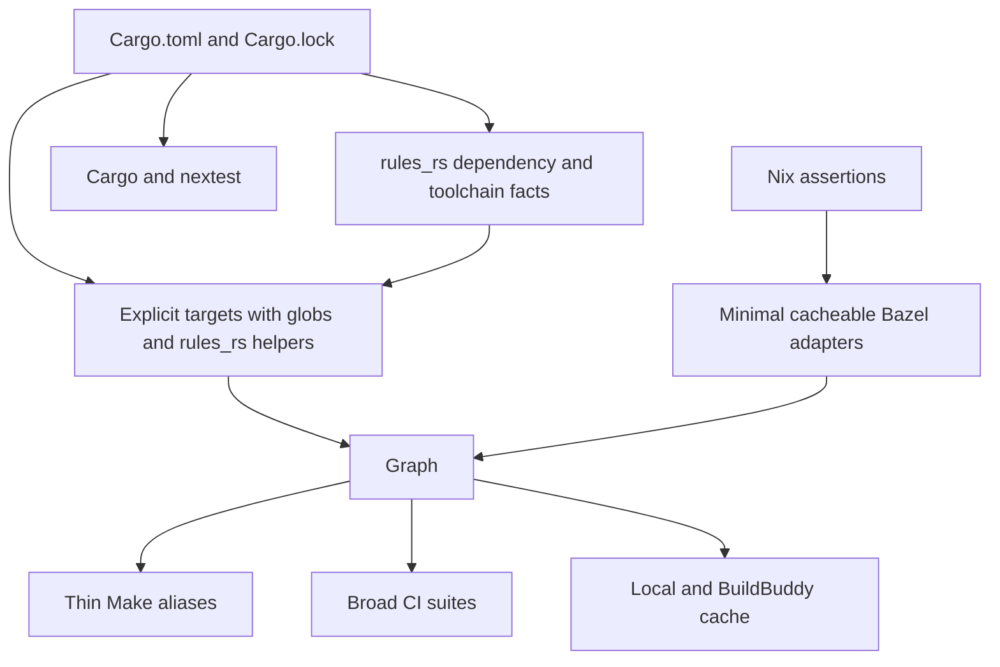
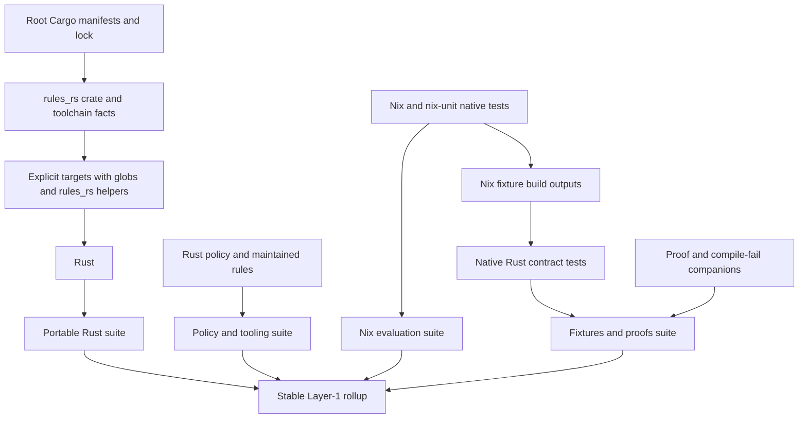

# Cargo-Authoritative Bazel Check Graph - Plan

## Goal Capsule

- **Objective:** Replace the unmerged Bazel check implementation with one Cargo-authoritative, cacheable Bazel graph that uses `rules_rs`, removes shell-owned scheduling, preserves direct Cargo workflows, and gives every current Layer-1 leaf a defined Bazel-native disposition.
- **Product authority:** This plan owns the Rust build graph, eligible `make check` coverage, leaf migration contract, Make compatibility targets, and Layer-1 CI suite shape.
- **Open blockers:** None. The plan uses the direct explicit-target path supported by `rules_rs`.
- **Execution profile:** Replace dependency and source duplication first, convert each leaf to its native Bazel form, then switch Make and CI together.
- **Stop conditions:** Stop if `rules_rs` cannot represent a required Cargo target, a leaf loses enforcing coverage, Nix caching depends on undeclared host state, or Layer-1 critical-path time exceeds the branch baseline without a fixed-suite split.
- **Tail ownership:** The implementation owner updates the branch, commits before authoritative Nix validation, obtains independent review, and lands through the protected-branch PR workflow.

---

## Product Contract

**Product Contract preservation:** Changed R3-R5, R12, R26, R30, and R33 after user confirmation. The plan now uses explicit targets without a Gazelle spike or new validation tooling, and it adds the Layer-1 critical-path non-regression guard. All IDs remain stable.

### Summary

The repository will use Cargo manifests and `Cargo.lock` as the Rust source of truth and Bazel as the sole check scheduler.
Every eligible Layer-1 leaf will become a cacheable Bazel target or a documented minimal adapter, while direct Cargo and nextest workflows remain valid.

### Problem Frame

The unmerged `feat/bazel-buildbuddy-check` branch proves that broad Bazel and BuildBuddy execution is feasible, but its Rust BUILD files still repeat source and dependency facts already present in Cargo.
Its Make, Bash, Perl, and generated CI layers also retain target selection, resource budgeting, discovery, sharding, and rollup responsibilities that belong in one execution graph.

That duplication makes routine Rust changes update multiple authorities and makes incremental behavior harder to reason about.
Contributors need to run either Cargo or Bazel against the same Rust tests, and unchanged checks should be satisfied from Bazel's cache instead of being rediscovered and rerun by shell orchestration.

### Key Decisions

- **Cargo owns the Rust package and dependency contract.** (session-settled: user-directed - chosen over independently maintained Cargo and Bazel declarations: duplicated source and dependency facts are the primary maintenance pain.) Governs R1-R5.
- **Bazel owns all check scheduling and parallelism.** (session-settled: user-directed - chosen over Make and Bash fan-out: one graph must control execution, caching, and aggregation.) Governs R8-R12.
- **The migration covers every current eligible leaf.** (session-settled: user-directed - chosen over a smaller first increment: partial conversion would preserve competing schedulers.) Governs R9, R24, and R30-R32.
- **Use explicit first-party targets with helpers and globs.** (session-settled: user-directed - chosen over a Gazelle compatibility spike or a custom generator: the simplest supported path removes duplicated file and third-party dependency lists without adding validation machinery.) Governs R3-R7.
- **Keep Nix assertions in Nix through the shortest cacheable Bazel path.** (session-settled: user-approved - chosen over rewriting Nix checks or leaving them outside Bazel: no maintained native Nix test rule exists.) Governs R19-R21.
- **Model doctests as one native target per crate.** (session-settled: user-directed - chosen over one workspace-wide Cargo adapter or a Cargo-only lane: per-crate targets give fine-grained cacheability without source-file lists.) Governs R16-R18.
- **Keep Make as a compatibility surface.** (session-settled: user-directed - chosen over removing Make or keeping only its aggregate: existing public targets remain thin Bazel aliases.) Governs R11.
- **Use a few execution-coherent CI suites.** (session-settled: user-directed - chosen over one job per Bazel target: leaves remain runnable and cacheable without excessive CI fan-out.) Governs R12.
- **Measure relative incremental improvement.** (session-settled: user-directed - chosen over the prior fixed three-minute threshold: representative source and dependency changes must invalidate fewer actions and complete faster than the unmerged branch.) Governs R25-R29.

<!-- ce-section: work-relationships -->
### How This Work Fits Together

This plan owns the successor to the unmerged Bazel and BuildBuddy check migration.
The surrounding relationships describe current context, not a committed roadmap.

- **Supersedes:** The Product Contract in `docs/plans/2026-08-14-002-refactor-bazel-buildbuddy-check-migration-plan.md` where it requires `rules_rust`, manual BUILD authority, shell scheduling, fine-grained CI Rust leaves, custom qualification tooling, or a fixed three-minute threshold.
- **Reuses:** Compatible graph, BuildBuddy, test, and documentation work from `feat/bazel-buildbuddy-check` remains implementation input rather than being discarded wholesale.
- **Shares:** The standalone [contributor Gas City repository](https://github.com/vicondoa/d2b-gascity) may provide Bazel and BuildBuddy access, but its orchestration is not part of this graph.
- **Can proceed independently of:** d2b runtime, daemon, broker, microVM, and consumer-facing feature work.

### Actors

- A1. **Contributor:** Adds or changes Rust and Nix coverage, then runs focused or complete checks through Cargo, Bazel, or a Make alias.
- A2. **Bazel:** Owns target discovery after graph generation, dependency scheduling, parallelism, test caching, and suite aggregation.
- A3. **Cargo and nextest:** Remain direct development entrypoints over the same conventional Rust test sources.
- A4. **Continuous integration:** Runs a fixed small set of broad Bazel suites and reports one stable required result.
- A5. **BuildBuddy:** Executes and caches eligible actions without becoming a separate graph authority.
- A6. **Nix evaluator:** Runs Nix-native assertions from Bazel actions with declared inputs and an explicit execution policy.

### Requirements

**Rust graph authority**

- R1. Root Cargo manifests and `Cargo.lock` must remain authoritative for Rust package membership, third-party resolution, features, and direct Cargo workflows.
- R2. The Bazel Rust graph must use `hermeticbuild/rules_rs` with its direct Cargo lockfile facts, Bazel downloader integration, hermetic toolchains, and patched `rules_rust` facade.
- R3. First-party Rust targets must be explicit Bazel targets that derive third-party dependency labels from `rules_rs`.
- R4. First-party targets must use standard source globs instead of enumerating Rust module files.
- R5. BUILD files must list only first-party target edges and documented exceptions that Cargo metadata or `rules_rs` helpers cannot express.
- R6. The graph must not add a repository-owned Cargo-to-Bazel generator, dependency resolver, generic action runner, or patched upstream rule.
- R7. Rust files and tests may move into Cargo-conventional locations when that lets maintained discovery or standard globs replace explicit file enumeration.

**Execution ownership and interfaces**

- R8. Bazel must be the sole owner of check dependency ordering, parallelism, target selection, retry behavior, and aggregate status.
- R9. Every eligible Layer-1 leaf and Rust subleaf in the migration matrix must have a Bazel target, suite membership, or retirement disposition.
- R10. Bash may remain only when Bash is the test subject or no maintained native rule can express the check, and it must never schedule sibling work.
- R11. `make check` and existing public Make leaf targets must remain thin aliases to Bazel targets without local scheduling logic.
- R12. CI must run a fixed small set of broad Bazel suites grouped by execution and toolchain needs while keeping underlying leaves directly runnable, and it must split a slow suite into additional fixed jobs when needed to avoid regressing end-to-end Layer-1 wall-clock time.

**Rust tests and companion coverage**

- R13. Conventional Rust unit, integration, contract, and binary tests must use the same source and test logic under direct Cargo or nextest and native Bazel test targets.
- R14. Rust behavior currently asserted by shell wrappers must move into conventional Rust tests when Rust can express the assertion without weakening it.
- R15. Broker, guest, feature-specific, proc-macro, build-script, binary, example, and harness-free coverage must remain explicit where Cargo target semantics require distinct Bazel targets.
- R16. Each doctested first-party crate must have one native `rust_doc_test` target grouped into the Rust suite without enumerating documentation source files.
- R17. Direct Cargo validation must retain `cargo test --doc` because nextest does not execute doctests.
- R18. Compile-fail doctests, `harness = false` binaries, and other non-nextest companions must remain enforcing coverage rather than being inferred from a successful nextest run.

**Nix and non-Rust checks**

- R19. `nix-unit`, flake evaluation, and flake output assertions must remain Nix-native and must not be rewritten as Rust approximations.
- R20. Nix-native checks must run through the smallest Bazel test adapters that declare relevant repository inputs and invoke maintained `nix` or `nix-unit` tools without scheduling logic.
- R21. Nix discovery and sharding must move out of workflow and Bash orchestration into stable Bazel targets or the Nix tool's own test discovery.
- R22. Repository policy and hygiene logic must become conventional Rust tests when it is repository logic, or use maintained specialized Bazel lint, diff, build, or license rules when those rules own the behavior.
- R23. Checks whose subject is an external command such as `cargo-deny`, `cargo-audit`, `nix`, or `nix-unit` may use a minimal cacheable Bazel command adapter when no maintained language-specific test rule exists.
- R24. The leaf migration matrix is normative for coverage and conversion intent; planning may refine exact maintained rule choices without changing a leaf's stated behavior or cache boundary.

**Caching, performance, and remote execution**

- R25. An unchanged eligible test with unchanged declared inputs must be served from Bazel's test cache instead of being rerun by an outer scheduler.
- R26. A before/after timing check must record the unmerged branch's incremental wall time and executed-action count for representative Rust source and Cargo dependency changes.
- R27. The accepted graph must measurably reduce both incremental wall time and invalidated-action count against the R26 baseline without imposing a fixed absolute duration.
- R28. Eligible actions must preserve current local Bazel and BuildBuddy remote execution and cache behavior with equivalent graph semantics.
- R29. This migration must not add a new host or target platform matrix.

**Cutover and parity**

- R30. The cutover must preserve every assertion in the old Layer-1 and Rust leaves.
- R31. The accepted cutover must remove obsolete shell schedulers, dynamic CI discovery jobs, rollup scripts, and duplicate graph authorities rather than leave a long-lived shadow path.
- R32. Contributor documentation, Make aliases, CI configuration, coverage inventories, and changelog material must describe the Bazel graph as the single execution authority.
- R33. Compatible work from `feat/bazel-buildbuddy-check` must be retained unless it conflicts with this Product Contract or fails existing repository gates.

### Graph Shape

### Layer-1 Leaf Migration Matrix

The table describes required end states, not implementation file layouts.
Rows marked as retired lose only orchestration identity; their assertions remain in the named Bazel target or suite.

| Leaf | Type | Required Bazel form | Cache and exception boundary |
| --- | --- | --- | --- |
| `check` | CI rollup | Stable required status over the fixed Bazel suite jobs, with no test execution in the rollup | CI dependency status only; no shell rollup |
| `tier0` / `make check-tier0` | Repository hygiene | Bazel policy suite target covering the first-pass assertions | Native Rust or maintained policy rules |
| `test-ci-coverage` | CI structural policy | Bazel policy test over suite and workflow structure | Native Rust policy test or maintained diff rule |
| `check-inventory` | Inventory drift | Retired after direct Cargo/Bazel queries confirm suite membership | Coverage inventory files deleted |
| `test-performance-budgets` | Advisory metric | Advisory Bazel policy target preserving guarded-skip semantics | Cached by declared inputs; remains advisory |
| `test-lint` | Lint | Maintained native Bazel lint targets grouped in the policy suite | Prefer maintained lint rules; no shell fan-out |
| `test-changelog` | Changelog policy | Bazel policy test preserving the current allowed-skip contract | Native Rust policy test |
| `bazel-check` | Legacy aggregate | Thin alias to the complete Bazel suite set | Existing wrapper and target-set selection retire |
| `test-rust-main` | Rust suite | Native first-party Rust tests, lint companions, doctests, and harness-free targets | Fine-grained Rust action and test caching |
| `test-rust-broker` | Rust suite | Native broker tests for each enforcing feature configuration | Fine-grained Rust action and test caching |
| `test-rust-guest-shell-runner` | Rust suite | Native guest runner tests | Fine-grained Rust action and test caching |
| `test-rust-no-bash-ast` | Rust policy | Conventional Rust policy test using the AST walker library | Bash is the subject, not the scheduler |
| `test-rust-schema` | Reproducibility policy | Conventional Rust test that generates and compares schema results | Native Rust test caching |
| `test-rust-inventory` | Rust and repository policy | Conventional Rust tests for pinned inventory and no-socket behavior | Native Rust test caching |
| `test-rust-supply-chain` | External tool policy | Bazel suite invoking pinned deny and audit tools against declared policy inputs | Minimal command adapters allowed by R23 |
| `test-rust` | Legacy Rust rollup | Thin alias to the Rust Bazel suite | Make and CI rollup scheduling retire |
| `test-fixture-contracts` | Rust contracts with Nix fixtures | Native Rust contract tests consuming separately declared fixture inputs | Nix fixture production may use the R20 adapter |
| `test-proofs` | Compile and policy proofs | `rust_test` for runtime proofs, `rust_doc_test` for doctest proofs, and maintained build tests for compile-only proofs | No broad shell proof runner |
| `test-flake` | Local Nix aggregate | Thin alias to the Nix-backed Bazel suite | Bazel owns test caching and scheduling |
| `nix-unit-discover` | Dynamic CI discovery | Retired as a job; Nix-unit discovery runs inside stable Bazel test targets | No workflow-generated matrix |
| `nix-unit-shards` | Nix-unit matrix | Stable Bazel Nix test targets grouped by execution need | Local cache only |
| `test-nix-unit` | Nix-unit rollup | Thin alias to the Nix-unit Bazel targets | No shell rollup |
| `flake-eval-discover` | Dynamic CI discovery | Retired as a job; flake target membership is stable Bazel graph input | No workflow-generated matrix |
| `flake-eval-x86` | Nix flake evaluation | Cacheable Bazel test action invoking flake evaluation | Complete declared flake inputs |
| `flake-eval-x86-realized` | Nix realization | Cacheable Bazel test action preserving realized-output behavior | Local cache only |
| `flake-eval-x86-outputs` | Nix output policy | Cacheable Bazel test action validating required outputs | Complete declared flake inputs |
| `test-flake-x86` | Legacy Nix rollup | Thin alias to the x86 Nix Bazel targets | No shell rollup |
| `test-flake-aarch64` | Cross-platform Nix evaluation | Cacheable Bazel test action preserving the existing aarch64 smoke evaluation | No expanded platform matrix |
| `test-drift` | Generated-artifact drift | Native Rust policy tests and maintained file or directory diff tests | Per-artifact declared inputs |
| `test-policy` | Repository policy | Native Rust policy suite plus maintained specialized rules | Bash only where Bash is the test subject |
| `test-runtime-ledger` | Runtime budget policy | Native Rust test target preserving the runtime envelope | Bazel owns timeout and scheduling |

### Rust Subleaf Migration Matrix

| Subleaf | Type | Required Bazel form | Cargo parity |
| --- | --- | --- | --- |
| Main workspace format | Rust formatting | Maintained native Rust formatting test | Direct `cargo fmt` remains valid |
| Main workspace clippy | Rust lint | Maintained native Clippy lint test | Direct Cargo Clippy remains valid |
| Main workspace unit and integration tests | Rust tests | Generated targets after R3 or explicit `rust_test` targets under R5 | Same tests run through nextest |
| Rust doctests | Rustdoc tests | One `rust_doc_test` per doctested crate | Direct `cargo test --doc` companion |
| Harness-free targets | Rust companion coverage | Explicit build or test targets preserving their non-nextest semantics | Direct Cargo companion command remains valid |
| Broker default features | Rust tests | Native broker test target for default features | Same Cargo feature invocation remains valid |
| Broker Layer-1 features | Rust tests | Native broker test target for the Layer-1 feature set | Same Cargo feature invocation remains valid |
| Broker fake-backends features | Rust tests | Native broker test target for fake backends | Same Cargo feature invocation remains valid |
| Guest shell runner | Rust tests | Native guest runner test target | Same tests run through nextest |
| No-Bash AST walker | Rust policy | Conventional Rust test over AST-walker behavior | Same test runs through Cargo |
| Schema reproducibility | Rust policy | Conventional Rust test over schema generation results | Same test runs through nextest |
| Main cargo-deny | Supply chain | Cacheable command target using pinned Cargo policy inputs | Direct cargo-deny remains available |
| Broker cargo-deny | Supply chain | Cacheable command target using broker policy context | Direct cargo-deny remains available |
| Guest cargo-deny | Supply chain | Cacheable command target using guest policy context | Direct cargo-deny remains available |
| Main cargo-audit | Supply chain | Cacheable command target using pinned advisory inputs | Direct cargo-audit remains available |
| Broker cargo-audit | Supply chain | Cacheable command target using broker advisory policy | Direct cargo-audit remains available |
| Guest cargo-audit | Supply chain | Cacheable command target using guest advisory policy | Direct cargo-audit remains available |
| Stub no-socket assertion | Rust policy | Conventional Rust test that observes prohibited socket behavior | Same test runs through Cargo |
| Pinned-test inventory | Repository policy | Conventional Rust policy test over Cargo test inventory | Same test runs through Cargo |
| Fixture contract tests | Rust contracts | Native Rust tests consuming Bazel-declared fixtures | Same applicable tests run through nextest |
| CLI contract tests | Rust binary integration | Native Rust binary integration tests with Bazel-provided binaries | Same applicable tests run through nextest |

### Key Flows

- F1. Add or change Rust coverage
  - **Trigger:** A1 changes a Cargo package, dependency, source file, or conventional Rust test.
  - **Actors:** A1, A2, A3
  - **Steps:** Cargo metadata changes once; explicit targets use globs and `rules_rs` helpers; the contributor runs the same test through Cargo or Bazel.
  - **Outcome:** No manual source or dependency list is synchronized between Cargo and Bazel.
  - **Covers R1-R7, R13-R18.**
- F2. Run the complete local check
  - **Trigger:** A1 runs `make check` or the complete Bazel suite.
  - **Actors:** A1, A2, A5, A6
  - **Steps:** The Make alias invokes Bazel once; Bazel resolves the graph, schedules eligible Rust, Nix, policy, and fixture targets, and uses local or BuildBuddy cache entries.
  - **Outcome:** No Bash, Perl, Make, or workflow layer owns sibling parallelism.
  - **Covers R8-R12, R19-R25, R28.**
- F3. Run Layer-1 CI
  - **Trigger:** A4 evaluates a pull request.
  - **Actors:** A2, A4, A5
  - **Steps:** Each broad CI job invokes one Bazel suite; Bazel runs or retrieves its leaf targets; CI reports one stable required status.
  - **Outcome:** CI fan-out is bounded while each leaf remains directly rerunnable.
  - **Covers R12, R25, R28-R32.**
- F4. Evaluate Nix coverage
  - **Trigger:** A1 or A4 requests a Nix-unit or flake target.
  - **Actors:** A2, A6
  - **Steps:** Bazel keys the test from declared flake and test inputs; a minimal adapter invokes the native Nix tool; unchanged successful results remain cacheable.
  - **Outcome:** Nix semantics remain native without a shell scheduler or Rust rewrite.
  - **Covers R19-R23, R25.**
- F5. Declare a first-party Rust target
  - **Trigger:** A Cargo package adds or changes a library, binary, test, build script, proc macro, or feature context.
  - **Actors:** A1, A2
  - **Steps:** The Bazel target uses a source glob, `rules_rs` dependency helpers, and only the necessary first-party or exception edges.
  - **Outcome:** Cargo remains authoritative without a generation step or duplicate file list.
  - **Covers R3-R6.**

### Acceptance Examples

- AE1. **New Rust source file**
  - **Covers R3-R5, R7.**
  - **Given:** A contributor adds a module beneath a conventional Cargo source tree.
  - **When:** The contributor runs Bazel.
  - **Then:** Bazel includes the source without adding its path to a hand-maintained list.
- AE2. **Cargo dependency change**
  - **Covers R1-R6.**
  - **Given:** A dependency or feature changes in Cargo metadata and the root lockfile.
  - **When:** Cargo and Bazel resolve the package.
  - **Then:** No separate Bazel dependency list or Bazel-specific Cargo lockfile is edited.
- AE3. **Direct Cargo and Bazel parity**
  - **Covers R13-R18.**
  - **Given:** A conventional Rust integration test is added.
  - **When:** The contributor runs nextest and its native Bazel target.
  - **Then:** Both execute the same test logic and report the same assertion outcome.
- AE4. **Doctest parity**
  - **Covers R16-R18.**
  - **Given:** A doctested crate contains an invalid example.
  - **When:** `cargo test --doc` or the crate's Bazel `rust_doc_test` runs.
  - **Then:** Both paths fail without relying on nextest to discover the doctest.
- AE5. **Unchanged complete check**
  - **Covers R8-R12, R25.**
  - **Given:** A complete eligible check previously passed and no declared input changed.
  - **When:** The contributor runs `make check` again.
  - **Then:** Make invokes Bazel once and Bazel serves eligible successful tests from cache without rerunning them.
- AE6. **Localized source edit**
  - **Covers R26-R28.**
  - **Given:** The current unmerged branch baseline and the successor graph are both measured.
  - **When:** The same representative Rust source edit is applied.
  - **Then:** The successor invalidates fewer actions and completes faster.
- AE7. **Localized dependency edit**
  - **Covers R26-R28.**
  - **Given:** The current unmerged branch baseline and the successor graph are both measured.
  - **When:** The same representative Cargo dependency edit is applied.
  - **Then:** The successor invalidates fewer actions and completes faster.
- AE8. **Nix-only change**
  - **Covers R19-R25.**
  - **Given:** A declared Nix test input changes while Rust inputs remain unchanged.
  - **When:** The Nix-backed Bazel suite runs.
  - **Then:** Relevant Nix targets rerun while unaffected Rust test results remain cached.
- AE9. **Unsupported automatic dependency edge**
  - **Covers R3-R7.**
  - **Given:** A first-party, platform-conditional, or feature-specific edge cannot be derived by `rules_rs`.
  - **When:** The owning Bazel target is declared.
  - **Then:** The BUILD file records only that explicit exception and does not add a second full dependency inventory.
- AE10. **Leaf-specific CI retry**
  - **Covers R9, R12, R25.**
  - **Given:** One leaf fails inside a broad CI suite.
  - **When:** A contributor reruns that leaf directly with Bazel.
  - **Then:** Bazel reuses unaffected cached work and executes only the failed leaf's invalidated graph.
- AE11. **CI critical-path guard**
  - **Covers R12.**
  - **Given:** The current branch's successful Layer-1 workflow provides the baseline from first executable job start through the final `check` result.
  - **When:** The replacement fixed-suite workflow is measured under an equivalent hosted-runner and cache state.
  - **Then:** The replacement does not take longer, or the slow execution class is split into additional fixed Bazel suite jobs and remeasured.

### Success Criteria

- Every row in both migration matrices has an implemented Bazel target, suite membership, or approved retirement with preserved assertions.
- Direct Cargo, nextest, Cargo doctest, focused Bazel, complete Bazel, and Make-alias workflows remain usable for their documented surfaces.
- No first-party BUILD file hand-maintains exhaustive Rust source or dependency lists.
- No Bash, Perl, Make, or CI workflow code schedules parallel check leaves.
- An unchanged eligible complete check reruns no cacheable test action.
- Representative source and dependency edits both invalidate fewer actions and complete faster than the unmerged branch baseline.
- End-to-end Layer-1 wall-clock time from first executable job start through the final `check` result does not exceed the current branch baseline.
- Local Bazel and BuildBuddy execute the same eligible graph, and local-only Nix actions remain visible rather than returning a reduced success.
- Coverage parity accounts for doctests, harness-free binaries, feature variants, fixture contracts, policy checks, and advisory leaves.

### Scope Boundaries

- No new host or target platform matrix.
- No repository-owned Cargo-to-Bazel generator, dependency resolver, scheduler, or generic action runner.
- No first-party BUILD generator and no patch or fork of `rules_rs`, Bazel, or another adopted rule solely to make this migration work.
- No rewrite of Nix assertions in Rust.
- No requirement that every external tool check become a Rust test when the tool invocation is the behavior being verified.
- No fixed absolute `make check` duration or provider-transfer budget in this Product Contract.
- No migration of container, VM, live-host, hardware, or other non-Layer-1 coverage into remote Bazel execution unless it is already part of the eligible graph.

### Dependencies and Assumptions

- `hermeticbuild/rules_rs` remains pre-1.0 and must be pinned rather than treated as API-stable.
- The patched `rules_rust` facade supplied by `rules_rs` provides native `rust_test` and `rust_doc_test` behavior.
- Bazel test caching for Nix actions depends on complete declared inputs and a stable Nix execution environment.
- BuildBuddy remains available for actions that satisfy the existing remote-eligibility boundary.
- Existing code on `feat/bazel-buildbuddy-check` is the behavioral baseline when its implementation and older plan disagree.

### Sources and Research

- Unmerged implementation: `feat/bazel-buildbuddy-check` at `daaa10aefa57eeb18fc3203cde74523e513d7756`.
- Existing migration contract: `docs/plans/2026-08-14-002-refactor-bazel-buildbuddy-check-migration-plan.md`.
- Current test authority: `tests/AGENTS.md`, `tests/layer1-jobs.json`, `Makefile`, and `tests/test-rust.sh`.
- [`hermeticbuild/rules_rs`](https://github.com/hermeticbuild/rules_rs/tree/v0.0.105) provides direct Cargo lockfile facts, Bazel downloader integration, hermetic Rust toolchains, and the patched `rules_rust` facade.
- [`rust_doc_test`](https://github.com/hermeticbuild/rules_rust/blob/93b72650b121012105dc7e04b0ec078bfa8d9adc/rust/private/rustdoc_test.bzl) provides native per-crate doctest execution.
- [Nextest documentation](https://github.com/nextest-rs/nextest/blob/b03f4c05b7793a9cac8a0a561904ecd51649fa36/site/src/docs/running.md) confirms that doctests still require `cargo test --doc`.
- [`rules_nixpkgs`](https://github.com/tweag/rules_nixpkgs/tree/v0.13.0) imports Nix packages and toolchains but does not define native `nix-unit` or flake-check test rules.
- [`nix-unit`](https://github.com/nix-community/nix-unit/tree/v2.35.1) remains the native evaluator for Nix unit assertions.
- [`aspect_rules_lint`](https://github.com/aspect-build/rules_lint), [`bazel-skylib`](https://github.com/bazelbuild/bazel-skylib), and [`bazel-lib`](https://github.com/bazel-contrib/bazel-lib) provide maintained native lint, build, and diff primitives for non-Rust leaves.

---

## Planning Contract

### Key Technical Decisions

- KTD1. **Pin the required external rule foundation through Bzlmod.** Pin Bazel 9.2.0, `rules_rs` 0.0.105, LLVM, `rules_nixpkgs_core`, `aspect_rules_lint`, bazel-skylib, bazel-lib, and rules_shell in U1. Use the official `rules_rs` release archive override until that version reaches the Bazel Central Registry. Keep Rust 1.97.0 aligned with `rust-toolchain.toml`, expose the `rules_rs`-managed `@rules_rust` facade, and generate `@crates` from root Cargo metadata. (session-settled: user-directed - chosen over retaining `rules_rust` and `crate_universe`: `rules_rs` consumes the root Cargo lock directly and removes the second dependency-resolution authority.) Governs R1, R2, R6, R19, R22, R23, R28, R29.
- KTD2. **Do not add first-party generation.** Keep explicit first-party targets, use KTD3 to eliminate per-file and third-party dependency duplication, and move nonconventional tests only when Cargo-standard placement makes a glob sufficient. (session-settled: user-directed - chosen over qualifying Gazelle or building a custom generator: this is the shortest supported path.) Governs R3-R7.
- KTD3. **Use `rules_rs` dependency helpers and source globs at every explicit boundary.** Load `aliases()` and `all_crate_deps()` from `@crates` for fallback and exception targets. Keep explicit dependency lists only for first-party edges or rule APIs that the helpers cannot express. Use Cargo-conventional source placement so BUILD files do not enumerate modules. Governs R1, R5-R7, R13.
- KTD4. **Model each feature context as a distinct target.** Replace global `--define` selectors with separate broker default, broker `layer1-bootstrap`, broker `fake-backends`, guest default, and guest `real-libshpool` test targets over shared sources. Preserve broker exclusivity and process-global tags on every broker variant. Governs R13, R15, R25, R30.
- KTD5. **Use native patched Rust rules for all Rust companions.** Use `rust_test`, `rustfmt_test`, `rust_clippy_test`, one `rust_doc_test` per doctested crate, and explicit `use_libtest_harness = False` targets. Keep direct nextest and `cargo test --doc` as Cargo parity surfaces, not Bazel subprocesses. (session-settled: user-directed - chosen over Bazel invoking Cargo or one broad workspace adapter: native targets preserve fine-grained action and test caching.) Governs R13-R18, R25.
- KTD6. **Use maintained test adapters by behavior type.** Convert repository logic into conventional Rust tests. Use explicit-source `aspect_rules_lint`, Skylib or bazel-lib diff/build tests, and Skylib `native_test` for a pinned executable whose zero exit status is the assertion. Keep `rules_shell` only when the shell program itself is under test. Governs R10, R14, R22-R24.
- KTD7. **Keep Nix local and cacheable.** Import pinned Nix and nix-unit executables through `rules_nixpkgs_core`. Use fixed `native_test` targets with complete flake data, `no-remote-exec`, `no-remote-cache`, and `no-sandbox`. Reuse `tests/tools/peak-rss.py` only as the existing purpose-specific RSS guard, not as a scheduler. Remote Nix cache and execution are outside this migration. (session-settled: user-approved - chosen over leaving Nix outside Bazel or rewriting Nix assertions in Rust: the shortest safe path makes unchanged Nix checks locally cacheable.) Governs R19-R25, R28.
- KTD8. **Use four logical CI suites with fixed execution-class jobs.** The logical suites are portable Rust, policy and tooling, Nix evaluation, and fixtures and proofs. Preserve realized Nix checks as a separate fixed job from eval-only Nix work because the current realized shard is already a critical-path and memory outlier. Run all fixed jobs in parallel behind preflight and retain one stable `check` rollup. Add fixed splits only when one comparable before/after workflow shows a Layer-1 critical-path regression. (session-settled: user-directed - chosen over dynamic per-target CI fan-out or accepting a slower simple workflow: CI should stay understandable without increasing time to result.) Governs R9, R11, R12, R25, R31, R32.
- KTD9. **Keep current BuildBuddy credential handling unchanged.** Preserve the existing credential helper, credential location, trust/profile selection, untrusted-job withholding, protected trusted-seed separation, BEP/log redaction, remote instance isolation, and typed pre-dispatch fallback. Remove only leaf discovery, sibling scheduling, fixed three-minute and transfer budgets, legacy graph identity, and same-graph comparison policy around that boundary. Governs R8, R11, R26-R29, R31-R33.
- KTD10. **Use built-in timing evidence without adding validation code.** Capture one comparable before/after run for unchanged, representative source-edit, representative already-locked dependency-edit, and CI-critical-path scenarios. Use Bazel profile/BEP wall time and `ActionSummary.actions_executed`; do not add a repository analyzer, schema, golden, or qualification command. Treat `actions_executed` as an invalidation proxy because Bazel exposes no exact invalidated-action count. Governs R26, R27.
- KTD11. **Make suite membership the graph authority.** Use explicit `test_suite` membership and direct Cargo/Bazel queries during migration. Delete duplicate Rust coverage, check-coverage, and Layer-1 job inventories instead of replacing them with a new schema. Keep migration records and pin files only as retirement evidence. Governs R9, R24, R30-R33.
- KTD12. **Prevent Nix oversubscription in the graph.** Mark local Nix actions exclusive and place eval-only, realized, and aarch64 work in fixed jobs that never run more than one memory-heavy target per runner. Verify the topology with Bazel profile and RSS evidence. Split fixed jobs under KTD8 if serialization would regress the workflow critical path. Governs R12, R19-R21, R25, R28.
- KTD13. **Produce fixtures as build outputs before testing them.** Use maintained bazel-lib action primitives with pinned Nix tools to create declared fixture files or directories. Native Rust contract tests consume those outputs as data. Nix assertion tests remain separate and never act as fixture producers. Governs R13, R19, R20, R23-R25, R30.
- KTD14. **Capture simple baselines before public cutover.** Preserve the old Make and CI paths only long enough to record one comparable incremental run and the latest representative Layer-1 critical path. Define replacement suites without switching public entrypoints, then change Make and CI together. Governs R12, R26, R27, R30-R33.

### High-Level Technical Design

The implementation has one graph: explicit Rust targets, native policy targets, local Nix targets, and fixed suites.

### Implementation Constraints

- Preserve `tests/AGENTS.md` test taxonomy until replacement policy tests and documentation land in the cutover.
- Preserve compile-fail capability seals, harness-free assertion targets, broker process serialization, fixture-dependent policy coverage, and advisory enforcement semantics.
- Use `git+file://` flake references or an equivalent declared source tree. Never evaluate a bare repository path that captures build outputs.
- Do not use package-wide formatting or add generated BUILD files.
- Do not broaden `local`, `no-sandbox`, or remote-exclusion tags beyond the target that needs them.
- Keep the root Cargo workspace authoritative for product crates. Keep proof and test-tool Cargo workspaces independent only where their existing policy requires it.
- Commit new files before authoritative Nix evaluation so the flake source contains them.

### Phased Delivery

1. **Foundation:** Complete U1.
2. **Native graph:** Complete U2-U5. Keep the old scheduler only for direct comparison.
3. **Suite definition:** Complete U6 without changing Make or CI authority.
4. **Atomic cutover:** Complete U7 to record simple baselines and switch Make and CI together.
5. **Cleanup:** Complete U8 after the existing Layer-1 gates pass.

### System-Wide Impact

- **Developer workflow:** Cargo, nextest, Bazel, and Make remain entrypoints, but only Bazel schedules the complete check graph.
- **CI:** Workflow structure changes from generated dynamic discovery and many leaf jobs to fixed Bazel suite jobs with a measured critical-path guard. Realized Nix work remains isolated from eval-only work.
- **Remote execution:** Rust and portable policy actions remain BuildBuddy candidates. Nix begins local-only and advances separately.
- **Test governance:** The current shell-retirement ledger and test taxonomy must describe Bazel labels and native Rust successors rather than top-level shell drivers.
- **Generated state:** Module locks, workflow files, and migration ledgers change ownership. First-party BUILD generation, coverage inventories, cache-policy goldens, and qualification machinery retire.

### Risks and Mitigations

| Risk | Mitigation |
| --- | --- |
| `rules_rs` 0.0.105 is not yet in the registry | Pin the official archive and integrity, then remove the override only after registry parity is verified |
| Feature unification changes broker or guest behavior | Use separate targets and compare each Cargo feature invocation with its Bazel counterpart |
| Nix cache keys omit repository inputs | Declare the complete flake and case inputs and keep Nix remote caching disabled |
| Fixed CI suites create a longer critical path | Preserve the realized Nix split, compare one representative before/after workflow, and split the slow execution class under KTD8 |
| Removing shell schedulers drops companion coverage | Check each migration-matrix row directly before deleting its old entrypoint |
| Remote logs expose credentials or paths | Retain credential-helper and redaction tests while deleting only obsolete qualification policy |
| Broad source globs increase invalidation | Measure action creation and execution in U7 and narrow package boundaries where the profile identifies excessive fan-out |
| Nix targets oversubscribe a 16 GiB runner | Use KTD12 exclusivity, fixed jobs, and RSS/profile verification before cutover |
| Fixture tests depend on another test's side effects | Produce declared fixture outputs under KTD13 before native Rust contract tests run |

---

## Implementation Units

### U1. Replace the Bazel rule foundation

**Goal:** Replace `rules_rust` and `crate_universe` with the pinned rules needed by the direct explicit-target design.

**Requirements:** R1-R7, R28, R29; F5; AE1, AE2, AE9.

**Dependencies:** None.

**Files:**
- `MODULE.bazel`
- `MODULE.bazel.lock`
- `BUILD.bazel`
- `.bazelrc`
- `rust-toolchain.toml`
- `tests/fixtures/bazel/compat/**`
- `packages/xtask/tests/bazel_compatibility.rs`
- `packages/xtask/BUILD.bazel`

**Approach:**
1. Replace the direct `rules_rust` and `crate_universe` modules with KTD1.
2. Remove Gazelle and its directives from the root graph.
3. Resolve repository mappings for `@rules_rs`, the generated `@rules_rust`, `@crates`, LLVM, Nix, and the maintained policy rules.
4. Keep only the existing compatibility check needed to prove the pinned modules analyze under Bazel 9.2.0.

**Patterns to follow:** Existing `packages/xtask/tests/bazel_compatibility.rs` pin checks and root `--lockfile_mode=error`.

**Test scenarios:**
- The patched facade builds one representative library and test with normal, renamed, dev, proc-macro, and build-script dependencies.
- Adding a second root `rules_rust` dependency or changing the pinned archive integrity fails the existing compatibility check.
- Every external rule module needed by later units resolves under Bazel 9.2.0.

**Verification:** Module resolution is locked and the representative target builds with no Gazelle or Bazel-specific Cargo lock.

### U2. Build the Cargo-authoritative native Rust graph

**Goal:** Replace manual first-party Rust source and third-party dependency inventories with KTD2 and KTD3.

**Requirements:** R1-R7, R13, R15-R18, R25, R30; F1; AE1-AE4, AE9.

**Dependencies:** U1.

**Files:**
- `packages/*/BUILD.bazel`
- `packages/*/Cargo.toml`
- `bazel/checks/rust/BUILD.bazel`
- `bazel/checks/rust/defs.bzl`
- `bazel/checks/rust/Cargo.toml` (delete)
- `bazel/checks/rust/Cargo.lock` (delete)
- `bazel/exceptions/manifest.json`
- `packages/xtask/tests/bazel_rust_parity.rs`
- `packages/xtask/BUILD.bazel`

**Approach:**
1. Convert first-party targets to KTD3.
2. Remove `@bazel_only_crates` and the duplicate Bazel-only Cargo workspace.
3. Add KTD4 targets for broker and guest feature contexts.
4. Replace exhaustive doctest carriers with one explicit crate-level carrier per Cargo-doctested library.
5. Add native lint and harness-free targets under KTD5.
6. Delete Rust coverage JSON after direct Cargo and Bazel queries prove the replacement suite.

**Execution note:** Migrate one representative crate and all feature contexts first, then expand only after Cargo/Bazel parity is proven.

**Patterns to follow:** Root Cargo workspace membership, existing `rust_doc_carrier` behavior, broker exclusive tags, and the bidirectional Cargo/nextest discovery in `packages/xtask/tests/bazel_rust_parity.rs`.

**Test scenarios:**
- Covers AE1. A new conventional module is picked up without a BUILD source edit.
- Covers AE2. An already-locked dependency change uses Cargo metadata plus helper-based target selection.
- Covers AE3. Unit and integration tests expose matching Cargo/nextest and Bazel inventories.
- Covers AE4. A broken compile-fail doctest fails both `cargo test --doc` and its crate Bazel target.
- Broker default, `layer1-bootstrap`, and `fake-backends` targets each run without global defines and retain exclusive tags.
- Guest default and `real-libshpool` targets each use the intended feature closure.
- Every harness-free test and bench target executes its assertions once.
- Removing a Cargo test, doctest, feature variant, or companion Bazel target is visible in direct Cargo/Bazel inventory comparison.

**Verification:** The root graph builds and tests without Bazel-only Cargo metadata, exhaustive source lists, or third-party dependency duplication.

### U3. Convert Rust policy and external-tool leaves

**Goal:** Replace Rust-related shell leaf behavior with conventional Rust tests or maintained command tests.

**Requirements:** R9, R10, R13, R14, R22-R25, R30; AE3, AE5, AE10.

**Dependencies:** U2.

**Files:**
- `tests/tools/no-bash-ast-walker/src/**`
- `tests/tools/no-bash-ast-walker/BUILD.bazel`
- `packages/d2b-contract-tests/tests/policy_*.rs`
- `packages/xtask/src/zone_schema.rs`
- `packages/xtask/src/semantic_service_schemas.rs`
- `packages/xtask/src/production_closure.rs`
- `packages/xtask/src/test_runtime_ledger.rs`
- `packages/xtask/tests/policy_ci.rs`
- `packages/xtask/tests/policy_workspace.rs`
- `packages/xtask/BUILD.bazel`
- `bazel/checks/policy/BUILD.bazel`
- `tests/test-lint.sh`
- `tests/test-policy.sh`
- `tests/test-drift.sh`
- `tests/test-rust.sh`
- `tests/unit/gates/BUILD.bazel`
- `tests/unit/meta/BUILD.bazel`

**Approach:**
1. Move schema reproducibility, pinned inventory, no-socket, CI structure, drift, and no-Bash assertions into existing Rust policy crates.
2. Use KTD6 native lint, diff, build, and command tests for standard tool behavior.
3. Model cargo-deny and cargo-audit as pinned executable tests with declared Cargo, policy, advisory, and lock inputs.
4. Preserve the runtime-ledger 60-second contract as a native Rust test with explicit Bazel timeout metadata.
5. Keep shell tests only for shell parser/runtime behavior that cannot be represented by Rust or a maintained rule.

**Patterns to follow:** `packages/d2b-contract-tests/tests/policy_*.rs`, `packages/xtask/tests/policy_ci.rs`, planted-negative fixtures, and exact runfile declarations in current Bazel Rust tests.

**Test scenarios:**
- The no-Bash AST test rejects a planted forbidden shell invocation and accepts allowed Bash-as-subject fixtures.
- Schema generation twice yields equal trees, and a planted stale schema fails a maintained directory diff.
- A removed pinned test or newly untracked Rust companion fails inventory policy.
- Cargo-deny and cargo-audit failures remain attributable to main, broker, or guest policy contexts.
- A missing advisory database or policy input fails rather than returning a success-shaped skip.
- A runtime-ledger sample above 60 seconds fails while advisory thresholds remain diagnostic.
- Standard lint actions run with explicit sources and remain cacheable.

**Verification:** Every Rust-related old leaf has a directly runnable Bazel label and no shell-owned sibling scheduling.

### U4. Make Nix evaluation fixed, native, and locally cacheable

**Goal:** Replace Nix discovery and worker loops with fixed Bazel test targets while preserving Nix semantics and memory limits.

**Requirements:** R9-R12, R19-R25, R28-R30; F4; AE5, AE8, AE10.

**Dependencies:** U1.

**Files:**
- `MODULE.bazel`
- `MODULE.bazel.lock`
- `flake.nix`
- `bazel/checks/nix/BUILD.bazel`
- `tests/unit/nix/BUILD.bazel`
- `tests/unit/nix/eval-jobs.nix`
- `tests/unit/nix/cases/*.nix`
- `tests/unit/nix/pinned/*.txt`
- `tests/unit/smoke/**`
- `tests/tools/peak-rss.py`
- `tests/test-nix-unit.sh`
- `tests/test-flake.sh`
- `tests/test-flake-list.sh`
- `tests/tools/flake-check-classes.sh`
- `tests/tools/flake-check-partition.sh`

**Approach:**
1. Import pinned Nix and nix-unit executables through `rules_nixpkgs_core`.
2. Create stable targets for the seven Nix-unit groups, flake eval, realized checks, output checks, and aarch64 smoke.
3. Declare flake, module, case, pin, fixture, and local path inputs per target instead of one workspace-wide source group.
4. Apply KTD7 cache tags, KTD12 exclusivity, fixed job boundaries, and existing RSS ceilings.
5. Add KTD13 build-producing fixture targets with declared outputs.
6. Remove shell discovery, process pools, and workflow matrices after direct targets prove equivalent failure reports.

**Patterns to follow:** The seven `nixUnitShardCaseFiles` groups in `flake.nix`, `git+file://` source discipline, exact pin checks, and the current `peak-rss.py` fail-closed measurement.

**Test scenarios:**
- Covers AE8. A Nix-only file change reruns the owning Nix target but leaves Rust results cached.
- Each topical Nix-unit target reports all underlying `FAIL <case>: <detail>` lines.
- Missing, extra, or empty pin files fail with the existing regeneration remedy.
- Flake evaluation validates checks without realization; realized targets still build their required derivations.
- Aarch64 smoke remains cross-evaluation only and does not add a host platform matrix.
- Nix tests receive only declared repository inputs and pinned tools.
- Nix-unit and flake targets respect their current RSS ceilings and do not overlap in a way that exceeds the 16 GiB runner envelope.
- A repeated unchanged local run produces a Bazel cache hit.
- A Rust-only representative edit does not rerun unrelated Nix labels.
- Bazel profile evidence shows at most one memory-heavy Nix target active per runner.

**Verification:** Fixed Nix Bazel labels replace dynamic discovery, unchanged local reruns hit cache, and Nix remains excluded from remote caching and execution.

### U5. Native fixture, proof, UI, and companion coverage

**Goal:** Remove broad fixture and proof wrappers without losing nonstandard Rust or Nix-backed coverage.

**Requirements:** R9, R13-R18, R20-R25, R30; AE3-AE5, AE10.

**Dependencies:** U2, U4.

**Files:**
- `bazel/checks/fixtures/BUILD.bazel`
- `proofs/*/BUILD.bazel`
- `proofs/*/Cargo.toml`
- `proofs/*/src/**`
- `proofs/*/tests/**`
- `proofs/*/benches/**`
- `packages/d2b-contract-tests/BUILD.bazel`
- `packages/d2b-contract-tests/tests/**`
- `packages/d2b/BUILD.bazel`
- `packages/d2b/tests/**`
- `packages/d2b-bus/tests/ui/**`
- `packages/d2b-controller-toolkit/tests/ui/**`
- `packages/d2b-resource-api/tests/ui/**`
- `tests/test-proofs.sh`
- `tests/fixtures/**`

**Approach:**
1. Consume each KTD13 fixture output as declared data for native contract tests.
2. Keep fixture and CLI contract tests separate from the portable Rust suite to avoid duplicate execution.
3. Give each proof crate native build, test, lint, doctest, compile-fail, bench, or ignored-full-scale targets as its Cargo metadata requires.
4. Convert compile-fail UI and external-seal surfaces to explicit Bazel carriers without routing them through one shell aggregate.

**Patterns to follow:** `D2B_FIXTURES` contract tests, Cargo `CARGO_BIN_EXE_*` integration tests, external compile-fail policy in `tests/AGENTS.md`, and proof workspace manifests.

**Test scenarios:**
- Fixture generation failure blocks dependent Rust contract tests instead of skipping them.
- Fixture-backed policy tests execute exactly once across all suites.
- CLI integration tests receive Bazel-built binaries and isolated socket/path fixtures.
- Each compile-fail capability seal fails when its forbidden trait or constructor becomes available.
- Ignored full-scale proofs remain explicit manual targets and do not enter Layer-1 wildcard suites.
- Harness-free proof and benchmark assertions execute with their intended release/debug mode.
- Direct Cargo and Bazel queries expose a missing proof, UI fixture, or fixture contract target.

**Verification:** The fixtures and proofs suite has no broad shell test driver and preserves every documented companion surface.

### U6. Define suites without changing public authority

**Goal:** Establish the complete Bazel suite graph and parity while the old Make and CI paths remain the public baseline.

**Requirements:** R8-R12, R24, R25, R30-R33; F2; AE5, AE10.

**Dependencies:** U3, U4, U5.

**Files:**
- `BUILD.bazel`
- `bazel/checks/rust/BUILD.bazel`
- `bazel/checks/policy/BUILD.bazel`
- `bazel/checks/nix/BUILD.bazel`
- `bazel/checks/fixtures/BUILD.bazel`
- `bazel/checks/meta/BUILD.bazel`
- `packages/xtask/tests/bazel_non_rust_parity.rs`

**Approach:**
1. Define the four KTD8 logical suites, the separate realized-Nix job label, and one complete aggregate using explicit membership.
2. Keep individual leaf labels for focused reruns.
3. Query Cargo and Bazel directly to check suite membership without adding an inventory file.
4. Prove cache behavior without changing Make, CI, or the secure wrapper.

**Patterns to follow:** Existing `bazel/checks/{rust,policy,nix,fixtures,meta}` boundaries and the top-level Make public interface.

**Test scenarios:**
- Every prior leaf maps to one directly runnable Bazel label.
- The complete aggregate includes enforcing leaves once and preserves advisory classification.
- Local-only, manual, exclusive, GPU, KVM, and integration targets appear only in intended explicit suites.
- A failed leaf remains attributable within its broad suite.
- Eval-only Nix, realized Nix, and aarch64 work follow KTD12 resource boundaries.
- A direct Cargo/Bazel comparison identifies any missing suite member.

**Verification:** The candidate graph is complete and directly runnable while the old public paths remain unchanged for baseline comparison.

### U7. Cut Make and CI over atomically

**Goal:** Switch public Make and CI ownership to the fixed Bazel suites without increasing Layer-1 time to result.

**Requirements:** R9, R12, R25-R29, R31, R32; F3; AE6, AE7, AE10, AE11.

**Dependencies:** U6.

**Files:**
- `.github/workflows/pr-l1-static-fast.yml`
- `Makefile`
- `tests/tools/bazel-check`
- `tests/static.sh`
- `tests/runner.sh`
- `tests/layer1-jobs.json`
- `tests/tools/layer1-jobs`
- `tests/tools/layer1-jobs.py`
- `tests/ci/layer1-workflow.template.yml`
- `.bazelrc`
- `packages/xtask/tests/buildbuddy_config.rs`

**Approach:**
1. Change Make targets to thin aliases and remove their dependency DAG, resource budget, recursive fan-out, and target selection.
2. Keep KTD9 credential-helper behavior and `.bazelrc` authentication unchanged while removing the script's scheduler branch.
3. Replace generated discovery and leaf matrices with KTD8 fixed jobs plus the stable rollup.
4. Record one comparable branch baseline and candidate run for unchanged, source-edit, dependency-edit, and Layer-1 critical-path scenarios.
5. Split the slow fixed execution class and remeasure when the candidate critical path exceeds the branch baseline.
6. Remove old fixed-duration and transfer acceptance while preserving security evidence.

**Test scenarios:**
- Covers AE5. A second unchanged `make check` invokes Bazel once and executes no cacheable test action.
- Covers AE10. Every prior leaf remains available through a directly runnable Bazel label and thin Make alias.
- Covers AE11. The initial fixed-job workflow meets the branch critical-path baseline.
- If it does not, splitting the measured slow suite into fixed jobs produces a non-regressing rerun.
- Covers AE6. The representative source edit reduces wall time and `actions_executed`.
- Covers AE7. The representative already-locked dependency edit reduces wall time and `actions_executed`.
- Warm unchanged runs report zero executed cacheable tests.
- Trusted and untrusted jobs receive the intended credential-helper behavior.
- Plain, encoded, and fragmented sentinel credentials are absent from logs and BEP output.
- Missing credentials select the complete local graph, while post-dispatch uncertainty fails without a local retry.

**Verification:** Make and CI change authority together, CI has no runtime discovery or generated scheduler, the final status remains stable, critical-path time does not regress, and incremental evidence satisfies R27.

### U8. Retire obsolete authority and align documentation

**Goal:** Delete superseded schedulers and qualification artifacts after the replacement graph is authoritative.

**Requirements:** R30-R33; all Success Criteria.

**Dependencies:** U7.

**Files:**
- `tests/migration-ledger.toml`
- `tests/migration-state.d/*.toml`
- `tests/runtime-ledger-census.json`
- `tests/golden/pinned/**`
- `tests/AGENTS.md`
- `tests/README.md`
- `AGENTS.md`
- `CONTRIBUTING.md`
- `docs/contributing/gates-and-lints.md`
- `docs/contributing/workflow.md`
- `docs/reference/bazel-buildbuddy.md`
- `docs/reference/bazel-cache-transfer.md`
- `docs/adr/0054-single-product-cargo-workspace.md`
- `Makefile`
- `tests/test-*.sh`
- `tests/tools/execution-manifest.pl`
- `packages/xtask/src/bazel_cache_transfer.rs` (delete)
- `packages/xtask/src/bazel_qualification.rs` (delete)
- `packages/xtask/src/bazel_evidence.rs` (reduce to retained redaction/security behavior or delete if unused)
- `packages/xtask/tests/bazel_cache_transfer.rs` (delete)
- `packages/xtask/tests/bazel_qualification.rs` (delete)
- `packages/xtask/tests/bazel_evidence.rs` (retain only tests for unchanged credential/redaction behavior)
- `packages/xtask/tests/bazel_inventory.rs` (delete)
- `tests/golden/bazel/**` (delete obsolete inventory, transfer, and qualification files)
- `changelog.d/*.md`

**Approach:**
1. Record each retired top-level gate and its Bazel or Rust successor.
2. Remove shell, Perl, manifest, workflow-generation, cache-transfer, and qualification artifacts with no remaining contract owner.
3. Update test taxonomy, Cargo workspace authority, local/remote execution, leaf rerun, and CI documentation.
4. Regenerate retained pins and retirement ledgers.
5. Remove stale BUILD exceptions, source exports, comments, and policy tests that describe deleted schedulers.

**Patterns to follow:** Test retirement records under `tests/migration-state.d/`, changelog fragment policy, and existing generated-artifact checks.

**Test scenarios:**
- Every removed script has a retirement record with a live successor label.
- A deleted successor target fails existing migration-ledger or pinned-test policy.
- Documentation and source policy contain no old `rules_rust`, Bazel-only Cargo lock, dynamic Layer-1 manifest, or shell-scheduler authority.
- Public Make help names every retained alias and no removed internal scheduler.
- No generated workflow, cache-transfer, qualification, or execution-manifest artifact remains unreferenced.
- The final complete graph preserves every row in both Product Contract migration matrices.

**Verification:** Repository search, migration ledgers, existing generated-state checks, and the complete Layer-1 gate agree on one Bazel execution authority.

---

## Verification Contract

Authoritative Nix evaluation must run after the implementation commit so tracked source inputs are visible.
Use the smallest gate while each unit is active, then run the complete contract before review.

| Verification | Applies to | Required outcome |
| --- | --- | --- |
| `bazel mod graph` and locked module resolution | U1 | One `rules_rs` module, one generated `@rules_rust` facade, and no direct root `rules_rust` |
| `bazel test` on focused Rust package and feature labels | U2 | Cargo-equivalent unit, integration, feature, doctest, lint, and harness-free behavior |
| Direct nextest plus `cargo test --doc` | U2, U3, U5 | Cargo remains a valid independent development surface |
| Focused policy, lint, supply-chain, drift, runtime-ledger, fixture, proof, and UI labels | U3, U5 | Each old assertion has an attributable native successor |
| Focused Nix-unit, flake eval, realization, outputs, and aarch64 labels | U4 | Correct Nix failures, RSS limits, and repeatable local cache hits |
| Direct execution of each fixed suite and aggregate | U6 | Suite membership is complete without a new inventory file |
| `make check-tier0`, focused Make aliases, one before/after timing comparison, and CI | U7 | Make delegates once, R27 passes, and AE11 does not regress |
| `make ledger-regen`, `make nix-unit-pin`, and `make runtime-ledger-pin` where governed inputs changed | U8 | Retirements and retained pins are current |
| `make test-unit` | U1-U8 | Complete Layer-1 development umbrella passes |
| `make check` | U1-U8 | PR-equivalent Layer-1 gate passes with no advisory result cited as enforcing evidence |

The final review evidence must also show:

- `make test-fixture-contracts` passes as an enforcing fixture lane.
- Direct Cargo and Bazel queries show non-empty doctest and harness-free companion coverage.
- The complete graph runs locally when BuildBuddy credentials are unavailable.
- Remote-eligible Rust and policy actions work through BuildBuddy without credential or path leakage.
- Nix targets remain remote-cache and remote-execution disabled.
- Layer-2 commands are not required because this change does not alter runtime product behavior.

---

## Definition of Done

### Global

- The artifact remains consistent with all Product Contract requirements, flows, acceptance examples, and migration-matrix rows.
- `artifact_readiness` is `implementation-ready` and no launch-blocking question remains.
- The Rust graph uses root Cargo authority and `rules_rs`; no Bazel-specific Cargo lock or exhaustive first-party source/dependency inventory remains.
- Bazel owns all Layer-1 scheduling, parallelism, target selection, cache behavior, and aggregation.
- Direct Cargo, nextest, Cargo doctest, focused Bazel, complete Bazel, and public Make workflows remain usable.
- Every old leaf and companion assertion has one enforcing successor or an explicit advisory/manual disposition.
- Unchanged eligible tests are cache hits, representative source and dependency edits improve incremental work, and Layer-1 CI critical-path time does not regress.
- Secure BuildBuddy credential and redaction boundaries remain enforced.
- Nix assertions are locally cacheable with complete declared inputs and remain remote-disabled.
- Migration ledgers, pins, generated state, contributor docs, reference docs, and changelog fragments agree with the new authority.
- Independent review has no unresolved actionable finding.
- Abandoned spikes, fallback experiments, obsolete schedulers, stale generated artifacts, and unused dependencies are removed from the final diff.

### Per Unit

- **U1:** The pinned toolchain resolves without Gazelle or a second Cargo lock.
- **U2:** Direct Cargo and Bazel queries match across ordinary, feature, doctest, and harness-free targets.
- **U3:** Rust policy and external-tool leaves run without shell scheduling.
- **U4:** Fixed Nix labels preserve semantics, memory bounds, and local cache correctness.
- **U5:** Fixture, proof, UI, compile-fail, and binary integration coverage remains enforcing and attributable.
- **U6:** Fixed suites expose one complete graph with focused leaf labels.
- **U7:** Fixed CI suites meet the critical-path and incremental-performance contracts.
- **U8:** No superseded execution or documentation authority remains.
