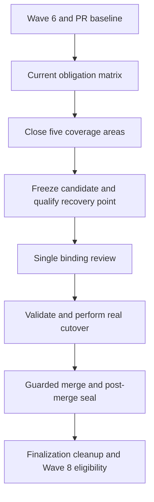
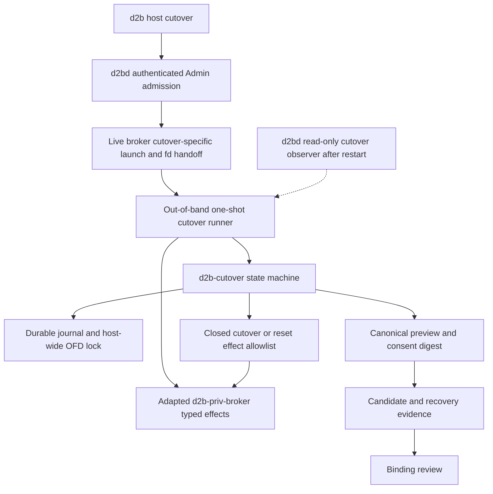
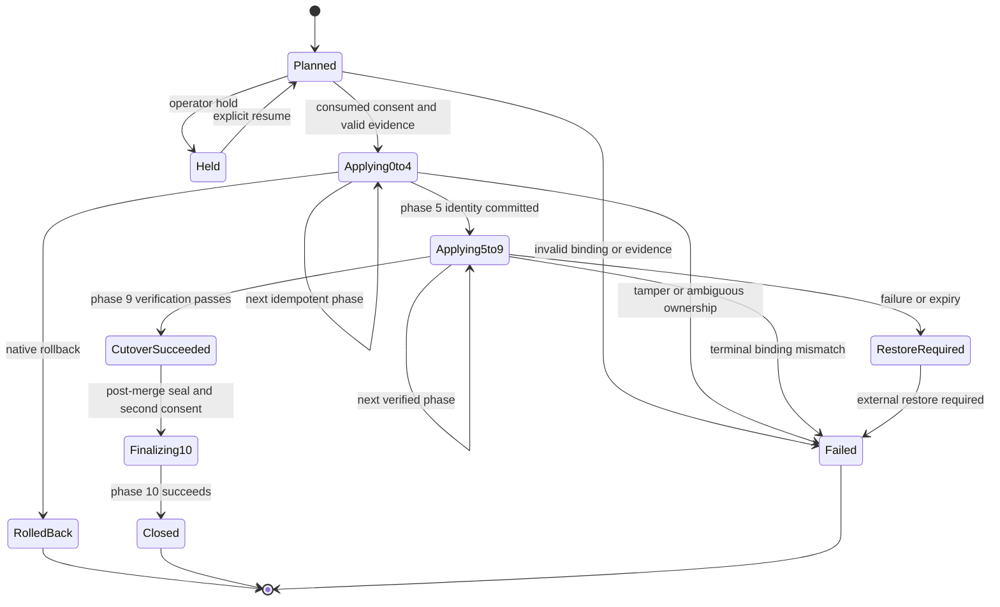
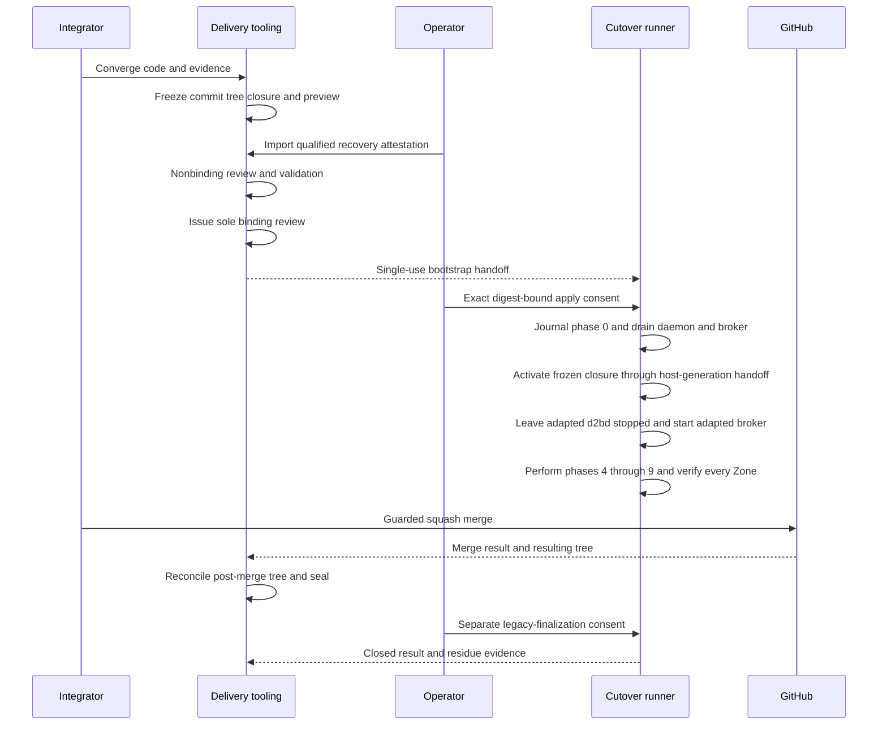
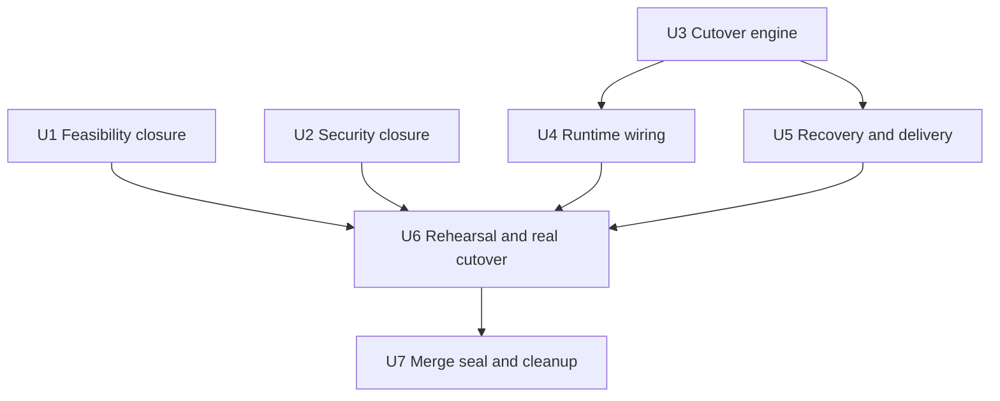

# SPEC-001 Wave 7 Completion - Plan

## Goal Capsule

- **Objective:** Complete the current, still-valid SPEC-001 Wave 7 obligations as one atomic cutover outcome, ending with the real daily-driver cutover, merge to `v3`, wave seal, cleanup, residue audit, and Wave 8 readiness.
- **Product authority:** Current committed code and the merged results of PRs #437-#440 are authoritative. The historical SPEC-001 Wave 7 artifacts provide coverage obligations where they do not conflict with passing code.
- **Open blockers:** Wave 6 must be sealed and merged before Wave 7 can close. PR #437 is merged; work blocked by PR #438, #439, or #440 waits for its owning PR to merge. The destructive cutover requires a qualified operator-owned recovery point.
- **Execution profile:** Deep, security-sensitive code work. Parallel work is limited to file-disjoint units after shared contracts stabilize.
- **Stop conditions:** Stop before mutation on incomplete inventory, invalid consent, stale recovery evidence, candidate drift, foreign ownership, or ambiguous repair ownership. After binding, any candidate or evidence mismatch terminally fails the wave.
- **Tail owner:** The Wave 7 integrator owns candidate freeze, binding review, the real cutover, guarded merge, post-merge reconciliation, seal, cleanup, and residue audit.
- **Product Contract preservation:** Changed with user confirmation: R26 and AE7 make the host-wide all-Zone boundary explicit. F4 now places binding approval before the real cutover to align with R25. PR #437 status was refreshed without changing scope.

---

## Product Contract

### Summary

Wave 7 will close current implementation and evidence gaps by extending existing production boundaries instead of recreating obsolete proof or task infrastructure.
The implementation adds a resumable cutover owner, qualified recovery evidence, and post-merge closure around the existing daemon, broker, Provider, and delivery systems.

### Problem Frame

The historical SPEC-001 Wave 7 plan describes 73 tasks across five groups, but it predates substantial implementation and four active SPEC-001 pull requests.
Executing that list verbatim would duplicate completed work while still risking gaps where a historical checkbox no longer matches the production surface.
Wave 7 also crosses the daily-driver rollback boundary, so completion cannot be inferred from code review or ordinary test success alone.

### Key Decisions

- **Current obligations replace a frozen task checklist.** (session-settled: user-directed - chosen over keeping all 73 historical rows binding exactly as written: current code must not be duplicated or overwritten.) Governs R1-R3.
- **Only PRs #437-#440 form the expected scope baseline.** (session-settled: user-directed - chosen over treating every open pull request as Wave 7 input: unrelated PRs must not expand the wave.) Governs R2-R4.
- **Production evidence may retire disposable feasibility proofs.** (session-settled: user-approved - chosen over requiring all historical spike crates: equal-or-stronger evidence on production paths is more durable.) Governs R5-R15.
- **Active PR blockers are waited out rather than bypassed.** (session-settled: user-directed - chosen over working around blocked dependencies: the owning PR must merge and unblock the Wave 7 unit.) Governs R3.
- **Wave 7 owns the complete delivery tail.** (session-settled: user-approved - chosen over stopping at implementation or merge readiness: success requires the real cutover, merge, seal, cleanup, residue audit, and Wave 8 readiness.) Governs R24-R25.
- **Cutover is host-wide.** (session-settled: user-approved - chosen over converting one Zone at a time: the one-time daily-driver transition must not leave a partially converted host.) Governs R26.

### Actors

- A1. The d2b operator owns the daily-driver host, explicit cutover consent, recovery point, and restore instructions.
- A2. The Wave 7 integrator derives the current obligation matrix, coordinates implementation, and prevents unsupported historical assumptions from entering the candidate.
- A3. Implementation agents close assigned obligations and provide production evidence without bypassing active PR ownership.
- A4. Review and delivery controls bind evidence, approvals, candidate identity, merge, seal, and close state.

### Requirements

**Scope and baseline**

- R1. Wave 7 must remain one atomic US3 completion boundary spanning the five coverage areas bound by `.wt-gc/specs/001-adr046-d2b3-completion/tasks.md`: feasibility, reset and cutover, security, streamline, and validation and delivery.
- R2. The active work set must be derived from current code plus the current heads and eventual merged results of PRs #437-#440, using the historical 73 rows as coverage evidence rather than immutable implementation tasks.
- R3. When PR #438, #439, or #440 blocks a dependent Wave 7 unit, that unit must wait for the PR to merge and become unblocked instead of adding a workaround or competing implementation.
- R4. A historical obligation may be marked already satisfied only when it traces to merged code and passing evidence that covers the obligation.

**Feasibility closure**

- R5. Wave 7 must preserve all ten feasibility outcomes bound by `.wt-gc/docs/specs/ADR-046-feasibility-and-spikes.md`, while allowing equal-or-stronger production evidence to replace a disposable proof artifact.
- R6. Process reconciliation evidence must cover bounded commit-to-launch-attempt latency and independence of unrelated dispatch.
- R7. Effect adapters must prove that blocking host primitives do not stall the asynchronous controller runtime.
- R8. Provider packaging must prove deterministic manifest loading, discovery, and dependency-boundary conformance.
- R9. Zone routing, sessions, transports, and Credential delivery must prove recipient isolation, opaque-stream conformance, and binding integrity.
- R10. Provider state and Volume behavior must prove creation ordering, placement, export ownership, access policy, quota, lifecycle-marker safety, and zero host-path leakage.
- R11. Process providers must share conformance evidence for correct launch identity, restart adoption, quarantine on identity drift, and clean exit without false adoption.
- R12. Nix-authored resources and generated schemas must prove reproducibility, drift detection, and cleanup of removed resources across generations.
- R13. CLI discovery must prove bounded Provider projection behavior and clean cutover must prove zero access to retired state.
- R14. End-to-end evidence must exercise the representative local, cloud, and interaction compositions against real production paths when those paths exist.
- R15. Candidate-bound runtime evidence must enforce aggregate test budgets and distinguish placement-policy violations from advisory per-test wall-clock diagnostics.

**Cutover and safety**

- R16. The operator must receive the non-mutating cutover preview bound by `.wt-gc/docs/specs/ADR-046-reset-and-cutover.md`, identifying every affected artifact and its intended disposition.
- R17. Destructive mutation must require explicit apply intent, exact content-bound consent, and an operator-controlled hold.
- R18. Cutover must preserve designated irreplaceable identity state, declare the rollback boundary before mutation, and support rollback until that boundary.
- R19. The real daily-driver cutover must use a qualified external full-host recovery point bound to the exact candidate, host, preview, operator, and restore instructions, with negative cases failing before mutation.

**Security and streamline closure**

- R20. The current equivalents of all still-valid obligations in `.wt-gc/docs/specs/ADR-046-security-and-threat-model.md` must close; partial redaction work in PRs #437-#439 cannot stand in for the complete security group.
- R21. Security closure must preserve d2b's capability, identity, redaction, quarantine, ownership, resource-boundary, and fail-closed invariants across the affected production surfaces.
- R22. The current equivalents of the obligations in `.wt-gc/docs/specs/ADR-046-streamline.md` must close or carry evidence that the production system already provides equal-or-stronger behavior.
- R23. Streamline work must reduce recurring specification, generation, test-placement, determinism, runtime, handoff, stale-base, and worktree friction without adding a parallel source of truth.

**Delivery and close**

- R24. The final candidate must satisfy `.wt-gc/docs/specs/ADR-046-validation-and-delivery.md` by binding its code, tree, preview, recovery attestation, test evidence, review request, and merge target so any relevant mismatch or expiry fails closed.
- R25. Wave 7 completes only after the approved candidate performs the real cutover, merges to `v3`, seals successfully, completes ordered cleanup and residue audit, and leaves Wave 8 eligible to begin.
- R26. The cutover preview and operation must cover every configured Zone on the daily-driver host and refuse a partial or internally inconsistent host inventory before mutation.

### Key Flow



- F1. Establish the Wave 7 baseline.
  - **Trigger:** Wave 6 is nearing completion and PRs #437-#440 have current reviewable heads.
  - **Actors:** A2, A3
  - **Steps:** Derive the obligation matrix from current code, map historical coverage, credit only traceable merged evidence, and identify blocked dependencies.
  - **Outcome:** Every obligation is classified as satisfied, active work, or superseded with evidence.
  - **Covers:** R1-R5.
- F2. Close implementation and evidence gaps.
  - **Trigger:** The obligation matrix is accepted for execution.
  - **Actors:** A2, A3
  - **Steps:** Complete the five coverage areas, wait on owning PRs where blocked, and replace disposable proofs only with equal-or-stronger production evidence.
  - **Outcome:** No still-valid Wave 7 obligation lacks implementation or evidence.
  - **Covers:** R3-R15, R20-R23.
- F3. Freeze and protect the cutover candidate.
  - **Trigger:** All implementation and evidence gaps are closed.
  - **Actors:** A1, A2, A4
  - **Steps:** Reconcile the candidate, bind the preview and evidence, qualify the external recovery point, and reject stale or mismatched inputs before mutation.
  - **Outcome:** One immutable candidate is eligible for the real cutover and binding review.
  - **Covers:** R16-R19, R24, R26.
- F4. Cut over and close Wave 7.
  - **Trigger:** The candidate and recovery point remain valid at every boundary.
  - **Actors:** A1, A2, A4
  - **Steps:** Complete the single binding review, perform the daily-driver cutover, validate the rollback boundary and resulting state, merge, seal, clean up, and audit residue.
  - **Outcome:** Wave 7 is closed and Wave 8 is eligible to begin.
  - **Covers:** R19, R24-R26.

### Acceptance Examples

- AE1. Blocked active PR dependency
  - **Covers R3.**
  - **Given:** A Wave 7 unit depends on behavior owned by PR #438 and that PR is not merged or remains blocked.
  - **When:** The unit becomes otherwise ready.
  - **Then:** The unit waits and resumes from the merged owner result; it does not introduce a competing fix.
- AE2. Production evidence replaces a spike
  - **Covers R4-R7.**
  - **Given:** A production Process integration test measures the historical launch-latency and dispatch-independence thresholds.
  - **When:** The obligation matrix evaluates the corresponding historical proof.
  - **Then:** The production test may satisfy the outcome if its evidence is equal or stronger and traceable; the disposable proof crate is not required.
- AE3. Merge status without traceability
  - **Covers R4.**
  - **Given:** A baseline PR is merged but no code and passing test evidence maps to a claimed Wave 7 obligation.
  - **When:** The integrator evaluates that obligation.
  - **Then:** The obligation remains open.
- AE4. Recovery evidence mismatch
  - **Covers R19, R24.**
  - **Given:** Recovery evidence names a different candidate, tree, preview, host, operator, or restore-instruction digest.
  - **When:** Any pre-cutover or delivery boundary validates it.
  - **Then:** The boundary refuses to proceed before destructive mutation.
- AE5. Candidate drift after binding
  - **Covers R24.**
  - **Given:** A binding review request exists for the final candidate.
  - **When:** Candidate content, history, evidence identity, or merge target changes.
  - **Then:** Delivery fails closed and no approval transfers to another candidate.
- AE6. Complete Wave 7 close
  - **Covers R25.**
  - **Given:** Every current obligation is closed and the qualified recovery evidence remains valid.
  - **When:** The real cutover, guarded merge, seal, cleanup, and residue audit succeed.
  - **Then:** Wave 7 is complete and Wave 8 may begin.
- AE7. Partial host inventory
  - **Covers R26.**
  - **Given:** The preview omits a configured Zone or contains inconsistent shared host state.
  - **When:** The operator requests consent or apply.
  - **Then:** Cutover refuses before mutation and identifies the inventory class that must be reconciled.

### Success Criteria

- Every still-valid historical Wave 7 obligation has a current disposition backed by code and evidence.
- All ten feasibility outcomes have equal-or-stronger proof, whether from retained spikes or production validation.
- The daily-driver cutover completes with qualified recovery protection and no unapproved mutation beyond the declared rollback boundary.
- The reviewed candidate is the candidate merged and sealed on `v3`.
- Cleanup and residue audit complete with no remaining Wave 7 work or slice ownership, and Wave 8 entry is unblocked.

### Scope Boundaries

- Wave 8 friction triage and implementation are outside this plan; only Wave 8 eligibility is in scope.
- PR #434 and PR #436 are not Wave 7 baseline inputs.
- Historical artifact shape is not a deliverable when current production evidence satisfies the same obligation.
- Workarounds that bypass ownership in PRs #437-#440 are outside scope.
- A merge-ready Wave 7 pull request without real cutover and delivery close is not completion.

### Dependencies and Assumptions

- Wave 6 reaches its required seal and merge state before Wave 7's binding close.
- PR #437 is part of the merged baseline.
- PRs #438-#440 merge before any dependent Wave 7 unit proceeds.
- Ordinary final-merge drift from PRs #438-#440 is fixed during execution unless it blocks on the still-active owning PR.
- The operator can create and verify an external full-host recovery point that covers the daily-driver host and exact preview inventory.
- Historical SPEC-001 documents remain useful coverage sources, but current passing code resolves conflicts.

### Sources

- `STRATEGY.md`
- `.wt-gc/specs/001-adr046-d2b3-completion/spec.md`
- `.wt-gc/specs/001-adr046-d2b3-completion/tasks.md`
- `.wt-gc/docs/specs/ADR-046-feasibility-and-spikes.md`
- `.wt-gc/docs/specs/ADR-046-reset-and-cutover.md`
- `.wt-gc/docs/specs/ADR-046-security-and-threat-model.md`
- `.wt-gc/docs/specs/ADR-046-streamline.md`
- `.wt-gc/docs/specs/ADR-046-validation-and-delivery.md`
- `packages/d2b-priv-broker/src/runtime.rs`
- GitHub PRs #437, #438, #439, and #440

---

## Planning Contract

### Key Technical Decisions

- KTD1. **Close obligations on production owners, not a replacement task graph.** Current code, native tests, and candidate evidence classify each historical obligation as satisfied, active, or superseded. No generated 73-row program database or implementation graph becomes a new authority. Governs R1-R5, R20-R23.
- KTD2. **Separate the pure cutover engine from its out-of-band one-shot owner.** (session-settled: user-approved - chosen over making `d2bd` own the full operation: daemon and broker drain must not abandon the cutover.) Before drain, authenticated Admin admission through `d2bd` asks the live broker to launch one operation-scoped runner through a narrow cutover-specific operation, not `SpawnRunner`. The broker transfers a single-use candidate, operator, operation, and effect capability by close-on-exec-controlled fd handoff. The runner consumes the capability at startup, closes the bootstrap fd, starts outside `d2b.slice` in a new session, and is not a persistent service or fourth declared unit. It owns the journal and lock; `d2bd` is read-only for this operation. Governs R16-R19, R26.
- KTD3. **Use a resumable finalizer saga, not a filesystem-wide transaction.** One operation ID, revision-bound plan, host-wide OFD lock, digest-bound journal, and one write-once terminal outcome define atomic reset and cutover. Replay revalidates the original request, markers, identities, and ownership before each effect. Identity-bearing creation never creates again on replay; ambiguity quarantines. Governs R18-R19, R21, R24, R26.
- KTD4. **Reuse strict canonical evidence primitives.** Parse evidence through the existing duplicate-rejecting canonical JSON path, enforce bounded integer time, hash domain-separated canonical bytes with the existing SHA-256 stack, and publish through the existing fd-relative sync-rename-parent-sync storage pattern. Evidence stores a locator digest only; delivery and cutover never dereference a recovery locator. No new dependency is required. Governs R17, R19, R24.
- KTD5. **Freeze and pin a prebuilt system closure before binding approval.** Candidate identity includes commit, tree, bundle generation, canonical preview digest, exact store path, closure digest, and a protected GC root. Apply rehashes and activates only that path; no evaluation, build, substitution, or content generation occurs after binding. Governs R16-R19, R24-R26.
- KTD6. **Make post-binding failure terminal.** Before binding, findings or expired evidence may return to convergence and produce a new provisional candidate. Binding and apply require enough remaining evidence lifetime for cutover, verification, guarded merge, and post-merge seal. After the sole binding request, nonunanimity, expiry, candidate drift, cutover failure, or merge mismatch writes one terminal failure and admits no replacement candidate. Governs R19, R24-R25.
- KTD7. **Retain the reviewed-head merge model and reconcile after merge.** (session-settled: user-approved - chosen over enabling a merge queue: repository policy accepts a narrow non-atomic base race.) Use pre-apply merge eligibility and the expected-head guard. Inspect ambiguous merge results and compare the resulting `v3` tree with the approved candidate. A mismatch leaves the host `CutoverSucceeded`, blocks finalization and Wave 8, and permits only the qualified external restore. Governs R24-R25.
- KTD8. **Keep evidence at the lowest sufficient test tier.** Production unit, integration, contract, policy, and drift tests replace historical proofs where equal or stronger. A booted VM proves host orchestration; the live-host lane alone crosses the real daily-driver boundary. Governs R4-R15, R19-R23.
- KTD9. **Separate irreversible legacy finalization from the initial cutover consent.** The operator gives a second digest-bound consent only after the real cutover, guarded merge, post-merge reconciliation, and seal succeed. Repository and worktree cleanup follows that finalization. Governs R17-R18, R25.
- KTD10. **Separate cutover and reset authority.** Cutover and scoped reset use distinct operation kinds, inventories, consents, and typed-effect allowlists. Reset cannot drain the host, activate a closure, or run legacy finalization; cutover consent cannot authorize reset. Every mutating transition requires durable journal and privileged audit publication before success. Governs R17-R21, R26.
- KTD11. **Qualify recovery through quiescence and restore proof.** The external recovery point is captured after a proven Guest/control-plane quiesce or by a crash-consistent provider. VM rehearsal must execute the same recovery mechanism and failure class after a phase-5-or-later failure; daily-driver-specific restore instructions are verified separately and bound by digest. The local cutover checkpoint is evidence, not the R19 recovery point. Governs R18-R19, R24.

### High-Level Technical Design

#### Ownership and effect boundaries



The CLI reads status and sets a safety hold through the runner's owner-only Unix socket while the daemon is drained.
The runner applies existing lifecycle `SO_PEERCRED` admission and keeps the journal root-owned at mode 0600.
The runner is the single writer and survives client, daemon, and broker transitions.
The candidate broker restarts before phase 4 and admits only the closed operation-scoped effect surface.
The engine never mutates host state directly; it issues typed requests through the broker boundary.

#### Cutover and reset lifecycle



The journal records `started` before mutation and the last completed phase after durable effect and audit publication.
Restart skips completed work, reopens a journaled identity instead of recreating it, and quarantines tamper, mismatch, partial destination, or ambiguous ownership.
Native rollback ends before phase 5; later failure requires the qualified external recovery point.

#### Candidate, cutover, and delivery sequence



### Output Structure

```text
packages/
  d2b-cutover/
    Cargo.toml
    src/
      lib.rs
      model.rs
      inventory.rs
      preview.rs
      consent.rs
      state_machine.rs
      journal.rs
      hold.rs
      rollback.rs
      reset.rs
      verify.rs
      finalize.rs
      bin/d2b-cutover-runner.rs
    tests/
      state_machine.rs
      crash_recovery.rs
      reset_scope.rs
  d2bd/src/cutover.rs
  d2b/src/host_cutover.rs
  xtask/src/delivery/recovery.rs
tests/
  host-integration/cutover-rehearsal.nix
  integration/live/cutover-real-host.sh
```

The tree shows the intended ownership split.
Implementation may combine narrowly related modules, but it must preserve the pure engine, one-shot runner, daemon/CLI adapters, delivery validator, and two test tiers.

### Sequencing and Parallelism



- U1 and the existing-boundary portion of U2 may proceed in parallel only on file-disjoint scopes.
- The integrator serializes `packages/d2b-bus/src/zone_route.rs` and `packages/d2b-session/tests/` across U1 and U2.
- U2's cutover, reset, journal, consent, and finalization matrix closes only after U4 exposes those contracts.
- U3 establishes the stable cutover model and preview digest before U4 and U5 proceed.
- U4 and U5 may proceed in parallel after U3, but the integrator serializes edits to workspace manifests, shared contracts, delivery models, and generated artifacts.
- U6 starts only after Wave 6 and PRs #438-#440 merge, U1-U5 converge, and all required evidence is current.
- U7 is serial and owns the immutable tail.

### Implementation Constraints

- Reuse existing storage, marker, migration, audit, and generated-contract patterns before adding a new privileged operation.
- Add a typed broker operation only when no existing operation can express a required host mutation without weakening ownership or path resolution.
- Establish the one-shot runner through a narrow typed broker launch and fd handoff while the live control plane is still available; do not use `SpawnRunner`, add a uid-0 `SpawnRunner` carve-out, declare a fourth persistent root-visible service, or add any per-VM systemd unit.
- Keep one repair owner for the cutover journal, lock, and mutable host paths.
- Keep `d2bd` read-only for the cutover operation; it must not adopt or repair the journal, lock, or in-flight adopted paths.
- Keep drain-window status and hold behind the runner's authenticated owner-only socket; never expose the journal as a CLI-readable file.
- Use anchored fd-relative paths, `O_CLOEXEC` OFD locks, explicit fd transfer, write-once terminal records, and directory durability.
- Bind each journal record to operation ID, revision-bound plan, previous record, and request digest; tamper or mismatch quarantines.
- Preserve foreign host configuration byte for byte and fail closed on foreign ownership markers.
- Classify unrecognized artifacts as Preserve. Preserve TPM state and markers, durable Volumes, SSH keys, store-view gcroots, audit chains, and host-runtime metadata.
- Stage or hardlink adopted identity-bearing data and retain the source through phase 10; phase 4 must not move or unlink it.
- Journal store and Zone identities before phase 5 mutation and reopen only those identities on replay.
- Treat all configured Zones as one host-scoped inventory for the one-time cutover.
- Reject per-Zone selection on one-time cutover preview, apply, verify, and finalize; per-target reset remains a distinct post-cutover operation.
- Require all Guests quiesced without forced termination, no conflicting open descriptors, and computed copy/hardlink headroom before adoption.
- Keep strict timestamp ordering and expiry with one sampled verifier time and no clock-skew allowance.
- Bind consent to operation, candidate, preview, recovery, and operator digests. Consume it on first apply; a new operation after rollback requires new consent.
- Allow any Admin to set a safety hold. Clear, resume, apply, and finalize require the bound operator or a fresh digest-bound consent. Never widen `HostShutdown`.
- Require enough attestation lifetime for apply, verify, merge, and post-merge seal before binding and again before apply.
- Preserve the normal squash merge and expected-head guard; do not enable auto-merge, admin merge, merge queue, or branch-setting changes.
- Protect the frozen closure and adopted store-view with explicit GC roots before binding and through cleanup.
- Advance a mutating transition only after both the cutover journal and privileged audit record are durable.
- Commit each code unit before authoritative Nix evaluation.
- Give each slice a unique changelog fragment under `changelog.d/`; reconcile fragments only after slices converge.

### Current Obligation Disposition

| Area | Production evidence already accepted | Active implementation gaps |
| --- | --- | --- |
| Feasibility | Process reaction, Provider packaging, Provider state/Volume, Process conformance, and Nix/schema cleanup | Async EffectPort threshold, final routing/Credential evidence, zero legacy-state access, cloud composition disposition, and runtime-ledger placement policy |
| Reset and cutover | Provider migration, Zone store/bootstrap, ZoneLink activation, doctor, and support primitives | Host inventory, exact consent, journal, hold, rollback boundary, reset scopes, verification, finalization, and real-host operation |
| Security | Telemetry redaction, no-isolation propagation, audit failure, DoS ceilings, and support-bundle controls | Consolidated boundary matrices, remaining Credential closure, interaction secrecy parity, atomic reset, threat-matrix coverage, manual closure evidence, and exact ownership attacks |
| Streamline | Production schema generation, state graph tests, Provider catalog parity, fakes, Layer-1 scheduling, disk hygiene, runtime ledger, and retirement ledger | Only current policy gaps for vocabulary, EffectPort boundaries, terminology, test placement, and deterministic time |
| Delivery | Heavy gate, candidate snapshot, digest-only evidence, runtime ledger, and pre-merge seal/eligibility | Qualified recovery evidence, immutable binding request, terminal mismatch/expiry state, cutover result, post-merge reconciliation, post-merge seal, and close record |

Historical streamline tasks that regenerate the obsolete ADR task database, handoff format, or implementation graph are superseded.
They must not be recreated as parallel authority.

### System-Wide Impact

- **Control plane:** Adds a host-wide one-shot operation while preserving daemon-only persistent services and typed broker effects.
- **Storage and restart:** Introduces a durable operation journal and lock that must follow ADR 0034 and survive daemon, client, and runner restart ambiguity.
- **Security:** Extends redaction, capability, ownership, quarantine, and fail-closed evidence across cutover and delivery.
- **Nix contract:** Binds generated bundle data and an immutable system closure into candidate identity; schema, emitters, docs, and drift evidence move together.
- **Delivery:** Extends the candidate lifecycle beyond pre-merge eligibility through real cutover, guarded merge, post-merge seal, finalization, and close.
- **Operations:** Requires a verified external full-host recovery point and a manual live-host lane before irreversible finalization.
- **Contributors:** Shared manifests and generated outputs require serial integration even when source units are otherwise file-disjoint.

### Operational Go/No-Go Contract

#### Before binding

- Wave 6 is sealed and merged, PRs #438-#440 are merged, and U1-U5 are complete.
- The committed candidate passes the required gates, VM rehearsal, CI, and current nonbinding review.
- The prebuilt closure is pinned, rehashed, and bound to the candidate with the canonical all-Zone preview.
- The external recovery point is captured from a proven quiescent or crash-consistent state. Its recovery mechanism passed the VM restore drill, and its daily-driver restore instructions were verified separately.
- The recovery attestation has enough remaining lifetime for apply, verification, guarded merge, and post-merge seal per KTD6.
- Current merge eligibility binds the reviewed head, observed base, required checks, and merge target.

Any failed item prevents the sole binding request.

#### Before apply

- Revalidate the same candidate, closure, preview, attestation bytes, operator, and merge eligibility.
- Confirm the operation is `Planned`, the safety hold is clear, the host-wide lock is available, and no foreign ownership exists.
- Confirm all Guests are quiesced without forced termination, no conflicting descriptor remains, and copy/hardlink headroom is sufficient.
- Consume the operation-bound consent once.

Any failed item prevents the first mutating phase.

#### Cutover success boundary

- `apply` completes phases 0-9 and publishes one candidate-bound cutover result.
- `verify` passes every configured Zone and all required identity, store, Provider, Guest, and audit checks.
- `doctor` reports no cutover, adoption, ownership, or recovery quarantine.
- The host remains `CutoverSucceeded`; phase 10 finalization has not run.

#### Merge and finalization boundary

- Refresh only identity and readiness facts; a changed head, target, evidence identity, or mergeability terminally fails the wave.
- Merge with the expected-head guard, inspect any ambiguous result, and require the resulting `v3` tree to match the approved candidate.
- Publish the post-merge seal, re-run status, verify, and doctor, then obtain the separate finalization consent.
- Finalize only from `CutoverSucceeded` with a valid post-merge seal and clean health checks.
- Cleanup uses an explicit keep-set and Wave 8 remains blocked until residue is empty.

#### Failure routing

| Last durable state | Allowed recovery | Forbidden continuation |
| --- | --- | --- |
| Phase 0-4 applying | Native rollback to preserved sources, then stop | Phase 5 continuation without a new valid operation |
| Phase 5-9 applying or `RestoreRequired` | Qualified external restore only | Native rollback, resume, finalization, or replacement candidate |
| `CutoverSucceeded` plus delivery terminal failure | Qualified external restore only | Native rollback, finalization, Wave 8, or replacement candidate |
| `Closed` | Forensic inspection and supported forward repair only | Live rollback or restoration of destroyed legacy artifacts |

### Risks and Mitigations

| Risk | Mitigation |
| --- | --- |
| Daily-driver data loss or unbootable host | Require immutable preview, qualified external recovery evidence, VM rehearsal, strict rollback boundary, real-host negative matrix, and separate irreversible-finalization consent. |
| Runner or daemon interruption leaves ambiguous state | Journal every transition durably, use one OFD lock and operation ID, replay idempotently, and quarantine ambiguity. |
| Drain leaves no trusted privileged-effect path | Establish the out-of-band runner before drain, restart only the adapted broker for phase 4+, and keep a closed operation-scoped effect allowlist. |
| Journal or consent is replayed or altered | Chain journal records to the operation and request, consume consent once, revalidate identity and expiry on resume, and quarantine tamper. |
| Reset authority reaches cutover-only mutation | Use distinct operation kinds, inventories, consents, and effect allowlists; test both directions of capability refusal. |
| Recovery locator or operator identity leaks | Store only domain-separated digests and keep locator resolution and restore instructions out of delivery, CLI, diagnostics, and audit. |
| PR #438, #439, or #440 changes an owned surface | Wait for the owner merge when blocked, then reconcile the unit against merged code before editing. |
| Evidence expires during convergence or mutation | Refresh before binding; after binding, record terminal failure rather than replacing evidence. |
| Merge result differs from the approved candidate | Use expected-head merge, inspect ambiguous results, reconcile the resulting `v3` tree, and fail closed on mismatch. |
| Host is converted but delivery terminally fails | Refuse finalization and Wave 8, preserve all legacy sources, and expose only the qualified external restore path. |
| Phase 4 adoption destroys rollback material | Copy or hardlink into marked destinations, verify digests, and retain every source until phase 10. |
| Phase 5 replay creates a second store identity | Journal identities before mutation and quarantine partial, duplicate, or mismatched destinations. |
| New policy checks recreate historical gate sprawl | Put invariants in native Layer-1 Rust, contract, policy, or drift owners; do not add top-level shell gates. |
| Real cloud or hardware evidence is unavailable | Use production controllers with fake EffectPorts for mandatory Layer-1 composition; record unavailable real-cloud or hardware evidence as explicit manual closure evidence rather than weakening tests. |
| Generated files or lockfiles conflict across slices | Assign serial integrator ownership and regenerate only after source changes converge. |
| Cleanup collects live or forensic state | Build an explicit keep-set for the activated closure, store-view gcroots, cutover journal, recovery material, and audit segments; refuse Wave 8 while residue is unsafe or incomplete. |

### Alternative Approaches Considered

- **Recreate every historical proof and task artifact:** Rejected because current production evidence already covers many outcomes and obsolete graphs would become parallel authority.
- **Run cutover inside `d2bd`:** Rejected because the historical drain crosses daemon and broker lifecycle boundaries.
- **Declare a persistent cutover service:** Rejected because d2b permits exactly three persistent root-visible units and cutover is a one-time operation.
- **Treat reset as one filesystem transaction:** Rejected because host mutation spans multiple independently durable owners; a resumable saga gives crash-visible atomicity without pretending the filesystem is transactional.
- **Adopt a merge queue for base-atomic binding:** Rejected because repository policy forbids it and accepts the narrow base race with post-merge reconciliation.

---

## Implementation Units

### U1. Close permanent feasibility gaps

- **Goal:** Replace the remaining disposable feasibility obligations with equal-or-stronger production evidence and record superseded outcomes.
- **Requirements:** R1-R15; F1-F2; AE2-AE3.
- **Dependencies:** PR #438 and #439 for Credential-owned changes; PR #440 for overlapping Make or Nix test-infrastructure changes.
- **Files:**
  - `packages/d2b-provider-supervisor/tests/production_adapter.rs`
  - `packages/d2b-bus/src/zone_route.rs`
  - `packages/d2b-session/tests/`
  - `packages/d2b/src/provider.rs`
  - `packages/d2b/src/complete.rs`
  - `packages/d2b/src/legacy.rs`
  - `packages/d2b-provider-credential-entra/tests/`
  - `packages/d2b-provider-credential-managed-identity/tests/`
  - `packages/d2b-provider-credential-secret-service/tests/`
  - `tests/host-integration/resource-operator-activation.nix`
  - `packages/xtask/src/test_runtime_ledger.rs`
  - `tests/runtime-ledger-census.json`
  - `changelog.d/`
- **Approach:**
  1. Preserve accepted production evidence for process reaction, Provider packaging, state/Volume, Process conformance, and Nix/schema cleanup.
  2. Tighten async adapter evidence to the historical outcome without adding a separate proof crate.
  3. Complete routing, session, transport, and Credential evidence after the owning PRs merge.
  4. Prove normal runtime paths stop reading retired state after the cutover boundary while the cutover finalizer retains its narrow legacy access.
  5. Cover cloud composition with production controllers and fake cloud EffectPorts; keep real cloud execution as manual evidence.
  6. Keep per-test wall time advisory and enforce exact census, placement policy, and aggregate process-CPU budgets.
- **Execution note:** Start with the missing production test for each active outcome; delete or avoid a disposable proof once the production path meets the same threshold.
- **Patterns to follow:** `packages/d2b-controller-toolkit/benches/reaction.rs`, `packages/d2b-provider-toolkit/tests/conformance.rs`, `packages/d2b-provider-volume-local/tests/layout_conformance.rs`, `packages/d2b-provider-system-minijail/tests/conformance.rs`, and `packages/xtask/src/test_runtime_ledger.rs`.
- **Test scenarios:**
  - A slow blocking backend leaves the async runtime heartbeat within the required bound.
  - Exact Zone routing rejects disconnected, wrong-recipient, and attachment-bearing messages without leaking authority.
  - Covers AE2. Existing production evidence meets or exceeds a historical outcome and no duplicate proof artifact is required.
  - Covers AE3. A merged PR without mapped passing evidence leaves the obligation open.
  - Normal CLI and runtime operations do not read legacy state after the boundary; the bound cutover finalizer still can.
  - Local, cloud-fake, and interaction compositions use production controllers and preserve isolation.
  - Runtime-ledger census drift, placement-policy violation, or aggregate CPU overrun fails; an ordinary per-test wall-time diagnostic does not.
- **Verification:** All ten feasibility outcomes have traceable production evidence or an active implementation owned by this plan.

### U2. Close security and streamline policy gaps

- **Goal:** Complete the remaining Wave 7 threat-model and current streamline-policy obligations on production boundaries.
- **Requirements:** R20-R23; F2.
- **Dependencies:** PR #438 and #439 before Credential implementation or final zero-secret assertions; U4 before closing cutover/reset threat-matrix rows.
- **Files:**
  - `packages/d2b-contract-tests/tests/policy_telemetry_redaction.rs`
  - `packages/d2b-contract-tests/tests/policy_provider_crates.rs`
  - `packages/d2b-contract-tests/tests/policy_effectport_boundary.rs`
  - `packages/d2b-contract-tests/tests/policy_spec_vocabulary.rs`
  - `packages/d2b-contract-tests/tests/policy_test_placement.rs`
  - `packages/d2b-contract-tests/tests/policy_test_determinism.rs`
  - `packages/d2b-contract-tests/tests/security_matrix_coverage.rs`
  - `packages/d2b-session/tests/`
  - `packages/d2b-bus/src/zone_route.rs`
  - `packages/d2b-provider-system-minijail/tests/conformance.rs`
  - `packages/d2b-provider-volume-local/tests/marker_fail_closed.rs`
  - `packages/d2b-provider-clipboard-wayland/tests/redaction.rs`
  - `packages/d2b-provider-shell-terminal/tests/`
  - `packages/d2b-provider-notification-desktop/tests/redaction.rs`
  - `packages/d2b-provider-device-security-key/tests/redaction.rs`
  - `packages/d2b-audit/src/sink.rs`
  - `packages/d2b/src/zone_support_bundle.rs`
  - `docs/reference/security-manual-validation-checklist.md`
  - `changelog.d/`
- **Approach:**
  1. Extend existing policy owners for direct EffectPort, Provider dependency, vocabulary, terminology, test placement, deterministic time, and threat-matrix coverage.
  2. Add missing native attack vectors to session, routing, launch, marker, redaction, quarantine, and ownership tests.
  3. Keep Credential changes on the merged owner implementations.
  4. Add cutover and reset rows only after U4 defines runner peer class, consent, journal, hold/resume, rollback, finalization, and effect boundaries.
  5. Use a manual checklist only for cloud or hardware behavior that cannot be proven in Layer 1.
- **Execution note:** Add Layer-1 characterization before changing any existing security boundary.
- **Patterns to follow:** Defining-crate compiler seals, crate-local conformance tests, `policy_provider_crates.rs`, `marker_fail_closed.rs`, and audit sink failure tests.
- **Test scenarios:**
  - Duplicate, replayed, wrong-Zone, wrong-subject, and attachment-bearing inputs fail before capability mint.
  - Direct broker, raw socket, filesystem, device, or systemd access from a Provider fails policy unless routed through its typed EffectPort.
  - Credential configuration, placement, leases, diagnostics, audit, and support bundles contain no secret or raw identity material.
  - Canary bytes from clipboard, terminal, CTAP, and notification payloads never enter audit, telemetry, Debug, CLI errors, or support output.
  - Ambiguous runner identity quarantines without signaling an unrelated or recycled process.
  - Marker replacement, symlink, foreign owner, and missing previously provisioned state fail closed.
  - Audit sink publication failure prevents a privileged effect from returning success.
  - Cutover and reset cannot exchange consent, operation identity, or typed-effect authority.
  - A journal or consent replay, mismatched operator, raw locator, or post-binding replacement fails before mutation.
  - Hardware and cloud checklist entries name exact required evidence and cannot be checked by declaration alone.
- **Verification:** Every current security and streamline-policy obligation maps to native evidence or a justified manual boundary, with no new shell gate or parallel source of truth.

### U3. Add the cutover contract and resumable state machine

- **Goal:** Implement a pure, testable host-cutover and reset engine with durable lifecycle semantics and no direct host mutation.
- **Requirements:** R16-R19, R21, R26; F3; AE4, AE7.
- **Dependencies:** U1 and U2 may run concurrently; stable current bundle and Provider contracts are required before final model freeze.
- **Files:**
  - `packages/Cargo.toml`
  - `packages/Cargo.lock`
  - `packages/d2b-cutover/Cargo.toml`
  - `packages/d2b-cutover/src/lib.rs`
  - `packages/d2b-cutover/src/model.rs`
  - `packages/d2b-cutover/src/inventory.rs`
  - `packages/d2b-cutover/src/preview.rs`
  - `packages/d2b-cutover/src/consent.rs`
  - `packages/d2b-cutover/src/state_machine.rs`
  - `packages/d2b-cutover/src/journal.rs`
  - `packages/d2b-cutover/src/hold.rs`
  - `packages/d2b-cutover/src/rollback.rs`
  - `packages/d2b-cutover/src/reset.rs`
  - `packages/d2b-cutover/src/verify.rs`
  - `packages/d2b-cutover/src/finalize.rs`
  - `packages/d2b-cutover/tests/state_machine.rs`
  - `packages/d2b-cutover/tests/crash_recovery.rs`
  - `packages/d2b-cutover/tests/reset_scope.rs`
  - `changelog.d/`
- **Approach:**
  1. Define closed phases, operation identity, inventory, dispositions, consent, holds, rollback boundary, reset scopes, and terminal outcomes.
  2. Build canonical preview bytes from every configured Zone and shared host artifact.
  3. Reuse canonical JSON, SHA-256, fd-relative storage, and OFD-lock patterns without adding a dependency.
  4. Model each host mutation as an effect request with an explicit replay class: repeatable, reopen-by-journaled-identity, or quarantine-only.
  5. Chain journal records to the operation and request, write `started` before mutation, and publish completion only after effect and audit durability.
  6. Preserve all unclassified and identity-bearing source artifacts through phase 10; phase 4 stages verified destinations without destructive move.
  7. Separate cutover and reset operation kinds, inventories, consents, and effect allowlists.
  8. Make phase 5 the native rollback boundary and phase 10 separately consented.
- **Execution note:** Implement transition, malformed-input, and crash-boundary tests before runtime wiring.
- **Patterns to follow:** `packages/xtask/src/delivery/storage.rs`, `packages/d2b-contracts/src/v3/resource_schema.rs`, ADR 0034, and Provider migration journals.
- **Test scenarios:**
  - Covers AE7. Missing or inconsistent Zone inventory refuses preview finalization.
  - Canonically equivalent inventories produce identical preview and consent digests.
  - Unknown, duplicate, trailing, fractional, negative, and out-of-range evidence values fail decoding.
  - Concurrent operations contend on one host-wide lock and the second operation refuses without mutation.
  - Restart after every transition resumes after the last durable success.
  - Bit flip, truncation, appended or reordered record, and request mismatch quarantine without replay.
  - Restart during a repeatable effect reruns it; identity-bearing replay reopens the journaled identity; ambiguous or partial destination quarantines.
  - Existing wrong store UUID, duplicate store, invalid marker, replaced destination, or foreign owner never creates a second identity.
  - Hold stops after the current atomic step and resume continues the same operation.
  - Replayed consent on a new operation fails; same-operation resume revalidates expiry, candidate, inventory, markers, and ownership.
  - Native rollback succeeds through phase 4 and refuses at phase 5 or later.
  - Phase 4 rollback leaves source TPM, durable Volume, store-view, and key bytes unchanged and quarantines staged destinations.
  - Full-Zone, Provider, and Guest reset preserve durable Volumes unless separately consented.
  - Scoped reset cannot invoke drain, closure activation, cutover finalization, or cutover-only broker effects.
  - Terminal success or failure publishes exactly once and cannot be replaced.
- **Verification:** The pure engine proves every state transition, crash boundary, reset scope, and rollback boundary without touching the host.

### U4. Wire CLI, daemon, runner, and typed broker effects

- **Goal:** Expose authenticated cutover operations and execute the state machine through one resumable runner and existing privileged boundaries.
- **Requirements:** R16-R19, R21, R26; F3-F4; AE1, AE4, AE7.
- **Dependencies:** U3; merged PR #440 before overlapping Make or Nix infrastructure edits.
- **Files:**
  - `packages/d2b-cutover/src/bin/d2b-cutover-runner.rs`
  - `packages/d2bd/src/cutover.rs`
  - `packages/d2bd/src/resource_runtime.rs`
  - `packages/d2bd/src/provider_effects.rs`
  - `packages/d2bd/src/lib.rs`
  - `packages/d2b/src/host_cutover.rs`
  - `packages/d2b/src/host.rs`
  - `packages/d2b/src/dispatch.rs`
  - `packages/d2b-contracts/src/broker_wire.rs`
  - `packages/d2b-contracts/src/public_wire.rs`
  - `packages/d2b-host/src/bin/d2b-activation-helper.rs`
  - `packages/d2b-priv-broker/src/runtime.rs`
  - `nixos-modules/processes-json.nix`
  - `nixos-modules/privileges-json.nix`
  - `packages/d2bd/tests/cutover.rs`
  - `packages/d2b/tests/host_cutover.rs`
  - `packages/d2b-contract-tests/tests/policy_units.rs`
  - `packages/d2b-contract-tests/tests/policy_docs.rs`
  - `docs/reference/cli-contract.md`
  - `docs/reference/daemon-api.md`
  - `docs/reference/privileges.md`
  - `docs/reference/error-codes.md`
  - `changelog.d/`
- **Approach:**
  1. Add preview, status, hold, resume, apply, rollback, verify, and reset command routes.
  2. Add a narrow broker launch operation that execs the runner into a new session outside `d2b.slice` and transfers a single-use capability fd before drain.
  3. After apply consent, journal the phase, drain the existing daemon and broker, activate the frozen closure through `ApplyHostGenerationHandoff`, leave adapted `d2bd` stopped, then start the adapted broker with a closed cutover allowlist.
  4. Keep hold and status available through the runner's authenticated owner-only Unix socket while `d2bd` is down; when running, `d2bd` observes only.
  5. Require the bound Admin principal for apply, resume, and finalize; allow any Admin to set a safety hold; never admit Launcher or `HostShutdown`.
  6. Prefer existing typed host mutations; add only narrowly required typed operations with audit and bundle resolution.
  7. Reject one-time cutover `--zone` selection while retaining scoped post-cutover reset.
  8. Add `doctor` and `finalize` to the operator surface and keep preview as the sole mutation-free planning command.
  9. Update generated contracts and docs together when a wire or bundle surface changes.
- **Execution note:** Start with real-binary and daemon integration tests against temporary sockets and fixture bundles before adding live effects.
- **Patterns to follow:** Existing `SpawnRunner`, `OpenPidfd`, resource runtime, public wire dispatch, host command apply/dry-run, and generated privilege schema patterns.
- **Test scenarios:**
  - Covers AE1. A command blocked by an active owning PR does not gain a duplicate implementation path.
  - Unauthorized peers cannot preview sensitive inventory, consent, apply, hold, resume, rollback, verify, or reset.
  - Preview performs no host mutation and exposes no raw secret, host identifier, uid, path, or recovery locator.
  - Apply refuses an unrecognized preview digest, stale candidate, incomplete inventory, active hold, or invalid recovery evidence.
  - Launcher, another Admin, the uid-0 shutdown hook, and a mismatched operator digest fail before apply, resume, rollback, finalize, or destructive reset.
  - Any Admin can set hold; only the bound principal or fresh digest-bound consent clears it and resumes.
  - CLI disconnect leaves the runner active and authenticated socket status reports the same operation while the daemon is drained.
  - An unauthorized peer cannot set hold or read journal-derived status while `d2bd` is drained.
  - Reusing, retaining, or replaying the bootstrap capability after runner startup fails.
  - Daemon restart reattaches read-only observation without taking repair ownership.
  - Broker stop cannot permit phase 4 mutation; the adapted successor broker must be proven and its request reload refuses stale or foreign ownership.
  - Journal or audit publication failure leaves the last durable phase unchanged.
  - One-time cutover preview, apply, verify, and finalize reject `--zone`.
  - Exactly three persistent root-visible units remain declared.
- **Verification:** The authenticated operator surface drives the pure engine through typed effects, survives control-plane reconnects, and introduces no persistent service.

### U5. Add qualified recovery evidence and durable delivery closure

- **Goal:** Extend delivery from generic pre-merge evidence into strict recovery qualification, immutable binding, terminal failure, cutover result, post-merge seal, and close.
- **Requirements:** R19, R24-R25; F3-F4; AE4-AE6.
- **Dependencies:** U3 preview and candidate identity; U4 may proceed in parallel after those contracts freeze.
- **Files:**
  - `packages/xtask/src/delivery/recovery.rs`
  - `packages/xtask/src/delivery/model.rs`
  - `packages/xtask/src/delivery/evidence.rs`
  - `packages/xtask/src/delivery/storage.rs`
  - `packages/xtask/src/delivery/command.rs`
  - `packages/xtask/src/delivery/seal.rs`
  - `packages/xtask/src/delivery/eligibility.rs`
  - `packages/xtask/src/delivery/history_proof.rs`
  - `packages/xtask/src/main.rs`
  - `docs/reference/wave-evidence-schema.md`
  - `docs/reference/schemas/delivery/recovery-point-attestation-v1.schema.json`
  - `changelog.d/`
- **Approach:**
  1. Add a strict recovery-attestation validator over canonical bytes with bounded integer timestamps and one sampled verifier clock.
  2. Bind candidate, commit, tree, pinned closure, bundle generation, preview, host digest, operator digest, restore-instruction digest, qualification, locator digest, and expiry.
  3. Add write-once publication for binding request, terminal failure, cutover result, merge attempt, post-merge reconciliation, seal, finalization, and close.
  4. Preserve raw recovery payload, host identity, operator identity, paths, and restore instructions outside delivery evidence.
  5. Keep prebinding return-to-convergence distinct from post-binding terminal failure.
  6. Reuse the same validator at every later boundary; do not duplicate predicates in shell or stage-local code.
- **Execution note:** Build one canonical valid record, then vary one field or boundary per negative test.
- **Patterns to follow:** Existing candidate snapshot, digest-only evidence, storage durability, seal, and eligibility modules.
- **Test scenarios:**
  - A canonical valid external backup or snapshot attestation passes with a locator digest; no delivery or cutover API resolves the locator.
  - Missing, extra, duplicate, malformed, wrong-type, fractional, negative, future, out-of-range, and overflow values fail.
  - Timestamp ordering, 86,400-second checked deadlines, retention, and strict expiry fail independently.
  - Covers AE4. Wrong candidate, commit, tree, closure, preview, host, operator, restore instructions, or canonical bytes fail.
  - Raw recovery data and identifiers never enter Debug, errors, audit, logs, or candidate artifacts.
  - Raw URL, path, host, uid, operator name, or recovery locator fails attestation and output redaction checks.
  - Each boundary samples verifier time once and requires enough remaining lifetime for all pre-finalization steps.
  - Missing GC root, missing frozen closure, changed store path, or closure digest mismatch refuses before activation.
  - Before binding, expiry allows a new provisional candidate and new evidence.
  - Covers AE5. After binding, nonunanimity, expiry, content drift, history drift, target drift, or evidence drift publishes one terminal failure.
  - Crash before and after file sync, no-replace publication, directory sync, and terminal publication resumes to one immutable outcome.
  - Post-merge seal requires the observed merge result and resulting `v3` tree to match the approved candidate.
- **Verification:** One validator and one durable state machine enforce recovery and candidate identity at every delivery boundary.

### U6. Rehearse and perform the candidate-bound cutover

- **Goal:** Prove the complete host flow in a booted VM, then perform the qualified real daily-driver cutover on the frozen candidate.
- **Requirements:** R16-R19, R24, R26; F3-F4; AE4, AE7.
- **Dependencies:**
  - U1-U5 complete.
  - Wave 6 sealed and merged.
  - PRs #438-#440 merged.
- **Files:**
  - `tests/host-integration/cutover-rehearsal.nix`
  - `tests/integration/live/cutover-real-host.sh`
  - `tests/unit/nix/cases/test-infrastructure.nix`
  - `Makefile`
  - `docs/how-to/cut-over-to-d2b-v3.md`
  - `docs/reference/security-manual-validation-checklist.md`
  - `changelog.d/`
- **Approach:**
  1. Rehearse inventory, consent, hold, restart, rollback, external restore, all-Zone activation, and finalization in a booted VM.
  2. Self-guard the live entrypoint through the repository heavy-lane semaphore.
  3. Complete the VM rehearsal, then freeze the clean candidate and pin its prebuilt closure.
  4. Capture and qualify recovery evidence with sufficient remaining lifetime.
  5. Complete nonbinding review and current gates, then issue the sole binding approval.
  6. Prove every Guest is quiesced without forced termination, no conflicting descriptor remains, and computed headroom covers the chosen stage/copy strategy.
  7. Revalidate pre-apply merge eligibility and enough remaining attestation lifetime for apply, verify, merge, and post-merge seal.
  8. Execute the real cutover with the same validator and candidate identities used by delivery.
  9. Verify all configured Zones, identity digests, audit continuity, adoption health, and zero quarantine before declaring `CutoverSucceeded`.
  10. Stop before irreversible legacy finalization; U7 owns merge, post-merge seal, and second consent.
- **Execution note:** VM rehearsal must pass before the external recovery point is captured and before the live-host lane can run.
- **Patterns to follow:** Existing host-integration auto-discovery, heavy-gate self-guard, host marker tests, and resource operator activation test.
- **Test scenarios:**
  - VM rehearsal completes the happy path across multiple configured Zones.
  - Preview is byte-stable and mutation-free across repeated evaluation.
  - Every invalid recovery and consent case refuses before host mutation.
  - Process interruption at every phase resumes, rolls back, quarantines, or requires external restore according to the boundary.
  - Running Guest, open conflicting descriptor, forced-stop requirement, or insufficient headroom refuses before the first adopted byte.
  - Mid-copy space exhaustion quarantines the destination and preserves the source.
  - VM rehearsal captures a quiesced recovery point, injects a phase-5-or-later failure, executes the same recovery mechanism, boots, and digest-matches TPM, durable Volumes, SSH keys, and audit state.
  - Covers AE7. Missing one configured Zone refuses the host-wide operation.
  - The real-host lane verifies the exact frozen candidate, closure, preview, host, recovery evidence, and binding approval before apply.
  - The real-host lane proves no post-boundary step executes for each negative class.
  - The resulting host activates all Zones, preserves designated identity state, closes and reopens audit continuity, and reports no `cutover-quarantined`, `adoption-quarantined`, or unresolved degradation.
- **Verification:** The VM rehearsal and real-host evidence bind the same candidate and prove the operator can recover from every supported boundary.

### U7. Merge, seal, finalize, and close Wave 7

- **Goal:** Land the exact approved candidate, reconcile the merged tree, perform separately consented legacy finalization, clean development residue, and unblock Wave 8.
- **Requirements:** R24-R25; F4; AE5-AE6.
- **Dependencies:**
  - U6 successful cutover.
  - Required checks and independent review current.
  - Evidence valid and unexpired.
  - PR mergeable with the expected head.
- **Files:**
  - `changelog.d/`
  - No additional source files are expected; this unit operates on candidate-bound delivery records and repository state.
- **Approach:**
  1. Refresh the reviewed head, observed base, required checks, feedback, mergeability, and evidence.
  2. Merge the existing Wave 7 PR with normal squash and an expected-head guard.
  3. Reconcile the resulting merge and `v3` tree against the approved candidate; inspect ambiguous results before any retry.
  4. If merge result or `v3` tree mismatches, publish one terminal failure, leave the host `CutoverSucceeded`, refuse rollback and finalization, preserve legacy sources, and direct the operator only to external restore.
  5. Publish the post-merge seal and close eligibility on an exact match.
  6. Re-run status, verify, and doctor; request separate digest-bound consent for irreversible legacy finalization.
  7. Finalize legacy artifacts only when the post-merge seal, clean health checks, Guest restart gate, and second consent all pass.
  8. Register keep-set GC roots, then remove integrated targets, worktrees, branches, and reclaim only eligible Nix storage.
  9. Preserve the cutover journal, recovery material, active closure, store-view gcroots, and audit segments.
  10. Audit residue and declare Wave 8 eligible only when no Wave 7 work remains.
- **Execution note:** This is an immutable serial tail. Any head-changing fix returns to validation and fresh independent review before binding; any post-binding mismatch terminally fails the wave.
- **Patterns to follow:** Reviewed-head PR lifecycle, delivery expected-head guard, worktree finish invariant, and disk hygiene contract.
- **Test scenarios:**
  - Covers AE5. A changed head, tree, history, base observation, evidence identity, or merge target refuses the boundary.
  - An ambiguous merge result is reconciled from current GitHub state and is never blindly retried.
  - The merged `v3` tree matches the approved candidate and permits one post-merge seal.
  - Legacy finalization refuses without the second consent or when the post-merge seal is absent.
  - Merge mismatch leaves finalization and rollback refused, Wave 8 ineligible, and preservation artifacts intact.
  - GC dry-run never lists the active closure, adopted store-view, recovery material, cutover journal, or audit segments.
  - Covers AE6. Cleanup leaves no unmerged slice, owned worktree, stale target, residue entry, or mutable Wave 7 artifact.
- **Verification:** The approved candidate is merged and sealed, irreversible finalization is separately authorized, residue is empty, and Wave 8 entry is available.

---

## Verification Contract

| Scope | Required verification | Applicability and evidence |
| --- | --- | --- |
| U1 feasibility | Focused crate tests, `make test-runtime-ledger`, production reaction benchmark, and host composition test | Every retained feasibility outcome must name its equal-or-stronger evidence. Advisory performance output cannot be cited as enforcement. |
| U2 security | `make test-policy`, focused Provider/session/audit tests, and `D2B_ENABLE_FIXTURE_BUILD=1 make test-fixture-contracts` where rendered artifacts are involved | Native Layer-1 evidence is mandatory. Final matrix evidence includes the U4 cutover/reset surface. |
| U3 cutover engine | `cd packages && cargo test -p d2b-cutover` | Transition, strict decoding, journal tamper, consent replay, concurrent lock, identity replay, audit failure, crash, reset-scope, and rollback-boundary matrices pass without host mutation. |
| U4 runtime wiring | Focused CLI, daemon, bootstrap, broker, contract, Nix-unit, and drift tests; then `make test-rust`, `make test-nix-unit`, `make test-drift`, and fixture contracts | Peer roles, operator binding, out-of-band handoff, drain, adapted broker startup, direct hold/status, typed allowlists, bundle, schema, docs, and audit move together. |
| U5 delivery | `cd packages && cargo test -p xtask delivery` plus schema and drift checks | Strict recovery parsing, locator redaction, TTL sufficiency, closure GC-root binding, no-replace publication, and terminal delivery transitions pass. Test discovery is nonempty and unskipped. |
| U6 rehearsal | `make test-host-integration` | The booted-VM rehearsal proves phase-5-or-later external restore, all-Zone health, quiescence, headroom refusal, and preservation before live-host execution. |
| U6 live cutover | `cargo run --manifest-path packages/Cargo.toml -p xtask -- heavy-gate -- env D2B_LIVE=1 bash tests/integration/live/cutover-real-host.sh` | Manual, destructive, candidate-bound evidence on the daily-driver host; never a CI substitute or an advisory skip. |
| Integrated candidate | `make check`, required conditional Layer-2 lanes, current CI, and fresh independent code review | Run on the committed integrated candidate. Any fix, push, base update, or merge-relevant evidence change invalidates review readiness. |
| Delivery close | Recovery validator plus status, verify, and doctor at freeze, binding, apply, cutover result, merge, post-merge seal, finalization, and close | The same canonical record bytes apply at every boundary; each invocation samples time once. Merge mismatch and expiry produce one terminal outcome. |
| Cleanup | GC dry-run, preserved-artifact inventory, worktree/branch ancestry audit, and delivery residue audit | Active closure, store-view gcroots, cutover journal, recovery material, and audit segments remain protected. |

The integrator must re-read `tests/layer1-jobs.json` before citing enforcement.
An advisory or skipped lane is not completion evidence.

---

## Definition of Done

### Global

- The Product Contract remains satisfied, including R26's host-wide boundary and the corrected approval-before-cutover flow.
- Every still-valid historical Wave 7 obligation has current code and evidence or a documented superseded disposition.
- All seven implementation units meet their verification outcomes.
- PR #437 is present in the baseline and dependent work uses the merged results of PRs #438-#440.
- The candidate is committed, clean, prebuilt, and bound to code, tree, closure, bundle generation, preview, recovery evidence, review, and merge target.
- The frozen closure and adopted store-view are protected by verified GC roots through close.
- The external recovery point passed the phase-5-or-later restore drill and remains available through close.
- The real daily-driver cutover succeeds under a qualified external recovery point.
- The out-of-band runner remains the single repair owner across drain, and all privileged effects remain typed and durably audited.
- The exact approved candidate merges to `v3` through the reviewed-head lifecycle.
- Post-merge reconciliation, seal, separate legacy-finalization consent, cleanup, and residue audit succeed.
- Wave 8 is eligible to begin and no Wave 7 slice, workaround, obsolete proof, experimental path, or dead-end code remains.
- Schemas, generated outputs, reference docs, contributor authority, and changelog fragments match the shipped behavior.

### Per Unit

| Unit | Done signal |
| --- | --- |
| U1 | All ten feasibility outcomes have traceable production evidence and no unnecessary proof artifact. |
| U2 | Current security and streamline-policy obligations close on native boundaries, with justified manual evidence only where required. |
| U3 | The pure engine passes lifecycle, tamper, consent, identity replay, crash, reset, concurrency, audit, preservation, and rollback tests. |
| U4 | The out-of-band handoff, direct hold/status path, adapted broker, operator binding, and typed effects survive drain without a persistent service or second repair owner. |
| U5 | Recovery and delivery state machines reject every malformed, stale, leaked, unpinned, mismatched, duplicate, and post-binding replacement case. |
| U6 | VM restore rehearsal and candidate-bound real cutover pass through `CutoverSucceeded` before irreversible finalization. |
| U7 | Guarded merge, exact post-merge seal, separate finalization, protected cleanup, residue audit, and Wave 8 readiness complete. |

### Deferred Implementation Discoveries

- Reconcile final merged deltas from PRs #438-#440 before editing their owned surfaces.
- Classify unrecognized live-host inventory as a pre-mutation refusal; do not invent a disposition during apply.
- Treat disk headroom, external recovery-provider availability, hardware availability, and CI changes as environment blockers with explicit remediation.
- Tune internal helper names and file splits during implementation without changing KTD ownership or Product Contract behavior.

---

## Appendix

### External References

- Linux `openat2(2)`, `fcntl_locking(2)`, `open(2)`, `rename(2)`, and `fsync(2)` for anchored resolution, OFD locks, close-on-exec descriptors, atomic rename, and parent-directory durability.
- RFC 8785 for canonical JSON hashing; repository canonical JSON behavior remains authoritative.
- NIST SP 800-53 Rev. 5 CP-9/CP-10 and NIST SP 800-34 Rev. 1 for backup integrity and recovery testing.
- GitHub REST pull-request merge documentation for expected-head guarded merge behavior.
