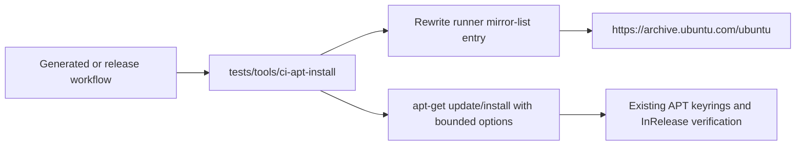

# fix: Make CI APT setup resilient to runner mirror stalls

## Goal Capsule

GitHub-hosted Ubuntu 24.04 jobs currently run dependency setup through the
runner-provided `http://azure.archive.ubuntu.com/ubuntu` mirror. Recent logs
show repeated `Ign:` fetches for `ripgrep` and long/canceled setup jobs while
the same package succeeds from `https://archive.ubuntu.com/ubuntu`. Make every
repository-owned CI dependency install use a bounded, canonical HTTPS mirror
path while retaining APT's normal `InRelease` signature verification.

## Problem Frame and Scope

The workflow generator emits direct `sudo apt-get update && sudo apt-get
install` commands in the Layer-1 workflow, and the release workflow repeats the
same pattern. The hosted runner's mirror list selects
`http://azure.archive.ubuntu.com/ubuntu`; failures are environmental and occur
before repository tests run. The fix is limited to CI dependency installation,
its generated workflow source, the release workflow, and a Layer-1 structural
contract. It does not change package versions, trust keys, Nix supply-chain
checks, or application runtime behavior.

## Evidence and Requirements

- **R1:** CI dependency installation must not wait indefinitely on the
  runner-selected Azure mirror.
- **R2:** APT must continue authenticating repository metadata and packages
  using the runner's existing keyrings and HTTPS transport.
- **R3:** All generated Layer-1 and release workflow package setup paths must
  share one reviewed implementation.
- **R4:** Layer-1 validation must fail closed if a workflow reintroduces direct
  unbounded APT setup or drops the resilience options.
- **R5:** The change must carry a changelog fragment and leave unrelated
  workflows and PR branches untouched.

Observed evidence:

- Run `32222548689`, job logs from `test-policy` and
  `test-rust-supply-chain`: `apt-get update` selected
  `http://azure.archive.ubuntu.com/ubuntu`; package retrieval then retried
  `ripgrep` with `Ign:` entries.
- The same logs show successful fallback retrieval from
  `https://archive.ubuntu.com/ubuntu`.
- The workflow source of truth is `tests/tools/layer1-jobs.py`; the committed
  `.github/workflows/pr-l1-static-fast.yml` is generated from it.

## Key Technical Decisions

1. **Use one repository-owned CI APT helper.**
   (session-settled: user-directed - chosen over repeating inline shell:
   one helper prevents generated and hand-authored workflows from drifting.)
   The helper rewrites the runner mirror-list entry from the Azure HTTP mirror
   to `https://archive.ubuntu.com/ubuntu`, then invokes `apt-get update` and
   `apt-get install` with finite HTTP/HTTPS timeouts and bounded retries.
   It leaves APT `Signed-By` configuration and signature checking untouched.
2. **Keep workflow generation authoritative.**
   (session-settled: user-directed - chosen over editing generated YAML:
   generator changes are reproducible and required by the repository workflow.)
   `tests/tools/layer1-jobs.py` emits the helper invocation, followed by
   regeneration of `.github/workflows/pr-l1-static-fast.yml`.
3. **Enforce the contract in the existing Layer-1 CI coverage gate.**
   (session-settled: user-directed - chosen over a new ad-hoc shell test:
   `tests/unit/meta/ci-coverage.sh` already owns workflow structural checks.)
   The gate checks that every repository workflow uses the helper for APT
   setup and that the helper retains the mirror rewrite, bounded options, and
   package arguments.

## High-Level Technical Design

The helper is CI plumbing, not an application dependency. It should fail
closed when the mirror-list file is unexpectedly absent or the expected Azure
entry cannot be replaced, rather than silently running against an unknown
mirror. The helper accepts package names as positional arguments and must
reject an empty package list.

## Implementation Units

### U1. Add the bounded APT setup helper and Layer-1 contract

**Goal:** Centralize resilient APT setup and protect it with a hermetic
structural test.

**Requirements:** R1, R2, R4

**Dependencies:** None

**Files:**

- `tests/tools/ci-apt-install`
- `tests/unit/meta/ci-coverage.sh`

**Approach:**

1. Add a strict shell helper that rewrites only the runner's
   `azure.archive.ubuntu.com/ubuntu` mirror-list entry to the HTTPS generic
   Ubuntu archive.
2. Run `apt-get update` and `apt-get install -y` with small finite
   `Acquire::http::Timeout`, `Acquire::https::Timeout`, and
   `Acquire::Retries` values.
3. Preserve the system source definitions, keyrings, `Signed-By` behavior, and
   package metadata authentication.
4. Extend the existing CI coverage meta gate to reject direct workflow APT
   commands and to assert the helper's required safety options and package
   argument handling.

**Patterns to follow:** Existing strict shell tools under `tests/tools/`;
workflow structural checks in `tests/unit/meta/ci-coverage.sh`.

**Test scenarios:**

- The helper rejects invocation with no package names.
- The helper fails when the runner mirror-list file is missing or does not
  contain the expected Azure Ubuntu entry.
- The helper source contains HTTPS canonical mirror replacement, bounded HTTP
  and HTTPS timeouts, bounded retries, and no authentication-disabling option.
- The CI coverage gate passes with the helper-backed workflows and fails for a
  fixture containing a direct `apt-get update` or missing required option.

**Verification:** The helper is shellcheck-compatible with repository
conventions, the structural gate exercises the complete workflow set, and no
APT authentication bypass appears in the diff.

### U2. Route generated and release workflows through the helper

**Goal:** Remove every repository-owned direct APT setup path from hosted CI.

**Requirements:** R1, R2, R3, R5

**Dependencies:** U1

**Files:**

- `tests/tools/layer1-jobs.py`
- `.github/workflows/pr-l1-static-fast.yml`
- `.github/workflows/release-host-binaries.yml`

**Approach:**

1. Change the generator's Rust, flake-diagnostics, and other package setup
   steps to call `tests/tools/ci-apt-install` through the repository's scrubbed
   workflow shell.
2. Regenerate the committed Layer-1 workflow; do not hand-edit generated YAML.
3. Change the release binary workflow's package setup step to use the same
   helper.
4. Keep the existing package list (`ripgrep`, `acl`, or `gdb`) unchanged.

**Patterns to follow:** `tests/tools/layer1-jobs.py` rendering functions and
the generated-workflow drift check.

**Test scenarios:**

- Regeneration produces a workflow with no direct `apt-get update` or
  `apt-get install` command.
- Each generated dependency setup step passes its existing package list to the
  helper.
- The release workflow uses the same helper and retains its existing
  permission and checkout protections.
- Workflow drift validation passes after regeneration.

**Verification:** Generated YAML is byte-for-byte current according to the
repository renderer, all APT call sites are helper-backed, and no unrelated
workflow changes are introduced.

### U3. Record the CI resilience change

**Goal:** Document the operational fix in the repository changelog stream.

**Requirements:** R5

**Dependencies:** U2

**Files:**

- `changelog.d/fix-ci-apt-mirror-resilience.md`

**Approach:** Add a concise fragment describing the Azure runner mirror
  mitigation and preserved APT verification behavior.

**Test scenarios:**

- The changelog policy accepts the fragment's format and placement.

**Verification:** The repository changelog policy recognizes the fragment
without changing release history.

## Scope Boundaries

### In scope

- Ubuntu-hosted GitHub Actions dependency setup owned by this repository.
- The generated Layer-1 workflow and the release-host-binaries workflow.
- A Layer-1 structural contract for the helper and its call sites.

### Out of scope

- Changing GitHub runner images, Ubuntu archive contents, package versions, or
  repository signing keys.
- Retrying complete workflows or modifying unrelated PRs.
- Adding a second package manager, disabling APT authentication, or changing
  Nix/Cargo supply-chain verification.

## Risks and Mitigations

- **Runner image changes the mirror-list format:** fail closed when the expected
  file or entry is absent; update the helper deliberately rather than silently
  using an unknown source.
- **Canonical archive availability changes:** bounded APT options ensure a
  finite failure; package metadata remains signature-verified, so a bad or
  unavailable archive fails the job.
- **Generated workflow drift:** regenerate from `tests/tools/layer1-jobs.py`
  and enforce the existing drift gate.

## Verification Contract

- The helper and meta-gate focused checks pass locally.
- Generated workflow drift and CI coverage checks pass.
- Targeted changelog validation passes.
- The PR's required Layer-1 checks pass without full-workflow reruns; any
  failed-only retry follows the repository's strict CI retry rule.

## Definition of Done

- U1-U3 are implemented on `fix/ci-apt-mirror-resilience`.
- The branch is rebased onto the latest `origin/v3` before commit and again
  whenever `v3` moves.
- Independent review has no actionable findings at the reviewed head.
- The PR is mergeable CLEAN with all required checks green.
- The PR is squash-merged with an exact expected-head guard, or the final
  response records the blocker and current reviewed head.
