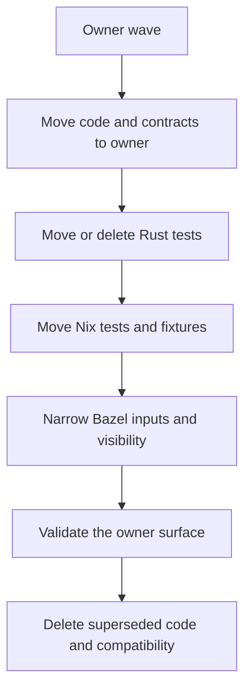
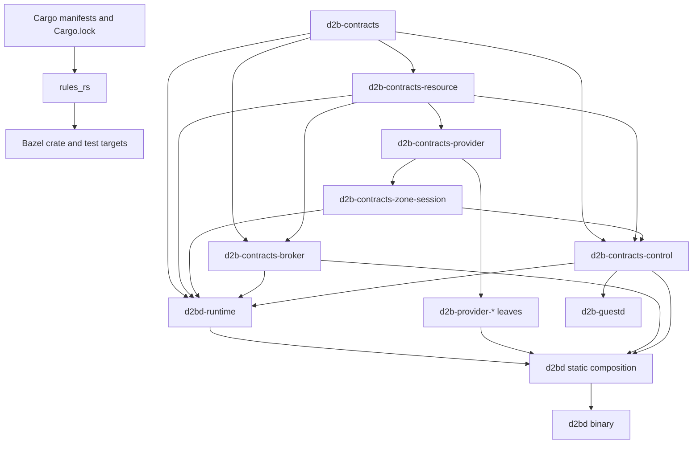
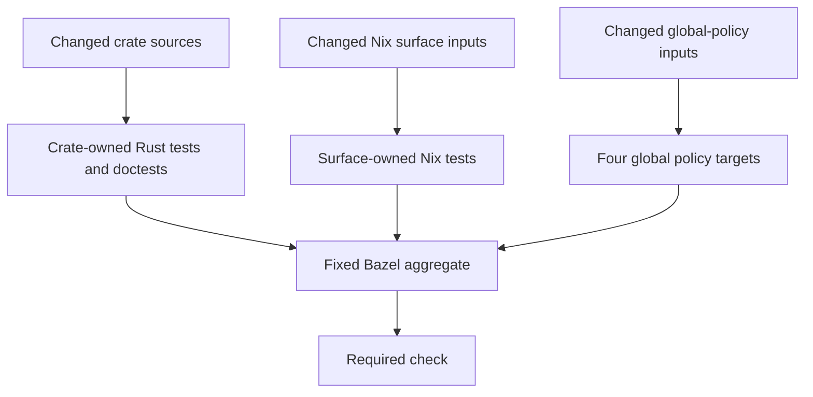

# Build and Test Ownership Cleanup - Plan

## Goal Capsule

| Field | Value |
| --- | --- |
| Objective | Make code, contract, Rust test, and Nix test changes invalidate only their owning surfaces while deleting obsolete crates, duplicate implementations, unused dependencies, and migration-era test infrastructure. |
| Product authority | This plan governs repository ownership, build boundaries, and test boundaries without changing d2b's runtime product architecture or security model. |
| Execution profile | Stage the work as dependency-ordered owner waves. Each wave lands one complete ownership boundary and removes its temporary compatibility before the next dependent wave. |
| Stop conditions | Stop when a wave requires a runtime topology change, weakens a binding security/storage invariant, introduces a contract cycle, or cannot name one final code/test/Nix owner. |
| Tail ownership | The final wave removes compatibility, central test infrastructure, migration records, obsolete docs, and abandoned approaches before the aggregate gate is accepted. |

---

## Product Contract

### Summary

The repository will move to owner-local code, contracts, Rust tests, and Nix tests through staged cleanup waves with a clean-break end state.
Bazel remains the sole supported contributor build and test interface, while Cargo manifests and `Cargo.lock` remain the dependency authority consumed by rules_rs.

### Problem Frame

The current workspace couples unrelated changes through broad Rust crates, central test owners, repository-wide runfile globs, and monolithic Nix inputs.
A provider implementation change recompiles the large `d2bd` library because the daemon's provider-independent runtime and static provider composition share one crate.
Any `d2b-contracts` change reaches most of the Rust workspace because generated control protocols, broker wire types, provider schemas, resource models, and foundational identifiers share one crate.

The test graph repeats the same pattern.
`d2b-contract-tests` centralizes crate, provider, source, documentation, schema, and rendered-Nix assertions, while its shared library carries the repository-wide `repo_policy_sources` input.
Nix case targets all receive the same broad workspace input set, so unrelated changes invalidate every local-only Nix action.
Several Rust and shell tests launch Cargo as a subprocess, creating hidden build graphs inside the declared Bazel graph.

Migration-era inventories, pins, exact prose assertions, source scanners, and compatibility workflows now add more carrying cost than product assurance.
The cleanup must preserve the invariants that matter by moving them to type boundaries, owner-local tests, Bazel visibility, strict schemas, generated checks, or the small allowed global policy set.

### Key Decisions

- **Preserve the runtime topology.** (session-settled: user-directed - chosen over provider processes or dynamic loading: the goal is build isolation without a larger runtime architecture change.) Governs R1-R5.
- **Use one shared thin daemon composition crate.** (session-settled: user-directed - chosen over domain and per-provider adapter crates: minimizing crate count is worth recompiling one small static composition layer.) Governs R2-R4.
- **Land through owner waves with a clean-break end state.** (session-settled: user-directed - chosen over boundary-first, test-first, or one coordinated cutover: each completed surface should be independently clean and green.) Governs R25-R28.
- **Keep only four repository-wide policy classes.** (session-settled: user-directed - chosen over retaining additional narrowed policy tests: global coverage is limited to source hygiene, workspace and lock integrity, supply chain, and changelog policy.) Governs R17-R18.
- **Delete `d2b-contract-tests`.** (session-settled: user-directed - chosen over a reduced cross-boundary test crate: every surviving test must have a crate or Nix-surface owner.) Governs R13-R16.
- **Use a fixed Nix aggregate with precise caching.** (session-settled: user-directed - chosen over changed-file discovery or release-only coverage: deterministic target selection remains, but unrelated targets are cache hits.) Governs R21-R24.
- **Make Bazel the only supported build and test interface.** (session-settled: user-directed - chosen over retaining direct Cargo compatibility: Cargo manifests and `Cargo.lock` remain rules_rs metadata authority, not a contributor workflow contract.) Governs R19-R20.
- **Drop tests that require nested Cargo.** (session-settled: user-directed - chosen over preserving exceptional nested build harnesses: if a test cannot be expressed without launching Cargo, it is removed.) Governs R14, R19.
- **Name every split contract crate with `d2b-contracts-*`.** (session-settled: user-directed - chosen over shorter exceptional names: consistent sorting outweighs longer crate and Bazel labels.) Governs R7-R10.

### How This Work Fits Together

The cleanup is one ownership program with three inseparable tracks:

- **Code and build ownership:** separate provider-independent runtime code from static provider composition, move provider-owned algorithms to providers, and remove unused or duplicate code.
- **Contract ownership:** split the contract monolith into stable dependency domains so contract changes rebuild only legitimate consumers.
- **Test ownership:** move tests to the same code or Nix owner, eliminate hidden build graphs, and make exact inputs determine cache invalidation.



Each wave completes this sequence for one ownership surface.
The plan does not create a separate code-reorganization program and test-reorganization program that would move the same responsibilities twice.

### Actors

- A1. **Contributor:** changes one provider, crate, contract family, Nix surface, or test surface and expects focused feedback.
- A2. **Reviewer:** verifies that each cleanup wave has one clear owner, no duplicate authority, and measurable invalidation boundaries.
- A3. **Bazel/CI:** schedules the fixed aggregate from precise owner-local labels and reuses unaffected cached actions.
- A4. **Maintainer:** approves deletion of obsolete compatibility, tests, crates, and repository policy after successor ownership is established.

### Requirements

**Runtime and code ownership**

- R1. The cleanup must preserve the current `d2bd`, `d2b-priv-broker`, and `d2b-guestd` process topology and current in-process provider invocation.
- R2. Provider-independent daemon behavior must live in a provider-free `d2bd-runtime` crate, while `d2bd` remains the single thin static composition root that depends on providers.
- R3. A provider-only implementation change must have no declared direct consumers beyond the provider's legitimate dependents, the thin `d2bd` composition crate, and the final link; representative `d2bd-runtime`, `d2b-guestd`, sibling-provider, and unrelated-contract labels must remain cached.
- R4. Provider-owned policy, state machines, pure planning, status projection, and tests currently located in `d2bd` or legacy helper crates must move to the owning provider library without changing the runtime call path.
- R5. `d2b-guestd` must remain free of individual provider dependencies; host-side provider behavior must continue reaching guest behavior through the guest-control boundary.
- R6. Verified unused crates, duplicate implementations, unused manifest dependencies, dead compatibility traits, and migration-only code must be deleted rather than preserved behind new abstractions.

**Contract ownership**

- R7. `d2b-contracts` must become the smallest and most stable foundational contract crate.
- R8. Split contract crates must use the `d2b-contracts-*` prefix and separate standard resource contracts, provider and credential contracts, Zone and session contracts, broker contracts, and guest/public control contracts.
- R9. Provider crates must depend only on the narrow contract families they consume; no compatibility umbrella may remain in provider dependency paths at the clean-break end state.
- R10. Large generated protocols and implementation-specific effect contracts must live with their narrow consumer domain rather than the foundational contract crate.
- R11. The foundational contract dependency direction must not point to implementation/model crates such as `d2b-core` or `d2b-realm-core`.
- R12. Cargo manifests and `Cargo.lock` must remain the dependency facts consumed by rules_rs even though direct Cargo contributor workflows are no longer supported.

**Rust test ownership**

- R13. Every surviving Rust test must be owned by the crate whose API, binary, schema, or behavior it validates.
- R14. Tests and test helpers must not launch Cargo directly or indirectly; a test that cannot be expressed through declared Bazel binaries, doctests, compile-fail doctests, unit tests, integration tests, fixtures, or the allowed global policy classes must be deleted.
- R15. Public API success examples must use doctests, and sealed or forbidden API usage must use defining-item `compile_fail` doctests unless one small owner-local UI test is demonstrably necessary.
- R16. Rendered Nix/Rust contract tests must move to the Rust or provider owner that consumes the artifact, and `d2b-contract-tests` must be absent from the final workspace.
- R17. Repository-wide tests must be limited to source hygiene, workspace and lock integrity, supply chain, and changelog policy.
- R18. Important invariants outside the four global classes must be enforced by types, privacy, sealed traits, strict schemas, Bazel visibility, generated artifacts, or owner-local tests; otherwise the invariant test is dropped.
- R19. Nested Cargo compatibility scripts, API scanners, external-seal workspaces, test migration ledgers, successor pins, legacy static harnesses, and tests that only assert historical markers or other test files exist must be removed.
- R20. Bazel must expose the complete crate test surface, including doctests, through labels owned by each crate; current centralized doctest declarations must move to their owners.

**Nix test ownership**

- R21. Nix tests must be owned by one provider or Nix module surface and declare only the modules, helpers, fixtures, and pinned inputs required by that surface.
- R22. Provider-specific Nix tests must live with the provider, while generic NixOS module tests must live with an explicitly named module surface.
- R23. The fixed Nix aggregate must remain a pure union of isolated targets; changing one surface must invalidate only its exact-input owner targets, while representative sibling-surface labels remain cached.
- R24. Broad Nix unit inputs, root-flake sweeps, combined realized checks, full-repository fixtures, duplicated case inventories, and unconditional all-VM execution must be split or removed.

**Delivery and authority**

- R25. The cleanup must land in staged owner waves, and every completed wave must leave its surface with one code owner, one contract owner, one Rust test owner, one Nix test owner where applicable, and precise Bazel inputs.
- R26. Temporary compatibility or duplicate ownership may exist only within an active wave and must be deleted before that wave is complete.
- R27. Each wave must preserve required runtime, security, manifest, broker, storage, and lifecycle behavior while permitting obsolete evidence-only tests to be dropped.
- R28. Contributor, testing, gate, and workflow documentation must be rewritten to describe the clean-break Bazel-only model rather than preserving superseded Cargo, central policy-test, migration-ledger, or broad Nix-corpus rules.
- R29. Success must be measured by action invalidation and dependency reachability rather than a fixed wall-clock threshold.

### Key Flows

- F1. Provider implementation change
  - **Trigger:** A contributor changes provider-local implementation code without changing a shared contract.
  - **Actors:** A1, A3
  - **Steps:** Bazel rebuilds the provider, the thin static daemon composition layer when it consumes that provider, and the final binary link; owner-local Rust and Nix tests run.
  - **Outcome:** Provider-independent daemon runtime, guestd, unrelated providers, and unrelated contract/test actions remain cached.
  - **Covers:** R2-R5, R13, R20-R23.
- F2. Owner cleanup wave
  - **Trigger:** A maintainer selects one provider, contract domain, or shared runtime surface for migration.
  - **Actors:** A1, A2, A4
  - **Steps:** The wave establishes the target owner, moves code and contracts, moves or deletes tests, narrows Nix and Bazel inputs, validates behavior, then removes superseded ownership.
  - **Outcome:** The completed surface has no compatibility layer, central test dependency, nested Cargo path, or duplicate implementation.
  - **Covers:** R4, R6-R10, R13-R20, R25-R27.
- F3. Nix surface change
  - **Trigger:** A contributor changes one provider or module Nix surface.
  - **Actors:** A1, A3
  - **Steps:** The fixed aggregate selects all labels, but only the changed surface's exact-input action is invalidated and executed.
  - **Outcome:** Unrelated Nix tests and realized checks are cache hits.
  - **Covers:** R21-R24, R29.
- F4. Untestable legacy assertion
  - **Trigger:** A migrated source scan or compatibility test cannot be represented without nested Cargo or broad repository inputs.
  - **Actors:** A1, A2, A4
  - **Steps:** The reviewer checks whether a type boundary, visibility rule, strict schema, generated check, owner-local test, or allowed global policy can own the invariant.
  - **Outcome:** The assertion moves to an owner when possible and is otherwise deleted.
  - **Covers:** R14-R19.

### Acceptance Examples

- AE1. **Covers R2-R5, R29.**
  - **Given:** A provider changes internal reconciliation logic without changing shared contracts.
  - **When:** The fixed Bazel aggregate runs.
  - **Then:** The provider, thin `d2bd` composition, relevant owner-local tests, and final link are invalidated; named `d2bd-runtime`, guestd, sibling-provider, and foundational-contract labels remain cached.
- AE2. **Covers R7-R11.**
  - **Given:** A broker wire contract changes.
  - **When:** Bazel evaluates the Rust graph.
  - **Then:** `d2b-contracts-broker` and its legitimate consumers rebuild, while providers using only foundational or resource contracts remain cached.
- AE3. **Covers R13-R20.**
  - **Given:** A sealed public API needs negative coverage.
  - **When:** The owner can express the forbidden use as a `compile_fail` doctest.
  - **Then:** The doctest replaces workspace rustdoc scanning and nested Cargo fixture workspaces.
- AE4. **Covers R14, R17-R19.**
  - **Given:** A historical policy test requires launching Cargo and does not fit one of the four allowed global policy classes.
  - **When:** No owner-local or structural enforcement exists.
  - **Then:** The test is deleted rather than granted an exception.
- AE5. **Covers R21-R24, R29.**
  - **Given:** A network Nix module changes.
  - **When:** The fixed Nix aggregate runs.
  - **Then:** Only network-surface exact-input actions miss cache; named storage, observability, guest-control, desktop, and provider-catalog labels remain cached.
- AE6. **Covers R25-R28.**
  - **Given:** An owner wave has moved implementation and tests but still retains a compatibility re-export, migration pin, or broad test input.
  - **When:** The wave is reviewed for completion.
  - **Then:** The wave is not complete until the superseded surface is removed and contributor authority reflects the new owner.

### Success Criteria

- A bounded evidence matrix covers one provider edit, one contract-family edit, one Nix-surface edit, one documentation-only edit, and one manifest/lock edit.
- Each evidence row names the direct consumers expected to rebuild and representative sibling/owner labels expected to remain cached.
- A provider-only change has the invalidation shape defined by R3 and AE1.
- A contract-family change rebuilds only the declared consumers of that `d2b-contracts-*` family.
- `d2b-contract-tests`, `repo_policy_sources`, broad `nix_unit_inputs`, nested Cargo test calls, migration-state records, successor pins, and legacy static compatibility tests are absent.
- Every surviving test is discoverable from its owning crate or Nix surface.
- The fixed complete Bazel aggregate remains available and unaffected isolated targets are reusable cache hits.
- Cargo manifests and `Cargo.lock` remain rules_rs authority, but contributor and CI documentation exposes Bazel as the only supported build/test interface.
- Runtime units, provider invocation, broker ownership, guestd boundaries, and security-critical subsystem behavior remain unchanged unless a separate accepted design changes them.

### Scope Boundaries

**In scope**

- Rust crate and Bazel target boundaries for daemon runtime, provider composition, contracts, tests, and tooling.
- Moving provider-owned logic and tests from daemon/legacy crates to providers.
- Deleting verified unused crates, dead dependencies, duplicate implementations, historical policy, and migration infrastructure.
- Rewriting test and contributor authority to the owner-local Bazel model.
- Nix unit, fixture, flake-evaluation, realized-check, and host-integration selection boundaries.

**Outside this cleanup**

- Dynamic provider loading or converting current providers into separate runtime processes.
- Changing the three root-visible daemon/broker units or guestd runtime topology.
- Replacing Cargo manifests or `Cargo.lock` as dependency metadata authority.
- Creating domain or per-provider daemon adapter crates.
- Introducing a changed-file/affected-test scheduler alongside Bazel.
- Setting a fixed Nix wall-clock threshold.
- Adding new product capabilities while moving ownership.

### Dependencies and Assumptions

- rules_rs continues consuming Cargo manifests and `Cargo.lock`.
- Bazel remains capable of expressing owner-local doctest, compile-fail, unit, integration, Nix, fixture, and binary dependencies without tests spawning a nested build tool.
- Existing runtime and security authorities remain binding during every wave.
- The cleanup may intentionally reduce test count when a test protects migration history, exact prose, duplicate evidence, or an invariant better owned structurally.
- Full CI may continue selecting the fixed aggregate because precise action inputs, not changed-file discovery, provide isolation.

### Outstanding Questions

**Deferred to planning**

- The exact owner-wave order after the foundational contract and daemon seams are established.
- The exact module split between `d2bd-runtime` and the thin `d2bd` composition crate.
- The final per-file mapping into each `d2b-contracts-*` crate.
- Which owner-local replacement tests are worth retaining versus deleting during each wave.
- The exact small common harness shared by isolated Nix surfaces.

### Sources and Research

- `packages/d2bd/BUILD.bazel`
- `packages/d2b-guestd/Cargo.toml`
- `packages/d2b-contracts/Cargo.toml`
- `packages/d2b-contract-tests/BUILD.bazel`
- `packages/d2b-bus/tests/public_mint_surface.rs`
- `bazel/checks/nix/BUILD.bazel`
- `bazel/checks/nix/defs.bzl`
- `bazel/checks/rust/BUILD.bazel`
- `tests/AGENTS.md`
- `docs/contributing/gates-and-lints.md`
- `docs/contributing/architecture.md`
- `docs/contributing/critical-subsystems.md`

---

## Planning Contract

**Product Contract preservation:** restructured, no scope change: R3 and R23 now name bounded representative cache evidence, and Success Criteria carries the corresponding evidence matrix.

### Key Technical Decisions

- KTD1. **Use an acyclic contract dependency ladder.** `d2b-contracts` is foundational; `d2b-contracts-resource` depends on it; `d2b-contracts-provider` depends on foundation plus resource contracts; `d2b-contracts-zone-session` depends on the lower contract layers it needs. `d2b-contracts-broker` and `d2b-contracts-control` are narrow side crates that depend downward only. Governs R7-R12.
- KTD2. **Break the current contract inversion before moving generated protocols.** Shared IDs, errors, versions, operation tokens, interface names, and other neutral DTOs move downward first. Generated broker, guest-control, resource, and provider-specific wire surfaces move only after their foundational inputs no longer come from `d2b-core` or `d2b-realm-core`. Governs R7-R11.
- KTD3. **Represent daemon separation as state plus static composition.** `d2bd-runtime` owns provider-independent runtime state and services. `d2bd` owns the composition state that joins runtime services to provider libraries and effect adapters. Provider callbacks use existing neutral traits or the smallest runtime-owned interface necessary; the split must not introduce a generalized plugin framework. Governs R1-R5.
- KTD4. **Establish owner-local test primitives before provider waves.** Crate-owned doctest labels, exact Bazel data, Cargo-free compile-fail coverage, and surface-owned Nix tests exist before a provider wave moves its current central coverage. Governs R13-R24.
- KTD5. **Use explicit Bazel inputs as the cache contract.** The fixed aggregate remains stable, but each test or build label owns a precise source closure. Catch-all filegroups are allowed only for the four global policy classes and must contain only the file kinds that policy evaluates. Governs R17-R24, R29.
- KTD6. **Supply prebuilt artifacts to tests.** Tests receive binaries, metadata fixtures, generated artifacts, or tool labels from Bazel. They never build xtask, the CLI, the daemon, the broker, fixture crates, or UI workspaces at test runtime. Governs R14, R19-R20.
- KTD7. **Complete one owner wave before opening its dependents.** A wave includes code, contract imports, Rust tests, Nix tests, Bazel targets, docs, and deletion of superseded ownership. Partial waves may use temporary re-exports inside the branch, but no wave may merge with duplicate authority. Governs R25-R28.
- KTD8. **Delete evidence that no longer protects executable behavior.** Historical marker tests, exact prose checks, test-existence checks, migration ledgers, successor pins, and compatibility-only scripts are removed instead of translated mechanically. A security-relevant central test may be deleted only after its owner-local negative test or structural proof is named and passing. Governs R6, R14, R17-R19.
- KTD9. **Keep Cargo metadata but remove Cargo workflow compatibility.** Root and package manifests plus `Cargo.lock` remain authoritative inputs for rules_rs. Make targets, CI jobs, contributor docs, and tests expose Bazel only. Governs R12, R14, R19-R20, R28.
- KTD10. **Allow one pure Nix evaluation harness.** `nix/test-support/eval-surface.nix` owns shared `lib.evalModules` setup only. Surface assertions, imports, fixtures, and Bazel labels remain owner-local and may not be discovered or aggregated by the harness. Governs R21-R24.

### High-Level Technical Design

The target Rust dependency graph separates stable contract facts, provider-independent runtime, static composition, and implementation leaves.



The contract split must be evaluated from the bottom upward.
A higher contract crate may depend on a lower crate, but no foundational or resource contract may import provider, Zone/session, broker, control, core, daemon, or realm implementation code.

The test graph uses owner-local leaves under one fixed aggregate.



No owner-local target depends on a repository-wide source universe.
Selecting the fixed aggregate does not force execution when a target's exact input closure is unchanged.

### Output Structure

The implementation is expected to introduce these package boundaries while retaining the current runtime binaries:

```text
packages/
  d2b-contracts/
  d2b-contracts-resource/
  d2b-contracts-provider/
  d2b-contracts-zone-session/
  d2b-contracts-broker/
  d2b-contracts-control/
  d2b-resource-api/
  d2bd-runtime/
  d2bd/
  d2b-guestd/
  d2b-provider-*/
nix/
  test-support/
    eval-surface.nix
tests/
  unit/
    nix/
      surfaces/
```

Provider-specific Nix tests live below the provider package.
Generic Nix module tests live below an owning `nixos-modules/` surface.
The exact internal module layout is decided per owner wave, but the package boundaries above are fixed by R2 and R7-R10.

### Contract Migration Map

| Target owner | Primary current inputs | Dependency posture |
| --- | --- | --- |
| `d2b-contracts` | neutral portions of `packages/d2b-contracts/src/lib.rs`, `packages/d2b-contracts/src/types.rs`, foundational files under `packages/d2b-contracts/src/v3/`, and neutral DTOs currently re-exported from core/realm crates | No implementation/model crate dependencies |
| `d2b-contracts-resource` | standard Host, Guest, User, Process, Network, Device, Volume, storage, execution-policy, endpoint, activation, resource proto source, and generated resource messages | Foundation only |
| `d2b-contracts-provider` | provider manifest/registry, credentials, semantic services, resource-schema, and neutral effect-port descriptors | Foundation plus resource |
| `d2b-contracts-zone-session` | ComponentSession, Zone, ZoneLink, routing, roles, exports/imports, services, and resource bundles | Lower contract layers only |
| `d2b-contracts-broker` | `packages/d2b-contracts/src/broker_wire.rs`, broker-facing IDs and host-generation DTOs | Foundation plus selected resource contracts |
| `d2b-contracts-control` | guest/public/terminal/unsafe-local wire, guest auth, CLI output, and generated guest-control protocol | Foundation plus selected resource and Zone/session contracts |
| `d2b-resource-api` | resource ttrpc service/client adapters generated from the resource contract proto | Depends on `d2b-contracts-resource`; no duplicate message owner |
| Owning provider | implementation-specific effect DTOs such as ACA and provider-specific USB/security-key surfaces | Provider-local; no foundational leakage |

### Sequencing

1. Break the foundational contract inversion.
2. Establish Cargo-free crate-owned Rust test primitives.
3. Create contract domain crates and migrate generated wire ownership.
4. Extract the provider-free daemon runtime and establish per-surface Nix test primitives.
5. Run owner waves from the lowest-coupled provider domains toward runtime/cloud/realm compatibility.
6. Delete the central test owner and migration infrastructure.
7. Switch contributor, CI, and gate authority to the clean-break Bazel-only surface.

### Assumptions

- The existing runtime topology and broker boundaries are code canon throughout the cleanup.
- rules_rs continues to discover dependency facts from Cargo manifests and `Cargo.lock`.
- Provider packages may contain multiple binaries when they are the owner of those binaries; this does not imply separate provider runtime processes.
- A lower test count is acceptable when deleted tests protect historical migration evidence, duplicate another proof, or require forbidden broad/nested build behavior.
- Build and test action locality is demonstrated during implementation through Bazel graph/action evidence; it is not enforced by adding another repository-wide meta-test.

### System-Wide Impact

- **Developer workflow:** Contributors use crate and Nix-surface Bazel labels for focused work and `make check` for the fixed aggregate. Direct Cargo compatibility is removed from documented and required workflows.
- **CI:** The stable required check remains, but its leaves become cacheable owner-local actions. Supply-chain, changelog, source-hygiene, and workspace/lock targets remain the only global policy leaves.
- **Rust architecture:** Contract and daemon runtime changes alter most workspace dependency declarations without changing runtime behavior.
- **Nix architecture:** Provider and module tests gain explicit owners and input closures. Root-flake and fixture sweeps stop acting as the default unit-test mechanism.
- **Documentation:** `AGENTS.md`, `tests/AGENTS.md`, contributor guides, Make aliases, Bazel reference docs, and workflow documentation must change together with the clean-break interface.
- **Review:** Each owner wave is independently reviewable, but the branch carries a temporary mixed state until the final authority wave removes obsolete infrastructure.

### Risks and Mitigations

| Risk | Impact | Mitigation |
| --- | --- | --- |
| Contract extraction creates dependency cycles | Foundational split cannot compile | Land neutral DTO inversion first; enforce KTD1 in each new BUILD/Cargo dependency set before moving consumers |
| Generated code ownership drifts | Wire/schema regeneration becomes ambiguous | Move generator, generated output, drift ownership, and tests in the same unit; retain one owner per generated family |
| `d2bd-runtime` leaks provider types | Provider changes still rebuild the large runtime crate | Reject provider dependencies in `d2bd-runtime`; keep provider-specific state in composition/adapters |
| Partial owner waves create two authorities | Runtime behavior or tests diverge | Apply KTD7 completion gate before merging each wave |
| Test deletion removes unique security evidence | A real invariant loses coverage | Trace every surviving security invariant to a type, visibility rule, strict schema, owner-local test, or allowed global policy before deleting its old scan |
| Pure Nix tests still depend on root-flake source closure | Unrelated Nix changes still invalidate targets | Use a small standalone surface harness with exact module inputs; reserve flake-output tests for true flake/package behavior |
| Bazel-only transition strands contributor workflows | Local development becomes unclear | Land focused crate/surface aliases and docs before removing Cargo aliases; complete both in the final authority wave |
| Large waves exhaust disk or review capacity | Validation and review stall | Keep units dependency-ordered, use documented disk hygiene, and split implementation commits within a U-ID without splitting ownership authority |

### Alternative Approaches Considered

- **Boundary-first cleanup:** Rejected because large contract/runtime changes would execute under the broad and nested current test graph.
- **Test-first cleanup:** Rejected because tests would move into current owners and then move again after code ownership changes.
- **Domain or per-provider daemon adapter crates:** Rejected because the user chose one shared thin composition crate to minimize crate count.
- **Dynamic provider loading or provider processes:** Rejected because runtime architecture change is outside R1.
- **Changed-file test selection:** Rejected because exact Bazel inputs and cache behavior are sufficient without adding another scheduler.
- **Retaining a reduced `d2b-contract-tests`:** Rejected because it would preserve a second test owner and invite renewed cross-repository policy accumulation.

---

## Implementation Units

| Unit | Title | Primary files | Depends on |
| --- | --- | --- | --- |
| U1 | Invert foundational contracts | `packages/d2b-contracts/`, `packages/d2b-core/`, `packages/d2b-realm-core/` | None |
| U5 | Establish owner-local Rust test infrastructure | crate BUILD files, `bazel/checks/rust/`, nested-Cargo harnesses | U1 |
| U2 | Split broker and control contracts | `packages/d2b-contracts-broker/`, `packages/d2b-contracts-control/`, generated wire owners | U1, U5 |
| U3 | Split resource, provider, and Zone/session contracts | `packages/d2b-contracts-resource/`, `packages/d2b-contracts-provider/`, `packages/d2b-contracts-zone-session/` | U1, U2, U5 |
| U4 | Extract provider-free daemon runtime | `packages/d2bd-runtime/`, `packages/d2bd/` | U3 |
| U6 | Establish per-surface Nix test infrastructure | `bazel/checks/nix/`, `tests/unit/nix/`, provider Nix targets | U5 |
| U7 | Complete device owner wave | device providers, d2bd device state, device Nix/tests | U3-U6 |
| U8 | Complete desktop interaction owner wave | audio, clipboard, display, notification providers and legacy helpers | U3-U6 |
| U9 | Complete network, storage, and activation owner wave | network/volume/activation providers, host helpers, Nix surfaces | U3-U6 |
| U10 | Complete process, runtime, transport, and shell owner wave | process/system/runtime/transport/shell crates and guest helpers | U3-U6, U9 |
| U11 | Complete credential, cloud, and unused-code wave | credential/cloud crates and dependency manifests | U3-U6, U10 |
| U14 | Retire realm compatibility surfaces | `packages/d2b-realm-*`, remaining legacy consumers | U3, U5, U6, U10, U11 |
| U12 | Delete central test and migration infrastructure | `packages/d2b-contract-tests/`, test policy carriers, migration pins/ledgers | U7-U11, U14 |
| U13 | Land final Bazel-only authority and graph proof | contributor docs, Make/CI, final BUILD graph, changelog | U12 |

### U1. Invert foundational contracts

**Goal:** Make foundational contract types independent of `d2b-core` and `d2b-realm-core`.

**Requirements:** R7, R11-R12.

**Dependencies:** None.

**Files:**

- `packages/d2b-contracts/Cargo.toml`
- `packages/d2b-contracts/BUILD.bazel`
- `packages/d2b-contracts/src/lib.rs`
- `packages/d2b-contracts/src/types.rs`
- foundational modules under `packages/d2b-contracts/src/v3/`
- `packages/d2b-core/src/error.rs`
- `packages/d2b-core/src/host.rs`
- `packages/d2b-core/src/privileges_w3.rs`
- `packages/d2b-core/src/workload_identity.rs`
- `packages/d2b-contracts/src/v3/ifname.rs`
- `packages/d2b-contracts/src/broker_wire.rs`
- `packages/d2b-contracts/src/public_wire.rs`
- neutral identifier/token modules under `packages/d2b-realm-core/src/`
- `packages/d2b-contracts/tests/foundation.rs`

**Approach:**

1. Inventory every `d2b-contracts` import from core and realm crates and classify it as foundational, resource, provider, session, or legacy.
2. Select `d2b-contracts::v3::IfName` as the canonical interface-name type, retarget broker/public wire DTOs, and remove the duplicate `d2b-core::host::IfName` path.
3. Move the remaining foundational definitions into `d2b-contracts`; let old owners re-export only within this active unit.
4. Update consumers to import the foundational owner directly.
5. Remove `d2b-core` and `d2b-realm-core` dependencies from `d2b-contracts` before completing the unit.

**Patterns to follow:** Strict serde DTOs and bounded identifiers in `packages/d2b-contracts/src/v3/`; workspace dependency declarations in crate-local `Cargo.toml` and `BUILD.bazel`.

**Test scenarios:**

- Foundational identifiers and errors preserve canonical serialization, validation bounds, and redacted diagnostics.
- Existing consumers compile after direct imports replace old re-export paths.
- The Bazel/Cargo dependency graph contains no `d2b-contracts -> d2b-core` or `d2b-contracts -> d2b-realm-core` edge.
- Broker/public wire DTOs and host/runtime consumers use one canonical `IfName` type.
- Unknown-field and invalid-token cases remain rejected in owner-local tests.

**Verification:** Focused contract/core/realm Bazel targets pass, and dependency inspection confirms the inversion is removed.

### U5. Establish owner-local Rust test infrastructure

**Goal:** Make each crate's BUILD target the complete Rust test owner and eliminate nested Cargo test mechanics.

**Requirements:** R13-R20.

**Dependencies:** U1.

**Files:**

- `bazel/checks/rust/BUILD.bazel`
- crate-local `BUILD.bazel` files under `packages/`
- `packages/d2b-bus/tests/public_mint_surface.rs`
- `packages/d2b-bus/tests/ui/`
- `packages/d2b-resource-api/tests/external_seals.rs`
- `packages/d2b-resource-api/tests/ui/`
- `packages/d2b-controller-toolkit/tests/external_seals.rs`
- `packages/d2b-controller-toolkit/tests/ui/`
- `packages/xtask/tests/workspace_lint.rs`
- `tests/tools/cargo-compat.sh`
- `tests/tools/stub-no-socket.sh`
- `tests/tools/heavy-gate-reexec.sh`
- `tests/unit/gates/`
- `tests/unit/meta/`

**Approach:**

1. Move each centralized `rust_doc_test` declaration into its owning crate.
2. Replace allowed API examples and sealed API failures with defining-item doctests and `compile_fail` doctests.
3. Delete workspace rustdoc/API scanners and nested Cargo UI fixture workspaces when owner-local doctests cover the boundary.
4. Replace test-time builds with Bazel-declared binaries and metadata fixtures.
5. Define narrow source filegroups for the four global policy classes; do not recreate `repo_policy_sources`.
6. Add focused crate test aliases without adding affected-file discovery.

**Execution note:** Preserve or add owner-local coverage before deleting a security-relevant central scan; delete evidence-only scans directly.

**Patterns to follow:** Existing `compile_fail` doctests in `packages/d2b-bus/src/router.rs`, `packages/d2b-session/src/admission.rs`, `packages/d2b-resource-api/src/`, and `packages/d2b-resource-store-redb/src/ownership.rs`.

**Test scenarios:**

- Covers AE3. Allowed API examples compile as doctests and forbidden constructors fail through `compile_fail`.
- Covers AE4. A test that requires nested Cargo and has no structural or owner-local replacement is removed.
- Crate-focused Bazel labels discover unit, integration, and doctest targets without a central declaration.
- Drift/performance/heavy-lane tests consume declared tools and binaries without launching Cargo.
- Each global policy target invalidates only on its declared file universe.

**Verification:** The Rust test graph contains no test-time Cargo subprocess, no workspace API scanner, and no owner-local test that depends on a repository-wide source carrier.

### U2. Split broker and control contracts

**Goal:** Isolate low-fanout broker and guest/public control protocols from foundational contracts.

**Requirements:** R8-R10, R12.

**Dependencies:** U1, U5.

**Files:**

- `packages/d2b-contracts-broker/Cargo.toml`
- `packages/d2b-contracts-broker/BUILD.bazel`
- `packages/d2b-contracts-broker/src/`
- `packages/d2b-contracts-control/Cargo.toml`
- `packages/d2b-contracts-control/BUILD.bazel`
- `packages/d2b-contracts-control/src/`
- `packages/d2b-contracts/src/broker_wire.rs`
- `packages/d2b-contracts/src/public_wire.rs`
- `packages/d2b-contracts/src/guest_wire.rs`
- `packages/d2b-contracts/src/guest_auth.rs`
- `packages/d2b-contracts/src/unsafe_local_wire.rs`
- `packages/d2b-contracts/src/terminal_wire.rs`
- `packages/d2b-contracts/src/cli_output.rs`
- `packages/d2b-contracts/proto/guest_control.proto`
- `packages/d2b-contracts/src/generated/guest_control.rs`
- `packages/d2b-contracts/tests/guest_proto_bindings.rs`
- broker/control dependency declarations in `packages/d2b-priv-broker/`, `packages/d2b-guestd/`, `packages/d2b/`, and `packages/d2bd/`
- `packages/d2b-contracts-broker/tests/wire.rs`
- `packages/d2b-contracts-control/tests/guest_control.rs`
- `packages/d2b-contracts-control/tests/public_wire.rs`

**Approach:**

1. Create broker and control crates with downward-only dependencies from KTD1.
2. Move generated guest-control bindings and their generator/drift authority with `d2b-contracts-control`.
3. Move broker capability/version construction without importing broker request implementations back into the foundation.
4. Migrate broker, daemon, CLI, guestd, supervisor, and affected provider imports and dependency declarations without moving their runtime modules in this unit.
5. Remove compatibility re-exports from `d2b-contracts` before the unit completes.

**Patterns to follow:** Existing generated module wrappers in `packages/d2b-contracts/src/generated/`; strict protocol tests in `packages/d2b-contracts/tests/`.

**Test scenarios:**

- Broker request/response tags, protocol versions, capability inventories, and error redaction remain stable.
- Guest-control protobuf field numbers, reserved slots, message bounds, and service methods remain stable.
- CLI/public wire round trips remain compatible with current binaries.
- Providers that use only foundational/resource contracts no longer rebuild from broker/control-only edits.

**Verification:** Focused broker, guestd, CLI, daemon, and control-contract Bazel targets pass; graph evidence shows narrow direct consumers.

### U3. Split resource, provider, and Zone/session contracts

**Goal:** Complete the contract-family split and migrate every workspace consumer to a narrow dependency set.

**Requirements:** R7-R12.

**Dependencies:** U1, U2, U5.

**Files:**

- `packages/d2b-contracts-resource/`
- `packages/d2b-contracts-provider/`
- `packages/d2b-contracts-zone-session/`
- relevant modules under `packages/d2b-contracts/src/v3/`
- `packages/d2b-contracts/proto/d2b-resource-v3.proto`
- `packages/d2b-contracts-resource/proto/d2b-resource-v3.proto`
- generated resource message bindings under `packages/d2b-contracts-resource/src/`
- `packages/d2b-resource-api/src/generated/`
- `Cargo.toml`
- `Cargo.lock`
- crate-local `Cargo.toml` and `BUILD.bazel` files across `packages/`
- `packages/d2b-contracts-resource/tests/schema.rs`
- `packages/d2b-contracts-provider/tests/schema.rs`
- `packages/d2b-contracts-zone-session/tests/contracts.rs`
- `packages/d2b-resource-api/tests/protocol.rs`

**Approach:**

1. Create the resource, provider, and Zone/session crates from the Contract Migration Map.
2. Move the resource proto source and generated message bindings to `d2b-contracts-resource`.
3. Keep only generated ttrpc service/client adapters in `d2b-resource-api`.
4. Leave implementation-specific provider effect contracts in place until their owning provider wave.
5. Migrate consumers in dependency order: foundational/resource stores and APIs, provider SDK/toolkit, providers, Zone/session/bus, then daemon/CLI.
6. Remove the old umbrella exports and any unused dependencies exposed by the split.

**Patterns to follow:** Resource schema ownership in `packages/d2b-contracts/src/v3/resource_schema.rs`; generated adapter ownership in `packages/d2b-resource-api/src/generated/`.

**Test scenarios:**

- Covers AE2. Broker-only, provider-only, resource-only, and Zone/session-only edits invalidate only legitimate contract consumers.
- Resource, provider, credential, semantic service, and Zone/session schemas preserve fingerprints and strict decoding.
- Generated resource API messages remain wire-compatible after ownership moves.
- The resource proto, generated message bindings, and drift authority have one owner; resource API adapters import that owner.
- No contract crate introduces an upward cycle or provider implementation dependency.

**Verification:** All new contract crate targets pass, all workspace consumers use narrow labels, and the old umbrella dependency disappears from provider manifests.

### U4. Extract provider-free daemon runtime

**Goal:** Separate the large provider-independent daemon compile unit from static provider composition.

**Requirements:** R1-R5, R25-R27.

**Dependencies:** U3.

**Files:**

- `packages/d2bd-runtime/Cargo.toml`
- `packages/d2bd-runtime/BUILD.bazel`
- `packages/d2bd-runtime/src/`
- `packages/d2bd/Cargo.toml`
- `packages/d2bd/BUILD.bazel`
- `packages/d2b-contracts-broker/`
- `packages/d2b-contracts-control/`
- provider-neutral modules under `packages/d2bd/src/`
- mixed ownership modules including `packages/d2bd/src/lib.rs`, `packages/d2bd/src/resource_runtime.rs`, and `packages/d2bd/src/typed_error.rs`
- `packages/d2bd-runtime/tests/runtime_boundary.rs`
- daemon tests under `packages/d2bd/tests/`

**Approach:**

1. Define provider-neutral runtime state and service boundaries without provider crate types.
2. Move audit, metrics, wire, guest-control, generic resource-store, lifecycle, supervisor, lock, and readiness behavior into `d2bd-runtime`.
3. Declare the broker/control contract dependencies required by those runtime modules directly on `d2bd-runtime`; do not route them back through `d2bd`.
4. Keep provider selection, interaction composition, and effect adapters in `d2bd`.
5. Split mixed modules by ownership instead of adding broad bridge interfaces.
6. Preserve the `d2bd` binary, sockets, startup order, request routing, and broker/guest-control behavior.

**Patterns to follow:** Existing injected effect-port boundaries in `packages/d2b-process/`, `packages/d2b-provider-supervisor/`, and provider effect adapters under `packages/d2bd/src/`.

**Test scenarios:**

- Covers AE1. An internal provider change leaves the `d2bd-runtime` action cached.
- Daemon startup, state lock, public socket, resource store, guest-control, and supervisor behavior remain unchanged.
- `d2bd-runtime` has no direct dependency on `d2b-provider-*`.
- Composition adapters can exercise provider behavior through the unchanged in-process path.

**Verification:** Focused `d2bd-runtime` and `d2bd` Bazel targets pass; dependency evidence confirms provider-free runtime ownership.

### U6. Establish per-surface Nix test infrastructure

**Goal:** Replace the monolithic Nix test input and execution model with exact surface-owned targets.

**Requirements:** R21-R24, R29.

**Dependencies:** U5.

**Files:**

- `bazel/checks/nix/defs.bzl`
- `bazel/checks/nix/BUILD.bazel`
- `bazel/checks/fixtures/BUILD.bazel`
- `tests/unit/nix/default.nix`
- `tests/unit/nix/eval-jobs.nix`
- `tests/unit/nix/BUILD.bazel`
- `nix/test-support/eval-surface.nix`
- `tests/unit/nix/cases/`
- `tests/unit/nix/helpers/`
- `tests/unit/nix/eval-cases/`
- `tests/unit/nix/surfaces/daemon.nix`
- `tests/unit/nix/surfaces/guest-control.nix`
- `tests/unit/nix/surfaces/network.nix`
- `tests/unit/nix/surfaces/storage-volume.nix`
- `tests/unit/nix/surfaces/process-sandbox.nix`
- `tests/unit/nix/surfaces/realm-zone.nix`
- `tests/unit/nix/surfaces/desktop-interaction.nix`
- `tests/unit/nix/surfaces/security-key.nix`
- `tests/unit/nix/surfaces/gpu-video.nix`
- `tests/unit/nix/surfaces/provider-catalog.nix`
- `tests/unit/nix/surfaces/examples.nix`
- `flake.nix`
- provider-local `nix/`, `integration/`, and `BUILD.bazel` files
- generic `nixos-modules/` surface test targets
- explicit surface mappings for flat modules such as `nixos-modules/clipboard.nix`, `nixos-modules/notifications.nix`, `nixos-modules/host-daemon.nix`, `nixos-modules/host-broker.nix`, `nixos-modules/resources-device.nix`, `nixos-modules/resources-volume.nix`, and `nixos-modules/unsafe-local-helper.nix`

**Approach:**

1. Create the KTD10 harness with pure evaluation setup and no case discovery or repository scan.
2. Introduce a surface test rule that accepts one test expression and an explicit module/helper/fixture source set.
3. Use standalone module evaluation for pure tests instead of the root flake.
4. Group small aliases into one evaluation per real module/provider surface.
5. Move provider Nix tests to new provider-local `nix/tests/default.nix` files and generic module tests to `tests/unit/nix/surfaces/`.
6. Split realized checks and fixtures by output domain.
7. Keep the fixed aggregate as a suite over isolated labels and remove duplicate case inventories and integrity sweeps.

**Patterns to follow:** Shared pure-evaluation logic in `tests/unit/nix/eval-cases/shared.nix`; current per-case selection in `tests/unit/nix/default.nix`, narrowed to owner-local inputs.

**Test scenarios:**

- Covers AE5. A network module change invalidates only network-surface Nix actions.
- Adding or removing a provider Nix case changes only that provider's target and aggregate membership.
- Pure module tests do not receive docs, unrelated packages, or unrelated Nix modules as inputs.
- The shared Nix harness contains no surface assertions, file discovery, fixture registry, or aggregate membership.
- Realized video, supply-chain, and package-output checks execute as separate labels.
- A focused host-integration selection builds one named VM check without enumerating the full set.

**Verification:** Nix action inputs are surface-local, the aggregate remains fixed, and cache evidence shows unrelated targets are reusable.

### U7. Complete device owner wave

**Goal:** Move Device provider algorithms, tests, and Nix ownership from daemon/host/central test surfaces to device providers.

**Requirements:** R3-R6, R13-R16, R21-R27.

**Dependencies:** U3, U4, U5, U6.

**Files:**

- `packages/d2bd/src/usbip_reconcile_state.rs`
- `packages/d2bd/src/usbip_state_machine.rs`
- `packages/d2bd/src/security_key.rs`
- `packages/d2bd/src/security_key_effect_port.rs`
- `packages/d2bd/src/tpm_effect_port.rs`
- device-related argv/helpers under `packages/d2b-host/src/`
- `packages/d2b-provider-device-usbip/`
- `packages/d2b-provider-device-security-key/`
- `packages/d2b-provider-device-tpm/`
- `packages/d2b-provider-device-gpu/`
- device-related tests under `packages/d2b-contract-tests/tests/`
- device-related Nix cases and modules under `tests/unit/nix/` and `nixos-modules/`
- `packages/d2b-provider-device-usbip/tests/reconcile.rs`
- `packages/d2b-provider-device-security-key/tests/relay.rs`
- `packages/d2b-provider-device-tpm/tests/lifecycle.rs`
- `packages/d2b-provider-device-gpu/tests/lifecycle.rs`
- provider-local `nix/tests/default.nix` files for the four device providers

**Approach:**

1. Add and pass owner-local negative coverage for USBIP restart/adoption/redaction/effect boundaries and security-key CID isolation, lease timeout, disconnect cancellation, and peer admission.
2. Move pure USBIP reconcile state and lifecycle planning to the USBIP provider.
3. Move CTAPHID framing, CID translation, ceremony state, relay logic, and tests to the security-key provider.
4. Move TPM and GPU/video provider-owned argv/planning while retaining broker/daemon effect adapters.
5. Rehome rendered minijail, schema, status, lifecycle, and Nix tests to device owners.
6. Remove superseded daemon/host modules and central test targets only after the named owner-local negative coverage passes.

**Execution note:** Start with characterization tests around restart/adoption, redaction, and exact broker effect boundaries before moving state machines.

**Patterns to follow:** Existing provider effect-port traits and provider-local integration directories.

**Test scenarios:**

- USBIP desired/observed reconciliation, release, failure classification, and public redaction remain unchanged.
- Security-key CTAPHID framing, CID isolation, lease timeout, disconnect cancellation, and peer admission remain unchanged.
- TPM migration, flush-before-start, state volume, and endpoint readiness remain unchanged.
- GPU/video worker dependencies, argv, readiness, and policy remain unchanged.
- Device provider edits no longer invalidate provider-independent daemon runtime or unrelated device providers.

**Verification:** Device provider Bazel and Nix labels pass; old daemon/host implementations and central device tests are absent.

### U8. Complete desktop interaction owner wave

**Goal:** Consolidate audio, clipboard, display, and notification logic and binaries under their providers.

**Requirements:** R3-R6, R13-R16, R21-R27.

**Dependencies:** U3, U4, U5, U6.

**Files:**

- `packages/d2b-core/src/audio_policy.rs`
- `packages/d2bd/src/audio_dispatch.rs`
- `packages/d2bd/src/audio_resource_runtime.rs`
- `packages/d2bd/src/interaction_composition.rs`
- `packages/d2b-clipd/`
- `packages/d2b-notify/`
- `packages/d2b-wayland-proxy/`
- `packages/d2b-provider-audio-pipewire/`
- `packages/d2b-provider-clipboard-wayland/`
- `packages/d2b-provider-display-wayland/`
- `packages/d2b-provider-notification-desktop/`
- desktop-related central tests, Nix cases, and Nix modules
- `packages/d2b-provider-audio-pipewire/tests/policy.rs`
- `packages/d2b-provider-clipboard-wayland/tests/provider_behavior.rs`
- `packages/d2b-provider-display-wayland/tests/provider_behavior.rs`
- `packages/d2b-provider-notification-desktop/tests/provider_behavior.rs`
- provider-local `nix/tests/default.nix` files for desktop providers

**Approach:**

1. Make the audio provider the sole owner of audio policy and mediator state transitions.
2. Absorb clipboard, notification, and Wayland proxy library/binary ownership into their provider packages.
3. Retain only narrow static composition and guest/broker adapters in `d2bd`.
4. Move desktop contract, redaction, policy, fixture, and Nix tests to provider owners.
5. Delete `d2b-notify` and any other legacy desktop crate once its binaries and tests have an owner.

**Execution note:** Keep public CLI and guest-control behavior stable while moving internal ownership.

**Patterns to follow:** Multiple binary targets backed by one provider library; existing provider controller/runtime/effect-port separation.

**Test scenarios:**

- Audio grant, volume, mute, host/guest enforcement, state persistence, and redaction remain unchanged.
- Clipboard FD validation, attribution, policy, picker, and service admission remain unchanged.
- Display readiness, principal binding, filtering, dmabuf, decoration, and worker lifecycle remain unchanged.
- Notification nonce, sanitization, category, source/sink admission, and action handling remain unchanged.
- Desktop provider changes invalidate only the owning provider, thin composition, and affected tests.

**Verification:** Desktop provider and Nix labels pass; duplicate audio policy and superseded desktop crates/tests are absent.

### U9. Complete network, storage, and activation owner wave

**Goal:** Move semantic network, volume, virtiofs, store-view, and activation ownership to their providers while retaining privileged mutation in the broker.

**Requirements:** R3-R6, R13-R16, R21-R27.

**Dependencies:** U3, U4, U5, U6.

**Files:**

- network, store-view, hardlink, virtiofsd, and activation helpers under `packages/d2b-host/src/`
- `packages/d2bd/src/network_effect_port.rs`
- `packages/d2bd/src/activation_resource_runtime.rs`
- `packages/d2b-host-activation-helper/`
- `packages/d2b-provider-network-local/`
- `packages/d2b-provider-volume-local/`
- `packages/d2b-provider-volume-virtiofs/`
- `packages/d2b-provider-activation-nixos/`
- network/storage/activation central tests
- network/storage/activation Nix modules and cases
- `packages/d2b-provider-network-local/tests/reconcile.rs`
- `packages/d2b-provider-volume-local/tests/state.rs`
- `packages/d2b-provider-volume-virtiofs/tests/lifecycle.rs`
- `packages/d2b-provider-activation-nixos/tests/reconcile.rs`
- provider-local `nix/tests/default.nix` files for network, volume, virtiofs, and activation

**Approach:**

1. Separate semantic planning and status from low-level broker mutation in network code.
2. Make volume providers the sole owners of local layout, atomic state, store views, virtiofs argv, user namespace policy, and readiness.
3. Move activation binaries and activation-specific planning into the activation provider package.
4. Keep anchored filesystem, netlink, nftables, ownership, and process mutation behind typed broker operations.
5. Move rendered fixture and Nix tests to their provider/module owners and remove legacy store/network corpus tests.

**Execution note:** Preserve ADR 0034 single-repair-owner and foreign-marker fail-closed behavior before deleting any legacy storage or network path.

**Patterns to follow:** Typed broker effect ports; `packages/d2b-provider-volume-local/src/` ownership/lock/path modules; `packages/d2b-provider-network-local/src/broker.rs`.

**Test scenarios:**

- Network naming, route, nftables coexistence, NetworkManager ownership, firewall projection, and teardown remain fail-closed.
- Volume layout, OFD locking, marker ownership, quota, migration, snapshots, sealing, and store views preserve restart semantics.
- Virtiofsd argv, inherited FD, user namespace, readiness, and read-only export behavior remain unchanged.
- Activation generation selection, host/guest effect routing, retention, finalization, and helper posture remain unchanged.
- Unrelated network, storage, and activation Nix surfaces remain cached when one surface changes.

**Verification:** Focused provider/broker/Nix labels pass; ownership remains singular and old host/Nix/test surfaces are removed.

### U10. Complete process, runtime, transport, and shell owner wave

**Goal:** Consolidate process supervision, runtime argv/planning, transport framing, and shell/exec ownership under their neutral or provider owners.

**Requirements:** R3-R6, R13-R16, R21-R27.

**Dependencies:** U3, U4, U5, U6, U9.

**Files:**

- `packages/d2b-process/`
- `packages/d2b-process-conformance/`
- `packages/d2b-provider-supervisor/`
- `packages/d2b-provider-system-minijail/`
- `packages/d2b-provider-system-systemd/`
- `packages/d2b-provider-runtime-cloud-hypervisor/`
- `packages/d2b-provider-runtime-qemu-media/`
- `packages/d2b-provider-shell-terminal/`
- `packages/d2b-provider-transport-unix/`
- `packages/d2b-provider-transport-vsock/`
- `packages/d2b-host-argv/`
- runtime/process argv and regenerator modules under `packages/d2b-host/src/`
- shell/exec modules under `packages/d2b-guestd/`, `packages/d2b-unsafe-local-helper/`, `packages/d2b-exec-runner/`, and `packages/d2b-guest-shell-runner/`
- process/runtime/transport/shell central tests and Nix surfaces
- `packages/d2b-provider-system-minijail/tests/conformance.rs`
- `packages/d2b-provider-system-systemd/tests/conformance.rs`
- `packages/d2b-provider-runtime-cloud-hypervisor/tests/controller.rs`
- `packages/d2b-provider-runtime-qemu-media/tests/dependencies_and_process.rs`
- `packages/d2b-provider-shell-terminal/tests/process_conformance.rs`
- `packages/d2b-provider-transport-unix/tests/transport.rs`
- `packages/d2b-provider-transport-vsock/tests/framing.rs`
- provider-local `nix/tests/default.nix` files for runtime/process/transport surfaces

**Approach:**

1. Keep provider-neutral launch tickets, identity, status, and conformance in neutral process crates.
2. Keep blocking broker/systemd effect ownership in the thin composition/supervisor boundary.
3. Move Cloud Hypervisor and QEMU-specific argv/planning into their runtime providers and retire generic provider-specific regeneration.
4. Move Unix/vsock implementation policy to transport providers while retaining `d2b-session` as the neutral session engine.
5. Move shell lifecycle, PTY/ring, adoption, and helper binaries to the shell provider where ownership is provider-specific; keep guestd provider-independent and retain only generic guest-control/effect behavior.
6. Move tests and Nix surfaces with each owner and remove superseded host/guest helper ownership.

**Test scenarios:**

- Process launch, adoption, pidfd identity, wait/reap owner, drain, stop, sandbox compilation, and terminal outcomes remain conformant.
- Cloud Hypervisor and QEMU argv, dependency readiness, runtime state, and adoption preserve current behavior.
- Unix and vsock framing, authentication evidence, limits, backpressure, attachments, and reconnect behavior remain unchanged.
- Shell list/attach/detach/kill, PTY I/O, retained output, guest/host rules, and restart adoption remain unchanged.
- Guestd remains provider-independent after helper ownership moves.

**Verification:** Process/runtime/transport/shell Bazel and Nix labels pass; provider-specific host/guest compatibility layers are absent.

### U11. Complete credential, cloud, and unused-code wave

**Goal:** Remove obsolete credential abstractions, isolate cloud providers, and delete verified unused workspace surfaces.

**Requirements:** R6-R12, R13-R16, R25-R27.

**Dependencies:** U3, U4, U5, U6, U10.

**Files:**

- `packages/d2b-credential-service/`
- `packages/d2b-provider-credential-entra/`
- `packages/d2b-provider-credential-managed-identity/`
- `packages/d2b-provider-credential-secret-service/`
- `packages/d2b-provider-runtime-azure-container-apps/`
- `packages/d2b-provider-runtime-azure-virtual-machine/`
- `packages/d2b-provider-transport-azure-relay/`
- `packages/d2b-gateway-runtime/`
- workspace manifests, locks, and BUILD dependencies
- credential/cloud central tests and Nix surfaces
- `packages/d2b-provider-credential-entra/tests/conformance.rs`
- `packages/d2b-provider-credential-entra/tests/delivery.rs`
- `packages/d2b-provider-credential-managed-identity/tests/conformance.rs`
- `packages/d2b-provider-credential-managed-identity/tests/delivery.rs`
- `packages/d2b-provider-credential-secret-service/tests/conformance.rs`
- `packages/d2b-provider-credential-secret-service/tests/delivery.rs`
- `packages/d2b-provider-runtime-azure-container-apps/tests/provider_lifecycle.rs`
- `packages/d2b-provider-transport-azure-relay/tests/transport_settings_schema.rs`

**Approach:**

1. Delete `d2b-credential-service` after any valuable admission/client examples move to credential contract/provider owners.
2. Move ACA-specific effect contracts deferred from U3 into the ACA provider.
3. Remove old realm dependencies from ACA and Azure Relay providers without changing gateway runtime behavior.
4. Apply the verified unused dependency list and rerun dependency analysis after every preceding wave to catch newly orphaned crates.

**Test scenarios:**

- Credential acquire, refresh, revoke, metadata, delivery binding, ambiguity, and redaction remain provider-local and conformant.
- ACA and Azure Relay gateway compatibility remains functional without old realm-provider dependencies.
- Deleting an unused crate leaves no Cargo, Bazel, Nix, documentation, or policy reference.
- Manifest and lock metadata remain consistent for rules_rs after dependency deletion.

**Verification:** Credential/cloud/gateway labels pass; unused crates and dependencies are absent from manifests, locks, BUILD files, and package outputs.

### U14. Retire realm compatibility surfaces

**Goal:** Remove v2 realm provider, codec, transport, and router compatibility that no longer has a production owner.

**Requirements:** R6, R9-R12, R13-R20, R25-R27.

**Dependencies:** U3, U5, U6, U10, U11.

**Files:**

- `packages/d2b-realm-provider/`
- `packages/d2b-realm-router/`
- `packages/d2b-realm-transport/`
- `packages/d2b-realm-codec-protobuf/`
- remaining realm imports under `packages/d2b/`, `packages/d2bd/`, `packages/d2b-gateway-runtime/`, and provider crates
- realm schema and compatibility tests currently under `packages/d2b-contract-tests/tests/`
- realm Nix cases and compatibility documentation

**Approach:**

1. Inventory production and test-only consumers after U10 and U11.
2. Move still-live neutral contracts into the appropriate `d2b-contracts-*` owner.
3. Move still-live routing/session behavior to the current Zone/session owner.
4. Delete dead traits, mocks, codecs, transports, routers, fixtures, and policy evidence with no production owner.
5. Remove every manifest, BUILD, Nix, documentation, and test reference to deleted realm compatibility.

**Test scenarios:**

- Current Zone/session routing and gateway behavior remain available through v3 owners.
- No provider or daemon code imports retired realm provider traits.
- Test-only realm codec/transport crates are deleted when no production behavior depends on them.
- Schema and route examples retained by v3 contracts remain strict and round-trip correctly.

**Verification:** Remaining Zone/session/gateway labels pass, and no retired realm crate appears in workspace membership or dependency graphs.

### U12. Delete central test and migration infrastructure

**Goal:** Remove the central test owner and all migration-era policy, pin, and compatibility infrastructure after successor ownership exists.

**Requirements:** R13-R20, R25-R28.

**Dependencies:** U7, U8, U9, U10, U11, U14.

**Files:**

- `packages/d2b-contract-tests/`
- `bazel/checks/rust/BUILD.bazel` (replace central declarations in place)
- `bazel/checks/policy/BUILD.bazel` (replace policy suites in place)
- `bazel/checks/fixtures/BUILD.bazel` (replace broad fixtures in place)
- root `BUILD.bazel` (remove obsolete targets while retaining the root package)
- `tests/migration-ledger.toml`
- `tests/migration-state.d/`
- `tests/golden/pinned/`
- `tests/tools/gen-migration-ledger.sh`
- `tests/tools/assert-pinned-tests.sh`
- `tests/static.sh`
- `tests/runner.sh`
- legacy policy and compatibility scripts under `tests/`
- central policy references in `Makefile` and CI

**Approach:**

1. Verify every surviving central Rust/Nix assertion has an owner label or an intentional deletion decision in the implementation change.
2. For every security-relevant central assertion, name and run the owner-local negative test or structural proof before deleting the central test.
3. Delete `d2b-contract-tests` and remove it from workspace, Bazel, fixture, policy, and doctest aggregates.
4. Replace central Bazel declarations in place so the root/check graph remains runnable for U13 verification.
5. Replace `repo_policy_sources` with four narrow global policy input sets.
6. Delete migration ledgers, successor pins, static harnesses, and self-protecting meta-tests.
7. Collapse policy suites to the four allowed global classes and owner-local labels.

**Execution note:** Do not add a new migration inventory to track removal of the old migration inventory.

**Test scenarios:**

- Covers AE6. The fixed aggregate resolves with no deleted target references.
- Source hygiene scans only intended text/source files.
- Workspace/lock integrity reads manifests and locks without invoking Cargo.
- Supply-chain checks use manifest/lock/policy inputs only.
- Changelog policy still rejects code changes without required notes.
- No test exists solely to assert another test, pin, migration row, or historical prose marker.
- Every deleted security-relevant central scan has a named passing negative test or structural enforcement in its final owner.

**Verification:** `d2b-contract-tests`, broad policy carriers, migration records, pins, and legacy test orchestrators are absent; the narrowed aggregate passes.

### U13. Land final Bazel-only authority and graph proof

**Goal:** Make the clean-break build/test model authoritative and prove final action locality.

**Requirements:** R3, R12, R17-R20, R23, R25-R29.

**Dependencies:** U12.

**Files:**

- `AGENTS.md`
- `tests/AGENTS.md`
- `tests/README.md`
- `docs/contributing/gates-and-lints.md`
- `docs/contributing/workflow.md`
- `docs/reference/bazel-buildbuddy.md`
- `Makefile`
- `.github/workflows/pr-l1-static-fast.yml`
- `bazel/checks/`
- root and crate `BUILD.bazel` files
- `Cargo.toml`
- `Cargo.lock`
- `changelog.d/`

**Approach:**

1. Remove direct Cargo compatibility targets and documentation while retaining manifests/lockfiles for rules_rs.
2. Publish focused crate and Nix-surface Bazel interfaces plus the fixed aggregate.
3. Align CI, Make aliases, contributor authority, and test taxonomy with the same target graph.
4. Capture Bazel dependency and action evidence for representative provider, contract-family, Nix-surface, docs, and lockfile changes.
5. Sweep unused code, dependency, target, and documentation references exposed by the final graph.

**Test scenarios:**

- A provider-only source edit has the AE1 action shape.
- A broker-contract edit has the AE2 consumer shape.
- A Nix network edit has the AE5 cache shape.
- A documentation-only edit does not invalidate unrelated Rust/Nix owner targets.
- A Cargo manifest or lock edit invalidates workspace/lock and supply-chain policy plus legitimate rules_rs dependents.
- All public Make aliases route to Bazel and no test or CI job launches Cargo.

**Verification:** The complete Bazel aggregate passes, graph/action evidence matches R3/R23/R29, and documentation names no superseded workflow.

---

## Verification Contract

| Scope | Focused verification | Required outcome |
| --- | --- | --- |
| U1-U3 contracts | Focused Bazel labels for each `d2b-contracts-*` crate and direct consumers | Acyclic narrow dependencies, stable serialization/schema/wire behavior |
| U4 daemon split | Focused `d2bd-runtime` and `d2bd` labels | Provider-free runtime and unchanged daemon behavior |
| U5 Rust test foundation | Crate-owned unit, integration, and doctest labels | No nested Cargo, central rustdoc scanner, or broad owner-local inputs |
| U6 Nix foundation | Surface labels plus the fixed Nix aggregate | Exact input closures and reusable unrelated actions |
| U7-U11 owner waves | Each provider/domain's Rust, Nix, fixture, and adapter labels | One final owner with behavior preserved and superseded ownership deleted |
| U12 policy cleanup | Four global policy labels plus owner-local aggregate | No central test crate, ledger, pin, static harness, or broad carrier |
| U13 final authority | `make check-tier0`, `make test-rust`, `make test-nix-unit`, `make test-policy`, then `make check` | Bazel-only documented interface and complete green Layer-1 graph |

Action-locality evidence must use this bounded matrix:

| Representative edit | Expected invalidated slices | Representative cached slices |
| --- | --- | --- |
| USBIP provider implementation | `//packages/d2b-provider-device-usbip/...`, thin `//packages/d2bd/...`, final link | `//packages/d2bd-runtime/...`, `//packages/d2b-guestd/...`, one sibling provider, foundational contracts |
| Broker contract | `//packages/d2b-contracts-broker/...` and declared broker-contract consumers | resource-only and desktop-provider slices with no broker dependency |
| Network Nix surface | planned network surface label and its exact fixture | planned storage-volume, observability, guest-control, desktop-interaction, and provider-catalog labels |
| Documentation-only | markdown/source-hygiene owner labels | representative Rust crate and Nix surface labels |
| `Cargo.toml` or `Cargo.lock` | rules_rs dependents plus workspace/lock and supply-chain policies | Nix/doc labels that do not consume dependency metadata |

Additional verification requirements:

- Record representative Bazel dependency/action evidence for provider, contract, Nix, documentation, and lockfile changes.
- Run the smallest owner-local label set after each implementation change; run the full required aggregate at the final head.
- Use no Cargo command as validation evidence or as a subprocess of a test.
- Run applicable host/container/hardware lanes only when a moved owner still requires real environment evidence.
- Every code-bearing unit must add a valid changelog fragment or update the active fragment according to repository policy.
- Preserve broker request/response tags, protocol versions, capability inventories, and value-free/redacted diagnostics through owner-local contract tests.
- Preserve guest-control field numbers, reserved slots, message bounds, authentication binding, and error redaction through `d2b-contracts-control` and guestd tests.
- Preserve security-key CTAPHID framing, CID isolation, ceremony lease limits, cancellation, and peer admission through device-provider negative tests.
- Preserve ADR 0034 single-repair-owner, OFD lock, anchored-path, foreign-marker, and restart-adoption behavior before deleting storage/network central scans.

---

## Definition of Done

### Global

- All R1-R29 requirements and AE1-AE6 acceptance examples are satisfied.
- `artifact_readiness` remains `implementation-ready`, and Product Contract meaning remains unchanged.
- `d2bd-runtime` is provider-free and `d2bd` is the single thin static composition root.
- Contract families use the `d2b-contracts-*` naming and acyclic dependency ladder.
- Verified unused crates, duplicate implementations, dead traits, stale dependencies, and abandoned approaches are removed.
- `d2b-contract-tests`, `repo_policy_sources`, broad `nix_unit_inputs`, nested Cargo test calls, direct Cargo compatibility, migration ledgers, successor pins, and legacy static harnesses are absent.
- Every surviving Rust and Nix test has one discoverable owner.
- Only the four approved global policy classes remain repository-wide.
- The fixed Bazel aggregate is green and representative action evidence proves owner-local invalidation.
- Runtime topology and binding security/storage/lifecycle behavior remain unchanged.
- Contributor, CI, Make, Bazel, and test authority documents agree on the Bazel-only clean-break model.
- No temporary compatibility re-export, duplicate owner, dead experiment, or migration-only code remains.

### Per unit

- The unit's listed files and owner boundaries are complete.
- Its cited requirements and acceptance examples have direct verification evidence.
- Focused owner-local labels pass before the next dependent unit begins.
- Superseded code, tests, targets, docs, and compatibility are deleted within the unit or its explicitly named cleanup dependency.
- Any execution-time discovery that changes scope is surfaced as a blocker rather than hidden in an implementation shortcut.
