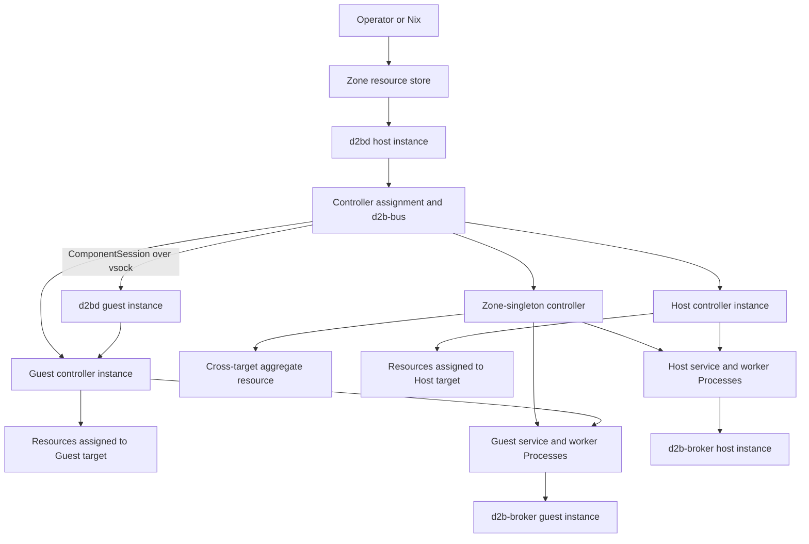
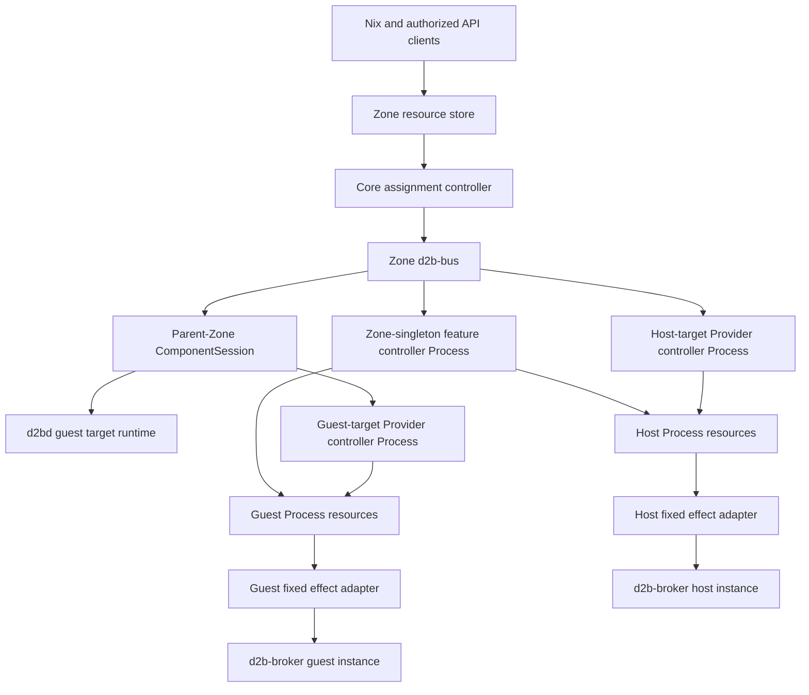
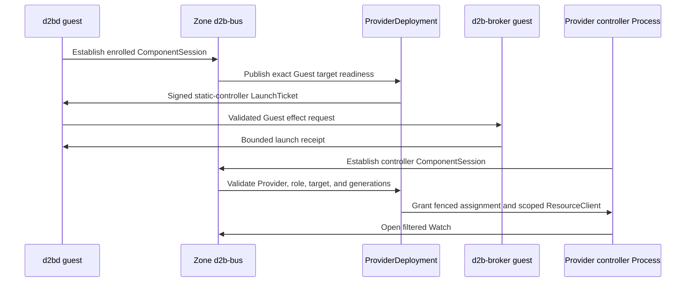
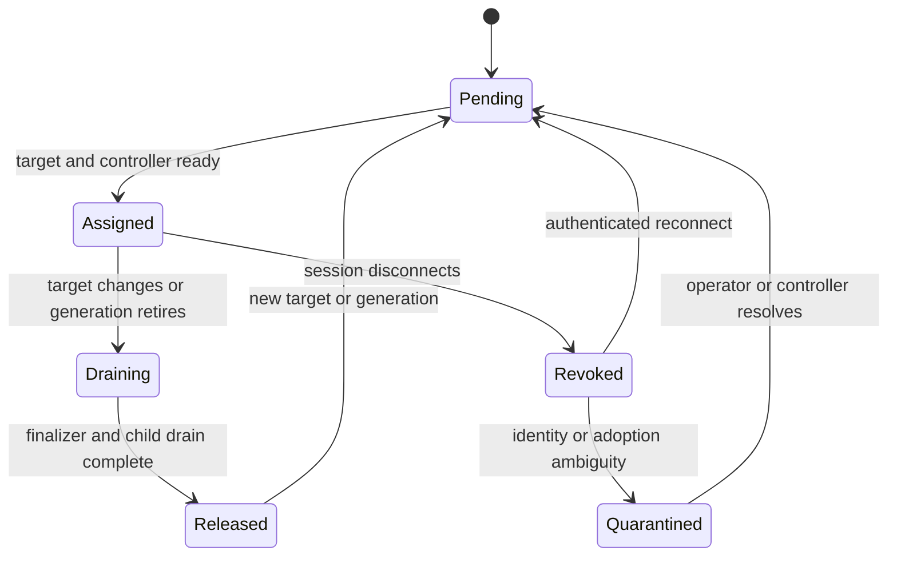
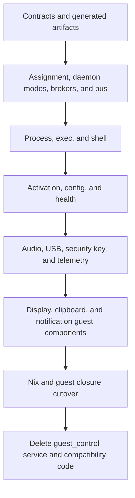

# V3 Guest Control Plane - Plan

## Goal Capsule

- **Objective:** Complete the v3 guest control plane by replacing feature-specific guest RPCs with ComponentSession/d2b-bus resource reconciliation and typed streams.
- **Product authority:** Nix and the Zone resource store remain authoritative. Each resource has exactly one assigned Provider controller instance.
- **Open blockers:** None.
- **Execution profile:** Deep, security-sensitive refactor with contract-first sequencing and a clean-break removal tail.
- **Tail ownership:** The implementation workflow owns validation, independent review, changelog, PR creation, and reviewed-head babysitting.

---

## Product Contract

### Summary

One `d2bd` executable supplies mode-bound Host and Guest daemon instances, and one `d2b-broker` executable supplies separate privileged broker instances for each authority domain.
Both target modes deploy signed Provider controller, service, and worker Processes through the same placement and effect contracts.
The legacy `guest_control.proto` feature API is removed after resource and named-stream parity is complete.

### Problem Frame

The v3 resource model, semantic Service/Binding contracts, Provider packages, ComponentSession runtime, and host-side ZoneBus are already present, but the reachable guest path still uses a dedicated feature RPC surface for exec, shell, configuration reads, USBIP, activation, and audio.
This keeps feature behavior embedded in `d2b-guestd` and `d2bd` bridges instead of using the Provider and ResourceType ownership model.

The current split also leaves controller placement implicit.
Some Provider resources are host authority resources, some are Guest consumer resources, and some ResourceTypes such as `Process`, `EphemeralProcess`, and `NixosGeneration` can target either a Host or a Guest.
A provider-wide `host`, `guest`, or `both` flag cannot express those cases without duplicate reconciliation or provider-specific routing.

The end state needs one standard placement model, one guest transport, one reconciler per resource, and a removal proof for the old RPC path.

### Actors

- A1. **Operator:** Authors Nix resources or uses an authorized Resource API client.
- A2. **Zone authority:** Owns the authoritative resource store, d2b-bus routing, policy, controller assignment, and operation ledger.
- A3. **Guest target daemon:** Runs `d2bd guest`, establishes the parent-Zone ComponentSession, and owns target-local ProviderDeployment without a local Zone store or public API.
- A4. **Provider controller instance:** Reconciles the ResourceTypes assigned to its signed controller role on one resolved placement.
- A5. **Provider service or worker:** Serves typed ComponentSession methods or performs narrowly scoped work without ResourceClient authority.
- A6. **Gateway Guest:** Hosts a child Zone and may therefore run full `d2bd`; it is not an ordinary workload Guest.
- A7. **Local privileged broker:** Runs one mode-bound `d2b-broker` instance for one daemon or realm authority and executes only the sealed effect catalog allowed by that mode.

### Key Decisions

- **Use shared daemon and broker executables with mode-bound instances.** (session-settled: user-directed - chosen over separate compile-time Host/Guest binaries or one process multiplexing both authorities: maximize Host/Guest symmetry while preserving process, socket, state, audit, and profile boundaries.) Governs R1-R5, R44-R50.
- **Provider controllers remain separate target-local Processes.** (session-settled: user-directed - chosen over embedding every Provider controller inside the host or guest daemon: preserve the accepted Provider package, component, and isolation model.) Governs R13-R17.
- **Use target-scoped controller instances instead of a literal `both` placement.** (session-settled: user-directed - chosen over separate host/guest controller roles or one central Zone controller: one role can support Host and Guest while each resource still has one owner.) Governs R6-R12, R23-R25.
- **ComponentSession/d2b-bus is the only guest control plane.** (session-settled: user-directed - chosen over retaining bootstrap, health, exec, or recovery RPCs beside the bus: avoid two permanent control contracts.) Governs R4-R5, R27-R34, R40-R42.
- **Bindings are explicit semantic consumer intent, not a placement marker.** (session-settled: user-directed - chosen over controller-created Bindings or a Binding for every Host-to-Guest relationship: use Service/Binding only for independently selectable and projectable capabilities.) Governs R18-R22.
- **Direct Guest resources do not require Bindings.** (session-settled: user-directed - chosen over wrapping every Guest resource in a Binding: Bindings exist only to connect an independently owned Service to a consumer.) Governs R23-R26.
- **No resource has concurrent host and Guest reconcilers.** (session-settled: user-directed - chosen over split status or finalizer ownership on one resource: preserve deterministic lifecycle and restart ownership.) Governs R8-R12, R35-R37.
- **Controllers create child resources and never spawn feature processes directly.** (session-settled: user-directed - chosen over controller-owned subprocesses: Process Providers and fixed effect owners retain launch, adoption, and stop authority.) Governs R13-R15, R43.
- **Brokers are privileged effect executors, never resource controllers.** (session-settled: user-directed - chosen over privileged controllers or privileged network-facing daemons: keep root mutation behind a small socket-activated process with no ResourceClient.) Governs R14-R17, R43-R49.

### Controller Placement Model

The signed Provider contract separates controller ownership, instance scope, and supported target kinds:

- A controller role names the ResourceTypes it exclusively reconciles.
- Instance scope is closed to `zone-singleton`, `fixed-execution-target`, or `per-resource-target`.
- Supported targets are independent capabilities: Host, Guest, or both.
- Every target-local ResourceType exposes one canonical placement anchor through its registered contract.
- Core resolves the anchor, creates or selects one controller instance at that placement, and routes only that instance's resources to it.
- "Both" means one implementation supports both target kinds; it never means two instances reconcile the same resource.
- Zone-singleton controllers may reconcile aggregate resources that coordinate Host and Guest child resources.

For `Provider/system-systemd`, one controller role owns `Process` and `EphemeralProcess`, supports Host and Guest targets, and has `per-resource-target` scope.
A `Process` with `spec.executionRef = Host/host-system` routes to the Host instance.
A `Process` with `spec.executionRef = Guest/dev-vm` routes to the controller instance inside that Guest.

### Requirements

**Daemon modes and transport**

- R1. One `d2bd` executable MUST expose fixed `host` and `guest` modes whose authority is selected at process start and cannot be widened by a request.
- R2. `d2bd guest` MUST NOT have live access to a local Zone store, public operator socket, host or realm credentials, host audit custody, or Host controller authority.
- R3. A Gateway Guest MAY run separate `d2bd guest` and `d2bd host` instances for its parent-Guest and child-Zone roles; the instances MUST use separate sockets, state, audit, identities, and broker authorities.
- R4. `d2bd guest` MUST establish the authenticated parent-Zone ComponentSession used for d2b-bus routing and typed named streams.
- R5. Both daemon modes MUST use the same ProviderDeployment, controller-session, assignment, and child-resource contracts while exposing only the capabilities valid for their mode.

**Provider controller ownership and placement**

- R6. Every signed Provider controller role MUST declare the ResourceTypes it exclusively owns.
- R7. Every controller role MUST declare exactly one closed instance scope: Zone singleton, fixed execution target, or per-resource target.
- R8. A controller role MAY support both Host and Guest target kinds, but each resource MUST resolve to exactly one controller instance.
- R9. Every target-local ResourceType MUST define one canonical placement anchor in its registered contract; arbitrary provider code or free-form field paths MUST NOT select controller placement.
- R10. Core MUST derive controller assignment from the committed resource, Provider generation, placement anchor, and target readiness before granting reconcile authority.
- R11. Controller assignment MUST be revision- and generation-fenced so stale sessions cannot update status, finalizers, or owned children.
- R12. Moving a resource between targets MUST drain and release the old assignment before the new target receives authority.

**Provider component deployment**

- R13. Provider controller components MUST remain separate signed Processes except for the fixed bootstrap controllers already defined by the v3 Provider model.
- R14. ProviderDeployment MUST create target-local controller Processes from signed component descriptors and MUST NOT let a Provider controller bootstrap itself.
- R15. Provider service and worker components MUST retain their existing narrow authority: services expose typed methods without ResourceType ownership, and workers receive no ResourceClient.
- R16. A controller instance MUST receive a ResourceClient capability restricted to its owned ResourceTypes, assigned target, allowed verbs, Provider generation, and controller generation.
- R17. A Guest controller instance MUST NOT read or mutate host-only resources, sibling Guest resources, Resource specs, credentials, Roles, RoleBindings, or another controller's status.

**Service and Binding resources**

- R18. Service resources MUST represent independently owned producer authority or semantic capability.
- R19. Binding resources MUST be authored by Nix, an operator, or an authorized API client and MUST select an existing same-Zone Service plus an allowed consumer target.
- R20. A Service controller MUST NOT create consumer Bindings or write Binding status.
- R21. A Binding controller MUST reconcile only the Binding and its authorized child resources; its placement MAY be Zone-singleton, Host-local, or Guest-local according to the signed controller role.
- R22. The initial Service/Binding coverage MUST include audio, USB, security key, and telemetry without turning provider-specific implementation details into the provider-neutral base types.

**Direct target-local resources**

- R23. `Process` and `EphemeralProcess` MUST route by `executionRef` and MUST retain one status shape across Host and Guest targets.
- R24. `NixosGeneration`, `ShellSession`, and other target-local qualified ResourceTypes MUST route through their registered placement anchor without an additional Binding.
- R25. `WaylandSession` MUST remain the user-authored cross-target display aggregate reconciled by the Zone-singleton display controller and MUST NOT gain a redundant generic display Binding.
- R26. Stable endpoints produced by target-local resources MUST remain `Endpoint` resources, while per-session handles, descriptor indexes, and named-stream IDs remain internal.

**Guest-control replacement and parity**

- R27. The v3 end state MUST remove the feature-specific `guest_control.proto` service and every production caller.
- R28. Exec and persistent shell lifecycle MUST use `Process`, `EphemeralProcess`, or `ShellSession` resources, while stdin, output, resize, attach, and cancellation use authenticated named streams.
- R29. Guest activation MUST use `activation-nixos.d2bus.org.NixosGeneration` plus target-local `EphemeralProcess` execution.
- R30. Guest audio mutation and observation MUST use `audio.d2bus.org.AudioBinding` reconciliation.
- R31. Guest USBIP mutation and observation MUST use `usb.d2bus.org.UsbBinding` reconciliation and typed Provider effects.
- R32. Guest health, capabilities, boot identity, and controller readiness MUST be projected through authenticated session evidence and resource or Endpoint status rather than a parallel health RPC.
- R33. Bounded guest configuration exchange MUST use a typed resource, service, Volume, or projection contract and MUST NOT preserve a generic file-path RPC.
- R34. Existing authorized CLI capabilities MUST remain available through Resource API operations and named streams, with no SSH or generic tunnel fallback.

**Failure, restart, and security behavior**

- R35. Loss of a Guest ComponentSession MUST revoke that Guest's controller assignments and make affected resources stale, Unknown, or Degraded without transferring reconciliation to the host.
- R36. Reconnect MUST bind Guest identity, boot identity, Provider generation, controller generation, placement, and assignment epoch before reconciliation resumes.
- R37. Target-local controllers MUST adopt or quarantine existing children before cleanup, following the repository's restart and single-repair-owner rules.
- R38. A compromised workload Guest MUST NOT gain authority over host Services, host mutations, sibling Guests, Zone policy, remote realm credentials, or the Zone resource store.
- R39. Audit and telemetry MUST retain bounded, redacted labels and MUST NOT include resource payloads, argv, terminal bytes, credentials, paths, endpoint locators, or Guest-provided identity strings.

**Clean break and removal**

- R40. The v3 cutover MUST fail closed for old Guest generations rather than retaining a compatibility or fallback feature API.
- R41. Schema, manifest, Provider descriptors, Nix emitters, reference documentation, migration records, policy tests, and changelog MUST move together.
- R42. Removal proof MUST show that no production path calls the retired guest-control feature methods and that no ordinary Guest starts a host-authority daemon profile.
- R43. A Provider controller that needs runtime work MUST create `Process` or `EphemeralProcess` resources and observe their status; it MUST NOT directly spawn, adopt, signal, or reap feature child processes.
- R44. One `d2b-broker` executable MUST expose fixed `host` and `guest` profiles selected at process start; no broker request may select or widen the active profile.
- R45. Every daemon or realm authority MUST use a separate broker process, socket, state root, audit root, caller identity, and sealed profile even when another authority on the same machine uses the same executable.
- R46. A broker instance MUST have no ResourceClient, reconcile loop, d2b-bus route, public socket, or authority to create resource intent; it only executes typed effects authorized by the calling daemon's fixed effect adapter.
- R47. Signed Provider packages MUST declare concrete controller, service, and worker artifacts plus required effect classes for every Host or Guest target kind they advertise.
- R48. Host and Guest services on the same OS and architecture MUST use the same `d2bd` and `d2b-broker` artifact digests.
- R49. Both broker profiles MUST authenticate the local socket peer with kernel peer credentials before decoding an effect request and MUST bind that identity to the sealed authority profile.
- R50. `d2bd guest` MUST derive boot identity from the kernel boot identity and bind it to the enrolled Guest identity and ComponentSession transcript.

### Key Flows

- F1. Guest bootstrap and enrollment
  - **Trigger:** An ordinary workload Guest boots or reconnects.
  - **Actors:** A2, A3, A7.
  - **Steps:** `d2bd guest` establishes an authenticated ComponentSession; the Zone verifies Guest identity and generation; the Guest broker profile becomes available for admitted local effects; controller placement eligibility becomes available.
  - **Outcome:** The Guest can host only controller instances and streams authorized for its exact target.
  - **Covered by:** R1-R5, R35-R38, R44-R47.

- F2. Target-local controller deployment
  - **Trigger:** A Ready Provider declares a controller role whose scope resolves to a Host or Guest.
  - **Actors:** A2, A3, A4.
  - **Steps:** Core validates the signed descriptor and placement; creates the controller Process on the resolved target; binds a scoped ResourceClient; admits the controller generation.
  - **Outcome:** One controller instance owns reconciliation for its assigned ResourceTypes and target.
  - **Covered by:** R6-R17.

- F3. User-authored Service and Binding realization
  - **Trigger:** The operator creates a Binding referencing a Ready Service and allowed Guest.
  - **Actors:** A1, A2, A4, A5.
  - **Steps:** The Service controller retains producer authority; Core routes the Binding to its signed controller placement; the Binding controller creates authorized Host or Guest child resources as required.
  - **Outcome:** Host capability and Guest consumption converge without either controller writing the other's resource.
  - **Covered by:** R18-R22, R43.

- F4. Direct Guest resource reconciliation
  - **Trigger:** A target-local resource names a Guest placement anchor.
  - **Actors:** A1, A2, A3, A4.
  - **Steps:** Core resolves the Guest target; routes the resource to the matching controller instance; the controller creates child resources rather than spawning processes; interactive data uses named streams.
  - **Outcome:** Direct Guest resources need no synthetic Binding or feature-specific guest RPC.
  - **Covered by:** R23-R34, R43.

- F5. Placement handoff
  - **Trigger:** An authorized update changes a resource's target.
  - **Actors:** A2, A4.
  - **Steps:** Core fences new writes; the old controller drains and releases ownership; Core advances the assignment epoch; the new target controller adopts or creates children.
  - **Outcome:** No interval has two active reconcilers for one resource.
  - **Covered by:** R10-R12, R35-R37.

- F6. Guest disconnect and recovery
  - **Trigger:** A Guest stops, crashes, or loses its ComponentSession.
  - **Actors:** A2, A3, A4.
  - **Steps:** The session and controller leases revoke; resources become stale without host takeover; reconnect revalidates identity and assignment; controllers adopt or quarantine children.
  - **Outcome:** Restart preserves single ownership and fails closed on ambiguity.
  - **Covered by:** R35-R39.

- F7. Local privileged effect execution
  - **Trigger:** A Process Provider or fixed effect adapter receives an admitted LaunchTicket.
  - **Actors:** A2, A3, A4, A7.
  - **Steps:** The unprivileged daemon validates resource and assignment authority; its fixed adapter sends a typed effect request to the mode-bound local broker; the broker revalidates caller identity, profile, and sealed intent before mutation.
  - **Outcome:** Host and Guest effects share one protocol model without sharing authority instances or giving controllers root access.
  - **Covered by:** R14-R17, R43-R47.

### Acceptance Examples

- AE1. Host-target Process
  - **Covers R8-R12, R23.**
  - **Given:** `Process/example` selects `Provider/system-systemd` and `executionRef = Host/host-system`.
  - **When:** Core assigns the resource.
  - **Then:** Only the `system-systemd` controller instance on `Host/host-system` receives reconcile authority.

- AE2. Guest-target Process
  - **Covers R8-R12, R23.**
  - **Given:** `Process/example` selects `Provider/system-systemd` and `executionRef = Guest/dev-vm`.
  - **When:** The Guest controller instance is authenticated and Ready.
  - **Then:** Only that Guest's `system-systemd` controller instance receives the resource and may write its status.

- AE3. User-authored audio Binding
  - **Covers R18-R22, R30.**
  - **Given:** An operator-authored `AudioBinding` references a Ready host `AudioService` and `Guest/dev-vm`.
  - **When:** The Binding is admitted.
  - **Then:** The Service controller keeps Service authority, the Binding controller creates the required Host and Guest child resources from its signed placement, and neither controller writes the other's resource.

- AE4. No automatic Binding
  - **Covers R19-R20.**
  - **Given:** An `AudioService` becomes Ready and no `AudioBinding` exists.
  - **When:** The Service controller reconciles.
  - **Then:** No consumer Binding is created and no Guest receives audio access.

- AE5. Target migration
  - **Covers R10-R12, R35-R37.**
  - **Given:** A target-local resource is assigned to `Guest/old` and an authorized update selects `Guest/new`.
  - **When:** The update commits.
  - **Then:** The old controller drains under the old assignment epoch before the new controller can write or create children.

- AE6. Guest disconnect
  - **Covers R35-R38.**
  - **Given:** A Guest owns active Binding and Process reconciliation.
  - **When:** Its ComponentSession disconnects.
  - **Then:** Its assignments revoke, affected resources become stale or degraded, and no host controller assumes ownership.

- AE7. Retired guest RPC
  - **Covers R27-R34, R40-R42.**
  - **Given:** The v3 cutover is active.
  - **When:** A caller attempts a retired guest-control feature method.
  - **Then:** No production service or fallback handles the request; the corresponding Resource API or named-stream path is the only supported route.

- AE8. Gateway Guest exception
  - **Covers R1-R3, R44-R46.**
  - **Given:** A Guest is configured as the gateway and authority for a child Zone.
  - **When:** Its control plane starts.
  - **Then:** It runs separate `d2bd guest` and `d2bd host` instances plus separate broker instances for the parent and child authorities, even though each pair uses the same executable.

- AE9. Broker profile cannot widen
  - **Covers R44-R49.**
  - **Given:** A `d2b-broker guest` instance is started with the sealed Guest effect profile.
  - **When:** An authenticated caller requests a Host-only operation or attempts to select the Host profile.
  - **Then:** The broker rejects the request before mutation and records only bounded refusal metadata.

- AE10. Same-platform artifact identity
  - **Covers R1, R44, R48.**
  - **Given:** Host and Guest service definitions target the same OS and architecture.
  - **When:** Nix resolves their daemon and broker packages.
  - **Then:** Both service definitions reference the same daemon artifact digest and the same broker artifact digest while starting different modes, profiles, sockets, and authority roots.

### Success Criteria

- Every current guest-control capability has a resource, typed service, or named-stream owner with equivalent authorized behavior.
- Every reconciled resource resolves to one controller role, one placement, one generation, and one active assignment epoch.
- Provider manifests can express Host-only, Guest-only, Zone-singleton, and Host-or-Guest target-local controllers without a literal dual-reconciler mode.
- User-authored Bindings remain the only way to express consumer intent for semantic Services.
- Service/Binding is used only for independently selectable and projectable producer capabilities with durable consumer intent.
- Ordinary workload Guest service configuration starts only `d2bd guest` and Guest-profile broker instances, with no live local Zone store, public daemon socket, Host controller assignment, or host credentials.
- Host and Guest targets deploy Provider components through one signed placement and effect model.
- Host and Guest services on the same OS and architecture consume identical daemon and broker artifact digests.
- Gateway Guests use separate daemon and broker instances for parent and child authority domains.
- Old guest-control RPC definitions, callers, compatibility branches, documentation, and policy allowances are absent after cutover.
- Restart, disconnect, reassignment, and stale-session tests prove no dual ownership or host takeover.
- Static and dynamic analysis finds no feature controller that directly spawns or owns a child process outside a `Process` or `EphemeralProcess` resource.

### Scope Boundaries

- No compatibility mode for old guest-control generations after the v3 clean break.
- No generic raw exec, file, port-forward, D-Bus, broker, or network tunnel.
- No host authority, realm credentials, remote node registry, or Zone audit custody in ordinary workload Guests.
- No automatic creation of user-policy Bindings by Service or Provider controllers.
- No requirement that transient notification delivery, clipboard payloads, terminal bytes, or device media streams become resources.
- No request-driven daemon or broker mode switching.
- No broker process shared across realm, Zone, parent-Guest, or child-Zone authority domains.

### Dependencies and Assumptions

- ComponentSession, d2b-bus, the Resource API, Provider packages, and target-local Process contracts remain the v3 foundation.
- The authoritative Zone resource store remains outside ordinary workload Guests.
- Provider packages can supply concrete controller, service, and worker artifacts plus effect requirements for every target kind they advertise.
- Core can fence controller assignments by resource revision, Provider generation, controller generation, session generation, and placement epoch.
- The clean-break migration may change internal protocols and package composition while preserving authorized operator capabilities.

### Sources and Research

- `STRATEGY.md`
- `docs/adr/0015-daemon-only-clean-break.md`
- `docs/adr/0028-guest-control-plane-over-vsock.md`
- `docs/adr/0043-realm-native-control-plane.md`
- `docs/adr/0046-d2b-3-provider-control-plane.md`
- `docs/specs/ADR-046-components-processes-and-sandbox.md`
- `docs/specs/ADR-046-componentsession-and-bus.md`
- `docs/specs/ADR-046-provider-model-and-packaging.md`
- `docs/specs/ADR-046-resources-host-guest-process-user.md`
- `docs/specs/providers/README.md`
- `packages/d2b-contracts/proto/guest_control.proto`
- `packages/d2b-provider/src/installation.rs`
- `packages/d2b-provider-system-systemd/`
- `packages/d2b-provider-system-minijail/`
- `packages/d2bd/src/resource_runtime.rs`
- `packages/d2bd/src/audio_resource_runtime.rs`
- `packages/d2b-guestd/`
- `nixos-modules/resources-sharing.nix`

---

## Planning Contract

### Product Contract Preservation

Product Contract changed by confirmed clarification: R21 and R25 separate semantic resource shape from controller placement; R43 makes resource-backed child execution mandatory; R44-R47 establish shared daemon/broker executables with separate mode-bound authority instances. No capability scope was removed.

### Key Technical Decisions

- KTD1. **Split placement declaration from placement resolution.** Extend signed controller component descriptors with instance scope and supported target kinds. Extend each owned ResourceType binding with one closed placement anchor. This instantiates R6-R12 without provider-defined field paths.
- KTD2. **Core owns assignment; controllers own filtered watches.** Add a Core controller-assignment state machine that issues one consumed, assignment-scoped ResourceClient lease after one atomic admission check. Resource revision comes from the current store transaction, Provider and controller generations come from installed registrations, session generation comes from the authenticated ComponentSession, and placement epoch comes from the assignment record. Watches and mutations are non-widenable and withdraw with the lease. No controller receives a direct store handle or clonable admission token. `d2bd` stops owning feature-specific watch loops after each family migrates.
- KTD3. **Use one `d2bd` artifact per OS and architecture with fixed host and guest subcommands.** (session-settled: user-directed - chosen over separate Host/Guest programs or mode-specific builds: the same platform artifact digest must run both roles while live authority remains bound to process mode and sealed configuration.) Reuse vsock port `14318` for `d2bd guest`. ComponentSession handshake mismatch makes old peers fail closed.
- KTD4. **Bootstrap the first controller through the local broker.** Core ProviderDeployment sends a signed static-component LaunchTicket over the authenticated Guest session. The fixed Guest effect adapter forwards the admitted ticket to `d2b-broker guest`. The controller then establishes its own ComponentSession and receives its assignment. No controller self-authorizes or self-launches.
- KTD5. **Represent all feature child execution as resources.** (session-settled: user-directed - chosen over controller-owned subprocesses: preserve Process Provider launch, adoption, stop, and audit authority.) Controllers create `Process` or `EphemeralProcess` resources and observe status. Fixed effect adapters validate tickets; local brokers execute them. This implements R13-R15 and R43-R46.
- KTD6. **Use Service/Binding only for D096 semantic sharing.** A Service has independent producer authority and may be exported or projected. Core remains the sole owner of `ResourceExport`, `ResourceImport`, and projection Service creation. Provider controllers reconcile authored Bindings and their children. Controller placement remains independent. Aggregate resources such as `WaylandSession` own cross-target child resources directly.
- KTD7. **Add a service-only config-management Provider.** (session-settled: user-approved - chosen over extending activation, runtime, or daemon components: the accepted activation boundary assigns guest-editable config to a separate Provider and daemon modes must remain feature-neutral.) Introduce `Provider/config-nixos` with a target-local guest config reader service and a host-side staging client. It preserves the closed guest-config identifier and bounded content contract without adding a generic file API.
- KTD8. **Expose Guest health through session and resource state.** The runtime Provider consumes authenticated ComponentSession evidence and writes `Guest` and `Endpoint` observations. No guest health service remains after cutover.
- KTD9. **Migrate one capability family at a time with one reachable owner.** A family may retain its old RPC until its replacement is validated, but bundle policy selects exactly one path. Remove the caller before removing the method. The final cutover is synchronized: the host enables the new-only path only when every enabled Guest is stopped or proves the matching ComponentSession contract. The last reversible boundary is before U10 removes the shared legacy service; after that point rollback is a whole-head revert, never a compatibility shim.
- KTD10. **Retain last observation but revoke mutation authority immediately.** Disconnect or generation replacement closes assignments and watches. Readers may see the last committed status marked stale or Unknown. Ambiguous live ownership remains untouched under the narrowest degraded scope until adoption proof or operator repair. Old controllers cannot update status or clear finalizers.
- KTD11. **Generate public artifacts from contract sources.** Update Rust contract sources and xtask generators first. Regenerate schemas, provider catalog shapes, semantic ResourceType lists, fixtures, and guest workspace locks. Do not hand-edit generated outputs.
- KTD12. **Commit assignment and ownership indexes atomically.** Recheck resource revision and current assignment in one store transaction. Update assignment, status/finalizers, owner indexes, and revision log together. Dispatch external effects only after commit.
- KTD13. **Delete children before releasing parent ownership.** The owning controller adopts or quarantines every live child, reaches verified terminal state, commits child deletion and owner-index removal, then clears the parent finalizer. A missing or ambiguous child blocks narrow cleanup rather than authorizing a broad sweep.
- KTD14. **Use one `d2b-broker` artifact per OS and architecture with fixed host and guest profiles.** (session-settled: user-directed - chosen over separate broker programs, mode-specific builds, or one broker process multiplexing authorities: share framing and effect contracts while preserving separate root processes, sockets, state, audit, caller identities, and operation catalogs.) The profile is selected at process start and cannot be changed by a request.
- KTD15. **Deploy Providers through one target-runtime contract.** Host and Guest daemon modes run the same ProviderDeployment and component-session machinery. Package admission fails unless every advertised target kind has a concrete signed artifact and required EffectPort classes supported by that target profile.
- KTD16. **Make the shared daemon and broker artifacts platform-portable.** Keep Host-mode core code such as the Zone store, public socket, and realm routing in the shared `d2bd` artifact, but initialize it only in Host mode. Move feature Provider implementations and all privileged mutation behind signed Provider Processes, fixed EffectPorts, and `d2b-broker`. One same-platform build must expose both modes.
- KTD17. **Derive Guest boot identity from the kernel boot identity.** `d2bd guest` reads the current kernel boot ID, binds it to the enrolled Guest identity and session transcript, and never treats writable Guest state as boot authority.

### High-Level Technical Design

#### Component topology

#### Guest bootstrap and controller admission

#### Assignment lifecycle

#### Capability cutover

### Sequencing

1. Land placement contracts and generated artifacts without changing runtime behavior.
2. Land the assignment engine, shared daemon modes, shared broker profiles, scoped Resource API watches, and Guest ComponentSession substrate.
3. Land target-local Process controller deployment and conformance before migrating feature families.
4. Migrate capability families in dependency order. Keep one reachable path per family.
5. Cut Nix and bundle generation to the new Guest shape.
6. Remove the legacy protocol, bridges, policy allowances, and obsolete tests.

The units may land as ordered reviewed pull requests. Every intermediate head must compile, pass its applicable gates, and keep one authoritative path for each capability.

### System-Wide Impact

- **Security:** Changes Guest authentication, controller RBAC, status/finalizer mutation authority, and the host/Guest trust boundary.
- **Session authority:** Exact subject, Zone, target, controller generation, and assignment epoch become load-bearing inputs to every controller watch and mutation.
- **Privilege separation:** Both execution targets gain an unprivileged daemon instance plus a separate root broker instance with a fixed local effect profile.
- **Resource lifecycle:** Adds assignment epochs and target handoff to Provider generation, reconnect, adoption, and cleanup.
- **Provider packaging:** Changes signed component descriptors, generated catalogs, controller placement, and Guest package closures.
- **CLI:** Preserves command behavior while replacing exec, shell, activation, config, audio, and USB backends.
- **Nix:** Replaces guest-control service arguments and token plumbing with ComponentSession enrollment and signed controller deployment.
- **Tests:** Retires legacy guest-control coverage only after Resource API, bus, contract, and host-integration successors exist.

### Risks and Mitigations

| Risk | Impact | Mitigation |
| --- | --- | --- |
| Bootstrap cycle between the Guest daemon and first Process controller | Guest never reaches Ready | Use a fixed Core-authored LaunchTicket and Guest-profile broker per KTD4; prove with a real Guest target integration test |
| Two controllers write one resource during target or generation change | Split status, finalizer loss, duplicate processes | Fence every mutation by assignment epoch and require old-owner drain before reassignment |
| Target-local watches leak sibling or host resources | Guest compromise widens authority | Mint closed ResourceClient filters from assignment state; reject caller-supplied selectors that widen them |
| Replayed bootstrap or assignment evidence reopens authority | Stale or foreign controller mutates current resources | Consume admission once, bind exact subject, Zone, generations, and epoch, and reject replay before allocating controller state |
| Reconnect storms exhaust bootstrap or watch capacity | A Guest or controller denies service to its Zone | Enforce per-Guest, per-controller, and Zone-global session and watch caps before handshake allocation or watch creation |
| Family-by-family migration leaves fallback behavior | Silent downgrade and inconsistent audit | Bundle-select one backend per family; add policy tests for no fallback and remove each caller before its method |
| Guest mode can reach host-only live authority | A workload Guest starts a local authority surface that the parent Zone did not grant | Bind mode at process start, omit host store/public config from Guest service units, and deny mode changes through every protocol |
| Shared artifact retains feature implementations or privileged mutation | Guest packaging becomes unbuildable or exposes code outside the daemon's control-plane role | Move feature implementations into Provider Processes and privileged effects into the broker; enforce one same-platform artifact digest in Nix and policy tests |
| One broker instance serves multiple authority domains | Realm or parent/child effects share root mutation and audit custody | Require one broker process, socket, state root, audit root, caller identity, and sealed profile per daemon or realm authority |
| Cross-target aggregate controllers directly spawn children | Process lifecycle bypasses providers | Add source-policy tests and controller conformance proving resource creation only |
| Assignment or child indexes commit partially | Orphaned children, double ownership, or invisible live state | Commit assignment, status/finalizers, owner indexes, and revision log in one redb transaction; fault-inject every commit boundary |
| Generated contracts and Nix emitters drift | Runtime rejects valid bundles or admits invalid placement | Regenerate through xtask and enforce drift plus fixture-contract lanes |
| Real vsock or systemd behavior differs from hermetic tests | Bootstrap works only in mocks | Require one targeted `runNixOSTest` path for enrollment, controller launch, reconnect, and child Process readiness |
| Host and Guest binaries cut over at different times | Enabled Guests become unreachable with no supported path | Gate final cutover on stopped Guests or matching authenticated protocol evidence; keep the rollback boundary before U10 |

### Alternatives Considered

- **Use separate Host and Guest daemon or broker binaries:** rejected after review because shared executables can preserve symmetry without sharing live process authority.
- **Run `d2bd host` as the only Guest process:** rejected because ordinary Guests do not own a local Zone store, public socket, Host assignment, or realm credentials.
- **Embed all controllers in host and Guest daemons:** rejected because it breaks the signed Provider component and process-isolation model.
- **Keep central controllers and use guest effect RPCs:** rejected because feature-specific effect dispatch is the custom embedded path this work removes.
- **Create a Binding for every Host-to-Guest relationship:** rejected because Binding is a D096 semantic sharing contract, not a process-placement marker.
- **Allow feature controllers to spawn processes directly:** rejected because it bypasses Process Provider identity, adoption, quotas, audit, and single repair ownership.

### Documentation and Operational Notes

- Update the binding ADRs and `AGENTS.md` when the controller placement, guest daemon role, or removal contract changes.
- Update Provider dossiers for placement, child-resource ownership, migration, and test evidence.
- Keep CLI reference text behavior-focused; do not leak internal assignment or session identifiers.
- Document daemon and broker mode/profile selection as service-manager-owned startup configuration, never caller input.
- Add one changelog fragment for the complete control-plane change or one fragment per independently landed migration phase.
- Treat old Guest generations as incompatible after the final cutover. Surface typed remediation instead of fallback.
- Before U9 cutover, maintain a family inventory of every legacy caller, method, generated artifact, Nix input, and replacement owner. Stop when any row lacks a validated replacement.
- After U10 begins, rollback is whole-head revert only. Do not restore guest-control methods, feature flags, or dual routing.
- Observe the first deployed cutover for retired-method calls, stale-epoch mutation attempts, direct-spawn denials, unexpected Guest host-daemon profiles, reconnect saturation, and assignment quarantine.

---

## Implementation Units

| Unit | Title | Primary files | Depends on |
| --- | --- | --- | --- |
| U1 | Define controller placement contracts | Provider contracts, provider toolkit, generators | None |
| U2 | Build assignment and scoped watch routing | Core controller, bus, Resource API/client | U1 |
| U11 | Unify broker executable and profiles | Broker wire, host/guest broker services, policy tests | U1 |
| U3 | Add host and guest modes to d2bd | Daemon runtime, session vsock, ProviderDeployment | U1, U2, U11 |
| U4 | Deploy target-local Process controllers | Process Providers, conformance, ProviderDeployment | U1-U3, U11 |
| U5 | Migrate exec and shell | Process attach, shell Provider, CLI/daemon routes | U2-U4 |
| U6 | Migrate activation, config, and health | Activation Provider, config Provider, runtime status | U2-U4 |
| U7 | Migrate semantic Service/Binding families | Audio, USB, security key, telemetry Providers | U2-U4 |
| U8 | Migrate display and interaction components | Display, clipboard, notification Providers | U2-U4 |
| U9 | Cut Nix and Guest packaging to ComponentSession | Nix modules, provider catalogs, target profiles | U3-U8, U11 |
| U10 | Remove legacy guest control and prove parity | Contracts, daemon bridges, policy/docs, full tests | U1-U9, U11 |

### U1. Define controller placement contracts

**Goal:** Add signed, provider-neutral controller role placement and ResourceType placement-anchor contracts.

**Requirements:** R6-R10, R13-R17, R23-R25, R47-R48.

**Dependencies:** None.

**Files:**

- `packages/d2b-contracts/src/v3/provider.rs`
- `packages/d2b-provider/src/installation.rs`
- `packages/d2b-provider/src/descriptor.rs`
- `packages/d2b-provider/src/registry.rs`
- `packages/d2b-provider-toolkit/src/manifest.rs`
- `packages/d2b-provider-toolkit/src/registration.rs`
- `packages/xtask/src/provider_packaging.rs`
- `nixos-modules/generated/provider-catalog-shape.nix`
- `packages/d2b-provider/tests/runtime.rs`
- `packages/d2b-contract-tests/tests/policy_provider_crates.rs`
- `docs/specs/ADR-046-provider-model-and-packaging.md`
- `docs/specs/ADR-046-components-processes-and-sandbox.md`

**Approach:**

1. Add closed controller instance-scope and supported-target contracts to controller component descriptors.
2. Add a closed placement-anchor contract to owned ResourceType API bindings.
3. Validate one controller owner per ResourceType, compatible target kinds, bounded cardinality, and no free-form selectors.
4. Require a concrete signed component artifact and supported EffectPort set for every advertised target kind.
5. Require Host and Guest placements on the same OS and architecture to resolve the same component artifact digest.
6. Extend provider package generation and catalog parity checks.

**Patterns to follow:**

- `ComponentDescriptor::new` authority separation in `packages/d2b-contracts/src/v3/provider.rs`.
- Provider trust-before-compatibility admission in `packages/d2b-provider/src/installation.rs`.
- Existing semantic schema and provider-catalog xtask generation.

**Test scenarios:**

- A controller role with `per-resource-target` scope and Host+Guest support round-trips canonically.
- Duplicate controller ownership for one ResourceType is rejected.
- A controller placement anchor incompatible with the ResourceType schema is rejected.
- A service or worker component attempting to claim ResourceType ownership is rejected.
- An unbounded cardinality or unknown placement discriminant is rejected.
- A Provider that advertises Host or Guest support without a concrete controller artifact or required effect capability is rejected before installation.
- Same-platform Host and Guest component declarations that resolve different artifact digests are rejected.
- Generated provider catalog and signed manifest fields remain byte-stable after regeneration.

**Verification:** Contract tests pin the canonical vectors, provider installation rejects malformed placement, policy tests preserve component authority, and generated catalog drift is clean.

### U2. Build assignment and scoped watch routing

**Goal:** Assign each resource to one controller instance and enforce scoped Resource API watches and mutations.

**Requirements:** R8-R12, R16-R17, R35-R39.

**Dependencies:** U1.

**Files:**

- `packages/d2b-core-controller/src/controller_assignment.rs`
- `packages/d2b-core-controller/src/lib.rs`
- `packages/d2b-bus/src/router.rs`
- `packages/d2b-bus/src/registry.rs`
- `packages/d2b-bus/src/authorization.rs`
- `packages/d2b-bus/src/lifecycle.rs`
- `packages/d2b-resource-api/src/authz.rs`
- `packages/d2b-resource-api/src/watch.rs`
- `packages/d2b-resource-client/src/zone_client.rs`
- `packages/d2b-resource-client/src/target.rs`
- `packages/d2b-resource-store-redb/src/transaction.rs`
- `packages/d2b-resource-store-redb/src/ownership.rs`
- `packages/d2b-resource-store-redb/src/revision_log.rs`
- `packages/d2b-resource-store-redb/src/tests.rs`
- `packages/d2bd/src/resource_runtime.rs`
- `packages/d2bd/tests/zone_provider_acceptance.rs`
- `packages/d2b-bus/src/session_seam_tests.rs`

**Approach:**

1. Introduce an assignment identity binding resource UID, revision, Provider generation, controller role, target, session generation, and assignment epoch.
2. Resolve placement only from committed resources and signed Provider contracts.
3. Mint ResourceClient filters from the assignment; do not accept widening selectors from controllers.
4. Route controller-owned Watch, Get, status, finalizer, and child-resource operations through the existing bus admission seam.
5. Commit assignment state, status/finalizer state, child owner indexes, and the revision log atomically before dispatching effects.
6. Implement drain, revoke, stale observation, narrow quarantine, and reassignment transitions.

**Execution note:** Start with assignment and stale-writer rejection tests before connecting production watches.

**Patterns to follow:**

- Single-owner registration and reconnect replacement in `packages/d2b-bus/src/registry.rs`.
- Authorization revision binding in `packages/d2b-resource-api`.
- Restart/adoption state machines in `packages/d2b-core-controller/src/export_import_projection.rs`.

**Test scenarios:**

- Covers AE1 and AE2: Host and Guest Process resources resolve to different target instances of one controller role.
- A stale assignment epoch cannot update status or clear a finalizer.
- Replayed admission evidence and a valid assignment from another Guest or Zone cannot open a watch or mutation route.
- A Guest assignment cannot watch host or sibling Guest resources.
- Controller disconnect revokes watches and mutation capability while preserving the last committed observation as stale.
- Provider generation replacement drains the old assignment before admitting the new generation.
- Covers AE5: target change releases the old assignment before the new controller can create children.
- Ambiguous target or missing controller readiness yields Pending or Quarantined without fallback.
- Fault injection at each assignment commit boundary leaves either the old complete assignment or the new complete assignment, never partial indexes.
- Same-revision conflict storms preserve monotonic revision and bounded retry behavior.
- Watch replay from an expired floor or stale `afterRevision` fails closed without decoding superseded ownership.

**Verification:** Bus, Resource API, client, and Core tests prove exact routing, watch filtering, mutation fencing, and deterministic handoff.

### U11. Unify broker executable and profiles

**Goal:** Rename and extend the privileged broker into one mode-bound executable with separate Host and Guest authority instances.

**Requirements:** R14-R17, R43-R49.

**Dependencies:** U1.

**Files:**

- `Cargo.toml`
- `Cargo.lock`
- `packages/d2b-contracts/src/broker_wire.rs`
- `packages/d2b-priv-broker/`
- `packages/d2b-broker/`
- `packages/d2b-provider-supervisor/src/`
- `packages/d2b-process-conformance/src/port.rs`
- `packages/d2b-process-conformance/src/ticket.rs`
- `nixos-modules/host-broker.nix`
- `nixos-modules/guest-broker.nix`
- `tests/unit/nix/cases/broker-socket-activation.nix`
- `tests/unit/nix/cases/broker-caps.nix`
- `tests/unit/nix/cases/guest-broker.nix`
- `packages/d2b-contract-tests/tests/policy_units.rs`
- `packages/d2b-contract-tests/tests/policy_provider_crates.rs`
- `packages/d2b-broker/tests/host_profile.rs`
- `packages/d2b-broker/tests/guest_profile.rs`
- `packages/d2b-broker/tests/profile_separation.rs`

**Approach:**

1. Move the broker package and binary identity to `d2b-broker` while preserving one shared framing and version negotiation contract.
2. Add fixed Host and Guest profiles selected only at process start from sealed service configuration.
3. Bind each profile to a closed operation catalog, caller identity, socket, state root, audit root, and authority domain.
4. Authenticate the local socket peer with kernel peer credentials before decoding any effect request and bind that identity to the sealed broker profile.
5. Keep Provider controllers on neutral EffectPorts. Fixed local adapters are the only broker clients.
6. Reuse typed process launch, systemd, pidfd, identity, and bounded receipt contracts across profiles.
7. Keep Host-only network, device, storage, realm, and allocator operations unreachable in the Guest profile.
8. Build one same-platform broker artifact digest that exposes both profiles.

**Execution note:** Preserve the host broker's socket-activation, audit, capability, and bundle-reload characterization tests before renaming or adding the Guest profile.

**Patterns to follow:**

- Socket-activated broker ownership in `nixos-modules/host-broker.nix`.
- Opaque intent resolution and typed operations in `packages/d2b-contracts/src/broker_wire.rs`.
- Fixed `ProcessLaunchEffectPort` adapter boundary in `packages/d2b-provider-supervisor`.
- Realm-specific broker process, socket, state, and audit separation from ADR 0043.

**Test scenarios:**

- `d2b-broker host` preserves the current host operation catalog, capability bounding set, peer authentication, bundle reload, and audit behavior.
- `d2b-broker guest` admits only Guest-local process and explicitly declared Guest effect classes.
- A request cannot select or change the broker profile.
- An unbound local process, wrong daemon uid, or peer from another broker instance is rejected before request decoding.
- Guest profile rejects every Host-only network, firewall, device, storage, realm, and allocator operation before mutation.
- A caller authenticated for one daemon or realm authority cannot use another broker instance's socket or intent namespace.
- Two broker instances from the same binary keep separate state, audit, sockets, caller identities, and operation catalogs.
- Host and Guest broker services on the same OS and architecture use the same package artifact digest.
- Provider controller crates cannot import the broker wire or open a broker socket.
- Gateway parent-Guest and child-Zone modes use separate broker instances.

**Verification:** Broker unit, real-binary, Nix, policy, and socket-activation tests prove shared implementation with strict profile and instance separation.

### U3. Add host and guest modes to d2bd

**Goal:** Add a Guest target-agent mode to the existing unprivileged daemon executable and share ProviderDeployment behavior across modes.

**Requirements:** R1-R5, R32, R35-R40, R44-R50.

**Dependencies:** U1, U2, U11.

**Files:**

- `packages/d2bd/Cargo.toml`
- `packages/d2bd/src/main.rs`
- `packages/d2bd/src/lib.rs`
- `packages/d2bd/src/target_runtime.rs`
- `packages/d2bd/src/guest_mode.rs`
- `packages/d2bd/src/host_mode.rs`
- `packages/d2bd/src/provider_effects.rs`
- `packages/d2bd/src/portable.rs`
- `packages/d2b-session-unix/src/vsock.rs`
- `packages/d2b-bus/src/session/mod.rs`
- `packages/d2b-provider-toolkit/src/bootstrap.rs`
- `packages/d2b-provider-toolkit/src/session_runtime.rs`
- `packages/d2bd/tests/guest_mode_fail_closed.rs`
- `packages/d2bd/tests/guest_mode_component_session.rs`
- `packages/d2bd/tests/mode_separation.rs`
- `tests/fixtures/guest-rust-workspace/Cargo.toml`
- `packages/Cargo.guest.lock`

**Approach:**

1. Add service-manager-selected `host` and `guest` subcommands with no request-driven mode transition.
2. Reuse vsock port `14318` for the enrolled Guest ComponentSession listener.
3. Replace HMAC guest-control service admission with ComponentSession identity, purpose, schema, limits, and reconnect binding.
4. Share ProviderDeployment, controller-session, assignment-client, and child-resource machinery across modes.
5. Keep Host-mode Zone store, public socket, and realm routing code in the shared artifact, but initialize those modules only in Host mode.
6. Move feature Provider implementations and all privileged mutation out of the daemon process and behind Provider Processes, fixed EffectPorts, and the local broker.
7. Keep Host store/public/realm surfaces inactive and unavailable in Guest mode.
8. Route privileged Host and Guest effects only through the local fixed adapter and the mode-bound broker instance.
9. Bind Guest enrollment to the kernel boot ID plus enrolled Guest identity.
10. Build one same-platform daemon artifact digest that exposes both modes.
11. Enforce session, controller-launch, watch, and stream admission caps before allocating per-request state.

**Execution note:** Preserve host daemon and guest daemon fail-closed characterization tests while consolidating the executable.

**Patterns to follow:**

- Owned vsock transport in `packages/d2b-session-unix/src/vsock.rs`.
- Provider bootstrap admission in `packages/d2b-provider-toolkit/src/bootstrap.rs`.
- Current unprivileged `d2bd` systemd hardening and capability-free service profile.
- Current `d2b-guestd` bounded limits and zero-unsafe posture as migration evidence.

**Test scenarios:**

- `d2bd host` retains the Zone store, public socket, broker client, assignment, and routing surface.
- `d2bd guest` establishes one parent-Zone ComponentSession and advertises only Guest target-agent services.
- Host and Guest services on the same OS and architecture execute the same package artifact digest.
- A request cannot select or transition the daemon mode.
- An old guest-control prelude or wrong ComponentSession schema fails before feature data is exposed.
- Wrong Guest identity, boot identity, Zone, purpose, or reconnect generation is rejected.
- A writable Guest file cannot substitute for the kernel boot identity during reconnect.
- Replayed bootstrap evidence, reconnect floods, and controller-launch floods are rejected within bounded admission budgets.
- Guest mode cannot open or materialize a local Zone store, public socket, Host assignment, or realm credential path.
- Guest mode can connect only to its own Guest-profile broker instance.
- Disconnect closes controller deployment and assignment leases.
- Reconnect with the same Guest and new session generation succeeds only after stale state revocation.
- The real binary enforces frame, stream, concurrency, and shutdown limits.

**Verification:** Real-binary tests prove mode separation, Guest enrollment, broker binding, and fail-closed boundaries; guest workspace drift and supply-chain tests accept the shared executable.

### U4. Deploy target-local Process controllers

**Goal:** Launch signed Provider controller Processes on Host and Guest targets without controller self-bootstrap or direct process spawning.

**Requirements:** R13-R17, R23-R26, R37, R43-R47.

**Dependencies:** U1-U3, U11.

**Files:**

- `packages/d2b-provider-toolkit/src/runtime.rs`
- `packages/d2b-provider-toolkit/src/agent.rs`
- `packages/d2b-provider-toolkit/src/server.rs`
- `packages/d2b-provider-system-systemd/src/controller.rs`
- `packages/d2b-provider-system-systemd/src/effect_port.rs`
- `packages/d2b-provider-system-minijail/src/lib.rs`
- `packages/d2b-process-conformance/src/suite.rs`
- `packages/d2b-process-conformance/src/ticket.rs`
- `packages/d2bd/src/provider_effects.rs`
- `packages/d2bd/tests/zone_provider_acceptance.rs`
- `packages/d2b-provider-system-systemd/tests/execution_parents.rs`
- `packages/d2b-provider-system-minijail/tests/execution_parents.rs`

**Approach:**

1. Extend ProviderDeployment to create static controller `Process` resources for every resolved controller instance.
2. Deliver signed LaunchTickets to the fixed adapter and mode-bound local broker on the selected execution target.
3. Require the launched controller to authenticate separately before Core grants assignment.
4. Route all child execution through `Process` or `EphemeralProcess` resources and the selected Process Provider.
5. Apply identical process status, identity, adoption, and wait/reap contracts on Host and Guest.
6. Keep freshly launched and pre-assignment controllers without ResourceClient, credential, child-spawn, or sibling-target authority.

**Patterns to follow:**

- Host/Guest execution-parent conformance in `packages/d2b-process-conformance`.
- Provider controller session loop in `packages/d2b-provider-toolkit`.
- ProviderSupervisor ticket validation and process identity seals.

**Test scenarios:**

- The first Guest controller is launched by the Guest-profile broker and cannot self-authorize.
- A controller Process starts only after its Provider, target, and signed descriptor are Ready.
- A freshly launched controller has zero ResourceClient authority until its exact assignment is admitted.
- The same systemd Process controller implementation produces the same status shape on Host and Guest.
- A controller that attempts direct child process launch has no API or capability to do so.
- Controller restart adopts verified children before issuing cleanup.
- Missing volume-local or required dependency leaves the controller Pending without bootstrap exceptions.
- A worker receives no ResourceClient, bus, credential, or child-spawn authority.

**Verification:** Shared Process Provider conformance and target integration tests prove controller launch, identity, adoption, and no-direct-spawn boundaries.

### U5. Migrate exec and shell

**Goal:** Replace guest exec and persistent shell RPCs with Process-family resources and named streams.

**Requirements:** R27-R28, R34, R40-R47.

**Dependencies:** U2-U4.

**Files:**

- `packages/d2b-provider-system-systemd/src/guest_exec.rs`
- `packages/d2b-provider-system-systemd/src/lifecycle.rs`
- `packages/d2b-provider-shell-terminal/src/service/controller.rs`
- `packages/d2b-provider-shell-terminal/src/service/supervisor.rs`
- `packages/d2b-provider-shell-terminal/src/resources/session/mod.rs`
- `packages/d2b-resource-client/src/process_attach.rs`
- `packages/d2bd/src/exec_session.rs`
- `packages/d2bd/src/exec_session_real.rs`
- `packages/d2bd/src/exec_detached.rs`
- `packages/d2bd/src/shell_backend.rs`
- `packages/d2b/src/exec_client.rs`
- `packages/d2b-contracts/src/public_wire.rs`
- `packages/d2b-provider-shell-terminal/tests/controller_reconcile.rs`
- `packages/d2b-provider-shell-terminal/tests/supervisor_runtime.rs`
- `packages/d2b-provider-shell-terminal/tests/service_contract.rs`
- `packages/d2b-provider-shell-terminal/tests/placement.rs`
- `packages/d2b-provider-shell-terminal/tests/authz.rs`
- `packages/d2b-provider-system-systemd/tests/controller.rs`
- `packages/d2b-provider-system-systemd/tests/lifecycle.rs`
- `packages/d2b-provider-system-systemd/tests/execution_parents.rs`

**Approach:**

1. Map detached and configured exec to `EphemeralProcess`; preserve attached admin exec as a typed operation that creates or attaches to an authorized target-local process.
2. Use `ShellSession` resources for persistent shell lifecycle.
3. Carry stdin, output, resize, close, signal, cancellation, and attachment over ComponentSession named streams.
4. Preserve current CLI grammar, quotas, rate limits, PAM/user-domain behavior, redaction, and owner-disconnect semantics.
5. Remove migrated exec and shell callers from the guest-control bridge.

**Execution note:** Add parity tests before removing each old caller.

**Patterns to follow:**

- `packages/d2b-resource-client/src/process_attach.rs`.
- `packages/d2b-provider-system-systemd/src/guest_exec.rs`.
- ShellSession resource and supervisor contracts in `packages/d2b-provider-shell-terminal`.

**Test scenarios:**

- Covers AE2: a Guest detached exec becomes one Guest-target `EphemeralProcess`.
- Attached TTY exec opens a named stream and preserves resize, signal, cancellation, and raw-mode restoration.
- Persistent shell create, attach, detach, list, status, and kill use `ShellSession` plus named streams.
- Admin and launcher authorization remain distinct and are checked before process creation.
- Disconnect, timeout, and slow-consumer paths cannot leave attached processes or streams without an owner.
- No argv, env, cwd, terminal bytes, handles, or paths enter audit or Debug output.
- Old/non-ComponentSession Guest generations fail closed with no SSH or guest-control fallback.

**Verification:** CLI, ResourceClient, Process Provider, shell Provider, and daemon tests demonstrate behavioral parity and no old caller reachability.

### U6. Migrate activation, config, and Guest health

**Goal:** Replace activation, guest configuration read, health, and capability RPCs with resource and typed service contracts.

**Requirements:** R29, R32-R34, R40-R47.

**Dependencies:** U2-U4.

**Files:**

- `packages/d2b-provider-activation-nixos/src/controller.rs`
- `packages/d2b-provider-activation-nixos/src/manifest.rs`
- `packages/d2b-provider-config-nixos/Cargo.toml`
- `packages/d2b-provider-config-nixos/src/lib.rs`
- `packages/d2b-provider-config-nixos/src/controller.rs`
- `packages/d2b-provider-config-nixos/src/service.rs`
- `packages/d2b-provider-config-nixos/tests/service_contract.rs`
- `packages/d2b-provider-config-nixos/tests/config_lifecycle.rs`
- `packages/d2b-provider-config-nixos/tests/redaction.rs`
- `packages/d2b-provider-activation-nixos/tests/activation_contract.rs`
- `packages/d2b-provider-activation-nixos/tests/runner.rs`
- `packages/d2b-provider-runtime-cloud-hypervisor/src/controller.rs`
- `packages/d2b-contracts/src/v3/activation_nixos.rs`
- `packages/d2b-contracts/src/v3/services.rs`
- `packages/d2b/src/lib.rs`
- `packages/d2bd/src/resource_runtime.rs`
- `packages/d2bd/tests/resource_operator_activation.rs`
- `tests/host-integration/resource-operator-activation.nix`
- `docs/specs/providers/ADR-046-provider-config-nixos.md`

**Approach:**

1. Complete `NixosGeneration` reconciliation through target-local activation-runner `EphemeralProcess` resources.
2. Add a service-only config-management Provider with one target-local Guest reader service and host staging integration.
3. Preserve the closed Guest config identifier, content bound, UTF-8 validation, staging, diff, approve, reject, and status behavior.
4. Bind Guest reads to the owning Guest session and bind host staging, diff, approve, reject, and status operations to the existing admin-only operator role through ComponentSession and Resource API authorization.
5. Project Guest session health and capabilities through the runtime Provider's `Guest` and `Endpoint` status.
6. Remove activation, config-read, health, and capability callers from the legacy guest-control bridge.

**Patterns to follow:**

- Activation controller and runner contracts in `packages/d2b-provider-activation-nixos`.
- Service-only Provider layout in notification and clipboard Providers.
- Closed config lifecycle in `docs/specs/ADR-046-cli-and-operations.md`.

**Test scenarios:**

- A Guest `NixosGeneration` creates one signed activation-runner and commits status only after terminal success.
- Activation restart rejoins the existing runner and does not duplicate the operation.
- Config sync returns only the closed guest config document and rejects free-form paths.
- Oversize, invalid UTF-8, unavailable Guest, and stale session reads fail with typed errors.
- Config staging, diff, approve, reject, and status retain current CLI behavior.
- A non-admin host caller, foreign Guest session, sibling Guest controller, or stale assignment cannot read config or mutate staging state.
- Guest health becomes stale on disconnect and current only after authenticated reconnect.
- No activation path, config content, or internal store path enters status, audit, or telemetry.

**Verification:** Provider tests, CLI tests, Resource API tests, and the targeted activation VM test prove end-to-end activation, config, and health behavior.

### U7. Migrate semantic Service and Binding families

**Goal:** Move audio, USB, security key, and telemetry realization to their Provider controllers and resource-backed children.

**Requirements:** R18-R22, R30-R31, R34-R47.

**Dependencies:** U2-U4.

**Files:**

- `packages/d2b-provider-audio-pipewire/src/controller.rs`
- `packages/d2b-provider-audio-pipewire/src/manifest.rs`
- `packages/d2b-provider-device-usbip/src/controller.rs`
- `packages/d2b-provider-device-usbip/src/lifecycle.rs`
- `packages/d2b-provider-device-security-key/src/controller.rs`
- `packages/d2b-provider-device-security-key/src/process.rs`
- `packages/d2b-provider-observability-otel/src/agent.rs`
- `packages/d2b-provider-observability-otel/src/ingress_policy.rs`
- `packages/d2bd/src/audio_resource_runtime.rs`
- `packages/d2bd/src/usbip_reconcile_state.rs`
- `packages/d2b-contracts/src/v3/semantic_services/`
- `nixos-modules/resources-sharing.nix`
- `tests/unit/nix/cases/resource-sharing.nix`
- `packages/d2b-provider-device-usbip/integration/attach_detach_lifecycle.rs`
- `packages/d2b-provider-audio-pipewire/tests/controller.rs`
- `packages/d2b-provider-audio-pipewire/tests/authority.rs`
- `packages/d2b-provider-device-usbip/tests/service_binding_lifecycle.rs`
- `packages/d2b-provider-device-usbip/tests/controller_state_machine.rs`
- `packages/d2b-provider-device-security-key/tests/guest_frontend_process.rs`
- `packages/d2b-provider-device-security-key/tests/lease_state_machine.rs`
- `packages/d2b-provider-observability-otel/tests/ingress_metric_policy.rs`

**Approach:**

1. Keep Service authority and projection behavior separate from authored Binding intent.
2. Keep ResourceExport, ResourceImport, and projection Service creation in Core.
3. Assign Service and Binding controllers according to signed placement, not naming convention.
4. Have Binding controllers create Host and Guest Process/Endpoint children needed for realization.
5. Preserve physical-device authority, arbitration, import/export, grants, status layering, and revoke behavior.
6. Remove audio and USB guest-control calls after the corresponding Provider path is authoritative.

**Patterns to follow:**

- D096 export/import projection and authored Binding flow.
- Existing provider-neutral semantic service contracts and generated schemas.
- USBIP lifecycle and security-key lease/ceremony state machines.

**Test scenarios:**

- Covers AE3: AudioBinding creates the required Host and Guest child resources without either Service or Binding controller writing the other's status.
- Covers AE4: a Ready Service without an authored Binding creates no consumer child.
- Imported projection Service plus authored Binding realizes through the local Provider and preserves fingerprint currency.
- USB attach and detach reconcile through UsbBinding with exact authority and no guest-control call.
- Security-key Binding cannot bypass physical backing arbitration or ceremony limits.
- Telemetry Binding owns edge collector children and degrades when its Service route is unavailable.
- Binding deletion drains owned children before finalizer removal.
- Crash or disconnect during Binding deletion retains the finalizer and owner indexes until every child is adopted, quarantined, or verified terminal.

**Verification:** Provider conformance, semantic contract, Nix resource-sharing, and integration tests prove explicit intent, cross-Zone projection, child ownership, and no auto-Binding.

### U8. Migrate display and interaction components

**Goal:** Reconcile cross-target display and interaction processes through aggregate resources and Process children.

**Requirements:** R13-R15, R25-R28, R34-R47.

**Dependencies:** U2-U4.

**Files:**

- `packages/d2b-provider-display-wayland/src/controller.rs`
- `packages/d2b-provider-display-wayland/src/process.rs`
- `packages/d2b-provider-display-wayland/src/runtime.rs`
- `packages/d2b-provider-clipboard-wayland/src/`
- `packages/d2b-provider-notification-desktop/src/`
- `packages/d2bd/src/interaction_composition.rs`
- `packages/d2bd/src/resource_runtime.rs`
- `packages/d2b-wayland-proxy/src/`
- `nixos-modules/resource-compiler.nix`
- `tests/unit/nix/cases/interaction-providers.nix`
- `packages/d2b-provider-display-wayland/tests/lifecycle.rs`
- `packages/d2b-provider-display-wayland/tests/provider_behavior.rs`
- `packages/d2b-provider-display-wayland/tests/policy.rs`
- `packages/d2b-provider-clipboard-wayland/tests/lifecycle.rs`
- `packages/d2b-provider-clipboard-wayland/tests/fd_safety.rs`
- `packages/d2b-provider-notification-desktop/tests/notification_lifecycle.rs`
- `packages/d2b-provider-notification-desktop/tests/stream_admission.rs`

**Approach:**

1. Keep `WaylandSession` under the Zone-singleton display controller.
2. Create the Host proxy worker and Guest `wl-cross-domain-proxy` frontend as `Process` children with Host and Guest execution references.
3. Replace the current direct guest frontend effect with Process resource creation and status observation.
4. Preserve clipboard FD transfer and notification delivery as ComponentSession services and streams; create resource-backed Processes for durable components.
5. Keep Wayland filtering, compositor authority, GPU handoff, and endpoint resolution on their existing typed boundaries.

**Patterns to follow:**

- Host and Guest Process shapes in `docs/specs/providers/ADR-046-provider-display-wayland.md`.
- Interaction ComponentSession services in clipboard and notification Providers.
- Existing display runtime condition and finalizer state machine.

**Test scenarios:**

- A `WaylandSession` creates one Host proxy Process and one Guest frontend Process with the session as owner.
- `wl-cross-domain-proxy` is launched only by `Provider/system-systemd` from the signed Guest worker template.
- The display controller has no direct process-launch or guest systemd control path.
- Host proxy or Guest frontend failure updates `WaylandSession` through child status and preserves retry/finalizer rules.
- Clipboard bytes remain FD/stream data and never become resource status.
- Notification requests remain transient streams while guest-source and host-sink components use Process resources.
- Session deletion drains both target children and owned Endpoints before clearing the finalizer.

**Verification:** Display Provider, interaction Provider, Nix contract, and cross-process tests prove cross-target composition with no direct spawn or redundant WaylandBinding.

### U9. Cut Nix and Guest packaging to ComponentSession

**Goal:** Emit daemon modes, broker profiles, controller placement, resources, and target package closures from Nix and signed bundles.

**Requirements:** R1-R5, R18-R26, R40-R50.

**Dependencies:** U3-U8, U11.

**Files:**

- `nixos-modules/guest-control.nix`
- `nixos-modules/guest-control-host.nix`
- `nixos-modules/guest-broker.nix`
- `nixos-modules/host.nix`
- `nixos-modules/host-daemon.nix`
- `nixos-modules/host-broker.nix`
- `nixos-modules/processes-json.nix`
- `nixos-modules/provider-catalog.nix`
- `nixos-modules/provider-projection-validate.nix`
- `nixos-modules/resources-sharing.nix`
- `nixos-modules/generated/provider-catalog-shape.nix`
- `nixos-modules/generated/semantic-resource-types.nix`
- `packages/xtask/src/provider_packaging.rs`
- `tests/unit/nix/cases/guest-control-auth.nix`
- `tests/unit/nix/cases/guest-control-vsock.nix`
- `tests/unit/nix/cases/provider-catalog.nix`
- `tests/unit/nix/cases/provider-system-providers.nix`
- `packages/d2b-contract-tests/tests/policy_guest.rs`
- `packages/d2b-contract-tests/tests/policy_guest_bindings.rs`
- `packages/d2b-contract-tests/tests/policy_provider_crates.rs`

**Approach:**

1. Replace feature flags and guest-control argv with `d2bd guest`, the Guest broker profile, enrollment, bootstrap limits, Provider component placement, and Process resource inputs.
2. Emit only user-authored Bindings and direct resources; never synthesize consumer intent.
3. Generate controller placement data and Guest package closure from signed Provider artifacts.
4. Resolve the same `d2bd` and `d2b-broker` package artifact digests for Host and Guest services on the same Nix system.
5. Emit separate daemon and broker instances for gateway parent-Guest and child-Zone roles.
6. Update guest workspace sources, lockfile, fixtures, and static binary checks.

**Patterns to follow:**

- Existing provider catalog generation and semantic resource Nix schemas.
- Guest workspace drift and static musl consumption gates.
- Gateway-specific Nix module separation.

**Test scenarios:**

- Ordinary Guest evaluation starts `d2bd guest` plus one Guest-profile broker and no live local Zone store or public socket.
- Gateway Guest evaluation starts separate `d2bd guest` and `d2bd host` instances with separate broker instances, sockets, state, and audit.
- A daemon or broker request cannot select a different mode or profile.
- Same-system Host and Guest service definitions resolve byte-identical daemon and broker package artifacts.
- Provider placement emits Host, Guest, and Zone-singleton controller components with bounded cardinality.
- Process and Binding resources preserve authored target and policy fields.
- Unknown placement, unsupported target, duplicate owner, or auto-Binding configuration fails evaluation.
- Guest package closure and lockfile contain only approved dependencies.
- Rendered bundle and Rust contract fixtures agree byte-for-byte.

**Verification:** Nix-unit, fixture-contract, policy, drift, and daemon/broker binary checks prove the complete declarative shape.

### U10. Remove legacy guest control and prove parity

**Goal:** Delete the old guest-control service, retire the standalone Guest daemon package, and remove all compatibility paths after every replacement is authoritative.

**Requirements:** R27-R50.

**Dependencies:** U1-U9, U11.

**Files:**

- `packages/d2b-contracts/proto/guest_control.proto`
- `packages/d2b-contracts/src/generated/guest_control.rs`
- `packages/d2b-guestd/src/generated/guest_control_ttrpc.rs`
- `packages/d2b-guestd/`
- `packages/d2bd/src/guest_control_bridge.rs`
- `packages/d2bd/src/guest_control_vsock.rs`
- `packages/d2bd/src/guest_control_health.rs`
- `packages/d2bd/src/audio_dispatch.rs`
- `packages/d2bd/src/exec_session_real.rs`
- `packages/d2bd/src/exec_detached.rs`
- `packages/d2bd/src/shell_backend.rs`
- `packages/d2b-contracts/src/public_wire.rs`
- `docs/reference/daemon-api.md`
- `docs/reference/cli-contract.md`
- `docs/reference/privileges.md`
- `docs/adr/0028-guest-control-plane-over-vsock.md`
- `docs/specs/ADR-046-componentsession-and-bus.md`
- `docs/specs/ADR-046-current-code-migration-map.md`
- `AGENTS.md`
- `packages/d2b-contract-tests/tests/policy_guest.rs`
- `packages/d2b-contract-tests/tests/policy_guest_bindings.rs`
- `packages/d2b-contract-tests/tests/policy_docs.rs`
- `tests/host-integration/guest-agent-cap-confinement.nix`
- `tests/host-integration/guest-shell-service.nix`
- `changelog.d/v3-guest-control-plane.md`

**Approach:**

1. Freeze the pre-cutover inventory and require a validated replacement owner for every legacy caller, method, generated artifact, and Nix input.
2. Remove all legacy callers, methods, generated bindings, feature capability flags, token-share assumptions, and fallback messages.
3. Retire or rewrite tests only after successor test IDs are present and migration-ledger rules are satisfied.
4. Update ADR status and migration evidence to reflect ComponentSession-only Guest control.
5. Run full Layer-1 validation, the targeted Guest VM lane, and container integration for the shared daemon and broker executables on one committed head.
6. Confirm source and policy scans find no direct controller spawn path or ordinary Guest host-daemon profile.

**Execution note:** Treat removal proof as a feature, not cleanup.

**Patterns to follow:**

- Existing ADR046 removal-proof changelog fragments and policy tests.
- Test retirement ledger rules in `tests/AGENTS.md`.
- Daemon-only clean-break and no-fallback policy tests.

**Test scenarios:**

- Covers AE7: no production service recognizes a retired guest-control method.
- CLI exec, shell, activation, config, audio, and USB commands reach only Resource API or named-stream paths.
- Old Guest protocol handshakes fail with typed incompatibility and no fallback.
- Old `d2b-guestd` with new `d2bd`, and new `d2bd guest` with an old host daemon, both fail closed before controller authority or feature behavior.
- `d2bd guest` cannot attach to a Host-profile broker, and `d2bd host` cannot attach to a Guest-profile broker for the same authority instance.
- Covers AE6: disconnect and reconnect preserve stale fencing and no host takeover.
- Covers AE8: gateway Guest full-daemon exception remains explicit and ordinary Guest profiles reject it.
- Policy scans find no feature controller direct spawn, broker tunnel, SSH fallback, generic file path, or guest-control capability enum.
- Changelog, ADRs, schema references, and generated documentation contain no stale contract claims.

**Verification:** Final `make check`, targeted host integration, container integration, removal-policy tests, and independent code review all pass on the same committed head.

---

## Verification Contract

| Gate | Applies to | Required outcome |
| --- | --- | --- |
| `make test-rust` | U1-U8, U10-U11 | Rust unit, integration, doctest, harness-free, provider, bus, client, daemon, and broker coverage passes |
| `make test-nix-unit` | U1, U7-U11 | Placement, Provider catalog, daemon/broker profiles, Binding, and eval-rejection cases pass |
| `make test-policy` | U1, U3-U4, U9-U11 | Provider authority, mode/profile separation, no-direct-spawn, no-fallback, docs, and guest workspace drift policies pass |
| `make test-drift` | U1, U7, U9-U10 | Generated schemas, provider catalogs, semantic ResourceTypes, docs, and fixtures are current |
| `make test-fixture-contracts` | U1, U7-U10 | Rendered Nix artifacts match Rust contracts and removal policies |
| `make test-unit` | U1-U11 | Full Layer-1 development umbrella passes |
| `make test-host-integration` | U2-U4, U6, U8-U11 | Real NixOS Guest proves daemon/broker mode separation, vsock enrollment, assignment fencing, controller launch, Process readiness, reconnect, handoff, and teardown |
| `make test-integration` | U3, U9-U11 | Shared daemon and broker executables run in the supported foreign-userland container path |
| `make test` | U10 | Layer 1 plus required container integration passes |
| `make check` | U10 | PR-equivalent Layer-1 graph passes without advisory skips cited as evidence |
| Independent `ce-code-review` | U10 | No actionable findings remain on the validated head |

Targeted Rust and Nix tests should run during each unit. The complete gates run after the unit's canonical commit so Nix sees tracked inputs.

---

## Definition of Done

### Global

- The Product Contract remains traceable through every implementation unit and test scenario.
- Ordinary workload Guests run one unprivileged `d2bd guest` instance and one separate root `d2b-broker guest` instance.
- Hosts, Guests, and gateway roles use the same daemon and broker executables but separate mode-bound process instances and authority roots.
- Every Provider controller is a signed Process or an existing fixed bootstrap exception.
- Every reconciled resource has one active controller assignment and one mutation epoch.
- Every feature process is represented by `Process` or `EphemeralProcess`; no feature controller spawns directly.
- Service/Binding remains limited to the frozen semantic sharing families, and Bindings are always explicit user intent.
- Exec, shell, activation, config, health, audio, USB, security key, telemetry, display, clipboard, and notification guest paths use Resource API, typed services, or named streams.
- `guest_control.proto`, its generated services, production bridges, capability flags, and fallback behavior are absent.
- Generated artifacts, guest workspace inputs, Nix fixtures, docs, ADRs, policy tests, and changelog agree with the final contracts.
- Restart, disconnect, reassignment, Provider replacement, deletion, and stale-session paths preserve single ownership and finalizer safety.
- Crash-at-commit-boundary, same-revision conflict, watch-floor expiry, backup/restore, and upgrade-quarantine tests preserve revision and ownership integrity.
- Required Layer-1, host-integration, and container gates pass on the reviewed committed head.
- Abandoned experiments, duplicate adapters, compatibility shims, temporary feature gates, and dead generated artifacts are removed from the final diff.

### Per Unit

- U1 is done when signed placement contracts round-trip, reject ambiguity, and regenerate catalogs.
- U2 is done when assignment, scoped watches, stale fencing, and target handoff are enforced.
- U11 is done when one broker executable preserves Host behavior, enforces the Guest effect subset, and separates every authority instance.
- U3 is done when one `d2bd` executable provides fail-closed Host and Guest modes with shared ProviderDeployment behavior.
- U4 is done when Host and Guest controller Processes launch, authenticate, adopt, and reconcile without direct spawn authority.
- U5 is done when exec and shell parity uses Process-family resources and named streams.
- U6 is done when activation, config, and health have no guest-control caller.
- U7 is done when semantic Service/Binding families reconcile through Provider-owned resources and children.
- U8 is done when `WaylandSession` and interaction components create target Processes and use typed streams.
- U9 is done when Nix, bundles, provider catalogs, Guest closure, and fixtures emit only the new architecture.
- U10 is done when removal proof, full validation, independent review, changelog, and documentation are complete.
- The final cutover is done only when host, container, VM, policy, and review evidence all bind the same committed head.
