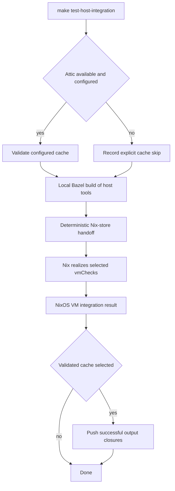
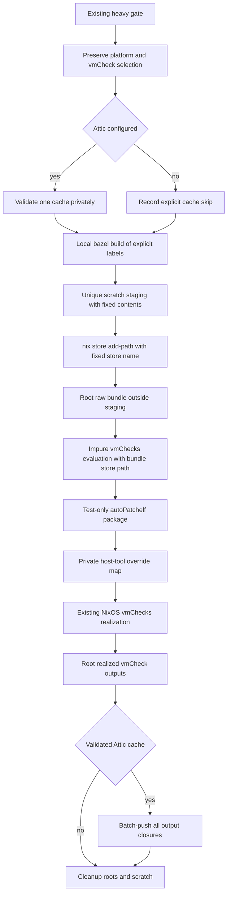
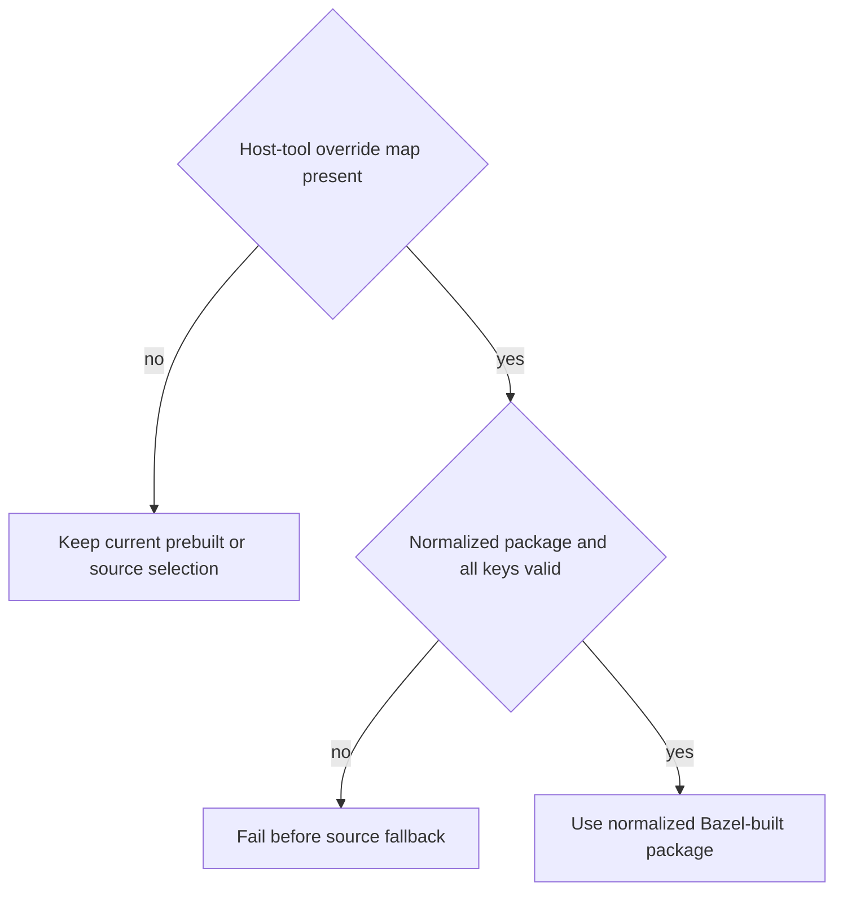

# Bazel-Backed Host Integration Binaries - Plan

## Goal Capsule

- **Objective:** Make `make test-host-integration` supply locally Bazel-built d2b host binaries to the existing NixOS VM tests, with no Nix-side Rust compilation for those binaries.
- **Authority:** The Product Contract owns behavior and scope. `tests/AGENTS.md`, the current Make heavy lane, and existing Nix module package boundaries own implementation constraints.
- **Stop conditions:** Stop if the bundle is incomplete, a configured Attic cache cannot be used, Nix selects a Rust source package for an overridden host tool, or the manual cold and warm evidence cannot be obtained.
- **Execution profile:** Use the existing heavy lane, one direct local Bazel build, one deterministic Nix-store handoff, and the existing `vmChecks` realization.
- **Worktree:** Keep this plan and all implementation changes on `refactor/bazel-host-integration-binaries` in a new isolated worktree.
- **Tail ownership:** The implementation workflow owns the changelog, independent review, pull request, and final host validation on the committed head.

---

## Product Contract

### Summary

`make test-host-integration` will build the required d2b host binaries with Bazel and pass them into the existing NixOS VM-test path.
Configured Attic hosts must cache the successful Nix outputs, while an unchanged repeat must execute zero Rust compilation actions.

### Problem Frame

The host-integration fixtures currently disable prebuilt host tools, so the Nix path selects source-built Rust packages even though Bazel is the contributor build authority.
This duplicates Rust compilation across Bazel and Nix and makes the warm host-integration path more expensive than necessary.
The current host-integration path also has no Attic integration.

### Actors

- A1. The contributor invoking `make test-host-integration`.
- A2. Bazel, which owns the d2b Rust binary builds.
- A3. Nix, which owns `vmChecks` realization and NixOS VM execution.
- A4. Attic, when it is available and configured on the invoking host.

### Key Decisions

- **Use a test-only Bazel-to-Nix binary handoff.** (session-settled: user-directed - chosen over a general local-prebuilt mode or Bazel-owned VM action: the narrow handoff preserves the retained Layer-2 contract.) Governs R1-R4 and R9.
- **Measure warm reuse by Rust compilation actions.** (session-settled: user-directed - chosen over a zero-`rustc`-process rule and a forced VM rerun: cache checks may occur and a complete Nix no-op is acceptable.) Governs R5-R6.
- **Require Attic only where it is available and configured.** (session-settled: user-directed - chosen over universal provisioning or unconditional best-effort fallback: this host must prove cache use while hosts without Attic remain supported.) Governs R7-R8.
- **Verify the infrastructure change manually.** (session-settled: user-directed - chosen over a new automated gate, harness, or testing scheme: the existing host-integration command and build evidence are sufficient.) Governs R10-R12.

### Requirements

**Bazel-to-Nix handoff**

- R1. `make test-host-integration` must build every d2b Rust host binary required by the host-integration suite through its existing public Bazel target before Nix realization.
- R2. The NixOS VM tests must consume the Bazel-built binaries for every required d2b Rust host tool instead of selecting equivalent Nix source-built Rust packages.
- R3. The selected `vmChecks` must continue to run through the existing `make test-host-integration` heavy lane, with Nix retaining VM orchestration.
- R4. A missing, incompatible, or incomplete Bazel binary handoff must fail rather than falling back to Nix-side Rust compilation.

**Caching and warm behavior**

- R5. The first invocation may execute the Bazel Rust compilation and Nix realization required by the current source state.
- R6. A normal unchanged second invocation must execute zero Rust compilation actions; reusing the completed Nix result without rerunning the VM test is acceptable.
- R7. When Attic is available and configured, the Nix build must cache its successful output closures and fail if required cache use fails.
- R8. When Attic is unavailable or unconfigured, the command must continue without it and report an explicit cache skip.

**Compatibility**

- R9. Normal release packaging, consumer package selection, the `make check` BuildBuddy facade, and test lanes other than `make test-host-integration` must retain their current behavior.

**Ad hoc verification**

- R10. The change must not add an automated test target, gate, harness, persistent evidence script, or new testing scheme.
- R11. Manual validation on the current host must run `make test-host-integration` successfully and confirm that Nix consumed the Bazel-built binaries and cached the Nix outputs through Attic.
- R12. Manual validation must repeat the command without source changes and confirm from existing build output or one-off cache evidence that zero Rust compilation actions executed.

### Key Flows

- F1. Cold host-integration run
  - **Trigger:** A1 invokes `make test-host-integration` for the current source state.
  - **Actors:** A1, A2, A3, and A4 when configured.
  - **Steps:** Bazel builds the host-tool set, the test-only handoff supplies it to Nix, Nix realizes the selected VM checks, and Attic stores the successful outputs when configured.
  - **Outcome:** The existing VM integration lane completes without Nix compiling replacement d2b Rust binaries.
  - **Covers:** R1-R5, R7-R9, R11.
- F2. Unchanged warm run
  - **Trigger:** A1 repeats the same command without source changes.
  - **Actors:** A1, A2, A3, and A4 when configured.
  - **Steps:** Existing Bazel and Nix results satisfy unchanged work, and Nix may reuse the completed VM-check result.
  - **Outcome:** No Rust compilation action executes.
  - **Covers:** R6, R12.

### Acceptance Examples

- AE1. **Covers R1-R4, R11.** Given a selected VM check that exercises d2b Rust host tools, when the current host runs `make test-host-integration`, then the VM test uses the complete Bazel-built binary handoff and no tool falls back to a Nix source build.
- AE2. **Covers R7, R11.** Given this host has working Attic configuration, when the Nix build succeeds, then the selected output closures are pushed successfully and a required cache-use failure fails the command.
- AE3. **Covers R8.** Given a contributor host has no usable Attic configuration, when host integration runs, then it reports the cache skip and continues through the same Bazel-to-Nix path.
- AE4. **Covers R6, R12.** Given one successful run and no source changes, when the command is repeated, then build evidence shows zero Rust compilation actions even if Nix returns the cached `vmCheck` result without rerunning the VM.

### Scope Boundaries

- The active scope is the `make test-host-integration` Bazel-to-Nix binary handoff, optional-host Attic behavior, and ad hoc manual validation.
- Normal release artifacts, consumer configuration, prebuilt release selection, and the `make check` BuildBuddy facade are unchanged.
- Guest static packages and Rust binaries outside the Host-Tool Inventory remain on their current Nix paths.
- Other Layer-1 and Layer-2 test lanes are unchanged.
- Bazel does not become the scheduler for the NixOS VM test.
- The work does not add a Bazel test, a new Bazel aggregate target, or a new build-facade action.
- The work does not provision Attic, create a repository-wide cache policy, or require Attic on hosts where it is absent.
- The work does not add a new automated verification framework or force warm VM-test execution.

### Dependencies / Assumptions

- The nine current public Bazel binary targets produce x86_64-linux outputs that `autoPatchelfHook` can normalize for the pinned Nixpkgs host runtime.
- The current host's Attic installation exposes one default server whose endpoint matches one configured Nix substituter and whose cache accepts closure uploads.
- Lix 2.94.2 provides `nix store add-path`, `builtins.storePath`, and the existing `nix build` behavior used by the test-only handoff.

### Sources / Research

- `Makefile` owns the host-integration heavy lane and its current `nix build` invocation.
- `flake.nix` owns `vmChecks` discovery and NixOS VM-test realization.
- `tests/host-integration/lib.nix` currently disables prebuilt host tools for shared daemon-host fixtures.
- `nixos-modules/options-site.nix`, `nixos-modules/host-daemon.nix`, and `nixos-modules/host-broker.nix` define the existing prebuilt-versus-source package boundary.
- `nixos-modules/rust-host-tools.nix` defines the current Nix Rust source-build path.
- `tests/AGENTS.md` keeps host integration in the retained conditional Layer-2 lane.
- `packages/d2b/BUILD.bazel`, `packages/d2bd/BUILD.bazel`, and `packages/d2b-priv-broker/BUILD.bazel` demonstrate the public Bazel binary pattern.
- [Lix `nix store add-path`](https://docs.lix.systems/manual/lix/2.94/command-ref/new-cli/nix3-store-add-path.html) defines the deterministic raw bundle import.
- [Nixpkgs AutoPatchelf](https://nixos.org/manual/nixpkgs/stable/#sec-auto-patchelf) defines the dynamic-binary normalization boundary.
- [Attic client configuration](https://github.com/zhaofengli/attic/blob/7a19204df10d606c5070e6bb72615c3461900c05/client/src/config.rs) and [Attic push](https://github.com/zhaofengli/attic/blob/7a19204df10d606c5070e6bb72615c3461900c05/client/src/command/push.rs) define the configured-cache and closure-upload behavior.

---

## Planning Contract

### Product Contract Preservation

Product Contract clarified without scope change: R7, R11, AE2, and F1 bind configured Attic use to caching successful output closures.

### Key Technical Decisions

- KTD1. **Use one direct local Bazel build inside the existing heavy lane.** Invoke `BAZEL_BIN` with `build --config=local` after `heavy-lane-guard`, and list the production labels directly. Do not change `tests/tools/bazel-check`, `BAZEL_RUN`, `make check`, or the Bazel test graph. (session-settled: user-directed - chosen over extending the BuildBuddy facade: minimizing build-system changes matters more than remote execution for this lane.) Governs R1, R3, R5, R6, R9, and R10.
- KTD2. **Import a deterministic raw bundle into the Nix store.** Stage fixed regular executable names with mode `0755`, dereference Bazel symlinks, reject missing or unexpected files, import the tree under the fixed name `d2b-bazel-host-tools`, and root it outside the staging tree. Root each realized `vmCheck` output through Attic upload. Governs R1-R6.
- KTD3. **Normalize the bundle through one test-only Nix package.** Use `stdenv.mkDerivation` with `autoPatchelfHook`, then verify every installed file remains an x86_64 ELF with a Nix-store loader and resolved runtime libraries. Do not use Cargo, Crane, `rustPlatform.buildRustPackage`, `self`, or the release-prebuilt fallback. Governs R2, R4, R5, and R9.
- KTD4. **Inject a complete private host-tool override map.** Add nullable `_module.args.d2bHostToolOverrides`; reject empty, malformed, missing-key, and unknown-key maps before fallback. Wrap the original module function with an importing module rather than shallow-merging it. When the map is absent, all current prebuilt and source selection remains unchanged. Governs R2, R4, and R9.
- KTD5. **Build the fixed explicit host-tool set for every nonempty host-integration run.** This avoids a new aggregate target and per-check artifact inventory while keeping one stable handoff. `d2bGatewayRuntime` remains excluded because its only consumer is the retired gateway migration surface. (session-settled: user-approved - chosen over per-check label pruning or a new Bazel aggregate target: fixed explicit labels minimize build-system changes.) Governs R1-R6 and R9.
- KTD6. **Use Attic as a post-build closure cache.** Preflight the installed client and existing configuration before Bazel, derive one cache name from the default endpoint and effective substituter, and suppress cache metadata and raw error output. After every selected check succeeds, push all rooted outputs in one deduplicated operation. Skip only when Attic or configuration is absent; ambiguity, access failure, or upload failure is fatal once configuration exists. Never run `attic use` from the test lane. Governs R7, R8, and R11.
- KTD7. **Retire only the host-integration sccache path.** Remove the `D2B_HOST_SCCACHE` preflight and target-specific documentation because Nix no longer compiles these host tools. Preserve the generic host sccache option and implementation for other Nix source builds. (session-settled: user-approved - chosen over retaining two caches in the host lane: Attic caches Nix outputs and Bazel owns Rust compilation.) Governs R5, R7-R9, and R11.

### Host-Tool Inventory

| Override key | Executable | Bazel label |
| --- | --- | --- |
| `d2b` | `d2b` | `//packages/d2b:d2b` |
| `d2bd` | `d2bd` | `//packages/d2bd:d2bd` |
| `broker` | `d2b-priv-broker` | `//packages/d2b-priv-broker:d2b-priv-broker` |
| `activationHelper` | `d2b-activation-helper` | `//packages/d2b-host:d2b-activation-helper` |
| `hostActivationHelper` | `d2b-host-activation-helper` | `//packages/d2b-host-activation-helper:d2b-host-activation-helper` |
| `cutoverRunner` | `d2b-cutover-runner` | `//packages/d2b-cutover:d2b-cutover-runner` |
| `unsafeLocalHelper` | `d2b-unsafe-local-helper` | `//packages/d2b-unsafe-local-helper:d2b-unsafe-local-helper` |
| `resourceCompiler` | `d2b-resource-compiler` | `//packages/d2b-resource-compiler:d2b-resource-compiler` |
| `waylandProxy` | `d2b-wayland-proxy` | `//packages/d2b-provider-display-wayland:d2b-wayland-proxy` |

### High-Level Technical Design

The Make lane exports the imported store path only for the `vmChecks` evaluation and clears unrelated host-runtime path overrides before enabling impurity.
`flake.nix` reads the path only in the impure host-integration invocation, converts it with `builtins.storePath`, creates the normalized package, and wraps the `self` passed from the discovery callback.
The wrapped `self.nixosModules.default` imports the original module and injects the private override map, while a per-system package merge replaces only the standalone Wayland proxy package.
Pure flake evaluation without the handoff environment remains unchanged.

### Implementation Constraints

- Preserve the current x86_64-only skip, KVM warning and TCG fallback, VM discovery, selected-check behavior, and heavy-gate ownership.
- Keep temporary staging, GC roots, and any one-off evidence under unique per-run names without embedding those names in staged content or Nix derivation names.
- Keep staging outside the flake input, delete it after store import, and realize the repository through its `git+file://` form so `.scratch` is never copied into the Nix source.
- Clear `D2B_HOST_RUNTIME_PATH` and other unrelated impure host-tool overrides from the Nix invocation; only the bundle store path may change package selection.
- Do not print Attic tokens, internal endpoints, public keys, or cache metadata.
- Do not modify `nix/gas-city-contributor/**`.
- Do not add a Bazel test, repository gate, automated evidence parser, or persistent benchmark artifact.
- Keep the plan and implementation inside the isolated worktree; do not apply code changes in the protected `v3` checkout.
- Commit the implementation before authoritative Nix validation so tracked inputs are visible to flake evaluation.

### Risks and Mitigations

| Risk | Mitigation |
| --- | --- |
| Bazel outputs use a non-Nix dynamic loader or unresolved runtime libraries. | Normalize all nine files with `autoPatchelfHook`, validate x86_64 ELF inputs, and fail on unresolved dependencies. |
| A Bazel convenience symlink or remote-only output enters the bundle. | Build locally, dereference each exact output, require regular executable files, and stage only the inventory above. |
| The imported raw bundle or realized VM outputs are collected before upload. | Root the bundle before evaluation, root each output before Attic, keep roots outside staging, and remove them through exit and signal cleanup. |
| An incomplete override silently selects a Nix Rust source package. | Validate the complete inventory before import and make override lookup fail when the map is active. |
| Attic is installed but its cache is ambiguous, inaccessible, or read-only. | Distinguish absence from configured failure, validate one matching cache with suppressed output, and fail before or after the build as appropriate. |
| Local Bazel execution is slower than BuildBuddy. | Accept local execution to avoid modifying the shared BuildBuddy facade; unchanged runs still use the local Bazel action cache. |
| Separate uploads repeat closure traversal or extend heavy-lane occupancy. | Root all selected outputs and pass them to one deduplicated Attic push after every check succeeds. |
| A scratch directory is copied as part of the flake source. | Keep scratch outside the flake input and use the repository's `git+file://` realization discipline. |
| The Make recipe becomes harder to review. | Remove the obsolete sccache block and keep the new flow as one bounded sequence inside the existing heavy lane. |

### System-Wide Impact

- Warm Bazel reuse is limited to the same worktree and output base because the selected local profile does not use BuildBuddy.
- One changed host binary invalidates the complete raw bundle and normalized package, which can invalidate all VM outputs that consume the shared package.
- Guest static packages and binaries outside the nine-tool host inventory remain independent of this handoff.
- Attic stores the deduplicated closure of all selected successful `vmCheck` outputs and can extend heavy-lane occupancy during the upload.
- A host without Attic performs the same local Bazel and VM work but keeps the outputs only in its local Nix store.
- Staging, raw bundle import, normalized package realization, VM outputs, and Attic upload can overlap in disk usage during the cold run.
- The lane creates temporary GC roots but does not run garbage collection or change the host's normal retention policy.

### Sequencing

1. Add the private module override seam.
2. Add the deterministic Nix normalization and `vmChecks` injection.
3. Replace the host lane's Nix Rust build path with the local Bazel staging flow and Attic upload.
4. Update the sccache documentation, changelog fragments, and host-integration guidance.
5. Commit, run the cold validation, repeat unchanged, and inspect the ad hoc evidence.

---

## Implementation Units

### U1. Add fail-closed private host-tool overrides

- **Goal:** Let host modules select a complete test-only package map without changing public package options or normal source and release behavior.
- **Requirements:** R2, R4, R9; F1; AE1.
- **Dependencies:** None.
- **Files:**
  - `nixos-modules/lib.nix`
  - `nixos-modules/host-daemon.nix`
  - `nixos-modules/host-broker.nix`
  - `nixos-modules/host-activation.nix`
  - `nixos-modules/processes-json.nix`
  - `nixos-modules/resource-compiler.nix`
  - `nixos-modules/unsafe-local-helper.nix`
- **Approach:**
  1. Add one shared selector that accepts the private override map, an inventory key, and the current fallback package.
  2. When the map is absent, return the current fallback without changing evaluation.
  3. When the map is present, require the named key and return its package without consulting release or source fallbacks.
  4. Route the daemon, CLI, broker, activation helpers, cutover runner, unsafe helper, resource compiler, and Wayland proxy selectors through the helper.
- **Patterns to follow:** Existing package selection in `nixos-modules/host-daemon.nix` and `nixos-modules/host-broker.nix`; shared pure helpers in `nixos-modules/lib.nix`.
- **Test scenarios:** Test expectation: none - R10 excludes new automated tests for this build-infrastructure change; U3 validates the complete map through the real VM lane.
- **Verification:** Normal pure evaluation remains unchanged when the private map is absent, and an active incomplete map cannot reach a source package.

### U2. Normalize and inject the Bazel bundle

- **Goal:** Convert the imported raw Bazel bundle into one Nix package and inject it only into impure host-integration evaluation.
- **Requirements:** R1-R6, R9; F1-F2; AE1, AE4; KTD2-KTD5.
- **Dependencies:** U1.
- **Files:**
  - `nix/test-support/bazel-host-tools.nix`
  - `flake.nix`
- **Approach:**
  1. Add a test-support derivation that requires the exact executable inventory, installs it under one package `bin/`, validates ELF architecture, and runs `autoPatchelfHook`.
  2. Verify the normalized loader, architecture, and runtime-library closure after fixup.
  3. Return both the normalized package and the complete `d2bHostToolOverrides` map, with every key pointing at that package.
  4. In `vmChecks`, read `D2B_HOST_TOOL_BUNDLE` only when the host lane invokes Nix with impurity enabled.
  5. Convert the provided store path with `builtins.storePath`, import the test-support derivation, and wrap the `self` passed from the test discovery callback.
  6. Wrap `nixosModules.default` as an importing module that injects the private map, and merge only the current system's `d2b-wayland-proxy` package projection.
  7. Keep the current pure `vmChecks` output unchanged when the environment variable is absent.
- **Patterns to follow:** `nix/prebuilt.nix` for `autoPatchelfHook` packaging; `flake.nix` for `vmChecks` discovery; existing `_module.args` injection in `tests/host-integration/guest-shell-service.nix`.
- **Test scenarios:** Test expectation: none - the new expression is test-lane plumbing, and R10 requires ad hoc validation through the existing host integration command.
- **Verification:** The normalized package contains the nine expected executables, no Rust builder enters its derivation closure, and both shared-node tests and the standalone Wayland proxy test resolve through the wrapped `self`.

### U3. Stage Bazel outputs and cache Nix results

- **Goal:** Replace the host lane's Nix Rust compilation with one local Bazel build, deterministic store import, and conditional Attic closure upload.
- **Requirements:** R1-R12; F1-F2; AE1-AE4; KTD1-KTD7.
- **Dependencies:** U2.
- **Files:**
  - `Makefile`
- **Approach:**
  1. Preserve the current heavy-lane guard, system check, KVM warning, VM discovery, selected-check handling, and empty-selection behavior.
  2. Preflight Attic before expensive work; record absence as a skip and fail on malformed, ambiguous, inaccessible, or unusable configured state.
  3. Remove the `D2B_HOST_SCCACHE` preflight and status branch.
  4. Invoke the existing `BAZEL_BIN` directly with `build --config=local` and the nine labels in the Host-Tool Inventory.
  5. Create a unique scratch directory outside the flake input, copy each exact `bazel-bin` executable as a regular file with fixed name and mode, and reject missing or unexpected content.
  6. Import the staged tree with `nix store add-path --name d2b-bazel-host-tools`, register an indirect GC root outside staging, and delete staging after import.
  7. Export the store path as `D2B_HOST_TOOL_BUNDLE`, clear unrelated impure host-tool variables, and run the selected `vmChecks` through a `git+file://` realization with output paths printed.
  8. Root every successful output, then pass all selected outputs to one deduplicated `attic push` when the preflight selected a cache.
  9. Remove scratch files and all GC roots on success, failure, or interruption without invoking garbage collection.
- **Execution note:** This is packaging and environment plumbing. Prefer the real cold and warm host-integration smoke over unit coverage.
- **Patterns to follow:** The existing `heavy-lane-host-integration` sequence; Bazel artifact dereferencing in `tests/tools/bazel-check`; Nix store ownership and cleanup conventions in `docs/contributing/workflow.md`.
- **Test scenarios:** Test expectation: none - the user chose ad hoc execution of the existing host-integration lane instead of a new automated test scheme.
- **Verification:** The cold run uses the normalized Bazel package, the configured Attic cache accepts the output closures, and an unchanged repeat executes zero Rust compilation actions.

### U4. Align guidance and release notes

- **Goal:** Remove obsolete host-integration sccache claims and document the new local Bazel and optional Attic behavior.
- **Requirements:** R7-R12; AE2-AE4; KTD6-KTD7.
- **Dependencies:** U3.
- **Files:**
  - `docs/contributing/gates-and-lints.md`
  - `tests/README.md`
  - `nixos-modules/options-host-sccache.nix`
  - `nixos-modules/rust-host-tools.nix`
  - `changelog.d/spec001-host-int-sccache.md`
  - `changelog.d/2026-08-19-host-sccache-multi-user.md`
  - `changelog.d/bazel-host-integration-binaries.md`
- **Approach:**
  1. Replace the target-specific sccache setup with the local Bazel binary handoff and Attic branch.
  2. Retain general host sccache documentation only where it still describes Nix source-build acceleration outside this lane.
  3. Remove the obsolete host-integration-only changelog fragment and narrow the multi-user sccache fragment to its remaining generic behavior.
  4. Add one release-note fragment describing Bazel-built host binaries, Attic closure caching, and the retired target knob.
  5. Document the cold run, unchanged warm run, expected Attic skip, and configured-cache failure behavior without publishing host-specific cache names or endpoints.
- **Patterns to follow:** `docs/contributing/changelog-and-commits.md`; `changelog.d/README.md`; existing host-lane documentation in `docs/contributing/gates-and-lints.md`.
- **Test scenarios:** Test expectation: none - documentation and changelog changes carry no independent behavior.
- **Verification:** Contributor guidance matches the implemented lane, stale `D2B_HOST_SCCACHE` run instructions are gone, and changelog fragments remain valid.

---

## Verification Contract

This change uses ad hoc infrastructure validation only, per R10.
Run authoritative validation after the implementation is committed.

| Validation | Covers | Required evidence |
| --- | --- | --- |
| `make test-host-integration` | U1-U4; R1-R5, R7-R11 | The direct local Bazel build succeeds; the bundle and normalized package paths are visible; the VM checks pass; no Nix Rust host-tool derivation is selected; configured Attic preflight and closure upload succeed. |
| Repeat the identical `make test-host-integration` command without source changes | U2-U4; R6, R12 | Bazel executes zero Rust compilation actions; Nix may return the existing `vmCheck` outputs; Attic reuse or idempotent upload succeeds. |
| One-off local Bazel build of the same nine labels with transient BEP output under `.scratch/` | U3; R6, R12 | `BuildMetrics.actionSummary.actionsExecuted` contains no Rust compilation action on the unchanged run. Cached stdout or absence of compiler text is not used as evidence. |
| Manual Nix derivation inspection of the printed `vmCheck` outputs | U2-U3; R2, R4, R11 | The normalized Bazel package is an input, and `nixos-modules/rust-host-tools.nix` host-tool derivations are absent from the selected closure. |
| Ad hoc invocation with no usable Attic client configuration | U3-U4; R8, AE3 | The lane reports an explicit cache skip, completes the same local Bazel and VM path, and creates no repository cache configuration. |
| Changelog fragment validation through the repository's existing changelog gate when the owning workflow runs it | U4; R9-R10 | The new and edited fragments have valid headings and no stale host-integration sccache claim remains. |

Unsupported-platform skips, fixture-level `SKIP` or `BLOCKED` output, and an Attic skip on this configured host are not validation evidence.

---

## Definition of Done

- The Product Contract remains unchanged and every requirement is covered by at least one implementation unit and verification outcome.
- `make test-host-integration` builds the fixed host-tool set through direct local Bazel labels and uses the normalized package in NixOS VM tests.
- An active incomplete bundle fails before any Nix Rust source package can be selected.
- Pure flake behavior, release prebuilts, consumer package selection, `make check`, BuildBuddy behavior, and other test lanes remain unchanged.
- Configured Attic uploads successful `vmCheck` output closures without exposing credentials or endpoint details; absent Attic reports a skip.
- Configured Attic receives all selected outputs through one deduplicated closure upload after every check succeeds.
- The unchanged same-worktree run preserves the raw bundle, normalized package, and `vmCheck` output paths, executes zero Rust compilation actions, and does not require the VM test to rerun.
- The host-integration `D2B_HOST_SCCACHE` path and stale documentation are removed, while generic host sccache support remains.
- No automated test target, gate, harness, evidence script, Bazel aggregate target, or Bazel facade action is added.
- The required changelog fragments and contributor documentation are complete.
- Temporary staging, BEP files, GC roots, and abandoned implementation attempts are removed before landing.
- Independent review and the repository PR tail complete on the same committed head that produced the host validation evidence.
