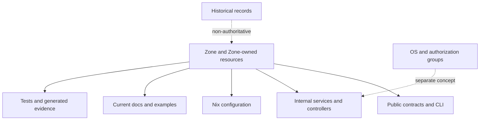
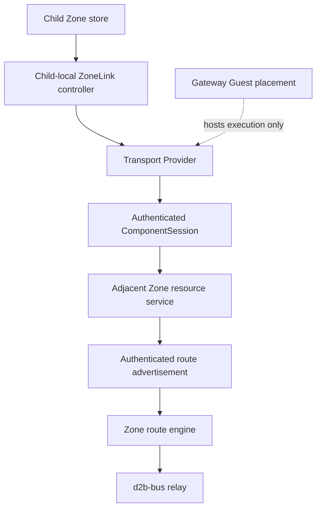
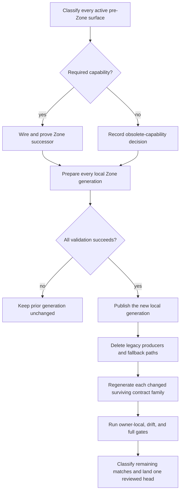

# Zone-Only Control Plane Clean Break - Plan

## Goal Capsule

- **Objective:** Make Zone and Zone-owned resources the only active first-party product, control-plane, and Nix configuration model.
- **Product authority:** Committed v3 Zone code and schemas are canon, with ADR 0046 and the current Zone reference contracts defining the intended public model.
- **Stop conditions:** Stop if a required pre-Zone capability lacks a verified Zone successor, an authorization grant would widen, a stale identity could be adopted, or a versioned contract has no unambiguous keep/delete disposition.
- **Execution profile:** Deep, security-sensitive, cross-cutting clean break with parity-first sequencing and one atomic cutover.
- **Tail ownership:** The implementation workflow owns the isolated worktree, changelog, validation, independent reviewed-head evidence, pull request, and guarded squash merge.

---

## Product Contract

### Summary

Complete the remaining Zone-native parity, then remove the active pre-Zone product hierarchy in one clean break.
Rename still-needed behavior around Zone, delete obsolete realm, env, product-group, gateway-era configuration, and top-level VM configuration surfaces, and preserve only legitimate OS group semantics and clearly historical records.

### Problem Frame

The v3 repository already contains the Zone resource contract, Zone-scoped control-plane contracts, and Zone-oriented Nix and CLI references.
Active first-party surfaces still expose the superseded model through production identifiers, configuration, CLI behavior, tests, examples, templates, and current documentation.
That overlap leaves two conceptual systems in the repository even though Zone is now authoritative, increasing maintenance cost and allowing new work to attach to retired names and structures.

### Key Decisions

- **Zone is the only active product model.** (session-settled: user-approved - chosen over a public-only cutover that retains realm or env internals: remove the old conceptual model instead of hiding it.) Governs R1-R5.
- **Remove the complete pre-Zone Nix hierarchy.** (session-settled: user-directed - chosen over retaining top-level VM or gateway configuration: all active configuration belongs to Zones and their resources.) Governs R3-R6.
- **Use a clean break with ordinary validation failures.** (session-settled: user-directed - chosen over aliases, translators, tombstones, or tailored migration errors: do not preserve a compatibility contract.) Governs R6-R8.
- **Preserve historical records.** (session-settled: user-directed - chosen over rewriting or deleting ADRs, plans, specs, and changelogs: retain an accurate non-authoritative record.) Governs R10-R11.
- **Preserve real OS and authorization groups.** (session-settled: user-directed - chosen over removing every active use of the word group: Unix identity and access-control groups are not the retired product grouping model.) Governs R9, R11-R12.

### Authority Shape



### Requirements

**Zone-only model**

- R1. Active first-party public contracts, CLI surfaces, and operator documentation MUST use Zone and Zone-owned resources as the only isolation and control-plane model.
- R2. Still-required internal behavior MUST be renamed and expressed in Zone terms, with no active realm, env, or product-group identifiers retained as implementation aliases.
- R3. Required behavior represented by the retired realm, env, product-group, gateway-era configuration, or top-level VM configuration hierarchy MUST use its existing Zone or resource successor.
- R4. Obsolete behavior from the retired product hierarchy MUST be deleted.
- R5. Active first-party services MUST NOT retain realm-named controllers, sessions, routes, entrypoints, configuration types, or state solely because their behavior still handles Zones.

**Nix and compatibility**

- R6. The active Nix surface MUST remove `d2b.realms`, `d2b.envs`, top-level `d2b.vms`, gateway-era configuration, and other pre-Zone hierarchy entrypoints in favor of Zones and their resources.
- R7. Old configuration, command, or contract shapes MUST receive the repository's ordinary unknown or invalid input behavior.
- R8. The repository MUST NOT retain compatibility aliases, translators, tombstones, fallback paths, or legacy-aware error messages for the removed product model.

**Semantic boundaries**

- R9. Unix users, supplemental OS groups, socket access groups, and other genuine authorization-group semantics MUST remain intact and use accurate group terminology.
- R10. ADRs, plans, specs, removal inventories, changelog records, completed migration guides, and superseded schema snapshots MAY retain old terminology only when they are explicitly historical or superseded.
- R11. Managed infrastructure, third-party content, historical records, and legitimate OS group semantics MUST be classified separately from active first-party product usage.
- R12. Renaming or removing an authorization-bearing surface MUST preserve equivalent principal-to-object grants on its Zone successor and MUST NOT replace an isolation-scoped grant with a broader grant.
- R13. Zone-owned network gateway fields and required gateway-backed transport or isolation behavior MUST remain intact; only gateway-era product hierarchy and configuration entrypoints are retired.

**Coverage and removal proof**

- R14. Production code, Nix modules, schemas, generated contracts, CLI output, tests, fixtures, examples, templates, and current documentation MUST move together so no active surface teaches or depends on the retired model.
- R15. Removal evidence MUST use an explicit inventory of active, historical, managed, third-party, OS-group, generic-environment, and gateway-field occurrences rather than claiming success from an unqualified repository-wide text search.
- R16. Any versioned contract that remains active after a structural removal MUST update its schema version, manifest version, current reference documentation, migration note, and changelog together.
- R17. The completed change MUST preserve current Zone behavior and required operator capabilities while removing only superseded entrypoints and concepts.

### Acceptance Examples

- AE1. **Covers R2, R5.** Given a service still performs behavior needed by a Zone, when its active identifiers and operator-visible diagnostics are inspected, then they use Zone terminology rather than realm, env, or product-group terminology.
- AE2. **Covers R6-R8.** Given configuration using `d2b.realms`, `d2b.envs`, a top-level VM declaration, or gateway-era configuration, when the configuration is evaluated, then it fails through ordinary invalid or unknown input handling without translation or a special legacy message.
- AE3. **Covers R9, R11.** Given code or documentation describing the `d2b` Unix group or supplemental user groups, when the removal inventory classifies it, then it remains as legitimate authorization terminology.
- AE4. **Covers R10, R11, R15.** Given an explicitly historical ADR or changelog entry that describes realms, envs, or product groups, when the removal proof runs, then the occurrence is allowed only through the historical inventory.
- AE5. **Covers R14, R15, and R17.** Given any active first-party production code, Nix module, schema, generated contract, CLI output, test, fixture, example, template, or current document, when it is checked against the removal inventory, then it contains no dependency on the retired product hierarchy and continues to represent the Zone behavior it covers.
- AE6. **Covers R3, R4, R17.** Given a capability currently reached through a retired surface, when planning classifies it as required, then the completed change demonstrates that capability through a Zone or resource successor; deletion is allowed only after an explicit obsolete-capability decision.
- AE7. **Covers R9, R12.** Given an authorization-bearing surface is renamed or removed, when its Zone successor is exercised, then the same principals retain the same object-scoped grants and no broader grant replaces them.
- AE8. **Covers R13, R15.** Given an active occurrence of gateway terminology, when the removal inventory classifies it, then Zone network fields and required gateway-backed behavior remain while only gateway-era product configuration is removed.
- AE9. **Covers R4, R10, R16.** Given a versioned pre-Zone contract is affected by the cutover, when it remains active, then its coordinated versioned artifacts move together; when it is retired, then it is deleted or explicitly classified as historical rather than republished as a new active contract.

### Delivery Constraints

- The change MUST be implemented in an isolated worktree and delivered as one coherent pull request.
- Validation ownership stays with the implementation workflow; reviewers inspect evidence and do not run tests.
- The first independent review covers the full change, while later brief reviews cover only the delta from the last reviewed head and bind their verdict to the new head.
- The implementation workflow MUST validate every head-changing update and run the normal `make check` path without forcing a local execution profile or other local override.
- The pull request MUST land through the repository's reviewed-head lifecycle and normal guarded squash merge.

### Scope Boundaries

**In scope**

- Active first-party source, configuration, contracts, tests, fixtures, generated evidence, examples, templates, and current documentation.
- Live operator how-tos, explanation pages, accepted current specifications, and current reference documents.
- Internal renames required to make Zone the only active conceptual model.
- Deletion of obsolete pre-Zone behavior and compatibility surfaces.

**Out of scope**

- Rewriting or deleting artifacts explicitly marked historical or superseded, including ADRs, plans, specs, removal inventories, changelog records, completed migration guides, and superseded schema snapshots.
- Renaming legitimate Unix, user-membership, or authorization-group concepts.
- Changes under managed contributor infrastructure or unrelated third-party content.
- New compatibility behavior for retired inputs.

<!-- ce-section: work-relationships -->
### How This Work Fits Together

This plan owns the full Zone-only clean-break outcome as one work unit.

- **Shares cleanup intent with:** `docs/plans/2026-08-19-002-refactor-build-test-ownership-cleanup-plan.md`, whose realm-compatibility cleanup item should be reconciled into this broader active-surface removal rather than executed as a separate competing cutover.
- **Builds on:** ADR 0046 and the existing Zone schemas, contracts, Nix surfaces, and CLI contracts.
- **Preserves:** historical records that explain the path from the realm-era model to the Zone model.

### Dependencies and Assumptions

- The committed Zone schema and resource-oriented Nix surface are the authoritative successors for required current behavior.
- Planning will verify each retired surface against a Zone successor or an explicit obsolete-behavior deletion before implementation.
- Existing code remains canon where older strategy, ADR, plan, or reference prose disagrees with committed passing behavior.

### Sources

- `docs/adr/0046-d2b-3-provider-control-plane.md`
- `docs/reference/zone-control-nix.md`
- `docs/reference/zone-cli-contract.md`
- `docs/reference/schemas/v3/core.d2bus.org_Zone.schema.json`
- `docs/adr/0015-daemon-only-clean-break.md`
- `docs/specs/ADR-046-componentsession-and-bus.md`
- `docs/specs/ADR-046-resource-api-and-authorization.md`
- `docs/specs/ADR-046-security-and-threat-model.md`
- `docs/specs/ADR-046-zone-routing.md`
- `docs/specs/ADR-046-nix-configuration.md`
- `docs/plans/2026-08-19-002-refactor-build-test-ownership-cleanup-plan.md`
- `specs/001-adr046-d2b3-completion/removal-proof-inventory.md`
- `specs/001-adr046-d2b3-completion/data-model.md`

---

## Planning Contract

**Product Contract preservation:** Restructured, no scope change. The Summary now states the parity-first cutover; R1-R17 and AE1-AE9 are unchanged.

### Key Technical Decisions

- KTD1. **Gate deletion on successor parity.** (session-settled: user-approved - chosen over a deletion-first sweep: current required paths still consume pre-Zone inputs.) Each legacy producer is removed only after its required capability runs through a Zone owner or receives an explicit obsolete-capability decision. Governs R3-R4, R14, R17.
- KTD2. **Use one root public listener with authenticated Zone routing.** (session-settled: user-approved - chosen over per-Zone sockets and extra system services: the v3 resource request already carries the routing target.) `--zone` selects a requested Zone, while authenticated session evidence and the Zone registrar must prove the exact Zone before dispatch to the matching per-Zone resource service. Governs R1, R5, R12, R17.
- KTD3. **Keep one isolated runtime per Zone.** The root daemon supervises Zone runtime children; each child owns one store, resource service, and core controller. Provider controllers use authenticated Resource API sessions and injected EffectPorts, never direct store or broker access. Governs R1-R5, R12-R17.
- KTD4. **Derive private runtime objects from immutable resource identity.** (session-settled: user-approved - chosen over globally keyed human names: equal Guest or Network names in different Zones must not collide.) Private objects bind Zone UID plus resource UID. Mutation ledger identity remains Zone UID plus OperationId, while post-commit effect idempotency also binds resource generation and revision. Governs R3, R12-R15, R17.
- KTD5. **Do not migrate or delete stale pre-Zone state automatically.** (session-settled: user-approved - chosen over state translation or cleanup: compatibility behavior would preserve the retired contract and risk foreign-state mutation.) Current identity and version checks ignore or ordinarily refuse stale state. Governs R4, R7-R8, R15, R17.
- KTD6. **Version only changed contract families that remain active.** (session-settled: user-approved - chosen over republishing retired contracts under new versions: the cutover must leave one living contract.) Each changed surviving family moves its schema, emitter, DTO, reader, reference, and changelog atomically; byte-identical accepted families keep their version. Governs R10, R14-R16.
- KTD7. **Keep verification owner-local.** (session-settled: user-approved - chosen over a new repository-wide inventory gate or evidence script: the test model already defines the owning Layer-1 and conditional host lanes.) Removal proof combines owner tests, drift generation, and a classified review audit. Governs R11, R14-R17.
- KTD8. **Prepare and publish local Zone generations atomically.** Validate and stage every locally authoritative Zone before any store or external effect advances. A failure or crash retains the prior published generation for all local Zones.
- KTD9. **Carry sealed authorization through effects.** Resource authorization produces a non-transferable lease bound to subject UID, Zone UID, object UID and generation, operation, policy revision, Provider assignment generation, and OperationId. Provider and executor boundaries consume that lease; Host shutdown retains a distinct stop-only capability.
- KTD10. **Use host-global Network admission with owner provenance.** One admission index rejects cross-Zone CIDR and host-resource conflicts before effects. Every bridge, TAP, route, firewall rule, DHCP artifact, and ownership marker binds Zone UID, Network UID, attachment generation, and bundle generation.
- KTD11. **Keep ZoneLink authority and credentials Zone-local.** The child-local ZoneLink controller and transport Provider establish the authenticated adjacent-Zone session. A gateway Guest may host execution, but the host daemon and broker never load realm credentials, mint relay bearer material, or terminate ZoneLink authority.

### Capability Successor Matrix

| Retired active surface | Required capability | Zone-native owner | Disposition |
| --- | --- | --- | --- |
| Realm CLI and entrypoint routing | Address one Zone and its resources | Root public socket, explicit Zone reference, resource API | Rewire, then delete realm commands and entrypoint tables |
| Per-realm daemon configs, sockets, and services | Local Zone API availability | Root public listener plus supervised per-Zone runtimes | Replace system services and socket discovery; keep runtime isolation |
| `d2b.realms`, `d2b.envs`, `d2b.vms`, gateway-era options | Declarative isolation, workloads, providers, and policy | `d2b.zones`, Zone resources, `d2b.guestSystems`, `d2b.lib.evalGuest` | Complete projections, then remove options and consumers |
| Env, bridge, net-VM, and manifest network fields | Network realization and default routing | `Network` plus `Guest.networkAttachments`, owned by `Provider/network-local` | Rewire Provider inputs; preserve Network IPv4 gateway |
| Legacy VM lifecycle and process rows | Start, stop, restart, adoption, and readiness | `Guest` lifecycle dispatch plus Provider-owned `Process` resources | Reuse typed Provider lifecycle path; remove legacy fallback |
| Realm gateway display and transport paths | Gateway-backed isolation and child-Zone transport | Gateway `Guest`, `ZoneLink`, transport Provider, authenticated route engine | Preserve capability; delete gateway-era public hierarchy |
| Realm socket groups and fixed operator subject | Socket admission and object-scoped authorization | Real OS groups for admission; exact `User`, `Role`, and `RoleBinding` resources plus sealed effect leases | Preserve equivalent grants; remove broader or fixed-subject shortcuts |
| Realm, allocator, VM, and compatibility bundle artifacts | Bootstrap, topology, resource, and Provider inputs | Sealed Zone topology, per-Zone resource/storage projections, artifact catalog | Version survivors; delete retired artifacts and readers |

### Pre-Implementation Gate

Before U1 starts, the implementation owner expands the successor matrix into pull-request evidence that maps each active delete/replace path to:

- its required Zone successor or explicit obsolete-capability decision;
- its owning implementation unit and focused Bazel or Make evidence;
- its versioned contract-family keep/delete decision; and
- its remaining-match classification under R15.

Unknown, disputed, or unproved rows stop implementation.
This gate creates no repository file, policy class, evidence script, successor pin, or compatibility ledger.

### High-Level Technical Design

```mermaid
flowchart TB
  NX[Zone Nix authoring] --> RC[Resource compiler]
  NX --> TP[Sealed topology projection]
  NX --> AC[Artifact catalog and private low-level projections]
  RC --> RB[Immutable per-Zone resource bundle]
  TP --> RL[Root listener and Zone runtime supervisor]
  AC --> RL
  CLI[d2b CLI] --> PS[/run/d2b/public.sock]
  PS --> RL
  RL --> Z1[Zone runtime: store, resource service, core controller]
  RL --> Z2[Zone runtime: store, resource service, core controller]
  RB --> Z1
  RB --> Z2
  Z1 --> DB[d2b-bus exact Zone route]
  Z2 --> DB
  DB --> PC[Provider controller session]
  PC --> EP[Narrow injected EffectPort]
  EP --> EX[Approved executor]
  EX --> BR[d2b-broker only for privileged host effects]
```





### Sequencing

1. Freeze the path-level successor/disposition matrix and exact contract-family version matrix.
2. Establish Zone/store identity and cross-Zone prepare/publish without deleting active producers.
3. Complete core and owner-local Nix projections, then converge the root listener and authorization path.
4. Rewire Network, Guest lifecycle, and ZoneLink behavior through isolated Zone owners.
5. Remove the pre-Zone Nix hierarchy, migrate remaining Rust readers, and delete retired Rust owners and graph edges.
6. Close current docs and changelog, run the classified removal audit, validate the committed head, and complete the reviewed-head pull request lifecycle.

### System-Wide Impact

- **Control plane:** One public listener replaces per-realm system services and sockets while supervised per-Zone runtimes preserve store, policy, audit, and controller isolation.
- **Nix contract:** The public configuration surface becomes only Zones, resources, Guest systems, and artifact-backed provider inputs.
- **Runtime identity:** Zone/store identity, resource identity, mutation identity, and effect idempotency have separate explicit tuples.
- **Security:** Unix groups remain socket-admission facts; Zone-local subjects and RoleBindings mint sealed leases consumed through Provider effects.
- **Networking:** The Network Provider loses all env/manifest lookup authority and uses host-global admission plus committed ownership provenance.
- **Contracts:** Bundle, manifest, CLI, schema, generated Nix, reference, and changelog changes are one versioned cutover.
- **Companions:** Current public contracts and examples must publish only the Zone surface; no client fallback remains valid.

### Risks and Mitigations

| Risk | Mitigation |
| --- | --- |
| Required behavior is deleted with a legacy producer | KTD1 successor gate and AE6 require a proved Zone path or explicit obsolete decision |
| Same-named resources collide across Zones | KTD4 uses Zone UID plus resource UID for private identity |
| Authorization broadens or is discarded before effects | KTD2, KTD3, KTD9, and R12 preserve exact subject, object, operation, policy, and Provider assignment evidence |
| Network gateway terminology is over-deleted | R13 and AE8 classify Network gateway fields and gateway-backed behavior as preserved |
| Sibling Zones claim overlapping host network resources | KTD10 requires atomic host-global admission and identity-bound broker intents |
| Partial schema/bundle updates leave two contracts | KTD6 and R16 bind each changed surviving family to one coordinated unit |
| Stale stores, resources, lifecycle rows, or host objects are adopted | KTD4-KTD5 require immutable identity, provenance, quarantine/refusal, and no automatic cleanup |
| Partial multi-Zone activation mutates only early stores | KTD8 requires validate/stage/publish and prior-generation recovery |
| Gateway credentials or ZoneLink authority return to the host | KTD11 keeps credential and transport execution inside the gateway Guest and child Zone |
| The one-PR diff becomes difficult to review | Units preserve dependency order; the first review covers the full head and later reviews cover only head deltas |

---

## Implementation Units

| Unit | Title | Primary files | Depends on |
| --- | --- | --- | --- |
| U1 | Seal Zone bootstrap and atomic publication | Zone bundles, authority runtime, daemon composition | None |
| U2 | Complete core Guest/Process Nix projections | Zone options, evaluator, central projections | U1 |
| U9 | Complete owner-local Provider projections | Volume, Device, display, audio, runtime Provider Nix | U2 |
| U3 | Converge public socket and authorization | CLI context, listener, registrar, resource authz | U1 |
| U4 | Rewire the Network Provider | Network controller, broker adapter, Nix owner | U2, U3 |
| U10 | Rewire Guest lifecycle and adoption | CLI lifecycle, Provider effects, supervisor state | U2, U3 |
| U5 | Complete ZoneLink routing | ZoneLink controller, route engine, transport Provider | U3, U4, U9, U10 |
| U6 | Remove the pre-Zone Nix hierarchy | Legacy options, indexes, units, Nix tests | U2-U5, U9-U10 |
| U7 | Migrate Zone-neutral Rust consumers | Realm/gateway dependency consumers | U3-U6, U9-U10 |
| U11 | Delete retired Rust owners and graph edges | Legacy modules/crates, Cargo/Bazel graph | U7 |
| U8 | Close current docs, changelog, and audit | Current docs/examples/templates, changelog | U1-U7, U9-U11 |

### U1. Seal Zone bootstrap and private identity

- **Goal:** Bind immutable Zone/store identity, exact contract versions, and atomic local-generation publication before any legacy bootstrap input is removed.
- **Requirements:** R3-R4, R10, R14-R17; AE4-AE6, AE9; KTD1, KTD4-KTD6, KTD8.
- **Dependencies:** None.
- **Files:** `nixos-modules/resources-zone-control.nix`, `nixos-modules/bundle-zones.nix`, `nixos-modules/resources-bundle.nix`, `nixos-modules/zone-resources.nix`, `nixos-modules/zone-resources-json.nix`, `nixos-modules/bundle.nix`, `nixos-modules/bundle-artifacts.nix`, `packages/d2bd/src/composition.rs`, `packages/d2bd-runtime/src/zone_authority.rs`, `packages/d2bd-runtime/src/resource_runtime_support.rs`, `packages/d2b-contracts-resource/src/v3/storage.rs`, `packages/d2b-contracts-zone-session/src/v3/generation_bundle.rs`, `packages/d2b-contracts-zone-session/src/v3/resource_bundle.rs`, `packages/d2b-contracts-zone-session/src/v3/zone.rs`, `packages/d2b-contracts-zone-session/tests/generation_bundle.rs`, `packages/d2b-core/src/bundle.rs`, `packages/d2b-core/src/bundle_resolver.rs`, `bazel/checks/fixtures/BUILD.bazel`, `docs/reference/schemas/v3/`, owner-local Nix and Rust tests.
- **Approach:**
  1. Mint and seal one immutable tuple of Zone UID, store UID, store epoch, and bundle generation for each locally authoritative Zone.
  2. Require the Zone self-resource UID and redb metadata to match the sealed Zone/store tuple before the store opens.
  3. Validate the exact accepted tuple for every changed surviving contract family before any store or effect path starts.
  4. Prepare and validate every local Zone generation, then publish all local Zones only after the complete set succeeds.
  5. Recover after a crash by selecting either the prior published generation or the complete prepared generation; never expose a partial set.
  6. Refuse extra, same-name, or old-contract resources before commit and leave their stores byte-for-byte unchanged.
  7. Define the minimal surviving private artifact set and remove realm/VM bootstrap lookup authority from Zone startup.
- **Patterns to follow:** Resource mutation seal invariants in `packages/d2b-resource-store/src/mutation_seal.rs`; private bundle ownership in `nixos-modules/bundle-artifacts.nix`; Zone generation contracts in `packages/d2b-contracts-zone-session/`.
- **Test scenarios:**
  - Two-level Zone topology renders distinct local stores and stable generation identities.
  - Zone self-resource UID, storage row, redb marker, store UID, and store epoch agree exactly.
  - Topology digest, contract version, Zone UID, store UID, store epoch, or bundle generation mismatch refuses before store access.
  - An injected failure on the final local Zone leaves all active store revisions and external effects unchanged.
  - Crash recovery never publishes a mixed local generation.
  - Extra or same-name stale Guest/Network resources are refused without mutation, translation, or deletion.
  - A rendered per-Zone resource bundle round-trips through a `D2B_FIXTURES` contract test.
- **Verification:** Local Zone authority can be prepared, validated, published, and recovered without realm/VM bootstrap data or partial store mutation.

### U2. Complete core Guest and Process Nix projections

- **Goal:** Make the core Zone compiler and Guest evaluator render canonical Guest and Process desired resources without pre-Zone lookup aliases.
- **Requirements:** R2-R3, R6, R14-R17; AE1, AE5-AE6; KTD1, KTD3-KTD4.
- **Dependencies:** U1.
- **Files:** `nixos-modules/options-zones.nix`, `nixos-modules/options-zones-resources.nix`, `nixos-modules/options-resources.nix`, `nixos-modules/lib.nix`, `nixos-modules/vm-evaluator.nix`, `nixos-modules/zone-resources.nix`, `nixos-modules/resources-zones-processes.nix`, `nixos-modules/processes-json.nix`, `packages/d2b-contracts-resource/src/v3/guest.rs`, `packages/d2b-contracts-resource/src/v3/process.rs`, `docs/reference/schemas/v3/core.d2bus.org_Guest.schema.json`, `docs/reference/schemas/v3/core.d2bus.org_Process.schema.json`, `tests/unit/nix/surfaces/zone-control.nix`, `tests/unit/nix/cases/zone-control.nix`, `tests/unit/nix/BUILD.bazel`, `bazel/checks/nix/BUILD.bazel`.
- **Approach:**
  1. Make `d2b.guestSystems.<zone>.<guest>` the sole Guest system lookup shape and remove flat, resource-ref, and bare-name aliases.
  2. Compile Guest desired resources and Provider-owned Process children into the immutable per-Zone resource bundle.
  3. Keep Guest system evaluations in the artifact catalog and permitted low-level projections; they do not directly configure the daemon.
  4. Replace null or disabled central Guest/Process placeholders with resource-derived values where a surviving technical artifact requires them.
  5. Create an explicit `zone-control` Nix surface with fixed case/module inputs and no corpus discovery.
- **Execution note:** Start with characterization cases for the current Zone Guest and Process projections, then replace legacy input dependencies one owner at a time.
- **Patterns to follow:** Generated resource option enforcement in `nixos-modules/generated/`; immutable bundle emission in `nixos-modules/zone-resources.nix`; fixed Nix surface closures in `bazel/checks/nix/BUILD.bazel`.
- **Test scenarios:**
  - A headless Guest and its Provider-owned Process resources render without any env or top-level VM declaration.
  - Two Zones may reuse a Guest name without lookup, bundle, or Process identity ambiguity.
  - Missing Guest system, unknown artifact, cross-Zone reference, or invalid Process owner refuses evaluation.
  - Legacy Guest system alias keys no longer resolve.
  - The `zone-control` surface executes every declared Zone/Guest/Process case and fails when its case set is empty.
- **Verification:** Core Guest and Process desired resources enter the Zone bundle through one canonical authoring and evaluation path.

### U9. Complete owner-local Provider projections

- **Goal:** Move Volume, Device, display, audio, TPM, security-key, observability, shell, and runtime-specific Guest projections into their owning Provider packages.
- **Requirements:** R2-R3, R6, R14-R17; AE1, AE5-AE6; KTD1, KTD3-KTD4.
- **Dependencies:** U2.
- **Files:** `packages/d2b-provider-volume-local/nix/`, `packages/d2b-provider-audio-pipewire/nix/`, `packages/d2b-provider-display-wayland/nix/`, `packages/d2b-provider-clipboard-wayland/nix/`, `packages/d2b-provider-notification-desktop/nix/`, `packages/d2b-provider-activation-nixos/nix/`, `packages/d2b-provider-runtime-qemu-media/nix/`, `packages/d2b-provider-device-gpu/`, `packages/d2b-provider-device-usbip/`, `packages/d2b-provider-device-security-key/`, `packages/d2b-provider-device-tpm/`, `nixos-modules/resources-device.nix`, owner package `BUILD.bazel` files, owner-local Nix and Rust tests.
- **Approach:**
  1. Keep each Provider's settings, child resources, private artifacts, and test cases in the owner package.
  2. Replace central manifest/process booleans with Provider-owned resource and Process projections.
  3. Use shared Provider-neutral base specs only for fields common across current Providers.
  4. Add exact owner-local Nix surface inputs and rendered contract tests where Nix and Rust DTOs meet.
- **Patterns to follow:** Owner-local Provider layout under `packages/d2b-provider-*/`; `D2B_FIXTURES` contract tests; the closed Layer-1 taxonomy in `tests/AGENTS.md`.
- **Test scenarios:**
  - Each enabled Provider emits its required child resources and private artifacts from a Zone Guest.
  - Disabled or absent Provider capability emits no child resource and does not create a fallback.
  - Provider settings outside the committed extension schema refuse evaluation.
  - Rendered Provider artifacts match the owning Rust contracts.
- **Verification:** No central legacy VM emitter owns Provider-specific Guest capability projection.

### U3. Converge the public socket and Zone authorization path

- **Goal:** Route every public operation through one root listener, authenticated exact-Zone registration, committed Zone-local policy, and sealed downstream authorization evidence.
- **Requirements:** R1, R5, R9, R12, R14, R17; AE1, AE5, AE7; KTD2-KTD3, KTD9.
- **Dependencies:** U1.
- **Files:** `packages/d2b/src/context.rs`, `packages/d2b/src/dispatch.rs`, `packages/d2bd/src/resource_runtime.rs`, `packages/d2bd-runtime/src/admission.rs`, `packages/d2bd-runtime/src/resource_runtime_support.rs`, `packages/d2b-resource-api/src/authz.rs`, `packages/d2b-bus/src/router.rs`, `packages/d2b-bus/src/authorization.rs`, `packages/d2b-session-unix/src/subject.rs`, `packages/d2b-core-controller/`, `nixos-modules/host-daemon.nix`, `nixos-modules/host-users.nix`, `nixos-modules/resources-zone-control.nix`, `packages/d2b/tests/cli_contract.rs`, `packages/d2bd/tests/public_status_socket.rs`, `packages/d2bd/tests/daemon_socket_acl.rs`, owner-local bus/session/resource API tests.
- **Approach:**
  1. Remove Zone socket discovery; `D2B_PUBLIC_SOCKET` remains only a hermetic test/development transport override.
  2. Treat the request Zone as a routing target only; exact Zone registration must consume authenticated Unix-session evidence.
  3. Resolve one Ready `User` resource for the peer UID inside the requested Zone and bind the session to User UID plus policy revision.
  4. Refuse zero or multiple User matches, duplicate NSS names, UID recycling, stale User generations, and caller-supplied subject claims.
  5. Compile committed `Role` and `RoleBinding` resources into the resource authorizer and refresh atomically on policy commits.
  6. Mint a sealed authorization lease for each accepted operation and require downstream Provider/executor paths to consume it.
  7. Retain real socket-admission groups and a distinct non-transferable Host shutdown stop capability.
- **Patterns to follow:** Authoritative subject resolution in `packages/d2b-session-unix/src/subject.rs`; exact Zone registration in `packages/d2b-bus/src/router.rs`; resource-request transport in `docs/reference/zone-cli-contract.md`.
- **Test scenarios:**
  - `--zone child` connects only to `/run/d2b/public.sock` and sends the child Zone reference.
  - No per-Zone or realm public socket/service is rendered.
  - Unknown or unreachable Zone returns a typed routing refusal, not a socket-not-found failure.
  - Two admitted UIDs receive different object grants from RoleBindings.
  - Duplicate usernames, UID recycling, same usernames in sibling Zones, and same-named User recreation fail closed.
  - User or RoleBinding removal/revision immediately fences later requests and stale leases.
  - A public constructor, registrar mutator, or raw subject claim cannot bypass defining-crate seals.
  - An admitted admin cannot gain undeclared cross-Zone, sibling-Guest, Provider, or relay authority.
- **Verification:** Socket admission, exact Zone registration, User resolution, policy compilation, and sealed effect authorization are separate enforced boundaries.

### U4. Rewire the Network Provider

- **Goal:** Make committed Network and Guest attachments plus host-global admission the sole authority for host network effects.
- **Requirements:** R3-R5, R13-R17; AE1, AE5-AE6, AE8; KTD1, KTD3-KTD4, KTD10.
- **Dependencies:** U2, U3.
- **Files:** `packages/d2bd/src/composition.rs`, `packages/d2b-core/src/bundle_resolver.rs`, `packages/d2b-provider-network-local/src/controller.rs`, `packages/d2b-provider-network-local/src/broker.rs`, `packages/d2b-provider-network-local/src/ifname.rs`, `packages/d2b-provider-network-local/src/observe.rs`, `packages/d2b-provider-network-local/src/routes.rs`, `packages/d2b-provider-network-local/nix/resources-network.nix`, `packages/d2b-provider-network-local/nix/network.nix`, `packages/d2b-provider-network-local/nix/net.nix`, `packages/d2b-broker/src/runtime.rs`, `packages/d2b-provider-network-local/tests/reconcile.rs`, `tests/unit/nix/surfaces/network.nix`, `tests/unit/nix/cases/net-vm-network.nix`, Network owner Bazel declarations.
- **Approach:**
  1. Resolve Network and Guest relationships from committed resource references and resource UIDs, never `host.environments`, manifest `env`, or `route:env:*`.
  2. Admit all local Networks through one atomic host-global index keyed by Zone UID, Network UID, and generation.
  3. Derive bounded interface and route names from immutable identity and run host-wide collision preflight before effects.
  4. Bind every bridge, TAP, route, firewall, DHCP, sysctl, and broker intent to Network and bundle ownership provenance.
  5. Treat absent or mismatched ownership markers as foreign and perform no create, adoption, mutation, or deletion.
  6. Preserve the net VM DHCP neutralizer, static gateway fields, and same-Zone isolation.
- **Patterns to follow:** Network reconciliation in `packages/d2b-provider-network-local/src/controller.rs`; foreign-marker behavior in critical subsystem ownership rules; typed broker intent resolution.
- **Test scenarios:**
  - Network realization succeeds with no `host.environments`, manifest `env`, net-VM name, or env route identifier.
  - Same-named Networks in different Zones generate distinct private interfaces and routes.
  - Concurrent overlapping CIDRs in sibling Zones refuse atomically before host mutation.
  - Mixed, swapped, stale, or cross-Network intent references refuse at the Provider and broker boundaries.
  - Foreign or UID-less host network objects remain byte-for-byte untouched.
  - CIDR conflict, attachment mismatch, stale revision, or cross-Zone reference refuses before broker effects.
  - The net VM DHCP neutralizer and same-Zone isolation remain covered by `tests/unit/nix/cases/net-vm-network.nix`.
  - The fixed Network Nix surface explicitly schedules every new assertion.
- **Verification:** Network effects have one resource-owned admission path, immutable provenance, and no env/manifest or caller-supplied peer authority.

### U10. Rewire Guest lifecycle and adoption

- **Goal:** Make typed Provider lifecycle dispatch, UID-bound durable state, and sealed authorization the only Guest start/stop/restart path.
- **Requirements:** R3-R5, R12, R14, R17; AE1, AE5-AE7; KTD1, KTD3-KTD5, KTD9.
- **Dependencies:** U2, U3.
- **Files:** `packages/d2b/src/guest.rs`, `packages/d2bd/src/provider_registry.rs`, `packages/d2bd/src/provider_effects.rs`, `packages/d2bd/src/process_resource_runtime.rs`, `packages/d2bd-runtime/src/supervisor/state.rs`, `packages/d2bd-runtime/src/admission.rs`, `packages/d2b-broker/src/runtime.rs`, `packages/d2bd/tests/resource_operator_activation.rs`, lifecycle and supervisor owner tests.
- **Approach:**
  1. Route Guest start and stop through the typed Provider lifecycle request and descriptor capability checks.
  2. Implement restart as a fenced stop/start sequence with distinct operation identity and readiness observation.
  3. Bind durable lifecycle rows and runner snapshots to Zone UID, Guest UID and generation, Provider assignment generation, policy revision, and operation identity.
  4. Carry the sealed authorization lease through Provider admission; never convert a stop-only Host capability into an admin role.
  5. Quarantine UID-less or mismatched lifecycle/snapshot records without replay, signal, adoption, or deletion.
  6. Delete `ProviderRuntimeState::Legacy`, lifecycle fallback admission, and the CLI's fake lifecycle-shaped `UpdateSpec` payload.
- **Patterns to follow:** Provider lifecycle dispatch in `packages/d2bd/src/provider_effects.rs`; process desired lifecycle in `packages/d2b-contracts-resource/src/v3/process.rs`; restart adoption and quarantine rules in `docs/contributing/critical-subsystems.md`.
- **Test scenarios:**
  - Guest start, dry-run, no-wait, stop, forced stop, restart, delete, and restart adoption keep existing operator behavior.
  - An unregistered Provider, missing lifecycle capability, stale operation, or unauthorized caller cannot mutate Guest runtime state.
  - Recreated same-name Guest, stale Provider assignment, revoked policy, or target substitution refuses before effects.
  - UID-less or mismatched durable lifecycle and runner records are quarantined and not deleted.
  - Host shutdown remains stop-only and cannot authorize a start, restart, or other object.
- **Verification:** Guest lifecycle and adoption consume exact current identity and authorization with no legacy fallback or name-only durable state.

### U5. Complete ZoneLink gateway-backed routing

- **Goal:** Make child-local ZoneLink control, Guest-resident credentials, authenticated ComponentSession, and runtime-issued route admission the only child-Zone path.
- **Requirements:** R3-R4, R12-R17; AE5-AE8; KTD1-KTD5, KTD9, KTD11.
- **Dependencies:** U3, U4, U9, U10.
- **Files:** `packages/d2b-zone-routing/src/engine.rs`, `packages/d2b-zone-routing/src/resolver.rs`, `packages/d2b-zone-routing/src/router.rs`, `packages/d2b-zone-routing/src/service.rs`, `packages/d2b-zone-routing/tests/route_engine_vectors.rs`, `packages/d2b-core-controller/src/zone_links.rs`, `packages/d2bd/src/composition.rs`, `packages/d2b-contracts-zone-session/src/v3/zone_link.rs`, `packages/d2b-contracts-zone-session/src/v3/zone_routing.rs`, `packages/d2b-provider-transport-azure-relay/src/credential_client.rs`, gateway Guest/runtime Provider owners, `nixos-modules/resources-zone-control.nix`, `nixos-modules/provider-runtime-contracts.nix`, a new explicit ZoneLink Nix case, `tests/host-integration/host-realm-isolation.nix`.
- **Approach:**
  1. Run the ZoneLink controller against the child Zone store and establish transport through the selected Provider.
  2. Resolve gateway execution through a `Guest` without transferring credential or Zone authority to the host.
  3. Remove host gateway credential loaders, sealing-key readers, and relay token minting before enabling the ZoneLink route.
  4. Issue a route-admission capability bound to ZoneLink UID, edge, controller and reconnect generation, source/target Zone, operation, required capability, policy revision, and daemon-owned time.
  5. Make remote capability mapping mandatory and reject caller-supplied policy, connectivity, authenticated, or time claims.
  6. Preserve reconnect, queue, revocation, stale-cursor, and no-reciprocal-parent invariants.
  7. Remove realm entrypoint and gateway display/runtime paths only after equivalent ZoneLink acceptance passes.
- **Patterns to follow:** ZoneLink controller contracts in `packages/d2b-core-controller/src/zone_links.rs`; bounded routing in `packages/d2b-zone-routing/`; gateway Guest evaluation in `nixos-modules/provider-runtime-contracts.nix`.
- **Test scenarios:**
  - Local child and gateway-backed child use the same public resource request shape.
  - A canary credential is opened only inside the gateway Guest and never appears in host files, bundles, environment, argv, logs, audit, or crash output.
  - Enrollment, committed identity, authenticated session, reconnect, and revocation transition correctly.
  - Queue bound, reconnect budget, stale cursor, unavailable transport, omitted capability, forged time, substituted target/verb, and revoked or old-generation link fail closed.
  - Parent topology remains sealed and no reciprocal parent resource is authored.
  - Gateway Network fields and gateway-backed isolation remain while old gateway configuration rejects.
  - Layer-1 tests own route state, queue, cursor, reconnect, and revocation; host integration proves booted Guest credential non-materialization.
- **Verification:** Every gateway-backed operation is admitted by child-local ZoneLink authority with Guest-resident credentials and no host credential or legacy realm/gateway fallback.

### U6. Remove the pre-Zone Nix hierarchy

- **Goal:** Delete legacy public options, internal indexes, per-realm units, emitters, and current Nix consumers after U2-U5 own their required behavior.
- **Requirements:** R2, R4, R6-R8, R14-R17; AE1-AE2, AE5-AE6; KTD1, KTD3, KTD5.
- **Dependencies:** U2-U5, U9-U10.
- **Files:** `nixos-modules/options-envs.nix`, `nixos-modules/options-realms.nix`, `nixos-modules/options-realms-network.nix`, `nixos-modules/options-realms-workloads.nix`, `nixos-modules/options-vms.nix`, `nixos-modules/options-gateway.nix`, `nixos-modules/options.nix`, `nixos-modules/default.nix`, `nixos-modules/index.nix`, `nixos-modules/host.nix`, `nixos-modules/host-json.nix`, `nixos-modules/host-users.nix`, `nixos-modules/host-daemon.nix`, `nixos-modules/host-broker.nix`, `nixos-modules/closures-json.nix`, `nixos-modules/minijail-profiles.nix`, `nixos-modules/observability-vm.nix`, `tests/unit/nix/cases/multi-env-daemon-backed.nix`, `tests/unit/nix/cases/realms*.nix`, `tests/unit/nix/surfaces/realm-zone.nix`, Nix Bazel declarations.
- **Approach:**
  1. Remove the legacy option modules and imports in one coherent switch.
  2. Delete `cfg.vms`, env, realm, and gateway consumers only after their Zone-native replacements are the sole readers.
  3. Remove per-realm daemon users, sockets, services, state roots, and empty migration groups while preserving required OS groups.
  4. Let removed options fail through ordinary Nix unknown-option behavior; do not add custom legacy assertions or messages.
  5. Delete the mixed realm/Zone surface only after explicit Zone-control, Network, Provider, and bundle surfaces schedule every replacement case.
- **Execution note:** Keep new and old producers together only until the Zone readers are proven; do not land a compatibility alias in the final head.
- **Patterns to follow:** Nix test ownership in `tests/AGENTS.md`; generated option ownership in `nixos-modules/generated/`; fixed source closures in `bazel/checks/nix/BUILD.bazel`.
- **Test scenarios:**
  - Current Zone examples evaluate without importing any legacy option module.
  - `d2b.realms`, `d2b.envs`, top-level `d2b.vms`, and gateway-era declarations fail as ordinary unknown options.
  - No per-realm daemon, socket, service, user, group, or state path is rendered.
  - Real `d2b`, `d2bd`, provider, Zone runtime, and supplemental authorization groups remain.
  - The Zone Nix surface evaluates a non-empty fixed case set with exact Bazel inputs.
- **Verification:** Nix evaluation and rendered artifacts contain no active pre-Zone hierarchy or compatibility tombstone.

### U7. Migrate Zone-neutral Rust consumers

- **Goal:** Move every still-required neutral type, helper, and Provider path out of realm/gateway owners before those owners are deleted.
- **Requirements:** R1-R8, R10, R14-R17; AE1-AE2, AE5, AE9; KTD1-KTD3, KTD5-KTD6.
- **Dependencies:** U3-U6, U9-U10.
- **Files:** `packages/d2b/src/legacy.rs`, `packages/d2b/src/target_routing.rs`, `packages/d2b/src/dispatch.rs`, `packages/d2b/src/context.rs`, `packages/d2b-contracts/src/realm.rs`, `packages/d2b-core/src/realm_controller_config.rs`, `packages/d2b-core/src/realm_workloads_launcher.rs`, `packages/d2bd-runtime/src/daemon_config.rs`, `packages/d2bd-runtime/src/workload_dispatch.rs`, `packages/d2bd-runtime/src/workload_target_index.rs`, `packages/d2bd/src/composition.rs`, `packages/d2b-zone-routing/src/realm_entrypoint.rs`, `packages/d2b-unsafe-local-helper/`, `packages/d2b-provider-clipboard-wayland/`, `packages/d2b-provider-display-wayland/`, `packages/d2b-provider-runtime-azure-container-apps/`, `packages/d2b-broker/`, `packages/xtask/`, affected Cargo and Bazel declarations.
- **Approach:**
  1. Extract only neutral CLI failure, output, framing, and transport helpers still used by Zone commands.
  2. Rehome required Zone-neutral IDs, operation tokens, workload kinds, and identity types into the owning contracts or runtime crates.
  3. Migrate all current consumers before deleting any defining crate or changing public exports.
  4. Keep current Provider implementations and move only their required Zone-native modules or exports.
  5. Regenerate a changed contract family in this unit when the rehome changes its owning DTO or schema.
- **Patterns to follow:** Provider-neutral split in `packages/d2b-contracts-*`; owner-local Bazel suites; CLI contract generation and golden tests.
- **Test scenarios:**
  - Every listed consumer compiles against its new Zone-neutral owner before old exports are removed.
  - Current Azure runtime and transport Providers still expose their Zone-native controller/effect paths.
  - Shared neutral helpers retain identical framing, bounded input, typed error, and output behavior.
- **Verification:** No required current behavior or consumer depends semantically on a realm/gateway owner before the deletion unit begins.

### U11. Delete retired Rust owners and graph edges

- **Goal:** Delete legacy commands, fallback paths, crates, contracts, and build-graph edges after U7 removes every current consumer.
- **Requirements:** R1-R8, R10, R14-R17; AE1-AE2, AE5, AE9; KTD1-KTD3, KTD5-KTD6.
- **Dependencies:** U7.
- **Files:** `packages/d2b/src/legacy.rs`, `packages/d2b/src/target_routing.rs`, `packages/d2b-contracts/src/realm.rs`, `packages/d2b-core/src/realm_controller_config.rs`, `packages/d2b-core/src/realm_workloads_launcher.rs`, `packages/d2b-zone-routing/src/realm_entrypoint.rs`, `packages/d2b-gateway/`, `packages/d2b-gateway-runtime/`, retired gateway Provider modules, `Cargo.toml`, `Cargo.lock`, `packages/Cargo.guest.lock`, package `Cargo.toml` files, package and root `BUILD.bazel` files, `bazel/checks/BUILD.bazel`, `tests/unit/meta/BUILD.bazel`.
- **Approach:**
  1. Delete realm commands, entrypoint tables, workload targets, gateway display wire, VM dispatch, legacy Provider state, and compatibility readers.
  2. Delete retired crates and remove Cargo, rules_rs, Bazel, filegroup, fixture, and copied Guest workspace edges.
  3. Remove legacy bundle, manifest, daemon-config, and wire readers after the changed contract-family versions are enforced.
  4. Run CLI schema/manpage/completion generation in this unit when command ownership changes.
- **Patterns to follow:** Owner-local Bazel suites; copied Guest workspace rules in `tests/AGENTS.md`; generated CLI contract ownership in `packages/xtask`.
- **Test scenarios:**
  - CLI parser and contract coverage expose only current Zone, Host, Guest, Process, resource, auth, audit, and support commands.
  - `realm`, `vm`, and retired gateway/workload request shapes are unknown without special migration wording.
  - No production target, Cargo member, Bazel target, fixture, or copied Guest workspace links a retired realm or gateway crate.
  - Old bundle, manifest, daemon-config, and wire versions reject through normal version/schema handling.
  - CLI schemas, manpages, completions, and golden outputs contain no retired command.
- **Verification:** Rust, Cargo, rules_rs, Bazel, generated CLI, and copied Guest workspace graphs contain no retired owner or fallback.

### U8. Close current docs, changelog, and removal proof

- **Goal:** Publish Zone-only current documentation and examples, record the breaking cutover, and close the classified removal audit after every owner unit finishes.
- **Requirements:** R1, R10-R11, R14-R17; AE4-AE5, AE8-AE9; KTD6-KTD7.
- **Dependencies:** U1-U7, U9-U11.
- **Files:** `README.md`, `STRATEGY.md`, `AGENTS.md`, `docs/explanation/`, `docs/how-to/`, `docs/reference/`, `docs/manpages/`, `examples/`, `templates/`, `completions/`, `changelog.d/`.
- **Approach:**
  1. Rewrite current authority, examples, templates, manpages, and completions to teach only Zones and resources.
  2. Leave explicitly historical or superseded records unchanged and mark any newly retained record unambiguously.
  3. Add a changelog fragment covering removed configuration/commands, changed Zone behavior, per-family contract versions, and authorization/isolation preservation.
  4. Audit all active first-party roots with the R15 categories and record path-level successor/disposition and remaining-match classification in pull-request evidence.
  5. Add no new repository-wide gate, evidence script, successor pin, or retirement ledger.
- **Patterns to follow:** Changelog grammar in `docs/contributing/changelog-and-commits.md`; test retirement rules in `tests/AGENTS.md`; current-vs-historical boundary in the Product Contract.
- **Test scenarios:**
  - Minimal headless, networked Guest, graphics/device Guest, gateway ZoneLink, and scoped RoleBinding examples evaluate.
  - Current docs and examples contain no active retired product concept or configuration surface.
  - Explicitly historical records and genuine OS-group, generic-environment, and Network gateway occurrences remain classified.
  - Manpages and completions match the generated Zone-only CLI contract.
  - The changelog fragment passes structure and breaking-change policy.
- **Verification:** The final committed head has current Zone-only materials and complete path-level classified removal evidence.

---

## Verification Contract

| Scope | Command or evidence | Applies to | Done signal |
| --- | --- | --- | --- |
| Zone/bootstrap owner suites | `bazel test //packages/d2b-contracts-zone-session:all-tests //packages/d2b-core:all-tests //packages/d2bd-runtime:all-tests //packages/d2bd:all-tests` | U1 | Identity tuple, exact version matrix, prepare/publish, recovery, and stale-resource refusal pass |
| Nix resource and option behavior | `make test-nix-unit` | U1-U6, U9-U10 | Explicit Zone, Network, Provider, and bundle surfaces pass; legacy options refuse; every fixed surface is non-empty |
| Defining authorization owner suites | `bazel test //packages/d2b-bus:all-tests //packages/d2b-session-unix:all-tests //packages/d2b-resource-api:all-tests //packages/d2b-core-controller:all-tests` | U3, U5, U10 | Exact Zone/subject seals, policy revision fencing, route admission, and effect leases pass |
| Network owner suites | `bazel test //packages/d2b-provider-network-local:all-tests //bazel/checks/nix:nix_unit_network //bazel/checks/nix:nix-unit-provider-network-local` | U4 | Host-global conflict admission, UID provenance, foreign ownership, and Nix projection pass |
| Rust owners and CLI behavior | `make test-rust` | U1, U3-U5, U7, U9-U11 | Resource, routing, Provider, lifecycle, CLI, and crate tests pass |
| Rendered Nix/Rust boundary | `make test-fixture-contracts` | U1-U2, U4-U6, U9-U10 | Per-Zone bundle, Provider artifacts, surviving technical projections, and DTOs agree |
| Generated contract drift | `make test-drift` | Each unit that changes a DTO, schema, generator input, CLI contract, or reference | Only changed surviving contract families regenerate and all generated outputs are current |
| Examples and flake outputs | `make test-flake` | U2, U6, U8-U9 | Zone-only examples and templates evaluate through fixed checks |
| Workspace and supply chain | `make test-rust-supply-chain` and `make test-policy` | U7, U11 | Root and copied Guest Cargo metadata, locks, licenses, sources, Bazel graph, and retained policies agree |
| Source and changelog hygiene | `make check-tier0` and `make test-changelog` | U6, U8, U11 | No forbidden source shape, non-ASCII dash, stale source reference, or invalid changelog fragment remains |
| Host behavior requiring systemd/networking | `make test-host-integration` | U3-U5, U10 | Root listener, per-Zone runtime, network isolation, gateway credential custody, and ZoneLink acceptance pass without advisory substitution |
| Classified active-surface audit | `rg -ni '\\brealms?\\b|\\benvs?\\b|d2b\\.(realms|envs|vms|gateways)|route:env:' AGENTS.md README.md STRATEGY.md Cargo.toml BUILD.bazel flake.nix packages nixos-modules nix bazel completions docs/manpages docs/reference docs/explanation docs/how-to examples templates tests` | U8 | Every remaining match is current Zone prose, historical, managed, third-party, OS-group, generic-environment, or preserved gateway-field evidence |
| Classified filename audit | `rg --files AGENTS.md README.md STRATEGY.md packages nixos-modules nix bazel completions docs/manpages docs/reference docs/explanation docs/how-to examples templates tests | rg -i '(^|/)(realm|realms|multi-env|host-realm)|realm[_-]|env[_-]'` | U8 | No active retired owner or current-document filename remains |
| Full required gate | `make check` | All units | The normal aggregate passes with no forced local profile or local override |

Reviewers inspect the committed validation evidence and do not run tests.
The implementation owner reruns the applicable focused gates and the full required gate after every head-changing fix.

---

## Definition of Done

### Global

- The Product Contract remains satisfied and no implementation choice weakens R1-R17 or AE1-AE9.
- Every required capability in the successor matrix runs through a Zone-native owner before its legacy producer is removed.
- No active first-party realm, env, product-group, gateway-era configuration, top-level VM hierarchy, per-realm daemon/socket, or compatibility fallback remains.
- Real OS groups, Network gateway fields, gateway-backed isolation, exact Zone authorization, and required operator capabilities remain.
- Every local Zone publishes one sealed Zone/store identity tuple, and local generation activation cannot expose a partial set.
- Provider controllers use authenticated Resource API sessions and EffectPorts; no Provider imports store or broker authority directly.
- Authorization leases bind current subject, Zone, object, operation, policy, Provider assignment, and operation identity through effects.
- Network host objects carry exact ownership provenance and foreign or mismatched objects remain unchanged.
- Gateway credentials and ZoneLink authority remain inside the gateway Guest and child Zone; host daemon and broker never receive secret material.
- Retired contracts are deleted or explicitly historical; each changed surviving contract family is versioned and regenerated atomically.
- All current authority, examples, templates, and operator docs teach only Zones and resources.
- The classified audits have no unexplained active match.
- `make check` passes on the committed reviewed head without local profile overrides.
- Required host integration passes for U3-U5 and U10 where real systemd, socket, gateway, network, credential-custody, or lifecycle behavior cannot be proven in Layer 1.
- A valid changelog fragment records the breaking removals and preserved security posture.
- Abandoned experiments, temporary compatibility code, duplicate paths, and unused dependencies are absent from the final diff.
- The change is implemented in an isolated worktree, independently reviewed, delivered through one pull request, and merged by normal guarded squash.

### Per Unit

| Unit | Done when |
| --- | --- |
| U1 | The root daemon opens local Zone authority from sealed Zone-native artifacts and rejects stale identities |
| U2 | Required Guest and Process desired resources render from Zone inputs with no legacy lookup |
| U9 | Every non-Network Provider owns its Zone-native projection and rendered contract coverage |
| U3 | One public listener routes authenticated exact-Zone requests and mints sealed current authorization |
| U4 | Network effects use host-global admission, UID provenance, and no env/manifest authority |
| U10 | Guest lifecycle and adoption bind immutable current identity and authorization with no fallback |
| U5 | Gateway-backed child-Zone operations use child-local ZoneLink authority and Guest-resident credentials only |
| U6 | Legacy Nix options, units, indexes, groups, and emitters are absent and ordinary unknown-option refusal remains |
| U7 | Every current Rust consumer uses its Zone-neutral owner before any retired crate is deleted |
| U11 | Legacy Rust owners, CLI commands, contracts, crates, generated CLI artifacts, and graph edges are absent |
| U8 | Current materials are Zone-only, changelog policy passes, and removal evidence is classified |
