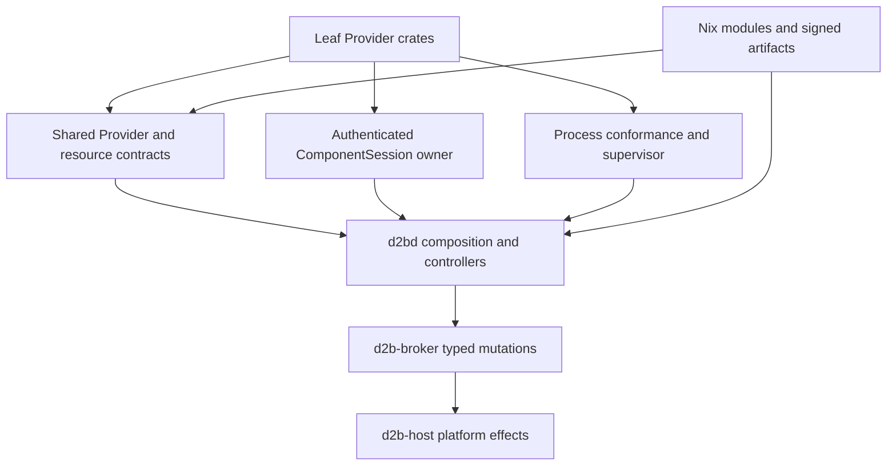
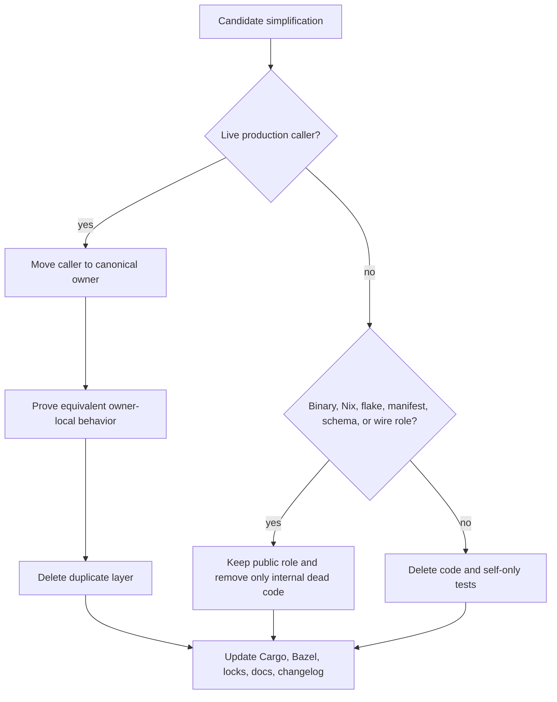
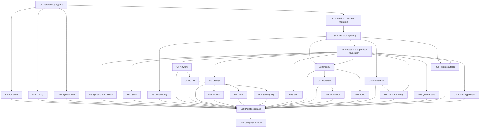

# Provider Workspace Simplification - Plan

## Goal Capsule

- **Objective:** Remove redundant scaffolds, duplicate control planes, test-only production APIs, and unused dependency edges from every provider-named workspace crate while preserving the live Provider, daemon, broker, session, process, storage, network, and device contracts.
- **Scope:** All 32 workspace crates whose package name contains `provider`, plus repo-local production callers, build metadata, owner-local tests, Nix modules, schemas, documentation, and public package outputs affected by their simplification.
- **Authority:** Current passing code and accepted architecture decisions outrank audit estimates. `d2bd` and `d2b-broker` remain the control plane; Provider manifests, exact Zone and generation binding, ComponentSession sealing, process conformance, broker mutation, and the single repair owner remain load-bearing.
- **Execution profile:** Deep, cross-workspace, deletion-first refactor delivered as serial reviewed cohorts from a clean isolated worktree.
- **Stop conditions:** Stop a cohort when reachability differs from the plan, a public artifact changes unexpectedly, an exact authority boundary weakens, a second mutation or repair owner appears, or a retired critical test has no named surviving proof.
- **Tail ownership:** Each unit owns its code, tests, Cargo and Bazel metadata, documentation, changelog fragment, focused validation, independent review, and reviewed-head landing before dependent units begin.

---

## Product Contract

### Summary

The provider workspace will converge on one production path per responsibility.
Leaf crates will retain only behavior used by binaries, Nix evaluation, signed Provider artifacts, daemon composition, or versioned contracts.
Shared lifecycle, session, storage, network, and effect behavior will live with their canonical owners instead of being mirrored inside individual providers.

### Problem Frame

The provider workspace contains substantial parallel machinery that is built and tested but is not part of the live daemon and broker path.
Recurring examples include provider-local lifecycle controllers, audit and telemetry catalogs without emitters, one-product factories, test fakes exported from production modules, duplicate session models, shadow host-effect implementations, and dependencies retained only by those layers.
Independent estimates overlap heavily and sometimes target newly active or security-critical code, so deletion must follow current reachability and ownership evidence rather than raw line-count totals.

### Requirements

- R1. Every provider-named workspace crate must receive an explicit final disposition through an implementation unit, including code retained unchanged because its boundary is load-bearing.
- R2. Code may be deleted only after current non-test callers, binaries, Nix modules, flake outputs, manifests, schemas, and versioned wire contracts are classified.
- R3. A live caller must move to the canonical owner and pass equivalent tests before its duplicate provider layer is removed.
- R4. The refactor must preserve daemon-only lifecycle, broker-only privileged mutation, exact Zone and generation binding, sealed ComponentSession authority, Provider manifest admission, controller placement, and resource mutation seals.
- R5. Network ownership markers, foreign-state preservation, closure-only stores, restart adoption, OFD lock behavior, TPM persistence, USBIP isolation, GPU and video principals, and typed runner and sandbox contracts must remain unchanged.
- R6. Public flake attributes, binaries, Nix modules, signed Provider artifacts, root configuration schemas, and scaffold outputs must remain unless a separate product compatibility decision explicitly retires them.
- R7. Test-only behavior that is deleted must lose its tests; live invariants must move to the surviving owner-local Layer-1 test surface before the old test is retired.
- R8. Dependency cleanup must update `Cargo.toml`, matching `BUILD.bazel` edges, `Cargo.lock`, Guest workspace metadata when applicable, and provider packaging or policy references in the same unit.
- R9. The campaign must not add a new compatibility layer, registry, scheduler, inventory gate, telemetry framework, or abstraction solely to preserve deleted scaffold behavior or meet a line-count target.
- R10. Each unit must leave the workspace independently buildable and testable so later units do not depend on an unreviewable mega-diff.
- R11. The implementation should meet the validated conservative reduction floor of about 14,500 unique lines and 28 direct Cargo dependency edges unless current reachability moves a finding to the deferred set.
- R12. Documentation and changelog updates must track moved authority, retired public surfaces, and corrected stale path references in the same unit as the code change.
- R13. Controller assignment must preserve the complete identity tuple: exact Zone, resource revision, Provider generation, controller generation, ComponentSession generation, assignment epoch, controller role, and exact target.
- R14. Defining-crate compile-fail doctests and trait-solver assertions for capability types are authority evidence even when no production listener currently consumes the type.
- R15. No surviving provider or daemon path may mutate the host directly or pass raw paths, modes, owners, ACLs, or resolved runner arguments around the broker boundary.
- R16. Core storage startup checks must remain read-only and path-free; they may classify contracts and degraded state but may not acquire locks, open mutable paths, repair state, or authorize cleanup.
- R17. Privacy canaries must move to the surviving renderer before audit, telemetry, status, error, or fake layers are removed.

### Scope Boundaries

**In scope**

- Rust source, package tests, Cargo and Bazel metadata, root and Guest lock metadata, Nix provider modules, schemas, provider packaging, and current documentation directly affected by accepted simplifications.
- Caller-first consolidation onto `d2b-core`, `d2b-session`, `d2b-process-conformance`, `d2b-provider-supervisor`, `d2bd`, `d2b-broker`, `d2b-host`, `d2b-audit`, and `d2b-telemetry`.
- Removal of test-only production APIs, dead local state machines, forwarding wrappers, duplicate validators, dependency proxies, and telemetry or audit catalogs with no emitter.

**Deferred to follow-up work**

- Replacing the strict credential protobuf codec with generated code solely to reduce local source.
- Collapsing the live `d2b-provider` registry, instance, generation, drain, and snapshot lifecycle to a descriptor-only map.
- Broad Cloud Hypervisor controller deletion before the current signed artifact and authenticated controller-session seam reaches a clean reviewed head.
- Retiring public scaffold flake outputs for Azure VM, qemu-media, Unix transport, or vsock transport.

**Outside this plan**

- New Provider capabilities, security model changes, public contract redesign, behavioral feature work, or weaker compatibility behavior.
- Removing provider-owned Nix modules merely because the corresponding Rust scaffold is unused.
- Rewriting historical ADRs, released changelog sections, or superseded plans except where a current authority path is factually stale.

### Acceptance Examples

- AE1. Given a provider module with no non-test caller and no public artifact role, when its behavior is removed, then its self-only tests and dependency edges are removed in the same unit.
- AE2. Given a provider facade with one live daemon caller, when the caller is moved to the canonical owner, then equivalent owner-local tests pass before the facade is deleted.
- AE3. Given a proposed simplification touches ComponentSession, Provider placement, storage repair, network ownership, or broker mutation, when the change is reviewed, then the same exact authority and fail-closed behavior remains.
- AE4. Given a crate has no Rust reverse dependency but still owns a binary, Nix module, flake output, schema, or signed artifact, when it is simplified, then that public representation remains unless explicitly deferred for a separate compatibility decision.
- AE5. Given a dependency is removed from a provider crate mirrored into the Guest workspace, when the unit lands, then both workspace metadata sets and their enforcing policy and supply-chain tests agree.
- AE6. Given the unused volume-virtiofs Rust scaffold is retired, when its tests are removed, then rendered argv, chroot, read-only, user-namespace, capability, and closure-only store evidence exists at the live Nix, daemon, supervisor, or broker owner.
- AE7. Given the campaign completes, when all provider crates are mapped to their units, then no accepted finding is silently dropped and every rejected or deferred finding names the preserved boundary.

---

## Planning Contract

### Key Technical Decisions

- KTD1. **Use caller-first deletion.** Move live callers and invariant tests before removing duplicate layers. A zero Rust reverse-dependency count is supporting evidence, not sufficient deletion authority.
- KTD2. **Converge on distinct existing owners.** Registry lifecycle, session admission, bus authorization, controller assignment, process conformance, daemon composition, broker mutation, and platform implementation remain separate layers. `d2b-broker` is the sole privileged mutation and audit owner; `d2b-host` is its platform implementation library, not an alternate caller surface.
- KTD3. **Keep public artifact decisions separate from code reachability.** A scaffold crate may shrink internally while its binary, Nix module, flake output, manifest, schema, or package attribute remains.
- KTD4. **Retire tests with behavior, not by census.** Delete self-only tests when their behavior disappears and move only current invariants to owner-local Layer-1 tests. Do not add a repository-wide removal gate or successor inventory.
- KTD5. **Measure unique reductions conservatively.** Count each source line and Cargo edge once, ignore repeated Bazel labels in estimates, and stop short of introducing replacement abstractions to hit a target.
- KTD6. **Freeze moving Cloud Hypervisor seams.** Only placeholder DTO and dependency hygiene may proceed until the signed Provider artifact and controller binary work is merged on a clean reviewed base.
- KTD7. **Keep cohorts serial where callers overlap.** Network precedes USBIP, storage precedes virtiofs and TPM cleanup, Provider SDK migration precedes toolkit pruning, and display precedes clipboard, notification, and audio changes.
- KTD8. **Use the daemon runtime for supervisor async work.** `d2b-provider-supervisor` may use bounded Tokio primitives supplied by the owning runtime, but it must not create an internal runtime or detach blocking work from late-result reconciliation and shutdown ownership.
- KTD9. **Freeze serialized contracts during this campaign.** Shared-contract cleanup is limited to private helpers, dead exports, and validation reuse. Any serialized field, enum variant, fingerprint, manifest field, or semantic protocol change requires a separate versioned compatibility plan.
- KTD10. **Never simplify into fallback.** Denied admission, stale assignment, broker rejection, ambiguous adoption, foreign ownership, malformed markers, and invalid signatures remain terminal or degraded outcomes; none may select a legacy, default, or alternate target path.

### Canonical Ownership Matrix

| Responsibility | Canonical owner | Provider role after simplification |
| --- | --- | --- |
| Provider registry, generations, drain, snapshots | `packages/d2b-provider/src/{registry,instance}.rs` and `packages/d2bd/src/provider_registry.rs` | Supply validated descriptors and runtime instances. |
| ComponentSession admission and authority | `packages/d2b-session/` and `packages/d2b-session-unix/` | Consume authenticated route evidence once. |
| Zone bus authorization and subject resolution | `packages/d2b-bus/` | Use scoped routes; never accept caller-supplied identity. |
| Controller assignment and effect release | `packages/d2b-core-controller/src/controller_assignment.rs` | Act only under the complete assignment identity tuple. |
| Process launch, adoption, observe, and stop | `packages/d2b-process-conformance/`, `packages/d2b-provider-supervisor/`, and `packages/d2bd/src/process_provider_runtime.rs` | Build typed process intent and consume the shared effect port. |
| Privileged mutation and audit | `packages/d2b-broker/` | Submit typed opaque operations only. |
| Platform implementation | `packages/d2b-host/` | Remain callable through the broker owner. |
| Storage contracts and degraded classification | `packages/d2b-core/src/storage_lifecycle.rs` | Project declared storage and read-only status only. |
| Audit and telemetry contracts | `packages/d2b-audit/`, `packages/d2b-telemetry/`, and shared provider contracts | Emit through existing sinks; do not define local registries without a caller. |

### High-Level Technical Design

Provider crates remain projections and controllers over shared contracts.
They do not own a second session authority, process supervisor, host mutation implementation, storage repair engine, or telemetry registry.

### Delivery Constraints

- Start from a clean reviewed head in an isolated worktree. The local Cloud Hypervisor system-artifact path and Provider packaging work described by `docs/plans/2026-08-25-001-refactor-v3-host-config-cutover-plan.md` must land and pass its U2/U3 evidence before U27 begins.
- Use one reviewed pull request per U-ID unless two adjacent units are inseparable because the first only introduces a temporary caller bridge removed by the second.
- Re-run reachability and test ownership at the start of each unit. Record changed disposition in the pull request, not as a new repository inventory.
- Do not edit shared `d2bd` interaction, process, network, or storage files concurrently across units.
- Every code-bearing unit adds a valid fragment under `changelog.d/`.

### Crate Coverage and Final Ownership

| Crate | Current role | Preparatory touch | Final-disposition owner | Public or shared owner to preserve |
| --- | --- | --- | --- | --- |
| `d2b-contracts-provider` | Versioned Provider contracts | Caller migration across units | U18 | Schemas, manifests, controller placement |
| `d2b-provider` | Live registry plus unused SDK facades | U19 | U2 | `d2bd` registry lifecycle |
| `d2b-provider-toolkit` | Authenticated runtime plus dependency proxies | U19, U2 | U6 | Session runtime and Provider packaging |
| `d2b-provider-supervisor` | Live process backend | U2 | U3 | Daemon runtime and broker process effects |
| `d2b-provider-activation-nixos` | Live activation controller and Nix module | U1 | U4 | Activation runtime and package output |
| `d2b-provider-config-nixos` | Live daemon and CLI config path | U1 | U20 | `d2b` activation and `d2bd` composition |
| `d2b-provider-system-core` | Live Host and User reconciliation | U1 | U21 | `d2bd` resource runtime |
| `d2b-provider-system-minijail` | Fixed Process Provider | U3 | U5 | Process conformance and platform gate |
| `d2b-provider-system-systemd` | Fixed Process Provider | U19, U3 | U5 | Process conformance and systemd identity |
| `d2b-provider-shell-terminal` | Live shell authority and supervisor resources | U3 | U22 | Exact-uid USER scope and PTY owner |
| `d2b-provider-observability-otel` | One live semantic child declaration | U19, U2 | U6 | Nix observability and shared telemetry |
| `d2b-provider-network-local` | Live reconciler plus shadow host effects | U3 | U7 | Network Nix, broker, `d2b-host` |
| `d2b-provider-device-usbip` | Live child and claim state plus duplicate control plane | U3, U7 | U8 | Nix gating and broker USBIP operations |
| `d2b-provider-volume-local` | Live Nix and startup diagnostics plus duplicate repair stack | U3 | U9 | Core storage, broker repair, Nix store |
| `d2b-provider-volume-virtiofs` | Unused Rust scaffold plus structural tests | U3, U9 | U10 | Rendered process, broker sandbox, storage |
| `d2b-provider-device-tpm` | Live resource controller plus mirrors | U3, U9 | U11 | TPM marker, runner, broker hardening |
| `d2b-provider-device-security-key` | Live physical-device authority | U19, U3, U8 | U12 | Daemon effect port and shared USB authority |
| `d2b-provider-device-gpu` | Typed argv, Nix contract, and self-only lifecycle layers | U3 | U23 | GPU/video Nix, principals, runner contract |
| `d2b-provider-display-wayland` | Live proxy, policy, and Nix module | U19, U3 | U13 | Wayland proxy and UI color contract |
| `d2b-provider-clipboard-wayland` | Live clipd mediation | U19, U13 | U14 | Clipd binary and interaction composition |
| `d2b-provider-notification-desktop` | Live helper and interaction runtime | U19, U14 | U15 | Notification Nix and daemon composition |
| `d2b-provider-audio-pipewire` | Live audio runtime and Nix module | U3, U13 | U24 | Audio daemon controllers and PipeWire Nix |
| `d2b-provider-credential-entra` | Provider binary and credential controller | U19 | U16 | Credential placement and delivery contracts |
| `d2b-provider-credential-managed-identity` | Agent and controller binaries | U19 | U16 | Two-binary boundary and gateway placement |
| `d2b-provider-credential-secret-service` | Provider binary and local credential service | U19 | U16 | UserAgent placement and lease state |
| `d2b-provider-runtime-azure-container-apps` | Live gateway runtime | U16 | U17 | Gateway-local effects and credentials |
| `d2b-provider-transport-azure-relay` | Live gateway transport | U16 | U17 | Relay socket and credential boundaries |
| `d2b-provider-runtime-qemu-media` | Public scaffold and qemu-media Nix | U3 | U25 | QMP and process shape |
| `d2b-provider-runtime-azure-virtual-machine` | Public scaffold output | U1 | U26 | Flake package and root schema |
| `d2b-provider-transport-unix` | Public scaffold output | U19 | U26 | Flake package and transport portal |
| `d2b-provider-transport-vsock` | Public scaffold output | U19 | U26 | Flake package and ComponentSession transport |
| `d2b-provider-runtime-cloud-hypervisor` | Signed artifact and active daemon runtime | U19, U3 | U27 | Manifest, signature, catalog, controller binary |

### Risks and Dependencies

- The workspace is currently changing around Cloud Hypervisor packaging and Provider admission. U27 must use the merged reviewed shape, not the audit snapshot.
- Removing shared toolkit re-exports can temporarily add direct session dependencies to callers. U2 must complete those moves before U6 judges final dependency savings.
- Supervisor concurrency simplification can change late-result or adoption behavior even when tests compile. U3 is a prerequisite for lifecycle-wrapper deletion in later providers.
- Network and storage cuts are security-sensitive because duplicate code may still encode tests for the live owner. U7, U9, and U10 must relocate evidence before deletion.
- The conservative reduction estimate is not a contractual reason to delete uncertain code. R4-R6 override R11.
- Deleting canary or redaction wrappers can remove the only privacy proof even when the wrapper has no runtime caller. R17 requires a named successor test before deletion.
- A catalog or package cleanup can accidentally turn an expected v3 Provider registry into an empty or legacy dispatch path. Active configurations must remain active and malformed, stale, or foreign publications must remain refused.

### System-Wide Impact

| Surface | Authority before and after | State and failure propagation | Rollback and proof |
| --- | --- | --- | --- |
| Provider registry and session | Registry, session admission, bus authorization, and assignment remain distinct owners. | Denied admission, stale identity tuple, disconnected session, or unready target fails before query, mutation, or effect release. | Restore the cohort; prove with registry, session, bus, and daemon acceptance tests. |
| Process lifecycle | Process conformance and the daemon runtime continue to own launch, adoption, timeout, late result, and stop. | Timeout never abandons a blocking task; ambiguous adoption remains quarantined. | Restore supervisor cohort; prove with conformance, late-success, cancellation, and shutdown tests. |
| Broker and host effects | Broker remains the sole mutation and audit owner; `d2b-host` remains an implementation library. | Guest-profile or stale-bundle requests fail before mutation; the resolver reloads per accepted request. | Restore the effect cohort; prove with host, Guest, profile separation, and affected operation tests. |
| Network and USB devices | Exact ownership markers and shared physical-device claims remain authoritative. | Foreign or malformed ownership, cross-environment claims, and release ambiguity fail closed without destructive cleanup. | Restore U7/U8/U12; prove apply and destroy paths plus cross-provider mutual exclusion. |
| Storage and TPM | Core classifies; broker repairs; providers project declared state. | Missing contracts, ambiguous locks, or replaced TPM state become typed degraded or refusal outcomes without cleanup. | Restore U9-U11; prove opaque-id requests, restart adoption, marker, and persistent-state tests. |
| Display and interaction | Authenticated route evidence and exact Zone remain required for mediation. | Missing dependencies, fd errors, or finalization failures surface visibly and never release authority early. | Restore the affected interaction cohort; prove real binary, fd, lifecycle, and Nix tests. |
| Credentials and cloud | Credentials remain inside the realm gateway and are scoped by Provider instance, Zone, subject/session, owner, and credential identity. | Relay identity never authenticates locally; revoke and cleanup affect only the matching owner. | Restore U16/U17; prove placement, dual-owner, zeroization, revoke, and redaction tests. |
| Contracts and artifacts | Serialized contracts, signatures, fingerprints, and public package outputs remain frozen. | Invalid signatures, missing catalog rows, stale publication, or incompatible placement remain refusal outcomes without fallback. | Restore U18/U27; prove schema, manifest, catalog, signature, and packaging drift tests. |

No impact path may fall back to a legacy dispatch, default target, alternate placement, direct host mutation, forced cleanup, or compatibility re-export.

### Campaign Dependency Graph

### Sources and Research

- Product and architecture: `STRATEGY.md`, `docs/explanation/design.md`, `docs/contributing/architecture.md`, and `docs/contributing/critical-subsystems.md`.
- Binding decisions: `docs/adr/0015-daemon-only-clean-break.md`, `docs/adr/0021-broker-user-namespace-for-virtiofsd.md`, `docs/adr/0034-storage-lifecycle-restart-and-synchronization.md`, and `docs/adr/0043-realm-native-control-plane.md`.
- Provider and controller contracts: `packages/d2b-contracts-provider/src/v3/`, `packages/d2b-provider/src/`, `packages/d2b-core-controller/src/controller_assignment.rs`, and `packages/d2bd/src/provider_registry.rs`.
- Canonical session and process owners: `packages/d2b-session/`, `packages/d2b-session-unix/`, `packages/d2b-process-conformance/`, `packages/d2b-provider-supervisor/`, and `packages/d2bd/src/process_provider_runtime.rs`.
- Build and test policy: `tests/AGENTS.md`, `docs/contributing/gates-and-lints.md`, root `Cargo.toml`, `bazel/checks/BUILD.bazel`, and `packages/xtask/src/provider_crate_policy.rs`.

---

## Implementation Units

### Unit Index

| Unit | Outcome | Primary paths | Depends on |
| --- | --- | --- | --- |
| U1 | Remove obvious unused dependency edges | provider manifests, Bazel, locks | None |
| U19 | Move session consumers to canonical owners | toolkit callers, session crates | U1 |
| U2 | Prune Provider SDK and toolkit facades | `d2b-provider`, toolkit | U19 |
| U3 | Establish the canonical process and supervisor seam | supervisor, process providers, `d2bd` | U2 |
| U4 | Remove activation mirrors | activation provider and caller | U1 |
| U20 | Collapse config facades | config provider, CLI, daemon | U1 |
| U21 | Remove system-core mirrors | system-core provider and daemon | U1 |
| U5 | Remove systemd and minijail side frameworks | fixed Process Providers | U3 |
| U22 | Remove shell-only mirrors | shell provider and daemon | U3 |
| U6 | Reduce observability to live child declarations | observability, toolkit, `d2bd` | U2 |
| U7 | Consolidate Network effects on daemon and broker owners | network provider, `d2bd`, `d2b-host` | U3 |
| U8 | Remove the second USBIP control plane | USBIP provider and live daemon path | U3, U7 |
| U9 | Move storage diagnostics and delete duplicate repair machinery | volume-local, Core, `d2bd` | U3 |
| U10 | Relocate virtiofs evidence and retire the unused Rust scaffold | virtiofs provider, Nix, broker tests | U3, U9 |
| U11 | Remove TPM mirrors while retaining live state authority | TPM provider and daemon adapter | U3, U9 |
| U12 | Remove dead security-key provider layers | security-key provider and daemon callers | U3, U8 |
| U23 | Remove dead GPU provider layers | GPU provider and Nix contracts | U3 |
| U13 | Consolidate display policy and lifecycle | display provider and Wayland proxy | U2, U3 |
| U14 | Simplify clipboard mediation after display settles | clipboard provider and interaction composition | U13 |
| U15 | Simplify notification lifecycle | notification and interaction composition | U14 |
| U24 | Simplify audio mediation | audio provider and daemon audio owners | U13 |
| U16 | Consolidate credential provider construction and state | Entra, managed identity, secret service | U2 |
| U17 | Consolidate ACA and Azure Relay | ACA, relay, gateway runtime | U3, U16 |
| U25 | Remove qemu-media local simulators | qemu-media Provider and Nix | U3 |
| U26 | Shrink Azure VM, Unix, and vsock public scaffolds | three public scaffold crates | U2, U3 |
| U27 | Simplify Cloud Hypervisor after artifact stabilization | signed Provider and daemon runtime | U2, U3 |
| U18 | Prune private shared-contract helpers | provider contracts | U4-U17, U20-U27 |
| U28 | Close workspace metadata and measure the campaign | workspace, Bazel, locks, docs | U18 |

### U1. Removing obvious unused dependency edges

- **Goal:** Remove direct dependencies with no current source import and demote production dependencies used only by tests without changing behavior.
- **Requirements:** R2, R8-R10.
- **Dependencies:** None.
- **Files:** Provider `Cargo.toml` and `BUILD.bazel` files, root `Cargo.lock`, `tests/fixtures/guest-rust-workspace/Cargo.toml`, `packages/Cargo.guest.lock`, fixture overrides, and `packages/xtask/src/provider_crate_policy.rs` only when membership changes.
- **Approach:** Recompute imports against the clean baseline, remove each Cargo edge once, sweep matching Bazel labels, and update Guest metadata only for mirrored crates. Do not remove edges whose only consumer is scheduled for a later unit.
- **Patterns to follow:** Cargo remains dependency authority; Bazel mirrors target edges; Guest workspace changes follow `tests/AGENTS.md`.
- **Test scenarios:**
  - A removed dependency has no production, test, build-script, generated-code, doctest, or feature-gated import.
  - A test-only dependency remains available only to the targets that need it.
  - A mirrored Guest crate resolves with the same direct dependency shape and refreshed lock metadata.
  - Provider packaging and crate-layout policy still discover every retained crate.
- **Verification:** Dependency metadata, supply-chain policy, package-level builds, and provider packaging drift remain green with no runtime output change.

### U19. Moving session consumers to canonical owners

- **Goal:** Move every production consumer off toolkit session re-exports and parallel Provider session types before any SDK or toolkit facade is deleted.
- **Requirements:** R3-R4, R13-R14, R17, AE2, AE3.
- **Dependencies:** U1.
- **Files:** `packages/d2b-provider-toolkit/src/lib.rs`, session imports in `packages/d2b-provider-{clipboard-wayland,display-wayland,notification-desktop,observability-otel,system-systemd}/`, credential and transport session callers, `packages/d2b-session/`, `packages/d2b-session-unix/`, and tests `packages/d2b-session/tests/{admission,component_session}.rs`, `packages/d2b-session-unix/tests/{subject_mapping,unix_session}.rs`, and `packages/d2bd/tests/zone_provider_acceptance.rs`.
- **Approach:** Import authority and transport types from their defining crates, retain only thin authenticated Provider runtime glue, and remove no type or test until every external toolkit and parallel Provider session import has moved. Do not add compatibility re-exports.
- **Patterns to follow:** Private `SessionAuthority`, consumed `SessionAcceptor`, authenticated route binding, defining-crate trait-solver assertions, and compile-fail doctests.
- **Test scenarios:**
  - An external crate cannot name or implement `SessionAuthority`.
  - `SessionAcceptor`, `AuthenticatedComponentSession`, route evidence, and attachment credits remain non-clonable and single-use.
  - Each stale identity field in R13 fails before registration, query, mutation, or effect release.
  - Production consumers compile against owning session crates without a toolkit or Provider compatibility alias.
  - Existing privacy canaries still execute at the surviving renderer.
- **Verification:** Session, Unix peer, bus authorization, controller assignment, and daemon Provider acceptance tests prove the direct-owner imports.

### U2. Pruning the Provider SDK and toolkit facades

- **Goal:** Remove unused Provider agent, RPC, context, session, share, forwarding, fixture, fake, value, schema, and testing facades while retaining the live registry and authenticated Provider runtime.
- **Requirements:** R1-R4, R7-R10, AE2, AE3.
- **Dependencies:** U19.
- **Files:** `packages/d2b-provider/src/{agent,context,forwarding,rpc,session,share_adapter,installation}.rs`, retained registry files, `packages/d2b-provider-toolkit/src/{agent,fixture,fakes,registration,runtime,schema,server,testing,values}.rs`, `packages/d2b-provider-{clipboard-wayland,display-wayland,notification-desktop,observability-otel,system-systemd}/`, and tests `packages/d2b-provider/tests/runtime.rs`, `packages/d2b-provider-toolkit/tests/{conformance,fake_provider,malicious_provider}.rs`, `packages/d2b-session/tests/{admission,component_session}.rs`, and `packages/d2bd/tests/zone_provider_acceptance.rs`.
- **Approach:**
  1. Replace toolkit production fakes with minimal test-local doubles.
  2. Retain `session_runtime.rs` as the single authenticated Provider dispatch path and delete competing generic agent loops.
  3. Reduce the authenticated path to one bounded dispatch and audit adapter.
  4. Use native registry and manifest admission APIs directly.
  5. Delete Provider SDK surfaces only after no retained caller imports them.
  6. Keep `ProviderRegistryBuilder`, `ProviderInstance`, manager snapshots, generation checks, drain, and republication behavior.
- **Patterns to follow:** `packages/d2b-provider-toolkit/src/session_runtime.rs`, `packages/d2b-session/src/`, and `packages/d2bd/src/provider_registry.rs`.
- **Test scenarios:**
  - Authenticated route evidence is consumed once and cannot mint or clone session authority.
  - Exact R13 identity, duplicate registration, drain, and republication behavior remains.
  - Malicious or malformed Provider manifests fail at the same admission boundary.
  - A bundle version that expects Provider catalog data refuses missing rows instead of selecting legacy dispatch.
  - Stale or foreign-Zone publication leaves the current registry unchanged.
  - No production crate imports toolkit session re-exports or the deleted Provider agent types.
  - Deleted fake runtime orchestration has no production or test caller.
- **Verification:** Provider runtime, toolkit conformance, session capability tests, daemon Provider acceptance, and manifest admission prove the smaller SDK has identical live authority.

### U3. Establishing the canonical process and supervisor seam

- **Goal:** Replace custom blocking-pool and one-owner forwarding machinery with bounded Tokio primitives and direct process-conformance ownership before leaf lifecycle wrappers are removed.
- **Requirements:** R3-R5, R9-R10, AE2, AE3.
- **Dependencies:** U2.
- **Files:** `packages/d2b-provider-supervisor/src/{adapter,broker,systemd,metrics,tracing}.rs`, `packages/d2bd/src/process_provider_runtime.rs`, `packages/d2b-process-conformance/`, tests `packages/d2b-provider-supervisor/tests/production_adapter.rs`, `packages/d2b-provider-system-{systemd,minijail}/tests/conformance.rs`, and direct `packages/d2bd` process runtime tests.
- **Approach:** Use bounded Tokio primitives from the daemon-owned runtime without creating a runtime inside the supervisor. A blocking task retains its permit and operation ownership after caller timeout, reconciles one late result, and remains owned through shutdown. Collapse the generic systemd backend onto the sole production owner, share pending observation state and broker configuration, and remove dead telemetry and write-only quarantine metadata.
- **Patterns to follow:** `d2b_process_conformance::ProcessLaunchEffectPort`, typed launch and adoption evidence, and broker profile separation.
- **Test scenarios:**
  - A timed-out launch that succeeds late is reconciled to the exact retained handle instead of leaked or double-started.
  - Saturation after timed-out callers remains bounded because permits are held until blocking work completes.
  - A cancelled waiter does not cancel or detach the owned blocking operation.
  - Dropping the supervisor during an operation preserves shutdown ownership and one terminal reconciliation.
  - Launch, adopt, observe, and stop preserve pid, start-time, InvocationID, cgroup, profile, and generation identity.
  - Ambiguous adoption remains quarantined and cannot widen to a broad kill.
  - System and user managers stay profile-separated.
  - Cancellation and repeated stop remain idempotent.
- **Verification:** Process conformance, supervisor tests, and `packages/d2b-controller-toolkit/benches/reaction.rs` through `//packages/d2b-controller-toolkit:reaction_test` prove equivalent lifecycle behavior without the custom future and forwarding layers.

### U4. Removing activation mirrors

- **Goal:** Delete the unused activation runner, host-generation diagnostic wrapper, manifest mirror, and test-only Nix projections while retaining the live controller and broker helper path.
- **Requirements:** R1-R3, R7-R10.
- **Dependencies:** U1.
- **Files:** `packages/d2b-provider-activation-nixos/src/{runner,manifest}.rs`, `packages/d2b-provider-activation-nixos/src/diagnostics/`, `packages/d2b-provider-activation-nixos/nix/default.nix`, `packages/d2bd/src/activation_resource_runtime.rs`, tests `packages/d2b-provider-activation-nixos/tests/{reconcile,runner,scaffold}.rs`, and `packages/d2b-provider-activation-nixos/nix/tests/default.nix`.
- **Approach:** Preserve the typed generation observation and helper dispatch used by `d2bd`, remove the parallel runner and DTOs, and keep only Nix projections with a production emitter.
- **Patterns to follow:** Existing activation controller, broker helper operation, and provider-specific Nix surface.
- **Test scenarios:**
  - Activation observes and reconciles the declared generation through the live helper path.
  - Host-generation diagnostics remain typed and path-free at their canonical owner.
  - Deleted runner, manifest, and Nix builder surfaces have no registration or caller.
  - The package output and Nix Provider shape remain unchanged.
- **Verification:** Activation reconcile and scheduled provider Nix tests cover the surviving path; self-only runner and scaffold tests are retired with their behavior.

### U20. Collapsing config facades

- **Goal:** Replace generic config service, backend, client, descriptor, and duplicate validation layers with one concrete typed read path used by both CLI and daemon callers.
- **Requirements:** R1-R3, R7-R10, R17.
- **Dependencies:** U1.
- **Files:** `packages/d2b-provider-config-nixos/src/{controller,service,ttrpc}.rs`, `packages/d2b/src/activation.rs`, `packages/d2b/BUILD.bazel`, `packages/d2bd/src/composition.rs`, and tests `packages/d2b-provider-config-nixos/tests/{config_lifecycle,redaction,service_contract}.rs`.
- **Approach:** Validate and deserialize each request once, store the concrete reader instead of a one-implementation trait object, expose a fixed read method, use bounded standard I/O for the securely opened fd, and remove unused schema derives and public helpers.
- **Patterns to follow:** `GuestConfigReader`, typed `ConfigSyncResponse`, existing CLI activation, and daemon composition.
- **Test scenarios:**
  - CLI and daemon callers receive the same validated document and stable errors.
  - Authorization, size bounds, malformed JSON, empty input, and redaction remain fail closed.
  - No descriptor shadow contract or arbitrary generic request method remains.
  - Removing schema derives does not affect a generator or package artifact.
- **Verification:** Config lifecycle, redaction, service contract, `//packages/d2b:all-tests`, and daemon tests cover the concrete path.

### U21. Removing system-core mirrors

- **Goal:** Delete parallel bootstrap, NSS, audit, manifest, status, and private Host reconciliation layers while retaining the live Host and User owners.
- **Requirements:** R1-R4, R7-R10, R17.
- **Dependencies:** U1.
- **Files:** `packages/d2b-provider-system-core/src/{audit,bootstrap,handler_status,host_process_audit,host_reconciler,manifest,nss}.rs`, retained Host and User reconciler modules, `packages/d2bd/src/resource_runtime.rs`, and tests under `packages/d2b-provider-system-core/tests/`.
- **Approach:** Test public reconciliation directly, use the live opaque User discovery effect port, flatten only private report serialization, and remove sha2 and zone-session edges after their callers disappear.
- **Patterns to follow:** `HostReconciler`, `UserReconciler`, shared status emitter, and daemon resource runtime.
- **Test scenarios:**
  - Host no-isolation posture, User discovery, ownership allowlist, and Provider boundary remain.
  - Raw NSS and duplicate Host reconcilers have no caller.
  - Audit and status privacy canaries move to the live daemon renderer before wrappers disappear.
  - Report serialization preserves its public shape.
- **Verification:** System-core host, user, ownership, boundary, and daemon resource-runtime tests cover the surviving owners.

### U5. Removing systemd and minijail side frameworks

- **Goal:** Delete provider-local lifecycle mirrors and test-only compiler forks while retaining the fixed Process Providers.
- **Requirements:** R3-R5, R7-R10.
- **Dependencies:** U3.
- **Files:** `packages/d2b-provider-system-systemd/src/{adoption,audit,controller,drain,effect_port,error,guest_exec,launch,lifecycle,manifest,metrics,sandbox}.rs`, `packages/d2b-provider-system-minijail/src/{adoption,effect_port,effect_result,ephemeral,finalize,manifest,sandbox_compiler,user_ns}.rs`, `packages/d2bd/src/process_provider_runtime.rs`, and related provider tests.
- **Approach:** Call fixed process providers and process-conformance types directly, remove the second effect traits and compiler models, and retain platform, identity, sandbox, adoption, and late-result checks.
- **Patterns to follow:** `packages/d2bd/src/process_provider_runtime.rs`, `d2b-process-conformance`, `PlatformGate`, and systemd invocation identity.
- **Test scenarios:**
  - Systemd and minijail launch, adoption, stop, parent, sandbox, and platform-gate behavior remains.
  - Wrong profile, stale generation, ambiguous identity, and invalid parent fail before process effects.
  - Deleted controller, guest-exec, compiler, and result wrappers have no caller.
- **Verification:** Provider conformance, execution-parent, platform, boundary, and `//packages/d2b-controller-toolkit:reaction_test` coverage prove the fixed providers.

### U22. Removing shell-only mirrors

- **Goal:** Delete shell process-lifecycle, observability, template, placement, migration, and unused capability-consume layers while retaining the live shell authority, session, PTY, and supervisor resources.
- **Requirements:** R3-R5, R7-R10, R17.
- **Dependencies:** U3.
- **Files:** `packages/d2b-provider-shell-terminal/src/{guest_rules,host_rules,migration,observability,process_lifecycle,process_templates}.rs`, `src/service/supervisor.rs`, `packages/d2bd/src/{composition,interaction_composition}.rs`, and shell tests.
- **Approach:** Use `ShellAuthorityLedger`, `DaemonShellAuthority`, `SupervisorProcessResource`, and atomic capability attachment directly. Remove production test doubles and state projections with no caller.
- **Patterns to follow:** Exact authenticated uid, verified transient USER scope, bounded merged-output ring, private same-uid listener, and path-free diagnostics.
- **Test scenarios:**
  - The shell starts only for the exact authenticated uid and owns the PTY in the verified USER scope.
  - Reconnect, bounded output, teardown, ledger adoption, and privacy behavior remains.
  - Capability attachment is admitted atomically and cannot be consumed twice.
  - Removed migration, template, placement, and observability models are not referenced by production.
- **Verification:** Shell authz, adoption, ring, service, process conformance, and supervisor runtime tests prove the live path.

### U6. Reducing observability to the live semantic child declaration

- **Goal:** Replace the stateful observability controller with one pure child-resource declaration, then remove the unwired ingress, emitter, agent, config, metrics, and toolkit audit bridge.
- **Requirements:** R3-R4, R7-R10.
- **Dependencies:** U2.
- **Files:** `packages/d2b-provider-observability-otel/src/{agent,config,controller,emitter_socket,ingress_policy,metric_policy,metrics}.rs`, `packages/d2bd/src/semantic_binding_resource_runtime.rs`, remaining toolkit audit code, and tests `packages/d2b-provider-observability-otel/tests/{binding_controller,ingress_metric_policy}.rs`.
- **Approach:** Expose a pure function over target and Provider identity, move the sole daemon caller, preserve shared telemetry frame, privacy, and cardinality contracts, and leave Nix observability modules unchanged. Finish the toolkit audit cleanup only after no observability caller remains.
- **Patterns to follow:** Shared semantic child contracts in `d2b-contracts-provider` and telemetry policy in `d2b-telemetry`.
- **Test scenarios:**
  - Guest and non-Guest targets produce the same endpoint and process children, placement, Provider ref, and required effect classes.
  - No unwired socket, quarantine engine, duplicate metric registry, or second audit ring remains.
  - No external crate imports a toolkit audit, fake, value, schema, or session proxy scheduled for deletion.
  - Nix observability evaluation is byte-for-byte unchanged where the Rust controller was not involved.
- **Verification:** Semantic child and Nix tests prove the pure declaration replaces the stateful scaffold.

### U7. Consolidating Network effects on daemon and broker owners

- **Goal:** Remove shadow bridge, netlink, nftables, route, and daemon-only diagnostic layers after all live effects dispatch through the existing daemon broker and `d2b-host`.
- **Requirements:** R3-R5, R7-R10, AE3.
- **Dependencies:** U3.
- **Files:** `packages/d2b-provider-network-local/src/{bridge_port,ifname,netlink,nftables,routes}.rs`, `packages/d2b-provider-network-local/src/diagnostics/`, retained reconciler and broker surface, `packages/d2bd/src/{composition,network_effect_port}.rs`, `packages/d2b-host/src/`, tests `packages/d2b-provider-network-local/tests/{reconcile,network_primitives,net_vm_artifact_is_generic,telemetry_redaction}.rs`, `tests/unit/nix/cases/net-vm-network.nix`, and `tests/unit/nix/surfaces/network.nix`.
- **Approach:** Preserve the reconciler API used by `d2bd`, route host mutations directly through typed broker operations, remove dummy VM context for host-wide NetworkManager work, move daemon-only diagnostics into `d2bd`, and delete declaration-only integration inventory.
- **Patterns to follow:** `DaemonNetworkBroker`, `d2b-host` network implementations, ownership comments, and fail-closed foreign marker handling.
- **Test scenarios:**
  - The net VM keeps the `lib.mkForce` DHCP neutralizer.
  - Foreign nftables and hosts content remains byte-for-byte preserved.
  - Apply and destroy change only exactly owned nftables chains; sibling environment and USBIP chains remain untouched.
  - Mismatched or malformed NetworkManager markers prevent write, removal, and reload.
  - Malformed hosts delimiters preserve the original bytes and systemd-networkd remains detection-only.
  - Route preflight and external NIC authority retain exact Zone and generation checks.
  - Before provider diagnostics are deleted, `packages/d2bd/src/composition.rs` owns equivalent canaries proving interface names, addresses, ownership ids, paths, and foreign marker payloads cannot enter diagnostics.
  - No provider-local host implementation can mutate outside the broker owner.
- **Verification:** Network Rust tests, `//packages/d2b-host:all-tests`, affected broker operation tests, and the network Nix surface prove apply and destroy behavior before shadow code is deleted.

### U8. Removing the second USBIP control plane

- **Goal:** Keep only the live semantic child declaration, claim state, failure classification, and stop reconciliation while deleting the unused planner, argv, dispatcher, arbitration, firewall, process, and worker framework.
- **Requirements:** R3-R5, R7-R10.
- **Dependencies:** U3, U7.
- **Files:** `packages/d2b-provider-device-usbip/src/{arbitration,busid,controller,firewall,lifecycle,process,production,state_machine,usbip_argv,workers}.rs`, retained `reconcile_state.rs`, `packages/d2bd/src/{composition,semantic_binding_resource_runtime,usbip_production}.rs`, `packages/d2b-core/src/device_usbip_adapter.rs`, provider tests, and `packages/d2b-provider-device-usbip/nix/tests/default.nix`.
- **Approach:** Move the pure child declaration to the shared semantic owner, remove discarded production context, reduce reconciliation to live claims and closed failures, and test argv and ordering at the real daemon and broker request sites.
- **Patterns to follow:** Nix gating, `UsbipBindFirewallRule`, broker bind and unbind, and typed `SpawnRunner`.
- **Test scenarios:**
  - Only opted-in environments can expose the requested busid.
  - Firewall ownership, bind, attach process identity, detach, and stop ambiguity remain exact.
  - A wrong Zone or stale generation cannot attach a device.
  - Post-bind inspection failure releases the claim, while stream-fd release timeout preserves the claim and prevents driver unbind.
  - Foreign firewall ownership prevents both apply and destroy without altering foreign bytes.
  - Removed provider-local planner and argv types have no surviving caller or test-only compatibility shim.
- **Verification:** `//bazel/checks/nix:nix-unit-provider-device-usbip`, daemon, broker, and retained provider claim tests prove the smaller live path. If live ordering or cross-environment isolation changes, the unit also requires the existing host-backed USBIP lane rather than static evidence alone.

### U9. Moving storage diagnostics and deleting duplicate repair machinery

- **Goal:** Move startup storage checks beside the Core storage contract, then remove the provider-local filesystem, lock, marker, migration, relocation, sealing, snapshot, ACL, export, quota, audit, and telemetry frameworks.
- **Requirements:** R3-R5, R7-R10.
- **Dependencies:** U3.
- **Files:** `packages/d2b-provider-volume-local/src/{acl,atomic,audit,effect_port,exports,lock,marker,migration,otel,path,quota,relocation,sealing,snapshot}.rs`, `packages/d2b-provider-volume-local/src/diagnostics/storage_lifecycle.rs`, selected `source.rs` and `layout.rs` code, `packages/d2b-core/src/storage_lifecycle.rs`, `packages/d2bd/src/composition.rs`, `packages/d2b-contracts-resource/src/v3/volume.rs`, provider tests, `tests/unit/nix/surfaces/storage-volume.nix`, and `docs/contributing/critical-subsystems.md`.
- **Approach:** Move the two live startup report entry points and their tests into Core as read-only classification functions, add read-only contract accessors instead of JSON round-trips, retain Nix store and storage emitters, and delete every second repair owner. Map every removed mutation or cleanup path to a live broker opaque-id operation or prove it unreachable.
- **Patterns to follow:** ADR 0034, broker-resolved opaque ids, anchored paths, `O_CLOEXEC` OFD locks, explicit fd transfer, restart adoption, and one named repair owner.
- **Test scenarios:**
  - Missing, duplicate, stale, or legacy storage contracts produce the same path-free reports.
  - Closure-only store views, same-filesystem checks, copy fallback, and storage and sync schemas remain.
  - Lock order, lease transfer, restart adoption, and degraded ambiguity stay fail closed.
  - Core cannot open locks, resolve mutable paths, repair state, force unlock, or authorize cleanup.
  - Broker storage requests expose only opaque ids; ambiguous adoption or lock ownership produces typed degraded state without cleanup.
  - No provider-local path, lock, marker, cleanup, or repair implementation remains.
- **Verification:** `//packages/d2b-core:all-tests`, `//packages/d2b-contracts-resource:all-tests`, retained volume contract tests, Nix storage surface, broker tests, and fixture contracts prove the move.

### U10. Relocating virtiofs evidence and retiring the unused Rust scaffold

- **Goal:** Move structural virtiofs and user-namespace proof to the live rendered process, supervisor, and broker owners, then remove the unused library-only Provider scaffold.
- **Requirements:** R1-R10, AE4, AE6.
- **Dependencies:** U3, U9.
- **Files:** `packages/d2b-provider-volume-virtiofs/`, root workspace and Bazel membership, `bazel/checks/BUILD.bazel`, `packages/xtask/{BUILD.bazel,src/provider_crate_policy.rs}`, relevant root schema decision, `nixos-modules/{processes-json,resources-zones-processes}.nix`, broker and daemon runner tests, `packages/d2b-provider-volume-virtiofs/tests/lifecycle.rs`, `docs/contributing/critical-subsystems.md`, and `docs/explanation/daemon-lifecycle.md`.
- **Approach:** First relocate chroot, zero capability, no start-root, read-only, user-namespace map order, `--inode-file-handles=never`, fd/path privacy, restart adoption, and closure-only evidence. Then delete the Rust scaffold, its self-only tests, and stale build references. Retain the root config schema only if it still belongs to an authored future Provider artifact.
- **Patterns to follow:** ADR 0021, generated `processes.json`, broker `SpawnRunner`, and the single repair owner.
- **Test scenarios:**
  - The live rendered runner still proves every virtiofsd sandbox and namespace invariant.
  - The Guest receives only the closure-only store and declared volume views.
  - Daemon restart adoption and broker ownership remain.
  - Deleting the crate does not remove a flake output, Nix module, or active schema unintentionally.
- **Verification:** Run the provider crate suite before deletion. After deletion, owner-local rendered artifact, daemon, supervisor, broker, storage, and Nix tests replace every retired assertion, and workspace, Bazel suites, xtask policy, schemas, and docs contain no stale crate reference.

### U11. Removing TPM mirrors while retaining live state authority

- **Goal:** Delete the unused legacy controller, status, pathful argv, resource builders, and effect wrappers while retaining the live resource controller, marker policy, state preparation, typed runner, and broker hardening.
- **Requirements:** R3-R5, R7-R10.
- **Dependencies:** U3, U9.
- **Files:** `packages/d2b-provider-device-tpm/src/{controller,resources,status,swtpm_argv}.rs`, retained `resource_controller.rs`, `runner.rs`, and `state.rs`, `packages/d2bd/src/tpm_effect_port.rs`, tests `packages/d2b-provider-device-tpm/tests/{conformance,fault_swtpm_missing,resource_controller}.rs`, broker swtpm tests, and `docs/contributing/critical-subsystems.md`.
- **Approach:** Retain `swtpm_argv.rs` until rendered bundle, daemon effect-port, and broker runner evidence proves `runner.rs` is the actual production authority. Then point docs and golden evidence to the live runner, remove discarded JSON child builders and no-op flush retention, and simplify validation results without weakening the closed observation match.
- **Patterns to follow:** Broker-provisioned swtpm directory, identity-bound marker, dedicated principal, and live `SwtpmArgv`.
- **Test scenarios:**
  - Previously provisioned missing or replaced TPM state still fails closed.
  - Correct-owner existing state reconciles without wiping NVRAM.
  - Prepare, mandatory flush, and start occur in order; a failed flush prevents start.
  - Attacker-created bytes and marked-missing state remain untouched and fail before creation.
  - Failed start never deletes or replaces persistent TPM state.
  - The live runner uses the expected principal, sandbox, volume, and socket behavior.
  - Removed legacy argv and controller paths are absent from docs and build targets.
- **Verification:** TPM resource, fault, broker hardening, and Nix state tests prove persistence and ownership.

### U12. Removing dead security-key provider layers

- **Goal:** Delete duplicate descriptors, process declarations, CID and framing models, inventory ports, and controller lease scaffolds after naming the surviving shared physical-USB authority.
- **Requirements:** R3-R5, R7-R10, R13, R17.
- **Dependencies:** U3, U8.
- **Files:** `packages/d2b-provider-device-security-key/src/{cid,controller,descriptor,effect_port,lease,process,relay,session_ring}.rs`, retained admission and runtime paths, `packages/d2bd/src/security_key*.rs`, `packages/d2b-core/src/device_usbip_adapter.rs`, security-key tests, and `packages/d2b-provider-device-security-key/nix/tests/default.nix`.
- **Approach:** Keep exact admission, live relay/session ownership, and the Core-owned shared physical-USB claim. Move no authority into a test helper or local ledger. Delete only wrappers whose destination is named in the daemon, Core, or broker path.
- **Patterns to follow:** Core physical-device reservation, daemon security-key effect port, authenticated session route, and broker host effects.
- **Test scenarios:**
  - Security-key ceremonies remain mutually exclusive, exact-authority, redacted, and cancellable.
  - An existing USBIP claim prevents hidraw open before host effects.
  - An active security-key ceremony prevents USBIP bind before host effects.
  - Stale generation, wrong Zone, wrong subject, or disconnected session fails before opening the device.
  - Deleted lease, relay, CID, and session wrappers have a named surviving owner.
- **Verification:** Security-key conformance, mutual exclusion, exact authority, redaction, Core USBIP adapter, broker, and provider-specific Nix tests prove the shared authority.

### U23. Removing dead GPU provider layers

- **Goal:** Delete GPU probe, local authority index, audit, telemetry, status, arbitration, descriptor, worker wrapper, and forwarding layers without inventing daemon integration to preserve self-only behavior.
- **Requirements:** R2-R5, R7-R10, R13, R17.
- **Dependencies:** U3.
- **Files:** `packages/d2b-provider-device-gpu/src/{arbitration,audit,authority,controller,descriptor,effects,probe,production,status,telemetry,worker_gpu,worker_video,workers}.rs`, retained `gpu_argv.rs`, `video_argv.rs`, `wire.rs`, settings and process-role files, GPU tests, and `packages/d2b-provider-device-gpu/nix/tests/default.nix`.
- **Approach:** Identify any current artifact caller before moving lifecycle authority. Otherwise retire self-only lifecycle behavior while preserving typed argv, dedicated principals, device allowlists, wire constants, and scheduled Nix and golden contracts.
- **Patterns to follow:** GPU and video process roles, broker runner intent, dedicated video principal, and closed device allowlist.
- **Test scenarios:**
  - Video cannot run under the GPU principal, wrong platform, stale generation, or mismatched role.
  - GPU and video argv retain media wire constants and exact opt-in device allowlists.
  - The video sandbox has empty capabilities, masked `/dev`, and no Wayland, PipeWire, or Pulse socket ACL.
  - Probe, telemetry, and status deletion does not remove a production artifact caller.
- **Verification:** GPU authority, worker, wire, render-node, and `//bazel/checks/nix:nix-unit-provider-device-gpu` tests prove the retained contract.

### U13. Consolidating display policy and lifecycle

- **Goal:** Unify duplicate Wayland policy compilers and session-route APIs, then remove dead portals, readiness mirrors, attribution books, descriptor facades, and test-only constructor ladders.
- **Requirements:** R3-R5, R7-R10.
- **Dependencies:** U2, U3.
- **Files:** `packages/d2b-provider-display-wayland/src/{controller,descriptor,metrics,portal,process,readiness,runtime,wayland_proxy_argv}.rs`, `src/wayland_proxy/{attribution,bridge,clipboard,dmabuf,identity,policy}.rs`, `nix/{niri-vm-borders,tests/default}.nix`, tests under the crate, and the existing desktop-interaction Nix surface inputs.
- **Approach:** Keep one compiled policy model, one authenticated route path, one checked launch-grant constructor, and direct platform primitives. Retain the real proxy binary, UI color contract, niri rules, fd handoff, and dmabuf behavior.
- **Patterns to follow:** Authenticated route binding, public UI color artifacts, and existing Wayland proxy mediation.
- **Test scenarios:**
  - Exact Zone and route evidence remains mandatory.
  - Clipboard MIME, identity and title rewriting, dmabuf, fd handoff, and redaction remain.
  - Niri graphics and qemu-media rules produce the same evaluated border behavior.
  - Deleted portal and readiness layers have no live caller.
- **Verification:** Display lifecycle, policy, provider behavior, redaction, proxy binary, and `//bazel/checks/nix:nix-unit-provider-display-wayland` cover the consolidated path. Add niri border assertions to that existing scheduled provider surface before deleting any unscheduled standalone case.

### U14. Simplifying clipboard mediation after display settles

- **Goal:** Remove unwired descriptor, RBAC, planning, audit, metric, picker, and legacy protocol layers while retaining one canonical endpoint config, route admission, notifier path, history, fd safety, and finalization sequence.
- **Requirements:** R3-R5, R7-R10.
- **Dependencies:** U13.
- **Files:** `packages/d2b-provider-clipboard-wayland/src/{controller,descriptor,rbac,runtime,service}.rs`, `src/clipd_host/`, `src/bin/d2b-clipd.rs`, `nix/{site,tests/default}.nix`, `packages/d2bd/src/interaction_composition.rs`, and crate tests.
- **Approach:** Decode one typed canonical endpoint shape, use shared attribution types, call the concrete notifier, return `Result<()>` from finalization, and remove duplicate error and dependency state.
- **Patterns to follow:** Daemon-retained route evidence, exact Zone, `SCM_RIGHTS`, bounded history, drain-before-release, and direct visible failure.
- **Test scenarios:**
  - The real clipd binary accepts only the canonical emitted endpoint shape.
  - Fd transfer, redaction, history bounds, attribution, and notification remain.
  - Finalization drains and purges before revoking and releasing authority.
  - Legacy aliases and test-only protocol models are rejected or absent without compatibility fallback.
- **Verification:** Clipd host, pipe, fd safety, lifecycle, provider behavior, redaction, and `//bazel/checks/nix:nix-unit-provider-clipboard-wayland` prove the single path.

### U15. Simplifying notification lifecycle

- **Goal:** Collapse notification lifecycle plans and receipts, pending projection state, alternate admission APIs, and dead descriptor, audit, metric, status, and compatibility helper layers.
- **Requirements:** R3-R5, R7-R10, R13, R17.
- **Dependencies:** U14.
- **Files:** `packages/d2b-provider-notification-desktop/src/{admission,controller,guest_source,host_sink,lifecycle,runtime,stream_admission}.rs`, `src/security_key/`, `packages/d2bd/src/interaction_composition.rs`, provider tests, and `packages/d2b-provider-notification-desktop/nix/tests/default.nix`.
- **Approach:** Pass one lifecycle plan through the effect port and accept one exact-plan receipt. Store one pending projection record per request, validate generation-bound requests directly, and retain only the read-only security-key state and Waybar renderer used by production.
- **Patterns to follow:** Authenticated route binding, exact session generation, notification idempotency, and bounded redacted security-key state.
- **Test scenarios:**
  - Retries preserve idempotency and exact session, source, projection, and deadline identity.
  - Wrong Zone, stale session, duplicate nonce, expired projection, and effect mismatch fail closed.
  - Security-key Waybar state remains read-only, bounded, pruned, and redacted.
  - Deleted status, audit, metric, and compatibility canaries have named successor tests.
- **Verification:** Notification lifecycle, provider behavior, nonce, redaction, helper, and `//bazel/checks/nix:nix-unit-provider-notification-desktop` tests prove the smaller path.

### U24. Simplifying audio mediation

- **Goal:** Remove stale argv generation, production fakes, duplicate readiness and result wrappers, aggregate mediator methods, forwarding modules, and test-only Nix builders.
- **Requirements:** R3-R5, R7-R10, R17.
- **Dependencies:** U13.
- **Files:** `packages/d2b-provider-audio-pipewire/src/{audio_argv,audio_policy,controller,mediator,resource_type}.rs`, `nix/{default,host,tests/default}.nix`, `packages/d2bd/src/{audio_dispatch,audio_host_controller,audio_resource_runtime}.rs`, and audio provider tests.
- **Approach:** Keep channel-specific mediator methods, direct typed grants and levels, one concise PipeWire rule explanation, and the signed template path as the sole argv authority. Move test doubles into test support.
- **Patterns to follow:** PipeWire stream isolation, host and Guest readiness, shared audio contracts, and typed Provider templates.
- **Test scenarios:**
  - Audio grants and levels remain channel-specific with identical host and Guest readiness.
  - PipeWire stream placement, microphone transitions, and null-target behavior are unchanged.
  - Unknown Provider fields remain rejected without manufacturing test-only state.
  - Deleted aggregate methods, fakes, child-result wrappers, and free-form argv have no caller.
- **Verification:** Audio controller, mediator, policy, state, authority, real runtime, and `//bazel/checks/nix:nix-unit-provider-audio-pipewire` tests prove the retained path.

### U16. Consolidating credential provider construction and state

- **Goal:** Remove one-product factories, lease aliases, local audit and telemetry wrappers, optional placement ladders, canonical-string map keys, and repeated state and inspect logic across Entra, managed identity, and secret service providers.
- **Requirements:** R3-R4, R7-R10, R13, R17.
- **Dependencies:** U2.
- **Files:** `packages/d2b-provider-credential-{entra,managed-identity,secret-service}/src/{agent,audit,controller,lib,main,service,telemetry}.rs`, their manifests and Bazel files, provider binaries, and all credential provider tests.
- **Approach:** Put validated construction on the concrete provider, store typed keys that retain Provider instance, Zone, authenticated subject or session, owner, and credential identity, use one state mutex where one mutation gate serializes paths, share inspect helpers and invariant construction, and retain the separate managed-identity agent and controller binary boundary.
- **Patterns to follow:** Exact consumer authorization, gateway-local credential placement, zeroizing delivery records, closed audit and telemetry contracts, and lease revoke ordering.
- **Test scenarios:**
  - Placement rejects unzoned or wrong-target construction.
  - Acquire, inspect, refresh, revoke, cleanup, and ambiguous state preserve exact behavior.
  - Credentials and handles never leak through Debug, error, audit, or telemetry.
  - Managed-identity controller and agent remain isolated binaries without a redundant wrapper object.
  - The same `Credential/shared` in two Zones or owners can be refreshed or revoked independently.
  - Entra rejects HostSystem placement, managed identity retains co-location and no-egress constraints, and secret service remains UserAgent-only.
  - No canonical string is reparsed to recover a typed resource key, and no optional or default placement is introduced.
- **Verification:** Credential canary, conformance, delivery, fault, lifecycle, placement, binding, session, topology, dual-owner, and redaction tests prove the consolidated state.

### U17. Consolidating ACA and Azure Relay

- **Goal:** Give ACA one deployment service and Core-owned operation ledger, and reduce Azure Relay to one canonical SAS and connect core behind its existing credential and socket boundaries.
- **Requirements:** R3-R6, R7-R10, R13, R17.
- **Dependencies:** U3, U16.
- **Files:** `packages/d2b-provider-runtime-azure-container-apps/`, `packages/d2b-provider-transport-azure-relay/`, `packages/d2b-gateway-runtime/`, relevant `d2bd` callers, and ACA, relay, and gateway runtime tests.
- **Approach:**
  1. Give ACA one deployment service that owns control effects and credential leases; use the Core operation ledger.
  2. Keep one Azure Relay SAS and connect core behind existing credential and socket boundaries.
  3. Remove duplicate circuit-breaker, audit, metric, method, cache, and retry plumbing only after service callers move.
- **Patterns to follow:** Gateway-local credentials, shared operation ledger, bounded retry hints, and relay socket and credential ports.
- **Test scenarios:**
  - ACA start, stop, find, and exec retain lease acquire and revoke ordering, retry bounds, and adoption behavior.
  - Relay identity is never accepted as local authentication; SAS data remains zeroized and gateway-local.
  - The same operation is not tracked in a second controller-local truth store.
  - Credential acquire, deadline, retry, revoke, and cleanup failures remain visible and bounded.
- **Verification:** ACA and relay package suites plus `//packages/d2b-gateway-runtime:all-tests` prove the consolidated live gateway path.

### U25. Removing qemu-media local simulators

- **Goal:** Delete unused runtime-state caches, TAP simulation, hotplug controller, local authority index, duplicate validators, and JSON revalidation while retaining public qemu-media support, QMP, and canonical process shape.
- **Requirements:** R2-R6, R7-R10, R17.
- **Dependencies:** U3.
- **Files:** `packages/d2b-provider-runtime-qemu-media/src/{config,state}.rs`, `src/controller/{device_watch,hotplug,network,process_builder,volume}.rs`, qemu-media tests, Nix module and `nix/tests/default.nix`, and public flake packaging.
- **Approach:** Call QMP and Network effect owners directly, share canonical layout and token validation helpers, and remove local simulation state that no production caller consumes. Preserve the public scaffold and Nix runtime.
- **Patterns to follow:** Typed QMP session, process-conformance launch ticket, Network effect port, and qemu-media Nix module.
- **Test scenarios:**
  - Attach and detach call the typed QMP path and project exact Volume outcomes.
  - Canonical config, Guest schema, process, and Volume layouts remain.
  - Public package and Nix output remain available.
  - Removed TAP, hotplug, authority, and state simulators have no production caller.
- **Verification:** Qemu-media lifecycle, QMP, config, process, provider layout, public scaffold, and `//bazel/checks/nix:nix-unit-provider-runtime-qemu-media` tests remain green.

### U26. Shrinking Azure VM, Unix, and vsock public scaffolds

- **Goal:** Remove internal dead state and facades from three public scaffold outputs without retiring their flake packages, schemas, or intended transport boundaries.
- **Requirements:** R2-R4, R6-R10, R13, R17, AE4.
- **Dependencies:** U2, U3.
- **Files:** `packages/d2b-provider-runtime-azure-virtual-machine/`, `packages/d2b-provider-transport-{unix,vsock}/`, `flake.nix`, root schemas, package metadata, and their tests.
- **Approach:** Use one Azure VM recovery state, remove write-only fields and local telemetry, collapse Unix service and error facades onto the portal, and replace vsock parallel HMAC session, framing, argv, topology, and telemetry models with canonical ComponentSession and ZoneLink ownership.
- **Patterns to follow:** Public scaffold packaging, exact resource identity, canonical ComponentSession transport descriptor, and ZoneLink contracts.
- **Test scenarios:**
  - Azure VM lifecycle, idempotency, redaction, and public scaffold behavior remains.
  - Unix admission returns stable portal errors and retains bounded tombstones and finalization.
  - Vsock uses canonical authenticated session evidence and cannot mint a second subject or replay model.
  - All three flake package attributes and schemas remain.
- **Verification:** The three package suites, flake evaluation, provider packaging, and catalog tests prove public compatibility.

### U27. Simplifying Cloud Hypervisor after artifact stabilization

- **Goal:** Remove only proven placeholder DTOs, dependencies, and duplicate process evidence after the signed Provider artifact and controller runtime land on a clean reviewed baseline.
- **Requirements:** R2-R6, R7-R10, R13-R14, R17.
- **Dependencies:** U2, U3 and the baseline prerequisite in Delivery Constraints.
- **Files:** `nix/provider-artifact.nix`, `flake.nix`, `nixos-modules/artifact-catalog.nix`, `packages/d2b-provider-runtime-cloud-hypervisor/`, `packages/d2bd/` Provider and process callers, provider packaging tests, and `tests/unit/smoke/provider-runtime-cloud-hypervisor.nix`.
- **Approach:** Freeze manifest, signature, digest, schema, placement, catalog, and fail-closed controller behavior. Reuse process-conformance types only when the authenticated controller-session adapter proves equivalent launch, adoption, and stop identity. Do not mix this work with other runtime providers.
- **Patterns to follow:** Signed Provider artifact assembly, exact controller placement, process conformance, broker `SpawnRunner`, pidfd adoption, and fail-closed unavailable controller.
- **Test scenarios:**
  - Manifest signature, executable digest, root schema, component artifacts, target kinds, placement anchor, and required EffectPort classes remain.
  - Missing catalog rows, stale publication, wrong Zone, incompatible target, unavailable target, unsigned role, and fallback target selection remain refused.
  - Launch, adoption, pidfd identity, stop, graceful shutdown, and vmm argv remain.
  - The controller remains fail closed until authenticated runtime wiring is available.
- **Verification:** Cloud Hypervisor package, daemon acceptance, process, catalog, signature, packaging drift, smoke, and host-integration tests pass on the stabilized baseline.

### U18. Pruning private shared-contract helpers

- **Goal:** Apply only validated private helper, dead export, and validation reuse changes after every caller has moved.
- **Requirements:** R3-R5, R7-R10, R13-R14, KTD9.
- **Dependencies:** U4-U17 and U20-U27.
- **Files:** `packages/d2b-contracts-provider/src/v3/{credential,credential_controller,provider,telemetry_frame}.rs`, `packages/d2b-contracts-provider/src/v3/semantic_services/`, `packages/d2b-contracts-provider/tests/schema.rs`, and direct contract callers.
- **Approach:** Remove dead metric catalogs and test fixture exports, share existing validators and schema accessors, and defer protobuf codegen. Do not change a serialized field, enum variant, schema fingerprint, manifest field, protocol version, or strict decoding rule.
- **Patterns to follow:** Strict wire rejection, validated resource primitives, frozen semantic contracts, and defining-crate capability evidence.
- **Test scenarios:**
  - Unknown and duplicate credential fields retain strict rejection.
  - Provider manifest, semantic service, telemetry label, schema version, and controller placement behavior remains.
  - Omitted scope, incompatible target, missing placement anchor, unavailable target, unsigned role, and fallback selection remain rejected by both manifest validation and daemon assignment.
  - Defining-crate capability assertions and compile-fail doctests remain.
- **Verification:** Shared contract schema, strict wire, manifest, controller assignment, daemon acceptance, and capability-boundary tests pass.

### U28. Closing workspace metadata and measuring the campaign

- **Goal:** Remove final stale metadata and references, prove every crate disposition, and measure unique reductions after all behavior-bearing units land.
- **Requirements:** R1-R12, AE7.
- **Dependencies:** U18 and every leaf unit.
- **Files:** All retained provider `Cargo.toml` and `BUILD.bazel` files, root and Guest locks, root `Cargo.toml`, `bazel/checks/`, `packages/xtask/`, `flake.nix`, current schemas, current docs, and `changelog.d/`.
- **Approach:** Recompute imports and crate membership, remove stale tests and package references, refresh generated and fixture metadata through existing owners, update authority-path documentation, and calculate unique line and direct Cargo edge reductions without repeated Bazel-label counting.
- **Patterns to follow:** Cargo metadata authority, Bazel Layer-1 scheduling, provider crate policy, generated drift owners, and changelog fragments.
- **Test scenarios:**
  - Every retained provider crate is present in workspace and Bazel suites; every retired crate is absent from workspace, policy, package, schema, lock, and docs references.
  - Every crate in the coverage map has one landed final-disposition owner and no accepted finding remains unaddressed.
  - Public packages, schemas, manifests, and Nix modules match their explicit keep or retire decision.
  - The final unique line and dependency reduction is measured without double-counting shared files or repeated Bazel labels.
- **Verification:** Provider packaging and catalog tests, dependency policy, Guest supply chain, fixture contracts, generated drift, all owner suites, and the complete Layer-1 gate pass.

---

## Verification Contract

| Gate | Applies to | Done signal |
| --- | --- | --- |
| `//packages/<crate>:all-tests` | Every changed provider crate | Owner-local unit, integration, doctest, and feature targets pass. |
| `//packages/d2b-provider-toolkit:all-tests`, `//packages/d2b-provider:runtime`, `//packages/d2b-session:all-tests`, `//packages/d2b-session-unix:all-tests`, and `//packages/d2b-bus:all-tests` | U19, U2, U6, U12-U17, U26-U27 | Session, subject, bus, and Provider admission remain exact, consumed, and sealed. |
| `//packages/d2b-provider-supervisor:production_adapter`, `//packages/d2b-process-conformance:all-tests`, `//packages/d2b-controller-toolkit:reaction_test`, and `//packages/d2bd:all-tests` | U2-U15, U17, U22-U27 | Launch, adoption, timeout, late result, pidfd, stop, assignment, and daemon composition remain correct. |
| `//packages/d2b:all-tests` | U20 | CLI and daemon config consumers agree on the concrete config service. |
| `//packages/d2b-core:all-tests` and `//packages/d2b-contracts-resource:all-tests` | U8-U12, U21, U25 | Core authority, storage, typed resources, and degraded-state contracts remain. |
| `//packages/d2b-host:all-tests` | U7 | Platform networking behavior remains behind the broker owner. |
| `//packages/d2b-broker:host_profile`, `:guest_profile`, `:profile_separation`, `:security_key_broker`, and affected operation tests | U7-U12, U23-U25 | Profile selection, resolver freshness, opaque operations, ownership, and broker-only mutation remain. |
| `//packages/d2b-gateway-runtime:all-tests` | U16-U17 | Gateway-local credentials, ACA control, and Relay transport remain isolated. |
| `//bazel/checks/nix:nix-unit-provider-network-local` and `:nix-unit-provider-device-usbip` | U7-U8 | Network ownership and USBIP gating remain correct. |
| `//bazel/checks/nix:nix-unit-provider-volume-local` and `:nix-unit-provider-device-tpm` | U9-U11 | Storage, closure-only store, virtiofs successor evidence, and TPM rendered contracts remain correct. |
| `//bazel/checks/nix:nix-unit-provider-device-security-key` and `:nix-unit-provider-device-gpu` | U12, U23 | Physical-device authority, GPU/video principals, sandbox, and allowlists remain. |
| `//bazel/checks/nix:nix-unit-provider-display-wayland`, `:nix-unit-provider-clipboard-wayland`, `:nix-unit-provider-notification-desktop`, and `:nix-unit-provider-audio-pipewire` | U13-U15, U24 | Interaction Provider Nix behavior remains scheduled and owner-local. |
| `//bazel/checks/nix:nix-unit-provider-runtime-qemu-media` and `make test-nix-unit` | U1, U4, U6, U10, U17, U25-U28 | Qemu-media, Provider catalog, artifact, schema, package output, and remaining Nix projections stay coherent. |
| `//packages/xtask:xtask_test` | U1, U10, U18, U28 | Provider crate policy, packaging, workspace, and generated ownership remain coherent. |
| `make test-rust` and `make test-nix-unit` | Each completed cohort | Rust and Nix Layer-1 surfaces pass before review. |
| `make test-policy` and `make test-rust-supply-chain` | Manifest, lock, Guest workspace, or dependency changes | Workspace, dependency direction, licenses, sources, and audits pass. |
| `make test-drift` and `make test-fixture-contracts` | Generated schemas, package artifacts, or rendered Nix contracts | Generated and rendered artifacts match their owners. |
| `make check` | Every reviewed cohort before landing | The complete required Layer-1 graph passes on the reviewed head. |

No new repository-wide shell gate is permitted.
Conditional host, container, or live hardware lanes apply only when a unit changes behavior that Layer 1 cannot prove.

---

## Definition of Done

- All 32 provider-named crates are covered by a landed U-ID disposition.
- Confirmed dead code and self-only tests are removed; consolidation candidates have moved callers before deletion.
- Deferred and rejected findings remain documented in the plan's scope and have not been implemented indirectly.
- Live Provider registry, manifest admission, ComponentSession sealing, controller placement, broker mutation, process conformance, storage repair, network ownership, and device persistence boundaries are unchanged or stronger.
- Public Nix modules, flake outputs, binaries, schemas, and signed artifacts remain unless an explicit unit retires them with compatibility evidence.
- Cargo, Bazel, root and Guest locks, provider packaging, schemas, docs, and changelog fragments agree with the final crate graph.
- Retired tests have no surviving behavior; every critical invariant has a named owner-local Layer-1 proof.
- Defining-crate capability assertions, strict wire rejection, privacy canaries, and complete assignment identity tests remain.
- Expected v3 Provider catalogs never become empty or legacy dispatch through dependency, package, or schema cleanup.
- The final campaign reports unique net source and direct dependency reductions without double-counting shared files or repeated Bazel labels.
- Each unit passed focused validation, `make check`, independent review, and reviewed-head landing before its dependents began.
- No abandoned compatibility bridge, temporary adapter, dead experiment, or superseded test fixture remains.
