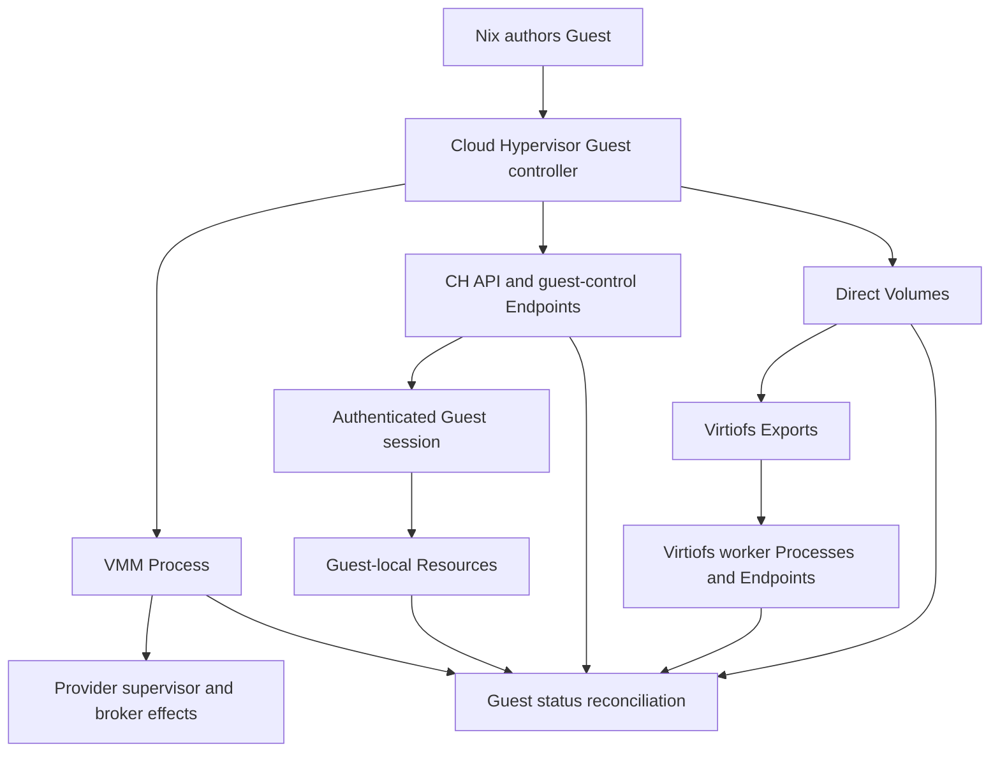
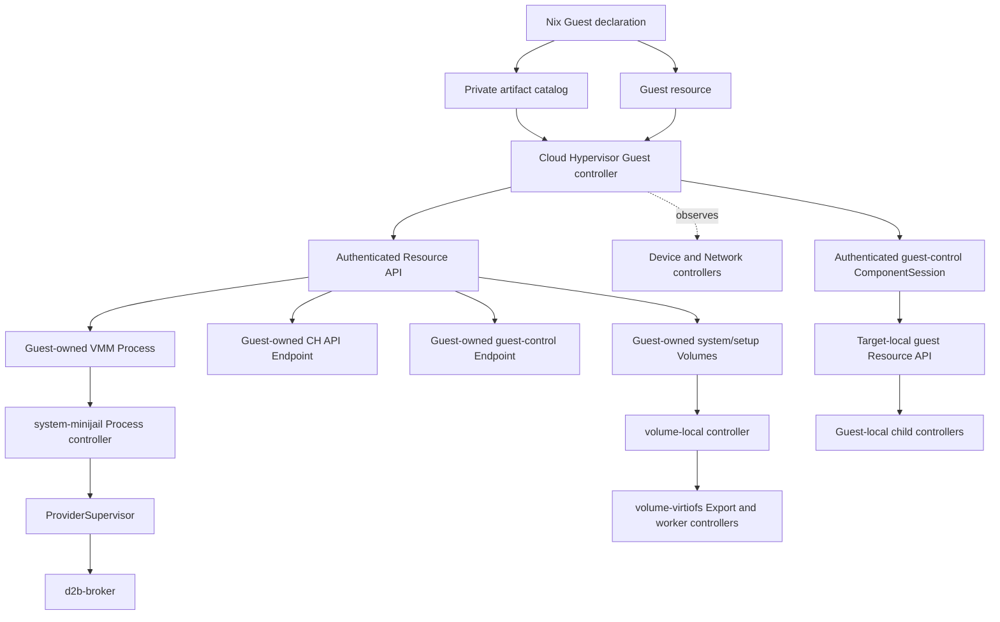
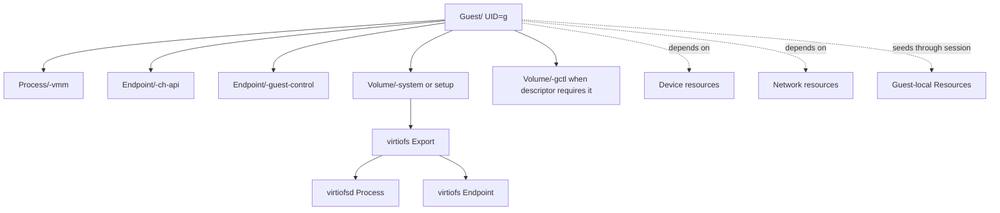
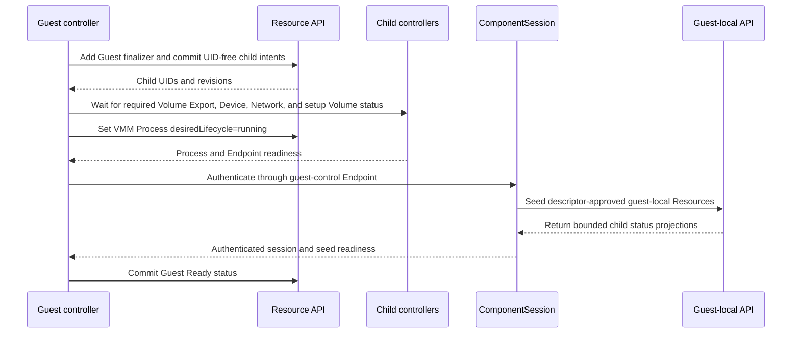
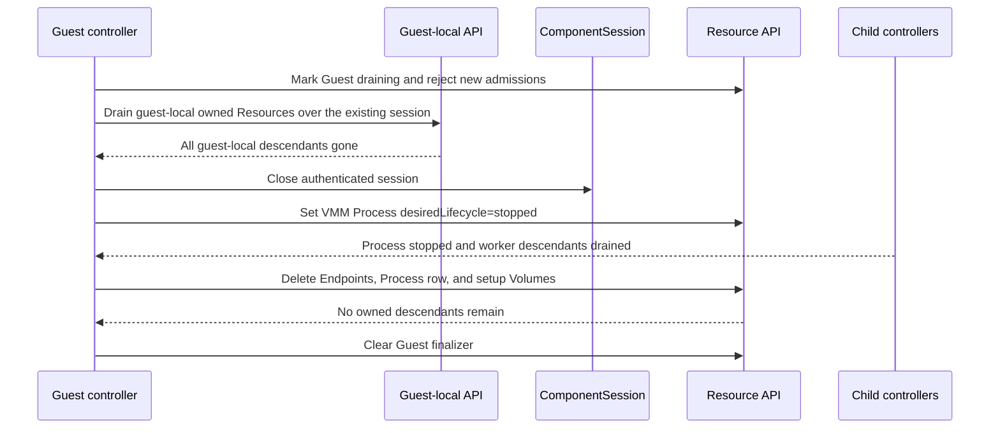
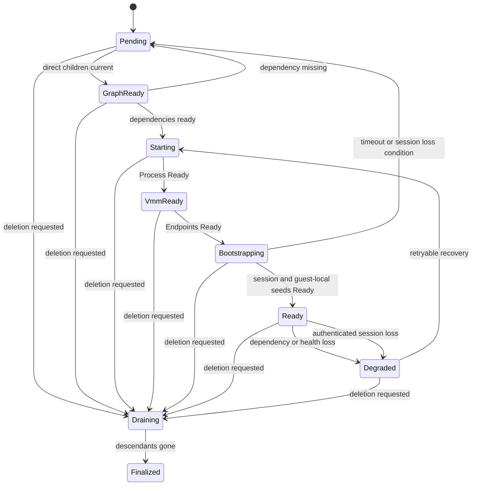
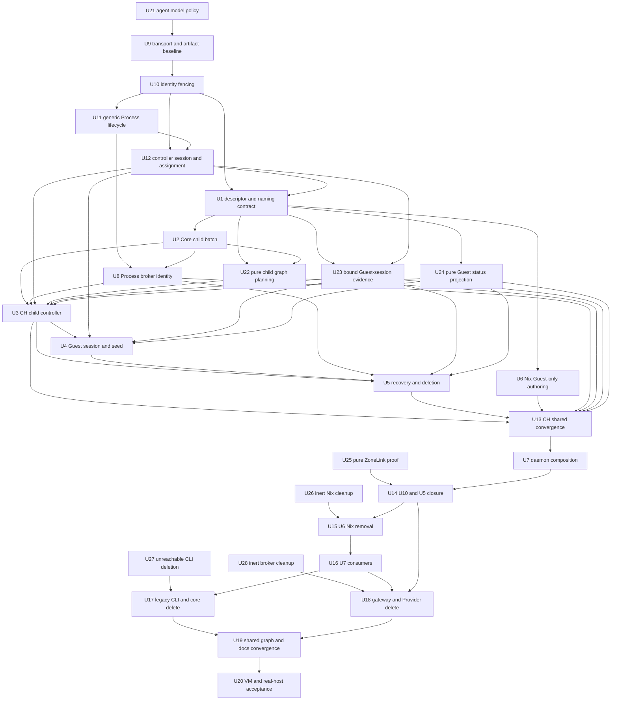

# Controller-Owned Cloud Hypervisor Guest Lifecycle - Plan

## Goal Capsule

- **Objective:** Make the Cloud Hypervisor Guest controller own the complete child Resource lifecycle, finish the remaining dependent Zone-only migration, and prove the final system through VM and real-host acceptance.
- **Means:** The Guest controller derives UID-free child intents and submits them through an authenticated Resource API; Process, Volume, Endpoint, Device, Network, and guest-local controllers remain the effect owners.
- **Product authority:** Current explicit user direction is canonical. Committed code is the migration baseline; conflicting ADR or spec text is drift to update. The broader dependency graph remains recorded in `docs/plans/2026-08-25-001-refactor-zone-only-control-plane-clean-break-plan.md`.
- **Authority hierarchy:** Nix owns the semantic `Guest` declaration and artifact IDs; the Guest controller owns its direct child desired set and lifecycle; Core owns UID, revision, owner, and finalizer admission; specialized controllers own effects; `d2b-broker` is reached only through approved Process effect paths.
- **Stop conditions:** Stop before mutation when the descriptor, Provider assignment, owner UID, child UID, generation, or authorization proof is missing or mismatched. Never expose or consume a raw host path, locator, credential, argv, or host-global name.
- **Execution profile:** Port prerequisite donor semantics first, then run disjoint owner-local slices in isolated worktrees. Serialize shared contracts, generated artifacts, locks, daemon composition, legacy deletion, and final reviewed-head integration.
- **Tail ownership:** The implementation workflow owns focused validation, fresh independent review after every head-changing fix, VM acceptance, real-host switch/restart/rollback proof, final `make check`, and the reviewed pull request lifecycle.

---

## Product Contract

### Summary

Nix declares a Cloud Hypervisor `Guest`, and the matching Guest controller derives and reconciles its owned child Resources. The controller waits for those Resources in dependency order, establishes the authenticated guest-control session, and marks the Guest Ready only after the complete lifecycle is observable.

### Problem Frame

The current Zone bundle can contain `Guest/gateway` and a related VMM `Process`, but Gateway startup still depends on a legacy `processes.json` DAG lookup. Recreating that DAG from Nix would restore a second lifecycle authority, duplicate child-resource ownership, and collide when different Zones use the same Guest name.

The Resource model already assigns Process, Volume, Endpoint, Network, and Device effects to specialized controllers. The missing capability is a Guest controller that authors and observes the correct child Resource graph instead of performing those effects itself.

### Key Decisions

- **The Cloud Hypervisor Guest controller creates and owns child Resources.** (session-settled: user-directed - chosen over Nix authoring the full child graph or the Provider performing effects directly: the Guest controller owns child naming, content, ordering, lifetime, and final status.) Governs R1-R7, R10-R12.
- **ResourceRefs are deterministic name-based addresses.** (session-settled: user-directed - chosen over UID-first addressing or create-then-discover: users and controllers must reference a complete related Resource graph before store-assigned UIDs exist.) Governs R2-R3, R8-R10.
- **Child controllers remain the only effect owners.** The Guest controller requests desired state and observes status; it does not spawn, mount, provision storage, bind sockets, or call the broker. Governs R4-R7.
- **Guest setup inputs are immutable and private.** Planning must bind setup semantics to the selected system artifact and Provider contract without placing host paths, locators, credentials, or executable arguments in the public Guest spec. Governs R8, R11.
- **Private runtime identity is UID-based.** Host-global runtime, cgroup, and broker scope derives from immutable Zone and Guest identity rather than a Zone-local Guest name. Governs R9.
- **Agent model roles are explicit.** (session-settled: user-directed - chosen over GPT-5.6 Sol or ambiguous fallback profiles: implementation and planning use GPT-5.6 Luna at max effort with long context, while independent review uses Grok 4.6 at high effort with long context.) Governs R20.

### Requirements

**Authority and ownership**

- R1. Nix authors the `Guest` resource and its operator-selected semantic references; it does not author the controller-owned child Resource graph.
- R2. The Cloud Hypervisor Guest controller derives deterministic child Resource names from the Guest Resource name and may create the complete related graph in one batch before any child UID is returned.
- R3. `ResourceRef` and `ownerRef` use those name-based addresses, while store-assigned UIDs and revisions fence incarnation, adoption, update, and deletion.
- R4. The Cloud Hypervisor Guest controller performs no direct Process, mount, storage, socket, device, network, credential, or broker effect.

**Child Resource graph**

- R5. The controller creates the VMM `Process`, Cloud Hypervisor API `Endpoint`, guest-control `Endpoint`, and required direct `Volume` resources for the selected Guest setup contract.
- R6. Specialized controllers may create further owned descendants, including Volume views, virtiofs Exports, worker Processes, and Endpoints, while preserving the ownership chain back to the Guest.
- R7. Network, Device, TPM, GPU, audio, and other optional dependencies remain owned by their respective controllers; the Guest controller references and waits for them.
- R8. Child names and desired content are derived from the Guest Resource name, the installed Cloud Hypervisor Provider contract, and a signed immutable setup descriptor associated with the selected system artifact.
- R9. Any host-global runtime identifier is derived from immutable Zone and Guest UIDs for private fencing and does not replace a name-based Zone-local ResourceRef.

**Lifecycle and readiness**

- R10. The controller creates or updates the full desired child set idempotently and refuses foreign, stale, or conflicting children.
- R11. Pre-boot dependencies are realized as host-side Resources; post-boot guest-side Resources are seeded only through the authenticated guest-control session and target-local guest Resource API.
- R12. The public Guest status remains Pending until storage, exports, network and device dependencies, VMM Process, private Endpoints, and authenticated guest-control session reach their required states; finer pre-Ready states are internal controller phases.
- R13. The controller marks the Guest Ready only after all required children are current for the same Guest and Provider generations.
- R14. Deletion drains the Guest in reverse dependency order and clears the Guest finalizer only after the session is closed and all owned descendants are gone.

**Legacy isolation**

- R15. The v3 Guest lifecycle does not depend on `processes.json`, `find_process_vm`, legacy gateway configuration, or a Guest-name-only host-global lookup.
- R16. Legacy lookup may remain temporarily for still-supported legacy callers, but it cannot satisfy or shadow a v3 Guest lifecycle request.
- R17. Gateway ZoneLink composition resolves the committed Guest and guest-control Endpoint in the owning Zone and keys session state by immutable Guest identity.
- R18. Prerequisite donor work is ported only when its full dependency chain and current architecture remain valid; dirty or obsolete branches are never merged wholesale.
- R19. The final implementation removes legacy Guest lifecycle authority, completes the parent Zone-only plan's U5-U8 and U11 cleanup, updates current documentation, and passes VM and real-host acceptance on one reviewed head.

**Agent workflow**

- R20. Current agent instructions and active contributor profiles contain no GPT-5.6 Sol reference; planning and implementation use GPT-5.6 Luna max/long, and independent reviews use Grok 4.6 high/long without running tests.

### Actors

- A1. **Nix configuration compiler:** Declares the Guest, Provider selection, system artifact, and semantic attachments.
- A2. **Cloud Hypervisor Guest controller:** Owns the child Resource graph and Guest lifecycle state.
- A3. **Specialized Resource controllers:** Reconcile Process, Volume, Export, Endpoint, Network, Device, and guest-local Resources.
- A4. **Provider supervisor and broker:** Resolve private runtime inputs and perform audited host effects.
- A5. **Gateway Guest runtime:** Accepts the authenticated guest-control session and reconciles target-local guest Resources.

### Key Flows

- F1. **Guest realization**
  - **Trigger:** A current `Guest` selects the Cloud Hypervisor Provider.
  - **Actors:** A1-A5
  - **Steps:** The Guest controller validates immutable inputs, reconciles its child Resources, waits for specialized controllers, starts the VMM by setting Process desired state, resolves the private Endpoints, and establishes guest control.
  - **Outcome:** The Guest becomes Ready only after the complete current-generation graph is observable.
  - **Covered by:** R1-R13

- F2. **Guest-side setup**
  - **Trigger:** The authenticated guest-control session becomes Ready.
  - **Actors:** A2, A3, A5
  - **Steps:** The Guest controller submits the bounded target-local desired Resources through the admitted session, then observes their status without writing guest state directly.
  - **Outcome:** Guest-local setup is controlled by Resources and remains bound to the parent Guest lifecycle.
  - **Covered by:** R4, R8, R11-R13

- F3. **Guest deletion**
  - **Trigger:** Guest deletion is requested.
  - **Actors:** A2-A5
  - **Steps:** The controller marks the Guest draining, stops admissions and the guest-control session, drains the VMM and dependent workers, requests child deletion in reverse dependency order, and waits for finalizers.
  - **Outcome:** No host or guest child survives the Guest identity that owned it.
  - **Covered by:** R3, R6, R7, R10, R14

### Acceptance Examples

- AE1. **Covers R1-R8, R12-R13.**
  - **Given:** Nix declares one Cloud Hypervisor Guest with its system artifact and semantic attachments.
  - **When:** The Guest controller reconciles it.
  - **Then:** The controller creates the complete owned child Resource graph, specialized controllers realize it, and the Guest becomes Ready without a v3 `processes.json` DAG.

- AE2. **Covers R3, R9, R17.**
  - **Given:** Two Zones each contain `Guest/gateway`.
  - **When:** Both Guests reconcile concurrently.
  - **Then:** Their ResourceRefs remain Zone-local, while private runtime, broker, cgroup, Endpoint, and session identities remain collision-free.

- AE3. **Covers R2-R3, R8-R10.**
  - **Given:** The Guest controller plans a VMM Process, Endpoints, and Volumes for a new Guest whose children have no UIDs yet.
  - **When:** It submits the related child graph as one batch.
  - **Then:** Every relationship uses deterministic ResourceRefs derived from the Guest name, and the store assigns UIDs without requiring a discovery round trip.

- AE4. **Covers R4, R6-R7, R12-R13.**
  - **Given:** A required Volume Export or Network dependency is not Ready.
  - **When:** The Guest controller observes the child graph.
  - **Then:** It does not perform the missing effect or start the VMM early, and the Guest remains Pending with a typed dependency condition.

- AE5. **Covers R8, R10-R11.**
  - **Given:** The selected setup descriptor is missing, stale, unsigned, or requests an unsupported share class.
  - **When:** The Guest controller plans child Resources.
  - **Then:** It fails closed before child mutation and exposes no raw host path, locator, credential, or executable argument.

- AE6. **Covers R3, R10, R14.**
  - **Given:** Guest deletion is requested while VMM, Export, and guest-local children are active.
  - **When:** The controller drains the Guest.
  - **Then:** Children stop and delete in reverse dependency order, foreign children remain untouched, and the Guest finalizer clears last.

- AE7. **Covers R15-R17.**
  - **Given:** A matching legacy Guest name exists in `processes.json`.
  - **When:** Gateway ZoneLink composition resolves a v3 Guest session.
  - **Then:** Only the committed Zone-local Guest and guest-control Endpoint can satisfy the request.

- AE8. **Covers R18-R19.**
  - **Given:** The implementation has reached a clean reviewed candidate head.
  - **When:** The VM lane and real-host switch, restart, deletion, and rollback checks run.
  - **Then:** The final Zone-only control plane realizes the controller-owned Guest lifecycle without legacy authority, duplicate processes, leaked credentials, or incomplete cleanup.

- AE9. **Covers R20.**
  - **Given:** An implementation or review agent starts any later unit.
  - **When:** It resolves the repository model policy.
  - **Then:** No instruction selects GPT-5.6 Sol; implementation resolves to GPT-5.6 Luna max/long and review resolves to Grok 4.6 high/long.

### Scope Boundaries

- No new Nix-authored full Guest child graph.
- No direct Cloud Hypervisor Guest controller process spawning, mounting, storage provisioning, socket binding, or broker calls.
- No public raw host path, runtime locator, executable argument, credential, numeric ID, or private runtime identifier.
- No Guest-name-only host-global runtime, session, cgroup, or profile identity.
- Legacy owner deletion is included only after every current consumer and host acceptance path use the replacement lifecycle.
- Unrelated product features, new Provider types, and hardware enablement outside the named Guest lifecycle dependencies remain out of scope.
- Historical plan mentions may remain as historical records, but no current agent instruction or active contributor profile may select GPT-5.6 Sol.

### Dependencies and Assumptions

- The Resource API supports controller-owned child creation, ownership, status observation, and finalizers.
- Specialized Process, Volume, virtiofs, Endpoint, Network, and Device controllers remain the effect authorities.
- Planning must define the signed private Guest setup descriptor and the target-local guest Resource seeding contract.
- The current U5 acceptance test remains the end-to-end proof for real broker-launched Gateway Guest startup and credential custody.

### Sources and Research

- `docs/plans/2026-08-25-001-refactor-zone-only-control-plane-clean-break-plan.md`: U5, U7, and U10 ownership and acceptance requirements.
- `docs/specs/providers/ADR-046-provider-runtime-cloud-hypervisor.md`: historical/current-state CH design evidence to reconcile with the Product Contract.
- `docs/specs/providers/ADR-046-provider-volume-local.md`: current Volume effect-owner evidence and documentation drift input.
- `docs/specs/providers/ADR-046-provider-volume-virtiofs.md`: current Export, worker Process, and Endpoint effect-owner evidence.
- `docs/specs/ADR-046-resources-host-guest-process-user.md`: current Guest/Process behavior evidence and drift input.
- `docs/specs/ADR-046-componentsession-and-bus.md`: current ComponentSession and Endpoint behavior evidence and drift input.

---

## Planning Contract

**Product Contract preservation:** Expanded without changing the settled lifecycle model: added the name-address/UID-fence rule, donor-porting constraint, dependent Zone-only closure, and VM plus real-host acceptance requirements.

### Planning research and current-code drift

Current explicit user direction provides the governing architecture. Current code, ADRs, and specifications provide implementation patterns and drift evidence only. Where they conflict with the Product Contract, implementation moves the code toward the Product Contract and updates the current documentation in the same change.

The current implementation does not yet satisfy that contract. `packages/d2b-provider-runtime-cloud-hypervisor/src/controller.rs` launches, observes, adopts, stops, and finalizes through a direct effect port. `packages/d2b-provider-runtime-cloud-hypervisor/nix/default.nix` emits a `Process` projection from Nix. `packages/d2bd/src/process_provider_runtime.rs` and related composition paths still resolve legacy process-DAG state. These are the primary drift seams for this plan.

The reusable patterns are present. `packages/d2bd-runtime/src/resource_runtime_support.rs` already constructs one related-resource `CommitBatch` from deterministic ResourceRefs and lets the store mint UIDs. `packages/d2b-core-controller/src/owner_reconcile.rs` plans desired children by ResourceRef and uses UID/revision only for repair and delete fencing. `packages/d2b-resource-client/src/zone_client.rs` supplies authenticated, route-pinned Resource API calls. `packages/d2b-controller-toolkit/src/runner.rs` supplies watch-driven single-flight reconciliation. `packages/d2b-provider-volume-local/src/controller.rs`, `packages/d2b-provider-volume-virtiofs/src/controller.rs`, and `packages/d2b-provider-network-local/src/controller.rs` demonstrate specialized effect ownership and dependency status boundaries.

The parent Zone-only plan and this continuation reuse local U-IDs, so references to the older units are always qualified:

| Parent Zone-only unit | Completion in this plan |
| --- | --- |
| Zone-only U5 - ZoneLink host acceptance | U14 |
| Zone-only U6 - pre-Zone Nix removal | U15 |
| Zone-only U7 - daemon and shared consumer migration | U16 |
| Zone-only U8 - documentation and removal audit | U19 |
| Zone-only U10 - Guest lifecycle | U1-U14 |
| Zone-only U11 - retired owner deletion | U17-U19 |

External research is not used. The local specifications and current implementation provide the required contracts and patterns.

### Key Technical Decisions

- KTD1. **Use a provider-neutral owner-child reconciler over the authenticated Resource API.** Extend the existing Core owner-index/materialization pattern to the Cloud Hypervisor child set, then apply only expected-UID and expected-revision mutations through the authenticated `ResourceClient`. (session-settled: user-directed - chosen over Nix-authored children or Provider-direct effects: the Guest controller owns desired children while specialized controllers retain effect authority.) Governs R1-R7, R10-R14.
- KTD2. **Create the complete direct child graph before enabling the VMM.** Create direct setup `Volume` and `Endpoint` resources plus a `Process` whose desired lifecycle is `stopped`; change only the Process lifecycle to `running` after required Volume Exports, Device, Network, and setup Volume dependencies are Ready. This makes ownership observable without allowing an early effect. Governs R2, R5, R10-R13.
- KTD3. **Bind setup to a signed private descriptor, not public Guest fields.** The descriptor is an immutable artifact-catalog record containing semantic child roles, the selected system-artifact commitment, guest-local seed schema, and an opaque bootstrap handoff class. It contains no host path, locator, credential, numeric identity, executable argument, or broker operation. Governs R8 and R11.
- KTD4. **Use ResourceRef as the address and UID as the incarnation fence.** (session-settled: user-directed - chosen over UID-first addressing or create-then-discover: related Resources must reference one another in one batch before UIDs exist.) Child names are deterministic Zone-local names derived from the Guest name and fixed role. The store mints UIDs after commit; subsequent owner checks, adoption, update, and delete use exact UID and revision evidence. Host-global runtime scope binds Zone UID, Guest UID, and role without replacing the public ResourceRef. Governs R2-R3, R8-R10, and R17.
- KTD5. **Seed post-boot resources through the target-local Resource API.** The controller opens an authenticated ComponentSession through the Guest-control Endpoint, then submits only descriptor-approved guest-local Resource intents. The host controller observes bounded status projections and never writes guest state or receives guest credentials. Governs R4, R8, and R11-R13.
- KTD6. **Use child-first topological deletion with the Guest finalizer last.** Mark the Guest draining and reject new admissions, drain guest-local Resources over the existing ComponentSession, close the session, stop and delete the VMM Process, delete Endpoints, delete direct setup Volumes, wait for all transitive descendants, and clear only the Guest controller finalizer. Governs R3, R6, R7, and R14.
- KTD7. **Keep legacy lookup isolated until its remaining callers migrate.** A v3 reconcile never reads or falls back to `processes.json`, `find_process_vm`, legacy Gateway configuration, or a Guest-name-only lookup. Legacy adapters may remain only behind their existing legacy call sites and cannot satisfy a v3 Resource request. Governs R15-R17.
- KTD8. **Let the Process Provider own process identity and broker effects.** The Guest controller observes the child Process status and requests lifecycle changes through Resource API mutations. `Provider/system-minijail`, `ProviderSupervisor`, and the broker own launch, pidfd acquisition, adoption evidence, cgroup placement, and stop effects. Governs R4, R9, and R12-R14.
- KTD9. **Port donor semantics, never dirty branches.** The implementation ports dependency-complete commit chains from the older Guest branches onto the current Zone-only head, revalidates them against current contracts, and regenerates derived artifacts. Whole-branch merges, synchronization commits, obsolete direct-effect paths, and `processes.json` lifecycle authority are rejected. Governs R18.
- KTD10. **Use isolated worktrees and serial barriers.** Disjoint owner-local units run concurrently only after their shared contract is frozen. Shared contracts, root and Guest locks, generated schemas, policy closures, daemon composition, Nix import removal, legacy graph deletion, and reviewed-head convergence each have one serial owner. Governs R18-R19.
- KTD11. **Bind completion to deployed behavior.** Package tests are necessary but insufficient. The final reviewed head must pass the KVM host lane, then a real host configuration evaluation, build, dry activation, switch, daemon restart/adoption, Guest deletion/finalizer drain, and rollback verification. Governs R19.
- KTD12. **Make model policy a hard prerequisite.** Update current contributor instructions first, then update managed Gas City profiles through their owning authority rather than hand-editing managed files from an ordinary contributor session. Block all later units until instruction, profile, and test expectations agree. Governs R20.

### High-Level Technical Design

The design keeps the Guest controller at the desired-state and ordering layer. It does not become a second supervisor or a broker client.

The direct owner graph is:

Only the solid edges are direct `ownerRef` edges. The dotted edges are dependencies or authenticated target-local projections. Device, Network, Volume-export, virtiofsd, and guest-local controllers keep their own effect and finalizer authority.

The creation and readiness path is:

The deletion path is:

Stopping admissions means no new session or seed work. The existing session remains only long enough to drain already-owned guest-local Resources, then it closes before VMM teardown.

The public Guest status is Pending, Ready, Degraded, or Draining. The finer states below are internal controller phases and do not replace public Pending before all required readiness conditions hold:

### Child ownership and readiness contract

| Direct child role | Public owner | Effect owner | Creation/readiness rule |
| --- | --- | --- | --- |
| VMM `Process` | `Guest/<name>` | `Provider/system-minijail` through `ProviderSupervisor` and broker | Create stopped, then set running only after required Volume Exports, Device, Network, and setup Volume dependencies are Ready. |
| CH API `Endpoint` | `Guest/<name>` | Endpoint/producer path | Create with `producerRef` set to the VMM Process; wait for Endpoint readiness without resolving its locator in the controller. |
| Guest-control `Endpoint` | `Guest/<name>` | Guest runtime and ComponentSession transport | Create with `producerRef` set to the Guest; resolve only through the authenticated session path. |
| System/setup `Volume` | `Guest/<name>` | `Provider/volume-local`, then `Provider/volume-virtiofs` when attached | Create only for descriptor-declared setup roles. The controller supplies an opaque policy ID and semantic view, never a path. |
| Guest-local seed set | Guest identity in the target-local API | Guest-local specialized controllers | Create only after ComponentSession authentication. The host controller does not own guest effects. |

Operator-declared attachment Volumes, Devices, and Networks remain referenced dependencies unless the descriptor explicitly declares a controller-owned setup Volume. Device dependencies include TPM, GPU, audio, and other optional sidecars owned by their Providers. Guest-local Resources remain in the target-local store and use the authenticated Guest identity as their owner root; they are not cross-Zone ResourceRefs. A child with the expected name but a foreign owner, UID, or desired digest is a conflict, not an adoption candidate.

### Private setup descriptor

The descriptor is a signed, immutable, provider-private input associated with the selected `systemArtifactId`. It is carried in the private artifact catalog or an equivalent Provider package record and is resolved through a Core-supplied private resolver. The resolver returns semantic data only.

The descriptor contains:

- descriptor schema version and digest;
- exact `Provider/runtime-cloud-hypervisor` identity and supported generation;
- selected `systemArtifactId` and its private artifact commitment;
- fixed direct-child roles and semantic templates for Process, Endpoint, and setup Volume resources;
- required dependency classes and target-local guest seed schema/fingerprint;
- an opaque bootstrap handoff class and expiry policy, if the image needs a bootstrap handoff.

The descriptor excludes raw store paths, kernel or initrd paths, socket paths, CIDs, ports, file descriptors, credentials, argv, environment values, numeric UIDs/GIDs, and broker operation names. The Process Provider resolves executable and artifact paths from its own signed template and private catalog. Credential material, if needed, remains inside the Guest setup or credential Provider boundary and never enters the Guest controller, host Resource API, status, audit, or metric payload.

### UID and identity model

1. Nix emits no UID. The Zone Resource API assigns the Guest UID and every child UID at first durable creation.
2. Public child names use fixed role suffixes under the Guest name so the Resource graph is inspectable within one Zone.
3. Every child mutation includes the parent Guest reference, exact Guest UID, child UID, and expected revision. Core verifies ownerRef and same-Zone scope before commit.
4. Desired-child comparison hashes only canonical type, name, Zone, ownerRef, presentation metadata, and spec. Store timestamps, status, child UID, and revision are not desired content.
5. Private runtime and cgroup identity derives from a domain-separated digest over Zone UID, Guest UID, role, and the relevant Provider/controller generation. It is not a replacement for `Guest/<name>` or any other Zone-local ResourceRef.
6. Process adoption remains local to the Process Provider. The Guest controller consumes bounded Process status and only sees adoption outcome, not PID, pidfd, cgroup path, executable path, or argv.
7. D090 effect idempotency uses the committed resource UID, generation, revision, and operation ID. D091 disruptive upgrades preserve Guest and durable Volume identities while recycling VMM realization and owned transient Endpoints.

### Integration seams

| Seam | Responsibility | Boundary |
| --- | --- | --- |
| `d2b-core-controller` owner/dependency engines | Complete child relist, desired diff, owner propagation, dependency-ready triggers, bounded topological drain | No Provider effect or store path |
| `d2b-controller-toolkit` | Descriptor registration, watch loop, per-Guest single-flight, retry, status checkpoint, D090/D091 hooks | No direct database or broker access |
| `d2b-resource-client` and `d2b-resource-api` | Authenticated `Get`, `List`, `Watch`, `Create`, `CommitBatch`, `UpdateSpec`, `UpdateStatus`, `UpdateFinalizers`, and `Delete` | All mutations carry native authorization and UID/revision preconditions |
| `d2b-bus` and `d2b-session` | Exact Zone route, Endpoint resolution, ComponentSession authentication, authorization lease, reconnect generation | No peer-supplied subject or raw locator |
| `d2b-provider-runtime-cloud-hypervisor` | Child intent derivation, descriptor validation, readiness aggregation, guest-local seed orchestration, Guest status | No broker socket, direct store, host credential, or direct effect |
| `d2b-provider-system-minijail` and `d2b-provider-supervisor` | Process launch, private artifact/template resolution, pidfd/adoption, cgroup placement, stop | Only typed Process resource and private LaunchTicket data |
| `d2b-provider-volume-local` and `d2b-provider-volume-virtiofs` | Setup Volume layout, view, export, worker Process, and Endpoint effects | Child controllers own their resources and finalizers |
| Device and Network Providers | Dependency readiness and attachment realization | Guest controller observes base status only |
| `d2bd` composition and ProviderDeployment | Launch controller Process, bind authenticated Resource API session, inject private descriptor resolver, remove direct CH effect wiring | Daemon supervises; it does not become a second Guest owner |
| Nix resource compiler and artifact catalog | Emit semantic Guest and Provider inputs plus signed private descriptor | No Nix-authored Process/Endpoint/Volume child graph |
| Legacy connector paths | Continue only for unmigrated legacy callers | v3 requests cannot use legacy lookup or shadow v3 status |

### Alternatives rejected

- **Nix authors the full child graph.** Rejected because it restores a second lifecycle authority, duplicates ownership, and cannot safely bind runtime identity to the committed Guest UID.
- **The Provider directly spawns and stops the VMM.** Rejected because it bypasses Process ownership, native Resource API authorization, Process Provider conformance, and broker-only effects.
- **Reconstruct the VMM from `processes.json` or `find_process_vm`.** Rejected because the legacy DAG is a second source of truth and its name-only lookup cannot distinguish same-named Guests.
- **Make the Guest controller own every descendant.** Rejected because Volume, virtiofs, Device, Network, and guest-local controllers already own their effects and finalizers.
- **Publish setup locators or bootstrap credentials in Guest spec.** Rejected because it leaks host implementation detail and violates credential custody.
- **Use a generic owner cascade without controller ordering.** Rejected because finalizer-safe shutdown requires session closure, VMM drain, descendant release, and exact deletion observation.
- **Use Guest names as host-global identity.** Rejected because names are Zone-local and can be reused after deletion or across Zones.

### Assumptions

These are planning assumptions, not additional product decisions:

- The authenticated Resource API can authorize a controller to create, repair, stop, delete, and finalize its Guest-owned `Process`, `Endpoint`, and descriptor-declared `Volume` children.
- Core can expose a provider-neutral owner-child materialization path for these standard child types, or the equivalent existing owner-index primitives can be reused without a direct store shortcut.
- The target-local Guest Resource API accepts UID-free seed intents over the authenticated ComponentSession and returns bounded status projections tied to the same Guest identity and session generation.
- Endpoint status becomes Ready only after its producer and private transport are valid; resolving the transport remains an authorized EffectPort/LaunchTicket operation.
- The private artifact catalog can bind a signed setup descriptor to a `nixos-system` artifact without exposing its store path or credential material.
- Remaining legacy callers can stay isolated through U16, but U17-U19 remove their owners and shared graph edges before final host acceptance.

### Donor branch disposition

No dirty branch is merged wholesale. Each accepted donor chain is ported onto the advancing current head, conflicts are resolved against current contracts, and all derived artifacts are regenerated.

| Disposition | Donor commits | Use |
| --- | --- | --- |
| Port independently | `e2238a293` | Odd ttrpc correlation IDs; low-overlap transport fix. |
| Port and regenerate | `9f1644a2d` | Remove self-referential package and manifest digests, then regenerate manifests, signatures, schemas, fixtures, policy inputs, and locks. |
| Port as one fenced identity chain | `0d17d9079`, `a5800cd69`, `7009dd155`, `bdd82c792` | Owner UID/revision/generation/session fencing and stale-incarnation rejection. |
| Port as one Process lifecycle chain | `e23191ace`, `096adcf14`, `d3307b3de`, `79c6c218a` | Signed controller Processes, exact stale replacement, and targeted reap ownership. |
| Port serially after identity and Process foundations | `537eb4634`, `50e6f4257`, `fb18dd6be`, `15c31d4e6`, `8f65a88ba`, `d9d361105`, `17dea82bc`, `249dbab2b`, `bea0e878b`, `1a8eac34a`, `5107377c1` | Exact peer binding, bootstrap descriptors, ResourceV3 controller sessions, scoped assignments, revocation, and refresh. |
| Reference only | `f0064468f`, `16902a156`, `107790deb`, `ed3a385d8`, `4f3cc2613`, `8464871ea`, `9700f1df7` | Useful tests and lifecycle intent, but direct effects or Nix/process-DAG authority conflict with the Product Contract. |
| Regenerate, do not port | `ec95ba2ad`, `320a5ca68` and other policy/fixture-only refreshes | Derived artifacts must be rebuilt from the final source graph. |

### Parallel delivery model

The execution schedule maximizes isolated authoring while keeping every shared authority single-writer.

**Parallel waves**

- U9 transport and artifact work may use disjoint owner-local worktrees under one U9 coordinator; artifact regeneration and the U9 merge remain serial.
- After U1 freezes shared contracts, U2 and U6 may run in separate worktrees. U8 starts only after U2 and U11.
- After U8 commits, U22, U23, and U24 may run concurrently in isolated worktrees. They own only `bootstrap_graph.rs`, `health.rs`, and `state.rs` plus owner-local tests and separate changelog fragments; they must not touch `controller.rs`, daemon composition, session transport, target-local runtime, package metadata, generated artifacts, or locks.
- Merge U22-U24 serially through the integration owner in any order, rerunning focused verification and delta review for each result. U3 starts only after all three are integrated.
- U3, U4, and U5 form a serial chain. One owner controls `packages/d2b-provider-runtime-cloud-hypervisor/src/controller.rs` from U3 through U5; U4 or U5 may prepare disjoint test fixtures only after their declared prerequisites settle.
- U25 audits and closes pure ZoneLink proof while U4-U7 progress. U26, U27, and U28 may author concurrently because they preserve the interfaces consumed by Guest lifecycle work; same-file edits are allowed when symbol ownership and interface behavior remain independent.
- U14 owns daemon and Gateway composition proof only. All booted-VM, canary, restart, deletion, and host acceptance moves to U20.
- U17 and U18 use separate worktrees for retired CLI/core and gateway/Provider owners, then merge through U19.

**Serial barriers**

- Shared Resource, Provider, Broker, session, and ticket contracts.
- Root and Guest Cargo locks, package/root Bazel declarations, generated schemas, provider manifests/signatures, policy closures, and CLI artifacts.
- `packages/d2bd/src/composition.rs`, `packages/d2bd/src/resource_runtime.rs`, central Nix imports, legacy graph deletion, host-test declarations, and final reviewed-head integration.

### Unit index

| U-ID | Unit | Key files | Depends on |
| --- | --- | --- | --- |
| U21 | Remove Sol from agent instructions and active profiles | `AGENTS.md`, contributor workflow/model docs, managed profile owner inputs/tests | None |
| U9 | Port transport and artifact prerequisites | `packages/d2b-bus/`, Provider contract and artifact files | U21 |
| U10 | Port owner and incarnation fencing | Resource API, bus, Core assignment, redb ownership | U9 |
| U11 | Port generic controller Process lifecycle | Process contracts, supervisor, broker, d2bd Process runtime | U10 |
| U12 | Port controller session and assignment substrate | session, bus, Resource API, controller assignment | U10, U11 |
| U1 | Freeze descriptor, name, batch, and UID contracts | CH contracts, Provider contracts, descriptor tests | U9, U10, U12 |
| U2 | Generalize Core owned-child batches | Core owner/dependency engines | U1, U10 |
| U6 | Replace Nix child projection with Guest-only authoring | CH Nix, artifact catalog, Nix tests | U1 |
| U8 | Harden Process, supervisor, and broker identity | Process runtime, ProviderSupervisor, broker | U1, U2, U11 |
| U22 | Extract pure CH child graph planning | CH bootstrap graph and unit tests | U1, U2 |
| U23 | Freeze authenticated Guest-session evidence | CH health evidence and unit tests | U1, U12 |
| U24 | Add pure Guest status projection | CH state reducer and status tests | U1 |
| U3 | Build the CH child controller | CH controller and graph integration tests | U1, U2, U8, U12, U22-U24 |
| U4 | Add Guest session and target-local seeding | CH session adapter, guest runtime, session tests | U1, U3, U12, U23-U24 |
| U5 | Add recovery, upgrade, and finalizer-safe deletion | CH lifecycle modules, Core cleanup | U3, U4, U8, U23-U24 |
| U13 | Converge CH package, contracts, and generated artifacts | CH package metadata, locks, schemas, manifests | U3-U6, U8, U22-U24 |
| U7 | Wire daemon composition and isolate legacy connectors | d2bd composition/runtime, Provider deployment | U4, U5, U13 |
| U25 | Close pure ZoneLink routing proof | Zone routing, Core ZoneLink, Relay reconnect tests | None |
| U26 | Remove inert Nix emitter surfaces | host-tool options, v1 launcher emitter, Nix tests/docs | None |
| U27 | Delete unreachable private CLI code | legacy CLI modules and realm entrypoint | None |
| U28 | Trim inert broker arguments and classify survivors | broker parser/config and Gateway/Provider disposition | None |
| U14 | Finish Zone-only U10 lifecycle and U5 ZoneLink composition | lifecycle, ZoneLink, Gateway composition | U7, U13, U25 |
| U15 | Finish Zone-only U6 gateway-coupled Nix removal | legacy Nix imports/options/tests | U14, U26 |
| U16 | Finish Zone-only U7 daemon, xtask, and shared consumer migration | d2bd-runtime, xtask, CLI/generated convergence | U15 |
| U17 | Delete retired Core owners | realm controller/workload owners | U16, U27 |
| U18 | Delete retired gateway and Provider owners | gateway crates and legacy Provider modules | U14, U16, U28 |
| U19 | Finish Zone-only U8 and converge final graph, generated artifacts, docs, and audit | locks, Bazel, CLI generation, docs, changelog | U17, U18, U25-U28 |
| U20 | Prove VM and real-host acceptance and land | host integration, operator configuration, review/PR | U19 |

---

## Implementation Units

### U21. Remove GPT-5.6 Sol from agent instructions and active profiles

- **Goal:** Establish one unambiguous repository model policy before any implementation or review unit starts.
- **Requirements:** R20; AE9.
- **Dependencies:** None.
- **Files:** `AGENTS.md`, `docs/contributing/workflow.md`, `docs/contributing/gas-city.md`, `docs/adr/0056-gas-city-contributor-environment.md`, related agent-workflow tests, and the owner-authorized managed Gas City profile/configuration inputs under `nix/gas-city-contributor/`.
- **Approach:**
  1. Remove current GPT-5.6 Sol recommendations and split implementation/planning from independent review roles.
  2. Set planning and implementation to `gpt-5.6-luna` with `long_context` and `max` effort.
  3. Set independent review to `grok-4.6` with `long_context` and `high` effort; review agents do not run tests.
  4. Rename or remove `planning-sol` and `review-sol` profile names and update readiness/test expectations so no active profile or fallback silently selects Sol.
  5. Use the managed Gas City authority for `nix/gas-city-contributor/**`; update owner-authorized generated profile content and tests, not only instruction prose. An ordinary contributor implementation must not bypass that authority with unrelated hand edits.
  6. Leave clearly historical plans as historical records unless they are used as current agent instructions.
- **Execution note:** This unit is a hard barrier. Do not dispatch implementation or review work for later units until both ordinary instructions and managed active profiles satisfy the new policy.
- **Patterns to follow:** Current instruction ownership in `AGENTS.md`; managed-environment rules in `docs/contributing/gas-city.md`; repository source-hygiene and agent-instruction tests.
- **Test scenarios:**
  - A repository-wide current-instruction scan finds no `gpt-5.6-sol`, `planning-sol`, `review-sol`, or Sol fallback language outside explicitly historical artifacts.
  - Implementation and planning profiles resolve to GPT-5.6 Luna max/long.
  - Independent review profiles resolve to Grok 4.6 high/long and do not run tests.
  - Readiness fails closed when either required profile is missing or substituted by a disallowed model.
  - Managed-profile generation and host-integration expectations agree with contributor documentation.
- **Verification:** Agent instructions, active profiles, readiness tests, and contributor docs expose one model policy with no Sol ambiguity.

### U1. Freeze private setup descriptor, ResourceRef naming, batch, and UID contracts

- **Goal:** Define the immutable private descriptor, deterministic ResourceRef naming, pre-UID related-resource batch contract, UID fencing, and redaction boundary used by every later unit.
- **Requirements:** R2-R3, R8-R11, R15-R18; F1-F3; AE2, AE3, AE5.
- **Dependencies:** U9, U10, U12.
- **Files:** `packages/d2b-provider-runtime-cloud-hypervisor/src/descriptor.rs`, `packages/d2b-provider-runtime-cloud-hypervisor/src/identity.rs`, `packages/d2b-contracts-provider/src/v3/provider.rs`, `packages/d2b-contracts-resource/src/v3/guest.rs`, `packages/d2b-provider-runtime-cloud-hypervisor/tests/guest_spec_validation_test.rs`, `packages/d2b-provider-runtime-cloud-hypervisor/tests/redaction_test.rs`, `docs/specs/providers/ADR-046-provider-runtime-cloud-hypervisor.md`.
- **Approach:**
  1. Keep `Guest.spec.systemArtifactId` and Provider settings as the only public setup selectors.
  2. Add a strict signed descriptor contract for semantic child roles, artifact binding, target-local seed schema, and opaque bootstrap handoff class.
  3. Derive public child names from the Guest name and fixed roles; define a single related-resource batch whose refs are valid before UIDs exist.
  4. Define UID/revision response mapping and private runtime scope from Zone UID plus Guest UID after commit.
  5. Reject descriptors and identity inputs that contain locators, credentials, argv, numeric identities, or unsupported fields.
- **Patterns to follow:** `packages/d2b-contracts-provider/src/v3/provider.rs` manifest and descriptor validation; `packages/d2b-contracts-resource/src/v3/resource.rs` UID/revision metadata; redacted `Debug` implementations in the existing Cloud Hypervisor crate.
- **Test scenarios:**
  - A valid descriptor binds one Cloud Hypervisor Provider generation to one `nixos-system` artifact and fixed child-role set.
  - One Guest name produces the same direct child ResourceRefs on every reconcile.
  - Process, Endpoint, and Volume create bodies reference one another by ResourceRef in one batch without child UIDs.
  - The commit response returns UIDs for every created ResourceRef and a retry maps the same refs to the committed incarnations.
  - A descriptor with a raw path, socket locator, credential bytes, argv, numeric UID/GID, or unknown field is rejected before child planning.
  - Two same-named Guests in different Zones derive different private runtime scopes.
  - A Guest deletion followed by same-name recreation produces a new private scope because the Guest UID changes.
  - Public debug, status, and canonical child intent output contain no private descriptor payload or host locator.
- **Verification:** The descriptor and identity contracts are strict, signed, UID-aware, redacted, and consumable without a host credential or path.

### U2. Generalize Core owned-child materialization and dependency ordering

- **Goal:** Provide one Core-owned, provider-neutral child planning primitive for Process, Endpoint, and Volume children with complete relist and ordered teardown.
- **Requirements:** R2-R3, R6-R7, R10, R14; AE3, AE6.
- **Dependencies:** U1, U10.
- **Files:** `packages/d2b-core-controller/src/owner_reconcile.rs`, `packages/d2b-core-controller/src/binding_children.rs`, `packages/d2b-core-controller/src/lib.rs`, `packages/d2b-core-controller/src/dependencies.rs`, `packages/d2b-core-controller/tests/owned_children.rs`.
- **Approach:**
  1. Reuse the existing owner index and `OwnerMutation` preconditions instead of introducing a second store abstraction.
  2. Generalize child materialization validation so a signed provider intent can cover standard `Volume` children as well as Process and Endpoint children.
  3. Preserve same-Zone owner checks, complete desired-set comparison, foreign-child fencing, and stale conflict retry.
  4. Require `CommitBatch` to be transactionally all-or-nothing. After an uncertain response, relist deterministic ResourceRefs and bind the desired set to the UIDs already minted by the one durable commit.
  5. Expose deterministic creation and deletion ranks for the Guest graph without moving effect ownership into Core.
- **Patterns to follow:** `packages/d2b-core-controller/src/binding_children.rs` complete child-set validation and `packages/d2b-core-controller/src/owner_reconcile.rs` expected UID/revision repair.
- **Test scenarios:**
  - A complete desired set creates missing Process, Endpoint, and Volume children with no store-assigned UID in provider intent.
  - A drifted child repairs only with matching UID and revision; a stale revision causes a reread and no mutation from the stale plan.
  - A foreign owner, cross-Zone child, duplicate child reference, or incomplete desired set is fenced without deletion.
  - A crash or truncated batch cannot expose a mixed durable subset; uncertain-response repair relists the same names, returns the committed UIDs, and never creates a second incarnation.
  - Teardown orders guest-local leaves before Endpoints, Process, and direct setup Volumes.
  - Dependency-ready and dependency-changed triggers reach the exact Guest owner without dropping coalesced reasons.
- **Verification:** Core supplies one bounded owner/dependency plan that the Guest controller can apply through Resource API calls without direct store access.

### U22. Extract side-effect-free Cloud Hypervisor child graph planning

- **Goal:** Separate deterministic direct-child planning and VMM launch gating from the effectful controller reconcile loop.
- **Requirements:** R2-R8, R10-R13; F1; AE1, AE3, AE4.
- **Dependencies:** U1, U2.
- **Files:** `packages/d2b-provider-runtime-cloud-hypervisor/src/bootstrap_graph.rs`, inline `#[cfg(test)]` coverage, `changelog.d/ch-guest-child-graph-plan.md`.
- **Approach:**
  1. Reuse `GuestChildBatch::from_descriptor` and existing Core child-ordering primitives instead of duplicating identity or dependency logic.
  2. Produce deterministic UID-free direct-child intents and a pure VMM lifecycle eligibility result.
  3. Keep the VMM Process stopped until required Device, Network, Volume, Export, and setup dependencies are Ready.
  4. Perform no Resource API, broker, store, locator, session, or Process effect.
- **Execution note:** Implement the pure planning contract test-first and keep all effectful integration in U3.
- **Patterns to follow:** `packages/d2b-provider-runtime-cloud-hypervisor/src/identity.rs` `GuestChildBatch`; current `BootstrapGraph` readiness logic; `d2b-core-controller` owned-child ordering.
- **Test scenarios:**
  - Covers AE1 and AE3. A valid descriptor produces the fixed deterministic direct-child graph with exact Guest owner and Zone references and no child UID discovery round trip.
  - Covers AE4. Any Pending Device, Network, Volume, Export, or setup dependency keeps the VMM lifecycle stopped.
  - A complete same-generation dependency set permits the VMM running transition.
  - An invalid descriptor or ResourceRef fails before a graph is returned.
  - Repeated planning produces identical output containing no UID, path, credential, argv, or locator.
- **Verification:** The owner-local CH package test target proves deterministic, UID-free, redacted planning without controller, broker, or runtime effects.

### U23. Freeze authenticated Guest-session evidence

- **Goal:** Define the exact bounded evidence consumed by Guest-local seeding and Guest readiness.
- **Requirements:** R4, R8, R11-R13, R17; F2; AE1, AE4, AE5.
- **Dependencies:** U1, U12.
- **Files:** `packages/d2b-provider-runtime-cloud-hypervisor/src/health.rs`, inline `#[cfg(test)]` coverage, `changelog.d/ch-guest-session-evidence.md`.
- **Approach:**
  1. Preserve current `GuestSessionEvidence` construction and probe boundaries while adding exact Guest UID, descriptor/schema digest, Provider/controller generation, reconnect/session generation, Endpoint readiness, and seed readiness commitments.
  2. Reject mismatches, zero or stale generations, malformed digests, and unbounded capability data.
  3. Expose only bounded health and readiness evidence; credentials, paths, locators, transport wiring, and target-local mutation remain in U4.
- **Execution note:** Add failing evidence-validation cases before changing the additive health contract.
- **Patterns to follow:** `GuestIdentity::validate_route`, `GuestComponentSessionDescriptor`, and current bounded health error codes.
- **Test scenarios:**
  - Exact bound evidence reaches Ready only when Endpoint, controller, session, and seed generations agree.
  - Guest UID, descriptor, Provider, controller, Endpoint, reconnect, or session mismatch fails closed.
  - Stale or disconnected evidence cannot become Ready without a newer session generation.
  - Capability bounds and malformed descriptor/schema digests reject before readiness.
  - Debug and status output contain no identity payload, credential, path, or locator.
- **Verification:** The additive health contract passes owner-local tests and leaves existing daemon fake probes source-compatible.

### U24. Add pure Guest status projection

- **Goal:** Freeze public readiness, degradation, drain, and finalization precedence without effectful lifecycle mutation.
- **Requirements:** R12-R14; F1-F3; AE4, AE6.
- **Dependencies:** U1.
- **Files:** `packages/d2b-provider-runtime-cloud-hypervisor/src/state.rs`, `packages/d2b-provider-runtime-cloud-hypervisor/tests/state_status_test.rs`, `changelog.d/ch-guest-status-projection.md`.
- **Approach:**
  1. Add a pure reducer over bounded observations and exact generation equality.
  2. Keep public states bounded to Pending, Ready, Degraded, and Draining.
  3. Represent drain and finalization eligibility separately from actual finalizer mutation.
  4. Keep PIDs, UIDs, paths, argv, credentials, CIDs, and cgroup data out of public status and debug output.
- **Execution note:** Define status precedence through failing table-driven tests before adding the reducer.
- **Patterns to follow:** Existing `GuestRuntimeStatus`, controller health handling, and Core dependency status reduction.
- **Test scenarios:**
  - Any missing dependency produces Pending.
  - A Ready Process with incomplete Endpoint, session, or seed evidence remains Pending.
  - A complete same-generation graph produces Ready.
  - Session or required-child health loss produces Degraded.
  - Provider, descriptor, controller, child, or session generation mismatch cannot produce Ready.
  - Deletion with an active session or descendants produces Draining; finalization eligibility requires a complete drain.
  - Public status and debug output remain identity-free.
- **Verification:** Owner-local state tests prove status precedence and finalization eligibility without broker, session transport, or controller effects.

### U3. Build the Cloud Hypervisor child controller and authenticated Resource API adapter

- **Goal:** Replace direct VMM effect calls with deterministic Guest-owned child creation, repair, observation, and dependency gating.
- **Requirements:** R1-R7, R10-R13; F1; AE1-AE5.
- **Dependencies:** U1, U2, U8, U12, U22, U23, U24.
- **Files:** `packages/d2b-provider-runtime-cloud-hypervisor/src/controller.rs`, `packages/d2b-provider-runtime-cloud-hypervisor/src/config.rs`, `packages/d2b-provider-runtime-cloud-hypervisor/Cargo.toml`, `packages/d2b-provider-runtime-cloud-hypervisor/BUILD.bazel`, `packages/d2b-provider-runtime-cloud-hypervisor/tests/controller.rs`, `packages/d2b-provider-runtime-cloud-hypervisor/tests/reconcile_state_machine_test.rs`.
- **Approach:**
  1. Register the controller with the descriptor and watch Guest, owned Process/Endpoint/Volume children, and Device/Network dependency statuses.
  2. Read a fresh Guest snapshot and complete owner-index child relist for every reconcile.
  3. Materialize the complete descriptor-approved direct child set through one bounded `CommitBatch`; use `UpdateSpec` only after commit with expected UID and revision.
  4. Keep the VMM Process stopped until required Volume Exports, Device, Network, and setup Volume dependencies are Ready, then set its desired lifecycle to running.
  5. Aggregate only base child status and dependency conditions into the Guest status projection.
- **Patterns to follow:** `packages/d2b-controller-toolkit/src/runner.rs` single-flight and watch semantics; `packages/d2b-resource-client/src/zone_client.rs` route-pinned and scoped Resource API calls; `packages/d2b-provider-runtime-cloud-hypervisor/src/bootstrap_graph.rs` opaque attachment validation.
- **Test scenarios:**
  - Covers AE1. A valid Guest creates exactly one VMM Process, the required Endpoints, and descriptor-declared setup Volumes with Guest ownerRefs.
  - Covers AE2. Two Zones with `Guest/gateway` use distinct owner UIDs and do not collide in private child identity.
  - Covers AE3. One UID-free child batch creates all related ResourceRefs and returns the store-assigned UID mapping.
  - Covers AE4. A missing required Export, Device, Network, or setup Volume leaves the Process stopped and Guest Pending.
  - Covers AE5. Missing, stale, unsigned, or Provider-mismatched descriptors fail closed before any child mutation.
  - A crashed, truncated, or uncertain child batch keeps the Guest Pending, relists the same ResourceRefs onto committed UIDs, and never creates a duplicate child incarnation.
  - A child UID or revision conflict causes a fresh relist and never mutates a replacement resource with the same name.
  - An uncertain batch response relists deterministic refs and does not issue duplicate creates.
  - A controller restart relists children and converges without issuing a direct launch, stop, or broker call.
- **Verification:** The Guest controller owns and repairs the complete direct child graph through authenticated Resource API calls and performs no direct effect.

### U4. Add authenticated guest-local seeding and readiness aggregation

- **Goal:** Establish the authenticated Guest session and seed post-boot Resources through the target-local Resource API.
- **Requirements:** R4, R8, R11-R13, R17; F2; AE1, AE4, AE5.
- **Dependencies:** U1, U3, U12, U23, U24.
- **Files:** `packages/d2b-provider-runtime-cloud-hypervisor/src/guest_local.rs`, `packages/d2bd-runtime/src/guest_resource_runtime.rs`, `packages/d2b-session/src/`, `packages/d2b-session-unix/src/`, `packages/d2b-bus/src/`, `packages/d2b-resource-client/src/zone_client.rs`, `packages/d2b-provider-runtime-cloud-hypervisor/tests/health_check_test.rs`, `packages/d2b-provider-runtime-cloud-hypervisor/tests/guest_local_seed_test.rs`.
- **Approach:**
  1. Resolve the Guest-control Endpoint through the authorized Endpoint path and bind the session to Guest UID, Endpoint UID/generation, descriptor digest, Provider generation, and reconnect generation.
  2. Extend the target-local Guest Resource API to admit `CommitBatch` and the exact descriptor-approved seed Resource types, then submit the complete UID-free name-addressed set over the authenticated ComponentSession.
  3. Resume guest-local watches after reconnect by resource revision and keep seed operations idempotent by Guest UID, descriptor digest, and operation ID.
  4. Mark the Guest Ready only when host-side children and target-local seed Resources are current for the same Guest and Provider generations.
- **Patterns to follow:** `packages/d2b-session/src/handshake.rs` and `packages/d2b-session/src/lifecycle.rs` authenticated session lifecycle; `packages/d2b-resource-client/src/zone_client.rs` route and session pinning.
- **Test scenarios:**
  - A valid VMM and Endpoint set establishes one authenticated session and seeds the expected guest-local Resources.
  - Wrong Guest identity, Endpoint generation, descriptor digest, schema, reconnect generation, or authorization lease is rejected before seeding.
  - A disconnected session resumes from resource revision without duplicating an already committed seed.
  - A Ready Guest whose authenticated session is lost becomes Degraded; reconnect uses a new session generation, resumes from revision, and cannot reuse old seed authority.
  - A target-local child that is Pending keeps the parent Guest Pending; a target-local child that becomes Ready triggers parent reevaluation.
  - No session, seed request, status projection, or audit record contains credential bytes, raw locator, or host path.
- **Verification:** Post-boot setup is target-local, authenticated, revision-resumable, and reflected in Guest readiness without host-side guest effects.

### U5. Implement status-first recovery, adoption, upgrade, and finalizer-safe deletion

- **Goal:** Complete restart recovery, health degradation, disruptive upgrade handling, and reverse-order Guest deletion.
- **Requirements:** R3, R6-R7, R9-R10, R12-R14, R17; F1-F3; AE2, AE4, AE6.
- **Dependencies:** U3, U4, U8, U23, U24.
- **Files:** `packages/d2b-provider-runtime-cloud-hypervisor/src/adoption.rs`, `packages/d2b-provider-runtime-cloud-hypervisor/src/controller.rs`, `packages/d2b-provider-runtime-cloud-hypervisor/src/shutdown.rs`, `packages/d2b-provider-runtime-cloud-hypervisor/tests/adoption_property_test.rs`, `packages/d2b-provider-runtime-cloud-hypervisor/tests/finalize_ordering_test.rs`, `packages/d2b-core-controller/src/dependencies.rs`, `packages/d2b-resource-api/src/service.rs`.
- **Approach:**
  1. Treat status as observation and reverify live Process identity through the Process Provider after restart.
  2. Quarantine ambiguous or stale Process adoption and never issue a broad kill or name-only stop.
  3. Map disruptive artifact, Provider, or runtime changes to D091 `UpgradeRequired`; recycle only the VMM realization and transient Endpoints while preserving Guest and durable Volume UIDs.
  4. On deletion, reject new admissions, drain guest-local Resources over the live session, close the session, stop the VMM Process, delete direct children in reverse dependency order, wait for transitive descendants, and clear the Guest finalizer last.
  5. If the session is already dead, treat guest-local descendants as gone only after the VMM Process is observed stopped or absent and no host-backed Guest Volume remains; otherwise retain `FinalizationBlocked` and never force-clear the finalizer.
- **Patterns to follow:** `packages/d2b-provider-runtime-cloud-hypervisor/src/adoption.rs` complete identity tuple; `packages/d2b-core-controller/src/dependencies.rs` topological drain/restart; current status-first recovery code. Update conflicting specification prose in the same change.
- **Test scenarios:**
  - A controller restart adopts only the exact Process identity and keeps a valid Guest Ready without a duplicate VMM.
  - A stale generation, PID reuse, cgroup mismatch, executable mismatch, template mismatch, or ambiguous candidate becomes Unknown/Degraded with no kill.
  - A VMM exit produces bounded Degraded status and retries through the Process child lifecycle.
  - A disruptive system-artifact or Provider generation change reports UpgradeRequired and preserves durable setup Volume identity.
  - An interrupted D091 recycle after transient Endpoint deletion leaves the Guest non-Ready, preserves durable Volume UID, rejects old session generation reuse, cannot adopt the pre-recycle Process or Endpoint UIDs, and remains deletable; only new transient incarnations may progress toward Ready.
  - A same-Zone Guest delete-and-recreate during in-flight reconcile cannot use old child UIDs for readiness, update, delete, assignment, or adoption.
  - Covers AE6. Deletion drains guest-local children, closes the session, stops the VMM, drains Volume descendants, and clears the Guest finalizer only after all owned descendants are absent.
  - A blocked child finalizer, unavailable session, transitive virtiofs worker, foreign leftover, or remaining host-backed Guest Volume retains the Guest finalizer and exposes a bounded FinalizationBlocked condition.
- **Verification:** Restart and deletion are identity-fenced, status-first, dependency-aware, and free of broad cleanup or direct broker operations.

### U6. Replace Nix child projections with Guest-only authoring and private descriptor emission

- **Goal:** Make Nix author the Guest and artifact inputs while removing its Process/Endpoint/Volume child graph projection.
- **Requirements:** R1-R3, R5, R8, R10-R11, R15, R18; AE1, AE3, AE5.
- **Dependencies:** U1.
- **Files:** `packages/d2b-provider-runtime-cloud-hypervisor/nix/default.nix`, `packages/d2b-provider-runtime-cloud-hypervisor/nix/tests/default.nix`, `nixos-modules/options-artifacts.nix`, `nixos-modules/artifact-catalog.nix`, `nixos-modules/zone-resources.nix`, `nixos-modules/zone-resources-json.nix`, `nixos-modules/resources-bundle.nix`, `docs/specs/ADR-046-nix-configuration.md`, `docs/reference/manifest-schema.md`.
- **Approach:**
  1. Keep Provider installation, Guest `systemArtifactId`, semantic attachments, and strict Provider settings in the Zone bundle.
  2. Remove `processesByZone` and other Nix-authored CH child projections from the runtime Provider module.
  3. Emit the signed private setup descriptor beside the private artifact catalog entry and bind its digest to the selected system artifact and Provider contract.
  4. Preserve deterministic canonical JSON and reject raw locator, credential, executable, or child-UID fields at evaluation time.
- **Patterns to follow:** `nixos-modules/artifact-catalog.nix` private store-path handling; `packages/d2b-provider-runtime-cloud-hypervisor/nix/tests/default.nix` fixed evaluation cases; `nixos-modules/zone-resources-json.nix` canonical bundle output.
- **Test scenarios:**
  - Covers AE1. A Guest bundle contains only semantic Guest and Provider inputs; no CH Process, Endpoint, or Volume child rows are emitted by Nix.
  - A missing or wrong-type system artifact fails evaluation with the ordinary artifact error.
  - A descriptor digest or Provider schema mismatch fails before publication.
  - Canonical bundle output contains no store path, socket locator, credential, argv, UID, or private runtime identifier.
  - Two Zones may reuse Guest names while retaining distinct Zone-local bundle identities.
- **Verification:** Nix has one Guest authoring path, one private descriptor path, and no second lifecycle authority.

### U7. Wire ProviderDeployment and d2bd composition; isolate legacy connectors

- **Goal:** Run the controller as a normal Provider component, inject authenticated Resource API and private descriptor seams, and prevent legacy connectors from satisfying v3 requests.
- **Requirements:** R4, R7, R9, R12, R15-R18; AE2, AE6, AE7.
- **Dependencies:** U4, U5, U13.
- **Files:** `packages/d2bd/src/composition.rs`, `packages/d2bd/src/process_provider_runtime.rs`, `packages/d2bd/src/provider_shutdown.rs`, `packages/d2bd/src/resource_runtime.rs`, `packages/d2bd-runtime/src/resource_operator_activation.rs`, `packages/d2b-provider-runtime-cloud-hypervisor/Cargo.toml`, `packages/d2b-provider-runtime-cloud-hypervisor/BUILD.bazel`, `packages/d2bd/tests/cloud_composition.rs`, `packages/d2bd/tests/zone_provider_acceptance.rs`, `packages/d2b-core/src/bundle_resolver.rs`, `packages/d2bd/src/tpm_effect_port.rs`, `packages/d2bd/src/security_key_effect_port.rs`, `packages/d2bd/src/audio_dispatch.rs`.
- **Approach:**
  1. Register the CH controller component and static controller Process through ProviderDeployment and the signed descriptor.
  2. Pass an authenticated Resource API session and private descriptor resolver into the controller; do not pass `RedbResourceStore`, `BundleResolver`, broker sockets, or host credentials.
  3. Route VMM lifecycle through the child Process Provider and remove direct CH launch/stop wiring from the Guest controller composition.
  4. Fence remaining legacy process-DAG connectors behind their legacy callers and add an explicit v3 path that never consults them.
  5. Update `packages/d2bd/tests/cloud_composition.rs` and `packages/d2bd/tests/zone_provider_acceptance.rs` to observe the committed Guest child graph and authenticated session rather than invoking the direct effect-port state machine.
- **Patterns to follow:** `packages/d2bd/src/process_provider_runtime.rs` daemon-side construction of typed Process effect adapters; `packages/d2bd/src/binding_child_resource_runtime.rs` exact UID/revision mutation handling; `packages/d2bd-runtime/src/resource_operator_activation.rs` authenticated Resource API acceptance selection.
- **Test scenarios:**
  - ProviderDeployment starts the controller only from a signed descriptor and explicit Host execution reference.
  - The controller cannot be constructed with a direct broker socket, direct store handle, raw bundle resolver, or host credential.
  - A v3 Guest with a matching legacy `processes.json` row uses only the committed Guest-owned Process and Endpoint children.
  - Legacy callers continue to use their isolated connector until migration, but a v3 request cannot be fulfilled by a legacy row.
  - The named d2bd composition and Zone Provider acceptance tests prove dependency wait, authenticated Guest readiness, restart adoption, and dependency-safe removal through the Resource API path.
- **Verification:** The production composition has one daemon-supervised controller path, one broker-mediated Process effect path, and no legacy lookup shadowing v3.

### U8. Harden Process, ProviderSupervisor, and broker runtime identity

- **Goal:** Make the child VMM Process launch, adoption, cgroup, pidfd, and stop path exact for Zone, ResourceRef, UID, generation, Provider, template, and private runtime scope.
- **Requirements:** R3-R4, R9-R10, R12-R14, R17-R18; AE2, AE4, AE6.
- **Dependencies:** U1, U2, U11.
- **Files:** `packages/d2b-process-conformance/src/ticket.rs`, `packages/d2b-provider-supervisor/src/broker.rs`, `packages/d2b-provider-supervisor/src/lib.rs`, `packages/d2b-provider-system-minijail/`, `packages/d2b-broker/src/runtime.rs`, `packages/d2b-broker/src/ops/spawn_runner.rs`, `packages/d2bd/src/process_provider_runtime.rs`, `packages/d2bd/src/process_resource_runtime.rs`, and their focused tests.
- **Approach:**
  1. Preserve ResourceRef as the address and add separate exact UID, generation, owner, Provider, template, and Zone commitments to private launch and adoption evidence.
  2. Derive host-global runtime and cgroup identity from Zone UID, Guest UID, role, and current generation.
  3. Validate a closed SpawnRunner allowlist against broker-resolved intent before clone: owner, Zone, ResourceRef, UID, generation, Provider, template, execution target, role, allocation, authenticated subject UID, session generation, argv, UID/GID, inherited file descriptors, seccomp policy, and cgroup commitment. Reject caller paths, extra fields, and substituted identities.
  4. Quarantine ambiguous, stale, or UID-mismatched candidates and retain targeted reap ownership.
- **Patterns to follow:** Current mutation-seal identity fencing, `ProviderSupervisor` launch tickets, broker intent resolution, and `d2bd-runtime` supervisor snapshots.
- **Test scenarios:**
  - The same Process ResourceRef in two Zones produces distinct broker-resolved runtime, cgroup, vsock, socket, and session scopes and cannot cross-stop or cross-adopt; public status and audit remain redacted.
  - A recreated Process with a new UID cannot adopt the old process even when name, cgroup, and executable match.
  - Mutating any allowlisted SpawnRunner field independently, adding an unknown field, or supplying a caller path makes SpawnRunner fail before clone.
  - Two candidate processes or incomplete pidfd evidence produce quarantine with no signal or kill.
  - Audit and debug output exclude paths, argv, environment values, CIDs, PIDs, credentials, and cgroup paths.
- **Verification:** The Process path is fully Resource-backed, UID-fenced, broker-validated, and independent of legacy Guest-name intent lookup.

### U9. Port transport and artifact prerequisites

- **Goal:** Port the low-overlap transport and artifact fixes that later controller and descriptor work requires.
- **Requirements:** R8, R11, R18.
- **Dependencies:** U21.
- **Files:** Donor changes from `e2238a293` in `packages/d2b-bus/`; donor semantics from `9f1644a2d` in Provider contracts, package manifests, artifact catalog code, signatures, fixtures, and package-local tests.
- **Approach:**
  1. Port odd correlation-ID allocation independently from artifact work.
  2. Port the self-referential digest correction against current Provider/package contracts rather than cherry-picking stale generated outputs.
  3. Regenerate manifests, signatures, schemas, fixtures, policy inputs, and locks under one serial artifact owner.
- **Execution note:** Treat donor commits as evidence. Resolve against current code and discard obsolete ADR or branch assumptions.
- **Test scenarios:**
  - Concurrent session calls allocate valid non-colliding correlation IDs.
  - Package and manifest digests do not include their own rendered values.
  - Tampered manifest, signature, package digest, or catalog entry fails closed.
  - Regenerated fixtures and policy closures match both root and copied Guest dependency graphs.
- **Verification:** The transport and artifact foundations pass focused tests, fixture contracts, policy, supply-chain, and drift checks.

### U10. Port owner and incarnation fencing

- **Goal:** Port the dependency-complete identity-fencing chain that controller-owned child creation relies on.
- **Requirements:** R2-R3, R9-R10, R14, R18; AE2, AE3, AE6.
- **Dependencies:** U9.
- **Files:** Port semantics from `0d17d9079`, `a5800cd69`, `7009dd155`, and `bdd82c792` across Resource API admission, bus authorization, Core assignments, redb ownership, and focused tests.
- **Approach:**
  1. Preserve deterministic ResourceRefs and same-batch staged owner resolution.
  2. Bind existing-owner mutation authority to authenticated subject UID, owner UID, owner generation, owner revision, child UID, child revision, controller generation, Provider generation, session generation, assignment epoch, and current User or RoleBinding generation. Never accept peer-supplied subject fields.
  3. Reject delete/recreate identity recycling, stale same-name owners, cross-Zone children, and same-batch follow-up update/delete operations.
  4. Keep create payloads UID-free and store-minted.
- **Test scenarios:**
  - A single batch creates related named Resources and returns distinct UIDs without a discovery round trip.
  - Correct ownerRef with stale owner UID or revision is denied without mutation.
  - A stale authenticated subject, controller, Provider, session, assignment, User, or RoleBinding generation is denied without mutation in direct mutation, U2 repair, and U3 child-update paths.
  - Same-name parent recreation invalidates old child update, delete, assignment, and adoption evidence.
  - Cross-Zone owner or child substitution fails before store commit.
  - Operation replay returns the original result and never creates a second incarnation.
- **Verification:** Name-addressed creation and UID-fenced mutation are consistent from Resource API through redb storage.

### U11. Port generic controller Process lifecycle

- **Goal:** Port signed controller Process projection, exact replacement, and targeted reap semantics without restoring direct Cloud Hypervisor effects.
- **Requirements:** R4, R9-R10, R12-R14, R18.
- **Dependencies:** U10.
- **Files:** Port semantics from `e23191ace`, `096adcf14`, `d3307b3de`, and `79c6c218a` across Process contracts, Process conformance, `ProviderSupervisor`, broker runner state, `d2bd` Process runtime, and focused tests.
- **Approach:**
  1. Represent controllers and VMMs as ordinary Process resources with signed Provider/template bindings.
  2. Keep Process launch, adoption, restart, reap, and stop under Process Provider and broker ownership.
  3. Replace stale controller processes only with exact identity proof and targeted reap ownership.
  4. Remove or reject donor changes that make Nix DAGs or direct Provider effects authoritative.
- **Test scenarios:**
  - A current Process launches once and returns pidfd-backed supervision.
  - A stale same-name Process is replaced only after exact UID/generation mismatch is proven.
  - Late reap or stop results cannot mutate a replacement Process incarnation.
  - Missing, ambiguous, or substituted controller evidence is quarantined without broad cleanup.
  - Controller and VMM Process status survives daemon restart without duplicate launch.
- **Verification:** Generic Process lifecycle is safe enough for both the CH controller Process and its VMM child Process.

### U12. Port controller ResourceV3 session and assignment substrate

- **Goal:** Port exact peer binding, bootstrap descriptors, authenticated controller ResourceV3 sessions, scoped assignments, revocation, and refresh.
- **Requirements:** R2-R4, R10-R13, R17-R18.
- **Dependencies:** U10, U11.
- **Files:** Port semantics from `537eb4634`, `50e6f4257`, `fb18dd6be`, `15c31d4e6`, `8f65a88ba`, `d9d361105`, `17dea82bc`, `249dbab2b`, `bea0e878b`, `1a8eac34a`, and `5107377c1` across `d2b-bus`, `d2b-session`, `d2b-session-unix`, Resource API/client, controller assignment, Provider session code, and tests.
- **Approach:**
  1. Bind every controller session to exact accepted peer evidence, controller Process identity, Zone, Provider generation, controller generation, and assignment epoch.
  2. Deliver scoped assignments through authenticated ResourceV3 routes and revoke them on session loss or replacement.
  3. Preserve reconnect fencing and retry stale lease revocation without reusing old grants.
  4. Reject donor paths that restore legacy guest-control naming or unscoped assignment machinery.
- **Test scenarios:**
  - Wrong peer, Process UID, Zone, Provider generation, controller generation, or assignment epoch prevents session admission.
  - Session loss revokes assignments and makes old Resource API clients stale.
  - Reconnect refreshes assignments without duplicate controller or Guest work.
  - Bootstrap descriptor fd transfer is close-on-exec, leak-free, and exact.
  - Concurrent refresh and revocation preserve one current assignment.
- **Verification:** The CH controller can receive a native authenticated Resource API assignment without direct store, broker, or host credential access.

### U13. Converge the CH package and shared generated artifacts

- **Goal:** Merge U1-U6, U8, and U22-U24 into one coherent CH package, contract, Nix, manifest, lock, and generated-artifact head.
- **Requirements:** R1-R18; AE1-AE7.
- **Dependencies:** U1-U6, U8, U22, U23, U24.
- **Files:** `packages/d2b-provider-runtime-cloud-hypervisor/Cargo.toml`, `BUILD.bazel`, `README.md`, package manifests/signatures, shared Resource/Provider contracts, `Cargo.lock`, `packages/Cargo.guest.lock`, `docs/reference/schemas/v3/`, policy closures, fixture declarations, and changelog fragments.
- **Approach:**
  1. Merge isolated authoring branches in dependency order and resolve `controller.rs` through one convergence owner.
  2. Align descriptor, ResourceRef naming, UID fencing, child batches, session seeding, lifecycle state, and Nix Guest-only authoring.
  3. Regenerate every changed schema, manifest, signature, lock, policy closure, and fixture from current sources.
  4. Run fresh independent review after convergence; branch-level review evidence no longer applies.
- **Test scenarios:**
  - Root and copied Guest metadata resolve with `--locked`.
  - Provider catalog, manifest signature, descriptor, schema, and fixture digests agree.
  - The CH package has no direct broker/store dependency and no production direct effect port.
  - Nix emits no controller-owned CH child Resource.
- **Verification:** One clean reviewed CH foundation head passes package, contract, Nix, fixture, supply-chain, policy, changelog, and drift gates.

### U25. Close pure ZoneLink routing and admission proof

- **Goal:** Separate pure route, admission, reconnect, cursor, revocation, queue, and replay proof from daemon and Gateway composition.
- **Requirements:** R3-R4, R12-R17; AE7-AE8.
- **Dependencies:** None.
- **Files:** `packages/d2b-zone-routing/src/engine.rs`, `resolver.rs`, `service.rs`, `packages/d2b-zone-routing/tests/route_engine_vectors.rs`, `packages/d2b-core-controller/src/zone_links.rs`, `zonelink.rs`, `packages/d2b-provider-transport-azure-relay/src/reconnect.rs`, `packages/d2b-provider-transport-azure-relay/tests/reconnect_backoff.rs`.
- **Approach:**
  1. Audit existing owner-local coverage before writing code; treat U25 as satisfied when current proof already covers the contract.
  2. Preserve runtime-issued single-use admissions bound to ZoneLink, edge, controller and reconnect generations, Zone identities, operation, capability, policy revision, and expiry.
  3. Preserve cursor-owner quarantine, monotonic resync, revocation fencing, bounded queues, replay windows, loop and multi-parent rejection, and no reciprocal parent row.
  4. Stop and defer to the serial contract owner if closure requires a shared session or wire contract change.
- **Test scenarios:**
  - Exact route admission succeeds only for the committed identity tuple.
  - Target, verb, capability, policy, generation, cursor, time, or relay substitution fails closed.
  - Expired, revoked, replayed, stale-generation, and disconnected admissions fail closed.
  - Missing, duplicate, or mismatched cursor owner proof is quarantined.
  - Reconnect resumes from the last valid revision without reusing old authority.
  - Advertisement replay, expiry, loop, multi-parent, capacity, withdrawal, and capability narrowing remain covered.
- **Verification:** Existing Zone routing, Core controller, and Relay owner suites pass; a zero-delta satisfied result is valid when no proof gap exists.

### U26. Remove inert Nix emitter surfaces and isolate retained host tooling

- **Goal:** Delete legacy Nix output that already has a current successor while separating retained host-tool package plumbing from the gateway tombstone.
- **Requirements:** R6-R8, R14-R17; AE2, AE5, AE8.
- **Dependencies:** None.
- **Files:** `nixos-modules/options-host.nix`, `options-gateway.nix`, `realm-workloads-launcher-json.nix`, `bundle-artifacts.nix`, `default.nix`, `flake.nix`, root `BUILD.bazel`, `bazel/checks/nix/BUILD.bazel`, `tests/unit/nix/cases/realm-workloads.nix`, `host-tools-source.nix`, `gateway-vm.nix`, active reference documentation, and changelog.
- **Approach:**
  1. Move the internal `d2b._hostToolPackages` declaration from `options-gateway.nix` to `options-host.nix` without changing its producers or consumers.
  2. Remove the v1 `realm-workloads-launcher.json` emitter, artifact registry entry, fixture materialization, explicit Nix source inputs, and v1-only tests.
  3. Preserve the v2 launcher artifact and update active reference documentation to teach only that current output.
  4. Leave active legacy hierarchy, Gateway VM, Process DAG, realm controller, and realm identity emitters for U15.
- **Execution note:** Characterize rendered artifacts first; this slice must leave Guest, bundle, daemon, and host-tool shapes unchanged except removal of the superseded v1 launcher output.
- **Test scenarios:**
  - V2 launcher metadata remains emitted and installed while no v1 launcher artifact is materialized.
  - Source and prebuilt host-tool overrides still resolve from the moved internal option.
  - Gateway tombstone behavior remains unchanged.
  - Guest, bundle, daemon, and Process lifecycle shapes remain unchanged.
- **Verification:** Focused Nix surfaces, fixture contracts, drift, and changelog checks pass without a generated runtime contract change.

### U27. Delete unreachable private CLI and realm-entrypoint code

- **Goal:** Remove the legacy CLI implementation and old realm entrypoint that cannot execute through the current command surface.
- **Requirements:** R1-R2, R4-R8, R14-R17; AE1, AE2, AE5, AE9.
- **Dependencies:** None.
- **Files:** `packages/d2b/src/lib.rs`, `dispatch.rs`, delete `legacy.rs`, `status_read_model.rs`, and `target_routing.rs`, `packages/d2b/BUILD.bazel`, `packages/d2b-zone-routing/src/lib.rs`, delete `realm_entrypoint.rs`, related CLI and route tests, and changelog.
- **Approach:**
  1. Remove private module declarations, the stale dispatch comment, parser-only tests, and explicit Bazel compile inputs.
  2. Preserve modern Zone, Guest, Process, resource, auth, audit, doctor, host, and support commands.
  3. Keep shared Cargo dependencies and current Core realm artifact readers until U19 and U17 remove their remaining consumers.
- **Execution note:** Prove unreachability from the current parser and dispatch path before deletion.
- **Test scenarios:**
  - Current parser rejects realm, VM, and retired aliases through ordinary unknown-command behavior.
  - Current Zone, Guest, Process, and Resource commands retain their CLI contract.
  - Zone routing compiles and passes without the old realm entrypoint table.
  - No production module imports the deleted private modules.
- **Verification:** Package-local compile, CLI contract, route tests, and changelog checks pass without lock or generated CLI changes.

### U28. Trim inert broker arguments and classify Gateway and Provider survivors

- **Goal:** Remove broker configuration fields that are parsed but never consumed and freeze the later Gateway/Provider deletion boundary.
- **Requirements:** R13, R15-R19; AE7-AE8.
- **Dependencies:** None.
- **Files:** `packages/d2b-broker/src/runtime.rs`, `packages/d2b-broker/tests/common/mod.rs`, `socket_activation.rs`, Gateway and Provider source graph as read-only inventory input, and changelog.
- **Approach:**
  1. Remove only `realm_controllers_path`, `realm_identity_path`, their defaults, parser flags, and parser tests; preserve corresponding bundle fields until their consumers migrate.
  2. Classify retained Guest-local ZoneLink runtime, credential handling, Relay transport, and `d2bd::serve_guest` ownership separately from retired display, ACA, prologue, and enrollment paths.
  3. Do not delete a Gateway or Provider capability solely from its historical name; actual deletion remains U18 after U14 and U16.
  4. Record disposition in implementation and review evidence, not a new inventory file or repository-wide census gate.
- **Test scenarios:**
  - Removed broker flags fail through ordinary parser behavior.
  - Host and Guest broker modes retain current socket, profile, and authorization behavior.
  - Current Guest-local ZoneLink and Relay tests remain unchanged.
- **Verification:** Broker owner tests and changelog checks pass; Gateway/Provider disposition is concrete enough for U18 without adding a shipped ledger.

### U14. Finish Zone-only U10 lifecycle and U5 ZoneLink composition

- **Goal:** Integrate the controller-owned Guest lifecycle with daemon authorization, Gateway Guest resolution, ZoneLink routing, and credential custody.
- **Requirements:** R9-R19; F1-F3; AE1-AE7.
- **Dependencies:** U7, U13, U25.
- **Files:** `packages/d2b/src/guest.rs`, `packages/d2bd/src/provider_effects.rs`, `provider_registry.rs`, `process_resource_runtime.rs`, `resource_runtime.rs`, `packages/d2bd-runtime/src/supervisor/state.rs`, `admission.rs`, `packages/d2b-broker/src/runtime.rs`, `packages/d2b-zone-routing/`, `packages/d2b-core-controller/src/zone_links.rs`, `packages/d2bd/src/composition.rs`, and focused owner-local tests.
- **Approach:**
  1. Complete exact Zone/Guest lifecycle authorization, restart adoption, stale snapshot quarantine, and stop-only shutdown constraints.
  2. Resolve Gateway Guest and guest-control Endpoint from committed Zone Resources; remove `find_process_vm` and VM-name session keys for v3.
  3. Keep relay credentials, Provider state, and audit inside the Gateway Guest.
  4. Consume U25 route proof and integrate it through Gateway and daemon composition without changing the frozen route contract.
- **Test scenarios:**
  - Start, stop, restart, delete, forced stop, no-wait, adoption, stale assignment, and unauthorized caller cases are identity-fenced.
  - Gateway Guest creation reaches Ready through child Resources and authenticated session without host credential material.
  - Session loss revokes route and seed authority, then reconnect resumes by revision without duplicate processes or resources.
  - Forged time, target, verb, capability, generation, cursor, or relay identity fails closed.
- **Verification:** U10, U5, Gateway composition, and ZoneLink owner-local suites pass on a freshly reviewed head; booted-VM and credential-canary acceptance belongs only to U20.

### U15. Finish Zone-only U6 gateway-coupled Nix removal

- **Goal:** Remove the remaining pre-Zone Nix hierarchy and legacy process emitters after the replacement Guest lifecycle and ZoneLink path are proven.
- **Requirements:** R1, R5, R15-R19; AE1, AE7, AE8.
- **Dependencies:** U14, U26.
- **Files:** `nixos-modules/options-envs.nix`, `options-realms*.nix`, `options-vms.nix`, remaining `options-gateway.nix`, `options.nix`, `default.nix`, `index.nix`, `host*.nix`, `closures-json.nix`, `minijail-profiles.nix`, `processes-json.nix`, realm controller and identity emitters, legacy Nix tests, and Nix Bazel declarations.
- **Approach:**
  1. Remove legacy option imports and current consumers in one coherent switch.
  2. Remove CH and Gateway lifecycle authority from `processes.json`, legacy indexes, per-realm services, users, groups, sockets, and state declarations.
  3. Preserve Network gateway fields, required OS groups, current Zone bundles, and Provider artifacts.
  4. Let removed options fail through ordinary unknown-option behavior.
- **Test scenarios:**
  - Zone-only examples evaluate without importing a legacy option module.
  - Legacy realms, envs, top-level VMs, and gateway declarations are unknown options.
  - Nix emits one Guest and no CH child Process/Endpoint/Volume graph.
  - No per-realm unit, user, socket, state root, or process DAG survives.
  - The fixed Zone Nix surface runs a non-empty declared case set with exact source closure.
- **Verification:** Nix unit, flake, fixture, and drift gates pass with no active pre-Zone hierarchy or compatibility tombstone.

### U16. Finish Zone-only U7 daemon, xtask, and shared consumer migration

- **Goal:** Move every remaining current Rust consumer to Zone-neutral owners before deletion begins.
- **Requirements:** R15-R19.
- **Dependencies:** U15.
- **Files:** `packages/d2bd-runtime/src/daemon_config.rs`, `workload_dispatch.rs`, `workload_target_index.rs`, remaining `packages/d2bd/` consumers, `packages/d2b-broker/`, `packages/xtask/`, shared Cargo/Bazel declarations, CLI generation inputs, copied Guest metadata, and focused tests.
- **Approach:**
  1. Reconcile the already integrated CLI, clipboard, display, unsafe-local, ACA, neutral-contract, broker, and lock work with the advancing head.
  2. Migrate remaining daemon/runtime and xtask consumers without preserving realm/gateway semantic ownership.
  3. Keep shared Cargo, lock, Bazel, generated CLI, schema, and policy surfaces under one serial convergence owner.
  4. Prove every current consumer compiles and behaves against its new owner before U17-U18 delete the definitions.
- **Test scenarios:**
  - CLI framing, bounds, redaction, and typed errors remain stable.
  - Current Azure, transport, shell, display, broker, and runtime consumers import only current owners.
  - Root and Guest workspaces have no stale direct realm dependency edges.
  - Generated CLI artifacts change only when command ownership changes.
  - No required current behavior depends semantically on a retired owner.
- **Verification:** Focused consumer suites, metadata, supply-chain, policy, changelog, and applicable generated-artifact gates pass.

### U17. Delete retired Core owners

- **Goal:** Remove remaining retired realm contracts, controller configuration, and workload-launcher owners after U16 and U27.
- **Requirements:** R15-R19.
- **Dependencies:** U16, U27.
- **Files:** `packages/d2b-contracts/src/realm.rs`, `packages/d2b-core/src/realm_controller_config.rs`, `realm_workloads_launcher.rs`, remaining related tests and package-local build declarations, and changelog.
- **Approach:**
  1. Consume U27's private CLI deletion and remove remaining Core definitions, exports, tests, and package-local build edges together.
  3. Preserve current Zone, Guest, Process, resource, auth, audit, and support commands.
  4. Defer shared locks and generated convergence to U19.
- **Test scenarios:**
  - No production target imports realm controller or workload-launcher owners.
  - Package-local tests and compile-time visibility checks pass after deletion.
- **Verification:** Retired Core owners have no current consumer, package export, or package-local build edge.

### U18. Delete retired gateway and Provider owners

- **Goal:** Remove retired gateway crates, gateway runtime, gateway display wire, legacy Provider modules, and remaining graph edges after U16.
- **Requirements:** R15-R19.
- **Dependencies:** U14, U16, U28.
- **Files:** `packages/d2b-gateway/`, proven-retired modules and binaries under `packages/d2b-gateway-runtime/`, proven-retired Gateway and Provider modules, related fixtures/tests, package manifests, and package-local Bazel declarations.
- **Approach:**
  1. Use disjoint worktrees for gateway crates and Provider legacy modules.
  2. Delete only after current CH Guest, ZoneLink, credential, and transport paths pass their owner suites; preserve U28-classified Guest-local ZoneLink, credential, Relay, and `serve_guest` paths.
  3. Remove package-local exports and fixtures with the owner.
  4. Leave shared workspace and generated convergence to U19.
- **Test scenarios:**
  - Current Gateway Guest and ZoneLink acceptance pass without retired crates.
  - No production target or fixture imports retired gateway or realm entrypoint types.
  - Old bundle, daemon-config, and wire versions reject through normal schema/version handling.
  - Credential custody remains inside the Gateway Guest after deletion.
- **Verification:** Retired gateway and Provider owners are absent from source and package-local graphs without weakening current acceptance.

### U19. Finish Zone-only U8 and converge the final graph, generated artifacts, documentation, and removal audit

- **Goal:** Merge U17-U18, remove shared graph edges, regenerate current artifacts, and publish Zone-only current documentation.
- **Requirements:** R18-R20; AE8-AE9.
- **Dependencies:** U17, U18, U25, U26, U27, U28.
- **Files:** root `Cargo.toml`, `Cargo.lock`, `packages/Cargo.guest.lock`, root/package `BUILD.bazel`, `bazel/checks/`, `packages/xtask/`, generated CLI schemas/manpages/completions, `README.md`, `STRATEGY.md`, `AGENTS.md`, current `docs/explanation/`, `docs/how-to/`, `docs/reference/`, examples, templates, and changelog fragments.
- **Approach:**
  1. Merge deletion slices serially and regenerate root/Guest locks, policy closures, schemas, manifests, CLI artifacts, and fixtures.
  2. Update current docs and ADR/spec text to the user-directed controller-owned Guest lifecycle; mark conflicting historical material as historical or superseded.
  3. Run the classified active-surface and filename audits without adding a new repository-wide evidence script or ledger.
  4. Obtain fresh independent review of the complete reviewed head before host acceptance.
- **Test scenarios:**
  - Root and copied Guest metadata resolve with no retired crate edge.
  - CLI schemas, manpages, completions, examples, and templates teach only current Zone concepts.
  - Every remaining realm, env, VM, gateway, or legacy filename match has a valid historical, OS-group, Network-field, managed, or third-party classification.
  - Generated artifacts and current docs match the same final command and contract surfaces.
- **Verification:** Supply-chain, policy, fixture, drift, Nix, CLI, changelog, and full independent review pass on one clean committed head.

### U20. Prove VM and real-host acceptance and land the reviewed head

- **Goal:** Switch the real host's `/etc/nixos` configuration to the final Zone-only system and prove d2b starts and boots a Cloud Hypervisor Guest correctly, then complete the reviewed PR lifecycle.
- **Requirements:** R1-R20; F1-F3; AE1-AE9.
- **Dependencies:** U19.
- **Files:** `tests/host-integration/runtime-cloud-hypervisor-guest-preflight.nix`, `tests/host-integration/host-realm-isolation.nix`, `tests/host-integration/resource-operator-activation.nix`, the host's `/etc/nixos` configuration outside the repository, targeted v1/v2 host-path cleanup, and final review/PR evidence.
- **Approach:**
  1. Own all booted-VM acceptance moved from U14 and U19: final child graph, Gateway canary, credential custody, reconnect and revocation, forged route claims, restart adoption, blocked finalization, deletion order, and rollback.
  2. Run focused owner suites, all required static gates, and the complete host-integration lane on the exact committed head.
  3. Use the real `/etc/nixos` flake and selected `nixosConfiguration`; deep host configuration changes are allowed because this is a clean break from v1/v2, not an in-place compatibility migration.
  4. Evaluate and build the configuration, run `nixos-rebuild dry-activate`, then run the operator-approved `nixos-rebuild switch`.
  5. Remove only explicitly identified, d2b-owned v1/v2 host paths after the switch. No data migration or retention is required, but foreign ownership markers and unrelated host state remain untouched.
  6. Verify `d2bd.service`, `d2b-broker.socket`, and `d2b-broker.service`; verify the controller and VMM Process Resources, authenticated Guest readiness, and successful Cloud Hypervisor Guest boot.
  7. Restart `d2bd`, verify adoption without duplicate processes or resources, delete and recreate the test Guest without requiring retained v1/v2 data, then verify rollback to the known-good NixOS generation.
  8. Any fix, generated update, lock change, docs change, test change, CI fix, base update, or push invalidates readiness and requires affected gates, fresh review, and host acceptance again.
  9. Push one reviewed branch, open one PR, babysit checks and feedback, refresh reviewed-head evidence, and merge with the repository's guarded normal squash flow.
- **Execution note:** The real-host switch and rollback are operator-authorized manual acceptance. Do not add a new live-host evidence script or treat an environment/advisory skip as success.
- **Test scenarios:**
  - Covers AE1-AE8. The KVM lane proves atomic pre-UID child batch creation, uncertain-response relist, returned UID fencing, Process/Endpoint/Volume readiness, guest-local seeding, Ready-to-Degraded session loss, reconnect, same-name cross-Zone isolation, same-Zone Guest reincarnation fencing, interrupted Provider generation recycle, blocked finalization, and deletion order.
  - The Gateway lane proves real broker launch, sealed canary opening, no host credential material, and no legacy lifecycle fallback.
  - Same-named Guests in two Zones have distinct broker-resolved cgroup, vsock, socket, runtime, and session scopes without exposing those identifiers publicly.
  - Real host restart adopts the exact VMM and controller Processes without duplication or cross-Zone collision; stale owner and session generations cannot mutate replacements.
  - Foreign nftables, NetworkManager, and cgroup ownership markers remain byte-for-byte unchanged; a missing or replaced previously provisioned TPM directory fails closed; forged route, target, verb, capability, generation, cursor, and relay identity are denied.
  - Real host deletion keeps `FinalizationBlocked` while any owned transitive worker, host-backed Guest Volume, unavailable-session uncertainty, or foreign leftover prevents proof of complete drain; the Guest finalizer clears only after owned descendants are absent.
  - Host rollback leaves new-generation Processes and owned Resources absent or quarantined, restores the known-good generation, starts a Guest successfully, and leaves the healthy three-unit control plane.
- **Scope boundary:** ACA and other Provider acceptance are follow-up work after U20 and do not block this Cloud Hypervisor host cutover.
- **Verification:** VM and real-host acceptance pass on the same reviewed head, final `make check` passes, CI is green, no actionable review finding remains, and the guarded squash merge succeeds.

---

## Verification Contract

Each unit runs the smallest owner-local Bazel target that proves its changed surface before integration. The convergence owner then runs the applicable shared gates below on committed inputs.

| Verification | Applies after | Required outcome |
| --- | --- | --- |
| Current agent-instruction and active-profile audit for `gpt-5.6-sol`, `planning-sol`, `review-sol`, and Sol fallback language | U21 | No active instruction or profile selects Sol; Luna max/long implementation/planning and Grok 4.6 high/long review expectations agree. |
| Focused contract, Resource API, redb, session, controller, Provider, supervisor, broker, Nix, and CLI Bazel targets | Every feature-bearing unit | New happy, boundary, denial, restart, and failure scenarios pass without an advisory skip. |
| `make test-unit` | U13, U14, U16, U19 | Complete Layer-1 controller, contract, authorization, resource, fixture, and policy graph passes. |
| `make test-nix-unit` | U6, U15, U19 | Guest-only authoring, unknown legacy options, Provider projections, and fixed source closures pass. |
| `make test-fixture-contracts` | U9, U13, U19 | Rendered Nix artifacts, Rust DTOs, Provider manifests, and private descriptor fixtures agree. |
| `make test-rust-supply-chain` | Any root or copied Guest dependency change | Root and copied Guest workspaces realize with current locks, licenses, sources, and audit metadata. |
| `make test-policy` | Any workspace, lock, policy closure, or dependency-direction change | Repository policy and generated dependency closures pass. |
| `make test-drift` | Any schema, manifest, CLI, documentation, or generated change | Every generated surface matches its owning source. |
| `make test-flake` | U15, U19 | Current examples and flake evaluations succeed without legacy option imports. |
| `make test-changelog` | Every committed code unit and U19 | Every code change has valid release notes with no internal planning markers. |
| `make test-integration` | U13, U14, U19 | Conditional foreign-userland and cross-process integration passes where applicable. |
| `D2B_VM_CHECK=runtime-cloud-hypervisor-guest-preflight make test-host-integration` | U20 | Real KVM/broker Guest child graph, atomic batch/relist, launch, session loss/reconnect, reincarnation fencing, interrupted recycle, adoption, blocked finalization, and deletion proof passes on the final converged head. |
| `D2B_VM_CHECK=host-realm-isolation make test-host-integration` | U20 | Gateway Guest, ZoneLink, sealed credential canary, and host custody proof pass on the final converged head. |
| Package-local compile and import checks | U17 and U18 | Retired owners have no current source consumer, package export, fixture import, or package-local build edge before U19 removes shared graph edges. |
| `make test-host-integration` | U20 | The complete retained host VM suite passes on the final reviewed head. |
| Real host configuration evaluation, build, dry activation, switch, restart/adoption, Guest deletion, and NixOS rollback | U20 | The deployed host remains healthy, the three-unit control plane is correct, Guests are collision-free and Ready, restart creates no duplicates, deletion drains descendants, and rollback restores the known-good generation. |
| Fresh independent `ce-code-review mode:agent` | Every merged dependency wave and every head-changing fix | No actionable P0/P1 finding remains; fixes invalidate prior evidence and trigger a new review. |
| `make check` | Final U20 head | Aggregate Bazel facade and all required repository gates pass after VM and real-host acceptance. |

An environment or advisory skip is not acceptance evidence. KVM, broker, filesystem, or real-host prerequisites that are unavailable block the applicable done criterion.

### Review and integration invalidation

- A merge, conflict resolution, generated refresh, lock update, documentation change, test update, CI fix, base refresh, or push changes the reviewed head.
- After any such change, rerun the affected focused gates and request fresh independent review.
- A lock, generated artifact, merge, conflict resolution, or push that touches runtime, session, broker, host input, or deployment behavior also invalidates the applicable VM and real-host evidence; supply-chain or drift gates alone are insufficient.
- If the change can affect Guest lifecycle, host mutation, session, credential custody, generated host inputs, or deployment behavior, rerun the applicable VM and real-host acceptance.
- Merge only the exact reviewed head through the repository's guarded normal squash flow.

## Definition of Done

- Every U-ID is complete on the final integrated branch, including donor-porting, the parent Zone-only plan's U5-U8/U11 cleanup, generated convergence, documentation drift correction, and host acceptance.
- Current agent instructions and active profiles contain no GPT-5.6 Sol reference; later work used GPT-5.6 Luna max/long for planning and implementation and Grok 4.6 high/long for independent review.
- The Cloud Hypervisor controller creates, repairs, observes, and deletes its complete direct child set through an authenticated Resource API.
- The controller creates related Process, Endpoint, and Volume Resources in one transactionally atomic name-addressed batch before child UIDs exist; uncertain responses relist the same ResourceRefs onto the one committed UID set, and returned UIDs are used only for incarnation fencing.
- Every direct child has an exact Guest ownerRef and is fenced by Guest UID, child UID, generation, and revision.
- Process, Volume, Endpoint, Device, Network, and guest-local effects remain with their specialized controllers and approved broker adapters.
- The private setup descriptor is signed, artifact-bound, immutable, semantic-only, and absent from public Guest payloads.
- Host-global runtime identity is derived from Zone UID plus Guest UID and never from a Guest name alone.
- Guest-local Resources are seeded only after authenticated ComponentSession establishment and are not represented by host credentials or raw locators.
- Readiness, health, restart adoption, upgrade, and deletion are status-first and dependency-ordered.
- `processes.json`, `find_process_vm`, legacy Gateway configuration, and name-only lookup cannot satisfy a v3 Guest lifecycle request.
- Nix emits the Guest and Provider semantic inputs but not the controller-owned child graph.
- Dirty donor branches were not merged wholesale; every ported donor chain was reconciled against current architecture and revalidated.
- Retired CLI, Core, gateway, Provider, Cargo, rules_rs, Bazel, fixture, copied Guest, and generated edges are absent from the final active graph.
- Current docs, examples, templates, manpages, completions, schemas, changelog, and classified removal audit agree with the implementation and treat conflicting historical ADR text as drift.
- All focused, integration, Nix, fixture, supply-chain, policy, drift, flake, changelog, VM, and aggregate gates required by the Verification Contract pass.
- Real-host dry activation, switch, service health, Guest readiness, daemon restart adoption, deletion/finalizer drain, and NixOS rollback pass on the reviewed head.
- The real `/etc/nixos` configuration switches successfully, d2b starts, and a Cloud Hypervisor Guest boots; v1/v2 data retention and ACA acceptance are not required.
- Directly related specifications, README content, changelog entry, schemas, and generated evidence agree with the implementation.
- Abandoned direct-effect or duplicate child-ownership attempts are removed rather than left as dormant fallback code.
- One reviewed PR contains the final work, CI is green, no actionable finding remains, and the guarded squash merge succeeds.

### Per-unit completion

| Unit | Done when |
| --- | --- |
| U21 | All current instruction/profile/test surfaces expose the required Luna implementation/planning and Grok review roles with no Sol selection or fallback. |
| U9 | Transport and artifact donor semantics pass current fixture, policy, supply-chain, and drift checks. |
| U10 | ResourceRefs support related pre-UID creates and all existing-owner mutations are exact UID/revision fenced. |
| U11 | Generic Process launch/adoption/reap works without direct CH lifecycle authority. |
| U12 | Controller ResourceV3 sessions and assignments are exact, revocable, and reconnect-safe. |
| U1 | Descriptor, naming, batch, UID, and redaction contracts are frozen and reviewed. |
| U2 | Core plans and applies complete Process/Endpoint/Volume child sets atomically and safely. |
| U6 | Nix authors Guest-only desired state and emits no CH child lifecycle graph. |
| U8 | Process, ProviderSupervisor, broker, cgroup, pidfd, and audit identity are exact and collision-safe. |
| U22 | Pure planning produces one deterministic UID-free child graph and gates VMM start without effects. |
| U23 | Guest-session health evidence is exact, generation-bound, bounded, and redacted. |
| U24 | Public Guest status precedence and finalization eligibility are pure, generation-fenced, and identity-free. |
| U3 | CH controller reconciles the direct child graph through Resource API and has no direct effect path. |
| U4 | Guest-control Endpoint and target-local seed batches are authenticated and revision-resumable. |
| U5 | Recovery, upgrade, failure, and deletion are status-first and finalizer-safe. |
| U13 | CH contracts, package metadata, locks, schemas, manifests, fixtures, and generated artifacts converge on one reviewed head. |
| U7 | Production daemon composition uses the controller-owned lifecycle and cannot fall back to legacy v3 lookup. |
| U25 | Pure ZoneLink admission, reconnect, cursor, revocation, queue, and replay proof is complete or verified already satisfied. |
| U26 | Superseded v1 launcher output is gone and retained host-tool option plumbing is isolated from the gateway tombstone. |
| U27 | Unreachable private CLI and realm-entrypoint code is absent while current CLI contracts remain intact. |
| U28 | Inert broker arguments are absent and retained versus retired Gateway/Provider ownership is classified without a shipped ledger. |
| U14 | U10 lifecycle and U5 ZoneLink Gateway composition pass owner-local proof without VM acceptance. |
| U15 | Pre-Zone Nix hierarchy and legacy process emitters are removed. |
| U16 | Every current Rust/xtask consumer uses a Zone-neutral owner. |
| U17 | Retired CLI and Core owners have no source or build edge. |
| U18 | Retired gateway and Provider owners have no source or build edge. |
| U19 | Final graph, generated artifacts, docs, changelog, and removal classifications converge and receive fresh review. |
| U20 | VM and real-host acceptance, final `make check`, CI, review, and guarded merge complete. |
