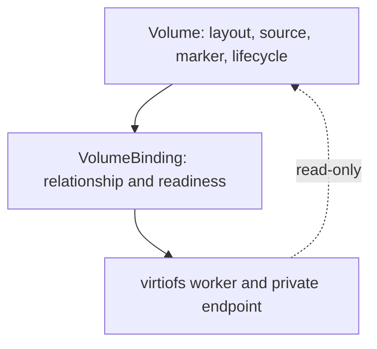
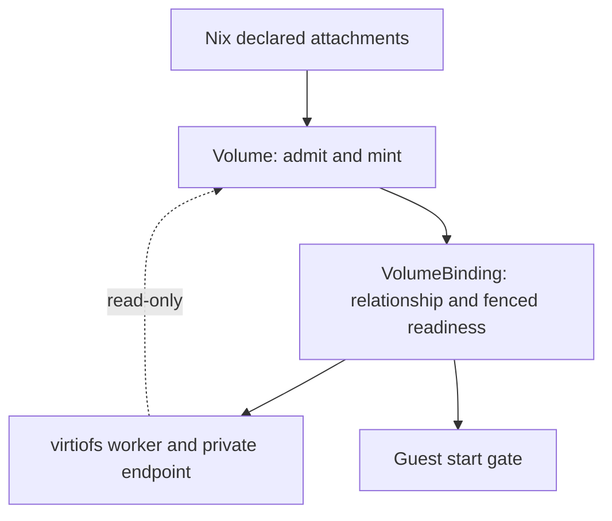
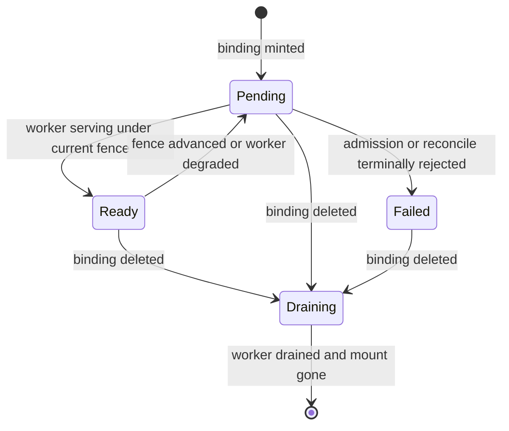

# VolumeBinding Resource - Plan

## Goal Capsule

- **Objective:** Replace the durable provider-specific `Export` attachment path with a neutral `VolumeBinding` resource under strict controller ownership, and land the selected host check plus full integration lanes.
- **Product authority:** GitHub issue 494 (desired model, takeover plan, non-goals) plus confirmed scoping synthesis: clean single-owner break, Volume-side binding ownership with dependency-only virtiofs, full Export removal, Guest gate on binding readiness.
- **Product Contract preservation:** Restructured, no scope change except R11 pinned to the removal arm (user-directed: full deletion over privatization); OQ1 resolved (issue invocation valid against the Makefile; two stale docs queued in U8); OQ2 resolved to input-only attachments (KTD1); F1 outcome extended with the Guest gate; AE4-AE6 added for the new conditional behavior. Review pass added R15 (guest-gate requirement), an R7 status-write exception, and three deferred cutover questions.
- **Stop conditions:** Selected host check green, then full integration lanes green. No schema-admission weakening at any point.
- **Execution profile:** Contract-first sequencing (admission must accept bindings before controllers mint them), hermetic provider tests before host VM runs, single clean-break cutover for Export deletion.
- **Tail ownership:** Implementer works units in dependency order and satisfies the Verification Contract before landing.

---

## Product Contract

### Summary

Introduce a durable neutral `VolumeBinding` for each Volume / execution-target / named-view relationship. Each controller owns its own resource and private state, crosses into other state only through resource reads, and `volume-virtiofs` serves bindings while owning just its worker and private effects. The implementation registers the type through the full catalog chain first, retypes the Volume-side minter and the virtiofs reconciler onto bindings, retargets the Guest start gate, then deletes Export in the same break.

### Problem Frame

Execution attachments live in `Volume.spec.attachments` and materialize as `virtiofs.d2bus.org.Export` resources. `Export` is provider serving state acting as the durable cross-provider attachment object. That splits ownership across providers: VolumeLocal mints the relationship while volume-virtiofs owns the serving lifecycle. The last host result proved the catalog does not install the qualified Export schema, so the gap is structural rather than a filesystem workaround. Filesystem-level repairs on PR #493 worked around symptoms without fixing ownership.

### Key Decisions

- **Neutral binding over Export repair.** The relationship becomes a first-class neutral resource instead of rehabilitating provider serving state. Governs R1, R9, R11.
- **Clean single-owner break.** Attachments never get two durable owners at once (session-settled: user-approved — chosen over a transitional dual-owner period: a second durable owner re-creates the split this work removes). Governs R5, R8, R12.
- **Strict controller ownership.** Every controller owns its resource and private state. Cross-controller access goes through resource reads only, never direct durable writes. Governs R4, R6, R7, R8.
- **Volume-side binding ownership with dependency-only virtiofs.** The Volume side owns attachment admission and deterministic binding identity; virtiofs observes bindings and reads Volumes without writing them (session-settled: user-approved — chosen over a dedicated binding owner: admission already lives Volume-side and a third owner adds a new authority without a consumer). Governs R5, R6.
- **Preserve the hardening already earned.** StoreView, sandbox, traversal, lock, adoption, and fail-closed behavior survive unchanged. Governs R13.

### Actors

- A1. Volume-side owner. Admits attachments, mints binding identity, owns storage layout and lifecycle.
- A2. Virtiofs consumer. Observes bindings, serves them through workers and private endpoints, reports fenced readiness.

### Requirements

**Binding contract**

- R1. One durable `VolumeBinding` exists per Volume / execution-target / named-view relationship, carrying access mode and mount intent as the neutral attachment record.
- R2. Each binding carries explicit readiness evidence fenced by its UID, generation, and revision, so a stale or reassigned binding never reports ready.
- R3. Bindings define deletion and finalizer behavior that tears down serving effects before the binding disappears, leaving no orphaned workers.

**Ownership and access discipline**

- R4. Volume remains the sole owner of storage layout, source, marker, and lifecycle state, and no other controller writes it.
- R5. Attachment admission and deterministic binding identity are owned Volume-side, and virtiofs never mints bindings.
- R6. `volume-virtiofs` reconciles `VolumeBinding` and owns only its worker process and private endpoint effects, plus sole authorship of the binding status projection per KTD3.
- R7. A controller reads state outside its own resource only through resource reads and changes it only through the owning resource, never by direct cross-controller durable writes, except the authorized binding status projection written by virtiofs per KTD3.
- R8. All durable state in this area is a resource, while provider-private runtime state stays private and never doubles as the cross-provider contract.

**Platform registration**

- R9. `VolumeBinding` is installed in the canonical contract, API catalog, resource emission, provider descriptors, RBAC, and bundle/catalog projections, so schema admission accepts it where `Export` was rejected.
- R10. Fixture and target graphs express the Volume-to-Binding-to-serving chain that the host assertions exercise.

**Guest gating**

- R15. Guest start is gated on current binding readiness; a guest does not boot against a non-ready or unfenced binding.

**Export removal**

- R11. The durable `Export` public contract is removed in the same clean break.
- R12. Export schema, finalizer, status projection, child-mutation path, watches, and host assertions are removed with the contract, leaving no second durable owner.

**Preserved behavior**

- R13. Read-only StoreView, closure-only `/nix/store` view, virtiofsd user-namespace sandbox, marker/lock lifecycle, no-follow traversal, restart adoption, and fail-closed readiness are preserved unchanged.

**Tests and acceptance**

- R14. U7 tests, host integration assertions, design docs, and changelog cover the binding model, with the selected host check passing first and the full integration lanes passing before landing.

### Key Flows

- F1. Establish and serve.
  - **Trigger:** A Volume carries attachment intent for an execution target and named view.
  - **Actors:** A1, A2
  - **Steps:** A1 admits the attachment and mints the binding; A2 observes the binding, resolves the view dependency-only, launches its worker, and reports fenced readiness.
  - **Outcome:** Serving is ready only behind a current fence, and Guest start observes binding readiness; anything unfenced stays fail-closed.
  - **Covers R1, R2, R5, R6, R9, R15.**
- F2. Tear down.
  - **Trigger:** A binding is deleted.
  - **Actors:** A1, A2
  - **Steps:** Finalizers drain the worker and private endpoint before the binding disappears; a present guest mount blocks finalizer removal.
  - **Outcome:** No orphaned serving effects remain.
  - **Covers R3, R6.**

### Acceptance Examples

- AE1. **Covers R2.** Given a binding superseded by a newer generation, when a readiness report arrives under the old fence, then it is not accepted as ready.
- AE2. **Covers R7.** Given the referenced Volume changes, when virtiofs reconciles, then the Volume is read dependency-only and left unwritten.
- AE3. **Covers R11, R12.** Given attachments active and the system settled, when durable state is inspected, then no `Export` exists as a depended-on cross-provider contract.
- AE4. **Covers R2, R15.** Given a binding whose worker is not yet serving, when the Guest start gate evaluates, then the guest does not boot until the binding reports ready under a current fence.
- AE5. **Covers R5.** Given two attachments naming the same guest mount path, when admission runs, then the second is rejected and the rejection is visible in status.
- AE6. **Covers R3.** Given a binding deleted while its share is still mounted in the guest, when finalization runs, then the worker drains first and finalizer removal waits until the mount is gone.

### Success Criteria

- The selected host check passes: `D2B_HOST_VM_CHECK=runtime-cloud-hypervisor-guest-preflight make test-host-integration`.
- The mandatory full integration lanes pass before landing.
- Admission accepts `VolumeBinding` through the installed catalog with no schema-admission weakening.

### Scope Boundaries

- No second scheduler or compatibility executor.
- No relaxation of Resource API schema/catalog admission to make `Export` work.
- No public-read exposure of host paths, sockets, credentials, or numeric identities.
- No in-guest agent or daemon; the guest leg stays config-only with observed readiness.
- PR #493 Export repair commits are diagnostic progress, not the final implementation.

### Outstanding Questions

None blocking. OQ1 and OQ2 from the requirements pass were resolved during planning (KTD1; Makefile evidence in U8).

### Sources / Research

- GitHub issue 494: desired model, takeover plan, acceptance evidence, non-goals.
- PR #493: U7 repair loop and diagnostic Export repairs (not the final implementation).
- `docs/plans/2026-08-31-001-refactor-generic-resource-reconciler-plan.md`: Plan U7 context.
- `packages/d2b-contracts-resource/src/v3/virtiofs_export.rs`: Export contract structural template for the binding shape.
- `packages/d2b-provider-volume-local/src/exports.rs`, `packages/d2b-provider-volume-local/src/views.rs`: intent translation and admission to retype Volume-side.
- `packages/d2bd/src/resource_runtime/volume_provider_runtime.rs`, `packages/d2bd/src/binding_child_resource_runtime.rs`: shared-runner composition, child minting, reconcile and finalize paths.
- `packages/d2b-provider-volume-virtiofs/src/controller.rs`, `packages/d2b-provider-volume-virtiofs/src/port.rs`, `packages/d2b-provider-volume-virtiofs/src/worker.rs`: reconciler, effect port, and worker plan to preserve.
- `packages/d2b-provider-runtime-cloud-hypervisor/src/controller.rs`, `packages/d2b-provider-runtime-cloud-hypervisor/src/bootstrap_graph.rs`: Guest gate and readiness conditions to retarget.
- `tests/host-integration/runtime-cloud-hypervisor-guest-preflight.nix`: selected-check fixture to extend.

---

## Planning Contract

### Key Technical Decisions

- KTD1. Attachments stay as input-only declaration; bindings are the sole durable relationship (session-settled: user-approved — chosen over deleting the attachments field: strict wire parsing would break every stored Volume, while input-only keeps a single durable owner). Translation happens exclusively Volume-side at reconcile. Governs R1, R5, R8.
- KTD2. Binding identity derives from volume, execution target, view, and mount path with no attachment index, and admission rejects duplicate guest mount paths. Reorders stop churning identities, and one guest path never gets two servers. Governs R1, R2.
- KTD3. Virtiofs is the sole authorized status-subresource writer and writes the fenced status projection on every reconcile; status and finalizer mutation is restricted to the virtiofs controller identity with server-side fence validation, and the Volume side never writes binding status. The existing projection path gains a writer, which makes stale-fence rejection testable. Governs R2, R6, R7.
- KTD4. The Guest VMM gate observes binding readiness, and the export-named dependency condition is renamed to binding semantics. Without a binding-observing consumer the fenced-readiness outcome has no effect on boot order. Governs R2, R10, R15.
- KTD5. Terminal admission and reconcile failures surface a Failed phase with a reason instead of collapsing to Pending. Rejections stay invisible otherwise, which would make the new admission rules undebuggable. Governs R5, R6.
- KTD6. Finalizer removal waits while the guest mount is present by wiring the controller drain check into the daemon finalize path. Deleting only worker and endpoint leaves stale guest mounts unproven. Governs R3.
- KTD7. The read-only store marker and closure-identity branch stays virtiofs-side as dependency-only reads. Placement follows the existing fail-closed posture with no ownership change. Governs R6, R13.
- KTD8. Registration cutover moves every site atomically: contract const in both copies, both schema generators with committed outputs, Nix type lists, standard catalog derivation, child-type arrays, runner kinds, trusted-catalog pins, bundle wiring, schema-emission gates, committed store catalog, and provider RBAC descriptors. Missing any one reproduces the Export admission rejection. Governs R9, R12.
- KTD9. Worker argv and sandbox posture carry over byte-for-behavior, and the seccomp posture is verified against the rendered argv at implementation rather than assumed. Access keeps its three layers: served view, binding access mode, deprivileged worker. Governs R6, R13.
- KTD10. Export dies by full deletion in the same break (session-settled: user-directed — chosen over a provider-private projection: no consumer needs Export once children are binding-owned, and a private copy keeps a second owner). Contract, intents, status paths, watches, pins, and tests go together. Governs R11, R12.

### High-Level Technical Design

Ownership flows one way from declaration to serving, and readiness flows back along the same path. Diagrams are authoritative alongside the prose.

Sequencing: contract and catalog first so admission accepts bindings (U1), then Volume-side minting (U2) and runner retarget (U3), then serving and Guest gate (U4, U5), then Export deletion (U6), then fixtures and acceptance (U7, U8). U6 lands only after U1-U5 hold together; U7 proves the chain end to end.

---

## Implementation Units

**Phase A — Contract and Volume side**

### U1. Binding contract and catalog registration

- **Goal:** Admission accepts `VolumeBinding` through the standard catalog everywhere Export was rejected.
- **Requirements:** R1, R2, R9.
- **Dependencies:** None.
- **Files:**
  - Create `packages/d2b-contracts-resource/src/v3/volume_binding.rs`; modify `packages/d2b-contracts-resource/src/v3/mod.rs`.
  - Modify `packages/d2b-contracts/src/identity.rs`, `packages/xtask/src/zone_schema.rs`, `packages/xtask/src/gen_resource_schemas.rs`.
  - Regenerate `docs/reference/schemas/v3/`, `nixos-modules/generated/resource-types.nix`, `nixos-modules/resource-schemas`; modify `nixos-modules/resources.nix`.
  - Plus the binding-side entries in provider RBAC descriptors, trusted-catalog pins, and bundle/catalog wiring per the KTD8 checklist.
- **Approach:**
  1. Model the spec and status on the Export contract shape, with UID, generation, and revision fence fields on readiness evidence. Status exposes only the relationship, fenced readiness, and stable safe failure codes; worker, endpoint, paths, and raw diagnostics stay provider-private.
  2. Register `VolumeBinding` as a standard unqualified core type (neutral, Zone-model aligned), not a provider-owned qualified type; add to the canonical const in both copies and run the generators.
  3. Install the full binding-side registration in this unit, including provider RBAC descriptors, trusted-catalog pins, and bundle/catalog wiring, so admission verification covers the complete installed path.
  4. Admission rejects binding creates and updates without a valid owner reference to an existing Volume; direct external creates are rejected. The serving role gains write on bindings and read on Volumes, with no Volume write and no wildcard.
  5. Confirm the standard catalog derives the type with no extension-only path.
- **Patterns to follow:** `packages/d2b-contracts-resource/src/v3/virtiofs_export.rs` for spec, status, and deny-unknown deserialization shape.
- **Test scenarios:**
  - Binding create payload passes Resource API envelope admission through the standard catalog.
  - Unknown-field payload is rejected by strict deserialization.
  - Invalid fence (wrong UID, older generation) is rejected at admission.
  - Direct external binding create without a Volume owner reference is rejected.
  - Binding status serialization exposes no paths, sockets, argv, or numeric identities.
  - Drift check shows generated schemas and Nix outputs byte-identical.
- **Verification:** New contract tests green; catalog admission test green; `make test-drift` passes.

### U2. Volume-side admission and binding minting

- **Goal:** The Volume side admits attachments and prepares one deterministically-named binding per attachment for minting by the shared runner (U3).
- **Requirements:** R1, R5, R8.
- **Dependencies:** U1.
- **Files:**
  - Modify `packages/d2b-provider-volume-local/src/exports.rs` (retype intents to bindings), `packages/d2b-provider-volume-local/src/views.rs` (duplicate rejection per KTD2).
  - Modify `packages/d2b-provider-volume-local/src/status.rs`, `packages/d2b-provider-volume-local/src/controller.rs`, `packages/d2b-provider-volume-local/src/relocation.rs` (retype attachment status aggregation and the re-point state machine onto bindings).
- **Approach:**
  1. Retype the intent translation to bindings with owner reference on the Volume, per KTD1.
  2. Derive names from volume, execution target, view, and mount path with a new domain tag; reject duplicate guest mount paths at admission.
  3. Retype attachment status aggregation onto binding readiness; re-point the relocation state machine onto binding children against the destination source.
  4. Keep attachments as validated input only; mint nothing else durable.
- **Patterns to follow:** Existing `desired_export_intents` and domain-tagged SHA-256 naming in `exports.rs`; `admit_attachments` rules in `views.rs`.
- **Test scenarios:**
  - Same inputs always mint the same binding name; attachment reorder does not churn names.
  - Duplicate mount path is rejected with a visible reason (AE5).
  - Attachment status fields map onto binding readiness without breaking stored status.
  - Relocation re-points binding children against the destination source.
  - Read-only versus writable access and single-writer rules behave as before.
  - Attachment cap enforcement is unchanged.
- **Verification:** Provider intent unit tests green; no second durable type minted.

### U3. Shared-runner retarget onto bindings

- **Goal:** The U7 shared runner reconciles Volume-to-binding children with existing fencing and finalizer machinery.
- **Requirements:** R1, R3, R5, R9.
- **Dependencies:** U1, U2.
- **Files:**
  - Modify `packages/d2bd/src/resource_runtime/volume_provider_runtime.rs`, `packages/d2bd/src/binding_child_resource_runtime.rs`.
- **Approach:**
  1. Add the binding arm to the shared resource-kind dispatch and mint binding child envelopes owned by the Volume, per KTD1.
  2. Swap the child-type arrays from Export to bindings; keep assignment-fence resolution untouched.
  3. Keep Volume readiness as children-converged; serving readiness lives on the binding per KTD3.
- **Patterns to follow:** Existing `reconcile_volume` and owned-children reconciliation flow.
- **Test scenarios:**
  - Binding child payload starts with the typed binding status projection.
  - Volume with attachments converges children owned by the Volume.
  - Stale-fence binding update is not accepted as converged.
- **Verification:** U7 inline tests green; existing fencing tests unmodified and passing.

**Phase B — Serving and Guest gate**

### U4. Virtiofs reconciles bindings

- **Goal:** `volume-virtiofs` serves bindings, owns only worker and endpoint effects, and reports fenced status including terminal failures.
- **Requirements:** R2, R6, R7, R13.
- **Dependencies:** U1, U3.
- **Files:**
  - Modify `packages/d2b-provider-volume-virtiofs/src/export.rs`, `packages/d2b-provider-volume-virtiofs/src/controller.rs`, `packages/d2b-provider-volume-virtiofs/src/error.rs`, `packages/d2b-provider-volume-virtiofs/tests/lifecycle.rs`.
  - Keep `packages/d2b-provider-volume-virtiofs/src/port.rs`, `packages/d2b-provider-volume-virtiofs/src/worker.rs`, `packages/d2b-provider-volume-virtiofs/src/readiness.rs` behavior-identical except binding-typed plumbing.
- **Approach:**
  1. Retype the reconciler input from Export to binding spec; keep the effect port per KTD9.
  2. Write the fenced status projection on every reconcile per KTD3; surface terminal failures per KTD5.
  3. Restrict binding status and finalizer mutation to the virtiofs controller identity with server-side fence validation; add a negative test proving unauthorized Ready writes cannot release the gate.
  4. Keep worker plan, argv rendering, sandbox posture, and read-only store branch per KTD7 and KTD9; verify seccomp posture against rendered argv.
  5. Execution note: build the hermetic provider tests first, then retype the reconciler against them.
- **Patterns to follow:** Existing controller verdicts, drain semantics, and fail-closed readiness mapping.
- **Test scenarios:**
  - Happy path reaches Ready with worker reference under a current fence.
  - Stale-fence report is not accepted as ready (AE1).
  - Volume changes are read dependency-only and left unwritten (AE2).
  - Invalid view or access reports Failed with a reason instead of Pending.
  - Unauthorized Ready update cannot release the Guest start gate.
  - Drain reports incomplete while the guest mount is present (AE6 setup).
  - Error-code uniqueness holds after renames.
- **Verification:** Hermetic provider lifecycle tests green; ownership test pins binding type and finalizer.

### U5. Guest gate observes binding readiness

- **Goal:** Guests boot only behind current binding readiness.
- **Requirements:** R2, R10, R15.
- **Dependencies:** U3, U4.
- **Files:**
  - Modify `packages/d2b-provider-runtime-cloud-hypervisor/src/controller.rs`, `packages/d2b-provider-runtime-cloud-hypervisor/src/bootstrap_graph.rs`, Guest dependency observation in `packages/d2bd/src/resource_runtime.rs`.
- **Approach:**
  1. Add binding references to the bootstrap graph and gate VMM start on binding Ready per KTD4.
  2. Rename the export-named dependency condition to binding semantics.
  3. Keep hypervisor share wiring derivation inside the existing Guest graph per the confirmed three-leg ownership.
- **Patterns to follow:** Existing dependency snapshot and VMM readiness gate.
- **Test scenarios:**
  - Guest with a non-ready binding does not start (AE4).
  - Guest with all bindings ready under current fences starts.
  - Renamed condition appears in status where the old one did.
- **Verification:** Guest controller unit tests green; no references to Export readiness remain in the gate.

**Phase C — Cutover and acceptance**

### U6. Export deletion cutover

- **Goal:** No Export contract, minting path, watch, pin, or test remains.
- **Requirements:** R11, R12.
- **Dependencies:** U1, U2, U3, U4, U5.
- **Files:**
  - Delete `packages/d2b-contracts-resource/src/v3/virtiofs_export.rs`; modify `packages/d2b-contracts-resource/src/v3/mod.rs`.
  - Modify every file still referencing the Export type on the deletion side (binding-side installation lives in U1): runner dispatch and child minting in `volume_provider_runtime.rs`, child-type arrays, trusted-catalog pins and registration tests in `resource_runtime.rs`, provider RBAC descriptors and READMEs, ADR-046 dossiers.
- **Approach:**
  1. Enumerate every Export reference by content search and remove or retype each per KTD10 and the KTD8 checklist.
  2. Delete the Export write grant with the type; grant no new rights here.
  3. Update registration and catalog tests to pin bindings where they pinned Export.
  4. Land only when U1-U5 hold together so no consumer dangles.
- **Patterns to follow:** KTD8 site checklist from research.
- **Test scenarios:**
  - Content search for the Export qualified type returns no durable references.
  - Export write grant removed with no orphaned grants.
  - Trusted-catalog test pins bindings through the standard catalog only.
  - Full crate test surface for touched packages passes.
- **Verification:** Zero Export references outside history; registration tests green.

### U7. Fixtures and host-check assertions

- **Goal:** The selected host check proves the Volume-to-binding-to-serving chain instead of passing vacuously.
- **Requirements:** R10, R14.
- **Dependencies:** U3, U4, U5, U6.
- **Files:**
  - Modify `tests/host-integration/runtime-cloud-hypervisor-guest-preflight.nix`, `tests/unit/nix/cases/volume-mounts.nix`, `nixos-modules/resources-zones-processes.nix`, `nixos-modules/bundle-zones.nix`, `packages/d2b-provider-volume-virtiofs/nix/default.nix`.
- **Approach:**
  1. Extend the preflight fixture with a Volume, an attachment, and the resulting binding, keeping attachments as declared input per KTD1.
  2. Add assertions for binding existence, fenced readiness, worker and endpoint ownership, and teardown draining.
  3. Extend Nix unit cases for binding emission alongside existing attachment cases.
  4. Execution note: prefer host-assertion and fixture verification over unit coverage here; the VM run is the proof.
- **Patterns to follow:** Existing jq vmCheck assertions for controller processes and catalog.
- **Test scenarios:**
  - Fixture declares Volume with attachment; binding appears owned by the Volume.
  - Assertions observe worker serving under a current fence.
  - Binding deletion drains worker and endpoint before disappearing.
- **Verification:** `D2B_HOST_VM_CHECK=runtime-cloud-hypervisor-guest-preflight make test-host-integration` passes with the extended assertions.

### U8. Docs, changelog, and stale references

- **Goal:** Design docs, changelog, and contributor docs describe the binding model with no stale Export or env-var references.
- **Requirements:** R14.
- **Dependencies:** U6, U7.
- **Files:**
  - Modify ADR-046 dossiers, provider READMEs, changelog, `docs/contributing/gates-and-lints.md`, `tests/README.md`.
- **Approach:**
  1. Update dossiers and READMEs that pin the Export model, including RBAC role tables.
  2. Fix the two stale host-check env-var references: the Makefile accepts both `D2B_VM_CHECK` for the build set and validated `D2B_HOST_VM_CHECK` for the selected check, so the issue invocation stands.
  3. Record the changelog entry for the clean break.
- **Patterns to follow:** Existing ADR and changelog conventions.
- **Test expectation:** none -- prose only; changelog and drift lints cover format.
- **Verification:** Changelog lint passes; no stale Export or env-var references in touched docs.

---

## Verification Contract

| Gate | Command or proof | Scope |
|---|---|---|
| Drift | `make test-drift` | Generated schemas and Nix outputs byte-identical (U1, U7) |
| Unit | Touched-crate unit tests green | Contract, admission, intent, provider hermetic, U7 inline, catalog admission (U1-U6) |
| Selected host check | `D2B_HOST_VM_CHECK=runtime-cloud-hypervisor-guest-preflight make test-host-integration` | Binding chain serving and teardown in a real VM (U7) |
| Container lane | `make test-integration` | Non-VM integration surface unbroken |
| Full host lane | `make test-host-integration` | All vmChecks green before landing |
| Changelog | Changelog lint | Entry present and well-formed (U8) |

Behavioral proof order: contract admission first, hermetic provider tests second, selected host check third, full lanes last. x86_64-linux with KVM is required for meaningful host runs; TCG fallback is accepted slow, not a failure signal.

---

## Definition of Done

- Selected host check passes with extended binding assertions; full integration lanes pass before landing.
- Admission accepts bindings through the standard catalog with no extension-only path and no schema-admission weakening.
- U1: contract tests and drift green. U2: intent and admission tests green, no second durable type minted. U3: U7 child and fencing tests green. U4: hermetic lifecycle, readiness, and error-code tests green. U5: Guest gate tests green with no Export readiness references. U6: zero durable Export references; registration tests green. U7: fixture proves serving and teardown in the VM. U8: changelog lint green with no stale references.
- Abandoned-attempt and experimental code from implementation is removed; the diff contains only the cutover.

---

## Appendix

Research trail: repo pattern scout mapped the registration chain, controller conventions, all Export touchpoints, and test patterns; flow analysis surfaced the Guest-gate gap, the missing status writer, and the stored-envelope constraint behind KTD1. No institutional learnings corpus exists yet (`docs/solutions/` absent). No external research ran: the Export implementation itself is the structural template, so local patterns sufficed.

---

## Deferred / Open Questions

### From 2026-09-07 review

- **Persisted old-type resources lack a drain path** — Implementation Units U2-U6; Acceptance Example AE3 (P1, whole-doc-codex, confidence 75)

  Existing active attachments can retain durable old-type instances, finalizers, or serving effects after old-type handling is removed, so the settled-state assertion stays unproven without an explicit enumerate, drain, and remove sequence.

- **Persisted old-type cutover is unspecified** — Planning Contract KTD10; Implementation Unit U6 (P1, adversarial-codex, confidence 75)

  An upgrade with already-persisted old-type resources can leave unregistered durable objects behind or briefly create both durable relationship types, defeating the single-owner break without an explicit runtime cutover proof before unregistration.

- **Replacement semantics are unspecified** — Planning Contract KTD2; Implementation Units U2-U5 (P2, adversarial-codex, confidence 75)

  Changing a binding view while retaining its guest mount path produces a new identity, but the plan does not say whether the old binding drains before the replacement is created or how the guest gate follows that handoff.
