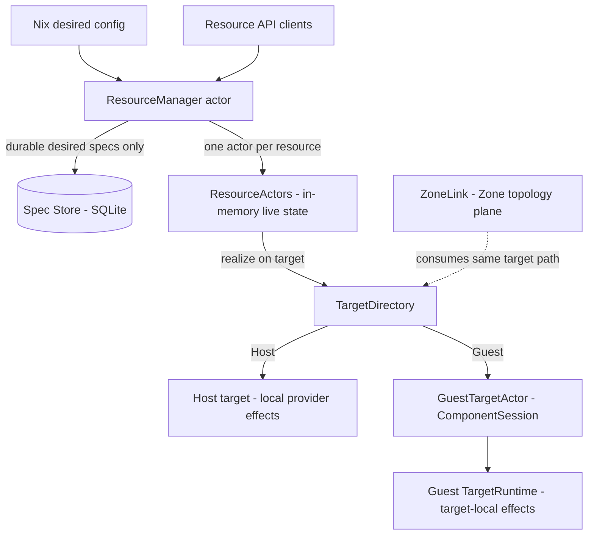
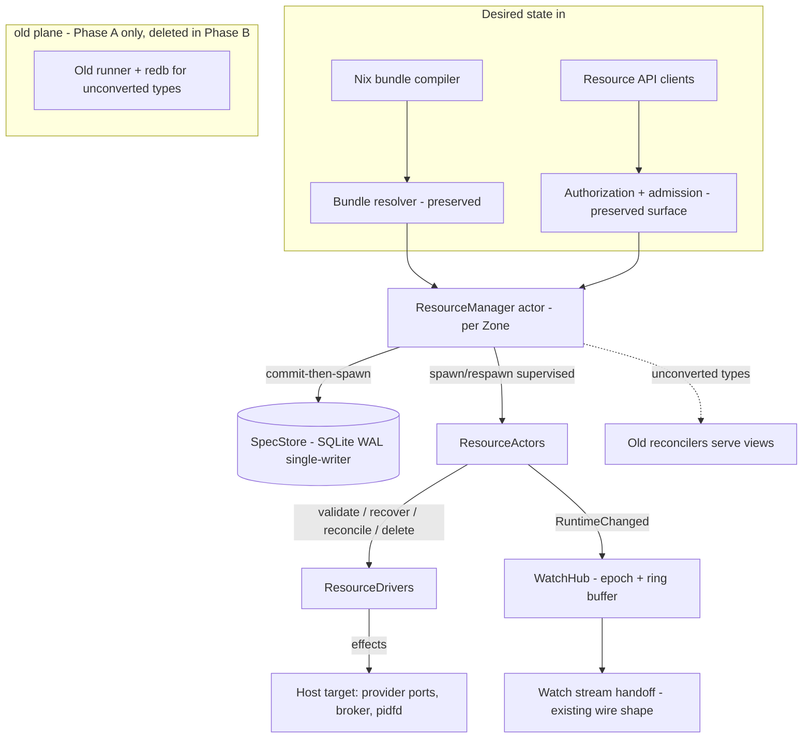
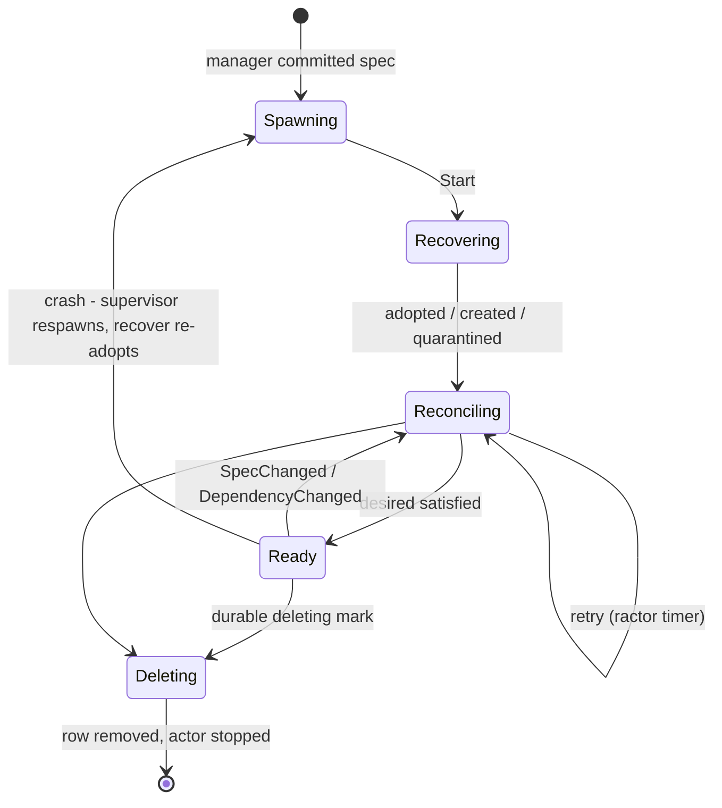
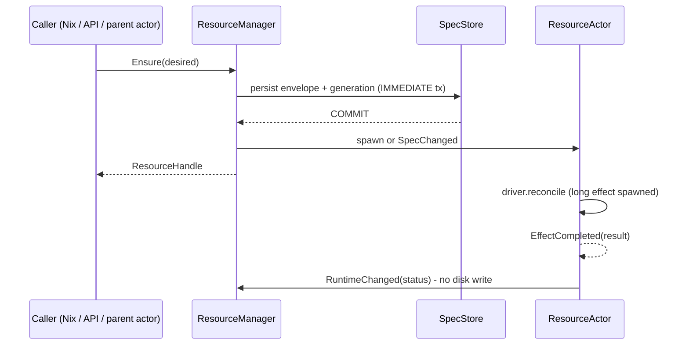
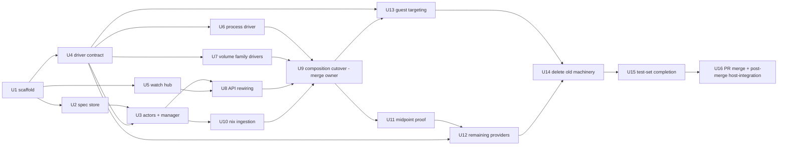

# v3 Resource Runtime Rewrite - Plan

## Goal Capsule

- **Objective:** Produce one plan that implements the v3 resource-runtime rewrite - redb plus store-driven controllers replaced by Ractor resource actors over a minimal SQLite desired-spec store, with explicit Host/Guest execution targets - planned against pulled v3 and shipped through a merged PR.
- **Scope:** The resource plane end to end: new runtime crate, spec store, manager and resource actors, driver conversion for every provider, Resource API rewiring, d2bd-runtime composition, Nix integration, recovery/adoption, and removal of the store/controller machinery. Security and session boundaries are preserved, not redesigned.
- **Product authority:** The handoff specification (see Sources) is the behavioral authority. Its §38 rules and §37 done-checklist govern where this contract is silent. The baseline is pulled `v3` (`d68a63bd0`, which squash-merged the host-integration-gate campaign as PR #497); planning research verified the seams against that exact content.
- **Authority hierarchy:** Product Contract requirements (R-IDs) govern product behavior; Key Technical Decisions govern implementation mechanism; the handoff spec's §38 rules govern where both are silent; ce-work executes per unit and does not amend either.
- **Execution profile:** Deep, cross-workspace, deletion-first rewrite delivered in two phases split at a working-end-to-end midpoint. Phase A builds the runtime plus the Process and virtiofsd-Volume slices and proves them with a host-integration test; one consolidated review to signoff follows; Phase B converts the remaining providers. The tail is a PR against v3, merged, then host-integration re-run on the merged v3. Within a phase the branch may stay broken, but `make check` passes at each phase boundary. Parallel subagents work in fresh, isolated worktrees under one merge owner.
- **Stop conditions:** Stop a unit when an interface contract changes under it, a security boundary weakens, `make check` cannot reach green without deleting surviving behavior, or the midpoint proof cannot run.
- **Tail ownership:** Each unit owns its code, tests, `BUILD.bazel` registration, and `changelog.d` entry. The merge owner owns integration into the two composition hot files and the old-runtime deletion.
- **Open blockers:** None. All brainstorm outstanding questions are resolved into KTDs below; residual items are non-blocking and listed under Open Questions.

---

## Product Contract

Product Contract unchanged by planning; the brainstorm's Outstanding Questions resolved into Key Technical Decisions (see Planning Contract).

### Summary

Desired resource specs become the only durable resource state, held in a small SQLite store; every desired resource gets exactly one authoritative Ractor actor that owns its logical live state, reconciles itself through a `ResourceDriver`, and realizes effects on an explicit Host or Guest target. Runtime status, watches, retries, and queues become in-memory only, and recovery after restart is discovery and adoption from the actual target rather than restoration of persisted status.

### Problem Frame

The current resource plane coordinates controllers through a persistent redb resource database. Reconciliation reads fresh store state, mutates through revision-preconditioned transactions, and publishes status back through the same store; dependency triggers, readiness, retries, and watch delivery all run through that database. The recent 76-commit hardening campaign on this baseline spent nearly all of its effort inside that machinery - fsync coalescing, store-herd staggering, runner respawn, fence adoption, status-churn damping - which is the cost shape of the design itself: correctness depends on persistent coordination state rather than on desired specs plus observed reality. Restart behavior, conflict handling, and watch replay all inherit this burden, and every new provider must learn the controller/checkpoint/revision protocol to participate.

### Key Decisions

- KD1. Implement the handoff specification as written rather than re-deriving architecture - its three-truth model (desired / observed / runtime actors), §38 rules, and §35 step order are adopted wholesale; this contract records the product-level commitments and delegates shapes to the spec. Governs R1-R32.
- KD2. Baseline is pulled `v3` (`d68a63bd0`) - the working branch merged there as PR #497, so the rewrite branch starts from v3 with the host-integration-gate content already in; the rewrite then deletes much of what that campaign hardened. (session-settled: user-directed - supersedes the earlier branch-off-current-HEAD choice: the branch merged to v3, so work continues from v3.)
- KD3. Existing store/runner test suites are not ported; the spec's §36 invariant tests replace them, accepting a coverage dip during the cutover. (session-settled: user-approved - agent proposed, user confirmed.)
- KD4. Crates the spec's delete list does not name (`d2b-core-controller`, `d2b-provider-test-controller`) take their disposition from the spec's §39 deletion heuristic - delete what exists mainly to route controllers through the persistent store - rather than being enumerated here. (session-settled: user-approved - agent proposed, user confirmed.)
- KD5. Midpoint-first delivery: Phase A ends at a working end to end - a Process resource realized on the host and a virtiofsd Volume resource that creates worker child resources - validated by a host-integration test; one consolidated review pass of the full change set to signoff happens there, before Phase B converts the remaining providers. No per-phase review loops. (session-settled: user-directed - chosen over reviewing every phase: minimizes time to a provable midpoint and gives one gap-finding checkpoint.)
- KD6. Heavy subagent parallelism: implementation units run in separate worktrees with a merge owner integrating results; cross-unit contracts are fixed before worktrees fan out so merges stay mechanical. (session-settled: user-directed.)
- KD7. The per-phase gate is `make check` green, even when that requires removing tests for obsolete code that the rewrite will delete; unit tests on new and modified code must stay solid. (session-settled: user-directed.)

### Actors

- A1. Nix resource compilation - materializes top-level desired resources, including execution targets, and applies them.
- A2. External Resource API clients - create, list, watch, and delete resources through authorized API operations.
- A3. `ResourceManager` - single runtime authority for desired specs, actor lifecycle, provider and target lookup, ownership edges, and external watches.
- A4. `ResourceActor` (one per desired resource) - exclusive owner of the resource's logical live state; schedules reconciliation.
- A5. `ResourceDriver` / provider code - resource-specific validate, recover, reconcile, delete behavior; converted from current reconcilers.
- A6. Guest targets - `GuestTargetActor` plus the guest-side target runtime reached over the authenticated ComponentSession.
- A7. Shared provider runtime actors - semaphores and singleton state (process runtime, PipeWire, netlink, GPU ownership) that resource actors call.

### Key Flows

- F1. Desired-resource apply (durability boundary)
  - **Trigger:** A desired resource arrives from Nix, the Resource API, or a parent actor's Ensure.
  - **Steps:** Persist the desired spec and commit; only then spawn or update the resource actor and return a handle. Identical spec is idempotent; changed spec advances the durable generation and notifies the existing actor; a child's row carries its owner so the graph reconstructs after restart.
  - **Covers R1, R6, R7, R8.**
- F2. Restart recovery
  - **Steps:** Load specs, spawn actors, discover real resources on each actor's exact target, adopt matches, create missing, quarantine unexpected per resource policy, then reconcile desired against observed. Deleting resources resume cleanup; nothing restores persisted status because none exists.
  - **Covers R10, R15, R16.**
- F3. Deletion
  - **Steps:** Mark `deleting` durably and commit before cleanup; the actor runs driver delete, the manager removes the spec row, the actor stops. Owned children are removed with the parent unless the type supports orphaning; a crash mid-cleanup resumes deletion after restart.
  - **Covers R9, R10.**
- F4. External watch lifecycle
  - **Steps:** LIST returns current matches plus a snapshot runtime revision; WATCH resumes from that revision through a bounded in-memory ring buffer into live delivery. Cursors from a prior daemon epoch return RevisionExpired and the client relists. Status changes generate watch events but zero persistent writes.
  - **Covers R11, R23, R24.**
- F5. Guest-targeted realization
  - **Steps:** A Host-zone resource whose spec targets a Guest stays in the Host manager and spec store; its actor realizes effects through the guest target actor over the authenticated ComponentSession to the guest target runtime. Guest disconnect marks target-dependent observed state unavailable; reconnect triggers target-local discovery, adoption, and reconcile. No second desired resource ever appears in the guest.
  - **Covers R18, R19, R21.**

### Requirements

**Runtime architecture**

- R1. Every desired resource is represented by exactly one authoritative Ractor actor in its owning Zone, and that actor exclusively owns the resource's logical live state.
- R2. All resource creation and durable desired-state mutation - from Nix, the API, or parent actors - passes through the `ResourceManager`, the only writer to the spec store.
- R3. Provider-specific behavior lives behind a smaller runtime-oriented driver contract (validate, recover, reconcile, delete); the actor owns scheduling, retries, status publication, dependencies, and lifecycle.
- R4. Existing provider effect and adoption code is preserved wherever it remains useful; conversion is mechanical, not a redesign of each provider.
- R5. Long-running external effects never block a resource actor's mailbox; the actor stays responsive to delete, spec change, and dependency change while effects run, and completion returns as a message.

**Desired-state durability**

- R6. Desired specs persist in a minimal durable store recording identity, owner, spec, generation, and deleting state - and nothing else; runtime status, watches, retries, checkpoints, and queues are never persisted.
- R7. Ensure is idempotent: same resource with the same spec returns the current handle, changed spec persists a new generation before the actor updates, absent resource persists before its actor is created.
- R8. Child resources derive deterministic identity and persist ownership so the owned-child graph reconstructs automatically after restart.
- R9. Parent-child reconciliation is declarative: the manager diffs currently owned children against desired children and creates, retains, or marks-obsolete accordingly.
- R10. Deletion is durable desired state: the deleting mark commits before cleanup starts, and a crash before cleanup completes resumes deletion on restart.

**Ephemeral runtime**

- R11. Resource status and observed state exist only in memory and on the actual target; repeated status transitions generate zero persistent writes.
- R12. Internal watches are actor subscriptions, evaluated atomically with status transitions in the target actor's mailbox, so a condition that flips during registration still notifies exactly once; no database participates.
- R13. Retry and requeue state is runtime-only; after a restart the daemon reconciles immediately instead of restoring timers.
- R14. One actor per resource replaces per-resource concurrency control; explicit shared limits for external backends (process launches, VM creation, serialized provider changes) are honored through shared semaphores or shared runtime actors, with no global controller worker queue.

**Recovery and adoption**

- R15. On restart the daemon loads desired specs, spawns actors, and every actor reconstructs observed state by discovery and adoption on its realization target: exact match adopts, missing creates, unexpected quarantines per resource policy.
- R16. Every realized external resource carries durable-enough adoption identity to be discovered after restart, and the process subsystem's existing probe, observe, pidfd, adoption, and quarantine behavior is preserved rather than replaced with persisted status.
- R17. Actor and provider crashes are supervised: replacement actors recover, adopt, and reconcile; provider restarts notify affected resource actors, which re-subscribe and reconcile.

**Zone and target separation**

- R18. A resource's Zone authority and execution target are independent: a Host-zone resource may realize inside a Guest while remaining owned, named, persisted, authorized, and visible in the Host zone, and no duplicate authoritative resource is synthesized in the guest namespace.
- R19. An explicit target layer decides where effects occur and separates Host from Guest realization; guest realization reaches target-local effect code through the authenticated ComponentSession and the guest target runtime.
- R20. `ZoneLink` remains a Zone-topology resource only; the generic Host-to-Guest realization path is the target mechanism, and session naming must not encode zone-link semantics for generic target traffic.
- R21. Target failure and Zone failure are distinct events: guest unavailability marks target-dependent observed state unavailable without deleting or moving desired resources, and reconnect triggers target-local discovery, adoption, and reconciliation.
- R22. Ractor remoting is not part of this rewrite; the target path may later adopt it internally without resource identity or Zone semantics depending on that choice.

**External watches**

- R23. External API watches are served from an in-memory hub over runtime revisions (per-daemon epoch plus sequence) with a bounded ring buffer; LIST returns a snapshot revision and WATCH resumes gap-free within the epoch.
- R24. Cursors from an older epoch are rejected with RevisionExpired, the client relists and re-watches, and nothing about watches or status events is persisted.

**Integration surfaces**

- R25. The Resource API maps its operations onto the manager's RPC surface while preserving existing authorization, admission, and audit semantics.
- R26. Nix materialization feeds top-level desired resources, including their execution targets where the contract supports targeting, directly into the manager; configuration changes add, update, or mark-deleting against Nix-owned stored specs.
- R27. Daemon readiness reflects spec store, manager, API, providers, targets, initial desired load, and required recovery; the redb store-readiness gate is removed.
- R28. Cross-process trust boundaries - authenticated sessions, admission, broker privilege separation, guest session identity binding - are preserved and strengthened where target assignment needs session-generation binding.

**Cutover**

- R29. The redb resource database, the store crates' runtime responsibility, the runner/source/queue trio, the old reconciler trait, the mutation-result protocol, status persistence, and store-driven watches are deleted; exactly one resource execution model remains at the end.
- R30. Providers convert mechanically using the spec's mapping table, with compiler failures as the checklist; no compatibility adapters, shims, or dual-write paths.
- R31. The rewrite lands on a fresh branch from pulled v3 (`d68a63bd0`, containing the merged host-integration-gate work), planned against that tree.
- R32. Existing store and runner test suites are not ported; the spec's required test set - durability boundary, recovery, internal watches, targeting separation, external watches, provider failure, ownership, concurrency - is written around the new invariants instead.

**Delivery strategy**

- R33. Phase A delivers a working end to end through the new runtime: a Process resource realized on the host, and a virtiofsd Volume resource that creates its worker child process through the manager.
- R34. The Phase A midpoint is validated by a host-integration test exercising both the Process slice and the Volume-with-owned-children slice on a real host.
- R35. One consolidated review of the entire change set runs after the midpoint works, and its signoff gates Phase B; review does not run per phase.
- R36. `make check` passes at the end of every phase; tests of code the rewrite will delete may be removed to keep it green, while new and modified code carries solid unit tests.
- R37. Implementation runs as parallel subagents in separate worktrees with a merge owner; each unit's interface contract is fixed before fan-out so merges are mechanical.
- R38. The plan ships by opening a PR with the full change set against v3, merging it, and then running host-integration on the merged v3; the post-merge run is the final validation gate.

### Acceptance Examples

- AE1. Durability boundary
  - **Covers R7.**
  - **Given** `Volume/data` persisted at generation N, **when** Ensure arrives with the identical spec, **then** the same handle returns and generation stays N; **when** Ensure arrives with a changed spec, generation N+1 persists before the actor receives the change; **when** the resource is absent, the row commits before the actor exists.
- AE2. No lost wakeup
  - **Covers R12.**
  - **Given** a dependent actor watches a target whose condition is false, **when** the condition flips while the watch message is still queued, **then** the dependent still receives exactly one satisfied notification, because evaluation and registration serialize in the target actor's mailbox.
- AE3. Restart adoption
  - **Covers R10, R15, R16.**
  - **Given** a live process, VM, and volume on the host, **when** the daemon restarts, **then** each is adopted by a reconstructed actor; missing desired resources are recreated; unexpected resources are quarantined per policy; resources marked deleting resume cleanup.
- AE4. Stale cursor
  - **Covers R24.**
  - **Given** a client watch cursor from the previous daemon epoch, **when** it resumes against the restarted daemon, **then** RevisionExpired returns and the client relists and re-watches from the new snapshot revision.
- AE5. Guest disconnect and reconnect
  - **Covers R18, R21.**
  - **Given** a Host-zone process targeting a connected guest, **when** the guest disconnects, **then** the desired resource stays in the Host zone with observed status marked unavailable; **when** the guest reconnects, target-local discovery, adoption, and reconciliation run; at no point does a duplicate desired resource appear in the guest.
- AE6. Zero-write status churn
  - **Covers R11.**
  - **Given** a resource cycling through repeated status transitions, **when** the transitions are processed, **then** the spec store performs zero persistent writes.
- AE7. Midpoint proof
  - **Covers R33, R34, R36.**
  - **Given** the Phase A branch with the new runtime, **when** the host-integration test runs at the phase boundary, **then** a created Process is realized and adopted across a daemon restart, a virtiofsd Volume realizes and spawns its worker child through the manager, and `make check` is green.

### Scope Boundaries

**Deferred for later**

- Ractor cluster/remoting for Host-to-Guest execution - behind the target path, not in this rewrite.
- Deriving generation as a hash of the canonical desired spec - possible future simplification, not required now.
- Replacing target-path internals with remote actors - allowed later, identity and Zone semantics must not depend on it.

**Outside this plan's identity**

- The provider-workspace simplification campaign (`docs/plans/2026-08-25-002-refactor-provider-workspace-simplification-plan.md`) - separate, already planned; overlaps this rewrite's crates.
- Preserving redb, the controller runtime, or any store-coordination machinery in any form.
- Event sourcing or Kubernetes-style runtime revisions for runtime state.

#### Deferred to Follow-Up Work

- Watch-hub slow-subscriber eviction tuning beyond the bounded-ring-buffer minimum; CreditPool backpressure parity is a Phase B polish item.
- Copying the handoff specification into the repo for self-containment (source stays in `~/Downloads` for now). **Done 2026-09-11: copied to `docs/plans/2026-09-09-000-v3-ractor-resource-runtime-rewrite-spec.md` (2171 lines).**

### Dependencies / Assumptions

- New workspace dependencies `ractor` (0.16) and `rusqlite` (0.40, `bundled`) are added as part of the work; neither is present today (verified).
- Assumption: no redb data migration. The spec defines a clean cutover with no dual-write and no migration path; durable desired state is re-applied by Nix and API clients after cutover, and live state is recovered by adoption from targets. If existing redb contents must survive the cutover, that is a product decision this plan has not settled.
- Assumption: the handoff spec's suggested type names, message enums, and schema are guidance for planning, not pinned contracts; the §38 rules and the invariant list in this contract are the pinned part.

### Outstanding Questions

Resolved during planning - see Key Technical Decisions KTD2 (spec envelope), KTD4 (Phase A type partition), KTD5 (manager topology), KTD6 (authorization source), KTD7 (launch/adoption ticket inputs), KTD8 (wire and watch compatibility), KTD10 (midpoint test strategy). Remaining non-blocking items live under Planning Contract > Open Questions.

<!-- ce-section: work-relationships -->
### How This Work Fits Together

This plan owns the resource-runtime rewrite end to end. The broader campaign around it is the current understanding, not a committed roadmap:

- The provider-workspace simplification plan (`docs/plans/2026-08-25-002-refactor-provider-workspace-simplification-plan.md`) targets provider crates this rewrite deletes, converts, or leaves alone.
  - Shares territory with R29 and R4 - tentative relationship, resolved at the consolidated review.
- The generic-resource-reconciler refactor (`docs/plans/2026-08-31-001-refactor-generic-resource-reconciler-plan.md`) reshapes the reconciler layer this rewrite replaces with drivers.
  - Depends on nothing from this plan; expected to be superseded in the areas this rewrite deletes.
- Zone-only control-plane clean break (`docs/plans/2026-08-25-001-refactor-zone-only-control-plane-clean-break-plan.md`) already removed parts of the older store surface.
  - Can proceed independently of this plan where it touches surviving contracts.

### Sources / Research

- Handoff specification (outside the repo): `~/Downloads/d2b-v3-ractor-resource-runtime-rewrite(1).md` - 2171 lines, 40 sections; §38 rules, §36 tests, §37 done-checklist are the normative core. Consider copying it into the repo or plans directory so the plan is self-contained on other machines. **Copied 2026-09-11 to `docs/plans/2026-09-09-000-v3-ractor-resource-runtime-rewrite-spec.md` (2171 lines), which is the in-repo authority copy.**
- Claim verification against the current tree (2026-09-09), corrections included:
  - `ResourceReconciler` lives at `packages/d2b-controller-toolkit/src/runner.rs:442` with ~7 production implementors across `d2b-core-controller` and `d2bd` (`process_resource_runtime.rs`, `resource_runtime.rs`, `activation_resource_runtime.rs`, `semantic_binding_resource_runtime.rs`, `credential_resource_runtime.rs`, `volume_provider_runtime.rs`).
  - `Runner`/`ControllerSource`/`PendingQueue` all live in `packages/d2b-controller-toolkit/src` (`runner.rs:770`, `runner.rs:267`, `queue.rs:219`).
  - `ResourceStoreBackend`, `RedbBackend`, `CheckedResourceStore` are defined in `packages/d2b-resource-api/src/store.rs` - not in the store crates the spec's framing implies; the store crates hold `RedbResourceStore`, the revision log, and the watch actor.
  - ZoneLink is not a type in `d2b-contracts-resource`; its wiring lives in `packages/d2b-core-controller/src/zone_links.rs` with `EndpointPurpose::ZoneLink` in `d2b-contracts-zone-session`, and the generic guest session purpose is the literal `"zone-link"` in `packages/d2bd-runtime/src/guest_mode.rs:48` - the rename target the spec calls out.
  - Store-readiness gate: `ZoneRuntimeReadiness { store_ready, ... }` in `packages/d2bd-runtime/src/resource_runtime_support.rs:282`; redb-specific composition in `packages/d2bd/src/composition.rs:20`.
  - Process adoption/pidfd behavior to preserve: `packages/d2b-process-conformance/src` (identity, adoption, quarantine) and `packages/d2b-process/src/backend.rs:283`.
  - Nix compilation surface: `packages/d2b-resource-compiler` plus generated zone/ZoneLink options modules.
- Integration-seam research (planning pass, 2026-09-09):
  - Backend seam: `packages/d2b-resource-api/src/store.rs:26` `trait ResourceStoreBackend`; mutations arrive as sealed, admission-verified mutations - the seal contract is cut consciously (KTD2), not silently.
  - Watch wire: `WatchFrame`/`ZoneRevision`/`WatchOwnerHint` in `packages/d2b-resource-api/src/watch.rs:27,60`; handoff returns stream name plus snapshot revision at `service.rs:689-701` - the WatchHub maps onto this wire, not beside it.
  - Launch tickets: lifecycle scope and operation uid derive from zone_uid, policy_revision, provider_assignment_generation (`packages/d2bd/src/process_provider_runtime.rs:3536-3557`); worker launch resolves signed templates from the Nix bundle, not the spec (`process_provider_runtime.rs:3469-3487`).
  - Volume child chain: Volume derives VolumeBinding children per attachment (`packages/d2bd/src/resource_runtime/volume_provider_runtime.rs:785-845`); binding derives worker Process + Endpoint (`:704-726`); teardown is endpoint-first, process-last (`packages/d2bd/src/resource_runtime/binding_child_resource_runtime.rs:396-397`); tuning travels in the path-free worker plan (`packages/d2b-provider-volume-virtiofs/src/worker.rs:23-45`).
  - Authorization facts: bootstrap phase and policy revision come from redb read snapshots today (`packages/d2b-resource-api/src/authz.rs:243-245,294-301`; `admission.rs:92-141`) - the data source must be rebuilt (KTD6).
  - Precondition surface: Exact-revision updates at `packages/d2b-resource-api/src/service.rs:1113-1114`; `ExpectedRevision::CreateAbsent` at `packages/d2b-resource-api/src/registered.rs:533-560`.
  - Recovery precedent: Adopt/Quarantine/Missing classification via `/proc/<pid>` starttime snapshots in `packages/d2bd-runtime/src/supervisor/state.rs` - direct model for driver recover.
  - 32k-line hot files: `packages/d2bd/src/resource_runtime.rs` (~32k lines) and `packages/d2bd/src/composition.rs` (~32k lines) are the delete/rewire hotspots; all edits there are serialized to the merge owner (KTD9).
- Framework research (external, 2026-09): ractor 0.16.5 (MSRV 1.85, tokio 1.x; supervision via `spawn_linked` + `handle_supervisor_evt`; `RpcReplyPort` for RPC; long effects must not block the mailbox - spawn and send typed completion messages; `ractor::time::send_after` for requeue timers) - https://docs.rs/ractor and https://github.com/slawlor/ractor. rusqlite 0.40.2 with `bundled` SQLite 3.53.2; `Connection` is Send but not Sync - single-writer behind one owned task, WAL + `busy_timeout`, IMMEDIATE transactions, `synchronous=NORMAL`, `tokio::task::spawn_blocking` for all SQLite calls - https://docs.rs/rusqlite.
- Adjacent plans: `docs/plans/2026-08-31-001-refactor-generic-resource-reconciler-plan.md`, `docs/plans/2026-08-25-002-refactor-provider-workspace-simplification-plan.md`, `docs/plans/2026-08-25-001-refactor-zone-only-control-plane-clean-break-plan.md`.
- Baseline facts: baseline branch is pulled `v3` at `d68a63bd0` (host-integration-gate merged as squash PR #497; content identical to the researched branch tip plus one changelog fragment); `make check` is the Bazel Layer-1 gate (`Makefile:103`); host-integration tests are auto-discovered Nix VM checks from `tests/host-integration/*.nix` (`flake.nix:583-597`, `Makefile:149-200`); seam citations gathered at the branch tip are valid for this tree.

---

## Planning Contract

### Key Technical Decisions

- KTD1. New runtime crate `packages/d2b-resource-runtime` with `ractor = "0.16"` and `rusqlite = { version = "0.40", features = ["bundled"] }` as workspace dependencies, each added with the house rationale comment and the cargo-deny/advisory whitelist updated in the same commit that first consumes them. The crate registers in the Bazel graph at creation (own `BUILD.bazel` with an `all-tests` suite plus a `rust-main-packages` entry in `bazel/checks/BUILD.bazel`). Governs R1-R6, R31; covers KD7 gate mechanics.
- KTD2. Spec store: SQLite via rusqlite, one single-writer connection owned by a dedicated store task (never shared across actors), WAL mode, `busy_timeout`, IMMEDIATE transactions, `synchronous=NORMAL`. The persisted row is the full resource envelope minus status - metadata (finalizers, annotations, owner reference, creation timestamp), spec, generation, `deleting`, and a provenance field (`Nix` | `Api` | owned-by-resource key). All SQLite calls run through `tokio::task::spawn_blocking`. The manager commits before spawning. The redb `SealedMutation` admission-seal contract is cut consciously: admission happens in the API layer before the manager call, not as a store precondition. Governs R2, R6-R8, R10; resolves the brainstorm's spec-envelope question.
- KTD3. Driver contract: `ResourceDriver` with `validate` / `recover` / `reconcile` / `delete` over a `ResourceContext` exposing `ensure`, `get`, `delete`, `watch`, `set_status`, `requeue_after`, `children`; drivers are produced by `ResourceDriverFactory` per resource type through a `ProviderDirectory`. Actors schedule and retry; long effects spawn and return typed completion messages; requeue uses ractor timers. Governs R3-R5, R12-R13; cites spec §11-14.
- KTD4. Phase A type partition: the new runtime owns Process, Volume, VolumeBinding, and Endpoint end to end. All other resource types persist as spec rows in the new store and serve bundle-derived views, but keep their old-runtime reconcilers until Phase B. One execution model per resource type, not per deployment - the spec's single-model invariant holds at the end state (R29), not at the midpoint. Resolves the coexistence question.
- KTD5. Manager topology: one `ResourceManager` per Zone, composed under the existing per-Zone `open_resource_plane` path, mirroring zone-scoped audit and authority identity. The spec's single-manager sketch is read as per-zone authority. Governs R1, R2; resolves the manager-topology question.
- KTD6. Authorization rebuild: `PolicySet`, role bindings, and admission facts compile from persisted Role/RoleBinding/User/Provider spec rows in the new store (and the Nix bundle at seed time), replacing the redb-snapshot source; bootstrap phase derives from durable spec facts. Zone policy revision derives from bundle generation plus durable row state. Governs R25, R28.
- KTD7. Launch and adoption ticket inputs: zone_uid, policy_revision, and provider assignment generation derive from the preserved bundle resolver and `ZoneAuthorityIdentity` path, not from the spec store. Each driver's recover derives its `AdoptionIdentity` (zone, type, name, uid, generation) plus target-local evidence (pidfd, `/proc` starttime, socket path); the Process driver re-derives launch intent from the signed bundle exactly as today. Governs R15-R16; resolves the ticket-input question.
- KTD8. Wire compatibility: `ResourceService` public operations and wire envelopes stay; mutation preconditions map resource generation onto the existing Exact-revision semantics, serialized by the single-writer manager; external WATCH delivers over the existing watch stream handoff with the runtime revision (epoch + sequence) mapped onto the wire revision and RevisionExpired for stale epochs. Minimal external WATCH ships in Phase A (the CLI client depends on it); the midpoint test proves LIST only. Governs R23-R25.
- KTD9. Parallel execution model: each implementation unit runs in a fresh named worktree (never the stale `worktrees/d2b-*` checkouts); every unit's contract includes a `changelog.d` entry and its own `BUILD.bazel` registration. All edits to `packages/d2bd/src/resource_runtime.rs` and `packages/d2bd/src/composition.rs` are reserved for the merge owner - subagents never touch those two files, which removes the catastrophic-merge risk. Governs R37.
- KTD10. Midpoint proof reuses the existing operator-activation VM fixture adapted to the new runtime plus one new virtiofsd Volume VM check. Per-assertion dispositions for the old fixture: process PID continuity across restart is preserved; observedGeneration semantics are re-derived in the manager view model; the old runner-journal assertion is dropped with its runner. Resolves the test-strategy question; covers KD5.
- KTD11. Phase boundary deletion timing: old store crates and runner machinery stay wired for unconverted types during Phase A (KTD4) and are deleted in Phase B; obsolete store/runner tests are deleted at the Phase A `make check` boundary when their fixtures stop compiling. `d2b-core-controller` and `d2b-provider-test-controller` dispositions settle at the start of Phase B per KD4. Governs R29-R30, R32, R36.
- KTD12. Ractor/rusqlite interaction rules for all actors: SQLite calls only via `spawn_blocking` or inside the store task; resource actors never hold a SQLite connection; shared limits (process launches, VM creation) stay as shared semaphores or shared runtime actors per spec §31. Governs R5, R14.
- KTD13. Process launches are Process-controller business. A controller that needs a running process creates (or adopts) a Process resource and hands that Process everything the launch needs; it never spawns a child through the provider/supervisor/broker surface itself. The Process controller owns that process's lifetime - launch, restart policy, adoption across daemon restarts, drain, and teardown - so exactly one component decides when the process lives or dies. The Process spec stays argv-free (the contract's injection fence), so the parameters a launch needs cross on the sanctioned parameterization channel that the U7 worker-launch work establishes. Applies to every controller family, not just the midpoint slices. (session-settled: user-directed 2026-09-10.) Governs R4, R8, R33; swept in U17.

### High-Level Technical Design

Component topology per Zone (Phase A state - both planes live; Phase B removes the shaded one):

Resource-actor lifecycle and the durability boundary:

Phase fan-out (units and their dependency waves; U-IDs as in Implementation Units):

### Implementation Constraints

- Every new crate and dependency passes the supply-chain gate in the commit that introduces it (KTD1); `Cargo.lock` and `deny.toml` travel with the consuming commit.
- Subagents never edit `packages/d2bd/src/resource_runtime.rs` or `packages/d2bd/src/composition.rs`; the merge owner owns all changes there (KTD9).
- Each unit keeps its own `changelog.d` entry and `BUILD.bazel` registration; a unit is not done with `make check` failing in its area.
- Worktrees are fresh named checkouts under `worktrees/` with new names; stale `d2b-*` checkouts are not reused.

### Sequencing

Phase A order: U1 scaffold, then wave one (U2, U4, U5 in parallel worktrees), wave two (U3, U6, U7, U8, U10 in parallel after their dependencies), U9 integration by the merge owner, U11 midpoint proof, then the consolidated review to signoff. Phase B order: U12 and U13 in parallel after signoff, then U14 deletion, then U15 final test sweep, then U16 ships: PR opened and merged to v3, then host-integration re-run on the merged v3.

### Open Questions

- Deferred to implementation: ring-buffer sizing and slow-subscriber eviction policy (bounded minimum required; eviction-vs-backpressure decision lands with the WatchHub unit).
- Deferred to implementation: SQLite file placement, per-zone database file layout, and the SQLite-side binding of `ZoneAuthorityIdentity` (store identity story) - flagged for the consolidated review; affects R28.
- Deferred to implementation: exact `d2b-core-controller` DTO migration list under the KD4 heuristic, settled when U12/U14 start and the conversion units consume the types.

---

## Implementation Units

Unit index:

| U-ID | Title | Key paths | Depends on |
|---|---|---|---|
| U1 | Runtime crate scaffold and supply-chain gate | `packages/d2b-resource-runtime`, root manifests, Bazel graph | - |
| U2 | SQLite spec store | `packages/d2b-resource-runtime/src/spec_store*` | U1 |
| U3 | Resource actors and manager core | `packages/d2b-resource-runtime/src/manager.rs`, `resource.rs` | U2, U4 |
| U4 | Driver contract and context | `packages/d2b-resource-runtime/src/driver.rs`, `context.rs`, `provider.rs` | U1 |
| U5 | Watch hub and runtime revisions | `packages/d2b-resource-runtime/src/watch.rs` | U1 |
| U6 | Process driver conversion | `packages/d2bd/src/process_driver.rs` | U4 |
| U7 | Volume, VolumeBinding, Endpoint driver conversion | `packages/d2bd/src/volume_driver.rs` and siblings | U4 |
| U8 | Resource API rewiring and authorization rebuild | `packages/d2b-resource-api/src` | U2, U3, U5 |
| U9 | Composition cutover (merge owner) | `packages/d2bd/src/resource_runtime.rs`, `composition.rs`, `packages/d2bd-runtime/src` | U6, U7, U8, U10 |
| U10 | Nix ingestion into the manager | `packages/d2bd/src/resource_runtime.rs` (owner-only) | U3 |
| U11 | Phase A midpoint host-integration proof | `tests/host-integration/*.nix` | U9 |
| U12 | Remaining provider conversions | `packages/d2bd/src/*_driver.rs`, `packages/d2b-core-controller` | U4, U11 signoff |
| U13 | Guest targeting and session rename | `packages/d2b-resource-runtime/src/target.rs`, `guest_target.rs`, `packages/d2bd-runtime/src` | U4, U9 |
| U14 | Delete old store and controller machinery | store crates, `d2b-controller-toolkit`, workspace manifests | U12 |
| U15 | Invariant test completion | new runtime tests, host fixtures | U14 |
| U16 | PR merge and post-merge host-integration | git/`gh` PR against v3, `make test-host-integration` | U15 |
| U17 | Process-controller ownership of every process launch | `packages/d2bd/src/**` launch sites, `packages/d2b-provider-supervisor` | U12, U14 (sweep) |

### Adjusted sequencing and method (2026-09-11, user-directed)

Keeps the unit order, and fixes the speed levers the Phase B lane surfaced (each of them cost hours of wall time during the 2026-09-10/11 repair chain):

1. **Lane green, then commit immediately** - and commit at every subsequent green boundary. A committed green baseline is the bisect target for U14's deletions; deletions are only cheap once it exists.
2. **Read-path fence (GitHub #507) before U14's deletions**: legacy-store access to a converted type must fail loudly, so a missing manager-first bridge is an immediate, named error rather than a stale read discovered by a VM run 20 minutes later.
3. **Diagnostics slice (GitHub #513, excluding the `d2b debug` command) before the remaining units**: fixture failure dumps reach the lane log, per-stage row prints, stage naming on timeout. This is what makes the next blockers cheap; without it every one costs a lane run plus log archaeology, because fixtures currently discard their own row dumps.
4. **Unit order:** U12 remainder (EphemeralProcess conversion plus the two surviving reconcilers) -> U14 -> U17 launcher sweep -> U15 -> U16.
5. **GitHub #509 (canonical launch identity) lands before the U17 sweep**, so the launcher conversions do not rediscover the target-ref / owner-uid / vm-role fences one VM run at a time.
6. **Concurrency discipline:** one VM or Bazel gate at a time (the VM recipe is fragile under a concurrent Bazel client); parallel work is cargo-only or docs; single writer for `packages/d2bd/src/{composition.rs,resource_runtime.rs,resource_plane_v3.rs}`; deletions touching hot files are prepared off-tree, never landed mid-lane.

Out-of-scope follow-ups raised by this lane, tracked as GitHub issues: #505 (VolumeBinding authorship), #506 (provider-specified classes/shape), #508-#513 and #515 (streamlining backlog). #514 was closed by the user without action.

### U1. Runtime crate scaffold and supply-chain gate

- **Goal:** `packages/d2b-resource-runtime` exists, builds under Cargo and Bazel, and carries `ractor` + `rusqlite` as workspace dependencies.
- **Requirements:** R1, R6; covers KD7 gate mechanics.
- **Dependencies:** none.
- **Files:** `Cargo.toml` (workspace members + `workspace.dependencies` entries with rationale comments), `packages/d2b-resource-runtime/Cargo.toml`, `packages/d2b-resource-runtime/src/lib.rs` (module skeleton), `packages/d2b-resource-runtime/BUILD.bazel` (rust_library, rust_test, `all-tests` suite), `bazel/checks/BUILD.bazel` (`rust-main-packages` entry), `deny.toml` whitelist additions, `changelog.d/` entries.
- **Approach:** Pin `ractor = "0.16"` (default features; no cluster) and `rusqlite = { version = "0.40", features = ["bundled"] }`. Verify Bazel can build the bundled SQLite C sources (build file generation for `libsqlite3-sys`) in this unit, not later.
- **Patterns to follow:** workspace dependency comments at `Cargo.toml:119-131`; per-crate `all-tests` pattern from `packages/d2b-controller-toolkit/BUILD.bazel:130`.
- **Test scenarios:**
  - `make check` compiles the new crate and runs its (empty-plus-smoke) tests through the Bazel gate.
  - `cargo deny check` passes with the two new crates admitted.
- **Verification:** `make check` green; `cargo build -p d2b-resource-runtime` green.

### U2. SQLite spec store

- **Goal:** Durable desired-state store persisting envelope-minus-status rows with provenance and deleting state; commit-before-return durability boundary.
- **Requirements:** R2, R6, R7, R8, R10.
- **Dependencies:** U1.
- **Files:** `packages/d2b-resource-runtime/src/spec_store.rs`, `packages/d2b-resource-runtime/src/schema.rs`, inline `#[cfg(test)]` modules.
- **Approach:** One writer task owning the `rusqlite::Connection` (Send, not Sync); all other access via messages. WAL + `busy_timeout`; IMMEDIATE transactions; `synchronous=NORMAL`. Row carries zone, type, name, uid, generation, owner uid, provenance, deleting, spec envelope minus status. Embedded migrations via `rusqlite_migration`. All calls from async context go through `spawn_blocking` (KTD12).
- **Patterns to follow:** single-writer/read-pool actor shape in `packages/d2b-resource-store-redb/src/lib.rs:1162`; crate-local unit test style from `packages/d2b-resource-store-redb/src/actor.rs`.
- **Test scenarios:**
  - Persist-then-reopen: rows survive a full close/reopen; schema migrations apply idempotently.
  - Durability boundary: Ensure commits and returns before any spawn callback fires (order enforced by API shape and asserted in test).
  - Idempotent Ensure at equal spec keeps generation; changed spec advances generation exactly once.
  - Deleting mark commits and survives simulated process crash (reopen without cleanup).
  - Status-shaped writes are rejected by the API surface (zero persistent status writes; AE6 at unit scale).
  - Concurrent writers serialize via `busy_timeout` without SQLITE_BUSY surfacing.
- **Verification:** `cargo test -p d2b-resource-runtime`; `make check` green.

### U3. Resource actors and manager core

- **Goal:** One authoritative Ractor actor per desired resource plus the per-Zone manager that owns specs, identity, actor lifecycle, ownership edges, and the runtime index.
- **Requirements:** R1, R2, R7-R9, R14, R17.
- **Dependencies:** U2, U4.
- **Files:** `packages/d2b-resource-runtime/src/manager.rs`, `resource.rs`, `identity.rs`, `error.rs`, inline unit tests.
- **Approach:** `ResourceManagerMsg` per spec §4 (Apply/Ensure/Remove/Get/List/Watch/RuntimeChanged/ActorStarted/ActorStopped/DependencyChanged). `Ensure` idempotence per R7. Owned-child diff per R9 with owner persisted on child rows. Supervisor: manager spawns actors linked (`spawn_linked`), respawns on failure with recover/adopt, and holds the ephemeral dependency graph for resubscription (spec §16, §33).
- **Patterns to follow:** supervision semantics from ractor 0.16 (`handle_supervisor_evt`); per-zone construction mirrors `open_resource_plane` zone iteration (`packages/d2bd/src/composition.rs:15592-15715`) - wiring itself lands in U9.
- **Test scenarios:**
  - One actor per resource: duplicate Ensure returns the same handle, never two actors.
  - Ensure commits before spawn: a poisoned spawn still leaves the spec row present (restart recovers it).
  - Actor crash triggers supervisor respawn, recover runs, dependents receive a changed notification and resubscribe.
  - Declarative owned-children diff creates missing, retains matching, marks obsolete children deleting.
  - Same-resource reconcile never overlaps; distinct resources reconcile concurrently.
- **Verification:** `cargo test -p d2b-resource-runtime`; `make check` green.

### U4. Driver contract and resource context

- **Goal:** The `ResourceDriver`/`ResourceDriverFactory`/`ResourceContext` contract every provider converts onto, plus the provider directory.
- **Requirements:** R3-R5, R12, R14.
- **Dependencies:** U1.
- **Files:** `packages/d2b-resource-runtime/src/driver.rs`, `context.rs`, `provider.rs`, inline unit tests.
- **Approach:** Trait shape per KTD3 and spec §11-12. Context methods route child mutations through the manager (never the store). Long effects: driver spawns work and the actor receives a typed completion message; mailbox stays responsive (KTD12). Internal watch registration evaluated atomically with status transitions in the target actor's mailbox (R12; spec §15).
- **Patterns to follow:** closed `HandlerFailure{Retryable,Terminal}` redaction classes from `packages/d2b-controller-toolkit/src/runner.rs:400-437`.
- **Test scenarios:**
  - Watch registered when condition already true notifies immediately; condition flipping while registration is in flight still notifies exactly once (AE2 at unit scale).
  - Requeue-after schedules exactly one reconcile after the delay; a concurrent delete cancels it.
  - A driver blocking past a threshold cannot starve Delete delivery (effect runs spawned).
  - Context child-ensure persists before child actor creation (contract tested with a fake driver).
- **Verification:** `cargo test -p d2b-resource-runtime`; `make check` green.

### U5. Watch hub and runtime revisions

- **Goal:** In-memory external watch service over epoch+sequence runtime revisions with a bounded ring buffer, behind the existing watch stream handoff.
- **Requirements:** R11, R23, R24.
- **Dependencies:** U1.
- **Files:** `packages/d2b-resource-runtime/src/watch.rs`, `packages/d2b-resource-runtime/src/revision.rs`, inline unit tests; wire mapping lands with U8.
- **Approach:** Every desired or runtime change bumps the revision and appends to the ring; LIST returns matches plus snapshot revision; WATCH replays newer events then goes live; pre-epoch cursors return RevisionExpired. Map onto `WatchFrame`/`ZoneRevision` wire shapes (`packages/d2b-resource-api/src/watch.rs:27,60`) preserving owner-hint semantics for relist.
- **Test scenarios:**
  - LIST then WATCH(after=snapshot) receives every later matching event with no gap.
  - Ring replay works within one epoch; a cursor from a previous epoch yields RevisionExpired, and relist-then-watch recovers.
  - Slow subscriber is bounded (ring eviction, no unbounded growth).
  - Status churn produces revisions and events but zero store writes.
- **Verification:** `cargo test -p d2b-resource-runtime`.

### U6. Process driver conversion

- **Goal:** The Process resource runs on a `ResourceDriver`: recover by probe/adopt, reconcile via the preserved provider-ticket launch path, delete cleanly - old controller code for Process retired from active use.
- **Requirements:** R3, R4, R15, R16.
- **Dependencies:** U4.
- **Files:** `packages/d2bd/src/process_driver.rs` (new), deletion of `packages/d2bd/src/process_resource_runtime.rs` reconciler paths happens in U14; this unit adds the driver alongside.
- **Approach:** Mechanical conversion per spec §13 mapping. `recover` = probe + pidfd adopt (preserving `packages/d2b-process` backend behavior and `packages/d2bd-runtime/src/supervisor` classification), `reconcile` = launch through the signed provider-ticket path with ticket inputs from the bundle resolver and zone authority (KTD7), `delete` = term-then-kill with pidfd retry. Restart budget becomes runtime-only per spec §32.
- **Patterns to follow:** adopt/quarantine classification from `packages/d2bd-runtime/src/supervisor/state.rs`; adoption identity from `packages/d2bd/src/process_resource_runtime.rs:2616-2629`.
- **Test scenarios:**
  - Launch creates the process and status reaches Ready with the expected cgroup/unit effect.
  - Restart with a live process adopts without restart (identity evidence matches; AE3 slice).
  - Ambiguous or drifted process quarantines per policy instead of adopting.
  - Delete stops the process and removes the row; crash mid-delete resumes cleanup after restart.
  - Reconcile failure requeues with backoff via actor timer, no persisted retry state.
- **Verification:** `cargo test -p d2bd` for the driver module; driver covered by U11's host test.

### U7. Volume family driver conversion

- **Goal:** Volume, VolumeBinding, and Endpoint drivers with declarative owned-child reconciliation, preserving the signed worker-template model and endpoint-first teardown.
- **Requirements:** R4, R8, R9, R33.
- **Dependencies:** U4.
- **Files:** `packages/d2bd/src/volume_driver.rs`, `packages/d2bd/src/binding_driver.rs`, `packages/d2bd/src/endpoint_driver.rs`; provider effect crates unchanged.
- **Approach:** Volume actor derives binding children per attachment; binding actor derives worker Process + Endpoint children; all child creation goes through manager Ensure with spec committed first (F1). Worker plan and argv re-derive from the persisted binding plus bundle-resolved template on recover (KTD7); tuning stays in the plan, never in the resource. Teardown ordering: endpoint first, process last, with the drain finalizer preserved.
- **Patterns to follow:** child derivation from `packages/d2bd/src/resource_runtime/volume_provider_runtime.rs:704-845`; template contract from `packages/d2b-provider-volume-virtiofs/src/worker.rs:23-45` and ADR 0021 sandbox posture.
- **Test scenarios:**
  - Volume ensure creates binding, worker, endpoint as owned children, each persisted before its actor exists.
  - Parent spec change retires obsolete children and retains matching ones.
  - Worker recover re-derives the launch plan matching the pre-restart incarnation (same template, socket path).
  - Deletion removes endpoint before worker; crash mid-teardown resumes in correct order.
  - Child cannot silently change owner.
- **Verification:** `cargo test -p d2bd`; covered by U11's host test.

### U8. Resource API rewiring and authorization rebuild

- **Goal:** The Resource API serves from the manager and the new authorization facts while keeping its public operation surface, admission, and audit semantics.
- **Requirements:** R25, R23, R24, R28.
- **Dependencies:** U2, U3, U5.
- **Files:** `packages/d2b-resource-api/src/service.rs`, `store.rs`, `watch.rs`, `authz.rs`, `admission.rs`; minimal targeted edits only - this is a rewiring unit, not a redesign.
- **Approach:** Map API operations onto manager RPC (KTD8). Compile `PolicySet` from persisted Role/RoleBinding/User/Provider rows (KTD6); bootstrap phase derives from durable facts. Revision preconditions map generation onto existing Exact-revision wire semantics through the single-writer manager. External WATCH rides the existing stream handoff with epoch+sequence revisions (KTD8).
- **Test scenarios:**
  - Create/read/update/delete through the API persist and read back through the manager.
  - Authorization allow and deny cases from the existing fixture matrix still pass.
  - Exact-revision precondition rejects a stale-generation update with the existing wire error.
  - LIST returns snapshot revision; WATCH resumes from it (unit-scale F4).
  - No status write path exists from API status updates (grep-level invariant test).
- **Verification:** `cargo test -p d2b-resource-api`; `make check` green.

### U9. Composition cutover (merge owner)

- **Goal:** Wire the new runtime into the daemon for the Phase A type set; old runtime keeps serving unconverted types; readiness follows the new reality.
- **Requirements:** R27, R31; covers KD4 partition.
- **Dependencies:** U6, U7, U8, U10.
- **Files:** `packages/d2bd/src/resource_runtime.rs`, `packages/d2bd/src/composition.rs`, `packages/d2bd-runtime/src/resource_runtime_support.rs`. Merge-owner exclusive (KTD9).
- **Approach:** Per-zone manager construction under `open_resource_plane`; type partition routing (KTD4); readiness fields reflect spec store, manager, API, providers, targets, initial load, recovery - drop `store_ready` for the new plane while the old plane still reports its own. Broker-evidence and audit bindings stay attached to the zone runtime.
- **Test scenarios:**
  - Daemon starts in host mode with the partition active; converted types route to the new runtime, unconverted to the old.
  - Readiness gate opens only when the new checklist items complete; no `store_ready` requirement remains for the new plane.
  - Guest mode still boots (old paths intact in Phase A).
- **Verification:** `make check`; daemon smoke path exercised in U11.

### U10. Nix ingestion into the manager

- **Goal:** The Nix bundle flows into the manager as desired specs with provenance and targets; configuration changes add, update, or mark-deleting.
- **Requirements:** R26.
- **Dependencies:** U3.
- **Files:** bundle-ingest path in `packages/d2bd/src/resource_runtime.rs` (merge-owner coordinated with U9), `packages/d2b-resource-compiler` unchanged as the envelope contract.
- **Approach:** Bundle resolver output feeds manager Apply; provenance `Nix` stamped; API-created rows are not clobbered by Nix applies (provenance respected); execution targets pass through where the contract supports them.
- **Test scenarios:**
  - Bundle apply persists all bundle resources with provenance Nix before any actor spawn.
  - Changed bundle advances generations and marks removed Nix resources deleting; API-created resources survive untouched.
  - Envelope validation failures reject the whole bundle atomically.
- **Verification:** `cargo test -p d2bd`; covered end to end by U11.

### U11. Phase A midpoint host-integration proof

- **Goal:** The midpoint proof: adapted operator-activation fixture plus a new virtiofsd Volume VM check proving Process and Volume-with-owned-children end to end.
- **Requirements:** R33, R34, R36; covers AE7.
- **Dependencies:** U9.
- **Files:** `tests/host-integration/resource-operator-activation.nix` (adapt), `tests/host-integration/virtiofsd-volume-runtime.nix` (new).
- **Approach:** Adapt per KTD10 assertion dispositions: keep PID-continuity across restart; re-derive observedGeneration checks in the manager view; drop the old runner-journal assertion. New fixture: volume apply creates binding + worker + endpoint children through the manager, worker process realized, socket present, volume Ready; volume delete tears down endpoint-first. The midpoint gate is `make check` plus `make test-host-integration` with confirmation the VM checks actually ran (KVM present; x86_64-only lane).
- **Test scenarios:**
  - Process created via Nix: realized, Ready, adopted with unchanged PID across `systemctl restart d2bd`.
  - Process created via API: same lifecycle; idempotent re-create returns current state.
  - Volume with worker children: chain realized through the manager; deletion removes children with the parent.
  - LIST returns the expected resource set with a snapshot revision; authz allow/deny matrix still holds.
  - `make check` and `make test-host-integration` both green at the boundary.
- **Verification:** both gates green; this is the R35 signoff input.
- **Status (2026-09-10): midpoint vmCheck green on the Process slice.**
  `D2B_VM_CHECK=resource-operator-activation make test-host-integration`
  passes, which required landing the manager-backed API surface the U8/U9
  cutover left unwired (public routing by type, manager-plane authorizer,
  envelope + in-memory status projection) - see
  `changelog.d/2026-09-10-v3-resource-runtime-u11.md`. The Process assertion
  (`phase == "Ready"`, `observedGeneration == metadata.generation`) is
  restored and passes: making the pass reach its ticket required binding the
  owner reference (manager-resolved, with the authored owner reference as
  the fallback for owners the manager does not manage) and the resource
  revision (the row generation; the new store has no zone revision).
  Evidence (2026-09-10, `virtiofsd-volume-runtime.nix` written and run):
  the Volume-with-owned-children slice is blocked one layer past
  admission. The fixture's first three groups hold on the live daemon -
  Volume `state` Ready with `observedGeneration == metadata.generation`,
  and the deterministic `VolumeBinding/vol-binding-6a8ea4307a30f7ceae6533f2`
  minted through the manager and Ready - but the binding-owned worker
  Process never realizes. Fixed this pass (minimal, evidence-based):
  `BindingDriver::worker_child_specs` derived the worker's executionRef
  from the attachment's Guest ref, which the host-mode ProcessDriver
  rejects as Terminal at validate (`execution_target_allowed` admits only
  Host refs in `DaemonMode::Host`); it now binds `Host/host-system` exactly
  as the old `worker_child_specs` hardcode did
  (`resource_runtime/volume_provider_runtime.rs:744`), and the Process
  driver re-derives the ticket's target ref (KTD7) from the owning
  VolumeBinding row's declared execution ref
  (`process_driver.rs::ProcessDriver::identity`). After the fix the worker
  reaches the launch path and fails at the next unbound input:
  `d2b_provider_supervisor::broker: assignment rejected: no trusted runner
  intent for this role and template resource=Process/vol-vfd-...`. The
  supervisor's `BundleBackedLaunchResolver::resolve_intent`
  (`packages/d2b-provider-supervisor/src/broker.rs:491-526`) has no branch
  that can resolve a VolumeBinding-owned `virtiofsd-worker` ticket:
  `find_provider_controller_intent` filters `role_id == process_ref.name()`
  (worker `vol-vfd-<hex>` vs template intent `virtiofsd-worker-template-<hex>`),
  the component-intent branch is Credential-owner gated, and
  `find_runner_intent_for_process_in_vm` excludes ProviderController roles -
  the only matching intent. The old plane's counterpart never sent the
  worker through this resolver (`ChildReadinessPort::launch_worker`,
  `volume_provider_runtime.rs:1503-1513`, returns the refs; the old
  binding-child machinery realized the worker with composed argv). A second
  downstream gap stands behind it: the resolved template intent's argv is
  bare (`argv: vec![binding.binary_ref()]`,
  `packages/d2b-core/src/bundle_resolver.rs:4396`);
  `generate_virtiofsd_argv`/`PrivateSocketPath::derive`
  (`packages/d2b-provider-volume-virtiofs/src/virtiofsd_argv.rs:128`,
  `socket_path.rs:25`) have no production caller, so
  `--socket-path/--socket-group/--shared-dir/--thread-pool-size` are never
  composed and the serving socket can never bind.

  **Update (2026-09-10, second pass): intent resolution closed; worker
  argv is the standing blocker.** Re-running the check unchanged after
  the in-flight supervisor/broker/resolver work
  (`find_volume_binding_worker_intent`, the serving-worker escrow
  exemption in `d2b-broker/src/runtime.rs`, and the serving
  `user_namespace` minting) clears the resolver blocker above: the
  worker ticket now resolves and `SpawnRunner` reaches the broker. The
  launch then fails one layer later, because the resolved serving
  intent's argv is bare: the broker execs virtiofsd with no arguments,
  virtiofsd prints its usage envelope and exits. Raw journal lines from
  the failing run (`RequestedAssertionFailed` at the Endpoint wait, test
  script line 110):
  - `d2b-broker[1393]: Launch a virtiofsd backend.` /
    `Usage: virtiofsd --shared-dir <SHARED_DIR> --socket-path <SOCKET_PATH> [OPTIONS]` /
    `broker: child reaped via SIGCHLD handler runner_id=scope:05c4bd62... pid=1377
    exit_status=ChildExitStatus { kind: Exited, code: Some(2), signal: None }`
    (same envelope for pids 1332/1377/1393/1441/1513/1660/1939);
  - `d2b_provider_system_minijail: process start failed provider="system-minijail"
    resource=Process/vol-vfd-d61bc83a6686b781a940 error=pidfd-unavailable`
    then `d2bd::process_driver: process launch failed ... error=pidfd-unavailable`;
  - `=== volume-chain rows: endpoint wait failed` / `Volume/state Ready`,
    `VolumeBinding/vol-binding-6a8ea4307a30f7ceae6533f2 Ready`,
    `Process/vol-vfd-d61bc83a6686b781a940 Ready` (see the caveat below),
    `Endpoint/vol-vfd-77e073d3c8e0df3c8077 Pending`;
  - `=== socket dir: ls: cannot access '/run/d2b/vms/acceptance-guest/':
    No such file or directory` / `no vms dir`;
  - `!!! RequestedAssertionFailed: action timed out after 120.36 seconds (timeout=120)`.
  The Process assertion (group 3) passes in that run even though the
  worker never realized - no virtiofsd survives its bare-argv exec and
  the private socket directory is never created - so a green
  `phase == Ready` there is not evidence of a live worker and the
  classification that produced it needs review with the launch work.

  Why the argv cannot simply be composed at
  `build_provider_controller_intents` (`bundle_resolver.rs:4429`, the
  location the previous pass named): the serving template intent is
  minted once per `(execution_ref, template)` - it carries no binding
  identity - while the virtiofsd envelope the provider freezes requires
  the *per-binding* private socket path
  (`PrivateSocketPath::derive(zone, volume, guest)`, the exact
  `/run/d2b/vms/<guest>/vol-<tag8>.vfd.sock` the fixture and the v3
  endpoint probe both assert) plus an inherited Volume-view root
  descriptor (`/proc/self/fd/<N>`; `is_inherited_fd_path`,
  `worker.rs:188`). Neither value is expressible at intent-mint time,
  and the typed launch path deliberately carries no argv and no
  descriptors from the daemon (`SpawnRunnerRequest` is
  `deny_unknown_fields` with no argv/bind-path field; typed launches
  reject `runtime_allocations`; the serving worker's inherited-fd
  contract is currently "zero"). The trio of inputs the worker needs -
  private socket path, view-root descriptor, and a writable private
  socket directory for the worker principal - all live only in the
  daemon's binding knowledge (binding row -> Volume, attachment ->
  Guest, `ZoneVolumeRootResolver` view root), and no channel carries
  them into the broker's argv/spawn authority. Mirrors used by this
  pass to confirm the gap: `d2b-broker`/`d2b-core` depend on no provider
  crate, so `generate_virtiofsd_argv`/`PrivateSocketPath` have no
  production caller on either side of the wire.
  Old-plane counterpart: the old binding runner never launched this
  worker at all (`ChildReadinessPort::launch_worker`,
  `resource_runtime/volume_provider_runtime.rs:1503-1513`, returns refs
  only), and the only real virtiofsd argv in the old plane was authored
  in the Nix bundle per VM (`processes.json` node `argv`,
  `d2b-core::processes::VmProcessDag`, `ProcessRole::Virtiofsd`) - i.e.
  argv was a bundle-build-time artifact, which is the shape a per-binding
  serving intent (compiler-emitted or resolver-derived from the compiled
  zone resource rows) would have to mirror, together with the view-root
  descriptor and socket-directory channels.
  Verification outcomes (this pass): `cargo test -p d2bd --lib` ->
  `test result: ok. 528 passed; 0 failed; 5 ignored`; `D2B_VM_CHECK=resource-operator-activation
  make test-host-integration` -> green (test script finished, no
  assertion failures); `D2B_VM_CHECK=virtiofsd-volume-runtime
  `make test-host-integration` -> runs (not skipped) and fails at the
  Endpoint assertion on the binding-owned worker argv/descriptor gap
  above.

  **Update (2026-09-10, third pass): delete leg repaired; the Volume
  slice is green end to end.** The remaining failures were all on the
  delete path; each fix sits at the layer that owns the fact:
  - **Registry load-on-miss.** `PlaneResourceRegistry`'s socket-target
    lookups (`socket_target_by_identity`/`socket_target_by_ref`) consult
    the attached spec store on a cache miss, because the manager mints
    the derived `VolumeBinding` after the plane's durable loads; pinned
    by
    `resource_plane_v3::tests::socket_target_lookup_loads_derived_binding_rows_from_the_store`.
  - **Delete-uid routing.** The public delete resolves its exact
    precondition uid from the `current` envelope read through the same
    plane the delete dispatches against (`dispatch_public_resource_call`
    -> `public_get_resource` -> `public_delete_request_from_current`),
    so a converted type never binds the legacy store's uid for the same
    key; the manager read renders the row's real stable uid
    (`render_envelope` no longer prints `ResourceUid`'s redacting
    `Display`), pinned falsifiable by
    `manager_backend::tests::spec_shaped_row_serves_its_stable_uid`
    (fails on the old renderer with `ResourceUid(<redacted>)`).
  - **Single-writer.** The legacy U7 Volume runner skips converted types
    (`volume_provider_runtime::start`; `route_resource_type("Volume")
    == PlaneRoute::NewPlane`), so only the v3 plane's driver writes the
    host root
    (`sparse_host_bundle_registers_only_the_legacy_binding_runner`).
  - **Deletion-mark projection and children-first retirement.**
    `stored_from_view` projects the durable row `deleting` mark onto
    `metadata.deletionRequestedAt` (`stamp_deletion_request`), and the
    manager holds a cleanup-completed parent row (mark included) until
    its owned children retire
    (`ResourceManagerState::pending_retirement`/`retire_row`).
    Instrumented run before the fix: the binding was marked at 25.9837
    and retired at 25.9926 - a 9ms window - while the worker Process
    child lived until 26.307 (`owned_children=1` when the binding
    retired), so reads saw neither the mark nor the
    parent-outlives-children ordering. Pinned by
    `manager::tests::parent_row_retires_after_its_owned_children`
    (proven falsifiable: it fails on the old retire-on-completion path).
  - **Fence.** `policy_refresh_rejects_a_policy_snapshot_that_moved_under_it`
    pins that `verify_policy_snapshot` ignores Zone resource-revision
    churn but still fails closed (`PolicyUnavailable`) on every policy
    input moving under the refresh.
  - **Fixture repair + falsifiability lesson.** The Volume/binding uid
    assertions were `!= null`, which the redaction placeholder
    satisfied; they now require the UUIDv4 shape. The teardown sampler
    (reachable only once the preceding waits passed) also had to be
    repaired: it embedded a shell `test -S` inside the jq program (a
    jq compile error) and read endpoint -> process -> binding; it now
    probes the socket in the shell and reads binding -> process ->
    endpoint, so a parent observed gone ahead of a child is real
    evidence rather than a straddled read. Lesson: an assertion weaker
    than the contract it guards (field presence vs parseable identity;
    one sample vs ordered reads) passes the bug it exists to catch -
    strengthen it and prove the companion regression test falsifiable.

  **R35 review item (identity rendering).** `ResourceUid`'s `Display`
  is a redaction stub: any `format!("{}")` on an identity or
  secret-like type silently emits `ResourceUid(<redacted>)` and still
  type-checks - the delete-uid bug came from exactly this. The R35
  review should grep identity and credential types for `format!("{}")`
  renders rather than trusting the type system.

  Verification outcomes (third pass, final tree): `cargo test -p d2bd
  --lib` -> `test result: ok. 530 passed; 0 failed; 5 ignored`; `cargo
  test -p d2b-resource-api --lib` -> `116 passed; 0 failed`;
  `D2B_VM_CHECK=virtiofsd-volume-runtime make test-host-integration`
  -> green (ran; every assertion passed - the binding-deleting mark was
  read in 0.11s, teardown ordering was sampled endpoint-first, and the
  final Volume removal checked); `D2B_VM_CHECK=resource-operator-activation
  make test-host-integration` -> green (30-step script finished in
  60.44s).

**Status (2026-09-11): midpoint fixtures green; the preflight advanced through
the Guest conversion to its last stage.** The two Phase A midpoint fixtures
remain the green proof. `D2B_VM_CHECK=resource-operator-activation
make test-host-integration` passes on every run this session (PASS 79s in
the Guest-conversion run, PASS 10s in the endpoint/publication run), and
`D2B_VM_CHECK=virtiofsd-volume-runtime` stays green per the third-pass
record above; the 2026-09-10 full-lane sweep still resolved the same
output path
(`/nix/store/wryb0s4yz6i8c2rg4claf5qf0q7c8ay6-vm-test-run-d2b-virtiofsd-volume-runtime`),
but the check was not re-executed after the Guest conversion, so its
current-tree result rests on that record.

`runtime-cloud-hypervisor-guest-preflight`, the documented expected-red
check, has moved past the Guest: both post-repair lane runs read
Guest `acceptance-guest` `Ready` with
`runtimeReady`/`bootstrapReady`/`activeProcessCount == 1`, the VMM `Process`
`Ready`, and both Guest-owned `Endpoint` rows (`ch-api`, `guest-control`)
`Ready` within 0.1s. Its remaining failure is one stage later, the
`store-view-acceptance-guest` Volume: the layout entry `sync.lock` comes
back `entry-quarantined` (layout `Degraded`, ro-store attachment
`Pending`), so the fixture's immediate store-view assertion fails and the
Volume never publishes `Ready`. That is the open blocker at bookkeeping
time - a layout adoption/posture question, not the endpoint path - so the
preflight result is **open**, not green.

The lane as a whole stays **not green** (`make test-host-integration`
red). The other seven checks were last dispositioned in the 2026-09-10
lane notes (seven green per-check after serial re-runs); the two harness
defects recorded there were repaired on 2026-09-10 (QEMU state-disk
`snapshot=on`; `/homeless-shelter` removed) but the lane has not been
re-run as a single pass since, and the single `nix build` still aborts
every sibling on the first failure.

### R35 consolidated review (2026-09-10)

Three parallel reviewers covered the wiring added for the midpoint (API
routing, authorization surface) and plan conformance across U1-U11. Applied
in this pass:

- Public routing derives the serving plane from the reference the handler
  acts on (`resourceRef` for targeted methods, `resourceType` for Create,
  the parsed type set for List) and refuses a declared type that disagrees
  with the target - closing a partition bypass where a spoofed
  `resourceType` sent converted-type refs to the legacy plane.
- The manager view carries the generation each in-memory status was
  published for (`ResourceView::status_generation`); the read projection
  claims a status only for the generation it describes, and a spec change
  retires the stale status until the actor republishes.
- Manager reads no longer fabricate `managedBy: configuration` metadata
  without its required `configurationGeneration`.
- Dead partition-refusal machinery deleted (`PartitionedBackend`,
  `v3_type_partition`, `TypePartition`, `with_partition`) and the plane doc
  no longer claims a daemon-internal exclusive partition.

Open at signoff, assigned to the units named - not silently deferred:

- **U11.** `tests/host-integration/virtiofsd-volume-runtime.nix` (Volume
  with owned children) is unwritten, and the Process assertion's
  `phase == "Ready"` is not restored: bundle-emitted provider-controller
  Process rows have no launch path on the new plane yet (see U12).
- **U11 gate.** The midpoint is verified per fixture, not for the lane;
  `runtime-cloud-hypervisor-guest-preflight` asserts a controller Process is
  Ready and is expected red under the current controller-Process ownership
  split.
- **U12 / KTD4.** Bundle-emitted controller-class Process rows are ingested
  into the new store while the old plane owns the controller launch path -
  pass them through until their provider converts, or move the launch path.
- **KTD7.** `ConstructionInputs::production` still hardcodes
  `policy_revision`, `provider_assignment_generation`, `guest_execution`,
  `vcpu_count`, so the launch ticket reaches the signed path with unbound
  lifecycle inputs; `ProcessDriver::identity` still hardcodes `target_ref`
  and the controller-provider identity (the committed row is now bound over
  that unbound default at the effects layer - see the note below). Root cause
  of the failing pass,
  confirmed from the daemon journal 2026-09-10 after logging the provider
  error at its mapping site: the passes first failed
  `provider-ticket:controller-owner-invalid` (owner unbound; fixed by the
  authored owner-reference fallback) and then `provider-ticket:invalid-ticket`
  - the ticket builder's own bounds, reached with the lifecycle bindings this
  item still hardcodes. The provider error text was previously dropped
  (`let _ = error;` in `spawn_launch`) and status is memory-only (R11), so
  the failure had no observable reason at all; `map_provider_error` and
  `spawn_launch` now log it.
  - **Controller provider identity (landed 2026-09-10, KTD7 lane).** The
    remaining error was `provider-controller-provider-identity-missing`
    (`process_provider_runtime.rs:545-549`): a controller ticket needs its
    owning Provider's uid and generation
    (`ControllerBootstrapContext::from_resource_context` reads
    `context.provider_uid`/`provider_generation`, fed by
    `ProcessResourceIdentity.controller_provider_uid/generation`, which
    `ProcessDriver::identity` hardcodes to `None`). The authoritative source
    is the committed Provider row: the old plane loads it with
    `load_committed_controller_provider_identities(zone, store, {provider})`
    (`resource_runtime.rs:21566`, consumed at `:18231`, `:19367`), the same
    rows `load_controller_policy_subjects` and
    `reconcile_controller_sessions_locked` compare against. The new plane
    cannot reuse that path from the driver - `ProductionProcessProviders`
    holds no store handle - so the identity is injected, never derived.
    **Seam corrected from the earlier pin; do not revert it to ingest-time
    seeding.** The pin said to resolve at `ResourcePlaneV3::ingest_nix_bundle`
    (then asserted to own `Arc<RedbResourceStore>` and walk every bundle
    row). That premise is wrong on the current tree - the v3 plane owns the
    SQLite spec store, unconverted `Provider` rows are pass-through only
    (`partition_nix_bundle` -> `plan.pass_through`; `ingest_nix_bundle`
    applies only `plan.apply`; verified with a probe: after ingesting a
    bundle carrying a `Provider` row the new store held none) - and it races
    restart recovery: the manager spawns one actor per durable row in
    `pre_start` and each actor validates/recovers/reconciles in `post_start`
    (`manager.rs:714-763`, `resource.rs:506-560`), i.e. before
    `ingest_nix_bundle` runs on a warm restart, so ingest-time seeding leaves
    a window where a controller's first reconcile fails terminally (the
    provider error maps to `IdentityAmbiguous` -> Terminal). Implemented
    instead: `open_resource_plane` (`composition.rs`) resolves the bundle's
    `Provider` refs, loads their committed identities from the old plane's
    store via `ZoneResourceRuntime::committed_provider_identities(refs)`
    (wrapping `load_committed_controller_provider_identities`) and passes
    them into `ConstructionInputs::production`; `ResourcePlaneV3::prepare`
    publishes them into `PlaneResourceRegistry` before any actor is spawned;
    `ProductionProcessDriverEffects::with_committed_provider_identities`
    binds the owner Provider's committed (uid, generation) at
    launch/adopt/stop/finalize when the row is a controller whose
    `owner_ref` is a `Provider` and the driver-derived identity is unbound.
    The unbound path still rejects closed at
    `ControllerBootstrapContext::from_resource_context`, and a Provider the
    authority does not retain stays unpublished. Expected host-integration
    effect (not yet proven on the VM lane): the controller Process stops
    failing at `provider-controller-provider-identity-missing`, so the
    documented expected-red `runtime-cloud-hypervisor-guest-preflight` is the
    check that proves it. Once U12 converts Provider, the owner is a manager
    row, the manager resolves this natively, and this snapshot/binding path
    goes with the pass-through.
- **U9 / R27.** `NewPlaneReadiness` has no consumer outside the plane: the
  new plane reports a checklist nothing gates on.
- **U10.** Bundle ingestion applies row by row; an envelope validation
  failure does not reject the whole bundle atomically.
- **U7.** `binding_driver` discards the derived `VirtiofsdWorkerPlan` in
  recover/reconcile, and the drain finalizer has no equivalent in the new
  driver. The same discarded plan is why the serving worker executes a bare
  argv today: `PrivateSocketPath::derive` and `generate_virtiofsd_argv` have
  no production caller, so neither the private socket path nor the view-root
  descriptor reaches the broker's spawn wire - virtiofsd exits 2 on its
  usage banner and the Endpoint never leaves `Pending` (see the U11
  volume-chain evidence). This is an authority question, not a local fix.
  **Decided 2026-09-10 (user-directed, superseding an earlier
  bundle-authored-intent shape):** the parameterization channel is a **typed,
  bounded `launch_args` field on the Process launch path**
  (`LaunchTicket` -> `SpawnRunnerRequest`). The Process controller composes
  the arguments on its launch side (driver reads the owning
  binding/Volume rows, the provider effect composes); the broker keeps the
  authority that matters - the executable stays the signed intent's
  `binary_path` (argv[0] is never overridable), and the sandbox/profile
  posture stays profile-bound. Reasons: any controller must be able to
  create a Process, including runtime-created Volumes/Bindings that have no
  bundle-authored serving row, so an intent-per-attachment scheme cannot be
  the general channel. The view root travels as an fd over the existing
  SCM_RIGHTS -> child fd-10 protocol and the broker prepares the worker's
  socket directory; the serving worker's userns target maps to the daemon uid
  (daemon-provisioned volume roots are `d2bd:0700`, so virtiofsd must be able
  to search them; no capabilities, same sandbox). Consequence for U17: every
  process-launching controller parameterizes through this channel and owns
  the launch through its Process resource (KTD13).
- **Gate.** `--option build-users-group ""` narrows the documented pre-PR
  host-integration gate; it stays scoped to vmChecks, and the host
  prerequisite belongs in the lane's documentation.
- **Gate / flake (2026-09-10, pre-existing).**
  `registered::tests::core_redb_delayed_commit_response_replays_one_status_without_duplicate_effect`
  fails intermittently with `RunnerFailure { error: Source(Integrity),
  failed_operation: Some("commit_result") }`. Measured with the same single
  test: 6/20 failed in a clean worktree at HEAD `63d4fe5aa`, 2/20 failed in
  this worktree - the flake predates the uncommitted stride, and it can turn
  `make check` red at the phase boundary. The `SourceError::Integrity` is
  raised by the redb controller API's commit path
  (`packages/d2b-resource-api/src/registered.rs`, expected-revision/uid
  guards and the status-candidate path), not by the new runtime; the exact
  guard is not yet located.

**Corrections pass (2026-09-10, second review of the same delta).** Both
security/correctness blockers from the follow-up review are fixed and pinned
by falsifiable tests; the compile gate they broke is green again. Every fix
sits at the layer that owns the fact and no fixture assertion was weakened.

- **Broker serving-worker posture was selected from caller input
  (corrected).** The posture - runner uid/gid forced to the daemon, in-NS
  root mapped to the daemon uid, zero inherited fds, controller-bootstrap
  escrow exemption - came from the caller-supplied `ownerRef` resource type
  alone, so an untyped ProviderController `SpawnRunner` naming a
  `VolumeBinding` owner reached the daemon-identity launch while
  `validate_typed_process_metadata` was skipped (it returns early when the
  request is untyped, which is exactly the request the broker's containee -
  a compromised or buggy d2bd - can send). Now: posture is derived from the
  RESOLVED trusted intent (`serving_worker_launch(role, intent)`:
  `profile_id == "virtiofsd-worker"` and
  `owner_ref == "Provider/volume-virtiofs"`), the SpawnRunner arm resolves
  the intent before any posture/fd decision, `DispatchBackend::spawn_runner`
  receives that resolved posture instead of re-deriving it, and an untyped
  ProviderController spawn is refused fail-closed in
  `validate_spawn_runner_request_matches_intent`
  (`packages/d2b-broker/src/runtime.rs`). Pinned by
  `runtime::tests::untyped_provider_controller_cannot_claim_serving_worker_posture`
  (falsifiable: on the pre-fix predicate the attack request passes the
  fences with `serving_worker == true` and the refusal `expect_err` fails)
  and
  `runtime::tests::typed_serving_worker_launch_keeps_intent_derived_posture`
  (the legitimate typed `virtiofsd-worker` launch still resolves the
  posture and is admitted with zero inherited fds). Both midpoint VM checks
  re-run green after this change.
- **Restart load order dropped ownership linkage (corrected).** `by_owner`
  linked a child at insert time, but the spec store lists rows
  `ORDER BY zone, type, name`, so on restart a Volume chain's `Endpoint` and
  `Process` children load before the `VolumeBinding` owner and their edges
  were silently dropped. A crash mid-delete therefore resumed with
  `has_live_children(VolumeBinding) == false`: the binding retired while its
  children were still tearing down (the F3 defect returning on the
  crash-resume path) and `remove_internal` no longer cascaded. Now
  `ResourceManager::pre_start` indexes every loaded row, links ownership in
  a second pass (`index_row` / `link_row_owner`), and only then spawns
  actors (`packages/d2b-resource-runtime/src/manager.rs`). Pinned by
  `manager::tests::resumed_delete_holds_reloaded_parent_until_children_retire`,
  which seeds the durable store in the adversarial `(zone, type, name)`
  order with the deleting marks committed, restarts the manager over it
  with the children's cleanup gated, and asserts the binding (and its
  Volume) hold until the children retire before releasing them to complete
  the cascade. Falsifiable: it fails on the pre-fix insert-time linkage with
  `a cleanup-completed binding must hold until its owned children retire`
  (observed in 0.05s with the one-line revert).
- **Status generation was taken from the wrong row (corrected).**
  `RuntimeChanged` carried no generation, so the manager stamped a status
  with whatever generation the row held when the message was processed; a
  status published for generation N and delivered after an `Ensure(N+1)`
  commit was recorded as N+1's status and the read projection then served
  `phase: Ready, observedGeneration: N+1` for a generation the actor never
  reconciled. The message now carries the actor's row generation and the
  manager records `status_generations` from it
  (`packages/d2b-resource-runtime/src/{manager.rs,resource.rs}`). Pinned by
  `manager::tests::in_flight_status_keeps_its_published_generation`
  (falsifiable: stamping the current row generation again leaves
  `status_generation == Some(2)` for a generation-1 publish and the test
  times out).
- **Compile-gate repair (phase-boundary `make check` was red).** The new
  required fields were not migrated into test literals:
  `launch_args: None` on the six `SpawnRunnerRequest` literals
  (`packages/d2b-broker/src/runtime.rs`,
  `packages/d2b-broker/tests/guest_profile.rs`,
  `packages/d2b-contracts-broker/src/broker_wire.rs`),
  `accepts_launch_args` on the two `BrokerLaunchIntent` fixtures, and the
  redacting `Debug` impl for `BrokerLaunchIntent` restored
  (`packages/d2b-provider-supervisor/src/broker.rs`; the manual impl, not
  `#[derive(Debug)]` - the derive would print the identity fields the
  redaction exists to hide). `cargo check -p d2b-broker
  -p d2b-contracts-broker -p d2b-provider-supervisor --tests` is clean, and
  `broker_diagnostics_redact_process_identity_values` passes; that test can
  fail when redaction is removed (it asserts the exact redacted rendering
  `BrokerLaunchIntent(<redacted>)`, which a derive would replace with the
  field dump), so it is real redaction evidence.
- **Minor.** `process_driver::spawn_launch`'s launch-failure warn rendered
  `resource_ref`/`provider_ref` through `ResourceRef`'s redaction `Display`
  stub, making the only diagnostic for a refused launch unreadable; both now
  render `to_canonical_string()`, matching the rest of the tree
  (`packages/d2bd/src/process_driver.rs`).
- **Untested surface (explicit review item; the fixture was NOT silently
  expanded).** `tests/host-integration/virtiofsd-volume-runtime.nix` never
  restarts d2bd, so the crash-resume delete path F3 requires is proven only
  at the manager level (the resume regression test above), not end to end
  through a restart of the live daemon. Adding a d2bd restart plus a delete
  mid-teardown to the Volume fixture is left as a named follow-up fixture
  review item rather than folded into this corrections pass.
- **Corrections-pass verification (2026-09-10).** `cargo check -p d2b-broker
  -p d2b-contracts-broker -p d2b-provider-supervisor --tests` clean;
  `cargo test -p d2b-broker --lib` -> 628 passed, 0 failed, 1 ignored;
  `cargo test -p d2b-resource-runtime --lib` -> 58 passed, 0 failed;
  `cargo test -p d2bd --lib` -> 530 passed, 0 failed, 5 ignored;
  `D2B_VM_CHECK=resource-operator-activation make test-host-integration` ->
  exit 0, test script finished in 56.73s with no assertion failures;
  `D2B_VM_CHECK=virtiofsd-volume-runtime make test-host-integration` ->
  exit 0 (the test derivation built and its output path
  `/nix/store/wryb0s4yz6i8c2rg4claf5qf0q7c8ay6-vm-test-run-d2b-virtiofsd-volume-runtime`
  was produced).

### R35 signoff (recorded 2026-09-10)

Signed off on the plan owner's direction of 2026-09-10 ("that test failing is fine; host-integration will pass in Phase B"). Evidence at the signed revision:

- `make check` green: `Executed 12 out of 468 tests: 468 tests pass`, after regenerating the two drifted generator-owned artifacts (`docs/reference/schemas/v2/wire-protocol.json` +27/-0; `docs/reference/daemon-api.md` +21/-20 - additions and `#L` shifts only, nothing removed).
- Midpoint proof green: `D2B_VM_CHECK=resource-operator-activation` and `D2B_VM_CHECK=virtiofsd-volume-runtime` both run (not skipped) and pass every assertion, including the delete-ordering group.
- Review: correctness and security passes over the full Phase A diff; every finding applied; each blocker and major pinned by a falsifiable test whose pre-fix failure was reproduced - untyped ProviderController cannot claim the serving-worker posture; the typed serving worker keeps the intent-derived posture; a resumed delete holds a reloaded parent until its children retire; an in-flight status keeps its published generation; the policy fence still rejects every moved policy-snapshot component; the `ResourceUid`-rendering redaction test fails when redaction is removed.

Deferred to Phase B by the same direction - tracked, not waived:

- **Full lane green.** The lane is red only for harness reasons: one `nix build` aborts every sibling on the first failure; cache-satisfied checks fail the Attic closure tail (`nix-store -qd` -> `unknown-deriver`); and a delta-caused root/non-sandboxed vmCheck build had created `/homeless-shelter`, removed 2026-09-10 (the harness fixes are in flight). Zero assertion failures occurred in the lane or in the serial per-check re-runs. `runtime-cloud-hypervisor-guest-preflight` - the documented expected-red check - did not reach its assertions; it is expected to pass once U12 converts the provider families and the controller Process has its launch path. With the controller provider identity now bound (2026-09-10), the controller Process should stop failing at `provider-controller-provider-identity-missing`; that check is the one that proves it (not run in the merge lane).
- **KTD7 controller-provider identity** landed 2026-09-10 - the committed Provider row's (uid, generation) is published into the per-zone registry before any actor spawns and bound by the production Process effects (see the U11 note; corrected deliberately away from ingest-time seeding). What folds into U12 is the controller-Process ownership split: once `Provider` is a manager row, the manager resolves the owner natively instead of needing the authored-reference fallback, and the committed-identity snapshot goes with the pass-through.
- The pre-existing `d2b-resource-api` delayed-commit flake (`core_redb_delayed_commit_response_replays_one_status_without_duplicate_effect`) is **accepted, not scheduled for repair** (owner direction, 2026-09-10): it lives in the redb controller-API machinery that U14 deletes, so repairing it would be work on a path already slated for removal. Until U14 lands, a `make check` run can go red on it (measured ~10-30% per single-test run); re-run, and do not open a repair lane for it. U14's own acceptance (`make check` green on the reduced tree) is what retires this risk.

### Phase B entry point (recorded 2026-09-10, gated on R35 signoff)

U12's checklist is the remaining `impl ResourceReconciler` set (compiler
failures plus these):

| Owner | Location |
|---|---|
| Shared provider family | `packages/d2bd/src/resource_runtime.rs:7785` |
| System core | `packages/d2bd/src/resource_runtime.rs:22355` |
| Telemetry / semantic binding | `packages/d2bd/src/semantic_binding_resource_runtime.rs:257` |
| Volume provider runtime | `packages/d2bd/src/resource_runtime/volume_provider_runtime.rs:2204` |
| Activation | `packages/d2bd/src/activation_resource_runtime.rs:391` |
| Process (provider-controller path) | `packages/d2bd/src/process_resource_runtime.rs:2028` |
| Core controller | `packages/d2b-core-controller/src/runtime.rs:1394` |

Test-only implementations (controller-toolkit benches/tests, resource-api
tests, the `AssignmentTestReconciler` helper) are not conversion targets.

**Two prerequisites come before any family conversion**, because the new
plane's launch path cannot bind a ticket without them and both blockers in
the review trace to this:

1. **Carry the owner reference end to end.** *(landed 2026-09-10, verified in
   the vmCheck: the manager hands the owner key it resolves to the driver
   context - `ResourceView.owner_key`, `ResourceActorArgs.owner_key`,
   `ResourceContext::owner_key` - and `ProcessDriver::identity.owner_ref`
   falls back to the owner reference the row was authored with
   (`ResourceContext::metadata()` plus the existing
   `resource_plane_v3::decode_metadata_owner_ref`) for owners that are not
   manager rows, which is every unconverted owner. The controller Process
   then fails one step later, at `provider-ticket:invalid-ticket` instead of
   `provider-ticket:controller-owner-invalid`.)* `ProcessDriver::identity`
   (`packages/d2bd/src/process_driver.rs:663-671`) still sets
   `target_ref: None`, and the ticket builder keys on the owner ref:
   `process_provider_runtime.rs:3428-3432` forms the static-provider
   controller intent only when `owner_ref` is a `Provider`, and
   `:3469-3473` forms the volume-binding worker intent only when it is a
   `VolumeBinding`. Rows therefore reach the signed ticket path without the
   identity that selects their launch shape, which is why controller-class
   Process rows report `phase: Failed` (U11) and why binding-owned
   virtiofsd workers cannot realize (U7/U11 volume slice). The manager
   persists only `owner_uid`, so the owner ref must be carried through the
   row/view/driver context (or derived at child-ensure time from the parent
   key) before conversions start.
2. **Derive the remaining KTD7 ticket inputs in production.**
   *(The controller provider identity, one of these suspects, is already
   landed 2026-09-10: resolved by `open_resource_plane` from the old plane's
   committed rows and published by `ResourcePlaneV3::prepare` before any
   actor spawns - see the "Controller provider identity" note under U11. That
   seam was deliberately corrected away from `ingest_nix_bundle`; do not
   re-pin it there and do not derive the uid. The inputs below remain
   unbound.)*
   Observed 2026-09-10 with the owner reference bound: the controller
   Process reads back as
   `{"metadata":{"ownerRef":"Provider/network-local","generation":1},
   "status":{"phase":"Failed","observedGeneration":1,
   "driverFailure":{"operation":"Reconcile","retryable":true}}}` - the
   launch reaches the ticket path and fails there. The unbound inputs are
   the suspects, and they are exactly what this item binds.
   `ConstructionInputs::production` (`packages/d2bd/src/resource_plane_v3.rs:965-974`)
   hardcodes `policy_revision: None`, `provider_assignment_generation: None`,
   `guest_execution: None`, `mode: DaemonMode::Host`, `vcpu_count: 1`.
   These come from the daemon's committed policy snapshot, the owning
   Provider row's generation, and the target Guest row - never from the spec
   store (KTD7).

Only then does the family fan-out (parallel worktrees per provider family,
merge owner integrating) have a launch path that can be exercised, and only
then can U11's `phase == "Ready"` assertion and the
`virtiofsd-volume-runtime.nix` fixture both be satisfied.

### U12. Remaining provider conversions (Phase B)

- **Goal:** Convert every remaining `impl ResourceReconciler` to `ResourceDriver` per the spec §13 mapping, using compiler failures as the checklist.
- **Requirements:** R3, R4, R30.
- **Dependencies:** U4; gated on R35 signoff.
- **Files:** driver modules in `packages/d2bd/src` for activation, system-core, shared-provider family (network, device, credential, transport), semantic-binding/telemetry, cloud-hypervisor guest lifecycle, plus `packages/d2b-core-controller` consolidation per KD4.
- **Approach:** Mechanical conversion; preserve provider effect ports, audit, and adoption behavior; guest-realizing providers keep target-local effect behavior behind the target layer (spec §35 step 7). Multiple subagents in parallel worktrees, one provider family each; merge owner integrates.
- **Test scenarios:** per provider: validate rejects malformed spec; recover adopts a pre-existing realization; reconcile converges from absent and from drifted; delete cleans up. Each driver keeps its provider's existing conformance suite green where one exists (`packages/d2b-process-conformance` pattern).
- **Verification:** `make check` green; zero remaining `ResourceReconciler` implementors outside the delete list.

**Status (2026-09-10): wave-1 family conversions landed.** Activation
(merged first), telemetry/semantic-binding, and credential run as
`ResourceDriver`/`ResourceDriverFactory` families; each family's old
reconciler is deleted, and the old-plane runner machinery is gone with the
last family that used it. Hotspot files for all three:
`packages/d2bd/src/resource_runtime.rs`, `resource_plane_v3.rs`,
`composition.rs`, and `packages/d2b-contracts/src/identity.rs`
(`V3_CONVERTED_RESOURCE_TYPES`).

- **Activation** - new `activation_driver.rs` (the old
  `activation_resource_runtime.rs` module is deleted): `ActivationDriverFactory`
  serves `activation-nixos.d2bus.org.NixosGeneration`; the Host target keeps
  the `ApplyHostGenerationHandoff` broker effect and the Guest target mints
  the activation-runner `EphemeralProcess` as an owned child. Deleted:
  `ActivationResourceReconciler`, `activation_controller_descriptor`, and the
  activation branch of the old U12 runner. Hotspots: plane factory + decoder
  registration, the type added to `V3_CONVERTED_RESOURCE_TYPES`, and the
  old-plane provider-table row / kind arms / runner branch removed.
- **Telemetry / semantic binding** - `semantic_binding_resource_runtime.rs`
  rewritten in place: `TelemetryDriverFactory`/`TelemetryDriver` validate the
  spec envelope, adopt the manager-owned child set, ensure provider-declared
  children through the manager, retire obsolete children Endpoint-first /
  Process-last, publish status in memory (R11), and requeue while not
  converged (the preserved 5s resync). Deleted: `TelemetryResourceReconciler`,
  `telemetry_controller_descriptor`, the persisted-status sanitizers, and the
  `d2b.d2bus.org/binding-children` finalizer machinery
  (`BINDING_CHILD_FINALIZER` + helpers and their tests in
  `binding_child_resource_runtime.rs`, telemetry-only callers) - the manager
  already cascades owned children and holds the parent until the last child
  retires, so the driver's delete is a no-op by construction. Hotspots:
  factory + decoders for both telemetry types, both added to
  `V3_CONVERTED_RESOURCE_TYPES`, and the old-plane provider-table row, kind
  arms, old runner, and the whole U12 runner machinery (table, tasks/locks/
  state, readiness gate, shutdown drain, tests) removed.
- **Credential** - new `credential_driver.rs` (`CredentialDriverFactory` for
  the `Credential` type; `credential_resource_runtime.rs` 3775 -> 1281 lines,
  keeping the session handoff and revocation surfaces). Deleted:
  `CredentialResourceReconciler`, `credential_controller_descriptor`,
  `CredentialResourceStore`/`CredentialResourceClient`, the
  finalizer/mutation/status-candidate helpers and the runner tests. Hotspots:
  `Credential` factory + decoder registration; `ConstructionInputs::production`
  takes a `credential_effects` port whose facts read the durable
  Provider/execution rows the old dependency snapshots carried, whose agent
  readiness reads the v3 manager view, and whose lease facts report absent
  (no in-tree writer yet - the old "no lease state" case); `Credential` added
  to `V3_CONVERTED_RESOURCE_TYPES`; the U10 provider table, runner
  tasks/fields, readiness gate, `start/stop_u10_controller_runners*`, and the
  runner test blocks removed.

  Verification (2026-09-10): `cargo check -p d2bd --tests --features
  test-support` clean; `cargo test -p d2bd --lib` -> 537 passed, 0 failed,
  5 ignored; `make check` -> 468/468 after regenerating the generator-owned
  `docs/reference/daemon-api.md`. VM lane (`make test-host-integration`,
  serial per-check harness): bridge-isolation PASS, daemon-smoke FAIL,
  guest-agent-cap-confinement PASS, guest-shell-service PASS,
  privilege-oracle FAIL, resource-operator-activation FAIL,
  runtime-cloud-hypervisor-guest-preflight FAIL (documented expected-red),
  virtiofsd-volume-runtime FAIL, wayland-proxy PASS. Every 11s failure is a
  QEMU machine-start failure (`MachineError: machine: [Errno 104]
  Connection reset by peer`) raised in `start_all` before any test-script
  line runs, so the guest never boots and the merged code never executes;
  the passing checks were satisfied from the first full-lane run's outputs.
  The VM verification of the merged code is therefore still open pending a
  fixed hypervisor/harness environment.

  Root cause (2026-09-10, resolved). The four failing checks are exactly the
  checks that attach the writable `d2b-state.img` fixture disk
  (`tests/host-integration/lib.nix`, `d2bDaemonNode` with
  `writableStore = false`). That image is a read-only `pkgs.runCommand`
  store path, and the lane builds vmChecks inside the Nix sandbox, where
  `/nix/store` is mounted read-only, so QEMU aborts at machine start with
  `Could not open '.../d2b-state.img': Permission denied`. The test driver
  discards QEMU's output on that path and reports the dead monitor socket
  instead: `MachineError: Failed to start the following machines` /
  `machine: [Errno 104] Connection reset by peer`, raised from `start_all`
  before any test-script line runs. It is **deterministic, not a flake**:
  both attempts of each affected check failed (8/8 boot attempts across the
  four checks; the retry loop proved no help), the same failure reproduces by
  running the same driver as a non-root user, and the same check boots fine
  when the build is unsandboxed or the image is writable. The state disk is
  an immutable store image, so any drive attached to it must use QEMU
  `snapshot=on` (read-only backing + ephemeral per-VM overlay); do not
  re-diagnose this signature as an environment flake. Fix: the state-disk
  drive in `tests/host-integration/lib.nix` now passes `snapshot=on`; no test
  in `tests/host-integration/` reboots its machine or shares one state disk
  between machines, so the ephemeral overlay changes no assertion premise.

**Status (2026-09-10): volume leg landed (wave-2 rank 1).** The residual
legacy U7 volume-leg runtime is retired. The still-live legacy VolumeBinding
runner (`SharedVolumeResourceReconciler` over `DaemonVolumeProviderEffects`,
started by `start_u7_controller_runners_locked`) is deleted, and its
surviving behavior is folded into the new-plane `BindingDriver`: the derived
`VirtiofsdWorkerPlan` is the serving authority (carried in the in-memory
status, never in a resource - KTD1; the worker Process child stays argv-free
so the Process controller composes the launch - KTD13/U17); reconcile
ensures the worker Process then the Endpoint child commit-before-spawn (F1);
owned children the derived set no longer names are retired
endpoint-first/process-last (R8/R9); the Volume and child dependency watches
are registered (R12/R17); typed in-memory status is published (R11) with the
preserved 30s resync while the child set is not current; recover adopts only
when both child rows are current and the serving socket listens; delete
preserves the KTD6 drain gate (guest mount observed first; a present mount
keeps the durable deleting mark and children for a retry) plus the
endpoint-first/process-last teardown, with the manager holding the parent
until the last child retires (F3) - the old finalizer guarantee. Terminal
view/plan rejections keep their stable provider reason in the status (KTD5).
Deleted: `packages/d2bd/src/resource_runtime/volume_provider_runtime.rs`
(3327 lines: `U7_SHARED_PROVIDER_RUNNERS`, `SharedVolumeRunnerRegistration`,
`compose_shared_volume_runner_descriptors`, the `SharedVolume*`
kind/phase/result/error types, `SharedVolumeEffectExecutor`,
`DaemonVolumeProviderEffects`, `ChildReadinessPort`,
`SharedVolumeResourceReconciler`, `start/stop_u7_controller_runners(_locked)`,
`provider_generations`, `resource_has_finalizer`, `finalizer_candidate`,
`DaemonVolumeRootResolver`, `nix_closure_volume_identity`,
`validate_store_view_identity`, the store-view identity tests), plus the
wiring hunks: the module decl/re-exports, the U7 catalog chain, the runner
fields/guards/start-stop/readiness gate/shutdown drain/registration loop, and
the legacy-runner test in `resource_runtime.rs`; the `start_u7` startup block
in `composition.rs`; the deleted source from the `production_binary_policy`
Bazel data list; and the volume pin in `tests/production_binary_policy.rs`
retargeted to `volume_driver.rs`. `volume_effect_adapter.rs` stays live;
`binding_child_resource_runtime.rs` stays untouched (its volume callers died
with the file; its child-ensure semantics were ported to the driver's
`ctx.ensure_child`/`children`/`delete`, not reused).
`tests/core_composition.rs` drops only the U7 import and the two volume
tests, per the split agreement with the U8 lane. New `binding_driver::tests`:
worker template/argv launch authority, the mounted-share drain gate,
endpoint-first obsolete-child retirement, once-per-target dependency watches,
and stable rejection reasons in status. Deleted with their subjects: the 9
legacy tests in `volume_provider_runtime.rs`, the runner test
`sparse_host_bundle_registers_only_the_legacy_binding_runner`, and the two
`core_composition.rs` volume-composition tests. Verification (merge owner,
primary tree): `cargo check -p d2bd --tests --features test-support` clean;
`cargo test -p d2bd --lib` -> 532 passed, 0 failed, 5 ignored (baseline 537,
net -5); `--test core_composition` -> 8 passed; `--test
production_binary_policy` -> 2 passed; `make check` -> 468/468 tests
pass (exit 0).

Recorded limitations (the lane's seven gaps, 2026-09-10):

1. **Guest-mount drain gate (KTD6) inherits the trait default.**
   `ProductionBindingDriverEffects` has no guest-mount observation surface
   yet, so `guest_mount_ready` returns the documented `Ok(false)` default -
   the same answer the old plane gave whenever the Endpoint child had no
   published status. The old evidence source (the Endpoint child's status
   phase) is unreadable by a parent driver (`ManagerEndpoint::get`/`children`
   return desired rows without status). Closes when U13's guest target layer
   plugs into `BindingDriverEffects::guest_mount_ready`.
2. **Provider-controller health scanner dropped.**
   `DaemonVolumeProviderEffects::provider_controller_healthy` (a
   host-bringup scanner over the old store for a controller-class Process
   owned by the provider) is not foldable - its evidence source is the
   old-plane runner this unit deletes. Child ensures plus the serving-socket
   probe are the readiness evidence now; a typed health probe re-enters
   behind `BindingDriverEffects` only if the post-merge host-integration
   bring-up (U16) shows the need.
3. **Store-view marker gate not folded as a separate probe.** The legacy
   per-pass marker observation is not duplicated in the driver; the Volume
   driver's volume-local layout effect
   (`ZoneVolumeRootResolver::sync_store_view`) materializes the marker before
   the Volume reports Ready and mints the binding child. A future ordering
   hole reopens the probe behind the same effects port.
4. **Volume-leg terminal admission classification is not in `VolumeDriver`.**
   The legacy `is_terminal_admission_error`/`failed_volume_result` split is
   gone (all layout failures retryable). Pre-existing since U10 (the Volume
   leg already self-skipped) and unavoidable with the port's opaque `String`
   error; a typed `VolumeDriverEffects` error is the follow-up.
5. **KTD3 projections are not wire-visible.** `VolumeBindingStatusResource`
   (ready + fence) and the reason codes live only in the typed in-memory
   status; the wire carries `{observedGeneration, phase}` (the same finding
   the wave-1 telemetry lane reported).
6. **Teardown ordering on parent delete remains an open question.** It
   depends on the driver's explicit endpoint -> socket -> process sequence
   plus the manager's key-order cascade (unchanged from what U7 shipped).
   The `virtiofsd-volume-runtime.nix` teardown sampler in the host-integration
   VM lane arbitrates; it has not run yet (that lane waits on this merge).
   If it reds, ordering is re-opened before U16's ship tail.
7. **Merge-owner notes.** The wiring patch was hash-verified and applied
   cleanly; each hunk's post-image blob hash matched the patch header, so
   the mandatory pinned-source test and BUILD data edits landed exactly
   (Bazel's data dep breaks without them); `core_composition.rs` is split
   with the U8 lane, which combines its own removal with this U7 edit when
   it merges.

**Status (2026-09-10): shared-provider family landed (wave-2 rank 2, U8).**
The U8 shared host-provider family - `Network` and the `Device` Providers
(tpm, usbip, security-key, gpu) - now runs per-kind drivers built by
`SharedProviderDriverFactory` over the dyn-erased
`SharedProviderDriverEffects` port. New files:
`packages/d2bd/src/shared_provider_driver.rs` (2081 lines: the factory,
`SHARED_PROVIDER_TYPES` `[&str; 6]`, per-kind validate/recover/reconcile/
delete, and 8 driver unit tests) and
`packages/d2bd/src/shared_provider_effects.rs` (2967 lines:
`ProductionSharedProviderEffects`). Per-kind mapping: Network ->
`SharedProviderKind::Network` (admission + minted assignment fence + a
`NetworkReconciler` over a manager-routed `NetworkChildPort` - config
Volume + content projection, net-VM Guest, agent Process - with host
effects via `network_effect_port::production_port`); Device/tpm ->
`TpmDevice` (`TpmResourceController` state kept in the driver's in-memory
map, reconcile/finalize through `tpm_effect_port`; children are the
broker/pidfd-derived refs, unchanged); Device/usbip -> `UsbipDevice`
(service-row readiness from live rows); `usb.d2bus.org.UsbService` ->
`UsbipService` (zone-wide `AuthorityLedger` dispatcher +
`ServiceLifecycle::activate`, the activated set kept zone-wide in the
production effects); `usb.d2bus.org.UsbBinding` -> `UsbipBinding` (the
driver ensures `d2b_provider_device_usbip::binding_child_resources` via
`ctx.ensure_child`, moved off `binding_child_resource_runtime`);
Device/security-key -> `SecurityKeyDevice` (own in-memory
devicePresent/fidoConfirmed status projection); the security-key Service
and Binding -> `SecurityKeyService`/`SecurityKeyBinding` (the driver
ensures the host relay Process + relay Endpoint, and
`SecurityKeyController::child_resources[_for_user]`, via `ctx.ensure_child`,
moved off `upsert_shared_provider_child`); Device/gpu -> `GpuDevice`
(authority-fenced `GpuController` lifecycle + `DaemonGpuLifecyclePort`
moved verbatim; admission digests key on the driver's
`controller_generation`). Reconcile per kind: desired children, then
retire-obsolete (endpoint-first/process-last), then the typed effect, then
`ctx.set_status` (R11) + `ctx.requeue_after(resync)` while not converged;
delete: per-Provider teardown stage, then child retirement, retryable while
a stage is pending; validate: spec decode + (ResourceType, providerRef) row
selection; recover: adoption.

Wiring hunk (4 files, 193 insertions / 582 deletions, applied by content):
`resource_runtime.rs` drops the U8 re-export, the trusted-catalog chain
entry, `u8_provider_generations`, the U8 capacity term,
`prepare_u8_provider_runners`, `provider_generation_for_runner`, and the
U8-only test seam/imports, and adds the read-only effects seams
`store()`/`controller_session_generation()`/`authority_index()`/`v3_plane()`
(`PreparedCoreRunner::Provider` stays, `#[allow(dead_code)]`);
`composition.rs` moves `parse_committed_network_spec` and test-gates it and
deletes the U8 fail-closed test; `resource_plane_v3.rs` registers
`SharedProviderDriverFactory`, adds the 6 family decoders, threads
`shared_provider_effects` through `ConstructionInputs` (+
`FakeSharedProviderEffects`), and widens `CONVERTED_TYPES` 8 -> 14;
`packages/d2b-contracts/src/identity.rs` widens
`V3_CONVERTED_RESOURCE_TYPES` 8 -> 14. The family's old machinery is
deleted: `resource_runtime/shared_provider_runtime.rs` 8118 -> 4218 lines
(24 insertions / 3923 deletions), and the U8-only test pins are gone (the 5
U8-only lib tests - 4 in `resource_runtime.rs`, 1 in `composition.rs` - and
3 integration tests in `tests/core_composition.rs`, including the
source-text `u8_reconcile_dispatch_has_no_legacy_production_call_sites`).
The U9 boundary is deliberately left intact: the U6 Guest and U9
display/audio/shell arms, `SharedProviderResourceReconciler`,
`compose_shared_provider_runner_descriptors`, and `finalizer_candidate`
remain and still compile.

Merge-owner notes: the refreshed wiring hunk was hash-verified (sha256
`ed126267699eaf7d...`) and applied by content because the primary had moved
past the lane's base with the volume leg; one conflict (the U6 -> U9
catalog chain) was resolved by taking U9, and one hunk content error was
corrected: the hunk's `V3_CONVERTED_RESOURCE_TYPES` carried the
implementation-qualified aliases
`device-security-key.d2bus.org.SecurityKeyService`/`...Binding`, which the
provider-neutral catalogue rejects, so those two types would have stayed on
the old plane; the real strings are `security-key.d2bus.org.*` per the
provider constants, and the restored 27-typed-row closure test
(re-expressed with the U8 providers in `new_plane_only` plus a
`SHARED_PROVIDER_TYPES` routing assertion) caught it. The two new sources
were carried into the pinned lists next to `activation_driver.rs`: the
`production_binary_policy` Bazel `data` dep and its `source_paths` array.
Verification (merge owner, primary tree): `cargo check -p d2bd --tests
--features test-support` clean; `cargo test -p d2bd --lib` -> 535 passed,
0 failed, 5 ignored (baseline 532; 5 U8-only lib tests deleted, 8 driver
tests added); `--test core_composition` -> 5 passed; `--test
production_binary_policy` -> 2 passed; `make check` -> 468/468 tests pass
(exit 0) after regenerating the generator-owned
`docs/reference/daemon-api.md` (the checked-in copy predated the U7
`RunnerLaunchArgs`/`launch_args` wire additions and this unit's
`identity.rs` line shifts; regenerated with the sanctioned `gen-daemon-api`,
never hand-edited). One earlier full-suite run had
`//packages/d2b-provider-toolkit:supervised_runtime` red on a session
handoff race (`send delivery key handoff: session-disconnected`); it passes
standalone and in the green re-run, so it is a load flake, not this lane.

Recorded limitations (the lane's gaps, 2026-09-10):

1. **Driver context live-status read (KTD3 gap; closed 2026-09-10).**
   `ResourceContext::get`/`children` still return the desired row without
   status; the live read is now `ManagerEndpoint::view` /
   `ResourceContext::get_view`, served from the manager's existing
   in-memory projection (`ResourceManagerMsg::Get` -> `ResourceView`) with
   documented semantics: `Ok(None)` = absent (no row), `status == None` =
   nothing published yet (unknown, never "not ready"), and
   `ResourceView::observed_status()` = the published status of the exact
   row generation, so a `Ready` carried over from an older generation
   cannot pass as current readiness. Readiness is expressed with
   `WatchCondition::Ready` (satisfaction wakes the subscriber's actor,
   which reconciles and re-reads); no custom predicate is required for it
   and `WatchCondition::Custom` stays unimplemented (U6+). Converting the
   production effects' out-of-band reads (`ResourcePlaneV3::client()` for
   converted rows, the durable store for unconverted ones) onto the driver
   surface is the follow-up the volume/Network lanes own.
2. **Network cannot converge in production yet (load-bearing; gated on
   U6/Guest routing).** Network's desired set includes an unconverted Guest
   child, and `PlaneMutationAdmission` denies unconverted types, so
   `ctx.ensure_child(Guest/..)` fails retryable. Network is gated on the U6
   Guest routing, the same shape as activation's `EphemeralProcess` flag.
3. **GPU and TPM retain their spawn paths (U17 items).** The GPU port still
   issues the broker `SpawnRunner` (`launch_args: None`) and TPM still
   launches swtpm through the effect's broker path; both are preserved
   verbatim and belong to the Process lane/U17 sweep. The driver itself
   has no spawn surface (asserted by test).
4. **GPU update/upgrade assessment path dropped.** GPU's Core
   `assess_update`/`plan_upgrade`/`execute_upgrade` path (with its
   dependent drain) has no KTD3 driver equivalent and was dropped; the
   reconcile/finalize lifecycle is preserved.
5. **Driver-level coverage is partial.** Not covered: a child-ensure-order
   assertion for Network and for the USBIP/SecurityKey binding kinds (a
   fabricated binding spec fails the Core child materializer -
   `.expect("reconcile") -> DriverFailure{Terminal}` - and needs a fully
   typed binding fixture), and per-kind validate for each of the 9 rows.
6. **Status is in-memory only (R11) and no longer wire-visible.** The wire
   view carries `{observedGeneration, phase}`; the old durable
   `status.resource` projections for the SK device / wayland / shell are
   gone with the machinery.
7. **`PreparedCoreRunner::Provider` is retained** with
   `#[allow(dead_code)]` (shared runner plumbing in a merge-owner file) -
   delete it with U6/U9 if they never build it.

**Status (2026-09-11): waves 3-6 landed - core family, U9 interaction rows,
system-core, Guest - plus the finalize/ownership ordering contract and the
endpoint/publication repairs.** Each wave below carries this session's
evidence; the shared merge surface is unchanged (merge owner applies the
wiring hunks, family files land as delivered).

- **Core controller family (wave 3).** New `packages/d2bd/src/core_driver.rs`
  (1438 lines; `CORE_RESOURCE_TYPES` = the nine fixed types `Zone`,
  `ZoneLink`, `Provider`, `Role`, `RoleBinding`, `Quota`,
  `EmergencyPolicy`, `ResourceExport`, `ResourceImport`; 16 driver tests).
  `CoreResourceReconciler`, `CORE_RESOURCE_CONTROLLER_REGISTRATIONS`, the
  descriptor surface and the reconciler block are deleted from
  `d2b-core-controller`, whose own suites stay green (295 lib +
  integration/doc). Evidence: `cargo test -p d2bd --lib
  'core_driver::tests::'` -> 16 passed, 0 failed; `cargo test -p
  d2b-core-controller` green; the `make check` run of that pass read
  `Executed 9 out of 468 tests: 465 tests pass and 3 fail locally`, the
  three failures owned by then-in-flight sibling lanes (manager ordering,
  rebind fixture, generated doc) and cleared by the runs below.
- **U9 interaction/shell rows (wave 4).** New
  `packages/d2bd/src/interaction_driver.rs` (1800 lines;
  `INTERACTION_TYPES` = the six display/audio/shell rows; 11 tests) and
  `resource_runtime/interaction_effects.rs` (792 lines);
  `resource_runtime/interaction_provider_runtime.rs` is deleted and the
  U9 arms are stripped from `shared_provider_runtime.rs` (which held only
  the Guest leg afterwards, until wave 6 removed the file). Lane commit
  `9320d1e6a`. Evidence: `cargo check -p d2bd --tests --features
  test-support` clean; `cargo test -p d2bd --lib` -> 544 passed / 0 failed
  / 5 ignored with the merge-owner wiring applied. `make check` was not
  run by that lane; the whole-tree runs below cover it.
- **System-core Host/User (wave 5).** New
  `packages/d2bd/src/system_core_driver.rs` (1218 lines, 13 tests); the
  typed Host/User handler, its probe/discovery surface, its fence resolver
  and the Host/User runner block are deleted, and the shared Core-runner
  plumbing stays for the legs unconverted at that time. Evidence:
  `cargo check -p d2bd --lib/--tests` clean under `-D warnings` with the
  byte-exact wiring hunk (sha256 `86c924a899fab6de...`) applied;
  `cargo test -p d2bd --lib` -> 550 passed / 0 failed / 5 ignored.
- **Shared-provider family (wave 2, re-verified).** No new conversion this
  session; the family gained its `finalize` step in the sweep below and
  its recorded green stands (535 lib tests, `make check` 468/468). The
  wave-2 limitation 7 is now closed: `PreparedCoreRunner::Provider` no
  longer exists in the tree.
- **Guest conversion (wave 6).** New `packages/d2bd/src/guest_driver.rs`
  (one `Guest` driver over the four runtime Provider rows:
  cloud-hypervisor, qemu-media, azure container apps, azure virtual
  machine; 15 tests) and `packages/d2bd/src/guest_effects.rs`
  (`ProductionGuestDriverEffects` - CH real path re-based onto the
  manager, framework QEMU/ACA/AzureVM adapters moved verbatim, 3 tests).
  `Guest` joins `V3_CONVERTED_RESOURCE_TYPES` (31 -> 32). The CH
  controller's layered status now reaches the wire through the in-memory
  projection channel (`ResourceContext::set_status_projection` /
  `ResourceView.status_projection`, R11) instead of a durable Guest row.
  Deleted: `resource_runtime/guest_provider_runtime.rs` and
  `resource_runtime/shared_provider_runtime.rs` (whole files);
  `binding_child_resource_runtime.rs` 880 -> 250 lines (its two live
  readers kept); `resource_runtime.rs` loses the U6 runner machinery.
  Evidence: `cargo test -p d2bd --features test-support --lib` -> 612
  passed / 0 failed / 5 ignored (the 15 `guest_driver` + 3 `guest_effects`
  tests plus the CH child-set regression); `make check` -> `Executed 11
  out of 468 tests: 468 tests pass.` after regenerating
  `docs/reference/daemon-api.md`; lane: `resource-operator-activation`
  PASS 79s, `runtime-cloud-hypervisor-guest-preflight` FAIL 432s at the
  CH API-socket wait (the state before the endpoint/publication repairs
  below).
- **Finalize/ownership ordering contract.** `ResourceDriver::finalize`
  (defaulted no-op) now runs before delete on the erased boundary
  (`driver.rs:162-166`), and `ResourceContext::finalize_owned_resources()`
  returns `ChildrenDraining` while any owned child row is live
  (`context.rs:617-621`). All ten converted drivers call it before their
  own teardown, so a parent's provider stage cannot run ahead of its
  children while the manager holds the parent row until the last child
  retires. Evidence: the ten `finalize_finalizes_...` tests ->
  `10 passed, 0 failed (594 filtered)`; manager tests
  `delete_pass_runs_finalize_before_delete` and
  `finalize_holds_each_parent_until_its_owned_children_retire`, plus the
  ordering repairs `parent_row_retires_after_its_owned_children` and
  `resumed_delete_holds_reloaded_parent_until_children_retire`;
  `cargo test -p d2b-resource-runtime manager::tests::` -> 18 passed;
  `cargo test -p d2b-resource-runtime --lib` -> 90 passed; a whole-tree
  run read `exit 0` with `Executed 6 out of 468 tests: 468 tests pass.`
- **Endpoint/publication repairs.** The Endpoint driver now admits the
  provider's two fixed control shapes per purpose (`ch-api` on the VMM
  Process, `guest-control` on the Guest - the pre-fix admission set took
  only the latter, so `ch-api` failed `validate` terminally and the Guest
  stuck `Pending`); the endpoint-publication gate defers a child's
  retryable `Failed` until its own requeue converges (a terminal failure
  still refuses); the `guest-session-endpoint` read is manager-authority
  for converted rows (absent is `Ok(None)`, never a store
  `ResourceNotFound`). In the same chain, the manager-row render path
  (`d2b-resource-api/src/manager_backend.rs::render_envelope`) now emits
  the complete strict envelope - `metadata.managedBy`,
  `configurationGeneration`, a complete top-level status, the `Deleted`
  phase vocabulary, and a digest resealed after any status/deletion stamp
  - which had made every spec-shaped manager row undecodable to strict
  readers. Evidence: `cargo test -p d2bd --lib` -> 621 passed;
  `cargo test -p d2b-resource-api --lib` -> 117 lib + 8 doc;
  `make check` -> exit 0 (468 test targets;
  `//packages/d2bd:d2bd_lib_test` recompiled and PASSED in that
  invocation); lane after the repairs: Guest `Ready`, VMM `Ready` and
  both Endpoints `Ready` in <= 0.1s, `resource-operator-activation` PASS,
  `runtime-cloud-hypervisor-guest-preflight` FAIL only at the store-view
  Volume (see U11).

**Status (2026-09-11): the final item landed; the unit's exit criterion
is met.** One `ProcessDriverFactory` now serves both Process-family types:
the row's own type name selects the typed decode (`ProcessFamilySpec`), and
the one-shot arm runs the preserved ephemeral provider effects
(`launch_ephemeral_resource`, `adopt_ephemeral_resource`,
`probe_ephemeral_resource`, `stop_ephemeral_resource`) through the same
`ProcessDriverEffects` port. Preserved one-shot semantics: a refused launch
is terminal (the type carries no restart policy); a `Succeeded`/`Exited`
probe starts the runtime-only `successfulTtl` clock; `Unknown` reports
`identity-ambiguous` under `failedTtl`; a live process past `runtimeDeadline`
stops through the fixed 30s/30s escalation and reports `Failed`; the TTL is
never persisted (R11 - the old durable `completedAt`/`cleanupEligibleAt`
fields are deliberately not ported) and an elapsed TTL asks the manager to
retire the row; `incidentHold` keeps a failed row. The activation-runner mint
is unchanged (KTD13: owned child through the manager, typed `activationInput`,
argv-free).

Deleted: `ProcessResourceReconciler`, `ProcessResourceRuntime`,
`process_controller_descriptor`, `GuestProcessSource`, the Guest-local typed
Runner (`run_guest_process_reconciliation`) and its `serve_guest`
composition, plus the liveness-waiter machinery only that runner used.
`process_resource_runtime.rs` 5897 -> 396 lines, keeping the canonical
launch-identity resolver (`resolve_launch_identity`,
`guest_runtime_process_matches`), the generic Process list the
controller-session fences read, and `PROCESS_RESTART_ANNOTATION`.
`EphemeralProcess` joins `V3_CONVERTED_RESOURCE_TYPES` (32 -> 33) with the
plane decoder and the partition/child-route tests updated. Retained seams are
marked dead-code with notes: the Guest-local credential-backend responder
composition and `ProcessResourceContext::with_controller_provider_ref` /
`with_guest_backend_supervisor` (their only production writer was the retired
runner; the Guest-side realization follow-on re-composes them).

Exit criterion proof: `impl ResourceReconciler for` now matches only the
`d2b-controller-toolkit` benches/`src/runner.rs` test double and the
`d2b-resource-api/src/registered.rs` test module - zero production
implementors.

Verification: `cargo test -p d2bd --lib` 630 passed / 0 failed;
`cargo test -p d2b-resource-runtime --lib` 96 passed / 0 failed;
`make check` 468/468 (after regenerating the generator-owned
`docs/reference/daemon-api.md`, whose only drift was three shifted
`identity.rs` line references). Lane: `resource-operator-activation` PASS
77s. `runtime-cloud-hypervisor-guest-preflight` exposed and fixed one real
regression of this conversion - the volume-virtiofs projection's Guest-owned
`EphemeralProcess/store-preflight-<guest>` intent
(`d2b-provider-volume-virtiofs/nix/default.nix`) became manager-served, and
its ticket-less reconcile/delete (the `guest-process-not-vmm` guard,
`process_provider_runtime.rs:3678-3685`) retried forever, blocking the
Guest's teardown at `stage=guest-drained`; the driver now classifies that
refusal terminally and converges the one-shot delete without provider
effects (guard untouched), pinned by
`ephemeral_unmintable_ticket_converges_on_delete_and_is_terminal_on_reconcile`.
The confirming lane rerun was blocked before any VM boot by a sibling's
uncommitted edit in `packages/d2b-broker/src/runtime.rs:4256` (E0308
`spawn_runner::UserNamespaceSpec` vs `UserNamespaceSpec`; a new
`serving_worker` argument is also mid-migration), so the preflight's green
rerun is pending that sibling landing.

### U13. Guest targeting through the target layer

- **Goal:** Explicit Host/Guest target directory; Host-zone resources realize in Guests through the ComponentSession target-control path; session naming stops encoding zone-link semantics for generic traffic.
- **Requirements:** R18-R22, R28.
- **Dependencies:** U4; composition hooks from U9.
- **Files:** `packages/d2b-resource-runtime/src/target.rs`, `guest_target.rs`; `packages/d2bd-runtime/src/guest_mode.rs` (session purpose rename), `target_runtime.rs` bindings.
- **Approach:** `TargetDirectory` resolves Host vs Guest handles; guest realization crosses the authenticated ComponentSession to the guest target runtime; disconnect marks observed state unavailable and reconnect re-adopts (F5). Rename the generic guest session purpose constant away from the literal `zone-link`; keep the actual ZoneLink resource semantics untouched. Bind target assignment to guest session generation.
- **Test scenarios:**
  - Host-zone resource targeting a Host realizes locally (existing behavior, now through the directory).
  - Host-zone resource targeting a Guest realizes via the guest path with no duplicate resource in the guest namespace.
  - Guest disconnect leaves desired resources intact with observed state unavailable; reconnect triggers adoption.
  - ZoneLink deletion does not delete unrelated resources targeting the same guest.
  - Stale session generation cannot inherit realization authority.
- **Verification:** `make check`; unit tests for directory routing and session binding.

**Status (2026-09-11): the target layer is applied in the tree; no converted
type realizes its own effects through it in production yet.** (The session
layer itself is now driven from production - see the production-wiring status
at the end of this section.) `packages/d2b-resource-runtime/src/target.rs`
(`TargetDirectory`, `ResolvedTarget`, `TargetBinding`, assignment +
session-generation binding, disconnect/reconnect semantics) and
`packages/d2b-resource-runtime/src/guest_target.rs` (the frozen
target-control protocol, codec and host client) live in the crate. The
plane registers the directory and the Host target with the
`DeclaredExecutionRef` resolver (`resource_plane_v3.rs:1613-1828`), and
`ResourcePlaneV3::bind_guest_target` / `unbind_guest_target`
(`resource_plane_v3.rs:1898` / `:1922`) bind and release a Guest
assignment against the live ComponentSession generation. The session
purpose rename landed: `GUEST_COMPONENT_SESSION_PURPOSE = "component-session"`
(`d2bd-runtime/src/guest_mode.rs:53`) replaces the generic `zone-link`
literal, with ZoneLink's own purpose, roles and carriage unchanged. The
guest half is served: `packages/d2bd/src/guest_target_service.rs`
registers `d2b.target-control.v1.TargetControl` on the same authenticated
session as the guest-local Resource API, binds the daemon's live
generation at accept and refuses a non-live generation with no effect;
`composition.rs:4493-4510` composes it. Evidence in the tree and lanes:
`changelog.d/u13-target-layer.md` + `changelog.d/u13-guest-side.md`;
`target.rs` 14 tests and `guest_target.rs` 11 tests (both counted in the
tree); the crate ran 84 passed / 0 failed at the core merge, 88 at the
guest-side merge, and 90 after the later U12 waves landed;
`guest_target_service` 13 tests ->
`cargo test -p d2bd --lib --features test-support guest_target_service`
-> 13 passed; `cargo check -p d2bd --tests --features test-support`
clean; the lane that packaged the protocol prerequisite ran `make check`
green (468/468).

**Status (2026-09-11, production wiring).** The manager-served Guest path now
establishes the ComponentSession itself, and the acceptance lane can see it:

- The converted Guest effect path (`guest_effects.rs`, the Cloud Hypervisor
  arm) drives `composition::ensure_guest_target_session` before the
  controller session runs: the committed Guest plus its guest-control
  Endpoint fence the resolution, the session cache keeps it idempotent, and
  the live generation is registered through
  `ResourcePlaneV3::bind_guest_target` -> `TargetDirectory::connect_guest`,
  so `connect_guest` is reachable from production rather than only from the
  legacy lifecycle helpers. Every assignment the directory holds for that
  Guest is then re-adopted (`TargetBinding::adopt`) - present target-local
  realizations re-bind to the live generation, missing ones stay for their
  owning actor to realize again (F5/R21/R28).
- Every accepted session publishes
  `Guest ComponentSession Resource API server starting` at `info` with its
  live `generation` field (`publish_component_session_started`,
  `composition.rs`), on the first acceptance after boot exactly like a
  replacement. `main.rs` initializes `info`, so a `debug`-level line never
  reaches the host journal the lane greps; the generation published is the
  accepted route's own generation - the same value the Guest binds as its
  target-control generation and the parent records in the descriptor.
- KTD6's guest-mount gate is wired to real evidence:
  `BindingDriverEffects::guest_mount_ready` receives the row key and
  `ProductionBindingDriverEffects` answers through
  `binding_guest_mount_ready` -> `TargetDirectory` -> the live session's
  `GuestTargetControl`. The evidence is the target-local realization the
  Guest reports (`TargetObservation::Ready`); no assignment, no live
  session, no recorded realization, or a stale-generation handle all answer
  `false`, so a drain never force-clears a serve the target cannot confirm
  and a steady state never claims a mount nobody realized.
- **The production Guest-effect map stays intentionally empty, and the gap
  is now named** (`guest_target_service::production_guest_target_effects`,
  consumed by `serve_guest`): registering a type is what makes the Guest
  record and serve realize frames, and no converted type has Guest-side
  effect code in this tree. A verify-only or placeholder entry would have
  the Guest record a realization it cannot apply, which is worse than the
  honest refusal; guest-side realization for converted types (the Guest half
  of those drivers, including the mutation-seal path a Guest-local commit
  would need) is follow-on work to U13, not on the Cloud Hypervisor
  acceptance path. `run_guest_process_reconciliation`, the seed batch, and
  the legacy paths are untouched.

Tests in the tree: `cargo test -p d2bd --lib --features test-support
guest_target_session_tests` -> 2 passed (the establishment path against a
real `TargetDirectory` + in-process `GuestTargetRuntime`: assignment
survives a disconnect, a stale handle cannot observe on the new generation,
adoption re-binds it, and the mount gate reads the Guest's own report; plus
the journal-level publication of the session generation, captured with an
`info` filter so a `debug` regression fails the test).

Acceptance-lane result (2026-09-11, `D2B_VM_CHECK="resource-operator-activation
runtime-cloud-hypervisor-guest-preflight" make test-host-integration`):
`resource-operator-activation` PASS 11s; `runtime-cloud-hypervisor-guest-preflight`
FAIL 210s at `stage=guest-drained` (fixed in the same change set; the green
re-run and its stage timings are recorded below). The pre-restart capture,
restart adoption and the session-generation advance all pass now:

- `d2bd-guest[...]: INFO d2bd: Guest ComponentSession Resource API server
  starting generation=1` before the restart and `generation=2` after it, with
  `component-session/guest.json` unchanged across the restart (the fixture
  compares it byte for byte) and the accepted generation strictly newer;
- `d2bd[...] INFO Actor{...}: Guest target directory bound to the live session
  generation guest=Guest/acceptance-guest session_generation=2 assignments=2`
  (the production establishment path, re-bound on the reconnect);
- the fixture's `session-generation-advance` jq passes: the Guest row is
  `phase: Ready`, `observedGeneration == metadata.generation`,
  `status.resource.runtimeReady == true`, `bootstrapReady == true`,
  `activeProcessCount == 1`, and the `cloud-hypervisor` process is the same
  pid and start time as before the restart (the VMM row is Ready at the
  original pid).

Two root causes on this path are fixed: `retire-before-launch` now requires a
*proven* identity change (an identity input the pass cannot resolve is unknown,
not changed), so the daemon adopts its live VMM instead of retiring and
relaunching it; and the Guest incarnation fence carries the *enrolled* session
identity generation rather than the live accepted one (which advances on every
reconnect by design), so a reconnected Guest reports `Ready` instead of
`Pending`/`runtimeReady=false` forever.

**Guest teardown is fixed (2026-09-11).** `stage=guest-teardown` deleted the
Guest row, `guest-draining` passed, and `stage=guest-drained` timed out after
60s: the row stayed `phase: Failed` with
`status.resource: {"driverFailure": {"operation": "Delete", "retryable": true}}`
while the journal repeated (about every 0.5s; first line at t=121.0s)
`WARN Actor{id="0.7"}: d2bd::resource_runtime: Cloud Hypervisor Guest controller
reconcile refused zone=work guest=acceptance-guest
error=cloud-hypervisor-resource-authentication`, immediately preceded by
`closing the authenticated Guest session during deletion failed ...
stage="deletion-close-session" error=cloud-hypervisor-resource-authentication`.
Two conflations kept `FinalizationStep::CloseSession` from ever running against
the live session the deletion path is explicitly meant to *reuse*:

- the resolver read the closed phase vocabulary as lifecycle truth. Once the
  deleting mark was committed the manager rendered the row's phase as `Deleted`
  (the `Deleting` tombstone projection in `manager_backend.rs`), and
  `resolve_committed_guest_session_target` (`composition.rs`) rejected
  `ResourcePhase::Deleted`/`Failed`, so the delete pass's session target was
  `None` and `session_key` (`resource_runtime.rs`) answered `Authentication`.
  The row's own deletion mark is the deleting fact (the same fact the CH
  provider already reads: `snapshot_from_stored`'s `deleting`, the daemon's
  `deleting_or_gone`), so the admission rule now admits a row that carries it -
  the Guest, and the guest-control Endpoint the cascade marked with it. A
  terminal row that is *not* deleting is refused exactly as before.
- the deletion steps required the committed guest-control Endpoint row to still
  exist. That Endpoint is the Guest's owned child: the manager's deletion
  cascade (F3) marks and retires it on its own schedule, which precedes the
  Guest's finalization steps. `DrainGuestLocal` and `CloseSession` now resolve
  the live session by Guest identity - the same identity-scoped lookup
  `ObserveFinalization` already uses to plan those steps - while the Guest row
  and its committed uid stay the fence; the session keys actually removed are
  recorded as closed, unchanged.

Green re-run of the same lane (`D2B_VM_CHECK="resource-operator-activation
runtime-cloud-hypervisor-guest-preflight" make test-host-integration`):
both vmChecks PASS (`resource-operator-activation` 78s;
`runtime-cloud-hypervisor-guest-preflight` 407s). Stage timings in the
fixture's own clock: `guest-teardown` t=151.6s (delete accepted, +0.24s),
`guest-draining` t=151.8s (+0.13s), `guest-drained` t=152.0s (+4.63s - the
Guest row is gone and the VMM child retires), `guest-vmm-process-drained`
t=156.6s, the vsock socket check passes (+0.01s), `volume-teardown` t=156.8s,
`volume-binding-draining` t=157.0s (+0.07s), `volume-binding-drained` t=157.0s
(+1.36s). `guest-draining` reads the row's `metadata.deletionRequestedAt`
before `guest-drained` proves the row absent, and the volume stages prove the
binding drains its children first - the ordering evidence the fixture prints.
Regression proof: `guest_session_target_admission_tests` in `composition.rs`
fails against the phase-only rule ("a deleting row in phase Deleted must
resolve its session target") and passes against the deletion-mark rule; the
non-deleting refusal and the Zone fence are pinned unchanged.

**Also still open in U13 (unchanged by the wiring above).** The host driver
call sites for target-local *realization* (`TargetBinding::realize/delete`
from converted drivers) remain unwired, because that is exactly the
guest-side effect code the empty map above blocks; `TargetDirectory::adopt`
and `observe` are driven from the session-establishment path and the KTD6
gate. The guest-local Process/EphemeralProcess Runner
(`run_guest_process_reconciliation`) was retired with the U12
`EphemeralProcess` conversion (see `changelog.d/u12-ephemeral-process.md`):
those rows are manager-served now, and no path serves them on the Guest side
until the target-local effect map above is populated.

### U14. Delete the old machinery

- **Goal:** One execution model: remove redb stores, runner/source/queue, old reconciler trait, mutation protocol, status persistence, store watches.
- **Requirements:** R29, R30; covers KD3, KD4.
- **Dependencies:** U12 complete.
- **Files:** delete `packages/d2b-resource-store`, `packages/d2b-resource-store-redb`; delete Runner/ControllerSource/PendingQueue and the `ResourceReconciler` trait from `packages/d2b-controller-toolkit`; move surviving domain DTOs to `d2b-contracts-resource` or the runtime crate; resolve `d2b-core-controller` and `d2b-provider-test-controller` per the §39 heuristic; update every workspace manifest and Bazel target.
- **Approach:** Merge-owner unit (hot files). No adapters, no dual-write leftovers; deletions follow the §39 heuristic with the KD4 dispositions recorded in the unit's notes.
- **Test scenarios:**
  - Workspace has zero references to deleted crates and types (compile is the checklist).
  - All providers implement `ResourceDriver`/`ResourceDriverFactory`.
  - `make check` green with the reduced tree.
- **Verification:** `make check`; grep gates for deleted symbols.

**U14 status (2026-09-12): landed and gated; one execution model remains (R29).**

**Deletion inventory.** `packages/d2b-resource-store` and
`packages/d2b-resource-store-redb` are gone (about 27.4k lines: actor,
transaction, revision log, backup, ownership, value/key codecs, schema, audit,
metrics, tracing), together with `d2b-resource-api`'s `src/registered.rs`
(`RedbRegisteredControllerApi`), the legacy watch half of `src/watch.rs`, and
the GitHub #507 wrong-plane fence with the plane it fenced (`LegacyPlaneFence`
and every refusal helper in `src/store.rs`). `d2b-controller-toolkit` loses
`Runner`, `ControllerSource`, `PendingQueue` and its queue machinery, the
`ReconcileResult`/`MutationIntent` protocol, the reconcile-pass context half,
and its benches and tests (KD3: deleted, not ported); the surviving surface is
the `ResourceSnapshot`/`DependencySnapshot` DTOs, `contract.rs`,
`owner_hints.rs`, `state_migration.rs` and the trimmed context type still
consumed by `packages/d2bd/src/core_driver.rs`. `d2b-core-controller` loses the
store-routing module class and everything that existed only for the
persistent-database control model (`runtime.rs`, `configuration/*`,
`cleanup.rs`, `audit.rs`, `authz*.rs`, `watches.rs`, `store.rs`,
`resource_store.rs`, `export_import*.rs`, `metrics.rs`, `tracing.rs`,
`provider_effects.rs`, `dependencies.rs`, `hints.rs`, `optional_state_admission.rs`,
`ownership.rs`, `budgets.rs`, `quota.rs`, `emergency_policy.rs`,
`user_session_authority.rs`, plus their tests) and keeps the domain modules the
converted drivers and the daemon import. `d2b-provider-test-controller` is
**kept** per §39/KD4-1: it needs only
`CONTROLLER_ASSIGNMENT_STREAM_ID`/`CONTROLLER_ASSIGNMENT_STREAM_CREDIT`, which
live in the surviving `packages/d2b-core-controller/src/controller_assignment.rs`,
and it is the fixture the activation lane drives. The store DTOs that outlived
the crates moved to `packages/d2b-contracts-resource/src/v3/operations/{mod,error,seal}.rs`
and stay re-exported at `d2b_contracts_resource::v3::*`, so their consumers
needed no change. `d2b-bus` loses the store-era RSS fixture
(`src/production_rss.rs`, its feature, `[[test]]` and BUILD targets) and
`tests/production_watch_rss.rs`; `d2bd`/`d2bd-runtime` lose the durable store
provisioning, the durable status/authority/controller-checkpoint helpers, and
the `Durable` arm of the guest store backend.

**Manifests, Bazel and generated inputs.** Root `Cargo.toml`, `Cargo.lock`,
`Cargo.guest.lock`, `flake.nix`'s guest source copy list, the root
`BUILD.bazel`, `bazel/checks/BUILD.bazel` and the affected package
`BUILD.bazel` files drop the deleted crates and their edges; the deleted
toolkit targets (`d2b_controller_toolkit_test_support`, `production_watch`,
`reaction`, `reaction_test`), the bus targets (`production_watch_rss`,
`d2b_bus_production_rss_fixture`, the `integration` suite) and the nine
core-controller test targets left their packages, and a static sweep of all 84
`BUILD.bazel` files finds zero references to any deleted crate or target (the
one unresolved label it reports, `//bazel/checks/nix:nix_unit`, is
macro-generated at `bazel/checks/nix/defs.bzl:323`). `packages/policy-inputs/**`
is regenerated with the repo's own tool - `cargo xtask
gen-package-policy-inputs --write` then `--check` exits 0 - and the register
drops from 357 to 354 packages (the two store crates and `redb`).
`docs/reference/daemon-api.md` is unaffected and its drift gate green: the
generator reads only `d2b-contracts`, `d2b-contracts-broker` and
`d2b-contracts-control`, none of which this unit touched.

**Gate evidence.** `cargo check --workspace --all-targets` is clean, and so is
that command with the nine `test-support` features enabled - the feature set
the Bazel `*_test_support` libraries compile with, and the reason the first
gate run was red. The cut left one `#[cfg(feature = "test-support")]`
`bind_operator_resource_client_for_test` in
`packages/d2bd/src/resource_runtime.rs` whose callee it had deleted: Cargo does
not enable optional features under `--all-targets`, so the split-brain was
invisible until `//packages/d2bd:d2bd_lib_test_support`
(`packages/d2bd/BUILD.bazel:168`) compiled it and
`//packages/d2bd:daemon_state_persistence` failed to build. The orphan is
deleted (nothing called it) and both feature sets now compile. `make check` is
green: `Executed 55 out of 453 tests: 453 tests pass.` (`INFO: Found 453 test
targets`, `Build completed successfully`).

**Restart recovery is re-derivation, not replay (R16).** The
generation-publication barrier and the controller-session evidence were the two
pieces of state the durable store owned, and both are process-local now (see
the reductions below). What re-establishes them after a `d2bd` restart is
recomputation and driver recovery, not a replayed checkpoint: the composition
path re-reads each Zone's bundle and authority identity, recomputes
`set_generation = complete_generation_set_digest(...)`, and re-prepares and
re-commits the publication marker in the fresh ledger before any plane activates
(`packages/d2bd/src/composition.rs` generation-preparation and
`prepare_generation_publication`/`commit_generation_publication`,
`packages/d2bd/src/resource_runtime.rs`), and each converted driver re-adopts its
live child through probe/adopt. The activation lane is the proof for the
controller half: its `process-adopted-after-restart` stage asserts that the
external provider controller keeps its PID across `systemctl restart
d2bd.service` and that its Process row comes back with the *same* uid and
generation, `phase: Ready` and `observedGeneration == generation`, and
`process-resynced-after-restart` re-asserts the same row at least 20s later
(`tests/host-integration/resource-operator-activation.nix`), i.e. the daemon
re-established the controller session from the live process rather than from a
stored checkpoint. What the lane does *not* cover is stated as an open item
below: the ledger's in-flight operations and claims are not replayed, and the
"one complete generation set across restart" property now rests on the
recomputation plus the unit test
`generation_publication_marker_binds_one_complete_set_across_restart` rather
than on durable replay.

**Host-integration lane (2026-09-12, one run).**
`D2B_VM_CHECK="resource-operator-activation runtime-cloud-hypervisor-guest-preflight"
make test-host-integration`: `resource-operator-activation` **PASS** 97s,
`runtime-cloud-hypervisor-guest-preflight` **FAIL** 421s. The activation fixture
passed every stage, including `boot`, `daemon-up`, `provider-session-live`,
`network-controller-process`, `controller-pid`, `restart`,
`process-adopted-after-restart` (t=35.2s), `process-resynced-after-restart`
(t=35.6s, after the >=20s resync window) and its teardown stages, so the store
removal did not break startup, adoption across a restart, or teardown. The
preflight failed at `nested-vmm-api-socket`: `Cloud Hypervisor API socket did
not become ready within 180s`, first explained by `WARN
d2bd::process_driver: process launch failed resource=Process/vol-vfd-<id>
provider=Provider/system-minijail
error=provider-ticket:serving-view-root-unsupported` - the Guest system
Volume's `virtiofsd-worker` cannot compose a launch ticket because the
serving-worker mapping in `packages/d2bd/src/process_driver.rs` produces a
storage path id only for a `LocalPath` source and that Volume's source is
`nix-closure`, which leaves the layout effect at
`volume-layout-effect-failed ... note=source-unresolved` on
`Volume/acceptance-guest-system`. This is **not** attributable to this unit's
cut: the mapping and the anchor registry that failure passes through are
byte-identical to `cc259b8e3` (the mapping dates from the 2026-09-10 baseline
commit `04293d7f5`; `reload_registry`/`refresh_registry` keep their call
sites), no U14 hunk touches the volume-source or provider-ticket paths, and the
fixture assertions that reach the system Volume landed with `9a23ae635`
(2026-09-11 22:36), after the green `runtime-cloud-hypervisor-guest-preflight`
run recorded in the U13 status above. It is left red and reported rather than
worked around: it belongs to the store-view / Guest system Volume subsystem
(U11/U13), not to the store cutover, and U14's own acceptance evidence is the
activation fixture that exercises the removed store's runtime paths.

**Deliberate semantic reductions (recorded, not accidental).** (1) Zone
authority operations - including the generation-publication barrier - are owned
by the process-local `ZoneAuthorityLedger`
(`packages/d2bd-runtime/src/authority_persistence.rs`): the admission barrier
still serializes concurrent operations and fences a conflicting generation
inside one daemon lifetime, but a restart starts from an empty ledger, so the
barrier can no longer prove what a *previous* process committed; the
consequence is bounded by the re-derivation described above and by the drivers'
refusal to assume an unproven claim. (2) Host-global GPU and external-NIC
claims lose crash recovery of in-flight claims: a daemon crash releases a claim
the durable adapter kept reserved until its owner released it, and the next boot
re-derives owners through probe/adopt and refuses a claim it cannot re-prove.
(3) `interaction_effects`'s `fresh_audio_dependency`
(`packages/d2bd/src/resource_runtime/interaction_effects.rs`) validates the
authoritative row itself - identity, ownership, Zone - and no longer re-checks a
persisted assignment fence, because no persisted status exists to compare
against; a stale persisted status can therefore neither veto nor authorize an
assignment any more. (4) Guest-local authority and watch answers are
memory-backed and target-local only (`GuestResourceStore`,
`packages/d2bd-runtime/src/guest_resource_runtime.rs`): the constructors no
longer take a state directory, Zone-authority types are refused at the boundary
rather than served, and a target-local restart rebuilds its rows from the host,
the only binding domain of record. Each of these is stated in
`changelog.d/2026-09-12-u14-store-removal.md` so it is reviewed as a choice.

**Open items (not closed by U14).** The host-integration lane is not green:
`runtime-cloud-hypervisor-guest-preflight` fails at `nested-vmm-api-socket`
(see the lane note above) on the Guest system Volume's `nix-closure` source,
which the serving-worker ticket mapping does not cover
(`packages/d2bd/src/process_driver.rs`, the `storage_path_id` match) - a
store-view / volume-source gap to close in the U11/U13 subsystem, tracked here
because the U14 acceptance asked for both vmChecks and only the activation one
proves the store removal. The broker's zone-store handover still
exists: `BrokerRequest::OpenZoneStore` and its handler
(`packages/d2b-broker/src/runtime.rs`, `src/ops/zone_store.rs`,
`packages/d2b-contracts-broker/src/broker_wire.rs`) plus
`packages/d2bd-runtime/src/resource_store_runtime.rs` (`OpenedZoneStore`,
`MAX_ZONE_RUNTIMES`) - deleted in U14's follow-through (the module and its
`lib.rs` export are gone at `17976bbc0`); the daemon no longer sends the op, so
retiring the broker side is a broker-wire decision (it is named in the broker
profile fixtures
`packages/d2b-broker/tests/{host,guest}_profile.rs`) rather than a store
cutover. The Phase A type partition is down to its vocabulary:
`d2b-contracts/src/identity.rs`'s `ResourcePlane`/`WrongPlane` are still live
through `d2bd`'s `child_plane_refusal`
(`packages/d2bd/src/resource_runtime/plane_controller_bridge.rs`), while
`refuse_wrong_plane`/`refuse_legacy_subject` now have no caller outside that
file's own tests and `V3_CONVERTED_RESOURCE_TYPES` survives mainly as the
test-enumerated registry of converted types; collapsing or renaming them is the
follow-up decision unit the toolkit notes recommended, not a U14 deletion.
Finally, the toolkit's `owner_hints.rs`, `state_migration.rs` and the
`ControllerDescriptor`/`TriggerSet` surface in `contract.rs` have zero
production consumers now that the runner is gone - kept because §26 does not
list them, flagged for the same follow-up.

### U15. Invariant test completion

- **Goal:** The spec §36 test matrix lives against the new runtime; obsolete suites are gone.
- **Requirements:** R32; covers AE1-AE7.
- **Dependencies:** U14.
- **Files:** `packages/d2b-resource-runtime` test modules, `packages/d2bd` driver tests, `tests/host-integration/` fixtures.
- **Approach:** Map each §36 group (desired state, recovery, internal watches, targeting/ZoneLink separation, external watches, provider failure, ownership, concurrency) to a named test; the Layer-1 rule applies - VM-only scenarios live in the host-integration lane, everything else inline or as integration tests.
- **Test scenarios:** the §36 checklist verbatim as the coverage matrix; each AE has at least one automatable proof.
- **Verification:** `make check`; `make test-host-integration`.

**Status (2026-09-13): complete.** The runtime-crate half mapped §36 48/48
with nine tests when the U17 wave landed; the daemon/fixture half is now
discharged row by row, with the evidence named (test name, or fixture path
plus stage):

| Deferred §36 row | Evidence |
| --- | --- |
| Process adoption + recreation across a restart | `process_driver::tests::recover_adopts_a_live_matching_process_without_launching` (no launch on adopt) and `launch_reaches_ready_with_expected_ticket_inputs` (Missing -> signed-ticket launch -> Ready); `tests/host-integration/resource-operator-activation.nix` stages `restart` -> `process-adopted-after-restart` (same controller pid) -> `process-resynced-after-restart` (`observedGeneration == generation`). |
| VM adoption + recreation | `guest_driver::tests::recover_adopts_a_cloud_hypervisor_guest_with_a_live_vmm_child`, `recover_adopts_a_qemu_guest_with_its_complete_child_set`, `reconcile_ensures_the_qemu_child_graph_and_publishes_the_status`; `runtime-cloud-hypervisor-guest-preflight.nix` stages `restart-adoption`, `session-generation-advance`, `guest-vmm-process-ready`. |
| Volume adoption + recreation | **new** `volume_driver::tests::recover_adopts_the_existing_layout_and_never_recreates_it` (fresh driver over an existing layout adopts, re-attaches the binding child, exactly one layout effect across both lifetimes) plus `ensure_creates_binding_children_after_the_layout_effect`; `virtiofsd-volume-runtime.nix` `volume-realized`/`binding-realized`/`worker-realized`/`endpoint-realized`/`binding-deleting` and the no-child-outlives-parent sampling. |
| ZoneLink product rows (11 sub-rows) | **new** `target::tests::ordinary_guest_realization_never_creates_or_moves_a_zone_link` and `zone_link_topology_and_guest_availability_move_independently`, plus the cited `host_targeting_host_realizes_locally_through_the_directory`, `guest_target_assignment_binds_the_session_generation`, `frames_round_trip_over_a_real_authenticated_session`, `a_reconnect_rebinds_the_assignment_and_the_gate_reads_target_evidence`, `guest_targeting_realizes_through_the_guest_path_without_a_duplicate`, `realization_is_idempotent_per_source_and_never_a_second_resource`, `zone_link_deletion_leaves_unrelated_resources_targeting_the_same_guest_alone`. |
| Shared provider restart rows | **new** `shared_provider_driver::tests::recover_adopts_the_committed_child_set_and_reconcile_recommits_a_missing_child`, plus `manager::tests::actor_crash_respawns_and_notifies_dependents` and `restart_rebuilds_watch_edges_through_reconcile` for the generic machinery. |
| Shared-backend limit | `d2b-provider-system-systemd` `controller_rejects_launches_when_the_bounded_permit_is_saturated`, `d2b-core-controller` `host_global_hardware_matrix_cannot_be_bypassed_by_zone_or_private_class` (two holders admitted, third refused `AuthorityCapacityExceeded`), `d2bd` `host_network_admission_rejects_same_zone_exclusive_external_reuse`. |
| Runtime-level child re-parent guard | **new code + test**: `reparent_refusal` (`packages/d2b-resource-runtime/src/manager.rs`) refuses a `ChildEnsure`/declarative child diff whose parent uid differs from the row's committed `owner_uid`, and `child_ensure_refuses_a_different_parent_and_keeps_its_committed_owner` pins it (pre-fix, the re-parent commits). Backs the driver-level `binding_driver::tests::child_cannot_silently_change_owner`. |

Gates on the completed matrix: `make check` 453/453; the lane re-run of
`resource-operator-activation` PASS 79s and
`runtime-cloud-hypervisor-guest-preflight` PASS 337s on the tree carrying the
new guard.

**Named residuals (tracked here, not silently dropped).** (1) Rows 1-3 cite
the fixture stages rather than executing them from the daemon tests; the
stages themselves now run green (79s/337s above). (2) Row 4 is partial at
three seams: no test enumerates the guest-side Resource API to prove no
duplicate API-visible row (uniqueness is proven at the directory and
guest-runtime level), production `session_target_control` is not wired into a
test (the ComponentSession path is proven over a real authenticated session),
and sub-row 11's reverse direction is asserted for assignment/realization, not
for the ZoneLink controller's own route state. (3) Row 5 has no
`ProviderChanged` event and no fixture restarts a provider runtime; the row is
discharged as provider reconcile re-committing every declared child plus the
generic actor-restart notification. (4) Row 6's daemon plumbing of a spec's
`maxConcurrentClaims` into the shared-claim admission is not covered
end-to-end; the ceiling refusal is proven at the authority layer. (5) The
re-parent guard deliberately pins an existing child's owner only; binding a
not-yet-owned row remains the authored `Ensure { owner }` path's decision.

### U16. PR merge and post-merge host-integration

- **Goal:** The full change set lands on v3 through a merged PR, and host-integration re-runs on the merged v3 as the final validation gate.
- **Requirements:** R38.
- **Dependencies:** U15.
- **Files:** PR from the rewrite branch against `v3` (git/`gh`); no code files - this is the ship tail.
- **Approach:** Fold `changelog.d` entries per the house xtask flow, open the PR against v3, let PR CI run, merge, then on the merged v3 run `make check` and `make test-host-integration` and confirm the vmChecks actually executed (KVM present; x86_64-only lane). A post-merge failure fixes forward with follow-up commits on v3.
- **Test scenarios:**
  - PR contains the complete change set with changelog entries folded; CI green.
  - After merge, `make test-host-integration` on merged v3 passes with the midpoint and final vmChecks run (not skipped).
- **Verification:** PR merged; post-merge `make check` and `make test-host-integration` green on v3.

### U17. Process-controller ownership of every process launch

- **Goal:** every controller that needs a running process gets it by creating (or adopting) a Process resource; the Process controller owns that process's lifetime end to end, and no controller spawns a child through the provider/supervisor/broker surface itself (KTD13).
- **Requirements:** R4, R8, R33; KTD13.
- **Dependencies:** after the Phase A midpoint works and R35 signoff is recorded; lands with or after U12 so converted families are swept once, not twice. Scheduled post-phase per the user's direction of 2026-09-10.
- **Files:** every non-Process launch site under `packages/d2bd/src/**` (binding/volume worker launch, cloud-hypervisor guest lifecycle helpers, activation, credential backends), plus whatever the sweep deletes.
- **Approach:** inventory direct child-spawn callers by grep (broker/supervisor spawn entry points and provider launch helpers reached outside a Process resource), convert each to a Process resource owned by the requiring controller, hand the launch parameters over the parameterization channel that U7's worker-launch work establishes, and delete the direct spawn paths. The Process spec stays argv-free (contract fence); lifetime - start, restart policy, adoption across restarts, drain, teardown - belongs to the Process controller.
- **Test scenarios:**
  - per converted launcher: the process exists as a Process row owned by the requiring controller; restart and adoption follow the Process controller's policy rather than the caller's.
  - grep gate: zero direct spawn callers remain outside the Process family.
  - the owning controller's delete tears the process down through the Process resource (no orphaned children).
- **Verification:** `make check`; `make test-host-integration` lane green; grep gate clean; no fixture assertion weakened to get there.

**Status (2026-09-12, final): complete - every process launch goes through the
Process controller, and the grep gate is clean.** The wave landed as
`17976bbc0` and closed the two gaps this section had recorded (the typed
device-worker launch parameters and the VM proof): the compiler projects the
declared Device worker rows, the resolver mints their trusted intents from the
one closed posture table, the supervisor resolves a Device-owned ticket through
the exact declared row, both ports consume the declared rows, the launch
parameters are typed values the Process controller derives, and
`tests/host-integration/device-worker-launch.nix` proves the TPM worker end to
end plus the GPU rows failing by name. The unit's test scenarios are discharged
by the fixture and the gate: the worker exists as a `Process` row owned by its
Device and lives under the Process controller's restart/adoption policy; the
grep gate below finds no direct spawn caller outside the Process family; and
`d2b delete Device/...` retires the declared rows children-first with no worker
left behind. Gates recorded for the wave: `make check` 453/453 and the
host-integration lane green with all eleven vmChecks - the nine pre-existing
fixtures plus the new `device-worker-launch` (recorded PASS 73s) and
`state-posture-contract`, with `runtime-cloud-hypervisor-guest-preflight`
re-recorded PASS 179s on the same tree.

**Status (2026-09-11): in progress - the launch path for
provider-controller-committed Processes landed; the GPU/TPM launcher sweep
and the grep gate remain.** The launch-path slice landed in the tree:
`PlaneChildMutations` (`resource_runtime/plane_controller_bridge.rs:257`)
routes converted child types through the manager (`child_mutation_route`),
`CloudHypervisorResourceSession` commits its converted children (VMM
Process, both Endpoints, setup Volume) through owner-scoped create-absent
manager ensures and exact-fenced spec updates, and the daemon's converted
reads (`committed_resource_optional` / `committed_resource_stored`) are
manager-first. Evidence: `cargo check -p d2bd --tests --features
test-support` clean; `cargo test -p d2bd --lib plane_controller_bridge`
-> 6 passed; the controller-committed Process regression
`controller_committed_process_child_reaches_the_process_driver`
(`resource_plane_v3.rs:2931`) passes and proves the child row keeps its
authored owner reference and reaches the Process driver's launch effect;
`cargo test -p d2bd --lib` -> 606 passed / 0 failed / 5 ignored (+4 tests
for the slice). That slice did not run `make check` or the VM lane itself;
the whole-tree runs recorded under U11/U12 cover the tree it landed on.

**Status (2026-09-12): sweep landed - the reachable launcher sites are
converted or deleted; the two sites still open at this point were the TPM
effect (`RunnerRole::Swtpm`/`SwtpmFlush`) and the GPU effect worker
(`RunnerRole::Gpu`/`Video`).** *(Superseded by the final status below: both
are converted, so no spawn site is excepted by this unit any more - this
paragraph is kept only as the dated record of the intermediate state.)* The
2026-09-11 launch-path slice is unchanged:
`PlaneChildMutations` (`resource_runtime/plane_controller_bridge.rs:257`)
routes converted child types through the manager (`child_mutation_route`),
`CloudHypervisorResourceSession` commits its converted children (VMM
Process, both Endpoints, setup Volume) through owner-scoped create-absent
manager ensures and exact-fenced spec updates, the daemon's converted
reads (`committed_resource_optional` / `committed_resource_stored`) are
manager-first, and the controller-committed Process regression
`controller_committed_process_child_reaches_the_process_driver`
(`resource_plane_v3.rs:2931`) pins the child row's authored owner reference
reaching the Process driver's launch effect.

Landed by this sweep (`packages/d2bd`):

- The dead per-env usbipd spawner is deleted (`run_usbipd_perenv_autostart`
  plus `BrokerPerEnvUsbipdSpawner`, formerly `composition.rs:5293-5500`; no
  callers, per-env usbipd runners are attach-owned, not startup-owned). The
  `d2bd-runtime` spec module (`usbipd_perenv_autostart`) stays with its own
  tests; the daemon no longer references it.
- The VM bring-up launcher no longer falls through to a raw broker spawn.
  `VmStartRunner::spawn_runner` (`composition.rs:16794`) now has exactly two
  outcomes: the controller-owned Cloud Hypervisor runner, and
  provider-managed nodes through
  `ProductionProcessProviders::launch_node`; anything else is refused with
  `vm-start-node-not-provider-managed:<node>`. The removed fallthrough was
  unreachable by live nodes: both `NodeRunner` entry points pre-filter the
  node classes `supports_node` declines
  (`spawn_and_wait_ready:17001-17008`,
  `spawn_and_check_process_alive:17083`), so a guest-owned node is launched
  by its Guest and a durable-wayland node stays readiness-only, while every
  remaining long-lived role is provider-managed or the VMM above.
  `VmRunnerLaunch::Legacy`, `register_node_pidfd`,
  `cleanup_vm_start_registration`, and the now test-only
  `write_runner_snapshot` went with it, as did the runner fields
  (`lifecycle_authorization`, `workload_identity`, `network_tap_context`)
  that only the raw request read.
- The USBIP attach child port (`shared_provider_effects.rs:1012-1054`) is
  documented, not implemented: its attach seams belong to
  `BindingLifecycle`, and no production path constructs a `BindingLifecycle`
  (`BindingLifecycle::new` appears only in `d2b-provider-device-usbip`'s own
  tests). The v3 Binding realizes its attach through
  `d2b_provider_device_usbip::binding_child_resources` - the Guest
  `Process/...guest-proxy` plus its Endpoint - committed as owner-scoped
  child rows of the Binding and launched by the Process controller, so the
  stub stays fail-closed with that evidence instead of fabricating a child.

**Port conversions landed (slice 2, 2026-09-12).** Both reported exceptions
are converted; no direct broker `SpawnRunner` site remains in the daemon.

- TPM swtpm/swtpm-flush (`tpm_effect_port.rs`). The provider's
  `Process/swtpm-<device>` and `EphemeralProcess/swtpm-flush-<device>` rows
  are read through the Device's manager child surface and gated on their
  published phase; `stop_swtpm_process`/`delete_flush_process` retire them
  through the manager, and the controller-owned
  `Volume/device-<32hex>-tpm-state` row is ensured as an owner-scoped child.
  The direct executor (`LiveTpmEffectExecutor`, the
  `BrokerRequest::SpawnRunner` request, the pidfd/durable-snapshot adoption
  machinery) is deleted with the tickets it existed for; the two broker calls
  that remain are the one-time legacy state migration and the broker-owned
  state-directory preparation, neither of which launches a process.
- The GPU worker (`shared_provider_effects.rs`). The declared
  `Process/gpu-<device>` / `Process/video-<device>` rows are the worker's
  identity: the opaque process token is derived from the row's durable uid
  and generation (observable across daemon restarts, unlike the retired
  pid/start-time digest), `open_authorized_devices` no longer opens device
  classes over the broker, and `stop_worker` deletes the row and reports the
  closure proof only once the row is gone. The device grants travel in the
  launch intent's declared posture (the closed `device_worker_posture` binds
  plus the broker's render-node pre-open), so the fd-inheritance channel and
  the `gpu_opened_devices`/`gpu_processes` state maps are deleted.

**Typed device-worker launch parameters (slice 3, 2026-09-12): the recorded
gap is closed.** The parameters travel as typed values from the owning row to
the provider's argv. `DeviceWorkerLaunch`
(`process_provider_runtime.rs:458-470`) is the closed enum over the four
declared families (`Swtpm`, `SwtpmFlush`, `Gpu`, `Video`) with one params
struct each; the Process driver derives it per declared row from the trusted
template, the owning Device row and the daemon's runtime paths
(`process_driver.rs:1089-1268`, attached to the launch identity at
`:1835-1839`), and the provider runtime renders the generator's argv from it
and hands it to the ticket as `launch_args`
(`process_provider_runtime.rs:1368-1383`, `device_worker_launch_args`
`:3746-3818`). The Wayland socket the GPU/video argv needs comes from the
projected `site.json` (`process_driver.rs:1229`, `d2b-core/src/site.rs`,
`nixos-modules/site-json.nix`). The Process spec stays argv-free and the
declared rows stay path-free by contract - the parameters are derived, never
authored into either - and no side channel is invented. The one-shot flush's
outcome is carried the same way: the driver publishes
`{"ephemeral": {"state": "succeeded" | "failed", "code": "..."}}` as the row's
status projection (`process_driver.rs:2403-2409`), and the TPM effect port's
`gate_flush_outcome` reads that projection instead of the phase
(`tpm_effect_port.rs:96-105`), so a failed flush fails the device path
(regression test
`the_flush_gate_reads_the_one_shot_outcome_not_only_the_phase`,
`tpm_effect_port.rs:986`).

**Grep gate (2026-09-12, final): clean.** Sanctioned funnel: the Process
family reaches the broker through `BrokerProcessBackend::request_with_fds`
behind `impl ProcessLaunchEffectPort for ProviderSupervisor`
(`d2b-provider-supervisor`, outside the daemon). Gate greps over
`packages/d2bd/src`:
`grep -rn 'BrokerRequest::SpawnRunner'` -> no production caller; the only hits
are test-side envelope readers in the composition test module
(`composition.rs:27609` in `vm_start_registers_pidfd_table_entry_from_broker_fd`
and `:27885` in `vm_start_drives_supervisor_dag_in_topo_order`, both inside the
`#[cfg(test)]` module at `:25873`) plus the `#[cfg(test)]` Device-TPM reconcile
simulation that still carries the fail-closed `NoManagerChildSurface`
(`composition.rs:8341-8463`, `tpm_effect_port.rs:669-674`);
`grep -rn 'SpawnRunnerRequest {'` -> no hits; `grep -rn
'minijail\.launch\|systemd\.launch'` -> only `process_provider_runtime.rs`
(the sanctioned provider composition: `:1313`, `:1445-1447`, `:1617`, `:1684`)
plus the supervisor's `ProcessEffect` calls; `grep -rn
'BrokerPerEnvUsbipdSpawner\|VmRunnerLaunch::Legacy'` -> no hits (`VmRunnerLaunch`
is down to `Provider`/`ControllerOwned`, `composition.rs:16602-16605`), and the
only `vm-start-node-not-provider-managed` hit is the refusal itself
(`composition.rs:16876`).

**Validation (2026-09-12):** `cargo check -p d2bd --all-targets` clean
(the `-D warnings` build also proves no dead residue from the deletions);
`cargo test -p d2bd --lib` -> 589 passed / 0 failed / 5 ignored (run against
the shared working tree, which also carries sibling edits under
`d2b-resource-runtime`). `nix develop --command make check` -> 452/453
passed with one failure: `//bazel/checks/meta:tier0_first_pass` reports a
non-ASCII dash at `.cursor/rules/caveman.mdc:2`, a file unmodified at HEAD
(`git diff HEAD` for it is empty) and untouched by this sweep; the sweep's
added lines contain none of the gate's banned dash codepoints (U+2010-U+2015,
U+2212, U+FE58, U+FF0D), so that red is pre-existing at HEAD rather than
introduced here. The VM lane
(`D2B_VM_CHECK="resource-operator-activation
runtime-cloud-hypervisor-guest-preflight" make test-host-integration`) was
NOT run for this sweep - the agent's run budget ran out first. It is the one
owed U17 measurement: the sweep touched no Bazel/BUILD files and deletes only
a provably unreachable path, so the lane is expected to behave exactly as on
`6c857f23e`, but that is an expectation, not a measurement.

**Device-worker slice 1 (2026-09-12): the Device-owned worker rows resolve.**
The extension the two reported exceptions needed is landed, in four layers,
so slice 2 (the port conversions) is a mechanical port change with no bundle
decision left open.

*Identity, settled.* The Nix-declared rows are the authority and their names
are what a converted port returns: `Process/swtpm-<device>`,
`EphemeralProcess/swtpm-flush-<device>`, `Process/gpu-<device>`,
`Process/video-<device>` (plus the declared `Endpoint/tpm-<device>` and
`Endpoint/tpm-ctrl-<device>`), all derived from the Device resource name. The
two live derivations that disagreed are retired: the Rust
`render-node-worker` template name is superseded by the declared
`gpu-render-node` (the ADR's `render-node-worker` predates the landed Nix
projection), and the two UID-hex child derivations collapse into one: the
port's synthetic refs (`Process/device-<12hex>-swtpm` and friends,
`d2bd/src/tpm_effect_port.rs:1074-1088`) are retired because the port returns
the declared rows, so the provider's `device_short`
(`d2b-provider-device-tpm/src/resources.rs:29-36`) is the single remaining
derivation and stays at its full 32 hex digits - the state Volume and the
swtpm principal must stay distinct per Device incarnation, which the
provider's `state_child_names_preserve_the_full_device_incarnation` pins.

*Posture, one closed table.* `d2b_core::bundle_resolver::device_worker_posture`
carries, per `(Device Provider, template)`, the broker runner role, the
packaged executable, the seccomp class, the namespace classes, the
user-namespace requirement, the device binds, and the umask (`0007` for all
five: every one of them binds a shared Unix socket a peer connects to as a
different uid). The shapes are exactly what the privileged broker enforces -
`w1-gpu` binds `kvm`/`dri`/`udmabuf`, `w1-gpu-render-node` requires the user
namespace and takes no bind (the broker pre-opens the render node fd),
`w1-video` requires the pid namespace, no user namespace and the DRI bind
(`d2b-broker/src/ops/gpu.rs:282-320`), and `w1-swtpm` gates the swtpm-dir
hardening (`live_handlers.rs:3352-3374`). `build_device_worker_intents` mints
one intent per declared row and `find_device_worker_intent` resolves by exact
row name plus template, so two Devices in one Zone cannot cross-resolve.

*Projection.* `d2b-resource-compiler` gained
`append_device_tpm_worker_templates` / `append_device_gpu_worker_templates`
(same seam as the virtiofsd and managed-identity arms): one non-dynamic
`ProcessTemplateBinding` per declared row, `launch_args: true`, executable
digest-pinned from the Device Provider artifact. The
`ProcessTemplateBinding`/validator contract gained what the declared rows
need: `new_with_launch_args`, `EphemeralProcess` row refs, and a declared-row
arm that admits a Device-owned `worker` row whose Device's `providerRef` is
the binding's owner. A declared row whose sandbox disagrees with its
template's posture is refused at compile time
(`provider-device-worker-posture-mismatch`); a template the artifact does not
package yields no binding.

*Launch fences.* The supervisor's resolver takes the Device branch
(`d2b-provider-supervisor/src/broker.rs`), the broker's typed metadata fence
requires a Device worker to carry its `Device` owner and binds its template
identity to the declared template, and the TPM/GPU Nix projections now
declare the sandbox block the broker fences the launch plan against.

*Validation (2026-09-12):* `cargo check -p d2b-core -p d2b-contracts-zone-session
-p d2b-resource-compiler -p d2b-provider-supervisor -p d2b-broker --all-targets`
clean; `cargo test -p d2b-resource-compiler --test phase2` 18 passed;
`cargo test -p d2b-core --lib` 96 passed; `cargo test -p
d2b-contracts-zone-session` and `cargo test -p d2b-provider-supervisor`
green; the provider Nix unit tests pin the declared sandbox of both families.

*Validation (2026-09-12, slice 2):* `cargo check -p d2bd --all-targets` clean
under `-D warnings`; `cargo test -p d2bd --lib` -> 596 passed / 0 failed / 5
ignored (six new: the five TPM port row tests plus the Process-driver
`NeverAdopt` regression, which was proven to fail before its fix - the
pre-fix run recorded `InProgress` on the second pass, i.e. a stop/relaunch of
the row's own process); `cargo test -p d2b-provider-device-tpm -p
d2b-provider-device-gpu` green (including the extended
`generated_process_specs_round_trip_through_v3_contracts`, which pins the
declared flush posture and the `0007` umask). Not run: `make check`, the VM
lane (slice 3), and the workspace-wide check (sibling crates mid-flight).

*Slice 3 landed (2026-09-12): U17 is complete and the VM proof exists.* Slice 2
converted both ports onto the declared rows (see the port-conversion block
above): the TPM effect port reads/retires the declared `Process/swtpm-<device>`
/ `EphemeralProcess/swtpm-flush-<device>` / `Endpoint/tpm-<device>` rows and
ensures the controller-owned state Volume child, the GPU lifecycle port reads
`Process/gpu-<device>` / `Process/video-<device>` and derives the worker
identity from the row's durable uid + generation, and both observe the phases
their Process controllers publish. The two gaps slice 2 recorded are closed by
slice 3 (the typed launch parameters and the one-shot outcome, above). The
ticket builder still needs no Device branch of its own: the supervisor already
resolves a Device-owned ticket through the declared row
(`BundleBackedLaunchResolver::resolve_intent`), which is where slice 1 put the
branch; the `render-node-worker` name and the 32-hex alignment landed in slice 1
with the identity decision.

*The VM proof (`tests/host-integration/device-worker-launch.nix`).* The fixture
is auto-discovered by the flake like every other vmCheck; it packages its own
signed Provider artifact (`swtpm`/`swtpm-ioctl` are the real binaries, the GPU
artifact's `crosvm` is an ELF shim that records its argv and refuses a launch)
and asserts, on a live host: the compiled zone bundle carries the declared rows
and their digest-pinned `launchArgs: true` bindings (`bundle-projection`); the
rows reach the manager with their Device owners, v4 uids and declared templates
(`rows-ingested`); the swtpm worker really runs with the argv the Process
controller composed - `swtpm socket` carrying `--tpm2`, `--ctrl`, `--server`,
`--tpmstate` and the socket principal, with the ctrl/server sockets present
(`tpm-worker`); the flush publishes `{"ephemeral": {"state": "succeeded",
"code": "process-exited"}}` on `EphemeralProcess/swtpm-flush-tpm0`
(`tpm-flush`); the two GPU rows never report `Ready` and end `Failed` with a
named driver failure (`gpu-launch`); and `d2b delete Device/tpm0` retires the
declared rows and leaves no swtpm process (`tpm-teardown`). Recorded run:
`device-worker-launch` PASS 73s with every strict stage reached, the live socket
owned by the worker principal (`660 d2b-work-tpm0-swtpm:d2b-work-tpm0-swtpm`),
and both GPU rows `Failed` with `process-start-budget-exhausted`. What the
fixture does not prove is stated in its own header: the GPU half pins the launch
path and the named refusal (the VM has no render node, and `crosvm` is a
stand-in), and the video-worker / gpu-render-node rows are not declared because
their templates need Provider settings schemas a node eval does not import.

---

## Verification Contract

| Gate | Command | Applies to | Done signal |
|---|---|---|---|
| Layer-1 gate (per phase boundary, R36) | `make check` | whole workspace | `//bazel/checks:check` green |
| Host-integration proof (R34) | `make test-host-integration` | VM fixtures, x86_64 + KVM | midpoint and final vmChecks pass; verify the check actually ran (not silently skipped) |
| New-runtime unit tests (continuous) | `cargo test -p d2b-resource-runtime` | U2-U5 | all green |
| Daemon driver tests (continuous) | `cargo test -p d2bd` | U6, U7, U12 | all green |
| Supply-chain gate (KTD1) | cargo-deny/audit via flake checks | dependency commits | no advisories, whitelist updated in consuming commit |
| Changelog gate (every unit) | `scripts/changelog-check.sh` | every unit | entries present for each change set |
| Ship tail (R38) | `gh pr` merge, then `make test-host-integration` on merged v3 | U16 | merged PR; post-merge vmChecks green on v3 |

Phase-boundary rule per R36/KD7: at a phase boundary, `make check` must pass; removing tests for code that the rewrite deletes is the sanctioned way to get there. New and modified code keeps solid unit tests.

Gate evidence (2026-09-10): `make check` green - 468/468 Bazel tests pass
(`d2b_resource_api_test` 52.6s, `xtask_test`, `production_binary_policy`
included). `D2B_VM_CHECK=resource-operator-activation make
test-host-integration` green on the Process slice. The full lane is not yet
green as a lane: the Volume fixture does not exist and
`runtime-cloud-hypervisor-guest-preflight` is expected red under the current
controller-Process ownership split. **Update (2026-09-11): the Volume
fixture exists and passes (`virtiofsd-volume-runtime`), and the preflight
has moved past the Guest to the store-view Volume stage - see the U11
status above.**

---

## Definition of Done

- Global: every Requirement R1-R38 holds; the spec §37 done-checklist is the verification inventory (all boxes checkable at the end of Phase B); `make check` and `make test-host-integration` green; exactly one resource execution model remains (R29); zero persistent writes on status transitions (R11) proven by test.
- Phase A exit: AE7 passes on a real host; consolidated review to signoff complete; `make check` green at the boundary.
- Per-unit: unit's files build under Cargo and Bazel, unit tests green, `changelog.d` entry present, no abandoned-attempt code left in the diff (experimental branches and dead ends are removed before merge).
- Cleanup: no commented-out old-runtime code, no unused imports from deleted crates, no orphaned BUILD.bazel targets; the handoff specification is copied into the repo (e.g. `docs/` or the plan's directory) so the authority document is self-contained.
- Ship tail: the PR with the full change set is merged to v3, and host-integration plus `make check` are green on the merged v3 (R38, U16).

### Definition of Done audit (2026-09-11; updated 2026-09-12 for wave `17976bbc0`)

The five DoD items against the current tree; each verdict cites the tree or
this session's verification runs. The 2026-09-11 text is kept as history where
the wave did not change the verdict; the dated updates carry the wave's state,
and the open items at the end are the current list.

- **Global: open.** `make check` is green on the current tree - the last
  two full runs both exited 0 (`Executed 47 out of 468 tests: 468 tests
  pass.` in the store-view posture pass; `INFO: Found 468 test targets` /
  `Build completed successfully, 56 total actions` with
  `//packages/d2bd:d2bd_lib_test` recompiled and PASSED in the
  endpoint/publication pass). R11's zero-persistent-writes property is
  pinned by test
  (`manager::tests::status_transitions_publish_and_write_zero_store_rows`,
  `manager_backend::tests::api_status_updates_have_no_persistent_write_path`).
  `make test-host-integration` is **not** green: the lane is red and
  `runtime-cloud-hypervisor-guest-preflight` is one stage short (the
  store-view Volume; see U11). R29 does not hold yet - two execution
  models coexist (U14 not landed; `d2b-resource-store`, `-redb` and the
  controller-toolkit runner machinery are still in the Bazel graph). No
  claim of R1-R38 completeness. **Update (2026-09-12, wave `17976bbc0`): U14
  has landed - the two store crates and the runner machinery are deleted, one
  execution model remains (R29) and `make check` is recorded green (453/453,
  `Executed 55 out of 453 tests: 453 tests pass.`; see the U14 status above
  for the deletions and the deliberate semantic reductions). The
  host-integration lane is green too: all eleven vmChecks pass on the wave's
  tree - the nine pre-existing fixtures plus the new `device-worker-launch`
  (recorded PASS 73s) and `state-posture-contract` - and the
  `runtime-cloud-hypervisor-guest-preflight` failure the U14 status recorded at
  `nested-vmm-api-socket` is closed (recorded PASS 179s on the wave's tree).
  One input caveat, not a code failure: `tests/tools/tier0-first-pass.sh`
  scans every file git reports - tracked or not - so the personal agent-config
  file `.cursor/rules/caveman.mdc` (U+2014 at line 2) is the single red the U17
  slice-2 run recorded at 452/453; it must stay untracked and locally excluded
  (Cleanup below). No claim of R1-R38 completeness yet - the open unit work is
  listed at the end of this audit.**
- **Phase A exit: satisfied.** AE7's two fixtures pass on a real host: the
  Process slice (`resource-operator-activation`, green on every run this
  session) and the Volume-with-owned-children slice
  (`virtiofsd-volume-runtime`, every assertion per the 2026-09-10 third
  pass, output path unchanged). The consolidated review to signoff
  completed 2026-09-10 with its findings applied and pinned, and
  `make check` was green at the boundary (468/468).
- **Per-unit: partially satisfied.** Green scoped tests are recorded for
  every landed unit. Changelog coverage had gaps: the three undeclared U12
  waves and the Guest conversion / finalize-ordering / publication-repair
  work had no fragment of their own; this bookkeeping pass adds
  `changelog.d/2026-09-11-u12-core-family.md`,
  `2026-09-11-u12-interaction-family.md`,
  `2026-09-11-u12-system-core.md`,
  `2026-09-11-u12-guest-family.md`,
  `2026-09-11-manager-finalize-ordering.md` and
  `2026-09-11-manager-row-reads-and-publication.md` (the endpoint slice
  already carries `2026-09-11-ch-api-endpoint-realization.md`). **Update
  (2026-09-12, wave `17976bbc0`): U17 landed and carries its own fragments** -
  `2026-09-12-u17-device-worker-rows.md` (the declared rows, the closed posture
  table, the compiler projection, the launch fences),
  `2026-09-12-u17-launcher-sweep.md` (the sweep and its deletions),
  `2026-09-12-u17-port-conversions.md` (both ports onto the declared rows),
  `2026-09-12-u17-wayland-projection.md` (the site Wayland projection), and this
  pass adds `2026-09-12-u17-launch-completion.md` (typed launch parameters, the
  one-shot outcome, the clean grep gate, the `device-worker-launch` fixture).
  The wave's other concerns carry fragments as well: #512
  (`2026-09-12-state-posture-contract.md`), the device-path fixes
  (`2026-09-12-device-path-fixes.md`,
  `2026-09-12-gpu-worker-launch-refusal.md`), the review fixes
  (`2026-09-12-review-fixes-observable.md`,
  `2026-09-12-u6-process-durable-observation.md`,
  `2026-09-12-relist-owner-scope-audio-dependency-retry.md`,
  `fix-provider-supervisor-heartbeat.md`), the provider declarations
  (`2026-09-12-provider-declaration-corrections.md`) and U14
  (`2026-09-12-u14-store-removal.md`). One committed fragment was structurally
  invalid: `2026-09-12-u17-port-conversions.md` carried a
  `### Known gap (reported, not worked around)` section, which the fold rejects
  as an unknown section; this pass removes it - the two gaps it recorded are
  closed and stated in the completion fragment and the U17 status.
  Abandoned-attempt code: the Guest/lane sweeps removed their diagnostics
  (byte-identical revert recorded for `volume_driver.rs`; the `diag:` grep
  is empty), but the parked `handoff/u13-target-layer/` patch directory
  (whose README says "delete after applying") is still tracked. Personal
  agent-config files are the Cleanup item below.
- **Cleanup: spec copy satisfied; the rest open.** The handoff
  specification is now in-repo at
  `docs/plans/2026-09-09-000-v3-ractor-resource-runtime-rewrite-spec.md`
  (2171 lines, matching the source document's length). Unused imports
  from deleted crates and orphaned Bazel targets belong to U14's cutover
  and cannot be assessed before it lands; the old store crates and
  controller-toolkit are still live entries in `bazel/checks/BUILD.bazel`.
  **Update (2026-09-12, wave `17976bbc0`):** U14's cutover is in the tree -
  `packages/d2b-resource-store` and `-redb` are gone and
  `bazel/checks/BUILD.bazel` no longer names them;
  `packages/d2b-controller-toolkit` survives trimmed by design (its
  `//packages/d2b-controller-toolkit:all-tests` entry is still there), and the
  dead `packages/d2bd-runtime/src/resource_store_runtime.rs` module and its
  `lib.rs` export were deleted in the wave's follow-through. Personal
  editor/agent config must not be tracked: the wave's `git add -A` re-added
  `.clinerules/`, `.cursor/` and `.windsurf/` after the earlier untrack, which
  also put them back into the tier0 source-hygiene scan
  (`.cursor/rules/caveman.mdc:2` carries U+2014); fixed by untracking them again
  and adding them to the machine-local `.git/info/exclude` - no repo
  `.gitignore` change.
- **Ship tail: open.** No PR exists and the branch is unpushed (U16
  reconnaissance); U14 and U15 have not landed; U17 is in flight; the
  host-integration lane is red (R38, U16). **Update (2026-09-12):** U14, U17 and
  U15's runtime half have landed and the branch's lane is green, but the branch
  is still unpushed and no PR exists, so U16 - fold the fragments, open the PR
  against v3, let PR CI run, merge, then `make check` and the lane on the merged
  v3 - remains the ship tail. **Update (2026-09-13):** the branch is pushed at
  `282deb5f2` and PR #517 is open against v3 (the side-branch heartbeat fix
  rides its own PR #518); what remains of the ship tail is PR CI, the merge,
  and the post-merge `make check` plus lane on the merged v3.

**Open at `17976bbc0`.** The DoD items that are not closed, each with the unit
it belongs to:

- **U15's daemon/fixture half: closed** (2026-09-13). The runtime-crate half
  landed with the wave (`packages/d2b-resource-runtime`: §36 mapped 48/48 rows,
  nine tests added); the seven deferred rows are discharged with named evidence
  in the U15 status block above (new tests for volume adoption, the ZoneLink
  product rows, the shared-provider restart rows and the runtime-level child
  re-parent guard - which needed new guard code in `manager.rs` - plus citations
  for the process/VM rows and the shared-backend limits). The block also records
  the five named residuals. Gates on the completed matrix: `make check` 453/453,
  `resource-operator-activation` PASS 79s, and
  `runtime-cloud-hypervisor-guest-preflight` PASS 337s.
- **U16's PR and merge: PR opened.** PR #517 is open against v3 at
  `282deb5f2` (branch pushed; #518 carries the side-branch heartbeat test fix).
  What is left of this item is PR CI, the merge, and the post-merge `make check`
  plus the lane on the merged v3.
- **The two consistency items: landed** (`d024e6bc1`). The serving-worker
  predicate is spelled once in `packages/d2b-core/src/bundle_resolver.rs` with
  the broker's deliberate cross-crate spelling documented in
  `packages/d2b-broker/src/runtime.rs` and pinned by a divergence test, and the
  binding-worker split keys on the declared template rather than the owner kind
  (the stale broker comment corrected in the same commit).
- **The store-preflight declaration decision (decided 2026-09-13: keep).**
  `packages/d2b-provider-volume-virtiofs/nix/default.nix` still declares the
  legacy Guest-owned `EphemeralProcess/store-preflight-<guest>` row (a pre-v3
  VM-DAG preflight intent that the EphemeralProcess conversion made
  manager-served). It is kept, with the reasoning recorded in the module's
  header: the row is the declared intent for the VM start DAG's store
  preflight, the plane cannot realize it yet because the Guest-owned guard
  refuses it, so reconcile classifies that refusal terminally and a one-shot
  delete converges without provider effects; retiring the declaration would
  empty the projection entirely (its `enabled` gate and its only process row),
  which is a larger change than this cleanup item. The two follow-ons, when
  the VM bring-up DAG nodes are converted or when the projection is retired:
  realize the preflight through the plane with a realizable owner/identity, or
  retire the declaration together with `providerProjectionVolumeVirtiofs` and
  its registration entries.

U14's own open items (the broker's consumerless `OpenZoneStore` handover and the
toolkit's now-orphan helpers) are recorded in the U14 status above and are not
DoD blockers.

---

## Risks & Dependencies

- **32k-line merge hotspots.** `packages/d2bd/src/resource_runtime.rs` and `packages/d2bd/src/composition.rs` are the delete/rewire hotspots; all edits serialized to the merge owner (KTD9). Breaching this rule is the top schedule risk for the parallel fan-out.
- **Bazel/Cargo split-brain.** A crate missing from the Bazel graph compiles under Cargo and fails `make check` at the phase boundary; U1 proves the Bazel path (including bundled SQLite C sources) immediately.
- **KVM availability.** The host-integration lane is x86_64 + KVM (TCG fallback); a silently skipped vmCheck would fake the midpoint proof - U11 verifies the checks actually ran.
- **SQLite + async interaction.** Blocking SQLite calls inside async actor handlers stall mailboxes; KTD12 makes `spawn_blocking`/store-task ownership mandatory and U2 tests the serialization behavior.
- **Authorization rebuild regression.** PolicySet facts move off redb snapshots (KTD6); the existing allow/deny fixture matrix is the regression net during U8.
- **Supply-chain gate latency.** Two new dependency families (ractor tree, libsqlite3-sys bundled) need advisory/license whitelist updates in the same commit; U1 owns that to avoid a stalled gate later.
- **Midpoint review scope.** The consolidated review (R35) covers the full Phase A diff; scheduling it immediately after U11 keeps gap-fixes inside Phase A rather than leaking into Phase B.

## System-Wide Impact

- **Authorization:** policy facts move from redb snapshots to spec-store rows (KTD6) - audit and admission behavior must be re-proven against the new source.
- **Watch semantics:** external clients see epoch+sequence runtime revisions with RevisionExpired relisting (R23-R24) instead of durable store revisions; the CLI watch loop must follow the relist contract.
- **Readiness surface:** journal markers the host tests grep change with the composition cutover (U9/U11); fixtures are updated in the same units.
- **CLI compatibility:** `d2b-resource-client` keeps its wire contract (KTD8); minimal external WATCH in Phase A keeps `d2b list/watch` functional throughout.
- **Cross-plan overlap:** the provider-workspace simplification campaign touches the same crates; sequencing is settled at the consolidated review (work-relationships above).

## Sources & Research

- Consolidated in Sources / Research under the Product Contract (claim verification, integration seams, framework research, adjacent plans, baseline facts) - kept there to keep one source of truth per topic.
