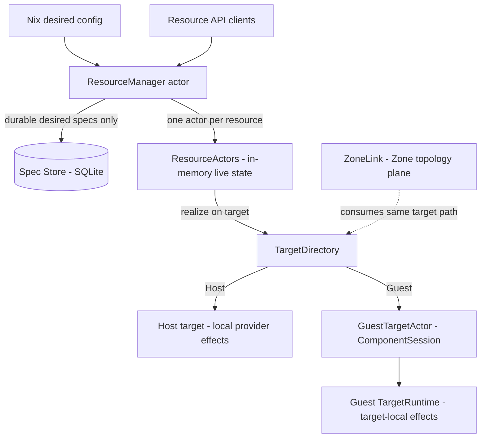
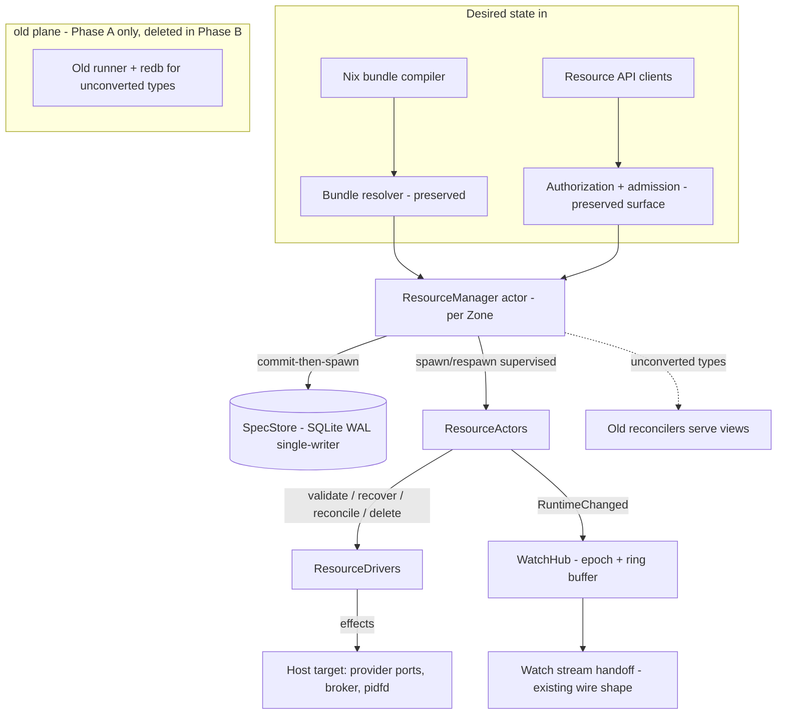
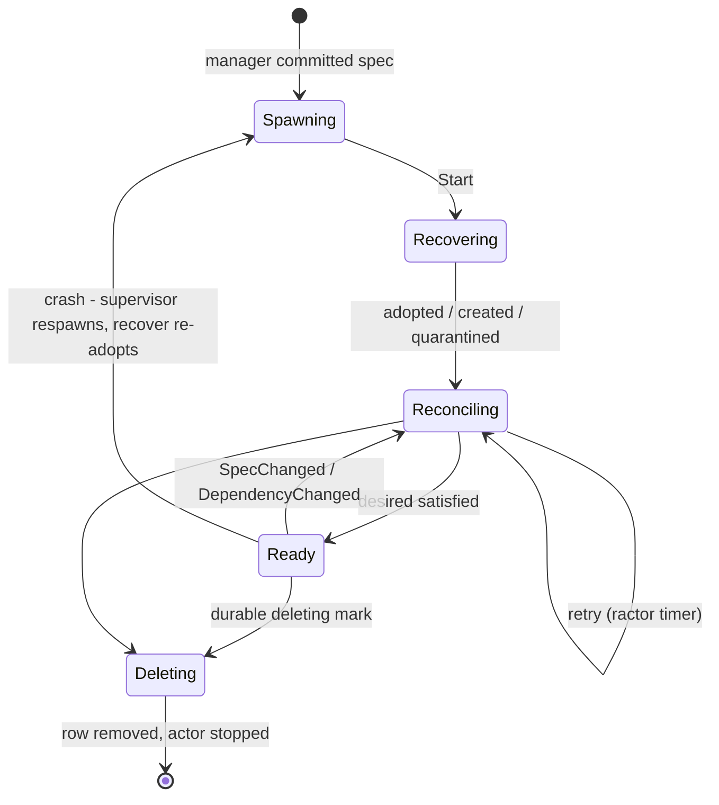
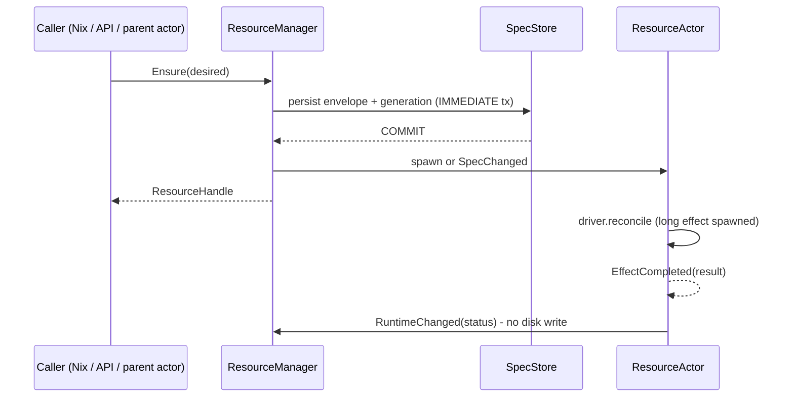
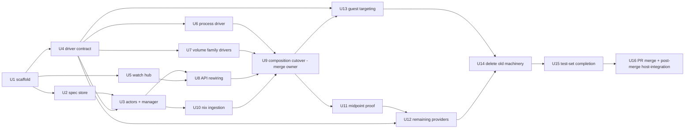

# v3 Resource Runtime Rewrite - Plan

## Goal Capsule

- **Objective:** Produce one plan that implements the v3 resource-runtime rewrite - redb plus store-driven controllers replaced by Ractor resource actors over a minimal SQLite desired-spec store, with explicit Host/Guest execution targets - planned against pulled v3 and shipped through a merged PR.
- **Scope:** The resource plane end to end: new runtime crate, spec store, manager and resource actors, driver conversion for every provider, Resource API rewiring, d2bd-runtime composition, Nix integration, recovery/adoption, and removal of the store/controller machinery. Security and session boundaries are preserved, not redesigned.
- **Product authority:** The handoff specification (see Sources) is the behavioral authority. Its §38 rules and §37 done-checklist govern where this contract is silent. The baseline is pulled `v3` (`d68a63bd0`, which squash-merged the host-integration-gate campaign as PR #497); planning research verified the seams against that exact content.
- **Authority hierarchy:** Product Contract requirements (R-IDs) govern product behavior; Key Technical Decisions govern implementation mechanism; the handoff spec's §38 rules govern where both are silent; ce-work executes per unit and does not amend either.
- **Execution profile:** Deep, cross-workspace, deletion-first rewrite delivered in two phases split at a working-end-to-end midpoint. Phase A builds the runtime plus the Process and virtiofsd-Volume slices and proves them with a host-integration test; one consolidated review to signoff follows; Phase B converts the remaining providers. The tail is a PR against v3, merged, then host-integration re-run on the merged v3. Within a phase the branch may stay broken, but `make check` passes at each phase boundary. Parallel subagents work in fresh, isolated worktrees under one merge owner.
- **Stop conditions:** Stop a unit when an interface contract changes under it, a security boundary weakens, `make check` cannot reach green without deleting surviving behavior, or the midpoint proof cannot run.
- **Tail ownership:** Each unit owns its code, tests, `BUILD.bazel` registration, and `changelog.d` entry. The merge owner owns integration into the two composition hot files and the old-runtime deletion.
- **Open blockers:** None. All brainstorm outstanding questions are resolved into KTDs below; residual items are non-blocking and listed under Open Questions.

---

## Product Contract

Product Contract unchanged by planning; the brainstorm's Outstanding Questions resolved into Key Technical Decisions (see Planning Contract).

### Summary

Desired resource specs become the only durable resource state, held in a small SQLite store; every desired resource gets exactly one authoritative Ractor actor that owns its logical live state, reconciles itself through a `ResourceDriver`, and realizes effects on an explicit Host or Guest target. Runtime status, watches, retries, and queues become in-memory only, and recovery after restart is discovery and adoption from the actual target rather than restoration of persisted status.

### Problem Frame

The current resource plane coordinates controllers through a persistent redb resource database. Reconciliation reads fresh store state, mutates through revision-preconditioned transactions, and publishes status back through the same store; dependency triggers, readiness, retries, and watch delivery all run through that database. The recent 76-commit hardening campaign on this baseline spent nearly all of its effort inside that machinery - fsync coalescing, store-herd staggering, runner respawn, fence adoption, status-churn damping - which is the cost shape of the design itself: correctness depends on persistent coordination state rather than on desired specs plus observed reality. Restart behavior, conflict handling, and watch replay all inherit this burden, and every new provider must learn the controller/checkpoint/revision protocol to participate.

### Key Decisions

- KD1. Implement the handoff specification as written rather than re-deriving architecture - its three-truth model (desired / observed / runtime actors), §38 rules, and §35 step order are adopted wholesale; this contract records the product-level commitments and delegates shapes to the spec. Governs R1-R32.
- KD2. Baseline is pulled `v3` (`d68a63bd0`) - the working branch merged there as PR #497, so the rewrite branch starts from v3 with the host-integration-gate content already in; the rewrite then deletes much of what that campaign hardened. (session-settled: user-directed - supersedes the earlier branch-off-current-HEAD choice: the branch merged to v3, so work continues from v3.)
- KD3. Existing store/runner test suites are not ported; the spec's §36 invariant tests replace them, accepting a coverage dip during the cutover. (session-settled: user-approved - agent proposed, user confirmed.)
- KD4. Crates the spec's delete list does not name (`d2b-core-controller`, `d2b-provider-test-controller`) take their disposition from the spec's §39 deletion heuristic - delete what exists mainly to route controllers through the persistent store - rather than being enumerated here. (session-settled: user-approved - agent proposed, user confirmed.)
- KD5. Midpoint-first delivery: Phase A ends at a working end to end - a Process resource realized on the host and a virtiofsd Volume resource that creates worker child resources - validated by a host-integration test; one consolidated review pass of the full change set to signoff happens there, before Phase B converts the remaining providers. No per-phase review loops. (session-settled: user-directed - chosen over reviewing every phase: minimizes time to a provable midpoint and gives one gap-finding checkpoint.)
- KD6. Heavy subagent parallelism: implementation units run in separate worktrees with a merge owner integrating results; cross-unit contracts are fixed before worktrees fan out so merges stay mechanical. (session-settled: user-directed.)
- KD7. The per-phase gate is `make check` green, even when that requires removing tests for obsolete code that the rewrite will delete; unit tests on new and modified code must stay solid. (session-settled: user-directed.)

### Actors

- A1. Nix resource compilation - materializes top-level desired resources, including execution targets, and applies them.
- A2. External Resource API clients - create, list, watch, and delete resources through authorized API operations.
- A3. `ResourceManager` - single runtime authority for desired specs, actor lifecycle, provider and target lookup, ownership edges, and external watches.
- A4. `ResourceActor` (one per desired resource) - exclusive owner of the resource's logical live state; schedules reconciliation.
- A5. `ResourceDriver` / provider code - resource-specific validate, recover, reconcile, delete behavior; converted from current reconcilers.
- A6. Guest targets - `GuestTargetActor` plus the guest-side target runtime reached over the authenticated ComponentSession.
- A7. Shared provider runtime actors - semaphores and singleton state (process runtime, PipeWire, netlink, GPU ownership) that resource actors call.

### Key Flows

- F1. Desired-resource apply (durability boundary)
  - **Trigger:** A desired resource arrives from Nix, the Resource API, or a parent actor's Ensure.
  - **Steps:** Persist the desired spec and commit; only then spawn or update the resource actor and return a handle. Identical spec is idempotent; changed spec advances the durable generation and notifies the existing actor; a child's row carries its owner so the graph reconstructs after restart.
  - **Covers R1, R6, R7, R8.**
- F2. Restart recovery
  - **Steps:** Load specs, spawn actors, discover real resources on each actor's exact target, adopt matches, create missing, quarantine unexpected per resource policy, then reconcile desired against observed. Deleting resources resume cleanup; nothing restores persisted status because none exists.
  - **Covers R10, R15, R16.**
- F3. Deletion
  - **Steps:** Mark `deleting` durably and commit before cleanup; the actor runs driver delete, the manager removes the spec row, the actor stops. Owned children are removed with the parent unless the type supports orphaning; a crash mid-cleanup resumes deletion after restart.
  - **Covers R9, R10.**
- F4. External watch lifecycle
  - **Steps:** LIST returns current matches plus a snapshot runtime revision; WATCH resumes from that revision through a bounded in-memory ring buffer into live delivery. Cursors from a prior daemon epoch return RevisionExpired and the client relists. Status changes generate watch events but zero persistent writes.
  - **Covers R11, R23, R24.**
- F5. Guest-targeted realization
  - **Steps:** A Host-zone resource whose spec targets a Guest stays in the Host manager and spec store; its actor realizes effects through the guest target actor over the authenticated ComponentSession to the guest target runtime. Guest disconnect marks target-dependent observed state unavailable; reconnect triggers target-local discovery, adoption, and reconcile. No second desired resource ever appears in the guest.
  - **Covers R18, R19, R21.**

### Requirements

**Runtime architecture**

- R1. Every desired resource is represented by exactly one authoritative Ractor actor in its owning Zone, and that actor exclusively owns the resource's logical live state.
- R2. All resource creation and durable desired-state mutation - from Nix, the API, or parent actors - passes through the `ResourceManager`, the only writer to the spec store.
- R3. Provider-specific behavior lives behind a smaller runtime-oriented driver contract (validate, recover, reconcile, delete); the actor owns scheduling, retries, status publication, dependencies, and lifecycle.
- R4. Existing provider effect and adoption code is preserved wherever it remains useful; conversion is mechanical, not a redesign of each provider.
- R5. Long-running external effects never block a resource actor's mailbox; the actor stays responsive to delete, spec change, and dependency change while effects run, and completion returns as a message.

**Desired-state durability**

- R6. Desired specs persist in a minimal durable store recording identity, owner, spec, generation, and deleting state - and nothing else; runtime status, watches, retries, checkpoints, and queues are never persisted.
- R7. Ensure is idempotent: same resource with the same spec returns the current handle, changed spec persists a new generation before the actor updates, absent resource persists before its actor is created.
- R8. Child resources derive deterministic identity and persist ownership so the owned-child graph reconstructs automatically after restart.
- R9. Parent-child reconciliation is declarative: the manager diffs currently owned children against desired children and creates, retains, or marks-obsolete accordingly.
- R10. Deletion is durable desired state: the deleting mark commits before cleanup starts, and a crash before cleanup completes resumes deletion on restart.

**Ephemeral runtime**

- R11. Resource status and observed state exist only in memory and on the actual target; repeated status transitions generate zero persistent writes.
- R12. Internal watches are actor subscriptions, evaluated atomically with status transitions in the target actor's mailbox, so a condition that flips during registration still notifies exactly once; no database participates.
- R13. Retry and requeue state is runtime-only; after a restart the daemon reconciles immediately instead of restoring timers.
- R14. One actor per resource replaces per-resource concurrency control; explicit shared limits for external backends (process launches, VM creation, serialized provider changes) are honored through shared semaphores or shared runtime actors, with no global controller worker queue.

**Recovery and adoption**

- R15. On restart the daemon loads desired specs, spawns actors, and every actor reconstructs observed state by discovery and adoption on its realization target: exact match adopts, missing creates, unexpected quarantines per resource policy.
- R16. Every realized external resource carries durable-enough adoption identity to be discovered after restart, and the process subsystem's existing probe, observe, pidfd, adoption, and quarantine behavior is preserved rather than replaced with persisted status.
- R17. Actor and provider crashes are supervised: replacement actors recover, adopt, and reconcile; provider restarts notify affected resource actors, which re-subscribe and reconcile.

**Zone and target separation**

- R18. A resource's Zone authority and execution target are independent: a Host-zone resource may realize inside a Guest while remaining owned, named, persisted, authorized, and visible in the Host zone, and no duplicate authoritative resource is synthesized in the guest namespace.
- R19. An explicit target layer decides where effects occur and separates Host from Guest realization; guest realization reaches target-local effect code through the authenticated ComponentSession and the guest target runtime.
- R20. `ZoneLink` remains a Zone-topology resource only; the generic Host-to-Guest realization path is the target mechanism, and session naming must not encode zone-link semantics for generic target traffic.
- R21. Target failure and Zone failure are distinct events: guest unavailability marks target-dependent observed state unavailable without deleting or moving desired resources, and reconnect triggers target-local discovery, adoption, and reconciliation.
- R22. Ractor remoting is not part of this rewrite; the target path may later adopt it internally without resource identity or Zone semantics depending on that choice.

**External watches**

- R23. External API watches are served from an in-memory hub over runtime revisions (per-daemon epoch plus sequence) with a bounded ring buffer; LIST returns a snapshot revision and WATCH resumes gap-free within the epoch.
- R24. Cursors from an older epoch are rejected with RevisionExpired, the client relists and re-watches, and nothing about watches or status events is persisted.

**Integration surfaces**

- R25. The Resource API maps its operations onto the manager's RPC surface while preserving existing authorization, admission, and audit semantics.
- R26. Nix materialization feeds top-level desired resources, including their execution targets where the contract supports targeting, directly into the manager; configuration changes add, update, or mark-deleting against Nix-owned stored specs.
- R27. Daemon readiness reflects spec store, manager, API, providers, targets, initial desired load, and required recovery; the redb store-readiness gate is removed.
- R28. Cross-process trust boundaries - authenticated sessions, admission, broker privilege separation, guest session identity binding - are preserved and strengthened where target assignment needs session-generation binding.

**Cutover**

- R29. The redb resource database, the store crates' runtime responsibility, the runner/source/queue trio, the old reconciler trait, the mutation-result protocol, status persistence, and store-driven watches are deleted; exactly one resource execution model remains at the end.
- R30. Providers convert mechanically using the spec's mapping table, with compiler failures as the checklist; no compatibility adapters, shims, or dual-write paths.
- R31. The rewrite lands on a fresh branch from pulled v3 (`d68a63bd0`, containing the merged host-integration-gate work), planned against that tree.
- R32. Existing store and runner test suites are not ported; the spec's required test set - durability boundary, recovery, internal watches, targeting separation, external watches, provider failure, ownership, concurrency - is written around the new invariants instead.

**Delivery strategy**

- R33. Phase A delivers a working end to end through the new runtime: a Process resource realized on the host, and a virtiofsd Volume resource that creates its worker child process through the manager.
- R34. The Phase A midpoint is validated by a host-integration test exercising both the Process slice and the Volume-with-owned-children slice on a real host.
- R35. One consolidated review of the entire change set runs after the midpoint works, and its signoff gates Phase B; review does not run per phase.
- R36. `make check` passes at the end of every phase; tests of code the rewrite will delete may be removed to keep it green, while new and modified code carries solid unit tests.
- R37. Implementation runs as parallel subagents in separate worktrees with a merge owner; each unit's interface contract is fixed before fan-out so merges are mechanical.
- R38. The plan ships by opening a PR with the full change set against v3, merging it, and then running host-integration on the merged v3; the post-merge run is the final validation gate.

### Acceptance Examples

- AE1. Durability boundary
  - **Covers R7.**
  - **Given** `Volume/data` persisted at generation N, **when** Ensure arrives with the identical spec, **then** the same handle returns and generation stays N; **when** Ensure arrives with a changed spec, generation N+1 persists before the actor receives the change; **when** the resource is absent, the row commits before the actor exists.
- AE2. No lost wakeup
  - **Covers R12.**
  - **Given** a dependent actor watches a target whose condition is false, **when** the condition flips while the watch message is still queued, **then** the dependent still receives exactly one satisfied notification, because evaluation and registration serialize in the target actor's mailbox.
- AE3. Restart adoption
  - **Covers R10, R15, R16.**
  - **Given** a live process, VM, and volume on the host, **when** the daemon restarts, **then** each is adopted by a reconstructed actor; missing desired resources are recreated; unexpected resources are quarantined per policy; resources marked deleting resume cleanup.
- AE4. Stale cursor
  - **Covers R24.**
  - **Given** a client watch cursor from the previous daemon epoch, **when** it resumes against the restarted daemon, **then** RevisionExpired returns and the client relists and re-watches from the new snapshot revision.
- AE5. Guest disconnect and reconnect
  - **Covers R18, R21.**
  - **Given** a Host-zone process targeting a connected guest, **when** the guest disconnects, **then** the desired resource stays in the Host zone with observed status marked unavailable; **when** the guest reconnects, target-local discovery, adoption, and reconciliation run; at no point does a duplicate desired resource appear in the guest.
- AE6. Zero-write status churn
  - **Covers R11.**
  - **Given** a resource cycling through repeated status transitions, **when** the transitions are processed, **then** the spec store performs zero persistent writes.
- AE7. Midpoint proof
  - **Covers R33, R34, R36.**
  - **Given** the Phase A branch with the new runtime, **when** the host-integration test runs at the phase boundary, **then** a created Process is realized and adopted across a daemon restart, a virtiofsd Volume realizes and spawns its worker child through the manager, and `make check` is green.

### Scope Boundaries

**Deferred for later**

- Ractor cluster/remoting for Host-to-Guest execution - behind the target path, not in this rewrite.
- Deriving generation as a hash of the canonical desired spec - possible future simplification, not required now.
- Replacing target-path internals with remote actors - allowed later, identity and Zone semantics must not depend on it.

**Outside this plan's identity**

- The provider-workspace simplification campaign (`docs/plans/2026-08-25-002-refactor-provider-workspace-simplification-plan.md`) - separate, already planned; overlaps this rewrite's crates.
- Preserving redb, the controller runtime, or any store-coordination machinery in any form.
- Event sourcing or Kubernetes-style runtime revisions for runtime state.

#### Deferred to Follow-Up Work

- Watch-hub slow-subscriber eviction tuning beyond the bounded-ring-buffer minimum; CreditPool backpressure parity is a Phase B polish item.
- Copying the handoff specification into the repo for self-containment (source stays in `~/Downloads` for now).

### Dependencies / Assumptions

- New workspace dependencies `ractor` (0.16) and `rusqlite` (0.40, `bundled`) are added as part of the work; neither is present today (verified).
- Assumption: no redb data migration. The spec defines a clean cutover with no dual-write and no migration path; durable desired state is re-applied by Nix and API clients after cutover, and live state is recovered by adoption from targets. If existing redb contents must survive the cutover, that is a product decision this plan has not settled.
- Assumption: the handoff spec's suggested type names, message enums, and schema are guidance for planning, not pinned contracts; the §38 rules and the invariant list in this contract are the pinned part.

### Outstanding Questions

Resolved during planning - see Key Technical Decisions KTD2 (spec envelope), KTD4 (Phase A type partition), KTD5 (manager topology), KTD6 (authorization source), KTD7 (launch/adoption ticket inputs), KTD8 (wire and watch compatibility), KTD10 (midpoint test strategy). Remaining non-blocking items live under Planning Contract > Open Questions.

<!-- ce-section: work-relationships -->
### How This Work Fits Together

This plan owns the resource-runtime rewrite end to end. The broader campaign around it is the current understanding, not a committed roadmap:

- The provider-workspace simplification plan (`docs/plans/2026-08-25-002-refactor-provider-workspace-simplification-plan.md`) targets provider crates this rewrite deletes, converts, or leaves alone.
  - Shares territory with R29 and R4 - tentative relationship, resolved at the consolidated review.
- The generic-resource-reconciler refactor (`docs/plans/2026-08-31-001-refactor-generic-resource-reconciler-plan.md`) reshapes the reconciler layer this rewrite replaces with drivers.
  - Depends on nothing from this plan; expected to be superseded in the areas this rewrite deletes.
- Zone-only control-plane clean break (`docs/plans/2026-08-25-001-refactor-zone-only-control-plane-clean-break-plan.md`) already removed parts of the older store surface.
  - Can proceed independently of this plan where it touches surviving contracts.

### Sources / Research

- Handoff specification (outside the repo): `~/Downloads/d2b-v3-ractor-resource-runtime-rewrite(1).md` - 2171 lines, 40 sections; §38 rules, §36 tests, §37 done-checklist are the normative core. Consider copying it into the repo or plans directory so the plan is self-contained on other machines.
- Claim verification against the current tree (2026-09-09), corrections included:
  - `ResourceReconciler` lives at `packages/d2b-controller-toolkit/src/runner.rs:442` with ~7 production implementors across `d2b-core-controller` and `d2bd` (`process_resource_runtime.rs`, `resource_runtime.rs`, `activation_resource_runtime.rs`, `semantic_binding_resource_runtime.rs`, `credential_resource_runtime.rs`, `volume_provider_runtime.rs`).
  - `Runner`/`ControllerSource`/`PendingQueue` all live in `packages/d2b-controller-toolkit/src` (`runner.rs:770`, `runner.rs:267`, `queue.rs:219`).
  - `ResourceStoreBackend`, `RedbBackend`, `CheckedResourceStore` are defined in `packages/d2b-resource-api/src/store.rs` - not in the store crates the spec's framing implies; the store crates hold `RedbResourceStore`, the revision log, and the watch actor.
  - ZoneLink is not a type in `d2b-contracts-resource`; its wiring lives in `packages/d2b-core-controller/src/zone_links.rs` with `EndpointPurpose::ZoneLink` in `d2b-contracts-zone-session`, and the generic guest session purpose is the literal `"zone-link"` in `packages/d2bd-runtime/src/guest_mode.rs:48` - the rename target the spec calls out.
  - Store-readiness gate: `ZoneRuntimeReadiness { store_ready, ... }` in `packages/d2bd-runtime/src/resource_runtime_support.rs:282`; redb-specific composition in `packages/d2bd/src/composition.rs:20`.
  - Process adoption/pidfd behavior to preserve: `packages/d2b-process-conformance/src` (identity, adoption, quarantine) and `packages/d2b-process/src/backend.rs:283`.
  - Nix compilation surface: `packages/d2b-resource-compiler` plus generated zone/ZoneLink options modules.
- Integration-seam research (planning pass, 2026-09-09):
  - Backend seam: `packages/d2b-resource-api/src/store.rs:26` `trait ResourceStoreBackend`; mutations arrive as sealed, admission-verified mutations - the seal contract is cut consciously (KTD2), not silently.
  - Watch wire: `WatchFrame`/`ZoneRevision`/`WatchOwnerHint` in `packages/d2b-resource-api/src/watch.rs:27,60`; handoff returns stream name plus snapshot revision at `service.rs:689-701` - the WatchHub maps onto this wire, not beside it.
  - Launch tickets: lifecycle scope and operation uid derive from zone_uid, policy_revision, provider_assignment_generation (`packages/d2bd/src/process_provider_runtime.rs:3536-3557`); worker launch resolves signed templates from the Nix bundle, not the spec (`process_provider_runtime.rs:3469-3487`).
  - Volume child chain: Volume derives VolumeBinding children per attachment (`packages/d2bd/src/resource_runtime/volume_provider_runtime.rs:785-845`); binding derives worker Process + Endpoint (`:704-726`); teardown is endpoint-first, process-last (`packages/d2bd/src/resource_runtime/binding_child_resource_runtime.rs:396-397`); tuning travels in the path-free worker plan (`packages/d2b-provider-volume-virtiofs/src/worker.rs:23-45`).
  - Authorization facts: bootstrap phase and policy revision come from redb read snapshots today (`packages/d2b-resource-api/src/authz.rs:243-245,294-301`; `admission.rs:92-141`) - the data source must be rebuilt (KTD6).
  - Precondition surface: Exact-revision updates at `packages/d2b-resource-api/src/service.rs:1113-1114`; `ExpectedRevision::CreateAbsent` at `packages/d2b-resource-api/src/registered.rs:533-560`.
  - Recovery precedent: Adopt/Quarantine/Missing classification via `/proc/<pid>` starttime snapshots in `packages/d2bd-runtime/src/supervisor/state.rs` - direct model for driver recover.
  - 32k-line hot files: `packages/d2bd/src/resource_runtime.rs` (~32k lines) and `packages/d2bd/src/composition.rs` (~32k lines) are the delete/rewire hotspots; all edits there are serialized to the merge owner (KTD9).
- Framework research (external, 2026-09): ractor 0.16.5 (MSRV 1.85, tokio 1.x; supervision via `spawn_linked` + `handle_supervisor_evt`; `RpcReplyPort` for RPC; long effects must not block the mailbox - spawn and send typed completion messages; `ractor::time::send_after` for requeue timers) - https://docs.rs/ractor and https://github.com/slawlor/ractor. rusqlite 0.40.2 with `bundled` SQLite 3.53.2; `Connection` is Send but not Sync - single-writer behind one owned task, WAL + `busy_timeout`, IMMEDIATE transactions, `synchronous=NORMAL`, `tokio::task::spawn_blocking` for all SQLite calls - https://docs.rs/rusqlite.
- Adjacent plans: `docs/plans/2026-08-31-001-refactor-generic-resource-reconciler-plan.md`, `docs/plans/2026-08-25-002-refactor-provider-workspace-simplification-plan.md`, `docs/plans/2026-08-25-001-refactor-zone-only-control-plane-clean-break-plan.md`.
- Baseline facts: baseline branch is pulled `v3` at `d68a63bd0` (host-integration-gate merged as squash PR #497; content identical to the researched branch tip plus one changelog fragment); `make check` is the Bazel Layer-1 gate (`Makefile:103`); host-integration tests are auto-discovered Nix VM checks from `tests/host-integration/*.nix` (`flake.nix:583-597`, `Makefile:149-200`); seam citations gathered at the branch tip are valid for this tree.

---

## Planning Contract

### Key Technical Decisions

- KTD1. New runtime crate `packages/d2b-resource-runtime` with `ractor = "0.16"` and `rusqlite = { version = "0.40", features = ["bundled"] }` as workspace dependencies, each added with the house rationale comment and the cargo-deny/advisory whitelist updated in the same commit that first consumes them. The crate registers in the Bazel graph at creation (own `BUILD.bazel` with an `all-tests` suite plus a `rust-main-packages` entry in `bazel/checks/BUILD.bazel`). Governs R1-R6, R31; covers KD7 gate mechanics.
- KTD2. Spec store: SQLite via rusqlite, one single-writer connection owned by a dedicated store task (never shared across actors), WAL mode, `busy_timeout`, IMMEDIATE transactions, `synchronous=NORMAL`. The persisted row is the full resource envelope minus status - metadata (finalizers, annotations, owner reference, creation timestamp), spec, generation, `deleting`, and a provenance field (`Nix` | `Api` | owned-by-resource key). All SQLite calls run through `tokio::task::spawn_blocking`. The manager commits before spawning. The redb `SealedMutation` admission-seal contract is cut consciously: admission happens in the API layer before the manager call, not as a store precondition. Governs R2, R6-R8, R10; resolves the brainstorm's spec-envelope question.
- KTD3. Driver contract: `ResourceDriver` with `validate` / `recover` / `reconcile` / `delete` over a `ResourceContext` exposing `ensure`, `get`, `delete`, `watch`, `set_status`, `requeue_after`, `children`; drivers are produced by `ResourceDriverFactory` per resource type through a `ProviderDirectory`. Actors schedule and retry; long effects spawn and return typed completion messages; requeue uses ractor timers. Governs R3-R5, R12-R13; cites spec §11-14.
- KTD4. Phase A type partition: the new runtime owns Process, Volume, VolumeBinding, and Endpoint end to end. All other resource types persist as spec rows in the new store and serve bundle-derived views, but keep their old-runtime reconcilers until Phase B. One execution model per resource type, not per deployment - the spec's single-model invariant holds at the end state (R29), not at the midpoint. Resolves the coexistence question.
- KTD5. Manager topology: one `ResourceManager` per Zone, composed under the existing per-Zone `open_resource_plane` path, mirroring zone-scoped audit and authority identity. The spec's single-manager sketch is read as per-zone authority. Governs R1, R2; resolves the manager-topology question.
- KTD6. Authorization rebuild: `PolicySet`, role bindings, and admission facts compile from persisted Role/RoleBinding/User/Provider spec rows in the new store (and the Nix bundle at seed time), replacing the redb-snapshot source; bootstrap phase derives from durable spec facts. Zone policy revision derives from bundle generation plus durable row state. Governs R25, R28.
- KTD7. Launch and adoption ticket inputs: zone_uid, policy_revision, and provider assignment generation derive from the preserved bundle resolver and `ZoneAuthorityIdentity` path, not from the spec store. Each driver's recover derives its `AdoptionIdentity` (zone, type, name, uid, generation) plus target-local evidence (pidfd, `/proc` starttime, socket path); the Process driver re-derives launch intent from the signed bundle exactly as today. Governs R15-R16; resolves the ticket-input question.
- KTD8. Wire compatibility: `ResourceService` public operations and wire envelopes stay; mutation preconditions map resource generation onto the existing Exact-revision semantics, serialized by the single-writer manager; external WATCH delivers over the existing watch stream handoff with the runtime revision (epoch + sequence) mapped onto the wire revision and RevisionExpired for stale epochs. Minimal external WATCH ships in Phase A (the CLI client depends on it); the midpoint test proves LIST only. Governs R23-R25.
- KTD9. Parallel execution model: each implementation unit runs in a fresh named worktree (never the stale `worktrees/d2b-*` checkouts); every unit's contract includes a `changelog.d` entry and its own `BUILD.bazel` registration. All edits to `packages/d2bd/src/resource_runtime.rs` and `packages/d2bd/src/composition.rs` are reserved for the merge owner - subagents never touch those two files, which removes the catastrophic-merge risk. Governs R37.
- KTD10. Midpoint proof reuses the existing operator-activation VM fixture adapted to the new runtime plus one new virtiofsd Volume VM check. Per-assertion dispositions for the old fixture: process PID continuity across restart is preserved; observedGeneration semantics are re-derived in the manager view model; the old runner-journal assertion is dropped with its runner. Resolves the test-strategy question; covers KD5.
- KTD11. Phase boundary deletion timing: old store crates and runner machinery stay wired for unconverted types during Phase A (KTD4) and are deleted in Phase B; obsolete store/runner tests are deleted at the Phase A `make check` boundary when their fixtures stop compiling. `d2b-core-controller` and `d2b-provider-test-controller` dispositions settle at the start of Phase B per KD4. Governs R29-R30, R32, R36.
- KTD12. Ractor/rusqlite interaction rules for all actors: SQLite calls only via `spawn_blocking` or inside the store task; resource actors never hold a SQLite connection; shared limits (process launches, VM creation) stay as shared semaphores or shared runtime actors per spec §31. Governs R5, R14.

### High-Level Technical Design

Component topology per Zone (Phase A state - both planes live; Phase B removes the shaded one):

Resource-actor lifecycle and the durability boundary:

Phase fan-out (units and their dependency waves; U-IDs as in Implementation Units):

### Implementation Constraints

- Every new crate and dependency passes the supply-chain gate in the commit that introduces it (KTD1); `Cargo.lock` and `deny.toml` travel with the consuming commit.
- Subagents never edit `packages/d2bd/src/resource_runtime.rs` or `packages/d2bd/src/composition.rs`; the merge owner owns all changes there (KTD9).
- Each unit keeps its own `changelog.d` entry and `BUILD.bazel` registration; a unit is not done with `make check` failing in its area.
- Worktrees are fresh named checkouts under `worktrees/` with new names; stale `d2b-*` checkouts are not reused.

### Sequencing

Phase A order: U1 scaffold, then wave one (U2, U4, U5 in parallel worktrees), wave two (U3, U6, U7, U8, U10 in parallel after their dependencies), U9 integration by the merge owner, U11 midpoint proof, then the consolidated review to signoff. Phase B order: U12 and U13 in parallel after signoff, then U14 deletion, then U15 final test sweep, then U16 ships: PR opened and merged to v3, then host-integration re-run on the merged v3.

### Open Questions

- Deferred to implementation: ring-buffer sizing and slow-subscriber eviction policy (bounded minimum required; eviction-vs-backpressure decision lands with the WatchHub unit).
- Deferred to implementation: SQLite file placement, per-zone database file layout, and the SQLite-side binding of `ZoneAuthorityIdentity` (store identity story) - flagged for the consolidated review; affects R28.
- Deferred to implementation: exact `d2b-core-controller` DTO migration list under the KD4 heuristic, settled when U12/U14 start and the conversion units consume the types.

---

## Implementation Units

Unit index:

| U-ID | Title | Key paths | Depends on |
|---|---|---|---|
| U1 | Runtime crate scaffold and supply-chain gate | `packages/d2b-resource-runtime`, root manifests, Bazel graph | - |
| U2 | SQLite spec store | `packages/d2b-resource-runtime/src/spec_store*` | U1 |
| U3 | Resource actors and manager core | `packages/d2b-resource-runtime/src/manager.rs`, `resource.rs` | U2, U4 |
| U4 | Driver contract and context | `packages/d2b-resource-runtime/src/driver.rs`, `context.rs`, `provider.rs` | U1 |
| U5 | Watch hub and runtime revisions | `packages/d2b-resource-runtime/src/watch.rs` | U1 |
| U6 | Process driver conversion | `packages/d2bd/src/process_driver.rs` | U4 |
| U7 | Volume, VolumeBinding, Endpoint driver conversion | `packages/d2bd/src/volume_driver.rs` and siblings | U4 |
| U8 | Resource API rewiring and authorization rebuild | `packages/d2b-resource-api/src` | U2, U3, U5 |
| U9 | Composition cutover (merge owner) | `packages/d2bd/src/resource_runtime.rs`, `composition.rs`, `packages/d2bd-runtime/src` | U6, U7, U8, U10 |
| U10 | Nix ingestion into the manager | `packages/d2bd/src/resource_runtime.rs` (owner-only) | U3 |
| U11 | Phase A midpoint host-integration proof | `tests/host-integration/*.nix` | U9 |
| U12 | Remaining provider conversions | `packages/d2bd/src/*_driver.rs`, `packages/d2b-core-controller` | U4, U11 signoff |
| U13 | Guest targeting and session rename | `packages/d2b-resource-runtime/src/target.rs`, `guest_target.rs`, `packages/d2bd-runtime/src` | U4, U9 |
| U14 | Delete old store and controller machinery | store crates, `d2b-controller-toolkit`, workspace manifests | U12 |
| U15 | Invariant test completion | new runtime tests, host fixtures | U14 |
| U16 | PR merge and post-merge host-integration | git/`gh` PR against v3, `make test-host-integration` | U15 |

### U1. Runtime crate scaffold and supply-chain gate

- **Goal:** `packages/d2b-resource-runtime` exists, builds under Cargo and Bazel, and carries `ractor` + `rusqlite` as workspace dependencies.
- **Requirements:** R1, R6; covers KD7 gate mechanics.
- **Dependencies:** none.
- **Files:** `Cargo.toml` (workspace members + `workspace.dependencies` entries with rationale comments), `packages/d2b-resource-runtime/Cargo.toml`, `packages/d2b-resource-runtime/src/lib.rs` (module skeleton), `packages/d2b-resource-runtime/BUILD.bazel` (rust_library, rust_test, `all-tests` suite), `bazel/checks/BUILD.bazel` (`rust-main-packages` entry), `deny.toml` whitelist additions, `changelog.d/` entries.
- **Approach:** Pin `ractor = "0.16"` (default features; no cluster) and `rusqlite = { version = "0.40", features = ["bundled"] }`. Verify Bazel can build the bundled SQLite C sources (build file generation for `libsqlite3-sys`) in this unit, not later.
- **Patterns to follow:** workspace dependency comments at `Cargo.toml:119-131`; per-crate `all-tests` pattern from `packages/d2b-controller-toolkit/BUILD.bazel:130`.
- **Test scenarios:**
  - `make check` compiles the new crate and runs its (empty-plus-smoke) tests through the Bazel gate.
  - `cargo deny check` passes with the two new crates admitted.
- **Verification:** `make check` green; `cargo build -p d2b-resource-runtime` green.

### U2. SQLite spec store

- **Goal:** Durable desired-state store persisting envelope-minus-status rows with provenance and deleting state; commit-before-return durability boundary.
- **Requirements:** R2, R6, R7, R8, R10.
- **Dependencies:** U1.
- **Files:** `packages/d2b-resource-runtime/src/spec_store.rs`, `packages/d2b-resource-runtime/src/schema.rs`, inline `#[cfg(test)]` modules.
- **Approach:** One writer task owning the `rusqlite::Connection` (Send, not Sync); all other access via messages. WAL + `busy_timeout`; IMMEDIATE transactions; `synchronous=NORMAL`. Row carries zone, type, name, uid, generation, owner uid, provenance, deleting, spec envelope minus status. Embedded migrations via `rusqlite_migration`. All calls from async context go through `spawn_blocking` (KTD12).
- **Patterns to follow:** single-writer/read-pool actor shape in `packages/d2b-resource-store-redb/src/lib.rs:1162`; crate-local unit test style from `packages/d2b-resource-store-redb/src/actor.rs`.
- **Test scenarios:**
  - Persist-then-reopen: rows survive a full close/reopen; schema migrations apply idempotently.
  - Durability boundary: Ensure commits and returns before any spawn callback fires (order enforced by API shape and asserted in test).
  - Idempotent Ensure at equal spec keeps generation; changed spec advances generation exactly once.
  - Deleting mark commits and survives simulated process crash (reopen without cleanup).
  - Status-shaped writes are rejected by the API surface (zero persistent status writes; AE6 at unit scale).
  - Concurrent writers serialize via `busy_timeout` without SQLITE_BUSY surfacing.
- **Verification:** `cargo test -p d2b-resource-runtime`; `make check` green.

### U3. Resource actors and manager core

- **Goal:** One authoritative Ractor actor per desired resource plus the per-Zone manager that owns specs, identity, actor lifecycle, ownership edges, and the runtime index.
- **Requirements:** R1, R2, R7-R9, R14, R17.
- **Dependencies:** U2, U4.
- **Files:** `packages/d2b-resource-runtime/src/manager.rs`, `resource.rs`, `identity.rs`, `error.rs`, inline unit tests.
- **Approach:** `ResourceManagerMsg` per spec §4 (Apply/Ensure/Remove/Get/List/Watch/RuntimeChanged/ActorStarted/ActorStopped/DependencyChanged). `Ensure` idempotence per R7. Owned-child diff per R9 with owner persisted on child rows. Supervisor: manager spawns actors linked (`spawn_linked`), respawns on failure with recover/adopt, and holds the ephemeral dependency graph for resubscription (spec §16, §33).
- **Patterns to follow:** supervision semantics from ractor 0.16 (`handle_supervisor_evt`); per-zone construction mirrors `open_resource_plane` zone iteration (`packages/d2bd/src/composition.rs:15592-15715`) - wiring itself lands in U9.
- **Test scenarios:**
  - One actor per resource: duplicate Ensure returns the same handle, never two actors.
  - Ensure commits before spawn: a poisoned spawn still leaves the spec row present (restart recovers it).
  - Actor crash triggers supervisor respawn, recover runs, dependents receive a changed notification and resubscribe.
  - Declarative owned-children diff creates missing, retains matching, marks obsolete children deleting.
  - Same-resource reconcile never overlaps; distinct resources reconcile concurrently.
- **Verification:** `cargo test -p d2b-resource-runtime`; `make check` green.

### U4. Driver contract and resource context

- **Goal:** The `ResourceDriver`/`ResourceDriverFactory`/`ResourceContext` contract every provider converts onto, plus the provider directory.
- **Requirements:** R3-R5, R12, R14.
- **Dependencies:** U1.
- **Files:** `packages/d2b-resource-runtime/src/driver.rs`, `context.rs`, `provider.rs`, inline unit tests.
- **Approach:** Trait shape per KTD3 and spec §11-12. Context methods route child mutations through the manager (never the store). Long effects: driver spawns work and the actor receives a typed completion message; mailbox stays responsive (KTD12). Internal watch registration evaluated atomically with status transitions in the target actor's mailbox (R12; spec §15).
- **Patterns to follow:** closed `HandlerFailure{Retryable,Terminal}` redaction classes from `packages/d2b-controller-toolkit/src/runner.rs:400-437`.
- **Test scenarios:**
  - Watch registered when condition already true notifies immediately; condition flipping while registration is in flight still notifies exactly once (AE2 at unit scale).
  - Requeue-after schedules exactly one reconcile after the delay; a concurrent delete cancels it.
  - A driver blocking past a threshold cannot starve Delete delivery (effect runs spawned).
  - Context child-ensure persists before child actor creation (contract tested with a fake driver).
- **Verification:** `cargo test -p d2b-resource-runtime`; `make check` green.

### U5. Watch hub and runtime revisions

- **Goal:** In-memory external watch service over epoch+sequence runtime revisions with a bounded ring buffer, behind the existing watch stream handoff.
- **Requirements:** R11, R23, R24.
- **Dependencies:** U1.
- **Files:** `packages/d2b-resource-runtime/src/watch.rs`, `packages/d2b-resource-runtime/src/revision.rs`, inline unit tests; wire mapping lands with U8.
- **Approach:** Every desired or runtime change bumps the revision and appends to the ring; LIST returns matches plus snapshot revision; WATCH replays newer events then goes live; pre-epoch cursors return RevisionExpired. Map onto `WatchFrame`/`ZoneRevision` wire shapes (`packages/d2b-resource-api/src/watch.rs:27,60`) preserving owner-hint semantics for relist.
- **Test scenarios:**
  - LIST then WATCH(after=snapshot) receives every later matching event with no gap.
  - Ring replay works within one epoch; a cursor from a previous epoch yields RevisionExpired, and relist-then-watch recovers.
  - Slow subscriber is bounded (ring eviction, no unbounded growth).
  - Status churn produces revisions and events but zero store writes.
- **Verification:** `cargo test -p d2b-resource-runtime`.

### U6. Process driver conversion

- **Goal:** The Process resource runs on a `ResourceDriver`: recover by probe/adopt, reconcile via the preserved provider-ticket launch path, delete cleanly - old controller code for Process retired from active use.
- **Requirements:** R3, R4, R15, R16.
- **Dependencies:** U4.
- **Files:** `packages/d2bd/src/process_driver.rs` (new), deletion of `packages/d2bd/src/process_resource_runtime.rs` reconciler paths happens in U14; this unit adds the driver alongside.
- **Approach:** Mechanical conversion per spec §13 mapping. `recover` = probe + pidfd adopt (preserving `packages/d2b-process` backend behavior and `packages/d2bd-runtime/src/supervisor` classification), `reconcile` = launch through the signed provider-ticket path with ticket inputs from the bundle resolver and zone authority (KTD7), `delete` = term-then-kill with pidfd retry. Restart budget becomes runtime-only per spec §32.
- **Patterns to follow:** adopt/quarantine classification from `packages/d2bd-runtime/src/supervisor/state.rs`; adoption identity from `packages/d2bd/src/process_resource_runtime.rs:2616-2629`.
- **Test scenarios:**
  - Launch creates the process and status reaches Ready with the expected cgroup/unit effect.
  - Restart with a live process adopts without restart (identity evidence matches; AE3 slice).
  - Ambiguous or drifted process quarantines per policy instead of adopting.
  - Delete stops the process and removes the row; crash mid-delete resumes cleanup after restart.
  - Reconcile failure requeues with backoff via actor timer, no persisted retry state.
- **Verification:** `cargo test -p d2bd` for the driver module; driver covered by U11's host test.

### U7. Volume family driver conversion

- **Goal:** Volume, VolumeBinding, and Endpoint drivers with declarative owned-child reconciliation, preserving the signed worker-template model and endpoint-first teardown.
- **Requirements:** R4, R8, R9, R33.
- **Dependencies:** U4.
- **Files:** `packages/d2bd/src/volume_driver.rs`, `packages/d2bd/src/binding_driver.rs`, `packages/d2bd/src/endpoint_driver.rs`; provider effect crates unchanged.
- **Approach:** Volume actor derives binding children per attachment; binding actor derives worker Process + Endpoint children; all child creation goes through manager Ensure with spec committed first (F1). Worker plan and argv re-derive from the persisted binding plus bundle-resolved template on recover (KTD7); tuning stays in the plan, never in the resource. Teardown ordering: endpoint first, process last, with the drain finalizer preserved.
- **Patterns to follow:** child derivation from `packages/d2bd/src/resource_runtime/volume_provider_runtime.rs:704-845`; template contract from `packages/d2b-provider-volume-virtiofs/src/worker.rs:23-45` and ADR 0021 sandbox posture.
- **Test scenarios:**
  - Volume ensure creates binding, worker, endpoint as owned children, each persisted before its actor exists.
  - Parent spec change retires obsolete children and retains matching ones.
  - Worker recover re-derives the launch plan matching the pre-restart incarnation (same template, socket path).
  - Deletion removes endpoint before worker; crash mid-teardown resumes in correct order.
  - Child cannot silently change owner.
- **Verification:** `cargo test -p d2bd`; covered by U11's host test.

### U8. Resource API rewiring and authorization rebuild

- **Goal:** The Resource API serves from the manager and the new authorization facts while keeping its public operation surface, admission, and audit semantics.
- **Requirements:** R25, R23, R24, R28.
- **Dependencies:** U2, U3, U5.
- **Files:** `packages/d2b-resource-api/src/service.rs`, `store.rs`, `watch.rs`, `authz.rs`, `admission.rs`; minimal targeted edits only - this is a rewiring unit, not a redesign.
- **Approach:** Map API operations onto manager RPC (KTD8). Compile `PolicySet` from persisted Role/RoleBinding/User/Provider rows (KTD6); bootstrap phase derives from durable facts. Revision preconditions map generation onto existing Exact-revision wire semantics through the single-writer manager. External WATCH rides the existing stream handoff with epoch+sequence revisions (KTD8).
- **Test scenarios:**
  - Create/read/update/delete through the API persist and read back through the manager.
  - Authorization allow and deny cases from the existing fixture matrix still pass.
  - Exact-revision precondition rejects a stale-generation update with the existing wire error.
  - LIST returns snapshot revision; WATCH resumes from it (unit-scale F4).
  - No status write path exists from API status updates (grep-level invariant test).
- **Verification:** `cargo test -p d2b-resource-api`; `make check` green.

### U9. Composition cutover (merge owner)

- **Goal:** Wire the new runtime into the daemon for the Phase A type set; old runtime keeps serving unconverted types; readiness follows the new reality.
- **Requirements:** R27, R31; covers KD4 partition.
- **Dependencies:** U6, U7, U8, U10.
- **Files:** `packages/d2bd/src/resource_runtime.rs`, `packages/d2bd/src/composition.rs`, `packages/d2bd-runtime/src/resource_runtime_support.rs`. Merge-owner exclusive (KTD9).
- **Approach:** Per-zone manager construction under `open_resource_plane`; type partition routing (KTD4); readiness fields reflect spec store, manager, API, providers, targets, initial load, recovery - drop `store_ready` for the new plane while the old plane still reports its own. Broker-evidence and audit bindings stay attached to the zone runtime.
- **Test scenarios:**
  - Daemon starts in host mode with the partition active; converted types route to the new runtime, unconverted to the old.
  - Readiness gate opens only when the new checklist items complete; no `store_ready` requirement remains for the new plane.
  - Guest mode still boots (old paths intact in Phase A).
- **Verification:** `make check`; daemon smoke path exercised in U11.

### U10. Nix ingestion into the manager

- **Goal:** The Nix bundle flows into the manager as desired specs with provenance and targets; configuration changes add, update, or mark-deleting.
- **Requirements:** R26.
- **Dependencies:** U3.
- **Files:** bundle-ingest path in `packages/d2bd/src/resource_runtime.rs` (merge-owner coordinated with U9), `packages/d2b-resource-compiler` unchanged as the envelope contract.
- **Approach:** Bundle resolver output feeds manager Apply; provenance `Nix` stamped; API-created rows are not clobbered by Nix applies (provenance respected); execution targets pass through where the contract supports them.
- **Test scenarios:**
  - Bundle apply persists all bundle resources with provenance Nix before any actor spawn.
  - Changed bundle advances generations and marks removed Nix resources deleting; API-created resources survive untouched.
  - Envelope validation failures reject the whole bundle atomically.
- **Verification:** `cargo test -p d2bd`; covered end to end by U11.

### U11. Phase A midpoint host-integration proof

- **Goal:** The midpoint proof: adapted operator-activation fixture plus a new virtiofsd Volume VM check proving Process and Volume-with-owned-children end to end.
- **Requirements:** R33, R34, R36; covers AE7.
- **Dependencies:** U9.
- **Files:** `tests/host-integration/resource-operator-activation.nix` (adapt), `tests/host-integration/virtiofsd-volume-runtime.nix` (new).
- **Approach:** Adapt per KTD10 assertion dispositions: keep PID-continuity across restart; re-derive observedGeneration checks in the manager view; drop the old runner-journal assertion. New fixture: volume apply creates binding + worker + endpoint children through the manager, worker process realized, socket present, volume Ready; volume delete tears down endpoint-first. The midpoint gate is `make check` plus `make test-host-integration` with confirmation the VM checks actually ran (KVM present; x86_64-only lane).
- **Test scenarios:**
  - Process created via Nix: realized, Ready, adopted with unchanged PID across `systemctl restart d2bd`.
  - Process created via API: same lifecycle; idempotent re-create returns current state.
  - Volume with worker children: chain realized through the manager; deletion removes children with the parent.
  - LIST returns the expected resource set with a snapshot revision; authz allow/deny matrix still holds.
  - `make check` and `make test-host-integration` both green at the boundary.
- **Verification:** both gates green; this is the R35 signoff input.

### U12. Remaining provider conversions (Phase B)

- **Goal:** Convert every remaining `impl ResourceReconciler` to `ResourceDriver` per the spec §13 mapping, using compiler failures as the checklist.
- **Requirements:** R3, R4, R30.
- **Dependencies:** U4; gated on R35 signoff.
- **Files:** driver modules in `packages/d2bd/src` for activation, system-core, shared-provider family (network, device, credential, transport), semantic-binding/telemetry, cloud-hypervisor guest lifecycle, plus `packages/d2b-core-controller` consolidation per KD4.
- **Approach:** Mechanical conversion; preserve provider effect ports, audit, and adoption behavior; guest-realizing providers keep target-local effect behavior behind the target layer (spec §35 step 7). Multiple subagents in parallel worktrees, one provider family each; merge owner integrates.
- **Test scenarios:** per provider: validate rejects malformed spec; recover adopts a pre-existing realization; reconcile converges from absent and from drifted; delete cleans up. Each driver keeps its provider's existing conformance suite green where one exists (`packages/d2b-process-conformance` pattern).
- **Verification:** `make check` green; zero remaining `ResourceReconciler` implementors outside the delete list.

### U13. Guest targeting through the target layer

- **Goal:** Explicit Host/Guest target directory; Host-zone resources realize in Guests through the ComponentSession target-control path; session naming stops encoding zone-link semantics for generic traffic.
- **Requirements:** R18-R22, R28.
- **Dependencies:** U4; composition hooks from U9.
- **Files:** `packages/d2b-resource-runtime/src/target.rs`, `guest_target.rs`; `packages/d2bd-runtime/src/guest_mode.rs` (session purpose rename), `target_runtime.rs` bindings.
- **Approach:** `TargetDirectory` resolves Host vs Guest handles; guest realization crosses the authenticated ComponentSession to the guest target runtime; disconnect marks observed state unavailable and reconnect re-adopts (F5). Rename the generic guest session purpose constant away from the literal `zone-link`; keep the actual ZoneLink resource semantics untouched. Bind target assignment to guest session generation.
- **Test scenarios:**
  - Host-zone resource targeting a Host realizes locally (existing behavior, now through the directory).
  - Host-zone resource targeting a Guest realizes via the guest path with no duplicate resource in the guest namespace.
  - Guest disconnect leaves desired resources intact with observed state unavailable; reconnect triggers adoption.
  - ZoneLink deletion does not delete unrelated resources targeting the same guest.
  - Stale session generation cannot inherit realization authority.
- **Verification:** `make check`; unit tests for directory routing and session binding.

### U14. Delete the old machinery

- **Goal:** One execution model: remove redb stores, runner/source/queue, old reconciler trait, mutation protocol, status persistence, store watches.
- **Requirements:** R29, R30; covers KD3, KD4.
- **Dependencies:** U12 complete.
- **Files:** delete `packages/d2b-resource-store`, `packages/d2b-resource-store-redb`; delete Runner/ControllerSource/PendingQueue and the `ResourceReconciler` trait from `packages/d2b-controller-toolkit`; move surviving domain DTOs to `d2b-contracts-resource` or the runtime crate; resolve `d2b-core-controller` and `d2b-provider-test-controller` per the §39 heuristic; update every workspace manifest and Bazel target.
- **Approach:** Merge-owner unit (hot files). No adapters, no dual-write leftovers; deletions follow the §39 heuristic with the KD4 dispositions recorded in the unit's notes.
- **Test scenarios:**
  - Workspace has zero references to deleted crates and types (compile is the checklist).
  - All providers implement `ResourceDriver`/`ResourceDriverFactory`.
  - `make check` green with the reduced tree.
- **Verification:** `make check`; grep gates for deleted symbols.

### U15. Invariant test completion

- **Goal:** The spec §36 test matrix lives against the new runtime; obsolete suites are gone.
- **Requirements:** R32; covers AE1-AE7.
- **Dependencies:** U14.
- **Files:** `packages/d2b-resource-runtime` test modules, `packages/d2bd` driver tests, `tests/host-integration/` fixtures.
- **Approach:** Map each §36 group (desired state, recovery, internal watches, targeting/ZoneLink separation, external watches, provider failure, ownership, concurrency) to a named test; the Layer-1 rule applies - VM-only scenarios live in the host-integration lane, everything else inline or as integration tests.
- **Test scenarios:** the §36 checklist verbatim as the coverage matrix; each AE has at least one automatable proof.
- **Verification:** `make check`; `make test-host-integration`.

### U16. PR merge and post-merge host-integration

- **Goal:** The full change set lands on v3 through a merged PR, and host-integration re-runs on the merged v3 as the final validation gate.
- **Requirements:** R38.
- **Dependencies:** U15.
- **Files:** PR from the rewrite branch against `v3` (git/`gh`); no code files - this is the ship tail.
- **Approach:** Fold `changelog.d` entries per the house xtask flow, open the PR against v3, let PR CI run, merge, then on the merged v3 run `make check` and `make test-host-integration` and confirm the vmChecks actually executed (KVM present; x86_64-only lane). A post-merge failure fixes forward with follow-up commits on v3.
- **Test scenarios:**
  - PR contains the complete change set with changelog entries folded; CI green.
  - After merge, `make test-host-integration` on merged v3 passes with the midpoint and final vmChecks run (not skipped).
- **Verification:** PR merged; post-merge `make check` and `make test-host-integration` green on v3.

---

## Verification Contract

| Gate | Command | Applies to | Done signal |
|---|---|---|---|
| Layer-1 gate (per phase boundary, R36) | `make check` | whole workspace | `//bazel/checks:check` green |
| Host-integration proof (R34) | `make test-host-integration` | VM fixtures, x86_64 + KVM | midpoint and final vmChecks pass; verify the check actually ran (not silently skipped) |
| New-runtime unit tests (continuous) | `cargo test -p d2b-resource-runtime` | U2-U5 | all green |
| Daemon driver tests (continuous) | `cargo test -p d2bd` | U6, U7, U12 | all green |
| Supply-chain gate (KTD1) | cargo-deny/audit via flake checks | dependency commits | no advisories, whitelist updated in consuming commit |
| Changelog gate (every unit) | `scripts/changelog-check.sh` | every unit | entries present for each change set |
| Ship tail (R38) | `gh pr` merge, then `make test-host-integration` on merged v3 | U16 | merged PR; post-merge vmChecks green on v3 |

Phase-boundary rule per R36/KD7: at a phase boundary, `make check` must pass; removing tests for code that the rewrite deletes is the sanctioned way to get there. New and modified code keeps solid unit tests.

---

## Definition of Done

- Global: every Requirement R1-R38 holds; the spec §37 done-checklist is the verification inventory (all boxes checkable at the end of Phase B); `make check` and `make test-host-integration` green; exactly one resource execution model remains (R29); zero persistent writes on status transitions (R11) proven by test.
- Phase A exit: AE7 passes on a real host; consolidated review to signoff complete; `make check` green at the boundary.
- Per-unit: unit's files build under Cargo and Bazel, unit tests green, `changelog.d` entry present, no abandoned-attempt code left in the diff (experimental branches and dead ends are removed before merge).
- Cleanup: no commented-out old-runtime code, no unused imports from deleted crates, no orphaned BUILD.bazel targets; the handoff specification is copied into the repo (e.g. `docs/` or the plan's directory) so the authority document is self-contained.
- Ship tail: the PR with the full change set is merged to v3, and host-integration plus `make check` are green on the merged v3 (R38, U16).

---

## Risks & Dependencies

- **32k-line merge hotspots.** `packages/d2bd/src/resource_runtime.rs` and `packages/d2bd/src/composition.rs` are the delete/rewire hotspots; all edits serialized to the merge owner (KTD9). Breaching this rule is the top schedule risk for the parallel fan-out.
- **Bazel/Cargo split-brain.** A crate missing from the Bazel graph compiles under Cargo and fails `make check` at the phase boundary; U1 proves the Bazel path (including bundled SQLite C sources) immediately.
- **KVM availability.** The host-integration lane is x86_64 + KVM (TCG fallback); a silently skipped vmCheck would fake the midpoint proof - U11 verifies the checks actually ran.
- **SQLite + async interaction.** Blocking SQLite calls inside async actor handlers stall mailboxes; KTD12 makes `spawn_blocking`/store-task ownership mandatory and U2 tests the serialization behavior.
- **Authorization rebuild regression.** PolicySet facts move off redb snapshots (KTD6); the existing allow/deny fixture matrix is the regression net during U8.
- **Supply-chain gate latency.** Two new dependency families (ractor tree, libsqlite3-sys bundled) need advisory/license whitelist updates in the same commit; U1 owns that to avoid a stalled gate later.
- **Midpoint review scope.** The consolidated review (R35) covers the full Phase A diff; scheduling it immediately after U11 keeps gap-fixes inside Phase A rather than leaking into Phase B.

## System-Wide Impact

- **Authorization:** policy facts move from redb snapshots to spec-store rows (KTD6) - audit and admission behavior must be re-proven against the new source.
- **Watch semantics:** external clients see epoch+sequence runtime revisions with RevisionExpired relisting (R23-R24) instead of durable store revisions; the CLI watch loop must follow the relist contract.
- **Readiness surface:** journal markers the host tests grep change with the composition cutover (U9/U11); fixtures are updated in the same units.
- **CLI compatibility:** `d2b-resource-client` keeps its wire contract (KTD8); minimal external WATCH in Phase A keeps `d2b list/watch` functional throughout.
- **Cross-plan overlap:** the provider-workspace simplification campaign touches the same crates; sequencing is settled at the consolidated review (work-relationships above).

## Sources & Research

- Consolidated in Sources / Research under the Product Contract (claim verification, integration seams, framework research, adjacent plans, baseline facts) - kept there to keep one source of truth per topic.
