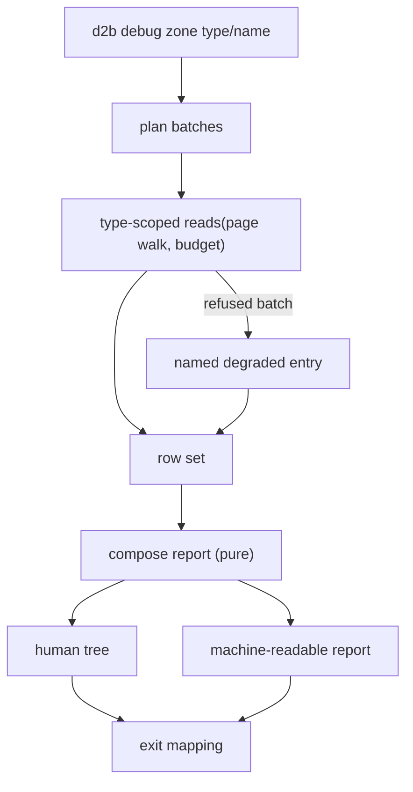

# Zone State Debug Surface - Plan

## Goal Capsule

- **Objective:** Ship `d2b debug <zone> [<type>/<name>]`, a read-only subcommand that explains a stuck Zone resource in one command: the ownership tree of the selected rows, row state detailed on unready nodes, and the last structured failure with its outcome, operation, stage, and likely cause.
- **Product authority:** This Product Contract. The parent issue `vicondoa/d2b#513` describes the proposed surface; this contract refines its column set into requirements and resolves the forks that planning research surfaced.
- **Current area:** The zone state debug surface. The issue's other remaining half, the non-VM seam harness, is not active scope; see How This Work Fits Together.
- **Read plan:** Zone scope enumerates the converted-type catalog in bounded batches of type-scoped reads, walks every page, and composes one report. Degradation is per type read, never per row.
- **Open blockers:** None.
- **Deliverable proof:** A stuck row explained end to end, verified by running `d2b debug` against a Zone whose rows include an unready subtree, plus the machine-readable form of the same report.

---

## Product Contract

Product Contract restructured, no scope change: R1's read scope moved to the new R21; R19 re-pointed from "one read" to completeness; R8, R11, and R13 corrected where the read path cannot satisfy the original wording. No requirement was dropped or weakened.

### Summary

Add a read-only `d2b debug` subcommand that renders a Zone's resource rows as an ownership tree, distinguishing the row that is stuck from its Ready siblings, and detailing row state - phases, generations, owned children, and the last structured failure - on unready nodes. It reads the live daemon and composes the report locally from the row envelopes the existing read paths already return.

### Problem Frame

Diagnosing the resource-runtime rewrite cost roughly 5 to 11 minutes per hypothesis, and the cost was assembling evidence rather than obtaining runtime truth. The rows existed and the daemon could serve them; what was missing was a single place that put a row's plane, phase, generation, status generation, owned children, and last failure together. The operator or agent instead ran `d2b list` per type and stitched the picture by hand, or grepped multi-thousand-line Nix logs after a VM lane run. Several of the bugs fixed during that lane lived between components - cross-plane reads, status overlay, posture - which made per-driver unit tests the wrong instrument for finding them. The fixture-diagnostics half of the same issue has since landed: failures now name their stage and dump the rows they asserted on.

### Actors

- A1. Zone operator or triaging agent - runs the command and reads the rendered tree.
- A2. `d2bd` - serves the row set the report is composed from, including each row's live classification.

### Requirements

**Scope and selection**

- R1. `d2b debug <zone>` renders every row in the Zone as an ownership tree, and `d2b debug <zone> <type>/<name>` renders the named row's subtree.
- R2. A row whose owner is not a row of the read set renders as a tree root flagged owner-absent, rather than being omitted or mis-rooted.
- R3. A named row with no descendants renders as a single node rather than as an error.
- R4. A zone with no rows reports a successful empty result, distinct both from a failed read and from a report whose reads were all refused.

**Tree and node content**

- R5. Every rendered node shows its resource type and name, its plane, its wire phase, and its generation. The plane is derived client-side from the resource type, and every type in the read scope resolves to the manager plane.
- R6. A node that owns children shows those children with their own phases, so a waiting parent and a failing child are distinguishable at the parent.
- R7. A node that is not Ready or Succeeded expands to a detail block naming the last structured failure: outcome, operation, stage, retryable, the operator-facing meaning, and the likely cause. When the served status carries no failure, the block names why: no status published for the row, a status that does not correspond to the row's generation, or a phase with no failure attached.
- R8. Every node shows the generation of the status behind its phase alongside the row generation, so a status that does not correspond to the row's spec is visible as such.
- R9. The rendered phase is the phase the row's read path reports, never a value re-derived by the renderer.

**Degradation and edge cases**

- R10. An ownership cycle in the row set terminates the walk and marks the cycle instead of hanging or recursing without bound.
- R11. A type read that is refused or fails renders one report entry covering that type with the refusal named, and the rows of that type already read render normally. A degraded type never renders as an empty type.
- R12. When the daemon is not answering, the command fails with a named refusal and prints no partial tree.
- R13. A node expands when it is not Ready or Succeeded, when its status is unknown, or when it is flagged owner-absent. A Ready node collapses only when its whole subtree is Ready or Succeeded.
- R14. Zone scope retains every row of the read set in the report even when a subtree collapses, so the tree stays complete rather than truncated.
- R15. `--all` expands Ready subtrees for the case where a healthy-looking subtree is itself the question.
- R16. The command emits a machine-readable form of the same report that a lane fixture can assert on without re-projecting raw rows.
- R17. The machine-readable form is the complete record rather than a serialization of the collapsed human tree, so a consumer sees every node, every failure, and every degraded type read the human view summarized.
- R18. Both renderings derive from one composition of the row set, so the human tree and the machine-readable form cannot disagree about a row's phase or failure.
- R19. A rendered report accounts for every selected type: rows where the read succeeded and a named degraded entry where it did not. A report that cannot be composed at all fails with a named refusal rather than printing a partial tree.
- R20. The command is read-only: it performs no mutation, requests no watch, and changes no row.

**Read scope and exit behavior**

- R21. Zone scope covers the converted-type catalog the managed plane serves, read in batches within the read limits, with every batch accounted for in the report and the revision of each read captured for R23. The named form reads the same scope, because a named row's children can carry a different resource type.
- R22. A rendered report exits zero even when it contains unready rows. A named row that does not exist is a not-found refusal at exit one, and a positional zone that disagrees with the routed zone is refused at exit two without a daemon round trip.
- R23. The report names the revision each read was taken at, in both output forms, and marks the report as composite when those revisions differ, so a composite assembled across reads is not presented as one moment.
- R24. A read that cannot complete for a local reason, the row budget or the response byte bound, refuses at exit one under one named error class added to the CLI's stable-class allowlist, so the refusal is not reported as an internal error.

### Key Decisions

- KD1. A new `debug` subcommand, not an extension of the existing zone health surfaces. (session-settled: user-directed - chosen over extending `zone doctor` or the row list projection: doctor's machine-readable health contract stays intact and the composed row view gets room to be row-level.) Governs R1, R13.
- KD2. Compose the report locally from the reads the daemon already serves, rather than adding a daemon-side debug method. (session-settled: user-directed - chosen over a daemon-side debug RPC: no new protocol surface to version, and the explanation reproduces from any client holding read access.) Governs R9, R18.
- KD3. Row state only; current execution state is out of scope. (session-settled: user-approved - agent proposed the boundary with execution state as the rejected alternative; user chose row state.) Governs R7, R8.
- KD4. Unready-full, ready-collapsed, with `--all` as the widening flag. (session-settled: user-directed - chosen over printing everything and over a bounded projection: output stays proportional to what is wrong, and no row hides behind a truncation marker.) Governs R13, R14, R15.
- KD5. Tree layout with detail blocks on unready nodes: the tree answers where, the detail answers why. (session-settled: user-directed - chosen over a flat table and over a summary-plus-story list: neither alternative answers both questions in one command.) Governs R5, R6, R7.
- KD6. A machine-readable output mode is in scope, because the lane fixtures already parse row output as JSON and should be able to assert on the composed explanation instead. (session-settled: user-directed - chosen over human-only output.) Governs R16, R17.
- KD7. Operator and agent are equal readers: the human tree stays scannable under incident pressure, and the machine-readable form is a complete record rather than a dump of the text tree. (session-settled: user-approved - agent proposed the primary-reader fork; user chose both equally.) Governs R7, R13, R17.
- KD8. Live daemon only: no offline read of the zone's desired-spec store when the daemon is down, keeping one data path that never prints a stale story as current. (session-settled: user-directed - chosen over an offline structural fallback and over an audit-replay fallback.) Governs R12.
- KD9. Zone scope covers the converted-type catalog, not the standard types alone. (session-settled: user-directed - chosen over a standard-type-only render: provider-owned rows are part of the zone, and a silently narrower report would mislead the reader it exists to serve.) Governs R21.
- KD10. The failure's meaning and likely cause come from the failure-kind registry, shared with the daemon rather than copied into the CLI. (session-settled: user-directed - chosen over omitting the prose and over a CLI-side copy with a drift test: one registry, one wording, and no drift to police.) Governs R7.
- KD11. The status carries the generation it was published for, so status age is a comparison rather than an inference. (session-settled: user-directed - chosen over inferring skew from phase and generation: the row read reports its own generation as the observed generation, so an inference would misreport an unpublished row as a skewed one.) Governs R8.

### Key Flows

- F1. Explain a stuck resource
  - **Trigger:** A row is not converging and the operator has a resource reference or a zone name.
  - **Actors:** A1, A2
  - **Steps:** The command enumerates the selected types and reads their rows; composes the row set into one report; renders the tree with unready nodes expanded. **Covered by:** R1, R5, R6, R7, R19, R21
  - **Outcome:** The failing row, its owner chain, and the last structured failure are visible in one screen.

### Acceptance Examples

- AE1. Zone-wide shape.
  - **Covers R13, R14, R23.**
  - **Given:** A zone with twelve rows, of which one Volume is Failed and the rest are Ready.
  - **When:** `d2b debug <zone>` runs.
  - **Then:** The header counts rows by phase and names the revision the report was read at; the Failed Volume prints with a detail block naming outcome, operation, stage, and likely cause; every fully Ready subtree prints as one rollup line and no row is missing from the count.

- AE2. Named subtree shape.
  - **Covers R1, R6.**
  - **Given:** A Guest whose Process child is not Ready.
  - **When:** `d2b debug <zone> Guest/<name>` runs.
  - **Then:** The tree roots at the Guest and shows the Process child with its own phase, so the waiting parent is distinguishable from the failing child.

- AE3. Owner absent from the read set.
  - **Covers R2.**
  - **Given:** A row whose owner is not among the rows read for the report.
  - **When:** The report renders.
  - **Then:** That row appears as a root flagged owner-absent, and the report does not imply the owner is Ready.

- AE4. Refused type read.
  - **Covers R11, R19.**
  - **Given:** A zone in which reads for one resource type are refused, both when that type holds rows and when it holds none.
  - **When:** The report renders.
  - **Then:** The refusal appears once for that type naming the class; rows of that type read before the refusal render normally; the remaining types render normally; and the report does not present the refusal as an empty type.

- AE5. Daemon unavailable.
  - **Covers R12, R22.**
  - **Given:** `d2bd` is not answering.
  - **When:** `d2b debug <zone>` runs.
  - **Then:** The command fails with the zone-unavailable class, prints no partial tree, and exits non-zero.

- AE6. Machine-readable completeness.
  - **Covers R16, R17, R18.**
  - **Given:** The zone from AE1 rendered in both forms.
  - **When:** The two reports are compared.
  - **Then:** Every node and every failure present in the tree appears in the machine-readable report with the same phase, including rows the human view collapsed.

- AE7. Status not observed for the current generation.
  - **Covers R8.**
  - **Given:** A row whose spec generation has moved past the generation its status was published for.
  - **When:** That row renders.
  - **Then:** The node shows the row generation and the status generation as a visible mismatch, rather than implying the status describes the current spec.

- AE8. Named row absent.
  - **Covers R22.**
  - **Given:** No row of the named type carries the named resource.
  - **When:** `d2b debug <zone> Volume/<missing>` runs.
  - **Then:** The command refuses with the not-found error class, exits one, and prints no partial tree.

- AE9. Positional zone disagrees with the routed zone.
  - **Covers R22.**
  - **Given:** The routed zone is `dev` and the positional zone is `prod`.
  - **When:** `d2b --zone dev debug prod` runs.
  - **Then:** The command refuses with the `ref-invalid` class, exits two, and makes no daemon request.

- AE10. Wide zone.
  - **Covers R19, R21.**
  - **Given:** A zone whose converted-type rows exceed one read page.
  - **When:** `d2b debug <zone>` runs.
  - **Then:** Every page of every batch is walked, the report covers every selected type, and a type whose read could not complete appears as a named degradation rather than a missing branch.

- AE11. Empty zone.
  - **Covers R4.**
  - **Given:** A zone that holds no rows of any selected type, and a zone whose type reads were every one refused.
  - **When:** Each renders.
  - **Then:** The first prints the successful empty result, the second prints the refused reads as named degradations, and the two are distinguishable without reading the row count.

### Success Criteria

- A stuck resource is explained by one command, replacing per-type row dumps stitched together by hand.
- The human tree renders a mixed zone at a glance, with the unready row distinguishable from its Ready siblings without filtering, and no unready row hidden under a collapsed ancestor.
- A lane fixture can assert on the composed machine-readable report instead of re-projecting raw rows.

### Scope Boundaries

- The non-VM seam harness is deferred: the issue's other remaining half, to be brainstormed separately. The report composition is a pure function over a row set, which is the only concession this plan makes to it.
- Current execution state is out of scope: in-flight passes, requeue backoff, and quarantined supervisor slots are not rendered. A row mid-retry shows its NotYet outcome with its retryable flag.
- Deliberately not extending `zone doctor`, the support bundle, or the existing row list projection.
- No offline store read and no audit replay when the daemon is unavailable.
- No watch mode and no row mutation.
- Fixture diagnostics in the VM lane are already landed and are not reworked here.
- Deferred to Follow-Up Work: byte-bound hardening for very large zones beyond the named refusal R19 requires, and any richer per-node summary that needs a daemon-side read.

### Dependencies / Assumptions

- The reading client holds the same authorization as the existing row read paths; the debug surface adds no new privilege and no new admission rule.
- A row's plane is derived client-side from its resource type rather than read from the row, because the envelope carries no plane field; every type in the converted catalog resolves to the manager plane, so the column is informative but constant.
- Row status lives in the daemon's runtime view rather than in the durable desired-spec store, so the status-generation comparison R8 requires is a wire change rather than a store read.
- The daemon serves each read at its own snapshot revision, so a multi-request report is a composition across revisions rather than one moment. R23 governs what the report says about that, and R19 governs completeness: nothing is silently dropped.
- The CLI and the daemon upgrade together. Adding a member to the closed status object means a strict reader from an adjacent build rejects every row read, and the repo documents no mixed-build support; the plan assumes none is required.

### How This Work Fits Together

<!-- ce-section: work-relationships -->

This plan owns one coherent work unit: the zone state debug surface. The breakdown below is the current understanding of the surrounding work, not a committed roadmap.

- **Zone state debug surface** (this plan) - the `d2b debug` subcommand.
- **Non-VM seam harness** - depends on nothing here, and can proceed independently of this plan.
  - Shares the report composition: a harness replaying the resource graph against fake effects needs the same composed view for its assertions and failure output, which is why this plan keeps the composition separate from the printers.
  - Still to decide: its own scope was not brainstormed here, so its requirements do not exist yet.
- **Fixture diagnostics in the VM lane** - already landed and independent of both.

---

## Planning Contract

### Key Technical Decisions

- KTD1. Carry the status's own generation as a field on the status object the row read already serves, alongside the observed generation that stays the row generation. (session-settled: user-directed - inherits KD11's choice of a wire field over phase inference.) Governs R8, R9.
  - The status object's key set is closed and asserted in three places, and four fixtures pin literal envelope bytes: `packages/d2b-resource-runtime/src/manager.rs` (the producer's own key assertion), `packages/d2b-resource-api/src/manager_backend/tests.rs` (the per-type strict-view test), `packages/d2b-contracts-resource/src/v3/resource.rs` and `packages/d2b-resource-api/src/adapter.rs` and `packages/d2b-resource-api/src/service.rs` (golden envelopes). The added field has to be admitted deliberately in the contract's status type, and every one of those fixtures updated in the same unit, or the change is rejected at the contract boundary.
- KTD2. Move the failure-kind registry to the shared contracts crate both the daemon and the CLI already depend on, and re-export it from `d2b-resource-runtime` so existing import sites stay unchanged. (session-settled: user-directed - inherits KD10's shared-registry choice.) Governs R7.
  - The registry is a static code-to-meaning table with no runtime dependencies; the generated `docs/reference/resource-runtime-failure-kinds.md` and the unit test that keeps it in lockstep move with it, so one test still guards the page.
- KTD3. Read zone scope as bounded batches of type-scoped requests, walking every page, and account for every batch in the report. Governs R19, R21.
- KTD4. Keep degradation at the type-read level. A read the daemon answers as refused or failed degrades that type, including one that fails part-way through its page walk, and the remaining batches still render; the read is not restructured to per-row reads. Failures that are not a per-type answer, a lost session or an exhausted local bound, abort the report under R12 or R24 instead. Governs R11, R19.
- KTD5. Compose the report as a pure function over the row set, taking the rows and producing a report value; reading, rendering, and exit mapping sit outside it. Governs R18.
- KTD6. Render the human tree and the machine-readable report from that one composition, so neither renderer can disagree with the other. Governs R16, R17, R18.
- KTD7. Refuse a positional zone that disagrees with the routed zone in the CLI before any request, because the daemon's route-mismatch code is outside the CLI's known error classes and would otherwise surface as an internal error. Governs R22.
- KTD8. Bound the read with an explicit page size and a row budget, and refuse by name when the budget is exhausted, rather than letting a large zone fail at the response byte bound. Governs R19.

### Execution Profile

Six units. The two runtime-side units (status generation, registry move) land first because the CLI consumes both. The read layer, composition, and rendering follow in that order. Command registration and its contracts last, since registration trips the pinned command set and the generated shell artifacts, which are cheap to regenerate once and noisy to regenerate repeatedly.

### Research Constraints

- The public read accepts at most sixteen resource types per request and refuses a type-less request, so a zone-wide render is several requests by construction.
- Only `metadata.name` and `type` are reachable as public read filters; owner filtering exists at the store layer but is rejected on the public request path, so the ownership tree is composed client-side from each row's owner reference.
- The CLI's error-class allowlist is closed: an unclassified daemon code degrades to the internal-error class.
- A new top-level subcommand must join the built-in command registry and its pinned count, and requires regenerated man pages and shell completions.

### High-Level Technical Design

The composition stage is the boundary the deferred seam harness can reuse: it consumes rows and produces a report, and it knows nothing about transport or printing.

### Affected Surfaces

- `packages/d2b-resource-runtime/` - the status producer gains the status generation; the failure-kind registry moves out and is re-exported.
- `packages/d2b-contracts-resource/` - the status contract admits the status generation, and the envelopes that pin the status key set and literal bytes move with it.
- `packages/d2b-resource-api/` - the strict per-type status view test and the golden envelope fixtures updated in U1.
- `packages/d2b-contracts/` - holds the shared failure-kind registry.
- `packages/d2b/` - new debug module, command registration, and its contract tests.

---

## Implementation Units

### U1. Status generation on the row status

- **Goal:** A row read reports the generation its status was published for, so a reader can tell a status that does not correspond to the current spec from one that does.
- **Requirements:** R8, R9. KTD1.
- **Dependencies:** None.
- **Files:**
  - `packages/d2b-resource-runtime/src/manager.rs`
  - `packages/d2b-resource-runtime/src/resource.rs`
  - `packages/d2b-contracts-resource/src/v3/resource_status.rs`
  - `packages/d2b-contracts-resource/src/v3/resource.rs`
  - `packages/d2b-resource-api/src/manager_backend/tests.rs`
  - `packages/d2b-resource-api/src/adapter.rs`
  - `packages/d2b-resource-api/src/service.rs`
- **Approach:**
  1. Add the status generation to the contract's status type as an admitted member, so the strict decoder accepts it.
  2. Emit it from the status producer, kept distinct from the observed generation.
  3. Keep the existing generation filtering: a status that is not current still renders as the honest pending classification.
  4. Update every fixture that pins the status key set or literal envelope bytes, listed under KTD1.
- **Patterns to follow:** The producer is already documented as the single place the status shape is built; no second producer is added.
- **Test scenarios:**
  - A row whose status was published for its current generation reports equal row and status generations.
  - A row whose spec advanced past its published status reports an older status generation.
  - A row that never published a status still renders the pending classification rather than a stale one.
  - Every converted type still projects a strict status view, and the key-set assertions carry the added field.
  - Envelope parsing still accepts the constructors' output and the golden fixtures still round-trip.
- **Verification:** The runtime crate's tests pass, and the resource-api and contract-crate suites pass for the strict-view and golden-envelope fixtures this unit updates.

### U2. Share the failure-kind registry

- **Goal:** The failure code's meaning and likely cause come from one registry both the daemon and the CLI read.
- **Requirements:** R7. KTD2.
- **Dependencies:** None.
- **Files:**
  - `packages/d2b-contracts/` (new registry module)
  - `packages/d2b-resource-runtime/src/error.rs`
  - `packages/d2b-resource-runtime/BUILD.bazel`
  - `docs/reference/resource-runtime-failure-kinds.md`
  - `packages/d2b-resource-runtime/src/error.rs` (registry lockstep test)
- **Approach:**
  1. Move the registry table and its lookup entry points into the shared crate.
  2. Re-export from the runtime crate so existing imports keep compiling.
  3. Add the contracts-crate label to the runtime library and test targets, since the new dependency edge is explicit in Bazel.
  4. Regenerate the failure-kind reference so the page still matches its owner.
- **Test scenarios:**
  - The registry lookup returns the same meaning and likely cause for every code after the move.
  - The generated reference still matches the registry, so the lockstep test keeps guarding it.
- **Verification:** The runtime crate's tests pass and the reference page regenerates with no content change.

### U3. Read layer for the debug report

- **Goal:** A zone's rows are read per the scope R21 defines, within the read limits, with every failure accounted for.
- **Requirements:** R19, R21, R11. KTD3, KTD4, KTD8.
- **Dependencies:** U1.
- **Files:**
  - `packages/d2b/src/debug.rs`
  - `packages/d2b/src/context.rs`
- **Approach:**
  1. Enumerate the converted-type catalog and split it into batches within the per-request type limit.
  2. Walk every page of each batch with an explicit page size and a row budget.
  3. Record a refused or failed batch as a named degraded entry rather than dropping it.
  4. Read the same selected scope for the named form, which composition narrows to the named row's subtree; children of a named row can carry a different resource type, so a narrower read would drop them.
- **Patterns to follow:** Existing list request construction and the zone health command's read shape.
- **Test scenarios:**
  - A zone with rows in several types produces batches that together cover every type in the catalog.
  - A batch that spans more than one page is walked to exhaustion.
  - The named form selects the named row's subtree, including a child whose resource type differs from the named row's.
  - A refused batch yields a degraded entry naming the refusal, and the other batches still return rows.
  - Exceeding the row budget refuses by name rather than truncating.
  - Each read contributes the revision its response reported, and the composed report carries them.
- **Verification:** Read-layer tests pass against an injected client.

### U4. Compose the report

- **Goal:** One pure function turns a row set into the report both renderers use.
- **Requirements:** R2, R3, R4, R5, R6, R7, R8, R10, R13, R14, R18. KTD5.
- **Dependencies:** U2, U3.
- **Files:**
  - `packages/d2b/src/debug.rs`
- **Approach:**
  1. Build the ownership tree from each row's owner reference, with rows whose owner is absent from the set flagged as owner-absent roots.
  2. Mark cycles and stop the walk at the repeated node.
  3. Apply the expansion rule: expand unready, unknown, and owner-absent nodes; collapse a Ready node only when its whole subtree is Ready or Succeeded.
  4. Attach the failure detail to expanded nodes, looking up the meaning and likely cause from the shared registry.
  5. Count rows by phase for the header, including unknown and owner-absent.
- **Test scenarios:**
  - A Ready parent with a Failed grandchild keeps the path expanded and leaves no node out of the count.
  - A row whose owner is absent from the set becomes an owner-absent root, not a child of an unrelated row.
  - A cycle in the owner references terminates and marks the repeated node.
  - A row with a failure and no driver projection renders the failure detail; a row with a current projection renders that projection.
  - A row that is not Ready and carries no failure names why there is no failure detail, rather than rendering an empty block.
  - Every node renders its plane derived from its resource type.
  - A degraded type read composes one report entry naming the type and the refusal.
  - An empty row set composes to the successful empty report, distinguishable from a report whose every type read was refused.
  - A named row with no descendants composes to exactly one node.
  - Rows render in the read order so repeated runs agree.
- **Test expectation note:** Composition tests run against synthetic row sets, so they need no socket and no daemon.

### U5. Render the human tree and the machine-readable report

- **Goal:** Both output forms come from the one composition and agree with each other.
- **Requirements:** R13, R14, R15, R16, R17, R5, R9. KTD6.
- **Dependencies:** U4.
- **Files:**
  - `packages/d2b/src/debug.rs`
- **Approach:**
  1. Render the human tree with a phase-count header, expanded detail blocks, and collapsed Ready subtrees as rollup lines carrying the row count.
  2. Render the machine-readable report as the complete record, including rows the human tree collapsed.
  3. Accept the widening flag, which changes only the human tree.
  4. Carry the standard JSON envelope decoration so the report matches the CLI's existing JSON contract.
- **Test scenarios:**
  - The machine-readable report contains every node and failure the human tree shows, plus the collapsed rows.
  - The machine-readable report distinguishes a type that holds no rows from a type whose read was refused, so a consumer never reads a refusal as an empty type.
  - A collapsed subtree's rollup line reports the row count it hides.
  - The widening flag expands Ready subtrees in the human tree and leaves the machine-readable report unchanged.
  - The phase-count header totals equal the row count in the report, including unknown rows.
- **Verification:** Rendering tests pass and the JSON envelope matches the CLI's existing key set.

### U6. Register the command and its contracts

- **Goal:** `d2b debug` is a registered top-level command whose behavior matches the exit contract.
- **Requirements:** R1, R12, R20, R22, R24.
- **Dependencies:** U5.
- **Files:**
  - `packages/d2b/src/dispatch.rs`
  - `packages/d2b/src/lib.rs`
  - `packages/d2b/src/complete.rs`
  - `packages/d2b/tests/cli_contract_coverage.rs`
  - `packages/d2b/tests/debug_contract.rs`
  - `packages/d2b/BUILD.bazel`
  - `docs/manpages/d2b.1`
  - `completions/d2b.bash`
  - `completions/d2b.zsh`
  - `completions/d2b.fish`
  - `changelog.d/<branch>.md`
- **Approach:**
  1. Register the subcommand in the built-in command registry and its pinned count.
  2. Add the positional and widening arguments, and refuse a positional zone that disagrees with the routed zone before any request.
  3. Map the outcomes: a rendered report exits zero, an absent named row exits one with the not-found class, and the argument refusals exit two.
  4. Add the new test file and its Bazel target, and regenerate the man page and completions.
- **Patterns to follow:** The zone health command's read-only shape and the existing `SOCK_SEQPACKET` fake-daemon contract test.
- **Test scenarios:**
  - The pinned top-level command set includes the new command, so drift fails the contract test.
  - A report containing an unready row exits zero.
  - A named row that does not exist exits one with the not-found class and prints no tree.
  - A positional zone that disagrees with the routed zone exits two and issues no request.
  - A daemon that is not answering produces the zone-unavailable class with no partial tree.
  - A successful run issues read requests only, and the fake daemon observes no watch registration and no mutation.
  - Exceeding the row budget exits one under the new class rather than as an internal error.
  - A type read the daemon answers as authorization-denied renders the rest of the report, records that type's refusal once, and still honors the exit contract.
- **Verification:** The CLI crate's tests pass, including the command-set and JSON contract tests.

---

## Verification Contract

| Gate | Command | Proves |
|---|---|---|
| Runtime crate tests | `bazel test //packages/d2b-resource-runtime:all-tests` | U1, U2 - status generation and the registry move |
| Status-shape fixture suites | `bazel test //packages/d2b-resource-api:all-tests //packages/d2b-contracts-resource:all-tests` | U1 - the strict per-type view and the golden envelopes |
| CLI crate tests | `bazel test //packages/d2b:all-tests` | U3-U6 - read, compose, render, register |
| Contract tests in the CLI crate | same target, `debug_contract` and `cli_contract_coverage` cases | U6 - command set, exit codes, envelopes |
| Generated-artifact drift | `make generate` then `make test-drift` | U6 - man page and completions match the clap surface |
| Source hygiene | `make check-tier0` | ASCII-only text and the file-level rules |
| Changelog policy | `make test-changelog` | U6 - a valid fragment exists for the branch |
| Layer-1 aggregate | `make check` | The full PR-equivalent gate |

No host-integration lane is required: the change is confined to the CLI, the runtime's status projection, and a shared registry, and no VM fixture path changes.

## Definition of Done

- All requirements R1-R24 are satisfied and every acceptance example AE1-AE11 passes.
- `make check` passes, and generated artifacts show no drift after `make generate`.
- The machine-readable report contains every node the human tree collapsed, and both forms derive from the one composition.
- A zone whose reads partly fail still renders the rows it could read, naming each degraded type once.
- A read that cannot complete locally exits one under its own class rather than as an internal error.
- No abandoned-attempt code, temporary scaffolding, or commented-out experiment remains in the diff.
- The changelog fragment is present and written as a consumer-facing entry.

## Sources / Research

- `vicondoa/d2b#513` - the proposed shape this contract refines, including the column set and the done-when clauses.
- `docs/plans/2026-09-09-001-refactor-v3-resource-runtime-rewrite-plan.md` - the rewrite lane that measured the 5-to-11-minute diagnosis cost, excluded the debug command from its landed diagnostics slice, and records the lane timings.
- `docs/plans/2026-08-31-001-refactor-generic-resource-reconciler-plan.md` - the reconciler contract whose cross-plane reads, status overlay, ordering, and posture behavior are the seams this surface makes visible.
- `packages/d2b-resource-runtime/src/manager.rs` - the single status producer the report reads through.
- `packages/d2b-contracts/src/identity.rs` - the type catalogs that define zone read scope.
- `packages/d2b-contracts-resource/src/v3/limits.rs` - the read bounds the batch plan must respect.
- `packages/d2b/src/zone_doctor.rs` and `packages/d2b/tests/zone_doctor_contract.rs` - the closest existing read-only command and its fake-socket test pattern.
- `docs/reference/resource-runtime-failure-kinds.md` - the generated failure-kind reference that moves with the registry.
- `tests/host-integration/lib.nix` - the landed fixture-diagnostics prelude, and the row projections the VM fixtures already assert on.
