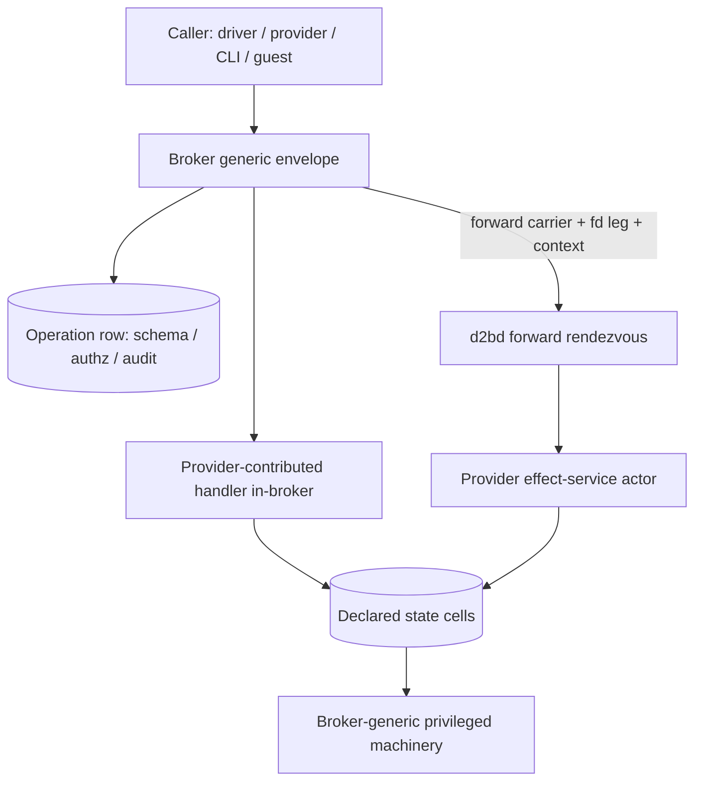
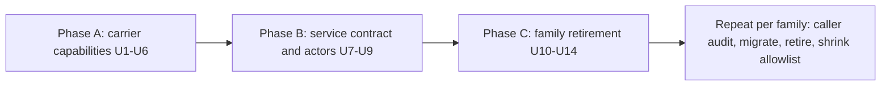

# Provider Services Broker Seam - Plan

## Goal Capsule
- **Objective:** Replace every special-case broker API and every daemon-side effect port with a generic provider-service layer, covering both issue #523 (retire the typed dispatch arms) and issue #516 (no resource knowledge in shared code) as one target state.
- **Product authority:** This contract, settled in dialogue 2026-09-14, alongside issues #523 and #516 and `docs/plans/2026-09-13-001-refactor-provider-per-crate-plan.md` for its own areas (one supersession, recorded in Scope Boundaries).
- **Open blockers:** none.

---

## Product Contract

### Summary

Providers declare services and supply all of their own cross-boundary code — including the operation-handler code that executes inside the broker. The broker keeps only a generic envelope and resource-agnostic machinery; d2bd keeps the daemon composition root and provider actor hosting, and the broker executable gains a handler composition root. Every call rides that envelope; family-named code reaches zero in shared crates, enforced by a build-failing policy check.

### Problem Frame

The codebase carries two dispatch mechanisms. The generic path is live end to end — `ForwardOperationRequest` carries a committed operation name from the broker through the daemon's forward rendezvous to the declaring provider, proven by the `inspect-process-family` pilot — but it is deliberately JSON-only, while ~74 typed dispatch arms plus 13 reserved stubs still serve every privileged operation. Each new cross-boundary operation still means another typed request, wire variant, arm, and audit row.

The same shape blocks #516's crate extraction: the effect-port traits already moved into provider crates, but every production impl in d2bd holds `Arc<ServerState>` or daemon registries, so drivers cannot leave d2bd and duplicated literals persist everywhere. The arm census gates retirement on three missing carrier capabilities: an fd leg, trusted intent resolution (the census's term for the broker-attested context block, KTD2), and authority over broker-owned state.

### Actors

- **Provider crates** — declare services, supply in-broker operation handlers, supply effect-port service code, export provider identities.
- **Broker** — generic envelope (resolve row, validate, authorize, audit, dispatch), forward carrier to the daemon, resource-agnostic privileged machinery and state cells.
- **d2bd (daemon composition root)** — assembles the registry, hosts provider effect services as actors, implements nothing family-named. The broker executable carries a second, handler composition root (KTD1).
- **Callers** — daemon drivers (family crates), other providers' handlers, CLI/session layer, guests.

### Requirements

**Service contract**

- R1. A provider owns all of its cross-boundary code in its own crate — the handler code that runs inside the broker for its operations and the effect-port services its driver needs — with no family code in shared crates.
- R2. The service declaration generically expresses: methods, payload schema, fd carriage in request and response, trusted caller context, declared state cells, audit facets, and the privileges each method requires.
- R3. Committed Operation rows remain the broker-visible operation vocabulary (schema, authz, audit facets) and each resolves to a declared service method; the four parallel hand-maintained catalogs become generated views.
- R4. The session/attach fields of the existing service declaration (attach kinds, streams, endpoint policy) remain the zone-plane surface and coexist as one facet of the unified declaration.

**Execution model**

- R5. Provider-contributed handlers execute inside the broker's generic envelope — resolve row, validate payload, authorize, audit, dispatch — with the broker linking no provider crate; contribution flows through the registry seam.
- R6. Effect-port services execute as ractor actors in d2bd's provider runtime, supervised like resource actors.
- R7. Every cross-boundary control call rides the broker envelope — no direct provider-to-provider sessions and no daemon-local bypass — so audit and authz have exactly one path; byte-streaming I/O (shells, attach, interactive sessions) stays on the ComponentSession/stream plane the service declaration already describes, never on the envelope.
- R8. The forward carrier gains the three missing capabilities: an fd leg (SCM_RIGHTS on the existing seqpacket machinery), a trusted caller-context block (principal, zone, invocation identity), and declared state-cell access.

**Security boundary**

- R9. An in-broker provider handler receives only its declared effect ports and operation context through its capability object; broker internals are unnameable from a handler crate, and reaching beyond the declaration is refused at the capability object. Runtime reach of co-resident code is governed by the deployment gates in KTD1 — the interface is the boundary, not process isolation.
- R10. Privileged broker machinery (pidfd/runner registry, reap buffer, lifecycle lease) stays resource-agnostic and reachable only through declared state cells; the broker-internal surface only shrinks.

**Elimination**

- R11. All family-named effect ports die; drivers obtain host capabilities by invoking declared services.
- R12. All typed dispatch arms retire; the broker's dispatch match carries zero family arms, and a retired arm's wire variant becomes a generated view or retires with its row.
- R13. Drivers read resource state (rows, zones, bindings) through the driver context against the generic resource store; only genuinely daemon-structural state (controller generation, sockets, ledgers) is reached through declared state cells or state services — never through `ServerState` handles.

**Done bar**

- R14. Zero family-named code in shared crates (d2bd, broker, shared contracts), enforced by a policy check that fails the build; its allowlist only shrinks.
- R15. Adding a cross-boundary operation requires zero code edits outside the declaring provider crate; the committed Operation row in `docs/reference/policy/broker-operations.json` is the declaration surface.

**Async discipline**

- R16. All provider and broker code is async on tokio; unavoidable synchronous syscalls wrap through established adapter patterns (async-capable crates or `spawn_blocking`), never blocking a runtime worker.

### Key Decisions

- KD1. One target state for #523 and #516 rather than per-thread scoping. Governs R11–R15. (session-settled: user-directed — chosen over scoping each issue separately: the halves share the services mechanism.)
- KD2. Providers supply in-broker handler code; the boundary holds by capability-scoping the handler, not by excluding provider code from the broker. Governs R1, R5, R9. (session-settled: user-directed — chosen over broker-resident family handlers and over keeping providers out of the broker: one place per provider's code, boundary preserved by the envelope.)
- KD3. Two service execution kinds, both provider-supplied: in-broker operation handlers and in-daemon effect-service actors. Governs R5, R6.
- KD4. Broker-owned state becomes declared state cells keyed to the declaring service, on one generic stateful mechanism. Governs R2, R10. (session-settled: user-approved — over broker-kept generic registries: the registries are the per-family knowledge being evicted.)
- KD5. Uniform broker envelope for every call. Governs R7. (session-settled: user-approved — over cross-boundary-only mediation: one audit/authz path despite the hop on daemon-internal calls.)
- KD6. Operations resolve to services rather than services subsuming operations. Governs R3. (session-settled: user-approved — over subsumption: committed rows keep their facets with less churn.)
- KD7. Actors on the forward carrier; the Zone bus stays untouched. Governs R6, R7. (session-settled: user-approved — over publishing services onto the per-Zone bus or peer-process providers: keeps privilege plane and zone plane separate; per-family process isolation remains an allowed escape hatch.)
- KD8. Family-by-family retirement behind the per-family caller audit gate from #523. Governs R12, R14. (session-settled: user-approved.)
- KD9. Tokio-everywhere with wrapped sync syscalls. Governs R16. (session-settled: user-directed.)

### Key Flows

- F1. Broker-mediated operation call
  - **Trigger:** Any caller invokes a committed operation.
  - **Steps:** Broker envelope resolves the Operation row, validates the payload, authorizes, audits with an invocation id, then dispatches: to the provider-contributed handler in-broker, or across the forward carrier (with fd leg and trusted context when declared) to the d2bd rendezvous and the declaring provider's actor.
  - **Outcome:** Result or refusal with code; audit carries the invocation id either way.
  - **Covers:** R3, R5, R7, R8.

- F2. Driver effect via service
  - **Trigger:** A family driver needs a host capability it no longer holds a port for.
  - **Steps:** Driver invokes the declaring service through the envelope; the rendezvous routes to the provider's effect-service actor in d2bd; the actor reaches privileged machinery only through declared state cells or ports.
  - **Outcome:** Capability delivered (fd, state read, privileged effect) with no `ServerState` handle and no family code outside the provider crate.
  - **Covers:** R6, R8, R11, R13.

- F3. Family retirement
  - **Trigger:** A capability class lands or a family's turn starts.
  - **Steps:** Caller audit enumerates the family's construction sites; migratable sites move onto the generic path; their arms, wire variants, and catalogs retire or become generated views; the policy check's allowlist shrinks.
  - **Outcome:** One family fully off the typed arms; the completeness gate stays green.
  - **Covers:** R12, R14.

### Acceptance Examples

- AE1. fd-returning operation (OpenVhostNet class)
  - **Covers:** R2, R8, R12.
  - **Given** the guest driver needs a vhost-net fd, **when** it invokes the network family's declared service through the envelope, **then** the response carries the fd over SCM_RIGHTS, the audit record is stamped with the invocation id, and no typed arm exists for the operation.

- AE2. One-time lease on broker-owned state
  - **Covers:** R10, R13.
  - **Given** the guest lifecycle lease lives in a declared state cell, **when** a second consume attempt arrives, **then** it is refused because the cell's one-time semantics are generic, with no lease code in the broker.

- AE3. Handler reaches beyond its declaration
  - **Covers:** R9.
  - **Given** a provider handler, **when** it attempts access outside its declared ports or context, **then** the attempt fails at compile time (internals are unnameable from a handler crate) or is refused at the capability object — the interface is the boundary, and runtime reach is governed by the deployment gates in KTD1.

- AE4. New cross-boundary operation
  - **Covers:** R15.
  - **Given** a provider declares a new service method plus its Operation row, **when** the change builds, **then** no broker or d2bd shared file was edited and the policy check passes.

- AE5. Synchronous syscall under async discipline
  - **Covers:** R16.
  - **Given** a provider handler needs a blocking syscall, **when** it executes, **then** the call wraps through the established adapter pattern and no tokio worker blocks.

### Scope Boundaries

- Deferred for later: Nix-side registration and host-contract aggregation seams (blockers 4–5 of #516 — they proceed under the per-crate plan).
- Deferred for later: process-isolation infrastructure for provider services (the routing rule that keeps effectful and privileged handlers off the in-broker leg is enforced this pass; the isolation machinery itself is not built here). In scope despite the deferred Nix boundary: the broker composition-root crate split and the `privilegesJson.brokerOperations` row sync with its drift gate — both are minimal, named exceptions.
- Outside this work's identity: merging the broker transport with the Zone bus, or giving the broker a d2b-bus dependency.
- Supersedes: the U34 verdict that the privileged executor "is the broker's job by design and does not move into a provider" — in-broker provider handlers under R9's scoping replace it.

### Dependencies / Assumptions

- Effect-port traits already live in provider crates; the blocking state is the d2bd impls holding `Arc<ServerState>` (`packages/d2bd/src/guest_effects.rs:583-591`, `packages/d2bd/src/shared_provider_effects.rs:193-202`).
- The generic forward path is live end to end with a committed pilot operation, and the daemon-to-broker origination leg is established (`d9d41b4ec`).
- SCM_RIGHTS fd machinery already exists on the broker's main channel (`SpawnRunner`, `OpenPeerPidfdFromAcceptedSocket`); the carrier is JSON-only today.
- Assumption (accepted trade-off): in-process provider actors share the daemon's privilege domain until a family exercises the process-isolation escape hatch.

### Outstanding Questions

- none. OQ2 (state-cell shape) resolved during planning as KTD3; OQ3 (broker machinery actors) resolved during planning as KTD5. OQ1 was resolved before planning (recorded on R13).

### Sources / Research

- Issues #523 (arm census, three capability classes, audit-gate entry condition) and #516 (crate model, leak inventory, seam decisions).
- `docs/plans/2026-09-13-001-refactor-provider-per-crate-plan.md` — broker seam units U22/U23/U30/U31; capability-class audit; U34 (superseded here).
- `packages/d2b-contracts-broker/src/broker_wire.rs:299-311` (`ForwardOperationRequest`), `packages/d2bd/src/forward_rendezvous.rs:120-190`, `packages/d2b-broker/src/runtime.rs:2548-2552` (fd acceptance), `packages/d2b-resource-types/src/service.rs:8-30` (`ServiceDecl`), `packages/d2bd/src/provider_lifecycle.rs:436-452` (`ProviderRuntime`), `packages/d2b-resource-runtime/src/manager.rs:466-467` (ractor supervision).
- `docs/adr/0011-cgroup-v2-delegation-and-pidfd-handoff.md` (SCM_RIGHTS precedent), `docs/adr/0021-broker-user-namespace-for-virtiofsd.md` (capability-scoped boundary), `docs/adr/0045-provider-and-transport-framework.md` (dependency direction, frozen serialized contracts), `docs/adr/0054-single-product-cargo-workspace.md` (build-failing policy inputs).
- `docs/plans/2026-09-09-001-refactor-v3-resource-runtime-rewrite-plan.md` — ractor/tokio playbook (KTD8 bounded primitives, R30/R32 no-shim migration, read-path fence).
- Codegen and seam mechanics: `packages/xtask/src/gen_broker_operations.rs` (committed JSON → five views + drift check), `packages/d2b-broker/src/catalog.rs` (`wire_variants!`, audit gate `committed_rows_cover_every_view`), `packages/d2b-broker/src/envelope/mod.rs` (`BrokerEnvelope::call`, `HandlerTable`, `LoopbackPeer` tests), `packages/d2bd/src/provider_lifecycle.rs` (`ProviderOperations` handler table), `packages/xtask/src/provider_crate_policy.rs` (shared-crate probes, allowlist ratchet).

---

## Planning Contract

Product Contract preservation: unchanged in meaning. Clarified without scope change — R5/R14 hold on the `d2b-broker` crate (the broker process is composed with injected provider handlers, see KTD1); R15's zero-edits holds for code (the committed Operation row in `docs/reference/policy/broker-operations.json` remains the declaration surface); R13 sharpened per the resolved OQ1. Review adjustments: AE3 and R9 reworded from "unreachable by construction" to "unnameable plus capability-object refusal" — the security review showed the absolute claim is false for co-resident code, and KTD1's routing rule plus the U6/U14 gates are the honest boundary; the doc-review pass hardened KTD2/KTD3/KTD4/KTD6 and U1-U6/U9/U10 accordingly (cell-store single ownership, one-time-marker compaction exemption, broker-epoch restart invalidation, deadline conveyance, root-owned audit records, 8-fd ceiling, abortable handler tasks).

### Key Technical Decisions

- KTD1. Broker handler carriage: the broker executable's composition root links provider handler crates and registers each declared handler on the existing `HandlerTable` (`packages/d2b-broker/src/envelope/mod.rs:524-570`); this requires splitting the broker binary into a composition crate whose Nix packaging is rewired (a named exception to the deferred Nix boundary). The `d2b-broker` crate links no provider crate. A routing rule, mechanically checked at the composition root, enforces the boundary this pass: effectful operations and handlers touching privileged machinery are never admitted to the in-broker table — they route to the forward carrier; the in-broker leg serves pure, reviewable transforms. The U6 dependency-surface audit (syscall-surface deps, `asm!`/build-emitted code, `ctor`-style entry points, allocator/panic-hook registration, lockfile allowlist) is defense-in-depth, not the boundary. Capability objects define the interface. Process-isolation infrastructure itself is deferred (Scope Boundaries). This pass the in-broker leg ships exercised by fixtures only; the first family that maps an operation to it inherits the U13/U14 handler-crate coverage. Instantiates KD2/R5/R9. (session-settled: user-approved — chosen over dlopen-style loading or in-process family code in the broker crate: one place per provider's code, boundary enforced by the interface plus deployment gates.)
- KTD2. Trusted context is broker-attested: the broker (the SO_PEERCRED-verified peer) mints the carrier context block — zone, provider-set revision, controller/guest generations, initiating identity, the operation's deadline budget, and a broker-epoch nonce. Provider-set revision and the generations are daemon-owned, so the daemon publishes its current values to the broker over the established origination leg (the channel that already carries `expected_*_generation` payloads); the broker caches them as durable, monotonically increasing broker state and refuses to mint until it holds a value. The broker-epoch nonce is the restart-invalidation source: any context minted before a broker restart fails it regardless of generation equality. The rendezvous freshness check is field-wise — epoch, zone (bound to the connection's zone), provider-set revision, controller generation, guest generation each compared — never a single ordinal. Deliberately reverses the no-caller-identity invariant documented at `packages/d2bd/src/forward_rendezvous.rs:14-25`: authority stays single (broker-minted), nothing caller-asserted crosses. Instantiates R8.
- KTD3. State cells have one owning process — the broker, whose existing privileged machinery they replace — persisting durable records under the zone state root; daemon-side effect actors reach cells only through carrier-mediated cell operations, never by direct file access, so the compare-and-consume lock is single-process. Cells are keyed `(cell, invocation_id, initiating_principal)`; per-cell durability is declared on the Operation row; a restart of the broker (the cell owner) refuses re-consume of a completed one-time cell; a repeated invocation id returns the recorded outcome for the same initiating principal only — invocation ids appear in audit records and are not secrets, so they never gate one-time grants alone. One-time cells commit durably before the effect runs; a crash in between records an unknown outcome the effect reconciles idempotently. Retention/compaction applies only to replayable non-one-time outcome records; consumed one-time markers are exempt (their count is bounded by the declared one-time cell set), so compaction can never re-enable a double grant. Non-durable broker-internal machinery (runner registry, reap buffer) keeps its in-process reset-on-restart semantics as declared non-durable cells. Resolves OQ2. Governs R10, AE2.
- KTD4. Deadline tiers live on Operation rows and are conveyed to both legs: the broker-minted context block carries the row's concrete budget, and the rendezvous uses it as the per-call handler deadline in place of the fixed 25s constant, bounded by an absolute ceiling. A timed-out call returns an explicit unknown-outcome refusal code, never flattened to `unregistered-handler`; callers pair with idempotency by invocation id (KTD3), never blind retries. Governs R3, R7.
- KTD5. Effect services run as ractor actors: linked children under a per-zone supervisor mirroring `ResourceManager`/`ResourceActor` (`packages/d2b-resource-runtime/src/manager.rs:1190-1211` — respawn from durable row, timers not threads). Service bindings are generational: a respawn or provider-set republish bumps the revision and in-flight calls against a stale revision refuse with a dedicated code. Broker-internal machinery stays handler-plus-task based — no actors there. Resolves OQ3. Governs R6.
- KTD6. Nested calls carry the initiating identity as an evidence chain — a handler invoking another service never re-presents as the daemon class. The chain root owns the invocation's audit record: the leg executing the root operation writes exactly one record per root invocation, and each nested leg writes a correlation record keyed by invocation id and depth — so a mixed-leg chain never produces two root records and audit consumers count one root record per invocation id. Loop depth capped with a dedicated refusal code. Governs R7.
- KTD7. Refusal taxonomy: `EnvelopeRefusal` gains a stable peer code from a closed set (handler-refused, handler-errored, handler-timed-out, handler-crashed, plus fd-leg, stale-context, and stale-wire-version codes) alongside the envelope code. Both execution legs wrap dispatch in `catch_unwind`; a crash writes the closing audit refusal before the socket path closes, and the rendezvous fails a crashed call by name instead of letting the broker time out. The carrier attests the request context, never fd provenance: fds are minted by the answering peer and are only as trustworthy as the operation's grant. Governs R9, R12.
- KTD8. Guests reach services through the session/bus plane, which presents as an existing caller class; no guest `CallerAuthority` class and no envelope admission for guests in this pass. Governs R7.
- KTD9. Tokio-everywhere with retirement, not shims: new and migrated code uses bounded tokio primitives supplied by the owning runtime (per the 09-09 rewrite plan's KTD8 playbook); blocking syscalls wrap in established adapters or `spawn_blocking`; an xtask gate rejects blocking calls on runtime workers; synchronous call paths retire in the same change that migrates them. Governs R16.
- KTD10. Family retirement template: each family's turn starts with a caller audit (the #523 entry condition) that also counts telemetry `op` emitters and the Nix `privileges-json.nix` row copy; migrates its construction sites onto the envelope; and retires its typed arms, wire variants, catalog rows, effect-port impls, and dead code in the same change — no deprecated shims. Variant retirement is gated on the Hello-negotiated wire version so a straggler peer gets a typed refusal plus audit record, never a silent malformed-wire drop; a family retires only when both binaries swap within one NixOS generation switch. A migrated operation keeps its committed operation name and audit profile byte-for-byte. R14 is enforced twice — structurally (bazel visibility: shared crates cannot depend on provider crates, with the broker composition crate the single allowed linking target) and heuristically (the source probe); the allowlist ratchet is the shrink-only third belt. A cross-binary E2E test (first one lands with the pilot) proves the family end to end. Instantiates KD8. Governs R11-R15.

**Operation leg assignment.** The migration moves every operation onto the envelope; per operation, one of two execution kinds applies. Default: forwarded provider service (carrier → rendezvous → declaring provider's handler or effect-service actor) — this is where every effectful and privileged operation lands, which in practice is all of them this pass. Exception: in-broker injected handlers, reserved for pure, reviewable transforms over declared state cells; none of the census families names one this pass, so the U6 seam ships fixture-exercised and each family's caller audit records its leg assignment going forward.

### High-Level Technical Design

The envelope path (`BrokerEnvelope::call` → `OperationDispatcher` → `HandlerTable` | `ForwardingDispatcher`) exists and is tested; the work wires production callers onto it and grows it the three missing capabilities. The fd leg alone is four coordinated edits: `DispatchOutcome` (`envelope/mod.rs:166-171`), `ForwardOperationOutcome` (`broker_wire.rs:319-340`), `SocketForwarder::exchange` (`forwarding.rs:208-227`), and the rendezvous `serve_connection` — the `*_with_fds` frame plumbing already exists on both sides.

Sequencing: Phase A lands the three census-gated carrier capabilities — fd leg, trusted context, state cells — plus the refusal taxonomy, production caller, and handler seam. Phase B declares services and hosts effect actors. Phase C migrates families — process pilot first (highest payoff, pilot operation already live), then guest lifecycle lease (cheapest missing capability), then the census order. The async sweep (U13) and policy check (U14) run last so they pin the end state.

### Assumptions

- The broker binary splits into a composition crate (the composition root's home); the exact crate name and Nix packaging change are confirmed at implementation start before U6 lands. In-process provider actors share the daemon's privilege domain; the routing rule, not isolation infrastructure, is this pass's control.
- Cells persist under the existing daemon state root the `ProviderSet` already uses.
- No cross-binary E2E harness exists today; the pilot family introduces it.

---

## Implementation Units

| U-ID | Title | Key files | Depends on |
|---|---|---|---|
| U1 | fd leg on the forward carrier | broker_wire.rs, forwarding.rs, envelope/mod.rs, forward_rendezvous.rs | — |
| U2 | Broker-attested trusted context | broker_wire.rs, envelope/mod.rs, forward_rendezvous.rs | — |
| U3 | State cells with declared durability | state_cells.rs, runtime.rs, broker-operations.json | — |
| U4 | Refusal taxonomy, panic guards, deadline tiers | envelope/mod.rs, forward_rendezvous.rs, gen_broker_operations.rs | — |
| U5 | Production envelope callers in d2bd | composition.rs, runtime.rs, envelope grant rows | U4 |
| U6 | Broker handler injection seam | broker composition root, envelope/mod.rs | U3, U4 |
| U7 | Service declaration facets and codegen | service.rs, operations/envelope.rs, gen_broker_operations.rs | U4 |
| U8 | Effect-service actors with generational bindings | provider_lifecycle.rs, forward_rendezvous.rs | U2, U7 |
| U9 | Nested-call evidence chain and audit rule | envelope/mod.rs, forward carrier context | U2, U6 |
| U10 | Process family pilot retirement | process call sites, runtime.rs arms, broker-operations.json | U1-U6, U8, U9 |
| U11 | Guest lifecycle lease onto state cells | runtime.rs lease arms, state_cells.rs | U3, U10 |
| U12 | Family rollout (census order) | per-family call sites and arms | U10 template |
| U13 | Async enforcement sweep | cross-crate, xtask gate | U10-U12 |
| U14 | Policy check for family-named shared code | packages/xtask/src/provider_crate_policy.rs | U10-U13 |

### U1. fd leg on the forward carrier

- **Goal:** Requests and responses on the forward carrier carry SCM_RIGHTS descriptors.
- **Requirements:** R8; proves AE1.
- **Dependencies:** none.
- **Files:** `packages/d2b-contracts-broker/src/broker_wire.rs`, `packages/d2b-broker/src/forwarding.rs`, `packages/d2b-broker/src/envelope/mod.rs`, `packages/d2b-broker/src/runtime.rs`, `packages/d2bd/src/forward_rendezvous.rs`, `packages/d2bd-runtime/src/unix_transport.rs`; tests beside each.
- **Approach:**
  1. Grow `DispatchOutcome` with an fd vector; add fd-index fields to `ForwardOperationRequest`/`ForwardOperationOutcome` (keep `deny_unknown_fields` honest — the indexes name positions in the frame's attachment list).
  2. Switch `SocketForwarder::exchange` and the rendezvous `serve_connection` to the `*_with_fds` frame helpers that already exist in `d2b-broker/src/protocol.rs` and `packages/d2bd-runtime/src/unix_transport.rs`.
  3. Count-validate and bound: a response whose fd count disagrees with its declared indexes is refused, never truncated. The SCM_RIGHTS ancillary buffer in both `_with_fds` helpers caps a frame at 8 descriptors (`cmsg_space!([RawFd; 8])`) — declare that ceiling and a per-operation max-fd facet validated against it before dispatch, so an oversized-but-legitimate set gets the fd-leg refusal code rather than a transport-level truncation; raising the buffer is an implementation option with boundary tests.
- **Test scenarios:**
  - Happy path: fd round-trips through `LoopbackPeer` (`envelope/mod.rs:666-770`) and through the real cross-socket test mirroring `a_forwarded_call_crosses_the_socket_and_the_declared_handler_answers` (`forward_rendezvous.rs:1019-1048`); the received descriptor reads back what the sender wrote (pattern: `w12_fd_passing_response.rs`).
  - Edge: zero-fd response to an fd-declaring op is a valid empty set; oversized fd sets are refused.
  - Error: fd count mismatch yields the fd-leg refusal code (KTD7), not a truncated success; a returned descriptor whose kind mismatches the declared fd-kind refuses; a provider returning an fd it did not mint this call refuses; same checks on the request leg.
- **Verification:** both existing forward test suites stay green with fds absent; new fd tests green.

### U2. Broker-attested trusted context

- **Goal:** The carrier carries a broker-minted context block; the rendezvous enforces its freshness.
- **Requirements:** R8, R9.
- **Dependencies:** none.
- **Files:** `packages/d2b-contracts-broker/src/broker_wire.rs`, `packages/d2b-broker/src/envelope/mod.rs`, `packages/d2bd/src/forward_rendezvous.rs` (including the invariant doc at `:14-25`, rewritten to state the broker-attested rule).
- **Approach:**
  1. Extend the mint: zone, provider-set revision, controller/guest generations, initiating identity, the operation's deadline budget (KTD4), and a broker-epoch nonce (KTD2). The daemon publishes its current provider-set revision and generations to the broker over the established origination leg; the broker caches them durably, monotonically, and refuses to mint until it holds a value.
  2. Rendezvous validation is field-wise — broker epoch, zone bound to the connection's zone, provider-set revision, controller generation, guest generation each compared; stale or zone-mismatched contexts refuse with the dedicated code. The rendezvous uses the context's deadline budget as the per-call handler deadline in place of the fixed 25s constant.
- **Test scenarios:**
  - Happy path: fresh context passes; fields round-trip canonical-JSON.
  - Error: a context minted against an older provider-set revision, a lower guest generation, or a different zone refuses with the stale-context code; a mutated context fails (broker is sole minter — any tampering surfaces as mismatch).
  - Error/restart: restart the broker — every previously minted context refuses via the changed broker epoch, regardless of generation equality; no context survives a restart by re-mint.
- **Verification:** invariant doc updated; rendezvous tests cover stale and fresh contexts.

### U3. State cells with declared durability

- **Goal:** One generic stateful mechanism replaces broker-owned per-family state.
- **Requirements:** R2, R10; proves AE2.
- **Dependencies:** none.
- **Files:** new `packages/d2b-broker/src/state_cells.rs`, `packages/d2b-broker/src/runtime.rs` (wire `lifecycle_leases`/`runner_pidfd_registry` consumers onto cells), `docs/reference/policy/broker-operations.json` (durability facet), `packages/xtask/src/gen_broker_operations.rs`; persistence under the daemon state root.
- **Approach:**
  1. Cells keyed `(cell, invocation_id, initiating_principal)`; compare-and-consume under the broker's single-process lock; a repeated invocation id replays the recorded outcome for the same principal only (KTD3). Daemon-side effect actors reach cells only through carrier-mediated cell operations — never direct file access.
  2. Per-cell durability facet from the committed row: one-time cells persist completed state (restart refuses re-consume); non-durable cells (runner registry, reap buffer) keep in-process reset-on-restart semantics.
  3. One-time cells commit durably before the effect runs; a crash in between records outcome=unknown and the effect reconciles idempotently under its invocation id. Retention/compaction (TTL + size bound) applies only to replayable non-one-time outcome records; consumed one-time markers are exempt — their count is bounded by the declared one-time cell set, so compaction can never re-enable a double grant.
- **Test scenarios:**
  - Happy path: consume succeeds once; same invocation id replays the recorded outcome; a new invocation on a consumed one-time cell refuses.
  - Edge: concurrent callers of a one-time method — exactly one wins.
  - Error/restart: restart the broker (the cell owner) with its durable-file recovery — re-consume refuses (AE2's restart-replay resistance); replay under a different principal refuses; a crash injected between durable commit and effect leaves neither a double grant nor a silent leak; a consumed one-time marker still refuses after the cap would have evicted a comparable non-one-time record.
- **Verification:** lease behavior unchanged for operators; restart tests green.

### U4. Refusal taxonomy, panic guards, deadline tiers

- **Goal:** Dispatch failures are machine-actionable and crash-safe on both legs.
- **Requirements:** R3, R9, R12.
- **Dependencies:** none.
- **Files:** `packages/d2b-broker/src/envelope/mod.rs`, `packages/d2bd/src/forward_rendezvous.rs`, `packages/xtask/src/gen_broker_operations.rs`, `docs/reference/policy/broker-operations.json`.
- **Approach:**
  1. Closed peer-code set on `EnvelopeRefusal` (KTD7); stop flattening every `DispatchFailure` to `unregistered-handler`.
  2. `catch_unwind` around dispatch on both legs; crash writes the closing audit refusal; rendezvous fails a crashed call by name.
  3. Deadline tier facet on rows (KTD4); the budget rides the context block (U2) and binds per row on both legs, not flat 25s.
  4. Retired wire variants are gated on the Hello-negotiated wire version: a straggler peer's call gets the stale-wire-version typed refusal plus an audit record, never a pre-dispatch `wire-malformed-json` drop (KTD10).
  5. In-broker handlers execute as abortable tokio tasks on a dedicated handler worker set — the row's deadline tier is enforced by task abort at expiry, so a non-yielding handler cannot starve the accept loop or a concurrent innocent operation; the existing blocking dispatch pool remains only for non-async adapters.
- **Test scenarios:**
  - Error: handler-errored vs handler-refused vs handler-timed-out each yield their own code (pattern: `envelope/mod.rs:1075-1140` refusal tests).
  - Error: injected panic in a local handler writes a handler-crashed audit record and the client sees a refusal, not a dropped socket; same on the forwarded leg without a 30s stall.
  - Edge: a row with a large deadline tier runs past 25s and completes — including on the forwarded leg (the rendezvous deadline comes from the context budget).
  - Error: a retired-variant call from an old binary yields the stale-wire-version code and an audit record (mixed-version matrix fixture, see Verification Contract).
  - Edge: a handler spinning without awaiting over its deadline is aborted to handler-timed-out while a concurrent innocent operation answers.
- **Verification:** existing refusal tests updated to the taxonomy; new crash tests green.

### U5. Production envelope callers in d2bd

- **Goal:** Real callers route through `BrokerEnvelope::call` — no production caller exists today.
- **Requirements:** R7, R15.
- **Dependencies:** U4 (codes and tiers must exist before callers depend on them).
- **Files:** `packages/d2bd/src/composition.rs` (dispatch sites), `packages/d2b-broker/src/runtime.rs`, envelope grant rows in `docs/reference/policy/broker-operations.json`.
- **Approach:**
  1. First caller: the daemon-native host-ownership preflight caller established by `d9d41b4ec`, moving off its typed placeholder onto the envelope with a real `CallerAuthority::Daemon` identity and a timeout mapped to the forward budget.
  2. Document the prebind caller bootstrap gap: calls before the daemon binds refuse `unregistered-handler`; no transparent queue.
- **Test scenarios:**
  - Happy path: the migrated caller answers through the envelope end to end.
  - Error: forward socket absent → fail-closed refusal, documented code.
  - Edge: caller timeout maps to the unknown-outcome code, not `unregistered-handler`.
- **Verification:** grep gate: at least one production `.call(` site; typed placeholder for the migrated caller retired in the same change.

### U6. Broker handler injection seam

- **Goal:** Provider-supplied handlers execute inside the broker envelope under capability confinement.
- **Requirements:** R1, R5, R9; proves AE3.
- **Dependencies:** U3, U4.
- **Files:** the broker executable's composition root, `packages/d2b-broker/src/envelope/mod.rs` (`HandlerTable`), `packages/d2b-resource-types/src/operation.rs` (`OperationDef`/`OperationCtx` — already define the seam shape).
- **Approach:**
  1. Composition root links provider handler crates (pattern: the d2bd composition root's provider assembly) and registers declared handlers on `HandlerTable`. Splitting the broker binary into a composition crate and rewiring its Nix package is in scope (a named exception to the deferred Nix boundary).
  2. Capability object carries only declared ports, state-cell handles, and `DirectInvocation` context; broker internals stay crate-private so handler crates cannot name them. The enforced boundary is the composition-root routing rule (KTD1): effectful and privileged handlers are never admitted in-broker.
  3. `d2b-broker` the crate gains no provider dependency. The dependency-surface audit is defense-in-depth: reject handler crates with syscall-surface deps (libc/nix/procfs-style), dependency-free raw-syscall surface (`asm!`/`global_asm!`/naked functions, build-script or proc-macro emitted execution, `include!`-carried payloads), `ctor`/`link_section`/`#[used]` entry points, or panic-hook/signal-handler/global-allocator registration; assert the binary's lockfile against an allowlist.
- **Test scenarios:**
  - Happy path: an injected (fixture) handler answers through `.call()`; audit records broker-side per KTD6.
  - Error: a handler touching an undeclared state cell refuses at the capability object (AE3's runtime half); a handler crate with a syscall dep, `asm!`, or a `ctor` hook fails the dependency-surface build check; an effectful handler offered to the in-broker table is refused by the routing rule.
  - Edge: handler refusal crosses under its own code, not the envelope's.
- **Verification:** crate-level check: `d2b-broker/Cargo.toml` has no provider dependency (U14 pins this). Note: this pass the seam ships fixture-exercised — no census operation maps to the in-broker leg (see Operation leg assignment); the first family that maps one inherits the U13/U14 handler-crate coverage.

### U7. Service declaration facets and codegen

- **Goal:** The service declaration carries the contract facets; operations resolve to service+method.
- **Requirements:** R2, R3, R4.
- **Dependencies:** U4.
- **Files:** `packages/d2b-resource-types/src/service.rs`, `packages/d2b-provider-toolkit/src/operations/envelope.rs`, `docs/reference/policy/broker-operations.json`, `packages/xtask/src/gen_broker_operations.rs` and its five generated views + drift target, `packages/xtask/src/gen_layer_catalogs.rs` and its three views (`surface_catalog.rs`, `audit_catalog.rs`, `telemetry_catalog.rs`) + drift target.
- **Approach:**
  1. Extend the declaration: per-method payload schema reference, fd contract (request/response), state-cell names, required privileges, deadline tier (KTD4); attach kinds/streams/endpoint policy stay as the zone-plane facet (R4).
  2. Follow the `gen-broker-operations` pattern exactly: committed JSON row authority, closed-set validation in `parse()`, multi-view emit, `generated_artifact_check` drift target. Regenerate BOTH generators' outputs in one codegen step — `broker-operations.json` feeds `gen_layer_catalogs` too, and its permissive row reader fails the build if row shapes move without it.
  3. `OperationEnvelope` resolves row → service+method; the descriptor's handler table stays the execution source.
- **Test scenarios:**
  - Happy path: a declared method resolves, validates against its row schema, and dispatches to the declaring driver's handler (pattern: toolkit `OperationEnvelope::over`, `operations/envelope.rs:73-90`).
  - Error: an operation row without a resolvable service+method fails the generator closed-set validation.
  - Edge: drift check fails byte-for-byte when a declaration changes without regeneration.
- **Verification:** drift suites `//packages/xtask:generated_artifacts` and the gen-layer-catalogs check both green; the four hand-maintained catalogs lose their first rows to generated views; a migrated operation's audit name and profile are byte-for-byte unchanged (audit-continuity invariant, KTD10).

### U8. Effect-service actors with generational bindings

- **Goal:** Effect services run as supervised actors; stale bindings refuse.
- **Requirements:** R6.
- **Dependencies:** U2, U7.
- **Files:** `packages/d2bd/src/provider_lifecycle.rs`, new actor module beside it, `packages/d2bd/src/forward_rendezvous.rs` (generational binding).
- **Approach:**
  1. One ractor actor per provider effect service, linked under a per-zone supervisor mirroring `ResourceManager` supervision (respawn from durable row, `ractor::time` requeue timers).
  2. Rendezvous binding carries the provider-set revision (KTD5); republish or respawn bumps it; in-flight calls against a stale revision refuse with a dedicated code.
- **Test scenarios:**
  - Happy path: driver invokes the effect service through the envelope; the actor answers.
  - Error: kill the actor mid-supervision — respawn restores service from durable row; the next call succeeds.
  - Edge: in-flight call when the actor dies → its caller sees the stale-revision/generation refusal, not a hang.
- **Verification:** supervision tests mirror `manager.rs:1190-1211` semantics.

### U9. Nested-call evidence chain and audit rule

- **Goal:** Nested service calls stay attributable; one audit writer per invocation.
- **Requirements:** R7.
- **Dependencies:** U2, U6.
- **Files:** `packages/d2b-broker/src/envelope/mod.rs`, `packages/d2bd/src/forward_rendezvous.rs` (context chain), audit writers both sides.
- **Approach:**
  1. The trusted context carries the initiating identity chain; a handler's nested call presents the chain, never the daemon class (KTD6).
  2. Depth cap with a dedicated loop-refusal code.
  3. Audit rule: forwarded ops audit daemon-side only; in-broker executions audit broker-side only; never both.
- **Test scenarios:**
  - Happy path: handler calls another provider's service; the audit record names the initiating provider.
  - Error: self-re-entrant call without a granting row refuses; a call loop trips the depth cap with its code.
- **Verification:** audit-record count is exactly one root record per invocation in both legs' tests, plus a mixed-leg nested chain (in-broker root → forwarded call, and the reverse) asserting the root record is written once and correlation records key on invocation id + depth.

### U10. Process family pilot retirement

- **Goal:** First family migrates end to end: process/runner operations onto the envelope.
- **Requirements:** R11-R15; exercises AE1, AE4.
- **Dependencies:** U1-U6, U8, U9 (the pilot's forwarded ops are answered by the U8 effect-service hosting).
- **Files:** `packages/d2bd/src/process_effects.rs` and process driver call sites, `packages/d2b-provider-process` + `d2b-provider-supervisor` operations, `packages/d2b-broker/src/runtime.rs` (SpawnRunner-class arms), `docs/reference/policy/broker-operations.json`, `packages/d2b-process-conformance/`, new cross-binary E2E test.
- **Approach:** follow KTD10's template: caller audit first (the #523 entry condition) including telemetry `op` emitters and the `nixos-modules/privileges-json.nix` row copy; migrate sites; retire arms + wire variants + catalog rows + dead code in the same change; deadline tiers cover SpawnRunner-class budgets; the first cross-binary E2E (broker + daemon binaries) lands here; state the upgrade ordering — a family retires only when both binaries swap within one NixOS generation switch, and the privileges-json row retires with the arm (dual-plane: the Nix copy has no drift check of its own).
- **Test scenarios:**
  - Happy path: runner spawn through the envelope returns pidfd over the fd leg; conformance suite (`d2b-process-conformance`) stays green for both realizers.
  - Error: broker restart mid-spawn — cell durability gives an explicit outcome, not a silent double-spawn.
  - Integration: cross-binary E2E proves broker → forward socket → declaring provider handler with audit and fds.
- **Verification:** the family's typed arms are gone from `runtime.rs`; completeness gate (`committed_rows_cover_every_view`) green; policy allowlist row for the family deleted.

### U11. Guest lifecycle lease onto state cells

- **Goal:** The one-time lease rides the generic cell mechanism; its arm retires.
- **Requirements:** R10, R12; proves AE2.
- **Dependencies:** U3, U10.
- **Files:** `packages/d2b-broker/src/runtime.rs` (`ConsumeLifecycleLease` arm and `lifecycle_leases` static), `packages/d2b-broker/src/state_cells.rs`, guest provider operations.
- **Approach:** move lease semantics into the cell (one-time + durability facet); retire the typed arm and wire variant; broker keeps zero lease code.
- **Test scenarios:** AE2 as written, plus restart-replay resistance; concurrent consume — one winner.
- **Verification:** `lifecycle_leases()` static deleted; arm retired with its row.

### U12. Family rollout (census order)

- **Goal:** Remaining families retire behind the audit gate.
- **Requirements:** R11-R15.
- **Dependencies:** U10's template.
- **Files:** per-family: driver call sites, provider operations, `runtime.rs` arms, `docs/reference/policy/broker-operations.json`.
- **Approach:** repeat KTD10 per family in the #523 census order (network fds → activation/host maintenance → volume/store → systemd → qemu-media → tpm/device → usbip → security-key → audio); each family lands its own audit record, migration, and retirement — including its telemetry `op` emitters and its `nixos-modules/privileges-json.nix` row; `MigrateLegacySwtpmState` retires if its callers are gone at migration time.
- **Test scenarios:** per family — caller-audit record; migrated-site integration test; arm-retirement completeness gate.
- **Verification:** after the last family: zero typed arms (R12), zero family-named effect code in d2bd (R11), the dispatch match carries no family arms.

### U13. Async enforcement sweep

- **Goal:** Tokio-everywhere with no synchronous call paths left, enforced.
- **Requirements:** R16; proves AE5.
- **Dependencies:** U10-U12 (sweep after migrations so retired paths are gone).
- **Files:** cross-crate (`packages/d2b-broker`, `packages/d2bd`, provider crates), new xtask async gate beside `provider_crate_policy.rs`.
- **Approach:** per KTD9 — bounded tokio primitives from the owning runtime, `spawn_blocking`/established adapters for blocking syscalls, sync call paths retired in the same change; the gate rejects blocking calls on runtime workers (grep/AST probe for known blocking fns in async contexts); the gate covers provider handler crates linked into the broker binary, not just broker and d2bd (a non-yielding handler starves the whole envelope — see Risks).
- **Test scenarios:**
  - Error: the gate flags a blocking call introduced into an async context (fixture in the xtask test suite).
  - Happy path: all migrated paths run under `tokio::test` without worker starvation.
- **Verification:** async gate green; no sync shims remain for migrated paths.

### U14. Policy check for family-named shared code

- **Goal:** The build fails when family knowledge reappears in shared crates.
- **Requirements:** R14, R15.
- **Dependencies:** U10-U13.
- **Files:** `packages/xtask/src/provider_crate_policy.rs` (extend `SHARED_CRATE_SOURCE_ROOTS` probes), bazel wiring following `provider_crate_layout`.
- **Approach:** extend the shared-driver placement probe class to: family/type/role/provider-ref string literals, per-type match arms and branches, `ServerState` references in d2bd, family-named arms in the broker dispatch, hand-written catalog rows, and runtime-assembled family names (concat/format probes); pin that the `generated/` classification is only ever produced by the generators from committed JSON; allowlist ratchet that only shrinks (pattern: `README_ONLY_INTEGRATION_RATCHET`); pin `d2b-broker`'s provider-free `Cargo.toml`. Structural enforcement: bazel visibility makes shared crates unable to depend on provider crates, with the broker binary's composition root the single allowed linking target — the source probe is defense-in-depth, not the sole gate (KTD10).
- **Test scenarios:**
  - Error: a fixture introducing a family literal into a shared crate fails the check with a named violation; a shared crate attempting a provider dependency fails the bazel visibility edge; a runtime-concatenated family name in a shared crate is caught by the extended probe.
  - Edge: a shrinking allowlist is accepted; a growing one fails.
- **Verification:** `cargo xtask check-provider-layout` (extended) green on the final tree with an empty-or-shrinking allowlist.

---

## Verification Contract

| Gate | Command / suite | Proves |
|---|---|---|
| Workspace gates | `make check` + the full host-integration lane | no operator-visible regression, per #516's standing gate |
| Generated-view drift | `//packages/xtask:generated_artifacts` (`gen_broker_operations_drift`) + the gen-layer-catalogs check | rows and views stay in sync across BOTH generators (U7) |
| Policy check | `cargo xtask check-provider-layout` (extended, U14) | zero family-named code in shared crates (R14) |
| Envelope suites | broker `envelope` tests + rendezvous cross-socket tests | carrier capabilities (U1-U6, U9) |
| Conformance | `packages/d2b-process-conformance` suites per realizer | process family behavior preserved (U10) |
| Cross-binary E2E | new pilot E2E (U10) | broker + daemon binaries end to end with fds and audit |
| Mixed-version matrix | old broker + new daemon, new broker + old daemon, old/new guest pair (U4, U10) | retired-variant calls get the typed stale-wire-version refusal and an audit record — never a silent malformed-wire drop |
| Nix contract drift | nix eval of `privilegesJson.brokerOperations` op set vs the canonical catalog | the Nix row copy stays aligned after each retirement (U10/U12) |
| Audit continuity | U10 E2E before/after migration | a migrated op's audit `operation` field is byte-for-byte unchanged; filters by that op return both records |
| Completeness gate | `committed_rows_cover_every_view` | no arm leaves the match unnoticed (R12) |

---

## System-Wide Impact

- The uid-0 broker process becomes the system's trust concentrator: provider handler code, context minting, all state cells, and the single audit/authz path share one address space. One buggy or compromised handler — or one bad transitive dependency in the broker binary's lockfile — now reaches broker-wide privilege. The enforced control this pass is KTD1's routing rule (effectful and privileged handlers never admitted in-broker); process-isolation infrastructure itself is deferred (Scope Boundaries).
- Wire consumers outside the broker decode the closed `BrokerRequest` enum: `packages/d2bd-runtime/src/broker_transport.rs`, the in-daemon supervisor clients, and per-guest brokers. Variant retirement is version-gated (KTD10) so a mixed-version window yields typed refusals, never silent drops.
- `broker-operations.json` feeds two generators (`gen_broker_operations`, `gen_layer_catalogs` → surface/audit/telemetry catalogs). Every row change regenerates all eight views; retiring an op shrinks the telemetry `op` label domain, so each family's caller audit counts its telemetry emitters first.
- Audit consumers key records on operation names: a migrated operation keeps its committed name and audit profile byte-for-byte (KTD10), so historical records, `BrokerAuditFilter`s, and dashboards survive the migration.
- Nix deploys three restart-independent unit sets (`d2bd.service`, socket-activated `d2b-broker.service`/`.socket`, per-guest broker sockets); `nixos-modules/privileges-json.nix` hand-declares the operation inventory with no drift check. Each retirement edits that row in the same change and the Nix-eval drift gate in the Verification Contract pins it.

## Risks & Dependencies

- Critical — visibility is not confinement: an in-broker handler is co-resident code in a uid-0 process; it can reach anything the process can reach regardless of what the capability object passes, including through `std` or inline `asm!`. Mitigation: KTD1's enforced routing rule — effectful and privileged handlers are never admitted in-broker, so admitted handlers are pure transforms — with U6's dependency-surface audit (syscall-surface deps, `asm!`/build-emitted code, `ctor`-style entry points, allocator/panic-hook registration, lockfile allowlist) as defense-in-depth, not the boundary.
- High — broker-wide availability: one non-yielding or crashing handler stalls or kills the single envelope endpoint. Mitigation: U4's abortable handler tasks with deadline-enforced abort, `catch_unwind` plus closing audit refusal on both legs; U13's async gate covers handler crates.
- High — state-cell integrity: replay keyed only by invocation id would defeat one-time leases (ids appear in audit records), crash ordering between the durable cell write and the effect can double-spend or leak, and compaction could evict a consumed one-time marker. Mitigation: KTD3 — principal-bound replay, durable commit before effect with an unknown-outcome reconcile rule, compaction exempting one-time markers.
- High — fd provenance: an fd is an opaque reference; neither leg can attest what a descriptor names. Mitigation: U1's declared fd-kind facet, ledger-resolved returns (a provider returns only fds it minted this call), kind-mismatch refusals, and the KTD7 rule that the carrier attests context, never fd provenance.
- High — context replay across restarts and zones: a single-ordinal freshness check misses guest-generation rolls and cross-zone replay, and equal generations after a restart defeat monotonicity alone. Mitigation: KTD2 — broker-epoch nonce for restart invalidation, durable monotonic generations published by the daemon, field-wise comparison, zone binding.
- Medium-High — policy-check bypass: a source probe is defeatable by indirection. Mitigation: U14's structural bazel-visibility edge plus the extended probe (runtime-assembled names, generated-only classification); the probe is defense-in-depth behind the build graph.
- Dependency: the broker executable's composition-root crate layout (KTD1's one planning-time unknown) — confirmed at implementation start before U6 lands.

---

## Definition of Done

Global:

- Every typed dispatch arm retired; the broker dispatch match carries zero family arms; every retired wire variant is a generated view or gone with its row (R12).
- Zero family-named effect code in d2bd, broker, and shared contracts; the policy check fails the build on reintroduction, with an empty-or-shrinking allowlist (R14, R11).
- Every cross-boundary call rides the envelope; one audit writer per invocation; the carrier carries fds, broker-attested context, and state-cell access (R7, R8, R10).
- Adding a cross-boundary operation edits only the declaring provider crate plus its committed rows (R15).
- All provider and broker code is async on tokio; blocking syscalls wrap through established adapters; the async gate is green (R16).
- Cleanup: no deprecated shims, dead arms, stale allowlist rows, or abandoned experimental code remain in the final diff; no fixture weakened.

Per unit: each unit's **Verification** field passes and its cited AE holds (AE1-U1/U10, AE2-U3/U11, AE3-U6, AE4-U5/U10/U12, AE5-U13).

<!-- ce-section: work-relationships -->

## How This Work Fits Together

This plan owns the full provider-service target state: service contract, in-broker handler seam, effect-service actors, arm retirement, and the done-bar policy check. The surrounding breakdown below is the current understanding, not a committed roadmap.

- Extends `docs/plans/2026-09-13-001-refactor-provider-per-crate-plan.md` — its driver extraction, registration seam, and crate model proceed under that plan; this contract supplies the broker/effect target state they land on (its one supersession is recorded in Scope Boundaries).
- Can proceed independently of the Nix ownership seams (that plan's blockers 4–5), which remain deferred there.
- Shares the per-family caller-audit migration discipline with issue #523; family ordering follows its census.
