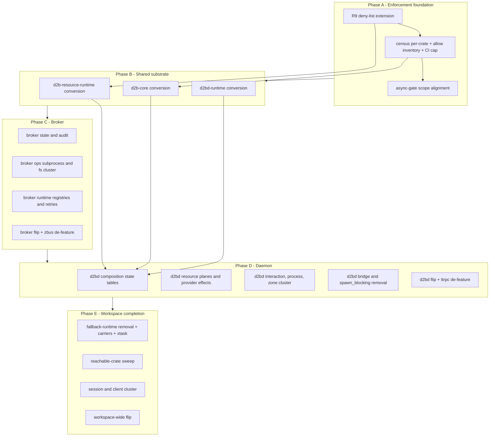

# Async Purity for the Daemon Control Plane - Plan

## Goal Capsule

- **Objective:** Eliminate every blocking call in the daemon control-plane crates (d2b-broker, d2bd, d2bd-runtime, and every crate reachable on their execution paths) under a hard ban, converting crate-by-crate and ending with `disallowed_methods` denied workspace-wide.
- **Product authority:** The U33 async-purity rule is the standing mandate; this plan operationalizes its full enforcement (currently held at `allow` by a 4,948-site backlog).
- **Open blockers:** None - all scope decisions settled in dialogue. Exception approvals rest with the user per R11.
- **Stop condition:** Workspace-wide `disallowed_methods` at `deny` with zero census hits, all gates green.

## Product Contract

### Summary

Convert the daemon control plane to fully async code: no blocking calls anywhere in the covered crates, no moving sync code to other crates, no exceptions without user-approved lint changes backed by research. Conversion proceeds crate-by-crate with each crate's `disallowed_methods` lint flipped to deny as it goes clean, ending with the workspace-wide flip.

### Problem Frame

The broker and daemon are not fully async, pervasively. Blocking call sites park tokio worker threads in production paths: `std::sync::Mutex::lock` field tables (1,594 sites), sync filesystem (`std::fs`, `std::io::Write`) in audit, ops, and sysfs handlers, `std::process::Command` shells, `nix` poll/connect syscalls, `std::thread::sleep` retry loops, and `block_on_future` bridges that convert async work back into sync calls (composition.rs, tpm_effect_port.rs, shared_provider_effects.rs). The current census: 4,948 distinct blocking-API sites (4,945 `disallowed_methods`) - 2,196 production, 2,752 test - led by broker (1,227), daemon (860), daemon runtime (470), xtask (458).

The rule already exists (U33) with a workspace-root clippy.toml deny-list, but `disallowed_methods` sits at `allow` until the backlog is converted. Three enforcement surfaces exist: two lints live at deny (`await_holding_lock`, `await_holding_refcell_ref`), and the lexical fails-closed async-gate scanner (`cargo xtask check-async-gate`) ships as a Layer-1 policy check awaiting enforcement-chain wiring (R12). The v3 ractor resource-runtime rewrite is async-end-to-end (all ResourceDriver/ResourceManager traits async), so the substrate supports full purity; blocking belongs only on dedicated bounded workers per the rewrite's store design.

The cost shape: every blocking call is a latent stall - a worker thread parked on a lock, a sysfs read, a child process wait - that can freeze daemon responsiveness under load or during recovery, and the current `allow` lint state cannot prevent regressions.

### Key Decisions

- **KD1. Hard ban, no standing exceptions** - (session-settled: user-directed - chosen over U33's existing carve-outs: the mandate is absolute; the sole exception path is R11). Governs R1-R6.
- **KD2. `spawn_blocking` banned outright** - (session-settled: user-directed - chosen over keeping it as an escape hatch for no-async-API dependencies: blocking-only work moves behind dedicated bounded worker threads, the loader_worker shape). Governs R3.
- **KD3. `parking_lot` banned, U33 carve-out removed** - (session-settled: user-directed - chosen over retaining the narrow short-lock allowance: no blocking locks of any kind). Governs R4.
- **KD4. Tests included in the ban** - (session-settled: user-directed - chosen over production-only enforcement: uniform rule, 2,752 test sites convert too). Governs R6.
- **KD5. Enforcement workspace-wide** - (session-settled: user-directed - chosen over daemon-closure-only deny: uniform rule, includes non-daemon crates such as xtask). Governs R7, R8.
- **KD6. Per-crate conversion with per-crate lint flips** - (session-settled: user-directed - chosen over pattern-class waves and substrate-first big-bang: CI stays green throughout). Governs R7.
- **KD7. Tool-enforced via the existing clippy/bazel gate** - (session-settled: user-directed - chosen over audit-only: regression-proof via `-Dwarnings` clippy in d2b_rust_rules). Governs R9.
- **KD8. Exceptions require a lint-change PR, user approval, and proof** - (session-settled: user-directed - chosen over allowlist/ledger mechanisms: no repo-visible carve-outs; proof = all other options exhausted plus online research demonstrating no alternative exists). Governs R11.
- **KD9. Source-level fails-closed policy check deferred** - (session-settled: user-directed - declined: the deny-list plus `await_holding_lock` are enforcement for now; the lexical-in-async-fn gap noted in clippy.toml stays open). Note: the lexical fails-closed scanner already exists (`cargo xtask check-async-gate`, Layer-1 policy, CI-wired via `make check-async-gate`); the deferral is about wiring it into the enforcement chain, not building it - R12 governs its alignment.

### Requirements

**Ban definition**

- R1. No blocking calls on async execution paths anywhere in the covered crates: d2b-broker, d2bd, d2bd-runtime, and every workspace crate reachable on their execution paths, including every crate under the workspace-wide deny (non-daemon crates such as xtask per KD5). No standing exceptions: the sole exception path is R11's user-approved lint-change PR. Moving blocking code or locks to crates outside the covered set is prohibited - relocation is not a compliance path.
- R2. Blocking syscalls and APIs are replaced by tokio-native adapters - `tokio::fs`, `tokio::process`, `tokio::net`, `tokio::time`, `tokio::io` - or by `AsyncFd` wrappers, or by lock-free/channel design. `tokio::sync` primitives are allowed.
- R3. `spawn_blocking` is banned outright. Work whose dependencies have no async API (rusqlite spec store, `nix::poll`) runs on dedicated bounded worker threads with channel boundaries, per the loader_worker shape.
- R4. `parking_lot` is banned; the U33 short-lock carve-out is removed. `std::sync` (`Mutex`, `RwLock`, `Condvar`, `mpsc`) is banned in the covered crates, with one enumerated allowance: the dedicated bounded-worker channel boundary (R3) - a blocking `sync_channel` recv on the worker's own thread with `tokio::sync::oneshot` replies - implemented as a named clippy.toml exemption entry per R9 and governed by R11.
- R5. Async-to-sync bridges (`block_on_future`, `runtime.block_on` mid-call-graph) are eliminated; callers become async end-to-end. Only the process entry point may drive the runtime.
- R6. The ban applies to test code as well as production code.

**Conversion and enforcement**

- R7. Conversion proceeds crate-by-crate. Each crate's `disallowed_methods` flips from `allow` to `deny` when its census reaches zero (production and test); the final state is `deny` workspace-wide.
- R8. The six carrier crates that do not inherit the workspace lint table - d2b-audit, d2b-broker, d2b-host-activation-helper, d2b-resource-compiler, d2b-sk-frontend, d2b-telemetry - carry the same deny levels, so the workspace-wide flip does not silently miss them.
- R9. The clippy.toml deny-list is extended with `parking_lot`, `spawn_blocking`, `block_on_future`, `tokio::runtime::Runtime::block_on`, `std::thread::JoinHandle::join`, and `tokio::task::block_in_place` entries, plus the named bounded-worker channel exemption (R4); the existing live denials (`await_holding_lock`, `await_holding_refcell_ref`) stay at deny.
- R10. The flip's enforcement gate is cargo clippy (`make check-clippy`, which applies the workspace lint table's levels); a crate's flip is not considered landed until it passes with the deny level. The bazel clippy gate cannot carry the deny-list today (d2b_rust_rules dropped `lint_config`; clippy.toml is unwired) - re-wiring bazel clippy to the manifest lint table is a prerequisite before it is claimed as enforcement.

**Exception gate**

- R11. An exception exists only as a PR that changes the lint itself (removes or narrows a deny-list entry) and is approved by the user. The PR must demonstrate that all other options were exhausted and include online research proving no alternative implementation exists; the research ships with the PR. The gate governs every suppression channel: each per-crate conversion inventories existing `#[allow]`/`#[expect]` suppressions of banned-API lints in covered crates, eliminates module-level blanket allows (replacing them with narrow per-site allows with reasons where a genuinely synchronous path remains), and every retained or new inline allow clears the same approval bar and stays visible to the census and gate.

**Conversion completeness**

- R12. The async-gate scanner (`cargo xtask check-async-gate`, Layer-1 policy) is included in each crate's flip gate list, and its `spawn_blocking` exemption is removed to align with KD2.
- R13. Test code conversion preserves assertion semantics: any test whose timing, ordering, or scheduling semantics must change (e.g., `std::thread::sleep` to `tokio::time`, mutex fairness) carries a written equivalence note in the crate's conversion PR, reviewed before the lint flips.
- R14. Every workspace crate inheriting the lint table - including non-daemon crates such as xtask - reaches zero census and flips to deny before the workspace-wide flip lands; these crates are folded into the per-crate conversion order.
- R15. The census runs in CI from day one with per-crate breakdown and a monotone cap: growth above the committed baseline for unconverted covered crates fails the gate, bounding drift during the conversion window.
- R16. Before the broker and d2bd crates flip, the zbus `blocking-api` and ttrpc `sync` feature flags are removed (or their blocking module paths added to the deny-list), verified in the flip's gate run.

### How This Work Fits Together

<!-- ce-section: work-relationships -->

This plan owns one area: async purity of the daemon control plane, converting the U33 backlog and flipping the lint to deny. The broader v3 control-plane work is the current understanding, not a committed roadmap.

- Depends on the ractor resource-runtime rewrite (docs/plans/2026-09-09-000-v3-ractor-resource-runtime-rewrite-spec.md) - shipped, async-end-to-end traits, bounded-worker store design.
- Sequencing contract with the provider-services broker seam plan (docs/plans/2026-09-14-001-refactor-provider-services-broker-seam-plan.md): broker units (U6-U8) land against the seam's landed state - post seam-U10/U11 for runtime.rs registries, post seam-U4 for the handler-task model; seam-U13 (gate over handler crates) is an explicit dependency of U16. Shared files (provider_crate_policy.rs, async_gate.rs, state_cells.rs, runtime.rs, envelope/mod.rs, forward_rendezvous.rs, composition.rs, provider_lifecycle.rs, d2bd-runtime unix_transport.rs) get an integration owner per file to prevent edit collisions; the seam's arm retirement rewrites dispatch bodies U8 also converts, so those land sequenced.
- Enables: flipping `disallowed_methods` to deny workspace-wide (U33 completion).
- Conversion order resolves to dependency-first (KTD1): enforcement tooling, then shared substrate, then broker, then daemon, then workspace completion.

### Key Flows

- F1. Per-crate conversion cycle
  - **Trigger:** A covered crate is selected for conversion.
  - **Steps:** Extend the clippy.toml deny-list per R9 (one-time, before the first crate's flip); census the crate's `disallowed_methods` sites (production and test); convert each site to a banned-API-free form per the clippy.toml replacement vocabulary (tokio adapters, `AsyncFd`, `tokio::sync`, bounded worker); re-census to zero; flip the crate's lint to deny; run the crate's clippy gate (`make check-clippy`) and the async gate (R12).
  - **Outcome:** Crate is clean and denied; CI stays green; next crate starts.
  - **Covers R7, R9, R10, R12.**
- F2. Exception request
  - **Trigger:** A conversion hits a site with no known async alternative.
  - **Steps:** Exhaust in-repo options (tokio adapters, `AsyncFd`, bounded worker, lock-free/channel redesign); conduct online research for an alternative; if none exists, open a PR that changes the lint itself with the research evidence; user approves.
  - **Outcome:** Exception live only after user approval; lint diff is the audit trail.
  - **Covers R11.**

### Acceptance Examples

- AE1. **Covers R7, R10.** When a crate's census reaches zero and its lint flips to deny, `make check-clippy` passes for that crate; flipping before zero fails the gate.
- AE2. **Covers R3.** When planning or conversion introduces rusqlite access, it appears only behind a dedicated bounded worker with a channel boundary - never `spawn_blocking` - in production or test code.
- AE3. **Covers R11.** When an exception is requested, the PR contains the research citations and exhaustion record; without them, the PR is rejected. After approval, the deny-list diff is the only place exceptions are visible.
- AE4. **Covers R8.** After the final workspace flip, clippy passes with zero `disallowed_methods` hits in all six carrier crates, not just crates inheriting the workspace table.
- AE5. **Covers R6.** Test code using `std::sync::Mutex::lock` or `spawn_blocking` fails the same lint as production code; test fakes must convert or carry an approved exception.

### Success Criteria

- SC1. Workspace-root `disallowed_methods` is `deny` with zero hits outside the sanctioned bounded-worker allowance (R4); `make check` and CI pass.
- SC2. The census tool shows 0 remaining sites in the covered crates (production and test combined), including the async-to-sync bridge class (R5) now covered by the extended deny-list (R9).
- SC3. Daemon and broker behavior is unchanged: existing test suites (v3 resource planes, forward rendezvous, provider lifecycle, broker ops) pass.
- SC4. No blocking call regressions land post-flip; the gate enforces the ban without exceptions beyond approved lint changes (R11).

### Scope Boundaries

**Deferred for later**

- Source-level fails-closed policy check for locks acquired lexically inside async fns - declined as a new build this round (KD9); the scanner already ships (`cargo xtask check-async-gate`) and its enforcement-chain wiring is tracked by R12.
- Performance tuning beyond purity: conversion targets the ban, not throughput or lock-contention optimization.

**Outside this plan's scope**

- Crates outside the workspace lint table that are not in the covered set (non-inheriting, non-daemon crates) - the workspace-wide deny may touch them per R8, but their behavior is not this plan's product surface.
- Dependency internals (tokio, ractor, rusqlite, zbus, ttrpc internal blocking) - the ban governs calls made by our crates, not library internals.
- The v3 ractor rewrite itself - shipped; this plan consumes its async-end-to-end contract and store-routing design.

### Dependencies / Assumptions

- clippy.toml deny-list already enumerates the blocking APIs and in-repo replacements; it is the conversion vocabulary (verified: 133-line file, per-entry reason + replacement).
- The v3 resource-runtime rewrite's async traits and bounded-worker spec-store design are the substrate; the store's dedicated blocking writer thread (bounded std `mpsc` channel + `tokio::sync::oneshot` replies) is the sanctioned store pattern. Note: the root Cargo.toml comment still says "all calls via spawn_blocking per KTD12" - stale versus KD2's ban; the shipped spec_store.rs/loader_worker.rs shapes are the actual pattern. d2b-resource-runtime is itself a covered crate (reachable from d2bd) shipping `parking_lot::Mutex` and `std::sync::mpsc` sites; its backlog is part of the conversion.
- The bazel clippy gate exists (changelog.d/feat-bazel-clippy-gate.md; bazel/checks/rust/d2b_rust_rules.bzl emits `rust_clippy_test` with `-Dwarnings`).
- Census tooling that produced the 4,948-site figure exists and can be re-run per crate; the Cargo.toml census comment (4948 total; 2196 production; 2752 test; Mutex::lock 1594) is the baseline.
- `tokio::sync` primitives are the sanctioned replacement for `std::sync` - user-confirmed.
- Assumption: `zbus` `blocking-api` and `ttrpc` `sync` features are unused in async paths once conversion lands; R16 makes their removal (or deny-listing) a flip-gating requirement.

### Outstanding Questions

**Resolve Before Planning**

- None - all scope decisions settled in dialogue.

**Deferred to Planning**

- All previously deferred items resolved during planning: conversion order (KTD1), worker-vs-tokio site classification (KTD2), carrier-crate deny mechanism (KTD5), census per-crate tooling (U2).

### Sources / Research

- clippy.toml - the deny-list and replacement vocabulary (locks, channels, fs, subprocess, sockets, `nix` syscalls; loader_worker shape; `parking_lot` carve-out now revoked by KD3).
- Cargo.toml - `[workspace.lints.clippy]` levels, census comment, carrier-crate list, ractor/rusqlite workspace deps.
- packages/d2b-broker/Cargo.toml - local lint overrides, zbus `blocking-api` feature.
- packages/d2bd/Cargo.toml - local lint overrides, parking_lot, ttrpc features.
- docs/adr/0035-efficiency-and-simplification-roadmap.md - six hard concurrency rules (no nested runtimes, subprocess waits owned work, state ownership over mutex contention, bounded-worker isolation shapes, static linting necessary-but-not-sufficient).
- docs/adr/0038-persistent-guest-shell-sessions.md - AsyncFd + pidfd readiness pattern.
- docs/plans/2026-09-09-000-v3-ractor-resource-runtime-rewrite-spec.md - async-end-to-end resource plane contract.
- docs/plans/2026-08-17-001-refactor-cargo-authoritative-bazel-check-graph-plan.md - cargo-authoritative check graph; `make check` is the bazel Layer-1 gate.
- changelog.d/feat-bazel-clippy-gate.md and bazel/checks/rust/d2b_rust_rules.bzl - CI enforcement surface.
- packages/xtask/src/blocking_census.rs - census CLI (workspace-only today; per-crate paths to add).
- packages/xtask/src/async_gate.rs - lexical async-gate scanner (roots exclude d2b-resource-runtime/d2b-core/d2bd-runtime; spawn_blocking exemption to remove).
- Makefile - `check-clippy` (cargo, workspace lints) and `check-async-gate` (bazel Layer-1) targets.
- Per-site blocking evidence in the covered crates: broker audit.rs, ops/*, runtime.rs, envelope/mod.rs, state_cells.rs; d2bd composition.rs, forward_rendezvous.rs, resource_plane_v3.rs, resource_runtime.rs, plane_port.rs, provider_effects.rs, process_provider_runtime.rs, interaction_composition.rs, shared_provider_effects.rs, tpm_effect_port.rs, credential_*_runtime.rs, provider_registry.rs, usbip_production.rs.

## Planning Contract

Product Contract preservation note: restructured, no scope change - the conversion-order, worker-classification, carrier-mechanism, and census-tooling questions moved from Outstanding Questions into KTD1, KTD2, KTD5, and U2. All R/KD/AE/F/SC IDs preserved.

### Key Technical Decisions

- **KTD1. Dependency-first conversion order** - (session-settled: user-approved - chosen over the brainstorm's broker-first starting point: consumers convert against stabilized dependency APIs instead of APIs that change under them). Brokered by enforcement tooling first (U1-U3), then shared substrate (U4, U5, U17 - d2b-resource-runtime, d2b-core, d2bd-runtime all before their consumers), then broker (U6-U9), then daemon (U10-U14), then workspace completion (U15, U18, U19, U16). Governs R7, R14.
- **KTD2. One reusable seat per class of blocking work; d2bd expects zero new seats** - worker allocation follows the loader_worker doctrine: one dedicated bounded worker per class of work, never thread-per-call. Shipped seats (loader_worker's load/probe seats, spec-store writer) are reused; genuinely blocking non-fd work classes get at most one new seat each. Site classification (PerfOracle pass) shows every listed d2bd `spawn_blocking` site has a tokio-native or AsyncFd form - d2bd converts with zero new seats; KTD2's seats exist only where no fd-ready or tokio form exists. Governs R3, R4.
- **KTD3. Sanctioned-worker exemption is a named entry, not a silent allow** - the R4 allowance lands as a clippy.toml exemption entry plus per-site inline `#[allow]` with the exemption's reason text where the worker recv loop lives; every such allow is inventoried by the census (R11) and fails the policy check if absent from the named list. Module-level blanket allows are removed everywhere. Governs R4, R11.
- **KTD4. Bridge elimination is deletion, not relocation** - `block_on_future`/`block_on_future_with` and the fallback runtime in d2bd-runtime are removed after their callers convert to async end-to-end; no sync shim survives anywhere in the covered crates. Only process entry points keep a runtime-driving `block_on`. Governs R5.
- **KTD5. Per-crate deny via local lint tables; workspace flip last** - each covered crate flips via its own Cargo.toml `[lints.clippy]` (carrier crates mirror the same levels in their local tables per R8); the workspace-root level flips to deny only when every lint-inheriting crate is clean. Bazel clippy re-wiring (R10 prerequisite) is tracked but not required for the cargo-gate flips. Governs R7, R8, R10.
- **KTD6. Async-gate roots grow to the covered set** - `check-async-gate`'s default scan roots are extended to include d2b-resource-runtime, d2b-core, and d2bd-runtime, and its `spawn_blocking` argument-body exemption is removed so the scanner agrees with KD2. Governs R12.

### High-Level Technical Design

The conversion is a phased sweep across the covered crate graph, enforcement-first. Each crate follows the F1 cycle; the phases sequence by dependency so consumers never convert against changing APIs.

Phases land as separate PRs; within a phase, units land as atomic commits. Each crate's flip (U9, U14, U15, U16) is its own PR containing the lint-level change, so the exception gate stays visible in diffs.

### Assumptions

- The 4,948-site census baseline is accurate enough to gate on per-crate relative counts; a crate is clean when its per-crate count is zero, independent of baseline drift elsewhere.
- The specified top-offender files and spawn_blocking sites are complete enough to start conversion; census re-runs surface stragglers, and the CI monotone cap (R15) catches new drift.
- Existing test fakes that are synchronous by construction (plain `#[test]` helpers using `std::sync` outside async contexts) are the intended survivors of the ban; they take the sanctioned inline allow with reason and appear in the inventory. Test code inside `#[tokio::test]` or async fns converts fully per R6.
- `forward_rendezvous.rs` and `protocol.rs` are already-canonical AsyncFd implementations; their remaining `std::sync::Mutex` tables and `std::fs` reads convert, but their AsyncFd cores stay as the pattern to copy.
- The R11 veto on blanket allows applies to module/dependency-surface `#![allow]` of banned-API lints; unrelated lint allows (e.g., dead_code) are out of scope.

### Implementation Constraints

- **Bounded channels only:** no `tokio::sync::mpsc::unbounded_channel` in covered crates. Every converted channel names its bound and its full-queue policy - drop-with-accounting, refusal, or bounded await - before it lands (PerfOracle pass).
- **Admission refusal is SC3 behavior:** per-seat refusal semantics (spec-store WriterGone/Busy, loader Busy, rendezvous ConnSemaphore) are behavior contracts, not incidental errors. R13 equivalence notes are required wherever a tokio-lock conversion changes admission timing.
- **No double reap:** ops converted to `tokio::process` never register children in the pidfd/SIGCHLD reap path, or exit status is consumed twice.

### System-Wide Impact

- **Public surfaces that survive unchanged:** envelope types (consumed by the broker-composition seam and fixture handler crates), d2b-resource-runtime traits (consumed by 55 provider crates), d2b-audit `AuditSink` (consumed by session crates), the ttrpc async wire surface (shared with guests). Session/provider crates do not import broker or d2bd-runtime; their control-plane surface is d2b-audit + d2b-telemetry + resource-runtime + wire contracts - the impact enumeration above covers those. Wire contracts and trait signatures are frozen by the conversion; only the inside of each call path changes.
- **Sequencing across the covered graph:** d2bd and its consumers convert only after their substrate (d2b-resource-runtime, d2b-core, d2bd-runtime) lands clean per KTD1. The broker-seam plan's shared-file matrix and integration owners are listed in How This Work Fits Together; seam-U13 is a dependency of U16.
- **Failure propagation:** audit, envelope, and state-cell durability invariants (worker-owned append transaction, publish-as-one-atomic-unit, mandatory fail-closed poison) are pinned in U6; authorize-then-effect critical sections for TPM/credential/usbip are pinned in U11; zbus per-call identity gate in U9. These are security controls - SC1-SC4 cannot pass without their invariant tests.
- **Data lifecycle:** audit events keep ordering and prefix durability with per-record fsync barrier; trusted context keeps tmp+rename+sync_all atomicity and monotonic commit ordering; spec store keeps single-writer exclusivity with a corrected Busy-vs-WriterGone taxonomy. No data migration or schema change is involved - this is a control-plane refactor, not a data migration.
- **Shared enforcement tooling:** the census, policy check, and async gate are consumed repo-wide; every crate's flip depends on their correctness (census measures the same predicate as the lint per U2).
- **Operational posture:** daemon and broker binaries keep identical CLI and runtime behavior (SC3); the only observable changes are under degradation (refusals instead of stalls) and are declared in Risks & Dependencies.

### Risks & Dependencies

- **Worker-seat saturation changes degradation shape (SC3 contract).** Per-seat refusal semantics - spec-store Busy, loader Busy/Unavailable, rendezvous ConnSemaphore - are fail-closed admission today. KTD2's conversion keeps caps as the sole refusal points (U13 effect admission, U4 spec-store taxonomy); a tokio-lock conversion that turns saturation into FIFO latency would silently move ops from refused to stalled. Every site where admission timing changes files an R13 equivalence note. Mitigation: U13's zero-new-seats classification, U4's Busy-vs-WriterGone fix, capacity accounting in U10/U15 for newly routed work classes.
- **tokio::fs relocates the stall class the plan exists to remove.** `tokio::fs` runs syscalls on tokio's shared blocking pool (default max 512 threads), which the lint cannot see. Short stats (sysfs reads in media/security_key/tap, audit writes) add negligible pressure; long ops (`sync_all`, `remove_dir_all`, wedged fs) become the pool's saturation point. Mitigation: U6 picks the dedicated bounded audit worker (mirroring spec_store) rather than per-call tokio::fs for audit; U7 keeps long-op classes off per-call tokio::fs; the deferred stall baseline (Open Questions) is promoted to a named risk that must sample blocking-pool occupancy and max poll-delay pre-conversion and at U16 - without it, SC3's stall premise stays unverified.
- **Cross-plan sequencing with the broker-seam plan.** Both plans edit shared files (listed in How This Work Fits Together). Landing broker units against pre-seam state would rework them twice. Mitigation: the sequencing contract pins broker units (U6-U8) post seam-U10/U11 and post seam-U4; integration owner per shared file; seam-U13 gates U16.
- **Shipped substrate converted under consumers.** d2b-resource-runtime and d2bd-runtime are already shipped and consumed. A signature or behavior drift breaks the previously-flipped d2bd at U10-U14. Mitigation: U17 lands before U10 with the exported helper surface frozen; d2bd builds against the converted surface as the U17 verification gate.
- **Audit/envelope/state-cell invariant regressions.** Async conversion can silently reorder audit events, tear envelope state, or double-grant cell claims. Mitigation: U6's invariant block (worker-owned append transaction, publish-as-one-atomic-unit, mandatory fail-closed poison) with dedicated invariant tests gating the broker flip.
- **Authorize-then-effect splits.** Releasing a lock before an awaited effect re-creates double-mint/double-lease races in TPM, credential, and usbip paths. Mitigation: U11's serialized-critical-section invariant with exactly-one-winner concurrency tests.
- **Dependency-blocking risk: none.** The tokio/ractor/rusqlite stack is settled; no new external dependencies are introduced by this plan.
- **Dependency: broker-seam plan (docs/plans/2026-09-14-001-refactor-provider-services-broker-seam-plan.md)** - its U4 handler-task model, U10/U11 registry work, and U13 handler-crate gate sequence into U6-U8 and U16 per the contract above.

## Implementation Units

### Unit Index

| U-ID | Title | Files touched (primary) | Depends on |
|------|-------|-------------------------|------------|
| U1 | Deny-list extension (R9) | clippy.toml | - |
| U2 | Census per-crate, allow inventory, CI cap (R11, R15) | packages/xtask/src/blocking_census.rs, packages/xtask/src/provider_crate_policy.rs, .github/workflows, Makefile | U1 |
| U3 | Async-gate scope alignment (R12) | packages/xtask/src/async_gate.rs | U1 |
| U4 | d2b-resource-runtime conversion | packages/d2b-resource-runtime/src/{watch,target,guest_target,resource,spec_store}.rs | U1, U2 |
| U5 | d2b-core conversion | packages/d2b-core/src/{loader_worker,bundle_resolver,manifest_v04}.rs | U1, U2 |
| U17 | d2bd-runtime conversion | packages/d2bd-runtime/src/*.rs, Cargo.toml | U4, U5 |
| U6 | Broker state and audit conversion | packages/d2b-broker/src/{audit,state_cells}.rs, envelope/mod.rs | U3 |
| U7 | Broker ops subprocess and fs cluster | packages/d2b-broker/src/ops/*.rs | U3 |
| U8 | Broker runtime registries and retries | packages/d2b-broker/src/{runtime,kernel_ops,live_handlers}.rs | U3 |
| U9 | Broker flip + zbus de-feature | packages/d2b-broker/Cargo.toml | U6-U8 |
| U10 | d2bd composition state tables | packages/d2bd/src/composition.rs, forward_rendezvous.rs | U4, U5, U17 |
| U11 | d2bd resource planes and provider effects | packages/d2bd/src/{resource_plane_v3,resource_runtime,plane_port,provider_effects,provider_registry,provider_lifecycle,shared_provider_effects,usbip_production,tpm_effect_port,credential_backend_runtime,credential_resource_runtime}.rs | U10 |
| U12 | d2bd interaction, process, zone cluster | packages/d2bd/src/{interaction_composition,process_provider_runtime,zone_enrollment,guest_effects,effect_service_actors,main}.rs | U10 |
| U13 | d2bd bridge and spawn_blocking removal | packages/d2bd/src/{composition,shared_provider_effects,tpm_effect_port,process_provider_runtime,interaction_composition,zone_enrollment,plane_port,resource_plane_v3}.rs, packages/xtask/src/async_gate.rs | U12 |
| U14 | d2bd flip + ttrpc de-feature | packages/d2bd/Cargo.toml | U10-U13 |
| U15 | Fallback-runtime removal, carriers, xtask | packages/d2bd-runtime/src/runtime_util.rs, packages/{d2b-audit,d2b-host-activation-helper,d2b-resource-compiler,d2b-sk-frontend,d2b-telemetry}/src, packages/xtask/src | U14, U17 |
| U18 | Reachable-crate sweep (host, bus, providers) | packages/{d2b-host,d2b-bus,d2b-provider-*,d2b-unsafe-local-helper,d2b-process-conformance}/src | U4 |
| U19 | Session and client cluster | packages/{d2b-session,d2b-session-unix,d2b-resource-client,d2b-resource-api,d2b-zone-routing}/src | U15 |
| U16 | Workspace-wide flip + final verification | Cargo.toml, package Cargo.tomls | U9, U14, U15, U18, U19 |

### U1. Extend the deny-list

- **Goal:** Arm the R9 entries so the ban covers every banned class at the lint level.
- **Requirements:** R4, R9.
- **Dependencies:** None.
- **Files:** clippy.toml.
- **Approach:**
  1. Add entries for `parking_lot::Mutex::lock`/`RwLock::{read,write}`, `tokio::task::spawn_blocking`, `block_on_future` and `block_on_future_with`, `tokio::runtime::Runtime::block_on`, `Handle::block_on`, `tokio::task::block_in_place`, `std::thread::JoinHandle::join`, and `std::sync::mpsc::Sender::send`.
  2. Add the named R4 exemption entry documenting the sanctioned bounded-worker channel boundary (`sync_channel` recv on the worker's own thread, `tokio::sync::oneshot` replies) and its inline-allow reason text.
  3. Remove the stale `parking_lot` carve-out wording and the "spawn_blocking per KTD12" phrasing from entry reasons.
- **Patterns to follow:** Existing clippy.toml entry shape: `{ path, reason, replacement }` with in-repo replacement names (loader_worker, AsyncFd, tokio::sync).
- **Test scenarios:**
  1. A scratch crate containing each newly-banned call produces the deny-list diagnostic under `cargo clippy` when its lint level is deny.
  2. A `sync_channel` recv inside a worker-thread closure carrying the sanctioned inline allow produces no diagnostic.
- **Verification:** `cargo xtask blocking-census` counts the new entries; fixture crates in xtask tests assert the diagnostics.

### U2. Census per-crate, allow inventory, CI cap

- **Goal:** Make the census runnable per crate, inventory every suppression, bound drift in CI, and fix the meter so it measures the same predicate the lint enforces.
- **Requirements:** R11, R15.
- **Dependencies:** U1.
- **Files:** packages/xtask/src/blocking_census.rs, packages/xtask/src/provider_crate_policy.rs, packages/xtask/src/main.rs, Makefile, .github/workflows (CI definitions).
- **Approach:**
  1. Add per-crate path arguments to the census CLI; keep workspace-wide as the default.
  2. Fix the meter-vs-lint divergence: match the full configured path text (`std::fs::read_to_string`), not just the last tail segments, so tokio-replacement lines (`tokio::fs::read_to_string`) never count; add a clippy-derived or AST-backed count for instance-method calls (`.lock()`, `.recv()`) that tail-matching cannot see; re-baseline the census figure against the fixed meter.
  3. Extend the census to report `#[allow]`/`#[expect]` suppressions of banned-API lints per crate, splitting module-level blanket allows from per-site allows.
  4. Implement the allow-tracking list in provider_crate_policy (the clippy.toml header claims it exists; it does not yet) so a sanctioned inline allow not on the named list fails the policy check.
  5. Wire the census into CI with the committed per-crate baseline and a monotone cap: any covered crate above its baseline fails the gate.
  6. Add a Makefile target for the per-crate census.
- **Patterns to follow:** blocking_census.rs's existing prod/test split (cfg test + tests/ + integration/ + benches/); Makefile target shape of `check-clippy`.
- **Test scenarios:**
  1. `cargo xtask blocking-census packages/d2b-broker` returns only broker counts; workspace invocation still returns totals.
  2. A converted file containing `tokio::fs::read_to_string` counts zero for the `std::fs` entry, while a file with `std::fs::read_to_string` counts one.
  3. A test file with a documented dangling inline allow fails the policy check (allow absent from the named list).
  4. A module-level `#![allow(clippy::disallowed_methods)]` is reported as a blanket allow and fails the policy check.
  5. CI job fails when a covered crate's count exceeds its committed baseline; passes at or below it.
- **Verification:** Per-crate census output matches file clusters; census-zero is reachable for a fully-converted crate (no tail-matching false positives); allow inventory enumerates the sanctioned worker allows; CI gate fails on injected drift.

### U3. Async-gate scope alignment

- **Goal:** The lexical fails-closed scanner covers every covered crate; the `spawn_blocking` exemption removal moves to U13 so CI stays green per-crate.
- **Requirements:** R12.
- **Dependencies:** U1.
- **Files:** packages/xtask/src/async_gate.rs, packages/xtask/src/main.rs.
- **Approach:**
  1. Extend DEFAULT_CRATE_ROOTS with packages/d2b-resource-runtime, packages/d2b-core, packages/d2bd-runtime.
  2. Do NOT remove the `spawn_blocking` argument-body exemption here: live `spawn_blocking` sites remain until U13 (plane_port, resource_plane_v3, composition, zone_enrollment, interaction_composition), and removing the exemption earlier would make the CI-wired gate red across phases B-D. The exemption removal lands in U13's PR, the same PR that converts the last sites, gated per-crate per R12.
  3. Update async_gate fixture tests for the extended roots; keep the exemption fixture until U13 removes it.
- **Patterns to follow:** async_gate.rs's existing lexical scan and fixture unit tests.
- **Test scenarios:**
  1. A denied API call inside an async fn in d2b-resource-runtime is flagged by `cargo xtask check-async-gate packages/d2b-resource-runtime`.
  2. Sanctioned worker recv loops (R4) are not flagged when scanned (worker-thread bodies are not async contexts).
  3. A `spawn_blocking` body is still exempt at this stage (fixture preserved for U13's removal).
- **Verification:** Scan roots fixture lists updated to the covered set; `make check-async-gate` passes on the unchanged tree.

### U4. d2b-resource-runtime conversion

- **Goal:** Eliminate the crate's `parking_lot`/`std::sync` sites; its async-end-to-end resource-plane contract stays intact.
- **Requirements:** R1-R6, R13.
- **Dependencies:** U1, U2.
- **Files:** packages/d2b-resource-runtime/src/watch.rs, target.rs, guest_target.rs, resource.rs, spec_store.rs, metadata.rs (tests), plus tests under packages/d2b-resource-runtime/tests.
- **Approach:**
  1. Convert `parking_lot::Mutex` fields in watch/target/guest_target/resource to `tokio::sync` equivalents or single-owner values (per KTD2, prefer ownership over locking where the field has one writer).
  2. Fix the spec-store failure taxonomy: distinguish `TrySendError::Full` from `Disconnected` - today both collapse into `SpecStoreError::WriterGone`, so a full 256-slot queue presents as phantom writer death. Add a Busy/backpressure variant for Full, keep WriterGone terminal for Disconnected, and state per-caller handling (which resource-plane callers retry vs surface). Add a deadline to the oneshot reply await (or document the unbounded wait explicitly against the loader_worker refuse-don't-queue doctrine).
  3. Verify the spec-store writer thread (bounded std mpsc + tokio oneshot) is the R4 sanctioned shape; add the sanctioned inline allow with reason if the recv site trips the deny-list.
  4. Convert test-code `std::sync::Mutex` where tests assert async behavior; keep synchronous-by-construction test helpers with the sanctioned allow per the assumption.
  5. Remove the stale "spawn_blocking per KTD12" commentary if it lives in this crate's docs.
- **Patterns to follow:** d2bd guest_effects.rs `Arc<tokio::sync::Mutex<...>>` for async-shared state; resource_runtime.rs `Arc<tokio::sync::Mutex<()>>` for lock-as-guard.
- **Test scenarios:**
  1. Resource plane registries survive concurrent get/ensure under `#[tokio::test]` with tokio locks (existing plane tests re-run).
  2. Spec-store round-trip (open, write, read, migrate) passes through the writer thread unchanged.
  3. Spec-store saturation: injected queue-full returns the Busy variant, not WriterGone; a killed writer returns WriterGone (terminal).
  4. Any test whose timing semantics change carries the R13 equivalence note in the PR.
- **Verification:** Per-crate census zero for d2b-resource-runtime (prod + test); full crate test suite green; spec-store failure taxonomy covered by new tests.

### U5. d2b-core conversion

- **Goal:** Confirm loader_worker.rs is canonically compliant; convert the crate's remaining production sites; add sanctioned allows where worker recv loops hit the banned list.
- **Requirements:** R4.
- **Dependencies:** U1, U2.
- **Files:** packages/d2b-core/src/loader_worker.rs, bundle_resolver.rs, manifest_v04.rs, plus tests.
- **Approach:**
  1. Add the sanctioned R4 inline allow with reason to the two worker recv loops (LOAD_WORKER, PROBE_WORKER) if the deny-list flags them.
  2. Convert the crate's remaining production fs sites (`bundle_resolver.rs:915,977`, `manifest_v04.rs:57` std::fs) to `tokio::fs` or a seat.
  3. Verify try_send refusal semantics and the oneshot reply pattern remain untouched.
- **Patterns to follow:** loader_worker.rs itself - the canonical two-seat bounded worker.
- **Test scenarios:**
  1. Loader accepts and executes a job through the bounded queue; busy refusal returns Busy without blocking the caller.
  2. Bundle resolver and manifest reads work over tokio::fs.
  3. Census reports the two sanctioned allows on the named list.
- **Verification:** Per-crate census clean for all of d2b-core; loader_worker and bundle tests green.

### U17. d2bd-runtime conversion

- **Goal:** Convert d2bd-runtime (a daemon dependency) before d2bd, per KTD1, so d2bd's flipped crate never breaks on a changing dependency surface.
- **Requirements:** R1-R6, R13.
- **Dependencies:** U4, U5.
- **Files:** packages/d2bd-runtime/src/runtime_util.rs, concurrency.rs, daemon_audit.rs, console_session.rs, guest_mode.rs, exec_session.rs, metrics.rs, admission.rs, autostart.rs, readiness.rs, resource_runtime_support.rs, authority_persistence.rs, packages/d2bd-runtime/Cargo.toml, plus tests.
- **Approach:**
  1. Convert the crate's census sites: artificial sync bridges in daemon_audit.rs (sync channel + blocking recv audit reply - an R5 bridge that becomes an async audit request/reply), console_session Mutex ring, parking_lot in concurrency.rs, `std::process::Command` in readiness.rs, and the remaining Mutex state (guest_mode, exec_session, metrics, admission, autostart, authority_persistence).
  2. Keep the exported helper signatures d2bd imports (broker_transport, json_io, public_projection, unix_transport, wire_response_helpers, readiness, zone_authority) semantically stable across the conversion - this unit lands before U10-U14 so d2bd converts against final forms.
  3. Remove the `ttrpc` `sync` feature from this crate's Cargo.toml (only `ttrpc::r#async` is used) as part of the R16 sweep; the `block_on_future` deletion itself stays in U15 (callers must be gone first).
  4. Convert test-code Mutex/sync sites per the assumption.
- **Patterns to follow:** d2bd guest_effects tokio::sync state; spec_store dedicated-writer shape for daemon_audit.
- **Test scenarios:**
  1. Audit reply round-trip works over the async request/reply channel with identical semantics (order preserved).
  2. Console session ring survives concurrent attach/detach under `#[tokio::test]`.
  3. Readiness probe reports the same state via tokio::process.
  4. d2bd still compiles against the converted helpers with no signature drift (compile-time integration check).
- **Verification:** d2bd-runtime census zero; crate tests green; d2bd builds against converted surface before U10 starts.

### U6. Broker state and audit conversion

- **Goal:** Convert broker lock-held state and audit persistence to async-safe forms without weakening the durability, ordering, and fail-closed invariants they encode.
- **Requirements:** R1-R6, R9, R13.
- **Dependencies:** U3.
- **Files:** packages/d2b-broker/src/audit.rs, state_cells.rs, envelope/mod.rs, packages/d2b-broker/tests.
- **Approach:**
  1. Convert audit appender state (`DailyAppender`, `AuditWriteLimiter`, `AuditDropSummary`, `AuditDropWarningState`) and sync fs writes to a **worker-owned append transaction**: the audit worker owns limiter-check, drop-accounting, write, fsync, rollback/poison, and rotation+prune as one serialized FIFO unit. A caller future dropped/cancelled mid-append must not leak a partial JSONL line - the worker owns the append to completion. Per-record durability barrier preserved: a record is fsynced before the next write starts (crash preserves a prefix).
  2. Convert `CellStore.records` and `BROKER_STORE` to tokio sync or a single-owner task with **mandatory fail-closed poison semantics**: a latched poison flag (set by panic inside a mutation critical section) makes `consume`/`complete` refuse with the Poisoned error - the one-time claim must never grant twice after a corrupted store. Read-only ops may stay fail-open. The `persist_locked`-under-lock one-time claim (durable before Granted returns) survives as one atomic unit.
  3. Convert `TrustedContextStore.state`/`TRUSTED_CONTEXT_STORE` persistence with **publish-as-one-atomic-unit**: monotonic check + in-memory commit + durable persist (tmp+fsync+rename+dir-fsync) under one serialized unit (tokio Mutex guard held across the persist await, or a single-writer channel where channel order = commit order); concurrent publishes must never durably regress a newer state with a stale one; the open() epoch-bump-persist-before-usable startup barrier survives.
  4. Convert test Mutex fakes per the assumption (sync helpers get the sanctioned allow; async-context tests convert).
- **Patterns to follow:** d2bd guest_effects tokio::sync state; spec_store writer-thread shape for audit/state persistence that must serialize.
- **Test scenarios:**
  1. Audit events append in order and survive daemon restart with no event loss; crash-injection between records yields a durable prefix only.
  2. Caller cancelled mid-append: no partial line, worker continues or poisons.
  3. Envelope concurrent publish of newer + stale revisions: durable file never regresses; stale-freshness refusal still fires when interleaved.
  4. Panic-injected CellStore mutation: subsequent `consume` refuses Poisoned, never Granted/Reconciled.
  5. Drop-summary accounting still matches dropped-vs-written counts under rate limiting.
  6. R13 equivalence note filed for any scheduling/timing-sensitive audit test.
- **Verification:** Broker audit/state/envelope cluster census zero; audit + envelope + cellstore tests green; new invariant tests (prefix durability, cancel, concurrent publish, poison refusal) pass.

### U7. Broker ops subprocess and fs cluster

- **Goal:** Convert the ops/* subprocess, filesystem, and sleep sites to tokio-native forms.
- **Requirements:** R1-R6, R9, R13.
- **Dependencies:** U3.
- **Files:** packages/d2b-broker/src/ops/disk_init.rs, exec_reconcile.rs, network.rs, nft.rs, sysctl.rs, store_sync.rs, route.rs, security_key.rs, media.rs, tap.rs, swtpm_dir.rs, host_generation_handoff.rs, packages/d2b-broker/tests.
- **Approach:**
  1. Replace `std::process::Command` invocations (nft, ip, usbip, ssh-keygen, modprobe, systemctl, helper binaries) with `tokio::process`, preserving exit-code and output handlings; where a command is invoked from a genuinely sync context, route the call through a worker seat (KTD2) rather than keeping a sync call site.
  2. Replace `std::fs` reads/writes/syncs with `tokio::fs`; file-lock sites (`Flock`, `ProjectionLock`, `acquire_sync_lock`, HANDOFF_LOCK) move to async-exclusive ownership or a dedicated worker holding the fd.
  3. Replace `std::thread::sleep` retry/spin loops with the broker's canonical async retry shape (deadline + `tokio::time::sleep`).
  4. Preserve readback-drift checks (sysctl) and atomic temp-write patterns (route, network) exactly; only the I/O mechanism changes.
  5. Guard against double reap: ops converted to `tokio::process` never register children in the pidfd/SIGCHLD reap path, or exit status is consumed twice - process ownership stays with exactly one reaper.
- **Patterns to follow:** broker live_handlers.rs `spawn_obs_vsock_acl_retry` async retry loop; protocol.rs AsyncFd for fd-wrapped syscalls; tokio::process for subprocess waits.
- **Test scenarios:**
  1. Each converted command site returns the same exit code and output as before (existing fake-backed tests plus one real-binary integration where feasible).
  2. File-lock sites still exclude concurrent writers across two processes (disk_init flock test).
  3. Retry loops respect deadlines and stop conditions under injected delay.
  4. sysctl readback-drift check still detects external drift after conversion.
- **Verification:** ops cluster census zero; broker ops tests green.

### U8. Broker runtime registries and retries

- **Goal:** Convert broker runtime state tables, /proc and sysfs probes, and remaining sync retries.
- **Requirements:** R1-R6, R9, R13.
- **Dependencies:** U3.
- **Files:** packages/d2b-broker/src/runtime.rs, kernel_ops.rs, live_handlers.rs, packages/d2b-broker/tests.
- **Approach:**
  1. Declare the execution-model transition as a precondition: broker request handlers currently run synchronously on DispatchPool threads (`blocking_recv` workers) and call CellStore/audit/child_reap_buffer from sync contexts. Before lock conversions land, in-broker handlers become async tasks (the seam plan's handler-task model; `DispatchFuture` already exists in envelope). Sync-context callers are sequenced onto the task model first, so no surviving sync caller needs a banned `block_in_place` to reach tokio locks.
  2. Convert `ipc_rate_limiter`, `controller_bootstrap_registry`, `runner_metadata_registry`, `child_reap_buffer`, `BROKER_BACKGROUND`, `LIVE_OPERATION_ENVELOPE`, and USB audit HMAC mutexes to tokio sync or task-owned state; convert OnceLock static registries to async-safe initialization. `child_reap_buffer`'s sanctioned shape for sync readers is a channel + `try_recv`, or the R4 named-exemption entry - never a surviving std Mutex (KD1).
  3. Replace `/proc` and sysfs reads (`kernel_ops`, `live_handlers`) with `tokio::fs`; pipewire/wayland probes (`pw_dump`, `wpctl`) go to `tokio::process` or a worker.
  4. Convert `std::thread::spawn`+sleep retry (spawn_component_session_vsock_acl_retry, live_handlers L2352) to the canonical async retry.
  5. DispatchPool threads are dedicated workers per KTD2; verify their channel boundaries are tokio channels and no nested runtime blocking remains (ADR 0035 rule: no fresh Runtime in blocking contexts).
- **Patterns to follow:** canonical async retry (live_handlers spawn_obs_vsock_acl_retry); AsyncFd where fd readiness applies.
- **Test scenarios:**
  1. `child_reap_buffer` concurrency test passes with the new synchronization; reap ordering unchanged.
  2. Component-session vsock ACL retry respects deadline and stops on success (existing test converted to async).
  3. PipeWire/wayland probe timeout behaves identically under tokio::process timeout.
  4. DispatchPool still bounds in-flight work under load (reserved concurrent dispatch test).
- **Verification:** runtime cluster census zero; broker runtime tests green.

### U9. Broker flip + zbus de-feature

- **Goal:** Land broker at deny and remove the zbus blocking surface.
- **Requirements:** R7, R10, R16.
- **Dependencies:** U6-U8.
- **Files:** packages/d2b-broker/Cargo.toml, packages/d2b-broker-composition/Cargo.toml (if it inherits/overrides lints or zbus), any call sites of `zbus::blocking`.
- **Approach:**
  1. Remove `zbus` `blocking-api` feature and convert remaining `zbus::blocking` call sites (ops/systemd) to the async zbus API.
  2. Preserve the per-call identity gate, not just the API shape: the connection is built per-request only after the ownership pre-check (runtime-dir exists, bus socket owned by the target uid) runs immediately before connect; no connection reuse across intents or uid domains; the 5s method timeout survives on the async proxy.
  3. Remove the broker Cargo.toml local `disallowed_methods = "allow"`; flip to `deny`.
  4. Run the F1 gate: per-crate census zero, `make check-clippy`, `make check-async-gate`.
  5. File the R13 equivalence notes accumulated during U6-U8 in this PR.
- **Patterns to follow:** The dependency-surface allow removal precedent (dependency_surface.rs blanket allow eliminated per R11).
- **Test scenarios:**
  1. `make check-clippy` fails if any broker site regresses to a banned API.
  2. systemd D-Bus operations (unit start/stop/enable) pass through async zbus with identical results.
  3. Two intents with different uids get separate connections; the ownership re-check runs per call (no cached-channel shortcut).
- **Verification:** Broker census zero, deny live, cargo + async gates green; broker binary smoke-starts.

### U10. d2bd composition state tables

- **Goal:** Unify d2bd shared state to tokio sync; convert rendezvous tables.
- **Requirements:** R1-R6, R9, R13.
- **Dependencies:** U4, U5.
- **Files:** packages/d2bd/src/composition.rs, forward_rendezvous.rs, packages/d2bd/tests.
- **Approach:**
  1. Convert DaemonFields std `Mutex` fields (resource_plane, interaction_listeners, zone_coordinator, config_staging, console_sessions) and `parking_lot` fields (security_key_sessions, v3_planes) to `tokio::sync` equivalents; audit each lock's critical section for awaits and prefer ownership where a field has one writer.
  2. Convert ZoneLinkGatewayComposition's Mutex field group (controller, route_engine, gateway_session, route_admission_authority, gateway_guest, last_gateway_guest, reconnect_generation) the same way.
  3. Convert forward_rendezvous `zones`/`chain_audit` tables and its `std::fs::read_dir("/proc/self/task")` probe; keep the AsyncFd + Semaphore core untouched.
  4. Convert the owner Hook static and PeerOverrideEnv/buffer test helper Mutexes per the assumption.
- **Patterns to follow:** composition.rs's own tokio::sync fields (interaction_runtime, guest_component_sessions) as the in-file precedent; guest_effects tokio state.
- **Test scenarios:**
  1. Composition server-state tests pass with tokio locks; behavior-equivalence note per R13 where lock semantics differ (poisoning dropped).
  2. Rendezvous zones/chain-audit tables serialize concurrent registration correctly under `#[tokio::test]`.
  3. Gateway composition reconnect/last-guest behavior unchanged.
- **Verification:** composition/rendezvous cluster census zero; composition tests green.

### U11. d2bd resource planes and provider effects

- **Goal:** Convert plane registries, provider effect state, and lifecycle tables to async-safe forms.
- **Requirements:** R1-R6, R9, R13.
- **Dependencies:** U10.
- **Files:** packages/d2bd/src/resource_plane_v3.rs, resource_runtime.rs, plane_port.rs, provider_effects.rs, provider_registry.rs, provider_lifecycle.rs, shared_provider_effects.rs, usbip_production.rs, tpm_effect_port.rs, credential_backend_runtime.rs, credential_resource_runtime.rs, packages/d2bd/tests.
- **Approach:**
  1. Convert `PlaneResourceRegistry.inner`, plane slots, policy slots, and probe maps (`parking_lot`) to tokio sync or plane-owned state; keep the existing tokio `controller_session_lock` pattern.
  2. Convert `plane_port` ledger, `provider_effects` mutations (including the persist-while-locked site - split lock scope so persistence happens outside the lock), `provider_registry` RwLocks, `provider_lifecycle` directory/refusal/drain_order tables.
  3. Convert usbip ledger, tpm lifecycle admission/lease mutexes, credential session maps; the credential fake already models the correct async shape - extend that shape to production sites.
  4. **Preserve authorize-then-effect critical sections across the async boundary.** Each of these is a check-mutate-effect unit that must stay one serialized critical section: TPM lifecycle admission (lease mints/consumes exactly once under contention), credential generation-check + table-mutate + revoke-select (generation-matched session picked under lock), usbip owner-check-or-conflict + token-mint (never two leases for one key). Conversion holds a `tokio::sync::Mutex` guard across the await (never release-then-reacquire) or uses single-writer ordering; fail-closed error codes (Transient/Conflict/Revocation/Uncertain) unchanged.
  5. Convert test fakes per the assumption; note R13 equivalence where async acquisition changes test timing.
- **Patterns to follow:** credential_resource_runtime FakeCredentialDriver (tokio Mutex + Notify); resource_runtime tokio lock-as-guard fields.
- **Test scenarios:**
  1. Plane registry get/ensure/watch under concurrent `#[tokio::test]` calls is serialized correctly.
  2. Lifecycle mutation dispatch persists state outside any held lock (no lock-across-fs).
  3. TPM admission lease semantics unchanged; concurrent effect passes yield exactly one lease winner.
  4. Credential generation overwrite: concurrent register/remove never leaves a generation mismatch; revoke selects the generation-matched session.
  5. Usbip: concurrent reserve for the same key yields exactly one winner; conflict error unchanged.
  6. Provider lifecycle drain order preserved at shutdown.
- **Verification:** plane/effects cluster census zero; plane + provider tests green.

### U12. d2bd interaction, process, zone cluster

- **Goal:** Convert interaction listeners, process-provider runtime, and zone enrollment plumbing.
- **Requirements:** R1-R6, R9, R13.
- **Dependencies:** U10.
- **Files:** packages/d2bd/src/interaction_composition.rs, process_provider_runtime.rs, zone_enrollment.rs, guest_effects.rs, effect_service_actors.rs, main.rs, packages/d2bd/tests.
- **Approach:**
  1. Convert InteractionNotificationLifecycleBackend state/port Mutexes and InteractionListenerSet thread/handler tables to tokio sync; route listener registration through the async reactor instead of raw std threads where feasible (KTD2: one seat).
  2. Convert process_provider_runtime managed maps/controller tables and the sync `classify` bridge; the `nix::poll` bootstrap endpoint moves to a worker seat per KTD2 if no async adapter suffices.
  3. Convert zone_enrollment server Mutex and its spawn_blocking listener helpers.
  4. Convert `std::thread::sleep` interaction retries to async; keep guest_effects tokio state as-is (verify only).
  5. main.rs's CLI-only `std::fs::read_to_string` principal preflight takes the sanctioned synchronous-path allow per R11 (CLI-only, pre-async-runtime); all other main.rs sites convert.
- **Patterns to follow:** process_provider_runtime's spawn_blocking wrapper for the poll waits (moving to seat-based worker); credential fake Notify pattern for wakers.
- **Test scenarios:**
  1. Interaction listener set start/stop lifecycle behaves unchanged under tokio orchestration.
  2. Process-provider bootstrap endpoint wait completes when the endpoint appears and times out otherwise.
  3. Zone enrollment server serves concurrent enroll/revoke without deadlock.
  4. Interaction retry loops respect deadlines (R13 note for the timing-dependent tests).
- **Verification:** cluster census zero; interaction/process/zone tests green.

### U13. d2bd bridge and spawn_blocking removal

- **Goal:** Delete every `block_on_future` bridge and `spawn_blocking` site in d2bd; convert each to its tokio-native form with zero new seats, retaining existing admission caps as the sole refusal points.
- **Requirements:** R3, R5, R9, R12.
- **Dependencies:** U12.
- **Files:** packages/d2bd/src/composition.rs, shared_provider_effects.rs, tpm_effect_port.rs, process_provider_runtime.rs, interaction_composition.rs, zone_enrollment.rs, plane_port.rs, resource_plane_v3.rs, packages/d2bd/tests.
- **Approach:**
  1. Convert every `block_on_future`/`block_on_future_with` call site (composition, shared_provider_effects, tpm_effect_port, process_provider_runtime) to direct `.await`; make the enclosing APIs async end-to-end.
  2. Convert the desktop-effect run bridge (interaction_composition.rs:6353-6383) by direct await, not a seat: the effect admission semaphore (ConnSemaphore cap 64) remains the sole refusal point; work goes async end-to-end per R5. Remove the `Handle::try_current` fallback branch along with the bridge. Enumerate and convert the 13 worker-effect call sites.
  3. Per-site classification for the remaining `spawn_blocking` sites - all have tokio-native or AsyncFd forms, so no new seat is created (KTD2):
     - `composition.rs:10563` (api_socket_info_ready) - stat probe → `tokio::fs`.
     - `composition.rs:16746` (raw_broker_round_trip_async) - seqpacket round trip with internal deadline → AsyncFd wrapper (broker protocol.rs pattern).
     - `process_provider_runtime.rs:69-90` (bootstrap endpoint poll) - `nix::poll` wait → AsyncFd readiness (forward_rendezvous pattern), NOT a seat (a seat would serialize concurrent provider bootstraps head-of-line).
     - `plane_port.rs:340-343` and `resource_plane_v3.rs:2081-2085` - `create_dir_all` → `tokio::fs`.
     - `interaction_composition.rs:6977`, `zone_enrollment.rs:675`, `process_provider_runtime.rs:4827-4834` - test-code sites; convert with R13 note (the process_provider_runtime one is a runtime-contention test whose timing semantics matter).
  4. Remove the async-gate's `spawn_blocking` argument-body exemption in this same PR (the U3 split), gated on all live sites being gone.
- **Patterns to follow:** loader_worker call pattern (send job, await oneshot reply) where a seat genuinely applies; protocol.rs AsyncFd for fd-ready work; forward_rendezvous AsyncFd for poll waits.
- **Test scenarios:**
  1. Grep-clean: zero `spawn_blocking`, zero `block_on_future`, and zero `Handle::try_current` fallback branches remain in d2bd src and tests.
  2. Each converted call site's behavior-equivalence test passes (desktop-effect run, spec-store open, bootstrap endpoint poll, broker round trip).
  3. Effect admission still refuses at the 64 cap under burst - no new refusal class appears.
  4. Concurrent provider bootstraps do not serialize behind one another (AsyncFd readiness, not a seat).
  5. Census counts zero for the new deny entries in d2bd.
- **Verification:** census zero for the bridge/spawn_blocking classes in d2bd; d2bd suite green; no new seat introduced in d2bd (KTD2 outcome).

### U14. d2bd flip + ttrpc de-feature

- **Goal:** Land d2bd at deny and remove the ttrpc sync surface.
- **Requirements:** R7, R10, R16.
- **Dependencies:** U10-U13.
- **Files:** packages/d2bd/Cargo.toml, packages/d2bd/src (any ttrpc sync call sites), packages/d2bd/tests.
- **Approach:**
  1. Run a flip-gate grep assertion first: zero `ttrpc` sync-surface tokens (`r#sync`, sync client/server paths) in d2bd and covered deps - workspace evidence shows every consumer already uses the async surface, so the sync feature buys only a dependency surface.
  2. Remove the `ttrpc` `sync` feature (keep `async`); convert any sync client uses found by the grep.
  3. Flip d2bd's local `disallowed_methods` from allow to deny.
  4. Run the F1 gate; file accumulated R13 equivalence notes.
- **Patterns to follow:** U9's flip mechanics.
- **Test scenarios:**
  1. `make check-clippy` fails on any d2bd banned-API regression.
  2. ttrpc guests still communicate over the async surface.
  3. Grep-gate passes: no sync-surface tokens remain before feature removal.
- **Verification:** d2bd census zero, deny live, gates green; daemon smoke-starts.

### U15. Fallback-runtime removal, carriers, xtask

- **Goal:** Delete the bridge utilities now that no callers remain; bring carriers and xtask to zero.
- **Requirements:** R5, R6, R8, R14.
- **Dependencies:** U14, U17.
- **Files:** packages/d2bd-runtime/src/runtime_util.rs (deletion of `block_on_future`, `block_on_future_with`, fallback runtime only - the rest of the crate converts in U17), packages/d2b-audit/src, d2b-host-activation-helper/src, d2b-resource-compiler/src, d2b-sk-frontend/src, d2b-telemetry/src, packages/xtask/src, their Cargo.tomls.
- **Approach:**
  1. Delete `block_on_future`, `block_on_future_with`, and the fallback runtime from d2bd-runtime once U13's grep-clean check confirms no callers; keep the process-entry runtime-driving sites only.
  2. Convert the five remaining carrier crates' banned sites (d2b-broker already flipped in U9) to the same vocabulary; flip each local deny level per KTD5.
  3. Convert xtask's 458 sites (census, gate, policy tooling run at build time); xtask's CLI-only nature uses the sanctioned synchronous-path allow where pre-runtime, and tokio where it drives async checks.
- **Patterns to follow:** U3's scan roots; clippy.toml vocabulary for each class.
- **Test scenarios:**
  1. Grep-clean: `block_on_future` absent from the workspace.
  2. Carrier crates' tests pass after conversion; each local deny lands.
  3. xtask census/gate commands still work while their own code is deny-clean (self-hosting check).
- **Verification:** Per-crate census zero for carriers + xtask; d2bd-runtime empty of bridge utilities.

### U18. Reachable-crate sweep (host, bus, providers)

- **Goal:** Convert every lint-inheriting covered crate outside the named units - d2b-host, d2b-bus, and the provider-crate cluster - to zero census before the workspace flip.
- **Requirements:** R1-R6, R14.
- **Dependencies:** U4.
- **Files:** packages/d2b-host/src, packages/d2b-bus/src, packages/d2b-provider-toolkit/src, d2b-provider-network-local/src, d2b-provider-guest/src, d2b-provider-device-security-key/src, d2b-provider-process/src, d2b-provider-supervisor/src, d2b-provider-user/src, d2b-provider-activation-nixos/src, d2b-provider-volume-binding/src, d2b-unsafe-local-helper/src, d2b-process-conformance/src, plus tests.
- **Approach:**
  1. Run the per-crate census over the full lint-inheriting set (U2 tooling) to enumerate the actual counts and file clusters per crate, then convert each crate with the F1 cycle using the same vocabulary.
  2. Provider crates that consume the resource-runtime traits convert against the U4-converted surface; their `unbounded_channel` test fixtures and std sync fakes follow the R11/assumption rules.
  3. Publish per-crate baselines to the R15 CI drift cap as they convert.
- **Patterns to follow:** F1 cycle; KTD2 seat doctrine (provider bootstraps use AsyncFd/tokio forms, not new seats where avoidable).
- **Test scenarios:**
  1. Per-crate census reaches zero for each crate in the sweep; local deny flips land per crate.
  2. Provider suite tests pass unchanged against the converted resource-runtime surface.
  3. d2b-host's 221-file surface converts without changing its public contracts.
- **Verification:** Census zero across the sweep set; suite green; each crate's deny level live before U16.

### U19. Session and client cluster

- **Goal:** Convert the session/client crates that round out the covered set - d2b-session, d2b-session-unix, d2b-resource-client, d2b-resource-api, d2b-zone-routing.
- **Requirements:** R1-R6, R14.
- **Dependencies:** U15.
- **Files:** packages/d2b-session/src, d2b-session-unix/src, d2b-resource-client/src, d2b-resource-api/src, d2b-zone-routing/src, plus tests.
- **Approach:**
  1. Convert each crate's banned sites per the F1 cycle; session/server.rs already uses async ttrpc - convert its remaining sync surfaces (AuditSink consumption via d2b-audit, fs probes).
  2. Keep wire contracts unchanged (the ttrpc async surface is shared with guests).
- **Patterns to follow:** F1 cycle; protocol.rs AsyncFd for unix transports.
- **Test scenarios:**
  1. Per-crate census zero; local deny lands.
  2. Session server passes its suite against converted audit/client surfaces.
- **Verification:** Census zero across the cluster; suite green before U16.

### U16. Workspace-wide flip + final verification

- **Goal:** Flip the workspace lint to deny and prove SC1-SC4.
- **Requirements:** R7, R8, R14.
- **Dependencies:** U9, U14, U15, U18, U19.
- **Files:** Cargo.toml, every package Cargo.toml (lint level alignment), Makefile/CI (final gate wiring).
- **Approach:**
  1. Set workspace-root `disallowed_methods` to `deny`; remove the temporary-allow comment and flip condition text.
  2. Run the full F1 gate across the workspace: census zero (prod + test), `make check-clippy`, `make check-async-gate`, `make check`.
  3. Verify SC3 behavior-unchanged via the full test suite; record any R13 notes already filed per crate.
  4. Clean up: remove any dead shims, migration scaffolding, and experimental code produced during conversion (esp. d2bd-runtime bridge leftovers).
  5. Confirm the broker-seam plan's handler-crate gate (seam-U13) is landed before declaring the flip complete (sequencing contract in How This Work Fits Together).
- **Patterns to follow:** The Cargo.toml flip-condition comment (L173-182) documents exactly when this fires.
- **Test scenarios:**
  1. `make check-clippy` and `make check` green with deny live workspace-wide.
  2. A deliberately introduced banned call in any crate fails CI (regression guard).
  3. All six carrier crates report deny and zero hits (AE4).
- **Verification:** SC1-SC4 all hold; CI green on the flipped tree.

## Verification Contract

| Gate | Command | Applies to | Fails when |
|------|---------|-----------|------------|
| Cargo clippy (flip gate) | `make check-clippy` | Every crate at its flip | Any banned-API usage at deny level |
| Async-gate (Layer-1) | `make check-async-gate` | Covered crates (extended roots per U3) | Denied API call inside an async context |
| Per-crate census | `cargo xtask blocking-census <crate>` | Each covered crate | Count above zero for that crate |
| CI drift cap | CI census job | Unconverted covered crates | Count above committed baseline (R15) |
| Allow policy | `cargo xtask` policy check (U2) | Covered crates | Sanctioned allow not on named list; any blanket allow |
| Full suite | `make check` | Workspace | Any unit/build test failure |
| Behavioral | Existing per-crate test suites | Broker, daemon, planes, providers | Regressions per SC3; R13 equivalence notes absent where semantics changed |
| Stall baseline (named risk) | Runtime-metrics capture (worker park, max poll-delay, blocking-pool occupancy) | Pre-conversion and at U16 | Baseline not captured; pool-occupancy signal absent from the post-flip capture |

Behavioral skill evaluation: none - this is an internal refactor; the existing suite is the behavior contract (SC3). The stall baseline row is the promoted Open Question risk (see Risks & Dependencies); it is advisory for SC1-SC4 but required to make the plan's stall premise observable.

## Definition of Done

**Global:**

- SC1-SC4 all hold: workspace `disallowed_methods` at `deny`, census zero across production and test, gates green, no unapproved exceptions, no behavior regressions.
- Zero `spawn_blocking` and zero `block_on_future` tokens remain in the workspace.
- Every sanctioned worker allow appears on the named inventory list; no module-level blanket allows of banned-API lints remain.
- Cleanup: dead bridges, shims, and fallback-runtime scaffolding removed, not left in the diff.

**Per-unit:**

- Unit's file cluster shows zero census hits (production + test) for every deny entry.
- Unit's gate command passes with the crate's lint at its intended level.
- Unit's test scenarios all pass; R13 equivalence notes filed for timing/scheduling-semantics changes.
- No unit introduces an exception without the R11 lint-change PR path.

## Deferred / Open Questions

### From 2026-09-16 review

- **Reliability intent has no observable baseline** - Problem Frame / Success Criteria (P2, product-lens, confidence 75)

  The plan justifies the 4,948-site conversion with a hypothetical stall harm and cites no incident or measurement; every success criterion measures enforcement state (lint deny, census zero, gate pass) and SC3 promises behavior is unchanged, so when the mandate ships there is no verifiable way to tell whether the reliability intent was delivered. Consider capturing a replayable stall/latency baseline on the named hot paths (audit, ops, sysfs handlers, contended lock sites) before converting the broker's lock sites, and a parity-or-improvement capture after the broker flip.

- **Success criteria cannot falsify the stall premise** - Success Criteria SC1-SC4 (P2, adversarial, confidence 75)

  SC1-SC4 verify a deny flag, a call-site count, and that existing suites still pass - none samples daemon latency, worker-park events, or recovery responsiveness, and the document carries zero stall/contention baseline data. If stalls were dominated by sources the ban cannot reach (zbus/ttrpc internals, tokio::fs's own blocking pool, ractor actor threads - all excluded by the dependency-internals scope note), every success criterion passes while the stated problem persists. Consider a verification companion: before/after stall baseline using tokio runtime metrics (worker park/blocked durations, max poll-delay under a scripted load scenario) measured pre-conversion and at the workspace-wide flip.
