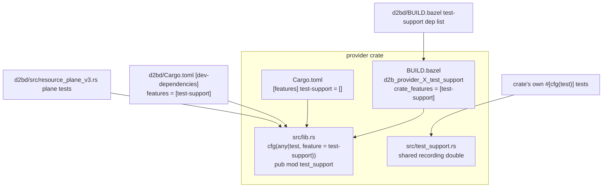
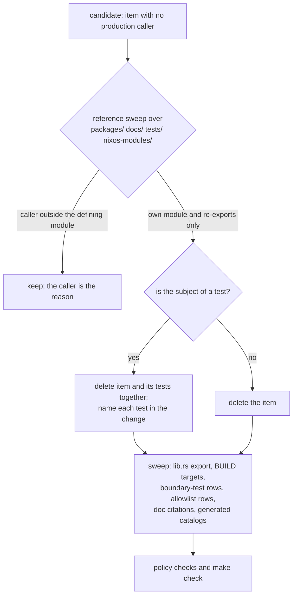

# Remove the Residual Migration Scaffolding - Plan

## Goal Capsule

- **Objective:** Close issue #500's remaining scaffolding: one shared recording double per remaining driver-effect port, zero unjustified `#[allow(dead_code)]`, verified-orphan public API deleted, and both acceptance gates recorded green on the change's head.
- **Product authority:** GitHub issue #500 owns the acceptance criteria. Merged PR #537 landed the bulk of the cleanup; its retained dispositions are the baseline this plan completes.
- **Open blockers:** None. Two tool facts are recorded as assumptions rather than blockers (`cargo-hawk` availability, host-integration lane runtime).
- **Stop condition:** `make check` and `make test-host-integration` pass on the change's head, every requirement below is verified, and no test was deleted or weakened outside the named subject deletions.
- **Tail ownership:** The executing agent owns the PR tail per `AGENTS.md`: independent review in a clean context, changelog fragment, squash merge with an expected-head guard.

---

## Product Contract

### Summary

Finish the cleanup that PR #537 started. Three work shapes remain: consolidate the six driver-effect-port test doubles that still live inline onto the repository's existing shared `test_support` pattern; delete the public items and modules the rewrite orphaned and left reachable only through their own re-exports; and close the two acceptance gates that were never recorded on this tree. Production behavior does not change: the deletions remove code with no production caller, and the consolidations keep every assertion the inline doubles made.

### Problem Frame

Issue #500's inventory (2026-09-10) is partly obsolete and partly still true. PR #537 (`e1234cc24`, merged 2026-09-14) deleted the `composition.rs` dead-code graveyard, the `UnavailableProcessEffectPort` and `UnavailableSharedProviderEffects` placeholders, the `resource_plane_v3.rs` bespoke fakes, the `CommittedProviderIdentitySource` trait, and the duplicated `#[allow(dead_code)]` attributes. Verified state at HEAD `7477afdd1`:

- Six effect-port shapes still use inline doubles instead of the shared pattern that ten other ports adopted: guest, interaction (wayland-policy), host, user, provider, notification (`d2b-provider-guest/src/driver.rs:1535`, `d2b-provider-wayland-policy/tests/engine.rs:122`, `d2b-provider-host/src/driver.rs:449`, `d2b-provider-user/src/driver.rs:423`, `d2b-provider-provider/src/driver.rs:795`, `d2b-provider-notification-desktop/src/controller.rs:1689`), plus two bare no-op doubles in the plane tests (`d2bd/src/resource_plane_v3.rs:2653`, `:2684`).
- Eleven `#[allow(dead_code)]` attribute sites survive in the two packages: nine already justify themselves in their own file (`d2bd/src/credential_backend_runtime.rs:14` module doc; `provider_lifecycle.rs:520`, `:750`, `:810`; `forward_rendezvous.rs:351`, `:494`; `effect_service_actors.rs:198`, `:209`, `:364`), and two do not (`packages/d2bd/tests/common/mod.rs:1` and the generated `packages/d2b-resource-api/src/generated/d2b_resource_v3_ttrpc.rs:5`).
- Zero-caller public API survives because neither rustc nor `cargo-shear` sees it: the `usbipd_perenv_autostart` module (`d2bd-runtime/src/usbipd_perenv_autostart.rs`, 660 lines, no consumer outside its own `lib.rs` export), `ManagerCall`/`ChannelManagerEndpoint` (`d2b-resource-runtime/src/context.rs:143`, `:209`), the `compile_provider_artifact` alias (`d2b-resource-compiler/src/lib.rs:1325`), and `BindingChildReconciler` (`d2b-core-controller/src/binding_children.rs:440`).
- One unwired surface is not residue and stays: the neutral volume effect-port contract (`d2b-contracts/src/v3/effect_port.rs`) with its generic host wrapper (`d2b-host/src/volume_effect_adapter.rs:34`). `docs/specs/providers/ADR-046-provider-volume-local.md:855-865` names that module as the trait's home, the completion tasklist assigns its implementation (`docs/specs/providers/ADR-046-provider-volume-local.md:2753-2757`, `specs/001-adr046-d2b3-completion/tasks.md:839`, task T469, unit `ADR046-vl-012`), and `specs/001-adr046-d2b3-completion/implementation-debt.md:1521` records the core/broker adapter as still absent.
- Both acceptance gates are unproven on this head: `make test-host-integration` has no recorded run after PR #537 and the async-purity waves, and `make check-dead-code` (`Makefile:145`) is invoked by no lane, no CI job, and fails hard when `cargo-hawk` is absent from PATH.

The cost of leaving this is stated by the issue itself: abstraction that exists to make the migration easy rather than to make the code correct, and dead code that reads as live.

### Requirements

**Shared test doubles**

- R1. Every driver-effect port has exactly one shared recording double, living in the owning crate's `test_support` module behind that crate's `test-support` feature. No inline double implements the same port.
- R2. The shared double is reachable by the owning crate's own tests and by `d2bd`'s plane tests under both build systems: cargo via a feature-enabled `[dev-dependencies]` entry, Bazel via a `*_test_support` target carrying `crate_features = ["test-support"]`.
- R3. Consolidating a double preserves its scripted surface: the recording log, the setters, call ordering, and any shared order log stay available, and no test loses an assertion.

**Dead code**

- R4. The `#[allow(dead_code)]` count in `packages/d2bd/**` and `packages/d2b-resource-api/**` is zero, or each survivor carries a one-line justification at its site or a recorded exception with its reason. No duplicated attribute remains.
- R5. Zero-caller public items, modules, and port surfaces left by the rewrite are deleted, and the same change sweeps every reference they leave behind: `lib.rs` exports, Bazel targets, boundary-test rows, allowlist entries, generated catalogs, and documentation citations.

**Ports, traits, and seams**

- R6. Every surviving migration-era single-implementation trait and read-only view seam has a documented reason in the tree; none survives undocumented.
- R7. No placeholder port remains on a production construction path without a named closing unit. This holds at HEAD; the plan re-verifies it rather than reworking it.

**Gates and repository rules**

- R8. `make check` and `make test-host-integration` both pass on the change's head. No test is deleted or weakened to reach either, except where the test's subject is deleted, named individually.
- R9. The workspace dead-code scan runs clean on the touched surface from the development shell, where both scanners are provisioned. Where that shell is unavailable, the gap is recorded with the reference sweep that replaces it.
- R10. The change adds no gate, linter, or CI job. It ships a changelog fragment and updates every document, allowlist, and generated artifact its deletions touch.
- R11. Every migration-era surface this plan knowingly retains names either a closing unit and its owner or a permanent reason, in the tree or in this plan.

### Scope Boundaries

**Deferred to follow-up work**

- The neutral volume effect-port contract and its host wrapper. They are a scheduled interface, not residue: unit `ADR046-vl-012` (task T469) owns the adapter that implements them (KTD5, R11).
- The `SHARED_FAMILY_KNOWLEDGE_RATCHET` (`packages/xtask/src/provider_crate_policy.rs:1015`, 617 rows naming landed plan units). The policy check already fails a row whose signal is gone (`:5526`), so every surviving row marks a live cross-crate knowledge leak, not stale bookkeeping. Issue #516 owns it.
- Plan-identifier identifiers, test names, and comment citations. Issue #499 owns the sweep; this plan does not pre-empt it, and edits comments it already owns only where a deletion forces it.
- CI gate wiring: no workflow file changes and no new CI job. The dead-code target joins the Make dispatcher's local-goal class for provisioning only (KTD9, U8); issue #447 owns gates.
- The remaining `Noop*`/`Stub*`/`Null*` test doubles in other crates that no port shape shares.

**Outside this plan**

- Anything PR #537 already deleted, and the machinery U14 removed.
- Load-bearing adapters the issue names as non-goals: broker and supervisor protocol adapters, the Nix-side contracts.
- General refactors, renames, and lint/TODO sweeps.

### How This Work Fits Together

<!-- ce-section: work-relationships -->

This plan owns one area: the residual scaffolding of issue #500. The wider v3 rewrite is the current understanding, not this plan's product surface.

- Depends on PR #537 (landed) for the shared `test_support` pattern, its ten consolidated ports, and the inert Bazel targets five of the six remaining crates already carry.
- Sibling issues that must not be pre-empted: #516 owns the family-knowledge ratchet, #499 owns the identifier and citation sweep, #447 owns CI gate wiring.
- Closes: issue #500, whose last acceptance criteria these are.

---

## Planning Contract

### Key Technical Decisions

- KTD1. Consolidate the six remaining ports onto the shared `test_support` double rather than documenting them as exceptions - (session-settled: user-approved - chosen over recording six sanctioned exceptions: the acceptance criterion asks for one shared double per port shape, and five of the six crates already carry the inert Bazel target for it).
- KTD2. Delete verified-orphan public API beyond issue #500's own 2026-09-10 inventory - (session-settled: user-approved - chosen over restricting the plan to that inventory: same defect class, and the inventory's own deletions already landed, so its list no longer describes the tree).
- KTD3. Run the host-integration lane on the change's head as the closing gate - (session-settled: user-approved - chosen over deferring it to PR CI: it is an issue acceptance criterion, the host is `x86_64-linux` with `/dev/kvm`, and the lane is a local-only surface that no CI job runs).
- KTD4. Add no gate for dead code; keep the scan a manual verification step - (session-settled: user-approved - chosen over wiring `check-dead-code` into `make check` and CI: `AGENTS.md` limits repository-wide policy to four classes and forbids new linters, hooks, and gates). Provisioning is separate and does not change this: the scanners ship in the development shell and the target joins the local dispatch class so it runs there (KTD9), with no CI job added.
- KTD5. Retain the neutral volume effect-port surface and its host adapter, and record their closing unit. Evidence: the spec names `d2b-contracts/src/v3/effect_port.rs` as the trait's home and the provider crate as its importer (`docs/specs/providers/ADR-046-provider-volume-local.md:855-865`), the completion tasklist assigns the adapter to task T469 under unit `ADR046-vl-012` (`specs/001-adr046-d2b3-completion/tasks.md:839`, `docs/specs/providers/ADR-046-provider-volume-local.md:2753-2757`), and the debt ledger records the adapter as not yet built (`specs/001-adr046-d2b3-completion/implementation-debt.md:1521`). The tree holds the declared interface plus a generic wrapper with no concrete backend (`d2b-host/src/volume_effect_adapter.rs:34`), which is the declared-but-unbuilt state, not residue.
- KTD6. Keep the two surviving `#[allow(dead_code)]` sites and dispose of each explicitly. `packages/d2bd/tests/common/mod.rs:1` is the sanctioned shared-harness pattern consumed by `mod common;` in several test binaries, so it gains a one-line justification; the generated `d2b_resource_v3_ttrpc.rs:5` allowance is emitted by `ttrpc_codegen` (`packages/xtask/src/main.rs:336-345`) and is not hand-editable, so it is recorded as a generated-code exception instead of post-processed.
- KTD7. Keep `WatchSink` and `LiveControllerSessionEvidence` unchanged and record why. `WatchSink` (`d2b-resource-api/src/watch.rs:74`, sole impl `d2b-bus/src/router.rs:4225`) carries its reason in-file (`watch.rs:3-7`: no producer until the manager-side pump lands) and deleting it would cascade through the tested watch-delivery credit path. `LiveControllerSessionEvidence` (`d2bd/src/resource_runtime/plane_controller_bridge.rs:231`) exists to disambiguate two effect traits on one type, documented in-file.
- KTD8. Land the doubles before the deletions. The consolidations touch `d2bd/src/resource_plane_v3.rs`, which the deletions do not; ordering them first keeps each unit independently verifiable and keeps the plane fixtures compiling throughout.
- KTD9. Provision both dead-code scanners in the development shell and run the existing target inside it - (session-settled: user-directed - chosen over widening only the fallback wording: the tools ship in the `d2b-dev` shell beside the other gate tooling, and `check-dead-code` joins the local dispatch class so the target enters that shell, which leaves no environment where the gate silently degrades). The widened fallback stays for environments outside the shell. No CI job and no new gate is added.

### High-Level Technical Design

The shared double travels two independent build paths. Both must carry the feature for `d2bd`'s plane tests to compile under Bazel and cargo.

Every deletion follows the same gate before it happens.

### Assumptions

- `make check` is green at HEAD (`922/922`, measured on 2026-09-18); the plan treats regression from that baseline as a defect, not a starting state.
- Five of the six crates already carry a `*_test_support` Bazel target without `crate_features` (`d2b-provider-host/BUILD.bazel:32`, `d2b-provider-user/BUILD.bazel:32`, `d2b-provider-provider/BUILD.bazel:36`, `d2b-provider-wayland-policy/BUILD.bazel:34`, `d2b-provider-notification-desktop/BUILD.bazel:37`); each still needs the flag, and `d2b-provider-guest` needs a new target.
- The cargo side of the double `MUST` be reachable outside `cfg(test)`, so the double's dependencies stay normal dependencies, matching the rule recorded in `d2b-provider-volume-binding/Cargo.toml`.
- `cargo-hawk` may not be installable on this toolchain. The rustc `-D dead_code` pass and `cargo-shear` still run, and each deletion additionally carries its own reference sweep as evidence.
- No generated artifact enumerates the source files these deletions remove. The `packages/policy-inputs/**` projections are crate- and edge-granular, computed from cargo metadata rather than file lists (`packages/xtask/src/production_closure.rs:106-238`); the Guest mirror copies whole crate directories (`flake.nix:152-177`); and neither the layer catalogs nor `docs/reference/daemon-api.md` names a deleted symbol.
- The family-knowledge ratchet needs no upkeep from this change: none of the deleted paths has a row, and the `binding_children.rs` rows stay valid because that module survives (`packages/xtask/src/provider_crate_policy.rs:4608-4620`).
- `make test-host-integration` is runnable here (`/dev/kvm` present) and takes tens of minutes; one run on the change's head satisfies R8.

### System-Wide Impact

The change is internal to the workspace. No daemon, broker, Nix, CLI, audit, or operator-visible surface changes.

- Contract crates: none loses a public item. U4 was dropped in deepening, so `d2b-contracts` keeps `v3::effect_port` (KTD5).
- Affected crates: `d2bd-runtime` (module, export, boundary-test row), `d2b-resource-runtime` (two routing types), `d2b-resource-compiler` (one alias over a live function), `d2b-core-controller` (one type plus its re-export), and the six provider crates that gain a `test_support` module. The `test-support` feature adds test-only surface; production builds and every existing consumer stay unchanged.
- Generated and mirrored artifacts: no regeneration is required (see Assumptions), and the family-knowledge ratchet needs no row upkeep.
- Failure propagation: every failure mode is compile-time or test-time. A forgotten `runtime_boundary.rs` row fails the crate build through `include_str!`; a stale allowlist row or dangling citation fails `make test-policy`; a missed re-export fails the crate that named it.

### Risks & Dependencies

- Deleting a scheduled interface instead of residue. Realized once already: the neutral volume effect-port surface reads as an orphan but is an assigned destination. Mitigated by KTD5 (retain), and the per-item sweep now reports the owner instead of deleting.
- Spec dossiers cite module paths that the deletions remove (`docs/specs/providers/ADR-046-provider-device-usbip.md:37`, `:1998-2011`, `docs/specs/ADR-046-resources-device.md:2117`) and no gate checks that. Mitigated by the documentation sweep in U5 and U6, listed in the Verification Contract.
- `cargo-hawk` unavailability leaves the overbroad-public pass unrun. Mitigated by the rustc `-D dead_code` pass plus the recorded per-item reference sweeps.
- The host-integration lane is slow and host-dependent. Mitigated by one run on the final head, recorded with its result.
- A shared-double consolidation can silently reduce a test's scripted power. Mitigated by the preservation requirement in R3 and by the double-fidelity scenarios in U1 and U2.

### Sequencing

1. U1 and U2 (doubles) land first, per KTD8, with U2 applying after U1: both edit `packages/d2bd/{Cargo.toml,BUILD.bazel}` and `packages/d2bd/src/resource_plane_v3.rs`, so the shared daemon files are edited once.
2. U3 (allowance dispositions) is independent and can land any time after U1.
3. U5 and U6 (deletions) are independent of each other; each sweeps its own references. U4 was dropped during deepening because its target is retained (KTD5), so the unit list keeps that gap.
4. U7 (record, sweep, changelog) closes the set.
5. U8 (scanner provisioning) is independent of the rest and may land at any time before the final gate run.
6. Gate runs follow the last unit.

---

## Implementation Units

### U1. Move the five scaffolded provider doubles onto the shared pattern

- **Goal:** Host, user, provider, wayland-policy, and notification-desktop each expose one shared recording double from `test_support`, and their own tests plus `d2bd`'s plane tests use it.
- **Requirements:** R1, R2, R3
- **Dependencies:** None.
- **Files:**
  - `packages/d2b-provider-host/src/{lib.rs,driver.rs,test_support.rs,Cargo.toml,BUILD.bazel}`
  - `packages/d2b-provider-user/src/{lib.rs,driver.rs,test_support.rs,Cargo.toml,BUILD.bazel}`
  - `packages/d2b-provider-provider/src/{lib.rs,driver.rs,test_support.rs,Cargo.toml,BUILD.bazel}`
  - `packages/d2b-provider-wayland-policy/src/{lib.rs,interaction.rs,test_support.rs,Cargo.toml,BUILD.bazel}`, `packages/d2b-provider-wayland-policy/tests/{engine.rs,registration.rs}`
  - `packages/d2b-provider-notification-desktop/src/{lib.rs,controller.rs,test_support.rs,Cargo.toml,BUILD.bazel}`
  - `packages/d2bd/{Cargo.toml,BUILD.bazel}`, `packages/d2bd/src/resource_plane_v3.rs`
- **Approach:**
  1. For each crate, add `src/test_support.rs` holding the double the inline version provided, and gate it with `#[cfg(any(test, feature = "test-support"))] pub mod test_support;` in `lib.rs`.
  2. Add `[features] test-support = []` to the crate manifest, keeping every double dependency a normal dependency.
  3. Add `crate_features = ["test-support"]` to that crate's existing `*_test_support` Bazel target; complete the cross-provider dep swaps to the `*_test_support` variants.
  4. Point the crate's own tests at `crate::test_support::<Double>` and delete the inline struct and its impl.
  5. For wayland-policy, the two doubles live in `tests/` (`engine.rs:122`, `registration.rs:24`) rather than `src/`: move the recording double into `test_support.rs`, and remove the registration test's local stub by constructing its descriptor from the shared double, since the descriptor only needs some port instance and that test never runs an effect.
  6. Add the five crates to `packages/d2bd/Cargo.toml` `[dev-dependencies]` with `features = ["test-support"]`, and confirm each is present in `d2bd/BUILD.bazel`'s test-support dep list.
  7. Replace the plane fixture's local doubles with the shared ones in `packages/d2bd/src/resource_plane_v3.rs`, preserving each fixture's scripted behavior through the shared setters.
- **Patterns to follow:** `packages/d2b-provider-process/src/test_support.rs` with its `BUILD.bazel:34-48` target; `packages/d2b-provider-volume-binding/src/{lib.rs:14-18,Cargo.toml}` for the feature-gate wording.
- **Test scenarios:**
  - Each crate's existing driver tests keep their assertions and pass with the shared double (`packages/d2b-provider-host/src/driver.rs` tests, `d2b-provider-user/src/driver.rs` tests, `d2b-provider-provider/src/driver.rs` tests, `d2b-provider-wayland-policy/tests/engine.rs`, `d2b-provider-notification-desktop/src/controller.rs` tests).
  - The shared doubles keep the setters the inline versions had: `set_phase` (host, user), `set_evidence` (provider), the wayland-policy scripted outcome, and the notification call log.
  - `d2bd`'s plane tests build against the shared doubles under Bazel (`//packages/d2bd:d2bd_lib_test_support`) and under cargo (`cargo test -p d2bd --all-targets`), proving R2 on both paths.
  - A double's recording log still preserves call order for the ordering assertions the inline versions carried.
  - The registration test builds its descriptor from the shared double, and no local port implementation remains in that file.
- **Verification:** The five crates' Bazel test targets pass, `//packages/d2bd:d2bd_lib_test_support` compiles, and `cargo test -p d2bd` reports no new failures. No inline struct implementing those five ports remains.

### U2. Give the guest driver a shared double

- **Goal:** `d2b-provider-guest` exposes one shared recording double, and the plane test's bare guest fake is replaced by it.
- **Requirements:** R1, R2, R3
- **Dependencies:** None.
- **Files:** `packages/d2b-provider-guest/src/{lib.rs,driver.rs,test_support.rs,Cargo.toml,BUILD.bazel}`, `packages/d2bd/{Cargo.toml,BUILD.bazel}`, `packages/d2bd/src/resource_plane_v3.rs`
- **Approach:**
  1. Add `src/test_support.rs` carrying the guest port's double, including the scripted-observation and shared-order-log behavior the inline `ScriptedEffects` provides.
  2. Gate the module and add `[features] test-support = []`.
  3. Create `d2b_provider_guest_test_support` in `packages/d2b-provider-guest/BUILD.bazel`, modeled on the process crate's target, and add the label to `packages/d2bd/BUILD.bazel`'s test-support dep list.
  4. Add the dev-dependency entry in `packages/d2bd/Cargo.toml`, then replace `packages/d2bd/src/resource_plane_v3.rs:2684`'s no-op fake with the shared double, keeping the fixture's behavior of never reaching Guest Ready.
- **Patterns to follow:** `packages/d2b-provider-process/BUILD.bazel` test-support target and `packages/d2b-provider-guest/src/driver.rs:1535` for the behavior being preserved.
- **Test scenarios:**
  - The guest driver's own tests pass with the shared double, including the test that compares the provider stage against the child-mutation order log.
  - The plane test that registers a guest driver still passes with the shared double wired in, and still asserts no Guest reaches Ready.
  - `d2b_provider_guest_test_support` builds under Bazel and the crate builds under cargo with `--features test-support`.
- **Verification:** The guest crate's test targets pass, `//packages/d2bd:d2bd_lib_test_support` compiles, and no bare no-op guest double remains in `d2bd`.

### U3. Account for every surviving dead-code allowance

- **Goal:** All eleven surviving `#[allow(dead_code)]` attribute sites are accounted for: each carries an in-file justification, a recorded exception, or is deleted.
- **Requirements:** R4
- **Dependencies:** None.
- **Files:** `packages/d2bd/tests/common/mod.rs`
- **Approach:**
  1. Add a one-line justification at `packages/d2bd/tests/common/mod.rs:1` stating why the shared harness needs a module-scope allowance: every test binary includes `mod common;` and uses a subset, so per-item allows would be noise. Cite the pattern's origin rather than a closing unit; this is a permanent test shape, not migration residue.
  2. Confirm the nine sites that already justify themselves in-file and record them so the inventory is closed: `d2bd/src/credential_backend_runtime.rs:14` (module doc naming the transition that orphaned it), `provider_lifecycle.rs:520`, `:750`, `:810`, `forward_rendezvous.rs:351`, `:494`, `effect_service_actors.rs:198`, `:209`, `:364` (each a doc comment naming its closing unit). Where a reason names only a possible future consumer rather than a unit, replace it with the closing unit or delete the item.
  3. Record the generated ttrpc allowance as a generated-code exception per KTD6, with `packages/xtask/src/main.rs:336-345` as the emitter evidence.
  4. Run the duplicate-attribute check over both packages and record that it returns zero instances; the duplicated attributes the issue listed are already gone.
- **Test expectation:** none - comment-only change plus recorded dispositions; the drift gate and the dead-code scan guard the generated file.
- **Verification:** `rg -c 'allow\(dead_code\)'` over `packages/d2bd` and `packages/d2b-resource-api` returns the eleven known sites; each carries an in-file justification, the one recorded exception, or is gone; no other instance exists.

### U4. Withdrawn: the neutral volume effect-port surface is retained

- **Disposition:** Withdrawn during deepening, in place of the deletion it originally described. The surface is a scheduled interface with an owner, not residue (KTD5, R11), so nothing is deleted. The retention is recorded under Scope Boundaries and re-verified by U7. The U-ID stays unused so references to U5, U6, and U7 keep their meaning.

### U5. Delete the orphaned USBIP per-env autostart seam

- **Goal:** The unreachable per-env USBIP autostart module and its public surface are gone, and the boundary test that pins its file is updated in the same change.
- **Requirements:** R5, R8, R10
- **Dependencies:** None.
- **Files:** `packages/d2bd-runtime/src/usbipd_perenv_autostart.rs` (delete), `packages/d2bd-runtime/src/lib.rs:53`, `packages/d2bd-runtime/tests/runtime_boundary.rs:170-172`, `docs/specs/providers/ADR-046-provider-device-usbip.md:37`, `:1767`, `:1998-2011`, `:2089`, `docs/specs/ADR-046-resources-device.md:2015-2016`, `:2117`
- **Approach:**
  1. Confirm the sweep: `PerEnvUsbipdSpec`, `PerEnvUsbipdAutostartReport`, `derive_per_env_usbipd_specs`, `spawn_runner_role`, and `execute_usbipd_perenv_autostart` have no consumer outside the module and its `lib.rs` export.
  2. Record the dossier's actual precondition and satisfy it as the removal proof: `docs/specs/providers/ADR-046-provider-device-usbip.md:1767` schedules this module as "Delete; replace with one Host backend and one typed TCP 3240 relay Endpoint per Network", and `:2005` conditions removal on the provider tests and integration tests passing. Run those provider-side tests and record the result; the caller-free sweep from step 1 is supporting evidence, not the parity proof.
  3. Delete the module and its export.
  4. Remove the module's row from `runtime_boundary.rs`'s file table and from any count assertion that table feeds, keeping the test's provider-implementation scan over the remaining files intact.
  5. The module's tests are deleted with their subject, named individually in the change: `derive_returns_empty_when_no_usbip_vms`, `derive_picks_only_envs_with_usbip_yubikey_workloads`, `derive_emits_backend_then_proxy_per_env`, `derive_uses_alphabetical_index_for_port_assignment`, `derive_keeps_proxy_sidecars_per_env_not_shared`, `intent_id_is_stable_per_vm_role`, `spawn_runner_role_is_usbip`, `execute_spawns_all_when_clean`, `execute_idempotent_when_already_running`, `execute_skips_proxy_when_backend_failed`, `execute_handles_bundle_intent_missing_gracefully`.
  6. Sweep both dossiers for every row citing the module path, not only the anchors listed above, plus the generated catalogs that name it. No gate checks these, so the sweep is manual.
- **Test scenarios:**
  - `runtime_boundary.rs` passes with the table entry removed and still walks every remaining `src/*.rs` file in the crate.
  - No remaining test in `d2bd-runtime` references a deleted symbol.
  - The crate builds after the module and its export are removed, which is the check that catches a forgotten boundary-table row.
- **Verification:** `cargo test -p d2bd-runtime` passes; the repo-wide sweep for the deleted symbols returns no live reference; the two dossiers no longer cite the module path.

### U6. Delete the remaining zero-caller public API

- **Goal:** The four remaining zero-caller public items are deleted, each with its own sweep, or kept with the caller that justifies it.
- **Requirements:** R5, R8, R10
- **Dependencies:** None.
- **Files:** `packages/d2b-resource-runtime/src/context.rs` (`:143` `ManagerCall`, `:209` `ChannelManagerEndpoint` and its impl), `packages/d2b-resource-compiler/src/lib.rs:1325`, `packages/d2b-core-controller/src/binding_children.rs:440` plus its `lib.rs` re-export, affected `BUILD.bazel` files
- **Approach:**
  1. Sweep each item across `packages/`, `docs/`, `specs/`, `tests/`, `nixos-modules/`; an item with a caller outside its defining module is kept and its caller recorded instead of deleted. The authority is the audit record's "not applied" rows (`docs/explanation/over-engineering-audit-record.md:466-470`, B6, B7, B8), which also name two further same-class items: the write-only audit-log read path and the identity re-export module. Sweep both; delete each if the sweep shows no caller, otherwise record its caller or a retention reason, and report the outcome to U7's retention record.
  2. Delete `ManagerCall`, `ChannelManagerEndpoint`, and the module's now-unused imports; confirm `d2b-resource-runtime`'s `modules_resolve()` list at `src/lib.rs:69-83` is unaffected because the module itself survives. The v3 rewrite's R2/KTD3 routing obligation is met by the live manager and context surface, which names neither type (`docs/plans/2026-09-09-001-refactor-v3-resource-runtime-rewrite-plan.md:95-97`).
  3. Rework the five in-module tests that construct or match the deleted types onto a local in-module endpoint stub, preserving their assertions: `ensure_child_sends_one_persist_request_and_awaits_commit_ack`, `manager_failures_surface_as_manager_rpc_errors`, `dropped_view_request_surfaces_as_manager_rpc_error`, `watch_and_manager_shapes_send_and_receive_intact`, `watch_registration_routes_through_the_manager_with_subscriber_identity`. These are reworks, not deletions; the crate's unit tests must not be claimed to pass unchanged.
  4. Delete `compile_provider_artifact`, which is a thin alias over the live `compile_artifact` (`packages/d2b-resource-compiler/src/lib.rs:1324-1326`); the canonical function stays.
  5. Delete `BindingChildReconciler` and its re-export. Its child-set validation and UID/revision repair semantics exist only inside it, and no live path calls it; its tests are deleted with their subject and named individually: `rejects_incomplete_child_sets_and_reconciles_all_declared_children`, `preserves_uid_revision_preconditions_for_repair_and_deletion`, `validates_child_identity_owner_and_execution_contract`, `plans_uid_free_intents_without_provider_supplied_envelopes`, `plan_rejects_a_provider_body_from_a_foreign_zone`. Tests that exercise surviving functions in the same module stay.
  6. Sweep the policy allowlists and documentation citations that name a deleted item in the same change. The `binding_children.rs` family-knowledge rows stay valid because the module survives.
- **Patterns to follow:** The `OpenZoneStore` retirement recorded in `changelog.d/chore-post-rewrite-cleanup.md` - wire, dispatch, audit, generated schemas, and citations swept in one change.
- **Test scenarios:**
  - `d2b-resource-runtime` compiles and the five reworked tests pass with their assertions intact, each no longer referencing a deleted type.
  - `d2b-core-controller` passes with the reconciler gone and the surviving `binding_children` tests unchanged.
  - `d2b-resource-compiler` still exposes and passes its tests for `compile_artifact`.
  - The two further audit-row items are each deleted or recorded with their caller, and the outcome appears in U7's retention record.
  - The policy checks pass, which proves no allowlist row or citation still names a deleted item.
- **Verification:** Repo-wide sweep for each deleted symbol returns nothing live; `make check` stays green.

### U7. Record the surviving dispositions, sweep references, and ship the fragment

- **Goal:** Every retained item's reason is visible in the tree, no document cites a deleted symbol, and the change carries its changelog fragment.
- **Requirements:** R6, R7, R9, R10, R11
- **Dependencies:** U1, U2, U3, U5, U6
- **Files:** `packages/d2b-resource-api/src/watch.rs` (reason text only if it proves incomplete), `packages/d2bd/src/resource_runtime/plane_controller_bridge.rs` (reason text only), `changelog.d/<branch-name>.md`
- **Approach:**
  1. Read each surviving seam's in-file reason (`watch.rs:3-7`, `plane_controller_bridge.rs:225-235`, and the two documented `Unavailable*` ports at `d2b-resource-api/src/service.rs:139-160` and `d2b-provider-toolkit/src/plane/handle.rs:84` with its closing unit at `d2bd/src/plane_port.rs:90`). Add a line only where a reason is genuinely missing; do not rewrite reasons that already hold.
  2. Re-verify the placeholder-port criterion: the two production-path `Unavailable*` ports each name a closing unit, so R7 is satisfied without a change.
  3. Record the retention of the neutral volume effect-port surface and its host wrapper with the closing unit that finishes them: task T469 under unit `ADR046-vl-012` (KTD5, R11). Confirm no production path wires the surface in the meantime. Record the same for the two audit-row items U6 sweeps, each with its caller or retention reason.
  4. Sweep `docs/`, `specs/`, and `nixos-modules/` for every symbol deleted in U5 and U6 and update or confirm each citation.
  5. Write one `changelog.d/<branch-name>.md` fragment under `### Removed` and `### Changed`, describing the deletions as consumer-visible cleanup and naming the kept exceptions (the shared-harness allowance, the generated ttrpc allowance, and the retained volume effect-port surface) with their reasons.
- **Test expectation:** none - disposition, sweep, and changelog only; the policy checks and `make test-changelog` guard the fragment.
- **Verification:** Each surviving seam has a readable reason in its file or an explicit plan record; the documentation sweep returns no citation to a deleted symbol; `make test-changelog` passes with the fragment present.

### U8. Provision the dead-code scanners and run the gate inside the development shell

- **Goal:** The dead-code scan runs from the repository's development shell with both scanners present, and the existing target enters that shell, so the scan itself is the evidence for R9 rather than a degraded fallback.
- **Requirements:** R9, R10
- **Dependencies:** None.
- **Files:** `flake.nix` (the `d2b-dev` shell package list at `:242-252`), `Makefile` (the local-goal dispatch class at `:21-25` and the `check-dead-code` target at `:145`), `docs/contributing/gates-and-lints.md`, and a vendored derivation under `pkgs/` if the pinned nixpkgs carries no attribute for a scanner
- **Approach:**
  1. Add both scanners to the `d2b-dev` shell's package list, in the group the shell already documents as test and audit tooling the gates would otherwise fetch per invocation.
  2. If the pinned nixpkgs has no attribute for one of them, vendor a derivation under `pkgs/` beside the existing ones and wire it into the same list. Note that one scanner needs a nightly toolchain matching its compiler internals; resolve that in the derivation rather than in a shell hook.
  3. Add `check-dead-code` to the Makefile's local-goal dispatch class so the target re-enters the development shell through the existing shell-ready dispatcher, which excludes it today.
  4. Keep the widened missing-tool failure in the tool's own path, so an environment outside the shell reports a missing tool instead of passing silently.
  5. Document the lane in the gates reference: what the scan covers, how to run it, and why it is provisioned in the shell rather than fetched per invocation.
- **Patterns to follow:** the `d2b-dev` shell's existing tooling group; `check-clippy` and `check-ci` as targets that already run under the shell contract (`Makefile:32-50`).
- **Test scenarios:**
  - Inside the shell, both scanners report a version and `cargo run -p xtask -- deadcode-check` completes on the change's head.
  - From outside the shell, `make check-dead-code` re-enters the development shell and runs the scan instead of failing on a missing tool.
  - With a scanner removed from PATH, the scan fails closed with its install hint rather than reporting success.
- **Verification:** `make check-dead-code` reports a clean scan on the change's head; no `make check` step and no CI job was added.
- **Execution note:** Mostly packaging and environment wiring; prefer the runtime smoke check over new unit coverage.

---

## Verification Contract

| Gate | Command | Applies to | Evidence |
|---|---|---|---|
| Layer-1 aggregate | `make check` | Whole change | `922/922` was the pre-change baseline on 2026-09-18; the change must stay green |
| Policy checks | `make test-policy` | U5, U6, U7 | Refuses a stale allowlist row, a dangling citation, or a stale driver declaration |
| Host lane | `make test-host-integration` | R8 / KTD3 | Recorded pass on the change's head; `/dev/kvm` present; local-only lane, not run by CI |
| Dead-code scan | `make check-dead-code` (enters the development shell) | R9, U8 | Both scanners are provisioned in the shell; the recorded fallback applies only outside it |
| Shell provisioning | `nix develop` then `cargo hawk --version` and `cargo shear --version` | U8 | Both scanners resolve inside the shell |
| Shared doubles under both build systems | `cargo test -p d2bd --all-targets`; `//packages/d2bd:d2bd_lib_test_support` | U1, U2 | Proves R2 on the cargo and Bazel paths |
| Per-deletion sweep | `rg '<deleted symbol>' packages docs specs tests nixos-modules` | U5, U6 | Zero live hits outside the deleted files, and the two ADR dossiers no longer cite the removed module path |
| Boundary table | `cargo test -p d2bd-runtime` | U5 | A forgotten `runtime_boundary.rs` row is an `include_str!` compile failure, so the crate must build |
| Retention record | Read back KTD5, KTD6, R11, and U7's disposition pass | R11 | Every surviving allowance and every retained surface names a closing unit, an owner, or a permanent reason |
| Changelog | `make test-changelog` | U7 | Fragment present and well-formed |

Behavioral proof for the consolidations is the existing test suites: the doubles are test scaffolding, so a green suite with the same assertions is the evidence, and no new test is required for them.

---

## Definition of Done

**Global**

- R1 through R11 are each verified with the evidence named in the Verification Contract.
- `make check` and `make test-host-integration` pass on the change's head; no test was deleted or weakened except the eleven autostart-seam and five reconciler tests named in U5 and U6, whose subjects were deleted.
- The change adds no gate, linter, or CI job; its only Makefile change is the dead-code target joining the local dispatch class so it runs in the development shell (U8).
- Every deletion's allowlist rows, generated catalogs, boundary-test rows, and documentation citations left the tree in the same change, and no schedule interface was deleted: the volume effect-port surface stays with its owner recorded.
- One changelog fragment is present; no scratch, experimental, or abandoned-attempt file is left in the diff.
- The review tail follows `AGENTS.md`: independent review in a clean context, fixes validated, fresh review after any head change.

**Per unit**

| Unit | Done when |
|---|---|
| U1 | Five crates expose a shared double; their tests and `d2bd`'s plane tests pass under cargo and Bazel; no inline double for those ports remains |
| U2 | Guest exposes a shared double; the greenfield Bazel target builds; the plane fixture uses it; no bare guest fake remains |
| U3 | Every surviving allowance is accounted for: in-file justification, recorded exception, or deleted |
| U4 | Withdrawn; the retained surface is recorded with its closing unit |
| U5 | The autostart module and its export are gone; the dossier's provider-side precondition ran as the removal proof; `runtime_boundary.rs` updated; `d2bd-runtime` tests pass |
| U6 | The four zero-caller items are deleted or kept with a named caller; the five routing tests are reworked; the five reconciler tests are named; the two further audit-row items are dispositioned; policy checks pass |
| U7 | Surviving dispositions recorded; documentation sweep clean; changelog fragment present |
| U8 | Both scanners resolve in the development shell; `make check-dead-code` runs there and reports a clean scan |

---

## Sources / Research

- Issue #500 and its 2026-09-13 progress note: `https://github.com/vicondoa/d2b/issues/500`.
- PR #537 `cleanup(issue-500): remove migration scaffolding` (merged 2026-09-14, commit `e1234cc24`): the landed bulk, the retained dispositions, and the new `xtask deadcode-check`.
- v3 rewrite plan, U14 status and DoD audit: `docs/plans/2026-09-09-001-refactor-v3-resource-runtime-rewrite-plan.md` (what U14 deliberately left behind, and its recorded semantic reductions).
- Shared-double recipe: `packages/d2b-provider-process/src/test_support.rs`, `packages/d2b-provider-volume-binding/src/{lib.rs,Cargo.toml}`, `packages/d2bd/BUILD.bazel` test-support dep list.
- Deletion rules and precedent: `docs/explanation/over-engineering-audit-record.md` (delete-wave refusal classes, row 52's dead-code precedent), `tests/AGENTS.md` (retiring a test, closed gate set, Layer-1/lane split), `AGENTS.md` (code is canon, no new gates or linters, changelog requirement).
- Related open issues: #516 (family-knowledge ratchet), #499 (plan-identifier sweep), #447 (CI gates).
- Retained-surface evidence: `docs/specs/providers/ADR-046-provider-volume-local.md:855-865` (the trait's declared home), `:2753-2757` (destination and reuse action for the host adapter), `specs/001-adr046-d2b3-completion/tasks.md:839` (task T469 under `ADR046-vl-012`), `specs/001-adr046-d2b3-completion/implementation-debt.md:1521` (the adapter recorded as not yet built).
- Deletion-schedule evidence: `docs/specs/providers/ADR-046-provider-device-usbip.md:1767` (`Delete; replace with one Host backend and one typed TCP 3240 relay Endpoint per Network`), `:1998-2011` (removal steps and proof), and `docs/specs/ADR-046-resources-device.md:2117` (the module listed in the current-source anchor).
- Residue evidence for the remaining deletions: `docs/explanation/over-engineering-audit-record.md:466-470` (rows B6, B7, B8, each recorded as not applied).
- Artifact-coupling evidence: `packages/xtask/src/production_closure.rs:106-238` (crate- and edge-granular policy inputs), `flake.nix:152-177` (whole-directory Guest mirror), `packages/d2b-provider-volume-binding/Cargo.toml` (the normal-dependency rule for a test-support feature).
