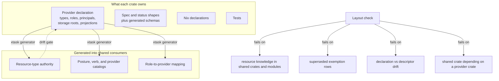

# Finish provider-crate isolation - Plan

## Goal Capsule

- **Objective:** Close issue #516 by retiring the resource knowledge the layout check still excuses in shared crates, and by building the three acceptance items it still does not meet: each provider crate owning its types' spec/status shapes and schemas, the resource-type and role vocabulary declared per crate instead of hand-listed in a shared crate, and the check covering the classes the issue names instead of family tokens alone.
- **Product authority:** Issue vicondoa/d2b#516 owns the acceptance criteria, and its design comments (§1-§9 and the D1-D23 change log) own the target model. `docs/plans/2026-09-13-001-refactor-provider-per-crate-plan.md` is the program plan whose units landed the provider-per-crate migration; its R-IDs stay in force and are cited here, never restated. Product Contract preservation: new artifact for the remainder, no product-scope change.
- **Scope:** the remaining work only. The migration, the toolkit framework, the committed policy rows, the broker envelope, the generated Nix inventories, and the async-purity program are landed; this plan finishes what is left.
- **Open blockers:** none. The issue's last comment names the composition move-verdict pockets as waiting on the typed-arm retirement; that work landed, and the pockets overlap the inventory this plan retires.
- **Stop condition:** every lane's exemption rows retired, the exemption inventory down to its documented permanent carve-outs, the zero-outside-edit gate passing, and `make check`, `make test-host-integration`, the fixture contracts, and the integration lane green on every unit's merged head with no fixture weakened.
- **Delivery:** each unit is built in its own isolated worktree and merged after its gates are green; the merge agent runs `make check` and `make test-host-integration` on the merged head as the unit's signoff, and the unit's worktree is removed once its branch has landed. Gates run with the repository-default profile, so eligible actions use BuildBuddy's remote execution and cache; no local-profile override is applied. See `docs/contributing/workflow.md` for the review and merge lifecycle the plan follows.

---

## Product Contract

### Summary

Shared crates must hold only generic mechanisms. Today a machine-checked exemption inventory in the layout check records roughly six hundred sites where broker, daemon, core, and contract modules still carry a resource family's knowledge, and three acceptance items are unbuilt: provider crates do not own their types' spec/status shapes, adding a resource type still edits a hand list in a shared crate, and the check cannot see structural violations. This plan retires the inventory lane by lane and closes those three items.

### Problem Frame

The provider-per-crate migration moved every driver into its own crate and gave the broker a generic operation envelope. What it did not do is remove the family knowledge left behind in shared code: the broker still implements several families' privileged operations in its own modules, the daemon still branches on provider names and roles, `d2b-core` still carries per-role posture and launch-intent tables, and the shared contracts crate still holds every type's spec shapes. Each of those is a site where adding, renaming, or removing a type, template, role, principal, path, or projection key costs an edit outside the owning crate - the exact cost issue #516 exists to remove.

The cost is already measured rather than estimated. The layout check carries an exemption inventory that records each site as a module and a family token, and it fails in both directions today: a site that starts carrying family knowledge with no exemption fails, and an exemption whose site no longer carries the token also fails. That inventory is the backlog of record; the composition-module move-verdict pockets issue #516's last comment names overlap it, and U3's widened detectors exist because the token heuristic does not cover every one of them.

### Key Decisions

The origin plan's Key Decisions KD1-KD10 remain in force unchanged (`docs/plans/2026-09-13-001-refactor-provider-per-crate-plan.md`). This plan adds no product decision; its decisions are implementation-level and live in the Planning Contract.

### Requirements

**Acceptance closure**

- R1. Each provider crate contains its driver, its static configuration, its types' spec/status shapes and schemas, its Nix declarations, and its tests; a check fails when one is absent for a crate that declares that type. (origin R1, R2, R3, R19; issue acceptance criterion 1)
- R2. Adding, renaming, or removing a resource type, template, role, principal, path, or projection key requires no edit outside the owning crate except a workspace member line; a gate proves the bar holds. (origin R25; issue acceptance criterion 2)
- R3. Shared crates hold only generic mechanisms. The exemption inventory is retired to its documented permanent carve-outs, and every remaining entry names why it is permanent. (origin R14, R15, R20, R21; issue acceptance criteria 3 and 4)
- R4. The layout check fails on resource knowledge in shared crates and shared modules for the classes the issue names - type and role string matching, per-family tables and branches, per-role and seccomp tables, authorization rows, launch-intent tables, and provider ids - and additionally on declaration-to-descriptor disagreement and superseded exemptions. Origin R25's system-zone-write detector stays where it landed and is not re-homed here; its shrink-to-empty clause is superseded by KTD5's permanent carve-outs. (origin R25, R4; issue acceptance criterion 3)

**Provider-owned types and vocabulary**

- R5. Each provider crate owns its types' spec and status shapes and the schemas generated from them; the shared resource-contracts crate keeps generic machinery only. (origin R2; issue acceptance criterion 1)
- R6. The resource-type authority, the type and role and principal vocabulary, and the role-to-provider mapping are declared by the crate that owns the type and generated into their shared consumers, with a declaration-to-descriptor parity gate. Every authority-bearing fact a declaration carries - a role's operations, principals, storage roots, seccomp classes, device classes, and capability grants - is bounded by a committed scope, so widening one is a gated change rather than a silent edit. The bound is not scope creep: these facts are moving from code into declarations, and a privileged fact that can change without a gate is exactly the operator-visible change R10 forbids. Rejected alternative: a parity gate alone, which proves generated agrees with declared and says nothing about whether declared is still authorized. (origin R25; issue acceptance criterion 2)
- R7. Every broker operation that a family owns reaches that family's provider crate for its effect, except where the effect is privileged or resolves state only the broker holds, which lands as a generic broker kernel naming no family; in both cases the broker's per-family operation modules and the typed wire variants they serve retire. (origin R16, R17; issue acceptance criterion 4)
- R8. Host-plane facts a provider owns - principals, storage roots, postures, seccomp classes, device binds, argv composition, launch parameters - are declared by that provider and consumed generically; the hand per-role and per-provider tables in the core Nix modules are generated from those declarations or deleted. (origin R11, R19; issue acceptance criteria 1 and 3)

**Migration and gates**

- R9. Lanes land family by family, one at a time, because they share the broker's dispatch and catalog files; each lane retires its own inventory rows with the gates green and no fixture weakened. (origin R26; issue acceptance criterion 5)
- R10. No operator-visible behavior change, apart from the refusals the migration itself specifies: the same resources, rows, launcher vocabulary, audit records, refusals, and bundle generation identity keep working, including restart adoption for an already-provisioned zone. A straggler peer's version-gated refusal on a retired wire variant and a broker refusing a registry-backed operation before its registry is rebuilt are the two named exceptions, not regressions. (issue non-goal; origin scope boundary)
- R11. Everything stays async. No blocking call, no lock held across an await, and no new sanctioned-exception entry is introduced anywhere this plan lands code - the broker's kernels, the provider handlers and effect services, the generated consumers, and the daemon's composition all keep running on their async runtimes, and the async gate and the blocking-API deny list are green on every lane head. (origin plan extension U32 and U33; enforced today by the workspace lint deny list, `make check-clippy`, and the async gate inside `make check`)

### Acceptance Examples

- AE1. New type, zero outside edits - Covers R1, R2, R6
  - **Given:** a resource type declared by exactly one crate, with its driver, its shapes, its schema, and its Nix declarations in that crate.
  - **When:** the crate is registered and the workspace member line is added.
  - **Then:** the layout check, the generated-artifact drift gates, and the type-authority parity gate pass with no edit to any shared crate.
- AE2. Renamed role or principal, one crate - Covers R2, R6, R8
  - **Given:** a role or principal declared by its owning crate.
  - **When:** it is renamed there.
  - **Then:** no shared crate, contract, or Nix module edit is needed, and the generated consumers follow the declaration.
- AE3. Superseded exemption fails - Covers R3, R4
  - **Given:** an exemption entry whose site no longer carries the family knowledge it excuses.
  - **When:** the layout check runs.
  - **Then:** it fails naming the module and the token, so the inventory cannot over-report progress.
- AE4. Skill-shaped knowledge in a shared crate fails - Covers R4
  - **Given:** a per-role posture table, a launch-intent table, or a provider-id literal introduced into a shared crate or a shared Nix module.
  - **When:** the layout check runs.
  - **Then:** it fails naming the file and the symbol, even when no family token from the existing vocabulary appears.
- AE5. Family operation reaches its own crate - Covers R7
  - **Given:** a committed operation whose owner is a resource family.
  - **When:** it is invoked through the envelope.
  - **Then:** the effect runs in the declaring provider's crate, the broker holds no per-family implementation for it, and the refusal taxonomy is unchanged.
- AE6. Cutover keeps the audit record - Covers R7, R10
  - **Given:** an operation whose effect moves from a broker module to its declaring crate.
  - **When:** the operation is invoked before and after the cutover.
  - **Then:** exactly one audit record is written per invocation, and its fields are identical on both sides.
- AE7. Lane head is self-consistent - Covers R6, R9
  - **Given:** a lane that moves a declaration-covered fact.
  - **When:** the lane commits.
  - **Then:** its declaration, the regenerated consumers, and the re-pinned digests land in the same change, and the drift gates are green on that head.

### Scope Boundaries

**Deferred for later:**

- Any further split or rename of the controller-session crate (origin deferred item).
- Guest OS account management: the guest image owns its accounts and only the enrollment contract is in scope (origin deferred item).
- Dynamic provider or plugin loading: drivers keep linking at build time.
- The whole-crate over-engineering audit improvements: a separate program with its own record. The async-purity rule is not deferred - R11 holds it and its gates apply to every unit.
- Admitting a family handler to the broker's in-broker leg: KTD2 keeps the leg's admitted set empty.

**Outside this product's identity:**

- Operator-visible behavior change: the same resources, rows, launcher vocabulary, audit records, and bundle generation identity must keep working (R10).
- A flag-day rewrite of the broker or the Nix module system; this plan retires what the seams already reach.

---

## Planning Contract

### Key Technical Decisions

- KTD1. The resource-type authority and the type, role, and principal vocabulary come from per-crate declarations, and xtask generates the shared consumers from them. The generated const keeps its shape so the plane's closed-form fence is unchanged; a drift gate compares every generated artifact against the declarations, a parity check compares a crate's declaration against its descriptor, and a declaration is bounded by a committed scope for the authority-bearing facts it carries (R6). (session-settled: user-approved - surfaced in scoping as the choice between generating the authority and exempting the hand list; the cost is a generator plus a declaration per crate, and the alternative fails the rename bar.) Governs R2, R6.
- KTD2. The broker's in-broker leg stays closed. Where an operation resolves state only the broker holds - the trusted bundle generation, the root-only physical registries, the runner argv - the resolution lands as a generic broker kernel serving a broker-owned row, never as a family handler admitted to the in-broker leg. The composition rule refuses effectful, family-owned, and privileged-machinery rows in-broker and pins the admitted set empty, so admitting a family handler would widen the very predicate that exists to refuse it and would run effect-capable code in the broker's root address space, where the only mechanical line is a source probe whose deployment gate is not landed. Rejected alternative: admitting family handlers to the seam. Governs R7.
- KTD3. A type's spec and status shapes move into the crate that owns the type, beside its driver; the shared contracts crate keeps identity, the canonical-JSON envelope, the schema machinery, execution policy, and the error taxonomy. A consumer outside the family that genuinely needs typed shapes takes a dependency on the owning type's crate; the data path (JSON Schema) is preferred where the consumer only reads or writes stored specs. (session-settled: user-approved - surfaced in scoping as the largest single item, with leaving the shapes in the shared crate as the rejected alternative; the acceptance bar names the shapes as crate content.) Governs R1, R5.
- KTD4. The exemption inventory is the backlog of record once it is reconciled and falsified: U1 re-derives it from the tree and checks it against the issue's own leak inventory and the composition audit's pockets, so a site the token heuristic missed is added rather than assumed absent. The layout check is each lane's first tripwire - it already fails a site that gains family knowledge and an exemption that outlives its site, so a half-done lane turns red immediately. Landing order follows readiness, not family size: lanes whose effects the envelope already reaches land first, lanes blocked on a broker-held decision land after that kernel exists, and lanes on the session and stream plane land last, because they will not ride the envelope by design.
- KTD5. Permanent carve-outs are declared in the check with a stated reason, not left as migration-keyed exceptions. The zone-session and stream-plane contract naming service families is the model case: the surface is frozen wire, not knowledge that can move.
- KTD6. The role vocabulary relocates rather than re-architecting: the process and runner role vocabularies and their mapping live with the provider that owns them, and the role-to-provider mapping is generated from the provider declarations. The design's fuller unification into committed role rows is not attempted in this pass; the rename bar is met by relocation plus the parity gate. Rejected alternative: the full row unification, which changes the launch-identity path for no additional acceptance value.
- KTD7. Dependency direction is pinned as the shape changes. A shared crate may not depend on a provider crate; where a moved shape forces such an edge, it goes through the owning type's crate as a named, gated edge, and the policy check gains the detector. Today only the broker's provider-free manifest is pinned, so the plan's own moves would otherwise create ungoverned edges. Governs R5.
- KTD8. A lane is self-consistent on its own head: the declaration, the regenerated consumers, the re-pinned digests, and the retired exemptions land together, because the schema, the host contract, and the inventory are all committed artifacts with byte or presence gates. Governs R6, R9.

### High-Level Technical Design

The work has two axes that meet in the inventory: what a crate owns (content) and where a behaviour runs (lane). Each inventory entry is a site that owes one of the moves below.

Lane order. The lanes are a single serial chain, not parallel tracks: every lane holds rows in the same broker files, so two lanes editing one of them at once is a conflict rather than concurrency.

| Order | Lane | What holds the knowledge today | Blocking capability |
|---|---|---|---|
| 1 | Network vocabulary | broker network modules, core resolver, contracts vocab | none - envelope already reaches it |
| 2 | Process, systemd, minijail | broker systemd, cgroup, and runner modules; core role tables | none - process family already migrated |
| 3 | Guest runtimes | broker cgroup and media modules, daemon guest effects | none |
| 4 | Device | broker device, usbip, security-key, tpm, and gpu modules; core posture tables | none for descriptor-returning operations; a generic kernel for the state-resolving remainder |
| 5 | Volume, store, credential, audio | broker store modules, daemon volume, credential, and audio modules | a generic store kernel for the closure-farm operations |
| 6 | Activation and host maintenance | broker sysctl and modprobe modules, core resolver | a generic kernel over the broker's trusted state |
| 7 | QEMU media | broker media module, root-only media registry | a generic kernel over the broker's registry |
| 8 | Session and stream plane | contracts vocabulary, core config, daemon branches | none; not envelope operations - provider constants, generated posture rows, permanent carve-outs |
| last | Structural residue | the daemon's own state and the check's permanent carve-outs | lanes 1-8, whose targets are the same files |

Broker chokepoint files force the chain: `packages/d2b-broker/src/runtime.rs`, `live_handlers.rs`, `catalog.rs`, `kernel_ops.rs`, `seccomp_compile_tests.rs`, and the `ops/` modules each carry rows for several lanes. A lane is a single writer on those files for its duration. The session and stream lane holds no broker chokepoint file, so it runs alongside a lane whose provider crates and daemon files it does not touch.

### Implementation Constraints

- **The gate set applies to every unit, not to phase boundaries.** `make check` and `make test-host-integration` both run for each unit, and the merge agent re-runs them on the merged head as that unit's signoff. A skipped lane is not a pass: the repository's own rule is that an advisory skip is not validation evidence, so a unit is signed off only on a run that actually executed the host-integration lane.
- **No local-profile override.** Gates run with the repository-default Bazel profile so eligible actions use BuildBuddy; the executor does not pass a local-profile switch or set a profile or make-mode environment override for a lane.
- **One worktree per unit.** A unit is built in its own isolated worktree on its own branch, merged after review and the gates, and its worktree is removed once the branch has landed, so a lane starts from a clean tree and no stale worktree accumulates.
- Generated consumers are eval-time for Nix: a declaration that lands without its regenerated consumer makes the host configuration encode the previous shape while the drift gate fails the tree. Lane heads must be self-consistent (KTD8).
- **Async purity is a standing gate, not a cleanup.** The workspace denies the blocking-API list, denies a lock held across an await, and runs the async source gate inside `make check`. Every lane lands on those gates green, and a lane that cannot move an effect without blocking stops and records the gap rather than widening an exception. The sanctioned-exception list stays as small as it is; adding an entry is a review-visible change, not a lane's local convenience.
- Host-visible effects have no compile-time catch. The host-integration lane is the only live catch for nftables, cgroup delegation, udev and device binds, store views, swtpm state, and systemd units, and it skips by design where no vmChecks or no KVM is present; a lane that touches a host surface must name that surface and prove it by a lane-level assertion rather than by the aggregate lane alone.
- The committed schema set under `docs/reference/schemas/v3/` is byte-pinned by its generator's drift test, and the aggregated host contract is pinned by a golden digest in `tests/unit/nix/cases/host-contract-digest.nix`. Both are committed constants, not generated artifacts, so `make generate` does not refresh them.
- The bundle's generation identity is a content hash over the emitted resource rows; moving a role, principal, or storage-root row changes emitted bytes, and the daemon's restart-adoption pass reconciles a provisioned zone against that identity.

### Delivery Model

Units whose file sets are disjoint run in parallel, each in its own worktree; units that share a file run in dependency order, because every shared file has exactly one writer at a time. The broker dispatch, catalog, and `ops/` files and the daemon composition files are the constraints that serialize most of the lane chain; the tooling, the provider-crate data, and the lane-local provider crates parallelize around them.

Each unit follows the same lifecycle:

1. Build the unit in its own isolated worktree, on its own branch, cut from the current head.
2. Run the unit's own focused checks while iterating; run the full gate set on the finished unit.
3. Take independent review in a clean context, and land any fix it produces as a fresh head that is re-reviewed.
4. Merge with a normal squash and an expected-head guard.
5. Run `make check` and `make test-host-integration` on the merged head as the unit's signoff - this is the merge agent's job, and a unit is not signed off on a skipped lane.
6. Write the changelog fragment with the unit, and remove the unit's worktree once its branch has landed.

A unit whose gates fail is not signed off; it is fixed or reverted inside its own worktree, because a red merged head blocks every later unit in the chain.

---

## Implementation Units

| U-ID | Title | Primary paths | Depends on |
|---|---|---|---|
| U1 | Reconcile the exemption inventory and fix the lane order | `packages/xtask/src/provider_crate_policy.rs` | - |
| U2 | Per-crate declarations and generated authority | provider crates, `packages/xtask/src/`, `packages/d2b-contracts/src/identity.rs` | U1 |
| U3 | Widen the check to the named classes and shared modules | `packages/xtask/src/provider_crate_policy.rs`, `nixos-modules/` | U1 |
| U4 | Move spec and status shapes into the owning crates | `packages/d2b-contracts-resource/src/v3/`, `packages/xtask/src/zone_schema.rs`, provider crates | U3 |
| U5 | Network vocabulary lane | `packages/d2b-provider-network-local/`, broker network modules, `packages/d2b-core/src/bundle_resolver.rs` | U2, U4 |
| U6 | Process, systemd, and minijail lane | `packages/d2b-provider-process*/`, `packages/d2b-provider-supervisor/`, broker systemd and cgroup modules | U5 |
| U7 | Guest-runtime lane | `packages/d2b-provider-guest-*/`, `packages/d2bd/src/guest_effects.rs` | U6 |
| U8 | Device lane | `packages/d2b-provider-device-*/`, broker device, usbip, security-key, tpm, and gpu modules | U7 |
| U9 | Volume, store, credential, and audio lane | `packages/d2b-provider-volume*/`, `-credential*/`, `-audio-pipewire/`, broker store modules | U8 |
| U10 | Activation and host-maintenance lane | `packages/d2b-provider-activation-nixos/`, broker sysctl and modprobe modules, `kernel_ops.rs` | U9 |
| U11 | QEMU-media lane | `packages/d2b-provider-guest-qemu-media/`, `packages/d2b-broker/src/ops/media.rs` | U10 |
| U12 | Session and stream-plane lanes | `packages/d2b-provider-{display-wayland,shell-terminal,clipboard-wayland,notification-desktop,transport-*,observability-otel,system-core}/`, `packages/d2b-contracts*/` | U2, U3 |
| U13 | Structural residue and permanent carve-outs | `packages/d2bd/src/`, `packages/d2b-core/src/`, `nixos-modules/resources-zones-processes.nix` | U5-U12 |
| U14 | Zero-outside-edit and crate-content proof | `packages/xtask/src/provider_crate_policy.rs`, `packages/d2b-contracts-resource/src/` | U2, U4, U12, U13 |
| U15 | Close out | changelog fragment, docs, issue | U1-U14 |

### U1. Reconcile the exemption inventory and fix the lane order

- **Goal:** the inventory describes the tree it guards, reports per lane, and the recorded lane order matches the files the lanes actually hold.
- **Requirements:** R3, R4, R9.
- **Dependencies:** none.
- **Files:** `packages/xtask/src/provider_crate_policy.rs` (the exemption table and its check), `docs/explanation/over-engineering-audit-record.md`.
- **Approach:** re-derive the inventory from the tree and retire the entries whose sites the tree no longer carries - the process, guest-lease, and network-fds retirements landed after the table was seeded, so the table over-reports today. Record the per-lane counts as the plan's progress surface. The check's superseded-entry branch and its live-violation branch already exist; this unit does not add a mechanism, it reconciles the data and confirms both branches fire. Then falsify the inventory against independent evidence rather than against itself: the issue's own leak inventory in its design comment and the composition audit's per-pocket list each name sites, and every one of them must already have an entry or be added, with a site that has genuinely moved recorded as such. Finally record the lane order from the chokepoint-file overlap: the per-lane module sets share the broker's dispatch, catalog, and `ops/` files, so the chain is serial and the plan's lane order states it.
- **Test scenarios:**
  - Covers AE3. Happy path: the check passes on the reconciled tree, and the total equals the previous total minus the entries whose sites moved.
  - Covers AE3. Error: an entry whose module no longer carries its token fails, naming the module and the token.
  - Edge: a module moved or renamed between crates fails until its entry is updated, rather than silently matching nothing.
  - Edge: the per-lane counts sum to the total, so no lane is missing from the plan's map.
  - Error: a site named by the issue's leak inventory or the composition audit's pockets that has no entry fails the reconciliation, so a detection gap surfaces as an added entry instead of as an assumption.
- **Verification:** the check passes; both branches are exercised by the existing tests; the per-lane counts are recorded where the plan's lanes read them.
- **Execution note:** this is a read-only reconciliation plus data edits; verify by running the check rather than adding coverage.

### U2. Per-crate declarations and generated authority

- **Goal:** a type, role, principal, path, or projection key is declared where it is owned, and the shared consumers are generated from those declarations.
- **Requirements:** R2, R6, R8; KTD1, KTD8.
- **Dependencies:** U1.
- **Files:** provider crates (a declaration file each), `packages/xtask/src/` (generator and drift gate), `packages/d2b-contracts/src/identity.rs` (the authority const becomes generated), `packages/d2b-resource-types/src/resource_type.rs`, `packages/d2b-contracts-resource/src/v3/resource_schema.rs`, `nixos-modules/resources-zones-processes.nix` (the hand role-to-provider map), `nixos-modules/generated/`, `bazel/checks/policy/BUILD.bazel`.
- **Approach:** each crate that owns a resource type declares the facts the shared consumers need: the type name, its execution domain, its verbs, its owning provider reference, and its roles and principals. xtask aggregates those declarations into the type authority and the Nix inventories, keeping the generated const in the shape the plane already consumes, so the closed-form fence and its fence test are unchanged. The declaration-to-descriptor parity check lands here. So does the authority bound: a declaration is validated against a committed scope for that crate, covering every authority-bearing fact it carries - a role's operations, principals, storage roots, seccomp classes, device classes, and capability grants - so widening one, not just adding a type, is a change to a committed, review-visible surface rather than a self-consistent edit that every drift gate would pass. The hand role-to-provider map in the core Nix module is generated from the same declarations or deleted with the consumers that read it; the generated mapping must emit the same provider for each role, because the map feeds the emitted resource rows whose hash is the bundle's generation identity.
- **Test scenarios:**
  - Covers AE2. Happy path: renaming a role in its declaring crate leaves every shared crate, contract, and Nix module untouched, and the generated consumers follow.
  - Covers AE7. Happy path: the declaration, the regenerated artifacts, and the re-pinned digests land in one change, and the drift gates are green on that head alone.
  - Edge: a crate whose declaration omits a type its descriptor registers fails the parity check, naming both.
  - Edge: a declaration naming a type another crate already declares fails, naming both crates.
  - Error: a declaration that widens a role's operations, adds a principal, claims a storage root, or raises a role's seccomp class, device classes, or capability grants beyond the committed scope fails the authority bound, naming the widened fact - not merely that generated output differs from the declaration.
  - Error: a hand edit to a generated artifact fails the drift gate.
  - Integration: the plane's presence obligation still fails at open when a declared type has no registered driver, proving the generated authority kept the fence.
- **Verification:** generated artifacts match their declarations; the drift, parity, and authority-bound checks run in the policy suite; the fence tests pass unchanged.
- **Execution note:** mostly generation - prefer generation idempotence and drift-gate verification over new unit coverage.

### U3. Widen the check to the named classes and shared modules

- **Goal:** the check refuses the violation classes issue #516 names, not only family vocabulary.
- **Requirements:** R4; KTD7.
- **Dependencies:** U1.
- **Files:** `packages/xtask/src/provider_crate_policy.rs`, `tests/tools/provider-crate-layout-check.sh`, `bazel/checks/policy/BUILD.bazel`, `nixos-modules/` (the shared modules the check must read).
- **Approach:** add the structural detectors the token list cannot express: a per-family table, a per-family branch, a per-role or seccomp table, an authorization row, a launch-intent table, a type-name match arm, and a provider id, each detected by shape rather than by the family's spelling, so a renamed or abbreviated table cannot slip through. Add the dependency-direction detector: no shared crate may depend on a provider crate, except through a named edge the check lists. Add the self-binding scope detector: a manifest whose self-binding names a subject other than the declaring provider, or a role it does not itself declare, fails. Extend the monitored surface to the shared Nix modules, which hold hand per-role and per-provider tables beyond the one the plan already names. Every new detection lands with its current sites recorded as inventory entries, so the inventory stays monotone, and the entry set is compared against the set U1 reconciled so a detector's blind spot cannot define its own coverage.
- **Test scenarios:**
  - Covers AE4. Error: a per-role posture table added to a shared crate fails with its file and symbol, with no family token present.
  - Covers AE4. Error: a per-family branch and a type-name match arm added to a shared crate each fail, with no family token present.
  - Covers AE4. Error: a provider id or a role literal added to a shared Nix module fails.
  - Error: a shared crate adding a dependency on a provider crate fails unless the edge is a listed one.
  - Error: a manifest whose self-binding escapes its own scope fails, naming the subject or the role.
  - Edge: a generated artifact under a monitored root passes only with its producer annotation.
  - Edge: each detector's finding set, run on the current tree, is a subset of the entries U1 reconciled plus the sites the detectors newly found - and every newly found site is added, so no detector silently narrows the backlog.
- **Verification:** the policy suite fails on each injected violation class and passes on the tree.

### U4. Define the shape-ownership boundary and re-home the schema generator

- **Goal:** the shared contracts crate keeps only generic machinery, the per-type schema table and its byte-drift test follow the types they describe, and the types whose crates have no lane in this plan are re-homed.
- **Requirements:** R1, R5; KTD3, KTD7.
- **Dependencies:** U3.
- **Files:** `packages/d2b-contracts-resource/src/v3/` (the boundary between generic and per-type modules), `packages/xtask/src/zone_schema.rs` (the per-type schema table and its byte-drift test), `docs/reference/schemas/v3/`, and the provider crates that own a type but have no lane here: the controller family and the identity pair (`packages/d2b-provider-{zone,zone-link,provider,role,role-binding,quota,emergency-policy,resource-export,resource-import,command,operation,seccomp-profile,host,user}/`), plus the consumers in `packages/d2b-resource-compiler/`, `packages/d2bd/src/`, and `packages/d2b-resource-api/`.
- **Approach:** land the boundary once: identity, the canonical-JSON envelope, the schema machinery, execution policy, resource and status envelopes, payload schema, and the error taxonomy stay shared, and nothing else does. The schema generator's per-type table is itself per-type knowledge, so it moves with the type it describes, and the byte-drift test over `docs/reference/schemas/v3/` moves with it - that test staying green is what proves each move is mechanical. The types whose crates have no lane in this plan move here. Every other type's shapes move as the first step of its own lane, so the shape and the knowledge that consumes it land in one head (KTD8) and the lane owns the byte-identical proof for its own types. A consumer inside the owning family depends on the owning crate; a consumer that only reads or writes stored specs reads through the schema; a consumer in another family goes through the data layer, because no Rust dependency crosses a family boundary.
- **Test scenarios:**
  - Happy path: each type's schema artifact is byte-identical before and after its move; the schema drift gate passes on every intermediate head, including each lane's own move.
  - Edge: the round-trip of a stored spec through the moved shapes is unchanged, including one rejecting case per type (an out-of-range bound and an unknown field).
  - Integration: the daemon composes and reconciles a resource of a moved type end to end, with no change to the admitted shapes.
  - Error: a cross-family Rust dependency introduced by the move fails the dependency-direction detector.
  - Edge: a type whose schema-table entry cannot move without breaking the shared drift test is recorded as a permanent carve-out with its reason instead of being forced.
- **Verification:** the shared contracts crate carries only the generic modules; every schema artifact is unchanged; the drift gate is green after the boundary lands and after each lane's own move.

### U5. Network vocabulary lane

- **Goal:** the network family's remaining knowledge leaves the shared crates.
- **Requirements:** R3, R7, R8; R9.
- **Dependencies:** U2, U4.
- **Files:** `packages/d2b-provider-network-local/`, `packages/d2b-core/src/bundle_resolver.rs`, `packages/d2b-core/src/allocator_config.rs`, `packages/d2bd/src/network_effect_port.rs`, `packages/d2bd/src/shared_provider_effects.rs`, `packages/d2bd/src/resource_plane_v3.rs`, `packages/d2b-contracts-resource/src/v3/network.rs`, and the network rows in `packages/d2b-broker/src/{runtime,live_handlers,catalog,kernel_ops}.rs`, `ops/mod.rs`, `ops/audit_op.rs`, `ops/nft.rs`, `ops/usbip_firewall.rs`.
- **Approach:** the lane opens by moving its own type's shapes - `Network` - out of the shared contracts crate into `d2b-provider-network-local`, with the byte-identical schema proof on the lane head (U4's boundary, KTD8). Its operations already reach the provider through the envelope; what remains is vocabulary - the network posture, the firewall and lease tables, and the provider's controller references. Move each to the owning crate as a declaration or a provider constant, generate the posture rows the daemon and broker read, and let the widened check confirm no site remains. The daemon's network effect adapter keeps only the effect half it legitimately holds.
- **Test scenarios:**
  - Covers AE7. Happy path: the lane's inventory entries are gone and the check passes on the lane's head, and the type's schema artifact is byte-identical after its move.
  - Covers AE5. Integration: a network reconcile through the provider leaves the host rules and lease state identical to today, including the firewall's canonical-hash drift check against the host runtime document.
  - Covers AE4. Edge: the posture rows the daemon reads for a network resource match the declared posture, asserted through the generic read path.
  - Error: an nftables apply whose canonical hash disagrees with the host document still refuses as it does today.
- **Verification:** lane entries retired; the policy suite green; the network fixtures unchanged; the lane's host surface (the firewall rules and the lease state) asserted by its own check.

### U6. Process, systemd, and minijail lane

- **Goal:** the launch families' operation code, role vocabulary, and role-to-provider mapping leave the broker and the shared crates.
- **Requirements:** R3, R7, R8; KTD6.
- **Dependencies:** U5.
- **Files:** `packages/d2b-provider-process/`, `packages/d2b-provider-process-minijail/`, `packages/d2b-provider-process-systemd/`, `packages/d2b-provider-supervisor/`, `packages/d2b-broker/src/ops/{systemd,cgroup,spawn_runner,pidfd}.rs`, `packages/d2b-broker/src/{runtime,kernel_ops}.rs`, `packages/d2b-core/src/{processes,minijail_profile,bundle_resolver}.rs`, `packages/d2bd/src/process_provider_runtime.rs`, `packages/d2bd/src/composition.rs`, `packages/d2bd/src/resource_plane_v3.rs`, `packages/d2b-contracts-resource/src/v3/{process,command,operation,seccomp_profile,quota}.rs`, `packages/d2b-provider-{command,operation,seccomp-profile,quota}/`.
- **Approach:** the lane opens by moving its own types' shapes - `Process`, `EphemeralProcess`, and the policy types its crate pair owns - out of the shared contracts crate, with the byte-identical schema proof on the lane head. Then split the remaining sites by what each needs. The unit, cgroup, and pidfd effects are privileged: the daemon is unprivileged and the broker's in-broker leg admits nothing, so they land as generic broker kernels over the broker's own privileged machinery, serving broker-owned rows (KTD2), and only their vocabulary and role rows move to the declaring crate. Operations whose effect a provider can perform unprivileged move to the declaring crate's handler table. Consolidate the runner-role mapping and the runner alias in the same change: the mapping function exists twice, the alias is spelled across the dispatch, the process crate, the supervisor, the daemon, the runtime projection, and the core resolver, and two of those sites each claim in a comment to be the single evaluation point while disagreeing. Source the mapping from the generated role-to-provider declaration so exactly one definition survives. Retire the typed wire variants the migrated operations served, keeping the version-gated refusal for a straggler peer, and add the cutover proof AE6 requires for each migrated operation.
- **Test scenarios:**
  - Covers AE5. Integration: a launch operation invoked through the envelope runs its effect in the provider crate and produces the same audit record fields as before.
  - Covers AE6. Integration: for each migrated operation, exactly one audit record is written per invocation, and its fields are identical on the broker-side and forwarded sides of the cutover.
  - Covers AE5. Integration: a cgroup leaf open and a spawn whose effect is privileged answer through a generic kernel with the same result, pidfd handoff, and refusal codes as today, and the kernel names no family.
  - Happy path: the lane's entries are gone; the broker holds no family-named unit, cgroup, or runner implementation; exactly one runner-role mapping and one alias definition remain.
  - Error: a straggler peer using a retired wire variant receives the version-gated refusal and an audit record, not a silent drop.
  - Edge: a role renamed in its declaring crate needs no edit in any shared crate, and the launch path resolves it by the committed identity.
  - Edge: per-role seccomp and cgroup posture read from the committed rows agrees with the compiled filter for a representative role.
  - Integration: a restart over a snapshot captured before the change adopts the running workloads unchanged, and the lifecycle expectation the daemon derives is the same one it derived before.
- **Verification:** lane entries retired; the policy suite green; the process conformance suite and the launcher fixtures unchanged; the cgroup leaf surface asserted by the lane's own check.

### U7. Guest-runtime lane

- **Goal:** the guest runtime families' knowledge leaves the shared crates.
- **Requirements:** R3, R7, R8.
- **Dependencies:** U6.
- **Files:** `packages/d2b-provider-guest-cloud-hypervisor/`, `packages/d2b-provider-guest-{qemu-media,azure-container-apps,azure-virtual-machine}/`, `packages/d2bd/src/guest_effects.rs`, `packages/d2bd/src/provider_shutdown.rs`, `packages/d2bd/src/process_provider_runtime.rs`, `packages/d2bd/src/resource_plane_v3.rs`, `packages/d2b-core/src/{runtime,provider_capabilities,host,bundle_resolver}.rs`, `packages/d2b-contracts-resource/src/v3/guest.rs`, `packages/d2b-broker/src/{runtime,live_handlers,seccomp_compile_tests}.rs`, `ops/{cgroup,media,systemd}.rs`.
- **Approach:** the lane opens by moving the `Guest` shapes out of the shared contracts crate, with the byte-identical schema proof on the lane head. The runtime controllers already own their lifecycle; what remains is the vocabulary and the per-family branches in the daemon and core: the host-shutdown kind enum, the per-runtime capability and preparation branches, and the guest descriptor literals. Each becomes a declaration on the owning provider or a generated catalog entry. The stale-socket cleanup kernel the guest runtimes use is already generic and stays. The lane changes which provider owns which lifecycle effect, so it carries the restart-adoption check: a snapshot written before the change still matches the expectation the daemon derives.
- **Test scenarios:**
  - Covers AE7. Happy path: the lane's entries are gone; the daemon's shutdown path drains registered providers with no per-kind branch; the type's schema artifact is byte-identical after its move.
  - Covers AE5. Integration: a Cloud Hypervisor guest and a QEMU-media guest each bring up and tear down through their provider with unchanged external behavior.
  - Integration: a restart over a snapshot captured before the change adopts the running guest unchanged, and the lifecycle expectation the daemon derives is the same one it derived before.
  - Edge: a provider declaring no drain adapter is drained by the generic path rather than skipped.
- **Verification:** lane entries retired; the policy suite green; the guest acceptance fixtures unchanged.

### U8. Device lane

- **Goal:** the device families' operations, posture facts, and vocabulary leave the broker and shared crates.
- **Requirements:** R3, R7, R8.
- **Dependencies:** U7.
- **Files:** `packages/d2b-provider-device-tpm/`, `packages/d2b-provider-device-gpu/`, `packages/d2b-provider-device-usbip/`, `packages/d2b-provider-device-security-key/`, `packages/d2b-broker/src/ops/{device,device_worker,gpu,swtpm_dir,usbip_host,usbip_lock,usbip_firewall,security_key,state_dir}.rs`, `packages/d2b-broker/src/{runtime,live_handlers,catalog,seccomp_compile_tests,sys}.rs`, `packages/d2b-core/src/{device_usbip_adapter,bundle_resolver,processes}.rs`, `packages/d2bd/src/resource_plane_v3.rs`, `packages/d2bd/src/tpm_effect_port.rs`, `packages/d2b-contracts-resource/src/v3/device.rs`, `docs/reference/privileges.md`.
- **Approach:** the lane opens by moving the `Device` shapes out of the shared contracts crate, with the byte-identical schema proof on the lane head. Then split the lane's sites by what each needs. The descriptor-returning operations - the KVM, device, and hidraw opens, the usbip bind and unbind, the firewall rule - keep the privileged open where it is and hand the descriptor back; the declaring crate's handler owns the operation, not the open, because the broker is the only process that may perform it and the daemon is unprivileged. The operations that resolve root-only state - the swtpm state directory, the hidraw selector table, the usbip bus inventory - land as generic kernels serving broker-owned rows, per KTD2, and their vocabulary moves to the declaring crate. The per-role device-class and seccomp facts collapse to one committed source: the plan names the copies explicitly - the resolver's device-class table, the resolver's device-worker posture table, the broker's seccomp compiler table, the compiled test's hand-copied list, and the committed privileges reference - and lands a parity gate across them, so the disagreement the issue records between a provider declaration and the core posture table becomes impossible. The resolver's pointer to a Nix file the tree does not contain is either satisfied or deleted deliberately.
- **Test scenarios:**
  - Covers AE5. Integration: each migrated operation answers through the envelope with its descriptor handed back over the fd leg, and a kind-mismatched descriptor is refused; the open itself still happens in the privileged process, asserted by the operation succeeding while the daemon runs unprivileged.
  - Covers AE4. Happy path: the device-class set the provider declares and the set the posture lookup resolves agree for every role, and the copies the plan enumerates are one source plus committed views.
  - Error: an operation resolving broker-held state refuses by name when that state is absent, rather than falling back to a daemon-side resolution.
  - Error: a posture row naming an unallocated principal still refuses at seed, unchanged.
  - Edge: a per-device principal keeps its allocated identity across a restart.
  - Edge: a resolver pointer to a Nix file the tree does not carry fails the dangling-citation check rather than surviving as a comment.
  - Edge: each new kernel the lane lands runs on the broker's async runtime with no blocking call and no new sanctioned-exception entry, and the async gate is green on the lane head.
  - Integration: a restart over a snapshot captured before the change adopts the running device-backed workloads unchanged.
- **Verification:** lane entries retired; the policy suite green; the device fixtures and the seccomp compile tests unchanged; the udev and device-bind surface asserted by the lane's own check.

### U9. Volume, store, credential, and audio lane

- **Goal:** these families' operations and vocabulary leave the broker and shared crates.
- **Requirements:** R3, R7, R8.
- **Dependencies:** U8.
- **Files:** `packages/d2b-provider-volume-local/`, `packages/d2b-provider-volume-virtiofs/`, `packages/d2b-provider-volume-binding/`, `packages/d2b-provider-credential/`, `packages/d2b-provider-credential-{entra,managed-identity,secret-service}/`, `packages/d2b-provider-audio-pipewire/`, `packages/d2b-broker/src/ops/{store_sync,store_sync_export,store_sync_audit,store_view_farm,store_view_posture,storage_contract,disk_init,media}.rs`, `packages/d2bd/src/{volume_effects,binding_effects,credential_backend_runtime,credential_resource_runtime,audio_dispatch,audio_resource_runtime,audio_host_controller,system_core_effects,process_provider_runtime,resource_plane_v3}.rs`, `packages/d2bd/src/resource_runtime/{volume_effect_adapter,interaction_effects}.rs`, `packages/d2bd/src/interaction_child_sources.rs`, `packages/d2b-contracts-resource/src/v3/{volume,volume_binding,volume_state,storage}.rs`, `packages/d2b-contracts-resource/src/v3/operations/seal.rs`, `packages/d2b-contracts-provider/src/v3/credential_controller.rs`.
- **Approach:** the lane opens by moving its own types' shapes - `Volume`, `VolumeBinding`, and the volume state and storage shapes - out of the shared contracts crate, with the byte-identical schema proof on the lane head. The volume and credential effects already have provider-side homes; the broker's store and disk modules and the daemon's credential and audio modules are what remain. The closure-farm and store-view operations resolve the trusted closure, so they land as a generic store kernel serving broker-owned rows rather than moving resolution outward. The audio host controller moves to the audio provider, keeping its channel vocabulary with it. The credential backends ride the envelope as forwarded effect services, with the sealed-operation vocabulary moving to the credential crates. Because this lane moves effect ownership for credentials and store views, it carries the restart-adoption check.
- **Test scenarios:**
  - Covers AE5. Integration: the store and view operations answer through the generic kernel with byte-identical results for the existing fixtures.
  - Covers AE6. Integration: a credential operation's audit record is written exactly once and unchanged across the cutover.
  - Integration: a credential-backed process launches with unchanged revocation and session evidence.
  - Integration: a restart over a pre-change snapshot adopts the provisioned store view and credential session unchanged.
  - Happy path: the lane's entries are gone; no shared crate names a volume, store, credential, or audio family.
  - Edge: the store kernel runs on the broker's async runtime with no blocking call and no new sanctioned-exception entry, and the async gate is green on the lane head.
- **Verification:** lane entries retired; the policy suite green; the storage and credential fixtures unchanged; the store-view surface asserted by the lane's own check.

### U10. Activation and host-maintenance lane

- **Goal:** the activation family's operations and vocabulary leave the broker and shared crates.
- **Requirements:** R3, R7, R8; KTD2.
- **Dependencies:** U9.
- **Files:** `packages/d2b-provider-activation-nixos/`, `packages/d2b-broker/src/ops/{sysctl,modprobe,exec_reconcile,host_generation_handoff}.rs`, `packages/d2b-broker/src/kernel_ops.rs`, `packages/d2bd/src/activation_effects.rs`, `packages/d2bd/src/resource_plane_v3.rs`, `packages/d2b-core/src/{bundle_resolver,runtime,host_w3}.rs`, `packages/d2b-contracts-resource/src/v3/activation_nixos.rs`, `packages/d2b-contracts/src/privileges_w3.rs`, `nixos-modules/privileges-json.nix`.
- **Approach:** the lane opens by moving the `NixosGeneration` shapes out of the shared contracts crate, with the byte-identical schema proof on the lane head. Its operations resolve the host generation and the module allowlist from the broker's own trusted bundle, which the daemon cannot reach. Per KTD2 the resolution lands as a generic kernel over the broker's trusted state, serving a broker-owned row, with the in-broker admitted set staying empty. The kernel names no family: it takes the requested generation and the allowlist from the broker's state and answers with the same refusals as today. The vocabulary - the sysctl keys, the module allowlist, the activation paths - moves to the declaring crate's declaration or a generated catalog, and the hand tables in the contracts module, the privileges module, and the Nix privileges module are deleted or generated from those declarations. The host generation the kernel serves is part of what the daemon derives on startup, so the lane carries the restart-adoption check.
- **Test scenarios:**
  - Covers AE5. Integration: a host generation handoff and a module load each complete through the kernel with the same result, refusal codes, and audit record as today.
  - Error: an operation whose trusted state is absent refuses by name; the refusal code is unchanged.
  - Edge: the in-broker admitted set is still empty after the kernel lands, and a kernel added for a family-owned row fails the routing check.
  - Edge: the module allowlist the kernel enforces equals the declared one, asserted through the generic read path.
  - Edge: the kernel awaits its broker state and its subprocess work on the async runtime, with no blocking call and no new sanctioned-exception entry; the async gate is green on the lane head.
  - Integration: a restart over a snapshot captured before the change adopts the provisioned generation unchanged, and the identity the daemon derives matches.
- **Verification:** lane entries retired; the policy suite green; the activation and host-prepare fixtures unchanged.

### U11. QEMU-media lane

- **Goal:** the QEMU-media family's operations and vocabulary leave the broker and shared crates.
- **Requirements:** R3, R7, R8; KTD2.
- **Dependencies:** U10.
- **Files:** `packages/d2b-provider-guest-qemu-media/`, `packages/d2b-broker/src/ops/media.rs`, `packages/d2b-broker/src/{live_handlers,runtime}.rs`, `packages/d2bd/src/guest_effects.rs`, `packages/d2b-core/src/{runtime,host,provider_capabilities}.rs`, `packages/d2b-contracts-broker/src/broker_wire.rs`.
- **Approach:** the QMP operations belong to the provider that owns the monitor connection and move as forwarded effect services. The enrollment, attach, and detach operations resolve the root-only media registry, which the provider cannot read, so they land as generic kernels over the broker's registry, taking the same shape U10 established. The media vocabulary - the status and hotplug enums, the workload identity fields - moves to the declaring crate.
- **Test scenarios:**
  - Covers AE5. Integration: a QMP query and a power-down answer through the provider; an attach resolves the registry through the kernel with an unchanged result.
  - Happy path: the lane's entries are gone; no shared crate names the media family.
  - Error: an attach naming an unenrolled device refuses by name, as today.
  - Edge: a broker restart refuses to serve a registry-backed operation until the registry is rebuilt, rather than answering from an empty set.
  - Edge: the media kernel runs on the broker's async runtime with no blocking call and no new sanctioned-exception entry, and the async gate is green on the lane head.
  - Integration: a restart over a snapshot captured before the change adopts an already-enrolled guest unchanged, and the registry the broker rebuilds names the same devices.
- **Verification:** lane entries retired; the policy suite green; the media fixtures unchanged.

### U12. Session and stream-plane lanes

- **Goal:** the families that ride the session and stream plane, not the envelope, stop carrying vocabulary in shared crates.
- **Requirements:** R3, R8; KTD5.
- **Dependencies:** U2, U3.
- **Files:** `packages/d2b-provider-{display-wayland,shell-terminal,clipboard-wayland,notification-desktop}/`, `packages/d2b-provider-transport-{vsock,unix,azure-relay}/`, `packages/d2b-provider-observability-otel/`, `packages/d2b-provider-system-core/`, `packages/d2b-contracts*/`, `packages/d2b-core/src/{runtime,site,privileges,manifest_v04}.rs`, `packages/d2bd/src/interaction_composition.rs`, `packages/d2bd/src/resource_plane_v3.rs`, `nixos-modules/lib.nix`, `nixos-modules/options-resources.nix`.
- **Approach:** these lanes have no broker operation to migrate - their surface is the zone-plane session and stream contract, which is frozen wire and stays. The work is vocabulary: the capability grants, the attach kinds and stream names, the controller configuration, and the telemetry and provider labels move to the declaring crate or a generated catalog. The remaining entries in the zone-session contract, and in the workspace's own Nix tables that name providers or roles, are either generated from the declarations or declared permanent in the check with their reason, because the service families named there are the contract's own wire vocabulary rather than knowledge that can move. The daemon's per-family interaction branches become registry lookups.
- **Test scenarios:**
  - Covers AE7. Happy path: each lane's non-permanent entries are gone; the permanent entries carry a stated reason in the check.
  - Covers AE5. Integration: a display session, a shell session, a clipboard transfer, a notification, and a vsock enrolment each behave as today, with the attach kinds and stream names resolved from the declaration.
  - Covers AE4. Edge: a declaration naming a service id another crate declares fails at registration, as duplicate type registration already does.
  - Edge: a hand Nix table that names providers or roles either disappears or is generated; none survives as a silent restatement.
- **Verification:** lane entries retired to the permanent set; the policy suite green; the session-plane fixtures unchanged.

### U13. Structural residue and permanent carve-outs

- **Goal:** what remains of the inventory is the daemon's own structural state and the check's justified permanent set.
- **Requirements:** R3, R4; KTD5.
- **Dependencies:** U5-U12.
- **Files:** `packages/d2bd/src/{composition,resource_plane_v3,resource_runtime,shared_provider_effects}.rs`, `packages/d2b-core/src/bundle_resolver.rs`, `nixos-modules/resources-zones-processes.nix`, `packages/xtask/src/provider_crate_policy.rs`.
- **Approach:** the family rows in these files belong to their lanes and are retired there; this unit takes only what has no family - the daemon's own shared state and the entries the check keeps. Reduce the shared state component to the structural state the daemon owns, so its entries retire by construction rather than by exemption, and convert every remaining entry into a permanent carve-out carrying its reason at the entry. The hand role-to-provider map in the core Nix module belongs to U6, which replaces it with the generated mapping; this unit only confirms the emitted bytes stayed stable, so the bundle's generation identity did not move inside a release.
- **Test scenarios:**
  - Covers AE3. Happy path: the inventory holds only the permanent entries; each names its reason; no entry keyed to a pending migration remains.
  - Covers AE7. Integration: bundle resolution, host check, and a full zone bring-up behave identically, proven by the existing resolver and host-prepare fixtures.
  - Integration: a restart over a pre-change snapshot adopts an already-provisioned zone unchanged, and the bundle generation identity the daemon derives matches.
  - Edge: a resolver lookup for an uncommitted posture or intent refuses closed, naming the missing row.
- **Verification:** the inventory is at its permanent set; the policy suite, `make check`, and the host-integration lane green; the host-contract golden digest re-pinned in the same change that moves a covered row.

### U14. Zero-outside-edit and crate-content proof

- **Goal:** the acceptance bar is enforced by a gate rather than asserted by prose.
- **Requirements:** R1, R2, R6; AE1.
- **Dependencies:** U2, U4, U12, U13.
- **Files:** `packages/xtask/src/provider_crate_policy.rs`, the provider-crate layout check, `packages/d2b-contracts-resource/src/`.
- **Approach:** extend the crate-layout check from presence to content: a crate that declares a resource type must carry that type's shapes, its schema, its Nix declarations, and its tests, and the check names the missing part. Add the zero-outside-edit proof: a fixture family that declares a type end to end, run through the layout check, the parity and authority-bound checks, and the generated-artifact drift gates, must pass with only its own files and a workspace member line - so an edit that reintroduces a shared-crate step fails the gate the fixture exercises. Record the acceptance example's outcome in the check's own test.
- **Test scenarios:**
  - Covers AE1. Happy path: the fixture family passes the layout, parity, authority-bound, and drift checks with no shared-crate edit.
  - Covers AE1. Error: the same fixture with one fact moved to a shared crate fails, naming the shared site.
  - Edge: a crate that declares no type is not required to carry type shapes.
  - Edge: the content check agrees with the existing required-path and README checks rather than duplicating them.
- **Verification:** the fixture passes; the negative fixture fails; the check runs in the policy suite.

### U15. Close out

- **Goal:** the work ships with its evidence and the issue closes.
- **Requirements:** R9, R10.
- **Dependencies:** U1-U14.
- **Files:** `changelog.d/`, `docs/explanation/over-engineering-audit-record.md`, `docs/reference/`, `nixos-modules/generated/`, `tests/unit/nix/cases/host-contract-digest.nix`, the issue thread.
- **Approach:** run the gates on the final head; record the inventory's final state per lane, with every permanent carve-out and its reason; refresh the generated artifacts through the single generator aggregate and re-pin the committed constants the aggregate does not cover, including the host-contract golden digest and the policy documents' drift surfaces; update the reference material that describes the layout check and the per-crate declaration; write the changelog fragment; post the closing evidence on the issue with the inventory totals and the gate results.
- **Test scenarios:** Test expectation: none - this unit is gates, artifacts, and documentation; the gates themselves are its check.
- **Verification:** `make check`, the host-integration lane, the fixture contracts, and the integration lane green on the recorded head; the inventory at its permanent set; the changelog fragment present.

---

## System-Wide Impact

- **Dependency graph.** The plan changes which crates depend on which. KTD3 moves per-type shapes out of the shared contracts crate, so consumers inside a family gain an edge to the owning crate and consumers in another family are redirected to the data path; KTD7 pins the direction so a shared crate never depends on a provider crate. The policy check gains the detector, because today only the broker's provider-free manifest is pinned.
- **Generated artifacts and eval-time surfaces.** The type authority, the Nix inventories, the broker operation catalogs, and the layer catalogs are generated and drift-gated. The Nix ones are eval-time field assertions: a declaration that lands without its regenerated consumer makes the host configuration encode the previous shape, and the drift gate is what catches it. Each lane head must therefore be self-consistent (KTD8, AE7).
- **Committed digest surfaces.** The aggregated host contract is pinned by a golden digest, the resource schema set is pinned byte-for-byte by its generator's drift test, and the policy documents have their own drift surfaces. These are committed constants rather than generated artifacts, so `make generate` does not refresh them; a lane that moves a covered row re-pins its digest in the same change.
- **Bundle generation identity and restart adoption.** The bundle's identity is a content hash over the emitted resource rows, and the daemon reconciles a provisioned zone's snapshots against the identity it derives on startup. A lane that moves a role, principal, or storage-root row, or that changes which provider owns a lifecycle effect, can move that identity or that expectation; those lanes carry the restart-adoption verification.
- **Host surfaces.** nftables rules, cgroup leaves, udev rules and device binds, store views, swtpm state, and systemd units fail at runtime, not at compile time. Their only live catch is the host-integration lane, which skips where it has no vmChecks or no KVM, so each lane that owns one of these surfaces asserts it directly.
- **Async purity.** Every surface the plan touches runs on an async runtime: the broker's kernels and dispatch, the provider handlers and effect services, and the daemon's composition and effect seats. The workspace denies the blocking-API list and a lock held across an await, and the async source gate runs inside `make check`, so the rule is enforced rather than remembered; the plan adds no exception entry (R11).
- **Operators.** No operator-visible surface changes: the same resources, rows, launcher vocabulary, audit records, and refusals. The privilege boundary changes in one respect that must stay unchanged: the broker's in-broker leg continues to admit nothing, and the forwarding rendezvous stays the only path for family effects.

---

## Risks & Dependencies

| Risk | Severity | Mitigation |
|---|---|---|
| A lane admits effect-capable code into the broker's root address space | High | KTD2 keeps the in-broker admitted set empty; the routing check fails a kernel added for a family-owned row; the dependency-surface audit is documented as defense-in-depth only, never the boundary, and its deployment gate is not claimed by this plan |
| The audit record changes shape or doubles as an operation moves from the broker to its provider | High | AE6's cutover proof per migrated operation, in the same unit that migrates it |
| Moving a role, principal, or storage-root row moves the bundle generation identity, and a provisioned zone's restart adoption breaks | High | The lanes that move those rows carry a restart-adoption verification; emitted bytes stay stable within a release; the digest surfaces are re-pinned in the same change |
| A host-surface regression ships green because the host-integration lane skips | High | The lane runs for every unit and a skip is not a pass: a unit is signed off only on a run that executed it, and the lanes owning a host surface additionally assert that surface directly |
| A declaration silently widens authority - a role gains operations, a provider gains a principal or a storage root, a role's seccomp class or device classes rise, a capability grant widens | Medium-High | R6's committed authority bound covers every authority-bearing fact a declaration carries, so widening any of them is a review-visible, gated change rather than a self-consistent edit |
| A declaration and its generated consumer land in different commits, so a green tree encodes the old shape | Medium-High | KTD8: lane heads are self-consistent, proven by AE7's drift-green-on-lane-head scenario |
| The plan's shape moves create ungoverned shared-to-provider dependency edges, or a cycle | Medium | KTD7's dependency-direction detector lands with U3, before the moves that need it |
| A lane introduces a blocking call, or widens a sanctioned exception, to make a moved effect work | Medium-High | R11: the blocking-API deny list and the async gate run on every lane head, and the policy check tracks the sanctioned-exception entries, so a new entry is review-visible; a lane that cannot move an effect without blocking stops and records the gap |
| The exemption inventory over-reports progress because entries outlive their sites | Medium | The check already fails a superseded entry; U1 reconciles the current data and the per-lane counts are the progress surface |
| A lane's schema-table move breaks the byte-pinned schema drift test | Medium | U4 moves each type's shapes with its schema table and requires the drift test green on every intermediate head; a type that cannot move is recorded as a permanent carve-out with its reason |
| Lanes are attempted in parallel and collide on the broker's dispatch and catalog files | Medium | The lane chain is serial by construction (R9), and each lane is a single writer on the chokepoint files for its duration |

**Dependencies:**

- The broker's generic envelope, the fd leg, the trusted-context carrier, the state cells, and the daemon-to-broker origination leg: landed, and the precondition for lanes 1-7.
- The layout check's live-violation and superseded-entry branches: landed.
- The generated-artifact drift gates and the byte-pinned schema test: landed, and the proof U4 rests on.
- No external dependency changes; no new dependency is added by this plan.

---

## Verification Contract

| Gate | Applies | Command | Done signal |
|---|---|---|---|
| Layout check (first tripwire) | every unit | `cargo xtask check-provider-crate-layout` | passes on the unit's own head; the unit's entries retired and no entry left stale |
| Async purity | every unit | `make check-async-gate` and `make check-clippy` | green; no blocking call, no lock across an await, and no new sanctioned-exception entry |
| Policy suite | every unit | `make test-policy` | green |
| Generated-artifact drift | from U2; required per lane head | `make test-drift` | every generated artifact matches its declarations on that head |
| Aggregate gate | every unit | `make check` | green |
| Fixture contracts | every unit | `make test-fixture-contracts` | green; no fixture weakened |
| Host-integration lane | lanes owning a host surface, each phase end, and at close | `make test-host-integration` | green, with the lane's own host-surface assertion when the aggregate lane skips |
| Integration lane | at close | `make test-integration` | green on the recorded head |
| Broker routing and completeness | U6-U11 | the composition routing check and the broker's committed-row coverage gate | admitted set still empty; every view agrees with the rows |
| Audit continuity | U6, U9, U10, U11 | the per-operation cutover proof | exactly one record per invocation, fields identical across the cutover |
| Restart adoption | U6, U7, U8, U9, U10, U11, U13 - every lane that moves a role, principal, or storage-root row or changes which provider owns a lifecycle effect | the adoption replay over a pre-change snapshot | the provisioned zone adopts unchanged |
| Digest re-pin | any lane moving a host-contract-covered row | the host-contract digest case and the policy drift surfaces | re-pinned in the same change; green |
| Zero-outside-edit fixture | U14 | the layout check's fixture case | passes; the negative case fails |

## Definition of Done

- Every lane's inventory entries are retired; the check's remaining entries are the documented permanent carve-outs, each carrying its reason at the entry, and no entry keyed to a pending migration remains.
- Each provider crate that declares a resource type carries that type's driver, shapes, schema, Nix declarations, and tests, and the check fails when one is missing.
- The resource-type authority, the type and role and principal vocabulary, and the role-to-provider mapping are generated from per-crate declarations, with the parity, authority-bound, and dependency-direction checks green; a type or role rename needs no shared-crate edit, proven by the fixture.
- The checker's detectors cover the classes issue #516 names, over shared crates and shared Nix modules, and fail on injected violations of each class.
- No shared-to-provider dependency edge exists outside the named ones, and the broker's in-broker admitted set is still empty.
- Everything stays async: no blocking call, no lock held across an await, and no new sanctioned-exception entry enters the tree, with the async gate and the blocking-API deny list green on the recorded head.
- `make check`, the host-integration lane, the fixture contracts, and the integration lane are green on one recorded head, with no fixture weakened, no committed digest stale, and no operator-visible behavior change including restart adoption of a provisioned zone.
- The changelog fragment is present, the generated artifacts and the committed digests are refreshed together, and the issue carries the closing evidence.
