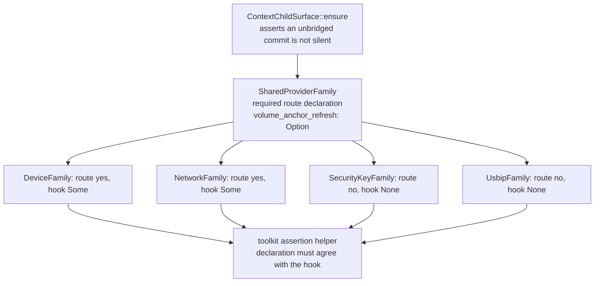
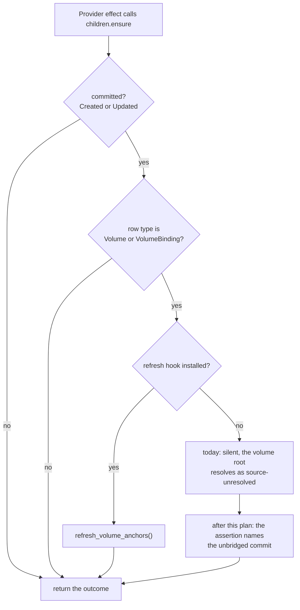
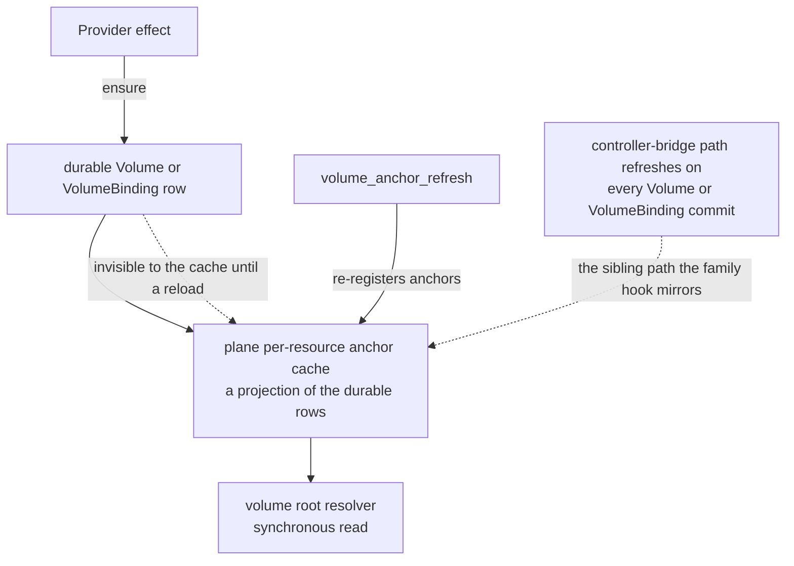

# Guard the Volume-Anchor Refresh Bridge Across Provider Families - Plan

Superseded by [`2026-09-19-002-refactor-durable-commit-projection-refresh-plan.md`](./2026-09-19-002-refactor-durable-commit-projection-refresh-plan.md), which moves the anchor refresh to the manager's commit point and deletes the per-family hook this plan guarded. The guard-shaped approach here is retained as the decision record for that alternative.

## Goal Capsule

- **Objective:** Close issue #531's two acceptance criteria: a family whose effects commit a `Volume` or `VolumeBinding` child row can no longer answer `None` from the Volume-anchor refresh hook without a failing test, and the remaining families' answers are confirmed and recorded in the tree.
- **Product authority:** GitHub issue #531 owns the acceptance criteria. `AGENTS.md` and `tests/AGENTS.md` own the contributor and test-placement rules this change must satisfy.
- **Open blockers:** None.
- **Stop condition:** `make check` passes on the change's head, each requirement below is verified, and every family listed under Requirements carries its recorded pairing test.
- **Tail ownership:** The executing agent owns the PR tail per `AGENTS.md`: independent review in a clean context, changelog fragment, squash merge with an expected-head guard.
- **Known residual:** A family that commits a Volume child row while declaring it does not is not statically detectable. The plan states this limit rather than claiming the invariant is proven (see Risks & Dependencies).

---

## Product Contract

### Summary

Make the Volume-anchor bridge a checked invariant instead of a documented expectation. `SharedProviderFamily` gains a required declaration of whether the family's effects may commit a `Volume` or `VolumeBinding` child row; each family pairs that declaration with its `volume_anchor_refresh` answer in an owner-local test; and the shared child surface stops dropping an unbridged Volume commit silently. The security-key and usbip families are confirmed to commit no such row, and their `None` answer is recorded beside their own implementations.

### Problem Frame

The plane re-registers per-resource Volume anchors only when a family bridges `volume_anchor_refresh`. The trait method defaults to `None`, and `ContextChildSurface::ensure` refreshes anchors only when the family supplies a hook (`packages/d2b-provider-toolkit/src/shared_provider.rs:504-506`). A family whose effect commits a `Volume` row without the hook leaves that row invisible to the plane's anchor cache, so the volume root resolves forever as `volume-anchor` / `source-unresolved`.

Only the network family implemented it originally. The Device family's TPM state Volume hit exactly that loop and produced `driver reconcile error kind=volume-layout-effect-failed note=source-unresolved`, `Effect(EffectRejected)`, and two failed wait budgets before `7dfe2c083` fixed it.

The mistake is silent where it is made: the family compiles, the effect commits the row, and only a multi-minute VM check reveals it. The trait's documentation states the requirement; nothing enforces it.

Current state, verified by repo-wide search and direct reading:

| Family | Crate | `volume_anchor_refresh` | Volume child route |
|---|---|---|---|
| `DeviceFamily` | `packages/d2b-provider-device/src/driver.rs:205` | `Some(DeviceAnchorRefresh)` at `:252-254` | yes, effect-committed: the TPM state Volume is created inside the effect through `children.ensure` (`packages/d2bd/src/tpm_effect_port.rs:229-233`) |
| `NetworkFamily` | `packages/d2b-provider-network-local/src/driver.rs:181` | `Some(NetworkAnchorRefresh)` at `:234-236` | yes, declared: the config Volume is a child row and `NETWORK_CREATIONS` names `WellKnownType::VOLUME` (`:104-110`) |
| `SecurityKeyFamily` | `packages/d2b-provider-device-security-key/src/driver.rs:183` | inherits `None` | no: `desired_children` declares only `Process`/`Endpoint` rows (`:191-273`), built by the relay-child helper at `:479-508` |
| `UsbipFamily` | `packages/d2b-provider-device-usbip/src/driver.rs:129` | inherits `None` | no: the Service declares no children (`:144-146`), the Binding arm materializes only `BindingChildKind` rows (`:147-158`, `:307-331`), and `owns_child` admits no Volume (`packages/d2b-provider-device-usbip/src/controller.rs:272-279`) |

The no-existing-guard finding is the point: the toolkit's only related test (`packages/d2b-provider-toolkit/src/shared_provider.rs:1720-1787`) proves that the surface calls the hook for a Created or Updated Volume row. It says nothing about whether any family supplies one.

### Requirements

**The declaration and its pairing**

- R1. `SharedProviderFamily` declares, as a required trait item with no default, whether the family's effects may commit a `Volume` or `VolumeBinding` child row through the shared child surface. Every implementor states it; omitting it is a compile error.
- R2. For every implementor, the declaration and the hook agree. A family that declares the route answers `Some`; a family that denies it answers `None`. The four production families hold the answers recorded in the table above.
- R3. The pairing is asserted by an owner-local test in each family's own crate, calling one toolkit-owned assertion helper. The family tests state their own route evidence.
- R4. A family that denies the route also pins the absence of a declared Volume or VolumeBinding child row in its own `desired_children` output, so a declared route cannot appear without failing that family's test.

**The unbridged commit**

- R5. A committed `Volume` or `VolumeBinding` child row that reaches the shared child surface with no refresh hook installed is no longer silent: the surface asserts the invariant, and a toolkit test covers both the firing and the non-firing cases.

**The record and the rules**

- R6. The two families that answer `None` carry a recorded verdict in their own crate tests: the family commits no `Volume` or `VolumeBinding` child row, with the evidence named. This is issue #531's second acceptance criterion.
- R7. The trait documentation states the rule, the new declaration, and where the pairing is asserted, so the next family author finds the guard from the trait itself.
- R8. The change adds no gate, no repository-wide policy class, no gate wiring, and no `tests/*.sh`; it ships one changelog fragment. Release-build behavior is unchanged.

### Acceptance Examples

- AE1. Given a family that declares it may commit a `Volume` or `VolumeBinding` child row, when it answers `None` from `volume_anchor_refresh`, then its owner-local test fails and names the missing hook.
- AE2. Given a family that denies the route, when it answers `Some`, then its owner-local test fails, naming the declaration it contradicts.
- AE3. Given a child surface with no refresh hook, when an effect commits a `Volume` row through it, then the unbridged commit is asserted rather than dropped; a non-Volume row and an unchanged Volume row assert nothing.
- AE4. Given the security-key and usbip families, their denial, their `None` answer, and their Volume-free child sets stay pinned by their own tests.

### Scope Boundaries

**Deferred to follow-up work**

- A production-visible diagnostic for an unbridged commit. Issue #531 asks for a failing test or check, and the surface has no diagnostic channel today. The detector is gated to assertion builds, so a release build stays silent on this path (KTD3).
- Closing issue #531 itself. The durable record lives in the two family crates per R6; the issue comment is tail work.

**Outside this plan**

- The plane's anchor cache, the controller-bridge refresh path, and volume root resolution. They are the reason the hook exists, not part of the guard.
- Any change to `DriverDescriptor.creations` or `DriverDescriptor.reads`. `creations` is the toolkit's creation fence over declared, driver-owned child rows, and `reads` means "reads while reconciling". Widening either would authorize a child commit or misstate a read, which is a product change outside this issue (KTD4).
- Volume-owning providers outside the shared-family framework, such as the guest and volume providers.
- Any other issue in the 30-day window, including #530 and #520.

### How This Work Fits Together

<!-- ce-section: work-relationships -->

This plan owns one area: the guard for the shared-family Volume-anchor bridge.

- Depends on the shared-family framework in `packages/d2b-provider-toolkit/src/shared_provider.rs` as it stands, including the surface refresh trigger and the existing mechanism test.
- Sibling work that edits the same files: `docs/plans/2026-09-18-002-refactor-finish-provider-crate-isolation-plan.md` (issue #516) touches the security-key and usbip driver files. Sequence after that lane or coordinate, so those files are not edited twice.
- No conflict with `docs/plans/2026-09-18-001-refactor-residual-scaffolding-removal-plan.md` (issue #500), which touches neither the families nor the hook.
- Closes: issue #531.

---

## Planning Contract

### Key Technical Decisions

- KTD1. Enforce the bridge with a required family declaration paired to the hook and asserted by owner-local tests, not with a source-scanning repository check. Rationale: only the family knows whether its effect commits a Volume row, and the two commit routes differ in observability. Network's config Volume is a declared child row, while Device's TPM state Volume is created inside the effect and is invisible to every descriptor field (`device_descriptor` declares `creations: &[]`). A source scan would therefore catch Network and silently miss Device, the family issue #531's own narrative says regressed. This departs from the repo-check arm named in the scope call-out; that arm is rejected for the missed-Device reason, and the alternative is recorded under Alternatives below.
- KTD2. The declaration is required with no default, while `volume_anchor_refresh` keeps its `None` default. Rationale: a defaulted declaration recreates the issue's own failure mode, because a new family silently inherits the denying answer and no author reads it; a required item puts the fact in front of every implementor at compile time. Removing the hook default instead only forces a redundant explicit `None` from the families that deny the route, which their pairing test already covers. Cost: five implementors, one line each.
- KTD3. The detector is an assertion at the commit site, not a production refusal and not a new diagnostic channel. `ContextChildSurface::ensure` already computes the exact condition, a committed `Volume` or `VolumeBinding` row with no hook installed. Asserting it turns the issue's silent failure into a test-visible one at zero release cost; returning a typed error would change the effect's failure mode beyond what the issue asks for.
- KTD4. `DriverDescriptor.creations` and `DriverDescriptor.reads` are not reused as the fact source. `creations` is an authorization declaration, not documentation, and the guest registration test treats it as one ("the toolkit's creation fence authorizes them", `packages/d2b-provider-guest/tests/registration.rs:159-161`); Device declares `creations: &[]` while committing a Volume, and both Device and Network list `VOLUME` in `reads`, which means "reads while reconciling". Making the guard convenient by widening the fence would authorize child commits.
- KTD5. The assertion logic lives in one exported toolkit helper called from each family's own test. The family structs are private and reachable only inside their crate, and a shared crate cannot depend on provider crates (`docs/plans/2026-09-18-002-refactor-finish-provider-crate-isolation-plan.md`, KTD7). The dependency direction stays provider to toolkit, and the pairing logic stays single-sourced.

### High-Level Technical Design

Who declares the fact, who asserts it, and where the two meet.

The commit-time decision the assertion is placed on.

Why the hook matters, and why the failure only shows up in a VM check.

### Alternatives Considered

- **Source-scanning policy check** (extend `check-provider-crate-layout` in `packages/xtask/src/provider_crate_policy.rs`). Rejected by KTD1: it cannot see effect-committed Volume rows, so it would pass a Device-shaped regression. It would also add nothing over the required declaration, which already makes omission a compile error, plus a typed assertion that a text scan cannot match.
- **Removing the `volume_anchor_refresh` `None` default so omission is a compile error.** Rejected by KTD2: it does not catch the bug, because a family that commits a Volume row and writes an explicit `None` still compiles. It only adds an explicit `None` to the families that correctly deny the route.
- **Reusing or widening `DriverDescriptor.creations`.** Rejected by KTD4: it is the creation fence, and Device already under-reports against it.
- **Failing the effect when a Volume row commits with no hook.** Rejected by KTD3: it changes the effect failure mode from a late unresolved root to an immediate rejection, which is a product decision this issue does not make.

### Assumptions

- The five `SharedProviderFamily` implementors found by repo-wide search are the complete set: the four production families plus the toolkit's `RecordingFamily` test double (`packages/d2b-provider-toolkit/src/shared_provider.rs:1311`). No implementor exists outside `packages/`.
- The Device TPM state Volume reaches the shared child surface through `children.ensure`, and no other Device effect commits a Volume row.
- `#[deny(missing_docs)]` is set on the toolkit crate, so the new trait item and helper need doc comments to build.
- The declaration is a deliberate, review-visible statement by the family author. The plan does not claim a static mechanism can verify the declaration against an effect body.

### Deferred Implementation Notes

- Whether the security-key and usbip crates can build a `ResourceContext` for U3's Volume-free assertion is an execution-time discovery. Network-local already does it (`packages/d2b-provider-network-local/src/driver.rs:584-601`); the other two crates have no such fixture today. If the fixture proves impractical in either crate, pin the same fact against that family's declared row-kind source instead, the relay-child helper and Binding child set for security-key, the Service arm and `owns_child` for usbip, and record in the test which form was used. Do not drop the pin.
- The concrete shape of the route declaration, a boolean item versus a `WellKnownType` slice, is an implementation choice. It must stay one required item with no default, and its doc comment must name both row kinds.

### Risks & Dependencies

- **The declaration is trusted.** A family that adds a Volume-committing effect while declaring no route keeps a green suite. No static mechanism sees effect-committed rows (KTD1), so this residual is stated rather than closed. Mitigations: the declaration is compile-error required and sits beside the hook in the family's own driver; the commit-site assertion turns the mistake into a failing test whenever any test drives that path; and the mistake class itself becomes review-visible, which is what issue #531 exists to achieve.
- **In-flight coordination.** Issue #516's Device lane edits `packages/d2b-provider-device-*/` driver files, including security-key and usbip. Land this change after that lane, or coordinate, so the same files are not edited twice.
- **The assertion can fire in a future test double.** A double that mimics a Volume-committing family without installing a hook will now assert. That is the intended behavior. The toolkit's existing `RecordingFamily` already installs a hook, so the existing mechanism test is unaffected.
- **A policy gate could read the new declaration as a new policy class.** It is not one: the change extends no `xtask` check and adds no repository-wide policy class, so `tests/AGENTS.md`'s closed-set rule is honored (R8).

### Sequencing

1. U1 lands first; U2, U3, and U4 all depend on the declaration it introduces.
2. U1 is the only unit that edits `packages/d2b-provider-toolkit/src/shared_provider.rs`, including the trait documentation required by R7, so the shared file is edited once.
3. U2 and U3 are independent of each other and may land in either order.
4. U4 closes the set.
5. `make check` runs after the last unit.

### System-Wide Impact

The change is internal to the workspace and operator-invisible.

- Crate-visible: `SharedProviderFamily` gains a required item, so all five implementors change. Provider crates already depend on the toolkit; no dependency edge is added or reversed.
- Daemon-visible: none. `packages/d2bd/src/resource_plane_v3.rs:1942-1972` registers families through descriptors and is untouched, as are the production effect ports.
- Build-visible: no `BUILD.bazel`, `Cargo.toml`, or lockfile change is expected. The toolkit's `testing` module is already exported and the crate's existing `d2b_provider_toolkit_test` target compiles `src` tests.
- Runtime-visible: release builds are unchanged. Assertion builds gain one assertion on a path that only fires for a family that is already broken.
- Failure propagation: every failure mode is compile-time or test-time, which is the point of the change.

---

## Implementation Units

### U1. Declare the Volume-child route on the family trait and make an unbridged commit loud

- **Goal:** `SharedProviderFamily` requires each family to state whether its effects may commit a `Volume` or `VolumeBinding` child row; a toolkit helper asserts that statement against the family's hook; and the shared child surface asserts an unbridged Volume or VolumeBinding commit instead of dropping it.
- **Requirements:** R1, R3, R5, R7, AE1, AE2, AE3
- **Dependencies:** None.
- **Files:**
  - `packages/d2b-provider-toolkit/src/shared_provider.rs`
  - `packages/d2b-provider-toolkit/src/testing/mod.rs`
- **Approach:**
  1. Add the route declaration to `SharedProviderFamily` as a required item with no default. Keep it minimal: the guard needs the pairing, not a per-kind inventory. Reuse `WellKnownType` only for the doc reference to the two row kinds, and name the semantic in the item's doc comment as "may commit a Volume or VolumeBinding child row through the shared child surface".
  2. Extend the `volume_anchor_refresh` doc comment to state the rule, the new declaration, and where the pairing is asserted (R7). The existing text already states the requirement; it now names its enforcement.
  3. Add the assertion helper to the toolkit's `testing` module as a plain exported function, so it is reachable from provider crates' `#[cfg(test)]` tests without a feature flag. It takes a family and fails when the declaration and `hook.is_some()` disagree, with a message naming the family and the missing or surplus hook.
  4. Migrate `RecordingFamily` to state the route; it already installs a hook via `RefreshAdapter`, so its declaration is the affirmative one.
  5. In `ContextChildSurface::ensure`, assert the invariant on the existing `committed_row` computation: a committed Volume or VolumeBinding row with `refresh == None` is asserted with a message naming the family hook requirement. Do not change the return type or the refresh call.
  6. Extend the toolkit's existing mechanism test module with the new cases, including a `#[should_panic]` case for the unbridged commit and non-firing cases for a non-Volume row and an unchanged Volume row.
- **Patterns to follow:** the existing mechanism test `volume_anchor_refresh_covers_created_and_updated_volume_children` (`packages/d2b-provider-toolkit/src/shared_provider.rs:1720-1787`) for how these cases are built and what they assert; the `RecordingFamily` hook override at `:1371-1373` (an affirmative hook, which its declaration must therefore match).
- **Execution note:** the deliverable of this unit is itself a pair of failing assertions, so build them test-first: add the unbridged-commit case and the mis-paired-declaration case as failing tests, then land the declaration, the helper, and the surface assertion that turn them green.
- **Test scenarios:**
  - Declaring the route with `Some` passes the helper.
  - Declaring the route with `None` fails the helper, and the message names the missing hook. Covers AE1.
  - Denying the route with `None` passes the helper.
  - Denying the route with `Some` fails the helper, and the message names the contradicted declaration. Covers AE2.
  - A surface built with no hook that commits a `Volume` row asserts. Covers AE3.
  - A surface built with no hook that commits a non-Volume row does not assert, and one that commits an unchanged Volume row does not assert. Covers AE3.
  - A surface built with a hook still calls `refresh_volume_anchors` for a Created and an Updated Volume row, preserving the existing behavior the current mechanism test pins.
- **Verification:** `//packages/d2b-provider-toolkit:d2b_provider_toolkit_test` passes; the crate builds with `#![deny(missing_docs)]` intact; `RecordingFamily` states the route and the toolkit's own tests stay green.

### U2. State the route and record the pairing for the Device and Network families

- **Goal:** The two families that commit Volume child rows declare the route and carry a test pinning that declaration against their hook.
- **Requirements:** R2, R3, AE1
- **Dependencies:** U1
- **Files:**
  - `packages/d2b-provider-device/src/driver.rs`
  - `packages/d2b-provider-network-local/src/driver.rs`
- **Approach:**
  1. `DeviceFamily` (`packages/d2b-provider-device/src/driver.rs:205`) declares the route. The test comment records the route evidence: the TPM state Volume is created inside the effect through the child surface (`packages/d2bd/src/tpm_effect_port.rs:229-233`), and `desired_children` returns `Ok(None)` (`:213-223`), so the row is invisible to every descriptor field. This is why the guard cannot be a metadata scan (KTD1).
  2. `NetworkFamily` (`packages/d2b-provider-network-local/src/driver.rs:181`) declares the route, with the declared-route evidence: the config Volume is a child row and `NETWORK_CREATIONS` names `WellKnownType::VOLUME` (`:104-110`).
  3. Add one `#[cfg(test)]` test per crate calling the toolkit helper on the private family struct, which is reachable from inside the same module.
- **Patterns to follow:** the existing driver test modules in both crates, which already construct the private family and its descriptors.
- **Test scenarios:**
  - Device's pairing test passes with the route declared and `Some` returned.
  - Network's pairing test passes with the route declared and `Some` returned.
  - Removing either `volume_anchor_refresh` override fails that family's test with the helper's message, which is the regression this unit exists to catch.
  - Each test keeps compiling and passing against the family's real `volume_anchor_refresh`, not a stub, so the assertion covers the shipped answer.
- **Verification:** Each crate's own `d2b_rust_test` target from that crate's `BUILD.bazel` passes; `make test-rust` stays green.

### U3. Record the audited verdict for the security-key and usbip families

- **Goal:** The two families that answer `None` state the denial, pin their Volume-free child sets, and record the evidence for issue #531's second acceptance criterion.
- **Requirements:** R2, R4, R6, AE2, AE4
- **Dependencies:** U1
- **Files:**
  - `packages/d2b-provider-device-security-key/src/driver.rs`
  - `packages/d2b-provider-device-usbip/src/driver.rs`
- **Approach:**
  1. `SecurityKeyFamily` (`packages/d2b-provider-device-security-key/src/driver.rs:183`) states the denial and adds a pairing test. The test records the verdict and its evidence: `desired_children` declares only `Process` and `Endpoint` rows (`:191-273`), built by the relay-child helper at `:479-508`; the Binding child kind set is closed to `Process`, `EphemeralProcess`, and `Endpoint` (`packages/d2b-contracts-provider/src/v3/semantic_services/child_resources.rs:17-26`); and no Volume symbol exists in the crate.
  2. `UsbipFamily` (`packages/d2b-provider-device-usbip/src/driver.rs:129`) states the denial and adds a pairing test. The test records the verdict and its evidence: the Service declares no children (`:144-146`), the Binding arm materializes only `BindingChildKind` rows (`:147-158`, `:307-331`), `owns_child` admits no Volume (`packages/d2b-provider-device-usbip/src/controller.rs:272-279`), and the crate documents no state Volume.
  3. Each test additionally asserts over its own family's `desired_children` output that no row is a `Volume` or `VolumeBinding` (R4), so a declared route cannot appear without failing that family's test. Build that assertion on the pattern the network-local driver test module already proves: a recording manager double, `ResourceContext::new(...)`, and the real driver from `descriptor.factory.create(ctx.key())` (`packages/d2b-provider-network-local/src/driver.rs:584-601`, `:631-653`).
  4. Keep the recorded verdict as a test-local comment naming the evidence above, so a reader in six months finds it beside the family that owns the fact rather than in this plan.
- **Test scenarios:**
  - Security-key's pairing test passes with the denial and `None` returned.
  - Usbip's pairing test passes with the denial and `None` returned.
  - Each test asserts that the family's `desired_children` output contains no `Volume` or `VolumeBinding` row for a representative spec; a future Volume row fails it.
  - Adding a `volume_anchor_refresh` override to either family without flipping its declaration fails that family's test. Covers AE2.
  - Both families remain green after U1's required declaration, proving the denial path compiles and its answer is recorded rather than inherited silently. Covers AE4.
- **Verification:** Each crate's own `d2b_rust_test` target from that crate's `BUILD.bazel` passes; the two recorded verdicts are readable in the tests; `make test-rust` stays green.

### U4. Sweep the implementor set and ship the changelog fragment

- **Goal:** No `SharedProviderFamily` implementor lacks a declaration, and the change carries its changelog fragment.
- **Requirements:** R1, R8
- **Dependencies:** U1, U2, U3
- **Files:** `changelog.d/<branch-name>.md`
- **Approach:**
  1. Sweep every `impl SharedProviderFamily` across `packages/` and confirm the set is exactly the four production families plus `RecordingFamily`, each carrying the declaration from U1 or U2 or U3. The compile error from the required item is the primary evidence; the sweep confirms no implementor was missed by a non-Rust carrier.
  2. Confirm no `BUILD.bazel`, `Cargo.toml`, lockfile, `Makefile`, workflow, or `tests/*.sh` change is needed, and that no `xtask` check was extended.
  3. Write one `changelog.d/<branch-name>.md` fragment under `### Added` and `### Changed`, describing the required declaration, the pairing assertion, and the unbridged-commit assertion as a provider-authoring guard, and noting that release-build behavior is unchanged.
- **Test expectation:** none - sweep and changelog only; `make test-changelog` guards the fragment and the compiler guards the sweep.
- **Verification:** A repo-wide search for `impl SharedProviderFamily` returns exactly the five named implementors; `make test-changelog` passes; the diff contains no gate, policy, or test-runner addition.

---

## Verification Contract

| Gate | Command | Applies to | Evidence |
|---|---|---|---|
| Layer-1 aggregate | `make check` | Whole change | Green on the change's head |
| Rust lanes | `make test-rust` | U1, U2, U3 | The toolkit and the four family crates compile and their tests pass |
| Focused toolkit tests | `bazel test //packages/d2b-provider-toolkit:d2b_provider_toolkit_test` | U1 | Pairing-helper directions and the surface assertion cases |
| Focused family tests | Each crate's own `d2b_rust_test` target from that crate's `BUILD.bazel` | U2, U3 | The four pairing tests and the two Volume-free `desired_children` assertions |
| Implementor sweep | Repo search for `impl SharedProviderFamily` over `packages/` | U4 | Exactly five implementors, each stating the route |
| Changelog | `make test-changelog` | U4 | Fragment present and well-formed |
| Policy | `make test-policy` | Whole change | Passes unchanged; no policy class, allowlist row, or layout-check edit is added |

Behavioral proof for the guard is the family tests themselves: they call the shipped `volume_anchor_refresh` and fail when it disagrees with the declaration, which is the observable contract issue #531 asks for.

---

## Definition of Done

**Global**

- R1 through R8 are each verified with the evidence named in the Verification Contract.
- `make check` passes on the change's head.
- Every `SharedProviderFamily` implementor states the route; the Device and Network families keep their hooks; the security-key and usbip families keep `None` and carry the recorded verdict.
- Release-build behavior is unchanged, and no gate, policy class, gate wiring, or `tests/*.sh` is added.
- One changelog fragment is present; no scratch, experimental, or abandoned-attempt file is left in the diff.
- The known residual from Risks & Dependencies is stated in the plan and not presented as closed.
- The review tail follows `AGENTS.md`: independent review in a clean context, fixes validated, fresh review after any head change.

**Per unit**

| Unit | Done when |
|---|---|
| U1 | The route declaration is required, the helper asserts both directions, an unbridged Volume or VolumeBinding commit asserts at the surface, `RecordingFamily` states the route, and the toolkit tests pass |
| U2 | Device and Network declare the route, their pairing tests pass against their real hooks, and each test records its own route evidence |
| U3 | Security-key and usbip deny the route, their pairing and Volume-free tests pass, and each test records the audited verdict with its evidence |
| U4 | The implementor sweep finds exactly five families, each stating the route, and the changelog fragment is present |

---

## Sources / Research

- Issue #531, `resource plane: a family that commits a Volume child row must bridge the anchor-refresh hook`: `https://github.com/vicondoa/d2b/issues/531`. Acceptance criteria and the Device incident narrative.
- The hook and its trigger: `packages/d2b-provider-toolkit/src/shared_provider.rs:170-177` (trait method and doc), `:428-431` (`VolumeAnchorRefresh`), `:464-512` (`ContextChildSurface` and the `committed_row` computation at `:504-506`), `:980` and `:1043` (the driver's two surface construction sites).
- The existing mechanism test, which proves surface behavior but not any family's answer: `packages/d2b-provider-toolkit/src/shared_provider.rs:1720-1787`.
- Family implementations: `packages/d2b-provider-device/src/driver.rs:205`, `:213-223`, `:252-254`; `packages/d2b-provider-network-local/src/driver.rs:181`, `:234-236`; `packages/d2b-provider-device-security-key/src/driver.rs:183`, `:191-273`, `:479-508`; `packages/d2b-provider-device-usbip/src/driver.rs:129`, `:144-158`, `:307-331`; toolkit `RecordingFamily` at `packages/d2b-provider-toolkit/src/shared_provider.rs:1311`, `:1371-1373`.
- Test-fixture precedent for driving `desired_children` in a provider crate: `packages/d2b-provider-network-local/src/driver.rs:584-601` (the `ResourceContext` fixture) and `:631-653` (the reconcile test that uses it).
- Route evidence: `packages/d2bd/src/tpm_effect_port.rs:229-233` (Device's effect-committed TPM state Volume), `packages/d2b-provider-network-local/src/driver.rs:104-110` (`NETWORK_CREATIONS` names `WellKnownType::VOLUME`), `packages/d2b-provider-device/src/driver.rs:309` and `:213-223` (Device declares no creations and no children), `packages/d2b-provider-device-usbip/src/controller.rs:272-279` (`owns_child` admits no Volume), `packages/d2b-contracts-provider/src/v3/semantic_services/child_resources.rs:17-26` (the Binding child kind set).
- The creation fence, which forbids reusing `creations`: `packages/d2b-provider-guest/tests/registration.rs:159-161`; `packages/d2b-provider-guest/src/driver.rs:656-714` (the declared driver-owned and controller-owned rows the fence authorizes).
- Contributor rules: `AGENTS.md` (code is canon; no new gates, linters, or hooks; changelog requirement for every code change), `tests/AGENTS.md` (new coverage lands as Layer-1 types 1-6; no new `tests/*.sh`; repository-wide policy is a closed set), `docs/contributing/gates-and-lints.md` (gate aliases and the dead-code lane).
- In-flight coordination: `docs/plans/2026-09-18-002-refactor-finish-provider-crate-isolation-plan.md` (issue #516; its Device lane edits the same driver files, and its KTD7 forbids a shared crate depending on a provider crate), `docs/plans/2026-09-18-001-refactor-residual-scaffolding-removal-plan.md` (issue #500; no overlap).
