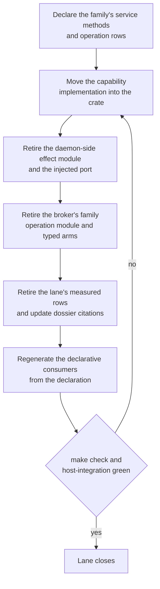
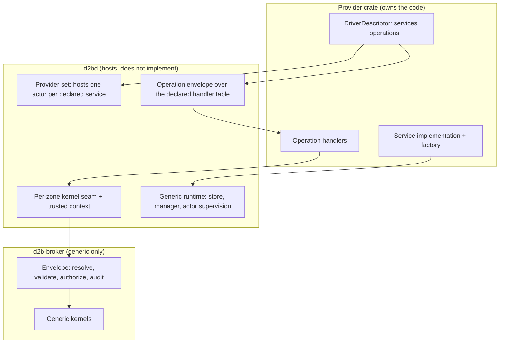

# Legacy effect ports removal - Plan

## Goal Capsule

- **Objective:** End the effect-port migration. When this program completes, no family capability implementation, declared-but-unbuilt effect surface, or broker-side family operation module lives outside the provider crate that declares it, and the vocabulary those providers import from shared code is declared per crate and generated into its consumers.
- **Product authority:** This contract, settled in dialogue 2026-09-19. `docs/plans/2026-09-14-001-refactor-provider-services-broker-seam-plan.md` (R1, R6, R11, R13-R15) and `docs/plans/2026-09-18-002-refactor-finish-provider-crate-isolation-plan.md` stay in force and are cited here for the end state they name; issues #516 and #523 remain the tracking issues, and `docs/adr/0046-d2b-3-provider-control-plane.md` owns the normative effect-port statement until U13 amends it.
- **Open blockers:** none.
- **Stop conditions:** every family lane closes with `make check` and `make test-host-integration` green on its own head; the family-knowledge inventory is retired to its closed carve-out list; the layout check, the fixture contracts, the cross-binary proof gate, and the host-state operation proof pass on the final head.
- **Tail ownership:** each lane is built in its own isolated worktree, receives independent review in a clean context, and merges through a reviewed pull request with a squash merge and an expected-head guard, per `AGENTS.md`.

---

## Product Contract

### Summary

Each family's driver capability becomes a service the provider crate itself declares and implements, hosted by the daemon but owned by the provider. Each cross-boundary operation is declared and handled by its provider crate over broker-generic kernels, and the shared vocabulary those crates import is declared per crate and generated into its consumers. Lanes land one family at a time, each deleting its own old path.

### Problem Frame

The provider-per-crate migration moved every driver into its own crate and gave the broker a generic operation envelope, and the provider-services seam built the mechanism to replace daemon-side effect ports: declared service methods, a hosted effect-service actor with generational bindings, broker-attested trusted context, declared state cells, and descriptor carriage on the forward carrier. What remains is the move itself, and it is large and unevenly distributed.

Every injected driver capability is still implemented in the daemon. The daemon's effect modules hold the production half of the provider-declared capability ports - activation, binding, credential, endpoint, guest, process, volume, host, user, network, device, interaction, and the TPM boundary - each constructed per zone and handed to a driver as an externally built port, and each holding either a daemon state handle, a per-zone registry, a state root, or a daemon-caller broker dispatch.

Some ports already have provider-side implementations, so the current state is not "every port is daemon-implemented" and the lane inventory must be derived family by family rather than assumed. The network family declares and implements its controller port in its own crate, and the neutral process-launch port has provider-side implementations in the supervisor and both process providers. The daemon then converts those implementations back into injected ports at the composition site, so no lane has yet demonstrated the injection-free delivery this program requires, and the two landed families still owe that conversion's removal. The two families that did land prove the envelope and handler shape works; they did not generalize it.

The operation half lags the same way. Two provider crates declare operation handlers; the remaining committed family operation rows are still served by broker modules that the broker runtime references directly, tens of thousands of lines of per-family privileged work whose behavior is only observable through the daemon and the host.

One declared-but-unbuilt surface still stands: the neutral volume effect-port contract with its host wrapper, kept because an earlier plan recorded it as a scheduled interface with an owning task. The process providers' spawn ports and the transport crate's effect-port module are already retired. It is the same class of surface this program exists to retire.

The cost is a boundary that cannot be defended mechanically. The exemption inventory that measures family knowledge in shared crates holds about 608 rows at this head, and rules that add a provider fact require edits across the crate, the shared consumers, and hand-maintained tables. Every lane of the seam plan's rollout has moved one family, and no gate prevents the next one from re-introducing a daemon-side effect port instead of declaring it.

Recorded implementation state, 2026-09-21: every family lane has delivered its move, and each lane is either merged or in its final review pass. The problem statement above describes the state the programme opened against, not the current tree. The process and network-local families are converted and merged on the mainline, the host family's probe effect is merged with a named residual, and the registration rows of all three ride the generated table, as do the enabling units U2-U4. Every remaining family lane is converted on its branch and awaits merge; none is counted as landed until its head is in the tree, and the per-unit inventory lives in the unit table below. Two kinds of partial conversion exist and are named per unit: families whose substantive launch, reconcile, or probe behaviour remains daemon-side (host, process, network-local), and families whose lane retires the port while a documented daemon-side runtime or composition surface stays (credential, interaction and desktop). The process providers' spawn ports and the transport effect-port module are retired rather than converted (U1's retirement half); the neutral volume contract retires with the volume lane (KD3) and still stands on the mainline until that lane merges.

### Key Decisions

- KD1. **This contract owns the end state for effect ports, cross-boundary operations, provider-owned vocabulary, and their generated consumers.** The seam plan's remaining family rollout and the isolation plan's unlanded lanes are superseded where they overlap; their landed units and their measurement stay. (session-settled: user-directed - chosen over an effects-only scope: a provider cannot be self-contained while the vocabulary it reads still lives in shared crates.) Governs R1-R14.
- KD2. **Provider services execute in the daemon's privilege domain.** The boundary is the declared capability object, not a process boundary. (session-settled: user-directed - chosen over isolated provider processes and a declared split: the seam plan already accepted the shared privilege domain, and isolation machinery is not this program's work.) Governs R19.
- KD3. **No declared-but-unbuilt effect surface survives**, including the scheduled neutral volume contract and its host wrapper. (session-settled: user-directed - chosen over retaining the scheduled interface with its owning task: nothing effect-port-shaped remains, and the contract returns later as a declared provider service.) Governs R3.
- KD4. **One family at a time**, each lane carrying its own declaration, implementation move, and old-path deletion. (session-settled: user-directed - chosen over capability-first and declaration-first sequencing: each lane stays independently verifiable and reversible.) Governs R15.
- KD5. **Every lane closes on the full gate pair**, not only the program end. (session-settled: user-directed.) Governs R16.
- KD6. **The completion bar is static proof plus a zero-outside-edit demonstration plus live lanes.** (session-settled: user-directed - chosen over static-only and static-plus-gate: only a live lane catches a silently broken host effect.) Governs R9, R16, R18, R20.
- KD7. **A provider's own private internal traits are not effect ports.** Only externally injected family capability ports die. (session-settled: user-approved: the proposal and its trade-off were surfaced in dialogue and assented to.) Governs R4.

### Requirements

**Removal and ownership**

- R1. No family capability implementation lives outside the provider crate that declares it.
- R2. No provider driver receives an externally constructed capability port; a driver obtains host capabilities by invoking its declared services.
- R3. Every declared-but-unbuilt effect surface is deleted, including the process providers' declared spawn ports and the neutral volume effect-port contract with its host wrapper.
- R4. A provider's own private internal traits are not effect ports, and only externally injected family capability ports die.

**Service contract**

- R5. Each provider declares the services it serves, and every declared service has a provider-supplied implementation behind the hosting factory, so startup refuses a declared service with no implementation.
- R6. A declared service method carries the facets its callers need: payload schema reference, request and response descriptor contracts, declared state cells, required privileges, and a deadline tier.
- R7. A provider service reaches resource state through a generic driver context against the resource store and daemon-structural state only through declared state cells.
- R8. A service method's payload and capability contract is the real envelope contract rather than the hosting fixture's placeholder payload.

**Operation contract**

- R9. Every committed family operation row is declared and handled by its provider crate; the broker's family operation modules and the typed wire variants they serve retire. For a privileged or broker-state-resolving operation, this nested-kernel model supersedes the isolation plan's broker-owned-row carve-out.
- R10. A family operation's privileged core is a broker-generic kernel the provider handler invokes as a nested call, preserving the invocation's evidence chain.
- R11. Adding a cross-boundary operation requires no edit outside the declaring provider crate: the crate's operation declaration is the declaration surface, and the committed operation rows with their derived views are generated from it.

**Vocabulary and generation**

- R12. A family fact a provider owns is declared in that crate and generated into its shared consumers, so adding, renaming, or removing one needs no edit outside the owning crate except the workspace member line. The class is every fact a shared consumer reads; an authority-bearing fact a declaration carries - a role's operations, principals, storage roots, seccomp classes, device classes, and capability grants - is validated against a committed per-crate scope, so widening one fails as a gated change rather than regenerating silently.
- R13. Shared crates hold only resource-runtime-generic mechanisms, and the family-knowledge inventory is retired to documented permanent carve-outs that each name why they are permanent. That carve-out list is closed and bounded to the classes KD7 accepts, and the completion proof reports the residual surface explicitly.
- R14. The Nix consumers and host-contract rows a provider fact feeds are generated from the declaration, with a drift gate pinning each generated artifact to it. The same generation or an explicit hand-maintained-exception record covers the broker and daemon privileged-operation modules and wire-vocabulary carve-outs whose reason claims a committed view of provider-declared vocabulary.

**Delivery and proof**

- R15. Lanes land one family at a time. A lane's implementation move and the retirement of the paths that move obsoletes land in the same change with no shim; a declared-but-unbuilt surface may retire ahead of its family's move as its own reviewed change inside the same unit, which stays open until that family's move lands. The two landed families carry one finishing unit each: the process family first, the network family after it.
- R16. `make check` and `make test-host-integration` pass on every lane's head, not only at the program end. A skipped lane is not a pass.
- R17. No operator-visible behavior change: the same resources, rows, launcher vocabulary, audit records, refusals, and bundle generation identity keep working, including restart adoption of an already-provisioned zone. The critical-subsystem invariants for the surfaces a lane touches - fail-closed identity binding, no caller-supplied device paths or per-guest units, the single repair owner rule, and no raw handles crossing the public API - are preserved behavior and are asserted by that lane's live check.
- R18. Every host surface a lane touches is asserted by the lane's own live check, which is that surface's owning check when no owning integration check exists. A migrated operation whose effect stays inside the hermetic lane is proven end to end across the broker and daemon with descriptor carriage and audit continuity by extending the cross-binary proof shape to that operation; a migrated operation whose effect mutates host state the hermetic lane cannot host is proven by its owning host-integration check instead, and the lane names the operations it exercised live and the surface it could not. The lane's proof record maps every migrated operation to the scenario that exercises it, and an unmapped or unexercised row is a proof gap under R20.
- R19. The routing rule that keeps effectful and privileged work off the in-broker handler leg stays enforced. Provider service code executes with daemon privilege, so the declared capability object is a functional boundary rather than a confinement boundary; the routing rule, the provider-crate review posture, and the retained per-family process-isolation escape hatch are the controls that hold that posture. The review posture is defined: each lane's review carries a security-focused pass over the moved privileged implementation, the declared facets and their provenance, and routing-rule compliance, and records that pass in the lane's proof record.
- R20. A lane that cannot meet R18 does not close: it reverts, the gap is recorded, and the plan is revised before another lane proceeds, rather than the gate set or the completion bar being narrowed mid-program.

A lane therefore runs the same sequence, ending only when its own proof is green:

### Acceptance Examples

- AE1. Lane head is self-consistent - Covers R12, R15
  - **Given:** a family lane that declares a fact and moves its capability implementation.
  - **When:** the lane commits.
  - **Then:** the declaration, the regenerated consumers, the re-pinned digests, the deleted surfaces, and the retired rows land in one change, and that head alone passes its gates.
- AE2. New provider fact, one crate - Covers R12, R14
  - **Given:** a fact declared by exactly one provider crate.
  - **When:** it is renamed there.
  - **Then:** no shared crate, contract, Nix module, or host-contract row needs an edit, and the generated consumers follow the declaration.
- AE3. A driver asks for a capability - Covers R1, R2, R5, R7
  - **Given:** a driver that needs a host capability its crate no longer holds a port for.
  - **When:** it invokes its declared service.
  - **Then:** the call resolves to the provider's own implementation, the broker writes exactly one audit record for the invocation, the driver's construction site holds no externally built port, and the service reaches resource state through the generic driver context and daemon-structural state only through its declared state cells.
- AE4. Undeclared work is refused - Covers R5, R9, R19
  - **Given:** a declared service with no implementation, an operation row with no declared handler, or an effectful row routed at the in-broker leg.
  - **When:** the provider starts or the row is invoked.
  - **Then:** it is refused by name at startup or at the envelope, rather than executed through a daemon-side path.
- AE5. Deletion is complete - Covers R3, R13, R18
  - **Given:** a capability surface this program deletes.
  - **When:** the tree is checked.
  - **Then:** no shared crate, daemon module, dossier citation, or owning task row still names it, the layout check passes with the affected rows retired, the lane's own live check asserts each touched host surface, the hermetic migrated operations answer end to end with descriptor carriage and audit continuity, and the operations proven through their owning host check are named.

### Scope Boundaries

**Deferred for later**

- Process and sandbox isolation for provider services: separation stays a declaration and routing rule, not machinery (KD2).
- Dynamic provider or plugin loading: drivers keep linking at build time.
- Any further split or rename of the controller-session crate, and the separate whole-crate over-engineering audit program.

**Outside this product's identity**

- Operator-visible behavior change (R17).
- Deleting a provider's own private internal traits, and the broker's permanent carve-outs: a provider-free broker, frozen wire vocabulary, and the committed audit surface stay as they are (KD7).
- Merging the broker transport with the zone bus, or giving the broker a provider-crate dependency.

### Dependencies / Assumptions

- The replacement mechanism is landed and stays: declared service methods, hosted effect-service actors with generational bindings, broker-attested trusted context, declared state cells, descriptor carriage on the forward carrier, and the generic kernel table.
- The broker's in-broker handler leg stays closed: the admission rule refuses effectful and privileged rows there (R19).
- The family-knowledge inventory and the layout check remain the measurement; no new gate, linter, or CI job is added, because repository policy limits new gates (R13). The drift gates R14 pins are the ones the absorbed isolation model already builds over generated artifacts.
- The measured inventory holds about 608 rows at this head; the figure cited by earlier plans is 617, so the doc records the drift rather than the older number.
- Every lane ships its changelog fragment and its documentation updates with the change, since the repository requires them per change.
- `make test-host-integration` needs a KVM-capable host and skips by design where none is present, so a lane's sign-off names the surface it actually exercised (R16).

### Outstanding Questions

- Resolve Before Planning: none.
- Settled by KTD9: the session and stream plane's frozen wire vocabulary stays a documented carve-out unless its lane proves it movable within that lane's own change (see U11 and U13); no separate later plan is scheduled for it.

### Sources / Research

- `docs/plans/2026-09-14-001-refactor-provider-services-broker-seam-plan.md` - the end state this plan completes (R1, R6, R11, R13-R15, KTD1-KTD10, U7-U14).
- `docs/plans/2026-09-18-002-refactor-finish-provider-crate-isolation-plan.md` - the crate-content, declaration, generation, and inventory-lane model, and the file list each lane will touch.
- `docs/plans/2026-09-18-001-refactor-residual-scaffolding-removal-plan.md` - the retention this plan reverses for the neutral volume contract, and its owning task and unit identifiers.
- `docs/adr/0046-d2b-3-provider-control-plane.md` - the normative rule that controllers call typed effect ports whose host-mutating implementations are resolved by core and executed through the privileged broker, and never call spawn, systemd, minijail, broker, filesystem, network, or device effects directly. U13 amends its typed-effect-port sentence when the last effect port retires; the amended sentence (the declared-service call path over daemon-supplied declared facets, with the daemon-side effect ports named as the unmerged-lane state) is in the tree with the inventory close of 2026-09-21.
- `docs/reference/policy/broker-operations.json` - the committed operation rows, their owners, and their declaring providers; U2 makes this file a generated consumer.
- `packages/xtask/src/provider_crate_policy.rs` - the family-knowledge and structural inventories, their stale-row and live-violation branches, and the permanent carve-out reasons.
- `tests/tools/provider-crate-layout-check.sh` and `tests/unit/gates/broker-seam-pilot.sh` - the measurement check and the cross-binary proof shape each lane extends.
- `docs/explanation/over-engineering-audit-record.md` - the refusal that kept the process providers' declared spawn ports, and the recorded precedent that a deletion lagging its pinning citations produced a follow-up correction commit.
- `docs/contributing/critical-subsystems.md` - the invariants a lane touching storage, devices, networking, or lifecycle must preserve, carried as requirements by R17.
- Recorded implementation evidence, 2026-09-20: the first pass of the finishing unit landed the retirement half (the two process providers' declared spawn ports and the transport crate's effect-port module, with their pins) and stopped at the implementation move, because the per-operation live proof is out of reach for the host-mutating network operations and the daemon state the adapters hold - the composed process providers, the bundle resolver, and the installed generation identity - has no declared facet yet. The revision above records the response.

<!-- ce-section: work-relationships -->

### How This Work Fits Together

This plan owns the effect-port end state: the removal of externally injected capability ports, the provider ownership of their implementations, the retirement of the broker's family operation modules, and the generated consumers for provider-owned facts. The broader migration is the current understanding, not a committed roadmap, and the areas below are contextual candidates rather than requirements of this plan.

- The completed provider-per-crate migration (`docs/plans/2026-09-13-001-refactor-provider-per-crate-plan.md`) is the foundation this plan builds on; its landed structure is not in question.
- The provider-services seam plan is superseded where its remaining family rollout overlaps this plan, and remains the authority for the mechanism it built.
- The isolation plan's landed units stay; its unlanded declaration, generation, and inventory lanes are absorbed into this plan's lanes rather than planned twice.
- Issues #516 and #523 remain the tracking issues for the shared-crate knowledge bar and the typed-dispatch-arm retirement; this plan closes their remainder for effect ports and family operations.
- Settled by KTD9: the session and stream plane's frozen wire vocabulary stays a documented carve-out unless its lane proves it movable within that lane's own change.

---

## Planning Contract

**Product Contract preservation:** changed R11 - the declaration surface for a cross-boundary operation moves from the hand-maintained committed operations file to the declaring provider crate, and that file with its derived views becomes a generated consumer. Reason: the user directed the literal zero-outside-edit bar for operation additions (decision recorded 2026-09-19), which the previously deferred question left open. All other requirements, acceptance examples, scope boundaries, and Key Decisions are unchanged. The review's open-questions entry on this boundary is resolved by that decision and is removed.

**Product Contract revision (2026-09-20):** changed R15 and R18, and split the finishing unit. R15 now separates a lane's implementation move from a declared-but-unbuilt surface's retirement, which may land ahead of that move as its own reviewed change inside the same unit; R18 now proves a hermetic operation per operation and a host-mutating operation through its owning host-integration check. Reason: the first implementation pass of the finishing unit (recorded 2026-09-20) showed that proving all twenty-four migrated operations live is out of reach for the host-mutating network operations within the cross-binary proof's shape, and that one unit covering both landed families contradicts the one-family-per-lane decision. The user directed this revision on 2026-09-20. U1 keeps the process family; U14, the next unused number, carries the network family.

### Key Technical Decisions

- KTD1. **Lanes are one serial chain on shared chokepoint files.** The broker dispatch, catalog, and operation modules, the policy inventory tables, and the daemon composition wiring each carry rows for several lanes, so a lane is the single writer on those files for its duration. Cited precedent: the isolation plan's delivery model. Governs R15.
- KTD2. **Lane order is readiness then risk.** The first lane finishes a family whose envelope path already works, which proves the injection-free delivery path before it is copied. Kernel-dependent families follow. Session and stream-plane families land last. Cited precedent: the isolation plan's KTD4, which biases by readiness; the risk-first half is this plan's addition. Governs R15.
- KTD3. **Operation rows are declared in the crate and generated outward.** A provider crate's operation declarations are the source; the committed operations file and its derived views become generated, drift-gated consumers. (session-settled: user-directed - chosen over keeping the committed file hand-maintained: the no-edit bar then holds literally.) Governs R11, R14.
- KTD4. **Every lane follows the retirement template.** A caller audit opens the lane; declaration, implementation move, and old-path retirement land in one change with no shim; retiring a wire variant is fenced on the negotiated wire version so a straggler peer gets a typed refusal with an audit record; the lane's commits are revertible. Cited precedent: the seam plan's KTD10. Governs R15, R17.
- KTD5. **A deletion kills every pinning artifact in the same change.** Dossier home and destination lines, owning task rows, re-export arms, policy rows, and tests that construct or pin the surface retire together. Cited evidence: the audit record's entries show a deletion that lagged its documentation produced a follow-up correction commit, and two deletions were refused only because a pinned dossier line named the surface. Governs R3, R13, R18.
- KTD6. **Generation lanes prefer idempotent generators plus byte or presence drift gates over new hand-written gate tests.** The existing policy and drift suites verify generated output. Cited precedent: the isolation plan's generation execution note. Governs R12, R14.
- KTD7. **The volume family keeps its anchored-fd interface.** The provider crate hosts the anchored filesystem implementation; the anchored root arrives through a declared descriptor leg or the driver context rather than a daemon-built resolver. This keeps the single-entry, marker-checked, lock-held, fd-relative discipline that the current daemon-side implementation enforces. Governs R1, R7.
- KTD8. **Every lane asserts restart adoption for the surfaces it moves.** Where the owning check has no restart stage, the lane adds one, because the live proof shape this plan extends starts fresh binaries and cannot observe adoption by itself. Governs R17, R18.
- KTD9. **Session and stream-plane families land last and their frozen wire vocabulary stays a documented carve-out** unless that lane proves the vocabulary movable within its own change. Governs R13.
- KTD10. **The two landed families finish as one unit each, process first.** The process unit converts the daemon's process driver effects onto the provider-supplied service path and retires the module and injection it obsoletes; the network unit then does the same for the network driver effects. The two units share the composition site and the vocabulary tables, so they are one serial chain and never parallel. (session-settled: user-directed - chosen over one unit covering both families: the one-family-per-lane decision governs the finishing units too.) Governs R15.
- KTD11. **Proof follows hermeticity.** An operation whose effect stays inside the hermetic lane is proven per operation by the cross-binary proof; an operation whose effect mutates host state the hermetic lane cannot host is proven by the owning host-integration check, and the lane names both sets. (session-settled: user-directed - chosen over live per-operation proof for every migrated operation: the network fabric kernels mutate host state the hermetic lane does not carry.) Governs R18.

### High-Level Technical Design

The end state has one shape repeated per family. A provider crate declares its services and operations; the daemon hosts the resulting services and serves the declared handlers; the broker keeps only generic kernels and the envelope.

The lane pipeline is the Product Contract diagram: declare, move, retire the daemon side, retire the broker side, retire the measured rows, regenerate the consumers, then close on the gate pair.

### Assumptions

- The landed hosting mechanism, trusted context, state cells, descriptor carriage, and the generic kernel table are sufficient to host every remaining family without new envelope capability; the row-declaration generator (U2) and the real service payload (U3) are the only enabling gaps the lanes depend on. The two finishing units test this assumption first.
- The two finishing units are moves of existing kernel-invoking adapters, not reimplementations of host effects: the daemon's network port already resolves a provider context into the broker-generic network kernels and invokes them over the origination socket, and the daemon's process effects already delegate to the composed process providers. What such a unit must decide is how the daemon state those adapters hold - the composed process providers, the bundle resolver, and the installed generation identity - crosses the provider boundary as declared facets.
- An operation whose privileged effect is a broker-generic kernel can be proven inside the hermetic lane; an operation that mutates host fabric state cannot, and is proven by its owning host-integration check.
- The broker's in-broker handler leg stays closed, so every family row lands on the forwarded leg.
- Provider services share the daemon's privilege domain; the functional boundary is the pair of declared facets and the routing rule.
- Host integration runs on a KVM-capable host; where it cannot run, the lane records the surface it could not exercise rather than claiming it.

### Sequencing

- **Phase A - enabling units and the two finishing units.** U2 (operation-row declarations become the source) and U3 (real service payload and capability object) are landed; U1 converts the process family, then U14 converts the network family. No other family lane starts before the enabling units and both finishing units land, because every later lane depends on the declaration surface, the payload contract, and the conversion pattern the two finishing units establish.
- **Phase B - vocabulary and generation.** U4 declares provider-owned facts and generates their consumers, including the authority bound and the drift gates.
- **Phase C - family lanes.** One lane per family, each lane covering a single named family: host, then user, then process-systemd (U15), then endpoint, then volume-binding, then volume, then credential, then each device family, then the guest runtime, then activation, and last the interaction and desktop lane, whose approach decides the frozen stream-plane wire vocabulary. A unit whose title names two families (U5, U6, U9, U11) therefore executes as one lane per family in the order listed, each closing on its own gate pair before the next begins.
- **Phase D - close.** U13 retires the inventory to its closed carve-out list, amends the normative ADR sentence, and records the completion proof. Current state, 2026-09-21: the inventory is recorded per unit in the unit table below and in the completion ledger (`specs/001-adr046-d2b3-completion/tasks.md` and `implementation-debt.md`), and the ADR's typed-effect-port sentence is amended in this change. The remaining close work is the `provider_crate_policy.rs` retirement, the dossier and `critical-subsystems.md` sweeps, and the final proof run.

### Risks & Mitigations

| Risk | Why it bites | Mitigation |
|---|---|---|
| Restart adoption is unprovable for some lanes | The live proof shape starts fresh binaries, so adoption of an already-provisioned zone is invisible to it | KTD8: a lane whose owning check lacks a restart stage adds one; where the stage cannot run, the lane records the gap and R20 applies |
| Roughly 258 inventory rows are already marked permanent | The end state can be declared met while a large share of the knowledge survives hand-maintained | R13's closed, bounded carve-out list plus U13's explicit residual report |
| The generated-consumer flip touches byte-pinned artifacts | Every derived view is re-pinned, and a mistake fails the drift gates before any family converts | U2 lands before any family lane; the drift suite is the check |
| The serial chain defers all value to the end | A failed lane stalls the program, and no operator-visible value lands before the final lane | Lanes are revertible and independently reviewed; the ratchet is the in-flight safety net |
| Provider services share the daemon's privilege domain | A defect in a moved privileged implementation is host compromise | R19's routing rule and review posture; the per-family isolation escape hatch stays available |
| A finishing unit stalls on how the daemon state crosses the provider boundary | The composed process providers, the bundle resolver, and the installed generation identity have no declared facet today, so a unit that stops there leaves its family half converted | The unit opens by deciding that seam; R20 applies, so a unit that cannot close reverts rather than the completion bar narrowing |
| The landed retirement reads as a partial lane | A reviewer sees a retirement whose family move never landed | R15 keeps the unit open until its family's move lands, and the retirement change is independently gate-green and named as that unit's first half |
| The network fabric's owning host check does not exist yet | The check the network unit's proof rests on drives no operation today, so the unit carries an unstated build item and the serial chain can stall at the second finishing unit | U14 names building or extending the check as its own work item, and a check that cannot be built is an R20 stall the plan revision must resolve rather than a closed lane |

---

## Implementation Units

| U-ID | Title | Files touched (key) | Depends on |
|---|---|---|---|
| U1 | Finish the process family | `packages/d2bd/src/resource_plane_v3.rs`, `packages/d2bd/src/process_effects.rs`, `packages/d2bd/src/process_provider_runtime.rs`, `packages/d2b-provider-process/` | U2, U3 |
| U14 | Finish the network family | `packages/d2bd/src/resource_plane_v3.rs`, `packages/d2bd/src/network_effect_port.rs`, `packages/d2bd/src/shared_provider_effects.rs`, `packages/d2b-provider-network-local/` | U1 |
| U2 | Operation rows declared in the crate | `packages/d2b-resource-types/src/operation.rs`, provider operation modules, `packages/xtask/src/gen_broker_operations.rs`, `docs/reference/policy/broker-operations.json`, `packages/d2b-broker/src/catalog.rs` | - |
| U3 | Real service payload and capability object | `packages/d2bd/src/effect_service_actors.rs`, `packages/d2bd/src/provider_lifecycle.rs`, `packages/d2bd/src/forward_rendezvous.rs`, `packages/d2b-resource-types/src/service.rs` | U2 |
| U4 | Provider facts declared and generated | provider declarations, `packages/xtask/src/`, `packages/d2b-contracts/src/`, `nixos-modules/generated/` | U2, U3 |
| U5 | Host and user families | `packages/d2bd/src/system_core_effects.rs`, `packages/d2b-provider-host/`, `packages/d2b-provider-user/` | U3, U4, U14 |
| U6 | Endpoint and binding families | `packages/d2bd/src/endpoint_effects.rs`, `packages/d2bd/src/binding_effects.rs`, `packages/d2b-provider-endpoint/`, `packages/d2b-provider-volume-binding/` | U3, U4, U14 |
| U7 | Volume family and the neutral contract | `packages/d2bd/src/volume_effects.rs`, `packages/d2bd/src/resource_runtime/volume_effect_adapter.rs`, `packages/d2b-provider-volume-local/`, `packages/d2b-contracts/src/v3/effect_port.rs`, `packages/d2b-host/src/volume_effect_adapter.rs` | U6 |
| U8 | Credential family | `packages/d2bd/src/credential_effects.rs`, `packages/d2bd/src/credential_resource_runtime.rs`, `packages/d2bd/src/credential_backend_runtime.rs`, `packages/d2b-provider-credential/` | U3, U4, U14 |
| U9 | Device family | `packages/d2bd/src/tpm_effect_port.rs`, `packages/d2bd/src/shared_provider_effects.rs`, `packages/d2bd/src/usbip_production.rs`, `packages/d2b-provider-device*/` | U3, U4, U14 |
| U10 | Guest-runtime family | `packages/d2bd/src/guest_effects.rs`, `packages/d2b-provider-guest*/` | U9 |
| U11 | Interaction and desktop family | `packages/d2bd/src/resource_runtime/interaction_effects.rs`, `packages/d2bd/src/interaction_composition.rs`, `packages/d2bd/src/audio_host_controller.rs`, `packages/d2bd/src/audio_resource_runtime.rs` | U3, U4, U14 |
| U12 | Activation family | `packages/d2bd/src/activation_effects.rs`, `packages/d2b-provider-activation-nixos/` | U3, U4, U14 |
| U13 | Close the inventory and the normative surface | `packages/xtask/src/provider_crate_policy.rs`, `docs/adr/0046-d2b-3-provider-control-plane.md`, dossiers, `docs/contributing/critical-subsystems.md`, `changelog.d/` | U1, U2, U3, U4-U12, U14, U15 |
| U15 | Finish the process-systemd family | `packages/d2bd/src/shared_provider_effects.rs`, `packages/d2b-broker/src/ops/systemd.rs`, `packages/d2b-provider-process-systemd/` | U14 |

### Conversion state by unit, recorded 2026-09-21

A unit is classified by what is in the tree, never by the existence of a pull request or a branch. Branch heads are named because a merge cannot be assumed; a branch is not the tree.

| Unit | State | Location and residual |
|---|---|---|
| U1 process | Converted and merged | `process_effects.rs` deleted; the crate serves `process.d2bus.org/effects`. The daemon retains `process_provider_runtime.rs`, which supplies the composed process providers to the crate as declared facets - the declared-facet boundary, not a residual port |
| U14 network | Converted and merged; partial | `network_effect_port.rs` deleted and the crate serves `network.d2bus.org/effects`, with the kernel-invoking adapter in the crate. The network controller's child-port reconcile stays daemon-side: `shared_provider_effects.rs` still implements `NetworkResourcePort` for `NetworkChildPort` (the `SharedProviderKind::Network` arm) and drives `NetworkReconciler` - the runtime facet the crate reconciles over |
| U15 process-systemd | Converted on branch, awaiting merge | `refactor/process-systemd-lane2` (head b91751cd7), sibling `refactor-process-systemd-family` (head 086135898, also `origin/refactor-process-systemd-family`). The lane deletes `packages/d2b-broker/src/ops/systemd.rs`; the mainline still serves the five rows from the broker |
| U2, U3, U4 enabling | Landed and merged | operation-row declarations, the real service payload and capability object, per-crate declaration generation, and the drift gates are on the mainline |
| U5 host | Partially converted and merged; residual named | the host probe effect serves from `packages/d2b-provider-host/` (90e920eed) and the host arm of `system_core_effects.rs` is emptied, but the kernel-module check and the pidfs self-probe still live in the daemon runtime crate - `packages/d2bd-runtime/src/kernel_module_check.rs` and `pidfs_probe.rs`, renamed there with the d2bd split (97f177d0f), never deleted - still exported by the crate's module root and still driven by the daemon's composition (the startup kernel-module matrix self-check and the startup pidfs kernel-floor gate) |
| U5 user | Converted on branch, awaiting merge | `refactor/user-family-lane` (head 07c48b849): deletes `system_core_effects.rs`, the shared daemon module the host and user conversions emptied |
| U6 endpoint | Converted on branch, awaiting merge | `refactor/endpoint-binding-family` (head 9be4bd210): deletes `endpoint_effects.rs` |
| U6 volume-binding | Converted on branch, awaiting merge | the same branch: deletes `binding_effects.rs` |
| U7 volume | Converted on branch, awaiting merge; partial retirement | `refactor/volume-family-lane` (head cf3a3dffd): deletes `volume_effects.rs` and `resource_runtime/volume_effect_adapter.rs`, and retires the neutral volume contract (`d2b-contracts/src/v3/effect_port.rs` plus `d2b-host/src/volume_effect_adapter.rs`) on the branch; those four surfaces still stand on the mainline until the lane merges |
| U8 credential | Converted on branch, awaiting merge; partial | `refactor/credential-family-lane` (head 3ae65894e): deletes `credential_effects.rs` and `credential_backend_runtime.rs`. `credential_resource_runtime.rs` stays daemon-side with the Provider-session handoff registry, the authenticated Provider session, and the same-Zone ResourceService gate the crate's declared service serves over |
| U9 device | Converted on branch, awaiting merge | `refactor/device-families-lane` (head 08b6f40a4): deletes the daemon-side implementation modules `tpm_effect_port.rs` and `usbip_production.rs`. The four device arms (TPM, GPU, security-key, USBIP) remain in `shared_provider_effects.rs` along with their reconcile paths, now instantiating the crates' declared ports over the daemon-supplied facet sets; only the network arm retains substantive daemon-side behaviour |
| U10 guest runtime | Converted on branch, awaiting merge | `refactor/guest-runtime-family-lane` (head b436faf1d; also `origin/refactor-guest-runtime-family` at 8095f48d3): deletes `guest_effects.rs` |
| U11 interaction and desktop | Converted on branch, awaiting merge; partial | `refactor/interaction-desktop-family` (head 1018ba258): deletes `resource_runtime/interaction_effects.rs`, `audio_resource_runtime.rs`, and `interaction_child_sources.rs`. `interaction_composition.rs` (the only layer that may join a sealed ComponentSession admission to process effects), `audio_host_controller.rs` (broker-backed PipeWire host controller), and `audio_dispatch.rs` (CLI audio policy dispatch) stay daemon-side; the frozen stream-plane wire vocabulary is the KTD9 documented permanent carve-out |
| U12 activation | Converted on branch, awaiting merge | `refactor/activation-family-lane` (head bfbd3005f; also `origin/refactor-activation-family`): deletes `activation_effects.rs` |
| R3 retirements | Retired rather than converted | the two process providers' declared spawn ports and the transport-vsock effect-port module are deleted on the mainline in 9e39a030b; the neutral volume contract retires with U7's lane and is outstanding until it merges |
| U13 close | Open | the documentation half records this inventory and the amended normative sentence; the `provider_crate_policy.rs` retirement, the dossier sweep, and the `critical-subsystems.md` sweep remain |

The residual surfaces above are the runtime facets and composition layers the daemon still owns after the moves. They are recorded again, with the three known-open items from the final head (`rules_rs` duplicate rlib identities for the daemon's Bazel test targets, the daemon's clean-state clippy failure, and the process-systemd identity read on systemd 260), in the completion ledger (`specs/001-adr046-d2b3-completion/tasks.md` and `implementation-debt.md`).

### U1. Finish the process family

- **Goal:** The process family's driver effects stop arriving as a daemon-built port: the provider crate serves them through its declared service, and the daemon's implementation module and composition-site injection disappear.
- **Requirements:** R2, R5, R7, R9, R15, R16, R17, R18
- **Dependencies:** U2, U3.
- **Files:** `packages/d2bd/src/resource_plane_v3.rs`, `packages/d2bd/src/process_effects.rs`, `packages/d2bd/src/process_provider_runtime.rs`, `packages/d2b-provider-process/`, `tests/unit/gates/broker-seam-pilot.sh`
- **Approach:**
  1. Open with the caller audit for the family: every construction and injection site of the driver-effect port, and every method the driver invokes.
  2. Decide and record how the state the daemon implementation holds crosses the boundary - the composed process providers, the bundle resolver, and the installed generation identity - as declared facets rather than a daemon handle, supplied by the daemon host and never derived from caller input.
  3. Move the implementation into the declaring crate behind the declared service, so the descriptor's factory owns it and the construction site builds no port.
  4. Delete the daemon module and its injection in the same change. The family's declared-but-unbuilt spawn ports are already retired, as this unit's first half.
  5. Extend the cross-binary proof to the family's hermetic operations, and name the operations it cannot carry.
- **Patterns to follow:** `packages/d2b-provider-process/src/operations.rs` (handler table declared on the descriptor, nested kernel call through the kernel client), `packages/d2b-provider-network-local/src/operations.rs`, the seam pilot's byte-for-byte operation-name assertions, and `packages/d2bd/src/network_effect_port.rs` as the shape a daemon-side adapter over broker-generic kernels already takes.
- **Test scenarios:**
  - Covers AE3. Happy path: the driver obtains its capability by invoking its declared service, and no externally built port appears at the construction site.
  - Happy path: each hermetic operation of the family answers end to end over the cross-binary proof with descriptor carriage and one audit record.
  - Error: a declared service with no provider implementation refuses at startup by name.
  - Edge: a provisioned zone restarts and adopts its rows and process identities unchanged after the conversion (KTD8).
  - Edge: an operation the hermetic lane cannot carry is named in the unit's proof record instead of being claimed.
- **Verification:** `make check` and `make test-host-integration` green on the unit head; the daemon module and injection leave no dossier, policy, or re-export citation; the hermetic operations are proven live and any operation proven elsewhere is named.

### U14. Finish the network family

- **Goal:** The network family's driver effects stop arriving as a daemon-built port: the declaring crate serves them through its declared service over the broker-generic network kernels, and the daemon's adapter and injection disappear.
- **Requirements:** R2, R5, R7, R9, R15, R16, R17, R18
- **Dependencies:** U1.
- **Files:** `packages/d2bd/src/resource_plane_v3.rs`, `packages/d2bd/src/network_effect_port.rs`, `packages/d2bd/src/shared_provider_effects.rs`, `packages/d2b-provider-network-local/`, the network fabric's host-integration check under `tests/host-integration/` (to build or extend) and its flake registration
- **Approach:**
  1. Open with the caller audit: the adapter's kernel invocations, the bundle intents it resolves, and the authority it presents.
  2. Move the kernel-invoking adapter into the declaring crate behind the declared service, keeping the same kernel rows and the same authority path.
  3. Decide how the resolved bundle intents and the installed generation identity reach the crate as declared facets, supplied by the daemon host and never derived from caller input.
  4. Delete the daemon adapter, the network field of the shared effects, and the composition-site injection in the same change.
  5. Build or extend the owning host-integration check so it boots the daemon and broker, drives each moved fabric operation, and asserts the resulting nftables, route, sysctl, bridge, hosts-file, and dnsmasq state; treat that check as a named work item of this unit rather than an existing dependency, and name the operations it exercises.
- **Patterns to follow:** `packages/d2bd/src/network_effect_port.rs` (resolve the intent, then invoke the matching kernel over the origination socket), `packages/d2b-provider-network-local/src/operations.rs` (handler table plus nested kernel leg), and the network kernels `apply-nftables`, `apply-route`, `apply-sysctl`, `create-bridge`, `create-tap-fd`, `set-bridge-port-flags`, `delete-bridge`, `seed-dnsmasq-lease`, `update-hosts-file`.
- **Test scenarios:**
  - Covers AE3. Happy path: the driver obtains its capability through its declared service, and the construction site holds no externally built port.
  - Happy path: each invocation writes exactly one audit record and reaches the same kernel rows with the same authority as before the move.
  - Error: a declared service with no provider implementation refuses at startup by name.
  - Edge: an already-provisioned zone restarts and its network rows adopt unchanged (KTD8).
  - Integration: the owning host-integration check asserts the host fabric state the moved operations produce, and the unit names the operations exercised there.
- **Verification:** `make check` and `make test-host-integration` green on the unit head; the daemon adapter and injection leave no citation; the host-owned check asserts the fabric surface and the exercised operations are named.

### U15. Finish the process-systemd family

- **Goal:** The five committed process-systemd rows stop being served by a broker module: the declaring crate declares and handles them over the generic kernel, and the broker's systemd operation module retires.
- **Requirements:** R1, R2, R5, R7, R9, R15, R16, R17, R18
- **Dependencies:** U14.
- **Files:** `packages/d2b-provider-process-systemd/`, `packages/d2b-broker/src/ops/systemd.rs` (delete), `packages/d2bd/src/shared_provider_effects.rs`, `packages/d2bd/src/resource_plane_v3.rs`, `docs/specs/providers/ADR-046-provider-system-systemd.md`, `docs/reference/policy/broker-operations.json` (regenerated)
- **Approach:**
  1. Open with the caller audit for the five rows (`StartSystemdUnit`, `CheckSystemdUserManager`, `ObserveSystemdUnit`, `OpenSystemdUnitPidfd`, `StopSystemdUnit`): which broker module serves each, what kernel each privileged core invokes, and what authority it presents.
  2. Declare the rows in the crate's `operations.json` and move their handlers behind its declared service, over the same kernel rows and the same authority path.
  3. Delete the broker's systemd operation module and the family's measured rows in the same change, with the dossier and task-row pins.
  4. Assert restart adoption for the surfaces the unit moves (KTD8).
- **Patterns to follow:** `packages/d2b-provider-process/src/operations.rs` and `packages/d2b-provider-process/src/effects_service.rs` (the finished process family's shape), and the U14 retirement template.
- **Test scenarios:**
  - Covers AE3. Happy path: each declared row is handled by the crate, and the construction site holds no externally built port.
  - Happy path: each migrated hermetic operation answers end to end with one audit record; any host-mutating one is named for its owning check.
  - Error: a row with no declared handler is refused by name rather than served by a daemon-side path.
  - Edge: an already-provisioned zone restarts and its systemd rows adopt unchanged (KTD8).
- **Verification:** `make check` and `make test-host-integration` green on the unit head; no broker family operation module for systemd remains; the migrated rows are proven or named.

### U2. Operation rows declared in the crate

- **Goal:** Adding a cross-boundary operation edits only the declaring crate; the committed rows and their derived views become generated consumers.
- **Requirements:** R11, R14, R9
- **Dependencies:** none.
- **Files:** `packages/d2b-resource-types/src/operation.rs`, `packages/d2b-resource-types/src/descriptor.rs`, `packages/xtask/src/gen_broker_operations.rs`, `docs/reference/policy/broker-operations.json`, `packages/d2b-broker/src/catalog.rs`, `packages/d2b-broker/src/generated/`, the two landed provider operation modules and their descriptors
- **Approach:** Move the row facets a crate can state - operation name, family, declaring provider, payload schema reference, audit facets, descriptor and state-cell declarations, deadline tier - onto the crate's declaration, leaving the broker-generic rows in the committed file. Flip the generator so the committed file and its derived views are emitted from the declarations plus the retained generic rows, and pin every derived view with the existing drift gate. Migrate the two landed families onto the new source first, since they already declare twenty-four operation rows between them (thirteen network-fds and eleven process-family operations).
- **Patterns to follow:** `packages/xtask/src/gen_broker_operations.rs` (single generator writing every derived view), `packages/d2b-broker/src/catalog.rs` (the committed-rows-cover-every-view audit gate), the isolation plan's declaration-to-descriptor parity gate.
- **Test scenarios:**
  - Covers AE2. Happy path: adding an operation to a provider crate regenerates every derived view with no edit to the committed file.
  - Happy path: a hand edit to a generated view fails the drift gate and names the artifact.
  - Error: a declaration naming an operation the committed file covers only as a broker-generic row, or as another provider's family row, fails generation naming both; two crates declaring one operation fail naming both crates.
  - Error: a declaration whose self-binding or declaring provider disagrees with the descriptor fails the parity check.
- **Verification:** generation is idempotent; the drift and parity checks run in the policy suite; the broker's catalog audit gate passes.

### U3. Real service payload and capability object

- **Goal:** A provider-owned service can carry a real invocation and reach what it declares, so the payload fixture and the daemon-injected port stop being the interface.
- **Requirements:** R5, R6, R7, R8, R19
- **Dependencies:** U2.
- **Files:** `packages/d2bd/src/effect_service_actors.rs`, `packages/d2bd/src/provider_lifecycle.rs`, `packages/d2bd/src/forward_rendezvous.rs`, `packages/d2b-resource-types/src/service.rs`, `packages/d2b-provider-toolkit/src/`, `packages/d2b-resource-runtime/src/context.rs`
- **Approach:** Replace the byte-vector fixture with the envelope's real request and response contract, and give the service a capability object built from its declared facets: the driver context for resource-state reads, the declared state cells, the per-zone kernel seam, and the declared descriptor legs. Add the service-invocation admission boundary that enforces each declared method's caller and zone binding, required privileges, request schema, incoming descriptor contract, deadline before provider code runs, response contract, and the single audit attribution. Register the factory path in the composition root so a provider that declares a service is hosted, and keep startup's refusal for a service with no factory. The in-broker admission rule stays unchanged.
- **Patterns to follow:** the forwarded-handler context (`packages/d2b-resource-types/src/operation.rs`), the per-zone kernel seam wiring in `packages/d2bd/src/composition.rs`, the hosting and respawn tests in `packages/d2bd/src/provider_lifecycle.rs`.
- **Test scenarios:**
  - Covers AE3. Happy path: a hosted service answers an invocation carrying the real payload and reaches state through the driver context.
  - Covers AE4. Error: a declared service with no factory refuses startup; an effectful row routed at the in-broker leg is refused; an unauthorized, malformed, stale-revision, or deadline-expired service invocation is refused before provider code runs, naming the refused facet.
  - Edge: a service killed mid-call respawns from its durable row and refuses the in-flight call on the stale revision.
  - Edge: a service method declaring an fd leg returns a live descriptor to its caller.
- **Verification:** the hosting, respawn, and revision tests pass on the real payload; a provider service reaches declared state without naming a daemon state type; and a hosted-service test proves the facets the finishing units need - the composed process providers, the bundle resolver, and the installed generation identity - cross the boundary as declared facets before either finishing unit starts.

### U4. Provider facts declared and generated

- **Goal:** A family fact a provider owns is declared in its crate, generated into shared consumers, Nix, and host-contract rows, and bounded so widening a privilege fails loudly.
- **Requirements:** R12, R13, R14
- **Dependencies:** U2, U3.
- **Files:** provider declaration files across `packages/d2b-provider-*/src/`, `packages/xtask/src/`, `packages/d2b-contracts/src/`, `packages/d2b-resource-types/src/`, `nixos-modules/generated/`, `nixos-modules/resources-zones-processes.nix`, `bazel/checks/policy/BUILD.bazel`
- **Approach:** Each crate declares the facts its shared consumers read: type name, execution domain, verbs, owning provider reference, roles, principals, storage roots, seccomp classes, device classes, capability grants, postures, and projection keys. xtask aggregates them into the shared consumers and the Nix inventories, keeping generated rows in the shape their consumers already parse. Add the declaration-to-descriptor parity check, the committed per-crate scope bound for authority-bearing facts, and the drift gate over every generated artifact. The committed bound covers every authority-bearing fact class this plan names plus the declared service facets a method carries: its required privileges, its state cells, and its descriptor-leg types and rights.
- **Patterns to follow:** the isolation plan's declaration-to-descriptor parity and authority-bound model, the existing generated artifact drift checks, and the family-knowledge inventory's stale-row branch as the tripwire.
- **Test scenarios:**
  - Covers AE2. Happy path: renaming a declared fact leaves every shared crate, contract, and Nix module untouched, and the consumers follow.
  - Covers AE1. Happy path: the declaration, regenerated consumers, and re-pinned digests land in one change and pass on that head alone.
  - Error: a declaration widening a role's operations, adding a principal, claiming a storage root, raising a seccomp class, granting a device class or capability, or widening a service method's required privileges, state cells, or descriptor-leg rights fails the authority bound, naming the widened fact.
  - Error: a declaration whose type or role disagrees with its descriptor fails parity, naming both.
  - Edge: a hand edit to a generated artifact fails the drift gate.
- **Verification:** generation is idempotent; the policy suite fails on each injected violation class and passes on the tree; no shared consumer edit is needed for a fact rename.

### U5. Host and user families

- **Goal:** The host and user probes run inside their provider crates and the daemon-side effect module disappears.
- **Requirements:** R1, R2, R7, R15, R16
- **Dependencies:** U3, U4, U14.
- **Files:** `packages/d2bd/src/system_core_effects.rs` (delete), `packages/d2b-provider-host/src/`, `packages/d2b-provider-user/src/`, `packages/d2b-provider-system-core/src/`, the two families' tests and test support
- **Approach:** These two families reach only host state - the bounded platform and capability probe, the local account discovery - so their implementations move wholesale into the owning crates behind the declared service. Retire the daemon-side module, the injected descriptor arguments, and the family-knowledge rows the layout check reports for it.
- **Patterns to follow:** the retirement template (KTD4) and the shared test-double pattern the provider crates already use for driver-effect ports.
- **Test scenarios:**
  - Happy path: a host row reconciles from the probe inside the provider crate and publishes the same observation as before.
  - Edge: a probe that cannot complete still publishes the degraded observation.
  - Error: a user row whose account is absent refuses with the same classification as today.
  - Integration: the injected port no longer appears in the plane's construction inputs.
- **Verification:** the two crates' own tests pass; the plane builds without the deleted module; the lane's inventory rows are retired; restart adoption holds for the rows it moves.

### U6. Endpoint and binding families

- **Goal:** Socket presence, ensure, removal, and guest-mount observation move into their crates, and the purpose vocabulary is derived there.
- **Requirements:** R1, R2, R7, R15
- **Dependencies:** U3, U4, U14.
- **Files:** `packages/d2bd/src/endpoint_effects.rs` (delete), `packages/d2bd/src/binding_effects.rs` (delete), `packages/d2b-provider-endpoint/`, `packages/d2b-provider-volume-binding/`, `packages/d2b-provider-volume-virtiofs/`
- **Approach:** Move the socket effects and the guest-mount observation behind the declared services, and move the purpose derivations that read the declaring providers' child-role vocabulary into those providers. The guest-mount observation keeps reading the zone target directory through the driver context rather than a second channel.
- **Patterns to follow:** the endpoint purpose-derivation shape in `packages/d2bd/src/endpoint_effects.rs` before deletion, and the anchored-directory walk helpers already used for the volume family.
- **Test scenarios:**
  - Happy path: an endpoint whose producer row is ready reports ready, and a missing producer refuses.
  - Edge: a socket file that disappears between probe and removal is treated as removed.
  - Error: an undeclared purpose is refused rather than falling through to a default class.
  - Integration: a binding drains only after the guest mount reports ready.
- **Verification:** both crates' tests pass; the deleted modules leave no citation; the lane's rows are retired; the lane's live check asserts the socket surfaces it moves.

### U7. Volume family and the neutral contract

- **Goal:** The anchored filesystem implementation lives in the volume provider, and the neutral effect-port contract with its host wrapper is gone.
- **Requirements:** R1, R3, R7, R12, R15, R17
- **Dependencies:** U6.
- **Files:** `packages/d2bd/src/volume_effects.rs` (delete), `packages/d2bd/src/resource_runtime/volume_effect_adapter.rs` (delete), `packages/d2b-provider-volume-local/`, `packages/d2b-contracts/src/v3/effect_port.rs` (delete), `packages/d2b-host/src/volume_effect_adapter.rs` (delete), the volume dossier and its completion task rows
- **Approach:** Keep the anchored-fd interface and move the implementation into the provider crate (KTD7). The anchored root arrives through a declared descriptor leg or the driver context, never as a caller path. Delete the neutral contract and its host wrapper, and retire the dossier's trait-home lines and the owning task row in the same change so no normative document keeps naming the surface.
- **Patterns to follow:** the existing anchored, marker-checked, single-entry, lock-held implementation being moved, and the volume provider's own layout and effect-port modules.
- **Test scenarios:**
  - Happy path: layout reconcile produces the same marker and layout evidence from inside the crate.
  - Error: a marker whose recorded identity disagrees with the row fails closed and mutates nothing.
  - Edge: a partially initialized layout is repaired by its single repair owner.
  - Integration: restart adoption over a provisioned volume reproduces the same layout evidence.
- **Verification:** the crate's conformance and layout tests pass; the neutral contract leaves no import; the dossier and task rows are updated; the lane's live check asserts the storage surface including restart.

### U8. Credential family

- **Goal:** Credential reads, the session registry, and the stored lease path live in the credential provider crate.
- **Requirements:** R1, R2, R7, R17
- **Dependencies:** U3, U4, U14.
- **Files:** `packages/d2bd/src/credential_effects.rs` (delete), `packages/d2bd/src/credential_resource_runtime.rs`, `packages/d2bd/src/credential_backend_runtime.rs` (delete), `packages/d2b-provider-credential/`, the credential backend crates
- **Approach:** Move the store-backed provider and target reads and the session plumbing behind the declared service, keep the same-zone session gate, and delete the dead backend supervisor surface with its module-level allowance. Credential material never crosses the new boundary in a payload.
- **Patterns to follow:** the credential crate's existing session and lease types, and the `critical-subsystems.md` no-raw-handles rule carried by R17.
- **Test scenarios:**
  - Happy path: a credential row resolves its backend and reports the same lease identity as before.
  - Error: a session for a foreign zone or subject refuses before any capability is used.
  - Edge: a stored lease that is gone reports the same failure classification as today.
  - Integration: no secret material appears in the invocation payload or the audit record.
- **Verification:** the crate's tests pass; the dead supervisor surface leaves no allowance or citation; the lane's rows are retired.

### U9. Device family

- **Goal:** The device families' capability ports, their manager-child paths, and their broker rows move into the owning crates.
- **Requirements:** R1, R9, R10, R15, R17, R18
- **Dependencies:** U3, U4, U14.
- **Files:** `packages/d2bd/src/tpm_effect_port.rs` (delete), `packages/d2bd/src/shared_provider_effects.rs`, `packages/d2bd/src/usbip_production.rs` (delete), `packages/d2b-provider-device/`, `packages/d2b-provider-device-tpm/`, `packages/d2b-provider-device-usbip/`, `packages/d2b-provider-device-security-key/`, `packages/d2b-provider-device-gpu/`
- **Approach:** Split the shared daemon-side effects by owning family, move each family's implementation and its privileged operation rows into its crate over the generic kernels, and delete the TPM boundary adapter and the USBIP dispatcher. Preserve the fail-closed identity bindings, the exact-admission checks, and the single repair owner for device state.
- **Patterns to follow:** `packages/d2b-provider-device-usbip/`'s existing port and state machine, the network family's nested-kernel handler shape, and the TPM resource controller's phase gates.
- **Test scenarios:**
  - Happy path: each device family's operation answers through its own declared handler with the audit record intact.
  - Error: a device state directory whose identity was replaced fails closed rather than adopting a new identity.
  - Edge: a USBIP claim that exists already refuses before any host effect.
  - Integration: restart adoption over a provisioned device reproduces the same worker rows and phases.
- **Verification:** each crate's tests pass; the shared daemon effect module no longer carries device code; the lane's rows and dossier lines are retired; the lane's live check asserts device surfaces including restart.

### U10. Guest-runtime family

- **Goal:** Guest capability effects and the framework state machines move into the guest runtime-provider crates.
- **Requirements:** R1, R9, R10, R15, R17
- **Dependencies:** U9.
- **Files:** `packages/d2bd/src/guest_effects.rs` (delete), `packages/d2b-provider-guest/`, `packages/d2b-provider-guest-cloud-hypervisor/`, `packages/d2b-provider-guest-qemu-media/`, `packages/d2b-provider-guest-azure-container-apps/`, `packages/d2b-provider-guest-azure-virtual-machine/`
- **Approach:** Move the cloud-hypervisor session path and the preserved framework state machines into their crates, declare each guest runtime family's operation rows there, and delete the daemon-side module. The status projection the controller publishes stays the row's actor's to own.
- **Patterns to follow:** the guest provider's existing controller and session shape, and the process family's handler table.
- **Test scenarios:**
  - Happy path: a guest row reconciles through its crate's handler and publishes the same layered runtime status.
  - Error: a guest whose framework provider reports failure surfaces the same closed failure classification.
  - Edge: finalizer requests are acknowledged without a store write.
  - Integration: restart adoption over a provisioned guest reproduces the same runtime phases.
- **Verification:** the guest crates' tests pass; the daemon no longer carries framework state machines; the lane's rows are retired; the live check asserts guest surfaces.

### U11. Interaction and desktop family

- **Goal:** Display, audio, shell, clipboard, and notification interaction effects move to their crates.
- **Requirements:** R1, R2, R13, R15
- **Dependencies:** U3, U4, U14.
- **Files:** `packages/d2bd/src/resource_runtime/interaction_effects.rs` (delete), `packages/d2bd/src/interaction_composition.rs`, `packages/d2bd/src/audio_host_controller.rs`, `packages/d2bd/src/audio_resource_runtime.rs`, `packages/d2b-provider-wayland-session/`, `packages/d2b-provider-wayland-policy/`, `packages/d2b-provider-audio-*/`, `packages/d2b-provider-shell-*/`, `packages/d2b-provider-clipboard-wayland/`, `packages/d2b-provider-notification-desktop/`
- **Approach:** Move each interaction family's effects behind its declared service, keeping the authenticated session gates and the notification idempotency rules. Decide in this lane whether the frozen stream-plane wire vocabulary is movable; if it is not, record it as a documented permanent carve-out with its reason instead of forcing the move, and give the retained carve-out the hand-maintained-exception record that names its declaring provider and the committed view it mirrors.
- **Patterns to follow:** the interaction families' own session and lifecycle modules, the display provider's session admission, and the notification lifecycle backend.
- **Test scenarios:**
  - Happy path: a display session is admitted through the crate's declared service with the same policy decision.
  - Error: an unauthenticated or wrong-generation request refuses before any host effect.
  - Edge: a notification retry keeps the same idempotency identity.
  - Integration: audio enforcement reaches the host only through the declared path.
- **Verification:** each crate's tests pass; the daemon's interaction modules are gone or reduced to composition; the lane's rows are retired, with any retained vocabulary recorded as a carve-out.

### U12. Activation family

- **Goal:** The host generation handoff runs as a declared service over the generic kernel.
- **Requirements:** R1, R9, R10, R15, R17
- **Dependencies:** U3, U4, U14.
- **Files:** `packages/d2bd/src/activation_effects.rs` (delete), `packages/d2b-provider-activation-nixos/`
- **Approach:** Declare the handoff as the activation crate's operation, forward it, and invoke the generic kernel for the privileged core, deleting the daemon-side adapter and the last sysctl and module-loading rows it needed.
- **Patterns to follow:** the network family's nested-kernel handler shape and the activation provder's existing driver.
- **Test scenarios:**
  - Happy path: a handoff request completes through the crate's handler and reports the source and target generations.
  - Error: a refused handoff maps to the same closed outcome as today.
  - Edge: a rolled-back handoff reports rolled back rather than incomplete.
- **Integration:** an already-provisioned zone still adopts its generation across a daemon restart.
- **Verification:** the crate's tests pass; the daemon-side adapter leaves no citation; the lane's rows are retired.

### U13. Close the inventory and the normative surface

- **Goal:** The measurement is retired to its closed carve-out list, the normative effect-port sentence matches the built end state, and the completion proof is recorded.
- **Requirements:** R13, R14, R17, R18, R20
- **Dependencies:** U1, U2, U3, U4-U12, U14, U15.
- **Files:** `packages/xtask/src/provider_crate_policy.rs`, `docs/adr/0046-d2b-3-provider-control-plane.md`, dossiers under `docs/specs/providers/`, `specs/001-adr046-d2b3-completion/`, `docs/contributing/critical-subsystems.md`, `changelog.d/`
- **Approach:** Retire every remaining non-permanent row, close the carve-out list and state each entry's permanent reason, reject any retained carve-out that does not carry its hand-maintained-exception record naming the declaring provider and the committed view it mirrors, amend the ADR's typed-effect-port sentence to the declared-service call path, and sweep every dossier, task row, and reference that names a deleted surface. Record the final proof run in the plan's completion note.
- **Current state, 2026-09-21:** the inventory close is executed as the per-unit table above, the ledger sections in `specs/001-adr046-d2b3-completion/` mirror it, and this change amends the ADR sentence. The `provider_crate_policy.rs` ratchet retirement, the dossier and reference sweeps, and the final gate-pair proof run remain open and land with the programme's last merges.
- **Carve-outs this unit must state:** the three committed process wire rows `DelegateCgroupV2`, `OpenCgroupDir`, and `LaunchMinijailChild` stay as broker-generic kernels rather than family rows: each is the privileged core a process-family handler invokes as a nested call, not an operation a crate declares and owns, so the family-row criterion does not reach them and the reason is recorded rather than a lane invented for them.
- **Patterns to follow:** the layout check's stale-row branch as the tripwire, and the deletion sweep discipline in KTD5.
- **Test scenarios:**
  - Covers AE5. Happy path: the layout check passes with only the documented carve-outs remaining, and a tree-wide sweep finds no surviving citation of a deleted surface.
  - Happy path: the three process wire rows appear in the closed carve-out list with their reason, and the completion proof names them.
  - Error: a carve-out whose site no longer carries its signal fails the check.
  - Error: a dossier or task row still naming a deleted surface fails the sweep.
  - Integration: `make check` and `make test-host-integration` pass on the final head, with the exercised surfaces named.
- **Verification:** the policy suite, the drift gates, the fixture contracts, and both gate commands pass on the final head; the residual carve-out surface is reported explicitly.

---

## Verification Contract

| Check | Command | Applies to | Done signal |
|---|---|---|---|
| Aggregate static and unit gate | `make check` | every lane head | green, with the lane's touched packages covered |
| Integration lane | `make test-integration` | lanes touching container-visible surfaces | green or a recorded reason it does not apply |
| Host-integration lane | `make test-host-integration` | every lane head | green, and the lane names the host surfaces it exercised; a skipped lane is not a pass |
| Layout and inventory policy | `tests/tools/provider-crate-layout-check.sh` | every lane head | passes; the lane's rows retired, no stale row, no unexcused new signal |
| Fixture contracts | `make test-fixture-contracts` | every lane head | green; no fixture weakened to reach it |
| Generated-artifact drift | the repository's drift checks over committed generated artifacts | U2, U4, and every lane that declares a fact | generated views match their declarations byte for byte |
| Cross-binary operation proof | `tests/unit/gates/broker-seam-pilot.sh` | U1, U14, and every family lane | each migrated hermetic operation answers end to end with descriptor carriage and one audit record |
| Host-state operation proof | the owning host-integration check for the lane's surface | every lane that moves an operation whose effect mutates host state | the owning check asserts that host state, and the lane's proof record maps each migrated operation row to the scenario that exercises it; an unmapped row is a proof gap |
| Restart adoption | the owning host-integration check for the lane's surface | every lane that moves persistent state | the provisioned zone adopts its rows and identity unchanged after a restart |
| Changelog policy | the repository's changelog check | every lane | a fragment exists for the lane's user-visible effect |

Gate evidence notes: a lane whose host check cannot run on the build host records the surface it could not exercise and does not claim it; a gap blocks the lane's proof exactly when the lane moves an operation whose only proof path is that un-runnable check, and such a lane does not close - R20 applies and the lane reverts rather than narrowing the bar.

---

## Definition of Done

| Criterion | Scope | Done when |
|---|---|---|
| No injected capability port | program | no provider driver's construction site receives an externally built effect port, for any family |
| No family capability implementation outside its crate | program | every port's implementation lives in the declaring crate, and the daemon holds only hosting, composition, and generic runtime code |
| No broker family operation module | program | every committed family row is declared and handled by its provider crate, and the family operation modules and typed wire variants are gone |
| Provider facts generated | program | adding, renaming, or removing a provider fact needs no edit outside the owning crate except the workspace member line |
| Inventory retired | program | the family-knowledge inventory holds only the closed, bounded carve-out list, each entry naming its permanent reason, and the completion proof reports the residual surface |
| Normative surface consistent | program | the effect-port ADR sentence and every dossier describe the built path, and no document names a deleted surface |
| Per-lane proof | every lane | `make check` and `make test-host-integration` are green on that lane's head with the exercised surfaces named, the lane's host surfaces are asserted by its own live check, and any operation proven through its owning host check is named |
| Operator-visible behavior preserved | every lane | the same resources, rows, launcher vocabulary, audit records, refusals, and bundle generation identity keep working, including restart adoption of an already-provisioned zone |
| No shims or dual paths | every lane | no deprecated alias, re-export, compatibility arm, or second live path survives the lane that retired its predecessor |
| Cleanup | program | every throwaway script, probe, and experimental artifact used while converting a family is removed before the final head, and no unused module, allowance, or superseded comment remains in the diff |

---

## Deferred / Open Questions

### From 2026-09-20 review

- **Three committed process-family wire rows have no lane** - Implementation Units (U1, U2) (P1, feasibility, confidence 75)

  Resolved 2026-09-20: recorded as permanent carve-outs. The cgroup delegation,
  the cgroup directory open, and the minijail child launch each name the
  privileged core a process-family handler invokes as a nested call, not an
  operation a crate declares and owns, so U13 now states them in the closed
  carve-out list with that reason and its completion proof names them. No lane
  was invented for them.

- **The process-systemd family has no lane** - Problem Frame / Implementation Units (P1, scope-guardian, confidence 75)

  Resolved 2026-09-20: given its own lane as U15, with the crate named in the
  unit table, the file list, and the sequencing. Five committed rows were being
  served by a broker module the inventory never listed, which kept the closing
  criterion out of reach; the family now has the same shape as the other lanes,
  including the deletion of the broker's systemd operation module and the
  dossier pins.
