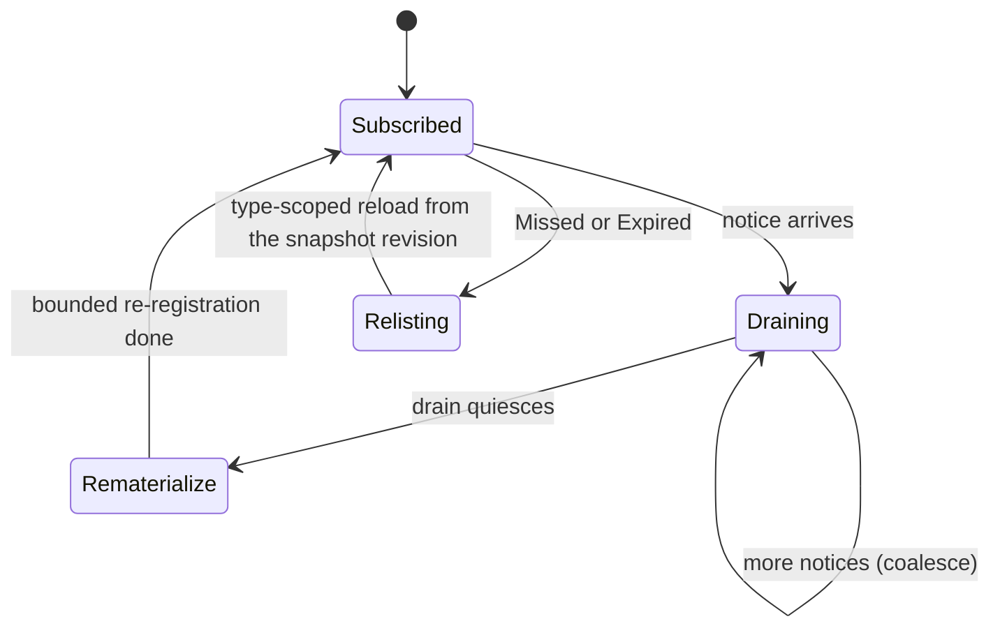
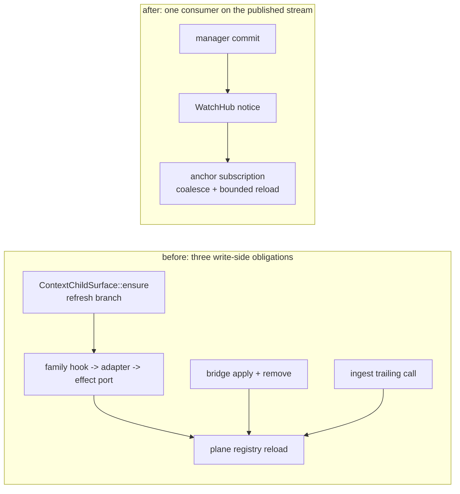

# Refresh the Anchor Projection from the Manager's Change Stream - Plan

## Goal Capsule

- **Objective:** Make a Volume or VolumeBinding child row resolvable no matter which writer committed it, by driving the plane's anchor projection from the manager's existing durable-change stream instead of from per-writer refresh calls. This closes issue #531 by removing its premise: no provider family is asked to supply an anchor-refresh hook, so none can omit one.
- **Product authority:** GitHub issue #531 owns the acceptance criteria; this plan supersedes the guard-shaped reading of them and routes the re-scope to the issue owner. `AGENTS.md` and `tests/AGENTS.md` own the contributor and test-placement rules.
- **Open blockers:** None. One product-level step is required at closure, not as a blocker: owner sign-off that issue #531 is satisfied by removing the obligation rather than guarding it (R9, U5).
- **Stop condition:** `make check` passes on the change's head, the anchor projection re-materializes from every named commit route with no writer-specific refresh call, the per-family hook is gone from the tree, and no test was deleted or weakened except those whose subject is retired.
- **Tail ownership:** The executing agent owns the PR tail per `AGENTS.md`: independent review in a clean context, changelog fragment, squash merge with an expected-head guard.
- **Supersedes:** `docs/plans/2026-09-19-001-feat-volume-anchor-bridge-guard-plan.md`, which guarded the per-family hook. Both that approach and an earlier revision of this plan that would have added a new commit-observer port are rejected in Alternatives Considered below, with the evidence that decided them.

---

## Product Contract

### Summary

Point the plane's anchor projection at the change stream the manager already publishes, and delete the three ad-hoc write-side refresh obligations. The plane subscribes once to the manager's watch hub for Volume and VolumeBinding rows, coalesces the notices it drains into one bounded re-materialization, and relists on the hub's own missed-data signal. The per-family `volume_anchor_refresh` hook chain, the controller bridge's per-call refresh, and the ingest path's trailing reload are then retired, because the commit already carries the trigger.

### Problem Frame

The plane's per-resource anchor registry is a read-side projection of durable rows, and the volume root resolver reads it synchronously. A Volume or VolumeBinding row committed after the projection was last built is invisible until something rebuilds it; its root then resolves as `volume-anchor` / `source-unresolved` on every attempt until a reload lands (`packages/d2bd/src/resource_plane_v3.rs:1162-1173`, failing through `ZoneVolumeRootResolver::resolve_root` into `VolumeLocalError::SourceUnresolved`).

Issue #531's incident was a provider family reaching that state, revealed only by a multi-minute VM check. The issue proposed guarding the per-family hook. That reading accepts the hook as given; the investigation recorded in Alternatives found the hook is one of three ad-hoc write-side refresh obligations bolted onto individual commit paths, and that the trigger already exists one layer down - the manager publishes a durable-change notice from its commit handlers, and nothing consumes that stream for this projection.

Verified state:

| Fact | Evidence |
|---|---|
| One production manager endpoint serves every driver context | `ManagerActorEndpoint` at `packages/d2b-resource-runtime/src/manager.rs:1432`, constructed at `packages/d2b-resource-runtime/src/resource.rs:672-674` |
| That endpoint is documented as the surface every durable child mutation rides | `packages/d2b-resource-runtime/src/context.rs:134-138` |
| The manager already publishes a durable-change notice from its commit handlers | ensure path: `ChangeKind::Upsert` with `ChangeSource::Desired`, published after the store write and gated on a committing outcome (`manager.rs:740-761`); the mark-deleting branch publishes `ChangeKind::Upsert` (`:810-828`); the retiral publish of `ChangeKind::Delete` follows cleanup in `retire_row` (`:624-628`) |
| Status changes publish on the same stream, distinguishable by source | `manager.rs:1032-1036` publishes `ChangeSource::RuntimeStatus` |
| Nothing consumes this stream today | a repository-wide search finds no consumer of the hub's stream. `ManagerBackend::watch` refuses with `UnsupportedCapability`, and its module doc records that nothing takes the registered stream (`packages/d2b-resource-api/src/manager_backend.rs:25-26`, `:1171-1188`). The subscription this plan adds is the first consumer, so U1's loop is written against the hub API rather than copied from a precedent |
| The stream is selectable by row type, with replay and no gap | `WatchSelector::for_type` (`packages/d2b-resource-runtime/src/watch.rs:105-113`); `WatchHub::register(selector, after)` returns retained replay plus a live stream, atomic with the snapshot revision (`:360-400`) |
| A dropped notice is never silent | `WatchDelivery::Missed { last_delivered }` is an explicit terminal signal and the hub's contract is to relist (`watch.rs:88-100`); `WatchRegistration::Expired` carries the relist snapshot (`:145-160`) |
| The projection owner already holds the stream's hub | `ResourcePlaneV3.hub: Arc<WatchHub>`, created in `prepare` (`resource_plane_v3.rs:2206`) and exposed at `:2373` |
| The plane owns the projection and can rebuild it | `PlaneResourceRegistry` at `resource_plane_v3.rs:219-260`; `ResourcePlaneV3::reload_registry` at `:2389-2392`; its store is attached before the manager spawns (`:2137`) |
| Managers are spawned where the registry is in scope | `ResourcePlaneV3::prepare` spawns the actor at `:2229` and consumes `inputs.registry` at `:2240` |
| Three write-side refresh obligations exist today, each on one commit path | bridge `refresh_registry` at `plane_controller_bridge.rs:654-664`, called from `apply` (`:635-637`) and `remove` (`:578-581`); ingest's trailing `reload_registry` at `resource_plane_v3.rs:2608-2609`; family-side `reload_volume_anchors` at `packages/d2bd/src/shared_provider_effects.rs:253-268` |
| The per-family hook is a five-hop round trip to that daemon method | `SharedProviderFamily::volume_anchor_refresh` (`packages/d2b-provider-toolkit/src/shared_provider.rs:170-177`) -> `ContextChildSurface::ensure` (`:504-506`) -> family adapter (`d2b-provider-device/src/driver.rs:252-254`, `d2b-provider-network-local/src/driver.rs:234-236`) -> effect port (`shared_provider_effects.rs:1866-1868`, `:2942-2944`, `:3026-3028`) -> `reload_volume_anchors` |
| The per-commit reload is a full store sweep, not a bounded one | `reload_registry` -> `load_from_store` (`resource_plane_v3.rs:395+`) does `list` with a default selector and a sort; the bounded sibling `load_binding_targets` is documented as "Bounded to the one type; never a full row sweep" |
| The registry already has a miss-fallback pattern for another projection it holds | socket targets fall through to a bounded store read on a miss (`resource_plane_v3.rs:339-345`) |

### Requirements

**The trigger**

- R1. The plane subscribes once, at construction, to the manager's durable-change stream with a selector covering Volume and VolumeBinding rows. The first materialization and the registration are paired through the registration's snapshot revision, and the subscription drains that registration's retained replay before it is treated as live, so no commit between the initial load and the subscription is lost.
- R2. The subscription is additive on the write side: the manager gains no new port, no new argument, and no new work at the commit point. The notices it already publishes are the trigger.
- R3. Drained notices are coalesced, not acted on one by one. One bounded re-materialization per drain, matching the repository's coalescing discipline.

**The projection**

- R4. The re-materialization is bounded to the rows the projection holds: a per-row re-registration keyed by the committed row, and a type-scoped reload as the recovery shape. It never runs the full-store sweep on the per-commit path.
- R5. A lost or unservable cursor is handled by the hub's own protocol, and recovery is complete only when the consumer again holds a live registration: drain the terminal missed-data signal or the expired registration, relist from the snapshot revision, take a fresh registration, and consume its retained replay before claiming continuity. A relist alone restores a point-in-time projection and leaves the interval after it uncovered, so re-registration is part of recovery rather than an optional follow-up. A notice is never silently dropped.
- R6. A Volume or VolumeBinding row becomes resolvable whichever writer committed it, and with no writer-specific refresh call: a driver effect through the child surface, a driver's declared-children pass, the controller child-mutation bridge, a plain API apply, or a bundle ingest. Resolution may lag the commit by one drain, and each route's first post-commit attempt must retry or wait rather than fail permanently (R8).

**The retirement**

- R7. `SharedProviderFamily::volume_anchor_refresh`, `VolumeAnchorRefresh` and its re-export, the child surface's refresh branch and its constructor argument, the two family refresh adapters, and the family effect-port refresh methods are retired. No per-family obligation to refresh a plane projection remains.
- R8. The controller bridge's per-call registry refresh and the ingest path's trailing reload are retired, because the obligation they discharged is now structural. Two consequences are owned rather than implied. First, the commit path no longer guarantees a current projection on return: the refresh becomes asynchronous, so a resolution attempted in the same reconcile pass as the commit must tolerate a miss and retry, and each route's first post-commit resolution must either retry or bound its wait. Second, the retired refreshes were full-store sweeps that incidentally re-registered every Volume and VolumeBinding row, so each acted as a cross-row backstop; the subscription heals the committed row, and cross-row healing now comes only from a relist. Neither retired refresh ever removed a stale anchor, and neither is replaced by something that does.
- R9. The change adds no new repository-wide policy class, gate, or `tests/*.sh`, and ships one changelog fragment. The issue-closure comment disposes of both of issue #531's acceptance criteria: the first is satisfied by removing the obligation rather than guarding it, and the second, which asked for a per-family audit with a recorded verdict, is moot because every manager-mediated durable commit publishes on the stream regardless of which writer committed it, so no per-family answer needs recording. The owner signs off on that reading, including the residual named in Risks & Dependencies, before the issue closes.

### Acceptance Examples

- AE1. Given a shared-provider family whose effect commits a Volume child row, when no anchor-refresh hook exists anywhere in the toolkit or the family, then that volume's root resolves after the projection settles, and an attempt made before the drain completes retries rather than failing permanently.
- AE2. Given a driver whose declared children include a Volume row, when the manager commits that row, then the projection re-materializes without any effect-path or family call.
- AE3. Given a burst of commits in one pass, when the projection drains them, then it performs one bounded re-materialization, not one per commit.
- AE4. Given a subscription whose cursor can no longer be served, when the hub reports it, then the consumer relists, takes a fresh registration, drains its replay, and only then claims continuity, so the interval after the fault is covered too.
- AE5. Given a Volume row applied through the API with no bundle ingest and no provider effect, then its root resolves.

### Scope Boundaries

**Deferred to follow-up work**

- Dropping anchors for deleted rows. The registry has no removal path, so a deleted row's anchor persists, and a full reload does not remove it either. The hub now makes a fix cheap, because the delete notice is already published; this plan deliberately does not widen the projection's behavior beyond what issue #531 needs. R8 pins that the retirement changes nothing here.
- A general projection framework. The anchor registry is the only external projection that needs per-commit refresh; a seam with one registrant by design is not worth abstracting.
- Coalescing beyond one drain window, and any measurement of the bounded reload's cost. The bound is stated in the Verification Contract; a profile-driven refinement is follow-up if the bound is ever exceeded.

**Outside this plan**

- Making `VolumeRootResolver` asynchronous or self-healing on a lookup miss. Rejected as the primary mechanism (KTD3).
- `PolicyProjection` and the socket-target projection. They are already refreshed by their own paths, and the socket targets self-heal on miss.
- The per-family hook's *detection* surface, including the declaration-and-pairing guard proposed in the superseded plan. With the obligation removed, there is nothing to guard.
- Any other issue in the 30-day window, including #530 and #520.

### How This Work Fits Together

<!-- ce-section: work-relationships -->

This plan owns one area: the trigger for re-materializing the plane's anchor projection.

- Supersedes `docs/plans/2026-09-19-001-feat-volume-anchor-bridge-guard-plan.md`, whose approach is rejected in Alternatives Considered below.
- Depends on the manager's existing change stream and on `PlaneResourceRegistry` staying a projection of durable rows. Both are current behavior, not new commitments.
- Sibling work that touches the same files: `docs/plans/2026-09-18-002-refactor-finish-provider-crate-isolation-plan.md` (issue #516) edits provider-crate driver files; `docs/plans/2026-09-16-001-refactor-async-purity-daemon-control-plane-plan.md` constrains the daemon control plane. Coordinate before editing shared daemon files.
- Closes: issue #531, under the re-scope recorded in R9.

---

## Planning Contract

### Key Technical Decisions

- KTD1. Drive the projection from the manager's existing change stream rather than from a new notification port or per-writer refresh calls. Evidence: the manager already publishes a durable-change notice from its commit handlers, gated on a committing outcome (`manager.rs:740-761`) and on retiral (`:624-628`); the stream is selectable by row type and carries replay plus a live channel with an atomic snapshot anchor (`watch.rs:105-113`, `:360-400`); and the projection's owner already holds the hub (`resource_plane_v3.rs:2206`, `:2373`). No runtime-crate change, no new manager argument, and no new work at the commit point. This replaces an earlier revision of this plan that added a commit-observer port; that port would have re-implemented, worse, a contract the hub already documents, including deletes, replay, and gap-free registration.
- KTD2. Coalesce drained notices into one bounded re-materialization per drain. A driver's declared-children pass commits one row per `ensure_child` call and a bundle ingest commits many rows, so per-notice refresh would multiply reloads where there is one today. The repository's own reconciler coalesces triggers into a single pending flag for exactly this reason, and this plan follows that shape rather than deferring coalescing as a refinement.
- KTD3. Do not make the resolver self-healing on a lookup miss. `ZoneVolumeRootResolver::resolve_root` is synchronous (`packages/d2bd/src/resource_runtime/volume_effect_adapter.rs:155-166`) and the adapter invokes it synchronously outside its async wrapper (`:274-303`), while registry reads use a fail-closed `try_lock` snapshot (`resource_plane_v3.rs:257-260`). Making it self-healing would change a provider-facing contract (`VolumeSourceEffectPort` in `d2b-provider-volume-local`) and every caller of the resolve path, for an outcome the stream subscription reaches without touching either trait.
- KTD4. Retire the three existing write-side refresh obligations rather than keep any as a backstop. Rationale: the incident's cause was an obligation spread across per-writer sites, and a second mechanism alongside the structural one keeps that obligation alive and revisitable. R8 records what the retirement does not change, so the decision is owned rather than silent.
- KTD5. Keep the projection's re-materialization bounded: a per-row re-registration keyed by the committed row on the drain path, and a type-scoped reload as the recovery and relist shape. Never the full-store sweep on the per-commit path.

### High-Level Technical Design

Who commits, who publishes, and who consumes.

```mermaid
flowchart TB
  subgraph runtime["d2b-resource-runtime"]
    driver["driver ResourceContext"]
    declared["driver declared-children pass"]
    manager["ResourceManager actor<br/>sole durable writer"]
    hub["WatchHub<br/>ring + per-subscriber streams"]
    driver --> manager
    declared --> manager
    manager -->|"publish on commit<br/>source = Desired"| hub
  end
  subgraph daemon["d2bd"]
    bridge["controller child-mutation bridge"]
    ingest["bundle ingest"]
    api["API apply"]
    consumer["anchor subscription<br/>drain, coalesce, relist"]
    registry["PlaneResourceRegistry<br/>Volume anchors + socket targets"]
    resolver["ZoneVolumeRootResolver<br/>synchronous read"]
  end
  bridge --> manager
  ingest --> manager
  api --> manager
  hub -->|"selector: Volume, VolumeBinding"| consumer
  consumer -->|"bounded re-materialization"| registry
  registry --> resolver
```

The consumer's loop, including the two ways the hub can force a relist.

What the retirement removes, and what replaces it.

### Alternatives Considered

- **Guard the per-family hook** (the superseded plan: a required family declaration paired to the hook, owner-local pairing tests, and an assertion in the child surface). Rejected. It cannot see a declared-children commit, since the driver commits that set directly on the resource context rather than through the surface it would assert on. It also keeps the obligation and only adds policing, so the failure class survives as a wrong declaration.
- **A new commit-observer port on the manager** (an earlier revision of this plan). Rejected by KTD1: it duplicates a contract the hub already provides, including delete notices, replay, and gap-free registration, and it would add a manager argument and a notification path at the commit point for no gain.
- **Refreshing inside the manager** (the manager knowing about Volume anchors). Rejected: it would put the plane's projection knowledge into `d2b-resource-runtime`, inverting the dependency the manager currently keeps. The stream keeps interest on the consumer's side.
- **Self-healing lookup on a registry miss.** Rejected by KTD3.
- **Per-notice refresh without coalescing.** Rejected by KTD2: it multiplies reloads on the two bursty paths.
- **Extending the hub's stream with a dedicated projection channel.** Rejected: the selector already expresses interest by row type, and a second notification mechanism is what R2 forbids.

### Assumptions

- The manager publishes on every durable row mutation, so consuming the stream covers all writers. Any writer that mutates durable rows without publishing is a finding to raise, not a reason to keep a per-writer refresh.
- The hub's per-subscriber buffer and ring are large enough for one drain window at this system's scale, so a healthy consumer sees notices rather than `Missed`. The contract holds either way, because `Missed` forces a relist.
- The anchor registry remains the only external projection needing per-commit refresh. The status read model is the manager's in-memory status maps, updated on the commit path and published to the same stream, and the policy and socket-target projections have their own paths. Nothing consumes the stream for status today, so this subscription is the stream's first consumer.
- Removing the child surface's refresh branch also removes its now-dead commit-detection computation, so that computation leaves the tree with the branch.

### Deferred Implementation Notes

- The subscription's anchoring must close the window between the initial load's store read and the registration, and only two orderings do: register with the load's snapshot revision as the cursor, or register before the store read and use the live-only stream. Registering live-only after the store read leaves that window uncovered, because a no-cursor registration serves no replay. The tree has no prior consumer to follow, so the implementer picks one of the two gap-free orderings and records which.
- Whether the drain rebuilds from the committed row's key or from a type-scoped scan is settled at implementation. The per-row form is the per-commit shape; the type-scoped form is the recovery and relist shape.
- Retiring the ingest trailing reload depends on every ingest commit going through the manager. If any ingest path writes durable rows without a manager commit, keep one reload there, record why, and raise the gap rather than restoring a per-writer obligation elsewhere.
- The subscription task's supervision is an implementation choice with no in-tree precedent: the plane owns no long-lived tasks today, and its only spawned task-like object is the manager actor, which supervises itself. The implementer chooses and records where the task's handle lives, the plane struct or the daemon composition, and what restarts it, with relist-on-restart as the required behavior.
- The host lane's value for AE1 depends on which VM check drives a provider Volume commit and a root resolution. Confirm that check exists and select it explicitly for the recorded run; if none does, record that the host lane does not prove AE1 rather than presenting a green lane as its proof.

### Risks & Dependencies

- **A consumer that stalls turns a stream into a gap.** The hub's slow-subscriber rule marks the subscriber `Missed` and ends the stream, which forces a relist; a consumer that ignores the signal, or a task that dies without restart, leaves a committed anchor stale. Mitigations: R3's coalescing keeps the drain bounded, R5 makes the relist mandatory rather than optional, and U1 gives the task a restart path whose restart relists, with a test for it. This is the residual the plan must not hide: the guarantee is a correct consumer, not an unconditional one.
- **The refresh becomes asynchronous.** Today the bridge and the family hook await their refresh inside the commit path, so a read in the same pass sees the anchor; the subscription removes that guarantee and heals on the drain instead. The Device family already absorbs a miss by retrying, and a volume actor re-resolves on its next pass, so the failure mode becomes a later pass rather than a permanent unresolved root. It is verified per route rather than assumed (R8, U4).
- **Coalescing can hide a regression.** One reload per drain makes a per-notice reload bug invisible. Mitigation: AE3's test asserts the coalescing itself, and the route tests assert resolution rather than notification counts.
- **The retirement's blast radius spans four crates.** A partial retirement leaves a trait method with no consumer, which the dead-code lane reports. U3 names every site, including the toolkit's re-export; migrate all of them in one change.
- **Coordination.** Issue #516's lane edits the provider-crate driver files this plan also edits, and the async-purity lane constrains daemon control-plane shapes. Sequence against both.
- **Closure honesty.** Issue #531's acceptance criteria are written against a hook this plan deletes. R9 routes the re-scope to the owner; until that sign-off, the issue stays open even though the work is done.
- **Hidden publish gaps.** If some durable write path does not publish through the hub, its commits fall outside R6. The Assumptions section records this as a finding to raise, and the route tests are the mechanism that would surface it.

### Sequencing

1. U1 lands first: the subscription and the coalescing drain, wired at plane construction. This is the first unit after which the workspace builds, and it is additive.
2. U2 lands next and proves the projection re-materializes from the stream, retiring the bridge's per-call refresh and the ingest trailing reload once their routes are covered.
3. Put the re-scope to the issue owner before U3 lands. U3 is the irreversible step, and the re-scope is the premise that justifies it; validating it only at closure means the largest unit of work ships before the decision it rests on. Record the owner's answer, then land U3.
4. U3 retires the family hook chain. It depends only on U2, because the daemon method it deletes is called only by that chain; it is independent of the remaining work.
5. U4 closes the coverage set, and U5 ships the fragment and the issue re-scope. Both depend on U3 and can land in either order after it.
6. `make check` runs after the last unit; the host lane runs once on the final head (AE1's real proof).

### System-Wide Impact

The change is internal and operator-invisible, but it touches how the control plane keeps a projection current.

- `d2bd`: a new long-lived subscription task; the bridge loses its refresh call; the ingest path loses its trailing reload; the plane's construction gains one registration.
- `d2b-provider-toolkit`: one trait method, one trait plus its re-export, one surface branch and constructor argument, and one now-dead computation are removed. This is the largest public-surface change, and it is a contraction.
- Provider crates: the two adapters and their effect-port refresh methods are deleted; both effects traits shrink.
- `d2b-resource-runtime`: unchanged. No new port, argument, or commit-path work (R2).
- No Nix, CLI, manifest, schema, or operator-visible surface changes.

---

## Implementation Units

### U1. Subscribe the anchor projection to the manager's change stream

- **Goal:** The plane holds one long-lived subscription to the manager's durable-change stream for Volume and VolumeBinding rows, drains it into a coalesced pending flag, and relists when the hub says the cursor is unservable.
- **Requirements:** R1, R2, R3, R5, AE3, AE4
- **Dependencies:** None.
- **Files:**
  - `packages/d2bd/src/resource_plane_v3.rs`
- **Approach:**
  1. Build a selector covering Volume and VolumeBinding rows from the hub's existing type predicate, and register it from `prepare`, the scope that already holds the hub and the registry (`resource_plane_v3.rs:2206-2241`). Anchor the registration so no commit between the initial load and the subscription is lost (R1).
  2. Spawn one task that owns the subscription. It drains retained replay and then the live stream. It sets the pending flag only for `ChangeSource::Desired` notices, because the selector matches on the resource key alone and status transitions for Volume and VolumeBinding rows arrive on the same subscription. It acts after the drain has been idle for a bounded window rather than when the stream is empty, so sustained traffic cannot starve the re-materialization: on that window it clears the flag, re-checks the stream, and performs one re-materialization. The registry's store is attached before the manager spawns (`:2137`), so the task can rebuild. Log a line when the bounded window passes repeatedly without a completed re-materialization, so a stalled consumer is observable without adding a gate.
  3. Handle both unservable cases the same way (R5): the terminal missed-data delivery and an expired registration both mean the stream is finished, so relist from the handed-over snapshot revision, take a fresh registration, and drain its retained replay before treating the subscription as live again. Recovery is not complete until the new registration exists, because the interval after a relist is otherwise uncovered.
  4. Give the task handle a home a restart can reach, and make a restart relist rather than assume continuity. The plane owns no long-lived task today, so this is new ground; say so at the task site rather than implying a precedent to follow.
  5. This unit adds nothing to the manager: confirm no new argument, port, or commit-path work is introduced (R2), and record the confirmation.
- **Patterns to follow:** the hub API itself, since there is no in-tree consumer to copy: `WatchHub::register`, and the stream's drain, missed-data, and expired handling in `packages/d2b-resource-runtime/src/watch.rs`; `ResourceManagerClient::watch` (`packages/d2b-resource-runtime/src/manager.rs:1555-1561`) as the registration surface; the pre-spawn seeding at `resource_plane_v3.rs:2151-2154` for where a construction-time registration belongs; and the reconciler's single-pending-flag coalescing for the drain shape. `ManagerBackend::watch` refuses with `UnsupportedCapability`, so this subscription is the stream's first consumer and its loop is the precedent.
- **Test scenarios** (Layer-1 type 2, `packages/d2bd/src/resource_plane_v3.rs` `#[cfg(test)]`):
  - A published Volume notice sets the pending flag and, after the drain, performs exactly one re-materialization.
  - A commit published between the initial materialization and the subscription handoff is not lost: it appears in the registration's retained replay and the projection reflects it once the replay is drained.
  - A burst of Volume and VolumeBinding notices drains into one re-materialization, not one per notice. Covers AE3.
  - A notice for a type the selector does not cover leaves the pending flag clear.
  - A terminal missed-data delivery causes a relist from the snapshot revision and the subscription continues. Covers AE4.
  - An expired registration causes the same relist path and does not end the subscription.
  - The registry rebuild after a relist reflects the durable rows, including a row committed while the subscription was between streams.
  - A status-source notice for a Volume row does not set the pending flag, so only durable changes trigger a re-materialization.
  - A sustained stream that never empties still performs a re-materialization within the bounded window, and the stall line is logged.
  - Killing the subscription task and restarting it performs a relist rather than resuming from a stale cursor.
- **Verification:** the daemon's own test target passes; one subscription exists per plane; a burst produces one projection rebuild; a commit inside the startup handoff window survives; both unservable cases relist, re-register, drain replay, and continue; and a killed task restarts into a fresh registration rather than a stale cursor.

### U2. Re-materialize the projection from the stream and retire the write-side refreshes

- **Goal:** Every named commit route resolves its volume with no writer-side refresh call, and the bridge's per-call refresh and the ingest trailing reload are gone.
- **Requirements:** R4, R6, R8, AE1, AE2, AE5
- **Dependencies:** U1
- **Files:**
  - `packages/d2bd/src/resource_plane_v3.rs`
  - `packages/d2bd/src/resource_runtime/plane_controller_bridge.rs`
- **Approach:**
  1. Implement the drain action: re-register the committed row keyed from the notice, using the registry's existing idempotent registration, which never downgrades an anchor. Keep the type-scoped reload for the relist and recovery paths, and never the full-store sweep on the per-commit path (KTD5).
  2. Prove the routes that can be driven hermetically, and record for each whether it drives a production-real writer or a synthetic one. The driver effect path, the controller child-mutation bridge's apply path, and a plain API apply each drive a production writer. The declared-children pass has no production instance that declares a Volume row today, because the Device state Volume is controller-created through the child surface rather than declared, so its test uses a synthetic Volume-declaring driver and proves the mechanism rather than a live writer. Record that distinction rather than letting the route list imply five live writers.
  3. Retire the bridge's per-call `refresh_registry` and both of its call sites (`plane_controller_bridge.rs:578-581`, `:635-637`, `:654-664`), and add the bridge-route resolution test where the retirement happens. Confirm the bridge commits through the manager, so its notices are published; state explicitly that the remove path's stale-anchor behavior is unchanged, because neither the reload nor the per-row registration ever removed an anchor.
  4. Retire the ingest path's trailing `reload_registry` call (`resource_plane_v3.rs:2608-2609`) once every ingest commit is confirmed to be a manager commit; if any is not, keep the single reload there and record why.
  5. Keep `complete_initial_load`'s reload: it is a per-load path, not a per-commit one.
- **Patterns to follow:** the bounded binding-target reload beside the anchor path, which documents why it is scoped to one type; the registry's idempotent, never-downgrade registration; the network-local driver's recording-manager fixture for driving a real reconcile pass.
- **Test scenarios** (Layer-1 type 2 in `packages/d2bd/src/resource_plane_v3.rs`, or type 3 in `packages/d2bd/tests/` only where a route needs the real binary):
  - After a Volume commit through a driver effect, the anchor resolves with no writer-side refresh call invoked; the hook is still defined at this point, so the test proves the stream drives resolution without calling it. This is AE1's pre-retirement half; the no-hook form belongs to U4.
  - After a commit by the declared-children pass, the anchor resolves. Covers AE2.
  - After a bridge apply of a Volume or VolumeBinding row, the anchor resolves with the bridge's refresh call gone.
  - After a plain API apply of a Volume row with no ingest and no provider effect, the anchor resolves. Covers AE5.
  - A duplicate notice for an already-registered row leaves the registry unchanged and never downgrades an existing anchor.
  - The per-commit path registers by row rather than running the store-wide list and sort.
  - The bundle ingest route still resolves after its trailing reload is retired.
- **Verification:** each named route has a passing resolution test that names the route it drives; the bridge's refresh call and its two call sites are gone; the ingest trailing reload is gone or its retention is recorded; no route test asserts a notification instead of a resolution.

### U3. Retire the per-family anchor-refresh obligation

- **Goal:** The hook chain is gone from the toolkit, the two family crates that implement it, and the daemon's effects, with no consumer, re-export, or dead computation left behind.
- **Requirements:** R7
- **Dependencies:** U2
- **Files:**
  - `packages/d2b-provider-toolkit/src/shared_provider.rs`
  - `packages/d2b-provider-toolkit/src/lib.rs`
  - `packages/d2b-provider-device/src/driver.rs`
  - `packages/d2b-provider-network-local/src/driver.rs`
  - `packages/d2bd/src/shared_provider_effects.rs`
- **Approach:**
  1. Delete `SharedProviderFamily::volume_anchor_refresh` and the `VolumeAnchorRefresh` trait (`packages/d2b-provider-toolkit/src/shared_provider.rs:170-177`, `:427-431`), and remove the trait's re-export in the crate root (`packages/d2b-provider-toolkit/src/lib.rs:142`) in the same change; a leftover export is a compile error.
  2. Remove the child surface's refresh field, its constructor argument, and the refresh branch in `ensure`, along with the now-dead commit-detection computation that fed it (`shared_provider.rs:464-521`), and drop the argument at both construction sites (`:980`, `:1043`).
  3. Delete the two family adapters and their trait implementations (`packages/d2b-provider-device/src/driver.rs:169-186`, `:252-254`; `packages/d2b-provider-network-local/src/driver.rs:146-173`, `:234-236`) and the now-unused imports in each file.
  4. Delete the family effect-port refresh methods and, once no caller remains, the daemon's `reload_volume_anchors` (`packages/d2bd/src/shared_provider_effects.rs:253-268`, `:1866-1868`, `:2942-2944`, `:3026-3028`).
  5. Sweep the toolkit's own test surface in the same change: the refresh mechanism test, its fixtures, and the `RefreshAdapter` helper (`shared_provider.rs:1107-1108`, `:1301-1308`, `:1371-1373`, `:1720-1787`). No test doubles outside the toolkit override the retired methods, so nothing else moves.
- **Patterns to follow:** the repository's clean-cutover discipline: migrate every caller, remove the aliases and re-exports, and leave no deprecated path behind.
- **Test scenarios:**
  - The toolkit builds with the trait method, the trait, the re-export, and the surface refresh branch removed, and the child surface's commit behavior is unchanged for `Created`, `Updated`, and `Unchanged` outcomes.
  - Both family crates build with their adapters removed, and their existing driver tests pass unchanged.
  - The retired symbols have no remaining consumer: a repository-wide search for the trait method, the trait, the re-export, and the two adapter types returns nothing outside this plan's own text.
- **Verification:** `make test-rust` passes; the toolkit's and both family crates' test targets pass; the dead-code lane reports no new finding on the touched surface.

### U4. Close the coverage set

- **Goal:** Every route named in R6 has a test that drives a real commit and asserts the resolution, and the residual consumer-failure risk is stated where the implementer will read it.
- **Requirements:** R3, R6
- **Dependencies:** U2, U3
- **Files:**
  - `packages/d2bd/src/resource_plane_v3.rs` (tests)
- **Approach:**
  1. Audit U2's route tests against R6's five routes and add any missing one, recording for each test the route it drives so a reader sees the coverage set rather than inferring it.
  2. Cover the negative direction once: a row type the selector does not cover commits without a re-materialization, so the subscription is not a blanket rebuild.
  3. Cover the failure direction: a plan or projection re-materialization that fails leaves the commit untouched and the subscription alive, and the next notice re-attempts.
  4. Re-check the public behavior the retirement touches: the bridge's remove path and the ingest path resolve as before, and nothing now removes an anchor that previously persisted.
  5. Cover the timing change R8 records. A resolution attempted immediately after a commit, before the drain has completed, must not fail permanently; assert whichever closes it for that route, a retry or a bounded wait, and record for each route whether its first post-commit resolution depends on one. This is the consequence most likely to be mistaken for the original incident, so it is tested rather than reasoned about.
- **Patterns to follow:** the plane's existing hermetic resolve tests and its construction fixtures.
- **Test scenarios:**
  - Each of R6's five routes has a test naming the route and asserting the anchor resolves.
  - The driver effect route resolves with the hook chain deleted, which is AE1's no-hook form and cannot be asserted before U3 lands.
  - An uninterested row type commits without a rebuild.
  - A failing re-materialization leaves the subscription alive and the next notice re-attempts, with the failure logged.
  - The bridge's remove path and the ingest path leave the registry in the same observable state as before the retirement.
  - A resolution attempted immediately after a commit, before the drain completes, does not fail permanently: the route's retry or bounded wait closes it, and the record says which.
  - A cross-row gap that the retired full sweeps would have healed incidentally is healed by a relist, so R8's second consequence is pinned rather than assumed.
- **Verification:** the named tests pass; each route test names its route; the audit record lists the route-to-test mapping; no test asserts only that a notice arrived.

### U5. Ship the fragment and route the issue re-scope

- **Goal:** The tree and the issue record agree on what changed and why, and the issue's re-scope is in front of its owner.
- **Requirements:** R9
- **Dependencies:** U3
- **Files:** `changelog.d/<branch-name>.md`
- **Approach:**
  1. Write one changelog fragment describing the subscription, the three retired refresh obligations, and the operator-visible effect: a committed volume resolves without a family-supplied refresh.
  2. Draft the issue-closure comment carrying the re-scope. Dispose of both acceptance criteria explicitly: the first, which asked for a test or check that fails when a family commits a Volume or VolumeBinding row while answering nothing, is satisfied by deleting the hook and driving the projection from the change stream the manager already publishes, so the failure class cannot occur rather than being detected; the second, which asked for the security-key and usbip families to be audited and their answer recorded, is moot for the same reason, because a committed row publishes regardless of which writer committed it, so there is no per-family answer left to record. Ask the owner to accept that reading, including the residual in Risks & Dependencies, before the issue closes.
  3. Sweep for any statement in the tree or in the plans that still describes the anchor refresh as a provider-family responsibility, and confirm the superseded plan is marked as such where a reader will find it.
  4. Confirm no gate, policy class, workflow, or `tests/*.sh` was added.
- **Test expectation:** none - record, fragment, and citation sweep only; the changelog gate guards the fragment and the compiler guards the retirement.
- **Verification:** the changelog gate passes; a repository-wide search finds no remaining statement that a provider family must refresh plane anchors; the issue-closure comment carries the re-scope and its request; and the issue is closed only after the owner's acceptance is recorded on it, not merely requested.

---

## Verification Contract

| Gate | Command | Applies to | Evidence |
|---|---|---|---|
| Layer-1 aggregate | `make check` | Whole change | Green on the change's head |
| Rust lanes | `make test-rust` | U1, U2, U3, U4 | The daemon, toolkit, and both family crates compile and their tests pass |
| Focused daemon tests | the daemon crate's own `d2b_rust_test` targets from its `BUILD.bazel` | U1, U2, U4 | Subscription, coalescing, both relist paths, and each R6 route resolving |
| Subscription bound | the coalescing test in U1 | R3 / AE3 | A burst of N notices performs one re-materialization; the per-commit path does not run the store-wide list and sort |
| Host lane | `make test-host-integration` | R6 / AE1 | One recorded run on the final head: the real provider path resolves a committed volume. This is the only gate that reproduces the incident's environment |
| Retirement sweep | repository-wide search for the retired trait method, trait, re-export, and adapters | U3 | No live consumer remains |
| Dead-code lane | `make check-dead-code` | U3 | No new finding on the touched surface |
| Changelog | `make test-changelog` | U5 | Fragment present and well-formed |
| Policy | `make test-policy` | Whole change | Passes unchanged; no policy class, allowlist row, or gate is added |

Behavioral proof is the resolution of a committed volume's root with no hook present. A test that asserts a notice arrived is not proof; the resolution is.

---

## Definition of Done

**Global**

- R1 through R9 are each verified with the evidence named in the Verification Contract.
- `make check` passes on the change's head, and the host lane has one recorded pass proving the real provider path.
- Every route named in R6 has a test that drives a real commit and asserts the root resolves, with the route-to-test mapping recorded.
- The per-family hook chain is gone: trait method, trait, re-export, surface branch, constructor argument, the dead commit-detection computation, both adapters, and the family effect-port refresh methods. No consumer, alias, or deprecated path remains.
- The bridge's per-call refresh, its two call sites, and the ingest trailing reload are gone or their retention is explicitly recorded with the reason.
- `d2b-resource-runtime` is unchanged: no new port, argument, or commit-path work.
- No gate, policy class, workflow, or `tests/*.sh` is added; one changelog fragment is present; the diff contains no abandoned-attempt code.
- The re-scope was put to the issue owner before U3 landed, per Sequencing, and the owner's acceptance of it is recorded on issue #531 before the issue closes. No document still calls the anchor refresh a family responsibility.
- The subscription's failure modes are observable: a stalled drain logs, and a killed task restarts into a fresh registration, both covered by U1's tests.
- The review tail follows `AGENTS.md`: independent review in a clean context, fixes validated, fresh review after any head change.

**Per unit**

| Unit | Done when |
|---|---|
| U1 | One subscription exists per plane; the drain coalesces and filters to desired-source notices; a commit inside the startup handoff window survives; both unservable cases relist, re-register, and drain replay; a killed task restarts into a fresh registration; the manager gained no argument, port, or commit-path work |
| U2 | Each named route resolves with no writer-side refresh; the bridge's refresh and its call sites are gone; the ingest trailing reload is gone or recorded; the per-commit path registers by row |
| U3 | The hook chain and its re-export are deleted, the dead computation is removed, both family crates build, and the retirement sweep is clean |
| U4 | The route-to-test mapping is complete and recorded, with production-real and synthetic routes distinguished; the uninterested-type, failure, timing, and no-hook directions are covered; the retired paths' observable behavior is confirmed unchanged |
| U5 | The fragment is present, the sweep is clean, and the owner's acceptance of the re-scope is recorded on the issue before it closes |

---

## Sources / Research

- Issue #531, `resource plane: a family that commits a Volume child row must bridge the anchor-refresh hook`: `https://github.com/vicondoa/d2b/issues/531`. The incident narrative and the acceptance criteria this plan re-scopes.
- The change stream and its contract: `packages/d2b-resource-runtime/src/watch.rs:47-80` (notice, kind, and source vocabularies), `:88-100` (the explicit missed-data signal), `:105-113` (type selector), `:145-160` (registration result and the relist snapshot), `:296-320` (hub configuration), `:360-400` (atomic registration with replay), `:410-443` (publish and fan-out).
- The publish sites: `packages/d2b-resource-runtime/src/manager.rs:740-761` (durable ensure, gated on a committing outcome), `:810-828` (the mark-deleting upsert), `:624-628` (the retiral delete, after cleanup), `:1032-1036` (status, distinguishable by source).
- The store and index discipline that makes this the right seam: `packages/d2b-resource-runtime/src/context.rs:134-138` (the endpoint every durable child mutation rides), `:640-642` (the `ensure_child` delegate), `manager.rs:1432-1502` (`ManagerActorEndpoint`), `resource.rs:672-674` (the one production construction site), `:1421-1424` (a test construction site).
- The projection: `packages/d2bd/src/resource_plane_v3.rs:179-260` (`PlaneResourceRegistry` and its inner maps), `:262-268` (the synchronous, fail-closed anchor lookup), `:294-345` (the bounded binding-target reload and the socket-target miss fallback), `:351-369` (idempotent registration that never downgrades an anchor), `:395+` (`load_from_store`, the full sweep), `:1162-1173` (the synchronous resolver and the `volume-anchor` / `source-unresolved` failure), `:2137` (registry store attachment), `:2151-2154` (construction-time seeding), `:2206` (hub creation), `:2229` (manager spawn), `:2240` (the registry moved into the plane), `:2373` (the hub accessor), `:2389-2392` (`reload_registry`).
- The synchronous contract that makes a self-healing lookup the wrong mechanism: `packages/d2bd/src/resource_runtime/volume_effect_adapter.rs:155-166` (the resolver trait), `:274-303` (the adapter wrapping the synchronous call), and the provider-facing port in `packages/d2b-provider-volume-local`.
- The three write-side refresh obligations being retired: `packages/d2bd/src/resource_runtime/plane_controller_bridge.rs:578-581`, `:635-637`, `:645-664`; `packages/d2bd/src/resource_plane_v3.rs:2608-2609`; `packages/d2bd/src/shared_provider_effects.rs:246-268`.
- The per-family hook chain being retired: `packages/d2b-provider-toolkit/src/shared_provider.rs:170-177`, `:427-431`, `:464-521`, `:980`, `:1043`, `:1107-1108`, `:1301-1308`, `:1371-1373`, `:1720-1787`; `packages/d2b-provider-toolkit/src/lib.rs:142`; `packages/d2b-provider-device/src/driver.rs:169-186`, `:252-254`; `packages/d2b-provider-network-local/src/driver.rs:146-173`, `:234-236`; `packages/d2bd/src/shared_provider_effects.rs:1866-1868`, `:2942-2944`, `:3026-3028`.
- The stream has no consumer to follow: `packages/d2b-resource-api/src/manager_backend.rs:25-26` (the module records that nothing takes the registered stream) and `:1171-1188` (`watch` refuses with `UnsupportedCapability`); the registration surface is `packages/d2b-resource-runtime/src/manager.rs:1555-1561`.
- Contributor rules: `AGENTS.md` (code is canon; no new gates, linters, or hooks; changelog requirement for every code change), `tests/AGENTS.md` (new coverage lands as Layer-1 types 1-6; no new `tests/*.sh`; repository-wide policy is a closed set), `docs/contributing/gates-and-lints.md` (gate aliases and the dead-code lane).
- Superseded approach and its review record: `docs/plans/2026-09-19-001-feat-volume-anchor-bridge-guard-plan.md`.
- In-flight coordination: `docs/plans/2026-09-18-002-refactor-finish-provider-crate-isolation-plan.md` (issue #516), `docs/plans/2026-09-16-001-refactor-async-purity-daemon-control-plane-plan.md` (daemon control-plane shapes).
