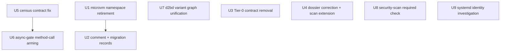

# Cleanup Wave: Gates, Dossiers, CI, and Bazel Variant Graph - Plan

## Goal Capsule

- Objective: land the eight backlog cleanups behind issues #584, #585, #586, #587, #589, #590, #591, #592. Each issue's acceptance criteria define its unit.
- Authority hierarchy: the eight GitHub issues and their decision comments are the authority. Where an issue cites a stale path, the current tree wins (recorded in KTD7).
- Settled decisions carried from the issue threads: retire `microvm.*` outright with no compat shim (KTD1, user-directed); fix the Bazel variant graph at its source rather than mitigate (KTD3, user-directed); make the security scan a required check (KTD5, user-directed).
- Stop conditions: every unit's verification passes on the repository's own gates; any unit that cannot converge (for example, the #587 investigation producing an environmental disposition) reports evidence instead of forcing a fix.
- Execution profile: one implementation-ready code plan; units land as independent reviewed PRs in dependency order.

---

## Product Contract

### Summary

The v3 control-plane rewrite left eight residue classes: a compatibility option namespace that no longer serves anyone, documentation and goldens pinning retired refusal contracts, a census invocation drifted from its documented contract, a scanner blind to the lock shape it was built to catch, provider dossiers citing deleted files, a daemon test surface excluded from CI, a security scan whose findings cannot block a merge, and one live bug whose cause is unestablished. This wave closes each residue class at its source.

### Problem Frame

Each issue is a half-landed cleanup or an unobserved defect: code deleted without its docs and goldens (#591), a namespace shim surviving a removal that was supposed to be total (#592), a scanner that cannot see the exact shape it was built to catch (#590), a census invocation that contradicts its documented contract and truncates its diagnostics (#585), a gate fed stale inputs (#589), a build exclusion that hides test failures (#584), an advisory security scan (#586), and a failing identity read whose reported cause is disproved (#587). Individually small; together they erode trust in the gates the framework relies on.

### Requirements

- R1. No `microvm.*` option or option reference survives in `nixos-modules/` framework files, templates, examples, or Rust doc comments; the VM runner API lives under the d2b-owned namespace per KTD1, and the retirement is recorded in the ADR 0018 follow-up, the changelog, and the v1.x migration notes.
- R2. The retired Tier-0 refusal contract is absent from docs, the CLI contract coverage table, the golden generator, and the committed goldens; `single-writer-conflict` remains only on its live surface (packages/d2b-provider-volume-local/src/error.rs:103).
- R3. The async-gate fails a planted method-call lock acquisition inside an `async fn` in a covered root; the conservative-shape escape hatch is documented; the Cargo.toml comment and the gate's own docs state the same enforcement reality.
- R4. Provider dossiers under `docs/specs/providers/` reference only files and crates that exist in the tree, and the policy gate fails a dossier that cites a deleted file or a non-existent crate.
- R5. The systemd identity-read failure's root cause is established with captured evidence (not assumed); the fix lands at the correct layer with a regression test, or a documented disposition with evidence replaces the fix if the failure is environmental.
- R6. In-tree part (mandatory, this wave): a security-scan job runs on pull requests and is wired into the aggregate `check` needs list so a scan failure fails the aggregate. Enforcement part (external): the scan's result is a required check on the protected branch. An access-denied handoff on the enforcement part records an explicit external blocker - it does not satisfy the requirement; the PR and tracking issue carry the named blocker until someone with branch-protection access completes it. The scan and its blocking status are documented in docs/contributing/workflow.md with an AGENTS.md pointer.
- R7. The census clippy invocation byte-matches the documented contract (or the manifest comment is updated in the same change); a planted compile error surfaces the first real diagnostic; a planted `await_holding_lock` site does not fail the census off the clippy-run error path; the module doc comment matches the manifest level.
- R8. `bazel build //packages/d2bd:all-tests` succeeds at pristine base; d2bd's `all-tests` appears in `rust-main-packages`; its per-target clippy tests ride Layer-1; the exclusion comment is deleted; a membership guard fails when any per-package `all-tests` aggregate is absent from the Layer-1 suite list or carries an excluding tag - the guard's input is suite membership, not a mutable exclusion list.

### Scope Boundaries

- In scope: exactly the eight issues above, including the in-tree workflow half of #586 and the branch-protection enforcement attempt it requires.
- Deferred to follow-up work: the other TODO.md entries the issues name only as context (devShell absence, schema drift, USBIP guest-attach, NFS notes) are not part of this wave.
- Outside this wave's identity: no new feature work, no new linters or formatters beyond the gates this plan modifies, no branch-protection settings change attempted without someone holding settings access.

### Outstanding Questions

- None blocking. The #587 investigation may resolve to a documented environmental disposition; that is an accepted outcome per its issue, not a blocker.

---

## Planning Contract

### Key Technical Decisions

- KTD1. Retire the `microvm.*` option namespace in one change with no compatibility shim: `options.microvm` is deleted, every in-tree consumer migrates to the d2b-owned namespace in the same commit, and the changelog plus ADR 0018 follow-up record the break. (session-settled: user-directed - chosen over a `lib.warn` deprecation window: the issue decision accepts a deliberate breaking change.)
- KTD2. Retire the shim only together with its read surface and containment lint: `nixos-modules/lib.nix` (the `vmRunner` helper reading `config.d2b._computed.<name>.config.microvm or { }`, consumed by `assertions.nix`) and `nixos-modules/guest-closures.nix` (the `microvm = guestConfig.microvm or { }` fallback reads) both key on the namespace, so deleting the shim before migrating these readers and the containment lint makes guest configs silently fall back to 1 vCPU / 512 MiB defaults or the gate pass silently. Writers, readers, lint, and host-integration fixtures migrate in one commit.
- KTD3. Fix the d2bd dual-rlib condition at its source by unifying the test-support variant graph so a test target links exactly one rlib per crate identity, following the existing `d2b_core` / `d2b_core_test_support` pattern in `packages/d2b-core/BUILD.bazel` (crate_features `test-support`, cfg-gated test_support module). (session-settled: user-directed - chosen over mitigation or continued exclusion: the exclusion hid four required-field failures, a merge-ref compile error, and two stale build references in one day.)
- KTD4. Arm method-call lock detection in the async-gate as a conservative shape flag with a documented escape hatch, not receiver-type resolution: the scanner flags a lock method call inside an `async fn` not followed by `.await` (awaited tokio lock sites are legitimate), and the hatch is a source-level marker honored by the scanner and recorded in a named inventory file - the gate's existing "no violation allowlist" statement is rewritten, not contradicted. The inventory covers every flagged shape in covered roots, production and test code, derived from the scanner's own output. The Cargo.toml census block and the gate doc are reconciled in the same change.
- KTD5. The security scan becomes a required check through both halves: a committed workflow job wired into the `pr-l1-static-fast.yml` aggregate `check` needs list (in-tree, unconditional), plus the branch-protection setting that marks it required. The settings half is a declared hard dependency needing an account with branch-protection access; the plan attempts it via `gh` and stops at the documented handoff if access is denied. (session-settled: user-directed - chosen over in-tree-only with an open question: the user directed full enforcement attempt.)
- KTD6. The #591 removal is one atomic commit: docs rows and anchors, the coverage table rows, the golden generator rows, and the regenerated committed goldens land together, because the fixtures-proofs gate closes coverage against goldens and a partial removal fails it.
- KTD7. The #587 investigation unit targets the live read sites only: the issue's cited broker path (`d2b-broker/src/ops/systemd.rs`) does not exist; the live reads are `packages/d2b-unsafe-local-helper/src/systemd.rs` (user-scope identity, 2s ready timeout, 20ms retries) and `packages/d2b-provider-process-systemd` (identity/operations). The stale-path correction is recorded here rather than re-deriving it at execution time.
- KTD8. Provider dossiers are updated to the current tree rather than marked historical: they describe the live Zone-native provider architecture, so a status header would hide drift the wave exists to remove. Wrong crate names (`d2b-provider-system-systemd` -> `d2b-provider-process-systemd`) and deleted-module citations are corrected in place.
- KTD9. The census clippy invocation is aligned to the documented contract (Cargo.toml:159-162): `run_clippy` passes `-W warnings -W clippy::disallowed_methods -W clippy::await_holding_lock -W clippy::await_holding_refcell_ref`, and the truncation fix keeps the first real diagnostic (file:line plus message) instead of the reversed last-15-stderr tail.

### High-Level Technical Design

Independent tracks: tooling gates (U5 -> U6), the Bazel variant graph (U7), the namespace retirement (U1 -> U2), doc/golden cleanup (U3, U4), CI wiring (U8), and the investigation (U9). No unit depends on another's files except U5 -> U6 (the census meter must be correct before arming new scanner detection against it) and U1 -> U2 (comment rewrites follow the namespace migration).

### Assumptions

- The scanner identity for #586 is the branch-protection-configured one described in the issue; if it cannot be identified from the repo, the workflow job wraps whatever scanner the owner names and the plan states that dependency.
- The #587 failure is reproducible on the current host via the helper's scope path; if it is not, the disposition path applies.

---

## Implementation Units

### U1. Retire the microvm option namespace

- Goal: remove `options.microvm` and migrate every in-tree consumer to the d2b-owned namespace in one commit.
- Requirements: R1. Issue #592. Governs KTD1, KTD2.
- Dependencies: none.
- Files:
  - nixos-modules/vm-options.nix (shim removal; hypervisor enum)
  - nixos-modules/vm-guest-base.nix, nixos-modules/observability-vm.nix
  - nixos-modules/guest-closures.nix (the `microvm = guestConfig.microvm or { }` fallback read)
  - nixos-modules/lib.nix (the `vmRunner` helper reading `config.d2b._computed.<name>.config.microvm`, and the containment detector declaring `options.microvm`)
  - nixos-modules/assertions.nix (containment lint consuming vmRunner)
  - nixos-modules/components/graphics.nix, components/tpm.nix, components/video/guest.nix, components/observability/guest.nix
  - packages/d2b-provider-device-tpm/nix/guest.nix, packages/d2b-provider-device-gpu/nix/guest.nix and its nix/video-guest.nix (+ their nix/tests/default.nix) - live microvm.* writers imported by the component files
  - tests/host-integration/state-posture-contract.nix, tests/host-integration/runtime-cloud-hypervisor-guest-preflight.nix (per-VM microvm.storeOnDisk/storeDisk/shares writes)
  - tests/unit/nix/cases/ consumers of the renamed options
  - changelog.d/ fragment
- Approach: follow TODO.md's outline at the `Drop the microvm.* option namespace` entry (line ~346) and the ADR 0018 migration map (`microvm.*` -> `d2b.vms.<vm>.runner.*`). Migrate writers, the read surfaces (`guest-closures.nix` fallback reads, `lib.nix` `vmRunner` accessor, `assertions.nix` probe), and the containment lint in the same commit. NOTE: the issues' cited paths (`host.nix`, `net.nix`, `processes-json.nix`, `components/audio/guest.nix`) no longer exist; the tree's current writers above win per the authority rule. Verify the ADR 0018 materialization path exists before relying on it.
- Test scenarios:
  - Evaluating an example that sets only the new namespace produces no `microvm` option references and no warnings.
  - The unit/nix case `tests/unit/nix/cases/net-vm-network.nix` still passes unchanged (the fire-walling invariant must not regress).
  - A `grep -rn "microvm\." nixos-modules/ templates/ examples/ packages/ --include=*.nix --include=*.rs` over framework files, templates, examples, and Rust doc comments returns nothing after the change (ADR historical prose excepted).
- Verification: `make check` unit-nix cases pass; `make generate` regenerates committed artifacts cleanly.

### U2. Rewrite microvm-era comments and record the namespace retirement

- Goal: remove the fictional upstream dependency from prose and record the breaking change where the repo's contracts require it.
- Requirements: R1. Issue #592.
- Dependencies: U1.
- Files:
  - ~20 nixos-modules framework files and 16 Rust files carrying "microvm.nix's cloud-hypervisor runner" framing (inventory via `grep -rn "microvm" packages/ nixos-modules/ docs/ --include=*.nix --include=*.rs` filtered to comments)
  - docs/adr/0018-microvm-nix-removal.md (follow-up note: option namespace retired)
  - docs/ migration notes (v1.x consumer migration section)
  - TODO.md (close the entry at line ~346)
  - changelog.d/ fragment (shared with U1 or its own)
- Approach: comments name the broker SpawnRunner path instead of an upstream microvm.nix runner. The ADR 0018 follow-up records that the option namespace (not just the flake input) is gone, with the in-tree migration map.
- Test scenarios:
  - Test expectation: none - prose-only comments plus TODO/ADR/migration doc updates; correctness is covered by U1's gate runs.
- Verification: `grep -rn "microvm" docs/adr/0018-microvm-nix-removal.md` shows the follow-up; a repo-wide comment grep finds no "microvm.nix's runner" framing in live framework or Rust files.

### U3. Remove the retired Tier-0 refusal contract from docs, coverage, and goldens

- Goal: the CLI cannot emit `tier-0-legacy-uses-nixos-module` or the refusal-variant `single-writer-conflict`, and no doc, coverage row, generator branch, or committed golden claims it can.
- Requirements: R2. Issue #591. Governs KTD6.
- Dependencies: none.
- Files:
  - docs/reference/error-codes.md (rows + anchors for both codes)
  - docs/how-to/host-prepare.d/modules-and-devices.md (refusal claims)
  - docs/reference/support-matrix.d/s4-tier-modules.md (refusal claims)
  - packages/d2b/tests/cli_contract_coverage.rs (W3_ROWS tier-0 and single-writer refusal rows, lines ~536-553)
  - tests/fixtures/gen-w3-cli-goldens.py (tier-0 branches, lines ~141-242)
  - tests/golden/cli-output/host-check-tier-0-legacy-uses-nixos-module.{json,txt}, host-prepare-tier-0-legacy-uses-nixos-module.{json,txt}, host-destroy-tier-0-legacy-uses-nixos-module.{json,txt}
  - tests/golden/cli-output/host-check-single-writer-conflict.{json,txt} and host-prepare-single-writer-conflict.{json,txt} (the refusal variants only)
  - TODO.md (close the `Remove Tier-0 deployment-shape logic` entry, ~line 495)
- Approach: one atomic commit removes rows, anchors, generator branches, and goldens together, then regenerates via the fixture pipeline so the fixtures-proofs gate sees a consistent state. `single-writer-conflict` stays live at packages/d2b-provider-volume-local/src/error.rs:103; only the CLI refusal goldens that pin exit-78 outputs the CLI cannot produce are deleted.
- Test scenarios:
  - `grep -rn "tier-0-legacy-uses-nixos-module" docs tests packages TODO.md` returns nothing.
  - No refusal-variant `single-writer-conflict` entry remains in docs, the coverage table, the generator, or the CLI goldens (the volume-local provider mapping is the only live surface and its test stays green).
  - The W3 closure test (`host_cli_error_golden_table_is_closed_and_complete`) passes with the reduced table.
  - `make test-fixture-contracts` passes with regenerated goldens, proving the pipeline regenerates cleanly after the row removal.
  - The volume-local provider error path still maps `SingleWriterConflict` to `single-writer-conflict` (its own tests stay green).
- Verification: `make test-unit` coverage tests pass; `make test-fixture-contracts` passes on the regenerated tree.

### U4. Correct provider dossier references and extend the policy scan

- Goal: dossiers cite the real tree, and the gate fails when they do not.
- Requirements: R4. Issue #589. Governs KTD8.
- Dependencies: none.
- Files:
  - docs/specs/providers/ADR-046-provider-system-systemd.md (lines ~1296, 1351, 1361, 1468; crate name throughout)
  - docs/specs/providers/ADR-046-provider-system-minijail.md (lines ~1583-1587)
  - docs/specs/providers/*.md full sweep (the extended gate flags ~13 dossiers citing `d2b-priv-broker`, 3 citing `src/adoption.rs`, 1 citing `d2b-provider-system-systemd`; also docs/specs/ADR-046-*.md siblings carrying the same stale crate paths - decide with the gate glob, correcting the citation corpus the scan covers)
  - packages/xtask/src/provider_crate_policy.rs (dangling-citation scan)
  - changelog.d/ fragment
- Approach: correct crate names (`d2b-provider-process-systemd`, not `d2b-provider-system-systemd`) and deleted-module citations (`src/adoption.rs`; `d2b-priv-broker`; stale `d2bd/src/supervisor/*` paths). `d2b-realm-core` is LIVE (packages/d2b-realm-core exists; dossiers cite live files in it) - do not strip its citations. Extend the dangling-citation scan in `packages/xtask/src/provider_crate_policy.rs` from Rust-sources-only to also parse `Destination` / `Reuse path` / file-tree references in the dossier corpus and validate them against the tree; mentions behind an explicit historical marker stay legal.
- Test scenarios:
  - A planted dossier citation of a deleted path fails the policy gate.
  - A dossier citation of a live path (including packages/d2b-realm-core files) passes.
  - `grep -rn "src/adoption.rs\|d2b-priv-broker\|d2b-provider-system-systemd" docs/specs` returns nothing (or only explicit historical markers).
- Verification: the provider-crate-policy gate runs green on the corrected dossiers and fails on a planted bad reference (test fixture).

### U5. Fix the census clippy contract and diagnostics

- Goal: the census clippy invocation matches the documented contract and its failures are actionable.
- Requirements: R7. Issue #585. Governs KTD9.
- Dependencies: none; must land before U6 so the meter is correct when the scanner is armed.
- Files:
  - packages/xtask/src/blocking_census.rs (`run_clippy` ~761-791; module doc ~11-16)
  - Cargo.toml census comment block (~158-163) if the byte-match reveals the doc itself needs the correction
  - changelog.d/ fragment
- Approach: pass the documented de-escalation set (`-W warnings -W clippy::disallowed_methods -W clippy::await_holding_lock -W clippy::await_holding_refcell_ref`) so a stray lint counts instead of failing the gate; capture the full stderr and surface the first `file:line` diagnostic plus message on failure instead of the reversed last-15 tail; update the module doc comment from `allow` to the manifest's `deny` level.
- Test scenarios:
  - `run_clippy` produces the exact flag sequence documented in Cargo.toml.
  - A planted compile error in a covered crate reports the first diagnostic with file:line and message.
  - A planted `await_holding_lock` site fails through the lint-counting path (counted), not the clippy-error path.
  - A planted disallowed-method site likewise counts rather than erroring the gate.
- Verification: `make check-census` green; planted-error fixture test green.

### U6. Arm async-gate method-call lock detection

- Goal: the gate catches `m.lock()` on std::sync/parking_lot mutexes inside `async fn`, with the conservative shape and a documented escape hatch.
- Requirements: R3. Issue #590. Governs KTD4.
- Dependencies: U5.
- Files:
  - packages/xtask/src/async_gate.rs (scanner, fixtures, doc comments)
  - tests/tools/check-async-gate.sh (its "no violation allowlist" header must be rewritten with the new hatch contract)
  - the named hatch inventory file this unit creates (single source-level marker format recorded there)
  - packages/xtask/data/blocking-census-baseline.json (method-call rows updated together)
  - Cargo.toml census comment block (~143-163)
  - docs contributing gate prose that states the enforcement contract
  - changelog.d/ fragment
- Approach: the scanner flags the conservative method-call shape - a lock/read/write method call inside an `async fn` NOT followed by `.await` (the `.await` exclusion is load-bearing: awaited `tokio::sync::Mutex::lock()` sites are legitimate and the census never sees them, since it counts only `clippy::disallowed_methods`). The escape hatch is a source-level marker the scanner honors, recorded in a named inventory file; the gate's "no violation allowlist" statement is rewritten to state the marker contract. The inventory covers EVERY method-call shape the armed scanner reports in the covered roots - production and test code (the gate scans tests like production code), not just the 33 census production sites. Derive the inventory from the scanner's own output over the default scan roots. The gate doc and the Cargo.toml comment state the same rule after the change. The qualified-form fixture stays green.
- Test scenarios:
  - A planted `m.lock()` on a std::sync Mutex inside an `async fn` in a covered root fails `check-async-gate`.
  - The same planted site with the documented source-level marker passes.
  - A planted `m.lock().await` on a tokio Mutex passes (the `.await` exclusion).
  - The qualified-path fixture still fails as before.
  - A method-call lock site inside `#[tokio::test]` is flagged like production code (and passes only with the marker).
  - The census baseline after U5 + U6 together is consistent with the scanner output (no row drift).
- Verification: `tests/tools/check-async-gate.sh` passes; planted-fixture gate test fails pre-fix and passes post-fix; `make check-census` green.

### U7. Unify the d2bd test-support variant graph and re-include its tests

- Goal: `bazel build //packages/d2bd:all-tests` green at pristine base; d2bd rejoins Layer-1 with its clippy gate.
- Requirements: R8. Issue #584. Governs KTD3.
- Dependencies: none.
- Files:
  - packages/d2bd/BUILD.bazel
  - packages/d2bd/Cargo.toml and BUILD-adjacent variant wiring following packages/d2b-core/BUILD.bazel:46-54
  - bazel/checks/BUILD.bazel (rust-main-packages inclusion; delete the exclusion comment at ~71-75)
  - any volume/session/provider chains that pull `d2b_core_test_support` into the same link as `d2b_core`
  - changelog.d/ fragment
- Approach: unify the variant graph so a test target links exactly one rlib per crate identity - the same mechanism d2b-core uses (`crate_features = ["test-support"]` on one rlib with a cfg-gated `test_support` module), applied down the volume/session/provider dependency chains that today produce `d2b_core` + `d2b_core_test_support` in one link. Re-include `//packages/d2bd:all-tests` in `rust-main-packages`; the per-target `_clippy` tests ride along. Add a guard test that fails when a target listed as excluded builds cleanly.
- Test scenarios:
  - `bazel build //packages/d2bd:all-tests` green at pristine base.
  - `bazel test //packages/d2bd:all-tests` green at pristine base.
  - d2bd clippy targets green and present in the Layer-1 suite.
  - A probe removing a per-package `all-tests` aggregate from the suite list (or tagging it out) fails the membership guard.
  - The exclusion comment is gone from bazel/checks/BUILD.bazel.
- Verification: the named bazel commands at pristine base; `make check` includes the d2bd aggregate.

### U8. Make the security scan a required check

- Goal: a security finding on changed lines blocks the merge path; the in-tree workflow and the branch-protection setting both express it.
- Requirements: R6. Issue #586. Governs KTD5.
- Dependencies: none.
- Files:
  - .github/workflows/pr-l1-static-fast.yml (new scan job in the aggregate `check` needs list)
  - docs/contributing/workflow.md (scan and blocking status documented)
  - AGENTS.md gates section pointer
  - changelog.d/ fragment
- Approach: add a security-scan job that runs on pull requests, add it to the aggregate `check` job's `needs`, and set branch protection so its result is required on the protected branches. The branch-protection half is a hard dependency requiring settings access: attempt it via `gh api` with the credentials available in this environment; if the API is not reachable with the available authorization, record an explicit external blocker - name the exact required-check context to flip, open or annotate a tracking issue, and carry the blocker on the PR. Do not count the handoff as satisfying the enforcement outcome. External dependency: the scanner engine is not identifiable from the repo (the issue says so); once the owner names it, pin the exact action or command, its immutable version, required permissions, and the failure predicate that makes a finding fail the job; until named, the job wraps the named scanner as its first implementation step.
- Test scenarios:
  - An end-to-end negative proof: a scratch PR carries a planted identifier-written-to-log violation; the scan job and the aggregate `check` both fail, and the job/context name matches what branch protection marks required.
  - A clean branch triggers the scan job and merges without new maintainer steps.
  - The workflow YAML is valid and the aggregate check fails when the scan job fails.
- Verification: workflow dry-run on a scratch branch with the planted violation observed failing; `gh api` probe of branch protection (or the recorded external blocker with the exact setting named); docs grep shows the documented blocking status.

### U9. Investigate the systemd identity-read failure

- Goal: establish the real cause of the failing identity read with captured evidence; fix at the correct layer with a regression test, or produce a documented disposition.
- Requirements: R5. Issue #587. Governs KTD7.
- Dependencies: none.
- Files:
  - packages/d2b-unsafe-local-helper/src/systemd.rs (live read path: `query_scope`, `await_scope_identity`, 2s ready timeout, 20ms retries)
  - packages/d2b-provider-process-systemd/src/operations.rs and src/lib.rs (conformance-side identity reads)
  - packages/d2b-process-conformance/src/identity.rs
  - a new regression test or a docs disposition note
  - changelog.d/ fragment (if a fix lands)
- Approach: the issue's cited broker read site (`d2b-broker/src/ops/systemd.rs`) does not exist in the tree; discovery starts from the live helper and provider surfaces above. Reproduce against a real transient scope via the helper's scope path, capture the concrete zbus error (candidates per the issue: user-bus auth failure for the helper, InvocationID read before started state, broker-path METHOD_TIMEOUT, host environment quirk). Fix only at the established layer. No property-removal workaround, no fallback hashing, no optional-property reads. The environmental disposition requires a falsification matrix: exact NixOS and systemd versions, unit and credential configuration, reproduction command, and captured logs - the no-code disposition is valid only after the failure cannot reproduce inside that matrix.
- Execution note: investigation-first. Do not write the fix before the failing call and the concrete error are captured on the host.
- Test scenarios:
  - The captured error and its reproduction command are recorded in the unit's output (evidence artifact).
  - If a code fix lands: a regression test fails pre-fix and passes post-fix at the established layer.
  - If environmental: the disposition document names the evidence, the probe commands, and the host condition.
- Verification: repro transcript exists; either the regression test fails without the fix and passes with it, or the disposition is committed with the evidence.

---

## Verification Contract

| Gate | Command | Applies to |
|---|---|---|
| Aggregate suite | `make check` | every unit |
| Focused unit tests | `make test-unit` | U3, U5, U6 |
| Nix unit cases | `make check` unit-nix cases (`net-vm-network.nix` unchanged) | U1 |
| Committed artifact regeneration | `make generate` | U1 |
| Bazel variant graph | `bazel build //packages/d2bd:all-tests`, `bazel test //packages/d2bd:all-tests` | U7 |
| Census | `make check-census` | U5, U6 |
| Async gate | `tests/tools/check-async-gate.sh` | U6 |
| Fixture contracts | `make test-fixture-contracts` | U3 |
| Policy gate | xtask provider-crate-policy run | U4 |
| Golden regeneration | regenerator under `tests/fixtures/gen-w3-cli-goldens.py` before committing | U3 |
| Changelog | fragment under `changelog.d/` per change | all units |

No Bazel profile overrides anywhere; commands run exactly as documented.

---

## Definition of Done

- Every unit's verification commands pass on the repository's own configuration.
- `make check` is green with the d2bd tests and clippy targets included (U7 landed).
- `grep -rn "tier-0-legacy-uses-nixos-module" docs tests packages TODO.md` returns nothing.
- `grep -rn "microvm\." nixos-modules/ templates/ examples/ packages/ --include=*.nix --include=*.rs` returns nothing beyond historical ADR prose.
- The security scan job exists in the workflow and fails the aggregate `check` when a finding is reported; the branch-protection enforcement outcome is either set or carried as an explicit named external blocker (not counted as done).
- The #587 outcome is either a landed fix with a regression test or a documented disposition with captured evidence.
- Every change carries a changelog fragment under `changelog.d/`; no attribution markers anywhere; ASCII dashes only.
- Abandoned investigation paths and scratch scaffolding from any unit are removed before the wave lands.

---

## Sources / Research

- Issues #584, #585, #586, #587, #589, #590, #591, #592 (decision comments included).
- TODO.md entries: `Drop the microvm.* option namespace` (line ~346 outline) and the d2bd dual-rlib note.
- docs/adr/0018-microvm-nix-removal.md (migration map `microvm.*` -> `d2b.vms.<vm>.runner.*`); docs/adr/0015-daemon-only-clean-break.md.
- Cargo.toml census contract comment (lines ~158-163); packages/xtask/src/async_gate.rs; packages/xtask/src/blocking_census.rs (run_clippy ~761-791); packages/xtask/src/provider_crate_policy.rs (dangling-citation scan, Rust-only today).
- packages/d2b/tests/cli_contract_coverage.rs (W3_ROWS, ~536-553); tests/fixtures/gen-w3-cli-goldens.py; tests/golden/cli-output/ committed goldens.
- packages/d2b-unsafe-local-helper/src/systemd.rs; packages/d2b-provider-process-systemd (identity reads); packages/d2b-process-conformance/src/identity.rs.
- packages/d2bd/BUILD.bazel (dual-rlib shape at ~238-284) and packages/d2b-core/BUILD.bazel (variant reference pattern at ~46-54); bazel/checks/BUILD.bazel exclusion at ~71-75.
- .github/workflows/pr-l1-static-fast.yml (aggregate `check` needs list).
- nixos-modules/assertions.nix namespace-containment lint; nixos-modules/vm-evaluator.nix read path.
