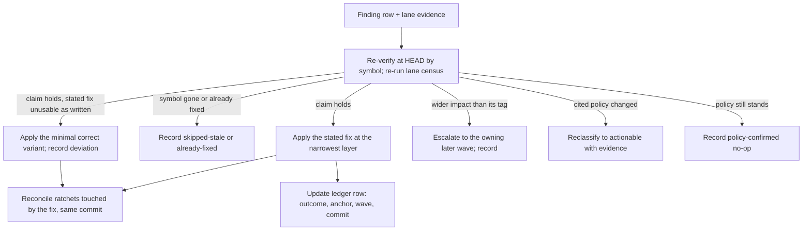
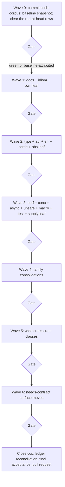

# Rust skills audit remediation - Plan

## Goal Capsule

- **Objective:** the 965 findings of the 2026-09-24 rust-skills audit are each applied or recorded with evidence, the workspace's gates are green on the resulting head except where the wave-0 baseline attributes a failure to pre-existing work, and one reviewed pull request carries the work.
- **Means:** wave-ordered application with the audit's lane files as the unit of record (KTD1), re-verify-then-apply with escalation (KTD5), per-wave gates (KTD3), one pull request at the end (KTD2).
- **Authority order:** `AGENTS.md` and its linked contributor authorities first; the audit report and lane files as the unit of record for finding content; this plan for sequencing and gates.
- **Execution profile:** Deep refactor across the 94-crate workspace, executed by `ce-work` with per-wave integration in the primary clone (KTD11), then the repository's PR tail.
- **Stop conditions:** a wave gate fails and is not attributable to the recorded baseline (KTD4) - stop the wave and record; a settled decision (KTD2, KTD3, KTD8, KTD9, KTD10) is contradicted by evidence - stop and report rather than resolve silently.
- **Who finishes:** the repository caller - commit and push, the mandatory independent `ce-code-review mode:agent` pass on the final head, then the reviewed-head lifecycle to merge.

---

## Product Contract

### Summary

Execute the remediation of the 2026-09-24 rust-skills audit: 923 `actionable` findings applied across the 94 workspace crates in the audit's own blast-radius order (leaf, then family, then wide), except that the actionable high-severity rows land first in a wave of their own, 25 `needs-contract` findings applied together with the schema, emitter, documentation, manifest-version, and golden-pin work they require, and 17 `policy-confirmed` findings recorded as deliberate no-ops that cite the policy they conflict with. The audit's report and lane files remain the unit of record; the plan pins wave structure, the per-finding verification discipline, the gates, and the recording ledger, and does not re-enumerate the findings.

### Problem Frame

The audit (16 craft lenses over every workspace crate, independently verified) produced 965 findings whose median item is small - a clone that a borrow replaces, a doc comment missing its contract sections, an iterator that an index loop shadows, a test that cannot fail - and whose head is not: 13 `high` rows carry a panic reachable from wire or caller input, a blocking call on an executor worker, a test that cannot fail, or one assertion that cannot pass and is red at the head. The findings are evidence-complete but unimplemented, and they live beside a policy surface that will fail closed on careless fixes: a blocking-API lint at live `deny` level, an async-gate inventory keyed by file and line, a blocking census with committed baselines, provider-crate ratchets, and a security scan that rejects log records mentioning pinned correlation identifiers.

### Requirements

**Execution discipline**

- R1. Every finding is applied, or recorded in the remediation ledger with evidence as skipped-stale, already-fixed, escalated, reclassified, or policy-confirmed; an applied row whose stated fix could not be used as written records the variant it landed instead; close-out accounts for each finding id exactly once.
- R2. Within a wave, findings are applied most-severe first; the 12 actionable `high` rows land before their lenses' bulk work, and the thirteenth (policy-confirmed) is recorded as a no-op in the same wave.
- R3. No finding is applied on the audit's word alone: its claim is re-verified at current HEAD by symbol, re-running the lane's own census or search; a stale or already-fixed claim is recorded and not applied, and a claim that holds under a fix that cannot be used as written is applied as the minimal correct variant with the deviation and its evidence recorded.
- R4. A finding whose re-verification shows wider impact than its audited blast tag escalates to the later wave that owns that surface, and the escalation is recorded.
- R5. Beyond the fix each finding states, no behavior changes; the existing test suites are the behavioral net.

**Contract surface**

- R6. A change to a wire format, error code, manifest schema, CLI surface, or generated shape moves schema, emitter, prose, `manifestVersion`, and the pinning golden test together in one commit, with committed output from the generator aggregate.
- R7. Generated Rust is never hand-edited; a change to generated output goes through its generator source.

**Recording**

- R8. The audit report and lane files stay unedited while the remediation runs, and the ledger is updated in the same pull request as the fixes it describes. The audit record is working material for the remediation and does not ship; the gate set and the changelog fragments are the record that does.
- R9. Finding identifiers appear only inside the audit record while it is being built - never in source, doc comments, commit messages, changelog fragments, or the pull request body.

**Gates**

- R10. Each wave ends green on the gate set KTD3 owns, including the container lane for the wave that moves the guest lockfile; a red gate that is not baseline-attributed stops the next wave.
- R11. A fix that moves a ratchet surface moves the ratchet in the same commit: the async-gate inventory, the blocking-census baseline, and the provider-crate-policy rows.
- R12. Final acceptance runs both `make test-integration` and `make test-host-integration`.

**Delivery**

- R13. Waves land as commits on one branch, and the work ships as one pull request whose final head carries an independent review pass.
- R14. `policy-confirmed` findings are not implemented; each is recorded as a no-op citing the policy it conflicts with, and is implemented only if that policy has since changed, with the reclassification and its evidence recorded.

### Scope Boundaries

**In scope:** all 965 audit findings, distributed across the audit's blast-radius and verdict clusters as mapped in the appendix; the ratchet reconciliations and contract-surface updates those fixes force; the remediation ledger.

**Deferred to Follow-Up Work**

- Findings reclassified at apply time into a surface this plan excludes (recorded in the ledger, then planned separately).
- The retired `labs/` tree and any pre-existing failure the baseline attributes to work outside the audit's crates.
- New benchmark coverage for the perf lens: the audit's perf rows are static, and this plan applies only their structural wins (KTD10).

### Open Questions

None blocking. Deferred to implementation, by design: which individual findings turn out stale at apply time (R3 handles it), and which wave each escalated finding lands in (R4).

---

## Planning Contract

### Key Technical Decisions

- KTD1. **Lanes are the unit of record; the plan defines waves, gates, and the ledger.** Chosen over re-enumerating findings here: the lane files carry anchors, evidence lines, and per-finding fixes, and duplicating them would fork two sources of truth.
- KTD2. **One pull request at the end; waves are commits on one branch.** (session-settled: user-directed - chosen over a pull request per wave: the user directed a single end-of-work pull request.) The wave commits keep the diff reviewable per wave, and the review pass consumes the ledger's finding-to-diff map per wave rather than re-deriving the structure from the aggregate diff.
- KTD3. **A wave gate is `make check` plus `make test-host-integration`, extended with `make check-census` and the local security scan.** (session-settled: user-directed - chosen over gating on `make check` alone: the user directed the host-integration lane between waves.) The two additions are required checks on the protected branch that `make check` does not subsume, and the most common fix shapes here - moving blocking work off the executor, restructuring a log record - are exactly what they catch. One wave extends the set: the wave that moves the guest lockfile also runs the container lane, because no other gate in the set exercises a foreign userland. Environmental failures in the host lane (Attic preflight, missing KVM, privileged build) are retried with the same unmodified command and reported; a Bazel profile is never switched to route around a failure.
- KTD4. **Wave 0 records a baseline before any wave verdict is read.** The audit's own report identifies a test at `packages/d2b-resource-runtime/src/revision.rs` that asserts a placeholder against a rendering that cannot contain it, so `make check` at an untouched head is expected red; a gate verdict is only evidence once pre-existing failures are attributed to the baseline rather than to a wave.
- KTD5. **Re-verify, then apply, and escalate wider-than-audited impact forward.** Chosen over applying the queued tag blindly: the audit's blast tags are judgments, and a leaf-tagged finding that breaks a consumer crate fails the wave's own gate.
- KTD6. **Ratchet reconciliation is the integrator's step, in the same commit as the fix.** The async-gate inventory is keyed by file and line and fails in both directions; the blocking census fails on any covered count above its baselined value; the provider-crate ratchets fail on an entry whose signal is gone. None of them can be reconciled in a later cleanup commit without leaving the wave gate red.
- KTD7. **A contract change commits the whole surface at once.** `make generate` is the only write path for generated artifacts, `tests/golden/**` and the in-code golden pins are hand-updated, and the schema version moves with the pinning test; anything less fails the drift gate or a frozen-wire test.
- KTD8. **`policy-confirmed` findings stay unimplemented.** (session-settled: user-approved - chosen over reopening the underlying policy or decision inside this plan: the user confirmed the recorded-no-op scope.) Each cites the policy file it conflicts with; a finding whose cited policy has since changed is reclassified to actionable with the evidence recorded.
- KTD9. **Test-lens findings repair first and delete second.** (session-settled: user-approved - chosen over blanket repair or blanket deletion: the user confirmed the disposition rule.) A test judged incapable of failing is re-verified at apply time, its provider-crate layout obligations are checked, and only then is it deleted with its references swept.
- KTD10. **Perf findings are applied as structural wins only.** (session-settled: user-approved - chosen over measurement-first gating: the user confirmed the static evidence as the basis.) The audit measured nothing; this plan takes the avoidable allocation, copy, and scan-cost wins and leaves micro-tuning and new benchmarks to separate work.
- KTD11. **Waves partition by file ownership; workers get isolated worktrees; the integrator lands slices.** Chosen over an undivided fan-out: findings in one file across several audit lanes would otherwise collide, and the generator aggregate must be serialized per wave rather than per worker.

### High-Level Technical Design

Per-finding lifecycle - every finding takes exactly one path out of classification:

Wave and gate sequence - one branch, one pull request:

Each gate is the KTD3 set. Ratchet reconciliation (KTD6) and ledger rows (R8) happen inside the wave, before its gate.

### Assumptions

- The audit corpus is committed with wave 0 so worktrees and reviewers can read the lanes (its directory is currently untracked).
- `make check` at the untouched head is red on the audit's reported test; wave 0 confirms or refutes this, and the baseline record decides how later red gates are attributed.
- Findings' anchors are valid at the audit's baseline commit; the tree has not changed since, but application still locates symbols rather than lines (R3).

---

## Implementation Units

### U1. Wave 0 - baseline, corpus commit, and the red-at-head rows

- **Goal:** the unit of record is tracked, the gate baseline is recorded, and the correctness-first rows are fixed (or, for the one policy-confirmed row, recorded) so the first wave gate reads as evidence.
- **Requirements:** R2, R3, R5, R10; KTD4.
- **Dependencies:** none.
- **Files:** `changelog.d/`, and the finding sites - `packages/d2b-resource-runtime/src/revision.rs`, `packages/d2bd-runtime/src/runtime_process.rs`, `packages/d2b-broker/src/runtime.rs`, `packages/d2b-broker/src/ops/kernel_ops.rs`, `packages/d2b-broker/src/ops/sys.rs`, `packages/d2b-bus/src/` (telemetry test), `packages/d2b-provider-display-wayland/src/filter.rs`, `packages/d2b-provider-wayland-policy/src/` (applied), `packages/d2b-provider-user/src/` (record-only, no code change).
- **Approach:**
  1. Commit the audit corpus and create the ledger with this row schema: finding id, lens, cluster, audit verdict, outcome, apply-time anchor, wave, commit, reason or policy citation, escalation history, and - for an escalated row - the final outcome recorded when the owning wave applies it (KTD1, R8).
  2. Record the baseline: run the KTD3 gate set at the untouched head and write the result - pass or fail per gate, with every pre-existing failure attributed. Any additional pre-existing failure inside the audit's crates is fixed here when it blocks the gate and otherwise recorded as baseline-attributed and deferred.
  3. Dispose of the 13 `high` rows, re-verified per R3: apply the four test rows, the two wire-digest panic rows, the provider-wayland-policy caller-input panic at its driver-args boundary, and the four executor-blocking rows (each with the replacement the lint vocabulary names rather than a new allowance); record the provider-user blocking-NSS row as a policy-confirmed no-op citing its policy (R14, KTD8); escalate the remaining member sites of the shared driver-args class to U5, with the escalation recorded.
  4. Reconcile the ratchets these rows touch, then run the gate; the wave only closes with a red-to-green delta on the baseline record.
- **Patterns to follow:** the sibling `from_request_with_join` path already converts the same parse failure into a typed protocol error; the sibling `sd_notify_ready` test already asserts an observable outcome; the bounded-worker shape named in `clippy.toml` is the house replacement for blocking work on the executor.
- **Test scenarios:**
  - The revision display test asserts the rendered revision and passes.
  - Each repaired `sd_notify` test fails when its observable outcome changes; any test deleted here was re-verified incapable of failing and its references were swept.
  - The bus telemetry test fails when a label leaves the closed set.
  - A malformed authoritative-audit join reaching the broker and the daemon yields the typed protocol refusal instead of a panic - the scenario mirrors the sibling converting path.
  - The rewritten display-wayland registry-handler test fails when the synthetic clipboard global stops being advertised.
  - The provider-wayland-policy driver constructor returns a typed refusal for a malformed zone token instead of panicking.
  - The ledger carries the provider-user NSS row as a policy-confirmed no-op citing the policy file, with no code change in that crate.
  - `make check-census` is no worse than the recorded baseline after the blocking fixes.
- **Verification:** the audit corpus is tracked; the baseline record states each gate's state at the frozen head; every U1 ledger row carries an outcome and an apply-time anchor; the wave gate set is green or the residual failures are attributed to the baseline with evidence.

### U2. Wave 1 - documentation, idiom, and ownership leaf work

- **Goal:** the three largest leaf clusters are applied: doc contracts, iterator and derive idiom, and ownership that removes explainable clones.
- **Requirements:** R1-R5, R10, R11.
- **Dependencies:** U1.
- **Files:** the `docs`/`idiom`/`own` lane groups across their crates (about 64 crates carry doc rows; the heaviest are the daemon, broker, bus, xtask, session, and resource-runtime crates), `packages/xtask/data/async-gate-inventory.json` when line shifts demand it, `changelog.d/`.
- **Approach:**
  1. Partition the wave's rows by file so no two workers share a file (KTD11); run the mechanical clusters in parallel worktrees.
  2. Apply doc rows as contract prose: first-sentence shape, `# Errors`/`# Panics`/`# Safety`/`# Examples` on the items the lanes name, module docs; new examples become doctests that must pass inside `make check`.
  3. Apply idiom and ownership rows as behavior-preserving rewrites, and take the lane's own evidence line as the census for any claim about unused or reducible surface (R3).
  4. Reconcile the async-gate inventory if an edit shifts a marked call's line, and run the wave gate.
- **Patterns to follow:** the crate-level `#![deny(missing_docs)]` crates document every public item, so prose additions are safe there and any new public item must carry docs; existing doc blocks that already state contract prose are the template.
- **Test scenarios:**
  - Every doctest added or changed by this wave compiles and passes inside the Layer-1 gate.
  - A crate carrying `#![deny(missing_docs)]` still builds after any public item this wave touches.
  - Rewritten iterator and ownership sites leave the crate's existing suite green with unchanged assertions.
  - The async-gate inventory regenerates byte-stable when nothing shifted, and records shifted lines when they did.
- **Verification:** wave gate set green; ledger rows for every applied, skipped, or escalated row of these three lenses.

### U3. Wave 2 - type, api, err, serde, and observability leaf work

- **Goal:** the model-shaped clusters are applied: illegal states in types, public-surface leaks, error taxonomies, serde boundaries, and log records.
- **Requirements:** R1-R5, R9-R11.
- **Dependencies:** U1; independent of U2 (disjoint files), but the KTD3 gate between waves serializes them.
- **Files:** the `type`/`api`/`err`/`serde`/`obs` lane groups and their crates; `docs/reference/error-codes.md` and `tests/golden/**` only where a row says the wire shape moves, in which case the row belongs to U7; `changelog.d/`.
- **Approach:**
  1. Type and api rows: parsed newtypes over re-parsed strings, visibility reductions the lanes support by census, and public-surface narrowing; a row that changes a wire type is escalated to U7 rather than applied here (R4, R6).
  2. Error rows: taxonomies split by caller action, context that survives the call stack, and typed refusals replacing panics where the lanes name them.
  3. Serde rows: boundary validation at the deserialization edge, representation choices the lane names, and round-trip tests for anything that changes shape.
  4. Observability rows: structured fields over formatted strings, one log per error chain, and - mandatory - no log record this wave edits may reference the pinned correlation identifiers the security scan rejects.
  5. Record this wave's policy-confirmed rows (the type, api, and serde no-ops) as no-ops citing their policies (R14).
- **Patterns to follow:** sibling types in the same crate that already validate on admission; the repository's generated error-code reference is the authority for anything wire-visible and is regenerated, not hand-edited.
- **Test scenarios:**
  - A type introduced for a previously re-parsed string rejects the malformed input the old `expect` would have panicked on.
  - A narrowed public surface leaves the workspace building; any lane-claimed unused item is deleted only with the lane's census re-run.
  - Changed error paths return the typed variant the lane names, with the existing failure-path tests updated to assert it.
  - A serde shape change round-trips through its crate's existing serde tests, or those tests move with the wire change into U7.
  - The local security scan reports no finding on the wave's added lines.
- **Verification:** wave gate set green; ledger rows for each applied, skipped, or escalated row; any escalation to U7 recorded with its reason.

### U4. Wave 3 - perf, concurrency, async, unsafe, macro, test, and supply leaf work

- **Goal:** the risk-shaped clusters are applied: allocation and scan cost, lock and channel discipline, async-correctness, unsafe documentation, macro hygiene, test quality, and dependency hygiene.
- **Requirements:** R1-R5, R9-R11.
- **Dependencies:** U1; overlaps U2/U3 only through crates, not finding-site files - the async-gate inventory under `packages/xtask/data/` is shared ratchet data that U2 and this wave both list.
- **Files:** the `perf`/`conc`/`async`/`unsafe`/`macro`/`test`/`supply` lane groups and their crates; `packages/xtask/data/blocking-census-baseline.json` and `packages/xtask/data/async-gate-inventory.json` when a fix moves them; per-crate `Cargo.toml` and `BUILD.bazel` for dependency rows; `packages/Cargo.guest.lock` when a mirrored crate's dependency set changes; `changelog.d/`.
- **Approach:**
  1. Perf rows: take the structural wins (avoidable allocation, copy, and repeated scan), skipping micro-tuning (KTD10); record that evidence is static.
  2. Concurrency and async rows: replace blocking work on the executor with the house bounded-worker or async equivalents the lint vocabulary names; prefer removing a banned call over adding an allowance, and where a baseline must move, move it in the same commit with the justification recorded (KTD6).
  3. Unsafe and macro rows: safety sections and invariant documentation, and macro hygiene or helper-module fixes the lanes name; the sanctioned unsafe sites stay as they are except where a lane proves an invariant is documentation-only.
  4. Test rows: repair toward behavioral assertions; delete only a re-verified incapable-to-fail test, after confirming the crate's layout obligations and sweeping its references (KTD9).
  5. Supply rows: drop or re-point dependencies with their `BUILD.bazel` dep lists in the same commit, and follow the repository's copied-workspace procedure when a mirrored crate's dependency set changes.
  6. Record this wave's policy-confirmed rows (the concurrency and test no-ops) as no-ops citing their policies (R14).
  7. Because this wave moves the guest lockfile, run the container lane (`make test-integration`) as part of its gate set.
- **Patterns to follow:** the sanctioned allow reasons in the provider-crate policy are the only acceptable per-site allowances; the dead-code lane is the local aid when visibility or dependency lists change.
- **Test scenarios:**
  - The blocking census is unchanged, or its baseline moves in the same commit as the fix that required it, with the reason recorded.
  - The async-gate inventory regenerates byte-stable after the wave, or records exactly the sites it moved.
  - A repaired test fails when the behavior it now asserts is broken; a deleted test was re-verified incapable of failing and no gate or document still references it.
  - A dependency drop leaves the workspace and the crate's Bazel dep list consistent, and a mirrored-crate dependency change refreshes the guest lock with the supply-chain and policy gates run.
  - Unsafe sites this wave touches keep a documented safety justification; none is removed to silence a lint.
  - Moving the guest lockfile leaves the container lane green.
- **Verification:** wave gate set green including the census, the security scan, and - for this wave - the container lane; ledger rows with outcomes; ratchet moves in the same commits as their triggers.

### U5. Wave 4 - family consolidations

- **Goal:** the cross-crate family clusters are applied: knowledge and helpers duplicated inside one family move to their canonical home.
- **Requirements:** R1-R5, R10, R11, R14.
- **Dependencies:** U2-U4 (the leaf surface they re-point must be settled).
- **Files:** the `family`-tagged rows of the `idiom`/`own`/`type`/`api`/`err`/`serde`/`obs`/`docs`/`perf`/`async`/`test` lenses, concentrated in the provider family and the credential family; `packages/xtask/src/provider_crate_policy.rs` ratchet rows that a move empties; `changelog.d/`.
- **Approach:**
  1. Re-verify each family row's prerequisite leaf state before applying it (R4): a canonical home that a skipped leaf row was to create means the family row escalates or stays open.
  2. Move the duplicated knowledge to the named canonical home and re-point every consumer; no shim, no re-export of the moved item from the old location.
  3. Delete the ratchet rows the moves empty in the same commit, and run the provider-crate layout check.
  4. Record this wave's policy-confirmed family rows as no-ops citing their policies (R14).
- **Patterns to follow:** the provider-toolkit module that already hosts the family's shared credential helpers; the ratchet tables state the exact signal each row requires, so an emptied row is removed rather than relaxed.
- **Test scenarios:**
  - Each family's existing suite passes with the moved helper, and a consumer-crate test that exercises the moved path still passes through the new home.
  - The provider-crate layout gate passes with the emptied ratchet rows deleted; no row is deleted while its signal still exists.
  - A family row whose prerequisite was skipped is recorded as escalated rather than half-applied.
- **Verification:** wave gate set green; ledger rows for each family row; ratchet diffs present in the same commits.

### U6. Wave 5 - wide cross-crate classes

- **Goal:** the cross-crate duplication classes are resolved once, at the canonical home the audit names.
- **Requirements:** R1-R5, R10, R11, R14.
- **Dependencies:** U5 (family homes settled), and the leaf waves for the sites it touches.
- **Files:** the sites the audit's cross-crate lane names, across the provider family, the contracts family, the daemon and its runtime, the broker, and the resource crates; `changelog.d/`.
- **Approach:**
  1. Apply each class as one change over all its member sites or none; where a member site's fix is a wire-shape move, that member escalates to U7 (R4); where the class's canonical home is itself a family row from U5, cite it rather than re-deriving it.
  2. Record this wave's policy-confirmed wide rows as no-ops citing their policies (R14).
- **Patterns to follow:** the audit's cross-crate lane names the class, its member sites, and the canonical home; the current tree's contract types are the authority for what a shared shape must look like.
- **Test scenarios:**
  - Each class's member sites are all changed together, and the workspace builds; a partially applied class is recorded rather than left half-done.
  - The class's canonical home is exercised by at least one test from a consumer crate that previously duplicated it.
- **Verification:** wave gate set green; ledger rows naming the class, its sites, and any escalated member.

### U7. Wave 6 - needs-contract surface moves

- **Goal:** the findings that change a published surface land with the whole surface: schema, emitter, prose, version, and pins.
- **Requirements:** R6, R7, R10, R11, plus the finding-level requirements they carry.
- **Dependencies:** U2-U6 (their wire-touching rows escalate here).
- **Files:** the `needs-contract` rows across the `type`/`api`/`err`/`serde` lenses and any escalated wide member; the contracts crates and their schemas, `docs/reference/error-codes.md`, `docs/reference/cli-contract.md`, `docs/reference/manifest-schema.md`, `tests/golden/**`, the pinning tests the lanes name, `packages/xtask/src/` generator modules when a generator input moves, `changelog.d/`.
- **Approach:**
  1. For each row, enumerate its full surface before editing: the type or schema, the emitter, the reference prose, `manifestVersion`, the pinning golden test, and the fixture data.
  2. Change the surface in one commit per row group and run the generator aggregate; the drift gate proves committed equals regenerated.
  3. Update the hand-held goldens and the version-coupled pinning tests with the schema change, not after it.
- **Patterns to follow:** the version-coupled golden tests already in the tree move with the schema version; the generated reference documents are regenerated rather than hand-edited.
- **Test scenarios:**
  - The drift gate is green: committed generated artifacts equal freshly regenerated output.
  - A frozen wire-string test moves with the shape change, and its crate's contract tests pass.
  - A manifest-shaped change moves the schema version and the pinning test together, with the reference prose updated in the same commit.
  - Fixture-backed contract tests pass against the updated fixtures.
- **Verification:** wave gate set green; every row's ledger entry names the surfaces it moved; no hand-edited generated file.

### U8. Close-out - reconciliation, acceptance, and the pull request

- **Goal:** every finding is accounted for, both integration lanes are green, and the reviewed pull request carries the work.
- **Requirements:** R1, R8, R9, R12, R13.
- **Dependencies:** U1-U7.
- **Files:** the ledger, `changelog.d/`, and the pull request.
- **Approach:**
  1. Confirm every policy-confirmed row was recorded as a no-op with its policy citation before reconciling, then reconcile the ledger against the audit's per-lens cluster lists: every finding id appears exactly once with an outcome, and any id that cannot be explained is hunted before close-out.
  2. Run final acceptance - both integration lanes - on the frozen head, after the last wave gate.
  3. Write the changelog fragment for the branch, without finding identifiers, and open the pull request with validation evidence; the independent review pass runs on that head against the ledger's finding-to-diff map, wave by wave.
- **Patterns to follow:** the ledger row schema from U1; the repository's changelog fragment shape for a branch; the pull request body records the change and validation evidence only.
- **Test scenarios:**
  - Ledger reconciliation reports zero unaccounted and zero duplicated finding ids.
  - Both integration lanes pass on the head the review covers; a failure after review is treated as a head change and re-enters the reviewed-head lifecycle.
  - The changelog fragment contains no finding identifier and validates under the changelog gate.
  - Every policy-confirmed row is recorded with its citation, and an escalated row carries its escalation history and its final outcome.
- **Verification:** the ledger is complete; final acceptance evidence is recorded; the pull request exists with the review verdict attached to its head.

---

## Verification Contract

| gate | what it proves | when |
| --- | --- | --- |
| `make check` | Layer-1 aggregate: every crate's tests and per-crate clippy under `-Dwarnings`, doctests, fixture contracts, policy suite (async gate, provider-crate layout, drift, changelog), flake and nix-unit lanes | end of every wave (R10) |
| `make test-host-integration` | the NixOS VM lane against the Bazel-staged host-tool bundle: live daemon, broker, socket activation, host posture | end of every wave (R10, KTD3) |
| `make check-census` | the blocking-API census against its committed baselines, including the no-new-blocking-API guard | end of every wave (R10, KTD3) |
| `tests/tools/security-scan.sh` (local run against the wave base) | the identifier-in-log rule on the wave's added lines | end of every wave (R10, KTD3) |
| `make test-integration` | the container lane: static binaries on a foreign non-Nix userland | the wave that moves the guest lockfile (U4) and final acceptance (R12) |
| ledger reconciliation | every finding id accounted exactly once with an outcome | close-out (R1, U8) |
| independent `ce-code-review mode:agent` on the final head | the repository's mandatory review evidence, bound to the reviewed head | before merge (R13) |

## Definition of Done

- Every one of the audit's findings is applied, or recorded with evidence as skipped-stale, already-fixed, escalated, reclassified, or policy-confirmed; no finding is silently dropped and none is applied without re-verification.
- Each wave's gate set (R10) is green before the next wave starts; residual failures are attributed to the wave-0 baseline with recorded evidence, and any baseline-attributed failure that later blocks close-out has an owner recorded in the ledger.
- Ratchet surfaces moved by the fixes were moved in the same commits, and the contract-surface changes shipped with their schema, emitter, prose, version, and pins together.
- The audit report and lane files stayed byte-unchanged and the ledger was complete for the whole remediation. The record itself is not part of the shipped tree: each finding's outcome is carried by its changelog fragment and by the code the gate exercises.
- Final acceptance ran both integration lanes on the reviewed head, and the pull request carries review evidence for that head.
- No finding identifier reached the shipped tree: not into source, doc comments, commits, changelog fragments, or the pull request body.

---

## Appendix

### Wave to cluster map

Counts are the per-lens cluster membership this plan applied, recorded here
because the audit record itself is not part of the shipped tree; each wave
executes the rows behind them.

| wave | lenses and clusters | findings |
| --- | --- | ---: |
| U1 | cross-cutting: the 13 `high` rows - 8 leaf (7 actionable plus the policy-confirmed row recorded as a no-op), 2 family (the driver-args class, applied at its panicking member and escalated for the remaining sites), 3 wide | 13, a subset |
| U2 | `docs` 139 + `idiom` 122 + `own` 107, leaf, actionable | 368 |
| U3 | `type` 59 + `api` 107 + `err` 79 + `serde` 23 + `obs` 30, leaf, actionable | 298 |
| U4 | `perf` 48 + `conc` 19 + `async` 12 + `unsafe` 4 + `macro` 4 + `test` 63 + `supply` 17, leaf, actionable | 167 |
| U5 | every `family` cluster, actionable rows (2 further family rows are `needs-contract`, 2 are no-ops) | 70 |
| U6 | every `wide` cluster, actionable rows (11 further wide rows are `needs-contract`, 2 are no-ops) | 20 |
| U7 | all `needs-contract` rows: leaf 12, family 2, wide 11 | 25 |
| U8 | close-out; applies no findings | 0 |
| recorded no-op | `policy-confirmed` rows recorded by their owning wave: leaf 13 (U1 one, U3 four, U4 eight), family 2 (U5), wide 2 (U6) | 17 |
| **total** | | **965** |

### Sources

- Gate authority: `Makefile`, `docs/contributing/gates-and-lints.md`, `tests/AGENTS.md`, `.github/workflows/pr-l1-static-fast.yml`.
- Policy surfaces that fail closed: `Cargo.toml` (`disallowed_methods` is live `deny`; the `clippy.toml` comment claiming `allow` is stale), `clippy.toml`, `packages/xtask/data/async-gate-inventory.json`, `packages/xtask/data/blocking-census-baseline.json`, `packages/xtask/src/provider_crate_policy.rs`, `docs/explanation/over-engineering-audit-record.md`.
- Landing lifecycle: `docs/contributing/workflow.md` (worktrees, reviewed-head lifecycle, security scan gate), `docs/contributing/changelog-and-commits.md`, `changelog.d/README.md`.
- Prior executed remediation to mirror for commit and ledger shape: `docs/plans/2026-09-24-001-refactor-ponytail-remediation-plan.md`, whose remediation-outcomes section landed in `docs/explanation/over-engineering-audit-record.md`.
