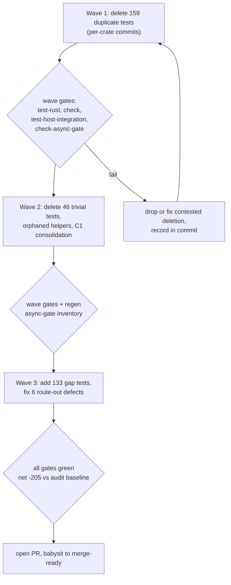

# Unit-Test Audit Remediation - Plan

## Goal Capsule

- **Objective:** Execute all findings from the 2026-09-24 unit-test audit: delete 205 redundant/trivial unit tests, consolidate duplicated test-helper families, add 133 gap tests, fix 6 route-out product bugs.
- **Authority hierarchy:** the audit lane files (`docs/audits/2026-09-24-unit-test-audit/lane/*.md`) are the authoritative work list; this plan defines execution order and gates only. Product Contract below defers to lane citations.
- **Stop conditions:** a `duplicate:` claim whose cited covering test does not pin the stated behavior is dropped from deletion and recorded in the wave's commit message — never forced. A route-out fix that would change product semantics beyond the cited defect goes to Open Questions instead of being improvised.
- **Execution profile:** waves in dependency order; one commit per crate per wave; each wave ends with the Verification Contract gates green before the next wave starts.
- **Tail ownership:** `ce-work` (or an equivalent executor) owns implementation, gate runs, and commits; this plan defines no launch prompt. After the final wave, open a PR and babysit it to merge-ready (review comments, CI failures, routine base movement) before the work is considered done.

---

## Product Contract

### Summary

Remove every unit test the 2026-09-24 unit-test audit judged redundant or trivial (185 test fns across the 75 crate lanes plus 20 cross-layer findings, 205 total), collapse duplicated test-helper families into single canonical homes, add the 133 gap tests the audit flagged, and fix the 6 product-code bugs the auditors routed out. No coverage-percentage targets; the audit's per-test citations are the work list.

### Problem Frame

The workspace carries 4,938 unit-test fns across 75 crates. The audit found 159 `duplicate:` tests (each already covered by a named keeper test), 46 `trivial:` tests (plumbing echoes), 5 duplicated helper families (646 lines), 133 untested error/boundary paths, and 6 product-code defects spotted while reading. Redundant tests are actively harmful: they pin nothing new, mask real coverage gaps in count-based reviews, and slow every `make test-rust` run.

### Requirements

Correctness of deletions:

- R1. Every `duplicate:` test fn named in a lane file is deleted, and its cited covering test (`path::test_name`) remains in the tree and passes.
- R2. Every `trivial:` test fn named in a lane is deleted (46 total), together with test-only helpers and fixtures used exclusively by deleted tests. Helpers shared with surviving tests stay.
- R2a. A lane citation that fails verification (the covering test does not pin the stated behavior) is skipped, never deleted against evidence; the skip is recorded in the wave's commit message.

Consolidation:

- R3. Each C1 helper family has exactly one canonical home after this work: recording-manager fakes and requeue-scheduler fakes in `packages/d2b-provider-toolkit/src/testing/fakes`; scratch-root resolution helpers in the `d2b-core` `test_support` module; `block_on` copies converge per KTD2. Byte-similar copies are deleted; consumers import the canonical helper.
- R4. New shared-helper dependencies follow the existing conventions: toolkit fakes via the crate's public `testing` module; `d2b-core::test_support` via the `test-support` feature consumed as a dev-dependency, matching the pattern in `packages/d2b-broker/Cargo.toml` and `packages/d2b-host/Cargo.toml`.

Gap closure and bug fixes:

- R5. Each `gap:` finding gains a test that pins the lane-cited behavior (error path, boundary, or ignored-test promise) at the location the lane names, in the crate's existing test style. All 133 gaps are in scope.
- R6. Each of the 6 route-out defects is fixed so the pinned behavior matches the frozen contract (see KTD5); each fix is pinned by a test, typically the lane's related `gap:` finding.
- R7. An `#[ignore]`d test flagged as a broken promise is either fixed and unignored or deleted as redundant — never left ignored.

Process:

- R8. Work proceeds in the audit's wave order (wave 1 duplicate deletes, wave 2 trivial deletes plus helper cleanup and consolidation, wave 3 gap additions plus route-out fixes); one commit per crate per wave; each wave ends with `make test-rust`, `make check`, `make test-host-integration`, and `cargo xtask check-async-gate` green before the next wave starts.
- R9. Deleting `#[cfg(test)]` scaffolding must not leave stale async-gate inventory entries; `packages/xtask/data/async-gate-inventory.json` is regenerated with `cargo xtask check-async-gate --write-inventory` whenever a wave deletes a line carrying an `// async-gate-allow:` marker.

### Scope Boundaries

- No integration/contract test files (`packages/<crate>/tests/*.rs`, `tests/golden/`) are modified, except where a route-out fix requires pinning a corrected product behavior there.
- No product-code refactoring beyond the 6 route-out fixes.
- No coverage-percentage targets and no tests beyond the lane-cited gaps.
- The audit report files are read-only inputs; they are not edited by this work.

---

## Planning Contract

### Key Technical Decisions

- KTD1. **Wave order and per-crate commits** follow the audit README remediation section verbatim: wave 1 `duplicate:` deletes, wave 2 `trivial:` deletes plus orphaned-helper removal plus C1 consolidation, wave 3 `gap:` additions plus route-out fixes, gates between waves. (session-settled: user-approved — chosen over a free-order cleanup: the audit's citation chain and gate cadence were approved in the scope confirmation.)
- KTD2. **`block_on` canonical home is split by dependency direction.** The audit proposed one home, but `d2b-provider-toolkit` depends on `d2b-core` transitively (via `d2b-resource-types`), so `d2b-core` cannot take a toolkit dependency. Canonical homes: `d2b-core::test_support::block_on` for core-adjacent crates; `packages/d2b-provider-toolkit/src/testing` keeps its existing `block_on` for toolkit-family crates. No new dependency edges are introduced to force a single home; remaining copies (6 src + 5 tests sites across the workspace) migrate to whichever home their crate can already reach as a dev-dependency.
- KTD3. **Helper-sharing mechanism follows the existing two conventions**, not a new one: toolkit fakes live in the ungated `pub mod testing` (`packages/d2b-provider-toolkit/src/testing/`, consumed via normal `[dependencies]` by e.g. `d2b-provider-activation-nixos`, `d2b-provider-clipboard-wayland`, `d2b-provider-device-gpu`); `d2b-core::test_support` stays gated `#[cfg(any(test, feature = "test-support"))]` and is consumed as a dev-dependency feature. Bazel consumers keep using the existing sibling `*_test_support` targets with `crate_features = ["test-support"]`.
- KTD4. **Toolkit fakes carry doc comments.** `packages/d2b-provider-toolkit` builds with `#![deny(missing_docs)]` and its `testing` module is public, so every fake moved into `d2b-provider-toolkit/src/testing/fakes` needs a doc comment; this does not apply to `d2b-core::test_support` (cfg-gated, no deny lint).
- KTD5. **Route-out fixes align the defect to its frozen contract, verified by wire-level tests.** The two contracts-broker defects (RunnerRole serde token `activation-nixos` vs `as_str` `activation-nixos-runner`; RootUid `for_display` label) are fixed toward the frozen naming rule the contracts crates already pin, and the fix is proven by the crate's existing wire/golden round-trip style. If a defect turns out to be contract-ambiguous (either spelling is defensible), it moves to Open Questions rather than being fixed arbitrarily.
- KTD6. **No new test frameworks.** The workspace has no `rstest`/parametrized macros; gap tests are plain `#[test]`/`#[tokio::test]` in per-file `#[cfg(test)] mod tests` blocks, matching existing sentence-case naming.

### High-Level Technical Design

Each wave is a sequence of per-crate commits; gates run once per wave, not per commit. C1 consolidation (KTD3/KTD2) rides inside wave 2 so orphaned-helper deletion and consolidation land together per crate.

### Sources / Research

- Audit findings and per-test citations: `docs/audits/2026-09-24-unit-test-audit/README.md` plus `docs/audits/2026-09-24-unit-test-audit/lane/<crate>.md` (75 lanes + `_cross-helper-duplication.md` + `_cross-layer-overlap.md`).
- Product-code ponytail audit (model for this remediation): `docs/audits/2026-09-23-ponytail-audit/README.md`.
- Test taxonomy and unit-test definition: `tests/AGENTS.md`.
- Helper-sharing precedent: `packages/d2b-provider-toolkit/src/testing/` (public, ungated) and `packages/d2b-core/src/test_support.rs` (feature-gated); Bazel siblings `d2b_provider_toolkit_test_support` (`packages/d2b-provider-toolkit/BUILD.bazel`), `d2b_<crate>_test_support` in each consuming crate's `BUILD.bazel` (e.g. `packages/d2b-core/BUILD.bazel` with `crate_features = ["test-support"]`).
- Async-gate mechanics: `packages/xtask/data/async-gate-inventory.json`, regenerated only by `cargo xtask check-async-gate --write-inventory`; meta gates in `tests/unit/meta/rust-main-packages-suite-guard.sh` pin suite membership, not test counts — deletions cannot break them.

---

## Implementation Units

### U1. Wave 1 — delete duplicate unit tests

- **Goal:** remove all 159 `duplicate:` test fns (139 crate-lane + 20 cross-layer C2), each pre-covered by its cited keeper.
- **Requirements:** R1, R2a, R8.
- **Dependencies:** none.
- **Files:** the `#[cfg(test)]` test fns cited per lane under `packages/<crate>/src/**`; heaviest crates: `packages/d2b-zone-routing/src/engine.rs` (+20), `packages/d2bd/src/**` (+13), `packages/d2b-broker/src/**` (+11), `packages/d2b-provider-device-security-key/src/**` (+10), `packages/d2b-provider-clipboard-wayland/src/**`, `packages/d2b-contracts/**`. Full per-crate lists: `docs/audits/2026-09-24-unit-test-audit/lane/<crate>.md`.
- **Approach:**
  1. Work crate-by-crate in descending net order; delete only the fn bodies the lane lists as `duplicate:`.
  2. Before each deletion, confirm the cited covering test exists and pins the stated behavior; if not, apply R2a.
  3. One commit per crate; commit message names the covering test(s).
- **Test scenarios:**
  - After each crate's deletions, `make test-rust` passes and every cited covering test is present and green.
  - A `duplicate:` claim spot-checked against its covering test pins the same behavior (audit Phase 3 already verified 3 of these; extend the spot-check to any deletion the executor is unsure about).
  - C2 deletions (broker fd/tap, d2b doctor statuses, credential wrappers) leave their `tests/` covering tests green.
- **Verification:** wave gates pass; deleted test names appear in no remaining source; lane net for the crate is realized (e.g. d2b-zone-routing −24 tests, −488 lines).

### U2. Wave 2 — delete trivial tests and orphaned helpers, regenerate async-gate inventory

- **Goal:** remove the 46 `trivial:` test fns, delete test-only helpers/fixtures that only they used, and clear stale async-gate inventory entries.
- **Requirements:** R2, R9, R8.
- **Dependencies:** U1 (same crates, wave order).
- **Files:** `packages/<crate>/src/**` per lane `trivial:` entries; known orphaned helpers named by lanes: d2bd `FakeHostController::unsupported()`, `d2b-resource-api` `status_body`, `d2b-provider-volume-local` `volume_uid`, `d2b-provider-credential` `UncertainCredentialSession`; `packages/xtask/data/async-gate-inventory.json`.
- **Approach:**
  1. Delete each `trivial:` fn; grep for helpers used only by it and delete those too; never delete a helper still referenced by a surviving test.
  2. Run `cargo xtask check-async-gate`; if stale entries fail (expected wherever a marked test line was deleted, e.g. `d2b-provider-activation-nixos` test_support), regenerate with `--write-inventory` and include the inventory diff in the commit.
- **Test scenarios:**
  - `make test-rust` and `cargo xtask check-async-gate` pass after the wave, with a regenerated inventory where needed.
  - No helper deleted by this wave is referenced by a surviving test or product path (compile proves it; grep confirms intent).
- **Verification:** net −46 tests realized; no dangling test-support scaffolding.

### U3. C1 — consolidate recording fakes into toolkit

- **Goal:** single canonical home for the recording-manager and requeue-scheduler test doubles (12 and 10 crate copies, 464 + 148 lines).
- **Requirements:** R3, R8.
- **Dependencies:** U2 (helper cleanup first avoids consolidating dead copies).
- **Files:** `packages/d2b-provider-toolkit/src/testing/fakes.rs` (canonical home, already hosts `FakeBus`/`FakeEffectPort`/etc.); per-crate `#[cfg(test)]` copies across the 12 + 10 consumer crates; consumer `Cargo.toml` dependency entries where absent (normal `[dependencies]`, per KTD3).
- **Approach:**
  1. Move the canonical `RecordingManager` and `RecordingRequeue` implementations into `d2b-provider-toolkit/src/testing/fakes`, with doc comments (KTD4).
  2. Delete per-crate copies; re-point imports; add toolkit dependencies (normal `[dependencies]`, per KTD3) only where the crate doesn't already depend on it.
  3. Bazel consumers switch to the existing `d2b_provider_toolkit_test_support` target pattern.
- **Test scenarios:**
  - Every consuming crate's tests compile and pass against the shared fake (the fakes are recording doubles; behavior is assertion-compatible by construction — the lane cites the canonical home).
  - Bazel test targets for the migrated crates still build (`bazel test //packages/...` on at least one migrated crate per family).
- **Verification:** no recording-manager/requeue double remains outside the toolkit home; net ≈ −392 and −119 lines realized.

### U4. C1 — canonicalize block_on, scratch-root, and host-contract JSON helpers

- **Goal:** collapse the remaining helper families: `block_on` (6 src + 5 test copies), scratch-root resolution (7 copies in 5 crates), v3 host-contract JSON twin (2 copies).
- **Requirements:** R3, R8.
- **Dependencies:** U2.
- **Files:** `packages/d2b-core/src/test_support.rs` (canonical home for scratch-root and core-reachable `block_on` consumers, via the existing `test-support` feature); `packages/d2b-provider-toolkit/src/testing/mod.rs` (keeps its `block_on` for toolkit-family consumers, per KTD2); the 7 crate-local scratch-root helper copies (5 crates, incl. the intra-crate `d2b-audit` triple); the 2 host-contract JSON fixture copies.
- **Approach:**
  1. Keep both `block_on` homes as KTD2 directs; migrate each copy to the home its crate can reach as a dev-dependency; do not add edges that invert the toolkit→core direction.
  2. Move scratch-root resolution into `d2b-core::test_support`; consumers add the `test-support` dev-dependency feature (pattern: `packages/d2b-broker/Cargo.toml`, `packages/d2b-host/Cargo.toml`; Bazel: `crate_features = ["test-support"]`).
  3. Keep `sample_zone_native_host_json` (`packages/d2b-core/src/bundle_resolver.rs`, moved into `d2b-core::test_support`) as the single host-contract sample; delete the `sample_v3_host_contract_json` twin in `packages/d2bd/src/composition.rs`.
- **Test scenarios:**
  - Migrated crates' unit tests pass with the shared helpers (same helper semantics; copies were byte-similar per the audit).
  - `cargo metadata`-level check: no crate gains a dependency edge from `d2b-core` toward `d2b-provider-toolkit` (the w0 dep-direction meta gate enforces direction; it must stay green).
- **Verification:** remaining per-crate helper copies deleted; homes compile under both `cargo` and Bazel.

### U5. Wave 3 — add gap tests

- **Goal:** close all 133 `gap:` findings with tests pinning the lane-cited behavior.
- **Requirements:** R5, R6, R7, R8.
- **Dependencies:** U2 (deletions land first so new tests aren't written against soon-to-vanish helpers).
- **Files:** per-crate `#[cfg(test)]` modules under `packages/<crate>/src/**` named in each lane's `gap:` lines; e.g. `packages/d2b-core/src/kernel_seat` refusal paths, `packages/d2b-provider-transport-azure-relay` sealed-envelope `BadSchemaVersion` guard, `packages/d2b-session-unix` `ZoneBootstrapIdentity::verify` uid rejections, `packages/d2b-audit` evidence/sink/export-bound gaps, and the `#[ignore]`d broken promises (d2bd vm-start DAG + SIGKILL escalation, `d2b-broker` typed-audit arms).
- **Approach:**
  1. Take the lane `gap:` lines as the checklist — they name the product location and why it matters; do not invent additional gaps.
  2. Write each test in the crate's existing style (`mod tests` at file bottom, sentence-case names, `#[tokio::test]` where async).
  3. Resolve R7 per ignored test: fix and unignore when the promise is still valid, delete when the cited covering test supersedes it.
- **Test scenarios:**
  - Each new test fails if the pinned behavior regresses — spot-verify by temporarily inverting one assertion per family during development (the audit's gap rationale is the failing condition).
  - All 133 lane gaps map to a new or existing passing test; unmerged leftovers are listed in the wave commit message with the blocker.
- **Verification:** `make test-rust` green; per-crate `gap:` sections resolved; count reconciles against the README gap total.

### U6. Route-out product-bug fixes

- **Goal:** fix the 6 product-code defects the auditors routed out.
- **Requirements:** R6, KTD5, R8.
- **Dependencies:** none strictly; sequenced into wave 3 so the pinning tests arrive with the gap wave.
- **Files:** the six defects the audit routed out — the two in `packages/d2b-contracts-broker/src/broker_wire.rs` (RunnerRole serde token mismatch, RootUid display label), the dead error variants in `packages/d2b-session-unix` (`ZoneAdmissionError::ZoneInvalid`) and `packages/d2b-provider-system-core` (`BudgetOvercommit`), the unreachable `has_layout_response` declined branch in `packages/d2b-provider-volume`, and the byte-for-byte duplicated validation block in `packages/d2bd-runtime/src/metrics.rs` (`metrics_handler_with_ch_stats` vs `metrics_handler`). Authoritative list: the audit README §7 route-out appendix (the d2bd-runtime and d2b-provider-volume defects appear only there, not in lane files); the d2b-core vacuous-assertion keep-note is test hygiene, handled in U5, not a route-out.
- **Approach:**
  1. Fix each defect toward its frozen contract (KTD5); dead variants are removed as part of the fix (they are unreachable by definition).
  2. Pin each fix with a wire/golden-style test in the owning crate; where the audit's related `gap:` already demands the test, one test serves both (R5 + R6).
  3. Any defect that turns out contract-ambiguous moves to Open Questions with evidence instead of an arbitrary fix.
- **Test scenarios:**
  - Each fix has a failing-before test: revert the fix and the pinning test fails.
  - Contracts-broker wire round-trips (existing golden/vector tests) stay green with the corrected token and label.
- **Verification:** zero `route-out:` lines remain unaddressed; `make test-rust` green.

---

## Verification Contract

| Gate | Command | When |
| --- | --- | --- |
| Full Rust test suite | `make test-rust` | After every wave (R8) |
| Repo-wide check | `make check` | After every wave (R8) |
| Host integration tests | `make test-host-integration` | After every wave (R8) |
| Async-gate check | `make check-async-gate` (alias of `cargo xtask check-async-gate`) | After every wave |
| Async-gate inventory regen | `cargo xtask check-async-gate --write-inventory` | Only when the check fails on stale entries after deletions (R9) |
| Dependency direction | `tests/unit/meta/w0-dep-direction.sh` via `bazel test` meta targets | After U3/U4 (cycle guard) |
| Bazel test targets | `bazel test` on migrated crates' `*_test_support`/`all-tests` targets | After U3/U4 |

No test-count gate exists: `tests/unit/meta/rust-main-packages-suite-guard.sh` pins aggregate-suite membership only, so deletions cannot break it. The unit-test census at audit time (4,938 fns, measured by the audit methodology) is the baseline; the Definition of Done net is measured against it with the same counting method.

---

## Definition of Done

Global:

- All three waves complete; every wave's gates green at its close (R8).
- Net change vs the audit census: −205 test fns, ≈ −3,829 lines, before counting the ~133 added gap tests and their helpers.
- No `duplicate:`, `trivial:`, or `route-out:` finding from the audit remains unaddressed; each is either executed or recorded as contested with its evidence (R2a).
- Helper families exist at exactly one canonical home each (R3); no crate carries a byte-similar copy.
- All 133 gaps covered or explicitly blocked with reasons in the final wave commit (R5).
- Abandoned-attempt code (helpers, fixtures, branches tried during consolidation) is removed, not left in the diff.

Per unit: each unit's own Verification line holds, and its commit message cites the audit lane it executes.
