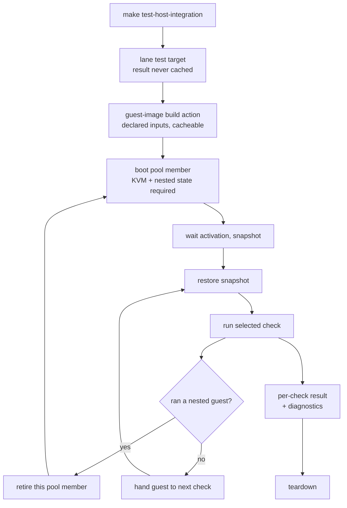
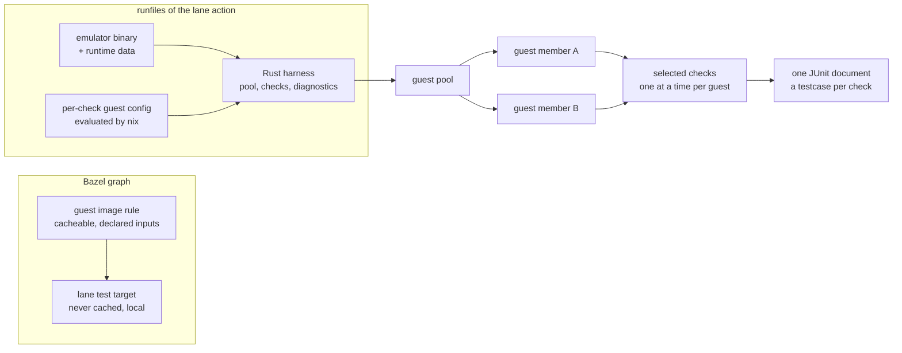
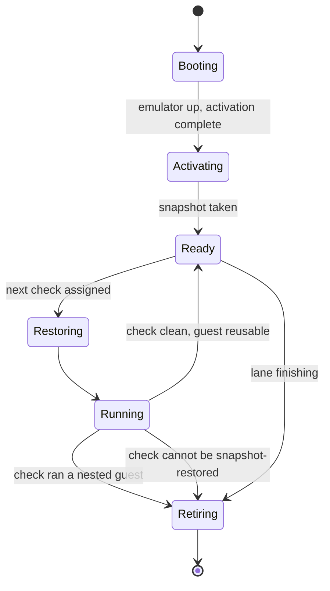

# Bazel-Owned Host Integration Lane - Plan

## Goal Capsule

- **Objective:** The d2b host-integration lane runs as Bazel tests, so a contributor gets check selection, results in the Bazel graph, and a faster local loop, and the repository stops maintaining two build systems for one test tier.
- **Means:** Bazel owns the lane end to end; nix is reduced to a hermetic build action that produces the guest image.
- **Product authority:** This Product Contract owns behavior and scope. `tests/AGENTS.md` owns the type-10 classification; root `AGENTS.md` owns the profile and changelog rules. `docs/plans/2026-08-24-001-refactor-bazel-backed-host-integration-binaries-plan.md` is superseded on its R3, which reserved VM orchestration to nix. The cutover amends the repository instruction sentences that R3 reverses - the host-lane binary-injection rule in root `AGENTS.md`, the type-10 tier rows and host-lane bundle handoff in `tests/AGENTS.md`, and the handoff descriptions in `docs/contributing/critical-subsystems.md`, `docs/contributing/gates-and-lints.md`, `docs/reference/compatibility.md`, and `docs/reference/support-matrix.md` - in the same change that removes the handoff. The heavy-gate rule those files also describe is not carried forward: the guard was deleted and R16 does not require it.
- **Product Contract preservation:** changed at planning time - R3, R5, R6, R7, R9, R16, R17, F1, AE2, AE10. The two user-directed changes are the single lane test target and dropping the heavy-gate semaphore; the rest are research corrections to a snapshot-capability premise, a missing host precondition, the disk layout those two assume, and two contradictions a document review found between requirements that planning-time evidence resolved.
- **Execution profile:** Deep, local-only, delivered as a port of one check at a time rather than a single cutover. Within the port the branch stays green because each unported check keeps executing its existing assertions.
- **Stop conditions:** Stop if the guest's attached writable devices prove not snapshot-capable, before the pool is built; if a restored run costs at least as much as a fresh boot for the same check; or, at the point in the cutover where the deferred check is retired, if no retained check is found to carry the host isolation from Gateway relay credentials it asserts.

---

## Product Contract

### Summary

The type-10 VM lane moves out of nix orchestration and into Bazel: a small pool of guests is built as a hermetic Bazel action, booted once each, and replayed per check through snapshot and restore, with the checks' guest assertions moving to Rust as each one is ported. `make test-host-integration` remains the contributor's command and now invokes a single lane test target; the nix VM fixtures are removed as their checks port.

### Problem Frame

`make test-host-integration` is the last major surface where nix, not Bazel, schedules work. Every other test tier in the repository runs through the Bazel graph, and `docs/plans/2026-08-19-002-refactor-build-test-ownership-cleanup-plan.md` set the direction that Make targets, CI jobs, contributor docs, and tests expose Bazel only. The VM lane was carved out at the time because Bazel owned the binaries but not the run.

The cost of the carve-out is structural rather than episodic. The lane has no Bazel target at all, so it has no selection, no JUnit or BEP history, and no shared cache with the rest of the suite; `Makefile:295` serializes the checks by default; and `flake.nix:610-612` smuggles the Bazel-built d2b binaries into the guest through `builtins.getEnv`, which means the guest closure is keyed on an environment variable rather than on declared inputs. Two build systems own one test tier, and the boundary between them is a shell script.

### Requirements

**Guest image construction**

- R1. Each guest image must be produced by a Bazel build action whose inputs are declared labels, so the image is a graph output that caches and rebuilds on source change.
- R2. The Bazel-built d2b host binaries must reach the guest as declared inputs; the guest must never rebuild them through nix.
- R3. The `D2B_HOST_TOOL_BUNDLE` and `D2B_CH_CONTROLLER_BUNDLE` environment-variable handoff must be removed from the flake and the Makefile.

**Lane execution**

- R4. Bazel must own the guest lifecycle inside the lane test target: spawn, readiness wait, assertion run, restore between checks, and teardown.
- R5. A small pool of guests is booted once each, and every check runs against a snapshot-restored copy of the guest it is assigned to, where assignment matches the check's emulator invocation; a check that cannot be snapshot-restored runs on its own single-use guest instead, and a pool member that has run a nested guest is retired rather than restored.
- R6. Every writable block device a guest attaches must be materialized in a format that supports internal snapshots, and a device that is not must fail the lane rather than run without restore.
- R7. The lane must require `/dev/kvm`, nested virtualization, and nested-state save support on the host; a host missing any of them must stop with a clear message instead of falling back to emulation.
- R8. The pool's aggregate guest footprint must stay within a stated host budget covering memory, vCPU count, and the lane working directory, sized per guest shape with the pool size derived during Planning; checks assigned to one guest run sequentially while the pool itself runs concurrently.
- R9. A contributor must be able to run one named check by filtering the lane target, without booting the checks that were not selected.
- R10. The lane must reproduce each check's emulator invocation - its memory, vCPU count, disk size, the drive layout including the writable-store root drive, and any per-check device options such as the vsock device - rather than booting a single uniform guest shape.

**Assertion layer**

- R11. Each check's guest assertions must end in Rust, compiled and linted by the repository's Rust gates.
- R12. A check that has not yet been ported must keep executing its existing assertions and must keep gating the lane, so no check loses coverage during the transition. The lane owns that check's guest for the whole run, and must re-provide the legacy driver's guest-control surface so its assertions execute unchanged.
- R13. A failing check must report the diagnostics the current driver produces: the failing stage, the resource rows and unit journals that explain it, and the zone debug dump.

**Cutover**

- R14. At cutover the `vmChecks` flake output and the Makefile shell recipe must be removed, and the repository's own instruction and reference documents must be updated to describe the Bazel lane; each `runNixOSTest` fixture is removed when its own check is ported.
- R15. The deferred Gateway-isolation check must be removed rather than migrated, and this work does not replace its coverage.
- R16. `make test-host-integration` must remain the contributor's entry point, invoking the lane's single Bazel test target.

**Contributor surface**

- R17. Every selected check must surface as its own result in the lane's test output, carrying that check's diagnostics, not one aggregated pass or fail for the suite.
- R18. The guest binaries must be built under a repository-committed build profile; the lane must not depend on a caller-supplied profile override.

### Key Decisions

- **Bazel owns the lane end to end.** (session-settled: user-directed - chosen over wrapping the existing nix lane and over consuming a prebuilt guest from outside the lane: one build system, not two.) Governs R1, R4, R14.
- **Nix is reduced to a hermetic guest-image build action.** (session-settled: user-directed - chosen over fetching a published guest image: the guest has to track source changes inside the Bazel graph.) Governs R1, R2, R3.
- **The lane stays contributor-local.** (session-settled: user-directed - chosen over a required PR gate on BuildBuddy: the lane is a local pre-PR surface, which is also what makes the virtualization precondition assertable rather than negotiable.) Governs R7, R8, R18.
- **A small pool of guests is reused through snapshot and restore.** (session-settled: user-directed - chosen over a guest per check and over a single sequential guest: cut total boots from one-per-check to one-per-pool-member while keeping a parallel wave.) Governs R5, R6, R8.
- **Virtualization is a precondition, not a fallback.** (session-settled: user-directed - the lane runs on the contributor's own machine, so emulation is a silent degradation rather than a needed capability.) Governs R7.
- **Assertions port to Rust one check at a time.** (session-settled: user-directed - chosen over keeping the Python testScripts permanently and over porting all eleven in one cutover: the lane is Bazel-native from day one without a coverage cliff.) Governs R11, R12, R13.
- **The pool runs concurrently; one guest runs its checks sequentially.** (session-settled: user-directed - chosen over a single sequential guest: snapshot and restore mutates one guest, so parallelism has to come from the pool.) Governs R8.
- **A check that cannot be snapshot-restored gets a single-use guest.** (session-settled: user-directed - chosen over leaving it on the legacy lane and over deciding at a de-risking spike: its coverage is preserved and the migration never blocks on proving snapshot safety.) Governs R5.

### How This Work Fits Together

<!-- ce-section: work-relationships -->

This plan covers the type-10 VM lane only. That split is the current understanding, not a committed roadmap.

- Remote execution of the lane on BuildBuddy, an executor pool, or in CI as a required gate - *Deferred*: a later plan may take it up once the lane has a stable local run and the virtualization precondition is settled.
- The type-9 container lane and the live-host scripts - *Can proceed independently of* this plan; they share the Make facade but not the VM harness.
- Porting the checks to Rust - in scope for this plan and sequenced inside it: the boot layer lands first, each check then ports per F2, and cutover fires when the last check asserts in Rust.
- Bumping the pinned nixpkgs Bazel ruleset - *Can proceed independently of* this plan; this work stays inside the existing pin.

### Key Flows

- F1. A contributor runs the lane
  - **Trigger:** A contributor invokes `make test-host-integration` on a host with hardware virtualization and nested-state support.
  - **Actors:** The Make facade, the lane test target, the guest-image build action, the guest pool, the checks.
  - **Steps:** The facade invokes the single lane test target; the guest-image action materializes the image from declared inputs; the target boots each pool member once, waits for activation, and snapshots it; each selected check restores its assigned guest, runs, and hands the guest back; a member that has run a nested guest is retired instead of restored; teardown releases the guests.
  - **Outcome:** Every selected check reports through the lane's test output with its result and diagnostics.
  - **Covers:** R1, R4, R5, R8, R10, R16, R17, R18.

- F2. A check is ported to Rust
  - **Trigger:** A contributor picks a check whose assertions still execute in the legacy driver.
  - **Actors:** The contributor, the check's Rust test target, the legacy fixture.
  - **Steps:** The check's current assertions pass unchanged against a guest the lane hands it through the re-provided driver surface; the assertions move to Rust behind the same readiness and diagnostic contract; the legacy fixture for that check is deleted; the lane stays green at every step.
  - **Outcome:** The check asserts in Rust with unchanged coverage, and one fewer legacy fixture remains.
  - **Covers:** R11, R12, R13.

- F3. The lane is cut over
  - **Trigger:** All eleven checks assert in Rust.
  - **Actors:** The contributor, the Make facade, the flake, the contributor documentation.
  - **Steps:** The `vmChecks` output, the Makefile shell recipe, and the deferred check are removed; the instructions and contributor docs that describe the nix lane are updated to describe the Bazel lane.
  - **Outcome:** One lane, one build system, and no nix VM orchestration left in the tree.
  - **Covers:** R14, R15, R16.

### Acceptance Examples

- AE1. Contributor host without the virtualization capability
  - **Covers:** R7.
  - **Given:** a host missing `/dev/kvm`, or one whose virtualization lacks nested-state support.
  - **When:** the contributor invokes `make test-host-integration`.
  - **Then:** the lane stops with a message naming the missing capability, and no check runs under emulation and none against a guest that cannot be snapshotted.

- AE2. Contributor runs one check
  - **Covers:** R9, R17.
  - **Given:** a contributor filters the lane target to a single check.
  - **When:** the lane runs.
  - **Then:** only that check's guest is booted, and its result and log appear as that check's own entry in the lane's test output.

- AE3. A check fails mid-suite
  - **Covers:** R13, R17.
  - **Given:** a ported check fails an assertion after the guest is restored.
  - **When:** the failure is reported.
  - **Then:** the report carries the failing stage, the resource rows and unit journals that explain it, and the zone debug dump, under that check's own entry.

- AE4. A guest attaches a non-snapshot-capable device
  - **Covers:** R6.
  - **Given:** a guest configuration attaches a writable device with no internal-snapshot support.
  - **When:** the lane tries to snapshot that guest.
  - **Then:** the lane fails with a snapshot-capability error rather than running the suite without restore.

- AE5. A check not yet ported
  - **Covers:** R12.
  - **Given:** a check whose assertions still execute in the legacy driver.
  - **When:** the lane runs.
  - **Then:** that check's assertions execute against a lane-owned guest and gate the lane exactly as before the port.

- AE6. Guest closure needs a d2b binary
  - **Covers:** R2, R3.
  - **Given:** a guest image is built for a source state where a d2b binary changed.
  - **When:** the image is built.
  - **Then:** the binary comes from the Bazel graph, the image rebuilds because that input changed, and nix compiles no replacement.

- AE7. The nested cloud-hypervisor check
  - **Covers:** R5.
  - **Given:** a check that runs a nested guest, or one that cannot be snapshot-restored.
  - **When:** the lane schedules it.
  - **Then:** it runs on a guest booted fresh for that run and never restored, and that guest is retired rather than returned to the pool, while the reused pool covers the other checks.

- AE8. Contributor supplies a build-profile override
  - **Covers:** R18.
  - **Given:** a contributor exports a Bazel profile override before invoking the lane.
  - **When:** the lane builds the guest binaries.
  - **Then:** the guest build uses the repository-committed profile and the override does not change the guest closure.

- AE9. Restored run is no cheaper than a fresh boot
  - **Covers:** R5, R8.
  - **Given:** a pool member measured both from a fresh boot and from a restored snapshot.
  - **When:** the restored measurement is at least as large as the fresh-boot measurement.
  - **Then:** the pool is not extended past its first member until restore is shown to be cheaper.

- AE10. A guest built from the current disk layout
  - **Covers:** R5, R6.
  - **Given:** a guest whose attached writable devices - the root drive and the shared state disk - are in a snapshot-capable configuration, and whose in-guest writable-store images are files inside that guest rather than attached devices.
  - **When:** the lane boots that guest and restores it between checks.
  - **Then:** the guest boots and restores, and the suite proceeds on the reused pool rather than the single-use tier.

### Success Criteria

- Before any port lands, the current lane's wall-clock is recorded on the reference host for the full eleven-check suite, for one named check from each of the two guest shapes, and at the current lane's supported check concurrency.
- The full eleven-check lane and a single named check each complete faster than their recorded baselines on the same host.
- A contributor can identify which check failed, and why, from the lane's test output alone.
- With all checks ported, a repo-wide `grep` for the removed environment variables, the `vmChecks` output, and the heavy-gate semaphore returns nothing, including in the repository's own instruction and reference documents.
- A restored run of a check costs measurably less than a fresh boot of that same check, measured per guest shape before the pool grows past its first member.

### Scope Boundaries

**Deferred for later**

- Running the lane on BuildBuddy, an executor pool, or in CI as a required gate. The virtualization precondition is the reason this is deferred rather than merely out of scope: a remote runner has no nested virtualization to give the guest.
- Bringing the type-9 container lane and the live-host scripts into the Bazel graph.
- Rebuilding the repository's cross-lane heavy-gate guard, which this plan neither reinstates nor depends on.
- Bumping the pinned nixpkgs Bazel ruleset to a current version.

**Outside this product's identity**

- d2b's contract that NixOS configuration is the source of truth for Zones and their resources. The guest stays a NixOS system built by the module system; this change alters who runs the test, not how a guest is declared.

**Cost of the decisions above**

- R7 removes the emulation fallback that worked at roughly six times the boot cost, so contributor hosts without nested virtualization lose the type-10 tier entirely rather than running it slowly. This plan provides no replacement verification surface for those hosts.

### Dependencies / Assumptions

- The contributor's host provides `/dev/kvm` with nested virtualization and nested-state save support, which the nested cloud-hypervisor check requires of the guest and which snapshotting an outer guest requires.
- The guest-image action needs a nix build that realizes the system closure into a Bazel-declared output from label inputs. The repository's existing nix-inside-Bazel test harness does not provide this - it runs against the host store over a working-tree flake reference inside an uncacheable, unsandboxed test action - and no nix Bazel ruleset version provides a cacheable nix-build action, so the action is authored here. The substitute reachability the current recipe's cache preflight and closure upload provide must be carried into the action, and the flake must arrive as a declared input rather than a working-tree reference, before R1 can hold.
- The guest's attached writable devices are already in a snapshot-capable configuration: the root drive is qcow2 and the shared state disk is attached with a writable overlay. This is a property to verify, not a conversion to perform; the two writable-store ext4 images are files inside the guest, not attached devices, and a single raw attached device would fail the snapshot outright.

### Outstanding Questions

**Deferred to Planning**

- Which checks share a pool member, and whether that grouping is declared in the repository or derived from each check's declared weight. A grouping that drifts as checks are added is a maintenance surface of its own.
- How the pool size is chosen and whether it is contributor-tunable.
- Whether the host memory budget that bounds R8 uses the repository's existing per-lane memory ceiling shape or a lane-specific one, and whether the budget is contributor-tunable. The existing ceiling meters a single process tree, which cannot cover guests the lane spawns as its own children.

### Sources / Research

- `tests/AGENTS.md:12-15, 23, 68` - the type-10 classification and the "push coverage down toward type 1" rule.
- Root `AGENTS.md:209-215, 229-230` - the no-profile-override rule that R18 answers, and the existing requirement that the guest consume Bazel-built binaries.
- `Makefile:8-10, 11-22, 158-159, 178-361` - the one-class-per-target dispatcher invariant, the lane's membership in the local-target class, the canned Bazel alias, and the serial default at `:295`.
- `flake.nix:606-681` - the `vmChecks` output, the non-recursive fixture discovery, and the two `builtins.getEnv` bundle reads at `:610-612`.
- `tests/host-integration/lib.nix:519-641, 653-796` - the shared node configuration and the diagnostics prelude the Rust assertion layer must reproduce, and the split between reusable configuration and driver-coupled diagnostics.
- `tests/host-integration/lib.nix:529-536, 627-630` - the shared state disk, attached with a writable overlay.
- `runtime-cloud-hypervisor-guest-preflight.nix:637-644` - the in-guest virtualization and vhost-net assertions behind the single-use tier.
- `bazel/checks/fixtures/defs.bzl:1-63` - the one existing Starlark rule that runs nix as a cacheable build action; the model for the guest-image action.
- `bazel/checks/nix/defs.bzl:3-9, 81-125` - the existing nix-inside-Bazel test harness, whose tags establish the non-cacheable convention the lane follows.
- `tests/unit/meta/rust-main-packages-suite-guard.sh:150-173` - the guard that force-registers any crate carrying a test aggregate and forbids positive tags on such aggregates; the reason the lane's targets live outside the main package suite.
- `nixos-modules/base.nix:67-68` and `nixos-modules/lib.nix:322, 421-429` - sshd enabled by default in the guest base, the guest's ssh capability, and the repository's existing QMP readiness vocabulary.
- `CHANGELOG.md:1086-1088` and commit `2c2f8149b` - the deletion of the heavy-gate orchestration, which R16 and four documentation sites previously described as current.
- `docs/plans/2026-08-24-001-refactor-bazel-backed-host-integration-binaries-plan.md` - the superseded plan; its R3 and its "Bazel does not become the scheduler for the NixOS VM test" boundary are what this contract reverses.
- `docs/plans/2026-08-19-002-refactor-build-test-ownership-cleanup-plan.md:266, 269-270` - the direction that tests expose Bazel only and receive binaries from Bazel rather than building at test runtime.
- Planning research dossiers, kept at `/tmp/compound-engineering-1000/ce-plan-research/d57f3743/`: repository patterns, QEMU and nix best practices, framework documentation, and flow analysis.
- Emulator snapshot semantics from the research dossier: internal snapshots are supported only by the qcow2 format, a single writable non-snapshot-capable device fails the whole snapshot, and restoring a guest that has a live nested guest is documented undefined behavior on one vendor while working on another - which is why a member that has run a nested guest is retired rather than restored.
- Bazel execution model from the research dossier: a test action reaches a resource created outside it only by opting out of the sandbox or by an explicit mount pair, a sandboxed test's only writable surface is its own temporary directory, a test result defaults to replaying a cached verdict, and the current Bazel release no longer exposes the host temporary directory to sandboxed actions.
- Measured on the contributor's host: a hardware-virtualized boot reaches a running d2b daemon in 13.6s, against 84.0s under emulation, a 6.2x difference on the same guest image. This is the basis for treating virtualization as a precondition. It does not price the refactor, and it does not describe the whole suite: it is a single boot of the default guest shape, while the two writable-store checks replace the root drive with a bootable one and the repository's own comment says that path adds many minutes to startup and can hang. Both the speed criterion and the restore stop condition are therefore measured per guest shape, and the writable-store shape's cold-boot cost is recorded before the pool is sized.

---

## Planning Contract

### Key Technical Decisions

- KTD1. The heavy-gate semaphore is not reinstated. (session-settled: user-directed - chosen over rebuilding the guard: the repository deleted it deliberately and six documentation sites still describe it as current, so correcting the contract is cheaper than reviving dead infrastructure.) Lane-local teardown and the lane's own stop conditions cover the self-race the guard used to prevent, and the two normative sites that record a `RETAIN` disposition for the semaphore namespace are a different edit class from a prose refresh and need a named owner in U8. Governs R16.
- KTD2. One lane-level test target owns the whole pool lifecycle, and the make target stays in the local class with a one-line recipe that names the repository-committed build profile itself rather than inheriting whatever profile a caller exported, the way the generate target already pins its own. (session-settled: user-directed - chosen over per-check targets with a facade that boots the pool first: the Make dispatcher expands a target to exactly one canned Bazel call under a one-class-per-target invariant, so a two-command facade would break that convention.) Governs R4, R9, R17, R18.
- KTD3. The guest image is built by a rule authored in this repository, modeled on the existing fixture rule, and the emulator is taken from the repository's own pinned nix package set rather than a new third-party Bazel ruleset. (session-settled: user-approved - no nix Bazel ruleset provides a cacheable nix-build action at the pinned or the current version, and the rules that do exist keep realization in the repository-fetch phase; taking the emulator from the same pinned set as the guest avoids adding an external module and keeps emulator and guest at one nixpkgs revision.) Governs R1, R2.
- KTD4. The guest-image action and the lane target both run unsandboxed and local, and hermeticity comes from nix's own configuration rather than Bazel's isolation. (session-settled: user-approved - nix cannot build inside a sandboxed action because its own sandbox requires root, and the fallback degrades silently rather than failing.) Governs R1, R7.
- KTD5. Guests are snapshotted and restored in-process, and a pool member that has run a nested guest is retired rather than restored. The rejected path is live migration: it rolls back memory and device state but not block content, and block migration was removed from the current emulator, so it cannot deliver the rollback the pool needs. It stays the fallback if restore turns out to cost more than a fresh boot. Governs R5.
- KTD6. The lane target's result is never cacheable, and the lane never runs with streamed test output, which would serialize it. Governs R9, R17.
- KTD7. Per-check guest configuration moves out of the runNixOSTest fixtures into a module the lane evaluates, before any fixture is deleted. Governs R10, R14.
- KTD8. The pool's bound covers the aggregate guest footprint across memory, vCPU count, and the lane working directory, read from the re-homed node module's declared guest fields rather than restated as a lane constant. The repository's existing per-lane memory meter cannot decide admission: it samples resident pages, so it under-reports an idle guest's reservation, and it wraps a single process tree where the guests are the lane's own children. Pool size is derived at lane start from that budget against the host's available memory, not chosen by hand; the budget is declared next to the per-check guest configuration rather than supplied as a contributor override, so adding a check cannot silently change what the pool can hold. Checks are assigned to members by matching emulator invocation, which is what fixes a member's device and block configuration for its whole life, so the pool is sized from the number of distinct invocations rather than from a guest-shape count. Governs R5, R8, R10.
- KTD9. The nixpkgs Bazel ruleset stays pinned at its current version; the bump is separate work. Governs R1.

### High-Level Technical Design

The lane has three cooperating pieces and a lifecycle that no existing rule in this repository covers.

The pool lifecycle is the part with the most failure surface, because restore is not a fresh boot:

Two invariants hold across every transition. No guest is ever snapshotted or restored while a nested guest is alive inside it. And the snapshot is taken after activation completes and before any check runs, so a restored guest is always a guest that has never been touched by a check.

### Implementation Constraints

- The lane's targets live outside the main Rust package suite. The repository's test census force-registers any crate carrying a test aggregate into the main package suite and rejects positive tags on such aggregates, so the harness crate carries no test aggregate and the lane's test targets are registered directly by the lane's own build file.
- A snapshot-capable guest needs every writable attached device to support internal snapshots. Today the root drive is qcow2 and the shared state disk is attached with a writable overlay; a single raw attached device fails the snapshot for the whole guest, so the lane verifies this at boot rather than converting formats.
- The guest image build must not depend on a working-tree flake reference, because that would key a "cacheable" output on mutable state. The flake and its lock arrive as declared inputs, and the cache the current recipe configures is reached through nix's substituter configuration inside the action.
- The lane's own process holds the guests, so a lane-scoped working directory must outlive the individual check runs and cannot rely on a sandboxed temporary directory, which the current Bazel release no longer exposes to sandboxed actions.
- Check selection is a filter on the lane target rather than a target selection, so the existing check-name environment variables become filter inputs rather than Bazel label selection.

### Sequencing

The guest-image rule and the guest-configuration re-homing come first because the harness cannot spawn anything without them. The legacy driver guest-control surface lands before the lane test target is registered, because at that boundary the make target would otherwise point at a lane no check can run - a coverage hole R12 forbids. Only then do the pool and reporting layer, then the ports.

### Alternative Approaches Considered

- **Wrap the existing nix lane in a Bazel test target.** Keeps the nix driver and its Python assertions, and delivers selection, JUnit, and a shared cache cheaply. Rejected by the brainstorm: it leaves the repository maintaining two orchestrators for one tier, and the nix driver's own store, privilege, and device model does not survive as a non-interactive test action.
- **Adopt a QEMU Bazel ruleset for the guest launcher.** The available ruleset ships a hermetic emulator binary and toolchain providers but no VM-launching rule, and lists one on its roadmap; a second, unrelated ruleset requires a host-installed emulator, which defeats the point. Adopting either still leaves the launcher to be written, so the ruleset reduces to an emulator-binary dependency.
- **Use live migration instead of snapshot and restore for guest reset.** Migration rolls back memory and device state but not block content, and block migration was removed from the current emulator, so it cannot deliver the rollback the pool needs. Recorded as the fallback if restore cost measurement fails.
- **Rebuild the cross-lane heavy-gate guard.** Rejected: the repository removed it deliberately, and the plan's own stop conditions and lane-local teardown cover the new self-race risk without it.

### Risks & Dependencies

- Sourcing the emulator from the pinned nix set trades an external dependency for a version coupling: a nixpkgs bump changes the emulator under the lane, so guest image and emulator move together and a snapshot taken by one version is never assumed restorable by another.
- Snapshot compatibility is emulator-version-sensitive. A pool member booted under one emulator version is not assumed restorable under another, so the lane's emulator version is part of the guest identity.
- The guest-image action depends on a reachable substituter for the guest closure, the same reachability the current recipe guarantees through a cache preflight and a closure upload. If the action cannot reach it, the image build fails where the old recipe would have degraded.
- The lane's correctness rests on no guest being restored while a nested guest is alive. That is a runtime invariant the pool must enforce, and the only check that can violate it is the one that creates nested guests.

### Documentation Plan

- The repository's own instruction and reference documents are updated in the same change that removes the environment-variable handoff, since the grep gate that proves the removal spans them.
- The heavy-gate semaphore stops being described as current at every site that still says it is, per KTD1, and the deletion is recorded rather than left to be rediscovered.
- Contributor documentation describes the check-name variables as filter inputs on the lane target, so the variables contributors already use keep working, alongside the virtualization precondition.
- Every unit ships a changelog fragment; the changelog gate makes one mandatory for any change touching a non-prose path, so it applies to U1 through U8 rather than only to the cutover units.

### System-Wide Impact

Three boundaries meet at this lane, each owned by a different authority, and the change crosses all three.

- **The make dispatcher.** Every public target is classified into exactly one environment class, and a local-class target's recipe expands to one canned Bazel call. The lane keeps its class and its recipe collapses to the single target, which is the same shape the existing performance target uses; a reader cannot infer this from the target's name alone, so KTD2 states the class.
- **The Bazel suite graph and its test census.** Layer-1 is composed from an explicit list, so staying out of it is by omission. The main-package suite is a separate fixed inventory read by a guard that force-registers any crate carrying a test aggregate, which is why the harness holds none. A new crate is not free, though: it must be a workspace member, carry a committed-scope row, satisfy the blocking census, and appear in the packages filegroup or it is not built, not linted, and silently invisible to the guard that would otherwise notice.
- **The flake's public surface.** The lane is the only consumer of the VM output being removed, but that output is part of what the flake publishes, so its removal is observable to anything else evaluating the flake. The guest declaration itself is unchanged and stays in the flake.
- **The contributor documentation surface.** Six files describe the removed handoff or the deleted guard, two of them normative records carrying a disposition rather than prose. Those are a different edit class from a documentation refresh and need a named owner rather than a sweep.

### Sources & Research

Planning research dossiers are kept at `/tmp/compound-engineering-1000/ce-plan-research/d57f3743/` - repository patterns, emulator and nix best practices, framework documentation, and flow analysis. The grounding dossier from the brainstorm phase is at `/tmp/compound-engineering-1000/ce-brainstorm/20260925-hostint-bazel/grounding.md`. The Sources section under the Product Contract carries the per-claim citations both phases rely on.

---

## Implementation Units

### U1. Build the guest image as a declared-input Bazel action

- **Goal:** A rule that evaluates the guest's NixOS configuration from declared label inputs and emits the guest artifacts as a cacheable graph output, replacing the environment-variable handoff.
- **Requirements:** R1, R2, R3.
- **Dependencies:** none.
- **Files:** `bazel/checks/vm/defs.bzl` (new), `bazel/checks/vm/BUILD.bazel` (new), `nix/test-support/guest-image.nix` (new), `nix/test-support/bazel-host-tools.nix` (modify), `flake.nix` (modify - add the guest evaluation as a declared entry point, keeping the two environment reads until U4), `Makefile` (modify - move the substituter preflight into the action's inputs), `.bazelrc` (add the committed guest-build profile), `MODULE.bazel` (modify - add the emulator as an entry on the existing nix package extension), `MODULE.bazel.lock` (modify - the repository's lockfile mode errors rather than regenerating), `changelog.d/` (add).
- **Approach:**
  1. Model the rule on the repository's one existing cacheable nix action rather than on the nix test harness, which is a test wrapper with a different shape.
  2. Declare the flake and its lock as label inputs so the action's key reflects the source, not a working-tree reference.
  3. Configure the nix store, evaluation store, build-users setting, and substituters from inside the action so hermeticity does not depend on the developer's shell.
  4. Feed the d2b host binaries in as a declared label set, and keep the legacy environment-variable handoff in place until U4 collapses the recipe. Removing it here would leave the still-current nix fixtures falling back to nix-built tools, which R2 forbids, and would make the recorded baseline a different guest from the one the lane finally runs. R3 completes at U4, not here.
  5. Do not carry the recipe's closure upload into this action: a network side effect would make it uncacheable, contradicting R1. The upload retires with the recipe and its replacement is the build cache the image now lands in; the retirement is recorded in the changelog rather than left silent.
  5. Register the committed profile in the shared bazelrc so no caller supplies one.
- **Execution note:** Add a characterization check first that the action's output matches what the current recipe realizes for the same source state, before optimizing anything about it.
- **Patterns to follow:** `bazel/checks/fixtures/defs.bzl:1-63` for the action shape; `nix/test-support/bazel-host-tools.nix` for the bundle inventory and the hard failure on an incomplete handoff.
- **Test scenarios:**
  - A guest image builds for an unmodified source state and is byte-comparable to what the current recipe realizes.
  - A change to a d2b host binary invalidates the image and the rebuilt image contains the new binary; nix compiles no replacement.
  - A change to a guest module invalidates the image and the rebuilt image reflects the change.
  - An incomplete binary set fails the action rather than producing an image with a missing tool.
  - Building with a developer's shell pointing at a different store still produces the same image.
  - The action fails when the substituter is unreachable, rather than silently producing an image from a partial closure.
- **Verification:** The image is produced by `bazel build` as a graph output, the two environment variables no longer appear in the flake, and a second build of an unchanged tree reuses the cached output.

### U2. Re-home per-check guest configuration

- **Goal:** Move the reusable NixOS node configuration out of the runNixOSTest fixtures into a module the lane evaluates, so a fixture can be deleted when its check ports without taking its guest declaration with it.
- **Requirements:** R10, R14.
- **Dependencies:** U1.
- **Files:** `tests/host-integration/lib.nix` (modify - split), `nix/test-support/host-integration-node.nix` (new), one `tests/host-integration/*.nix` file per check (modify), `changelog.d/` (add).
- **Approach:**
  1. Separate the shared node configuration and the per-check module contributions from the driver-coupled diagnostics prelude, keeping each side intact.
  2. Give the re-homed module a stable interface the lane's harness can evaluate per check, independent of any test driver.
  3. Leave every fixture's assertion body untouched so the lane stays green through this unit.
- **Test expectation:** none - a pure relocation that adds no test target. The unit's evidence is the existing lane staying green and the U1 image build covering the re-homed module; the scenarios below are what an implementer checks by hand, not gated coverage.
- **Patterns to follow:** the configuration half of `tests/host-integration/lib.nix:519-641` as the source of truth for what moves.
- **Test scenarios:**
  - The re-homed module evaluates to the same guest configuration as the fixture's inline configuration for every check.
  - A per-check module contribution applied through the re-homed path produces the same guest as it does through the fixture.
  - No fixture file loses an assertion while the split lands.
- **Verification:** Every check's guest evaluates identically before and after the move, and the fixtures still run through the current lane.

### U3. Author the guest-spawning harness

- **Goal:** A harness that reproduces each check's emulator invocation, boots its guest, waits for activation, and tears it down - the half of the lane that replaces the nix driver's boot responsibility.
- **Requirements:** R4, R6, R7, R10.
- **Dependencies:** U1, U2.
- **Files:** `packages/d2b-vm-harness/` (new crate - pool-free first pass), `Cargo.toml` (modify - workspace member; without it the crate has no generated dependency defs and cannot be built at all), `Cargo.lock` (modify - both clippy gates run locked), `BUILD.bazel` (modify - the packages filegroup enumerates every crate), `packages/xtask/src/provider_crate_policy.rs` (modify - committed-scope row, or the crate-layout gate fails), `packages/xtask/data/blocking-census-baseline.json` (modify, or the established allow-attribute convention - a harness that spawns processes and sleeps trips the blocking census), `bazel/checks/vm/BUILD.bazel` (modify - including the lane suite naming the harness's clippy targets, so the crate is linted by the unit that creates it), `MODULE.bazel` (modify if the dependency set grows), `MODULE.bazel.lock` (modify, if that manifest changes), `changelog.d/` (add).
- **Approach:**
  1. Consume the emulator binary and its runtime data from the pinned nix package set as runfile labels, the shape the existing nix-inside-Bazel harness already uses for the nix binary, so the emulator is at the same nixpkgs revision the guest image is realized from; select the accelerator explicitly instead of relying on a default that falls back to emulation.
  2. Reproduce the per-check invocation shape - memory, vCPU count, disk size, drive layout, and per-check device options - from the re-homed configuration rather than from a single uniform guest.
  3. Wait for activation through a readiness signal the repository already has vocabulary for, and treat a guest that never activates as a lane failure rather than a hang.
  4. Assert the host's virtualization capabilities up front, including nested-state save support, and fail with a message naming what is missing.
  5. Verify at boot that every attached writable device supports internal snapshots, so a non-snapshot-capable device fails the lane before any check runs.
  6. Hold no test aggregate on the crate, which is what keeps the repository's test census from force-registering it into the main package suite. The suite that would normally carry it is the lane's own, which names the harness's clippy targets directly, so the harness is still linted by the repository's Rust gates without an aggregate.
  7. Give every reusable-pool guest a machine-identity device and a hardware random source, and take the snapshot only once the guest reports its random pool is initialised - a guest restored before that point comes back with a different identity and a colder random pool than the checks were written against.
- **Execution note:** Prove the readiness and teardown paths against a real guest before adding snapshot support, so a boot failure is never confused with a restore failure.
- **Patterns to follow:** the readiness vocabulary in `nixos-modules/lib.nix:421-429`; the accelerator and device handling already written in the qemu-media provider's process builder.
- **Test scenarios:**
  - A guest with the default invocation boots, activates, and tears down cleanly.
  - A check whose configuration asks for a different memory, vCPU count, and disk size gets exactly that invocation.
  - A check whose configuration attaches an extra device gets that device and the guest still boots.
  - A host missing nested-state save support stops the lane with a message naming it, before any guest boots.
  - A guest configured with a non-snapshot-capable writable device fails the lane at boot with a snapshot-capability error.
  - A guest that never reaches activation fails the lane within a bounded time rather than hanging.
  - Repeated boot and teardown cycles leave no emulator process or working directory behind.
- **Verification:** Every check's guest boots under the lane's own harness with the invocation its configuration declares, and the host preconditions are enforced before any guest starts.

### U4. Add snapshot and restore pool management and the lane test target

- **Goal:** The lane test target that boots the pool once, restores per selected check, retires members that cannot be reused, and reports per-check results - the unit that makes the lane a Bazel test.
- **Requirements:** R4, R5, R8, R9, R16, R17.
- **Dependencies:** U3, U5.
- **Files:** `packages/d2b-vm-harness/src/pool.rs` (new), `packages/d2b-vm-harness/src/report.rs` (new), `bazel/checks/vm/BUILD.bazel` (modify - add the pool target to the lane suite), `bazel/checks/BUILD.bazel` (modify - register the lane suite), `Makefile` (modify - collapse the shell recipe to the single target, keeping the target in the local class, pinning the committed build profile in the recipe, and keeping the non-x86_64 skip as a guard on the lane target), `tests/AGENTS.md` (modify - the type-10 tier row only), `changelog.d/` (add).
- **Approach:**
  1. Register one lane test target that owns the pool for its whole run, and make the make target a thin invocation of it.
  2. Take the snapshot after activation completes and before any check runs, so a restored guest is always one no check has touched.
  3. Serialize checks within a guest and run guests concurrently, sizing the pool against a host memory budget.
  4. Retire rather than restore any member that has run a nested guest or that is otherwise not reusable.
  5. Mark the result uncacheable and keep streamed test output off the lane, either of which would otherwise defeat the lane.
  6. Emit one JUnit document with a testcase per selected check, carrying that check's diagnostics.
  7. Take check selection as a filter on the target and honor the existing single-check selection variables as filter inputs.
  8. Hold a lane working directory that outlives individual check runs and does not depend on a sandboxed temporary directory.
- **Execution note:** Measure restored-run wall-clock against fresh-boot wall-clock for one check before growing the pool past a single member, and stop if restore is not cheaper.
- **Patterns to follow:** the non-cacheable and local-only tag convention in `bazel/checks/nix/defs.bzl:3-9`; the thin make alias shape used by the existing local targets.
- **Test scenarios:**
  - The full lane runs every selected check and reports one result per check.
  - Filtering to a single check boots only that check's guest.
  - Two checks sharing a guest run in sequence on that guest and the second sees the first's guest state as handed back, not as a fresh boot.
  - A check that runs a nested guest causes its guest to be retired, and the remaining checks still complete.
  - A check that fails reports its stage, resource rows, unit journals, and zone debug dump under its own result entry, and the lane continues to the remaining checks.
  - A second identical lane invocation re-runs every check rather than replaying a cached verdict.
  - Streaming the lane's test output is refused or does not serialize the guests.
  - The lane exceeds its memory budget on a small host by reducing the pool, not by failing.
  - Teardown leaves no guest process or working directory behind after a mid-suite failure.
- **Verification:** `make test-host-integration` runs the lane through Bazel, every selected check reports individually, and the pool reduces wall-clock against the recorded baselines.

### U5. Provide the legacy driver guest-control surface

- **Goal:** Re-provide the guest-control helpers and the diagnostics prelude the unported checks call, so every check keeps gating the lane unchanged until its own port.
- **Requirements:** R12, R13.
- **Dependencies:** U3.
- **Files:** `packages/d2b-vm-harness/src/legacy.rs` (new), `tests/host-integration/lib.nix` (modify - extract the diagnostics prelude so both surfaces share it), `tests/host-integration/*.nix` (modify - point at the shared prelude), `changelog.d/` (add).
- **Approach:**
  1. Implement the full set of guest-control helpers the fixtures call - command execution with a bounded timeout, service-state waiting, file waiting, retrying command success, and explicit success and failure assertions - against the lane's own guest.
  2. Port the diagnostics prelude to the same surface so a failing unported check reports the same stage, rows, journals, and zone debug as today.
  3. Keep the guest's ssh capability and the fixtures' use of it unchanged, so assertion bodies need no edits.
  4. Keep the prelude in one place so the ported Rust assertions and the legacy surface report identically.
- **Test expectation:** none as a new behavior surface. The existing fixtures are the coverage; the unit adds no test target of its own, and its proof is that the lane is green with the new surface before any port begins.
- **Patterns to follow:** the helper set and diagnostics in `tests/host-integration/lib.nix:653-796`, which is the specification for this unit.
- **Test scenarios:**
  - Every unported check runs unchanged against the lane's guest and gates the lane.
  - A deliberately failing unported check reports the same diagnostics the current driver produces for the same failure.
  - A command that never succeeds times out within its declared bound and reports the last observed output.
  - A service that never reaches its expected state reports the unit status and journal.
  - A file that never appears reports after its declared bound rather than hanging.
- **Verification:** The full lane is green with zero checks ported, and a deliberately broken unported check fails with diagnostics indistinguishable from the current driver.

### U6. Port the first check's assertions to Rust

- **Goal:** Convert one check's guest assertions to Rust behind the lane's own test target, establishing the pattern the remaining ports follow.
- **Requirements:** R11, R12, R13, R17.
- **Dependencies:** U4, U5.
- **Files:** `packages/d2b-vm-harness/tests/daemon_smoke.rs` (new), `tests/host-integration/daemon-smoke.nix` (delete), `bazel/checks/vm/BUILD.bazel` (modify), `changelog.d/` (add).
- **Approach:**
  1. Start with the daemon smoke check: the narrowest assertion surface, no nested guest, and the one the repository already treats as the archetype for this tier, so the pattern is proved on the easy case and U7's loop has a stable first pick.
  2. Reuse the lane's guest-control primitives rather than reimplementing them, and assert the same conditions the fixture asserted.
  3. Emit the same diagnostics on failure, through the same reporting path the legacy surface uses.
  4. Delete the fixture in the same change, so the port and its retirement land together.
- **Execution note:** Diff the ported check's assertions against the fixture it replaces before deleting the fixture, so a dropped assertion is caught rather than inherited.
- **Test scenarios:**
  - The ported check passes against a healthy guest and reports under its own result entry.
  - Each assertion the fixture made is present in the port; a missing one fails the port's own review check.
  - A deliberately broken guest condition makes the ported check fail with the same diagnostics the fixture produced.
  - The lane is green with one Rust check and the rest legacy.
- **Verification:** One check asserts in Rust, its fixture is gone, the lane is green, and the remaining fixtures still gate it.

### U7. Port the remaining checks and cut the lane over

- **Goal:** Port the remaining checks one at a time and complete the cutover once the last one asserts in Rust.
- **Requirements:** R11, R12, R13, R14, R15, R16, R17.
- **Dependencies:** U6.
- **Files:** `packages/d2b-vm-harness/tests/*.rs` (new, one per remaining check), `tests/host-integration/*.nix` (delete as each check ports), `tests/host-integration/deferred/host-zone-gateway-isolation.nix` (delete), `flake.nix` (modify - remove the `vmChecks` output), `changelog.d/` (add). The make target's recipe was already collapsed to the single target in U4, so the cutover here is the flake output and the fixtures, not the recipe.
- **Approach:**
  1. Port one check per change, retiring its fixture in the same change, keeping the lane green throughout.
  2. Port the nested guest check last, and give it a single-use guest that is retired after the run.
  3. Review the retained checks for one that carries the host isolation from Gateway relay credentials the deferred check asserts. If one is found the removal proceeds and that check keeps the coverage; if none is, stop rather than ship a silent loss, and record the decision either way.
  4. Remove the `vmChecks` output and the recipe's nix orchestration once no fixture depends on them.
  5. Update the instruction and reference documents that describe the environment-variable handoff in the same change.
- **Test scenarios:**
  - Each ported check passes against its guest and reports under its own result entry.
  - The lane is green at every intermediate state, with any mix of ported and legacy checks.
  - The nested guest check runs on a single-use guest, and its guest is retired rather than returned to the pool.
  - The full eleven-check lane passes with no legacy fixture remaining.
  - No nix VM orchestration remains reachable from the make target.
  - The deferred Gateway-isolation check no longer exists in the tree and its removal is recorded.
- **Verification:** All eleven checks assert in Rust, no `runNixOSTest` fixture remains, `make test-host-integration` runs entirely through the lane, and the documented grep gate passes.

### U8. Sweep the documentation the migration invalidates

- **Goal:** Make the repository's own documents match the shipped lane, including the guard that no longer exists.
- **Requirements:** R14, R16.
- **Dependencies:** U1, U7.
- **Files:** `AGENTS.md` (modify - the host-lane binary-injection rule), `tests/AGENTS.md` (modify - prose only; U4 owns the type-10 tier row), `tests/README.md`, `docs/contributing/gates-and-lints.md`, `docs/contributing/critical-subsystems.md`, `docs/reference/compatibility.md`, `docs/reference/support-matrix.md`, `packages/d2b-provider-device-usbip/integration/README.md` (modify - describes the semaphore as current), `docs/specs/providers/ADR-046-provider-volume-local.md`, `docs/specs/providers/ADR-046-provider-runtime-cloud-hypervisor.md`, `docs/specs/ADR-046-current-code-migration-map.md` (modify - carries a `RETAIN` disposition for the semaphore namespace, a different edit class that needs a named owner rather than a prose refresh), `specs/001-adr046-d2b3-completion/plan.md` (modify - states the semaphore contract), `CHANGELOG.md` (modify), `changelog.d/` (add).
- **Approach:**
  1. Replace the environment-variable handoff description with the declared-input handoff in every site that states it as current.
  2. Stop describing the heavy-gate semaphore as current and record its deletion rather than leaving the next reader to rediscover it.
  3. Update the contributor-facing description of the lane: filter-based check selection, the virtualization precondition, and the loss of the emulation fallback.
  4. Move the type-10 tier out of the description that keeps Layer-2 surfaces outside the Bazel scheduler, since the lane is now in that graph.
- **Test expectation:** none - documentation only. The grep scenario below is the check.
- **Test scenarios:**
  - A repository-wide grep for the removed environment variables, the `vmChecks` output, and the heavy-gate semaphore returns nothing outside the changelog, the fragment directory, this plan, the audits and explanations, the specifications, and third-party trees, which legitimately keep a record of the removed names.
  - Each documentation site that described the handoff now describes the declared-input handoff consistently.
  - Contributor documentation describes check selection as a filter and names the virtualization precondition.
- **Verification:** The grep gate passes, and no document in the repository describes a guard or a handoff that no longer exists.

---

## Verification Contract

- `make check` - the full Layer-1 aggregate. Must stay green at every unit boundary, since the port's premise is that the branch is always releasable.
- `make test-host-integration` - the lane. Before U1, this is the current nix recipe and is the baseline; from U4, it is the lane test target.
- `make check-tier0` - the fast policy and source-hygiene subset, for the units that only touch build wiring.
- The recorded wall-clock baselines compared against the lane's full-suite and single-check runs.
- The restored-versus-fresh-boot measurement, taken before the pool grows past one member, and the marker-based equivalence gate that proves a restored guest matches a fresh boot on a member of every distinct invocation.
- The repository-wide grep gate over the removed environment variables, the `vmChecks` output, and the heavy-gate semaphore.
- No release-validation gate applies: this work changes no packaged artifact, only the lane that tests one.

## Definition of Done

- All eleven checks assert in Rust, each reporting its own result and diagnostics, and the full lane passes.
- No `runNixOSTest` fixture, no `vmChecks` output, and no nix VM orchestration remain reachable from `make test-host-integration`.
- The guest image is a cacheable Bazel graph output keyed on declared inputs, and a change to a guest module or a d2b host binary rebuilds it.
- The lane is measurably faster than the recorded baseline for both the full suite and a single named check, and a restored run is measurably cheaper than a fresh boot.
- A contributor can run one named check by filter and identify which check failed, and why, from the lane's test output alone.
- The repository's own instruction, contributor, and reference documents describe the shipped lane, name no removed handoff, and no longer describe the deleted heavy-gate semaphore as current.
- A changelog fragment records the migration and the retired coverage.
- Abandoned approaches from this work are removed, not left in the tree: any experimental launcher, any retained nix orchestration kept "just in case", any superseded guest-configuration shim, and any unused dependency added along the way.
- The lane's harness crate carries no test aggregate, so it stays out of the main package suite, and the lane's targets carry the tags that keep them out of the Layer-1 aggregate and out of remote execution.
