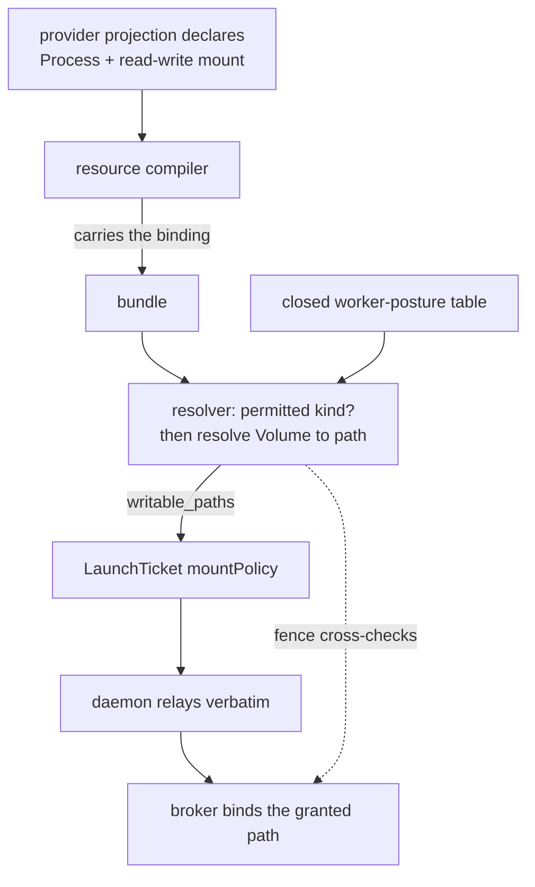
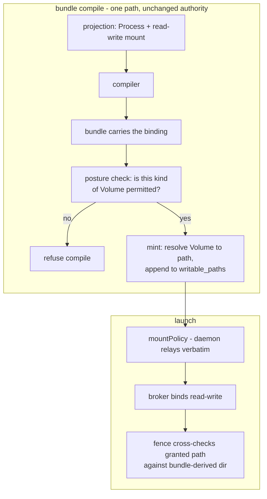
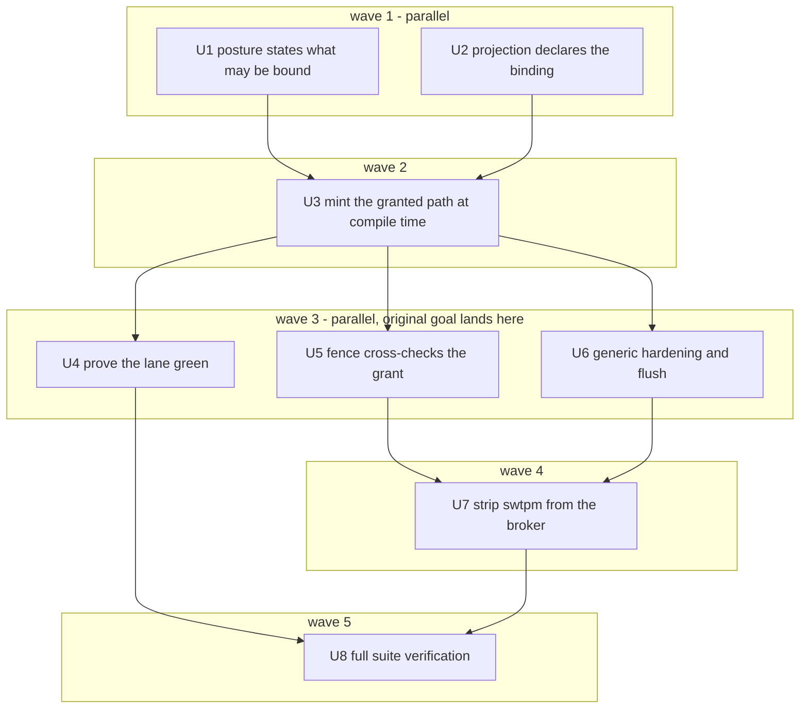

# Provider-Declared Storage Grants - Plan

## Goal Capsule

- **Objective:** A provider can satisfy a worker's host-state needs using d2b resources alone, with no provider-specific knowledge in the shared runtime, broker, or contract crates.
- **Means:** Honor the read-write mount binding a provider declares on its worker, authorize that binding by ownership rather than by name, and mint the resulting host path into the launch policy at bundle-compile time. (KTD1, KTD2)
- **Basis:** This work lands on the current checkout of the Bazel-owned host-integration lane branch (`bazel-owned-host-integration-lane`), behind pull request #610. The lane is Bazel-owned there: the `vmChecks` flake output is gone, and Nix survives only as the guest-image producer the lane consumes. Every acceptance signal is a Bazel lane check.
- **Product authority:** [ADR 0046](../../adr/0046-d2b-3-provider-control-plane.md) and the provider/broker seam in [the 2026-09-14 seam plan](./2026-09-14-001-refactor-provider-services-broker-seam-plan.md) govern the boundary this preserves: providers own their own needs, the broker stays generic.
- **Product Contract preservation:** restructured, scope unchanged, with three corrections from review. R4 and R6 changed and KD2 replaced, because a review showed a static reference set cannot name a per-Device Volume and that the provider's existing mount builder has no production caller. F1 rewritten to describe a compile-time grant. R-IDs, AEs, and the swtpm strip scope are otherwise unchanged.
- **Open blockers:** None. The launch policy's bundle-derived authority is settled by existing code, not by this plan; U3 carries the invariant that must not be broken.
- **Surrounding areas that are not active scope:** the per-VM socket runtime directory, consolidating the video sidecar's per-run grant and the GPU/virtiofsd no-namespace pattern, and the intermittent device teardown timeout.

---

## Product Contract

### Summary

A provider declares that one of its Processes needs read-write access to a Volume, and the grant is materialized when the bundle compiles. The swtpm worker is the first to work because of it.

### Problem Frame

A device worker may need to create and write files in a directory the host owns — a TPM emulator's NVRAM, for instance. Today that worker is launched into a mount namespace whose only writable grant is empty, so the write fails at startup and the process exits, with the failure surfacing far from its cause.

The mechanism is not missing. Guest VMM intents are already minted with non-empty writable paths; the device-worker branch hardcodes an empty grant instead. The broker already binds `writable_paths` read-write at spawn, so no broker change is needed to bind a new grant.

What is missing is any way for a provider to say what its worker needs. The read-write mount binding already exists in the provider's contract and is already composed by the provider's own code — but the composition has no production caller, so the row that reaches the compiler carries a sandbox declaration and no mounts. And nothing on the launch path reads a mount binding even when one is present.

Two earlier framings of this plan were wrong, and review caught both. A first attempt had the resolver resolve a bound Volume to a host path at compile time; that fails because the binding cannot carry the identity needed to do it. A second attempt split authorization and materialization across the resolver and the daemon; that fails because a resource's uid is a deterministic digest computable at compile time, so there was never a runtime-only fact to defer — and because controller-composed children bypass the compiler entirely, so the two halves would have sat on code paths that never meet. The grant belongs at compile time on a single path, exactly where the guest VMM's already works.

### Key Decisions

- **KD1. The grant is derived from the storage a process is bound to.** Governs R1, R2, R3. (session-settled: user-directed — chosen over declaring writable paths independently on the process template, and over a general host-path-grant resource: a second declaration surface would duplicate the Volume and drift from it.)
- **KD2. The provider declares the binding in the resource projection the compiler reads, and the grant is minted at bundle-compile time.** Governs R1, R6. A resource's uid is a deterministic digest of zone, type, and name, so a per-Device Volume is nameable at compile time and the binding needs no runtime resolution.
- **KD3. Land the bridge with swtpm as its first consumer; do not consolidate the mechanisms beside it.** Governs R7, R8. (session-settled: user-directed — chosen over retiring the per-family paths in the same change, and over a swtpm-only hardcode: one mechanism, a green check, no consolidation blast radius.)
- **KD4. swtpm keeps its mount namespace and gains a grant instead.** The GPU render and virtiofsd workers avoid needing a writable host path, but not by running without a mount namespace — the GPU worker's declared sandbox includes the mount class, and the broker forces a new mount namespace whenever the store is read-only. They cope by having the broker pre-opens what they need, so they never open a host directory by pathname. swtpm has a genuine dependency on a host directory.
- **KD5. Strip rather than relocate.** Chosen against a recommendation to keep the hardening, and recorded as a deliberate decision. Governs R11. (session-settled: user-directed — chosen over removing only the identity workaround, and over relocating hardening and flush into the provider crate: the intent is a broker with no swtpm code in it at all.)

### Requirements

**Deriving the grant**

- R1. A process whose declaration binds a Volume with read-write access is granted that Volume's host path as a writable path when its launch intent is minted.
- R2. A process gains no host-path write access it did not itself declare; the grant is derived only from the process's own bindings.
- R3. A read-only binding grants nothing.

**Bounding the grant**

- R4. A binding is authorized against the closed worker-posture table, which states what kind of Volume each template may bind read-write. A binding outside what the table permits is refused at bundle-compile time. Authorization is by ownership, not by name: a worker may bind a Volume owned by the same Device the worker belongs to.
- R5. The broker binds the granted paths it receives on the launch policy; it derives nothing from provider-specific knowledge of what those paths are, and the broker's authority over the launch artifact is unchanged.

**Consequences for providers**

- R6. A provider expresses the need by declaring a read-write mount in the resource projection the compiler binds. No new declaration field is introduced, and a declaration composed only by code nothing calls does not count as one.
- R7. No provider-specific case is added to a shared crate to satisfy a provider's host-path need.
- R8. The mechanisms that grant workers host-path access today are left in place; this work adds one rather than replacing them.

**Verification**

- R9. A provider whose worker writes to storage it declared read-write starts and stays running.

**Retiring the swtpm workarounds**

- R10. The swtpm-specific path the broker takes today — a bespoke trusted-identity type substituted for a path the launch plan never carried — is removed, and the fence that used it additionally cross-checks the granted path against the directory it resolves from the bundle.
- R11. After a generic equivalent exists, no swtpm-specific code remains in the broker, including the state-directory hardening and the pre-start flush, which are replaced by resource-driven equivalents rather than simply deleted.

### Key Flows

- F1. A declared binding becomes a launch grant
  - **Trigger:** A provider's projection declares a worker Process bound read-write to a state Volume.
  - **Steps:** The resource compiler carries the binding into the bundle; the resolver checks it against its template's permitted kind and refuses it if outside; the resolver resolves the bound Volume to a host path and adds it to the minted policy's writable paths; the daemon relays the policy verbatim; the broker binds the granted path.
  - **Outcome:** The worker can create and write its declared state, and every authority over the launch artifact stays where it is today.
  - **Covered by:** R1, R2, R3, R4, R5

- F2. A binding the template's posture does not permit
  - **Trigger:** A Process binds a Volume the template may not bind read-write.
  - **Steps:** The resolver's existing declaration cross-check evaluates the binding on the same terms as the sandbox declaration and refuses the compile.
  - **Outcome:** No grant is minted; the refusal names the unpermitted binding.
  - **Covered by:** R4

### Acceptance Examples

- AE1. A TPM worker writes its state
  - **Covers:** R1, R6, R9
  - **Given** the TPM provider's projection declares its swtpm Process bound read-write to the state Volume, **when** the worker starts, **then** it creates and writes its state files, stays running, and the host-integration lane's device-worker-launch check passes.

- AE2. A read-only binding grants nothing
  - **Covers:** R3
  - **Given** a process binds a Volume read-only, **when** its launch intent is minted, **then** that Volume's host path is not among the granted writable paths.

- AE3. Undeclared storage is not reachable for writing
  - **Covers:** R2
  - **Given** a process declares no binding for a Volume the host owns, **when** it runs, **then** it holds no write access to that Volume's path.

- AE4. An unauthorized binding is refused at compile time
  - **Covers:** R4
  - **Given** a Process binds a Volume its template may not bind read-write, **when** the bundle compiles, **then** the compile is refused and no grant is produced.

- AE5. A generic state-directory control replaces the swtpm-specific one
  - **Covers:** R10, R11
  - **Given** a device worker is launched with a granted state path, **when** the broker applies first-run hardening and the pre-start flush, **then** both act on the granted path and the refusal, audit record, and operator guidance are resource-driven rather than naming swtpm.

- AE6. The broker holds no swtpm-specific code
  - **Covers:** R11
  - **Given** the build-failing policy check that forbids family-named code in shared crates, **when** the strip lands, **then** the broker passes with no swtpm-named module, type, or branch.

### Scope Boundaries

- Deferred for later:
  - The per-VM socket runtime directory, which is provisioned by a path row rather than a Volume and therefore cannot be expressed as a Volume binding.
  - Moving the video sidecar's per-run host-path grant onto declared bindings.
  - Switching any worker to a host-access pattern that avoids the grant entirely.
  - The intermittent device teardown timeout observed in the same lane check.
- Outside this work's identity:
  - Merging the host-integration lane pull request and closing its tracking issue.

### Outstanding Questions

- Deferred to Planning: which host path a bound Volume resolves to when it carries multiple views, and whether the grant follows the bound view or the Volume root. The resolver already hosts a view-root helper, so view-aware resolution is the expected route. A unit must not settle this by omission.
- Deferred to Planning: the purpose text recorded against each granted path, and whether it is derived or authored.

### Sources / Research

- [ADR 0046](../../adr/0046-d2b-3-provider-control-plane.md) — the v3 resource and provider model; every ordinary process declares its state and filesystem refs.
- [Provider Services Broker Seam plan](./2026-09-14-001-refactor-provider-services-broker-seam-plan.md) — the provider/broker boundary this preserves.
- [TPM provider resource builders](../../packages/d2b-provider-device-tpm/src/resources.rs) — the state Volume, its uid-derived name, and the read-write binding composed by a builder with no production caller.
- [Provider projection](../../packages/d2b-provider-device-tpm/nix/default.nix) — the row the compiler actually reads; carries a sandbox declaration and no mounts.
- [Resource manager backend](../../packages/d2b-resource-api/src/manager_backend.rs) — a resource's uid is a digest of zone, type, and name, which is why a per-Device Volume is nameable at compile time.
- [Process mount contract](../../packages/d2b-contracts-resource/src/v3/process.rs) — the binding's fields and its read-only / read-write access.
- [Sandbox profile](../../packages/d2b-core/src/sandbox_profile.rs) — the launch policy's shape; a writable path grants exactly one absolute path.
- [Bundle resolver](../../packages/d2b-core/src/bundle_resolver.rs) — the intent mint, the closed posture table, the view-root helper, and the guest VMM precedent for a compile-time writable path.
- [Resource compiler](../../packages/d2b-resource-compiler/src/lib.rs) — the declaration cross-check that validates only the sandbox field today.
- [Broker sandbox setup](../../packages/d2b-broker/src/sys.rs) — where granted paths become mounts; already binds read-write, so the broker needs no change to bind the grant.
- [Process provider operations](../../packages/d2b-provider-process/src/operations.rs) — the launch policy is relayed verbatim; the daemon contributes nothing to it.
- Grounding and design research dossiers under `/tmp/compound-engineering-1000/ce-brainstorm/20260927-provider-state-dir-capability/`.
- Issues and pull requests: #612, #610.
- Lane gate: `//bazel/checks/vm:host_integration_lane_run_device-worker-launch`.

---

## Planning Contract

### Key Technical Decisions

- KTD1. Authorize by ownership, not by name. The binding names a per-Device Volume whose name embeds the Device's uid, so a closed static table cannot enumerate permitted references. Stating instead what kind of Volume a template may bind — concretely, one owned by the same Device the worker belongs to — is expressible in that table, stays family-agnostic, and is the property the declaration is actually asserting. Governs R4.
- KTD2. Mint at compile time on the compiler's path. A resource's uid is a deterministic digest of zone, type, and name, so the bound Volume is nameable before the guest exists and the grant needs no runtime resolution and no daemon contribution. This keeps the launch policy wholly bundle-derived, which is an existing contract, and keeps the binding and its authorization on one code path — controller-composed children bypass the compiler, so a declaration made at reconcile would never reach the check. Governs R1, R5.
- KTD3. The launch policy's authority is unchanged. The daemon relays the resolver's policy verbatim and contributes nothing to it. Any change to that is out of this plan and would need its own decision. Governs R5.
- KTD4. Cross-check the granted path against the fence's existing bundle-derived directory, and describe it accurately. Both are resolved from the same trusted storage row, so this is a consistency check that catches a mismatched grant — not an independent verification of the directory. Do not represent it as the latter. Governs R10.
- KTD5. Strip rather than relocate. Chosen against a recommendation to keep the hardening, and recorded as a deliberate decision. Governs R11. (session-settled: user-directed — chosen over removing only the identity workaround, and over relocating hardening and flush into the provider crate: the intent is a broker with no swtpm code in it at all.)
- KTD6. Land the generic state-directory control before the strip. The first-run hardening refuses fail-closed and its refusal warns that destroying the state directory destroys TPM2 NVRAM, so a generic equivalent must exist first, preserving fail-closed refusal, the typed refusal, and the operator warning. Governs R11.

### High-Level Technical Design

The broker needs no change to bind the grant; it already binds `writable_paths` read-write. `resolve_path_owner` already walks those paths to decide ownership, so a granted path joins that for free. The work is entirely in what feeds them, and the guest VMM mint is the shape to copy.

Two consequences for implementation. The posture table gains a statement of what may be bound rather than a list of names, so it stays a closed, data-only table. And because both the granted path and the fence's directory resolve from the same trusted storage row, the fence's new check catches a mismatched or wrongly-resolved grant rather than detecting a substituted directory — worth having, and worth stating plainly so nobody later reads it as more than it is.

### Assumptions

- A Volume's host path is resolvable at bundle-compile time from the storage row's path template joined with the Volume's deterministic name, following the derivation the guest VMM mint already performs.
- The posture table can state a permitted kind of Volume without becoming a device-family branch — it expresses ownership, not identity.
- The per-VM socket runtime directory is out of scope: it is provisioned by a path row rather than a Volume, so it cannot be a Volume binding and needs its own decision if it is ever required.
- The generic replacement for the state-directory hardening can be expressed in terms of a granted path and its Volume layout, without naming a device family.

---

## Implementation Units

Units are arranged in waves. A wave completes before the next begins; within a wave, units may run concurrently unless a unit's Execution note records a known overlap.

The critical path is U1/U2 then U3 then U4. **U4 is where the change that motivated this work is proven.** U5 through U7 are hygiene on a working fix, not part of it, which is why they run beside it. U7 carries the only hard ordering constraint, and it is a safety one.

### U1. State what each template may bind

- **Goal:** Make R4 enforceable by stating, in the closed posture table, what kind of Volume each worker template may bind read-write.
- **Requirements:** R4
- **Dependencies:** none — runs alongside U2
- **Files:** `packages/d2b-core/src/bundle_resolver.rs`, `packages/d2b-resource-compiler/src/lib.rs`
- **Approach:**
  1. Extend the closed posture table with what each template may bind read-write, expressed as a predicate over the bound Volume's owning Device rather than as a list of Volume references. A per-Device Volume's name embeds a uid, so a static reference list cannot enumerate them; ownership can be stated.
  2. Extend the existing declaration cross-check, which today compares only the sandbox field, to also evaluate the declared binding's volume against that predicate.
  3. Refuse the compile when a declared binding is outside it, naming the unpermitted binding.
- **Patterns to follow:** the existing posture table and its sandbox comparison in the same cross-check; the addition follows the same closed-table discipline rather than creating a second source of truth.
- **Test scenarios:**
  - A declared binding on a Volume owned by the worker's own Device passes the check.
  - A declared binding on a Volume owned by a different Device is refused, and the refusal names it.
  - A template with no read-write binding declared still compiles.
  - A template permitting no binding refuses every read-write declaration.
  - The existing sandbox comparison behaves identically for every case it covered before.
- **Verification:** R4 is enforceable rather than aspirational, and no existing sandbox check changed behaviour.

### U2. Declare the binding in the projection

- **Goal:** Put a read-write mount of the state Volume into the row the compiler reads.
- **Requirements:** R1, R6
- **Dependencies:** none — runs alongside U1
- **Files:** `packages/d2b-provider-device-tpm/nix/default.nix`
- **Approach:**
  1. Add the read-write mount of the state Volume to the swtpm process row. That row carries a sandbox declaration and no mounts today, so this makes live a binding the provider's own code already composes.
  2. Name the Volume the way the framework derives it — the Device's deterministic uid joined with the provider's own naming — so the reference matches the Volume the controller materializes. Verify the projection can compute that uid from zone, type, and name.
  3. Leave the provider's existing builder alone. It composes the same binding and has no production caller; the projection is what reaches the compiler.
- **Execution note:** Do not make this unit edit the existing builder. A declaration composed only by code nothing calls is exactly what R6 disqualifies, and the projection is the row the compiler reads.
- **Test scenarios:**
  - The swtpm row projects a read-write mount naming the state Volume.
  - The projected reference equals the reference the provider's own naming derives for that Device.
  - The projected row still carries its existing sandbox declaration unchanged.
  - The provider module evaluates successfully and produces the mounts entry.
- **Verification:** the row reaching the compiler carries the binding, and its reference matches the Volume the controller materializes.

### U3. Mint the granted path at compile time

- **Goal:** Have the intent mint turn a declared read-write binding into a granted writable path.
- **Requirements:** R1, R2, R3, R5
- **Dependencies:** U1, U2
- **Files:** `packages/d2b-core/src/bundle_resolver.rs`
- **Approach:**
  1. In the device-worker shape of the intent mint, read the binding the compiler carried and resolve the bound Volume to a host path, following the derivation the guest VMM mint already performs.
  2. Append the resolved path to the minted policy's writable paths with a purpose naming the declared Volume, leaving every other policy field exactly as it is today.
  3. Resolve the view question explicitly rather than by omission: follow the bound view if the Volume carries one, and record the choice. Do not silently take the Volume root.
  4. Leave the daemon untouched. It relays the policy verbatim, and that relay is the invariant this unit must not break.
- **Execution note:** If this turns out to require any daemon contribution to the launch policy, stop. The policy is bundle-derived by contract, and moving that boundary is not this plan's decision.
- **Test scenarios:**
  - A device worker with one authorized read-write binding mints a policy containing exactly that path.
  - A device worker with no bindings still mints an empty writable-path set, proving nothing else changed.
  - A read-only binding contributes no path.
  - Two bindings produce two paths with no cross-contamination.
  - A Volume carrying a view grants the bound view's path, not the root.
  - The resolved path equals the directory the broker's fence resolves from the bundle, character for character.
- **Verification:** the minted policy differs from today's only by the granted paths, and the daemon's relay is unchanged.

### U4. Prove the lane check green

- **Goal:** Demonstrate in a real VM that the change fixes the failure it was made for.
- **Requirements:** R9
- **Dependencies:** U3 — runs alongside U5 and U6
- **Files:** `packages/d2b-test-vm-harness/src/checks/device_worker_launch.rs`
- **Approach:**
  1. Run the per-check lane target against a guest image built from this change.
  2. Confirm from the TPM worker's own output that its state files are created and the process stays running.
- **Execution note:** Watch the state directory directly rather than only reading the check's verdict. The original failure produced a reaped child with exit code 1 and a state directory holding only the volume lock; both are the discriminating signals.
- **Test scenarios:**
  - The device-worker-launch lane check passes.
  - The TPM process reaches its ready state and stays running rather than being reaped.
  - The state directory holds the worker's own artefacts rather than only the volume lock.
- **Verification:** the lane check that motivated this work goes green, with U5 through U7 not yet landed.

### U5. Cross-check the granted path at the fence

- **Goal:** Make the fence verify that the granted path is the directory it expects, then retire the identity type that stood in for a path the plan never carried.
- **Requirements:** R10
- **Dependencies:** U3 — runs alongside U4 and U6
- **Files:** `packages/d2b-broker/src/ops/swtpm_dir.rs`, `packages/d2b-broker/src/kernel_ops.rs`, `packages/d2b-broker/src/runtime.rs`, `packages/d2b-provider-process/src/operations.rs`
- **Approach:**
  1. Keep the existing resolution of the trusted directory from the pinned owning Device and the trusted storage rows.
  2. Require the launch plan's granted path to equal that directory, and refuse the launch when it does not.
  3. Retire the trusted-identity type and its derivation on both the broker side and the provider-process side, which exist only because the plan carried no path.
  4. Keep the refusal fail-closed and preserve the typed audit record shape.
- **Execution note:** Describe this accurately in the commit and the code. Both sides resolve from the same trusted storage row, so this is a consistency check that catches a mismatched grant, not an independent verification of the directory.
- **Execution note:** This comparison depends on U3's view resolution. If U3 grants a view path while the fence resolves the Volume root, the two disagree and every launch is refused. U3's resolution choice is a precondition for this unit, not an independent decision.
- **Test scenarios:**
  - A launch whose granted path equals the trusted directory proceeds.
  - A launch whose granted path names a different persistent directory is refused.
  - A launch with no granted path is refused fail-closed, matching today's behaviour for a plan that ships none.
  - The refusal still emits its typed audit record with the failure reason intact.
  - The provider-process side no longer parses a trusted-identity payload.
- **Verification:** a correctly granted launch proceeds, every case refused today is still refused, and the identity type is gone from both sides.

### U6. Land generic state-directory hardening and flush

- **Goal:** Replace the swtpm-specific first-run hardening and pre-start flush with resource-driven equivalents.
- **Requirements:** R11
- **Dependencies:** U3 — runs alongside U4 and U5
- **Files:** `packages/d2b-broker/src/ops/swtpm_dir.rs`, `packages/d2b-broker/src/live_handlers.rs`, `packages/d2b-broker/src/runtime.rs`
- **Approach:**
  1. Generalise the hardening entry point so it acts on a granted path and its Volume layout rather than a swtpm-shaped directory.
  2. Generalise the pre-start flush the same way, so any device worker with a granted state path gets it.
  3. Make the refusal, its audit record, and its operator guidance resource-driven, keeping the NVRAM-destruction warning.
  4. Preserve the controls that make the hardening fail-closed: the ownership and mode checks, the marker tamper guard, and the refusal on any mismatch. U7 depends on these surviving.
- **Execution note:** U5 and U6 both edit the swtpm module, so they are parallel by dependency but conflict on files. Whichever lands second should expect a small merge, and U7 resolves whatever remains.
- **Test scenarios:**
  - A granted state path with correct ownership and mode is hardened and the launch proceeds.
  - A granted state path with wrong ownership is refused, and the refusal names the path rather than a device family.
  - A tampered marker is refused, preserving the tamper guard.
  - The pre-start flush runs for any device worker holding a granted state path.
  - The audit record and operator guidance no longer name a device family but still carry the NVRAM warning.
- **Verification:** the existing hardening scenarios pass with no swtpm name in any assertion, the NVRAM warning survives, and the refusal is still fail-closed.

### U7. Strip swtpm from the broker

- **Goal:** Leave no swtpm-specific code in the broker.
- **Requirements:** R11
- **Dependencies:** U5, U6
- **Files:** `packages/d2b-broker/src/ops/swtpm_dir.rs`, `packages/d2b-broker/src/ops/mod.rs`, `packages/d2b-broker/src/ops/audit_op.rs`, `packages/d2b-broker/src/ops/state_dir.rs`, `packages/d2b-broker/src/live_handlers.rs`, `packages/d2b-broker/src/runtime.rs`, `packages/d2b-broker/src/kernel_ops.rs`, `packages/d2b-broker/src/catalog.rs`, `packages/xtask/src/provider_crate_policy.rs`
- **Approach:**
  1. Delete the swtpm-named module and fold anything still live from it into the generalised controls landed in U5 and U6.
  2. Remove the swtpm-named types and branches in the listed files: the module declaration, the preparation result and audit-field types, the state-directory hardening error arm, the identity parse, and the operation catalog match.
  3. Drop the swtpm entries from the family-knowledge exemption ratchet. Some are marked permanent — establish first whether a permanent entry may be removed. If one may not, keep the code it permits and say so plainly rather than deleting and failing the build.
  4. Regenerate any committed catalog or policy artifact that the deletions change, including the provider's operations declaration, and commit the regenerated output rather than hand-editing it.
- **Execution note:** The only unit with a hard ordering constraint, and the reason is safety. Landing it before U5 and U6 removes fail-closed NVRAM protection with nothing in its place.
- **Test scenarios:**
  - A repository-wide search for swtpm in the broker returns no hits outside fixtures asserting its absence.
  - The family-knowledge policy check passes with the removable exemptions dropped.
  - Any exemption found to be permanent is reported rather than silently retained.
  - Regenerated catalogs and policy artifacts are consistent with their generators.
- **Verification:** the broker compiles and passes its suite with no swtpm references beyond any permanent exemption that had to be retained, and the policy check passes with no removable swtpm exemption left.

### U8. Verify the whole change

- **Goal:** Prove the complete change, not just the fix, across the repository gates.
- **Requirements:** R9, R11
- **Dependencies:** U4, U7
- **Files:** `bazel/checks/vm/BUILD.bazel`
- **Approach:**
  1. Re-run the per-check lane target after the strip, since U5 through U7 changed broker behaviour on the same launch path U4 proved.
  2. Run the full lane, then the repository gates.
- **Execution note:** U4's green result is not sufficient on its own — U5 through U7 touch the same launch path, so the lane must be re-proven once they land.
- **Test scenarios:**
  - The device-worker-launch lane check still passes after the strip.
  - The full eleven-check lane passes.
  - The blocking-census check passes with no crate above its committed baseline.
  - The policy-tooling suite passes with the removable exemptions dropped.
- **Verification:** the lane is green, the census and policy suites are green, and the broker's swtpm reference count is zero.

---

## Verification Contract

| Gate | Command | Done signal |
|---|---|---|
| Device worker launch | `make test-host-integration` with `D2B_VM_CHECK` set to `device-worker-launch` | The per-check target passes; the TPM process reaches ready and writes its state |
| Full lane | `make test-host-integration` | All eleven checks pass |
| Broker unit tests | the broker crate's test target | Suite passes with no swtpm-named test |
| Policy check | the policy-tooling target | Passes with removable swtpm exemptions dropped |
| Census | `make check-census` | No crate above its committed baseline |
| Repository suite | `make check` | The full suite passes |

The lane check is the real proof: the original failure was reproduced and diagnosed outside a VM, but only the lane proves the worker starts and stays up with a real mount namespace and a real broker.

---

## Definition of Done

- U1 through U8 are landed, each as its own commit, in wave order. Units within a wave may run concurrently.
- The device-worker-launch lane check is green at the end of wave 3, with the swtpm strip not yet landed.
- R4 is enforceable: a binding outside what its template permits is refused at bundle-compile time, covered by a test.
- The daemon's relay of the launch policy is unchanged, and no unit added a daemon contribution to it.
- The fence refuses a launch whose granted path is not the directory it resolves from the bundle, covered by a test, and its code and commit describe it as a consistency check rather than an independent verification.
- The swtpm reference count in the broker reaches zero, the family-knowledge policy check passes with no removable exemption left, and any permanent exemption that had to be kept is reported rather than silently retained.
- The NVRAM-destruction operator guidance, the fail-closed refusal, and the marker tamper guard all survive the hardening's generalisation.
- The groundwork diagnostics added while diagnosing this are either kept as permanent lane output or removed, so the branch carries no investigation scaffolding.
- The tracking issue is updated to describe this root cause rather than the chown one.
