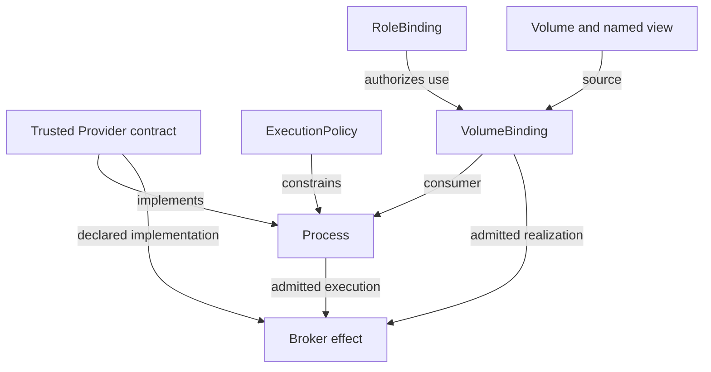
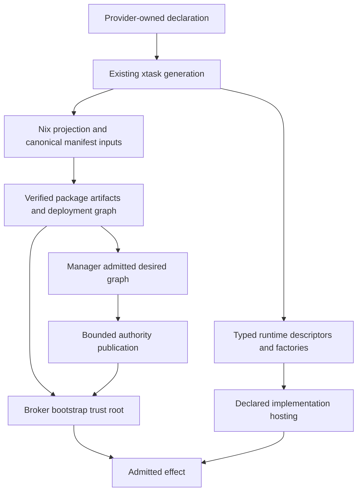
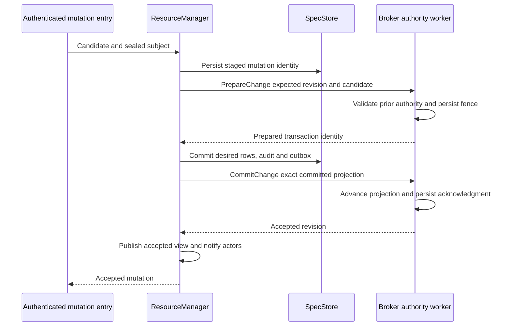
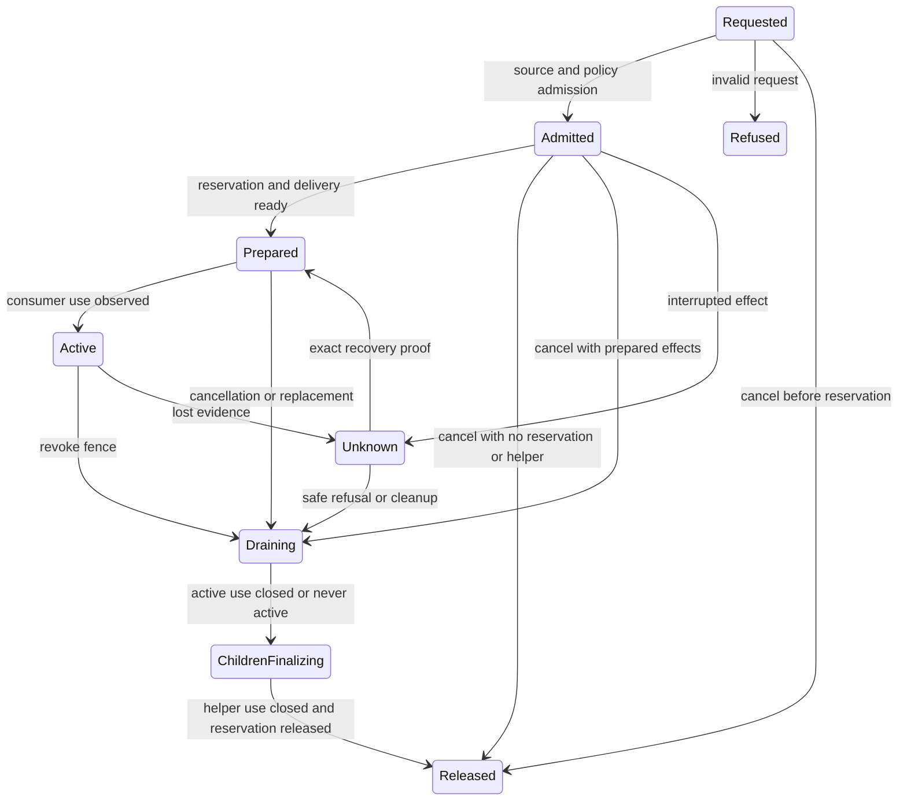

# Unified Resource Graph and Provider Authority - Plan

## Goal Capsule

- **Objective:** Configuration and provider authors can declare workload needs and their implementations without maintaining additional policy definitions in the daemon or broker.
- **Means:** Make one typed resource graph and its trusted provider contracts the sole policy and authority model for every provider, with broker effects derived from admitted graph relationships.
- **Product authority:** The confirmed scope in this document, the Zone model in `STRATEGY.md`, and the ownership and isolation requirements of ADRs 0015, 0021, 0034, and 0046.
- **Transition:** A coordinated clean break without preservation or conversion of legacy d2b data.
- **Open blockers:** None at plan completion; execution-time environmental prerequisites and stop conditions are specified in the Verification Contract.
- **Document boundary:** This plan defines implementation, but creating it authorizes neither code execution nor deletion of host data.
- **Product Contract preservation:** Product Contract unchanged in scope and stable R/F/AE identifiers; Q1-Q9 are resolved by the Planning Contract rather than delegated to the implementer.
- **Execution profile:** Implement the dependency-ordered units in isolated worktrees, with one integration owner responsible for shared contracts, generated files, authoritative commits, and the reviewed PR lifecycle in `docs/contributing/workflow.md`.
- **Stop conditions:** Stop the affected unit on an unimplemented admission prerequisite, failed ownership proof, incompatible shared contract, or missing enforcing acceptance environment; do not add a fallback or narrow the agreed scope.
- **Per-unit acceptance:** Every unit's exact committed head must pass `make check`, and every integrated unit must leave the integration head passing `make check`.
- **Parallel execution:** Start all dependency-ready units whose semantic interfaces are stable; shared files alone do not make units dependent.

---

## Product Contract

### Summary

d2b will express workload needs, access relationships, authorization, and execution restrictions through one typed resource graph.
Trusted provider contracts will define the implementation of that graph and generate its registration and dispatch views.
Every provider will use this model, and every superseded broker, policy, and authority path will be removed before the work is complete.

### Problem Frame

The resource vocabulary and the execution vocabulary are not the same authority today.
The code has resource contracts for `Operation`, `Command`, `Role`, `RoleBinding`, and `SeccompProfile`, but the broker resolves a separately generated operation catalog.
Production foundation declarations supply no Commands or SeccompProfiles from which to materialize the proposed execution authority.

Provider implementation is also described more than once.
Signed manifests declare components, exported methods, placement, and effect classes.
Rust descriptors, service declarations, operation declarations, registration JSON, and daemon factory matches separately determine what actually runs.
Declaring a field in a service contract does not establish implementation support: the current host refuses several method facets because it cannot enforce them.

Storage access shows the resulting mismatch.
Guest attachment declarations become durable `VolumeBinding` resources, while Process mounts take a separate path into writable host-path grants.
`RolePosture` adds path-only mount permissions.
The broker then reconstructs selected access from launch arguments, environment variables, seccomp-policy names, and family-specific scope types.

PR #627 bounds some of those reconstructed grants against the broker's verified bundle.
It is a necessary defense for the current interface, not the end state: the broker still receives strings that have lost the exact resource relationship they describe.
The current user-namespace launch path also skips one mount-policy application path, demonstrating that a correctly declared grant is not evidence that the selected backend realizes it.

### Actors

| Actor | Responsibility |
| --- | --- |
| Configuration author | Declares resources, their bindings, and authorized policy selections. |
| Provider author | Supplies implementation contracts, typed behavior, and supported realizations without editing shared family-dispatch tables. |
| ResourceManager | Owns committed resource identity, actors, ownership, lifecycle scheduling, and derived graph indexes within a Zone. |
| Source provider | Admits and arbitrates use of a Volume, Device, Network, Endpoint, or Credential. |
| Binding implementation | Realizes an admitted relationship and reports its lifecycle without independently widening access. |
| Broker | Enforces admitted privileged effects and owns the associated host mutation and recovery mechanisms. |
| Operator | Deploys the clean-break release and receives resource-attributable failures instead of unexplained launch mismatches. |

### Key Decisions

- KD1. **One graph rather than another adapter layer.** Governs R1-R8 and R49-R54. (session-settled: user-directed - chosen over retaining parallel mount, broker, and provider authority models: the graph must be the only way to set policy.)
- KD2. **All providers convert in this work.** Governs R9-R15 and R49-R54. (session-settled: user-directed - chosen over a pilot with deferred provider conversions: leaving an old provider path would preserve a second authority model.)
- KD3. **Typed bindings share machinery, not an untyped permission bag.** Governs R16-R24. (session-settled: user-approved - chosen over a universal untyped Binding: storage rights, device claims, network use, endpoint attachment, and credential delivery have different semantics.)
- KD4. **Separate grants, confinement, and implementation.** Governs R25-R33. (session-settled: user-approved - chosen over wiring the existing overloaded policy types unchanged: Role mounts and broad SeccompProfile facets duplicate execution and access authority.)
- KD5. **Retire standalone Command.** Governs R29-R31. (session-settled: user-approved - chosen over making every handler a Command: executable templates belong to provider contracts, while methods need no executable or argv.)
- KD6. **Clean break without legacy-data preservation.** Governs R43-R48. (session-settled: user-directed - chosen over preserving or converting legacy data and over temporary compatibility: the new release starts from newly generated declarations and fresh d2b state.)
- KD7. **Delete superseded code, not just callers.** Governs R49-R54. (session-settled: user-directed - chosen over deprecation, shims, and dormant fallback paths: the old broker, policy, and authority surfaces must cease to exist.)

### Resource Inventory

This inventory defines the target resource vocabulary.
It does not claim that the new types or their enforcement already exist.
Changes to existing schemas are intentional contract changes under R43.

| Resource or family | Disposition | Target responsibility | Governing requirements |
| --- | --- | --- | --- |
| Zone, ZoneLink | Reuse | Isolation and explicit connectivity | R2, R7, R37 |
| Host, Guest | Reuse with narrowed execution-parent fields | Execution targets, domains, default identity, budget, and target-support constraints; not an independent attachment-grant surface | R16, R18, R25-R27, R37 |
| Provider | Reuse and converge contracts | Select trusted artifact and configuration; bind resource and method implementations | R9-R15 |
| Process, EphemeralProcess | Reuse shared execution machinery | Long-running and run-to-completion instances with lifecycle and resource requests | R18, R25-R27 |
| Volume | Reuse | Source custody, layout, persistence, named views, and sharing rules | R17-R20 |
| Device, Network, Endpoint, Credential | Reuse | Typed sources of consumable capabilities | R21-R24 |
| VolumeBinding | Generalize | Volume/view use by an admitted Process, EphemeralProcess, Host, or Guest consumer | R17-R20 |
| DeviceBinding | Add | An admitted shared or exclusive use of a device capability | R21 |
| NetworkBinding | Add | Admitted network membership and traffic policy for a consumer | R22 |
| EndpointBinding | Add | Admitted connection or attachment to an exact endpoint | R23 |
| CredentialBinding | Add | An authorized consumer, audience, and operation relationship | R24 |
| ExecutionPolicy | Add | Reusable execution restrictions without resource-access grants | R25-R27 |
| SeccompProfile | Narrow | Syscall-filter policy, not namespaces, cgroups, or device attachment | R28 |
| Role, RoleBinding | Narrow and reuse | Authorization of operations, policy selection, and resource use | R16, R26, R29 |
| Operation | Converge | One callable contract with authority and implementation binding | R30-R33 |
| Command | Retire | Replace executable declarations with provider-owned templates | R31, R50 |
| User | Reuse | Admitted identity without caller-selected numerical host credentials | R26, R37 |
| ResourceExport, ResourceImport | Reuse | Explicit cross-Zone semantic-service exposure and consumption within the existing exportability boundary | R7 |
| Quota, EmergencyPolicy | Reuse and integrate | Their existing limits and emergency semantics enforced through the same authority model | R8, R36 |
| Semantic services, bindings, sessions, and policies | Retain as product-facing composition | Express semantic intent through primitive resources and bindings, without independent host-access admission or revocation | R10, R15 |

Named Volume views remain part of Volume.
Provider component declarations, executable templates, and method declarations remain trusted contract data.
Resolved paths, numeric principals, FD tables, mount actions, and launch plans remain private derived execution artifacts.
None becomes a second independently authored resource or policy hierarchy.

### Common Graph Model

The same logical graph supports desired state, authorization, scheduling, and attribution, but these uses have different edge semantics.
The requirements do not mandate a new graph database or a particular Rust container.

| Relationship | Meaning | Must not imply |
| --- | --- | --- |
| Owns | One resource controls the lifecycle of a child | Permission to use every capability of that child |
| Consumes through binding | A consumer requests and receives bounded access to a source | Ownership or deletion authority over the source |
| Implemented by | A trusted provider component realizes a resource or operation | Permission for that component to grant itself authority |
| Placed on | An implementation executes on a Host or Guest target | Authority to substitute another target |
| Authorized by | Applicable policy permits a subject's action | That the requested object is already realized or Ready |
| Depends on | A specific observation is required for progress | A grant, an ownership edge, or a requirement for every neighbor to be Ready |

The diagram illustrates one storage relationship.
Other binding kinds retain their typed meaning under R21-R24.
It is not a requirement that every relationship be a separately stored node.

### Requirements

**Graph identity and ownership**

- R1. The typed resource graph and trusted provider contracts are the sole authoring authority for configurable d2b policy and privileged resource access.
- R2. ResourceManager remains the per-Zone owner of committed resource identity, actor lifecycle, and graph indexes; no separately authored broker graph or dependency database is introduced.
- R3. Graph relationships are extracted from canonical typed declarations, with ownership, consumption, implementation, placement, authorization, and dependency/observation distinguished.
- R4. A relationship with independent admission, allocation, revocation, or cleanup has a binding lifecycle; a simple observation reference does not require an artificial binding resource.
- R5. A binding has one declared lifecycle owner and a separate consumer, with source-owned binding lifecycle as the default for the five primitive binding families.
- R6. Controllers request deletion and release only their own finalizers; the platform physically removes eligible resources.
- R7. Cross-Zone use retains the existing semantic-service exportability boundary, with every imported use bounded by the export's consumer-Zone policy, capability ceiling, and lease.
- R8. Graph mutation and effect admission enforce the applicable authorizations, quotas, and emergency policy before authority is granted; an in-process call or syntactically valid reference is not proof of permission.

**Provider contracts and complete coverage**

- R9. One authoritative provider declaration binds supported resource types, methods, code identity, configuration, placement, child creation, and required resource capabilities.
- R10. Every provider and provider-hosting path in the supported product uses that declaration, including built-in, semantic, host, Guest, unsafe-local, transport, cloud, and test implementations.
- R11. Runtime descriptors, registration views, operation admission views, and handler bindings are derived from the authoritative declaration rather than separately maintained family lists.
- R12. Provider code selection is pinned to trusted artifacts and admitted implementation identities; a mutable Provider resource cannot introduce arbitrary code into the broker.
- R13. Provider component state requirements materialize ordinary Volume resources and admitted bindings when storage is needed, preserving the declared custody, sensitivity, quota, and lifecycle rules.
- R14. Adding a provider that uses existing resource and execution primitives requires no handwritten family-specific edits in shared daemon or broker dispatch, hosting, or posture code.
- R15. Semantic controllers retain product behavior as composition of primitive resources, bindings, and declared methods, without independently admitting, allocating, or revoking host access.

**Typed binding contracts**

- R16. Binding admission requires the requested rights, source policy, applicable grants, provider contract, and target support to agree; neither a binding declaration nor a provider's requirements grant authority by themselves.
- R17. VolumeBinding identifies one source Volume, named view, consumer, access mode, and typed consumer-side presentation, without authoring a raw host source path.
- R18. Process and EphemeralProcess storage requests and Host/Guest attachment inputs normalize to the same binding authority, with exactly one authoritative declaration for each relationship.
- R19. Volume source admission enforces view rights and writer arbitration across all binding realizations, rather than independently for Process mounts and Guest exports.
- R20. Storage realization preserves the distinction between the exact source view and consumer destination and refuses a required presentation the selected backend cannot enforce.
- R21. DeviceBinding retains typed device function, access mode, arbitration, and release semantics without deriving device permission from a seccomp name or launch role.
- R22. NetworkBinding admits a consumer's network membership and traffic policy while leaving fabric topology and shared interface realization with the Network provider.
- R23. EndpointBinding grants access to the exact endpoint and its declared protocol or attachment, not unrestricted access to its containing host directory.
- R24. CredentialBinding preserves consumer identity, audience, allowed operation, expiry, delivery-session fencing, and revocation without placing credential material in graph specs or generic binding status.

**Execution and callable authority**

- R25. ExecutionPolicy defines reusable confinement requirements and ceilings for an execution instance without naming independently granted host paths, mounts, or resource accesses.
- R26. Process and EphemeralProcess may select only an authorized ExecutionPolicy, and their identities, instance requirements, provider constraints, and target restrictions must be compatible before execution.
- R27. Required execution and access restrictions must be effective on every supported backend; unsupported requirements fail closed instead of being ignored or replaced with broader access.
- R28. SeccompProfile contains syscall-filter policy only; namespace, cgroup, device-access, and mount authority are owned by their corresponding execution or resource contracts.
- R29. Role and RoleBinding express authorization without an independent RolePosture or RoleMount execution policy.
- R30. Operation is the single externally callable contract for payload, result, target semantics, authorization, audit, descriptor carriage, and limits.
- R31. Provider methods or trusted executable templates implement Operations; standalone Command resources and Command-based parallel launch authority are removed.
- R32. A service groups declared methods and their implementation lifetime without requiring a new service resource per function or per invocation.
- R33. The broker's operational lookup structures are derived views of admitted Operation and provider authority, with no independently authored operation catalog or fallback handler route.

**Effects, freshness, and lifecycle**

- R34. Every privileged effect is attributable to an admitted resource or operation, exact bindings, applicable policy, and trusted implementation identity.
- R35. Effect authority is fenced against all relevant identity and policy changes, including owner, source view, consumer, provider assignment, and execution-policy changes that may not advance today's spec generation.
- R36. Revocation, policy reduction, deletion, and emergency action prevent new uses and drive existing uses to the declared safe state before protected resources are retired.
- R37. The existing privilege boundary, per-Zone isolation, private-path boundary, verified artifacts, and host ownership limits remain enforced through the new model.
- R38. Broker-owned pidfds, child reaping, descriptor custody, anchored filesystem mutation, locks, audit, and effect recovery retain a single responsible owner.
- R39. Binding readiness distinguishes source preparation, access admission, and consumer-side completion wherever combining them would create a startup or teardown cycle.
- R40. A binding can prepare against a committed consumer identity before that consumer runs, and a consumer starts only when its required pre-start conditions hold.
- R41. Restart and interrupted effects recover or refuse using matching identity and ownership evidence; cached Ready status alone cannot remint access.
- R42. Failures identify the resource, relationship or operation, enforcing stage, and refusal reason without exposing secrets or private transport material.

**Clean-break deployment**

- R43. The release rejects legacy resource, provider, policy, and broker contracts without compatibility parsers, dual-runtime modes, or legacy fallback behavior.
- R44. No migration, preservation, import, or adoption of legacy d2b data is required; the new release starts from fresh d2b-managed state and newly generated declarations.
- R45. The clean-break deployment has a conspicuous destructive-state warning and an ownership-bounded reset procedure; foreign host state and externally owned sources are never authorized for deletion by R44.
- R46. Old running workloads and their leases are drained before a new release takes ownership of their former managed surfaces.
- R47. After initialization under the new model, resources obey their declared persistence, restart, adoption, and cleanup semantics.
- R48. Nix declarations, schemas, generated artifacts, provider packages, host/Guest composition, and operator documentation change together without mixed-version success-shaped behavior.

**Retirement and completion**

- R49. Completion requires every provider converted and every superseded policy or authority path removed, not merely unused.
- R50. The removal scope includes legacy broker APIs, independent policy catalogs, RolePosture/RoleMount, standalone Command, family posture switches, and authorization inferred from argv, environment, or naming conventions.
- R51. Duplicate registration and effect adapters are removed when their only responsibility is to restate or relay the replaced contracts.
- R52. Existing low-level mechanisms may be reused only under the new authority path; retaining a mechanism cannot retain an alternate policy source or bypass.
- R53. All callers, fixtures, tests, schemas, generated inventories, build edges, configuration options, and current documentation are migrated or removed with the retired surface.
- R54. No provider, operation family, execution backend, or authority bypass may be deferred from the final acceptance boundary.

### Binding Lifecycle and Ownership Rules

This section explains the behavior required by R5, R16-R24, and R35-R41.
It defines conceptual conditions, not required enum spellings or implementation classes.

| Condition | Meaning | Permitted next behavior |
| --- | --- | --- |
| Requested | Source and consumer identities are declared, but access has not been authorized | Resolve references and evaluate source policy and grants; no use yet |
| Admitted | The exact requested relationship is authorized against current evidence | Reserve source rights and prepare the supported delivery mechanism |
| Prepared | The source-side access and delivery prerequisites exist | Start an eligible consumer or offer an attachment |
| Active | The consumer is using the prepared relationship | Observe currency, health, expiry, and revocation |
| Revoking or draining | New use is blocked and existing use must stop or release | Detach, stop the affected consumer, or use the binding kind's declared safe revocation |
| Released | No outstanding use or lease remains | Finalize the relationship; do not delete a shared source merely because one consumer left |
| Refused, degraded, or unknown | Admission failed or an effect cannot be proven complete | Report the reason and retry only when permitted; never translate uncertainty into granted access |

For VolumeBinding, the source Volume remains the lifecycle owner, preserving the current ownership model while expanding consumer kinds.
Device, Network, Endpoint, and Credential source providers use the corresponding source-owned relationship model.
The consumer requests release without gaining deletion authority over the source.
ResourceImport retains its existing role: it names an opaque export through a ZoneLink and materializes an admitted qualified semantic Service projection.
It is not a locally owned Volume, Device, Network, Endpoint, Credential, or primitive binding.
Imported use cannot exceed the exporting Zone's consumer policy, capability ceiling, or lease, and cannot mint direct authority to the remote backing resources.
Backing primitive bindings stay in the source Zone under that Zone's authority.
Imported semantic bindings consume the admitted Service projection and its lease rather than replacing it with local backing-resource grants.
The common graph does not relax a semantic family's projection-mode prohibition on backing references, backing-authority ownership, or local physical effects; USB's existing prohibition remains one such boundary.
Local transport/session machinery can realize the admitted import protocol only within those family constraints and cannot treat local admission as a way around an export restriction.
No raw-resource export or new re-export permission is introduced by this work.

Ownership is not an access grant.
A source provider must still evaluate the requested relationship and applicable grants under R16.
The provider implementing delivery does not become a second source-policy authority.

Under R39-R40, a Guest's pre-boot storage export may be Prepared before the Guest starts, while mount completion can only be observed after boot.
A Process binding does not wait for its consumer to be Running before preparing the access that the consumer requires to start.
Provider-created helper Processes and Endpoints are owned implementation children of the admitted relationship.
Access to the parent's exact source is an explicitly admitted, attenuated realization leg of that relationship, not a second peer writer or exclusive-device reservation.
Ownership alone does not authorize that leg, and any additional source requires its own admitted binding.
Helper preparation cannot wait for the consumer to run, while final release of the parent reservation waits for the consumer and its helpers to release their source use.

Revocation is typed.
A filesystem mount, an inherited device FD, an active network flow, and a delivered credential do not have identical revocation primitives.
The binding contract must identify the safe outcome and its completion evidence; deleting a graph edge alone is not that evidence.

### ExecutionPolicy Contract

The new ExecutionPolicy resource owns confinement under R25-R29.
It does not combine all permissions into a generic policy object.

The existing Rust `ExecutionPolicy` fragment flattened into Host and Guest specs is not this new resource.
That fragment currently carries default domain, allowed domains, default user, budget, and network/device/Volume attachment defaults.
Host and Guest retain their execution-parent domain, identity, and budget semantics, but their attachment inputs cease to be independent access grants under R18 and R21-R22.
Conversion distinguishes three meanings currently mixed into those inputs: target-support ceilings for child workloads, actual Guest/Host consumption, and defaults used to construct child requests.
Target-support restrictions remain graph-backed admission constraints under R16; converting them must not make an unsupported device or network available to a child.
Actual parent-as-consumer use produces a binding for that parent, while child defaults can only generate child binding requests and never become parent mounts or grants.
The implementation plan must trace existing consumers before classifying each field, because the current names do not reliably distinguish those meanings.
The old fragment is renamed or replaced as a non-authoritative execution-parent value; its name cannot conceal a second ExecutionPolicy authority.
Host `IsolationPosture` remains an explicit description of a no-isolation target where applicable, not permission to bypass binding admission.

| Concern | Authoritative declaration | Derived execution result |
| --- | --- | --- |
| Namespace isolation | ExecutionPolicy constraints and compatible instance/provider requirements | Backend-specific namespace setup |
| Linux capabilities | Authorized execution ceiling and implementation needs | Effective capability set, without widening resource bindings |
| Identity and mapping | Admitted User/target identity and policy constraints | Private numeric principal and namespace mappings |
| Root filesystem and privilege escalation | ExecutionPolicy | Effective backend restrictions |
| Syscall filtering | Referenced SeccompProfile | Loaded or compiled syscall filter |
| Storage access | VolumeBinding | Exact view access and consumer presentation |
| Device access | DeviceBinding | Verified device claim, FD, or mediated attachment |
| Network access | NetworkBinding | Admitted membership and traffic controls |
| Endpoint access | EndpointBinding | Exact connection or attachment capability |
| Credentials | CredentialBinding and typed delivery protocol | Scoped use or delivery under its audience and lifetime |
| Resource budgets | Existing budget and Quota contracts | Cgroup or backend resource limits |

A reference to a policy is a request to use it, not authorization to select it.
Admission rejects a provider requirement that cannot fit the allowed policy.
It does not silently drop the requirement, relax a host constraint, or choose an alternative provider.
The implementation plan must define deterministic field-wise compatibility rules rather than treating every policy field as an interchangeable set.

The current broker-pre-established user-namespace path skips `apply_mount_actions_debug`.
R20 and R27 therefore require actual effective-access evidence for that backend.
Neither a populated MountPolicy nor the presence of a user namespace proves that a named Volume view is confined to the promised destination.

### Provider and Broker Contract

Under R9-R15 and R30-R38, the provider contract is the source of implementation identity and the graph is the source of admitted use.
The framework may generate several representations for compilation, transport, or efficient lookup, but none is independently authored authority.

The contract covers resource decoders and lifecycle implementations, component code and configuration, service methods, operation contracts, supported binding realizations, placement, child creation, and required capabilities.
A declaration that cannot be implemented by the selected host is refused during admission or deployment, not accepted because a metadata field exists.

The broker keeps privileged mechanism ownership.
The new model must not interpret a mutable Provider row as permission to load arbitrary code into the root process.
Trusted implementation binding and deployment admission apply whether an operation uses a built-in kernel, a daemon-side method, or a separately isolated implementation.
A Rust trait boundary is not claimed to sandbox co-resident privileged code.

Unsafe-local execution is included in this conversion.
Its existing default-denied, authenticated-requester identity boundary and explicit no-isolation meaning are preserved through the new policy and operation contracts.
`Provider/unsafe-local`, its helper, workload artifacts, and user-only Host behavior receive no legacy-policy exception.

Every privileged operation reaches the same authority decision required by R34.
An unprivileged method does not gain extra authority because it runs in the daemon, and a nested call cannot replace the initiating subject with a more privileged transport identity.
Streaming remains a data-plane concern under an admitted endpoint/session contract rather than an excuse for an unaudited authority path.

Bootstrap has a fixed trust root, but not a configurable legacy-policy exception.
Initial provider and policy declarations come from verified deployment artifacts and enter the same admission model.
Kernel safety checks, protocol integrity checks, and bootstrap verification are mechanisms rather than independently authorable policy tables.

### Complete Provider Coverage

R10 and R54 cover all supported providers, not just the examples used to explain the design.
The implementation plan must produce a coverage matrix from the union of provider manifests/catalogs, generated resource and service registrations, public Nix options/modules, policy catalogs, handwritten code-generation tables, the resource compiler, host helper binaries, executable/build composition, and actual production call sites.
Directory names alone are not a complete inventory.
Public configuration may generate canonical graph declarations, but it cannot retain a separate policy authority.
This includes existing host device allowlists, site isolation knobs, privilege declarations, and operation rows.

| Coverage group | Baseline examples | Required conversion evidence |
| --- | --- | --- |
| Resource and authority infrastructure | system-core, Provider, Zone, Host, User, Role, RoleBinding, Operation, SeccompProfile, Quota, EmergencyPolicy, exports/imports | Bootstrap, mutation admission, placement, and policy use are in the new model |
| Execution | Process, EphemeralProcess, minijail, systemd, unsafe-local and its helper/workload contracts, provider controllers, activation-nixos | Launch, observation, stop, descriptor custody, authenticated requester identity, and recovery use admitted graph authority |
| Storage | Volume, volume-local, VolumeBinding, volume-virtiofs, closure views, block images, component state | Every source, view, consumer, and transport uses binding admission and effective realization |
| Network and transport | network-local, unix, vsock, azure-relay, ZoneLink | Membership, endpoints, forwarding, and target boundaries have graph-backed authority |
| Devices | Device, TPM, GPU/video, USBIP, security-key | Claims, helper Processes, state, endpoints, and privileged effects have no family-policy bypass |
| Guest implementations | cloud-hypervisor, qemu-media, azure-container-apps, azure-virtual-machine | Local and remote effects, placement, descriptors, and credentials use declared authority |
| Credentials | Credential, entra, managed-identity, secret-service | Acquisition, use, delivery, expiry, rotation, and revocation retain typed authority |
| Desktop and interaction | audio service/binding/pipewire, Wayland policy/session/display, clipboard, notification, shell pool/session/terminal | Semantic behavior composes primitives and invokes declared methods |
| Configuration and observability | config-nixos, public Nix options/modules, privileges-json, operation catalogs, resource-compiler, xtask generation, telemetry service/binding, observability-otel | Configuration, generated artifacts, and telemetry paths cannot introduce alternative access policy |
| Shared runtime and fixtures | provider-toolkit, provider-supervisor, test-controller, host/Guest test providers | Helpers and fixtures exercise only the new contracts; no fixture-only legacy success path |

The matrix must identify each provider's old paths, replacement declarations, owning resources, and acceptance evidence.
An unavailable external service may constrain a live test, but cannot excuse leaving its provider on legacy code.
The plan must distinguish deterministic contract evidence from environment-dependent acceptance rather than treating a skipped integration as success.

### Removal Inventory

Under R49-R54, the final codebase contains no executable alternative to the new policy model.
The following are removal categories, not permission to delete their safety properties.

| Superseded surface | What is removed | What survives through the new model |
| --- | --- | --- |
| Standalone Command authority | Resource type, provider, schema, seed materialization, and parallel launch declarations | Trusted executable templates and EphemeralProcess behavior |
| RolePosture and RoleMount | Process confinement and path-grant fields on Roles | Authorization in Role/RoleBinding; confinement in ExecutionPolicy |
| Host/Guest attachment policy | Independent grants in the old flattened ExecutionPolicy fragment and its attachment defaults | Graph-backed target-support constraints, correctly targeted binding requests, execution-parent facts, and confinement policy |
| Broad SeccompProfile | Namespace, cgroup, mount, and device-attachment authority hidden in the profile | Syscall policy and its trusted backend realization |
| Independent broker catalogs | Separately authored operation/profile/authz/audit inventories | Generated views of admitted contracts |
| Typed legacy broker routes | Old wire variants, dispatch arms, clients, and per-family authority adapters | Declared operation contracts and admitted handler binding |
| Family posture switches | Provider/template/role/seccomp-name tables that grant access or select unrelated policy | Provider constraints, typed bindings, and declared execution requirements |
| Reverse-parsed grants | Access inferred from argv, environment, cgroup spelling, or worker-name conventions | Exact source and consumer identity with bounded resolution |
| Duplicated storage grants | Independently authored Role paths, Process writable paths, attachment lists, and broker ACL intent | One canonical binding relationship and private realized effects |
| Manual hosting registries | Shared service-ID-to-declaration/factory matches and repeated family registration | Provider-owned registration projections |
| Semantic access authorities | Independent host grants or revocation in AudioBinding, UsbBinding, SecurityKeyBinding, TelemetryBinding, and similar semantic resources | Product-facing composition that requests primitive binding admission and release |
| Unsafe-local policy path | Legacy helper/workload authority outside the graph | Explicit default-denied no-isolation execution under admitted requester identity |
| Legacy effect forwarding | Layers whose only role is copying identity or converting between replaced policy shapes | Necessary lifecycle supervision and typed execution boundaries |
| Host-path policy duplication | Independently authored copies of resource layout, grants, and cleanup rules | Provider-private realization, external ownership limits, and one repair owner |
| Compatibility residue | Parsers, flags, shims, dormant fallback branches, test fixtures, and build edges serving old contracts | Explicit rejection of unsupported contract versions |

Historical ADRs may remain as historical records.
Current documentation, examples, and generated references must describe only the supported model.
Renaming a legacy route or hiding it behind an adapter does not satisfy the removal requirement.

### Key Flows

#### F1. Declare and deploy a provider

The configuration selects a trusted Provider artifact and supplies its validated configuration.
The framework admits its implementation declarations, policy resources, resource types, and methods before publishing callable implementations.
Required component state becomes Volume and binding resources.
Components become eligible to start only after their graph prerequisites hold.
Missing enforcement support produces a named deployment refusal.
**Covers R8-R15, R25-R33.**

#### F2. Launch a Process with storage

The Process and source Volume identities are committed.
The requested named view, access, and destination become one canonical VolumeBinding.
The source provider admits the request and reserves applicable sharing rights.
The binding implementation prepares exact access on the selected target.
The Process's execution requirements are checked against its authorized ExecutionPolicy and provider contract.
The broker performs the resulting bounded launch and returns the identity/handles needed for observation.
**Covers R16-R20, R25-R27, R34-R42.**

#### F3. Boot a Guest with a served Volume

Source-side export preparation produces the resources and handles needed to boot.
The Guest starts after those pre-boot conditions hold, not after a post-boot mount observation.
The binding then reports consumer-side completion once the Guest can observe its mount.
The Volume/view identity remains the same across admission, serving worker launch, and Guest presentation.
**Covers R17-R20, R39-R40.**

#### F4. Invoke a declared method

An authenticated caller names a target and Operation.
Admission resolves its current implementation and applicable authority.
The handler receives only the context and capabilities admitted for that call.
Nested privileged effects retain the initiating subject and correlation identity.
The result and any returned descriptors follow the same declared contract.
**Covers R12, R16, R30-R38, R42.**

#### F5. Reduce access or retire a consumer

The graph change prevents new authority under the previous relationship.
The binding owner drives typed revocation or drain and waits for release evidence.
The consumer can stop without deleting a shared source.
Source retirement remains blocked while protected outstanding use exists.
Controllers release their own finalizers and the platform removes eligible rows.
**Covers R5-R6, R19, R21-R24, R35-R41.**

#### F6. Recover after restart

The runtime reconstructs graph indexes from canonical declarations and recovers owned effects from their responsible owners.
Exact identity, policy currency, leases, and target evidence determine adoption.
Ambiguous or incompatible effects are refused or quarantined rather than treated as Ready.
This flow applies to state created under the new model, not to the legacy-data transition.
**Covers R2, R35-R41, R47.**

#### F7. Deploy the clean-break release

The operator uses newly generated resource/provider declarations and receives the destructive-state warning.
Old workloads are drained and their ownership is released.
The ownership-bounded reset establishes fresh d2b state without importing legacy data or deleting foreign sources.
The new release rejects old contracts and starts every provider through the new model.
**Covers R43-R48, R54.**

### Acceptance Examples

These examples define observable outcomes, not substitute implementations.
Each negative case must fail before the unauthorized effect; success-shaped skips do not satisfy an example.

| ID | Given and action | Required outcome | Covers |
| --- | --- | --- | --- |
| AE1 | A provider using existing primitives adds a new resource implementation and method | Only provider-owned declarations/implementation and generated views change; no handwritten shared family mapping is needed | R9-R14 |
| AE2 | A Process binds a writable named Volume view at `/state` | The worker can use the declared view at the promised presentation and gains no access to unrelated Volume content | R17-R20, R27 |
| AE3 | The same binding is realized under classic and broker-pre-established user-namespace execution | Each backend enforces the requested result or explicitly refuses; a populated but unused mount policy is not accepted | R20, R27 |
| AE4 | A binding requests write access to a read-only view | Admission refuses before ACL, mount, device, or worker mutation | R16, R19 |
| AE5 | A Process and a Guest concurrently request incompatible writable use of one Volume | One source-side arbitration decision governs both transports; they cannot each obtain a writer independently | R19 |
| AE6 | A Guest has a virtiofs Volume but no Device children | Source/export preparation and Guest boot complete without Device-derived runtime-directory policy | R17-R20, R39 |
| AE7 | A workload consumes a host compositor endpoint | Only that endpoint is admitted; arbitrary environment variables cannot redirect access to another socket or grant its entire directory | R23, R34 |
| AE8 | Two consumers request an exclusive Device capability | The Device source arbitrates the requests and release proof gates reassignment | R21, R36 |
| AE9 | Multiple Processes use one Network on the same execution target | Their traffic requirements remain distinct while provider-owned shared fabric realization is not duplicated by each consumer | R22 |
| AE10 | A Credential consumer changes audience, operation, or component generation | Prior delivery authority cannot be reused; new use requires current admission | R24, R35 |
| AE11 | A resource names another Zone's backing source directly, or requests more than an export allows | Direct backing access is refused; semantic-service imports remain within the exporting Zone's consumer policy, ceiling, and lease | R7, R16 |
| AE12 | A Process selects a weaker ExecutionPolicy without a grant | Admission refuses; policy selection is not self-authorization | R25-R27 |
| AE13 | A provider declares a capability or method facet the target cannot enforce | Deployment or invocation refuses with the unsupported facet identified | R11-R12, R27, R42 |
| AE14 | A mutable Provider row names untrusted code for a privileged operation | The broker does not load or execute it merely because the row exists | R12, R37 |
| AE15 | A nested method call arrives through a privileged transport | Its initiating subject remains the authorization subject; the transport does not widen its grant | R8, R34 |
| AE16 | Ownership, view rights, or provider assignment changes without a spec-generation increase | Earlier effect authority is invalidated by the relevant change rather than accepted because the generation matches | R35 |
| AE17 | A consumer is deleted while another consumer uses the same persistent Volume | Its binding drains; the shared Volume and the other valid consumer remain intact | R5-R6, R36 |
| AE18 | A broker or provider crashes after preparing an effect but before reporting completion | Recovery proves adoption or reports uncertainty without granting twice, deleting a foreign object, or fabricating Ready | R38-R41 |
| AE19 | A mode reconciliation follows an ACL-based access grant | Effective access still matches the admitted binding or the binding becomes non-ready; ACL presence alone is not success | R20, R27, R38 |
| AE20 | A required binding points to a committed but not-yet-running Process | Preparation can complete without waiting for the consumer to run | R39-R40 |
| AE21 | A Guest requires a storage export before boot and a mount observation after boot | The two conditions do not form a circular readiness requirement | R39-R40 |
| AE22 | An old broker request, Command resource, RolePosture, or retired configuration field is submitted | The new release rejects it explicitly and never enters a legacy handler | R43, R49-R53 |
| AE23 | The clean-break deployment encounters legacy TPM state, runtime records, or provider state | It does not migrate or adopt them; it initializes the new model through the documented reset boundary | R44-R46 |
| AE24 | Reset or binding teardown encounters an externally owned path or foreign ownership marker | The foreign object remains untouched and the operation refuses where ownership cannot be established | R37-R38, R45 |
| AE25 | A new-model persistent resource experiences a normal daemon restart | Declared persistence and safe adoption still apply despite the one-time clean-break policy | R41, R47 |
| AE26 | The final provider inventory is compared with executable/build and registration inputs | Every supported provider has new-model coverage, and no retired path is retained for a deferred family | R10, R49-R54 |
| AE27 | A binding-owned helper needs the exact source already reserved for its consumer | An admitted attenuated realization leg uses the parent reservation without a competing writer/device claim; another source still requires separate admission | R16, R19, R21, R38-R40 |
| AE28 | An EphemeralProcess requests storage and execution policy | It uses the same binding and policy authority as a long-running Process, with its run-to-completion lifecycle preserved | R18, R26, R31 |
| AE29 | A user-only Host or unsafe-local launch is requested | Its explicit no-isolation and authenticated-requester restrictions hold, while old workload/helper policy cannot bypass graph admission | R10, R26, R37, R49 |
| AE30 | An authority-mode local AudioBinding or UsbBinding requests host access | The semantic resource requests the corresponding primitive bindings and cannot create an independent host grant; an imported projection cannot use this path to evade its export or projection restrictions | R7, R15-R16 |
| AE31 | A Host/Guest input is a child target-support ceiling | Conversion preserves it as an admission constraint and creates no binding or access grant from the ceiling alone | R16, R26 |
| AE32 | A Host/Guest input describes that parent's actual resource consumption | Conversion produces a binding whose consumer is that parent, subject to ordinary source and policy admission | R16-R18, R21-R22 |
| AE33 | A Host/Guest input supplies defaults for a child's Volume request | Conversion applies those defaults only to the intended child's binding request, which still requires R16 admission and does not grant the parent access | R16, R18 |

### Scope Boundaries

The scope is one complete replacement of policy and authority across the supported resource/provider/broker system.
Internal implementation sequencing is allowed, but a pilot, mixed runtime, or partial provider migration is not the deliverable.

The work does not add new desktop features, a new orchestration product, a second graph database, or a universal untyped resource/binding language.
It does not remove the broker process, replace the Zone hierarchy, merge control and streaming transports, or create new per-workload root services.
It does not provide legacy configuration or data migration.
It does not authorize deletion of foreign data or destruction of host state during this planning task.

The existing daemon-only root-unit boundary remains in force.
Provider-specific rendering, domain algorithms, and low-level safety mechanisms may remain only as implementations under R1 and R52, not as exceptions to conversion.

### Relationship to Existing Decisions

This contract supersedes the retained-parallel-path end state of earlier provider/broker work where that would conflict with R49-R54.
The provider-services broker-seam plan remains useful evidence about existing carrier, descriptor, audit, and recovery mechanisms; it is not permission to retain its family fallback routes.
The provider-declared storage-grant approach is not sufficient acceptance for this work because an admitted writable-path value alone does not establish effective access.

ADR 0034's single repair owner, anchored path, lease, and foreign-ownership rules remain binding.
ADR 0046's resource/provider separation is retained, while its resource and policy contracts change where this document explicitly narrows or retires them.
Historical decision records remain historical; current authorities and references must be updated under R48 and R53.

### Dependencies and Assumptions

The baseline is freshly fetched `v3` at the commit named in frontmatter.
The existing code is evidence of current behavior, not proof that a declared metadata facet is enforced.
The clean-break decision removes legacy preservation requirements; it does not remove new-model restart correctness.

The implementation can reuse the current manager, provider code, transports, broker primitives, and host effects only where their authority is converted.
No generated table, private bundle artifact, or bootstrap component is exempt from the sole-authority requirement.
Provider contracts remain trusted implementation inputs rather than arbitrary workload-authored code.

### Planning Decisions Required by the Product Contract

The following questions were deferred by the requirements stage and are resolved in the Planning Contract.
They remain as stable traceability identifiers, not open permission for an implementer to choose another mechanism.

| ID | Required planning decision | Required result for an implementer |
| --- | --- | --- |
| Q1 | Canonical declaration ownership and normalization | Identify the sole authoring location for every resource relationship and generated view, including duplicate-request refusal, source-owned binding creation, and the distinction between target-support constraints, parent consumption, and child request defaults. |
| Q2 | Operation implementation binding and trusted bootstrap publication | Specify how initial authority is admitted, how broker-readable authority is published, and why neither mutable provider data nor a transport identity can widen it. |
| Q3 | Freshness and concurrency | Define evidence for relevant mutations beyond current spec generation, source arbitration serialization, and the boundary between invalidation and an in-flight effect. |
| Q4 | Typed binding schemas and backend realization | Define each binding's source, consumer, presentation, admission, revocation, helper realization, and status fields, including semantic import composition and backend capability refusal. |
| Q5 | ExecutionPolicy compatibility | Specify field-wise restriction composition, policy-selection authorization, and effective enforcement on every supported execution backend. |
| Q6 | Provider hosting and privilege placement | Map resource drivers, service methods, executable templates, and privileged implementations to generated registration and the trusted deployment boundary. |
| Q7 | Full conversion and deletion sequence | Produce a closed provider/surface inventory with owning units, deletion dependencies, schema/build consequences, and no deferred legacy rows. |
| Q8 | Clean-break deployment | Define owned reset boundaries, old-workload drain, operator warning/authorization, fresh initialization, and refusal of mixed contracts without a data-preserving upgrade path. |
| Q9 | Acceptance and executable work units | Map every R/AE to existing validation lanes and concrete evidence, with bounded changes, dependencies, stop conditions, and no success claimed from an advisory skip. |

A junior implementer must use the Q1-Q9 resolution map and the owning KTDs before changing the corresponding units.
The unit's prerequisites and stop conditions apply when repository reality differs from the stated baseline.

### Sources and Research

Paths and line ranges describe the baseline commit, not future implementations.
Earlier local research used `83dbfe320`; the planning worktree was refreshed to `0c92dc3eb` and the changed broker/storage surfaces were checked against it.

| Evidence | Relevance |
| --- | --- |
| `packages/d2b-contracts/src/generated/v3_converted_resource_types.rs:9-46` | Existing resource inventory; proposed ExecutionPolicy and four new binding types are not present. |
| `packages/d2b-contracts-provider/src/v3/provider.rs:322-358,1245-1360,2368-2600` | Provider instance, signed component, target, and implementation contracts. |
| `packages/d2bd/src/foundation_seed.rs:181-220,275-354` | Foundation publication and empty production Command/profile declarations. |
| `packages/d2b-broker/src/catalog.rs:1-25` | Separate generated broker-operation authority. |
| `packages/d2bd/src/resource_plane_v3.rs:2311-2365` and `packages/d2bd/src/provider_lifecycle.rs:68-95,680-727` | Manual service mapping and refusal of unenforced hosting facets. |
| `packages/d2b-contracts-resource/src/v3/volume_binding.rs:29-104` and `packages/d2b-contracts-resource/src/v3/process.rs:299-455` | Guest-only durable bindings versus separate Process mounts. |
| `packages/d2b-core/src/bundle_resolver.rs:1830-1875` | Device-worker writable-path projection; distinct from the serving-worker view-resolution path. |
| `packages/d2b-provider-volume-local/src/views.rs:22-137` and `packages/d2b-provider-volume-local/src/bindings.rs:77-131` | Existing source admission and deterministic Volume-owned binding derivation. |
| `packages/d2b-provider-volume-local/nix/storage-json.nix:887-965` | Per-Guest runtime posture derived from Device owners and virtiofs attachment targets. |
| `packages/d2b-contracts-zone-session/src/v3/role.rs:496-563,649-727` and `packages/d2b-provider-seccomp-profile/src/seccomp_profile.rs:167-210` | Overlapping mount and execution-policy responsibilities. |
| `packages/d2b-contracts-resource/src/v3/execution_policy.rs:842-920` and `packages/d2b-contracts-resource/src/v3/host.rs:39-143` | Existing Host/Guest ExecutionPolicy fragment and attachment inputs, distinct from the proposed resource. |
| `packages/d2b-contracts-zone-session/src/v3/resource_export.rs:1-18` and `packages/d2b-contracts-zone-session/src/v3/resource_import.rs:1-18` | Existing semantic-service export/import boundary, not general primitive export. |
| `packages/d2b-contracts/src/unsafe_local_workloads.rs`, `packages/d2b-contracts-control/src/unsafe_local_wire.rs`, and `packages/d2b-unsafe-local-helper/` | Unsafe-local contracts and helper implementation included in complete conversion. |
| `packages/d2b-provider-operation/src/operation.rs:471-558` and `packages/d2b-provider-command/src/command.rs:207-275` | Existing invocation and executable declarations to converge or retire. |
| `packages/d2b-broker/src/ops/launch_acl_bounds.rs:29-138` and `packages/d2b-broker/src/live_handlers.rs:2498-2529` | PR #627 bounds inferred paths but does not restore exact binding identity. |
| `packages/d2b-broker/src/sys.rs:3339-3352` | User-namespace path skips mount-action application; no general filesystem-containment guarantee follows from that fact. |
| `packages/d2b-resource-runtime/src/spec_store.rs:104-145,289-421` | Current durable identity and generation semantics. |
| `packages/d2b-resource-runtime/src/manager.rs:1-49` and `packages/d2b-resource-runtime/src/context.rs:490-650` | Existing manager, ownership, watch, admission, and lifecycle boundaries. |
| `packages/d2b-provider-endpoint/src/endpoint.rs:249-367` and `packages/d2b-contracts-provider/src/v3/credential/service.rs:350-430` | Typed endpoint and credential authority that must not become generic path permissions. |
| `packages/d2b-provider-guest-qemu-media/src/controller/process_builder.rs:227-280` | Resource selections translated into private attachment slots. |
| `docs/adr/0034-storage-lifecycle-restart-and-synchronization.md` and `docs/adr/0046-d2b-3-provider-control-plane.md` | Storage ownership, lifecycle, and resource/provider boundaries. |
| `docs/plans/2026-09-14-001-refactor-provider-services-broker-seam-plan.md` | Earlier consolidation goals and existing mechanisms, subject to this contract's complete-removal scope. |
| `docs/solutions/infrastructure/mount-policy-writable-paths-are-inert-under-a-user-namespace.md` | Recorded ineffective-grant failure; code, not its broader isolation claims, is the authority. |
| `docs/solutions/infrastructure/posix-acl-mask-nullified-by-chmod-on-mode-0700-directories.md` | Effective ACL and ancestor-traversal failure mode covered by AE19. |
| GitHub PR #627, merged as the baseline commit | Motivation and concrete ACL-bound repair that the new model must subsume. |

---

## Planning Contract

### Implementation Authority and Boundaries

Product behavior is owned by R1-R54.
The KTDs below choose mechanisms within those requirements.
A unit's files and tests do not override either layer.
All named new files are additions to implement, not claims that the baseline already supplies them.

This is a coordinated contract replacement, not a rolling-compatible release.
Intermediate commits stage and test the new model without switching the existing production entry point; U34 performs the atomic production cutover and complete old-code removal.
Every intermediate unit must keep `make check` green.
The integration owner must not release a mixed old/new policy runtime or replace a failed conversion with a permanent adapter.

The plan reuses Tokio/ractor, SQLite SpecStore, the resource API, typed provider controllers, verified Nix artifacts, Unix seqpacket/SCM_RIGHTS transport, broker effect journals, and existing Bazel lanes.
It adds no new database engine, transport framework, policy language, signing service, or repository-wide test scheduler.

### Key Technical Decisions

- KTD1. **Provider-owned Rust declarations generate data and composition.** Extend `d2b-resource-types` for runtime descriptors and `d2b-provider-toolkit` for serializable declaration projection; providers export one declaration with data facets and implementation constructors. `xtask` evaluates the declarations to generate canonical manifest inputs, schemas, Nix projections, and static composition source. Existing Nix artifact packaging supplies build-produced executable digests and signs exact canonical manifest bytes; no private signing key enters provider source. Governs R9-R15, R30-R33.
- KTD2. **Typed consumer requests materialize source-owned bindings.** The consumer's desired spec is the canonical request location. Source-side attachment convenience syntax is compiled into those requests before admission and is not persisted as a second mutable relationship list. The source controller admits the request and asks ResourceManager to create the source-owned binding. Governs R3-R5, R16-R24.
- KTD3. **Stable request slots, not payload hashes, identify relationships.** Each consumer request has a stable local slot. A binding key is derived from Zone, source UID, consumer UID, binding kind, and slot; rights, destination, and other mutable payload fields do not create a second identity. Identical declarations coalesce only at normalization; conflicting declarations for the same slot fail before mutation. A source or consumer replacement retires the old binding before activating its successor. Governs R18-R19, R35-R36.
- KTD4. **One pure admission evaluator, two enforcement boundaries.** Put path-free authority contracts in `d2b-contracts-resource`, and evaluate graph authorization in a new `d2b-core::resource_authority` module consumed by daemon composition and broker. ResourceManager remains generic and calls an injected authenticated mutation admission interface. Both mutation publication and effect admission evaluate against prior admitted policy, source rights, target support, and trusted provider declarations. Governs R1, R8, R12, R16, R34-R37.
- KTD5. **Desired revision is distinct from spec generation.** Add a monotonic durable Zone desired sequence and a per-row desired revision to SpecStore. Every committed desired mutation, including ownership, metadata, deletion, and policy changes, advances it; identical ensures do not. Runtime status does not advance desired revision. Dependency versions and canonical digests are non-secret freshness data, not bearer credentials. Governs R2, R35, R41.
- KTD6. **Freeze, commit, publish, acknowledge.** For any desired mutation affecting authority, the manager stages the candidate and broker durably freezes the affected Zone's new-effect admission before the resource transaction commits. Mutation, audit, and publication outbox commit together in SQLite. Broker validates the canonical mutation against its prior accepted graph, advances its read-only projection, and acknowledges before the manager publishes accepted visibility and unfreezes ordinary admission under that graph. AuthorityAccepted does not complete revocation; release evidence remains separate. Failure leaves the Zone fenced until explicit replay/resynchronization. Governs R8, R35-R36, R41.
- KTD7. **Broker owns an admitted projection, not another desired store.** Extend the current authenticated origination transport with bounded snapshot, change, fence, and acknowledgment messages. The broker stores projection cursor/digest and recovery state; only the manager owns desired rows. The initial root is the verified deployment graph. A mutable Provider row or a publisher's claimed new RoleBinding cannot authorize its own introduction. Governs R1-R2, R8, R12, R33-R37.
- KTD8. **Effect admission uses exact dependency versions and typed inputs.** An invocation names Operation, subject resource, binding or realization leg, typed non-authority parameters, expected dependency versions, and idempotency key. Broker admission resolves the private execution values from its accepted graph and trusted implementation contract. Callers cannot supply authority-bearing host paths, numerical credentials, arbitrary mount policy, or free-form launch command lines. Governs R20-R27, R30-R38.
- KTD9. **One source reservation with attenuated realization legs.** Adapt existing authority-index and persistence primitives into a broker-owned binding-reservation service reached through admitted Operations. The source provider decides semantic admission; one reservation owner serializes the physical/source claim. Helpers use an explicitly bound subset of the parent reservation, never a competing writer/device claim. Governs R5, R16, R19-R24, R38-R41.
- KTD10. **Pre-drain precedes generic child finalization.** Add a runtime lifecycle stage for invalidation and parent-specific drain before the existing children-first finalization stage. Binding owners block new use, detach the consumer while required helpers still exist, then finalize helpers and release the reservation. No actor blocks its mailbox waiting for descendants. Governs R6, R36, R38-R41.
- KTD11. **Namespace setup follows the declared presentation contract.** Pathname-mounted Process presentation uses a private mount tree prepared before the requested user namespace and final credentials. Namespace-first services such as virtiofsd retain ADR 0021's zero-host-capability launch and realize the admitted source through their verified service sandbox rather than claiming an unapplied Process mount. The broker never changes its steady-state mount namespace, and unsupported presentation combinations refuse. Governs R20, R25-R28, R37.
- KTD12. **ExecutionPolicy composition is field-wise and reject-on-conflict.** Capabilities must satisfy implementation requirements within all admitted ceilings; namespace and privilege restrictions compose toward the stricter requirement; identity must match authorized target rules; syscall policy uses a verified policy compatible with the template. Resource budgets remain in existing budget/Quota contracts. Incompatible backend requirements are refused, not intersected into an unusable success. Governs R25-R29.
- KTD13. **Operation has a typed implementation reference.** Replace Command ownership with a provider/component/method reference or trusted executable-template reference. Extend the existing Operation contract rather than creating a second operation namespace. Generated service grouping and Rust handler tables are implementations of that reference. Individual invocation state remains runtime/journal data. Governs R30-R33, R49-R51.
- KTD14. **Binding kinds stay typed and same-Zone.** Share internal lifecycle/evidence structures, but keep distinct schemas for Volume, Device, Network, Endpoint, and Credential bindings. Existing ResourceImport continues to produce a semantic projection and lease, never a local primitive source reference. Governs R7, R16-R24.
- KTD15. **Reset is an offline graph-authorized ownership operation, not migration.** The old deployment drains with its own supported lifecycle before replacement. New `d2b host reset` invokes a one-shot broker ownership runner without opening the old SpecStore or requiring a running daemon. The runner admits the reset Operation from the verified new deployment graph under explicit operator authority, uses its exact ownership description, and initializes fresh d2b state. It does not execute old policy or import old records. Governs R43-R48.
- KTD16. **The final conversion matrix is plan-local, not a new gate inventory.** Every baseline provider/helper has an owning unit below. Extend existing owner-local conformance, compiler, and transport tests to prove closed registration and old-input rejection. Remove retired build/test edges through existing generation and workspace tools; add no retirement ledger, global census, or new policy-linter category. Governs R49-R54.

#### Crate dependency direction

Canonical serializable Operation, ExecutionPolicy, SeccompProfile, binding, revision and publication-evidence DTOs live in `d2b-contracts-resource`.
Move the existing provider-owned Operation/Seccomp data definitions down; their provider crates retain drivers and implementation declarations, not a competing schema.
Role/RoleBinding contracts may remain in the existing zone-session contract layer already consumed by `d2b-core`.
The pure evaluator depends only on these contract layers and never imports a provider crate, toolkit, resource-types, manager, or broker.

`d2b-resource-runtime` adds a downward dependency on `d2b-contracts-resource` for common typed identity/journal data, but continues to receive admission and broker-publication behavior through injected interfaces.
It must not depend on the higher `d2b-resource-types` declaration crate, which already depends on the runtime.
Serializable provider facets belong in the contract layer; runtime factory/handler bindings remain in `d2b-resource-types`.
Toolkit projects the former from the latter without reversing that dependency.

Xtask may link owner implementations as its current schema-generation composition already does, but generated low-level contract files contain no provider imports.
Generated implementation constructors are emitted only into the daemon or broker-composition root.
Generated code is never an input required to compile the owner declaration that generates it.

The existing unhyphenated `d2b-provider` crate's registry and OperationLedger retain provider-side session, in-flight and idempotency machinery.
U9/U10 convert their declaration/admission inputs to the canonical Operation authority; they do not retain an alternate policy registry or create a competing effect ledger.
Provider invocation progress and broker privileged-effect recovery have distinct owners and correlate through one invocation identity.

### Q1-Q9 Resolution Map

| Question | Decision owners | Implementation owners |
| --- | --- | --- |
| Q1 Canonical authoring and normalization | KTD1-KTD4, KTD14 | U1-U4, U6, U8, U14-U18 |
| Q2 Trusted publication and bootstrap | KTD4, KTD6-KTD8, KTD13 | U3-U7, U9-U10, U31 |
| Q3 Freshness and concurrency | KTD3, KTD5-KTD10 | U5-U8, U10, U32 |
| Q4 Binding contracts and realization | KTD2-KTD3, KTD9-KTD11, KTD14 | U2, U8, U11, U14-U18, U20-U30, U37-U38 |
| Q5 ExecutionPolicy compatibility | KTD11-KTD12 | U1, U11-U13 |
| Q6 Hosting and placement | KTD1, KTD4, KTD8, KTD13 | U3-U4, U9-U13, U19-U31 |
| Q7 Conversion and deletion | KTD1, KTD13, KTD16 | All units; closure in U33-U35 |
| Q8 Clean deployment | KTD6-KTD7, KTD15 | U31-U32, U35-U36 |
| Q9 Executable acceptance | KTD16 and Verification Contract | Every unit; integrated acceptance U35-U36 |

### High-Level Technical Design

#### Declaration and artifact flow

The declaration contains serializable semantic facets and local constructor bindings.
Generation emits only deterministic data and statically typed composition references.
Executable file digests come from the build output, not a provider-authored duplicate checksum.
Signing remains in the existing packaging/release boundary.
Provider config can generate concrete resource requests only through an admitted projection; it is not executable configuration.

#### Mutation and effect ordering

The broker worker serializes PrepareChange, CommitChange, cancellation/recovery, and BeginEffect for each Zone.
A freeze prevents new effect admission; effects already admitted are retained in the journal and drained according to the changed relationship.
Desired commit is not a claim that revocation has finished.
Binding status remains Revoking until typed release evidence is present.

PrepareChange and CommitChange are callback-free.
ResourceManager records the staged transaction and returns control to its mailbox while an owned publication coordinator performs broker I/O.
Completion messages apply only if their expected transaction and desired sequence still match.
Other authority mutations for that Zone queue behind the pending transaction; observation and safe drain messages remain serviceable.
No open SQLite transaction, manager lock, or source-reservation lock crosses the transport wait.

The fence blocks new ordinary use, not the actions needed to end it.
A separate bounded control queue admits exact transaction replay/cancel/resync and already-owned observation, revoke, stop, detach, helper drain, and reservation release.
Each control action is bound to the existing transaction or effect identity and can only reduce use or recover known state; it cannot create a new binding, consumer-serving child privilege, or source claim.
A control timeout keeps the fence and conservative ownership state rather than automatically thawing the Zone.
`AuthorityAccepted` acknowledgment and `RevocationConverged` evidence are separate outcomes.

A launch that passed BeginEffect but has not completed its exec/registration handshake is pending new use, not an already-running workload.
The child exec-release gate consults the serialized authority worker.
If the fence wins before release authorization, setup is cancelled and reaped; the child cannot exec under its earlier BeginEffect.
If release authorization won before the fence, the broker completes accounting for that already-released launch and drains it as existing use.
Before acknowledging a reducing CommitChange, every affected pending launch must therefore be proved exited or accounted as a pre-fence release.
Child I/O and reap waits run outside the authority-worker mailbox and report completion messages; the worker remains able to service control and handshake messages.
A reducing mutation cannot become accepted while an unaccounted pending child can still appear with the removed rights.

Freeze-time recovery cannot re-prepare, remount, or restore consumer use disallowed by the accepted graph.
A trusted cleanup helper may be restarted only through a predeclared drain implementation bound to the existing reservation and restricted to observation/detach/revoke/release.
That cleanup leg may use a different declared Operation than the original use, but cannot serve the consumer, widen rights, or obtain another source claim.
This is the sole control-lane exception permitting a cleanup child: the existing reservation records its admitted drain contract, and that retained cleanup obligation authorizes the reducing action after ordinary access has been revoked.
It is not an ordinary BeginEffect evaluated against the removed consumer grant.
If no such drain implementation can complete, the binding remains fenced and unreleased rather than reminting its ordinary helper.

Publication is bounded and authenticated using the existing trusted daemon/broker connection and a broker-bound Zone publication session.
The trusted daemon admission coordinator vouches for the authenticated initiating subject; provider handlers cannot obtain or construct a publication session.
This is not claimed to resist arbitrary compromise of the trusted host daemon.
Broker nevertheless reevaluates candidate policy mutations against prior accepted grants and fixed verified installation authority, never against grants introduced by that same candidate.

The initial deployment graph is admitted from verified artifacts, including initial Roles, RoleBindings, Operations, ExecutionPolicies, and provider declarations.
An installation update uses the same graph admission rules under verified operator/deployment authority.
No separately authorable bootstrap-operation allowlist is added.
Transport bootstrap is limited to establishing the verified graph/session; it cannot mutate arbitrary host resources.

#### Persistent and transient state

| Owner | Persistent state | Transient state |
| --- | --- | --- |
| SpecStore | Desired rows, per-row desired revision, Zone sequence, staged mutation identities, audit, outbox and acknowledgment cursor | None required for authority |
| ResourceManager | No separate persistence | Actors, accepted resource views, relation index, watch subscriptions |
| Broker authority worker | Accepted deployment/Zone identity, projection cursor/digest, prepared fences, effect/reservation journal | Read-only decoded graph, admitted work queue |
| Source/binding provider | Ordinary declared resource state and admitted journal use | Computed plans and current observations |
| Broker syscall layer | Existing owned markers/locks where required by the effect | FDs, pidfds, namespace handles and current children |

A full snapshot transfers canonical admitted resource data and graph relationships, not runtime status as authority.
It contains no credential bytes.
Freshness tuples contain Zone/store incarnation, resource UID, desired revision, and canonical desired digest.
Provider assignment, source view, target, policy, and RoleBinding dependencies are part of an effect's dependency set.
A broker epoch invalidates old invocation sessions independently of equal desired revisions.

Initial limits are derived from existing resource-envelope and broker-frame limits.
Large snapshots use bounded chunks with transaction ID, ordinal, total count and final digest; no partial snapshot becomes active.
The implementation must retain one snapshot in progress per Zone and explicit queue/byte limits.
A gap, conflicting transaction, missing chunk, old epoch, or digest mismatch leaves the Zone fenced and requires full resynchronization.

Within one store incarnation, a snapshot or commit cannot move below the broker's last durably accepted desired sequence or contradict its accepted digest at that sequence.
Store incarnation is an identity, not an ordered counter: any unexpected different incarnation requires the explicit KTD15 reset, never automatic acceptance as a newer store.
An ordinary verified deployment update preserves the current store incarnation and cannot bypass this rule.
Restoring only the daemon's database cannot restore revoked rights.
Resynchronization must preserve the broker's accepted lower bound and outstanding prepared transaction identity.

#### Mutation recovery

| Failure point | Durable facts | Recovery result |
| --- | --- | --- |
| Before broker PrepareChange acknowledgment | Staged mutation may exist, desired rows unchanged | Resume or discard staged candidate after checking broker transaction state |
| After fence, before desired commit | Broker prepared identity and manager staged identity | Replay exact candidate or cancel after proving no desired/outbox commit |
| After desired commit, before broker acknowledgment | Desired rows and outbox committed; broker fence remains | Replay exact CommitChange; no provider effects or success acknowledgment use the unaccepted revision |
| After broker acknowledgment, before API response | Both sides identify accepted revision | Return idempotent accepted outcome without applying mutation twice |
| Unknown or mismatched acknowledgment | Transaction/sequence/digest does not match manager staged or committed facts | Do not publish visibility; remain fenced and reconcile exact transaction state before an allowed full snapshot |
| Broker restart | Persisted cursor/fences/effects plus new broker epoch | Deny new effects until manager resynchronizes accepted state and outstanding transactions |
| Daemon restart | Desired rows, staged transactions and outbox | Reconcile outstanding transaction IDs before publishing accepted views or spawning resource effects |

SpecStore does not hold an open SQLite transaction across broker I/O.
Staged candidates and prepared fences provide recovery identity between the local transactions.
Aborting after a desired commit cannot silently roll desired state back; recovery must finish publication or commit an explicitly authorized compensating mutation.
An unmatched acknowledgment can be recovered by exact valid transaction replay or same-incarnation resynchronization that preserves the accepted sequence/digest lower bound; neither path can install a different incarnation.
All desired mutations conservatively use the protocol initially, avoiding incorrect classification of an ownership or metadata change as harmless.
Status-only observations remain memory-local and do not create authority traffic.

#### Binding schema decisions

These are directional schema descriptions; implement them as typed contracts consistent with existing constructors and serialization.

| Type | Desired fields specific to the relationship | Realization and admission notes |
| --- | --- | --- |
| VolumeBinding | Source Volume, consumer, stable slot, view, access, filesystem/block presentation, destination or device slot | Source provider owns writer policy; presentation provider chooses supported backend, not broader source |
| DeviceBinding | Source Device, consumer, stable slot, named function, shared/exclusive request, attachment mode | Physical authority key comes from trusted inventory; helper legs share parent reservation |
| NetworkBinding | Source Network, consumer, stable slot, membership/traffic request, target presentation | Fabric resources keyed by Network and target; per-consumer policy and leases remain distinct |
| EndpointBinding | Source Endpoint, consumer, stable slot, protocol/attachment kind, purpose | Exact endpoint locator resolved privately; no containing-directory authority |
| CredentialBinding | Source Credential, consumer/component, stable slot, audience, operation classes and lifetime bounds | Preserve existing typed delivery protocol; no token or secret in spec/status |

Common observed state contains the admitted dependency versions, source reservation identity, prepare/consumer completion conditions, and release outcome.
Opaque handles remain private.
The contract types describe desired requests; broker-minted capability handles are separate non-forgeable transport objects.
A helper leg binds parent reservation, helper UID/revision, permitted operation subset, exact source and broker epoch.
It cannot introduce another source or outlive the parent's revocation.

Duplicate slot admission is atomic.
Changing rights or a destination updates a relationship only after old use is revoked as required; it never activates both old and new access.
The same source may be requested in separate slots only where the source and target policies permit it.
Existing no-multiple-target restrictions are preserved until their new equivalent is explicitly implemented; this work does not silently enable additional concurrent writers.

The consumer slot index is keyed by Zone, consumer UID, binding kind, and slot, independently of the source-owned binding key in KTD3.
Conflicting simultaneous declarations are rejected at that index.
A committed consumer-spec update selecting a different source is not a duplicate declaration: it marks the old source-owned binding draining, waits for release, and then creates the successor under the new source.
At most one binding occupies the active slot; this avoids changing an existing binding's owner across sources.

#### Binding deletion and cycles

ResourceManager first marks deletion and blocks new authority, then calls the driver's pre-drain hook.
Only successful pre-drain authorizes generic child deletion.
Existing finalize/delete behavior remains idempotent; the new hook supplies the ordering missing from today's eager cascade.
No synchronous recursive wait is introduced.

Requested cancellation has a no-op pre-drain when no reservation or helper exists.
Admitted or Prepared bindings that never became Active do not wait for a consumer-detach observation that cannot exist; they close any prepared handles/helpers and then release the reservation.
Unknown state requires observation or conservative drain before release.
The lifecycle hook must handle cancellation from every state, including refusal, not only normal Active teardown.

A binding helper may reference its own parent reservation as a realization leg without creating a dependency requiring parent Active.
The dependency graph records stage-specific prerequisites: committed identity, source Prepared, consumer completion, or release.
Cycle detection applies to the relevant activation/drain stage graph, not every semantic relationship.
The manager reconstructs those edges from typed declarations and does not persist another authored dependency list.

#### Effective mount and endpoint realization

For filesystem presentation, the broker resolves source root and named view using anchored, no-follow descriptor traversal.
It prepares destination paths inside a private execution root, not in the host root.
Read-only bindings are mounted read-only at the destination; write access is confined to the admitted view.
The worker's argv uses the destination or a declared inherited descriptor, never an independently computed host source path.

Namespace setup is a short-lived child/setup stage, not a new host service.
It creates a private mount namespace with propagation disabled, constructs the required root/closure and admitted mounts, and only then performs requested user-namespace creation and identity mapping.
The child signals setup completion through an existing bounded handshake before exec.
Unexpected mount, mapping, filter, or credential-drop failures terminate setup and close prepared resources.
Backend conformance tests must prove the executable cannot reach sibling source content or mutate the host mount topology.

The backend capability distinguishes `filesystem-presentation` from `namespace-first-service-source`; it is a closed signed implementation-contract facet, projected by U3/U4 and consumed by U11, not a seccomp-name or family switch.
The first uses the mount-before-user-namespace path above.
The second retains user-namespace-first spawn, exact admitted source access, zero host capabilities, and the service's verified sandbox/read-only behavior.
For virtiofsd, ADR 0021's `--sandbox=chroot` and disabled file handles remain part of the trusted implementation contract.
That service-source leg must reject arbitrary Process filesystem-mount requests it cannot realize; skipping requested mounts is never success.
Its Guest-facing Volume presentation still requires exact view, access, isolation, and mount-completion evidence.

Use existing `openat2` and fd-relative helpers for source and destination handling.
The Linux `openat2(2)` contract distinguishes whole-path `RESOLVE_NO_SYMLINKS` from final-component `O_NOFOLLOW`; do not substitute the latter.
The Linux mount/user namespace contracts distinguish a copied mount tree from source visibility confinement.
These constraints rule out preserving the current user-namespace mount-skip path as successful enforcement.

This rules out ignored requested controls, not a backend with an explicitly different supported presentation and equivalent required outcome.
Systemd and unsafe-local backends must prove the applicable effective-access contract or reject it before launch; translating fields into systemd properties alone is not conformance evidence.

Endpoint realization prefers a verified connected/listening descriptor or a private binding of the exact socket where the backend requires a pathname.
If access requires host traversal ACLs, the broker's one repair owner maintains their effective mask and lifetime as part of the admitted endpoint realization.
It never treats that traversal as authorization to other sockets.
Generated child setup plans include all required descriptor slots explicitly.

#### ExecutionPolicy compatibility table

| Facet | Composition rule | Refusal |
| --- | --- | --- |
| Required namespaces | Union required isolation classes, subject to backend support and exact identity-map compatibility | Missing required class or conflicting mapping |
| Linux capabilities | Provider-required set must be within policy and target ceilings; granted set is the explicitly admitted required/requested subset | Required capability outside ceiling |
| Privilege escalation | `no_new_privileges` and equivalent mandatory restrictions cannot be weakened by instance input | Incompatible template or backend |
| Identity | Resolve User and execution-parent default only through admitted identity rules | Missing user, unauthorized selection, or numerical caller override |
| Root restrictions | Enforce all mandatory read-only/private-root restrictions while binding-specific destinations supply explicit exceptions | Backend cannot realize required view |
| Seccomp | Select verified profile compatible with the implementation's declared syscall needs | Unknown profile or incompatible required syscall behavior |
| Budget | Existing budget/Quota evaluation supplies effective limits | Requested limit exceeds admitted ceiling or mandatory backend enforcement unavailable |
| Target support | Graph-backed Host/Guest support ceiling bounds child binding admission | Unsupported device/network/source capability |

A reduced capability set that prevents a declared required operation is a refusal, not a successful but broken launch.
The old Host/Guest `ExecutionPolicy` value is renamed to an execution-parent facts type.
Target support remains an admitted constraint; actual parent consumption becomes parent bindings; defaults generate only child requests.
No copied old attachment list is retained as an alternate grant mechanism.

| Baseline field and consumer | New classification | Conversion |
| --- | --- | --- |
| Host device/network attachments | Child target-support ceiling | Graph-backed admission constraint only, no Host binding |
| Guest device/network attachment use by BootstrapGraph | Actual Guest consumption | Explicit Guest binding request only |
| Guest device/network lists used as Process support restrictions | Child target-support ceiling | Explicit restrictive graph support constraint only, with no Guest binding |
| Guest Volume defaults read as Volume refs by BootstrapGraph | Guest storage consumption | Explicit Guest VolumeBinding request for that current consumer |
| Host Volume defaults | Child request defaults | Apply only to the intended child's request before admission |
| Guest Volume defaults used as inherited Process settings | Child request defaults | Separate from Guest consumption; no automatic parent grant |
| Default/allowed domains, default User, budget | Execution-parent facts | Preserve meaning without granting resource access |

The separate Guest rows describe different current consumers of overloaded fields, not a new choice for the implementer.
The new schema separates actual Guest requests, child support restrictions, and child defaults.
No single new input is interpreted as both a support ceiling and a consumption request; where both are intended, both relationships are explicitly declared.
Ambiguous old field shapes are rejected rather than silently expanded.
This baseline mapping follows `d2bd::cloud_hypervisor_guest_inputs` and the existing Host/Guest contract semantics; per-provider conversion must remove each old consumer after mapping it.

### Full Provider-to-Unit Assignment

The baseline has 60 `d2b-provider-*` packages, including toolkit/supervisor infrastructure and the Command package to retire, plus the unhyphenated shared `d2b-provider` runtime.
All are assigned below; a new package discovered during execution joins the corresponding behavioral owner, not a deferred bucket.
This table is navigation and coverage, not a second machine-readable inventory.

| Owning unit | Baseline packages, all prefixed `packages/` |
| --- | --- |
| U3, U9-U10 | d2b-provider-toolkit, d2b-provider |
| U1, U39 | d2b-provider-operation, d2b-provider-role, d2b-provider-role-binding, d2b-provider-seccomp-profile |
| U19 | d2b-provider-provider, d2b-provider-system-core, d2b-provider-zone, d2b-provider-host, d2b-provider-user |
| U40 | d2b-provider-quota, d2b-provider-emergency-policy |
| U12 | d2b-provider-process, d2b-provider-process-minijail, d2b-provider-supervisor |
| U13 | d2b-provider-process-systemd |
| U14 | d2b-provider-volume, d2b-provider-volume-local, d2b-provider-volume-binding |
| U15 | d2b-provider-volume-virtiofs |
| U16 | d2b-provider-device, d2b-provider-device-tpm, d2b-provider-device-gpu |
| U17 | d2b-provider-network-local |
| U18 | d2b-provider-endpoint |
| U37 | d2b-provider-credential |
| U20 | d2b-provider-device-usbip, d2b-provider-device-security-key |
| U41 | d2b-provider-guest |
| U21 | d2b-provider-guest-cloud-hypervisor |
| U22 | d2b-provider-guest-qemu-media |
| U23 | d2b-provider-credential-entra, d2b-provider-credential-managed-identity, d2b-provider-credential-secret-service |
| U24 | d2b-provider-guest-azure-container-apps, d2b-provider-guest-azure-virtual-machine |
| U25 | d2b-provider-audio-service, d2b-provider-audio-binding, d2b-provider-audio-pipewire |
| U26 | d2b-provider-display-wayland, d2b-provider-wayland-policy, d2b-provider-wayland-session |
| U27 | d2b-provider-shell-pool, d2b-provider-shell-session, d2b-provider-shell-terminal |
| U28 | d2b-provider-clipboard-wayland, d2b-provider-notification-desktop |
| U29 | d2b-provider-zone-link, d2b-provider-resource-export, d2b-provider-resource-import |
| U38 | d2b-provider-transport-unix, d2b-provider-transport-vsock, d2b-provider-transport-azure-relay |
| U30 | d2b-provider-config-nixos, d2b-provider-telemetry-service, d2b-provider-telemetry-binding, d2b-provider-observability-otel |
| U31 | d2b-provider-activation-nixos |
| U34 | d2b-provider-command |
| U35 | d2b-provider-test-controller |

Each provider unit converts its descriptor, factory, manifest projection, methods, source/binding requests, Nix fragments, and applicable existing tests.
Where a package has no separate Nix or JSON file, do not invent one merely to match another row.
New ExecutionPolicy and Device/Network/Endpoint/Credential binding drivers follow the existing one-resource-type descriptor pattern, with implementation shared inside the corresponding existing provider packages where dependency direction permits.
The ExecutionPolicy metadata driver receives its own `d2b-provider-execution-policy` package.
These additions are counted separately from the baseline 60.

### Integration and Parallelism

Dependencies express required interfaces and behavior, not file proximity or a preference to finish one family before another.
Execute the dependency-ready frontier rather than waiting for an entire nominal wave when an individual unit's prerequisites are already accepted.
U3 declaration work and U5 persistence work can start alongside U2 binding-schema work after U1.
Source providers and typed binding implementations fan out after the shared admission/effect contracts exist.
Cloud, local Guest, desktop, credential, transport and configuration conversion proceed independently when their named dependencies are ready.

U41 isolates the common Guest target/session interface from Cloud Hypervisor implementation.
QEMU and cloud Guest conversion do not wait for Cloud Hypervisor merely because they share the Guest ResourceType.
Export/import conversion depends on the common graph, authority and declaration interfaces, not on finishing every semantic provider.
Its real cross-provider integration is verified by U35.

Each concurrent unit owns an isolated worktree and branch based on its accepted prerequisites.
Start every ready unit that does not propose an incompatible semantic interface change.
If two ready units touch one file, assign disjoint edits or let the integration owner apply their mechanical shared changes; do not create a dependency solely to avoid a textual merge.
If either changes the meaning of a shared contract consumed by the other, resolve and commit that contract first.

The integration owner owns shared contract exports, Cargo/Bazel membership, aggregate generator changes and final regeneration.
Owner agents may change their crate's explicit test rules so their own unit passes `make check`.
They submit declaration changes and their source diffs rather than racing independent aggregate generations against one checkout.
Before U34, each unit rebuilds only its isolated new-graph test artifacts from committed inputs; committed production generated artifacts remain byte-identical to the starting production baseline through U33.
After U34, production generated outputs are regenerated from the integrated canonical declarations when their inputs change.

Every unit passes its focused evidence and `make check` at its exact committed head before acceptance.
The integration owner then incorporates it and runs `make check` on the resulting integration head; unit work can continue in other worktrees while this gate runs.
A failing integration is not an accepted prerequisite for downstream work.
Independent review runs in parallel with authoritative validation, and fixes produce a new committed head and a new `make check`.

The implementation remains on a private integration branch through final integration success.
Reviewed units can be integrated without re-reviewing unchanged clean integrations; conflict resolutions and new integration code receive explicit delta review.
The final PR receives the repository-required review bound to its current base and head.
No host switch or destructive reset follows merely from completing a unit.

The following frontiers are computed from the unit dependencies, not mandatory batch barriers.
Start a unit immediately when its own dependencies are accepted; do not wait for unrelated members of an earlier row.

| Dependency frontier | Concurrently ready units |
| --- | --- |
| 0 | U1 |
| 1 | U2, U3, U5 |
| 2 | U4, U6 |
| 3 | U7 |
| 4 | U8, U9 |
| 5 | U10, U19, U29, U39 |
| 6 | U11, U14, U17, U32, U37, U40, U41 |
| 7 | U12, U15, U18, U23 |
| 8 | U13, U16, U21, U22, U24, U25, U26, U38 |
| 9 | U20, U27, U28, U30 |
| 10 | U31 |
| 11 | U33 |
| 12 | U34 |
| 13 | U35 |
| 14 | U36 |

The contract foundation and final integrated cutover are intentional serial boundaries.
Do not serialize the independent units in frontiers 6 and 8 merely because they contribute declarations or use the same broker contract.

### Green-Unit Staging and Atomic Cutover

The complete-removal requirement applies to the final deliverable, not to deleting shared contracts before dependent providers can compile.
U1-U33 construct the new model in its intended modules, compile it, and exercise it through owner-local and disconnected integration-test composition while leaving the old production composition unchanged.
The test composition calls the same new implementations U34 will install; it is not a stub returning success.

This staging introduces no user-visible mode flag, compatibility parser, translation shim, dual production dispatcher, or deployable mixed policy model.
The old production entry point is simply not changed until the new graph closes over all providers.
Old tests continue to exercise that unchanged entry point until U34 replaces/removes them with the matching new coverage.
New-model tests are enforcing from the unit that adds them and run under `make check`.

| Units | Green intermediate behavior | Cutover responsibility |
| --- | --- | --- |
| U1-U2 | Add canonical new contracts without deleting old DTOs still used by production | U34 removes old contracts and switches public schema exports |
| U3-U4 | Add owner declaration and graph projection paths with separate Bazel-derived test artifacts | U33 prepares complete generated output; U34 removes old readers/merge inputs and switches the aggregate |
| U5-U8 | Add new-format journal/admission/fence/lifecycle paths in new graph construction | U34 installs them in every production manager/broker entry point |
| U9-U10 | Build generated new hosting and admitted-effect dispatch without publishing them as a second production route | U34 installs the new sole dispatcher and deletes legacy routes |
| U11-U32, U37-U41 | Convert owner implementations and prove them through the new graph composition; retain only still-required old entry wiring until cutover | U34 deletes old wiring and policy-bearing code after new tests cover its required behavior |
| U33 | Integrate complete new declarations, packages, fixtures and generated views, with old production still coherent | U34 makes one atomic production/schema/generation cutover |
| U34 | Switch all production composition and remove old authority in one integrated unit | `make check` must pass before this unit is accepted |
| U35-U36 | Prove production-shaped integration, close remaining defects, and complete repeated host acceptance | No old code is restored as a workaround |

For U1-U33, a unit's no-legacy-path assertion is tested against the new implementation it owns, not misreported as whole-repository removal.
U34 and the final Definition of Done require whole-repository executable removal.
If a prerequisite cannot be added without breaking an old caller, preserve the existing entry point and move only its replacement/switch to U34; do not introduce a runtime fallback or claim the unit complete with a failing gate.
Low-level algorithms may be shared where semantics are unchanged, but the new path cannot call an old authority evaluator.

Before U34, the existing `make generate` and `make test-drift` production outputs remain unchanged.
New graph generation is exercised by owner-local generator tests and declared Bazel test actions into isolated output/runfile directories, using the same new generator implementation that U34 installs.
Those actions compile/consume new composition output where required; they do not overwrite old committed generated files or introduce a second supported production generation command.
U33 proves both closures in isolation and prepares the complete replacement output.
U34 switches the sole production generation entry point and its committed artifacts together with production composition.

### Final Host-Integration Iteration

U36 is an acceptance loop, not a single test invocation.
After cutover and U35, run `make check`, `make test-integration`, and `make test-host-integration` on committed integrated inputs.
Keep the work private while reproducing, fixing, and rerunning integration failures.
For every fix, identify its owning unit and exact defect, add or update the lowest-level meaningful regression, commit the fix, run the focused evidence plus `make check`, and obtain delta review.

Focused host scenarios may shorten diagnosis, but final acceptance requires the full unfiltered `make test-host-integration` after the last integration-changing fix.
Both public integration lanes must pass on the final candidate; an earlier green run is invalidated by a relevant later change.
Repeat until those results are green or an explicit environmental blocker is reported.
Do not cap the iteration count, restore old policy code, downgrade the failing scenario, or count a skip as success.
Only one heavy host lane owns a given KVM/hardware test environment at a time; code work, independent review, and other isolated validation can continue in parallel.

### Alternatives Rejected

| Alternative | Reason it does not satisfy this plan |
| --- | --- |
| Mirror resource names into the existing broker payloads | Keeps pre-resolved authority and reverse parsing rather than KTD8 admission |
| Let broker read the live SQLite file | Violates manager ownership and creates transaction/locking coupling across privilege boundaries |
| Asynchronously publish desired changes without a fence | Permits stale effects after policy reduction and cannot satisfy R35-R36 |
| Add HMAC bearer tokens for every resource | Adds secret lifecycle without solving source policy or ordering; authenticated sessions and versioned prior-state evaluation address the actual boundary |
| Keep the old bootstrap allowlist as a permanent exception | Leaves independently authored policy prohibited by R1 and R49 |
| Launch every method as a Command subprocess | Duplicates provider templates and changes in-process service behavior without need |
| One untyped binding engine | Loses domain admission and revocation semantics required by R19-R24 |
| Retain old provider adapters until a later release | Explicitly contradicts R49-R54 |

The publication alternatives are resolved by the existing single-writer manager, authenticated broker transport, and fail-closed revocation requirement.
They do not require a competing implementation campaign to choose the authority owner.
Exact syscall support and live provider behavior remain execution-time evidence obligations, not alternate product designs.

### Risks and Execution-Time Prerequisites

| Risk | Required handling |
| --- | --- |
| Namespace setup works in unit tests but fails on the supported kernel | U11 and U36 require real kernel-backed effective-access tests; do not restore mount-skip behavior |
| Existing lease index embeds family-specific ownership | U8 extracts the common record and rewires owners before any old authority is removed |
| Static Rust composition generation creates dependency cycles | U3 separates contract data from implementation constructors and U9 owns composition-root dependencies |
| Reset mistakes shared/external storage for owned state | U32 uses verified exact ownership roots and no-follow traversal; no recursive permissions changes on hardlink content |
| Remote cloud/hardware environment unavailable | Preserve deterministic contract evidence, record the exact unavailable live scenario, and do not claim full acceptance |
| Intermediate conversion tempts compatibility fallback | R43/R49 remain release gates; incomplete integration is not deployable |
| Concurrent plan execution edits shared contracts independently | Integration owner serializes shared interfaces and generated outputs |

### External Technical References

- Linux `openat2(2)`: `https://man7.org/linux/man-pages/man2/openat2.2.html` supports KTD11's anchored whole-path resolution rather than final-component-only checks.
- Linux `mount_namespaces(7)`: `https://man7.org/linux/man-pages/man7/mount_namespaces.7.html` supports private propagation and the distinction between copied mount topology and access confinement.
- Linux `user_namespaces(7)`: `https://man7.org/linux/man-pages/man7/user_namespaces.7.html` supports ordering privileged setup before final namespace/credential restrictions.

These references justify the setup boundary, not use of newly documented syscalls absent from the repository's supported kernel.

---

## Implementation Units

### Unit Conventions

Each unit is a coherent commit-sized contract or provider conversion; an execution owner may split an oversized unit into additional stable U-IDs without dropping its acceptance or changing its contracts.
U-IDs are stable identifiers, not execution order; use Dependencies even when a later-numbered unit is required first.
The explicit files below are primary edit and test homes.
The unit also owns the corresponding crate exports, Cargo/Bazel declarations, existing schema generation inputs, and affected fixture references when its named change requires them.
New tests must follow `tests/AGENTS.md`; a proposed test file is not evidence until declared in its owner Bazel package.
Every unit adding a Rust integration test modifies that package's `BUILD.bazel` with an explicit `d2b_rust_test` target and source/runfile inputs.
An existing empty `all-tests` suite does not discover an unregistered `.rs` file.
Existing inline tests may be extended instead of adding a duplicate test file.

Every provider-conversion unit applies KTD1 and KTD13 to its owned packages: export the unified declaration, bind the new implementation through generated composition, and eliminate old authority calls from that new implementation.
This convention is part of each unit, not optional follow-up.
Generated aggregate changes are coordinated by the integration owner under U4/U9/U33.
Under the staging contract, owner units prepare and test those replacements; U34 performs deletion of still-active legacy wiring at the atomic switch.
No pre-U34 unit removes an old production caller, enforcing old test, or catalog still required by the unchanged entry point merely to satisfy a new-model assertion.
References to R49-R54 in those units mean contribution of a replacement and its deletion prerequisites; whole-repository removal is accepted only in U34.
Every unit's Verification field includes a mandatory passing `make check` on its exact committed head in addition to the stated outcome.
After integration, the same unit is not an accepted prerequisite until the integration head also passes `make check`.

| Unit | Change | Primary files | Depends on |
| --- | --- | --- | --- |
| U1 | Execution and Operation contracts | resource/provider/zone-session contracts | None |
| U2 | Five typed binding contracts | resource binding contracts | U1 |
| U3 | Unified provider declarations | resource-types, provider-toolkit | U1 |
| U4 | Compiler and Nix declaration projection | resource-compiler, xtask, Nix generation | U2-U3 |
| U5 | Durable desired revisions and staged journal | resource-runtime store/schema | U1 |
| U6 | Manager admission and relation indexing | resource-runtime, resource-api, core authority | U2, U5 |
| U7 | Broker authority publication | broker wire/envelope, daemon publisher | U4, U6 |
| U8 | Source reservation and pre-drain lifecycle | authority persistence, runtime lifecycle | U6-U7 |
| U9 | Generated provider hosting | daemon composition, toolkit services | U3-U4, U7 |
| U10 | Typed admitted effect carrier | broker kernels/runtime, provider operation adapter | U7-U9 |
| U11 | Effective namespace and mount setup | broker sys/live handlers | U10 |
| U12 | Process/minijail/supervisor conversion | Process provider families | U8-U11 |
| U13 | Systemd and unsafe-local conversion | systemd provider, unsafe-local helper | U8-U12 |
| U14 | Volume source and binding admission | volume, volume-local, volume-binding | U8, U10 |
| U15 | Virtiofs delivery | volume-virtiofs | U11, U14 |
| U16 | Device source, TPM, GPU/video | device, TPM, GPU providers | U8, U12, U14, U18 |
| U17 | Network source and membership | network-local | U8, U10 |
| U18 | Endpoint binding realization | endpoint provider, broker endpoint effects | U8, U10-U11 |
| U37 | Credential binding realization | credential contracts/provider | U8-U10 |
| U19 | Core metadata/provider conversion | core metadata provider group | U4, U6-U7, U9 |
| U39 | Authority-resource provider conversion | Operation/Role/Seccomp/ExecutionPolicy | U1, U4, U6-U7, U9 |
| U40 | Quota and emergency enforcement | quota/emergency providers | U8, U19, U39 |
| U20 | USBIP and security-key conversion | USBIP/security-key providers | U16-U18, U37 |
| U41 | Common Guest target/session conversion | Guest provider, target runtime | U7, U9-U10 |
| U21 | Cloud Hypervisor conversion | CH provider | U15, U17, U41 |
| U22 | QEMU media conversion | qemu-media | U14, U18, U41 |
| U23 | Credential implementation conversion | Entra/managed-identity/secret-service | U37 |
| U24 | Cloud Guest conversion | Azure Guest providers | U17-U19, U23, U41 |
| U25 | Audio composition | audio service/binding/PipeWire | U12, U18 |
| U26 | Wayland composition | Wayland policy/session/display | U12, U18 |
| U27 | Shell composition | shell pool/session/terminal | U12-U13, U18, U37 |
| U28 | Clipboard and notification | clipboard/notification | U18, U26 |
| U38 | Transport implementations | Unix/vsock/Azure relay | U18, U23 |
| U29 | Export/import and ZoneLink | export/import/ZoneLink | U2, U6, U8-U9 |
| U30 | Configuration and observability | config/telemetry/OTel | U17-U19, U37-U38 |
| U31 | Activation and bootstrap deployment | activation, daemon/Guest composition, Nix units | U19, U21, U30, U39-U40 |
| U32 | Ownership-bounded clean reset | CLI host, broker reset effect, host ownership | U10, U19, U39 |
| U33 | Generated/build contract convergence | xtask, Nix, Cargo/Bazel | U20, U22, U24-U25, U27-U29, U31-U32 |
| U34 | Final legacy-code removal | old Command/catalog/wire/adapters | U33 |
| U35 | Cross-layer acceptance and fixtures | compiler/daemon/broker/harness tests | U34 |
| U36 | Documentation and final integrated acceptance | public docs, host integration | U35 |

### U1. Define confinement, parent facts, and callable contracts

**Goal:** Establish non-overlapping policy and Operation contracts before any provider migrates.
**Requirements:** R25-R33; KD4-KD5.
**Dependencies:** None.
**Files:** Modify `packages/d2b-contracts-resource/src/v3/execution_policy.rs`, `host.rs`, `process.rs`, and `mod.rs`; add `packages/d2b-contracts-resource/src/v3/execution_policy_resource.rs`, `operation.rs`, `seccomp_profile.rs`, and `authority.rs`; modify `packages/d2b-provider-guest/src/guest_spec.rs`, `packages/d2b-contracts-zone-session/src/v3/role.rs`, `packages/d2b-provider-operation/src/operation.rs`, and `packages/d2b-provider-seccomp-profile/src/seccomp_profile.rs`; add `packages/d2b-contracts-resource/tests/execution_policy_contract.rs`.
**Approach:** Apply KTD12-KTD13 and the staging rules. Add canonical Operation/Seccomp/confinement DTOs and common authority identity/enum contracts without deleting old DTOs or changing current production constructors. New graph constructors use narrowed semantics; U34 removes old definitions and switches public projections.
**Patterns:** Existing strict constructors, `deny_unknown_fields`, canonical JSON, and validated ResourceRef types.
**Test scenarios:**
1. Round-trip an execution-parent value and a new ExecutionPolicy without confusing their identity or attachment semantics.
2. Covers AE12 and AE13. Reject unauthorized policy selection and an unsupported mandatory facet.
3. Covers AE28. Apply identical policy admission to Process and EphemeralProcess.
4. New-graph decoders reject RolePosture/RoleMount fields and Command implementation references; existing production decoders and their tests stay intact until U34.
**Verification:** Contract tests cover every compatibility-table row and no new policy field duplicates binding access.

### U2. Define typed binding requests, specs, and evidence

**Goal:** Make all five primitive relationships expressible without raw host authority.
**Requirements:** R3-R5, R16-R24, R35; AE31-AE33.
**Dependencies:** U1.
**Files:** Modify `packages/d2b-contracts-resource/src/v3/volume_binding.rs`, `volume.rs`, `process.rs`, and `mod.rs`; add `binding.rs`, `device_binding.rs`, `network_binding.rs`, `endpoint_binding.rs`, and `credential_binding.rs`; add `packages/d2b-contracts-resource/tests/binding_contracts.rs`.
**Approach:** Implement KTD2-KTD3 and KTD14. Common evidence is a typed internal structure; each resource has a closed desired schema. Introduce stable consumer slots, exact source/consumer references, and separate desired request versus admitted evidence types.
**Patterns:** Existing VolumeBinding constructors and Credential delivery-session identity bounds.
**Test scenarios:**
1. Accept Process, EphemeralProcess, Host, and Guest only where the binding kind supports them.
2. Reject raw host paths, numerical principals, secret material, wrong source types, and unknown fields.
3. Preserve identity across rights updates while refusing conflicting duplicate slots.
4. Covers AE31-AE33. Distinguish support ceiling, parent use, and child default.
**Verification:** A binding cannot be constructed as admitted from untrusted desired fields alone.

### U3. Establish the provider-owned declaration source

**Goal:** Replace separate metadata authorship with one typed provider declaration.
**Requirements:** R9-R14, R30-R33.
**Dependencies:** U1.
**Files:** Modify `packages/d2b-resource-types/src/descriptor.rs`, `operation.rs`, `service.rs`, `packages/d2b-contracts-provider/src/v3/provider.rs`, `packages/d2b-provider-toolkit/src/declaration/manifest.rs`, and `packages/d2b-provider-toolkit/src/lib.rs`; add `packages/d2b-provider-toolkit/src/declaration/provider.rs` and `packages/d2b-provider-toolkit/tests/provider_declaration.rs`.
**Approach:** Apply KTD1. Separate serializable facets from constructor/function bindings without duplicating their identity. Declare the closed KTD11 presentation capability and compatible setup restrictions on implementation templates. Export a declaration through each provider's existing crate interface; generators consume its data projection and composition uses its typed constructors.
**Patterns:** `emit_canonical`, installation validation, and DriverDescriptor's one-type registration.
**Test scenarios:**
1. Covers AE1. One declaration produces matching operation, resource, component, and service identities.
2. Reject a method with no implementation, an implementation with no declaration, duplicate identities, and unsupported placements.
3. Covers AE14. Mutable artifact selection cannot create a new compiled privileged handler.
4. A namespace-first service declaration cannot advertise unsupported filesystem presentation, and no role/seccomp name supplies the missing capability.
**Verification:** The declaration projection is deterministic and contains no signing key or runtime state.

### U4. Generate compiler, manifest, and Nix projections

**Goal:** Make packaging and configuration consume the same declaration source.
**Requirements:** R9-R14, R48, R53.
**Dependencies:** U2-U3.
**Files:** Modify `packages/xtask/src/resource_type_authority.rs`, `operation_row_authority.rs`, `provider_registration_authority.rs`, `service_catalog.rs`, `nix_inventories.rs`, `gen_broker_operations.rs`, `packages/d2b-resource-compiler/src/lib.rs`, `nix/provider-artifact.nix`, `nixos-modules/provider-catalog.nix`, `nixos-modules/bundle-zones.nix`, and `nixos-modules/resources-zones-processes.nix`; add `packages/d2b-resource-compiler/tests/provider_graph_projection.rs`.
**Approach:** Add KTD1 graph projections and isolated rendered artifacts using the existing aggregate generation framework, leaving current production generation intact until U34. The new generator must not read old broker-operation merge inputs or handwritten privilege/family-scope tables. Preserve exact artifact digest/signature verification and make new configuration shorthand emit canonical consumer requests.
**Patterns:** Existing canonical manifest verification and compiler artifact closure checks.
**Test scenarios:**
1. Equivalent declaration/configuration produces byte-stable manifest inputs and graph rows.
2. Reject mismatched executable digest, malformed schema, duplicate consumer slot, and old contract version.
3. A changed provider method updates all generated surfaces without a handwritten shared list.
4. Signed presentation capability survives declaration, package manifest, compiler and private plan projection without a shape/role inference fallback.
**Verification:** Generated artifacts are outputs, not another source; rendered Nix fixture tests prove the boundary.

### U5. Persist desired revisions and recoverable publication transactions

**Goal:** Give authority changes durable identity independent of spec generation.
**Requirements:** R2, R35, R41.
**Dependencies:** U1.
**Files:** Modify `packages/d2b-resource-runtime/src/schema.rs`, `spec_store.rs`, `revision.rs`, `identity.rs`, `packages/d2b-resource-runtime/Cargo.toml`, and `packages/d2b-resource-runtime/BUILD.bazel`; add `packages/d2b-resource-runtime/src/authority_journal.rs` and `packages/d2b-resource-runtime/tests/authority_journal.rs`.
**Approach:** Implement KTD5-KTD6 in the new-format store. Add Zone sequence, row desired revision, staged mutation identity, outbox, and accepted cursor. Reject old store schema rather than adding legacy-data migration.
**Patterns:** Existing transactional ensure plus audit insertion and commit-before-return behavior.
**Test scenarios:**
1. Spec, owner, metadata, and deleting changes advance desired revision; identical ensure and runtime status do not.
2. Commit desired row and outbox atomically under injected write failures.
3. Covers AE18. Recover staged/prepared/committed transaction identities after restart without duplicate mutation.
4. Sequence exhaustion fails explicitly instead of wrapping.
**Verification:** Every durable authority mutation can be replayed or proved absent after each failure boundary.

### U6. Admit mutations and derive graph relationships

**Goal:** Remove trusted-caller bypasses and make relationship indexing canonical.
**Requirements:** R2-R8, R16-R18, R35.
**Dependencies:** U2, U5.
**Files:** Modify `packages/d2b-resource-runtime/src/manager.rs`, `context.rs`, `provider.rs`, `packages/d2b-resource-api/src/service.rs`, `authz.rs`, `manager_backend.rs`, and `packages/d2bd/src/resource_plane_v3.rs`; add `packages/d2b-core/src/resource_authority.rs`, `packages/d2b-resource-runtime/src/relations.rs`, and `packages/d2bd/tests/graph_mutation_admission.rs`.
**Approach:** Implement KTD2-KTD6 in new graph construction. Carry authenticated subject/owner evidence through the manager interface and derive typed relation indexes from accepted desired rows. Source-owned child binding creation requires source-controller authority, not just an ownerRef. Keep the old production construction untouched until U34 replaces AllowAll and removes that path atomically.
**Patterns:** TrustedRequest, existing Role authorization, manager ownership index and ChildEnsure.
**Test scenarios:**
1. Provider-created child and API mutation are each admitted under their own subject.
2. Covers AE15. Transport or parent ownership cannot replace missing caller permission.
3. Reject mismatched source owner, conflicting slots, and direct unauthenticated binding creation.
4. Rebuild the same relation index from accepted rows after restart.
**Verification:** New-graph construction rejects in-process caller privilege without admission; U34 installs that construction in production and removes the old AllowAll route.

### U7. Publish broker authority with durable fences

**Goal:** Make manager commit and broker admission agree across failure and restart.
**Requirements:** R8, R33-R36, R41.
**Dependencies:** U4, U6.
**Files:** Modify `packages/d2b-contracts-broker/src/broker_wire.rs`, `packages/d2b-broker/src/envelope/mod.rs`, `runtime.rs`, `packages/d2bd/src/forward_rendezvous.rs`, `provider_lifecycle.rs`; add `packages/d2b-broker/src/authority_projection.rs`, `packages/d2bd/src/authority_publication.rs`, `packages/d2b-broker/tests/authority_publication.rs`, and `packages/d2bd/tests/authority_publication.rs`.
**Approach:** Implement KTD6-KTD7 exactly, including bounded chunks and recovery table. Bootstrap from the verified new graph; bind publication sessions to Zone and trusted daemon coordinator. Apply candidate policy against prior accepted authority.
**Patterns:** Existing seqpacket/SCM_RIGHTS framing, trusted-context epoch persistence, serialized broker workers.
**Test scenarios:**
1. Reject a candidate self-grant, wrong Zone, stale predecessor, missing chunk, oversized snapshot, and duplicate conflicting transaction.
2. Covers AE16 and AE18. Exercise every mutation recovery row with injected interruption.
3. New ordinary effects fail while frozen; bounded existing-effect drain/revoke/recovery remains usable without manager callbacks.
4. Broker restart refuses cached authority until session/snapshot reconciliation.
5. Reducing policy races an admitted pending spawn; no unaccounted child appears after acceptance.
6. A restored older daemon store, unexpected incarnation, or unmatched acknowledgment cannot roll broker authority backward.
**Verification:** API acceptance and actor publication never race ahead of broker-accepted authority.

### U8. Unify source reservations and pre-drain lifecycle

**Goal:** Preserve one source claim through preparation, helper use, revocation, and cleanup.
**Requirements:** R5-R6, R19-R24, R36-R41.
**Dependencies:** U6-U7.
**Files:** Modify `packages/d2b-core-controller/src/authority.rs`, `authority_persistence.rs`, `owner_reconcile.rs`, `packages/d2b-resource-runtime/src/driver.rs`, `resource.rs`, `manager.rs`, `packages/d2b-broker/src/state_cells.rs`; add `packages/d2b-broker/src/binding_reservations.rs` and `packages/d2b-resource-runtime/tests/binding_drain.rs`.
**Approach:** Apply KTD9-KTD10. Reuse reservation records and close-before-release logic under one broker owner, and add pre-drain before generic child finalization. Source controllers retain semantic admission; helper legs are explicit attenuation.
**Patterns:** Existing pending/effect/close/release authority persistence and idempotent finalizers.
**Test scenarios:**
1. Covers AE5 and AE8. One source arbitration decision spans concurrent consumer/backends.
2. Covers AE27. Helper access shares the parent reservation but cannot add rights/source.
3. Covers AE17. Consumer release does not delete a shared source.
4. Drain uses a still-live helper, then deletes children, then releases the source; failure retains the reservation.
5. A missing helper uses only an admitted cleanup leg, never restores consumer use under a revoked binding.
6. Requested cancellation and Prepared-never-Active deletion finish without waiting for nonexistent consumer activity.
**Verification:** No deletion ordering can free a source while a consumer or helper still holds admitted use.

### U9. Replace manual service hosting with generated composition

**Goal:** Eliminate shared handwritten provider/factory registration.
**Requirements:** R9-R15, R30-R33, R51.
**Dependencies:** U3-U4, U7.
**Files:** Modify `packages/d2bd/src/resource_plane_v3.rs`, `provider_lifecycle.rs`, `effect_service_actors.rs`, `forward_rendezvous.rs`, `packages/d2b-provider-toolkit/src/service.rs`, `packages/d2b-provider/src/registry.rs`, `descriptor.rs`, `operation_ledger.rs`, `packages/d2b-broker-composition/src/seam.rs`, `routing.rs`; add `packages/d2bd/tests/generated_provider_hosting.rs`.
**Approach:** Generate static descriptor/factory bindings under KTD1/KTD13. Unify hosted method and provider-operation routing into one declared implementation lookup. Wire and enforce supported method facets rather than merely copying metadata.
**Patterns:** Existing service actor supervision, generation checks, FD contracts and missing-factory refusal.
**Test scenarios:**
1. Covers AE1 and AE13. A declaration hosts exactly its methods or refuses unsupported required facets.
2. Service restart invalidates old invocation bindings.
3. Duplicate method or handler mappings fail before hosting.
4. No registered service depends on a handwritten shared match.
**Verification:** Registry identity and executable handler reachability agree by generated construction.

### U10. Replace authority-bearing broker requests with admitted effects

**Goal:** Remove raw resolved-policy payloads from the privileged boundary.
**Requirements:** R30-R38, R50-R52.
**Dependencies:** U7-U9.
**Files:** Modify `packages/d2b-contracts-broker/src/broker_wire.rs`, `kernel_client.rs`, `packages/d2b-broker/src/kernel_ops.rs`, `runtime.rs`, `envelope/mod.rs`, `packages/d2b-provider-process/src/operations.rs`; add `packages/d2b-core/src/execution_plan.rs` and `packages/d2b-broker/tests/admitted_effects.rs`.
**Approach:** Implement KTD8. Resolve exact graph dependencies into private plans; retain a typed operation/result carrier and audit chain. The new carrier admits no legacy wire variants or translation; U34 removes their old production enum/client/dispatch.
**Patterns:** Existing typed failure codes, FD validation, idempotent journals and verified resolver boundaries.
**Test scenarios:**
1. Covers AE7 and AE22. Reject raw host authority fields, old variants, and argv/env redirection.
2. Covers AE15-AE16. Nested calls retain subject and dependency freshness.
3. Returned FDs match declared kind/count and remain tied to the admitted invocation.
4. Unknown handler or unaccepted projection refuses before any host mutation.
**Verification:** A privileged effect cannot be authorized by serialized launch posture alone.

### U11. Implement effective private-root and mount preparation

**Goal:** Make Volume presentation effective under every supported local namespace posture.
**Requirements:** R20, R25-R28, R37-R38.
**Dependencies:** U10.
**Files:** Modify `packages/d2b-broker/src/sys.rs`, `live_handlers.rs`, `ops/spawn_runner.rs`; add `packages/d2b-broker/tests/volume_presentation.rs`; extend `packages/d2b-test-vm-harness/src/checks/device_worker_launch.rs`.
**Approach:** Implement both KTD11 backend capabilities with bounded setup handshake and exact-source preparation. Remove success that ignores a requested mount, while preserving ADR 0021's namespace-first service sandbox. Reuse seccomp/cgroup/credential-drop primitives only after exact plan admission.
**Patterns:** Existing clone3/fallback, pidfd custody, fd-safe path helpers and child failure reporting.
**Test scenarios:**
1. Covers AE2-AE3 for `filesystem-presentation`. Worker reads/writes its admitted destination and cannot reach sibling source content with or without a final user namespace.
2. Read-only destination rejects writes; private mounts do not appear in host namespace.
3. Setup failure closes descriptors and kills/reaps the child without reporting Prepared.
4. Covers AE19. Required host traversal remains effective after mode/ACL reconciliation.
5. Covers AE6 for `namespace-first-service-source`. Virtiofsd starts without host capabilities, serves only its admitted view through the verified sandbox, and refuses unsupported Process filesystem-mount requests.
**Verification:** Real-kernel lane proves effective access and confinement; pure mount-plan tests alone are insufficient.

### U12. Convert Process, minijail, and supervisor execution

**Goal:** Use graph bindings and ExecutionPolicy for both Process lifetimes.
**Requirements:** R18, R25-R27, R34-R42, R49.
**Dependencies:** U8-U11.
**Files:** Modify `packages/d2b-process-conformance/src/ticket.rs`, `sandbox.rs`, `port.rs`, `launch_identity.rs`, `suite/`, `packages/d2b-provider-process/src/driver.rs`, `effects_service.rs`, `operations.rs`, `packages/d2b-provider-process-minijail/src/lib.rs`, `packages/d2b-provider-supervisor/src/adapter.rs`, `broker.rs`, and `packages/d2bd/src/process_provider_runtime.rs`; extend the process-conformance owner tests, `packages/d2b-provider-process/tests/process_family.rs`, `packages/d2b-provider-process-minijail/tests/conformance.rs`, and `packages/d2b-provider-supervisor/tests/production_adapter.rs`.
**Approach:** Replace ticket authority with KTD8 private resolved plans. Preserve readiness/restart/adoption behavior while moving resource selection to typed requests. Remove duplicated identity copying and legacy launch-role inference.
**Patterns:** Existing process identity digest, observed start-time, provider supervisor and stale-operation classification.
**Test scenarios:**
1. Covers AE20 and AE28. Long-running and one-shot Processes prepare bindings before execution.
2. Restart/adopt matches executable, resource, provider, policy and binding evidence.
3. Failed launch releases only its own prepared effects and never an existing runner.
4. Supplied launch arguments cannot replace binding-selected sources.
**Verification:** Both Process kinds have one policy path and no raw mount or legacy role escape.

### U13. Convert systemd and unsafe-local execution

**Goal:** Preserve alternate execution backends without alternate authority.
**Requirements:** R10, R25-R27, R37, R49-R54.
**Dependencies:** U8-U12.
**Files:** Modify `packages/d2b-provider-process-systemd/src/operations.rs`, `effects_service.rs`, `src/lib.rs`, `packages/d2b-unsafe-local-helper/src/protocol.rs`, `runtime.rs`, `systemd.rs`, `packages/d2bd-runtime/src/unsafe_local_helper.rs`, `packages/d2b-contracts-control/src/unsafe_local_wire.rs`; extend `packages/d2b-provider-process-systemd/tests/conformance.rs`; add `packages/d2b-unsafe-local-helper/tests/graph_authority.rs`.
**Approach:** Map admitted plans to systemd properties and helper invocations. Replace private configured-workload authority under KTD8; preserve explicit no-isolation and requester UID semantics.
**Patterns:** Existing systemd identity verification, user-scope ownership, bounded helper protocol.
**Test scenarios:**
1. Covers AE29. Wrong requester or default-denied unsafe-local invocation cannot launch.
2. Reject a confinement facet systemd/user target cannot enforce.
3. Foreign unit/scope is never adopted or stopped.
4. Old helper/workload frames cannot bypass graph admission.
5. Covers AE2-AE4 and AE19 where filesystem presentation is supported: prove destination/view and sibling refusal; otherwise refuse before launch rather than accepting unenforced properties.
**Verification:** No backend silently discards required policy or treats helper transport identity as requester authority.

### U14. Convert Volume sources and source-owned bindings

**Goal:** Unify storage admission for Process, EphemeralProcess, Host, and Guest consumers.
**Requirements:** R5, R17-R20, R35-R41.
**Dependencies:** U8, U10.
**Files:** Modify `packages/d2b-provider-volume/src/driver.rs`, `effects_service.rs`, `packages/d2b-provider-volume-local/src/views.rs`, `bindings.rs`, `controller.rs`, `finalization.rs`, `packages/d2b-provider-volume-binding/src/driver.rs`, `row_readers.rs`; extend `packages/d2b-provider-volume-local/tests/views_and_sharing.rs`; add `packages/d2b-provider-volume-binding/tests/consumer_bindings.rs`.
**Approach:** Source-controller admission creates canonical binding rows under KTD2-KTD3. Eliminate independently persistent attachment lists and writable-path grants. Preserve source kinds, quotas, layout, named views, external ownership, and closure-store restrictions.
**Patterns:** Existing view rights, marker verification, single-writer admission, source-owned binding intents.
**Test scenarios:**
1. Covers AE2, AE4-AE5. Exact view/destination, read-only refusal, and cross-consumer writer arbitration.
2. Covers AE17. Last consumer release and source deletion are separate decisions.
3. Covers AE31-AE33. Parent support/default normalization targets the correct consumer.
4. A declared view subdirectory is used rather than silently exposing the Volume root.
**Verification:** One source-side admission path covers all consumer and presentation kinds.

### U15. Convert virtiofs and closure-view delivery

**Goal:** Implement Guest filesystem delivery as realization of canonical VolumeBinding.
**Requirements:** R17-R20, R38-R41.
**Dependencies:** U11, U14.
**Files:** Modify `packages/d2b-provider-volume-virtiofs/src/controller.rs`, `worker.rs`, `bindings.rs`, `socket_path.rs`, `packages/d2b-broker/src/ops/store_sync.rs`, `store_view_farm.rs`, and `packages/d2bd/src/process_provider_runtime.rs`; extend `packages/d2b-provider-volume-virtiofs/tests/lifecycle.rs`; add `packages/d2b-broker/tests/store_view_binding.rs`.
**Approach:** Serving-worker source and socket are derived from the admitted binding. Helper uses parent reservation. Replace `--shared-dir` authority parsing and retain hardlink-farm no-recursive-mutation rules.
The provider declaration selects namespace-first service-source capability explicitly and does not inherit setup mode from the old serving-worker role or seccomp label.
**Patterns:** Existing store-view generations, marker readiness, virtiofs worker observation and fenced binding status.
**Test scenarios:**
1. Covers AE6 and AE21. Guest with no Device children boots from Prepared export and later reports mount completion.
2. Helper restart cannot expose another view or acquire a second writer.
3. Read-only closure export never mutates shared `/nix/store` inodes.
4. Detach keeps helper available until consumer use closes.
**Verification:** No Device-derived runtime path or parsed shared-dir is needed to authorize a serving worker.

### U16. Convert Device source, TPM, and GPU/video

**Goal:** Replace family-specific device and state authority with typed bindings.
**Requirements:** R13, R19-R21, R27, R38-R41.
**Dependencies:** U8, U12, U14, U18.
**Files:** Modify `packages/d2b-provider-device/src/driver.rs`, `facets.rs`, `packages/d2b-provider-device-tpm/src/resources.rs`, `resource_controller.rs`, `swtpm_argv.rs`, `packages/d2b-provider-device-gpu/src/controller.rs`, `gpu_argv.rs`, `video_argv.rs`; add `packages/d2b-provider-device/src/binding.rs` and `tests/device_binding.rs`; extend TPM `tests/resource_controller.rs` and GPU `tests/authority_lifecycle.rs`.
**Approach:** Device source admits exact capabilities and physical authority; TPM state uses ordinary VolumeBinding; GPU/video helper inputs use Device/Endpoint bindings. Remove swtpm-specific broker identity and policy-name-selected device grants after replacement works.
**Patterns:** Existing inventory validation, physical authority keys, TPM create-if-never-provisioned and GPU lifecycle.
**Test scenarios:**
1. Covers AE8 and AE27. Exclusive parent claim supports its bounded helper without competing allocation.
2. TPM worker reaches only its own state view and retains new-model persistent identity after restart.
3. GPU/video cannot obtain a different render node through arguments.
4. Device disappearance revokes or degrades current use without releasing another owner's claim.
**Verification:** No provider/template posture switch in shared code supplies device or storage authority.

### U17. Convert Network membership and fabric effects

**Goal:** Share Network realization while admitting distinct consumer policy.
**Requirements:** R22, R34-R41, R49.
**Dependencies:** U8, U10.
**Files:** Modify `packages/d2b-provider-network-local/src/driver.rs`, `controller.rs`, `operations.rs`, `broker.rs`; add `src/binding.rs` and `tests/network_binding.rs`; modify broker network operation implementations and `packages/d2b-provider-network-local/nix/net.nix` only where declaration projection changes.
**Approach:** KTD9 owns reservations; the Network provider owns common fabric keyed by source and target. Per-consumer membership/traffic requests no longer authorize pre-rendered arbitrary network scripts.
**Patterns:** Existing ownership markers, firewall coexistence, DHCP neutralization and generation-fenced taps.
**Test scenarios:**
1. Covers AE9. Multiple consumers share fabric but retain separate egress/port policy.
2. Foreign nftables/hosts/NetworkManager markers refuse mutation.
3. Releasing one consumer does not remove shared fabric still in use.
4. Covers AE31. Target-support ceiling does not create a membership.
**Verification:** Existing network neutralization and foreign-state behavior hold under graph-backed effects.

### U18. Implement EndpointBinding and exact endpoint delivery

**Goal:** Remove directory-wide session authority from endpoint consumers.
**Requirements:** R23, R34-R42.
**Dependencies:** U8, U10-U11.
**Files:** Modify `packages/d2b-provider-endpoint/src/endpoint.rs`, `driver.rs`, `effects_service.rs`; add `src/binding.rs`, `tests/endpoint_binding.rs`, and `packages/d2b-broker/tests/endpoint_delivery.rs`; modify relevant `live_handlers.rs` ACL/FD helpers.
**Approach:** Resolve the exact admitted Endpoint privately; deliver declared FDs or private exact-socket presentation. The endpoint owner manages effective traversal and socket readiness without interpreting arbitrary environment variables.
**Patterns:** Existing locator-free Endpoint contract and fd-safe ACL helpers.
**Test scenarios:**
1. Covers AE7. Alternate absolute socket, sibling socket, or runtime directory cannot redirect access.
2. Replaced inode invalidates readiness until the new exact endpoint is prepared.
3. Covers AE19. ACL masks and ancestor traversal are checked for effective access.
4. Endpoint teardown precedes producer/helper removal after consumer detach.
**Verification:** Endpoint access cannot be broadened by path string construction.

### U37. Implement CredentialBinding and delivery authority

**Goal:** Preserve typed secret delivery under the common binding lifecycle.
**Requirements:** R24, R35-R42.
**Dependencies:** U8-U10.
**Files:** Modify `packages/d2b-contracts-provider/src/v3/credential/service.rs`, `packages/d2b-provider-credential/src/driver.rs`, `session.rs`, `effects_service.rs`; add `src/binding.rs` and `tests/credential_binding.rs`.
**Approach:** Use existing DeliverySessionParams as typed private evidence under KTD14. Bind request audience/operations/lifetime to source policy and current consumer/component identity. Revocation remains protocol-specific.
**Patterns:** Existing AcquireToken/RefreshToken/SignChallenge and revocation-first lifecycle.
**Test scenarios:**
1. Covers AE10. Audience, operation, component or credential revision change invalidates prior authority.
2. Secret bytes never enter graph spec, generic status, audit or snapshot.
3. Failed remote revoke leaves conservative lease state and cannot report Released.
4. Expired delivery cannot be renewed through a stale helper leg.
**Verification:** Generic binding adoption does not replace or weaken the existing secret-delivery protocol.

### U19. Convert core resource and provider metadata

**Goal:** Make core metadata and provider selection use admitted graph authority.
**Requirements:** R1-R15.
**Dependencies:** U4, U6-U7, U9.
**Files:** Modify the declaration/driver entry points in `packages/d2b-provider-provider`, `d2b-provider-system-core`, `d2b-provider-zone`, `d2b-provider-host`, and `d2b-provider-user`; extend `packages/d2bd/src/foundation_seed.rs` tests and add `packages/d2bd/tests/foundation_authority.rs`.
**Approach:** Use generated declarations and verified bootstrap graph for core registration. Preserve target identity and parent-support semantics without adding binding grants.
**Patterns:** Existing metadata_descriptor, provider readiness, foundation declare-then-validate, and quota contracts.
**Test scenarios:**
1. Initial verified graph identifies the declared providers and execution targets.
2. Untrusted artifact selection cannot add implementation authority.
3. Wrong identity or missing execution-parent support refuses a child request.
**Verification:** Every package in this group's coverage row has a generated declaration and no independent bootstrap policy.

### U39. Convert authorization and execution-policy providers

**Goal:** Make policy resources executable authority through the shared evaluator.
**Requirements:** R8, R25-R33.
**Dependencies:** U1, U4, U6-U7, U9.
**Files:** Modify `packages/d2b-provider-role/src/rbac.rs`, `packages/d2b-provider-role-binding/src/driver.rs`, `packages/d2b-provider-operation/src/driver.rs`, `packages/d2b-provider-seccomp-profile/src/driver.rs`; add `packages/d2b-provider-execution-policy/Cargo.toml`, `BUILD.bazel`, `src/lib.rs`, `src/driver.rs`, and `tests/registration.rs`; add `packages/d2bd/tests/policy_resource_authority.rs`.
**Approach:** Implement drivers over the U1 contract DTOs and generated declarations. Remove old Command materialization and RolePosture semantics from foundation publication.
**Patterns:** Existing metadata_descriptor, Role authorization and canonical resource decoding.
**Test scenarios:**
1. Operation implementation and ExecutionPolicy references resolve through the admitted graph.
2. A candidate RoleBinding cannot authorize its own creation.
3. Removed RolePosture and broad SeccompProfile fields fail new-contract decoding.
**Verification:** Policy provider crates contain behavior/registration, not competing data schemas or catalogs.

### U40. Convert quota and emergency-policy enforcement

**Goal:** Enforce limits and emergency reductions through graph admission and drain.
**Requirements:** R8, R36, R49.
**Dependencies:** U8, U19, U39.
**Files:** Modify `packages/d2b-provider-quota/src/quota.rs`, `src/driver.rs`, `packages/d2b-provider-emergency-policy/src/driver.rs`, and graph admission composition; add `packages/d2bd/tests/graph_limits_and_emergency.rs`.
**Approach:** Preserve current quota/emergency semantics while routing denial and revocation through KTD6-KTD10.
**Patterns:** Existing quota constructors, resource admission, and typed source release.
**Test scenarios:**
1. Over-quota mutation produces no desired/effect grant.
2. Emergency reduction blocks new use and drains existing use with helpers still available.
3. Broker outage leaves enforcement pending/fenced, never falsely converged.
**Verification:** No limit or emergency path bypasses canonical policy or uses legacy broker operations.

### U20. Convert USBIP and security-key mediation

**Goal:** Keep physical-device and semantic behavior with one primitive access authority.
**Requirements:** R15-R16, R21, R23-R24, R36-R41.
**Dependencies:** U16-U18, U37.
**Files:** Modify `packages/d2b-provider-device-usbip/src/controller.rs`, `arbitration.rs`, `lifecycle.rs`, `firewall.rs`, `packages/d2b-provider-device-security-key/src/driver.rs`, `lease.rs`, `relay.rs`; extend USBIP `tests/service_binding_lifecycle.rs`, `tests/arbitration_conflict.rs`, and security-key `tests/lease_state_machine.rs`, `tests/mutual_exclusion.rs`.
**Approach:** Semantic bindings request Device/Endpoint/Network bindings rather than call host-grant paths. Relays and workers receive bounded helper legs. Preserve source inventory validation and credential/session boundaries.
**Patterns:** Current exact physical authority and close-before-release tests.
**Test scenarios:**
1. Covers AE8 and AE30. Semantic grant cannot bypass Device arbitration.
2. Cross-Zone or stale claim refuses before host bind/firewall change.
3. Relay shutdown and endpoint closure precede source release.
4. Device reappearance does not adopt a foreign owner's lease.
**Verification:** New-graph USBIP/security-key implementations and fixtures cannot call old typed broker clients or independent grants; U34 removes their still-active old production wiring.

### U41. Convert common Guest target and session interfaces

**Goal:** Make all Guest implementations consume the same graph-backed target/session contract without waiting for a particular VMM provider.
**Requirements:** R10, R15, R35-R41.
**Dependencies:** U7, U9-U10.
**Files:** Modify `packages/d2b-provider-guest/src/driver.rs`, `target_service.rs`, `target_control.rs`, `packages/d2bd-runtime/src/target_runtime.rs`, `guest_resource_runtime.rs`, and `packages/d2bd/src/guest_target_session.rs`; extend `packages/d2bd/tests/guest_target_service.rs` and add `packages/d2b-provider-guest/tests/graph_target_contract.rs`.
**Approach:** Stage the common target assignment, parent session and graph evidence interface independently of CH/QEMU/Azure realization. Existing production construction remains unchanged until U34.
**Patterns:** Existing parent ComponentSession and target-local resource realization.
**Test scenarios:**
1. Guest UID, boot identity, assignment and reconnect evidence fence target-local effects.
2. The contract supports declared CH, QEMU and remote Guest fixtures without provider-name branches.
3. Lost session preserves conservative source/binding ownership and cannot mint fresh Host authority.
**Verification:** The common interface and every added test are committed and pass `make check`, making this unit a valid parallel prerequisite for independent Guest providers.

### U21. Convert Cloud Hypervisor composition

**Goal:** Make Guest child creation and boot consume the admitted graph.
**Requirements:** R10, R15, R17-R23, R35-R41.
**Dependencies:** U15, U17, U41.
**Files:** Modify `packages/d2b-provider-guest-cloud-hypervisor/src/controller.rs`, `bootstrap_graph.rs`, `adoption.rs`, and the CH-specific input projection in `packages/d2bd/src/resource_runtime.rs`; extend CH `tests/reconcile_state_machine_test.rs`, `tests/finalize_ordering_test.rs`, and add `packages/d2bd/tests/cloud_hypervisor_graph_inputs.rs`.
**Approach:** Convert actual Guest resource use to parent bindings and child defaults to child requests under AE31-AE33. Replace ProcessNode-derived policy with admitted children and exact dependency versions. Guest-side authority remains target-local.
Use declared Device/Process contract fixtures for this conversion's controller tests rather than waiting for unrelated device-provider implementations; U35 proves the integrated real-provider composition.
**Patterns:** Existing direct-child graph, bootstrap descriptors, parent session/assignment fencing and target service.
**Test scenarios:**
1. Covers AE6 and AE21. Prepared storage permits boot; mount completion follows.
2. Device/network support ceilings do not accidentally allocate Guest access.
3. Controller restart adopts only matching Guest/Process/binding evidence.
4. Stop drains all descendants and use before clearing the Guest finalizer.
5. Covers AE32-AE33. Guest consumption produces a Guest binding while child defaults produce only child requests.
**Verification:** Guest launch has no independently authored static manifest-policy fallback.

### U22. Convert QEMU media attachments and lifecycle

**Goal:** Populate QEMU's private FD slots from admitted bindings.
**Requirements:** R15-R24, R34-R41.
**Dependencies:** U14, U18, U41.
**Files:** Modify `packages/d2b-provider-guest-qemu-media/src/controller/process_builder.rs`, `reconcile.rs`, `volume.rs`, `src/qmp/mod.rs`; extend `tests/dependencies_and_process.rs` and `tests/lifecycle.rs`.
**Approach:** Keep QMP/media algorithms but derive KVM/tap/media/display slots from canonical Device/Network/Volume/Endpoint relationships. The VMM implementation leg shares the Guest reservation.
Device/Network/Process behavior is supplied by the committed common contracts and declared fixtures for this unit; real-provider interaction is covered by U35, not an artificial dependency on Cloud Hypervisor or Device-family conversion.
**Patterns:** Existing typed attachment slots, exact process adoption and media closure ordering.
**Test scenarios:**
1. Every FD slot matches admitted source, consumer and access mode.
2. A missing KVM/media/display binding refuses preparation without unrelated mutation.
3. Parent and VMM helper do not compete for an exclusive source.
4. Shutdown closes consumer descriptors before source release.
**Verification:** No private attachment list can select an unadmitted resource.

### U23. Convert credential implementations

**Goal:** Move all credential backends onto CredentialBinding and declared methods.
**Requirements:** R10-R15, R24, R35-R42.
**Dependencies:** U37.
**Files:** Modify declaration and service/controller entry points in `packages/d2b-provider-credential-entra`, `d2b-provider-credential-managed-identity`, and `d2b-provider-credential-secret-service`; extend their existing `tests/delivery.rs` and lifecycle/session/binding tests.
**Approach:** Preserve each backend's token acquisition, storage custody and refresh semantics, replacing independent consumer/route authority with the admitted relationship and current delivery session.
**Patterns:** Existing hermetic service fakes, delivery identities, placement tests and revocation.
**Test scenarios:**
1. Refresh cannot widen audience or allowed operations.
2. Changed consumer/provider session rejects old delivery.
3. Secret-service disconnect and cloud acquisition failure retain honest degraded state.
4. No credential material appears in generated graph or broker publication.
**Verification:** All three implementations use one credential authority path; external-service availability does not hide a legacy client.

### U24. Convert Azure Guest implementations

**Goal:** Bind remote Guest effects to current graph and credential authority.
**Requirements:** R10-R15, R22-R24, R34-R42.
**Dependencies:** U17-U19, U23, U41.
**Files:** Modify `packages/d2b-provider-guest-azure-container-apps/src/controller.rs`, `effects.rs`, `packages/d2b-provider-guest-azure-virtual-machine/src/controller/`, `effect/`, `bootstrap.rs`; extend `tests/provider_lifecycle.rs` in container-apps and `tests/lifecycle_hermetic.rs`, `tests/recovery_decode.rs` in virtual-machine.
**Approach:** Use generated provider declarations and typed credential/network/endpoint requests. Keep cloud resource identity and reconciliation provider-owned; do not pretend cloud operations are local broker syscalls.
**Patterns:** Existing request fakes, resource identity persistence and retry classification.
**Test scenarios:**
1. Wrong target/cloud identity or revoked credential prevents new remote mutation.
2. Retry after an ambiguous response reconciles the same intended resource, not a duplicate.
3. Binding release and remote deletion have explicit terminal evidence.
4. Deterministic tests reject all removed configuration and operation paths.
5. Requested local-style presentations unsupported by a remote backend refuse before remote mutation; supported presentations require equivalent effective-access evidence.
**Verification:** Both cloud providers are converted even when live credentials are unavailable; live acceptance remains honestly outstanding where required.

### U25. Convert audio service and binding composition

**Goal:** Replace bespoke PipeWire broker policy with admitted endpoint/service use.
**Requirements:** R15-R16, R23, R34-R42.
**Dependencies:** U12, U18.
**Files:** Modify `packages/d2b-provider-audio-service/src/audio_service.rs`, `packages/d2b-provider-audio-binding/src/audio_binding.rs`, `packages/d2b-provider-audio-pipewire/src/mediator.rs`, `controller.rs`, `authority.rs`, `packages/d2bd/src/audio_host_controller.rs`; extend PipeWire `tests/mediator.rs`, `tests/authority.rs` and audio binding registration/integration tests.
**Approach:** Semantic audio intent requests exact EndpointBindings and declared methods. Move necessary PipeWire behavior out of broker-specific dispatch while preserving speaker/microphone grant and level semantics.
**Patterns:** Existing mediator host/Guest readiness and semantic projection constraints.
**Test scenarios:**
1. Covers AE7 and AE30. Runtime environment cannot redirect host-session access.
2. Speaker/microphone grants remain independently enforced through admitted operations.
3. Imported service consumption cannot create a local backing grant.
4. Restart/revocation keeps host and Guest observations separate.
**Verification:** New-graph audio cannot call `PipeWireAudio`; its old wire/client/dispatch is queued for complete deletion in U34.

### U26. Convert Wayland policy, session, and display

**Goal:** Express display mediation with typed graph authority without changing protocol behavior.
**Requirements:** R15-R16, R23, R27, R35-R42.
**Dependencies:** U12, U18.
**Files:** Modify `packages/d2b-provider-wayland-policy/src/interaction.rs`, `effects_service.rs`, `packages/d2b-provider-wayland-session/src/wayland_session.rs`, `packages/d2b-provider-display-wayland/src/controller.rs`, `session_children.rs`, `runtime.rs`; extend Wayland-policy `tests/engine.rs` and display `tests/policy.rs`, `tests/provider_behavior.rs`.
**Approach:** Keep Wayland filtering and session identity as semantic policy, but all host connections and helper privileges derive from EndpointBinding and ExecutionPolicy.
**Patterns:** Existing protocol filtering, host/Guest child graph and reconnect generation.
**Test scenarios:**
1. Wrong compositor endpoint, User or reconnect generation refuses use.
2. Removing a session revokes its endpoint access before helper retirement.
3. An absolute display string cannot expand admitted access.
4. Filtering policy still applies after hosting/authority conversion.
**Verification:** No `w1-wayland-proxy` string or session environment grants resource access by itself.

### U27. Convert shell pool, session, and terminal

**Goal:** Keep interactive sessions while eliminating alternate launch authority.
**Requirements:** R10, R15, R23-R27, R34-R42.
**Dependencies:** U12-U13, U18, U37.
**Files:** Modify `packages/d2b-provider-shell-pool/src/shell_pool.rs`, `packages/d2b-provider-shell-session/src/shell_session.rs`, `packages/d2b-provider-shell-terminal/src/service/controller.rs`, `service/supervisor.rs`, `session/adopt.rs`; extend terminal `tests/authz.rs`, `tests/adoption.rs`, `tests/service_contract.rs`.
**Approach:** Pool/session resources request Process/Endpoint/Credential bindings and invoke declared methods. Retain bounded terminal streams outside control envelopes and preserve requester identity.
**Patterns:** Existing terminal FD validation, bounded cursors, session adoption and no broad same-UID cleanup.
**Test scenarios:**
1. Stale or foreign terminal FD/session cannot attach.
2. User-domain execution cannot select another user's identity.
3. Reconnect retains only matching admitted Process and endpoint.
4. Pool/session removal drains stream and child use without deleting unrelated user processes.
**Verification:** No shell-specific configured argv or helper policy bypass remains.

### U28. Convert clipboard and notifications

**Goal:** Retain desktop semantics with declared methods and endpoint access.
**Requirements:** R10-R15, R23, R34-R42.
**Dependencies:** U18, U26.
**Files:** Modify `packages/d2b-provider-clipboard-wayland/src/runtime.rs`, `service/`, `clipd_host/policy.rs`, `packages/d2b-provider-notification-desktop/src/admission.rs`, `host_sink.rs`, `lifecycle.rs`; extend clipboard `tests/provider_behavior.rs`, `tests/redaction.rs` and notification `tests/notification_lifecycle.rs`, `tests/redaction.rs`.
**Approach:** Replace service-catalog and host endpoint authority with generated declarations and bindings. Keep content filtering, directionality, and user-visible operation behavior.
**Patterns:** Existing bounded content and redaction tests.
**Test scenarios:**
1. Direction or policy refusal remains effective after the new host interface is wired.
2. Missing/revoked endpoint stops delivery rather than falling back to another host channel.
3. Content never becomes authority-bearing invocation metadata.
**Verification:** Service methods and endpoint grants have one declared source per provider.

### U38. Convert Unix, vsock, and Azure relay transports

**Goal:** Keep data transport separate from authority while binding all channels to the graph.
**Requirements:** R7, R10-R15, R23-R24, R35-R42.
**Dependencies:** U18, U23.
**Files:** Modify `packages/d2b-provider-transport-unix/src/admission.rs`, `portal.rs`, `service.rs`, `packages/d2b-provider-transport-vsock/src/auth.rs`, `bridge.rs`, `service.rs`, `packages/d2b-provider-transport-azure-relay/src/relay_transport.rs`, `guest_credential.rs`; extend Unix `tests/transport.rs`, vsock `tests/authentication.rs`, `tests/relay_lifecycle.rs`, and Azure relay `tests/transport_credentials.rs`.
**Approach:** Transport endpoints consume admitted Endpoint/Credential relationships. Retain peer/session/target evidence and bounded streaming; no relay identity becomes local grant authority.
**Patterns:** Existing ComponentSession handshakes, replay bounds and reconnect fencing.
**Test scenarios:**
1. Foreign Zone, stale boot/session identity or relay credential fails attachment.
2. Reconnect does not revive revoked binding authority.
3. Stream carriage cannot inject a privileged control operation.
4. Host does not acquire gateway-owned credential custody through generated configuration.
**Verification:** All transport implementations use graph-bound sessions with no independent access lists.

### U29. Convert ZoneLink and semantic export/import

**Goal:** Preserve cross-Zone semantic sharing without exporting primitive authority.
**Requirements:** R7, R15-R16, R35-R41.
**Dependencies:** U2, U6, U8-U9.
**Files:** Modify `packages/d2b-provider-zone-link/src/zone_links.rs`, `zonelink.rs`, `packages/d2b-provider-resource-export/src/driver.rs`, `packages/d2b-provider-resource-import/src/driver.rs`, `packages/d2b-contracts-zone-session/src/v3/resource_export.rs`, `resource_import.rs`, and `packages/d2b-contracts-provider/src/v3/semantic_services/`; add `packages/d2bd/tests/import_binding_authority.rs`.
**Approach:** Apply KTD14: local projection/lease is not a primitive source. Owner-Zone bindings realize backing use; import consumers operate within semantic export ceilings and existing no-local-physical-effect restrictions.
**Patterns:** Existing export quota/arbitration, projection fingerprints, drain finalizers and USB projection prohibition.
**Test scenarios:**
1. Covers AE11. Direct remote Device/Volume/Credential references and over-ceiling imports refuse.
2. Imported USB cannot mint a local physical-device binding.
3. Revoking an export invalidates new calls and drains outstanding lease use.
4. Re-export and relay cannot launder source authority.
**Verification:** Graph convergence does not broaden exportability.

### U30. Convert configuration, telemetry, and observability

**Goal:** Remove policy duplication from configuration and diagnostic paths.
**Requirements:** R9-R15, R23-R24, R34, R42, R48-R54.
**Dependencies:** U17-U19, U37-U38.
**Files:** Modify `packages/d2b-provider-config-nixos/src/controller.rs`, `service.rs`, `packages/d2b-provider-telemetry-service/src/driver.rs`, `packages/d2b-provider-telemetry-binding/src/driver.rs`, `packages/d2b-provider-observability-otel/src/controller.rs`, `ingress_policy.rs`, `emitter_socket.rs`; extend config `tests/config_lifecycle.rs`, OTel `tests/binding_controller.rs`, `tests/ingress_metric_policy.rs`, and telemetry registration tests.
**Approach:** Config generates canonical declarations and invokes admitted activation; telemetry uses Endpoint/Network/Credential bindings. Preserve redaction and bounded transport without making observability a second authority source.
**Patterns:** Existing configuration publication, ingress quotas and bounded telemetry schema.
**Test scenarios:**
1. Invalid config cannot publish a self-grant or bypass an unsupported provider facet.
2. Telemetry endpoint/credential revocation stops new delivery.
3. Diagnostic output names resource and refusal stage without private path/secret leakage.
**Verification:** No service-catalog or telemetry-host bridge path independently grants access.

### U31. Convert activation and deployment bootstrap

**Goal:** Boot the complete new graph on Host and Guest without legacy policy.
**Requirements:** R9-R15, R37, R43, R46-R48.
**Dependencies:** U19, U21, U30, U39-U40.
**Files:** Modify `packages/d2b-provider-activation-nixos/src/controller.rs`, `driver.rs`, `effects_service.rs`, `packages/d2bd/src/composition.rs`, `foundation_seed.rs`, `packages/d2bd-runtime/src/guest_mode.rs`, `guest_resource_runtime.rs`, `target_runtime.rs`, `nixos-modules/host-broker.nix`, `nixos-modules/host-daemon.nix`, `nixos-modules/guest-broker.nix`, `nixos-modules/zone-resources.nix`; extend activation `tests/reconcile.rs` and `packages/d2bd/tests/zone_provider_acceptance.rs`.
**Approach:** Publish the verified new graph before ordinary providers/effects start. Generated declarations bind compiled bootstrap implementations without a separate configurable allowlist. Preserve exactly the daemon/broker root-unit boundary.
**Patterns:** Existing signed artifact verification, socket activation, Guest target session and foundation initialization.
**Test scenarios:**
1. Empty fresh state boots the fixed foundations then declared providers without a state-Volume cycle.
2. Tampered deployment graph, unknown implementation or old artifact refuses startup.
3. Guest runtime obtains only target-local authority, not host policy or credential custody.
4. Running broker switches accepted deployment identity through the frozen publication protocol.
5. A verified graph with missing required foundation RoleBindings refuses startup rather than restoring AllowAll.
**Verification:** No provider begins effects under an unaccepted bootstrap graph.

### U32. Implement explicit ownership-bounded reset

**Goal:** Support the approved destructive clean break without legacy migration or foreign deletion.
**Requirements:** R43-R48; KD6.
**Dependencies:** U10, U19, U39.
**Files:** Modify `packages/d2b/src/host.rs`, `dispatch.rs`, `packages/d2b-broker/src/runtime.rs`, `packages/d2b-broker-composition/src/main.rs`, `packages/d2b-broker/src/ops/host_generation_handoff.rs`, `packages/d2b-host/src/ownership_matrix.rs`, and relevant activation/host operation declarations; add `packages/d2b/tests/host_reset.rs` and `packages/d2b-broker/tests/owned_reset.rs`.
**Approach:** Add offline `d2b host reset` dispatch before Zone/daemon resolution under KTD15. The one-shot broker runner admits only the reset Operation from the verified new graph using explicit local operator authority, without opening legacy SpecStore or depending on running d2bd. Provide inspect/explicit-apply behavior over an exact ownership set.
**Patterns:** Existing ownership markers, fd-relative paths, host-generation journal and explicit apply boundary.
**Test scenarios:**
1. Covers AE23-AE25. Fresh initialization discards old d2b state without importing it; later new-model restart preserves declared data.
2. Foreign marker, symlink escape, mounted foreign filesystem, or external Volume source refuses destructive action.
3. Active workload/lease prevents reset; repeated completed reset is safe.
4. Store-view hardlinks are unlinked only within owned roots without chmod/chown or traversal into `/nix/store`.
5. Empty new state is not drain proof: live cgroup/process, marker, lease/lock and host-generation evidence must show no remaining managed workload.
6. Reset succeeds with d2bd stopped and an unreadable/old-format SpecStore, without interpreting its policy or granting an ordinary bootstrap mutation bypass.
7. Reset removes the owned broker projection cursor/digest, prepared fences, and effect/reservation journals after live drain proof, then establishes the verified fresh deployment root and a new incarnation; the next boot is initialization, not a rollback resync.
**Verification:** Reset has an auditable exact ownership boundary and no legacy execution/migration path.

### U33. Converge generated artifacts and build closure

**Goal:** Prove complete new-graph generated/build/test closure while keeping old production closure unchanged until cutover.
**Requirements:** R48; prepares U34's R49-R54 removal.
**Dependencies:** U20, U22, U24-U25, U27-U29, U31-U32.
**Files:** Modify `Cargo.toml`, `Cargo.lock`, `packages/Cargo.guest.lock`, affected package `BUILD.bazel` files, `BUILD.bazel`, `bazel/checks/BUILD.bazel`, `bazel/checks/nix/BUILD.bazel`, and existing `packages/xtask/src/` test-generation paths; extend `packages/xtask/tests/` existing provider-layout and generation tests. Stage production output replacements in isolated derived test artifacts, not in `nixos-modules/generated/`, public options, privileges-json, or committed schema/reference outputs.
**Approach:** Regenerate and integrate the complete new graph build/test composition while retaining the still-active old production entry point until U34. Prepare exact replacement projections and deletion changes for independent resource-types/operations/registrations/service-catalog sources. The new graph generator consumes only authoritative declarations.
Existing `privileges-json.nix`, broker-operation merge documents, handwritten privilege/role-scope tables, and declaration-free Nix inventory rows are removed or switched to canonical projections by U34; none remains a new-graph merge-authority input.
**Patterns:** Existing generation idempotence, owner-local policy tests and copied-Guest dependency handling.
**Test scenarios:**
1. Repeated generation is byte-stable and every compiled handler/provider is declared.
2. New-graph test composition cannot reach old types/wire variants; existing production and its enforcing tests remain unchanged.
3. Isolated new-graph Nix test artifacts generate canonical graph policy or reject old knobs, without changing the current public production options.
4. Host and Guest builds consume the same new contract identities.
**Verification:** Both isolated closures pass `make check`, current production generate/drift output remains unchanged, and the complete new production replacement is ready for U34; no new inventory or scheduler is introduced.

### U34. Delete all superseded authority and adapter code

**Goal:** Atomically switch production to the complete new graph and close the removal inventory.
**Requirements:** R43, R49-R54; KD7.
**Dependencies:** U33.
**Files:** Remove `packages/d2b-provider-command` and its membership; remove retired broker wire/catalog/client/dispatch code from `packages/d2b-contracts-broker`, `packages/d2b-broker`, and `packages/d2b-core`; remove obsolete shared effect adapters and family tables from `packages/d2bd`; switch `nixos-modules/generated/`, `nixos-modules/privileges-json.nix`, public option modules, production generator entry points, and committed schema/reference outputs; remove old policy-bearing fixtures/options/tests and their references; update existing owner-local refusal tests.
**Approach:** The integration owner switches production constructors, public schema exports, generator entry points and broker dispatch to the already-integrated new graph, and deletes the replaced old authority in the same unit. Use the Removal Inventory and each provider unit's prepared replacement/deletion changes. Pidfd/syscall/path mechanisms may remain only behind the new authority path.
This is an intentionally cross-cutting integration unit: split preparation across owner units, not the production switch into mixed supported states.
If `make check` fails, fix the integrated cutover before accepting the unit; do not reactivate an old runtime mode.
**Patterns:** Existing retirement procedure in `tests/AGENTS.md` and strict unknown-version decoding.
**Test scenarios:**
1. Covers AE22 and AE26. Old Command, RolePosture, broker requests and helper frames are rejected.
2. Unsupported legacy inputs never reach a live implementation through default/fallback parsing.
3. Existing generated closure checks show no retired source/build/test edge.
**Verification:** A repository and compiled-call-site inspection finds no executable legacy authority path; renamed or unused shims fail this unit.

### U35. Prove cross-layer behavior with production-shaped fixtures

**Goal:** Exercise the complete graph-to-effect path and all provider declarations.
**Requirements:** R9-R54; AE1-AE33.
**Dependencies:** U34.
**Files:** Modify `packages/d2b-provider-test-controller/src/main.rs`, `packages/d2b-provider-test-controller/tests/controller.rs`, `packages/d2b-provider-test-controller/BUILD.bazel`, `packages/d2b-resource-compiler/tests/phase2.rs`, `packages/d2bd/tests/zone_provider_acceptance.rs`, broker authority tests, `packages/d2b-test-vm-harness/src/checks/device_worker_launch.rs`, `runtime_cloud_hypervisor_guest_preflight.rs`, and `bazel/checks/vm/BUILD.bazel`; add owner-local integration tests where existing files lack the needed boundary.
**Approach:** Use generated real declarations, binary transport, real store, broker admission, and provider execution rather than success-shaped mocks for the critical path. Test controller gains an explicit existing-style suite target if needed; no new global census.
**Patterns:** Existing hermetic AF_UNIX/fd tests, rendered Nix fixtures, and Rust VM harness.
**Test scenarios:**
1. One declaration/config reaches compiler, manager, broker, and actual provider handler with matching identity.
2. Inject each publication/restart failure and prove no stale/self-granted effect.
3. Every provider in the baseline matrix has generated contract and old-path rejection evidence.
4. Kernel-backed tests prove storage, device, endpoint and namespace outcomes rather than only plan contents.
5. Covers AE1. Add an existing-primitive test-controller method using only owner declaration/implementation changes plus generated views; no shared handwritten scope/catalog edit is needed.
**Verification:** Every AE has the owner and enforcing lane recorded in the Verification Contract; skips are not passing evidence.

### U36. Update current authorities and complete integrated acceptance

**Goal:** Deliver one documented, fully converted release boundary.
**Requirements:** R42-R54.
**Dependencies:** U35.
**Files:** Update `AGENTS.md`, `README.md`, `STRATEGY.md` where current direction changes, relevant `docs/contributing/`, `docs/reference/`, provider specs, current examples, `tests/README.md`, and a valid `changelog.d/` entry; update the governing architecture ADR or add the next repository-numbered ADR for the clean-break authority model.
**Approach:** Document the actual new authoring, ownership, reset and operator failure model. Preserve historical ADRs as history. Run integrated acceptance from committed input and complete the reviewed-head PR lifecycle only after all units and required environments pass.
**Patterns:** Existing contributor workflow, owner-local generated references and host-integration lane.
**Test scenarios:**
1. A fresh documented deployment initializes the graph and boots supported baseline workloads.
2. Both public integration lanes exercise the new artifacts, with no old package reconstruction.
3. Operator diagnostics identify binding/policy failures and destructive reset requirements accurately.
**Verification:** The Definition of Done is satisfied; no conversion, removal, or required live acceptance is represented as a deferred follow-up.

---

## Verification Contract

### Execution Rules

No test, build, host switch, or reset is run during this planning task.
During implementation, use `tests/AGENTS.md` and the existing Make/Bazel graph.
Commit tracked inputs before authoritative validation.
`make check` is mandatory for every U-ID at its exact committed head and again after that unit is integrated.
Focused suites are additional fast feedback, not substitutes for this per-unit aggregate requirement.
Any change after a passing unit gate invalidates that unit's gate until the new committed head passes.
Do not set `D2B_BAZEL_PROFILE` or pass profile overrides.
An infrastructure error is retried with the same documented command and reported, never bypassed with another profile.

Unit bodies describe outcomes and test scenarios; the following table owns command selection.
Run the smallest applicable owner suite first.
The notation `<crate>` denotes the actual owner package from the unit, not a new wrapper command.
Existing package `all-tests` suites cover the baseline providers except `d2b-provider-test-controller`, whose current explicit target must be used or incorporated under U35.
U35 explicitly runs `nix develop --no-write-lock-file .#bazel -c bazel test //packages/d2b-provider-test-controller:controller`; it also wires that target into the appropriate existing aggregate rather than relying on discovery.

| Lane | Existing command | Required scope |
| --- | --- | --- |
| Owner Rust suite | `nix develop --no-write-lock-file .#bazel -c bazel test //packages/<crate>:all-tests` | Changed contract/provider/runtime packages with declared suites |
| Declarative cases | `make test-nix-unit` | Resource/config projection, removed options, parent-default/support semantics |
| Rendered artifact boundary | `make test-fixture-contracts` | Provider artifacts, manifests, graph/broker projections |
| Workspace/dependency policy | `make test-rust-supply-chain` and `make test-policy` | New ExecutionPolicy package, deleted Command package, copied Guest dependencies |
| Generated output | `make generate`, followed by `make test-drift` | Through U33, production output must remain identical to the starting baseline; U34 first switches production outputs, then later units regenerate new-model outputs normally |
| Static aggregate | `make check` | Every committed unit head, every accepted integration head, every fix head, and final candidate |
| Container integration | `make test-integration` | Final foreign-userland/provider integration; mandatory final acceptance |
| Kernel/VM integration | `make test-host-integration` | Final real namespace, FD, broker/daemon, Guest boot and access behavior; mandatory final acceptance |

No advisory skip substitutes for an enforcing result.
Missing KVM, required hardware, or external credentials is an explicit blocked acceptance condition for the affected live scenario.
Hermetic coverage proves contracts while live tests prove actual integration; one is not mislabeled as the other.
Final host acceptance is repeated according to Final Host-Integration Iteration until the complete unfiltered lane passes on the final candidate.
Do not stop after the first failure, a focused scenario pass, or an earlier green ancestor.

### Acceptance Ownership

| Acceptance | Owning units | Primary evidence |
| --- | --- | --- |
| AE1 | U3-U4, U9, U35 | Declaration generation, compiled hosting and real method dispatch |
| AE2-AE4 | U11, U13-U15, U24, U35 | Typed admission plus effective view/destination access, or explicit unsupported-backend refusal |
| AE5 | U8, U14 | Concurrent source lease arbitration across Process/Guest consumers |
| AE6 | U15, U21, U35 | Device-free Guest with prepared virtiofs export |
| AE7 | U10, U18, U25-U26 | Exact endpoint admission and alternate-path rejection |
| AE8 | U8, U16, U20 | Exclusive claim and close-before-reassignment |
| AE9 | U17 | Shared fabric with distinct consumer traffic policy |
| AE10 | U37, U23 | Credential/audience/session revision invalidation |
| AE11 | U29, U38 | Export ceiling, projection and raw backing-resource refusal |
| AE12-AE14 | U1, U3, U7, U9, U19 | Policy selection, unsupported facet, untrusted implementation rejection |
| AE15-AE16 | U6-U7, U10 | Authenticated subject retention and desired-revision fencing |
| AE17-AE18 | U5, U7-U8, U14, U35 | Crash recovery, source preservation, release evidence |
| AE19 | U11, U18 | Effective ACL mask/traversal under actual credentials |
| AE20-AE21 | U8, U12, U15, U21 | Stage-specific activation without startup cycles |
| AE22 | U1, U10, U13, U34 | Removed input/version rejection before effects |
| AE23-AE25 | U31-U32, U36 | Explicit clean reset and new-model persistence |
| AE26 | U33-U35 | Complete provider/build/caller closure and no legacy reachability |
| AE27 | U8, U16, U20, U22 | Parent reservation attenuation and helper drain |
| AE28 | U1-U2, U12 | EphemeralProcess equivalent authority |
| AE29 | U13 | Default-denied authenticated-requester unsafe-local path |
| AE30 | U20, U25, U29 | Local semantic composition versus imported projection restrictions |
| AE31-AE33 | U2, U6, U14, U19, U21 | Support ceiling, parent consumption and child-default classification |

### Required Failure-Injection Boundaries

U5/U7/U8/U35 must cover interruption before and after broker fencing, resource commit, publication acknowledgment, effect preparation, consumer activation, helper shutdown, and final source release.
For each boundary, assert durable ownership, accepted revision, status truthfulness, idempotent retry, and absence of broader access.
The expected result may be an explicit fenced/degraded state; it may not be fabricated success.

### Independent Review and Integration

Each completed unit receives the repository's independent code review in parallel with its authoritative validation after the canonical commit.
Review prompts include this exact plan path, active unit, governing KTD/R/AE sections, and the precise diff.
A clean integration of unchanged reviewed commits requires no redundant unit re-review; conflict resolutions and additional integration code receive delta review.
Before the final squash merge, follow the current reviewed-head/base/required-check contract in `docs/contributing/workflow.md`.
No admin, auto-merge, bypass, or merge queue is permitted.

---

## Definition of Done

| Condition | Required result |
| --- | --- |
| Sole authority | Provider contracts and admitted resource graph are the only configurable policy source |
| Complete providers | All 60 baseline hyphenated provider packages, the shared `d2b-provider` runtime, and added binding/ExecutionPolicy implementations are converted or intentionally retired as specified |
| Complete removal | Command, RolePosture/RoleMount, independent catalogs, old broker APIs, old helper authority and fallback adapters are deleted with their callers/build edges |
| Effective realization | Supported backends enforce exact admitted views, endpoint/device capabilities and confinement; no ignored mandatory control counts as success |
| Lifecycle | Binding preparation, revocation, helper teardown, source reservation, restart and interrupted effects satisfy the acceptance map |
| Publication | Prior-state authorization, freeze-before-commit, bounded replay and broker-epoch rules hold under failure injection |
| Clean transition | New release rejects old contracts and initializes fresh owned state without migration or foreign deletion |
| Documentation | Current operator/provider docs and examples describe only the new model; historical documents are clearly historical |
| Validation | Every unit and integration head passed `make check`; the final candidate passes the full static aggregate and both public integration lanes after the last relevant fix |
| Review | Independent implementation review has no unresolved actionable finding, and current PR head has required review evidence |
| Hygiene | Abandoned experiments, duplicate helpers, temporary compatibility code and unowned cleanup are absent |

Completing a subset of units, leaving an external-provider conversion for later, or retaining old code behind a disabled flag does not satisfy this plan.
The integration owner records any unavailable required environment as blocked rather than declaring completion.