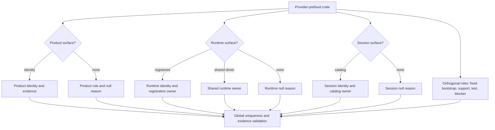
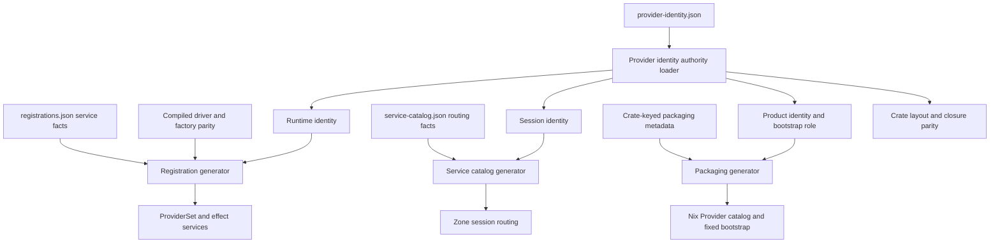
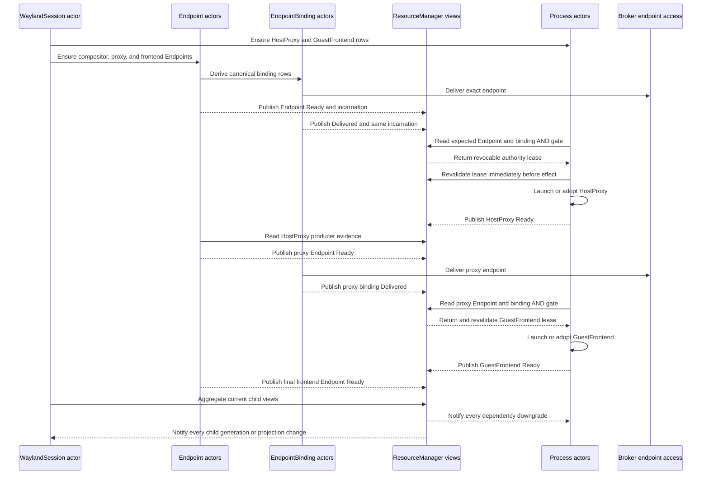
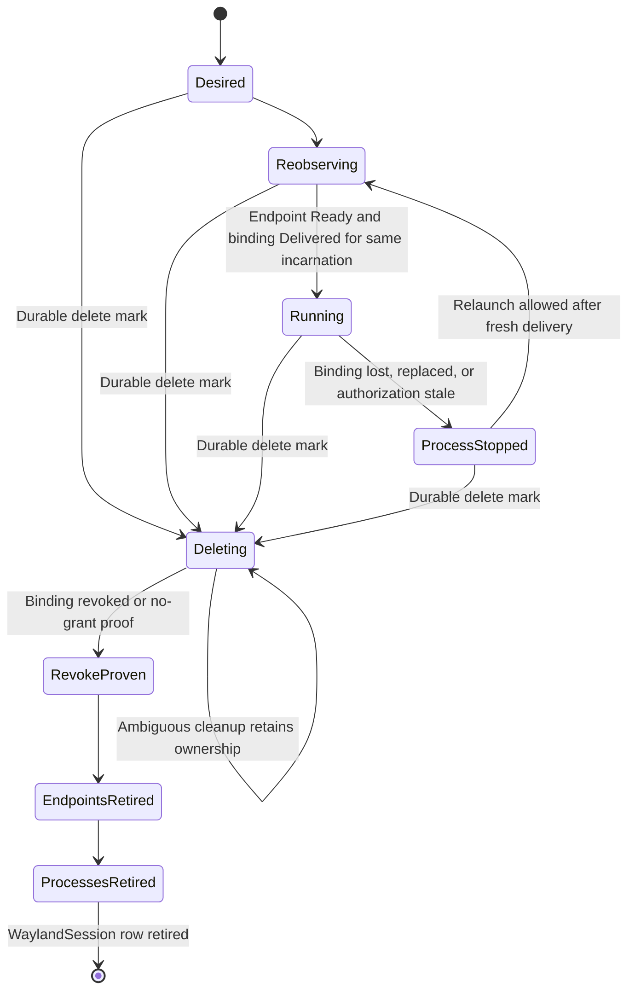

# Provider Identity and Endpoint Status Authority - Plan

## Goal Capsule

- **Objective:** Operators can start the daemon and reconcile display sessions to `Ready` while every Provider reference and child readiness claim has one explicit, enforcing owner.
- **Means:** Introduce surface-keyed per-crate Provider identity declarations, keep executable registrations and service routing separate, and move display Endpoint and EndpointBinding readiness entirely onto their resource actors. See KTD1-KTD7.
- **Product authority:** The confirmed designs in #632 and #635, `STRATEGY.md`, ADR 0046, ADR 0055, and the actor-only status contract in `docs/plans/2026-09-09-001-refactor-v3-resource-runtime-rewrite-plan.md`.
- **Transition:** Clean cutover of generated identity inputs and display lifecycle ownership. No compatibility path may leave old and new identity or status authorities active together.
- **Open blockers:** None for this plan. #629, #630, and #631 remain explicit external dependencies and are not implemented here.
- **Execution profile:** Run dependency-ready units in the waves under Sequencing and Parallelism. Provider identity and display lifecycle are independently reviewable and shippable milestones; whichever lands second owns U7's combined regression. Each unit ends on its own committed head and MUST pass `make check` before any dependent unit starts or its commit is integrated.
- **Stop conditions:** Stop on a second identity source, a Provider startup path that cannot fail closed, endpoint evidence that exposes a host locator, a launch path that bypasses Process ownership, or teardown that can retire a Process before its EndpointBindings revoke.
- **Shipping owner:** The repository owner applies fixes, commits before authoritative validation, obtains independent review on the final head, and lands through the reviewed PR lifecycle in `docs/contributing/workflow.md`.

---

## Product Contract

### Summary

This plan gives every provider-prefixed crate an explicit product, runtime, session, or no-identity classification and makes those declarations the only Provider identity source.
It also makes display Endpoint realization, binding delivery, Process launch gating, restart recovery, and teardown converge through the existing resource actors instead of the daemon's rejected status and child-mutation path.

### Problem Frame

#635 currently describes 27 generated rows with `providerRef: null`, but HEAD has no such emitted rows.
The actual workspace contains 59 provider-prefixed crates: 32 carry runtime registrations, 6 carry only session catalogs, 21 carry neither, and the packaged Provider matrix contains 26 product identities.
Those numbers describe different authorities, but crate layout rules, runtime registrations, service catalogs, fixed bootstrap identities, and product packaging still encode identity through overlapping mechanisms.
This makes mixed cases such as `system-systemd` versus `process-systemd`, shared-driver `device-tpm`, foundation-owned `system-minijail`, runtime-only `endpoint`, and no-identity `execution-policy` difficult to state without inventing authority.

#632 exposes the same ownership problem in the display lifecycle.
`WaylandSession` now derives two `Process` and three `Endpoint` children, but the generic `EndpointDriver` refuses all three display shapes before it can derive their `EndpointBinding` children.
The legacy display adapter then creates or adopts overlapping child rows and sends `UpdateStatus` through `ManagerBackend`, which rejects every status mutation by design.
Even after Endpoint status moves to the actor, generic Endpoint `Ready` does not prove that an exact binding was delivered, so the Process actor also needs current binding evidence before launch or adoption.

### Actors

- A1. **Provider author:** Declares a crate's product, runtime, session, or no-identity role and supplies production evidence without inferring identity from the crate path.
- A2. **Configuration and packaging generators:** Project product Provider identities, fixed bootstrap ownership, artifacts, and Nix contracts from the explicit authority.
- A3. **ProviderSet and ProviderDirectory:** Start executable Provider families, host effect services, and register ResourceType drivers while refusing inconsistent declarations.
- A4. **WaylandSession controller:** Derives and owns the desired display Process and Endpoint graph, observes child state, and controls aggregate session lifecycle.
- A5. **Endpoint and EndpointBinding actors:** Validate exact endpoint contracts, observe realization evidence, publish in-memory state, materialize binding rows, and revoke delivery.
- A6. **Process actor:** Launches or adopts workers only after required binding delivery is current.
- A7. **Operator:** Deploys the generated closure and receives explicit startup or resource failures instead of fabricated identity or false readiness.

### Key Decisions

- KD1. **Endpoint and binding actors own display readiness.** Governs R7-R17. (session-settled: user-approved - chosen over a daemon or Resource API status writer and over Process-only readiness: status must remain actor-owned and reflect the actual endpoint.)
- KD2. **Provider identity/classification is explicit and separate from executable registration.** Governs R1-R6 and R18-R20. (session-settled: user-approved - chosen over directory-name inference and blanket `registrations.json` rows: product, runtime, session, and no-identity crates are different authorities.)
- KD3. **Mixed ownership stays explicit.** Governs R4-R6. (session-settled: user-approved - chosen over forcing every product Provider to own a standalone driver: `device-tpm` uses the shared Device driver, `system-minijail` stays foundation-owned, and `endpoint` remains runtime-only.)

### Requirements

**Provider identity authority**

- R1. Every `d2b-provider-*` crate MUST carry exactly one explicit declaration covering product, runtime, and session identities plus its closed classification roles, including fixed-bootstrap and shared-driver ownership.
- R2. Each non-null identity MUST carry named production evidence outside generated output and the old Provider matrix; identity names MUST be globally unique across surfaces unless one declaration explicitly assigns the same name to multiple surfaces of the same owning crate.
- R3. Identity and family classification MUST never be inferred from a crate directory, dependency count, name segments, or the presence of another declaration file.
- R4. `device-tpm` MUST remain `Provider/device-tpm` on the product surface while the shared Device driver owns executable reconciliation and no standalone TPM runtime registration is synthesized.
- R5. `system-minijail` MUST remain a fixed-bootstrap product identity owned by foundation and activation, while `endpoint` remains a runtime resource-family identity outside the packaged Provider matrix.
- R6. `execution-policy` MUST carry no Provider identity until an enforcing admission path exists; #629, #630, and #631 MUST remain explicit blocked surfaces rather than fabricated registrations.

**Generated and startup consumers**

- R7. Runtime registrations, session service catalogs, product packaging metadata, fixed bootstrap projections, resource declarations, and operation declarations MUST keep distinct schemas and consumers.
- R8. Runtime and session declaration files MUST retain only their executable or routing facts; their Provider identities MUST resolve from the explicit identity authority.
- R9. The product Provider matrix MUST retain package, dossier, test, Bazel target, and unit metadata keyed by crate while product identity and fixed-bootstrap ownership derive from the explicit authority.
- R10. Missing, duplicate, malformed, stale, conflicting, or unhosted identities, services, factories, ResourceTypes, and catalog relationships introduced or reordered by this plan MUST fail during complete pre-activation validation.
- R11. `make generate` MUST remain the only aggregate writer of committed registration, catalog, Nix, and closure artifacts, with no consumerless identity inventory or second drift gate.
- R12. Durable repository docs and #635 MUST describe product, runtime, session, fixed-bootstrap, shared-driver, blocked, and no-identity categories without maintaining hand-copied live totals; exact counts belong to generated census and validation output.

**Display Endpoint and binding readiness**

- R13. `ResourceActor` MUST remain the sole publisher of Endpoint and EndpointBinding status, with generation-fenced in-memory status and zero persistent writes.
- R14. `EndpointDriver` MUST admit exactly the display compositor, host-proxy, and guest-frontend Endpoint shapes and terminally refuse lookalikes.
- R15. Process-produced Endpoint readiness MUST require current producer UID, row generation, actor `Ready`, reconnect evidence, and fingerprint; the Host compositor MUST require private exact socket evidence and expose only a cryptographically unpredictable realization-incarnation token plus closed connectability state.
- R16. `EndpointDriver` MUST remain the sole desired-row materializer for `EndpointBinding`, and materialization MUST require explicit publication intent plus current Role/RoleBinding authorization and dependency freshness rather than consumer policy alone.
- R17. EndpointBinding MUST publish current delivery evidence that distinguishes `Delivered`, `EndpointReplaced`, `Undelivered`, and `Draining`; `Delivered` MUST carry the same opaque realization-incarnation token as Endpoint readiness.

**Display Process and session lifecycle**

- R18. Process launch, adoption, and relaunch MUST derive the expected canonical binding set from current publication intent, then require matching Endpoint `Ready` and binding `Delivered` evidence in a revocable lease revalidated immediately before the effect; missing or stale expected rows MUST defer, while malformed or foreign evidence MUST refuse.
- R19. WaylandSession MUST remain the sole desired-child owner for two Process and three Endpoint rows, and the daemon display adapter MUST stop creating, adopting, deleting, or publishing status for those children.
- R20. HostProxy MUST wait for compositor delivery, GuestFrontend MUST wait for the HostProxy Endpoint delivery, and the GuestFrontend-produced Endpoint MUST gate aggregate readiness without creating an in-Zone binding.
- R21. Process and WaylandSession actors MUST receive every dependency generation or projection change; restart, spec change, reconnect, authorization change, and socket replacement MUST re-observe evidence, and any required binding loss MUST make the live Process non-ready and stop or quarantine its current incarnation before relaunch is allowed.
- R22. Durable deletion marks MAY cascade eagerly, but effect order MUST be: fence new use and stop or quarantine the live Process, obtain positive binding revoke or no-grant proof, retire Endpoints, retire Process rows, then retire WaylandSession; ambiguous cleanup MUST retain ownership and MUST NOT report success.
- R23. `waylandEndpointRef` and `waylandEndpointGeneration` MUST select the deterministic GuestFrontend-produced Endpoint and use its committed metadata generation; no display path may send `UpdateStatus` or restore persisted Endpoint status.

**Verification and delivery**

- R24. Layer-1 tests MUST prove declaration parity, global cross-surface uniqueness, generated drift, complete pre-activation validation, authorization-fenced binding publication, effect-time lease revalidation, exact display realization, same-incarnation launch gating, downgrade subscriptions, Guest-target Process effects, restart fencing, partial convergence, redaction, and teardown ordering.
- R25. Production composition acceptance MUST reach display `Ready` through the real manager, ProviderSet, ResourceActor, driver, and facet path while proving no display status mutation request occurs.
- R26. The final integrated head MUST pass generated-artifact idempotence, repository gates, and host integration without a Bazel profile override.
- R27. Every code change MUST include a valid changelog fragment, and issue/docs updates MUST record the corrected authority model and accepted implementation.
- R28. Host integration MUST exercise Provider startup plus the display actor graph end to end, and the complete unfiltered `make test-host-integration` lane MUST pass on the final committed head.
- R29. The Process provider MUST carry committed `TargetBinding` into actor context and implement authenticated Guest-target launch, adoption, observation, stop, and prepared EndpointBinding delivery before the legacy display supervisor is removed.

### Key Flows

- F1. **Provider declaration to startup**
  - **Trigger:** A provider-prefixed crate is added, renamed, or changes one authority surface.
  - **Actors:** A1, A2, A3.
  - **Steps:** The crate declaration states each identity surface; scoped generators join their own facts; packaging and runtime artifacts regenerate; startup validates Provider, service, factory, driver, and converted-type parity.
  - **Outcome:** The daemon starts with one explicit owner for every published identity or refuses before manager creation.
  - **Covered by:** R1-R12.
- F2. **Display launch**
  - **Trigger:** A committed WaylandSession reconciles.
  - **Actors:** A4, A5, A6.
  - **Steps:** Five desired children commit; Endpoint and binding actors publish independent current views for the same realization incarnation; Process preparation evaluates their AND gate; HostProxy launches; its Endpoint and binding converge; GuestFrontend launches; the final frontend Endpoint realizes.
  - **Outcome:** The session reaches `Ready` without parent-owned child effects or status writes.
  - **Covered by:** R13-R20, R23, R25.
- F3. **Restart and replacement**
  - **Trigger:** The daemon restarts, a resource generation changes, a reconnect occurs, or a socket inode is replaced.
  - **Actors:** A3-A6.
  - **Steps:** Durable desired rows reload; actors validate, recover, and reconcile; bindings re-deliver; Processes remain deferred until current evidence returns.
  - **Outcome:** Readiness is rebuilt from the actual target and stale evidence never authorizes use.
  - **Covered by:** R13, R15, R17-R21.
- F4. **Display teardown**
  - **Trigger:** The WaylandSession is deleted or finalization resumes after restart.
  - **Actors:** A4-A6.
  - **Steps:** New use stops; binding loss makes live Processes non-ready and stops their effects; bindings prove revoke or retain ownership; Endpoints retire; Process rows retire; the WaylandSession row retires.
  - **Outcome:** No helper outlives admitted endpoint access and repeated deletion converges.
  - **Covered by:** R16-R22.

### Acceptance Examples

- AE1. **Split product/runtime identity:** Given `d2b-provider-process-systemd`, generation produces product `system-systemd` and runtime `process-systemd` without requiring equality or duplicating either source. Covers R1-R3, R7-R11.
- AE2. **Shared-driver Provider:** Given `device-tpm`, product packaging retains `Provider/device-tpm`, runtime generation emits no TPM ProviderSet row, and daemon startup remains green through the shared Device driver. Covers R4, R10.
- AE3. **Fixed bootstrap:** Given `process-minijail`, product generation retains `system-minijail` in fixed bootstrap and runtime registration does not publish `process-minijail`. Covers R5, R9-R10.
- AE4. **Runtime-only family:** Given `endpoint`, runtime generation publishes the Endpoint family while product Provider packaging excludes it. Covers R5, R7-R10.
- AE5. **No-identity vocabulary:** Given `execution-policy`, generation accepts the ResourceType vocabulary only after all unenforced `Provider/execution-policy` references are removed. Covers R6-R10.
- AE6. **Missing or conflicting declaration:** Given an absent declaration, duplicate surface identity, stale generated row, or service without a production factory, owner-local gates or startup refuse with no inferred fallback. Covers R1-R3, R10-R11.
- AE7. **HostProxy launch:** Given a current compositor Endpoint but an `Undelivered` or `EndpointReplaced` compositor binding, HostProxy remains pending and no launch or adoption occurs; a current `Delivered` binding permits one launch path. Covers R15-R18, R20.
- AE8. **GuestFrontend launch:** Given a `Ready` HostProxy Process but a stale proxy Endpoint generation or binding delivery, GuestFrontend remains pending; current Endpoint and `Delivered` binding evidence permits launch. Covers R15-R21.
- AE9. **Restart recovery:** Given committed display rows and no persisted runtime status, restart re-observes the compositor, producer Processes, and binding delivery before the session returns to `Ready`. Covers R13, R17-R21, R23.
- AE10. **Ordered deletion:** Given a partially created or fully ready display graph, deletion revokes both binding rows before Endpoint and Process retirement and retains the session finalizer through ambiguous cleanup. Covers R16-R22.
- AE11. **No status API path:** Given production display reconciliation, `ManagerBackend` continues rejecting `UpdateStatus` and no display code sends such a request. Covers R13, R19, R23, R25.
- AE12. **Deferred product gaps:** Given #629, #630, or #631 remains unresolved, identity generation records the explicit blocked surface without claiming its missing artifact, transfer, or launch implementation exists. Covers R2, R6.
- AE13. **Authorization revocation:** Given a delivered binding whose RoleBinding, consumer ownership, or provider assignment becomes stale, delivery withdraws, the live Process stops or quarantines, and no grant is reissued until fresh authorization exists. Covers R16-R18, R21-R22.
- AE14. **Same-incarnation gate:** Given Endpoint `Ready` for socket incarnation A and binding `Delivered` for incarnation B, Process preparation remains pending and launch or adoption does not occur. Covers R15, R17-R18, R21.
- AE15. **Ambiguous cleanup:** Given a previously delivered binding and missing parent, consumer, malformed row, or unavailable broker during delete, cleanup retains ownership and the WaylandSession cannot retire until positive revoke or no-grant proof exists. Covers R21-R22.
- AE16. **Cross-surface collision:** Given product `Provider/x` in one crate and runtime or session `Provider/x` in another, declaration validation refuses before generation or startup. Covers R1-R3, R10.
- AE17. **Effect-time revocation race:** Given preparation returns ready and authorization changes before launch or adoption, lease revalidation refuses the effect and no helper starts. Covers R18, R21.
- AE18. **Post-ready downgrade:** Given a ready display session and a binding projection downgrade, subscriptions requeue Process and WaylandSession, stop or quarantine the helper, and remove aggregate readiness without manual reconciliation. Covers R17-R18, R21-R22.
- AE19. **Guest-target Process:** Given an authenticated live Guest target, GuestFrontend launches through Process-owned target effects; a stale or unavailable Guest session blocks launch and adoption without falling back to daemon-owned execution. Covers R18-R21, R29.

### Success Criteria

- The daemon starts from generated Provider authority with no inferred identity and no false TPM, minijail, endpoint, or execution-policy classification.
- A production-composition display test reaches session `Ready` with two Process, three Endpoint, and two canonical EndpointBinding rows.
- No status transition writes durable state, no display code issues `UpdateStatus`, and restart reconstructs current readiness from matching realization incarnations.
- A Bazel-owned host-integration check drives a real daemon display lifecycle to `Ready`, restart recovery, and ordered cleanup, and every host-integration check passes in the full lane.
- Generated artifacts, durable docs, and issue descriptions agree on authority categories, while exact totals remain generated facts.

### Scope Boundaries

#### In Scope

- Identity/classification declarations for all provider-prefixed crates and atomic migration of every product, runtime, session, Nix, startup, and generated consumer.
- Display Endpoint realization, binding delivery projection, Process launch preparation, WaylandSession child orchestration, restart, finalization, and production acceptance.
- Removal of stale `execution-policy` identity claims, duplicate display child/status ownership, and incorrect #635 documentation.

#### Deferred to Follow-Up Work

- #629 audio artifact and portal FD-transfer implementation.
- #630 observability Provider artifact implementation.
- #631 shell artifact, signature, Nix row, and launch implementation.
- Generic transactionality for unrelated Provider failures that occur after the new authority preflight and outside this plan's changed activation steps.
- Any unrelated Provider family conversion or Wayland protocol behavior not required for the five-child display graph.

#### Outside This Plan

- A durable status store, general Resource API status mutation, display-specific ResourceActor, or direct display process launch.
- A second generated identity inventory, new repository-wide test gate, contributor runtime, or host distribution change.

### Dependencies

- #632 and #635 are the source issues.
- ADR 0055 owns source-derived binding rows and relationship-first authority.
- `docs/plans/2026-09-09-001-refactor-v3-resource-runtime-rewrite-plan.md` owns actor-only runtime status and zero persistent status writes.
- #629, #630, and #631 remain external dependencies but do not block this plan's honest classification work.

---

## Planning Contract

### Key Technical Decisions

- KTD1. **Use one surface-keyed per-crate identity declaration.** Add mandatory `provider-identity.json` with independent `product`, `runtime`, and `session` identity slots plus family, fixed-bootstrap/shared-driver roles, evidence anchors, no-identity reasons, and blockers. It owns the surface inventory and identity values projected into generated consumers. Governs R1-R12. (session-settled: user-approved - chosen over keeping identity inside registrations or deriving it from crate names: the user approved one explicit identity/classification authority separate from executable registration.)
- KTD2. **Join the identity authority with scoped facts.** Runtime identity joins `registrations.json` service facts and compiled driver/factory parity; session identity joins `service-catalog.json` routing facts; product identity and bootstrap role join crate-keyed packaging metadata. Only artifacts with production consumers are emitted. Governs R7-R12.
- KTD3. **Cut over atomically.** Remove identity and bootstrap fields from runtime/session declarations and product matrix rows in the same integrated change that switches all generators and consumers; do not merge a state where two identity authorities are valid. Governs R7-R12 and R26.
- KTD4. **Separate Endpoint publication, authorization, and delivery ownership.** Display declares explicit binding publication intent in each Endpoint, with `none` distinct from unrestricted authorization. `EndpointDriver` alone ensures desired binding specs and requests retirement; `EndpointBindingDriver` alone owns authorization/freshness checks, broker delivery, status, revoke, and release. Governs R16-R17 and R22. (session-settled: user-approved - chosen over display-owned binding rows: the user approved child status and relationship effects remaining with authoritative child actors.)
- KTD5. **Inject provider-neutral realization and evidence seams.** Endpoint owns provider-neutral interfaces and public projection shapes; display owns all display constants and exact shape matching; d2bd injects that implementation plus manager and private host observation facets. No Endpoint-to-display or Process-to-display dependency is permitted. Governs R14-R15.
- KTD6. **Gate Process effects with revocable binding leases.** Process preparation derives expected canonical bindings from current Endpoint publication intent and returns closed `NotRequired`, `Ready`, `Pending`, or `Refused` outcomes. `Ready` produces a revocable authority snapshot carried into the launch or adoption ticket and revalidated under the serialized manager boundary immediately before the effect. Governs R17-R21.
- KTD7. **Replace the legacy display supervisor with subscribed actor observation.** WaylandSession owns desired children; Process owns launch and live-effect stop; Endpoint and EndpointBinding own realization and delivery; Process and WaylandSession subscribe to every dependency generation or projection change instead of relying on one-shot readiness watches. Governs R13 and R18-R25. (session-settled: user-approved - chosen over repairing `update_durable_endpoint_status`: the user approved deleting the daemon status writer rather than adding a bypass.)
- KTD8. **Fence the complete realization incarnation.** Endpoint actor mints an unpredictable 128-bit-or-stronger token when a realization becomes current and rotates it on replacement and daemon restart. Process preparation compares Endpoint and binding UID, generation, authorization freshness, reconnect/fingerprint evidence, and that same token; raw locator, device, inode, and arbitrary host errors remain private. Governs R15, R17-R18, R21, R23.
- KTD9. **Preserve eager deletion marks and enforce child-local effect barriers.** The manager may mark sibling children deleting together, but EndpointBinding must prove revoke, Endpoint must wait for binding retirement, Process must stop on binding loss and wait for consumed bindings and produced Endpoints, and WaylandSession remains until all descendants retire. Governs R21-R22.
- KTD11. **Use the generic authenticated Guest target for GuestFrontend.** Carry `TargetBinding` into `ResourceContext`, register the Guest Process target effect through the authenticated target service, and keep launch, adoption, observation, stop, and prepared endpoint delivery inside Process ownership. Governs R18-R21 and R29.

### High-Level Technical Design

#### Per-crate classification

#### Authority data flow

#### Display launch protocol

#### Display lifecycle

### Sequencing and Parallelism

| Wave | Units | Safe parallelism | Exit gate |
| --- | --- | --- | --- |
| 1 | U1, U4 | Identity schema and binding/Process preparation have no semantic dependency | Each committed unit passes `make check` |
| 2 | U2, U5, U10 | U2 consumes U1; U5 and U10 consume U4 but own independent Endpoint and Guest-target surfaces | Each committed unit passes `make check` |
| 3 | U3, U6 | Generator cutover and atomic display ownership cutover use settled interfaces from prior waves | Each committed unit passes `make check` |
| 4 | U8 | Teardown and downgrade hardening follows the complete actor-owned display path | Committed unit passes `make check` |
| 5 | U7 | Integrates reviewed milestone heads and owns end-to-end acceptance | Integrated committed head passes `make check` and the full host-integration lane |

Shared files alone do not make units dependent.
When parallel units touch the same composition root or generated file, one unit owns the final integration edit while the other exports a stable interface and owner-local tests.
No wave advances on an advisory skip or an uncommitted working tree.

**Independently shippable milestones**

- Provider identity milestone: U1-U3, including its own focused acceptance and `make check`.
- Display actor milestone: U4, U5, U10, U6, and U8, including its own actor-stack acceptance and `make check`.
- U7 runs when both reviewed milestones are present; the second milestone to land carries the combined regression, docs/changelog reconciliation, and full host-integration proof.

### System-Wide Impact

| Surface | Change | Required invariant |
| --- | --- | --- |
| Provider authoring | Every provider-prefixed crate gains explicit surface classification | Global cross-surface uniqueness, no identity inference, no unexplained null |
| xtask generation | All identity-bearing generators join one loader | No consumerless inventory or circular authority |
| Nix packaging | Product identity and bootstrap role are derived while packaging metadata stays crate-keyed | Fixed bootstrap and 26-row product catalog remain exact |
| Daemon startup | Runtime rows still drive ProviderSet and services | Complete new authority preflight before any Provider activation |
| Resource runtime | EndpointBinding projection becomes authorization-fenced launch evidence | Public status is redacted, memory-only, generation-fenced, and incarnation-matched |
| Process lifecycle | Preparation can defer on expected pending bindings and stop on binding downgrade | No launch, adoption, or continued usability without exact delivery |
| Display lifecycle | Parent derives desired graph while child-local barriers enforce effect order | No duplicate child effect, status, binding, or cleanup owner |
| Contributor workflow | Generated and owner-local tests expand | No new gate, scheduler, or local Bazel profile override |

### Risks and Mitigations

| Risk | Consequence | Mitigation |
| --- | --- | --- |
| Identity manifest restates another authority | New drift replaces old drift | Remove identity strings from scoped declarations and matrix rows during U3 |
| Evidence anchors become stale | Declaration appears justified after source removal | Validate paths and stable symbols; reject generated or matrix-only evidence |
| Cross-surface aliases resolve to different crates | `Provider/<name>` becomes ambiguous between product, runtime, and session owners | Enforce global uniqueness and same-crate explicit reuse only |
| Mixed product/runtime names are normalized | `system-systemd` or bootstrap ownership breaks | Pin split-identity and fixed-bootstrap acceptance cases |
| Binding publication bypasses authorization freshness | Endpoint policy creates or retains delivery after RoleBinding or ownership changes | Require current authorization and dependency digests before materialization and delivery |
| Binding generic `Ready` is mistaken for delivery | Process launches without usable endpoint | Gate on typed `Delivered` projection and matching realization token, not generic phase |
| Binding downgrade affects only future launch | Existing helper retains access or runs against stale delivery | Mark Process non-ready and stop or quarantine the live effect immediately |
| Authority changes after preparation | A helper launches under a stale but previously valid manager read | Carry a revocable authority snapshot into the effect ticket and revalidate immediately before spawn or adoption |
| Ready actors receive no downgrade trigger | Session and Process remain ready after replacement or revocation | Subscribe to every dependency generation or projection change |
| Endpoint and Process waits form a cycle | Display never converges | Commit Process identity first, derive bindings from Endpoint policy, and defer Process effects rather than Process row creation |
| Endpoint and binding refer to different socket incarnations | Independent current statuses falsely authorize launch | Compare one opaque incarnation token in the Process gate |
| Compositor evidence leaks host paths or numeric host identifiers | Provider boundary and wire diagnostics expose host state | Keep raw identity private; publish only opaque token and closed redacted failures |
| Ambiguous teardown is treated as no grant | Kernel access survives row retirement | Require positive revoke or no-grant proof and retain ownership on uncertainty |
| Eager sibling deletion stops Process before revoke | Helper lifecycle outruns child cleanup | Use child-local barriers and separate Process effect stop from Process row retirement |
| Partial cutover leaves two authorities | Startup and generated outputs disagree | Keep U3 atomic and reject mixed old/new input shapes |

### Alternatives Considered

- **Classification-only manifest pointing at existing identity sources:** Rejected because it leaves product identity in the Provider matrix and runtime/session identity in separate files, preserving the authority split #635 is meant to remove.
- **Provider matrix as universal authority:** Rejected because it cannot model runtime-only, session-only, shared-driver, or fixed-bootstrap ownership without becoming a second runtime inventory.
- **Directory inference or blanket registration:** Rejected because both fabricate authority and cannot express renamed or mixed identities.
- **Display-owned EndpointBinding rows:** Rejected because ADR 0055 and current EndpointDriver make the source Endpoint the relationship owner.
- **Daemon or Resource API status seam:** Rejected because it violates actor-only status and leaves restart ownership split.
- **Endpoint `Ready` or Process `Ready` alone as launch proof:** Rejected because neither proves current exact endpoint delivery or compositor replacement.

### Deferred Implementation Details

- Exact helper and enum names for identity roles, evidence records, binding projections, and pending Process preparation may change during implementation while preserving KTD1, KTD5, and KTD6.
- The compositor observation adapter may reuse an existing socket registry or introduce a narrow wrapper; it MUST preserve R15's private raw evidence and public opaque-token split.
- Existing finalizer helper APIs may require refactoring to express staged sibling deletion, but the order in R22 is not deferred.

### Sources and Research

- `STRATEGY.md` - Zone ownership, specialized child controllers, and explicit restart-safe authority.
- `docs/adr/0046-d2b-3-provider-control-plane.md` - current Provider/resource control-plane ownership.
- `docs/adr/0055-unified-resource-graph-bindings-operations-and-authority.md` - source-owned binding derivation and relationship lifecycle.
- `docs/explanation/design.md` - fail-closed cleanup and host locator confidentiality.
- `docs/plans/2026-09-09-001-refactor-v3-resource-runtime-rewrite-plan.md` - actor-owned in-memory status and zero persistent status writes.
- `docs/plans/2026-09-29-2324-refactor-unified-resource-graph-plan.md` - current generated Provider and EndpointBinding architecture.
- `docs/reference/provider-crate-layout.md` - current per-crate declarations and generated consumer boundaries.
- `docs/solutions/development_workflow/local-make-check-is-a-strict-subset-of-ci.md` - generated freshness and CI-only coverage beyond local aggregate tests.
- `docs/solutions/infrastructure/posix-acl-mask-nullified-by-chmod-on-mode-0700-directories.md` - exact effective endpoint access must be verified rather than inferred from visible ACL entries.
- #632 and its design decision comment; #635 and the corrected implementation census.

---

## Implementation Units

### U1. Add Provider identity authority schema and loader

- **Goal:** Establish the single typed authority that can represent product, runtime, session, shared-driver, fixed-bootstrap, resource-family, service-only, support, test, and no-identity crates.
- **Requirements:** R1-R3, R7-R10.
- **Dependencies:** None.
- **Files:**
  - Create `packages/xtask/src/provider_identity_authority.rs`.
  - Modify `packages/xtask/src/authority_common.rs`.
  - Modify `packages/xtask/src/main.rs`.
  - Modify `packages/xtask/BUILD.bazel`.
- **Approach:**
  1. Define the closed surface, role, null-reason, blocker, and evidence vocabularies under KTD1.
  2. Implement repository enumeration and missing-declaration diagnostics behind a test fixture boundary; do not register mandatory workspace coverage until U2 supplies every declaration and Bazel input.
  3. Validate identity grammar, global cross-surface uniqueness, same-crate explicit reuse, evidence paths and symbols, and the prohibition on generated or matrix-only evidence.
  4. Expose joins by crate and surface for existing generators without emitting a standalone artifact.
- **Execution note:** Add failing authority tests before registering the new declaration kind; preserve the existing explicit-absence ratchet until U3 removes superseded identity reasons.
- **Patterns to follow:** `packages/xtask/src/provider_registration_authority.rs`, `packages/xtask/src/service_catalog.rs`, and `packages/xtask/src/authority_common.rs`.
- **Test scenarios:**
  1. A valid crate with distinct product and runtime identities loads both without an equality requirement.
  2. A missing file, directory/name mismatch, malformed identity, unknown role, or unexplained null fails with a typed declaration error.
  3. Two crates claiming the same identity on any surfaces fail; one crate explicitly sharing an identity across its own permitted surfaces succeeds.
  4. Evidence naming only generated output or the Provider matrix fails; a live repo-relative source and stable symbol succeeds.
  5. Re-running the loader over identical inputs produces deterministic ordering.
- **Verification:** Schema, loader, join, uniqueness, and negative census behavior pass through fixtures, while the current workspace is not yet required to satisfy the new declaration kind.

### U2. Declare all provider-prefixed crates and special ownership

- **Goal:** Populate the authority with a complete, reviewable classification of every provider-prefixed crate.
- **Requirements:** R1-R6, R12.
- **Dependencies:** U1.
- **Files:**
  - Create `packages/d2b-provider-*/provider-identity.json` for all provider-prefixed crates.
  - Modify every `packages/d2b-provider-*/BUILD.bazel` `cargo_workspace_sources` target to include `provider-identity.json`.
  - Extend tests in `packages/xtask/src/provider_identity_authority.rs`.
- **Approach:**
  1. Record product, runtime, and session identities independently, with production evidence or closed null reasons.
  2. Encode product-only `device-tpm`, fixed-bootstrap `system-minijail`, runtime-only `endpoint`, split `system-systemd`/`process-systemd`, session-only `config-nixos`, and no-identity `execution-policy`.
  3. Preserve #629, #630, and #631 as blockers attached only to the surfaces they prevent.
  4. Assert the complete census by classification rather than treating registration absence as identity absence.
  5. Register `provider-identity.json` as a mandatory declaration kind only after all files and Bazel source closures are present.
- **Patterns to follow:** Production evidence comments in `packages/xtask/src/authority_common.rs` and the identity grammar used by `provider_registration_authority.rs`.
- **Test scenarios:**
  1. Covers AE1. `process-systemd` carries product `system-systemd` and runtime `process-systemd`.
  2. Covers AE2. `device-tpm` carries product identity plus shared-driver ownership and no runtime registration.
  3. Covers AE3. `process-minijail` carries fixed-bootstrap ownership without a `process-minijail` identity.
  4. Covers AE4. `endpoint` carries runtime identity and no product identity.
  5. Covers AE5. `execution-policy` carries no identity and a resource-vocabulary reason.
  6. Covers AE12. Audio, observability, and shell blocker metadata does not imply executable readiness.
  7. Adding a new provider-prefixed crate without a declaration fails the census.
  8. A manifest omitted from Bazel runfiles makes the drift action fail rather than silently passing over an incomplete source tree.
- **Verification:** The workspace census now covers every provider-prefixed crate exactly once, missing declarations fail the normal repository gate, and `make check` passes on the committed U2 head.

### U3. Cut generators, packaging, startup inputs, and docs to the new authority

- **Goal:** Make every product, runtime, session, Nix, startup, and closure consumer derive identity from U1-U2 and remove superseded identity sources.
- **Requirements:** R7-R12, R26-R27.
- **Dependencies:** U2.
- **Files:**
  - Modify `packages/xtask/src/provider_registration_authority.rs`.
  - Modify `packages/xtask/src/service_catalog.rs`.
  - Modify `packages/xtask/src/authority_common.rs`.
  - Modify `packages/xtask/src/provider_crate_policy.rs`.
  - Modify `packages/xtask/src/provider_packaging.rs`.
  - Modify `packages/xtask/src/resource_type_authority.rs`.
  - Modify `packages/xtask/src/new_graph_closure.rs`.
  - Modify `packages/xtask/src/nix_inventories.rs`.
  - Modify `packages/d2b-provider-*/registrations.json`.
  - Modify `packages/d2b-provider-*/service-catalog.json`.
  - Modify `packages/d2b-contracts-resource/src/v3/execution_policy_resource.rs`.
  - Modify `packages/d2b-contracts-resource/src/v3/mod.rs`.
  - Modify `packages/d2bd/src/provider_lifecycle.rs`.
  - Modify `packages/d2bd/src/resource_plane_v3.rs`.
  - Modify `packages/d2b-provider-execution-policy/README.md`.
  - Modify `nixos-modules/deployment-bootstrap.nix`.
  - Modify `nixos-modules/provider-catalog.nix`.
  - Regenerate `generated/new-graph/provider_registrations.rs`.
  - Regenerate `generated/new-graph/service_provider_catalog.rs`.
  - Regenerate `nixos-modules/generated/provider-catalog-shape.nix`.
  - Regenerate other affected `generated/new-graph/` and `nixos-modules/generated/` projections through `make generate`.
  - Modify `tests/unit/nix/surfaces/provider-catalog.nix`.
  - Modify `tests/unit/nix/cases/provider-catalog.nix`.
  - Modify `tests/unit/nix/cases/provider-system-providers.nix`.
  - Modify `bazel/checks/nix/BUILD.bazel`.
  - Modify `docs/reference/provider-crate-layout.md`.
  - Modify `docs/specs/providers/README.md`.
- **Approach:**
  1. Remove identity strings from runtime registrations and session catalogs, and remove identity plus bootstrap ownership from product matrix rows while retaining scoped service and packaging metadata.
  2. Join each generator against the matching authority surface and validate declaration presence, service/factory ownership, product metadata, bootstrap ownership, and Provider references.
  3. Remove directory/dependency/name-segment identity classification and the identity-related `DECLARATION_ABSENCES` rows it supersedes.
  4. Validate every `Provider/<name>` reference emitted from ResourceType declarations against the global identity authority.
  5. Preserve ProviderSet, ProviderDirectory, converted-type, factory, and late-registration fail-closed checks.
  6. Regenerate every committed consumer atomically, keep exact partition totals in generated census assertions, and rewrite durable docs around authority categories rather than copied live counts.
- **Execution note:** Treat the source and all generated consumers as one atomic cutover; do not commit a mixed format that accepts both old and new identity fields.
- **Patterns to follow:** `packages/xtask/src/new_graph_closure.rs` source-to-consumer checks and existing deterministic generator tests.
- **Test scenarios:**
  1. Covers AE6. Missing, duplicate, malformed, or conflicting surface identity fails before generation.
  2. A runtime declaration with no runtime identity and a session catalog with no session identity fail.
  3. A product matrix row with no product identity and a product identity with no matrix metadata fail.
  4. Fixed bootstrap remains exactly foundation-owned `system-core` and `system-minijail`; neither becomes a normal runtime row.
  5. `endpoint` appears in runtime registrations but not product `providerIds`.
  6. `device-tpm` appears in product packaging but not runtime registrations.
  7. Unknown service, missing factory, duplicate runtime identity, and converted-type mismatch continue to refuse daemon startup.
  8. Generated output is deterministic, idempotent, and byte-drift checked.
  9. Nix evaluation rejects product catalog identities outside the derived product set.
  10. Deployment bootstrap resolves runtime `process-systemd` while product packaging retains `system-systemd`, and fixed-bootstrap/runtime-only cases remain distinct.
- **Verification:** Generated artifacts contain no inferred identity, daemon startup consumes only executable rows, Nix consumers retain fixed bootstrap and packaging behavior, and docs match the new authority.

### U4. Publish binding delivery and gate Process effects

- **Goal:** Make exact EndpointBinding delivery a generation-fenced Process launch and adoption prerequisite.
- **Requirements:** R16-R18, R20-R22, R24.
- **Dependencies:** None.
- **Files:**
  - Modify `packages/d2b-provider-endpoint/src/binding.rs`.
  - Modify `packages/d2b-provider-endpoint/src/endpoint.rs`.
  - Modify `packages/d2b-provider-endpoint/src/driver.rs`.
  - Modify `packages/d2b-provider-endpoint/tests/endpoint_binding.rs`.
  - Modify `packages/d2b-provider-endpoint/tests/endpoint_delivery.rs`.
  - Modify `packages/d2b-process-conformance/src/plan.rs`.
  - Modify `packages/d2b-process-conformance/src/launch_identity.rs`.
  - Modify `packages/d2b-provider-process/src/facets.rs`.
  - Modify `packages/d2b-provider-process/src/effects.rs`.
  - Modify `packages/d2b-provider-process/src/effects_service.rs`.
  - Modify `packages/d2b-provider-process/src/driver.rs`.
  - Modify `packages/d2b-provider-process/src/lib.rs`.
  - Modify `packages/d2b-provider-process/src/worker_launch.rs`.
  - Modify `packages/d2b-provider-process/tests/process_family.rs`.
  - Modify `packages/d2b-resource-runtime/src/resource.rs`.
  - Modify `packages/d2b-resource-runtime/src/manager.rs`.
  - Modify `packages/d2b-resource-runtime/src/context.rs`.
  - Modify `packages/d2b-provider-display-wayland/src/session_children.rs`.
  - Modify `packages/d2bd/src/resource_plane_v3.rs`.
- **Approach:**
  1. Extend Endpoint contract with explicit binding publication intent where `none` is distinct from unrestricted authorization, and migrate every production Endpoint emitter before enabling the new gate.
  2. Expose an authenticated source-owned child-ensure path plus current Role/RoleBinding and dependency-freshness reads to EndpointDriver.
  3. Require current authorization and dependency freshness before ensuring or retaining a canonical binding row.
  4. Publish a redacted binding projection with `Delivered`, `EndpointReplaced`, `Undelivered`, or `Draining`, fenced by the binding row generation and carrying an opaque realization-incarnation token.
  5. Add an observable publish-and-defer pre-drain pass so `Draining` reaches the manager before revoke; preserve the projection through the delete-stage transition until cleanup resolves.
  6. Derive the expected canonical binding set from current Endpoint publication intent naming the exact Process identity, not from display-local slots or already-existing rows.
  7. Extend Process preparation with `NotRequired`, `Ready`, `Pending`, and `Refused`; pending delivery requeues through the runtime's retryable path, while malformed or foreign evidence refuses.
  8. Seal `Ready` evidence into a revocable launch/adoption lease and revalidate it under the serialized manager boundary immediately before the effect.
  9. Add subscriptions that requeue Process and WaylandSession actors on every dependency generation or status-projection change.
  10. Keep broker dispatch, effective-access verification, and EndpointBinding actor ownership unchanged.
- **Execution note:** Characterize current generic `Ready` behavior first, then prove typed delivery blocks launch before changing production preparation.
- **Patterns to follow:** TPM typed projection gating, `ResourceView::observed_status_projection`, `BindingPreparation`, and existing replacement/revoke tests.
- **Test scenarios:**
  1. Covers AE7. Endpoint `Ready` plus binding `Undelivered` leaves Process pending and issues no launch.
  2. Binding `EndpointReplaced` blocks launch and adoption until a fresh `Delivered` projection appears.
  3. Binding `Delivered` for the wrong UID, generation, owner Endpoint, consumer, authorization digest, dependency revision, or canonical slot is rejected.
  4. An expected binding row that is missing or unavailable defers; a genuinely empty publication set returns `NotRequired`.
  5. Restart does not trust cached delivery; recovery re-grants before Process usability.
  6. Revocation publishes `Draining` before broker release and prevents new launch.
  7. RoleBinding revocation, consumer owner change, or provider assignment change withdraws delivery and blocks the Process without requiring an Endpoint generation change.
  8. A race that revokes or replaces authority after preparation but before spawn/adoption fails lease revalidation and issues no Process effect.
  9. A post-Ready Endpoint or binding downgrade wakes the Process and WaylandSession actors without a manual reconcile.
  10. Existing non-display Processes with no required EndpointBinding preserve current preparation behavior.
- **Verification:** Process effects cannot run over generic Endpoint readiness alone, and existing EndpointBinding delivery/replacement semantics remain actor-owned.

### U5. Define display Endpoint realization contracts

- **Goal:** Define and test all three display Endpoint shapes, vocabulary, evidence, and redaction contracts without activating a second production owner.
- **Requirements:** R13-R17, R20-R21, R24.
- **Dependencies:** U4.
- **Files:**
  - Modify `packages/d2b-provider-endpoint/src/driver.rs`.
  - Modify `packages/d2b-provider-endpoint/src/effects_service.rs`.
  - Modify `packages/d2b-provider-endpoint/src/facets.rs`.
  - Modify `packages/d2b-provider-endpoint/src/lib.rs`.
  - Modify `packages/d2b-provider-endpoint/tests/endpoint_delivery.rs`.
  - Modify `packages/d2b-provider-display-wayland/src/session_children.rs`.
  - Modify `packages/d2b-provider-display-wayland/src/lib.rs`.
  - Modify `packages/d2b-provider-display-wayland/tests/provider_behavior.rs`.
- **Approach:**
  1. Define provider-neutral Endpoint vocabulary and evidence traits so display owns its constants and exact shape matching without reversing the existing Cargo dependency or exporting display types from Endpoint APIs.
  2. Admit the exact compositor `Transport/Unix`, HostProxy `Data/FdAttachment`, and GuestFrontend `Transport/Vsock` contracts, including provider, producer, locality, visibility, lifecycle, purpose, fingerprint, consumer policy, and reconnect evidence.
  3. Read Process-produced realization from current generation-fenced producer views.
  4. Read compositor realization from a private daemon facet carrying exact socket identity and connectability without a host path.
  5. Mint an unpredictable token of at least 128 bits whenever a realization becomes current, rotate it on replacement and daemon restart, and publish only that token plus closed readiness state; never derive it from locator, device, or inode data.
  6. Implement matchers, evidence adapters, and hermetic driver tests behind non-production or test composition; defer production driver/facet registration to U6's atomic ownership cutover.
- **Patterns to follow:** Existing guest-control and Device worker endpoint realizations, `EndpointSocketIdentity`, `EndpointProvenance`, and display child contract helpers.
- **Test scenarios:**
  1. Each of the three exact display Endpoint shapes validates and reaches actor `Ready`.
  2. Wrong class, transport, producer type, provider, locality, visibility, lifecycle, purpose, fingerprint, consumer, or operation fails with `endpoint-shape-unsupported`.
  3. Covers AE8. A Process-produced endpoint with stale producer UID or generation remains non-ready.
  4. A compositor socket absent, unconnectable, or replaced at the same locator invalidates prior readiness.
  5. Endpoint `Ready` for incarnation A and binding `Delivered` for incarnation B cannot satisfy Process preparation.
  6. A stale reconnect fingerprint or Endpoint generation cannot publish current readiness.
  7. Sentinel host paths, device/inode values, and raw observation errors do not appear in API status, diagnostics, or logs.
  8. Tokens rotate on replacement and daemon restart, do not collide across test realizations, and cannot be reproduced from known locator inputs.
  9. Restart recovery re-observes Process or socket evidence before republishing `Ready`.
  10. EndpointDriver derives exactly two canonical EndpointBinding rows across the three display Endpoints, while the frontend Endpoint explicitly publishes none.
- **Verification:** Exact shape and evidence tests pass, but the committed production composition still has one active display owner until U6 switches wiring and removes the legacy path in the same head.

### U10. Add authenticated Guest-target Process effects

- **Goal:** Give the GuestFrontend Process a Process-owned launch, adoption, observation, stop, and endpoint-delivery path over the authenticated Guest target session.
- **Requirements:** R18-R21, R24-R25, R29.
- **Dependencies:** U4.
- **Files:**
  - Modify `packages/d2b-resource-runtime/src/target.rs`.
  - Modify `packages/d2b-resource-runtime/src/resource.rs`.
  - Modify `packages/d2b-resource-runtime/src/guest_target.rs`.
  - Modify `packages/d2b-provider-guest/src/target_service.rs`.
  - Modify `packages/d2b-provider-guest/src/target_control.rs`.
  - Modify `packages/d2b-provider-process/src/worker_launch.rs`.
  - Modify `packages/d2b-provider-process/src/driver.rs`.
  - Modify `packages/d2b-provider-process/src/effects_service.rs`.
  - Modify `packages/d2bd/src/composition.rs`.
  - Modify `packages/d2bd/tests/guest_target_service.rs`.
- **Approach:**
  1. Carry the resolved `TargetBinding`, exact Guest identity, and live session generation into `ResourceContext` instead of reducing Guest targets to an unused coarse handle.
  2. Register a Process `GuestTargetEffect` in `production_guest_target_effects` that applies the host-resolved Process realization through the authenticated target-control service.
  3. Implement Process launch, adoption, liveness observation, stop, and prepared EndpointBinding delivery without exposing Guest session capability to the Provider driver.
  4. Quarantine restart survivors until the live target generation and U4 launch lease revalidate.
  5. Keep unknown Guest-local resource types fail-closed and preserve the existing Guest target digest and session fences.
- **Execution note:** Build the generic Guest-target Process path independently of display, then let U6 consume it for GuestFrontend.
- **Patterns to follow:** `GuestTargetService`, `GuestTargetRuntime`, `TargetControlAssignment`, current Host Process effects, and `packages/d2bd/tests/guest_target_service.rs`.
- **Test scenarios:**
  1. A current authenticated Guest target launches one Process with the exact resolved spec and reports actor readiness.
  2. Stale session generation, foreign Zone, replaced source UID, regressed assignment, wrong target, or spec digest mismatch performs no effect.
  3. Adoption discovers only an exact live Guest Process and quarantines stale or ambiguous survivors.
  4. Prepared endpoint delivery reaches the Guest Process only after the U4 authority lease revalidates.
  5. Session loss makes the target unavailable, stops or quarantines the live effect, and reconnect requires fresh adoption and delivery.
  6. Delete removes only the exact source Process and is idempotent across retry and reconnect.
  7. Unregistered Guest target types remain refused with no phantom realization.
- **Verification:** A generic Process row targeting a Guest can complete its full actor-owned lifecycle through the authenticated target service, and `make check` passes before U6 consumes the path.

### U6. Remove duplicate display child and status effects

- **Goal:** Make WaylandSession, Endpoint, EndpointBinding, and Process actors the only display create, launch, observation, and status owners.
- **Requirements:** R18-R21, R23-R25, R29.
- **Dependencies:** U5, U10.
- **Files:**
  - Modify `packages/d2b-provider-wayland-session/src/wayland_session.rs`.
  - Modify `packages/d2b-provider-wayland-session/tests/registration.rs`.
  - Modify `packages/d2b-provider-wayland-policy/src/interaction.rs`.
  - Modify `packages/d2b-provider-wayland-policy/src/effects_service.rs`.
  - Modify `packages/d2b-provider-wayland-policy/tests/engine.rs`.
  - Modify `packages/d2b-provider-display-wayland/src/runtime.rs`.
  - Modify `packages/d2b-provider-display-wayland/src/controller.rs`.
  - Modify `packages/d2b-provider-display-wayland/src/process.rs`.
  - Modify `packages/d2b-provider-display-wayland/src/session_children.rs`.
  - Modify `packages/d2b-provider-display-wayland/src/lib.rs`.
  - Modify `packages/d2b-provider-display-wayland/tests/provider_behavior.rs`.
  - Modify `packages/d2bd/src/resource_plane_v3.rs`.
  - Modify `packages/d2bd/src/resource_runtime/plane_controller_bridge.rs`.
  - Modify `packages/d2bd/src/interaction_composition.rs`.
- **Approach:**
  1. In one committed head, activate U5 display shape admission and evidence facets while removing daemon-owned Process/Endpoint create, adopt, delete, binding admission, and status mutation from the durable display adapter.
  2. Remove display-local binding slot constants, `DisplayEndpointBinding`, and the parallel binding admission path; locate and validate the two EndpointDriver-derived canonical rows.
  3. Have display aggregation subscribe to current Endpoint, EndpointBinding, and Process manager views while Process preparation owns actual launch gating.
  4. Order HostProxy before GuestFrontend through current child evidence, not through direct parent launch.
  5. Select the deterministic GuestFrontend-produced Endpoint for `waylandEndpointRef` and generation rather than the first Endpoint child.
  6. Delete legacy `endpointGeneration` stamping and `update_durable_endpoint_status`.
  7. Preserve deterministic five-child derivation, partial-child retry, and restart adoption.
- **Execution note:** Start from the production composition regression test that currently stops at the rejected status write; make each ownership removal observable before deleting helpers.
- **Patterns to follow:** Wayland interaction child derivation, Endpoint-owned binding finalization, Process actor preparation, and manager child lookup classification.
- **Test scenarios:**
  1. Covers AE7-AE8. HostProxy and GuestFrontend launch only after their exact binding deliveries.
  2. The frontend-produced Endpoint gates aggregate session readiness, derives no binding, and is the exact projected Wayland Endpoint reference.
  3. Partial creation of any subset of the five children retries to one complete graph without duplicates.
  4. Covers AE11. Production reconciliation sends no `UpdateStatus` and still reaches `Ready`.
  5. Spec and reconnect generation changes invalidate old Endpoint, binding, and Process evidence independently.
  6. Legacy display binding slots and admission helpers are absent, and tests assert the two canonical committed binding rows instead.
  7. Existing display policy, GPU, portal, clipboard, and principal gates remain unchanged.
  8. The U5 production facet is absent before the cutover and the legacy display child/status path is absent after it; no committed head runs both authorities.
- **Verification:** `DisplaySupervisorEffects` no longer owns durable child mutation or status, and the actor graph alone reaches and leaves `Ready`.

### U8. Enforce display downgrade and teardown barriers

- **Goal:** Preserve eager durable deletion while guaranteeing that live effects stop on authority loss and no row retires before positive revoke evidence.
- **Requirements:** R17-R22, R24-R25.
- **Dependencies:** U6.
- **Files:**
  - Modify `packages/d2b-provider-endpoint/src/binding.rs`.
  - Modify `packages/d2b-provider-endpoint/tests/endpoint_binding.rs`.
  - Modify `packages/d2b-provider-process/src/driver.rs`.
  - Modify `packages/d2b-provider-process/tests/process_family.rs`.
  - Modify `packages/d2b-resource-runtime/src/context.rs` only if a generic child barrier helper is required.
  - Modify `packages/d2b-resource-runtime/src/manager.rs` tests for real eager-cascade behavior.
  - Modify `packages/d2b-provider-wayland-policy/src/interaction.rs`.
  - Modify `packages/d2b-provider-wayland-policy/tests/engine.rs`.
  - Modify `packages/d2b-provider-wayland-session/src/wayland_session.rs`.
  - Modify `packages/d2b-provider-wayland-session/tests/registration.rs`.
- **Approach:**
  1. Treat every required binding transition away from current `Delivered` as immediate Process non-readiness and stop or quarantine the verified live incarnation.
  2. Separate Process effect stop from Process row retirement so the consumer identity remains available while revocation is pending.
  3. Make EndpointBinding cleanup require positive revoke or positive no-grant proof; missing parent, missing consumer, malformed state, stale policy, or unavailable broker remains ambiguous and retains ownership.
  4. Keep Endpoint retirement blocked until binding children are terminal and Process row retirement blocked until consumed bindings and produced Endpoints are gone.
  5. Test the actual manager eager cascade rather than a direct driver-delete shortcut, and retain the WaylandSession row until all descendants retire.
- **Patterns to follow:** EndpointBinding replacement/restart tests, Process verified-incarnation stop, manager owned-child deletion, and ADR 0055 relationship-first teardown.
- **Test scenarios:**
  1. Covers AE13. RoleBinding revocation, ownership change, provider reassignment, or binding downgrade stops the running Process and forbids relaunch.
  2. Covers AE15. Delivered-then-policy-narrowed, missing-parent, missing-consumer, malformed-row, restart, and broker-unavailable cleanup retains ownership until revoke proof.
  3. Process effect stop occurs before or while binding revoke is pending, but Process row retirement waits for Endpoint and binding retirement.
  4. Endpoint cannot retire while any binding child is delivered, draining, replaced, ambiguous, or unavailable.
  5. Covers AE10. Ready, pending, partial-child, provider-unavailable, and already-revoked graphs converge through binding -> Endpoint -> Process effect order under the real manager cascade.
  6. Restart between Process stop and revoke proof resumes cleanup without relaunch or finalizer loss.
- **Verification:** No live helper remains usable after binding authority loss, and no ambiguous cleanup path reports successful retirement.

### U7. Prove the integrated authority model and reconcile documentation

- **Goal:** Bind both streams into production acceptance, generated-contract proof, documentation, changelog, and issue closure evidence.
- **Requirements:** R12, R24-R29.
- **Dependencies:** U3, U8.
- **Files:**
  - Modify production actor-stack tests in `packages/d2bd/src/resource_plane_v3.rs` or add a dedicated `packages/d2bd/tests/` integration test.
  - Modify `packages/d2bd/src/interaction_composition.rs` tests only to prove the remaining service issues no child CRUD or `UpdateStatus`.
  - Modify `packages/d2b-resource-api/src/manager_backend/tests.rs` only if additional no-write coverage is needed.
  - Modify `packages/d2b-resource-runtime/src/manager.rs` tests only if additional generation-fence coverage is needed.
  - Modify `docs/reference/daemon-api.md` if status publication prose still implies an API writer.
  - Modify `docs/explanation/daemon-lifecycle.md`.
  - Add `changelog.d/provider-endpoint-authority.md`.
  - Add `packages/d2b-test-vm-harness/src/checks/display_resource_lifecycle.rs`.
  - Modify `packages/d2b-test-vm-harness/src/checks/mod.rs`.
  - Modify `packages/d2b-test-vm-harness/BUILD.bazel`.
  - Modify `nix/test-support/host-integration-node.nix`.
  - Modify `bazel/checks/vm/BUILD.bazel`.
  - Update #632 and #635 with the final reviewed design and verified outcomes.
- **Approach:**
  1. Drive a manager-owned WaylandSession through the real ResourcePlaneV3 ProviderSet, drivers, manager views, broker test dispatch, and facets.
  2. Assert the complete two-Process, three-Endpoint, two-EndpointBinding graph, ordered readiness, zero display status mutations, restart re-observation, and ordered cleanup.
  3. Keep a separate interaction-composition regression only for the removed legacy ownership surface.
  4. Prove every identity, service, factory, ResourceType, operation, and catalog relationship introduced by the new authority is validated before Provider activation.
  5. Add a Bazel-owned host-integration check that boots the daemon from Bazel-built host tools, serves a real Unix compositor socket, creates or admits the display resource graph, and drives exact delivery through the real broker and launched Process principal.
  6. Register that check in the existing host-integration inventory and reusable Nix node model; do not add a standalone script or alternate scheduler.
  7. Correct #635's inventory, document the identity surface split, and record #632's actor, binding, Process, downgrade, and cleanup gates.
  8. Keep external blocker issues explicit and avoid claiming their implementations completed.
- **Test scenarios:**
  1. Covers AE1-AE6, AE12, and AE16. Generated product, runtime, session, blocked, and no-identity surfaces agree with startup and Nix consumers.
  2. Covers AE7-AE11, AE13-AE15, and AE17-AE19. Production display reconcile reaches `Ready`, Guest-target launch is actor-owned, downgrade is observed, restart returns to `Ready`, and teardown converges with no `UpdateStatus`.
  3. A deliberately missing runtime factory or conflicting identity refuses before Provider activation.
  4. A deliberately stale or mismatched Endpoint/binding incarnation blocks Process launch and session readiness.
  5. Public status, diagnostics, and logs omit sentinel paths, device/inode values, and raw host observation errors.
  6. The host-integration display check denies connection before delivery, permits the intended principal after `Delivered`, reaches `Ready`, survives daemon restart with fresh evidence, and denies a fresh client after RoleBinding revocation.
  7. The same revocation stops the running helper, blocks cleanup until revoke proof, then deletes through revoke-before-retire ordering with no stale child or Provider state.
  8. Documentation and generated artifacts reproduce identically from the authoritative inputs.
- **Verification:** The integrated head satisfies the Verification Contract below, issues describe the shipped model accurately, and no dead legacy helper or generated authority remains.

---

## Verification Contract

| Stage | Command or check | Applies to | Required result |
| --- | --- | --- | --- |
| Focused Rust | Owner-local Bazel targets for xtask, Endpoint, Process, Guest target, Wayland policy/session, resource runtime/API, d2bd, and the VM harness | U1-U8, U10 | New and existing owner tests pass with no advisory skip used as evidence |
| Generated contracts | `make generate` | U3, U7 | Expected artifacts change once; an immediate second run is idempotent |
| Policy and source authority | `make test-policy` | U1-U3 | Declaration, workspace, generated-consumer, and source-hygiene policy passes |
| Nix contract | `make test-nix-unit` | U3, U7 | Product catalog, fixed bootstrap, and generated identity cases pass |
| Rust aggregate | `make test-rust` | U4-U8, U10 | Actor, driver, daemon, and contract suites pass |
| Per-unit Layer-1 gate | `make check` | Every committed implementation-unit head before dependent work or integration | Complete required Layer-1 facade passes under repository-selected Bazel profile |
| Integrated Layer-1 gate | `make check` | Final integrated committed head | Complete required Layer-1 facade passes again after all units converge |
| Host end-to-end | `make test-host-integration` with no check selector | Final integrated committed head | New display/Provider authority scenario and every existing host-integration check pass; lane exit is zero |
| Container lane | `make test-integration` | Only if implementation changes container image or foreign-userland inputs | Conditional lane passes; otherwise record not applicable rather than cite a skip |
| Redaction proof | Owner-local API/status/log tests with sentinel locators and numeric host identifiers | U5, U7 | No path, device, inode, or raw host observation error crosses public status or logs |
| PR required checks | Required GitHub checks including `security-scan` | Reviewed PR head | Current head is green and review evidence binds the observed base and head |

Validation MUST use the repository's normal Make/Bazel facade without `--config=local`, `D2B_BAZEL_PROFILE`, or another caller-selected profile override.
Commit the coherent unit before authoritative validation so Nix evaluation sees tracked inputs.

---

## Definition of Done

### Global

- Every provider-prefixed crate has one valid identity/classification declaration, and no identity string remains authoritative in runtime registrations, session catalogs, matrix rows, or crate-name inference.
- Provider identity is globally unambiguous across product, runtime, and session surfaces, with fixed-bootstrap ownership declared in the same authority.
- Product, runtime, session, fixed-bootstrap, resource-family, and no-identity cases generate and start according to their distinct contracts.
- Display reconciliation reaches `Ready` through actor-owned Endpoint, binding, and Process evidence for one matching realization incarnation, with no daemon child mutation or status writer.
- Authorization loss or binding downgrade makes the live Process non-ready and stops its effect before any relaunch.
- Restart, replacement, partial creation, and deletion preserve UID/generation/reconnect fencing, positive revoke proof, and relationship-first effect teardown.
- Public status and diagnostics expose no host locator, device/inode identity, or arbitrary host observation string.
- Generated artifacts, docs, changelog, #632, and #635 agree with the shipped model.
- Every unit's exact committed head passes `make check` before dependent execution or integration.
- Provider identity and display actor milestones can each complete review and land independently; the second landing carries U7's combined regression and documentation reconciliation.
- The final integrated head passes `make check`, the full unfiltered `make test-host-integration` lane, independent review, and all required PR checks.
- Abandoned prototypes, duplicate manifests, legacy status helpers, stale generated files, and temporary evidence code are removed from the diff.

### Per Unit

| Unit | Done signal |
| --- | --- |
| U1 | Loader and negative tests enforce one surface-keyed declaration model without changing production consumers |
| U2 | All provider-prefixed crates are classified with evidence, null reasons, or blockers |
| U3 | Every generated and runtime consumer uses the new authority and the old identity sources are gone |
| U4 | Process launch/adoption is impossible without current canonical binding delivery |
| U5 | All three display Endpoints reconcile through EndpointDriver with exact path-free evidence |
| U6 | Actor graph alone owns display create, launch ordering, readiness, and status projection |
| U8 | Binding downgrade and delete preserve stop/revoke/retirement barriers under real manager cascade |
| U7 | Production acceptance, generated idempotence, docs, changelog, issues, and required gates are complete |
| U10 | Guest-target Process effects own GuestFrontend launch, adoption, observation, stop, and endpoint delivery |