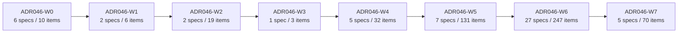
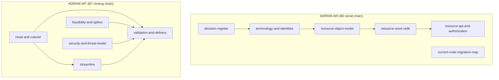
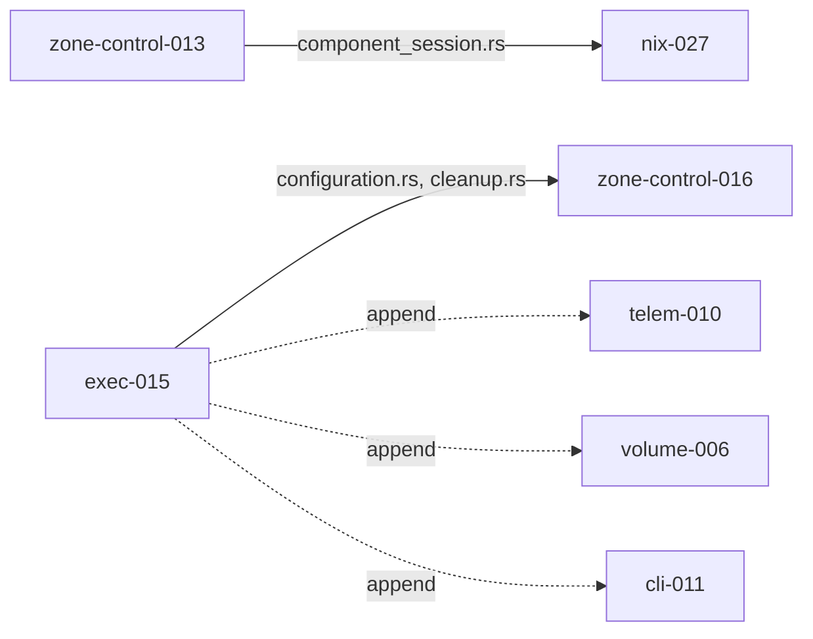

# ADR 0046 implementation graph (generated human view)

| Field | Value |
| --- | --- |
| Companion artifact | [`ADR-046-implementation-graph.json`](./ADR-046-implementation-graph.json) (`artifactKind: d2b-adr-implementation-graph`, `schemaVersion` 1) |
| Source artifacts | `docs/specs/ADR-046-spec-set.json`, `docs/specs/ADR-046-work-items.json`, `ADR-046-validation-and-delivery.md` §3-§7 |
| Baseline | `b5ddbed67867d9244bf33390868101bd9b053e49` |
| Generated, not authored | This file and its `.json` companion are a deterministic view over the two existing generated manifests plus the wave topology already normatively defined in `ADR-046-validation-and-delivery.md` §3. Neither file introduces new decisions; both are recomputed by the refresh procedure in [§7](#7-refresh-validation-for-forthcoming-spec--work-item-changes-d096) whenever an upstream artifact changes. |

This document is the deterministic implementation DAG over every current ADR 0046
spec and work item: **55 spec nodes + 518 work-item nodes = 573 total nodes**,
typed edges, topological rank, exact `ADR046-W0`-`ADR046-W7` wave assignment,
file-disjoint `parallelGroup`s, and same-wave shared-prep barriers. Every
number in this file is read directly from the companion JSON; regenerating
one without the other is a drift bug.

## 1. Node and edge counts

| Metric | Count |
| --- | --- |
| Spec nodes | 55 |
| Work-item nodes | 518 |
| **Total nodes** | **573** |
| `spec-depends-on` edges | 507 |
| `implements-spec` edges | 518 |
| `work-item-depends-on` edges | 622 |
| `shared-contract` edges | 7 |
| `file-overlap-order` edges | 6 |
| **Total typed edges** | **1660** |

Every spec-set member and every work-item is mapped to **exactly one** node;
see [§6](#6-validation-results) for the coverage proof. Two specs
(`ADR-046-current-code-migration-map`, `ADR-046-provider-system-core`) own
zero directly-attributed work items — both are expected: the migration map is
a reference-only document, and `provider-system-core`'s implementation is
carried entirely by `ADR-046-core-controllers`'s `ADR046-core-*` items.

## 2. Wave assignment (`ADR046-W0`-`ADR046-W7`)

Every node's wave is derived mechanically (never hand-picked): a spec's wave
is `1 + max(wave(dep))` over its `dependsOn` edges (zero-dependency specs
fold to `ADR046-W0`), except the four declared closing specs plus this spec's
own `ADR-046-validation-and-delivery`, which resolve to `ADR046-W7` by
declaration per §3.1's "latest-safe, not earliest-possible" placement rule. A
work item's wave is always inherited from its own `specId` — no work item is
independently placed.

| Wave | Specs | Work items | Parallel groups | Shared-prep barriers |
| --- | --- | --- | --- | --- |
| `ADR046-W0` | 6 | 10 | `W0-migration-map` (1 spec, independent) ‖ `W0-serial-root` (5 specs, one serial integrator branch) | [B0](#b0-w0-serial-chain) |
| `ADR046-W1` | 2 | 6 | `W1-reconciliation` ‖ `W1-session-bus` | none |
| `ADR046-W2` | 2 | 19 | `W2-primitives` ‖ `W2-zone-routing` | none |
| `ADR046-W3` | 1 | 3 | `W3-provider-model` (single spec, strictly serial) | none |
| `ADR046-W4` | 5 | 32 | `W4-processes-sandbox` ‖ `W4-core-controllers` ‖ `W4-network` ‖ `W4-credential` ‖ `W4-provider-state` | none |
| `ADR046-W5` | 7 | 131 | `W5-zone-control` ‖ `W5-host-guest-process-user` ‖ `W5-volume` ‖ `W5-device` ‖ `W5-telemetry-audit` ‖ `W5-cli` ‖ `W5-nix-configuration` | [B-w5-component-session-rs](#b-w5-component-session-rs), [B-w5-configuration-rs-hub](#b-w5-configuration-rs-hub) |
| `ADR046-W6` | 27 | 247 | 5 provider tracks (§3.3): system/host/guest (7) ‖ storage/network/device (7) ‖ interaction (5) ‖ credentials (3) ‖ transport/observability/activation (5) | [B-w6-volume-local-before-virtiofs](#b-w6-volume-local-before-virtiofs), [B-w6-network-local-before-usbip](#b-w6-network-local-before-usbip) |
| `ADR046-W7` | 5 | 70 | `W7-closing-chain` (one connected component; this is the cross-cutting closing review, not a worktree-parallel wave) | [B7-closing-chain](#b7-closing-chain), [B-w7-spec-set-json-duplicate-generator](#b-w7-spec-set-json-duplicate-generator), [B-w7-test-runtime-ledger](#b-w7-test-runtime-ledger) |

**Entry/exit gate**: every wave uses the identical template already
normatively defined in `ADR-046-validation-and-delivery.md` §4 (Gate
0/prior-wave-Merged entry criteria; Validation-evidence/candidate-snapshot/
ten-role-panel/seal/merge-eligibility exit criteria). This graph does not
redefine that template per wave; each wave node in the JSON's `waves[]`
array simply cites it (`entryContracts`/`exitGate` fields), plus `ADR046-W7`
additionally requires the release/cutover gate (§15).

## 3. Mermaid DAG

### 3.1 Wave-level graph



### 3.2 `ADR046-W0` serial-prep chain and `ADR046-W7` closing chain



### 3.3 `ADR046-W5` same-wave file-overlap barriers



## 4. Shared-prep barriers and known contentions

### 4.1 Same-wave shared-prep barriers (`sharedPrepBarriers` in the JSON)

These require an explicit landing order **within** one wave; every other
file each participating spec owns stays fully worktree-parallel — a barrier
never serializes the whole wave, only the one contended file/skeleton.

#### B0-w0-serial-chain

`decision-register -> terminology-and-identities -> resource-object-model ->
resource-store-redb -> resource-api-and-authorization`, one integrator
branch, per §3.1/§3.2. `current-code-migration-map` is independent and never
folds into this chain.

#### B-w5-component-session-rs

`ADR046-zone-control-013` (base copied ADR45-derived wire structures) lands
first on the `ADR046-W5` root branch; `ADR046-nix-027` (naming/wire-
enumeration layer) fast-follows on the same branch — same file
(`packages/d2b-contracts/src/v3/component_session.rs`), same wave. **Newly
discovered** during this graph-generation pass (not yet in
`ADR-046-validation-and-delivery.md` §7). A path-naming drift was also found:
`ADR046-session-001` (`ADR-046-componentsession-and-bus`, `ADR046-W1`)
targets the differently-spelled `packages/d2b-contracts/src/v3_component_session.rs`
(underscore, top-level) for what appears to be the same logical contract.
The `ADR046-W1` file is canon (created first); the two `ADR046-W5` items'
literal path should be reconciled to it. This is flagged, not fixed, here —
`componentsession-and-bus`, `nix-configuration`, and `resources-zone-control`
are outside this change's edit scope.

#### B-w5-configuration-rs-hub

`ADR046-exec-015` (`ADR-046-resources-host-guest-process-user`) lands the
base `ZoneConfigController`/`GenerationState`/`PendingCleanup` skeleton first
(small commit) on the `ADR046-W5` root branch. `ADR046-zone-control-016`,
`ADR046-telem-010`, `ADR046-volume-006`, `ADR046-cli-011`, and the
`ADR-046-resources-device` `configuration.rs` item each append their own
additive hook as an immediate fast-follow commit, one per merged slice —
mirroring the `nixos-modules/index.nix` append pattern already used in §7 row
4. **Newly discovered**; all five sibling specs stay separate, file-disjoint
`parallelGroup`s on every other file they own.

#### B-w6-volume-local-before-virtiofs / B-w6-network-local-before-usbip

Soft integration-test-only orderings already normatively stated in §3.3
(D083 for volume; the network/usbip firewall-attachment dependency for the
other). Authoring proceeds concurrently; only the named integration-test
scenarios require the peer Provider present.

#### B7-closing-chain

Group A (`reset-and-cutover`, `feasibility-and-spikes`,
`security-and-threat-model`) has no `ADR046-W7`-internal dependency and is
mutually parallel. Group B (`streamline`) depends only on
`reset-and-cutover`. Group C (`validation-and-delivery`, this spec) depends
on all of Group A plus Group B and is the final closing merge. Group A
members are never serialized against each other merely for sharing a wave.

#### B-w7-spec-set-json-duplicate-generator / B-w7-test-runtime-ledger

Two pairs of work items independently describe generating the same file(s)
in the same wave: `ADR046-delivery-004`/`ADR046-streamline-001` (both
describe generating `ADR-046-spec-set.json`/`ADR-046-work-items.json`), and
`ADR046-delivery-007`/`ADR046-streamline-022` (`test_runtime_ledger.rs`,
already self-documented as "shared with `ADR046-delivery-007`" in
`streamline-022`'s own `Destination` field). Resolution: the
`ADR046-delivery-*` item is the single implementation in both cases; the
`ADR046-streamline-*` item consumes/extends it rather than authoring a
second generator.

### 4.2 Cross-wave known contentions (resolved by ordinary wave sequencing)

| Contended path | Claimants | Resolution |
| --- | --- | --- |
| `packages/d2b-contracts/src/v3/volume.rs` | `ADR046-primitives-001` (`ADR046-W2`, base struct), `ADR046-volume-001` (`ADR046-W5`, full schema) | Base lands in `ADR046-W2`; full schema extends in `ADR046-W5`. §7 row 1 also names `ADR-046-provider-state` as a claimant, but the committed `ADR046-pstate-001` targets the distinct file `volume_state.rs`; no graph edge is asserted there to avoid a false wave-backward (`ADR046-W5` -> `ADR046-W4`) constraint — flagged for the two owning specs to reconcile. |
| `packages/Cargo.toml` (workspace member list) | every new crate, `ADR046-W0`-`ADR046-W6` | Integrator-only trailing commit per merged slice (§7 row 2). |
| `flake.nix` (package/output list) | every new Provider crate, `ADR046-W6` | Integrator-only trailing commit, batched per track (§7 row 3). |
| `packages/d2b-contract-tests/tests/workspace_policy.rs` | every Provider crate-layout assertion, `ADR046-W6` | Integrator batches one appended assertion per merged slice (§7 row 5). |
| `packages/d2b-core-controller/src/rbac.rs`, `authz_audit.rs` | `ADR046-api-002` (`ADR046-W0`), `ADR-046-resources-zone-control` (`ADR046-W5`), `ADR-046-telemetry-audit-and-support` (`ADR046-W5`) | **Resolved false positive** (§7 row 7): the two files are distinct; no barrier required. |

## 5. Critical path

The longest dependency chain in the graph (rank 0 -> rank 19, 20 nodes) is:

```text
ADR-046-decision-register
  -> ADR-046-terminology-and-identities
  -> ADR-046-resource-object-model
  -> ADR-046-resource-store-redb
  -> ADR-046-resource-api-and-authorization
  -> ADR-046-resource-reconciliation
  -> ADR-046-primitive-resource-composition
  -> ADR-046-provider-model-and-packaging
  -> ADR-046-components-processes-and-sandbox
  -> ADR-046-cli-and-operations
  -> ADR-046-reset-and-cutover
  -> ADR046-reset-001 -> ADR046-reset-002 -> ADR046-reset-003 -> ADR046-reset-004
  -> ADR046-reset-005 -> ADR046-reset-006 -> ADR046-reset-007 -> ADR046-reset-008
  -> ADR046-reset-011
```

This passes through `ADR-046-reset-and-cutover`'s own internal work-item
chain (`ADR046-reset-001` through `ADR046-reset-011`, a genuine serial
`dependencyOwner` chain in the source spec, not an artifact of the
extraction), which turns out to be the single longest chain in the whole
graph — longer than `ADR-046-validation-and-delivery`'s own `ADR046-delivery-*`
item chain, even though both specs sit in `ADR046-W7`. Any change that
lengthens this chain (for example, splitting one of the `reset-*` items into
finer-grained sub-steps) is the first place a wave-7 schedule slips.

## 6. Validation results

| Check | Result |
| --- | --- |
| **ID uniqueness** | 573 node ids (55 `specId` + 518 `workItemId`) are pairwise distinct. |
| **Acyclic** | Kahn's algorithm topologically sorted all 573 nodes across all 1647 precedence edges (`spec-depends-on` + `implements-spec` + `work-item-depends-on`) with zero unreached nodes. The 13 `shared-contract`/`file-overlap-order` annotation edges introduce no new cycle. One genuine cycle was found and deterministically broken during generation: the free-form `W-N*`/`W-R*`/`W-X*` `provider-device-security-key` work-item family contains mutually-referencing prose (e.g. `W-N03` <-> `W-N04`); the tie-break keeps only the edge from the lexicographically smaller id to the larger one and demotes the reverse reference to `peerReferences`. |
| **Wave monotonic** | For every one of the 1660 typed edges, `wave(from) <= wave(to)`. Zero violations. |
| **Coverage** | Every one of 55 `spec-set.json` members and every one of 518 `work-items.json` items appears in exactly one node. |
| **Parallel groups file-disjoint** | Every `parallelGroup` is file-disjoint per §3.2/§3.3, except the two newly discovered same-wave file hubs (`component_session.rs`, `configuration.rs`/`cleanup.rs`), which stay in separate `parallelGroup`s and instead carry an explicit `sharedPrepBarriers` entry rather than being merged or serialized. |

## 7. Refresh validation for forthcoming spec / work-item changes (D096)

D096 (or any later decision) may add specs or work items. This graph does
not guess at their placement; instead, regenerating it after such a change
follows the same closed algorithm every time, so the result is byte-
identical for byte-identical input:

1. Recompute spec waves via §3.1's rule (`wave(spec) = 0` if `dependsOn` is
   empty, else `1 + max(wave(dep))`); the four declared closing specs plus
   `ADR-046-validation-and-delivery` itself always resolve to `ADR046-W7` by
   declaration, per §3.1's "latest-safe, not earliest-possible" rule.
2. Assign every work item's wave from its own `specId`'s computed wave — a
   work item is never independently placed.
3. Recompute `work-item-depends-on` edges by re-scanning `dependencyOwner`
   for exact-match `workItemId` tokens (plus `PREFIX-NNN through PREFIX-MMM`
   range expansion) against the *current* full id set, applying the same
   lexicographic same-wave/same-spec cycle-breaking tie-break.
4. Recompute rank via Kahn's algorithm (longest path) over the union of all
   three precedence edge types, using ascending node-id string order as the
   deterministic tie-break.
5. Re-run the destination-field exact-path-substring scan to detect newly
   shared files across different `specId` claimants; a new same-wave cluster
   is added to `sharedPrepBarriers` and a new cross-wave cluster to
   `crossWaveContentions`, in the same commit that discovers it (§6.2 item
   4).
6. Regenerate both `ADR-046-implementation-graph.json` and this file as the
   last commit touching `docs/specs/ADR-046-*`, mirroring the existing
   regeneration discipline for `ADR-046-spec-set.json`/`ADR-046-work-items.json`.

If the automated pass cannot resolve a new node's wave (for example, a
genuinely new zero-dependency root, or a `dependsOn` edge referencing a spec
outside the current 55), the refresh **fails closed**: the new spec/work
item must add an explicit `dependsOn`/`dependencyOwner` edge before the
graph is regenerated. No wave or rank is ever hand-picked for a new node.

## 8. Ready-node query

A node is "ready" (may open a new worktree/branch) when every one of its
precedence-edge predecessors (`spec-depends-on`, `implements-spec`,
`work-item-depends-on` targets pointing *into* it) is `Merged`, and no
`sharedPrepBarriers` entry names it as a fast-follow member whose base
member has not yet landed.

### 8.1 Pseudocode

```text
function ready_nodes(graph, merged_ids, barrier_landed_ids):
    ready = []
    for node in graph.nodes:
        if node.id in merged_ids:
            continue
        preds = predecessors(graph, node.id)   # spec-depends-on / implements-spec / work-item-depends-on
        if not all(p in merged_ids for p in preds):
            continue
        barrier = barrier_requiring(node.id)   # sharedPrepBarriers entry, if any
        if barrier and barrier.base_member not in barrier_landed_ids:
            continue
        ready.append(node.id)
    return sorted(ready)  # deterministic: ascending node id
```

### 8.2 SQL (against a `graph_nodes(id, kind, wave, parallel_group, status)` /
`graph_edges(from_id, to_id, type)` / `shared_prep_barriers(barrier_id, base_member, member)`
loading of the JSON)

```sql
WITH unmerged_preds AS (
    SELECT e.to_id AS node_id, COUNT(*) AS blocking_pred_count
    FROM graph_edges e
    JOIN graph_nodes p ON p.id = e.from_id
    WHERE e.type IN ('spec-depends-on', 'implements-spec', 'work-item-depends-on')
      AND p.status <> 'Merged'
    GROUP BY e.to_id
),
barrier_blocked AS (
    SELECT b.member AS node_id
    FROM shared_prep_barriers b
    JOIN graph_nodes base ON base.id = b.base_member
    WHERE base.status <> 'Merged'
)
SELECT n.id, n.wave, n.parallel_group
FROM graph_nodes n
LEFT JOIN unmerged_preds u ON u.node_id = n.id
LEFT JOIN barrier_blocked bb ON bb.node_id = n.id
WHERE n.status <> 'Merged'
  AND u.blocking_pred_count IS NULL
  AND bb.node_id IS NULL
ORDER BY n.wave, n.id;
```

The ready/launched ratio (per `ADR046-streamline-013`) is
`COUNT(ready_nodes with an open branch) / COUNT(ready_nodes)`; a ratio below
1.0 without a recorded blocker is a process failure per §6.1/§6.2 item 4.
