# ADR 0046 implementation graph (generated)

> **Generated index — not a normative member.** This file and its companion
> [`ADR-046-implementation-graph.json`](ADR-046-implementation-graph.json) are
> deterministically generated from
> [`ADR-046-spec-set.json`](ADR-046-spec-set.json),
> [`ADR-046-work-items.json`](ADR-046-work-items.json), and the 8-wave topology
> in [`ADR-046-validation-and-delivery.md` §3](ADR-046-validation-and-delivery.md).
> They are **not** among the 55 `ADR-046-spec-set.json` members and do not change
> that count (decision **D095**). Regenerate with
> `cargo run -p xtask -- implementation-graph` after regenerating the two
> manifests; a drift gate runs the generator and `git diff --exit-code`.

The graph maps every one of the 55 member specs and every work item exactly once
to a dependency-ordered launch wave (`W0`–`W7`) and a file-disjoint parallel
group, with typed edges, topological rank, prerequisites, and per-wave exit
gates. It embodies the anti-serialization invariant: every ready, file-disjoint
parallel group launches concurrently; a same-wave dependency is a
`shared-contract`/`file-overlap-order` prep barrier before its specific
consumers, never a reason to serialize a whole wave.

## Counts

| Metric | Value |
| --- | --- |
| Waves | 8 |
| Spec nodes | 55 |
| Work-item nodes | 526 |
| Total nodes | 581 |
| Edges | 1528 |
| Max topological rank | 19 |

## Waves (W0–W7)

| Wave | Specs | #Specs | #Work items | Parallel groups |
| --- | --- | --- | --- | --- |
| W0 | current-code-migration-map, decision-register, resource-api-and-authorization, resource-object-model, resource-store-redb, terminology-and-identities | 6 | 10 | W0-foundation-chain, W0-reference-docs |
| W1 | componentsession-and-bus, resource-reconciliation | 2 | 6 | W1-reconcile-and-bus |
| W2 | primitive-resource-composition, zone-routing | 2 | 19 | W2-composition-and-routing |
| W3 | provider-model-and-packaging | 1 | 3 | W3-provider-contract |
| W4 | components-processes-and-sandbox, core-controllers, provider-state, resources-credential, resources-network | 5 | 32 | W4-parallel-specs |
| W5 | cli-and-operations, nix-configuration, resources-device, resources-host-guest-process-user, resources-volume, resources-zone-control, telemetry-audit-and-support | 7 | 135 | W5-parallel-specs |
| W6 | provider-activation-nixos, provider-audio-pipewire, provider-clipboard-wayland, provider-credential-entra, provider-credential-managed-identity, provider-credential-secret-service, provider-device-gpu, provider-device-security-key, provider-device-tpm, provider-device-usbip, provider-display-wayland, provider-network-local, provider-notification-desktop, provider-observability-otel, provider-runtime-azure-container-apps, provider-runtime-azure-virtual-machine, provider-runtime-cloud-hypervisor, provider-runtime-qemu-media, provider-shell-terminal, provider-system-core, provider-system-minijail, provider-system-systemd, provider-transport-azure-relay, provider-transport-unix, provider-transport-vsock, provider-volume-local, provider-volume-virtiofs | 27 | 250 | W6-credentials, W6-interaction, W6-storage-network-device, W6-system-host-guest, W6-transport-observability-activation |
| W7 | feasibility-and-spikes, reset-and-cutover, security-and-threat-model, streamline, validation-and-delivery | 5 | 71 | W7-closing |

Within a wave, spec nodes in the same non-chain parallel group are file-disjoint
and launch concurrently. Work items of a spec form the `wi:<specId>` track;
work items of different specs in the same wave are file-disjoint and concurrent.
The full cross-wave `spec-depends-on` edges and all `work-item-depends-on`
edges live in the JSON; the Mermaid view below shows waves, their specs, and the
intra-wave prep-barrier edges only.

## Dependency DAG (waves and prep barriers)

```mermaid
flowchart LR
  subgraph W0["W0"]
    current_code_migration_map["current-code-migration-map"]
    decision_register["decision-register"]
    resource_api_and_authorization["resource-api-and-authorization"]
    resource_object_model["resource-object-model"]
    resource_store_redb["resource-store-redb"]
    terminology_and_identities["terminology-and-identities"]
  end
  subgraph W1["W1"]
    componentsession_and_bus["componentsession-and-bus"]
    resource_reconciliation["resource-reconciliation"]
  end
  subgraph W2["W2"]
    primitive_resource_composition["primitive-resource-composition"]
    zone_routing["zone-routing"]
  end
  subgraph W3["W3"]
    provider_model_and_packaging["provider-model-and-packaging"]
  end
  subgraph W4["W4"]
    components_processes_and_sandbox["components-processes-and-sandbox"]
    core_controllers["core-controllers"]
    provider_state["provider-state"]
    resources_credential["resources-credential"]
    resources_network["resources-network"]
  end
  subgraph W5["W5"]
    cli_and_operations["cli-and-operations"]
    nix_configuration["nix-configuration"]
    resources_device["resources-device"]
    resources_host_guest_process_user["resources-host-guest-process-user"]
    resources_volume["resources-volume"]
    resources_zone_control["resources-zone-control"]
    telemetry_audit_and_support["telemetry-audit-and-support"]
  end
  subgraph W6["W6"]
    provider_activation_nixos["provider-activation-nixos"]
    provider_audio_pipewire["provider-audio-pipewire"]
    provider_clipboard_wayland["provider-clipboard-wayland"]
    provider_credential_entra["provider-credential-entra"]
    provider_credential_managed_identity["provider-credential-managed-identity"]
    provider_credential_secret_service["provider-credential-secret-service"]
    provider_device_gpu["provider-device-gpu"]
    provider_device_security_key["provider-device-security-key"]
    provider_device_tpm["provider-device-tpm"]
    provider_device_usbip["provider-device-usbip"]
    provider_display_wayland["provider-display-wayland"]
    provider_network_local["provider-network-local"]
    provider_notification_desktop["provider-notification-desktop"]
    provider_observability_otel["provider-observability-otel"]
    provider_runtime_azure_container_apps["provider-runtime-azure-container-apps"]
    provider_runtime_azure_virtual_machine["provider-runtime-azure-virtual-machine"]
    provider_runtime_cloud_hypervisor["provider-runtime-cloud-hypervisor"]
    provider_runtime_qemu_media["provider-runtime-qemu-media"]
    provider_shell_terminal["provider-shell-terminal"]
    provider_system_core["provider-system-core"]
    provider_system_minijail["provider-system-minijail"]
    provider_system_systemd["provider-system-systemd"]
    provider_transport_azure_relay["provider-transport-azure-relay"]
    provider_transport_unix["provider-transport-unix"]
    provider_transport_vsock["provider-transport-vsock"]
    provider_volume_local["provider-volume-local"]
    provider_volume_virtiofs["provider-volume-virtiofs"]
  end
  subgraph W7["W7"]
    feasibility_and_spikes["feasibility-and-spikes"]
    reset_and_cutover["reset-and-cutover"]
    security_and_threat_model["security-and-threat-model"]
    streamline["streamline"]
    validation_and_delivery["validation-and-delivery"]
  end
  W0 --> W1 --> W2 --> W3 --> W4 --> W5 --> W6 --> W7
  provider_network_local -. file-order .-> provider_device_usbip
  provider_volume_local -. file-order .-> provider_volume_virtiofs
  resource_object_model -. prep .-> resource_api_and_authorization
  resource_store_redb -. prep .-> resource_api_and_authorization
  terminology_and_identities -. prep .-> resource_api_and_authorization
  decision_register -. prep .-> resource_object_model
  terminology_and_identities -. prep .-> resource_object_model
  resource_object_model -. prep .-> resource_store_redb
  terminology_and_identities -. prep .-> resource_store_redb
  reset_and_cutover -. prep .-> streamline
  decision_register -. prep .-> terminology_and_identities
  feasibility_and_spikes -. prep .-> validation_and_delivery
  reset_and_cutover -. prep .-> validation_and_delivery
  security_and_threat_model -. prep .-> validation_and_delivery
  streamline -. prep .-> validation_and_delivery
```



Solid `W0 --> ... --> W7` shows wave launch order. Dotted `prep`/`file-order`
edges are the only same-wave ordering constraints (`shared-contract` /
`file-overlap-order`): the serial W0 foundation chain, the W7 closing chain, and
the two documented W6 provider file-overlaps
(`volume-local` → `volume-virtiofs`, `network-local` → `device-usbip`). Every
other same-wave spec pair is fully parallel.

## Shared prep and file-overlap barriers

| From (prerequisite) | To (consumer) | Type |
| --- | --- | --- |
| `provider-network-local` | `provider-device-usbip` | file-overlap-order |
| `provider-volume-local` | `provider-volume-virtiofs` | file-overlap-order |
| `resource-object-model` | `resource-api-and-authorization` | shared-contract |
| `resource-store-redb` | `resource-api-and-authorization` | shared-contract |
| `terminology-and-identities` | `resource-api-and-authorization` | shared-contract |
| `decision-register` | `resource-object-model` | shared-contract |
| `terminology-and-identities` | `resource-object-model` | shared-contract |
| `resource-object-model` | `resource-store-redb` | shared-contract |
| `terminology-and-identities` | `resource-store-redb` | shared-contract |
| `reset-and-cutover` | `streamline` | shared-contract |
| `decision-register` | `terminology-and-identities` | shared-contract |
| `feasibility-and-spikes` | `validation-and-delivery` | shared-contract |
| `reset-and-cutover` | `validation-and-delivery` | shared-contract |
| `security-and-threat-model` | `validation-and-delivery` | shared-contract |
| `streamline` | `validation-and-delivery` | shared-contract |

## Parallel groups

Every node carries a `parallelGroup`. Groups whose members carry no
inter-member ordering edge are fully concurrent; the W0 foundation and W7
closing chains are serial prep chains; the W6 provider families are concurrent
except the two file-overlap orderings above.

| Parallel group | Wave | #Nodes |
| --- | --- | --- |
| `W0-foundation-chain` | W0 | 4 |
| `W0-reference-docs` | W0 | 2 |
| `W1-reconcile-and-bus` | W1 | 2 |
| `W2-composition-and-routing` | W2 | 2 |
| `W3-provider-contract` | W3 | 1 |
| `W4-parallel-specs` | W4 | 5 |
| `W5-parallel-specs` | W5 | 7 |
| `W6-credentials` | W6 | 3 |
| `W6-interaction` | W6 | 5 |
| `W6-storage-network-device` | W6 | 7 |
| `W6-system-host-guest` | W6 | 7 |
| `W6-transport-observability-activation` | W6 | 5 |
| `W7-closing` | W7 | 5 |
| `wi:ADR-046-cli-and-operations` | W5 | 13 |
| `wi:ADR-046-components-processes-and-sandbox` | W4 | 2 |
| `wi:ADR-046-componentsession-and-bus` | W1 | 3 |
| `wi:ADR-046-core-controllers` | W4 | 2 |
| `wi:ADR-046-decision-register` | W0 | 1 |
| `wi:ADR-046-feasibility-and-spikes` | W7 | 11 |
| `wi:ADR-046-nix-configuration` | W5 | 34 |
| `wi:ADR-046-primitive-resource-composition` | W2 | 3 |
| `wi:ADR-046-provider-activation-nixos` | W6 | 7 |
| `wi:ADR-046-provider-audio-pipewire` | W6 | 11 |
| `wi:ADR-046-provider-clipboard-wayland` | W6 | 12 |
| `wi:ADR-046-provider-credential-entra` | W6 | 1 |
| `wi:ADR-046-provider-credential-managed-identity` | W6 | 5 |
| `wi:ADR-046-provider-credential-secret-service` | W6 | 6 |
| `wi:ADR-046-provider-device-gpu` | W6 | 9 |
| `wi:ADR-046-provider-device-security-key` | W6 | 34 |
| `wi:ADR-046-provider-device-tpm` | W6 | 13 |
| `wi:ADR-046-provider-device-usbip` | W6 | 9 |
| `wi:ADR-046-provider-display-wayland` | W6 | 4 |
| `wi:ADR-046-provider-model-and-packaging` | W3 | 3 |
| `wi:ADR-046-provider-network-local` | W6 | 19 |
| `wi:ADR-046-provider-notification-desktop` | W6 | 6 |
| `wi:ADR-046-provider-observability-otel` | W6 | 5 |
| `wi:ADR-046-provider-runtime-azure-container-apps` | W6 | 7 |
| `wi:ADR-046-provider-runtime-azure-virtual-machine` | W6 | 9 |
| `wi:ADR-046-provider-runtime-cloud-hypervisor` | W6 | 7 |
| `wi:ADR-046-provider-runtime-qemu-media` | W6 | 19 |
| `wi:ADR-046-provider-shell-terminal` | W6 | 13 |
| `wi:ADR-046-provider-state` | W4 | 12 |
| `wi:ADR-046-provider-system-minijail` | W6 | 6 |
| `wi:ADR-046-provider-system-systemd` | W6 | 3 |
| `wi:ADR-046-provider-transport-azure-relay` | W6 | 7 |
| `wi:ADR-046-provider-transport-unix` | W6 | 11 |
| `wi:ADR-046-provider-transport-vsock` | W6 | 7 |
| `wi:ADR-046-provider-volume-local` | W6 | 13 |
| `wi:ADR-046-provider-volume-virtiofs` | W6 | 7 |
| `wi:ADR-046-reset-and-cutover` | W7 | 11 |
| `wi:ADR-046-resource-api-and-authorization` | W0 | 2 |
| `wi:ADR-046-resource-object-model` | W0 | 2 |
| `wi:ADR-046-resource-reconciliation` | W1 | 3 |
| `wi:ADR-046-resource-store-redb` | W0 | 3 |
| `wi:ADR-046-resources-credential` | W4 | 8 |
| `wi:ADR-046-resources-device` | W5 | 8 |
| `wi:ADR-046-resources-host-guest-process-user` | W5 | 23 |
| `wi:ADR-046-resources-network` | W4 | 8 |
| `wi:ADR-046-resources-volume` | W5 | 6 |
| `wi:ADR-046-resources-zone-control` | W5 | 24 |
| `wi:ADR-046-security-and-threat-model` | W7 | 18 |
| `wi:ADR-046-streamline` | W7 | 23 |
| `wi:ADR-046-telemetry-audit-and-support` | W5 | 27 |
| `wi:ADR-046-terminology-and-identities` | W0 | 2 |
| `wi:ADR-046-validation-and-delivery` | W7 | 8 |
| `wi:ADR-046-zone-routing` | W2 | 16 |

## Critical path (longest dependency chain)

1. `ADR-046-decision-register`
2. `ADR-046-terminology-and-identities`
3. `ADR-046-resource-object-model`
4. `ADR-046-resource-store-redb`
5. `ADR-046-resource-api-and-authorization`
6. `ADR-046-resource-reconciliation`
7. `ADR-046-primitive-resource-composition`
8. `ADR-046-provider-model-and-packaging`
9. `ADR-046-components-processes-and-sandbox`
10. `ADR-046-cli-and-operations`
11. `ADR-046-reset-and-cutover`
12. `ADR046-reset-001`
13. `ADR046-reset-002`
14. `ADR046-reset-003`
15. `ADR046-reset-004`
16. `ADR046-reset-005`
17. `ADR046-reset-006`
18. `ADR046-reset-007`
19. `ADR046-reset-010`
20. `ADR046-reset-011`

## Ready-wave algorithm

A node is **ready to launch** when every id in its `prerequisites` is `done`.
Query `ADR-046-implementation-graph.json` directly (see
[`ADR-046-validation-and-delivery.md` §3.5.1](ADR-046-validation-and-delivery.md)
for the authoritative form):

```bash
# ready nodes: no unfinished prerequisite ($DONE is a JSON array of done ids)
jq --argjson done "$DONE" '
  .nodes[] | select((.prerequisites - $done) | length == 0)
  | {id, kind, wave, parallelGroup, topologicalRank}
' docs/specs/ADR-046-implementation-graph.json

# ready and not-yet-launched, grouped by file-disjoint parallelGroup so every
# concurrently-launchable track is visible at once (anti-serialization check)
jq --argjson done "$DONE" --argjson launched "$LAUNCHED" '
  [ .nodes[] | select((.prerequisites - $done) | length == 0)
    | select([.id] - $launched | length == 1) ]
  | group_by(.parallelGroup)
  | map({parallelGroup: .[0].parallelGroup, wave: .[0].wave, ready: [.[].id]})
' docs/specs/ADR-046-implementation-graph.json
```

A scope that is ready but unlaunched with no recorded blocker is an
anti-serialization violation (see `ADR046-streamline-013`).

## References

- Canonical machine-readable graph: [`ADR-046-implementation-graph.json`](ADR-046-implementation-graph.json)
- Wave topology and artifact contract: [`ADR-046-validation-and-delivery.md` §3](ADR-046-validation-and-delivery.md)
- Decision: **D095** in [`ADR-046-decision-register.md`](ADR-046-decision-register.md)
- Member index: [`README.md`](README.md)
