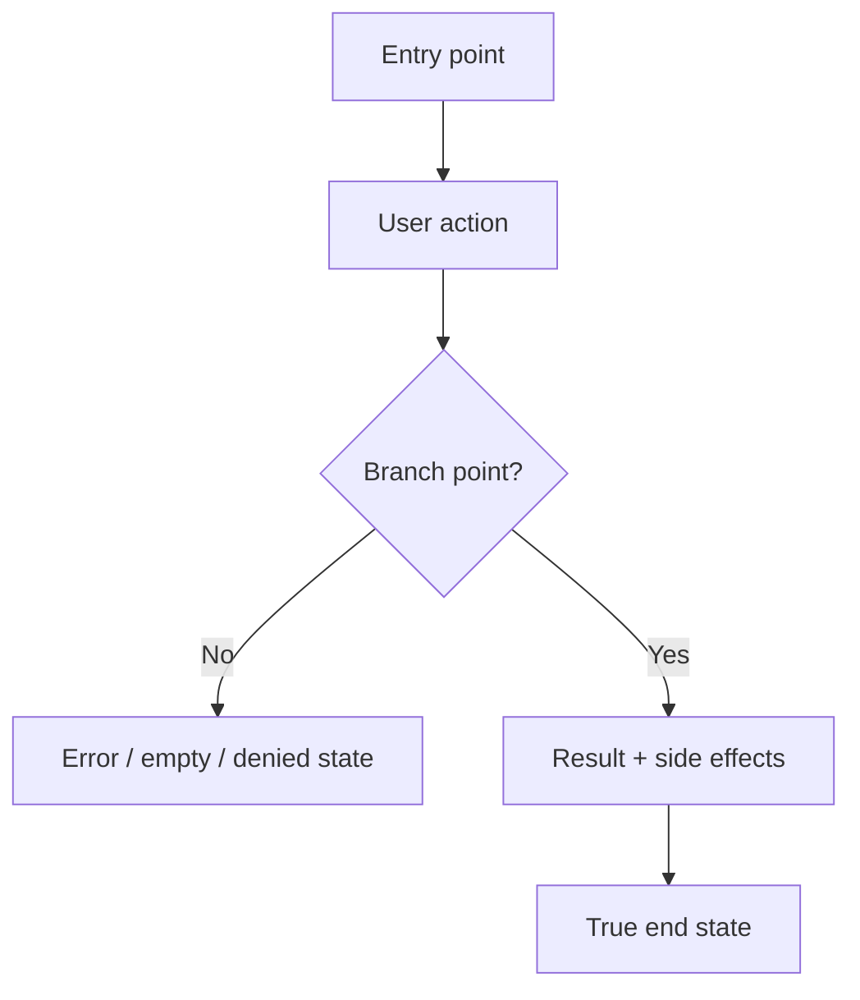

# Dogfood Report — <branch>

> Diff-scoped browser QA of `<branch>` vs the trunk. Generated by `ce-dogfood` on <YYYY-MM-DD>.

<!-- Use repo-relative paths throughout this doc, never absolute paths, so it stays portable. -->
<!-- This template is the source of truth for the report's sections; build the report to this shape rather than from memory. -->

## Diff Summary

<What changed between the branch and main: new features, modified behavior, new/changed routes, views, components, data flows. 2-6 bullets.>

## Personas

<The primary personas the flows were judged against, and what each cares about. Note the source: a Compound Pack rule cited as `(pack: <id>, <path within the pack>)`, STRATEGY.md or PRODUCT.md "Users" ("Who it's for" in older strategy files), VISION.md, a persona doc, or "inferred" if none existed. Resolver warnings or errors from pack discovery, and "packs unresolved" when the resolver could not run, are noted here once.>

- **<Persona name>** — <job-to-be-done / what they care about> — <source>

## Flows Tested

<One Mermaid flowchart per distinct user journey the diff touches. Include happy path and branch points (validation error, empty, permission-denied), side effects (emails, jobs, notifications), and the true end state — including click-through destinations.>

## Test Matrix & Results

| # | Flow | Journey / Scenario | Status | Issue | Fix | Commit |
|---|------|--------------------|--------|-------|-----|--------|
| 1 |      |                    | Pass   | -     | -   | -      |
| 2 |      |                    | Fixed  |       |     | abc123 |
| 3 |      |                    | Blocked (needs human verify) | | | |

Status values: `Pending`, `Pass`, `Fixed`, `Skipped`, `Blocked (needs human verify)`, `Blocked (human decision)`. Start every scenario at `Pending` so this table doubles as the resume checkpoint.

## Pack Compliance

<One line per pack criterion that matched a flow in Phase 1, with its verdict: `honored`, `contradicted` (fixed `<commit>`, or escalated as a stale-rule decision below), or `not exercised` (no scenario reached it). "None" when the repo declares no packs or none matched.>

- `(pack: <id>, <path within the pack>)` — <rule title> — <honored / contradicted (fixed `<commit>` or escalated) / not exercised> — <scenario #s>

## What Was Fixed

For each issue found and fixed:

### <Short issue title> — `<commit>`
- **Symptom:** <what the user saw / what failed in the browser>
- **Root cause:** <why it happened>
- **Fix:** <what changed, repo-relative file paths>
- **Regression test:** <test added that fails before / passes after — or, for a pure copy/visual fix, the browser-replay/screenshot check used and why no automated test was meaningful>

## Paper Cuts (by persona)

<Experiential friction found while walking each flow as each persona. A scenario can `Pass` functionally and still carry paper cuts. Note the persona, severity, and whether it was fixed (sharp ones, via the Phase 5 loop) or deferred. "None" if clean.>

- **<Persona>** — <paper cut> — <severity> — <fixed `<commit>` / deferred>

## Console Errors

<Any console or network errors observed, and whether they were resolved. "None" if clean.>

## Human Verifications

<External-interaction legs (OAuth, real email delivery, payments, SMS): confirmed, pending, or not applicable.>

## Decisions for a Human

<Issues too big or ambiguous to fix autonomously — architectural/schema changes, product/UX trade-offs, competing solutions. One block each. The matrix marks these `Blocked (human decision)`. "None" if every issue was safely auto-fixed.>

### <Short title>
- **What's broken:** <symptom / failing scenario>
- **Why escalated:** <why it's not a safe autonomous fix — scope, risk, ambiguity, product trade-off>
- **Options:** <option A (trade-offs) / option B (trade-offs)>
- **Recommendation:** <the agent's suggested direction, for the human to confirm>

### Stale rule: <rule title> `(pack: <id>, <path within the pack>)`
- **What the rule says:** <quoted rule text>
- **What the branch does instead, and why:** <the intended behavior and the evidence it is intentional — plan, PR description, commit history>
- **Options:** refine the rule (writable pack: through `ce-compound`; git-sourced pack: upstream change and a `ref` bump) / retire it
- **Recommendation:** <refine or retire, and the wording if refine>

## Learnings

<Reusable lessons worth carrying forward — patterns, gotchas, product/UX insights. Feed substantial ones to `ce-compound`.>

### Pack candidates

<Judgments from this run that generalize beyond the branch and are prescriptive-shaped — a paper cut any screen would give a persona, a check every scenario of this kind should pass — that were not yet routed through `ce-compound` (non-interactive run, or the author deferred). One line each, with the pack it would refine when there is one. "None" when every candidate was routed or none arose.>

## Final Status

<Overall readiness verdict for the branch. Ready to ship? Caveats? Outstanding blocked items? Record the result of the Phase 5 automated test suite run — a green matrix with a red suite is not "ready.">
